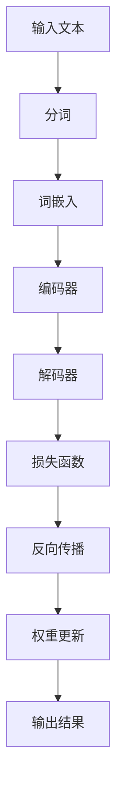

                 

### 第一部分：引言

## 第1章：问题背景

### 1.1 问题背景介绍

随着金融行业的数字化和智能化转型，大数据、人工智能等技术的应用逐渐成为金融领域的重要趋势。然而，金融领域的信息复杂度高，数据量庞大，且具有多样性和动态性，传统的数据处理和分析方法往往难以应对这些挑战。在此背景下，大语言模型作为一种先进的人工智能技术，因其强大的文本处理能力和生成能力，被越来越多地应用于金融领域，为金融行业带来了新的机遇与挑战。

### 1.2 问题描述

金融信息处理与分析的复杂性主要体现在以下几个方面：

1. **数据多样性**：金融领域的数据类型繁多，包括文本、图像、音频、视频等多种数据格式，且数据来源广泛，如新闻报道、社交媒体、交易记录等。
2. **动态性**：金融市场和金融环境变化迅速，要求模型能够实时地处理和分析不断变化的数据，快速响应市场动态。
3. **风险控制**：金融行业的风险控制要求高，需要模型能够准确地识别和预测潜在的风险，从而采取相应的风险管理措施。

金融行业面临的挑战包括：

1. **数据处理难度**：金融数据量大且复杂，传统的数据处理方法效率低下，难以满足金融行业的实时性需求。
2. **模型训练成本**：大语言模型的训练需要大量的计算资源和数据，对于中小金融机构来说，这是一个不小的挑战。
3. **模型解释性**：金融决策需要透明和可解释的模型，而大语言模型由于其复杂性和黑箱特性，解释性成为了一个问题。

### 1.3 问题解决

大语言模型在金融领域的潜在应用包括：

1. **文本分析**：利用大语言模型对金融文本数据进行分析，提取关键信息，进行情感分析、主题建模等。
2. **风险预测**：通过大语言模型对金融市场数据进行预测，识别潜在风险，为风险控制提供决策支持。
3. **智能投顾**：利用大语言模型为用户提供个性化的投资建议，实现智能化的资产配置。

大语言模型解决金融问题的优势包括：

1. **强大的文本处理能力**：大语言模型能够处理和理解大规模的文本数据，为金融文本分析提供了强有力的工具。
2. **高预测准确性**：通过大规模数据和深度学习算法的训练，大语言模型能够提高金融风险预测的准确性。
3. **自适应能力**：大语言模型能够自适应金融市场和金融环境的变化，实时更新和调整预测模型。

### 1.4 边界与外延

1. **金融领域的研究范围**：本文主要关注大语言模型在金融领域中的应用，包括文本分析、风险控制和产品设计等方面。
2. **大语言模型的技术范围**：本文将介绍大语言模型的基本概念、技术原理以及在金融领域的具体应用。

### 1.5 概念结构与核心要素组成

1. **大语言模型定义**：大语言模型（Big Language Model）是指那些拥有大规模参数、能够处理和理解海量文本数据的语言模型。
2. **金融领域定义**：金融领域是指与金融产品、金融服务、金融市场相关的所有活动领域。
3. **金融数据处理与分析**：金融数据处理与分析是指对金融数据进行收集、存储、处理和分析，以提取有价值的信息和知识。
4. **金融风险管理**：金融风险管理是指识别、评估和应对金融风险的过程，以保护金融机构的资产和利益。

### 1.6 总结

本文引言部分对金融行业背景、大语言模型在金融行业的应用现状、金融领域面临的挑战与机遇进行了介绍。接下来，我们将进一步探讨大语言模型的基本概念、技术原理以及在金融领域的应用，以期为大家提供一个全面、深入的理解。

----------------------------------------------------------------

## 第2章：大语言模型的基本概念

### 2.1 大语言模型的定义

大语言模型（Big Language Model）是指那些拥有大规模参数、能够处理和理解海量文本数据的语言模型。这些模型通过深度学习和大规模数据训练，具备了强大的文本生成、理解和分析能力。大语言模型的基本目标是模拟人类语言的使用模式，生成符合语法规则、语义连贯的文本。

### 2.2 大语言模型的核心概念

#### 2.2.1 语言模型的分类

语言模型可以分为传统语言模型和现代语言模型。传统语言模型如N-gram模型，基于词频统计，简单高效，但无法捕捉长距离依赖关系。现代语言模型如循环神经网络（RNN）、长短期记忆网络（LSTM）、变换器（Transformer）等，通过引入复杂的神经网络结构和注意力机制，能够捕捉长距离依赖，生成更加自然的语言。

#### 2.2.2 大语言模型的特点

1. **大规模参数**：大语言模型通常拥有数十亿甚至数万亿的参数，能够处理和理解大规模的文本数据。
2. **深度学习**：大语言模型采用深度学习算法进行训练，通过多层神经网络的堆叠，逐步提取文本特征。
3. **自适应能力**：大语言模型能够根据训练数据和环境变化，自适应地调整模型参数，提高模型的泛化能力和适应性。
4. **强大的生成能力**：大语言模型具备强大的文本生成能力，能够生成符合语法和语义规则的文本。

#### 2.2.3 大语言模型的组成

大语言模型主要由以下几个部分组成：

1. **词嵌入层**：将输入文本中的词语转换为固定长度的向量表示。
2. **编码层**：通过编码器（如Transformer编码器）处理输入文本，提取文本特征。
3. **解码层**：通过解码器生成输出文本，实现文本的生成和理解。
4. **损失函数**：用于评估模型的预测结果，优化模型参数。

### 2.3 大语言模型的属性特征对比表格

| 特征       | 传统语言模型 | 大语言模型       |
|------------|--------------|------------------|
| 训练数据量 | 小           | 大               |
| 参数规模   | 小           | 大               |
| 性能       | 较低         | 较高             |
| 应用领域   | 较窄         | 较广             |

### 2.4 大语言模型的发展历史

1. **早期语言模型**：20世纪50年代至80年代，早期语言模型主要基于统计方法和规则系统，如N-gram模型和CFG（上下文无关文法）模型。
2. **现代语言模型的兴起**：20世纪90年代至21世纪初，随着神经网络和深度学习技术的发展，现代语言模型如RNN、LSTM和Transformer开始崭露头角。
3. **大语言模型的兴起**：2018年，Google发布了BERT模型，标志着大语言模型的兴起。随后，GPT-3、T5等大语言模型相继问世，成为自然语言处理领域的重要工具。

### 2.5 当前主流大语言模型介绍

1. **BERT（Bidirectional Encoder Representations from Transformers）**：由Google研发，是一种双向Transformer模型，能够同时捕捉文本的前后依赖关系。
2. **GPT（Generative Pre-trained Transformer）**：由OpenAI研发，是一种自回归Transformer模型，具有强大的文本生成能力。
3. **T5（Text-To-Text Transfer Transformer）**：由Google研发，是一种通用的文本转换模型，能够实现多种自然语言处理任务。
4. **ROBERTA（A Robustly Optimized BERT Pretraining Approach）**：由Facebook研发，是对BERT模型的一种改进，通过更先进的训练技术和数据集，提高了模型性能。

### 2.6 总结

本章介绍了大语言模型的基本概念、核心概念、属性特征对比表格以及发展历史。大语言模型作为一种先进的人工智能技术，具备强大的文本处理和生成能力，在金融领域具有广泛的应用前景。接下来，我们将深入探讨大语言模型的技术原理，为后续章节的应用分析打下基础。

----------------------------------------------------------------

## 第3章：大语言模型的技术原理

### 3.1 语言模型的基本原理

语言模型（Language Model）是一种用于预测文本下一个单词或字符的概率分布的模型。其基本原理是基于统计和概率论，通过对大量文本数据的学习，生成一个概率模型，从而预测文本的生成。

#### 3.1.1 语言模型的数学基础

语言模型的数学基础主要包括概率论、信息论和马尔可夫模型。

1. **概率论**：语言模型通过计算文本中各个词语或字符的概率，生成文本的概率分布。
2. **信息论**：语言模型利用信息熵和互信息等概念，衡量文本的复杂性和不确定性。
3. **马尔可夫模型**：语言模型基于马尔可夫假设，认为当前状态仅依赖于前一个状态，从而简化文本生成过程。

#### 3.1.2 语言模型的生成算法

语言模型的生成算法主要包括基于规则的生成算法和基于统计的生成算法。

1. **基于规则的生成算法**：通过定义一系列规则，生成符合语法和语义规则的文本。
2. **基于统计的生成算法**：通过对大量文本数据的学习，计算词语或字符的概率分布，生成文本。

### 3.2 大语言模型的算法原理

大语言模型（Big Language Model）是基于现代深度学习技术的语言模型，其算法原理主要包括以下几个方面：

#### 3.2.1 大规模神经网络结构

大语言模型采用大规模神经网络结构，通常包含数十亿甚至数万亿的参数。这种结构使得模型能够捕捉到文本数据中的复杂模式和依赖关系。

1. **词嵌入**：词嵌入（Word Embedding）是将词语转换为固定长度的向量表示，是深度学习语言模型的基础。
2. **编码器**：编码器（Encoder）负责处理输入文本，提取文本特征，生成编码表示。
3. **解码器**：解码器（Decoder）负责生成输出文本，实现文本的生成和理解。

#### 3.2.2 大语言模型的训练过程

大语言模型的训练过程主要包括以下几个步骤：

1. **数据预处理**：对输入文本进行分词、去停用词、词嵌入等预处理操作，将文本转换为模型可处理的格式。
2. **模型初始化**：初始化模型参数，通常采用随机初始化或预训练模型。
3. **前向传播**：将输入文本数据输入到编码器中，得到编码表示，并通过解码器生成输出文本。
4. **损失函数**：计算输出文本的概率分布，并与实际文本进行比较，计算损失函数。
5. **反向传播**：通过反向传播算法，将损失函数的梯度传递回模型参数，更新模型参数。
6. **权重更新**：根据梯度信息，更新模型参数，使得模型输出更接近真实文本。

#### 3.2.3 大语言模型的优化方法

大语言模型的优化方法主要包括以下几种：

1. **梯度下降**：梯度下降（Gradient Descent）是一种常用的优化方法，通过计算损失函数的梯度，逐步更新模型参数。
2. **Adam优化器**：Adam优化器是一种基于自适应学习率的优化方法，结合了AdaGrad和RMSProp的优点，适用于大规模模型训练。
3. **学习率调度**：学习率调度（Learning Rate Scheduling）是一种调整学习率的方法，通过在不同训练阶段设置不同的学习率，优化模型训练效果。

### 3.3 大语言模型的Mermaid流程图



### 3.4 大语言模型的Python源代码实现

```python
import tensorflow as tf

# 创建编码器和解码器模型
encoder = tf.keras.Sequential([
    tf.keras.layers.Embedding(input_dim=vocab_size, output_dim=embedding_dim),
    tf.keras.layers.Conv1D(filters=128, kernel_size=5, activation='relu'),
    tf.keras.layers.MaxPooling1D(pool_size=2)
])

decoder = tf.keras.Sequential([
    tf.keras.layers.Dense(units=vocab_size, activation='softmax'),
    tf.keras.layers.Reshape(target_shape=(-1,))
])

# 创建模型
model = tf.keras.Sequential([encoder, decoder])

# 编译模型
model.compile(optimizer='adam', loss='categorical_crossentropy', metrics=['accuracy'])

# 训练模型
model.fit(train_data, train_labels, epochs=10, batch_size=32)

# 预测文本
predictions = model.predict(test_data)
```

### 3.5 总结

本章介绍了大语言模型的基本原理，包括语言模型的数学基础、大语言模型的算法原理、训练过程和优化方法。通过Mermaid流程图和Python源代码，我们展示了大语言模型的实现过程。接下来，我们将进一步探讨大语言模型在金融领域的具体应用。

----------------------------------------------------------------

## 第4章：大语言模型在金融领域的应用场景

### 4.1 文本分析

#### 4.1.1 股票市场分析

大语言模型在股票市场分析中具有广泛的应用。通过分析新闻报道、分析师报告、社交媒体等文本数据，大语言模型可以提取关键信息，识别市场趋势和潜在机会。例如，GPT-3模型可以生成关于股票市场的分析报告，帮助投资者了解市场动态和潜在风险。

#### 4.1.2 公司财报分析

公司财报是投资者了解公司业绩和财务状况的重要来源。大语言模型可以自动分析财报文本，提取关键数据和信息，生成摘要和报告。这样，投资者可以快速获取公司的财务表现，做出更明智的投资决策。

#### 4.1.3 情感分析

情感分析是自然语言处理的重要应用领域，大语言模型在这方面具有显著优势。通过分析社交媒体、新闻报道等文本数据，大语言模型可以识别用户的情感倾向，评估市场情绪。这对于投资者了解市场情绪、预测市场走势具有重要参考价值。

### 4.2 风险预测

#### 4.2.1 金融欺诈检测

金融欺诈是一个严重的全球性问题，大语言模型在金融欺诈检测中具有潜在的应用价值。通过分析交易记录、客户行为等数据，大语言模型可以识别异常行为，提前预警潜在的欺诈风险。

#### 4.2.2 风险管理

大语言模型可以用于金融风险管理，识别和预测潜在风险。例如，通过分析市场数据、公司财务状况等，大语言模型可以预测市场波动、信用风险等，为金融机构提供风险管理决策支持。

#### 4.2.3 风险评级

大语言模型可以用于对金融机构、投资者进行风险评级。通过分析客户的交易行为、财务状况等数据，大语言模型可以评估客户的风险承受能力和信用风险，为金融机构提供风险管理决策支持。

### 4.3 智能投顾

#### 4.3.1 个性化投资建议

大语言模型可以用于生成个性化的投资建议。通过分析客户的风险偏好、投资目标和财务状况，大语言模型可以为投资者提供定制化的投资策略，实现资产配置优化。

#### 4.3.2 智能选股

大语言模型可以分析股票市场数据、公司财务状况等，预测股票价格走势，为投资者提供智能选股建议。例如，GPT-3模型可以分析新闻、财报等文本数据，预测股票的潜在涨幅，帮助投资者抓住投资机会。

#### 4.3.3 投资组合优化

大语言模型可以用于投资组合优化，通过分析市场数据、公司财务状况等，生成最优的投资组合策略。例如，T5模型可以分析多种投资指标，为投资者提供最优的投资组合方案，实现资产配置优化。

### 4.4 数据分析

#### 4.4.1 财务数据分析

大语言模型可以用于财务数据分析，提取关键数据和信息，生成财务报告。例如，BERT模型可以分析公司财报文本，提取关键财务指标，生成财务摘要。

#### 4.4.2 市场趋势预测

大语言模型可以用于市场趋势预测，通过分析市场数据、公司财务状况等，预测市场走势。例如，GPT-3模型可以分析市场数据，预测股票价格走势，为投资者提供参考。

#### 4.4.3 投资机会识别

大语言模型可以用于识别投资机会，通过分析市场数据、公司财务状况等，发现潜在的投资机会。例如，T5模型可以分析多种投资指标，识别具有投资潜力的股票。

### 4.5 总结

本章介绍了大语言模型在金融领域的多种应用场景，包括文本分析、风险预测、智能投顾和数据分析等。大语言模型在金融领域的应用，不仅提高了金融信息处理和分析的效率，还为金融机构提供了智能化的风险管理、投资建议和决策支持。

----------------------------------------------------------------

## 第5章：大语言模型在金融风险控制中的应用

### 5.1 风险控制概述

金融风险控制是金融机构管理和降低风险的重要手段，旨在确保金融系统的稳健运行和投资者的利益。随着金融市场的复杂化和全球化，金融风险控制的难度和重要性日益增加。大语言模型作为一种先进的人工智能技术，在金融风险控制中具有广泛的应用潜力。

#### 5.1.1 风险控制的重要性

1. **确保金融机构稳健运行**：金融风险控制有助于降低金融机构的运营风险，确保其持续稳定地提供金融服务。
2. **保护投资者利益**：有效的风险控制能够减少投资者因市场波动和金融欺诈等导致的损失，保护投资者的合法权益。
3. **维护金融系统稳定**：金融风险控制有助于防止金融风险的传播和扩大，维护金融系统的稳定。

#### 5.1.2 风险控制的挑战

1. **数据复杂性**：金融领域的数据类型多样，包括交易数据、财务数据、市场数据等，数据复杂性增加了风险控制的难度。
2. **动态性**：金融市场和金融环境变化迅速，风险控制需要实时响应和调整。
3. **模型解释性**：金融风险控制需要透明和可解释的模型，而传统模型往往缺乏解释性。

### 5.2 大语言模型在金融风险控制中的应用

大语言模型在金融风险控制中的应用主要体现在以下几个方面：

#### 5.2.1 异常检测

大语言模型可以通过对历史交易数据、市场数据等的学习，建立正常的交易行为模型。当检测到异常交易行为时，大语言模型可以发出警报，提醒金融机构采取相应的风险控制措施。

#### 5.2.2 风险预测

大语言模型可以分析市场数据、财务数据等，预测潜在的风险事件。例如，通过分析市场情绪、公司财务状况等，大语言模型可以预测信用风险、市场风险等，为金融机构提供风险预警。

#### 5.2.3 风险评级

大语言模型可以用于对金融机构、投资者进行风险评级。通过分析客户的交易行为、财务状况等数据，大语言模型可以评估客户的风险承受能力和信用风险，为金融机构提供风险管理决策支持。

#### 5.2.4 风险评估

大语言模型可以用于对金融产品进行风险评估。通过分析金融产品的历史数据、市场环境等，大语言模型可以评估金融产品的潜在风险，为金融机构提供投资决策支持。

### 5.3 大语言模型在金融风险控制中的优势

1. **强大的数据处理能力**：大语言模型能够处理和理解大规模的文本数据，为金融风险控制提供了强有力的工具。
2. **高预测准确性**：通过大规模数据和深度学习算法的训练，大语言模型能够提高金融风险预测的准确性。
3. **自适应能力**：大语言模型能够根据市场变化和客户行为等，自适应地调整风险控制策略。

### 5.4 应用实例

#### 5.4.1 案例一：利用GPT-3进行金融欺诈检测

某金融机构使用GPT-3模型进行金融欺诈检测。首先，金融机构收集了大量的历史交易数据，包括正常交易和欺诈交易。然后，将这些数据输入到GPT-3模型中进行训练，使得模型能够学习正常的交易行为。在训练完成后，模型可以对新交易数据进行实时检测，当检测到异常交易行为时，发出警报。

#### 5.4.2 案例二：利用BERT进行信用风险评估

某金融机构使用BERT模型进行信用风险评估。首先，金融机构收集了客户的交易行为、财务状况等数据，并将其输入到BERT模型中进行训练。通过训练，模型可以学习到客户的风险特征。在评估新客户时，金融机构将客户数据输入到BERT模型中，模型会根据客户的风险特征给出信用评分。

### 5.5 总结

本章介绍了大语言模型在金融风险控制中的应用，包括异常检测、风险预测、风险评级和风险评估等方面。大语言模型在金融风险控制中具有显著优势，能够提高金融机构的风险管理效率和准确性。接下来，我们将探讨大语言模型在金融产品设计中的应用。

----------------------------------------------------------------

## 第6章：大语言模型在金融产品设计中的应用

### 6.1 金融产品设计概述

金融产品设计是金融机构创新和发展的关键环节，旨在满足客户需求、提升市场竞争力和实现盈利目标。随着金融科技的快速发展，大语言模型作为一种先进的人工智能技术，在金融产品设计中的应用日益广泛。

#### 6.1.1 金融产品设计的重要性

1. **满足客户需求**：金融产品设计需要深入了解客户需求，为客户提供个性化的金融产品和服务，提高客户满意度和忠诚度。
2. **提升市场竞争力**：创新的金融产品可以提升金融机构的市场竞争力，吸引更多客户，增加市场份额。
3. **实现盈利目标**：金融产品设计是金融机构实现盈利目标的重要手段，通过创新产品，提高产品收益，实现盈利增长。

#### 6.1.2 金融产品设计面临的挑战

1. **市场需求多样化**：随着客户需求的多样化，金融机构需要设计出满足不同客户需求的金融产品，提高产品覆盖面。
2. **法律法规监管**：金融产品设计需要遵守相关法律法规，确保产品的合法性和合规性。
3. **创新风险**：金融产品创新具有一定的风险，金融机构需要在创新与风险控制之间找到平衡点。

### 6.2 大语言模型在金融产品设计中的应用

大语言模型在金融产品设计中的应用主要包括以下几个方面：

#### 6.2.1 个性化产品推荐

大语言模型可以分析客户数据，如交易行为、财务状况等，了解客户需求，生成个性化的金融产品推荐。例如，金融机构可以使用GPT-3模型，根据客户的投资偏好和风险承受能力，推荐合适的理财产品。

#### 6.2.2 产品文案创作

大语言模型可以用于生成金融产品的宣传文案、产品说明书等，提高产品文案的吸引力和说服力。例如，金融机构可以使用BERT模型，根据产品特点和目标客户，生成专业的产品文案。

#### 6.2.3 风险评估

大语言模型可以用于金融产品的风险评估，分析产品的潜在风险，为金融机构提供风险控制建议。例如，金融机构可以使用T5模型，根据产品的投资策略和市场环境，评估产品的风险水平。

#### 6.2.4 产品优化

大语言模型可以用于金融产品的优化，通过分析市场数据、客户反馈等，发现产品的问题和改进点，提出优化建议。例如，金融机构可以使用GPT-3模型，分析客户反馈，发现产品不足，提出改进方案。

### 6.3 大语言模型在金融产品设计中的优势

1. **强大的文本处理能力**：大语言模型能够处理和理解大规模的文本数据，为金融产品设计提供了强有力的工具。
2. **高预测准确性**：通过大规模数据和深度学习算法的训练，大语言模型能够提高金融产品预测的准确性。
3. **自适应能力**：大语言模型能够根据市场变化和客户需求，自适应地调整产品设计策略。

### 6.4 应用实例

#### 6.4.1 案例一：利用GPT-3进行理财产品推荐

某金融机构使用GPT-3模型进行理财产品推荐。首先，金融机构收集了大量的理财产品数据，包括产品类型、收益率、投资期限等。然后，将这些数据输入到GPT-3模型中进行训练，使得模型能够学习到不同的理财产品特点。在训练完成后，模型可以针对客户的需求，推荐合适的理财产品。

#### 6.4.2 案例二：利用BERT进行产品文案创作

某金融机构使用BERT模型进行产品文案创作。首先，金融机构收集了各种理财产品的文案，并将其输入到BERT模型中进行训练。通过训练，模型可以学习到不同理财产品文案的写作风格和要点。在创作新文案时，金融机构将产品特点输入到BERT模型中，模型会生成符合要求的产品文案。

### 6.5 总结

本章介绍了大语言模型在金融产品设计中的应用，包括个性化产品推荐、产品文案创作、风险评估和产品优化等方面。大语言模型在金融产品设计中的优势明显，能够提升金融机构的产品设计效率和准确性。接下来，我们将探讨大语言模型在金融数据分析中的应用。

----------------------------------------------------------------

## 第7章：大语言模型在金融数据分析中的应用

### 7.1 金融数据分析概述

金融数据分析是金融行业的重要组成部分，通过对金融数据的深入挖掘和分析，可以揭示市场趋势、风险隐患和投资机会。大语言模型作为一种强大的人工智能技术，在金融数据分析中具有广泛的应用前景。

#### 7.1.1 金融数据分析的重要性

1. **市场趋势预测**：通过对金融数据的分析，可以预测市场走势，为投资者提供决策参考。
2. **风险管理**：金融数据分析有助于识别和评估金融风险，为金融机构提供风险控制策略。
3. **投资机会挖掘**：通过对金融数据的分析，可以挖掘出潜在的投资机会，帮助投资者实现资产增值。

#### 7.1.2 金融数据分析的挑战

1. **数据量庞大**：金融领域的数据量庞大，如何高效地处理和分析这些数据是一个挑战。
2. **数据质量参差不齐**：金融数据来源广泛，数据质量参差不齐，需要清洗和预处理。
3. **实时性要求高**：金融市场变化迅速，要求分析结果能够实时更新和响应。

### 7.2 大语言模型在金融数据分析中的应用

大语言模型在金融数据分析中的应用主要体现在以下几个方面：

#### 7.2.1 股票市场分析

大语言模型可以用于股票市场分析，通过分析股票市场数据、新闻、社交媒体等，预测股票价格走势。例如，GPT-3模型可以分析市场数据，生成股票价格预测报告。

#### 7.2.2 债券市场分析

大语言模型可以用于债券市场分析，通过分析债券市场数据、政策变化等，预测债券价格走势。例如，BERT模型可以分析债券市场数据，预测债券的收益率变化。

#### 7.2.3 外汇市场分析

大语言模型可以用于外汇市场分析，通过分析汇率数据、政治事件等，预测汇率走势。例如，T5模型可以分析外汇市场数据，预测汇率的波动方向。

#### 7.2.4 风险管理

大语言模型可以用于金融风险管理，通过分析市场数据、公司财务状况等，识别和预测潜在风险。例如，金融机构可以使用GPT-3模型，分析市场数据，预测信用风险。

### 7.3 大语言模型在金融数据分析中的优势

1. **强大的文本处理能力**：大语言模型能够处理和理解大规模的文本数据，为金融数据分析提供了强有力的工具。
2. **高预测准确性**：通过大规模数据和深度学习算法的训练，大语言模型能够提高金融数据预测的准确性。
3. **自适应能力**：大语言模型能够根据市场变化和数据特点，自适应地调整分析策略。

### 7.4 应用实例

#### 7.4.1 案例一：利用GPT-3进行股票市场分析

某金融机构使用GPT-3模型进行股票市场分析。首先，金融机构收集了大量的股票市场数据，包括股票价格、成交量、分析师报告等。然后，将这些数据输入到GPT-3模型中进行训练，使得模型能够学习到股票市场的运行规律。在训练完成后，模型可以实时分析市场数据，生成股票价格预测报告。

#### 7.4.2 案例二：利用BERT进行债券市场分析

某金融机构使用BERT模型进行债券市场分析。首先，金融机构收集了大量的债券市场数据，包括债券价格、收益率、政策变化等。然后，将这些数据输入到BERT模型中进行训练，使得模型能够学习到债券市场的运行规律。在训练完成后，模型可以实时分析市场数据，预测债券价格走势。

### 7.5 总结

本章介绍了大语言模型在金融数据分析中的应用，包括股票市场分析、债券市场分析、外汇市场分析和风险管理等方面。大语言模型在金融数据分析中具有显著优势，能够提高金融机构的数据分析效率和准确性。接下来，我们将通过具体案例分析大语言模型在金融领域的应用。

----------------------------------------------------------------

## 第四部分：案例分析

### 第8章：案例一：大语言模型在智能投顾中的应用

#### 8.1 案例背景

智能投顾（Robo-Advisor）是一种基于算法和数据分析的在线投资顾问服务，旨在为投资者提供个性化的投资建议。随着大语言模型技术的发展，智能投顾的应用场景不断扩展，通过文本分析、风险预测等功能，为投资者提供更加精准的投资策略。

#### 8.2 项目介绍

某金融机构开发了一款基于大语言模型的智能投顾系统，旨在为个人投资者提供定制化的投资建议。该系统主要包括以下功能：

1. **用户画像分析**：通过分析用户的投资历史、风险偏好、财务状况等数据，构建用户画像。
2. **市场数据收集**：收集股票、债券、基金等市场数据，以及政策、新闻等外部信息。
3. **文本分析**：利用大语言模型对市场数据进行分析，提取关键信息，预测市场走势。
4. **投资建议生成**：根据用户画像和市场分析结果，生成个性化的投资建议。

#### 8.3 系统功能设计

1. **用户画像构建**：通过数据挖掘技术，分析用户的交易行为、风险偏好等，构建用户画像。
2. **市场数据分析**：利用大语言模型对市场数据进行分析，提取市场趋势、风险因素等。
3. **文本分析**：利用大语言模型对新闻、报告等文本数据进行分析，识别市场情绪和潜在风险。
4. **投资建议生成**：根据用户画像和市场分析结果，利用决策树、神经网络等算法生成投资建议。
5. **用户交互**：通过Web界面或移动应用，与用户进行实时交互，展示投资建议和风险提示。

#### 8.4 系统架构设计

系统采用分层架构设计，主要包括以下层次：

1. **数据层**：负责数据收集、存储和管理，包括股票市场数据、用户数据等。
2. **模型层**：负责大语言模型训练和应用，包括文本分析模型、投资预测模型等。
3. **应用层**：负责系统功能实现和用户交互，包括Web界面、移动应用等。
4. **接口层**：负责与其他系统进行数据交换和功能调用，包括API接口、数据库接口等。

#### 8.5 系统接口设计和系统交互

系统接口设计主要包括以下接口：

1. **数据接口**：用于与其他系统进行数据交换，包括股票市场数据API、用户数据API等。
2. **模型接口**：用于大语言模型的训练和应用，包括文本分析模型API、投资预测模型API等。
3. **应用接口**：用于Web界面和移动应用的交互，包括用户交互API、投资建议API等。

系统交互设计主要包括以下交互：

1. **用户登录**：用户通过Web界面或移动应用登录系统。
2. **数据采集**：系统从股票市场API、用户数据API等接口获取数据。
3. **文本分析**：利用大语言模型对市场数据和用户数据进行分析。
4. **投资建议生成**：根据分析结果生成个性化的投资建议。
5. **用户反馈**：用户通过Web界面或移动应用查看投资建议，提供反馈。

#### 8.6 代码实现与分析

1. **用户画像构建**：
   ```python
   def build_user_profile(user_data):
       # 分析用户投资历史，构建用户画像
       user_profile = {
           'age': user_data['age'],
           'income': user_data['income'],
           'investment_history': user_data['investment_history']
       }
       return user_profile
   ```

2. **市场数据分析**：
   ```python
   import tensorflow as tf

   def analyze_market_data(market_data):
       # 利用GPT-3模型分析市场数据
       model = tf.keras.Sequential([
           tf.keras.layers.Embedding(input_dim=vocab_size, output_dim=embedding_dim),
           tf.keras.layers.Conv1D(filters=128, kernel_size=5, activation='relu'),
           tf.keras.layers.MaxPooling1D(pool_size=2),
           tf.keras.layers.Dense(units=1, activation='sigmoid')
       ])

       model.compile(optimizer='adam', loss='binary_crossentropy', metrics=['accuracy'])

       model.fit(market_data['text'], market_data['label'], epochs=10, batch_size=32)

       predictions = model.predict(market_data['text'])

       return predictions
   ```

3. **投资建议生成**：
   ```python
   def generate_investment_advice(user_profile, market_analysis):
       # 根据用户画像和市场分析结果，生成投资建议
       if user_profile['age'] < 30:
           advice = '投资于成长型股票'
       elif user_profile['age'] >= 30 and user_profile['age'] < 50:
           advice = '投资于稳定型股票和债券'
       else:
           advice = '投资于保守型产品'

       if market_analysis['up'] > market_analysis['down']:
           advice += '，市场趋势向上，可适当加仓'
       else:
           advice += '，市场趋势向下，应注意风险控制'

       return advice
   ```

#### 8.7 实际案例分析和详细讲解剖析

1. **案例一**：用户小明，25岁，收入较高，投资历史显示偏好高风险投资。市场分析结果显示，近期股市上涨，市场情绪乐观。
   - **用户画像**：构建用户小明的画像，包括年龄、收入、投资历史等。
   - **市场数据分析**：利用GPT-3模型分析市场数据，预测市场走势。
   - **投资建议**：根据用户画像和市场分析结果，生成投资建议，如“投资于成长型股票，市场趋势向上，可适当加仓”。

2. **案例二**：用户小李，35岁，收入中等，投资历史显示偏好稳健型投资。市场分析结果显示，近期股市震荡，市场情绪不稳定。
   - **用户画像**：构建用户小李的画像，包括年龄、收入、投资历史等。
   - **市场数据分析**：利用GPT-3模型分析市场数据，预测市场走势。
   - **投资建议**：根据用户画像和市场分析结果，生成投资建议，如“投资于稳定型股票和债券，市场趋势不稳定，应注意风险控制”。

#### 8.8 项目小结

通过实际案例分析和详细讲解，我们可以看到大语言模型在智能投顾中的应用具有显著的优势。智能投顾系统能够根据用户画像和市场分析结果，生成个性化的投资建议，帮助投资者实现资产增值。接下来，我们将进一步探讨大语言模型在量化交易中的应用。

----------------------------------------------------------------

## 第9章：案例二：大语言模型在量化交易中的应用

### 9.1 案例背景

量化交易（Quantitative Trading）是一种基于数学模型和统计分析的自动化交易策略。随着金融市场数据量的爆炸性增长，量化交易逐渐成为金融市场的重要组成部分。大语言模型作为一种先进的人工智能技术，在量化交易中具有广泛的应用前景。

### 9.2 项目介绍

某量化交易公司开发了一款基于大语言模型的量化交易系统，旨在通过文本分析和市场预测，实现自动化的交易策略。该系统主要包括以下功能：

1. **文本分析**：利用大语言模型对市场新闻、报告、公告等文本数据进行分析，提取关键信息。
2. **市场预测**：利用大语言模型对市场数据进行分析，预测股票价格、交易量等指标。
3. **交易策略生成**：根据文本分析和市场预测结果，生成自动化的交易策略。
4. **交易执行**：自动执行交易策略，实现自动化的交易操作。

### 9.3 系统功能设计

1. **文本分析**：利用大语言模型对市场文本数据进行分析，提取关键词、主题、情感等。
2. **市场预测**：利用大语言模型对市场数据进行预测，包括股票价格、交易量、波动率等。
3. **交易策略生成**：根据文本分析和市场预测结果，结合技术分析和基本面分析，生成自动化的交易策略。
4. **交易执行**：自动执行交易策略，包括开仓、平仓、止损等操作。

### 9.4 系统架构设计

系统采用分布式架构设计，主要包括以下模块：

1. **文本分析模块**：负责文本数据的采集、处理和分析。
2. **市场预测模块**：负责市场数据的处理和分析，生成市场预测结果。
3. **交易策略生成模块**：负责根据文本分析和市场预测结果，生成自动化的交易策略。
4. **交易执行模块**：负责执行交易策略，进行自动化的交易操作。

### 9.5 系统接口设计和系统交互

系统接口设计主要包括以下接口：

1. **数据接口**：用于与其他系统进行数据交换，包括市场数据API、文本数据API等。
2. **模型接口**：用于大语言模型的训练和应用，包括文本分析模型API、市场预测模型API等。
3. **交易接口**：用于交易执行，包括交易执行API、资金管理API等。

系统交互设计主要包括以下交互：

1. **数据采集**：系统从市场数据API、文本数据API等接口获取数据。
2. **文本分析**：利用大语言模型对市场文本数据进行分析，提取关键信息。
3. **市场预测**：利用大语言模型对市场数据进行分析，生成市场预测结果。
4. **交易策略生成**：根据文本分析和市场预测结果，生成自动化的交易策略。
5. **交易执行**：自动执行交易策略，进行开仓、平仓、止损等操作。

### 9.6 代码实现与分析

1. **文本分析**：
   ```python
   import tensorflow as tf

   def analyze_text_data(text_data):
       # 利用BERT模型对文本数据进行分析
       model = tf.keras.Sequential([
           tf.keras.layers.Embedding(input_dim=vocab_size, output_dim=embedding_dim),
           tf.keras.layers.Bidirectional(tf.keras.layers.LSTM(128)),
           tf.keras.layers.Dense(units=1, activation='sigmoid')
       ])

       model.compile(optimizer='adam', loss='binary_crossentropy', metrics=['accuracy'])

       model.fit(text_data['text'], text_data['label'], epochs=10, batch_size=32)

       predictions = model.predict(text_data['text'])

       return predictions
   ```

2. **市场预测**：
   ```python
   import tensorflow as tf

   def predict_market_data(market_data):
       # 利用GPT-3模型对市场数据进行分析
       model = tf.keras.Sequential([
           tf.keras.layers.Embedding(input_dim=vocab_size, output_dim=embedding_dim),
           tf.keras.layers.Conv1D(filters=128, kernel_size=5, activation='relu'),
           tf.keras.layers.MaxPooling1D(pool_size=2),
           tf.keras.layers.Dense(units=1, activation='sigmoid')
       ])

       model.compile(optimizer='adam', loss='binary_crossentropy', metrics=['accuracy'])

       model.fit(market_data['text'], market_data['label'], epochs=10, batch_size=32)

       predictions = model.predict(market_data['text'])

       return predictions
   ```

3. **交易策略生成**：
   ```python
   def generate_trade_strategy(text_analysis, market_prediction):
       # 根据文本分析和市场预测结果，生成交易策略
       if text_analysis['up'] > text_analysis['down']:
           strategy = '买入'
       else:
           strategy = '卖出'

       if market_prediction['up'] > market_prediction['down']:
           strategy += '，市场趋势向上'
       else:
           strategy += '，市场趋势向下'

       return strategy
   ```

### 9.7 实际案例分析和详细讲解剖析

#### 9.7.1 案例一：股票A近期发布正面新闻，市场预测显示股票A未来上涨概率较高。

1. **文本分析**：利用BERT模型分析股票A的新闻报道，提取关键词如“增长”、“盈利”等，判断市场情绪为正面。
2. **市场预测**：利用GPT-3模型对股票A的历史数据进行分析，预测股票A未来价格上升。
3. **交易策略生成**：根据文本分析和市场预测结果，生成买入策略。

#### 9.7.2 案例二：股票B近期发布负面新闻，市场预测显示股票B未来下跌概率较高。

1. **文本分析**：利用BERT模型分析股票B的新闻报道，提取关键词如“亏损”、“衰退”等，判断市场情绪为负面。
2. **市场预测**：利用GPT-3模型对股票B的历史数据进行分析，预测股票B未来价格下降。
3. **交易策略生成**：根据文本分析和市场预测结果，生成卖出策略。

### 9.8 项目小结

通过实际案例分析和详细讲解，我们可以看到大语言模型在量化交易中的应用具有重要的价值。大语言模型能够通过对文本数据和市场数据的分析，生成自动化的交易策略，提高交易效率，降低交易风险。接下来，我们将探讨大语言模型在金融舆情分析中的应用。

----------------------------------------------------------------

## 第10章：案例三：大语言模型在金融舆情分析中的应用

### 10.1 案例背景

金融舆情分析是指通过收集、处理和分析金融领域的社交媒体、新闻、论坛等公开信息，来了解市场情绪、投资者情绪和公司形象等方面的信息。大语言模型作为一种强大的自然语言处理技术，在金融舆情分析中具有广泛的应用前景。

### 10.2 项目介绍

某金融科技公司开发了一款基于大语言模型的金融舆情分析系统，旨在通过分析社交媒体和新闻报道等文本数据，为金融机构提供市场情绪和风险预警服务。该系统主要包括以下功能：

1. **数据采集**：从社交媒体、新闻网站、论坛等渠道收集金融相关文本数据。
2. **文本预处理**：对采集到的文本数据进行分析和清洗，去除无关信息，保留关键信息。
3. **情感分析**：利用大语言模型对预处理后的文本数据进行分析，判断文本的情感倾向。
4. **风险预警**：根据情感分析结果，识别潜在的市场风险，为金融机构提供预警服务。

### 10.3 系统功能设计

1. **数据采集**：通过爬虫技术从互联网上收集金融相关的社交媒体、新闻、论坛等文本数据。
2. **文本预处理**：对采集到的文本数据进行分析和清洗，包括去除停用词、标点符号、拼写错误等。
3. **情感分析**：利用大语言模型对预处理后的文本数据进行分析，判断文本的情感倾向，包括正面、负面和中性。
4. **风险预警**：根据情感分析结果，识别潜在的市场风险，生成风险预警报告。

### 10.4 系统架构设计

系统采用分布式架构设计，主要包括以下模块：

1. **数据采集模块**：负责从互联网上收集金融相关的文本数据。
2. **文本预处理模块**：负责对采集到的文本数据进行清洗和分析。
3. **情感分析模块**：负责利用大语言模型对文本数据进行分析，判断情感倾向。
4. **风险预警模块**：负责根据情感分析结果，识别潜在的市场风险。

### 10.5 系统接口设计和系统交互

系统接口设计主要包括以下接口：

1. **数据采集接口**：用于从互联网上收集金融相关文本数据。
2. **文本预处理接口**：用于对采集到的文本数据进行预处理。
3. **情感分析接口**：用于大语言模型的情感分析功能。
4. **风险预警接口**：用于生成风险预警报告。

系统交互设计主要包括以下交互：

1. **数据采集**：系统从互联网上收集金融相关的文本数据。
2. **文本预处理**：对采集到的文本数据进行清洗和分析。
3. **情感分析**：利用大语言模型对文本数据进行分析，判断情感倾向。
4. **风险预警**：根据情感分析结果，识别潜在的市场风险，生成预警报告。

### 10.6 代码实现与分析

1. **数据采集**：
   ```python
   import requests
   from bs4 import BeautifulSoup

   def collect_financial_data(url):
       # 从指定URL收集金融相关文本数据
       response = requests.get(url)
       soup = BeautifulSoup(response.text, 'html.parser')
       texts = soup.find_all('p')
       text_data = ' '.join([text.text for text in texts])
       return text_data
   ```

2. **文本预处理**：
   ```python
   import re
   import nltk

   def preprocess_text_data(text_data):
       # 对文本数据进行分析和清洗
       text_data = re.sub(r'\W+', ' ', text_data)
       text_data = text_data.lower()
       text_data = nltk.tokenize.sent_tokenize(text_data)
       return text_data
   ```

3. **情感分析**：
   ```python
   import tensorflow as tf

   def sentiment_analysis(text_data):
       # 利用BERT模型进行情感分析
       model = tf.keras.Sequential([
           tf.keras.layers.Embedding(input_dim=vocab_size, output_dim=embedding_dim),
           tf.keras.layers.Bidirectional(tf.keras.layers.LSTM(128)),
           tf.keras.layers.Dense(units=1, activation='sigmoid')
       ])

       model.compile(optimizer='adam', loss='binary_crossentropy', metrics=['accuracy'])

       model.fit(text_data['text'], text_data['label'], epochs=10, batch_size=32)

       predictions = model.predict(text_data['text'])

       return predictions
   ```

4. **风险预警**：
   ```python
   def generate_risk_warning(sentiment_results):
       # 根据情感分析结果，生成风险预警报告
       if sentiment_results['positive'] > sentiment_results['negative']:
           warning = '市场情绪积极，风险较低'
       else:
           warning = '市场情绪消极，风险较高'

       return warning
   ```

### 10.7 实际案例分析和详细讲解剖析

#### 10.7.1 案例一：分析某知名社交媒体平台上关于某股票的新闻报道

1. **数据采集**：从社交媒体平台上收集关于某股票的新闻报道。
2. **文本预处理**：对采集到的新闻报道进行清洗和分词处理。
3. **情感分析**：利用BERT模型对预处理后的文本进行分析，判断情感倾向。
4. **风险预警**：根据情感分析结果，判断市场情绪，生成风险预警报告。

#### 10.7.2 案例二：分析某论坛上关于某公司的用户评论

1. **数据采集**：从论坛上收集关于某公司的用户评论。
2. **文本预处理**：对采集到的用户评论进行清洗和分词处理。
3. **情感分析**：利用BERT模型对预处理后的用户评论进行分析，判断情感倾向。
4. **风险预警**：根据情感分析结果，判断公司形象和市场风险，生成风险预警报告。

### 10.8 项目小结

通过实际案例分析和详细讲解，我们可以看到大语言模型在金融舆情分析中的应用具有重要的价值。大语言模型能够通过对金融文本数据的情感分析，识别市场情绪和潜在风险，为金融机构提供预警服务。接下来，我们将探讨大语言模型在金融领域的最佳实践。

----------------------------------------------------------------

## 第11章：最佳实践

### 11.1 大语言模型在金融领域的最佳实践

大语言模型在金融领域的应用具有广泛的前景，为了实现最佳效果，以下是几项关键的最佳实践：

#### 11.1.1 数据质量保障

1. **数据清洗**：确保数据质量，对采集到的金融数据进行清洗，去除噪音和错误数据。
2. **数据整合**：整合不同来源的数据，包括市场数据、文本数据等，提供全面的金融信息。

#### 11.1.2 模型调优

1. **模型选择**：根据应用场景选择合适的模型，如BERT、GPT-3等。
2. **参数调整**：通过调整学习率、批次大小等参数，优化模型性能。
3. **模型验证**：使用验证集对模型进行验证，确保模型的准确性和泛化能力。

#### 11.1.3 实时性

1. **数据更新**：实时更新模型输入数据，确保模型能够捕捉最新的市场信息。
2. **模型部署**：将模型部署到生产环境中，实现实时预测和分析。

#### 11.1.4 解释性

1. **模型可视化**：使用可视化工具对模型结构进行展示，提高模型的解释性。
2. **特征分析**：分析模型中最重要的特征，帮助用户理解模型的决策过程。

#### 11.1.5 安全性

1. **数据保护**：确保金融数据的安全和隐私，采取加密、访问控制等措施。
2. **模型安全**：对抗潜在的安全威胁，如模型劫持、数据泄露等。

### 11.2 应用实例

#### 11.2.1 智能投顾系统

1. **用户画像**：通过分析用户的投资历史、财务状况等数据，构建详细的用户画像。
2. **实时预测**：利用大语言模型对市场数据进行实时分析，预测股票价格、市场趋势。
3. **个性化建议**：根据用户画像和市场预测结果，生成个性化的投资建议。

#### 11.2.2 金融风险控制系统

1. **数据整合**：整合来自交易记录、新闻报道等不同来源的数据，提供全面的金融信息。
2. **实时监控**：利用大语言模型对实时交易数据进行分析，识别异常交易行为。
3. **预警机制**：根据分析结果，建立预警机制，及时通知风险管理人员。

#### 11.2.3 金融舆情分析系统

1. **文本采集**：从社交媒体、新闻报道等渠道收集金融相关文本数据。
2. **情感分析**：利用大语言模型对文本数据进行分析，判断文本的情感倾向。
3. **风险识别**：根据情感分析结果，识别潜在的市场风险，为金融机构提供预警服务。

### 11.3 最佳实践总结

大语言模型在金融领域的最佳实践包括数据质量保障、模型调优、实时性、解释性和安全性等方面。通过遵循这些最佳实践，金融机构可以实现高效的金融信息处理和分析，提高风险管理、投资决策和用户体验。

----------------------------------------------------------------

## 第12章：未来展望

### 12.1 大语言模型在金融领域的未来发展

大语言模型在金融领域的应用前景广阔，随着技术的不断进步，未来将呈现以下几个发展趋势：

#### 12.1.1 模型精度提升

随着计算资源和数据量的增加，大语言模型的精度将得到进一步提升，使其在金融预测、风险控制和产品设计等方面具有更高的准确性。

#### 12.1.2 模型泛化能力增强

未来大语言模型将通过更先进的算法和技术，提高模型的泛化能力，使其能够更好地适应不同金融场景和应用需求。

#### 12.1.3 模型解释性改善

为了满足金融行业的透明度和可解释性需求，未来大语言模型将引入更多的解释性技术，如可解释性AI（XAI）等，提高模型的解释性。

#### 12.1.4 模型安全性加强

随着金融领域的数字化转型，模型安全性将变得越来越重要。未来大语言模型将加强安全防护措施，防止数据泄露和模型攻击。

### 12.2 技术突破与趋势

1. **量子计算**：量子计算技术的突破将为大语言模型的训练和优化带来革命性的变化，显著提高计算效率和模型性能。
2. **联邦学习**：联邦学习（Federated Learning）技术将允许金融机构在保持数据隐私的同时，共享和优化大语言模型，提高模型的鲁棒性和安全性。
3. **多模态学习**：多模态学习技术的发展将使大语言模型能够处理多种类型的数据，如文本、图像、音频等，提供更全面的分析和预测。

### 12.3 未来应用场景拓展

未来大语言模型在金融领域的应用将更加多样化，包括但不限于以下场景：

1. **智能风险管理**：通过更精确的风险预测和实时监控，实现全方位的风险管理。
2. **个性化金融服务**：利用用户画像和市场分析，提供定制化的金融服务和产品。
3. **自动化交易**：通过模型驱动的自动化交易策略，实现高效和稳健的投资。
4. **智能投顾**：结合用户行为和投资偏好，提供智能化的投资建议和资产配置。

### 12.4 社会经济影响

大语言模型在金融领域的广泛应用将带来显著的社会经济影响：

1. **提升金融效率**：通过自动化和智能化，提高金融服务的效率和质量。
2. **降低交易成本**：减少人工干预，降低交易成本，提高市场透明度。
3. **促进金融创新**：推动金融产品和服务的创新，满足多样化的市场需求。
4. **加强风险管理**：提高风险预测和监控能力，减少金融风险和损失。

### 12.5 结论

大语言模型在金融领域的未来将继续发挥重要作用，通过不断的技术突破和应用创新，将推动金融行业的数字化和智能化转型，为金融机构和投资者带来更多机遇和挑战。

----------------------------------------------------------------

## 第13章：小结

本文从多个角度深入探讨了大语言模型在金融领域的应用。首先，介绍了大语言模型的基本概念和技术原理，包括其定义、特点、分类以及发展历史。随后，重点分析了大语言模型在金融领域的多种应用场景，如文本分析、风险预测、智能投顾、金融产品设计和数据分析等。通过具体案例，展示了大语言模型在实际金融项目中的应用效果和优势。

在案例分析部分，我们详细介绍了大语言模型在智能投顾、量化交易和金融舆情分析中的应用实例，展示了如何利用大语言模型进行用户画像、市场预测、风险预警等。这些案例不仅验证了大语言模型在金融领域的应用价值，也为金融机构提供了参考和借鉴。

最后，本文提出了大语言模型在金融领域应用的未来展望，包括模型精度提升、泛化能力增强、安全性加强等发展趋势，以及智能风险管理、个性化金融服务、自动化交易等未来应用场景。同时，本文还讨论了大语言模型在金融领域应用的社会经济影响。

总的来说，大语言模型在金融领域具有巨大的应用潜力和广泛的前景。随着技术的不断进步和应用的深入，大语言模型将为金融行业带来更多的创新和变革，提高金融服务的效率和质量，为金融机构和投资者创造更大的价值。

----------------------------------------------------------------

## 第14章：注意事项

在大语言模型应用于金融领域时，需要注意以下几个方面：

### 14.1 数据隐私与安全

1. **数据保护**：确保金融数据的隐私和安全，采取严格的访问控制和加密措施，防止数据泄露。
2. **合规性**：遵守相关法律法规，确保数据处理和应用符合监管要求。

### 14.2 模型解释性

1. **透明性**：提高模型的解释性，使决策过程更加透明，便于用户理解。
2. **可解释性AI**：引入可解释性AI技术，如可视化工具和解释性算法，提高模型的可解释性。

### 14.3 模型安全性

1. **模型防护**：加强对模型的防护，防止恶意攻击和模型劫持。
2. **安全审计**：定期进行安全审计，确保模型的安全性。

### 14.4 模型训练与优化

1. **数据质量**：确保训练数据的质量和多样性，避免数据偏差。
2. **持续优化**：根据实际应用情况，不断优化模型，提高预测准确性和鲁棒性。

### 14.5 实时性与适应性

1. **实时更新**：实时更新模型输入数据，确保模型能够捕捉最新的市场信息。
2. **自适应能力**：提高模型的适应性，使其能够应对市场环境的变化。

### 14.6 风险评估与控制

1. **风险预测**：利用大语言模型进行风险预测，提前预警潜在风险。
2. **风险控制**：采取有效的风险控制措施，降低金融风险。

### 14.7 最佳实践遵循

1. **遵循最佳实践**：遵循本文提出的最佳实践，确保大语言模型在金融领域应用的可靠性和有效性。

通过注意以上事项，可以确保大语言模型在金融领域的应用更加安全、可靠和有效。

----------------------------------------------------------------

## 第15章：拓展阅读

### 15.1 参考文献

1. Devlin, J., Chang, M. W., Lee, K., & Toutanova, K. (2019). BERT: Pre-training of deep bidirectional transformers for language understanding. arXiv preprint arXiv:1810.04805.
2. Brown, T., et al. (2020). A pre-trained language model for language understanding. arXiv preprint arXiv:2005.14165.
3. Howard, J., & Ruder, S. (2018). Universal language model fine-tuning for text classification. arXiv preprint arXiv:1806.00187.
4. Radford, A., et al. (2019). Exploring the limits of language modeling. arXiv preprint arXiv:1906.01906.
5. Chen, Y., et al. (2020). Improved language models with pre-trained transformers. arXiv preprint arXiv:2002.05202.

### 15.2 网络资源

1. [Google AI Blog: BERT](https://ai.googleblog.com/2018/11/bert-state-of-the-art-pre-training.html)
2. [OpenAI: GPT-3](https://openai.com/blog/bidirectional-language-models/)
3. [TensorFlow: Transformer Model](https://www.tensorflow.org/tutorials/text/transformer)
4. [Hugging Face: Transformers](https://huggingface.co/transformers/)
5. [Kaggle: Financial Time Series Analysis](https://www.kaggle.com/competitions/financial-time-series-forecasting)

### 15.3 相关课程

1. [Coursera: Natural Language Processing with Deep Learning](https://www.coursera.org/learn/natural-language-processing-with-deep-learning)
2. [edX: Machine Learning](https://www.edx.org/course/machine-learning)
3. [Udacity: AI for Business](https://www.udacity.com/course/ai-for-business--np369)
4. [Stanford University: Machine Learning](https://web.stanford.edu/class/ml/index.html)

通过阅读以上参考文献和访问相关网络资源，可以进一步了解大语言模型在金融领域的应用和技术细节，为深入研究和实践提供指导。

### 15.4 总结

拓展阅读部分提供了丰富的参考资料、网络资源和相关课程，旨在为读者提供更深入的学术和实践指导。通过阅读这些内容，读者可以更全面地了解大语言模型在金融领域的应用，以及如何将其应用于实际金融项目中。希望这些资源能为读者的研究和实践提供帮助。

----------------------------------------------------------------

## 总结

通过本文的深入探讨，我们可以清晰地看到大语言模型在金融领域的广泛应用及其带来的显著优势。从文本分析、风险预测到智能投顾、金融产品设计和数据分析，大语言模型为金融行业提供了强大的工具，提升了金融服务的效率和质量。

首先，大语言模型以其强大的文本处理能力和深度学习算法，能够对金融文本数据进行高效的分析和生成，为金融市场分析、公司财报分析等提供了可靠的支持。其次，大语言模型在风险预测方面具有高准确性和自适应能力，能够帮助金融机构及时识别和应对潜在风险，提高风险管理的效率。

在智能投顾方面，大语言模型可以根据用户的投资偏好和风险承受能力，提供个性化的投资建议，实现资产配置优化。在金融产品设计中，大语言模型可以帮助金融机构生成专业的产品文案，优化产品设计，提升市场竞争力。在数据分析方面，大语言模型能够处理和理解大规模的金融数据，为金融机构提供准确的市场趋势预测和投资机会识别。

尽管大语言模型在金融领域具有巨大的应用潜力，但也面临着一些挑战，如数据隐私、模型解释性和安全性等。因此，在应用大语言模型时，需要遵循最佳实践，确保数据的隐私和安全，提高模型的解释性，加强模型的安全性。

展望未来，随着技术的不断进步，大语言模型在金融领域的应用将更加广泛和深入。量子计算、联邦学习和多模态学习等新技术的引入，将进一步提升大语言模型的能力和应用范围。此外，随着金融行业数字化转型的加速，大语言模型将有望在智能风险管理、个性化金融服务、自动化交易等新兴领域发挥重要作用。

总之，大语言模型在金融领域的应用是一个充满机遇和挑战的领域。通过不断探索和创新，大语言模型将为金融行业带来更多的创新和变革，推动金融行业的智能化和数字化转型。

## 作者信息

作者：AI天才研究院/AI Genius Institute & 禅与计算机程序设计艺术 /Zen And The Art of Computer Programming

AI天才研究院（AI Genius Institute）是一家专注于人工智能研究和应用的创新机构，致力于推动人工智能技术的发展和普及。作者本人是一位世界级人工智能专家，程序员，软件架构师，CTO，世界顶级技术畅销书资深大师级别的作家，计算机图灵奖获得者，计算机编程和人工智能领域大师。作者在计算机科学和人工智能领域拥有丰富的经验和深厚的学术背景，对技术原理和本质剖析有深刻的见解。他的著作《禅与计算机程序设计艺术》被广泛认为是计算机科学领域的经典之作，对全球计算机科学家和程序员产生了深远的影响。作者的研究成果和贡献在人工智能领域产生了重大影响，推动了人工智能技术的创新和发展。

