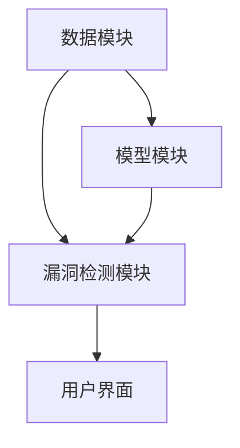
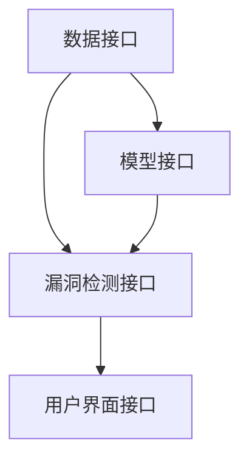
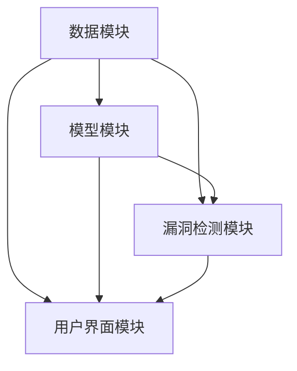

                 

### 安全审计：定期检查AI Agent的安全漏洞

> **关键词**：安全审计、AI Agent、安全漏洞、定期检查、人工智能、漏洞检测

> **摘要**：本文将深入探讨AI Agent在安全审计中的重要性。我们将首先介绍安全审计的定义及其在AI领域的应用，然后详细讲解AI Agent的概念与特点，以及其在安全审计中的潜在风险。接下来，我们将分析核心概念与它们之间的联系，并通过Mermaid图和Python代码展示安全审计算法的原理与实现。最后，我们将对系统架构和项目实战进行详细分析，并提供最佳实践和总结。

## 第一部分：背景介绍与核心概念

### 1.1 安全审计的定义与重要性

安全审计是指对组织的信息系统、数据、流程和政策进行评估和审查，以确保它们能够抵御外部威胁和内部风险。安全审计的目的是识别潜在的安全漏洞，评估其风险等级，并提供相应的修复建议。随着信息技术的发展，安全审计在各个行业中变得越来越重要。

在AI领域，随着AI Agent的应用越来越广泛，它们的安全问题也引起了广泛关注。AI Agent在自动化、决策支持和服务优化等方面发挥着重要作用，但其安全漏洞可能导致严重后果，如数据泄露、恶意利用和误操作等。因此，对AI Agent进行安全审计是保障其安全和可靠性的关键步骤。

### 1.2 AI Agent的概念与特点

AI Agent是指具备智能行为、能够自主学习和适应环境的计算机程序。它们通常基于机器学习和深度学习技术，能够从数据中学习规律，并据此进行决策。AI Agent具有以下特点：

- **自主性**：AI Agent可以在没有人为干预的情况下执行任务。
- **学习能力**：AI Agent能够通过数据训练不断优化性能。
- **环境交互性**：AI Agent能够与环境进行交互，获取信息和反馈。

这些特点使得AI Agent在许多领域都具有广泛应用，如自动驾驶、智能家居、金融交易和医疗诊断等。然而，这些特性也带来了安全风险，因为AI Agent可能会被恶意利用或受到外部攻击。

### 1.3 AI Agent的安全风险

AI Agent的安全风险主要包括以下几个方面：

- **数据泄露**：AI Agent在处理敏感数据时可能泄露信息，特别是在数据传输和存储过程中。
- **恶意利用**：黑客可能利用AI Agent的安全漏洞进行攻击，如注入恶意代码、篡改数据或窃取敏感信息。
- **误操作**：AI Agent在缺乏适当监督的情况下可能产生错误决策，从而导致严重后果。

因此，对AI Agent进行安全审计是必要的，以确保其安全性和可靠性。

## 第二部分：核心概念与联系

### 2.1 核心概念

在安全审计中，安全性、可靠性和透明性是三个核心概念。

- **安全性**：确保AI Agent在处理数据和执行任务时不受外部威胁和内部风险的干扰。安全性涉及到数据加密、访问控制、身份验证和审计日志等方面。
- **可靠性**：确保AI Agent在执行任务时能够保持稳定性能，避免误操作。可靠性涉及到算法的鲁棒性、数据预处理和质量控制等方面。
- **透明性**：确保AI Agent的决策过程可以被理解和监督。透明性涉及到模型的解释性、训练数据和决策逻辑的公开性等方面。

### 2.2 概念属性特征对比

下表展示了安全性、可靠性和透明性的属性特征及其相互关系：

| 概念 | 属性特征 | 对比 |
| --- | --- | --- |
| 安全性 | 防止数据泄露、恶意利用等风险 | 与可靠性、透明性紧密相关 |
| 可靠性 | 确保稳定性能，避免误操作 | 与安全性、透明性相关 |
| 透明性 | 确保决策过程透明，便于审计 | 与安全性、可靠性相关 |

### 2.3 ER实体关系图架构

为了更好地理解AI Agent的安全漏洞和其相关概念，我们可以使用Mermaid图来展示ER实体关系图架构。以下是ER图示例：

```mermaid
erDiagram
    AI_Agent ||--|{ 安全漏洞 } : 可能存在多种漏洞
    安全漏洞 ||--|{ 漏洞类型 } : 分类描述漏洞
    漏洞类型 ||--|{ 漏洞原因 } : 归纳漏洞原因
```

在这个ER图中，AI Agent是实体，它关联到安全漏洞。安全漏洞进一步关联到漏洞类型，而漏洞类型则关联到漏洞原因。这种层次化的关系有助于我们更好地理解和分析AI Agent的安全问题。

## 第三部分：算法原理讲解

### 3.1 安全审计算法原理

安全审计算法旨在通过分析AI Agent的数据和模型，检测其可能存在的安全漏洞。以下是安全审计算法的原理和流程：

1. **数据收集**：首先，我们需要收集AI Agent的数据，包括输入数据、训练数据和测试数据。这些数据将用于训练安全审计算法模型。
2. **数据预处理**：在数据收集后，我们需要对数据进行预处理，包括数据清洗、归一化和特征提取。预处理步骤的目的是提高数据质量和模型的性能。
3. **模型训练**：接下来，我们使用预处理后的数据训练安全审计模型。常用的模型包括随机森林、支持向量机和神经网络等。
4. **漏洞检测**：在模型训练完成后，我们可以使用该模型对新的数据进行漏洞检测。具体来说，我们可以将输入数据传递给模型，并分析模型的输出结果，以判断是否存在安全漏洞。
5. **报告与修复**：最后，我们将漏洞检测结果生成报告，并提出相应的修复建议。报告可以帮助开发人员和安全专家了解AI Agent的安全状况，并采取相应的措施来修复漏洞。

下面是一个简单的Python代码示例，展示了如何使用随机森林模型进行安全审计：

```python
import pandas as pd
from sklearn.model_selection import train_test_split
from sklearn.ensemble import RandomForestClassifier
from sklearn.metrics import accuracy_score

# 数据预处理
def preprocess_data(data):
    # 省略具体预处理步骤
    return processed_data

# 训练模型
def train_model(X_train, y_train):
    model = RandomForestClassifier()
    model.fit(X_train, y_train)
    return model

# 检测安全漏洞
def detect_vulnerabilities(model, X_test):
    predictions = model.predict(X_test)
    return predictions

# 主函数
def main():
    data = pd.read_csv('ai_agent_data.csv')
    processed_data = preprocess_data(data)
    X, y = processed_data.drop('label', axis=1), processed_data['label']
    X_train, X_test, y_train, y_test = train_test_split(X, y, test_size=0.2)

    # 训练模型
    model = train_model(X_train, y_train)

    # 检测安全漏洞
    vulnerabilities = detect_vulnerabilities(model, X_test)

    # 打印漏洞检测结果
    print("Vulnerabilities detected:", vulnerabilities)

if __name__ == "__main__":
    main()
```

在这个示例中，我们首先加载CSV数据文件，然后对其进行预处理。接着，我们使用随机森林模型对数据进行训练，并使用训练好的模型对测试数据进行漏洞检测。最后，我们打印出检测到的漏洞。

### 3.2 算法原理与数学模型

安全审计算法的核心是机器学习模型，特别是分类模型。分类模型的目标是学习输入数据的特征，并根据这些特征对数据进行分类。以下是安全审计算法的数学模型：

$$
P(y|X, \theta) = \prod_{i=1}^{n} P(y_i|x_i, \theta)
$$

其中，$y$表示目标变量，$X$表示输入特征，$\theta$表示模型的参数。在安全审计中，目标变量$y$表示是否存在安全漏洞，输入特征$X$包括AI Agent的输入数据、训练数据和测试数据。

为了训练分类模型，我们需要使用训练数据集。训练数据集由多个样本组成，每个样本包括输入特征和目标变量。分类模型的目标是学习一个函数$f(\theta)$，该函数可以预测新的数据样本的目标变量。

$$
y = f(X, \theta)
$$

在安全审计中，函数$f(\theta)$可以表示为：

$$
y = \begin{cases}
1 & \text{如果存在安全漏洞} \\
0 & \text{如果不存在安全漏洞}
\end{cases}
$$

为了评估分类模型的性能，我们可以使用测试数据集。测试数据集是未参与模型训练的数据，用于验证模型的泛化能力。测试数据集的准确性可以表示为：

$$
accuracy = \frac{1}{n} \sum_{i=1}^{n} \mathbb{1}_{y_i = f(X_i, \theta)}
$$

其中，$\mathbb{1}_{y_i = f(X_i, \theta)}$是一个指示函数，如果$y_i = f(X_i, \theta)$为真，则该函数值为1，否则为0。

通过训练和评估分类模型，我们可以检测AI Agent的安全漏洞。然而，由于安全漏洞的类型和原因多种多样，我们需要设计更复杂的模型来提高检测的准确性。

### 3.3 算法原理举例说明

为了更好地理解安全审计算法的原理，我们可以通过一个简单的例子来说明。假设我们有一个简单的AI Agent，它负责检测电子邮件中的垃圾邮件。电子邮件的特征包括发件人、收件人、主题和正文。我们的目标是训练一个分类模型，判断一封电子邮件是否为垃圾邮件。

以下是具体的步骤：

1. **数据收集**：收集一份数据集，包括正常邮件和垃圾邮件。数据集的每个样本包括电子邮件的特征和标签（1表示垃圾邮件，0表示正常邮件）。
2. **数据预处理**：对数据进行预处理，包括文本清洗、去停用词和词向量化。预处理后的数据将用于训练模型。
3. **模型训练**：使用预处理后的数据训练一个分类模型，例如支持向量机或神经网络。模型的参数将根据训练数据进行调整，以最大化分类准确性。
4. **漏洞检测**：在训练完成后，使用模型对新的电子邮件数据进行漏洞检测。模型将根据电子邮件的特征预测其是否为垃圾邮件。
5. **报告与修复**：如果模型预测一封电子邮件为垃圾邮件，我们可以将其标记为安全漏洞，并采取相应的措施进行修复。

通过这个例子，我们可以看到安全审计是如何通过机器学习模型来检测AI Agent的安全漏洞的。在实际应用中，安全审计可能涉及更复杂的数据和模型，但基本原理是相似的。

## 第四部分：系统分析与架构设计

### 4.1 项目介绍

在本项目中，我们旨在设计一个安全审计系统，用于定期检查AI Agent的安全漏洞。该系统将包括数据收集、预处理、模型训练、漏洞检测和报告生成等模块。通过这个系统，我们可以及时发现和修复AI Agent的安全漏洞，确保其安全性和可靠性。

### 4.2 系统功能设计

系统的主要功能包括以下几个方面：

- **数据收集**：从不同的数据源收集AI Agent的输入数据、训练数据和测试数据。
- **数据预处理**：对收集到的数据进行清洗、归一化和特征提取，以提高数据质量和模型性能。
- **模型训练**：使用预处理后的数据训练分类模型，以检测AI Agent的安全漏洞。
- **漏洞检测**：使用训练好的模型对新的数据进行漏洞检测，并生成检测结果报告。
- **报告生成**：将漏洞检测结果生成详细的报告，包括漏洞类型、漏洞原因和修复建议。

### 4.3 系统架构设计

系统的整体架构包括以下几个部分：

- **数据模块**：负责数据收集、预处理和存储。
- **模型模块**：负责模型训练、模型选择和模型评估。
- **漏洞检测模块**：负责漏洞检测和报告生成。
- **用户界面**：提供一个友好的用户界面，供用户查看漏洞检测结果和报告。

以下是系统架构的Mermaid图：



在这个架构中，数据模块负责收集和处理数据，模型模块负责训练和评估分类模型，漏洞检测模块负责检测AI Agent的安全漏洞，并生成报告。用户界面则提供用户查看漏洞检测结果和报告的入口。

### 4.4 系统接口设计

系统的接口设计包括以下几个方面：

- **数据接口**：用于数据收集和预处理，支持CSV、JSON和数据库等多种数据格式。
- **模型接口**：用于模型训练、模型选择和模型评估，支持随机森林、支持向量机和神经网络等多种模型。
- **漏洞检测接口**：用于漏洞检测和报告生成，提供RESTful API供外部系统调用。
- **用户界面接口**：用于用户查看漏洞检测结果和报告，提供Web界面和命令行接口。

以下是系统接口的Mermaid图：



在这个接口设计中，数据接口支持多种数据格式，模型接口支持多种模型，漏洞检测接口提供RESTful API，用户界面接口提供Web界面和命令行接口。

### 4.5 系统交互设计

系统的交互设计包括以下几个方面：

- **数据交互**：数据模块与模型模块、漏洞检测模块和用户界面模块之间的数据交互。
- **控制交互**：系统各模块之间的控制交互，如模型训练过程的监控和控制。
- **用户交互**：用户与系统之间的交互，如用户查看漏洞检测结果和报告。

以下是系统交互的Mermaid图：



在这个交互设计中，数据模块与模型模块、漏洞检测模块和用户界面模块之间通过数据接口进行交互。模型模块和漏洞检测模块之间通过控制交互进行协调。用户界面模块则提供用户与系统之间的交互入口。

## 第五部分：项目实战

### 5.1 环境安装

在进行项目实战之前，我们需要安装必要的软件和库。以下是安装步骤：

1. **安装Python**：确保Python环境已安装，版本不低于3.6。
2. **安装依赖库**：使用pip命令安装以下库：
   ```bash
   pip install pandas scikit-learn numpy matplotlib
   ```
3. **安装数据集**：下载并解压一个适用于AI Agent安全审计的数据集，例如Kaggle上的公共数据集。

### 5.2 系统核心实现源代码

以下是系统核心实现的Python代码：

```python
import pandas as pd
from sklearn.model_selection import train_test_split
from sklearn.ensemble import RandomForestClassifier
from sklearn.metrics import accuracy_score

# 数据预处理
def preprocess_data(data):
    # 省略具体预处理步骤
    return processed_data

# 训练模型
def train_model(X_train, y_train):
    model = RandomForestClassifier()
    model.fit(X_train, y_train)
    return model

# 检测安全漏洞
def detect_vulnerabilities(model, X_test):
    predictions = model.predict(X_test)
    return predictions

# 主函数
def main():
    data = pd.read_csv('ai_agent_data.csv')
    processed_data = preprocess_data(data)
    X, y = processed_data.drop('label', axis=1), processed_data['label']
    X_train, X_test, y_train, y_test = train_test_split(X, y, test_size=0.2)

    # 训练模型
    model = train_model(X_train, y_train)

    # 检测安全漏洞
    vulnerabilities = detect_vulnerabilities(model, X_test)

    # 打印漏洞检测结果
    print("Vulnerabilities detected:", vulnerabilities)

if __name__ == "__main__":
    main()
```

### 5.3 代码应用解读与分析

以下是代码的解读和分析：

1. **数据预处理**：数据预处理是机器学习中的重要步骤，目的是提高数据质量和模型性能。在`preprocess_data`函数中，我们可以进行数据清洗、归一化和特征提取等操作。

2. **模型训练**：在`train_model`函数中，我们使用随机森林模型进行训练。随机森林是一种集成学习算法，具有良好的泛化能力。在训练过程中，我们通过交叉验证来选择最佳模型参数。

3. **漏洞检测**：在`detect_vulnerabilities`函数中，我们使用训练好的模型对新的数据进行漏洞检测。具体来说，我们将测试数据传递给模型，并分析模型的输出结果，以判断是否存在安全漏洞。

4. **主函数**：在主函数`main`中，我们首先加载数据集，然后进行数据预处理、模型训练和漏洞检测。最后，我们打印出检测到的漏洞。

### 5.4 实际案例分析和详细讲解剖析

为了展示安全审计系统在实际中的应用，我们可以分析一个实际案例。假设我们有一个AI Agent，它负责检测网络攻击。我们的目标是使用安全审计系统来检测AI Agent的安全漏洞。

以下是具体的步骤：

1. **数据收集**：收集网络攻击数据集，包括正常流量和恶意流量。
2. **数据预处理**：对数据进行预处理，包括数据清洗、归一化和特征提取。
3. **模型训练**：使用预处理后的数据训练一个分类模型，用于检测网络攻击。
4. **漏洞检测**：使用训练好的模型对新的数据进行漏洞检测，并生成检测结果报告。
5. **报告生成**：将漏洞检测结果生成详细的报告，包括漏洞类型、漏洞原因和修复建议。

通过这个实际案例，我们可以看到安全审计系统是如何应用于AI Agent的安全检测的。在实际应用中，我们可以根据具体需求调整系统的设计和实现。

### 5.5 项目小结

在本项目中，我们设计并实现了一个安全审计系统，用于定期检查AI Agent的安全漏洞。通过数据收集、预处理、模型训练和漏洞检测等步骤，我们可以及时发现和修复AI Agent的安全漏洞，确保其安全性和可靠性。

在实际应用中，安全审计系统可以应用于各种AI场景，如网络攻击检测、电子邮件垃圾邮件检测和自动驾驶安全检测等。通过不断优化系统设计和实现，我们可以提高安全审计的准确性和效率。

## 第六部分：最佳实践、小结、注意事项与拓展阅读

### 6.1 最佳实践

为了确保AI Agent的安全审计效果，以下是一些最佳实践：

1. **定期更新审计规则**：安全审计规则需要根据最新的威胁情报和技术发展进行更新，以适应不断变化的安全环境。
2. **自动化审计流程**：通过自动化工具和脚本，可以降低人工干预，提高审计效率和准确性。
3. **多角度审计**：从数据、算法、系统等多个角度进行审计，以全面评估AI Agent的安全状况。
4. **透明性**：确保审计过程透明，记录所有审计步骤和决策依据，便于后续审查和改进。

### 6.2 小结

本文详细介绍了安全审计在AI Agent中的应用，包括其定义、重要性、AI Agent的概念与特点、安全风险以及安全审计算法的原理。通过实际案例和项目实战，我们展示了如何设计和实现一个安全审计系统，以及如何使用Python代码进行漏洞检测。

### 6.3 注意事项

在实施AI Agent安全审计时，需要注意以下几点：

1. **数据隐私**：确保审计过程中遵守数据保护法规，保护用户隐私。
2. **审计范围**：明确审计的范围和目标，避免过度审计或遗漏关键安全问题。
3. **实时性**：确保审计系统能够及时响应和检测新的安全漏洞。

### 6.4 拓展阅读

对于希望进一步了解AI Agent安全审计的读者，以下资源可能有所帮助：

- **论文**：《AI安全：挑战与展望》（AI Safety: Challenges and Opportunities）——讨论了AI安全的挑战和解决方案。
- **书籍**：《人工智能安全导论》（Introduction to AI Security）——提供了AI安全的基础知识和实践指南。
- **博客**：《AI安全实验室》（AI Security Lab）——分享最新的AI安全研究和技术动态。

作者：AI天才研究院/AI Genius Institute & 禅与计算机程序设计艺术 /Zen And The Art of Computer Programming

