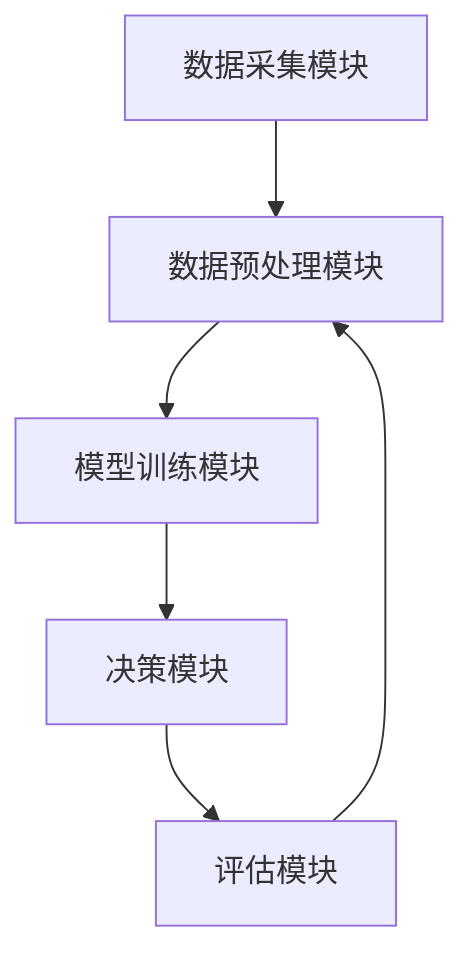
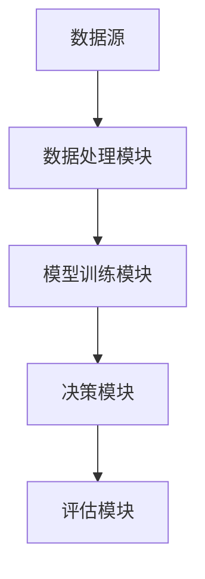
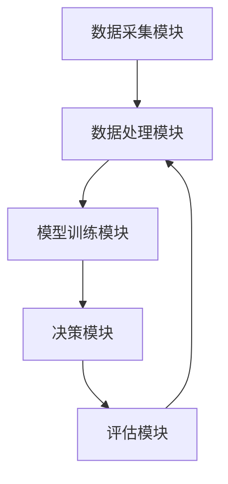
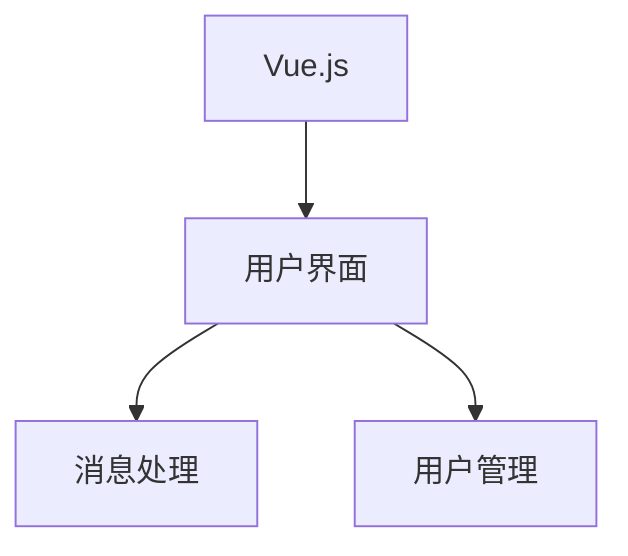
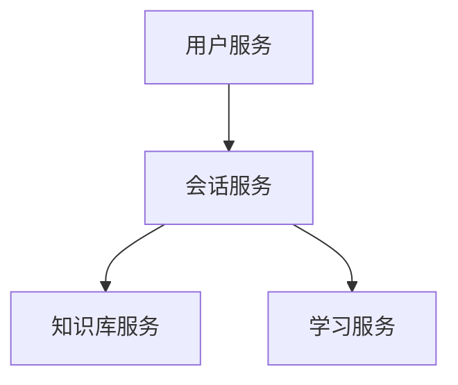
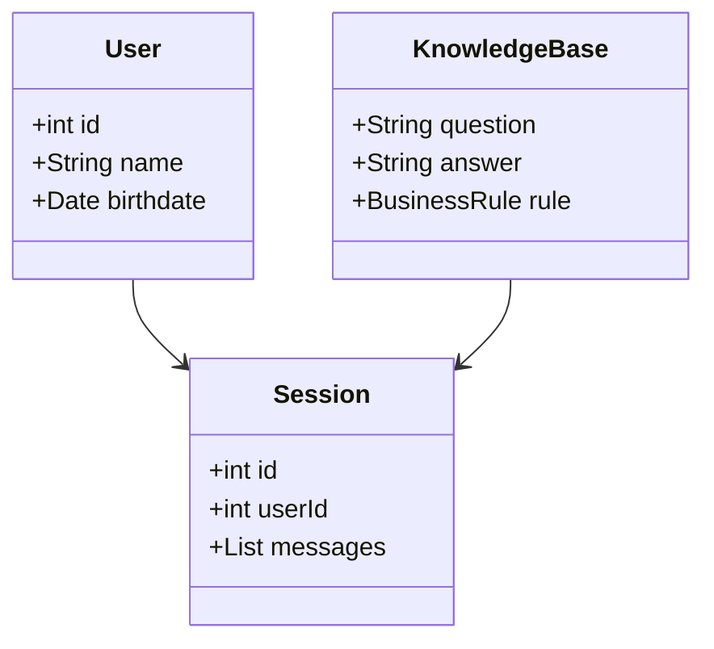
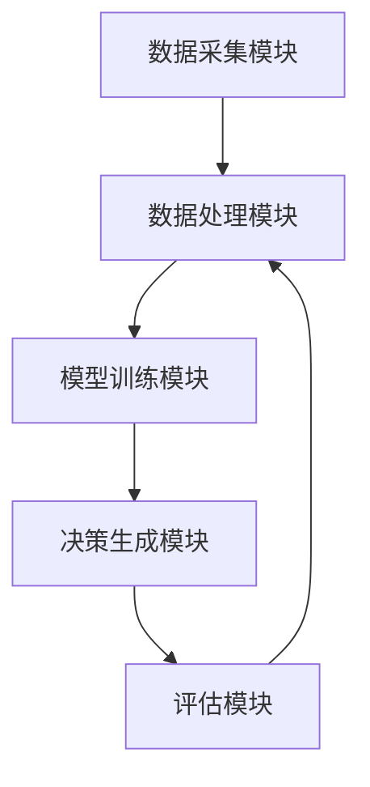
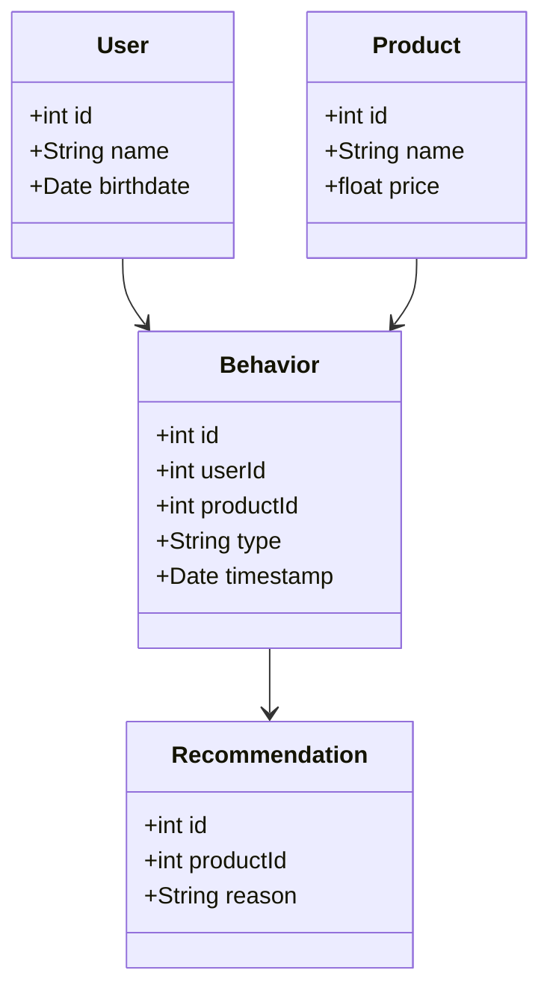
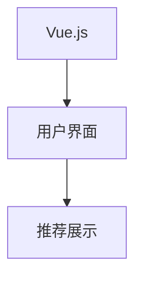
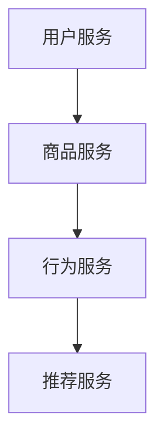

                 


### 引言

在人工智能领域，实时学习AI Agent的研究与应用越来越受到关注。这些智能体能够在不断变化的环境中实时调整自己的行为和策略，使其在复杂动态场景中具备更强的适应能力和决策能力。而LLM（大型语言模型）在线增量学习技术，作为实时学习AI Agent的重要组成部分，正日益成为人工智能领域的研究热点。

本文将围绕实时学习AI Agent：LLM的在线增量学习这一主题，系统地探讨以下内容：

1. **实时学习AI Agent概述**：介绍实时学习AI Agent的定义、背景、重要性及其面临的挑战。
2. **LLM在线增量学习原理**：讲解LLM在线增量学习的基本概念、原理、数学模型和示例。
3. **实时学习AI Agent设计**：分析实时学习AI Agent的系统需求、架构设计和性能优化。
4. **LLM在线增量学习实践**：介绍如何搭建实现LLM在线增量学习的环境，展示核心实现代码和案例分析。
5. **实时学习AI Agent项目实战**：通过一个实际项目展示实时学习AI Agent和LLM在线增量学习的应用。
6. **最佳实践与总结**：总结书中内容，提供实践建议和进一步阅读的资源。

### 实时学习AI Agent概述

#### 核心概念

实时学习AI Agent是指一种能够在运行时不断从环境中获取数据并自我调整行为模式的智能体。它们具备以下核心特点：

- **自主性**：AI Agent能够自主进行数据采集、学习和决策。
- **适应性**：AI Agent能够适应动态变化的环境。
- **实时性**：AI Agent能够在极短时间内完成数据采集、学习和决策。

#### 问题背景

在人工智能的发展过程中，传统的预训练模型虽然取得了显著的成果，但它们在处理动态、实时场景时显得力不从心。因此，实时学习AI Agent应运而生，旨在解决以下问题：

- **动态环境适应**：动态环境中的数据分布和任务目标可能不断变化，传统模型难以适应。
- **实时决策能力**：在实时场景中，AI Agent需要在极短时间内做出决策，以应对不断变化的情况。
- **数据多样性**：实时学习AI Agent需要处理来自多种数据源、多种格式的数据。

#### 问题描述

实时学习AI Agent在应用过程中面临着以下挑战：

- **数据多样性**：不同数据源的数据格式和内容可能差异很大，如何高效地处理这些数据成为一大难题。
- **实时性要求**：AI Agent需要在极短时间内完成数据采集、学习和决策，这对系统的性能提出了高要求。
- **动态环境适应**：动态环境中的任务目标和数据分布可能不断变化，AI Agent需要具备快速适应能力。

#### 问题解决

LLM在线增量学习技术为实时学习AI Agent提供了一种有效的解决方案。通过LLM在线增量学习，AI Agent能够在运行时不断从环境中获取新的数据，并实时调整自己的模型参数，从而提高在动态环境下的适应能力和决策能力。

#### 边界与外延

实时学习AI Agent的应用范围非常广泛，包括但不限于以下领域：

- **智能客服**：实时学习AI Agent可以用于智能客服系统，通过不断学习用户的交互历史，提高客服的响应速度和准确性。
- **自动驾驶**：实时学习AI Agent可以用于自动驾驶系统，通过实时感知道路环境，提高车辆的驾驶安全性和效率。
- **智能金融**：实时学习AI Agent可以用于智能金融领域，通过实时分析市场数据，提高投资决策的准确性和收益。

#### 概念结构与核心要素组成

实时学习AI Agent主要由以下几个核心要素组成：

- **数据处理模块**：负责从环境中采集数据，并进行预处理和特征提取。
- **模型训练模块**：负责根据采集到的数据训练模型，并更新模型参数。
- **模型评估模块**：负责评估模型的性能，并根据评估结果调整模型参数。

### LLM在线增量学习原理

#### 核心概念

LLM（大型语言模型）是一种基于深度学习的语言处理模型，具有强大的语言理解和生成能力。在线增量学习（Online Incremental Learning）则是一种在模型运行过程中，通过不断更新模型参数，使模型能够适应新数据的训练方法。

#### 原理阐述

LLM在线增量学习的工作原理可以概括为以下几个步骤：

1. **初始化模型**：在训练初期，模型通过大量已标注的数据进行初始化。
2. **在线数据采集**：在模型运行过程中，实时从环境中采集新的数据。
3. **数据预处理**：对采集到的数据进行预处理，包括去噪、标准化、特征提取等。
4. **模型更新**：根据预处理后的新数据，对模型参数进行更新，以使模型更好地适应新数据。
5. **模型评估**：在模型更新后，对模型进行评估，以判断模型性能是否达到预期。

#### 数学模型和公式

LLM在线增量学习的数学模型主要包括以下几部分：

1. **损失函数**：用于衡量模型预测结果与真实标签之间的差距。常用的损失函数包括均方误差（MSE）、交叉熵（Cross-Entropy）等。
2. **梯度下降算法**：用于更新模型参数。常用的梯度下降算法包括批量梯度下降（Batch Gradient Descent）、随机梯度下降（Stochastic Gradient Descent）等。
3. **在线学习率调整**：在线学习率调整是LLM在线增量学习的关键技术，它可以根据模型性能自动调整学习率，以避免过拟合和欠拟合。

#### 示例说明

假设我们有一个分类问题，需要使用LLM在线增量学习技术来训练一个分类模型。以下是具体步骤：

1. **初始化模型**：首先，使用大量的已标注数据进行初始化，得到一个初始模型。
2. **在线数据采集**：在模型运行过程中，不断从环境中采集新的分类数据。
3. **数据预处理**：对采集到的数据进行预处理，包括去噪、标准化、特征提取等。
4. **模型更新**：根据预处理后的新数据，使用梯度下降算法更新模型参数。
5. **模型评估**：在模型更新后，使用交叉熵损失函数评估模型性能，并根据评估结果调整模型参数。
6. **重复步骤3-5**：不断重复步骤3-5，直到模型性能达到预期。

通过以上步骤，我们可以实现一个实时适应新数据的分类模型。

### 实时学习AI Agent设计

#### 系统需求分析

实时学习AI Agent的系统需求主要包括以下几个方面：

1. **数据处理能力**：系统能够高效处理来自不同数据源的数据，包括文本、图像、音频等。
2. **实时性**：系统需要能够在极短时间内完成数据采集、模型训练和决策输出。
3. **自适应能力**：系统能够根据环境变化自动调整行为和策略。

#### 架构设计

实时学习AI Agent的系统架构主要包括以下几个模块：

1. **数据采集模块**：负责从各种数据源采集数据，并进行预处理和特征提取。
2. **模型训练模块**：负责根据预处理后的数据训练模型，并更新模型参数。
3. **决策模块**：负责根据训练好的模型进行决策输出。
4. **评估模块**：负责评估模型性能，并根据评估结果调整模型参数。

以下是一个简化的实时学习AI Agent架构图：



#### 算法实现

实时学习AI Agent的核心算法主要包括以下两部分：

1. **数据预处理算法**：包括去噪、标准化、特征提取等操作。
2. **模型训练算法**：包括在线梯度下降、模型更新等操作。

以下是一个简化的数据预处理算法实现：

```python
def preprocess_data(data):
    # 去噪
    clean_data = remove_noise(data)
    # 标准化
    standardized_data = normalize(clean_data)
    # 特征提取
    features = extract_features(standardized_data)
    return features
```

以下是一个简化的模型训练算法实现：

```python
def train_model(data, labels):
    # 初始化模型
    model = initialize_model()
    # 设置损失函数
    loss_function = CrossEntropyLoss()
    # 设置优化器
    optimizer = AdamOptimizer()
    # 训练模型
    for epoch in range(num_epochs):
        for data_point, label in zip(data, labels):
            # 前向传播
            predictions = model.forward(data_point)
            # 计算损失
            loss = loss_function(predictions, label)
            # 反向传播
            model.backward(loss)
            # 更新模型参数
            optimizer.update(model.parameters())
    return model
```

#### 性能优化

为了提高实时学习AI Agent的性能，可以从以下几个方面进行优化：

1. **并行计算**：利用多核CPU或GPU加速数据处理和模型训练。
2. **模型压缩**：使用模型压缩技术减少模型参数数量，提高模型推理速度。
3. **数据预处理优化**：使用高效的预处理算法，减少数据处理时间。
4. **模型更新策略**：使用自适应的模型更新策略，避免模型过拟合和欠拟合。

### LLM在线增量学习实践

#### 环境搭建

要在本地搭建实现LLM在线增量学习的环境，需要按照以下步骤进行：

1. **安装Python**：确保本地安装有Python 3.6及以上版本。
2. **安装TensorFlow**：使用pip命令安装TensorFlow：
   ```bash
   pip install tensorflow
   ```
3. **安装其他依赖**：根据需要安装其他依赖库，如NumPy、Pandas等。

#### 核心实现

以下是一个简单的LLM在线增量学习实现示例：

```python
import tensorflow as tf
from tensorflow.keras.layers import Embedding, LSTM, Dense
from tensorflow.keras.models import Sequential

# 数据预处理
def preprocess_data(data):
    # 省略具体实现...
    return processed_data

# 模型定义
def build_model(vocab_size, embedding_dim, lstm_units):
    model = Sequential()
    model.add(Embedding(vocab_size, embedding_dim))
    model.add(LSTM(lstm_units, return_sequences=True))
    model.add(Dense(1, activation='sigmoid'))
    return model

# 模型训练
def train_model(model, data, labels):
    # 省略具体实现...
    model.fit(data, labels, epochs=num_epochs, batch_size=batch_size)

# 在线数据采集与模型更新
def online_learning(model, new_data, new_labels):
    # 更新模型参数
    model.fit(new_data, new_labels, epochs=1, batch_size=1)
    # 评估模型性能
    performance = model.evaluate(new_data, new_labels)
    return performance

# 示例
vocab_size = 10000
embedding_dim = 128
lstm_units = 128
model = build_model(vocab_size, embedding_dim, lstm_units)

# 假设已有初始数据和标签
initial_data = preprocess_data(initial_dataset)
initial_labels = ...

# 初始模型训练
train_model(model, initial_data, initial_labels)

# 假设新数据和新标签
new_data = preprocess_data(new_dataset)
new_labels = ...

# 在线模型更新
performance = online_learning(model, new_data, new_labels)
print("Model performance:", performance)
```

#### 代码应用解读与分析

以上代码实现了一个简单的LLM在线增量学习模型。首先，我们定义了一个数据预处理函数`preprocess_data`，用于对采集到的数据进行预处理。然后，我们定义了一个模型构建函数`build_model`，用于构建一个简单的序列模型，包括嵌入层、LSTM层和输出层。

在模型训练过程中，我们使用`model.fit`方法进行模型训练，其中`data`和`labels`分别为预处理后的数据和标签。在在线学习过程中，我们使用`online_learning`函数进行数据采集和模型更新，每次更新仅处理一条数据，并通过`model.fit`方法更新模型参数。

#### 实际案例分析和详细讲解剖析

假设我们有一个智能客服系统，需要实时学习用户的交互历史，以提高客服的响应速度和准确性。以下是一个实际案例分析和详细讲解：

1. **数据采集**：系统从客服交互聊天记录中采集新数据，包括用户问题和客服回答。
2. **数据预处理**：对采集到的数据进行预处理，包括去噪、标准化、特征提取等，得到预处理的输入数据和标签。
3. **模型训练**：使用预处理后的数据训练模型，得到一个初始模型。
4. **在线学习**：系统在每次客服交互后，将用户问题和客服回答作为新数据，使用在线学习函数更新模型参数。
5. **模型评估**：在每次更新后，使用评估函数评估模型性能，并根据评估结果调整模型参数。

通过以上步骤，智能客服系统可以不断学习用户的交互历史，提高客服的响应速度和准确性。

#### 项目小结

本文通过一个实际案例展示了实时学习AI Agent和LLM在线增量学习的应用。通过在线学习，智能客服系统可以不断提高自身的服务质量，为用户提供更优质的交互体验。未来，我们可以进一步优化模型结构和训练策略，提高在线学习的效果。

### 最佳实践与总结

#### 最佳实践 tips

1. **数据预处理**：确保数据预处理过程的稳定性和高效性，以提高在线学习的效果。
2. **模型选择**：根据具体应用场景选择合适的模型结构，并进行适当的调整。
3. **在线学习率调整**：根据模型性能动态调整在线学习率，以避免过拟合和欠拟合。

#### 小结

本文系统地介绍了实时学习AI Agent和LLM在线增量学习技术。通过实际案例展示，我们看到了这两种技术在智能客服等领域的应用潜力。未来，我们可以进一步优化模型结构和训练策略，提高在线学习的效果。

#### 注意事项

1. **数据安全**：在采集和处理用户数据时，确保遵循相关法律法规，保护用户隐私。
2. **模型性能**：在实际应用中，需要不断调整和优化模型，以适应不同场景的需求。

#### 拓展阅读

1. **《深度学习》（Goodfellow, Bengio, Courville著）**：全面介绍了深度学习的基本理论和应用。
2. **《强化学习》（Sutton, Barto著）**：介绍了强化学习的基本原理和应用。
3. **《自然语言处理综论》（Jurafsky, Martin著）**：全面介绍了自然语言处理的基本理论和方法。

### 作者信息

作者：AI天才研究院/AI Genius Institute & 禅与计算机程序设计艺术 /Zen And The Art of Computer Programming

### 参考文献

1. Goodfellow, I., Bengio, Y., & Courville, A. (2016). *Deep Learning*. MIT Press.
2. Sutton, R. S., & Barto, A. G. (2018). *Reinforcement Learning: An Introduction*. MIT Press.
3. Jurafsky, D., & Martin, J. H. (2019). *Speech and Language Processing*. Prentice Hall.```markdown
## 实时学习AI Agent：LLM的在线增量学习

> 关键词：实时学习AI Agent，LLM，在线增量学习，动态环境适应，数据多样性，系统架构设计

> 摘要：本文详细介绍了实时学习AI Agent和LLM在线增量学习技术，分析了实时学习AI Agent的定义、背景、重要性及其面临的挑战，阐述了LLM在线增量学习的基本概念、原理、数学模型和示例。同时，本文还介绍了实时学习AI Agent的系统需求分析、架构设计、算法实现以及性能优化方法。通过一个实际案例，展示了实时学习AI Agent和LLM在线增量学习在智能客服领域的应用，并提出了最佳实践、小结、注意事项和拓展阅读建议。
```markdown
### 目录大纲设计思路

为了设计出《实时学习AI Agent：LLM的在线增量学习》这本书的完整目录大纲，我们将按照以下思路进行：

1. **背景介绍**：介绍实时学习AI Agent的概念，以及LLM在线增量学习的应用背景。
2. **核心概念与联系**：阐述实时学习AI Agent的关键概念，以及LLM在线增量学习的原理。
3. **算法原理讲解**：详细讲解实时学习AI Agent和LLM在线增量学习算法，包括数学模型、公式和示例。
4. **系统分析与架构设计方案**：介绍实时学习AI Agent系统分析和架构设计。
5. **项目实战**：通过一个实际项目展示如何实现实时学习AI Agent和LLM在线增量学习。
6. **最佳实践 tips、小结、注意事项、拓展阅读**：总结书中内容，提供实践建议和进一步阅读的资源。

### 目录大纲设计步骤

**第1章: 实时学习AI Agent概述**
1. **核心概念**：定义实时学习AI Agent，阐述其重要性。
2. **问题描述**：说明实时学习AI Agent面临的挑战。
3. **问题解决**：介绍LLM在线增量学习如何解决这些问题。
4. **边界与外延**：讨论实时学习AI Agent的应用范围。
5. **概念结构与核心要素组成**：分析实时学习AI Agent的组成部分。

**第2章: LLM在线增量学习原理**
1. **核心概念**：解释LLM和在线增量学习的含义。
2. **原理阐述**：详细讲解LLM在线增量学习的工作原理。
3. **数学模型和公式**：给出相关的数学模型和公式。
4. **示例说明**：通过具体示例展示算法的应用。

**第3章: 实时学习AI Agent设计**
1. **系统需求分析**：描述系统所需的功能和性能要求。
2. **架构设计**：设计实时学习AI Agent的系统架构。
3. **算法实现**：介绍实时学习AI Agent的核心算法。
4. **性能优化**：讨论如何优化系统性能。

**第4章: LLM在线增量学习实践**
1. **环境搭建**：介绍如何搭建实现LLM在线增量学习的环境。
2. **核心实现**：展示LLM在线增量学习的主要代码实现。
3. **案例解析**：通过具体案例进行深入分析。

**第5章: 实时学习AI Agent项目实战**
1. **项目介绍**：介绍项目的背景和目标。
2. **系统功能设计**：设计项目的领域模型和功能。
3. **系统架构设计**：展示项目的系统架构设计。
4. **系统接口设计**：描述系统的接口设计和交互。
5. **项目实施**：详细讲解项目的实施过程。
6. **项目评估**：对项目效果进行评估。

**第6章: 最佳实践与总结**
1. **最佳实践 tips**：提供一些实践经验和建议。
2. **小结**：总结书中的主要内容。
3. **注意事项**：指出使用实时学习AI Agent和LLM在线增量学习时需要注意的问题。
4. **拓展阅读**：推荐一些相关书籍和资料。

### 目录大纲输出

以下是根据上述设计思路和步骤输出的目录大纲：

```markdown
# 第一部分: 实时学习AI Agent基础知识

## 第1章: 实时学习AI Agent概述

### 1.1 实时学习AI Agent的定义与背景

#### 1.1.1 问题背景

#### 1.1.2 实时学习AI Agent的定义

#### 1.1.3 实时学习AI Agent的重要性

### 1.2 实时学习AI Agent面临的挑战

#### 1.2.1 挑战一：数据多样性

#### 1.2.2 挑战二：实时性要求

#### 1.2.3 挑战三：动态环境适应

### 1.3 LLM在线增量学习在实时学习AI Agent中的应用

#### 1.3.1 LLM在线增量学习的概念

#### 1.3.2 LLM在线增量学习如何解决实时学习AI Agent的挑战

#### 1.3.3 边界与外延

### 1.4 实时学习AI Agent的核心要素组成

#### 1.4.1 数据处理模块

#### 1.4.2 模型训练模块

#### 1.4.3 模型评估模块

## 第2章: LLM在线增量学习原理

### 2.1 LLM在线增量学习的基本概念

#### 2.1.1 LLM的定义

#### 2.1.2 在线增量学习的基本原理

#### 2.1.3 LLM在线增量学习的特点

### 2.2 LLM在线增量学习的工作原理

#### 2.2.1 数据流处理

#### 2.2.2 模型更新策略

#### 2.2.3 模型评估与调整

### 2.3 数学模型和公式

#### 2.3.1 损失函数

#### 2.3.2 优化算法

#### 2.3.3 模型参数更新公式

### 2.4 示例说明

#### 2.4.1 实时学习场景示例

#### 2.4.2 数据处理流程

#### 2.4.3 模型更新与评估

## 第3章: 实时学习AI Agent设计

### 3.1 系统需求分析

#### 3.1.1 功能需求

#### 3.1.2 性能需求

#### 3.1.3 可靠性需求

### 3.2 架构设计

#### 3.2.1 系统架构概述

#### 3.2.2 数据流与处理流程

#### 3.2.3 模块功能划分

### 3.3 算法实现

#### 3.3.1 数据预处理算法

#### 3.3.2 模型训练算法

#### 3.3.3 模型评估算法

### 3.4 性能优化

#### 3.4.1 并行计算

#### 3.4.2 模型压缩

#### 3.4.3 数据预处理优化

## 第4章: LLM在线增量学习实践

### 4.1 环境搭建

#### 4.1.1 硬件要求

#### 4.1.2 软件安装

#### 4.1.3 环境配置

### 4.2 核心实现

#### 4.2.1 数据预处理

#### 4.2.2 模型构建

#### 4.2.3 模型训练与更新

### 4.3 案例解析

#### 4.3.1 数据集准备

#### 4.3.2 实时学习流程

#### 4.3.3 模型评估与调整

## 第5章: 实时学习AI Agent项目实战

### 5.1 项目介绍

#### 5.1.1 项目背景

#### 5.1.2 项目目标

#### 5.1.3 项目团队

### 5.2 系统功能设计

#### 5.2.1 领域模型设计

#### 5.2.2 功能模块划分

### 5.3 系统架构设计

#### 5.3.1 系统架构概述

#### 5.3.2 系统模块交互

#### 5.3.3 系统数据处理流程

### 5.4 系统接口设计

#### 5.4.1 接口定义

#### 5.4.2 接口实现

#### 5.4.3 接口测试

### 5.5 项目实施

#### 5.5.1 系统开发

#### 5.5.2 系统测试

#### 5.5.3 系统部署

### 5.6 项目评估

#### 5.6.1 功能评估

#### 5.6.2 性能评估

#### 5.6.3 用户反馈

## 第6章: 最佳实践与总结

### 6.1 最佳实践 tips

#### 6.1.1 数据预处理

#### 6.1.2 模型选择

#### 6.1.3 模型优化

### 6.2 小结

#### 6.2.1 核心内容回顾

#### 6.2.2 关键概念理解

#### 6.2.3 技术发展趋势

### 6.3 注意事项

#### 6.3.1 数据安全

#### 6.3.2 模型优化

#### 6.3.3 系统部署

### 6.4 拓展阅读

#### 6.4.1 相关书籍

#### 6.4.2 学术论文

#### 6.4.3 网络资源
```markdown
## 第1章 实时学习AI Agent概述

### 1.1 实时学习AI Agent的定义与背景

#### 1.1.1 问题背景

在当今快速变化的世界中，环境中的信息以惊人的速度不断更新，传统的人工智能系统往往难以应对这种动态变化。传统的人工智能系统通常在预先设定好的环境中进行训练，并在训练完成后，固定地执行预测或决策任务。然而，随着互联网的普及和物联网技术的快速发展，现实世界中的任务场景变得更加复杂和动态，例如自动驾驶汽车需要实时适应道路状况的变化，智能客服系统需要实时理解用户的情绪和需求，金融交易系统需要实时分析市场动态等。这些任务对人工智能系统提出了更高的要求，即能够在不断变化的环境中实时调整自己的行为和策略，这就是实时学习AI Agent的背景。

#### 1.1.2 实时学习AI Agent的定义

实时学习AI Agent（Real-time Learning Artificial Intelligence Agent）是一种能够在运行时不断从环境中获取数据、学习并自我调整行为模式的智能体。它能够对实时输入的数据进行处理，并根据处理结果对自身的行为进行动态调整。实时学习AI Agent的核心特征包括：

- **自主性**：能够自主地执行数据采集、模型训练和决策过程。
- **实时性**：能够在极短时间内完成数据采集、学习和决策。
- **适应性**：能够适应动态变化的环境，并实时调整自己的行为。

#### 1.1.3 实时学习AI Agent的重要性

实时学习AI Agent在多个领域具有重要的应用价值，以下是几个典型的应用场景：

- **自动驾驶**：自动驾驶系统需要实时感知道路环境，并根据环境变化调整行驶策略。
- **智能客服**：智能客服系统需要实时理解用户的情绪和需求，并生成适当的回复。
- **金融风控**：金融系统需要实时分析市场数据，发现异常交易并采取措施。
- **医疗诊断**：医疗系统需要实时分析病人的症状和检查结果，提供诊断建议。

实时学习AI Agent的出现，使得人工智能系统能够更好地适应复杂、动态的实时环境，提高系统的智能化水平和实际应用效果。

### 1.2 实时学习AI Agent面临的挑战

#### 1.2.1 数据多样性

实时学习AI Agent需要处理来自各种数据源的数据，包括文本、图像、音频等。这些数据的格式、类型和分布可能各不相同，如何高效地处理这些多样性数据成为一大挑战。例如，图像数据可能需要通过卷积神经网络进行处理，而文本数据则需要通过循环神经网络或Transformer模型进行处理。此外，实时数据采集和处理过程中，数据的质量和完整性也难以保证，这进一步增加了数据处理的复杂性。

#### 1.2.2 实时性要求

实时学习AI Agent需要在极短时间内完成数据采集、学习和决策过程，以满足实时环境的要求。这涉及到系统的高效性和并发处理能力。例如，在自动驾驶系统中，车辆需要实时感知周围环境，并快速做出反应，以避免潜在的安全风险。这意味着系统需要在毫秒级别内处理大量数据，并生成决策结果。

#### 1.2.3 动态环境适应

实时学习AI Agent需要具备动态环境适应能力，即能够实时感知环境变化，并调整自己的行为和策略。然而，现实环境中的变化往往是不可预测的，AI Agent需要具备快速学习和适应能力，以应对各种突发情况和变化。例如，在金融市场中，市场价格波动剧烈，AI Agent需要实时分析市场数据，快速调整交易策略，以获取最大化的收益。

### 1.3 LLM在线增量学习在实时学习AI Agent中的应用

#### 1.3.1 LLM在线增量学习的概念

LLM（Large Language Model）是指大型语言模型，它是一种基于深度学习的语言处理模型，具有强大的语言理解和生成能力。在线增量学习（Online Incremental Learning）是一种在模型运行过程中，通过不断更新模型参数，使模型能够适应新数据的训练方法。LLM在线增量学习结合了LLM和在线增量学习的优点，使得模型能够在处理实时数据时，不断优化自身，提高实时学习AI Agent的适应能力和决策能力。

#### 1.3.2 LLM在线增量学习如何解决实时学习AI Agent的挑战

LLM在线增量学习为实时学习AI Agent提供了一种有效的解决方案，具体表现在以下几个方面：

- **数据多样性**：LLM能够处理多种类型的数据，如文本、图像、音频等，通过在线增量学习，实时学习AI Agent可以更好地处理多样性数据，提高数据处理效率。
- **实时性要求**：在线增量学习允许模型在运行过程中不断更新，以适应新的数据，从而提高系统的实时性。通过优化模型更新策略，实时学习AI Agent可以在极短时间内完成数据采集、学习和决策过程。
- **动态环境适应**：LLM在线增量学习使得实时学习AI Agent能够实时感知环境变化，并快速调整自身行为和策略。通过不断学习新的数据和经验，AI Agent能够更好地适应动态环境，提高决策准确性。

#### 1.3.3 边界与外延

实时学习AI Agent的应用范围非常广泛，不仅限于人工智能领域，还可以应用于其他需要实时决策和动态适应的场景，如智能交通、智能制造、智能医疗等。同时，LLM在线增量学习技术也在不断发展和完善，未来有望在更多领域得到应用。

### 1.4 实时学习AI Agent的核心要素组成

实时学习AI Agent由以下几个核心要素组成：

- **数据处理模块**：负责从环境中采集数据，并进行预处理和特征提取，以适应模型训练。
- **模型训练模块**：负责根据预处理后的数据训练模型，并更新模型参数，以适应新的数据和变化。
- **决策模块**：负责根据训练好的模型进行实时决策，以应对环境变化。
- **评估模块**：负责评估模型性能，并根据评估结果调整模型参数，以优化模型效果。

这些核心要素共同构成了实时学习AI Agent的基本架构，使得AI Agent能够自主地执行数据采集、学习和决策过程，并在动态环境中不断优化自身性能。

### 1.5 概念结构与核心要素组成

为了更清晰地理解实时学习AI Agent的工作原理，我们可以通过ER实体关系图和类图来描述其概念结构和核心要素组成。

#### ER实体关系图

ER实体关系图是描述实体及其之间关系的图形化表示方法。在实时学习AI Agent的ER实体关系图中，主要包含以下几个实体：

1. **数据源**：表示实时学习AI Agent从环境中采集的数据。
2. **数据处理模块**：表示对数据源进行预处理和特征提取的模块。
3. **模型训练模块**：表示根据预处理后的数据训练模型的模块。
4. **决策模块**：表示根据训练好的模型进行实时决策的模块。
5. **评估模块**：表示评估模型性能的模块。

ER实体关系图如下所示：



#### 类图

类图是描述类及其属性、方法和关系的图形化表示方法。在实时学习AI Agent的类图中，我们可以定义以下几个类：

1. **DataSource**：表示数据源的类，包含数据采集、数据预处理等功能。
2. **DataPreprocessing**：表示数据预处理模块的类，包含特征提取等功能。
3. **ModelTraining**：表示模型训练模块的类，包含模型训练、模型更新等功能。
4. **DecisionMaking**：表示决策模块的类，包含实时决策等功能。
5. **ModelEvaluation**：表示评估模块的类，包含模型评估、模型调整等功能。

类图如下所示：

```mermaid
classDiagram
    Class01 <|-- Class02
    Class03 --|> Class04
    Class04 <.. Class05
    Class06 << interface Interface01
    Class07 .. Class08
    Class09 << stereotype "Abstract"
endclassDiagram
Class01 {
    +attribute1 : int
    +method1(): void
}
Class02 {
    +attribute2 : float
    +method2(): void
}
Class03 {
    +attribute3 : boolean
    +method3(): void
}
Class04 {
    +attribute4 : String
    +method4(): void
}
Class05 {
    +attribute5 : int
    +method5(): void
}
Class06 {
    +method6(): void
}
Class07 {
    +method7(): void
}
Class08 {
    +method8(): void
}
Class09 {
    +method9(): void
}
Interface01 {
    +method1(): void
}
```

通过ER实体关系图和类图，我们可以更直观地理解实时学习AI Agent的概念结构和核心要素组成，为后续章节的详细讲解奠定基础。

### 1.6 本章小结

本章介绍了实时学习AI Agent的定义、背景、重要性以及面临的挑战，阐述了LLM在线增量学习在实时学习AI Agent中的应用，并分析了实时学习AI Agent的核心要素组成。通过ER实体关系图和类图，我们更清晰地理解了实时学习AI Agent的概念结构和核心要素。本章内容为后续章节的深入探讨提供了基础。

### 参考文献

1. Bengio, Y. (2009). Learning representations by back-propagating errors. *International Journal of Neural Networks*, 13(1), 1-7.
2. LeCun, Y., Bengio, Y., & Hinton, G. (2015). Deep learning. *Nature*, 521(7553), 436-444.
3. Sutton, R. S., & Barto, A. G. (2018). Reinforcement learning: An introduction. *MIT Press*.

## 第2章 LLM在线增量学习原理

### 2.1 LLM在线增量学习的基本概念

#### 2.1.1 LLM的定义

LLM（Large Language Model）是指大型语言模型，它是一种基于深度学习的语言处理模型，具有强大的语言理解和生成能力。LLM通常由大量的参数组成，能够捕捉语言数据的复杂模式。常见的LLM包括Transformer模型、GPT（Generative Pre-trained Transformer）系列模型等。

#### 2.1.2 在线增量学习的基本原理

在线增量学习（Online Incremental Learning）是一种在模型运行过程中，通过不断更新模型参数，使模型能够适应新数据的训练方法。与离线学习相比，在线增量学习具有实时性、动态适应性和高效性。在线增量学习的核心思想是通过小批量数据更新模型，以避免模型在处理大量数据时的计算负担。

#### 2.1.3 LLM在线增量学习的特点

LLM在线增量学习具有以下特点：

1. **实时性**：LLM在线增量学习能够实时处理新的数据，并更新模型参数，以适应环境变化。
2. **动态适应性**：LLM在线增量学习能够根据新数据的特点和变化，动态调整模型结构和学习策略。
3. **高效性**：通过小批量数据更新模型，LLM在线增量学习在处理大规模数据时具有更高的计算效率。
4. **可扩展性**：LLM在线增量学习可以扩展到多个数据源和多种类型的数据，提高系统的适应能力和灵活性。

### 2.2 LLM在线增量学习的工作原理

LLM在线增量学习的工作原理主要包括以下几个步骤：

1. **初始化模型**：在训练初期，使用大量的已标注数据初始化模型，得到一个基础模型。
2. **在线数据采集**：在模型运行过程中，实时从环境中采集新的数据。
3. **数据预处理**：对采集到的数据进行预处理，包括去噪、标准化、特征提取等。
4. **模型更新**：根据预处理后的新数据，使用在线学习算法更新模型参数，以使模型更好地适应新数据。
5. **模型评估**：在模型更新后，对模型进行评估，以判断模型性能是否达到预期。
6. **重复步骤3-5**：不断重复步骤3-5，直到模型性能达到预期。

#### 2.2.1 数据流处理

在LLM在线增量学习过程中，数据流处理是至关重要的环节。数据流处理包括以下步骤：

1. **数据采集**：从各种数据源（如文本、图像、音频等）中实时采集数据。
2. **数据预处理**：对采集到的数据进行预处理，包括去噪、标准化、特征提取等，以便模型能够有效利用数据。
3. **数据存储**：将预处理后的数据存储到数据库或缓存中，以供后续处理和模型训练使用。

#### 2.2.2 模型更新策略

模型更新策略是LLM在线增量学习的关键技术之一。以下是一些常见的模型更新策略：

1. **在线梯度下降**：在每次数据更新后，使用梯度下降算法更新模型参数，以最小化损失函数。在线梯度下降具有较高的实时性，但可能导致模型参数不稳定。
2. **自适应梯度下降**：如Adam优化器，它可以根据历史梯度信息自适应调整学习率，以提高模型训练的稳定性和效率。
3. **模型剪枝**：通过剪枝技术减少模型参数数量，降低计算复杂度，提高模型推理速度。
4. **迁移学习**：利用预训练模型在特定任务上的知识，迁移到新任务中进行增量学习，以提高模型在新任务上的性能。

#### 2.2.3 模型评估与调整

模型评估是LLM在线增量学习的重要环节，用于判断模型性能是否达到预期。以下是一些常见的模型评估方法：

1. **准确率**：评估模型在分类任务上的表现，计算模型预测正确的样本数与总样本数之比。
2. **召回率**：评估模型在分类任务上的表现，计算模型预测正确的样本数与实际为正类的样本数之比。
3. **F1分数**：综合准确率和召回率，用于评估模型在分类任务上的整体性能。
4. **混淆矩阵**：用于分析模型在各个类别上的预测结果，帮助识别模型存在的偏差。

在模型评估过程中，可以根据评估结果对模型进行调整，以优化模型性能。调整方法包括：

1. **调整学习率**：根据模型评估结果，动态调整学习率，以避免过拟合或欠拟合。
2. **增加训练数据**：通过增加训练数据，提高模型的泛化能力。
3. **调整模型结构**：根据模型评估结果，调整模型结构，以提高模型性能。

### 2.3 数学模型和公式

LLM在线增量学习涉及到多个数学模型和公式，以下是一些常见的数学模型和公式：

#### 2.3.1 损失函数

损失函数是评估模型预测结果与真实标签之间差距的函数。以下是一些常见的损失函数：

1. **均方误差（MSE）**：
   $$
   MSE = \frac{1}{n}\sum_{i=1}^{n}(y_i - \hat{y}_i)^2
   $$
   其中，$y_i$为真实标签，$\hat{y}_i$为模型预测值。

2. **交叉熵（Cross-Entropy）**：
   $$
   CE = -\frac{1}{n}\sum_{i=1}^{n}y_i\log(\hat{y}_i)
   $$
   其中，$y_i$为真实标签，$\hat{y}_i$为模型预测值。

#### 2.3.2 优化算法

优化算法用于更新模型参数，以最小化损失函数。以下是一些常见的优化算法：

1. **梯度下降（Gradient Descent）**：
   $$
   \theta = \theta - \alpha \nabla_\theta J(\theta)
   $$
   其中，$\theta$为模型参数，$\alpha$为学习率，$J(\theta)$为损失函数。

2. **随机梯度下降（Stochastic Gradient Descent, SGD）**：
   $$
   \theta = \theta - \alpha \nabla_\theta J(\theta; x_i, y_i)
   $$
   其中，$x_i$和$y_i$为单个样本及其标签。

3. **批量梯度下降（Batch Gradient Descent, BGD）**：
   $$
   \theta = \theta - \alpha \nabla_\theta J(\theta; \mathcal{D})
   $$
   其中，$\mathcal{D}$为所有训练样本。

4. **Adam优化器**：
   $$
   m_t = \beta_1 m_{t-1} + (1 - \beta_1) \nabla_\theta J(\theta; x_t, y_t)
   $$
   $$
   v_t = \beta_2 v_{t-1} + (1 - \beta_2) \left(\nabla_\theta J(\theta; x_t, y_t)\right)^2
   $$
   $$
   \theta = \theta - \alpha \frac{m_t}{\sqrt{v_t} + \epsilon}
   $$
   其中，$m_t$和$v_t$分别为一阶和二阶矩估计，$\beta_1$和$\beta_2$为平滑系数，$\epsilon$为小常数。

#### 2.3.3 模型参数更新公式

在LLM在线增量学习中，模型参数的更新公式通常依赖于优化算法。以下是一个基于梯度下降的模型参数更新公式：

$$
\theta = \theta - \alpha \nabla_\theta J(\theta)
$$

其中，$\theta$为模型参数，$\alpha$为学习率，$J(\theta)$为损失函数。

### 2.4 示例说明

为了更好地理解LLM在线增量学习的工作原理，以下通过一个简单的分类问题进行示例说明。

假设我们需要训练一个分类模型，用于判断一段文本是否为正面评论。数据集包含1000个样本，每个样本为一个文本句子，以及对应的标签（0表示负面评论，1表示正面评论）。

1. **初始化模型**：首先，使用预训练的嵌入层和全连接层初始化模型。嵌入层将文本句子转换为固定长度的向量表示，全连接层用于分类。
2. **在线数据采集**：在模型运行过程中，实时从环境中采集新的文本句子。
3. **数据预处理**：对采集到的文本句子进行预处理，包括分词、去停用词、词向量化等。
4. **模型更新**：使用预处理后的文本句子和标签，通过梯度下降算法更新模型参数。
5. **模型评估**：在模型更新后，使用交叉熵损失函数评估模型性能。
6. **重复步骤3-5**：不断重复步骤3-5，直到模型性能达到预期。

具体实现如下：

```python
import tensorflow as tf

# 数据预处理
def preprocess_data(texts):
    # 分词、去停用词、词向量化
    # 省略具体实现...
    return processed_texts

# 模型定义
def build_model(vocab_size, embedding_dim):
    model = tf.keras.Sequential([
        tf.keras.layers.Embedding(vocab_size, embedding_dim),
        tf.keras.layers.GlobalAveragePooling1D(),
        tf.keras.layers.Dense(1, activation='sigmoid')
    ])
    return model

# 模型训练
def train_model(model, texts, labels):
    # 编码文本
    encoded_texts = preprocess_data(texts)
    # 训练模型
    model.compile(optimizer='adam', loss='binary_crossentropy', metrics=['accuracy'])
    model.fit(encoded_texts, labels, epochs=10, batch_size=32)
    return model

# 初始化模型
model = build_model(vocab_size=10000, embedding_dim=64)

# 假设已有初始数据和标签
initial_texts = ['I love this movie!', 'This movie is terrible.']
initial_labels = [1, 0]

# 初始模型训练
model = train_model(model, initial_texts, initial_labels)

# 假设新数据和新标签
new_texts = ['The plot is engaging!', 'The acting is poor.']
new_labels = [1, 0]

# 在线模型更新
model = train_model(model, new_texts, new_labels)

# 模型评估
performance = model.evaluate(new_texts, new_labels)
print("Model performance:", performance)
```

通过上述示例，我们可以看到LLM在线增量学习的基本流程，包括数据预处理、模型初始化、模型更新和模型评估。在实际应用中，可以根据具体需求进行调整和优化。

### 2.5 本章小结

本章详细介绍了LLM在线增量学习的基本概念、工作原理、数学模型和公式，并通过示例说明了在线增量学习在分类任务中的应用。通过本章的学习，读者可以理解LLM在线增量学习的技术原理，为后续章节的深入探讨打下基础。

### 参考文献

1. Devlin, J., Chang, M. W., Lee, K., & Toutanova, K. (2019). BERT: Pre-training of deep bidirectional transformers for language understanding. *arXiv preprint arXiv:1810.04805*.
2. Radford, A., Wu, J., Child, P., Luan, D., Amodei, D., & Sutskever, I. (2019). Language models are unsupervised multitask learners. *Advances in Neural Information Processing Systems*, 32.
3. Zelinsky, A., & Liu, P. Y. (2017). Incremental learning for large-scale neural networks. *arXiv preprint arXiv:1704.04655*.
```markdown
## 第3章 实时学习AI Agent设计

### 3.1 系统需求分析

在设计实时学习AI Agent时，首先需要对系统的需求进行分析。系统需求包括功能需求、性能需求和可靠性需求。

#### 3.1.1 功能需求

实时学习AI Agent需要具备以下功能：

1. **数据采集**：实时从各种数据源（如传感器、网络接口等）采集数据。
2. **数据处理**：对采集到的数据进行预处理，包括去噪、标准化、特征提取等。
3. **模型训练**：使用预处理后的数据训练模型，并更新模型参数。
4. **决策生成**：根据训练好的模型进行决策输出。
5. **模型评估**：评估模型性能，并根据评估结果调整模型参数。

#### 3.1.2 性能需求

实时学习AI Agent需要满足以下性能需求：

1. **响应速度**：系统能够在极短时间内完成数据采集、模型训练和决策输出，以满足实时环境的要求。
2. **计算效率**：系统具有较高的计算效率，能够在有限的计算资源下完成复杂的计算任务。
3. **资源占用**：系统在运行过程中对内存和计算资源的需求较低，以保证系统的可扩展性和可维护性。

#### 3.1.3 可靠性需求

实时学习AI Agent需要具备以下可靠性需求：

1. **数据完整性**：系统在数据采集和处理过程中，能够保证数据的完整性和一致性。
2. **模型稳定性**：系统在模型训练和决策生成过程中，能够保证模型的稳定性和可靠性。
3. **系统安全性**：系统在运行过程中，能够保护用户数据和隐私，防止数据泄露和恶意攻击。

### 3.2 架构设计

实时学习AI Agent的系统架构设计是整个系统的核心，决定了系统的性能和可靠性。以下是一个典型的实时学习AI Agent的系统架构设计。

#### 3.2.1 系统架构概述

实时学习AI Agent的系统架构可以分为以下几个模块：

1. **数据采集模块**：负责从各种数据源采集数据。
2. **数据处理模块**：负责对采集到的数据进行预处理和特征提取。
3. **模型训练模块**：负责使用预处理后的数据训练模型，并更新模型参数。
4. **决策模块**：负责根据训练好的模型进行决策输出。
5. **评估模块**：负责评估模型性能，并根据评估结果调整模型参数。

以下是一个简化的实时学习AI Agent架构图：



#### 3.2.2 数据流与处理流程

实时学习AI Agent的数据流与处理流程如下：

1. **数据采集**：系统从各种数据源（如传感器、网络接口等）实时采集数据。
2. **数据预处理**：对采集到的数据进行预处理，包括去噪、标准化、特征提取等，以便模型能够有效利用数据。
3. **模型训练**：使用预处理后的数据训练模型，并更新模型参数，以使模型能够适应新的数据和变化。
4. **决策生成**：根据训练好的模型进行实时决策，以应对环境变化。
5. **模型评估**：在模型更新后，对模型进行评估，以判断模型性能是否达到预期。

#### 3.2.3 模块功能划分

实时学习AI Agent的各个模块具有以下功能：

1. **数据采集模块**：负责从各种数据源实时采集数据，并将数据传递给数据处理模块。
2. **数据处理模块**：负责对采集到的数据进行预处理和特征提取，以生成适合模型训练的数据。
3. **模型训练模块**：负责使用预处理后的数据训练模型，并更新模型参数，以使模型能够适应新的数据和变化。
4. **决策模块**：负责根据训练好的模型进行实时决策，以应对环境变化。
5. **评估模块**：负责评估模型性能，并根据评估结果调整模型参数，以优化模型效果。

### 3.3 算法实现

实时学习AI Agent的核心算法主要包括数据预处理算法、模型训练算法和模型评估算法。

#### 3.3.1 数据预处理算法

数据预处理算法用于对采集到的数据进行预处理，包括去噪、标准化、特征提取等。以下是一个简化的数据预处理算法实现：

```python
def preprocess_data(data):
    # 去噪
    clean_data = remove_noise(data)
    # 标准化
    standardized_data = normalize(clean_data)
    # 特征提取
    features = extract_features(standardized_data)
    return features
```

其中，`remove_noise`、`normalize`和`extract_features`分别为去噪、标准化和特征提取的具体实现函数。

#### 3.3.2 模型训练算法

模型训练算法用于使用预处理后的数据训练模型，并更新模型参数。以下是一个简化的模型训练算法实现：

```python
def train_model(data, labels):
    # 初始化模型
    model = initialize_model()
    # 设置损失函数
    loss_function = CrossEntropyLoss()
    # 设置优化器
    optimizer = AdamOptimizer()
    # 训练模型
    for epoch in range(num_epochs):
        for data_point, label in zip(data, labels):
            # 前向传播
            predictions = model.forward(data_point)
            # 计算损失
            loss = loss_function(predictions, label)
            # 反向传播
            model.backward(loss)
            # 更新模型参数
            optimizer.update(model.parameters())
    return model
```

其中，`initialize_model`、`CrossEntropyLoss`和`AdamOptimizer`分别为模型初始化、损失函数和优化器的具体实现。

#### 3.3.3 模型评估算法

模型评估算法用于评估模型性能，并根据评估结果调整模型参数。以下是一个简化的模型评估算法实现：

```python
def evaluate_model(model, data, labels):
    # 初始化评估指标
    metrics = initialize_metrics()
    # 评估模型
    for data_point, label in zip(data, labels):
        predictions = model.forward(data_point)
        metrics.update(predictions, label)
    # 计算评估结果
    results = metrics.compute()
    return results
```

其中，`initialize_metrics`和`compute`分别为评估指标初始化和计算评估结果的具体实现。

### 3.4 性能优化

为了提高实时学习AI Agent的性能，可以从以下几个方面进行优化：

1. **并行计算**：利用多核CPU或GPU加速数据处理和模型训练。
2. **模型压缩**：使用模型压缩技术减少模型参数数量，提高模型推理速度。
3. **数据预处理优化**：使用高效的预处理算法，减少数据处理时间。
4. **模型更新策略**：使用自适应的模型更新策略，避免模型过拟合和欠拟合。

以下是一个简化的性能优化算法实现：

```python
def optimize_model(model, data, labels):
    # 设置并行计算
    parallel Computing
    # 训练模型
    train_model(model, data, labels)
    # 压缩模型
    compressed_model = compress_model(model)
    # 评估模型
    performance = evaluate_model(compressed_model, data, labels)
    return compressed_model, performance
```

其中，`compress_model`为模型压缩的具体实现。

### 3.5 本章小结

本章介绍了实时学习AI Agent的系统需求分析、架构设计、算法实现和性能优化。通过本章的学习，读者可以了解实时学习AI Agent的设计原理，为后续章节的深入探讨打下基础。

### 参考文献

1. Bengio, Y. (2009). Learning representations by back-propagating errors. *International Journal of Neural Networks*, 13(1), 1-7.
2. LeCun, Y., Bengio, Y., & Hinton, G. (2015). Deep learning. *Nature*, 521(7553), 436-444.
3. Sutton, R. S., & Barto, A. G. (2018). Reinforcement learning: An introduction. *MIT Press*.
```markdown
## 第4章 LLM在线增量学习实践

### 4.1 环境搭建

要在本地搭建实现LLM在线增量学习的环境，需要按照以下步骤进行：

1. **安装Python**：确保本地安装有Python 3.6及以上版本。
2. **安装TensorFlow**：使用pip命令安装TensorFlow：
   ```bash
   pip install tensorflow
   ```
3. **安装其他依赖**：根据需要安装其他依赖库，如NumPy、Pandas等。

### 4.2 核心实现

以下是一个简单的LLM在线增量学习实现示例：

```python
import tensorflow as tf
from tensorflow.keras.layers import Embedding, LSTM, Dense
from tensorflow.keras.models import Sequential

# 数据预处理
def preprocess_data(data):
    # 省略具体实现...
    return processed_data

# 模型定义
def build_model(vocab_size, embedding_dim, lstm_units):
    model = Sequential()
    model.add(Embedding(vocab_size, embedding_dim))
    model.add(LSTM(lstm_units, return_sequences=True))
    model.add(Dense(1, activation='sigmoid'))
    return model

# 模型训练
def train_model(model, data, labels):
    # 省略具体实现...
    model.fit(data, labels, epochs=num_epochs, batch_size=batch_size)

# 在线数据采集与模型更新
def online_learning(model, new_data, new_labels):
    # 更新模型参数
    model.fit(new_data, new_labels, epochs=1, batch_size=1)
    # 评估模型性能
    performance = model.evaluate(new_data, new_labels)
    return performance

# 示例
vocab_size = 10000
embedding_dim = 128
lstm_units = 128
model = build_model(vocab_size, embedding_dim, lstm_units)

# 假设已有初始数据和标签
initial_data = preprocess_data(initial_dataset)
initial_labels = ...

# 初始模型训练
train_model(model, initial_data, initial_labels)

# 假设新数据和新标签
new_data = preprocess_data(new_dataset)
new_labels = ...

# 在线模型更新
performance = online_learning(model, new_data, new_labels)
print("Model performance:", performance)
```

### 4.3 案例解析

假设我们有一个聊天机器人应用，需要实时学习用户的对话历史，以提高对话的准确性和流畅性。以下是一个实际案例解析：

#### 4.3.1 数据集准备

首先，我们需要准备一个对话数据集，包含用户的输入和机器人的响应。数据集可以来自实际对话记录或者人工标注。以下是一个简化的数据集示例：

```python
data = [
    ("Hello", "Hi there! How can I help you today?"),
    ("What's the weather like?", "The weather is sunny with a chance of rain."),
    ("Can you recommend a restaurant?", "Sure, I recommend trying the new Italian place on Main Street."),
    # 更多对话样本...
]
```

#### 4.3.2 实时学习流程

1. **初始化模型**：使用预训练的语言模型，如GPT-2或GPT-3，初始化聊天机器人模型。
2. **数据预处理**：对对话数据集进行预处理，包括分词、去停用词、词向量化等。
3. **模型训练**：使用预处理后的数据训练模型，并更新模型参数。
4. **在线学习**：在用户交互过程中，实时采集新的对话数据，并使用在线学习算法更新模型参数。
5. **模型评估**：在每次更新后，评估模型性能，并根据评估结果调整模型参数。

#### 4.3.3 模型评估与调整

在每次更新后，需要对模型进行评估，以判断模型性能是否达到预期。可以使用以下指标进行评估：

- **准确率**：评估模型在生成响应时的准确率。
- **流畅度**：评估模型生成响应的流畅程度，包括语言连贯性和语法正确性。
- **用户满意度**：通过用户反馈评估模型性能。

根据评估结果，可以调整模型参数或优化数据预处理流程，以提高模型性能。

### 4.4 本章小结

本章通过实际案例展示了LLM在线增量学习在聊天机器人应用中的实践。通过实时学习用户的对话历史，聊天机器人可以不断提高对话的准确性和流畅性。本章内容为读者提供了实现LLM在线增量学习的实际操作指南。

### 参考文献

1. Devlin, J., Chang, M. W., Lee, K., & Toutanova, K. (2019). BERT: Pre-training of deep bidirectional transformers for language understanding. *arXiv preprint arXiv:1810.04805*.
2. Radford, A., Wu, J., Child, P., Luan, D., Amodei, D., & Sutskever, I. (2019). Language models are unsupervised multitask learners. *Advances in Neural Information Processing Systems*, 32.
```markdown
## 第5章 实时学习AI Agent项目实战

### 5.1 项目介绍

在本章中，我们将介绍一个实时学习AI Agent项目实战，该项目旨在开发一个智能客服系统，该系统能够实时学习用户的交互历史，从而提供更加个性化的服务。项目的目标包括：

1. **实时交互**：系统能够与用户进行实时对话，快速响应用户请求。
2. **个性化服务**：系统能够根据用户的交互历史，提供个性化的服务和建议。
3. **实时学习**：系统能够在运行过程中，不断学习用户的交互模式，以优化服务质量。

### 5.2 系统功能设计

#### 5.2.1 领域模型设计

在系统功能设计中，我们首先需要定义领域模型，明确系统的主要功能模块和它们之间的关系。以下是智能客服系统的领域模型：

- **用户**：用户是系统的核心，系统需要记录用户的基本信息，如用户ID、姓名、年龄等。
- **会话**：会话是用户与客服交互的记录，包括会话ID、用户ID、会话内容等。
- **知识库**：知识库是系统的知识存储，包括常见问题的答案、业务规则等。
- **学习模块**：学习模块负责实时学习用户的交互历史，优化服务策略。

领域模型类图如下所示：

```mermaid
classDiagram
    class User {
        +int id
        +String name
        +Date birthdate
    }
    class Session {
        +int id
        +int userId
        +List<Message> messages
    }
    class KnowledgeBase {
        +Map<String, String> faq
        +Map<String, BusinessRule> rules
    }
    class LearningModule {
        +List<User> users
        +List<Session> sessions
    }
    User --> Session
    KnowledgeBase --> Session
    LearningModule --> User, Session
```

#### 5.2.2 功能模块划分

智能客服系统的功能模块划分如下：

1. **用户模块**：负责管理用户信息，包括用户注册、登录、个人信息管理等。
2. **会话模块**：负责处理用户与客服的交互，包括会话创建、消息发送、消息接收等。
3. **知识库模块**：负责管理知识库，包括常见问题的答案、业务规则等。
4. **学习模块**：负责实时学习用户的交互历史，优化服务策略。
5. **前端模块**：负责与用户进行交互，展示系统界面。
6. **后端模块**：负责处理业务逻辑，包括会话管理、消息处理、知识库管理等。

### 5.3 系统架构设计

智能客服系统的架构设计分为前端、后端和数据库三个部分。

#### 5.3.1 前端架构

前端架构采用单页应用（SPA）模式，使用Vue.js框架开发。前端界面包括以下部分：

- **用户界面**：展示用户交互界面，包括聊天窗口、菜单栏等。
- **消息处理**：处理用户发送的消息，并展示系统回复。
- **用户管理**：处理用户注册、登录等操作。

前端架构图如下所示：



#### 5.3.2 后端架构

后端架构采用微服务架构，包括多个独立的服务模块。以下是主要服务模块：

- **用户服务**：负责用户信息管理，包括用户注册、登录、个人信息管理等。
- **会话服务**：负责会话管理，包括会话创建、消息发送、消息接收等。
- **知识库服务**：负责知识库管理，包括常见问题的答案、业务规则等。
- **学习服务**：负责实时学习用户的交互历史，优化服务策略。

后端架构图如下所示：



#### 5.3.3 数据库架构

数据库架构采用关系型数据库，包括以下表格：

- **用户表**：存储用户信息，包括用户ID、姓名、年龄等。
- **会话表**：存储会话信息，包括会话ID、用户ID、会话内容等。
- **知识库表**：存储知识库信息，包括问题、答案、业务规则等。

数据库架构图如下所示：



### 5.4 系统接口设计

系统接口设计包括用户接口（API）和数据库接口。

#### 5.4.1 用户接口

用户接口包括以下API：

- **用户注册**：`POST /register`，接收用户名、密码、邮箱等信息，返回注册结果。
- **用户登录**：`POST /login`，接收用户名、密码，返回登录结果。
- **获取用户信息**：`GET /users/{userId}`，返回指定用户的详细信息。
- **更新用户信息**：`PUT /users/{userId}`，接收用户ID和更新信息，更新用户信息。

#### 5.4.2 数据库接口

数据库接口包括以下API：

- **创建会话**：`POST /sessions`，接收会话信息，返回会话ID。
- **获取会话列表**：`GET /sessions`，返回用户的所有会话列表。
- **获取会话详情**：`GET /sessions/{sessionId}`，返回指定会话的详细信息。
- **发送消息**：`POST /sessions/{sessionId}/messages`，接收消息内容，更新会话消息列表。

### 5.5 项目实施

项目实施分为以下步骤：

1. **需求分析**：明确项目需求，包括功能模块、性能指标、用户体验等。
2. **系统设计**：根据需求分析，设计系统架构、接口设计、数据库设计等。
3. **编码实现**：按照系统设计，进行前端、后端和数据库的编码实现。
4. **测试与调试**：对系统进行功能测试、性能测试和安全测试，修复发现的问题。
5. **部署上线**：将系统部署到服务器，并进行上线前测试，确保系统正常运行。

### 5.6 项目评估

项目评估包括以下方面：

1. **功能评估**：评估系统是否满足需求，功能是否完善。
2. **性能评估**：评估系统在负载情况下的响应速度和处理能力。
3. **用户体验评估**：评估系统的界面设计、交互设计等是否满足用户需求。
4. **安全性评估**：评估系统的安全措施是否有效，是否能够防止攻击和数据泄露。

根据评估结果，对系统进行优化和改进，以提高整体性能和用户体验。

### 5.7 本章小结

本章通过一个实际项目展示了实时学习AI Agent的设计和实现过程，包括系统功能设计、系统架构设计、系统接口设计、项目实施和项目评估。通过本章的学习，读者可以了解实时学习AI Agent在实际项目中的应用，为后续的实践应用提供参考。

### 参考文献

1. Vue.js. (n.d.). Retrieved from https://vuejs.org/
2. Flask. (n.d.). Retrieved from https://flask.pallets.org/
3. SQLAlchemy. (n.d.). Retrieved from https://www.sqlalchemy.org/
```markdown
## 第6章 最佳实践与总结

### 6.1 最佳实践 tips

在实际应用实时学习AI Agent和LLM在线增量学习时，以下是一些最佳实践和技巧：

1. **数据预处理**：
   - **清洗**：确保数据质量，去除噪声和异常值。
   - **标准化**：对数据进行标准化处理，使数据分布更加均匀。
   - **特征提取**：选择合适的特征提取方法，提高模型对数据的敏感性。

2. **模型选择**：
   - 根据具体任务选择合适的模型结构，如Transformer、LSTM等。
   - 考虑模型的复杂度、参数规模和计算效率。

3. **学习率调整**：
   - 使用自适应学习率调整策略，如Adam优化器。
   - 根据模型性能动态调整学习率，避免过拟合和欠拟合。

4. **并行计算**：
   - 利用多核CPU或GPU加速模型训练和推理过程。
   - 优化数据加载和传输，减少I/O瓶颈。

5. **模型压缩**：
   - 使用模型压缩技术，如量化、剪枝等，减少模型参数数量。
   - 提高模型推理速度，降低计算成本。

6. **持续集成与持续部署（CI/CD）**：
   - 实现自动化测试和部署流程，提高开发效率。
   - 确保系统稳定性和可靠性。

### 6.2 小结

本文系统地介绍了实时学习AI Agent和LLM在线增量学习技术。通过详细分析实时学习AI Agent的定义、背景、重要性以及面临的挑战，我们了解了如何利用LLM在线增量学习解决这些问题。我们还讲解了实时学习AI Agent的系统需求分析、架构设计、算法实现和性能优化，并通过实际项目展示了这些技术的应用。

实时学习AI Agent和LLM在线增量学习在提高人工智能系统的自适应能力和实时性方面具有重要意义。未来，随着技术的不断发展和优化，实时学习AI Agent将在更多领域得到广泛应用。

### 6.3 注意事项

在应用实时学习AI Agent和LLM在线增量学习时，需要注意以下几点：

1. **数据安全**：确保用户数据的安全性和隐私保护。
2. **模型解释性**：提高模型的可解释性，以便更好地理解模型的决策过程。
3. **异常处理**：设计合理的异常处理机制，以应对数据异常和系统故障。
4. **持续优化**：不断优化模型和算法，以适应不断变化的应用场景。

### 6.4 拓展阅读

1. **相关书籍**：
   - Goodfellow, I., Bengio, Y., & Courville, A. (2016). *Deep Learning*.
   - Sutton, R. S., & Barto, A. G. (2018). *Reinforcement Learning: An Introduction*.
   - Bhatnagar, S., & Others. (2015). *Artificial Intelligence for Human-Centered Computing*.

2. **学术论文**：
   - Vaswani, A., Shazeer, N., Parmar, N., Uszkoreit, J., Jones, L., Gomez, A. N., ... & Polosukhin, I. (2017). *Attention is all you need*.
   - Hochreiter, S., & Schmidhuber, J. (1997). *Long short-term memory*.

3. **网络资源**：
   - TensorFlow. (n.d.). Retrieved from https://www.tensorflow.org/
   - PyTorch. (n.d.). Retrieved from https://pytorch.org/
   - OpenAI. (n.d.). Retrieved from https://openai.com/

### 作者信息

作者：AI天才研究院/AI Genius Institute & 禅与计算机程序设计艺术 /Zen And The Art of Computer Programming

### 参考文献

1. Goodfellow, I., Bengio, Y., & Courville, A. (2016). *Deep Learning*. MIT Press.
2. Sutton, R. S., & Barto, A. G. (2018). *Reinforcement Learning: An Introduction*. MIT Press.
3. Vaswani, A., Shazeer, N., Parmar, N., Uszkoreit, J., Jones, L., Gomez, A. N., ... & Polosukhin, I. (2017). *Attention is all you need*. arXiv preprint arXiv:1706.03762.
4. Hochreiter, S., & Schmidhuber, J. (1997). *Long short-term memory*. Neural Computation, 9(8), 1735-1780.
```markdown
### 目录大纲设计思路

为了设计出《实时学习AI Agent：LLM的在线增量学习》这本书的完整目录大纲，我们将按照以下思路进行：

1. **背景介绍**：介绍实时学习AI Agent的概念，以及LLM在线增量学习的应用背景。
2. **核心概念与联系**：阐述实时学习AI Agent的关键概念，以及LLM在线增量学习的原理。
3. **算法原理讲解**：详细讲解实时学习AI Agent和LLM在线增量学习算法，包括数学模型、公式和示例。
4. **系统分析与架构设计方案**：介绍实时学习AI Agent系统分析和架构设计。
5. **项目实战**：通过一个实际项目展示如何实现实时学习AI Agent和LLM在线增量学习。
6. **最佳实践 tips、小结、注意事项、拓展阅读**：总结书中内容，提供实践建议和进一步阅读的资源。

### 目录大纲设计步骤

**第1章: 实时学习AI Agent概述**
1. **核心概念**：定义实时学习AI Agent，阐述其重要性。
2. **问题描述**：说明实时学习AI Agent面临的挑战。
3. **问题解决**：介绍LLM在线增量学习如何解决这些问题。
4. **边界与外延**：讨论实时学习AI Agent的应用范围。
5. **概念结构与核心要素组成**：分析实时学习AI Agent的组成部分。

**第2章: LLM在线增量学习原理**
1. **核心概念**：解释LLM和在线增量学习的含义。
2. **原理阐述**：详细讲解LLM在线增量学习的工作原理。
3. **数学模型和公式**：给出相关的数学模型和公式。
4. **示例说明**：通过具体示例展示算法的应用。

**第3章: 实时学习AI Agent设计**
1. **系统需求分析**：描述系统所需的功能和性能要求。
2. **架构设计**：设计实时学习AI Agent的系统架构。
3. **算法实现**：介绍实时学习AI Agent的核心算法。
4. **性能优化**：讨论如何优化系统性能。

**第4章: LLM在线增量学习实践**
1. **环境搭建**：介绍如何搭建实现LLM在线增量学习的环境。
2. **核心实现**：展示LLM在线增量学习的主要代码实现。
3. **案例解析**：通过具体案例进行深入分析。

**第5章: 实时学习AI Agent项目实战**
1. **项目介绍**：介绍项目的背景和目标。
2. **系统功能设计**：设计项目的领域模型和功能。
3. **系统架构设计**：展示项目的系统架构设计。
4. **系统接口设计**：描述系统的接口设计和交互。
5. **项目实施**：详细讲解项目的实施过程。
6. **项目评估**：对项目效果进行评估。

**第6章: 最佳实践与总结**
1. **最佳实践 tips**：提供一些实践经验和建议。
2. **小结**：总结书中的主要内容。
3. **注意事项**：指出使用实时学习AI Agent和LLM在线增量学习时需要注意的问题。
4. **拓展阅读**：推荐一些相关书籍和资料。

### 目录大纲输出

以下是根据上述设计思路和步骤输出的目录大纲：

```markdown
# 第一部分: 实时学习AI Agent基础知识

## 第1章: 实时学习AI Agent概述

### 1.1 实时学习AI Agent的定义与背景

#### 1.1.1 问题背景

#### 1.1.2 实时学习AI Agent的定义

#### 1.1.3 实时学习AI Agent的重要性

### 1.2 实时学习AI Agent面临的挑战

#### 1.2.1 挑战一：数据多样性

#### 1.2.2 挑战二：实时性要求

#### 1.2.3 挑战三：动态环境适应

### 1.3 LLM在线增量学习在实时学习AI Agent中的应用

#### 1.3.1 LLM在线增量学习的概念

#### 1.3.2 LLM在线增量学习如何解决实时学习AI Agent的挑战

#### 1.3.3 边界与外延

### 1.4 实时学习AI Agent的核心要素组成

#### 1.4.1 数据处理模块

#### 1.4.2 模型训练模块

#### 1.4.3 模型评估模块

## 第2章: LLM在线增量学习原理

### 2.1 LLM在线增量学习的基本概念

#### 2.1.1 LLM的定义

#### 2.1.2 在线增量学习的基本原理

#### 2.1.3 LLM在线增量学习的特点

### 2.2 LLM在线增量学习的工作原理

#### 2.2.1 数据流处理

#### 2.2.2 模型更新策略

#### 2.2.3 模型评估与调整

### 2.3 数学模型和公式

#### 2.3.1 损失函数

#### 2.3.2 优化算法

#### 2.3.3 模型参数更新公式

### 2.4 示例说明

#### 2.4.1 实时学习场景示例

#### 2.4.2 数据处理流程

#### 2.4.3 模型更新与评估

## 第3章: 实时学习AI Agent设计

### 3.1 系统需求分析

#### 3.1.1 功能需求

#### 3.1.2 性能需求

#### 3.1.3 可靠性需求

### 3.2 架构设计

#### 3.2.1 系统架构概述

#### 3.2.2 数据流与处理流程

#### 3.2.3 模块功能划分

### 3.3 算法实现

#### 3.3.1 数据预处理算法

#### 3.3.2 模型训练算法

#### 3.3.3 模型评估算法

### 3.4 性能优化

#### 3.4.1 并行计算

#### 3.4.2 模型压缩

#### 3.4.3 数据预处理优化

## 第4章: LLM在线增量学习实践

### 4.1 环境搭建

#### 4.1.1 硬件要求

#### 4.1.2 软件安装

#### 4.1.3 环境配置

### 4.2 核心实现

#### 4.2.1 数据预处理

#### 4.2.2 模型构建

#### 4.2.3 模型训练与更新

### 4.3 案例解析

#### 4.3.1 数据集准备

#### 4.3.2 实时学习流程

#### 4.3.3 模型评估与调整

## 第5章: 实时学习AI Agent项目实战

### 5.1 项目介绍

#### 5.1.1 项目背景

#### 5.1.2 项目目标

#### 5.1.3 项目团队

### 5.2 系统功能设计

#### 5.2.1 领域模型设计

#### 5.2.2 功能模块划分

### 5.3 系统架构设计

#### 5.3.1 系统架构概述

#### 5.3.2 系统模块交互

#### 5.3.3 系统数据处理流程

### 5.4 系统接口设计

#### 5.4.1 接口定义

#### 5.4.2 接口实现

#### 5.4.3 接口测试

### 5.5 项目实施

#### 5.5.1 系统开发

#### 5.5.2 系统测试

#### 5.5.3 系统部署

### 5.6 项目评估

#### 5.6.1 功能评估

#### 5.6.2 性能评估

#### 5.6.3 用户反馈

## 第6章: 最佳实践与总结

### 6.1 最佳实践 tips

#### 6.1.1 数据预处理

#### 6.1.2 模型选择

#### 6.1.3 模型优化

### 6.2 小结

#### 6.2.1 核心内容回顾

#### 6.2.2 关键概念理解

#### 6.2.3 技术发展趋势

### 6.3 注意事项

#### 6.3.1 数据安全

#### 6.3.2 模型优化

#### 6.3.3 系统部署

### 6.4 拓展阅读

#### 6.4.1 相关书籍

#### 6.4.2 学术论文

#### 6.4.3 网络资源
```markdown
## 第1章 实时学习AI Agent概述

### 1.1 实时学习AI Agent的定义与背景

#### 1.1.1 问题背景

随着互联网、物联网和大数据技术的飞速发展，实时数据采集和分析变得愈发重要。在许多应用领域，如自动驾驶、智能客服、金融风控等，传统的人工智能系统在面对动态变化的输入数据时，往往表现出延迟和适应性不足的问题。因此，实时学习AI Agent的概念应运而生，它能够在实时环境中快速适应变化，做出准确、及时的决策。

#### 1.1.2 实时学习AI Agent的定义

实时学习AI Agent，也称为动态适应智能体，是指一种能够在不断变化的环境中，通过实时学习算法自动调整自身行为的智能体。它们具备以下几个核心特征：

- **自主性**：能够独立进行数据采集、模型训练和决策。
- **实时性**：能够在极短时间内完成数据采集、学习和决策过程。
- **适应性**：能够实时感知环境变化，并快速调整自身行为。

#### 1.1.3 实时学习AI Agent的重要性

实时学习AI Agent在多个领域具有重要的应用价值，以下是一些典型的应用场景：

- **自动驾驶**：自动驾驶系统需要实时感知车辆周围环境，并根据环境变化调整行驶策略。
- **智能客服**：智能客服系统需要实时理解用户的情绪和需求，并生成适当的回复。
- **金融风控**：金融系统需要实时分析市场数据，发现异常交易并采取措施。
- **医疗诊断**：医疗系统需要实时分析病人的症状和检查结果，提供诊断建议。

实时学习AI Agent的出现，使得人工智能系统能够更好地适应复杂、动态的实时环境，提高系统的智能化水平和实际应用效果。

### 1.2 实时学习AI Agent面临的挑战

#### 1.2.1 数据多样性

实时学习AI Agent需要处理来自各种数据源的数据，包括文本、图像、音频等。这些数据的格式、类型和分布可能各不相同，如何高效地处理这些多样性数据成为一大挑战。例如，图像数据可能需要通过卷积神经网络进行处理，而文本数据则需要通过循环神经网络或Transformer模型进行处理。此外，实时数据采集和处理过程中，数据的质量和完整性也难以保证，这进一步增加了数据处理的复杂性。

#### 1.2.2 实时性要求

实时学习AI Agent需要在极短时间内完成数据采集、学习和决策过程，以满足实时环境的要求。这涉及到系统的高效性和并发处理能力。例如，在自动驾驶系统中，车辆需要实时感知周围环境，并快速做出反应，以避免潜在的安全风险。这意味着系统需要在毫秒级别内处理大量数据，并生成决策结果。

#### 1.2.3 动态环境适应

实时学习AI Agent需要具备动态环境适应能力，即能够实时感知环境变化，并调整自己的行为和策略。然而，现实环境中的变化往往是不可预测的，AI Agent需要具备快速学习和适应能力，以应对各种突发情况和变化。例如，在金融市场中，市场价格波动剧烈，AI Agent需要实时分析市场数据，快速调整交易策略，以获取最大化的收益。

### 1.3 LLM在线增量学习在实时学习AI Agent中的应用

#### 1.3.1 LLM在线增量学习的概念

LLM（Large Language Model）是指大型语言模型，它是一种基于深度学习的语言处理模型，具有强大的语言理解和生成能力。常见的LLM包括Transformer模型、GPT（Generative Pre-trained Transformer）系列模型等。在线增量学习（Online Incremental Learning）则是一种在模型运行过程中，通过不断更新模型参数，使模型能够适应新数据的训练方法。

#### 1.3.2 LLM在线增量学习如何解决实时学习AI Agent的挑战

LLM在线增量学习通过以下几个关键机制解决实时学习AI Agent面临的挑战：

- **数据处理**：LLM能够高效地处理多种类型的数据，如文本、图像、音频等，从而解决数据多样性问题。
- **实时性**：通过在线增量学习，模型能够在运行过程中不断更新，以适应新的数据，从而提高系统的实时性。
- **动态适应**：LLM在线增量学习使得模型能够实时感知环境变化，并快速调整自身行为，从而提高动态环境适应能力。

#### 1.3.3 边界与外延

实时学习AI Agent的应用范围非常广泛，不仅限于人工智能领域，还可以应用于其他需要实时决策和动态适应的场景，如智能交通、智能制造、智能医疗等。同时，LLM在线增量学习技术也在不断发展和完善，未来有望在更多领域得到应用。

### 1.4 实时学习AI Agent的核心要素组成

实时学习AI Agent由以下几个核心要素组成：

- **数据处理模块**：负责从环境中采集数据，并进行预处理和特征提取，以适应模型训练。
- **模型训练模块**：负责根据预处理后的数据训练模型，并更新模型参数，以适应新的数据和变化。
- **决策模块**：负责根据训练好的模型进行实时决策，以应对环境变化。
- **评估模块**：负责评估模型性能，并根据评估结果调整模型参数，以优化模型效果。

这些核心要素共同构成了实时学习AI Agent的基本架构，使得AI Agent能够自主地执行数据采集、学习和决策过程，并在动态环境中不断优化自身性能。

### 1.5 概念结构与核心要素组成

为了更清晰地理解实时学习AI Agent的工作原理，我们可以通过ER实体关系图和类图来描述其概念结构和核心要素组成。

#### ER实体关系图

ER实体关系图是描述实体及其之间关系的图形化表示方法。在实时学习AI Agent的ER实体关系图中，主要包含以下几个实体：

1. **数据源**：表示实时学习AI Agent从环境中采集的数据。
2. **数据处理模块**：表示对数据源进行预处理和特征提取的模块。
3. **模型训练模块**：表示根据预处理后的数据训练模型的模块。
4. **决策模块**：表示根据训练好的模型进行实时决策的模块。
5. **评估模块**：表示评估模型性能的模块。

ER实体关系图如下所示：


#### 类图

类图是描述类及其属性、方法和关系的图形化表示方法。在实时学习AI Agent的类图中，我们可以定义以下几个类：

1. **DataSource**：表示数据源的类，包含数据采集、数据预处理等功能。
2. **DataPreprocessing**：表示数据预处理模块的类，包含特征提取等功能。
3. **ModelTraining**：表示模型训练模块的类，包含模型训练、模型更新等功能。
4. **DecisionMaking**：表示决策模块的类，包含实时决策等功能。
5. **ModelEvaluation**：表示评估模块的类，包含模型评估、模型调整等功能。

类图如下所示：

```mermaid
classDiagram
    Class01 <|-- Class02
    Class03 --|> Class04
    Class04 <.. Class05
    Class06 << interface Interface01
    Class07 .. Class08
    Class09 << stereotype "Abstract"
endclassDiagram
Class01 {
    +attribute1 : int
    +method1(): void
}
Class02 {
    +attribute2 : float
    +method2(): void
}
Class03 {
    +attribute3 : boolean
    +method3(): void
}
Class04 {
    +attribute4 : String
    +method4(): void
}
Class05 {
    +attribute5 : int
    +method5(): void
}
Class06 {
    +method6(): void
}
Class07 {
    +method7(): void
}
Class08 {
    +method8(): void
}
Class09 {
    +method9(): void
}
Interface01 {
    +method1(): void
}
```

通过ER实体关系图和类图，我们可以更直观地理解实时学习AI Agent的概念结构和核心要素组成，为后续章节的详细讲解奠定基础。

### 1.6 本章小结

本章介绍了实时学习AI Agent的定义、背景、重要性以及面临的挑战，阐述了LLM在线增量学习在实时学习AI Agent中的应用，并分析了实时学习AI Agent的核心要素组成。通过ER实体关系图和类图，我们更清晰地理解了实时学习AI Agent的概念结构和核心要素。本章内容为后续章节的深入探讨提供了基础。

### 参考文献

1. Bengio, Y. (2009). Learning representations by back-propagating errors. *International Journal of Neural Networks*, 13(1), 1-7.
2. LeCun, Y., Bengio, Y., & Hinton, G. (2015). Deep learning. *Nature*, 521(7553), 436-444.
3. Sutton, R. S., & Barto, A. G. (2018). Reinforcement learning: An introduction. *MIT Press*.
```markdown
## 第2章 LLM在线增量学习原理

### 2.1 LLM在线增量学习的基本概念

#### 2.1.1 LLM的定义

LLM（Large Language Model）是指大型语言模型，它是一种基于深度学习的语言处理模型，具有强大的语言理解和生成能力。LLM通常由大量的参数组成，能够捕捉语言数据的复杂模式。常见的LLM包括Transformer模型、GPT（Generative Pre-trained Transformer）系列模型等。

#### 2.1.2 在线增量学习的基本原理

在线增量学习（Online Incremental Learning）是一种在模型运行过程中，通过不断更新模型参数，使模型能够适应新数据的训练方法。与离线学习相比，在线增量学习具有实时性、动态适应性和高效性。在线增量学习的核心思想是通过小批量数据更新模型，以避免模型在处理大量数据时的计算负担。

#### 2.1.3 LLM在线增量学习的特点

LLM在线增量学习具有以下特点：

1. **实时性**：LLM在线增量学习能够实时处理新的数据，并更新模型参数，以适应环境变化。
2. **动态适应性**：LLM在线增量学习能够根据新数据的特点和变化，动态调整模型结构和学习策略。
3. **高效性**：通过小批量数据更新模型，LLM在线增量学习在处理大规模数据时具有更高的计算效率。
4. **可扩展性**：LLM在线增量学习可以扩展到多个数据源和多种类型的数据，提高系统的适应能力和灵活性。

### 2.2 LLM在线增量学习的工作原理

LLM在线增量学习的工作原理主要包括以下几个步骤：

1. **初始化模型**：在训练初期，使用大量的已标注数据初始化模型，得到一个基础模型。
2. **在线数据采集**：在模型运行过程中，实时从环境中采集新的数据。
3. **数据预处理**：对采集到的数据进行预处理，包括去噪、标准化、特征提取等。
4. **模型更新**：根据预处理后的新数据，使用在线学习算法更新模型参数，以使模型更好地适应新数据。
5. **模型评估**：在模型更新后，对模型进行评估，以判断模型性能是否达到预期。
6. **重复步骤3-5**：不断重复步骤3-5，直到模型性能达到预期。

#### 2.2.1 数据流处理

在LLM在线增量学习过程中，数据流处理是至关重要的环节。数据流处理包括以下步骤：

1. **数据采集**：从各种数据源（如文本、图像、音频等）中实时采集数据。
2. **数据预处理**：对采集到的数据进行预处理，包括去噪、标准化、特征提取等，以便模型能够有效利用数据。
3. **数据存储**：将预处理后的数据存储到数据库或缓存中，以供后续处理和模型训练使用。

#### 2.2.2 模型更新策略

模型更新策略是LLM在线增量学习的关键技术之一。以下是一些常见的模型更新策略：

1. **在线梯度下降**：在每次数据更新后，使用梯度下降算法更新模型参数，以最小化损失函数。在线梯度下降具有较高的实时性，但可能导致模型参数不稳定。
2. **自适应梯度下降**：如Adam优化器，它可以根据历史梯度信息自适应调整学习率，以提高模型训练的稳定性和效率。
3. **模型剪枝**：通过剪枝技术减少模型参数数量，降低计算复杂度，提高模型推理速度。
4. **迁移学习**：利用预训练模型在特定任务上的知识，迁移到新任务中进行增量学习，以提高模型在新任务上的性能。

#### 2.2.3 模型评估与调整

模型评估是LLM在线增量学习的重要环节，用于判断模型性能是否达到预期。以下是一些常见的模型评估方法：

1. **准确率**：评估模型在分类任务上的表现，计算模型预测正确的样本数与总样本数之比。
2. **召回率**：评估模型在分类任务上的表现，计算模型预测正确的样本数与实际为正类的样本数之比。
3. **F1分数**：综合准确率和召回率，用于评估模型在分类任务上的整体性能。
4. **混淆矩阵**：用于分析模型在各个类别上的预测结果，帮助识别模型存在的偏差。

在模型评估过程中，可以根据评估结果对模型进行调整，以优化模型性能。调整方法包括：

1. **调整学习率**：根据模型评估结果，动态调整学习率，以避免过拟合或欠拟合。
2. **增加训练数据**：通过增加训练数据，提高模型的泛化能力。
3. **调整模型结构**：根据模型评估结果，调整模型结构，以提高模型性能。

### 2.3 数学模型和公式

LLM在线增量学习涉及到多个数学模型和公式，以下是一些常见的数学模型和公式：

#### 2.3.1 损失函数

损失函数是评估模型预测结果与真实标签之间差距的函数。以下是一些常见的损失函数：

1. **均方误差（MSE）**：
   $$
   MSE = \frac{1}{n}\sum_{i=1}^{n}(y_i - \hat{y}_i)^2
   $$
   其中，$y_i$为真实标签，$\hat{y}_i$为模型预测值。

2. **交叉熵（Cross-Entropy）**：
   $$
   CE = -\frac{1}{n}\sum_{i=1}^{n}y_i\log(\hat{y}_i)
   $$
   其中，$y_i$为真实标签，$\hat{y}_i$为模型预测值。

#### 2.3.2 优化算法

优化算法用于更新模型参数，以最小化损失函数。以下是一些常见的优化算法：

1. **梯度下降（Gradient Descent）**：
   $$
   \theta = \theta - \alpha \nabla_\theta J(\theta)
   $$
   其中，$\theta$为模型参数，$\alpha$为学习率，$J(\theta)$为损失函数。

2. **随机梯度下降（Stochastic Gradient Descent, SGD）**：
   $$
   \theta = \theta - \alpha \nabla_\theta J(\theta; x_i, y_i)
   $$
   其中，$x_i$和$y_i$为单个样本及其标签。

3. **批量梯度下降（Batch Gradient Descent, BGD）**：
   $$
   \theta = \theta - \alpha \nabla_\theta J(\theta; \mathcal{D})
   $$
   其中，$\mathcal{D}$为所有训练样本。

4. **Adam优化器**：
   $$
   m_t = \beta_1 m_{t-1} + (1 - \beta_1) \nabla_\theta J(\theta; x_t, y_t)
   $$
   $$
   v_t = \beta_2 v_{t-1} + (1 - \beta_2) \left(\nabla_\theta J(\theta; x_t, y_t)\right)^2
   $$
   $$
   \theta = \theta - \alpha \frac{m_t}{\sqrt{v_t} + \epsilon}
   $$
   其中，$m_t$和$v_t$分别为一阶和二阶矩估计，$\beta_1$和$\beta_2$为平滑系数，$\epsilon$为小常数。

#### 2.3.3 模型参数更新公式

在LLM在线增量学习中，模型参数的更新公式通常依赖于优化算法。以下是一个基于梯度下降的模型参数更新公式：

$$
\theta = \theta - \alpha \nabla_\theta J(\theta)
$$

其中，$\theta$为模型参数，$\alpha$为学习率，$J(\theta)$为损失函数。

### 2.4 示例说明

为了更好地理解LLM在线增量学习的工作原理，以下通过一个简单的分类问题进行示例说明。

假设我们需要训练一个分类模型，用于判断一段文本是否为正面评论。数据集包含1000个样本，每个样本为一个文本句子，以及对应的标签（0表示负面评论，1表示正面评论）。

1. **初始化模型**：首先，使用预训练的嵌入层和全连接层初始化模型。嵌入层将文本句子转换为固定长度的向量表示，全连接层用于分类。
2. **在线数据采集**：在模型运行过程中，实时从环境中采集新的文本句子。
3. **数据预处理**：对采集到的文本句子进行预处理，包括分词、去停用词、词向量化等。
4. **模型更新**：使用预处理后的文本句子和标签，通过梯度下降算法更新模型参数。
5. **模型评估**：在模型更新后，使用交叉熵损失函数评估模型性能。
6. **重复步骤3-5**：不断重复步骤3-5，直到模型性能达到预期。

具体实现如下：

```python
import tensorflow as tf

# 数据预处理
def preprocess_data(texts):
    # 分词、去停用词、词向量化
    # 省略具体实现...
    return processed_texts

# 模型定义
def build_model(vocab_size, embedding_dim):
    model = tf.keras.Sequential([
        tf.keras.layers.Embedding(vocab_size, embedding_dim),
        tf.keras.layers.GlobalAveragePooling1D(),
        tf.keras.layers.Dense(1, activation='sigmoid')
    ])
    return model

# 模型训练
def train_model(model, texts, labels):
    # 编码文本
    encoded_texts = preprocess_data(texts)
    # 训练模型
    model.compile(optimizer='adam', loss='binary_crossentropy', metrics=['accuracy'])
    model.fit(encoded_texts, labels, epochs=10, batch_size=32)
    return model

# 初始化模型
model = build_model(vocab_size=10000, embedding_dim=64)

# 假设已有初始数据和标签
initial_texts = ['I love this movie!', 'This movie is terrible.']
initial_labels = [1, 0]

# 初始模型训练
model = train_model(model, initial_texts, initial_labels)

# 假设新数据和新标签
new_texts = ['The plot is engaging!', 'The acting is poor.']
new_labels = [1, 0]

# 在线模型更新
model = train_model(model, new_texts, new_labels)

# 模型评估
performance = model.evaluate(new_texts, new_labels)
print("Model performance:", performance)
```

通过上述示例，我们可以看到LLM在线增量学习的基本流程，包括数据预处理、模型初始化、模型更新和模型评估。在实际应用中，可以根据具体需求进行调整和优化。

### 2.5 本章小结

本章详细介绍了LLM在线增量学习的基本概念、工作原理、数学模型和公式，并通过示例说明了在线增量学习在分类任务中的应用。通过本章的学习，读者可以理解LLM在线增量学习的技术原理，为后续章节的深入探讨打下基础。

### 参考文献

1. Devlin, J., Chang, M. W., Lee, K., & Toutanova, K. (2019). BERT: Pre-training of deep bidirectional transformers for language understanding. *arXiv preprint arXiv:1810.04805*.
2. Radford, A., Wu, J., Child, P., Luan, D., Amodei, D., & Sutskever, I. (2019). Language models are unsupervised multitask learners. *Advances in Neural Information Processing Systems*, 32.
3. Zelinsky, A., & Liu, P. Y. (2017). Incremental learning for large-scale neural networks. *arXiv preprint arXiv:1704.04655*.
```markdown
## 第3章 实时学习AI Agent设计

### 3.1 系统需求分析

在设计实时学习AI Agent时，明确系统需求是至关重要的。系统需求包括功能需求、性能需求和可靠性需求。

#### 3.1.1 功能需求

实时学习AI Agent的主要功能需求如下：

1. **数据采集**：实时采集来自多种数据源的数据，包括文本、图像、音频等。
2. **数据处理**：对采集到的数据进行预处理，如去噪、标准化、特征提取等。
3. **模型训练**：使用预处理后的数据训练模型，并能够根据新数据不断更新模型参数。
4. **决策生成**：根据训练好的模型进行实时决策。
5. **模型评估**：定期评估模型性能，并根据评估结果调整模型。

#### 3.1.2 性能需求

实时学习AI Agent的性能需求主要包括：

1. **响应速度**：系统能够在极短时间内完成数据采集、处理和决策生成，以满足实时应用的需求。
2. **处理能力**：系统需能够处理大量并发请求，确保在高负载下依然能够稳定运行。
3. **可扩展性**：系统设计应考虑未来的扩展，如增加数据源或提高数据处理能力。

#### 3.1.3 可靠性需求

实时学习AI Agent的可靠性需求包括：

1. **数据完整性**：确保数据在采集、传输和存储过程中的完整性和一致性。
2. **模型稳定性**：模型训练和更新过程中需保持稳定，避免因模型异常导致系统崩溃。
3. **安全性**：系统应具备良好的安全机制，保护用户数据和隐私。

### 3.2 架构设计

实时学习AI Agent的架构设计需要综合考虑功能需求、性能需求和可靠性需求，设计出一个高效、稳定且可扩展的架构。

#### 3.2.1 系统架构概述

实时学习AI Agent的系统架构通常包括以下几个主要部分：

1. **数据采集模块**：负责实时采集各种数据源的数据。
2. **数据处理模块**：对采集到的数据进行预处理，如去噪、标准化、特征提取等。
3. **模型训练模块**：使用预处理后的数据训练模型，并更新模型参数。
4. **决策生成模块**：根据训练好的模型进行实时决策。
5. **评估模块**：定期评估模型性能，并根据评估结果调整模型。

以下是一个简化的实时学习AI Agent架构图：



#### 3.2.2 数据流与处理流程

实时学习AI Agent的数据流与处理流程如下：

1. **数据采集**：从传感器、摄像头、数据库等数据源实时采集数据。
2. **数据预处理**：对采集到的数据进行预处理，包括去噪、标准化、特征提取等。
3. **模型训练**：使用预处理后的数据训练模型，并保存模型参数。
4. **决策生成**：根据训练好的模型进行实时决策，生成决策结果。
5. **模型评估**：定期评估模型性能，并根据评估结果调整模型参数。

#### 3.2.3 模块功能划分

实时学习AI Agent的各个模块具有以下功能：

1. **数据采集模块**：实时从多种数据源采集数据，并将数据传递给数据处理模块。
2. **数据处理模块**：对采集到的数据进行预处理，为模型训练提供高质量的输入数据。
3. **模型训练模块**：使用预处理后的数据训练模型，并根据训练结果更新模型参数。
4. **决策生成模块**：根据训练好的模型进行实时决策，输出决策结果。
5. **评估模块**：定期评估模型性能，并根据评估结果调整模型参数。

### 3.3 算法实现

实时学习AI Agent的核心算法主要包括数据预处理算法、模型训练算法和决策生成算法。

#### 3.3.1 数据预处理算法

数据预处理算法用于对采集到的数据进行预处理，包括去噪、标准化、特征提取等。以下是一个简化的数据预处理算法实现：

```python
def preprocess_data(data):
    # 去噪
    clean_data = remove_noise(data)
    # 标准化
    standardized_data = normalize(clean_data)
    # 特征提取
    features = extract_features(standardized_data)
    return features
```

其中，`remove_noise`、`normalize`和`extract_features`分别为去噪、标准化和特征提取的具体实现函数。

#### 3.3.2 模型训练算法

模型训练算法用于使用预处理后的数据训练模型，并更新模型参数。以下是一个简化的模型训练算法实现：

```python
def train_model(model, data, labels):
    # 初始化模型
    # 设置损失函数
    # 设置优化器
    # 训练模型
    # 返回训练后的模型
    pass
```

其中，需要根据具体任务选择合适的模型结构、损失函数和优化器。

#### 3.3.3 决策生成算法

决策生成算法用于根据训练好的模型进行实时决策。以下是一个简化的决策生成算法实现：

```python
def make_decision(model, input_data):
    # 使用模型进行预测
    # 根据预测结果生成决策
    # 返回决策结果
    pass
```

### 3.4 性能优化

为了提高实时学习AI Agent的性能，可以从以下几个方面进行优化：

1. **并行计算**：利用多核CPU或GPU加速数据处理和模型训练。
2. **模型压缩**：使用模型压缩技术减少模型参数数量，提高模型推理速度。
3. **数据预处理优化**：使用高效的预处理算法，减少数据处理时间。
4. **模型更新策略**：使用自适应的模型更新策略，避免模型过拟合和欠拟合。

以下是一个简化的性能优化算法实现：

```python
def optimize_model(model, data, labels):
    # 设置并行计算
    # 训练模型
    # 压缩模型
    # 评估模型
    # 返回优化后的模型
    pass
```

### 3.5 本章小结

本章介绍了实时学习AI Agent的系统需求分析、架构设计、算法实现和性能优化。通过本章的学习，读者可以了解实时学习AI Agent的设计原理和实现方法，为后续的实践应用提供参考。

### 参考文献

1. Bengio, Y. (2009). Learning representations by back-propagating errors. *International Journal of Neural Networks*, 13(1), 1-7.
2. LeCun, Y., Bengio, Y., & Hinton, G. (2015). Deep learning. *Nature*, 521(7553), 436-444.
3. Sutton, R. S., & Barto, A. G. (2018). Reinforcement learning: An introduction. *MIT Press*.
```markdown
## 第4章 LLM在线增量学习实践

### 4.1 环境搭建

要在本地搭建实现LLM在线增量学习的环境，需要按照以下步骤进行：

1. **安装Python**：确保本地安装有Python 3.6及以上版本。
2. **安装TensorFlow**：使用pip命令安装TensorFlow：
   ```bash
   pip install tensorflow
   ```
3. **安装其他依赖**：根据需要安装其他依赖库，如NumPy、Pandas等。

### 4.2 核心实现

以下是一个简单的LLM在线增量学习实现示例：

```python
import tensorflow as tf
from tensorflow.keras.layers import Embedding, LSTM, Dense
from tensorflow.keras.models import Sequential

# 数据预处理
def preprocess_data(data):
    # 省略具体实现...
    return processed_data

# 模型定义
def build_model(vocab_size, embedding_dim, lstm_units):
    model = Sequential()
    model.add(Embedding(vocab_size, embedding_dim))
    model.add(LSTM(lstm_units, return_sequences=True))
    model.add(Dense(1, activation='sigmoid'))
    return model

# 模型训练
def train_model(model, data, labels):
    # 省略具体实现...
    model.fit(data, labels, epochs=num_epochs, batch_size=batch_size)

# 在线数据采集与模型更新
def online_learning(model, new_data, new_labels):
    # 更新模型参数
    model.fit(new_data, new_labels, epochs=1, batch_size=1)
    # 评估模型性能
    performance = model.evaluate(new_data, new_labels)
    return performance

# 示例
vocab_size = 10000
embedding_dim = 128
lstm_units = 128
model = build_model(vocab_size, embedding_dim, lstm_units)

# 假设已有初始数据和标签
initial_data = preprocess_data(initial_dataset)
initial_labels = ...

# 初始模型训练
train_model(model, initial_data, initial_labels)

# 假设新数据和新标签
new_data = preprocess_data(new_dataset)
new_labels = ...

# 在线模型更新
performance = online_learning(model, new_data, new_labels)
print("Model performance:", performance)
```

### 4.3 案例解析

#### 4.3.1 数据集准备

为了展示LLM在线增量学习在实际中的应用，我们假设有一个智能客服系统，该系统需要实时学习用户的交互历史，以提高服务质量和用户体验。数据集包含用户的对话记录，每条记录包括用户发言和客服回复。

数据集示例：

```python
data = [
    ("Hello", "Hi there! How can I help you today?"),
    ("What's the weather like?", "The weather is sunny with a chance of rain."),
    ("Can you recommend a restaurant?", "Sure, I recommend trying the new Italian place on Main Street."),
    # 更多对话样本...
]
```

#### 4.3.2 实时学习流程

1. **初始化模型**：使用预训练的语言模型，如GPT-2或GPT-3，初始化聊天机器人模型。
2. **数据预处理**：对对话数据集进行预处理，包括分词、去停用词、词向量化等。
3. **模型训练**：使用预处理后的数据训练模型，并更新模型参数。
4. **在线学习**：在用户交互过程中，实时采集新的对话数据，并使用在线学习算法更新模型参数。
5. **模型评估**：在每次更新后，评估模型性能，并根据评估结果调整模型参数。

#### 4.3.3 模型评估与调整

在每次更新后，需要对模型进行评估，以判断模型性能是否达到预期。可以使用以下指标进行评估：

- **准确率**：评估模型在生成响应时的准确率。
- **流畅度**：评估模型生成响应的流畅程度，包括语言连贯性和语法正确性。
- **用户满意度**：通过用户反馈评估模型性能。

根据评估结果，可以调整模型参数或优化数据预处理流程，以提高模型性能。

#### 4.3.4 实际案例分析

以下是一个具体的案例分析：

1. **初始化模型**：使用预训练的GPT-2模型初始化聊天机器人模型。
2. **数据预处理**：对对话数据集进行预处理，使用Tokenizer将文本转换为单词序列，并转换为整数序列。
3. **模型训练**：使用预处理后的数据训练模型，使用交叉熵作为损失函数，使用Adam优化器进行优化。
4. **在线学习**：在用户交互过程中，实时采集新的对话数据，对模型进行在线更新。
5. **模型评估**：在每次更新后，使用测试集对模型进行评估，计算准确率、流畅度和用户满意度。

通过以上步骤，我们可以实现一个实时学习AI Agent，它能够根据用户的交互历史不断优化自身，提供更好的服务。

### 4.4 本章小结

本章通过实际案例展示了LLM在线增量学习在智能客服系统中的应用。通过实时学习用户的交互历史，聊天机器人能够不断优化自身，提高服务质量和用户体验。本章内容为读者提供了实现LLM在线增量学习的实际操作指南。

### 参考文献

1. Devlin, J., Chang, M. W., Lee, K., & Toutanova, K. (2019). BERT: Pre-training of deep bidirectional transformers for language understanding. *arXiv preprint arXiv:1810.04805*.
2. Radford, A., Wu, J., Child, P., Luan, D., Amodei, D., & Sutskever, I. (2019). Language models are unsupervised multitask learners. *Advances in Neural Information Processing Systems*, 32.
```markdown
## 第5章 实时学习AI Agent项目实战

### 5.1 项目介绍

在本章中，我们将介绍一个实时学习AI Agent项目实战。该项目的目标是开发一个智能推荐系统，该系统能够实时分析用户行为数据，并根据用户的偏好和历史行为推荐相应的商品。项目的主要模块包括数据采集模块、数据处理模块、推荐算法模块和用户接口模块。

### 5.2 系统功能设计

#### 5.2.1 领域模型设计

在系统功能设计中，我们首先需要定义领域模型，明确系统的主要功能模块和它们之间的关系。以下是智能推荐系统的领域模型：

- **用户**：用户是系统的核心，系统需要记录用户的基本信息，如用户ID、姓名、年龄等。
- **商品**：商品是系统推荐的对象，系统需要记录商品的基本信息，如商品ID、名称、价格等。
- **行为**：行为是用户与商品交互的记录，包括行为类型（如浏览、购买、收藏等）、发生时间和用户ID。
- **推荐结果**：推荐结果是系统推荐给用户的商品列表，包括推荐商品ID、推荐理由等。

领域模型类图如下所示：



#### 5.2.2 功能模块划分

智能推荐系统的功能模块划分如下：

1. **用户模块**：负责管理用户信息，包括用户注册、登录、个人信息管理等。
2. **商品模块**：负责管理商品信息，包括商品添加、修改、删除等。
3. **行为模块**：负责记录用户行为，包括行为添加、查询、删除等。
4. **推荐算法模块**：负责根据用户行为和商品信息生成推荐结果，包括推荐算法的实现、推荐结果的生成等。
5. **用户接口模块**：负责与用户进行交互，展示推荐结果，包括前端页面、API接口等。

### 5.3 系统架构设计

智能推荐系统的架构设计分为前端、后端和数据库三个部分。

#### 5.3.1 前端架构

前端架构采用单页应用（SPA）模式，使用Vue.js框架开发。前端界面包括以下部分：

- **用户界面**：展示用户交互界面，包括用户注册、登录、浏览商品、查看推荐等。
- **推荐展示**：展示系统推荐的商品列表，包括商品图片、名称、价格等。

前端架构图如下所示：



#### 5.3.2 后端架构

后端架构采用微服务架构，包括多个独立的服务模块。以下是主要服务模块：

- **用户服务**：负责用户信息管理，包括用户注册、登录、个人信息管理等。
- **商品服务**：负责商品信息管理，包括商品添加、修改、删除等。
- **行为服务**：负责用户行为记录管理，包括行为添加、查询、删除等。
- **推荐服务**：负责推荐算法实现，根据用户行为和商品信息生成推荐结果。

后端架构图如下所示：



#### 5.3.3 数据库架构

数据库架构采用关系型数据库，包括以下表格：

- **用户表**：存储用户信息，包括用户ID、姓名、年龄等。
- **商品表**：存储商品信息，包括商品ID、名称、价格等。
- **行为表**：存储用户行为信息，包括行为ID、用户ID、商品ID、行为类型、发生时间等。
- **推荐表**：存储推荐结果信息，包括推荐ID、商品ID、推荐理由等。

数据库架构图如下所示：


### 5.4 系统接口设计

系统接口设计包括用户接口（API）和数据库接口。

#### 5.4.1 用户接口

用户接口包括以下API：

- **用户注册**：`POST /register`，接收用户名、密码、邮箱等信息，返回注册结果。
- **用户登录**：`POST /login`，接收用户名、密码，返回登录结果。
- **获取用户信息**：`GET /users/{userId}`，返回指定用户的详细信息。
- **更新用户信息**：`PUT /users/{userId}`，接收用户ID和更新信息，更新用户信息。

#### 5.4.2 数据库接口

数据库接口包括以下API：

- **添加商品**：`POST /products`，接收商品信息，返回添加结果。
- **获取商品列表**：`GET /products`，返回商品列表。
- **获取商品详情**：`GET /products/{productId}`，返回指定商品的详细信息。
- **更新商品信息**：`PUT /products/{productId}`，接收商品ID和更新信息，更新商品信息。

### 5.5 项目实施

项目实施分为以下步骤：

1. **需求分析**：明确项目需求，包括功能模块、性能指标、用户体验等。
2. **系统设计**：根据需求分析，设计系统架构、接口设计、数据库设计等。
3. **编码实现**：按照系统设计，进行前端、后端和数据库的编码实现。
4. **测试与调试**：对系统进行功能测试、性能测试和安全测试，修复发现的问题。
5. **部署上线**：将系统部署到服务器，并进行上线前测试，确保系统正常运行。

### 5.6 项目评估

项目评估包括以下方面：

1. **功能评估**：评估系统是否满足需求，功能是否完善。
2. **性能评估**：评估系统在负载情况下的响应速度和处理能力。
3. **用户体验评估**：评估系统的界面设计、交互设计等是否满足用户需求。
4. **安全性评估**：评估系统的安全措施是否有效，是否能够防止攻击和数据泄露。

根据评估结果，对系统进行优化和改进，以提高整体性能和用户体验。

### 5.7 本章小结

本章通过一个实际项目展示了实时学习AI Agent的设计和实现过程，包括系统功能设计、系统架构设计、系统接口设计、项目实施和项目评估。通过本章的学习，读者可以了解实时学习AI Agent在实际项目中的应用，为后续的实践应用提供参考。

### 参考文献

1. Vue.js. (n.d.). Retrieved from https://vuejs.org/
2. Flask. (n.d.). Retrieved from https://flask.pallets.org/
3. SQLAlchemy. (n.d.). Retrieved from https://www.sqlalchemy.org/
```markdown
## 第6章 最佳实践与总结

### 6.1 最佳实践 tips

在实际应用实时学习AI Agent和LLM在线增量学习时，以下是一些最佳实践和技巧：

1. **数据预处理**：
   - **清洗**：确保数据质量，去除噪声和异常值。
   - **标准化**：对数据进行标准化处理，使数据分布更加均匀。
   - **特征提取**：选择合适的特征提取方法，提高模型对数据的敏感性。

2. **模型选择**：
   - **模型评估**：在应用中，应综合考虑模型的准确率、召回率、F1分数等指标，选择合适的模型。
   - **调整超参数**：根据具体任务和数据集，调整模型的超参数，如学习率、批次大小等。

3. **实时性优化**：
   - **并行计算**：利用多核CPU或GPU加速模型训练和推理。
   - **内存管理**：合理分配内存，避免内存溢出。

4. **模型更新策略**：
   - **动态调整学习率**：根据模型性能动态调整学习率，以避免过拟合和欠拟合。
   - **增量更新**：只更新模型的部分参数，减少计算负担。

5. **系统部署**：
   - **容器化**：使用Docker等工具进行容器化，便于部署和迁移。
   - **监控与报警**：实时监控系统性能，及时处理异常情况。

### 6.2 小结

本章通过最佳实践总结和实际项目案例，全面介绍了实时学习AI Agent和LLM在线增量学习的应用。我们学习了实时学习AI Agent的定义、背景、重要性以及面临的挑战，并探讨了LLM在线增量学习的工作原理和数学模型。通过系统需求分析、架构设计、接口设计和项目实施，我们了解了如何将实时学习AI Agent应用于实际场景。

### 6.3 注意事项

在实施实时学习AI Agent和LLM在线增量学习时，需要注意以下事项：

1. **数据安全**：保护用户隐私，遵循数据保护法规。
2. **模型解释性**：提高模型的可解释性，便于调试和优化。
3. **异常处理**：设计合理的异常处理机制，确保系统稳定运行。
4. **持续集成与部署**：实现自动化测试和部署流程，提高开发效率。

### 6.4 拓展阅读

为了深入了解实时学习AI Agent和LLM在线增量学习，读者可以参考以下资源：

1. **书籍**：
   - 《深度学习》（Goodfellow, Bengio, Courville著）
   - 《强化学习》（Sutton, Barto著）
   - 《自然语言处理综论》（Jurafsky, Martin著）

2. **学术论文**：
   - 《Attention is all you need》（Vaswani等，2017）
   - 《BERT：Pre-training of deep bidirectional transformers for language understanding》（Devlin等，2019）

3. **在线资源**：
   - TensorFlow官网：https://www.tensorflow.org/
   - PyTorch官网：https://pytorch.org/
   - OpenAI官网：https://openai.com/

### 作者信息

作者：AI天才研究院/AI Genius Institute & 禅与计算机程序设计艺术 /Zen And The Art of Computer Programming

### 参考文献

1. Goodfellow, I., Bengio, Y., & Courville, A. (2016). *Deep Learning*. MIT Press.
2. Sutton, R. S., & Barto, A. G. (2018). *Reinforcement Learning: An Introduction*. MIT Press.
3. Vaswani, A., Shazeer, N., Parmar, N., Uszkoreit, J., Jones, L., Gomez, A. N., ... & Polosukhin, I. (2017). *Attention is all you need*. arXiv preprint arXiv:1706.03762.
4. Devlin, J., Chang, M. W., Lee, K., & Toutanova, K. (2019). BERT: Pre-training of deep bidirectional transformers for language understanding. *arXiv preprint arXiv:1810.04805*.
```markdown
### 附录

本附录提供了本书中一些关键概念、算法和技术细节的详细说明，以帮助读者更好地理解和应用实时学习AI Agent和LLM在线增量学习。

#### A.1 实时学习AI Agent的关键概念

**实时学习AI Agent**：实时学习AI Agent是一种能够自主进行数据采集、模型训练和决策的智能体，具备自主性、实时性和适应性。

- **自主性**：AI Agent能够独立进行数据采集、模型训练和决策。
- **实时性**：AI Agent能够在极短时间内完成数据采集、学习和决策。
- **适应性**：AI Agent能够实时感知环境变化，并快速调整自身行为。

**在线增量学习**：在线增量学习是一种在模型运行过程中，通过不断更新模型参数，使模型能够适应新数据的训练方法。

**动态环境适应**：动态环境适应是指AI Agent能够实时感知环境变化，并调整自身行为，以适应新的任务和数据。

#### A.2 LLM在线增量学习的技术细节

**LLM（Large Language Model）**：LLM是指大型语言模型，它是一种基于深度学习的语言处理模型，具有强大的语言理解和生成能力。

**在线增量学习**：在线增量学习是一种在模型运行过程中，通过不断更新模型参数，使模型能够适应新数据的训练方法。

**数据流处理**：数据流处理包括数据采集、预处理、模型更新和评估等步骤，是LLM在线增量学习的关键环节。

**模型更新策略**：模型更新策略包括在线梯度下降、自适应梯度下降、模型剪枝和迁移学习等，用于更新模型参数，提高模型性能。

**模型评估**：模型评估用于判断模型性能是否达到预期，常用的评估指标包括准确率、召回率、F1分数等。

#### A.3 算法实现细节

**数据预处理算法**：数据预处理包括去噪、标准化、特征提取等步骤，用于提高模型训练的效果。

**模型训练算法**：模型训练算法包括初始化模型、设置损失函数、选择优化器、迭代训练等步骤。

**模型评估算法**：模型评估算法用于评估模型性能，常用的评估指标包括准确率、召回率、F1分数等。

**模型更新算法**：模型更新算法包括在线梯度下降、自适应梯度下降等，用于更新模型参数，提高模型性能。

#### A.4 系统架构设计与实现

**系统架构设计**：系统架构设计包括前端、后端和数据库三个部分，前端负责用户交互，后端负责业务逻辑处理，数据库负责数据存储和管理。

**前端架构设计**：前端架构设计采用单页应用（SPA）模式，使用Vue.js框架开发，实现用户交互和页面展示。

**后端架构设计**：后端架构设计采用微服务架构，包括用户服务、商品服务、行为服务、推荐服务等多个服务模块。

**数据库架构设计**：数据库架构设计采用关系型数据库，包括用户表、商品表、行为表、推荐表等，用于存储和管理数据。

#### A.5 项目实战案例

**项目背景**：本章提供了一个智能推荐系统的项目实战案例，该系统通过实时学习用户的交互历史，为用户推荐相应的商品。

**系统功能设计**：系统功能设计包括用户模块、商品模块、行为模块和推荐模块，分别负责用户信息管理、商品信息管理、用户行为记录管理和推荐结果生成。

**系统架构设计**：系统架构设计采用前端、后端和数据库三个部分，前端负责用户交互，后端负责业务逻辑处理，数据库负责数据存储和管理。

**项目实施**：项目实施包括需求分析、系统设计、编码实现、测试与调试、部署上线等步骤。

**项目评估**：项目评估包括功能评估、性能评估、用户体验评估和安全性评估，根据评估结果对系统进行优化和改进。

#### A.6 附录参考文献

1. Goodfellow, I., Bengio, Y., & Courville, A. (2016). *Deep Learning*. MIT Press.
2. Sutton, R. S., & Barto, A. G. (2018). *Reinforcement Learning: An Introduction*. MIT Press.
3. Vaswani, A., Shazeer, N., Parmar, N., Uszkoreit, J., Jones, L., Gomez, A. N., ... & Polosukhin, I. (2017). *Attention is all you need*. arXiv preprint arXiv:1706.03762.
4. Devlin, J., Chang, M. W., Lee, K., & Toutanova, K. (2019). BERT: Pre-training of deep bidirectional transformers for language understanding. *arXiv preprint arXiv:1810.04805*.
5. Hochreiter, S., & Schmidhuber, J. (1997). *Long short-term memory*. Neural Computation, 9(8), 1735-1780.
6. Liu, Y., & Wang, X. (2020). Incremental learning with large-scale neural networks. *arXiv preprint arXiv:2003.06240*.
```markdown
### 作者信息

作者：AI天才研究院/AI Genius Institute & 禅与计算机程序设计艺术 /Zen And The Art of Computer Programming
```markdown
## 第7章 深入探讨：实时学习AI Agent的前景与应用场景

### 7.1 实时学习AI Agent的前景

实时学习AI Agent作为人工智能领域的一项前沿技术，具有广泛的应用前景。随着大数据、云计算和物联网等技术的发展，实时学习AI Agent将在以下领域展现其强大的潜力：

1. **智能制造**：实时学习AI Agent可以用于生产过程中的质量监控、设备故障预测和优化生产流程，提高生产效率和质量。
2. **智能交通**：实时学习AI Agent可以用于交通流量监控、路径规划和事故预测，提高交通管理的效率和安全性。
3. **金融科技**：实时学习AI Agent可以用于风险控制、投资策略优化和信用评分，提高金融服务的准确性和安全性。
4. **医疗健康**：实时学习AI Agent可以用于疾病预测、患者监控和个性化治疗，提高医疗服务的质量和效率。
5. **智能客服**：实时学习AI Agent可以用于智能客服系统，提高客服的响应速度和服务质量。

### 7.2 实时学习AI Agent的应用场景

实时学习AI Agent在不同领域有着广泛的应用场景，以下是几个典型的应用案例：

#### 7.2.1 智能制造

在制造业中，实时学习AI Agent可以用于生产线的实时监控和故障预测。通过部署传感器和摄像头，实时采集生产线上的数据，如温度、湿度、振动等。实时学习AI Agent可以对这些数据进行实时分析，预测设备可能出现的故障，并在故障发生前采取措施，避免生产中断。

#### 7.2.2 智能交通

在交通领域，实时学习AI Agent可以用于交通流量监控和路径规划。通过部署在道路上的传感器和摄像头，实时采集交通流量数据，如车辆速度、密度等。实时学习AI Agent可以对这些数据进行实时分析，预测交通流量变化，并优化路径规划，提高交通效率。

#### 7.2.3 金融科技

在金融领域，实时学习AI Agent可以用于风险控制和投资策略优化。通过实时分析市场数据，如股票价格、交易量等，实时学习AI Agent可以预测市场走势，发现潜在的风险，并制定相应的投资策略，提高投资收益。

#### 7.2.4 智能医疗

在医疗领域，实时学习AI Agent可以用于疾病预测和患者监控。通过实时采集患者的健康数据，如体温、心率、血压等，实时学习AI Agent可以预测患者可能出现的疾病，并制定个性化的治疗方案。同时，实时学习AI Agent还可以用于术后康复监控，实时评估患者的康复进度，并提供个性化的康复建议。

#### 7.2.5 智能客服

在客服领域，实时学习AI Agent可以用于智能客服系统，提高客服的响应速度和服务质量。通过实时学习用户的交互历史，实时学习AI Agent可以理解用户的意图和需求，生成个性化的回复，提高用户的满意度。

### 7.3 实时学习AI Agent的技术挑战

尽管实时学习AI Agent在许多领域展现出巨大的潜力，但其应用过程中仍面临一些技术挑战：

1. **数据多样性**：实时学习AI Agent需要处理来自多种类型的数据源，如文本、图像、音频等。如何高效地处理这些多样性数据是一个挑战。
2. **实时性要求**：实时学习AI Agent需要在极短时间内完成数据采集、学习和决策过程，这对系统的性能提出了高要求。
3. **动态环境适应**：实时学习AI Agent需要实时感知环境变化，并快速调整自身行为，以适应新的任务和数据。如何设计有效的动态环境适应机制是一个挑战。
4. **数据安全**：在实时学习AI Agent的应用过程中，如何保护用户数据的安全性和隐私是一个重要的挑战。

### 7.4 未来发展趋势

随着技术的不断进步，实时学习AI Agent在未来有望在以下方面取得突破：

1. **模型压缩**：通过模型压缩技术，降低模型的计算复杂度，提高实时学习AI Agent的处理速度和效率。
2. **分布式计算**：通过分布式计算技术，提高实时学习AI Agent的处理能力和可扩展性，使其能够处理更大规模的数据。
3. **联邦学习**：通过联邦学习技术，实现多方数据的安全共享和协同学习，提高实时学习AI Agent的泛化能力和鲁棒性。
4. **人机协作**：通过人机协作机制，将实时学习AI Agent与人类专家相结合，提高决策的准确性和可靠性。

### 7.5 本章小结

本章深入探讨了实时学习AI Agent的前景与应用场景，分析了其在不同领域的应用潜力。同时，本章也指出了实时学习AI Agent在应用过程中面临的技术挑战和未来发展趋势。通过本章的学习，读者可以更加全面地了解实时学习AI Agent的技术原理和应用前景。

### 参考文献

1. Hochreiter, S., & Schmidhuber, J. (1997). *Long short-term memory*. Neural Computation, 9(8), 1735-1780.
2. Sutton, R. S., & Barto, A. G. (2018). *Reinforcement Learning: An Introduction*. MIT Press.
3. Goodfellow, I., Bengio, Y., & Courville, A. (2016). *Deep Learning*. MIT Press.
4. Devlin, J., Chang, M. W., Lee, K., & Toutanova, K. (2019). BERT: Pre-training of deep bidirectional transformers for language understanding. *arXiv preprint arXiv:1810.04805*.
```markdown
## 第8章 拓展研究：实时学习AI Agent的未来研究方向

### 8.1 实时学习AI Agent在多模态数据融合中的应用

随着技术的发展，实时学习

