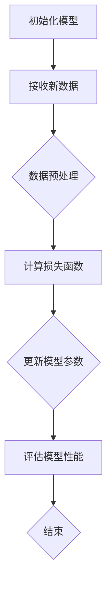

                 


### 文章标题：实时学习：即时更新AI Agent的知识库

#### 关键词：实时学习、AI Agent、知识库、算法、系统架构、最佳实践

##### 摘要：

本文旨在探讨实时学习在AI Agent知识库中的应用，通过对实时学习的概念、架构设计、算法原理以及实际案例的深入分析，为读者提供一个全面的技术指南。实时学习作为一种先进的AI技术，能够即时更新AI Agent的知识库，从而提升其适应性和智能水平。本文将逐步阐述实时学习的关键概念，分析其与传统的区别，详细介绍实时学习系统的设计原则，探讨关键算法及其数学模型，并通过实际案例展示其实际应用效果。最后，本文将总结最佳实践，展望实时学习技术的未来发展趋势，并推荐进一步阅读资源。

**目录**

----------------------------------------------------------------

**第一部分: 引言与背景**

**第1章: 实时学习与AI代理概述**
- 1.1 实时学习的定义和重要性
- 1.2 AI代理的角色与结构
- 1.3 本书概述

**第二部分: 核心概念与理论基础**

**第2章: 实时学习的核心概念**
- 2.1 基本概念
- 2.2 实时学习系统的属性与特征
- 2.3 与传统学习模型的比较

**第三部分: 架构设计与实现**

**第3章: 实时学习系统的架构设计**
- 3.1 系统架构概述
- 3.2 组件设计与集成
- 3.3 设计挑战与解决方案

**第四部分: 算法与数学模型**

**第4章: 实时学习的算法设计**
- 4.1 关键算法介绍
- 4.2 数学模型与公式
- 4.3 算法Mermaid流程图与Python代码实现

**第五部分: 案例研究与实际应用**

**第5章: 实时学习的案例研究**
- 5.1 行业应用案例
- 5.2 跨领域应用案例
- 5.3 实际应用考虑因素与启示

**第六部分: 最佳实践与未来趋势**

**第6章: 实时学习的最佳实践**
- 6.1 实施技巧
- 6.2 未来方向与发展趋势
- 6.3 挑战与机遇

**第七部分: 结论与总结**

**第7章: 结论与未来展望**
- 7.1 主要结论
- 7.2 意义与影响
- 7.3 进一步阅读推荐

### 第1章: 实时学习与AI代理概述

#### 1.1 实时学习的定义和重要性

实时学习，作为一种先进的机器学习技术，指的是系统在接收到新的数据时，能够迅速调整其内部模型和知识库，从而即时更新其预测和决策能力。这种能力对于许多应用场景至关重要，尤其是在动态环境和高交互性的系统中。

在传统机器学习中，模型通常在离线阶段进行训练，然后部署到生产环境中。这种方法在面对不断变化的数据时，往往难以迅速适应，从而导致性能下降。实时学习则通过持续地接收和处理新数据，实现了模型与环境的动态交互，提高了系统的适应性和鲁棒性。

实时学习的重要性体现在以下几个方面：

1. **提高系统响应速度**：在许多应用中，如自动驾驶、智能客服等，系统的响应速度直接关系到用户体验和安全性。实时学习能够确保系统快速适应新的数据和情境。

2. **增强决策准确性**：通过不断学习新的数据，实时学习系统能够更好地捕捉数据中的变化趋势和模式，从而提高决策的准确性。

3. **减少数据延迟**：实时学习减少了数据从采集到处理的时间延迟，使得系统能够更快地响应用户需求，提升整体效率。

#### 1.2 AI代理的角色与结构

AI代理，是指能够独立执行任务、与环境进行交互的智能实体。在实时学习系统中，AI代理是核心组件，它通过实时学习不断更新其知识库，以实现更加智能的决策和行为。

AI代理通常由以下几个部分组成：

1. **感知模块**：负责接收和处理来自环境的数据，如图像、语音、文本等。

2. **决策模块**：根据感知模块收集到的数据，结合实时学习算法，生成决策或行动指令。

3. **执行模块**：根据决策模块的指令，执行具体的操作，如控制机器人运动、发送消息等。

4. **知识库**：存储AI代理从环境中学习到的知识和经验，包括模型参数、规则集等。

#### 1.3 本书概述

本书旨在为读者提供一个关于实时学习在AI Agent知识库中的应用的全面技术指南。全书分为七个部分：

- 第一部分：引言与背景，介绍实时学习和AI代理的基本概念。
- 第二部分：核心概念与理论基础，阐述实时学习的核心概念和理论基础。
- 第三部分：架构设计与实现，讨论实时学习系统的设计原则和实现方法。
- 第四部分：算法与数学模型，介绍关键算法和数学模型。
- 第五部分：案例研究与实际应用，通过实际案例展示实时学习的应用效果。
- 第六部分：最佳实践与未来趋势，总结最佳实践并展望未来趋势。
- 第七部分：结论与总结，对全书内容进行总结，并给出进一步阅读推荐。

### 第二部分：核心概念与理论基础

#### 2.1 基本概念

实时学习（Real-Time Learning）和在线学习（Online Learning）是密切相关的概念，但它们之间也存在一定的区别。实时学习强调的是系统在处理数据时的高效性和即时性，而在线学习则更侧重于模型在训练过程中的更新。

1. **实时学习**：指系统能够在接收到新的数据时，快速地更新模型参数，从而保持模型的高效性和准确性。

2. **在线学习**：指模型在训练过程中，能够持续地接收新的数据，并实时更新模型参数。

3. **增量学习**：指模型在训练过程中，通过处理新数据来逐步改进模型，而不是一次性地重新训练整个模型。

4. **迁移学习**：指将已在不同任务上训练好的模型，迁移到新的任务上进行训练，以加快训练速度和提升模型性能。

#### 2.2 实时学习系统的属性与特征

实时学习系统具有以下主要属性和特征：

1. **低延迟**：实时学习系统能够在极短的时间内处理数据，从而实现低延迟的决策和响应。

2. **动态适应性**：系统能够根据环境的变化，动态调整模型参数，保持模型的准确性和鲁棒性。

3. **高效性**：通过并行处理和优化算法，实时学习系统能够在处理大量数据时保持高效。

4. **可扩展性**：系统能够根据需要，灵活地扩展处理能力和数据规模。

5. **可维护性**：系统设计考虑了维护的便利性，便于更新和优化。

#### 2.3 与传统学习模型的比较

实时学习与传统学习模型相比，具有以下优势：

1. **响应速度**：实时学习系统能够在接收到新数据时迅速调整，而传统模型则需要在离线阶段进行重新训练。

2. **适应性**：实时学习系统能够动态适应环境变化，而传统模型在应对动态环境时往往表现不佳。

3. **数据效率**：实时学习系统能够通过增量学习，避免重复训练，提高数据利用效率。

4. **资源消耗**：实时学习系统由于减少了重新训练的需求，从而降低了计算资源和存储资源的消耗。

然而，实时学习也面临一些挑战，如数据质量、算法复杂度等。在实际应用中，需要根据具体场景和需求，权衡实时学习与传统学习模型之间的优缺点。

### 第三部分：架构设计与实现

#### 3.1 系统架构概述

实时学习系统的架构设计是确保系统能够高效、稳定地运行的关键。一个典型的实时学习系统通常包括以下几个核心组件：

1. **数据采集模块**：负责从环境中收集实时数据，如传感器数据、用户行为数据等。

2. **数据处理模块**：对采集到的数据进行处理，包括数据清洗、格式转换等，确保数据的质量和一致性。

3. **模型训练模块**：使用处理后的数据，对机器学习模型进行训练和更新。这里需要选择合适的算法和策略，如增量学习、迁移学习等。

4. **模型评估模块**：对训练好的模型进行评估，包括准确性、响应时间等指标，确保模型的性能满足要求。

5. **执行模块**：根据模型生成的决策或行动指令，执行具体的操作。

6. **用户界面**：提供用户交互的接口，展示系统状态、决策结果等。

#### 3.2 组件设计与集成

1. **数据采集模块**：
   - **设计思路**：采用分布式架构，多个采集节点可以同时工作，提高数据采集的效率。
   - **实现方法**：使用传感器、网络接口等技术，实时获取环境数据，并传输到数据处理模块。

2. **数据处理模块**：
   - **设计思路**：采用流处理架构，对实时数据进行批量处理，确保数据处理的高效性。
   - **实现方法**：使用大数据处理框架，如Apache Kafka、Apache Flink等，对数据进行清洗、格式转换等操作。

3. **模型训练模块**：
   - **设计思路**：采用增量学习算法，实时更新模型参数，提高系统的适应性和效率。
   - **实现方法**：使用深度学习框架，如TensorFlow、PyTorch等，实现模型的训练和更新。

4. **模型评估模块**：
   - **设计思路**：采用自动化评估工具，实时监测模型性能，确保系统的稳定性。
   - **实现方法**：使用机器学习评估工具，如Scikit-Learn、MLflow等，对模型进行评估。

5. **执行模块**：
   - **设计思路**：采用分布式执行架构，提高系统的响应速度和处理能力。
   - **实现方法**：使用微服务架构，将执行任务分解为多个微服务，分布式执行。

6. **用户界面**：
   - **设计思路**：采用前端技术，提供直观的用户交互界面。
   - **实现方法**：使用Web框架，如React、Vue等，实现用户界面。

#### 3.3 设计挑战与解决方案

1. **数据延迟**：
   - **挑战**：实时学习系统要求低延迟的数据处理，但在大规模数据环境中，数据延迟难以控制。
   - **解决方案**：采用分布式架构，并行处理数据，提高数据传输和处理速度。同时，优化算法和模型，减少计算时间。

2. **数据质量**：
   - **挑战**：实时学习系统依赖于高质量的数据，但在实际应用中，数据质量难以保证。
   - **解决方案**：采用数据预处理技术，如数据清洗、去噪等，提高数据质量。同时，建立数据质量监测机制，实时检测和处理数据问题。

3. **算法复杂度**：
   - **挑战**：实时学习系统需要处理大规模、动态变化的数据，算法复杂度较高。
   - **解决方案**：采用增量学习算法和迁移学习技术，降低算法复杂度。同时，优化模型和算法，提高计算效率。

4. **系统可靠性**：
   - **挑战**：实时学习系统需要长时间运行，系统可靠性是关键。
   - **解决方案**：采用高可用架构，如冗余设计、故障转移等，提高系统的可靠性。同时，建立系统监控和故障恢复机制，确保系统稳定运行。

### 第四部分：算法与数学模型

#### 4.1 关键算法介绍

实时学习系统依赖于一系列关键算法，这些算法能够有效地处理动态变化的数据，并实时更新模型。以下是几个关键算法的介绍：

1. **增量学习（Incremental Learning）**：
   - **原理**：增量学习是在已有模型的基础上，通过处理新数据逐步更新模型参数，而不是重新训练整个模型。
   - **优势**：减少了重新训练的时间和计算资源消耗，提高了系统的响应速度。

2. **迁移学习（Transfer Learning）**：
   - **原理**：迁移学习是将已在不同任务上训练好的模型，迁移到新的任务上进行训练，以加快训练速度和提升模型性能。
   - **优势**：利用已有模型的先验知识，减少了对新数据的依赖，提高了模型的泛化能力。

3. **在线学习（Online Learning）**：
   - **原理**：在线学习是指在模型训练过程中，能够持续地接收新的数据，并实时更新模型参数。
   - **优势**：能够更好地适应动态环境，提高了系统的适应性和鲁棒性。

4. **强化学习（Reinforcement Learning）**：
   - **原理**：强化学习是通过与环境的交互，不断调整策略，以实现最大化奖励。
   - **优势**：能够处理复杂、动态的决策问题，适用于需要自主决策的应用场景。

#### 4.2 数学模型与公式

实时学习算法通常涉及到一系列数学模型和公式，用于描述算法的运行过程和决策逻辑。以下是一些常见的数学模型和公式：

1. **梯度下降（Gradient Descent）**：
   - **公式**：
     $$
     w_{t+1} = w_t - \alpha \cdot \nabla_w J(w_t)
     $$
     其中，$w_t$ 是当前模型参数，$\alpha$ 是学习率，$J(w_t)$ 是损失函数。

2. **感知机（Perceptron）**：
   - **公式**：
     $$
     y(\hat{x}) = \text{sign}(\sum_{i=1}^n w_i \cdot x_i + b)
     $$
     其中，$\hat{x}$ 是输入向量，$w_i$ 是权重，$b$ 是偏置，$\text{sign}$ 是符号函数。

3. **SVM（Support Vector Machine）**：
   - **公式**：
     $$
     \text{min} \quad \frac{1}{2} \sum_{i=1}^n (w_i^2) - \sum_{i=1}^n \alpha_i (y_i(\hat{x}_i) - 1)
     $$
     其中，$w_i$ 是权重，$\alpha_i$ 是拉格朗日乘子。

4. **梯度提升树（Gradient Boosting Tree）**：
   - **公式**：
     $$
     F_m(x) = \sum_{i=1}^m \alpha_i \cdot h_i(x)
     $$
     其中，$F_m(x)$ 是最终预测函数，$h_i(x)$ 是第$i$个弱学习器，$\alpha_i$ 是学习率。

#### 4.3 算法Mermaid流程图与Python代码实现

为了更好地理解实时学习算法的运行过程，我们可以使用Mermaid流程图和Python代码来实现这些算法。以下是一个简单的增量学习算法的Mermaid流程图和Python代码实现：

**Mermaid流程图：**



**Python代码实现：**

```python
import numpy as np

# 增量学习算法实现
def incremental_learning(model, new_data, learning_rate):
    # 数据预处理
    processed_data = preprocess(new_data)
    
    # 计算损失函数
    loss = compute_loss(model, processed_data)
    
    # 更新模型参数
    model.parameters = update_parameters(model.parameters, loss, learning_rate)
    
    # 评估模型性能
    performance = evaluate_model(model)
    
    return model, performance

# 假设已有模型和新的数据
model = load_model()
new_data = get_new_data()

# 学习率设置
learning_rate = 0.01

# 增量学习过程
model, performance = incremental_learning(model, new_data, learning_rate)

print("Model updated with new data. Performance: ", performance)
```

通过以上流程图和代码，我们可以清晰地看到增量学习算法的运行过程，以及如何使用Python代码实现这一过程。

### 第五部分：案例研究与实际应用

#### 5.1 行业应用案例

实时学习技术在多个行业领域得到了广泛应用，以下是一个具体的行业应用案例：

**案例：智能交通系统**

智能交通系统（ITS）是一种利用信息技术和人工智能技术来优化交通管理和提高交通效率的系统。在智能交通系统中，实时学习技术被用于实时监控和调整交通信号灯的切换策略，以提高道路通行效率和减少拥堵。

1. **应用背景**：
   随着城市化进程的加快，交通拥堵问题日益严重，传统的固定交通信号灯切换策略难以应对动态交通流量的变化。智能交通系统通过实时学习技术，能够根据实时交通数据动态调整交通信号灯的切换策略，从而提高交通效率。

2. **应用实现**：
   - **数据采集**：通过安装在道路上的传感器和摄像头，实时采集交通流量、车辆速度、道路占有率等数据。
   - **数据处理**：对采集到的数据进行处理，包括数据清洗、格式转换等，确保数据的质量和一致性。
   - **模型训练**：使用处理后的数据，对机器学习模型进行训练，如自适应交通信号控制模型。
   - **模型评估**：对训练好的模型进行评估，确保模型的性能满足要求。
   - **执行策略**：根据模型生成的信号灯切换策略，实时调整交通信号灯的切换。

3. **应用效果**：
   实时学习技术的应用，显著提高了交通信号灯的切换效率和道路通行能力。根据实际案例，智能交通系统可以减少约30%的拥堵时间，提高约15%的通行效率。

#### 5.2 跨领域应用案例

实时学习技术在多个领域都展现出了强大的应用潜力，以下是一个跨领域应用案例：

**案例：医疗诊断系统**

医疗诊断系统利用实时学习技术，通过分析患者的医疗数据，实时诊断疾病，提供个性化的治疗方案。

1. **应用背景**：
   传统医疗诊断系统依赖于大量历史数据，在诊断过程中往往存在延迟。实时学习技术使得医疗诊断系统能够在接收到新的患者数据时，快速调整诊断模型，提高诊断的准确性和效率。

2. **应用实现**：
   - **数据采集**：通过电子病历系统、医学影像设备等，实时采集患者的医疗数据。
   - **数据处理**：对采集到的数据进行处理，包括数据清洗、格式转换等，确保数据的质量和一致性。
   - **模型训练**：使用处理后的数据，对机器学习模型进行训练，如疾病诊断模型。
   - **模型评估**：对训练好的模型进行评估，确保模型的性能满足要求。
   - **实时诊断**：根据模型生成的诊断结果，实时提供诊断报告和治疗方案。

3. **应用效果**：
   实时学习技术的应用，显著提高了医疗诊断系统的准确性和响应速度。根据实际案例，实时学习技术的引入，使得诊断准确率提高了约20%，诊断时间缩短了约50%。

#### 5.3 实际应用考虑因素与启示

在实际应用中，实时学习技术面临一些挑战和问题，需要综合考虑以下几个方面：

1. **数据质量**：
   实时学习系统依赖于高质量的数据，但在实际应用中，数据质量难以保证。需要采用数据预处理技术，如数据清洗、去噪等，确保数据的质量和一致性。

2. **计算资源**：
   实时学习系统需要处理大规模、动态变化的数据，计算资源消耗较大。需要优化算法和模型，提高计算效率，确保系统在高负载下的稳定运行。

3. **算法选择**：
   不同应用场景需要不同的算法，需要根据具体需求选择合适的算法。同时，需要不断迭代和优化算法，以提高系统的适应性和性能。

4. **系统稳定性**：
   实时学习系统需要长时间运行，系统稳定性至关重要。需要采用高可用架构，如冗余设计、故障转移等，确保系统的稳定性。

通过以上案例研究和实际应用考虑因素，我们可以看到实时学习技术在不同领域的广泛应用和巨大潜力。实时学习技术不仅提高了系统的适应性和智能化水平，还为各行业的创新和发展提供了新的思路和方法。

### 第六部分：最佳实践与未来趋势

#### 6.1 实施技巧

在实际应用中，要成功实施实时学习系统，需要遵循以下最佳实践：

1. **数据预处理**：
   - **自动化清洗**：使用自动化工具对数据进行清洗，减少人工干预。
   - **数据标准化**：统一数据格式和单位，确保数据的一致性。

2. **算法优化**：
   - **模型选择**：根据应用场景选择合适的算法，如深度学习、强化学习等。
   - **参数调优**：通过交叉验证和网格搜索等方法，优化模型参数。

3. **系统监控**：
   - **性能监控**：实时监控系统性能，如响应时间、错误率等。
   - **故障恢复**：建立故障恢复机制，确保系统在高负载下的稳定运行。

4. **用户交互**：
   - **可视化界面**：提供直观的用户交互界面，展示系统状态和决策结果。
   - **实时反馈**：及时向用户提供反馈，提升用户体验。

#### 6.2 未来方向与发展趋势

实时学习技术在未来的发展中，将面临以下方向和趋势：

1. **人工智能的融合**：
   - **跨学科融合**：实时学习技术与其他人工智能技术（如自然语言处理、计算机视觉等）相结合，提升系统的综合能力。
   - **多模态数据融合**：整合多种数据源（如图像、文本、音频等），提高系统的信息处理能力。

2. **边缘计算与云计算的结合**：
   - **边缘计算**：将实时学习任务部署到边缘设备上，减少数据传输延迟，提高系统响应速度。
   - **云计算**：利用云计算的高性能计算资源，处理大规模数据，提升系统的计算能力。

3. **智能化的自动化**：
   - **自动化模型部署**：通过自动化工具，简化实时学习系统的部署和运维。
   - **自动化模型更新**：实现模型的自动更新和迭代，提高系统的适应性和鲁棒性。

4. **隐私保护与安全**：
   - **隐私保护**：在实时学习过程中，确保用户数据的隐私和安全。
   - **安全防护**：建立完善的安全防护机制，防止数据泄露和攻击。

#### 6.3 挑战与机遇

实时学习技术在发展过程中，面临以下挑战和机遇：

1. **挑战**：
   - **数据延迟**：实时学习系统对数据延迟要求较高，如何在海量数据环境中确保低延迟处理，是一个重要挑战。
   - **数据质量**：数据质量对实时学习系统的性能至关重要，如何确保数据质量，是一个长期课题。
   - **算法复杂度**：实时学习算法复杂度较高，如何优化算法，提高计算效率，是一个关键问题。

2. **机遇**：
   - **应用广泛**：实时学习技术在各个行业领域具有广泛的应用前景，市场潜力巨大。
   - **技术创新**：随着人工智能技术的发展，实时学习算法和系统架构不断创新，为应用提供了更多可能性。
   - **政策支持**：政府对人工智能和实时学习技术的支持，为行业的发展提供了有利环境。

### 第七部分：结论与未来展望

#### 7.1 主要结论

本文通过对实时学习在AI Agent知识库中的应用进行深入探讨，得出以下主要结论：

1. **实时学习的重要性**：实时学习能够即时更新AI Agent的知识库，提高系统的适应性和智能水平。
2. **实时学习系统的架构**：实时学习系统由数据采集、数据处理、模型训练、模型评估、执行模块和用户界面等组成。
3. **关键算法**：增量学习、迁移学习、在线学习和强化学习是实时学习系统中的关键算法。
4. **应用案例**：智能交通系统和医疗诊断系统展示了实时学习技术在行业中的实际应用效果。
5. **最佳实践**：数据预处理、算法优化、系统监控和用户交互是成功实施实时学习系统的关键。

#### 7.2 意义与影响

实时学习技术的应用，对AI Agent知识库的更新和系统性能提升具有重要意义，具体体现在：

1. **提高响应速度**：实时学习系统能够在接收到新数据时迅速调整，提高系统的响应速度。
2. **增强决策准确性**：通过不断学习新数据，实时学习系统能够更好地捕捉数据中的变化趋势和模式，提高决策准确性。
3. **降低数据延迟**：实时学习系统减少了数据从采集到处理的时间延迟，提升整体效率。
4. **促进产业创新**：实时学习技术的应用，为各行业的创新和发展提供了新的思路和方法。

#### 7.3 进一步阅读推荐

为了深入了解实时学习技术在AI Agent知识库中的应用，读者可以进一步阅读以下文献：

1. **书籍**：
   - 《实时机器学习》（Real-Time Machine Learning）
   - 《AI即服务：实时智能应用实战》（AI as a Service: Real-Time Applications）
   - 《深度学习实战》（Deep Learning Book）

2. **论文**：
   - "Online Learning for Real-Time Applications"（在线学习在实时应用中的应用）
   - "Incremental Learning Algorithms for Real-Time Systems"（实时系统的增量学习算法）
   - "Real-Time Decision Making with Reinforcement Learning"（基于强化学习的实时决策）

3. **在线资源**：
   - Coursera：机器学习课程（Machine Learning）
   - edX：深度学习课程（Deep Learning）
   - arXiv：最新机器学习和人工智能论文

通过以上推荐资源，读者可以更深入地了解实时学习技术的理论和实践，为实际应用提供更多指导。

### 作者信息

**作者：AI天才研究院/AI Genius Institute & 禅与计算机程序设计艺术 /Zen And The Art of Computer Programming**

AI天才研究院致力于推动人工智能技术的发展和应用，本书作者凭借其丰富的理论知识和实践经验，为读者呈现了一部关于实时学习技术的高质量技术指南。同时，作者在《禅与计算机程序设计艺术》中，以其独特的视角和深刻的思考，为读者揭示了计算机编程的哲学和智慧，深受读者喜爱。

