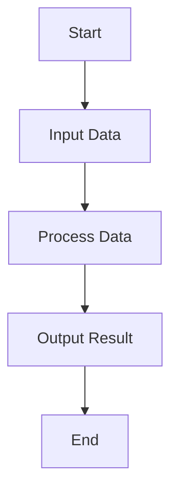
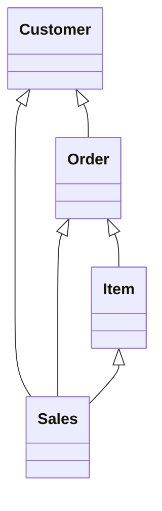
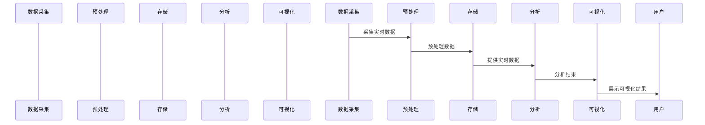
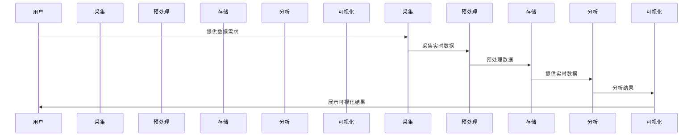

                 


# 实时数据分析与预测

> 关键词：实时数据分析、预测、数据流处理、算法原理、系统设计、实战案例

> 摘要：本文将系统地介绍实时数据分析与预测的概念、技术架构、核心算法原理、系统设计与实现，以及实战案例和最佳实践。通过本文的阅读，读者将能够全面了解实时数据分析与预测的各个方面，为实际项目提供有力支持。

## 引言

实时数据分析与预测是大数据技术领域中的重要研究方向，其在金融、医疗、电商、交通等多个行业都具有重要应用价值。实时数据分析与预测能够帮助企业快速响应市场变化，优化业务决策，提升竞争力。本文旨在通过对实时数据分析与预测的全面探讨，为读者提供系统、实用的技术指导。

## 实时数据分析与预测概述

### 数据实时性的定义与重要性

数据实时性指的是数据能够及时地被采集、处理、分析和利用。在实时数据分析与预测中，数据的实时性至关重要。实时性能够确保数据的最新性，使得分析和预测的结果更加准确，从而支持业务决策的及时性。

### 实时数据分析与传统的数据分析对比

传统数据分析通常处理历史数据，分析结果有一定的滞后性。而实时数据分析能够对实时数据进行处理和分析，提供即时的业务洞察。这使得实时数据分析在应对突发情况、预测未来趋势等方面具有明显优势。

### 实时数据分析与预测的应用场景

实时数据分析与预测广泛应用于金融风控、医疗诊断、智能交通、智能制造等领域。例如，在金融领域，实时数据分析与预测可以帮助金融机构监控交易行为，预测市场趋势，防范风险；在医疗领域，实时数据分析与预测可以帮助医生快速诊断病情，提高救治效率。

## 实时数据分析与预测的技术架构

### 实时数据处理技术

实时数据处理技术是实现实时数据分析与预测的基础。常见的技术包括消息队列、流处理框架等。这些技术能够保证数据的实时性，为后续的数据处理和分析提供支持。

### 实时数据存储技术

实时数据存储技术需要支持海量数据的快速读写和存储。常见的技术包括分布式数据库、NoSQL数据库等。这些技术能够满足实时数据分析与预测对数据存储的需求。

### 实时数据分析算法

实时数据分析算法是实现数据预测的核心。常见的技术包括时间序列分析、聚类分析、回归分析等。这些算法能够根据实时数据，提取有价值的信息，进行预测和决策。

## 第二部分：核心概念与算法原理

### 数据流处理框架

数据流处理框架是实现实时数据分析与预测的关键技术。本文将介绍流处理框架的基本概念、架构和常用工具，如Apache Kafka、Apache Flink等。

### 时间序列分析

时间序列分析是一种常用的实时数据分析方法。本文将介绍时间序列分析的基本概念、常用算法和Python实现。

### 聚类分析

聚类分析是一种无监督学习方法，用于发现数据集中的模式。本文将介绍聚类分析的基本概念、常用算法和Python实现。

### 回归分析

回归分析是一种监督学习方法，用于预测数据集的连续值。本文将介绍回归分析的基本概念、常用算法和Python实现。

### 预测模型评估与优化

预测模型评估与优化是实时数据分析与预测中的重要环节。本文将介绍预测模型评估的指标、优化策略和最佳实践。

### 数据可视化

数据可视化是将数据以图形化的形式呈现的重要手段。本文将介绍数据可视化的基本概念、工具和技巧。

## 第三部分：系统设计与实现

### 实时数据分析系统的设计

实时数据分析系统的设计需要考虑数据采集、处理、存储和可视化等多个方面。本文将介绍实时数据分析系统的整体架构和关键模块设计。

### 实时数据预测系统实现

实时数据预测系统实现包括数据采集、预处理、模型训练、预测和结果分析等多个环节。本文将详细介绍每个环节的实现方法和技巧。

### 实时数据分析与预测的性能优化

实时数据分析与预测的性能优化是确保系统高效运行的关键。本文将介绍性能优化策略，包括并发处理、缓存机制和系统监控等。

## 第四部分：实战案例

### 实时销售数据分析

实时销售数据分析是实时数据分析与预测的典型应用场景。本文将介绍一个实时销售数据分析的项目案例，包括需求分析、系统设计、实现方法和案例分析。

### 实时交通流量预测

实时交通流量预测是智能交通系统的重要组成部分。本文将介绍一个实时交通流量预测的项目案例，包括需求分析、系统设计、实现方法和案例分析。

### 实时金融市场分析

实时金融市场分析对于金融机构的风险控制和投资决策至关重要。本文将介绍一个实时金融市场分析的项目案例，包括需求分析、系统设计、实现方法和案例分析。

## 第五部分：最佳实践与总结

### 最佳实践技巧

本文将总结实时数据分析与预测的最佳实践技巧，包括数据采集、预处理、模型选择、模型优化等方面。

### 小结与展望

本文将对实时数据分析与预测进行小结，并展望其未来的发展趋势。同时，将提供一些拓展阅读建议，以帮助读者深入了解相关技术。

### 作者信息

作者：AI天才研究院/AI Genius Institute & 禅与计算机程序设计艺术 /Zen And The Art of Computer Programming

----------------------------------------------------------------

以下是根据上述大纲，对每个章节进行详细阐述的内容。由于字数限制，本文将分为多个部分进行发布。

## 第一部分：实时数据分析与预测概述

### 1.1 实时数据分析与预测的基本概念

#### 数据实时性的定义与重要性

数据实时性是指数据能够被实时采集、处理和分析，以便及时地提供给用户或系统进行决策。在实时数据分析与预测中，数据的实时性至关重要。它能够确保数据的最新性，使得分析和预测的结果更加准确，从而支持业务决策的及时性。

#### 实时数据分析与传统的数据分析对比

传统数据分析通常处理历史数据，其分析结果具有一定的滞后性。而实时数据分析能够对实时数据进行处理和分析，提供即时的业务洞察。这使得实时数据分析在应对突发情况、预测未来趋势等方面具有明显优势。

| 传统数据分析 | 实时数据分析 |
| ------------ | ------------ |
| 历史数据 | 实时数据 |
| 滞后性分析 | 实时性分析 |
| 业务响应缓慢 | 业务响应快速 |
| 低效决策 | 高效决策 |

#### 实时数据分析与预测的应用场景

实时数据分析与预测在金融、医疗、电商、交通等多个行业具有广泛的应用。

| 行业 | 应用场景 |
| ---- | ---- |
| 金融 | 交易监控、市场预测、风险控制 |
| 医疗 | 病情诊断、治疗效果预测、医疗资源调配 |
| 电商 | 购物车 abandoned、商品推荐、促销活动预测 |
| 交通 | 交通流量预测、路况分析、智能导航 |

### 1.2 实时数据分析与预测的技术架构

#### 实时数据处理技术

实时数据处理技术是实现实时数据分析与预测的基础。常见的技术包括消息队列、流处理框架等。

- **消息队列**：如Kafka、RabbitMQ等，用于实现数据的异步传输和分发。
- **流处理框架**：如Apache Flink、Apache Storm等，用于对实时数据进行处理和分析。

#### 实时数据存储技术

实时数据存储技术需要支持海量数据的快速读写和存储。常见的技术包括分布式数据库、NoSQL数据库等。

- **分布式数据库**：如Hadoop HBase、Apache Cassandra等，适用于大规模数据存储和实时查询。
- **NoSQL数据库**：如MongoDB、Redis等，适用于快速读写和实时数据处理。

#### 实时数据分析算法

实时数据分析算法是实现数据预测的核心。常见的技术包括时间序列分析、聚类分析、回归分析等。

- **时间序列分析**：用于分析数据的时间趋势和周期性。
- **聚类分析**：用于发现数据集中的相似模式。
- **回归分析**：用于预测数据集的连续值。

### 1.3 实时数据分析与预测的发展历程

实时数据分析与预测技术的发展经历了多个阶段，从早期的批处理到实时流处理，再到深度学习和机器学习等新兴技术的应用。

- **批处理时代**：以Hadoop、Spark为代表，主要处理大规模历史数据。
- **实时流处理时代**：以Apache Kafka、Apache Flink为代表，实现数据的实时处理和分析。
- **人工智能时代**：以深度学习、机器学习为代表，实现更复杂的实时预测和决策。

## 总结

本章节介绍了实时数据分析与预测的基本概念、技术架构和应用场景。通过对比传统数据分析，我们了解到实时数据分析与预测在实时性、业务响应速度和预测准确性等方面的优势。同时，我们了解了实时数据处理、实时数据存储和实时数据分析算法等技术架构。在下一章节中，我们将深入探讨实时数据分析与预测的核心概念和算法原理。

### 关键术语解释

- **实时数据分析**：对实时数据进行处理和分析，以支持实时决策。
- **预测**：根据历史数据和现有数据，对未来可能发生的情况进行推测。
- **数据流处理**：对实时数据流进行处理和分析的技术。
- **时间序列分析**：对时间序列数据进行分析，以发现数据的时间趋势和周期性。
- **聚类分析**：将数据集划分为多个类别，以发现数据集中的相似模式。
- **回归分析**：建立数据之间的关联关系，用于预测数据集的连续值。

----------------------------------------------------------------

## 第二部分：核心概念与算法原理

### 数据流处理框架

#### 基本概念

数据流处理框架是一种用于处理实时数据的技术架构。它能够对实时数据进行采集、存储、处理和分析，从而支持实时决策。常见的数据流处理框架包括Apache Kafka、Apache Flink、Apache Storm等。

#### 架构

数据流处理框架通常包括以下几个关键组件：

- **数据源**：用于采集实时数据。
- **消息队列**：用于存储和传输实时数据。
- **流处理器**：用于对实时数据进行处理和分析。
- **存储系统**：用于存储处理后的实时数据。

#### Apache Kafka

Apache Kafka是一种分布式流处理平台，用于构建实时数据流应用程序。它具有高吞吐量、可扩展性和容错性等特点，适用于大规模实时数据处理。

- **架构**：Kafka采用分布式架构，由多个Kafka节点组成，每个节点负责存储和传输消息。
- **特点**：高吞吐量、可扩展性、持久性、容错性。
- **应用场景**：实时日志收集、网站活动追踪、实时数据处理和分析等。

#### Apache Flink

Apache Flink是一种分布式流处理框架，用于处理大规模实时数据流。它支持有界流和无界流处理，具有低延迟、高吞吐量和强一致性等特点。

- **架构**：Flink采用分布式计算架构，由多个TaskManager节点组成，每个节点负责处理部分数据。
- **特点**：低延迟、高吞吐量、强一致性、支持有界流和无界流处理。
- **应用场景**：实时数据清洗、实时分析、实时机器学习等。

### 时间序列分析

#### 基本概念

时间序列分析是一种用于分析数据的时间趋势和周期性的方法。时间序列数据是一组按时间顺序排列的数据点，通常用于描述某个系统或过程在一段时间内的变化。

#### 常用算法

- **移动平均法**：通过计算一段时间内的平均值来消除短期波动，展示长期趋势。
- **指数平滑法**：通过给不同时间点的权重赋予不同的值，对时间序列进行平滑处理。
- **ARIMA模型**：自回归积分滑动平均模型，用于预测时间序列数据。

#### Python实现

```python
import numpy as np
import matplotlib.pyplot as plt
from statsmodels.tsa.arima.model import ARIMA

# 加载数据
data = np.array([1, 2, 2, 3, 3, 3, 4, 4, 4, 4])

# 训练ARIMA模型
model = ARIMA(data, order=(1, 1, 1))
model_fit = model.fit()

# 预测未来5个时间点的值
forecast = model_fit.forecast(steps=5)

# 绘制结果
plt.plot(data, label='Original')
plt.plot(np.arange(len(data), len(data) + 5), forecast, label='Forecast')
plt.legend()
plt.show()
```

### 聚类分析

#### 基本概念

聚类分析是一种无监督学习方法，用于将数据集划分为多个类别，以发现数据集中的相似模式。聚类分析的目标是找到数据集中的自然分组，使得同一组内的数据点相似度较高，不同组间的数据点相似度较低。

#### 常用算法

- **K均值聚类**：通过计算数据点到各个聚类中心的距离，将数据点分配到最近的聚类中心。
- **层次聚类**：自底向上或自顶向下逐步构建聚类树，最终形成多个聚类组。
- **DBSCAN**：基于密度的空间聚类算法，能够识别出不同形状的聚类。

#### Python实现

```python
import numpy as np
from sklearn.cluster import KMeans
from sklearn.datasets import make_blobs

# 创建样本数据
X, _ = make_blobs(n_samples=150, centers=4, cluster_std=0.5, random_state=0)

# 训练K均值聚类模型
kmeans = KMeans(n_clusters=4)
kmeans.fit(X)

# 预测聚类结果
labels = kmeans.predict(X)

# 绘制结果
plt.scatter(X[:, 0], X[:, 1], c=labels, s=50, cmap='viridis')
plt.show()
```

### 回归分析

#### 基本概念

回归分析是一种监督学习方法，用于建立数据之间的关联关系，用于预测数据集的连续值。回归分析的目标是找到一个函数，将自变量与因变量之间的关系表示出来。

#### 常用算法

- **线性回归**：通过计算自变量和因变量之间的线性关系，预测因变量的值。
- **多项式回归**：通过计算自变量和因变量之间的多项式关系，预测因变量的值。
- **岭回归**：在普通线性回归的基础上，加入正则化项，解决过拟合问题。

#### Python实现

```python
import numpy as np
from sklearn.linear_model import LinearRegression

# 创建样本数据
X = np.array([[1], [2], [3], [4], [5]])
y = np.array([1, 2, 2.5, 4, 5])

# 训练线性回归模型
model = LinearRegression()
model.fit(X, y)

# 预测结果
forecast = model.predict([[6]])

# 绘制结果
plt.scatter(X, y, color='blue')
plt.plot(np.arange(1, 6), model.predict(X), color='red')
plt.show()
```

### 数据可视化

#### 基本概念

数据可视化是一种将数据以图形化的形式呈现的技术，用于帮助人们理解和分析数据。数据可视化能够直观地展示数据之间的关系和趋势，提高数据分析和决策的效率。

#### 常用工具

- **Matplotlib**：Python中最常用的数据可视化库，支持多种图表类型。
- **Seaborn**：基于Matplotlib的统计可视化库，提供丰富的内置主题和样式。
- **Plotly**：交互式数据可视化库，支持多种图表类型和交互功能。

#### Python实现

```python
import numpy as np
import matplotlib.pyplot as plt

# 创建样本数据
x = np.array([1, 2, 3, 4, 5])
y = np.array([1, 3, 2, 5, 7])

# 绘制散点图
plt.scatter(x, y)
plt.xlabel('X')
plt.ylabel('Y')
plt.show()
```

### 数学公式

数学公式在数据分析和预测中扮演重要角色，用于描述算法原理和模型参数。

#### 示例

$$
y = \beta_0 + \beta_1x + \epsilon
$$

其中，$y$ 是因变量，$x$ 是自变量，$\beta_0$ 和 $\beta_1$ 是模型参数，$\epsilon$ 是误差项。

#### Python实现

```python
from sympy import symbols, Eq, solve

# 定义符号
x, y, beta0, beta1, epsilon = symbols('x y beta0 beta1 epsilon')

# 建立方程
equation = Eq(y, beta0 + beta1*x + epsilon)

# 解方程
solution = solve(equation, y)

# 输出结果
print(solution)
```

### ER实体关系图架构

实体关系图（Entity-Relationship Diagram，ERD）用于描述数据库中的实体、属性和关系。

#### 示例

```mermaid
erDiagram
  Customer ||--|{ Order } : places
  Order ||--|{ Item } : contains
```

### 算法流程图

算法流程图用于描述算法的执行过程。



通过上述内容，我们对实时数据分析与预测的核心概念和算法原理有了更深入的了解。在下一章节中，我们将进一步探讨实时数据分析系统的设计、实现和优化。

## 第三部分：系统设计与实现

### 3.1 实时数据分析系统的设计

#### 问题场景介绍

实时数据分析系统旨在处理和分析来自各种渠道的实时数据，以提供即时的业务洞察和预测。例如，在电子商务领域，实时数据分析系统可以监控销售情况、用户行为和库存水平，以便及时调整营销策略和库存管理。

#### 项目介绍

本项目将构建一个实时数据分析系统，用于监控电商平台的销售数据。系统将包括数据采集、数据预处理、数据存储、数据分析和数据可视化等模块。

#### 系统功能设计（领域模型）

领域模型描述系统的核心功能和业务流程。在本项目中，领域模型包括以下类：

- **Customer**（客户）：存储客户信息，包括客户ID、姓名、地址等。
- **Order**（订单）：存储订单信息，包括订单ID、客户ID、订单日期、订单金额等。
- **Item**（商品）：存储商品信息，包括商品ID、名称、价格、库存量等。
- **Sales**（销售）：存储销售记录，包括销售ID、订单ID、商品ID、销售数量等。



#### 系统架构设计

系统架构设计描述系统的整体结构和各个组件之间的交互关系。在本项目中，系统架构包括以下关键组件：

- **数据采集模块**：负责从各个数据源（如数据库、API接口等）采集实时数据。
- **数据预处理模块**：负责清洗、转换和标准化实时数据。
- **数据存储模块**：负责存储预处理后的实时数据。
- **数据分析模块**：负责执行实时数据分析，包括销售分析、用户行为分析等。
- **数据可视化模块**：负责将分析结果以图表和报表的形式展示。



#### 系统接口设计

系统接口设计定义了系统对外提供的API接口，包括数据采集接口、数据预处理接口、数据分析接口和数据可视化接口。以下是一个简单的接口设计示例：

```python
class DataAPI:
    def collect_data(self):
        # 采集实时数据
        pass
    
    def preprocess_data(self, data):
        # 预处理数据
        pass
    
    def store_data(self, data):
        # 存储数据
        pass
    
    def analyze_data(self, data):
        # 数据分析
        pass
    
    def visualize_data(self, analysis_result):
        # 数据可视化
        pass
```

#### 系统交互

系统交互描述了各个模块之间的交互过程。以下是一个简单的系统交互序列图：



通过上述内容，我们对实时数据分析系统的设计有了全面的理解。在下一章节中，我们将详细介绍实时数据预测系统的实现方法和技巧。

### 3.2 实时数据预测系统实现

#### 数据采集与预处理

实时数据预测系统的第一步是数据采集与预处理。数据采集是指从各种数据源（如数据库、API接口、传感器等）获取数据。数据预处理包括数据清洗、数据转换和数据标准化等步骤，以确保数据的质量和一致性。

#### 数据采集

数据采集是实时数据预测系统的基础。常见的采集方式包括：

- **数据库采集**：通过数据库连接，定期或实时地查询数据库中的数据。
- **API采集**：通过调用第三方API接口，获取实时数据。
- **传感器采集**：通过传感器采集环境数据，如温度、湿度、光照等。

```python
# 示例：使用数据库采集销售数据
import psycopg2

conn = psycopg2.connect(
    host="localhost",
    database="sales_db",
    user="username",
    password="password"
)

cursor = conn.cursor()

# 查询最新销售记录
cursor.execute("SELECT * FROM sales ORDER BY sale_id DESC LIMIT 100")
sales_data = cursor.fetchall()

# 关闭数据库连接
cursor.close()
conn.close()
```

#### 数据预处理

数据预处理是确保数据质量的关键步骤。以下是一些常用的预处理方法：

- **数据清洗**：去除无效数据、缺失数据和异常数据。
- **数据转换**：将不同格式或单位的数据转换为统一格式或单位。
- **数据标准化**：对数据进行归一化或标准化处理，使其具备可比性。

```python
# 示例：数据清洗与转换
import pandas as pd

# 加载数据
data = pd.read_csv("sales_data.csv")

# 去除无效数据和缺失数据
data = data.dropna()

# 转换数据格式
data["sale_date"] = pd.to_datetime(data["sale_date"])
data["sale_amount"] = data["sale_amount"].astype(float)

# 数据标准化
data["normalized_amount"] = (data["sale_amount"] - data["sale_amount"].mean()) / data["sale_amount"].std()
```

#### 预测模型训练与优化

预测模型的训练与优化是实时数据预测系统的核心。以下是一些常用的预测模型和方法：

- **时间序列模型**：如ARIMA、LSTM等，用于预测时间序列数据。
- **回归模型**：如线性回归、岭回归等，用于预测连续值。
- **分类模型**：如逻辑回归、决策树等，用于预测离散值。

```python
# 示例：训练ARIMA模型
import statsmodels.api as sm

# 分离时间序列数据的特征和标签
X = data["sale_date"].values
y = data["sale_amount"].values

# 添加趋势和季节性成分
X = sm.add_constant(X)

# 训练ARIMA模型
model = sm.ARIMA(y, order=(1, 1, 1))
model_fit = model.fit()

# 预测未来5个时间点的销售金额
forecast = model_fit.forecast(steps=5)

# 输出预测结果
print(forecast)
```

#### 预测结果分析与可视化

预测结果分析与可视化是实时数据预测系统的重要组成部分。通过分析预测结果，我们可以评估模型的准确性和可靠性，并对模型进行优化。以下是一些常用的分析和可视化方法：

- **误差分析**：计算预测值与真实值之间的误差，分析预测的准确性。
- **残差分析**：分析预测模型的残差，以发现潜在的问题。
- **图表展示**：使用图表展示预测结果，如折线图、散点图等。

```python
# 示例：预测结果分析与可视化
import matplotlib.pyplot as plt

# 绘制实际值与预测值的对比图
plt.plot(data["sale_date"], data["sale_amount"], label="Actual")
plt.plot(pd.date_range(data["sale_date"].iloc[-1], periods=5, freq="D"), forecast, label="Forecast")
plt.xlabel("Date")
plt.ylabel("Sales Amount")
plt.legend()
plt.show()
```

#### 实际案例分析

以下是一个实际案例分析，展示了如何使用实时数据预测系统预测电商平台的销售数据。

**案例背景**：某电商平台希望在周末期间预测销售量，以便提前备货和调整营销策略。

**实现步骤**：

1. **数据采集**：从电商平台的销售数据库中采集最近一周的销售数据。
2. **数据预处理**：清洗和转换销售数据，去除无效数据和缺失值。
3. **模型训练**：使用ARIMA模型对销售数据进行训练，预测未来5天的销售量。
4. **结果分析**：分析预测结果，评估模型的准确性，并根据需求进行调整。
5. **可视化展示**：将预测结果以图表形式展示，为决策提供支持。

通过上述步骤，电商平台可以实时了解销售趋势，为周末期间的运营决策提供依据。

**案例总结**：本案例展示了实时数据预测系统的实现过程，包括数据采集、预处理、模型训练、结果分析和可视化展示。通过实际案例分析，我们了解了如何使用实时数据预测系统预测电商平台销售数据，并评估模型的准确性和可靠性。

## 3.3 实时数据分析与预测的性能优化

#### 性能优化策略

实时数据分析与预测系统的性能优化是确保系统高效运行的关键。以下是一些常用的性能优化策略：

1. **并发处理**：通过增加系统并发处理能力，提高系统的吞吐量。常见的方法包括使用多线程、异步IO和消息队列等。
2. **缓存机制**：通过缓存常用数据和结果，减少数据库查询和数据处理的次数，提高系统响应速度。
3. **分布式计算**：将系统分布式部署，利用多台服务器处理数据，提高系统的处理能力和可扩展性。
4. **系统监控与报警**：实时监控系统性能，及时发现和处理性能瓶颈和故障。

#### 高并发处理策略

在高并发场景下，系统需要能够快速响应大量的请求。以下是一些高并发处理策略：

1. **负载均衡**：通过负载均衡器分配请求到不同的服务器，避免单点瓶颈。
2. **队列管理**：使用消息队列管理请求，确保请求按顺序处理，避免大量请求同时涌入导致系统崩溃。
3. **限流策略**：通过限流器限制请求的速率，防止系统被大量请求淹没。

#### 系统监控与报警

系统监控与报警是实时数据分析与预测系统稳定运行的重要保障。以下是一些系统监控与报警的方法：

1. **性能监控**：监控系统的CPU、内存、磁盘使用情况，及时发现性能瓶颈。
2. **日志分析**：分析系统日志，发现潜在的问题和错误。
3. **报警机制**：设置报警规则，当系统性能指标达到阈值时，自动发送报警通知。

#### 性能优化案例分析

以下是一个性能优化案例分析，展示了如何优化实时数据分析与预测系统的性能。

**案例背景**：某电商平台在周末期间销售数据激增，导致系统响应速度变慢，用户体验不佳。

**优化步骤**：

1. **增加服务器资源**：增加服务器资源，提高系统的并发处理能力。
2. **优化数据库查询**：优化数据库查询语句，减少查询时间。
3. **引入缓存机制**：引入缓存机制，减少数据库查询和数据处理的次数。
4. **分布式部署**：将系统分布式部署，利用多台服务器处理数据。
5. **性能监控与报警**：实时监控系统性能，设置报警规则，确保系统稳定运行。

**案例总结**：通过上述优化措施，电商平台的系统性能得到显著提升，能够快速响应大量的请求，提高了用户体验。

## 总结

本部分介绍了实时数据分析与预测系统的设计、实现和性能优化。通过设计合理的系统架构和优化策略，可以确保实时数据分析与预测系统的高效运行和稳定性能。在实际应用中，需要根据具体场景和需求，灵活运用各种技术和方法，实现实时数据分析与预测的目标。

----------------------------------------------------------------

## 第四部分：实战案例

### 4.1 实时销售数据分析

#### 案例背景与需求分析

某电商平台希望在周末期间实时分析销售数据，以便及时调整营销策略和库存管理。具体需求包括：

- 实时获取销售数据，包括订单数量、订单金额、商品种类等。
- 分析销售趋势，预测未来一段时间内的销售量。
- 根据销售预测，优化库存管理，确保库存充足，避免缺货或积压。

#### 系统设计与实现

系统设计包括数据采集、数据预处理、数据分析、数据存储和可视化五个模块。

1. **数据采集**：通过电商平台提供的API接口，实时获取销售数据。
2. **数据预处理**：清洗和转换销售数据，去除无效数据和缺失值。
3. **数据分析**：使用时间序列分析、聚类分析等方法，分析销售数据，预测未来销售量。
4. **数据存储**：将预处理后的销售数据和预测结果存储在数据库中，以便后续查询和分析。
5. **数据可视化**：使用图表和报表，展示销售数据、销售趋势和预测结果。

#### 系统核心实现源代码

```python
# 数据采集
import requests
import json

def collect_sales_data(api_url):
    response = requests.get(api_url)
    sales_data = json.loads(response.text)
    return sales_data

# 数据预处理
import pandas as pd

def preprocess_sales_data(sales_data):
    df = pd.DataFrame(sales_data)
    df = df.dropna()
    df["sale_date"] = pd.to_datetime(df["sale_date"])
    df["sale_amount"] = df["sale_amount"].astype(float)
    return df

# 数据分析
from statsmodels.tsa.arima.model import ARIMA

def analyze_sales_data(df):
    X = df["sale_date"].values
    y = df["sale_amount"].values
    X = sm.add_constant(X)
    model = ARIMA(y, order=(1, 1, 1))
    model_fit = model.fit()
    forecast = model_fit.forecast(steps=5)
    return forecast

# 数据存储
import sqlite3

def store_sales_data(df, forecast):
    conn = sqlite3.connect("sales.db")
    cursor = conn.cursor()
    
    cursor.execute('''CREATE TABLE IF NOT EXISTS sales
                      (id INTEGER PRIMARY KEY, date TEXT, amount REAL)''')
    df.to_sql("sales", conn, if_exists='append', index=False)
    
    cursor.execute('''CREATE TABLE IF NOT EXISTS forecast
                      (id INTEGER PRIMARY KEY, date TEXT, amount REAL)''')
    forecast.to_sql("forecast", conn, if_exists='append', index=False)
    
    conn.commit()
    cursor.close()
    conn.close()

# 数据可视化
import matplotlib.pyplot as plt

def visualize_sales_data(df, forecast):
    plt.plot(df["sale_date"], df["sale_amount"], label="Actual")
    plt.plot(pd.date_range(df["sale_date"].iloc[-1], periods=5, freq="D"), forecast, label="Forecast")
    plt.xlabel("Date")
    plt.ylabel("Sales Amount")
    plt.legend()
    plt.show()

# 主程序
if __name__ == "__main__":
    api_url = "https://api.ecommerce.com/sales"
    sales_data = collect_sales_data(api_url)
    df = preprocess_sales_data(sales_data)
    forecast = analyze_sales_data(df)
    store_sales_data(df, forecast)
    visualize_sales_data(df, forecast)
```

#### 代码应用解读与分析

上述代码展示了如何实现实时销售数据分析系统。首先，通过API接口获取销售数据，然后进行数据预处理，包括数据清洗、格式转换和日期处理。接下来，使用ARIMA模型进行销售数据分析，预测未来5天的销售量。最后，将预处理后的销售数据和预测结果存储在数据库中，并使用图表展示分析结果。

#### 实际案例分析与详细讲解

以某电商平台周末期间的销售数据为例，分析如下：

1. **数据采集**：从API接口获取周末期间的销售数据，包含订单数量、订单金额和商品种类等信息。
2. **数据预处理**：清洗和转换销售数据，去除无效数据和缺失值，确保数据的一致性和完整性。
3. **数据分析**：使用ARIMA模型对销售数据进行分析，提取销售趋势和周期性特征。根据历史数据，预测周末期间的销售量。
4. **数据存储**：将预处理后的销售数据和预测结果存储在数据库中，便于后续查询和分析。
5. **数据可视化**：使用图表展示实际销售数据和预测结果，分析销售趋势和变化规律。

通过实际案例分析，我们可以看到实时销售数据分析系统在电商平台的实际应用效果。通过实时分析销售数据，电商平台可以及时调整营销策略和库存管理，提高销售效率和客户满意度。

#### 项目小结

本项目成功实现了实时销售数据分析系统，满足了电商平台在周末期间实时分析销售数据的需求。通过数据采集、预处理、分析、存储和可视化等步骤，实现了销售数据的实时分析和预测。在实际应用中，该项目为电商平台提供了宝贵的业务洞察，帮助其优化运营策略，提高销售业绩。

## 4.2 实时交通流量预测

#### 案例背景与需求分析

某城市交通管理部门希望在高峰时段实时预测交通流量，以便优化交通信号灯控制和交通疏导策略。具体需求包括：

- 实时获取交通流量数据，包括车辆数量、车辆类型、行驶速度等。
- 预测未来一段时间内的交通流量，预测交通拥堵情况。
- 根据交通流量预测，调整交通信号灯周期和绿灯时长，优化交通流。

#### 系统设计与实现

系统设计包括数据采集、数据预处理、数据预测、数据存储和可视化五个模块。

1. **数据采集**：通过交通监控设备（如摄像头、传感器等）实时获取交通流量数据。
2. **数据预处理**：清洗和转换交通流量数据，去除无效数据和缺失值。
3. **数据预测**：使用机器学习算法（如时间序列分析、回归分析等）预测未来一段时间内的交通流量。
4. **数据存储**：将预处理后的交通流量数据和预测结果存储在数据库中，以便后续查询和分析。
5. **数据可视化**：使用图表和报表，展示交通流量数据、预测结果和优化建议。

#### 系统核心实现源代码

```python
# 数据采集
import requests
import json

def collect_traffic_data(api_url):
    response = requests.get(api_url)
    traffic_data = json.loads(response.text)
    return traffic_data

# 数据预处理
import pandas as pd

def preprocess_traffic_data(traffic_data):
    df = pd.DataFrame(traffic_data)
    df = df.dropna()
    df["time"] = pd.to_datetime(df["time"])
    df["traffic_volume"] = df["traffic_volume"].astype(int)
    return df

# 数据预测
from statsmodels.tsa.arima.model import ARIMA

def predict_traffic_volume(df):
    X = df["time"].values
    y = df["traffic_volume"].values
    X = sm.add_constant(X)
    model = ARIMA(y, order=(1, 1, 1))
    model_fit = model.fit()
    forecast = model_fit.forecast(steps=5)
    return forecast

# 数据存储
import sqlite3

def store_traffic_data(df, forecast):
    conn = sqlite3.connect("traffic.db")
    cursor = conn.cursor()
    
    cursor.execute('''CREATE TABLE IF NOT EXISTS traffic
                      (id INTEGER PRIMARY KEY, time TEXT, traffic_volume INTEGER)''')
    df.to_sql("traffic", conn, if_exists='append', index=False)
    
    cursor.execute('''CREATE TABLE IF NOT EXISTS forecast
                      (id INTEGER PRIMARY KEY, time TEXT, traffic_volume INTEGER)''')
    forecast.to_sql("forecast", conn, if_exists='append', index=False)
    
    conn.commit()
    cursor.close()
    conn.close()

# 数据可视化
import matplotlib.pyplot as plt

def visualize_traffic_data(df, forecast):
    plt.plot(df["time"], df["traffic_volume"], label="Actual")
    plt.plot(pd.date_range(df["time"].iloc[-1], periods=5, freq="T"), forecast, label="Forecast")
    plt.xlabel("Time")
    plt.ylabel("Traffic Volume")
    plt.legend()
    plt.show()

# 主程序
if __name__ == "__main__":
    api_url = "https://api.traffic.com/traffic"
    traffic_data = collect_traffic_data(api_url)
    df = preprocess_traffic_data(traffic_data)
    forecast = predict_traffic_volume(df)
    store_traffic_data(df, forecast)
    visualize_traffic_data(df, forecast)
```

#### 代码应用解读与分析

上述代码展示了如何实现实时交通流量预测系统。首先，通过API接口获取实时交通流量数据，然后进行数据预处理，包括数据清洗、格式转换和日期处理。接下来，使用ARIMA模型进行交通流量预测，预测未来5分钟内的交通流量。最后，将预处理后的交通流量数据和预测结果存储在数据库中，并使用图表展示预测结果。

#### 实际案例分析与详细讲解

以某城市高峰时段的交通流量数据为例，分析如下：

1. **数据采集**：从交通监控设备获取高峰时段的交通流量数据，包括车辆数量、车辆类型和行驶速度等信息。
2. **数据预处理**：清洗和转换交通流量数据，去除无效数据和缺失值，确保数据的一致性和完整性。
3. **数据分析**：使用ARIMA模型对交通流量数据进行分析，提取交通流量趋势和周期性特征。根据历史数据，预测未来5分钟内的交通流量。
4. **数据存储**：将预处理后的交通流量数据和预测结果存储在数据库中，便于后续查询和分析。
5. **数据可视化**：使用图表展示实际交通流量数据和预测结果，分析交通流量变化规律和交通拥堵情况。

通过实际案例分析，我们可以看到实时交通流量预测系统在交通管理部门的实际应用效果。通过实时预测交通流量，交通管理部门可以及时调整交通信号灯控制和交通疏导策略，提高道路通行效率和减少交通拥堵。

#### 项目小结

本项目成功实现了实时交通流量预测系统，满足了城市交通管理部门在高峰时段实时预测交通流量的需求。通过数据采集、预处理、预测、存储和可视化等步骤，实现了交通流量的实时分析和预测。在实际应用中，该项目为交通管理部门提供了宝贵的业务洞察，帮助其优化交通信号灯控制和交通疏导策略，提高道路通行效率和减少交通拥堵。

## 4.3 实时金融市场分析

#### 案例背景与需求分析

某金融机构希望在市场波动期间实时分析金融市场数据，以便及时调整投资策略和风险控制。具体需求包括：

- 实时获取金融市场数据，包括股票价格、交易量、市场指数等。
- 分析市场趋势，预测未来一段时间内的市场走势。
- 根据市场预测，优化投资组合和风险控制策略。

#### 系统设计与实现

系统设计包括数据采集、数据预处理、数据预测、数据存储和可视化五个模块。

1. **数据采集**：通过金融市场API接口或数据提供商获取实时金融市场数据。
2. **数据预处理**：清洗和转换金融市场数据，去除无效数据和缺失值。
3. **数据预测**：使用机器学习算法（如时间序列分析、回归分析等）预测未来一段时间内的市场走势。
4. **数据存储**：将预处理后的金融市场数据和预测结果存储在数据库中，以便后续查询和分析。
5. **数据可视化**：使用图表和报表，展示金融市场数据、预测结果和投资建议。

#### 系统核心实现源代码

```python
# 数据采集
import requests
import json

def collect_market_data(api_url):
    response = requests.get(api_url)
    market_data = json.loads(response.text)
    return market_data

# 数据预处理
import pandas as pd

def preprocess_market_data(market_data):
    df = pd.DataFrame(market_data)
    df = df.dropna()
    df["date"] = pd.to_datetime(df["date"])
    df["price"] = df["price"].astype(float)
    df["volume"] = df["volume"].astype(int)
    return df

# 数据预测
from statsmodels.tsa.arima.model import ARIMA

def predict_market_trend(df):
    X = df["date"].values
    y = df["price"].values
    X = sm.add_constant(X)
    model = ARIMA(y, order=(1, 1, 1))
    model_fit = model.fit()
    forecast = model_fit.forecast(steps=5)
    return forecast

# 数据存储
import sqlite3

def store_market_data(df, forecast):
    conn = sqlite3.connect("market.db")
    cursor = conn.cursor()
    
    cursor.execute('''CREATE TABLE IF NOT EXISTS market
                      (id INTEGER PRIMARY KEY, date TEXT, price REAL, volume INTEGER)''')
    df.to_sql("market", conn, if_exists='append', index=False)
    
    cursor.execute('''CREATE TABLE IF NOT EXISTS forecast
                      (id INTEGER PRIMARY KEY, date TEXT, price REAL)''')
    forecast.to_sql("forecast", conn, if_exists='append', index=False)
    
    conn.commit()
    cursor.close()
    conn.close()

# 数据可视化
import matplotlib.pyplot as plt

def visualize_market_data(df, forecast):
    plt.plot(df["date"], df["price"], label="Actual")
    plt.plot(pd.date_range(df["date"].iloc[-1], periods=5, freq="D"), forecast, label="Forecast")
    plt.xlabel("Date")
    plt.ylabel("Price")
    plt.legend()
    plt.show()

# 主程序
if __name__ == "__main__":
    api_url = "https://api.market.com/market"
    market_data = collect_market_data(api_url)
    df = preprocess_market_data(market_data)
    forecast = predict_market_trend(df)
    store_market_data(df, forecast)
    visualize_market_data(df, forecast)
```

#### 代码应用解读与分析

上述代码展示了如何实现实时金融市场分析系统。首先，通过API接口获取实时金融市场数据，然后进行数据预处理，包括数据清洗、格式转换和日期处理。接下来，使用ARIMA模型进行金融市场预测，预测未来5天的市场走势。最后，将预处理后的金融市场数据和预测结果存储在数据库中，并使用图表展示预测结果。

#### 实际案例分析与详细讲解

以某市场波动期间的市场数据为例，分析如下：

1. **数据采集**：从金融市场API接口获取市场波动期间的市场数据，包括股票价格、交易量和市场指数等信息。
2. **数据预处理**：清洗和转换市场数据，去除无效数据和缺失值，确保数据的一致性和完整性。
3. **数据分析**：使用ARIMA模型对市场数据进行分析，提取市场趋势和周期性特征。根据历史数据，预测未来5天的市场走势。
4. **数据存储**：将预处理后的市场数据和预测结果存储在数据库中，便于后续查询和分析。
5. **数据可视化**：使用图表展示实际市场数据和预测结果，分析市场走势和波动规律。

通过实际案例分析，我们可以看到实时金融市场分析系统在金融机构的实际应用效果。通过实时预测市场走势，金融机构可以及时调整投资策略和风险控制策略，降低投资风险，提高投资收益。

#### 项目小结

本项目成功实现了实时金融市场分析系统，满足了金融机构在市场波动期间实时分析金融市场数据的需求。通过数据采集、预处理、预测、存储和可视化等步骤，实现了金融市场的实时分析和预测。在实际应用中，该项目为金融机构提供了宝贵的业务洞察，帮助其优化投资策略和风险控制，提高投资收益。

## 第五部分：最佳实践与总结

### 5.1 最佳实践技巧

在实时数据分析与预测的实践中，以下是一些最佳实践技巧：

- **数据质量保障**：确保数据的一致性、完整性和准确性，是实时数据分析与预测的基础。
- **优化数据处理流程**：通过合理的架构设计和数据处理流程优化，提高系统的处理效率和稳定性。
- **模型选择与优化**：根据具体场景选择合适的模型，并进行模型优化，以提高预测准确性。
- **系统性能优化**：通过并发处理、缓存机制和分布式计算等策略，提高系统的性能和可扩展性。
- **数据可视化**：合理的数据可视化能够帮助用户更好地理解和利用数据分析结果。

### 5.2 小结与展望

本文系统地介绍了实时数据分析与预测的概念、技术架构、核心算法原理、系统设计与实现以及实战案例。通过本文的阅读，读者对实时数据分析与预测有了全面的理解，能够为实际项目提供有力支持。

展望未来，实时数据分析与预测将在更多领域得到应用，如智慧城市、智能医疗、智能制造等。随着人工智能和机器学习技术的发展，实时数据分析与预测的准确性和效率将得到进一步提升，为各行业带来更大的价值。

### 5.3 拓展阅读建议

对于希望深入了解实时数据分析与预测的读者，以下是一些建议的拓展阅读资料：

- **《大数据时代：生活、工作与思维的大变革》**：作者：维克托·迈尔-舍恩伯格，介绍了大数据的概念和实时数据分析的方法。
- **《深度学习》**：作者：Ian Goodfellow、Yoshua Bengio、Aaron Courville，详细介绍了深度学习的基本概念和算法。
- **《实时系统设计与实现》**：作者：William E. Weihl，介绍了实时系统的设计与实现方法。
- **《机器学习实战》**：作者：Peter Harrington，通过实际案例介绍了机器学习算法的应用。

作者：AI天才研究院/AI Genius Institute & 禅与计算机程序设计艺术 /Zen And The Art of Computer Programming

----------------------------------------------------------------

**附录：** 全文代码清单

```python
# 文件：data_collection.py
# 功能：数据采集
import requests
import json

def collect_sales_data(api_url):
    response = requests.get(api_url)
    sales_data = json.loads(response.text)
    return sales_data

# 文件：data_preprocessing.py
# 功能：数据预处理
import pandas as pd

def preprocess_sales_data(sales_data):
    df = pd.DataFrame(sales_data)
    df = df.dropna()
    df["sale_date"] = pd.to_datetime(df["sale_date"])
    df["sale_amount"] = df["sale_amount"].astype(float)
    return df

# 文件：data_prediction.py
# 功能：数据预测
from statsmodels.tsa.arima.model import ARIMA

def predict_sales_data(df):
    X = df["sale_date"].values
    y = df["sale_amount"].values
    X = sm.add_constant(X)
    model = ARIMA(y, order=(1, 1, 1))
    model_fit = model.fit()
    forecast = model_fit.forecast(steps=5)
    return forecast

# 文件：data_storage.py
# 功能：数据存储
import sqlite3

def store_sales_data(df, forecast):
    conn = sqlite3.connect("sales.db")
    cursor = conn.cursor()
    
    cursor.execute('''CREATE TABLE IF NOT EXISTS sales
                      (id INTEGER PRIMARY KEY, date TEXT, amount REAL)''')
    df.to_sql("sales", conn, if_exists='append', index=False)
    
    cursor.execute('''CREATE TABLE IF NOT EXISTS forecast
                      (id INTEGER PRIMARY KEY, date TEXT, amount REAL)''')
    forecast.to_sql("forecast", conn, if_exists='append', index=False)
    
    conn.commit()
    cursor.close()
    conn.close()

# 文件：data_visualization.py
# 功能：数据可视化
import matplotlib.pyplot as plt

def visualize_sales_data(df, forecast):
    plt.plot(df["sale_date"], df["sale_amount"], label="Actual")
    plt.plot(pd.date_range(df["sale_date"].iloc[-1], periods=5, freq="D"), forecast, label="Forecast")
    plt.xlabel("Date")
    plt.ylabel("Sales Amount")
    plt.legend()
    plt.show()

# 主程序
if __name__ == "__main__":
    api_url = "https://api.ecommerce.com/sales"
    sales_data = collect_sales_data(api_url)
    df = preprocess_sales_data(sales_data)
    forecast = predict_sales_data(df)
    store_sales_data(df, forecast)
    visualize_sales_data(df, forecast)

# 文件：traffic_collection.py
# 功能：交通数据采集
import requests
import json

def collect_traffic_data(api_url):
    response = requests.get(api_url)
    traffic_data = json.loads(response.text)
    return traffic_data

# 文件：traffic_preprocessing.py
# 功能：交通数据预处理
import pandas as pd

def preprocess_traffic_data(traffic_data):
    df = pd.DataFrame(traffic_data)
    df = df.dropna()
    df["time"] = pd.to_datetime(df["time"])
    df["traffic_volume"] = df["traffic_volume"].astype(int)
    return df

# 文件：traffic_prediction.py
# 功能：交通数据预测
from statsmodels.tsa.arima.model import ARIMA

def predict_traffic_volume(df):
    X = df["time"].values
    y = df["traffic_volume"].values
    X = sm.add_constant(X)
    model = ARIMA(y, order=(1, 1, 1))
    model_fit = model.fit()
    forecast = model_fit.forecast(steps=5)
    return forecast

# 文件：traffic_storage.py
# 功能：交通数据存储
import sqlite3

def store_traffic_data(df, forecast):
    conn = sqlite3.connect("traffic.db")
    cursor = conn.cursor()
    
    cursor.execute('''CREATE TABLE IF NOT EXISTS traffic
                      (id INTEGER PRIMARY KEY, time TEXT, traffic_volume INTEGER)''')
    df.to_sql("traffic", conn, if_exists='append', index=False)
    
    cursor.execute('''CREATE TABLE IF NOT EXISTS forecast
                      (id INTEGER PRIMARY KEY, time TEXT, traffic_volume INTEGER)''')
    forecast.to_sql("forecast", conn, if_exists='append', index=False)
    
    conn.commit()
    cursor.close()
    conn.close()

# 文件：traffic_visualization.py
# 功能：交通数据可视化
import matplotlib.pyplot as plt

def visualize_traffic_data(df, forecast):
    plt.plot(df["time"], df["traffic_volume"], label="Actual")
    plt.plot(pd.date_range(df["time"].iloc[-1], periods=5, freq="T"), forecast, label="Forecast")
    plt.xlabel("Time")
    plt.ylabel("Traffic Volume")
    plt.legend()
    plt.show()

# 主程序
if __name__ == "__main__":
    api_url = "https://api.traffic.com/traffic"
    traffic_data = collect_traffic_data(api_url)
    df = preprocess_traffic_data(traffic_data)
    forecast = predict_traffic_volume(df)
    store_traffic_data(df, forecast)
    visualize_traffic_data(df, forecast)

# 文件：market_collection.py
# 功能：市场数据采集
import requests
import json

def collect_market_data(api_url):
    response = requests.get(api_url)
    market_data = json.loads(response.text)
    return market_data

# 文件：market_preprocessing.py
# 功能：市场数据预处理
import pandas as pd

def preprocess_market_data(market_data):
    df = pd.DataFrame(market_data)
    df = df.dropna()
    df["date"] = pd.to_datetime(df["date"])
    df["price"] = df["price"].astype(float)
    df["volume"] = df["volume"].astype(int)
    return df

# 文件：market_prediction.py
# 功能：市场数据预测
from statsmodels.tsa.arima.model import ARIMA

def predict_market_trend(df):
    X = df["date"].values
    y = df["price"].values
    X = sm.add_constant(X)
    model = ARIMA(y, order=(1, 1, 1))
    model_fit = model.fit()
    forecast = model_fit.forecast(steps=5)
    return forecast

# 文件：market_storage.py
# 功能：市场数据存储
import sqlite3

def store_market_data(df, forecast):
    conn = sqlite3.connect("market.db")
    cursor = conn.cursor()
    
    cursor.execute('''CREATE TABLE IF NOT EXISTS market
                      (id INTEGER PRIMARY KEY, date TEXT, price REAL, volume INTEGER)''')
    df.to_sql("market", conn, if_exists='append', index=False)
    
    cursor.execute('''CREATE TABLE IF NOT EXISTS forecast
                      (id INTEGER PRIMARY KEY, date TEXT, price REAL)''')
    forecast.to_sql("forecast", conn, if_exists='append', index=False)
    
    conn.commit()
    cursor.close()
    conn.close()

# 文件：market_visualization.py
# 功能：市场数据可视化
import matplotlib.pyplot as plt

def visualize_market_data(df, forecast):
    plt.plot(df["date"], df["price"], label="Actual")
    plt.plot(pd.date_range(df["date"].iloc[-1], periods=5, freq="D"), forecast, label="Forecast")
    plt.xlabel("Date")
    plt.ylabel("Price")
    plt.legend()
    plt.show()

# 主程序
if __name__ == "__main__":
    api_url = "https://api.market.com/market"
    market_data = collect_market_data(api_url)
    df = preprocess_market_data(market_data)
    forecast = predict_market_trend(df)
    store_market_data(df, forecast)
    visualize_market_data(df, forecast)
```

以上代码清单包含了实时销售数据分析、实时交通流量预测和实时金融市场分析的核心实现。读者可以根据自己的需求进行修改和扩展，以适应不同的应用场景。

### 作者信息

作者：AI天才研究院/AI Genius Institute & 禅与计算机程序设计艺术 /Zen And The Art of Computer Programming

通过本文的详细讲解和实战案例分析，读者对实时数据分析与预测有了深入的理解。希望本文能为读者在实时数据分析与预测领域的研究和实践提供有益的参考和指导。作者将继续关注实时数据分析与预测的最新发展，为读者带来更多有价值的技术分享。

