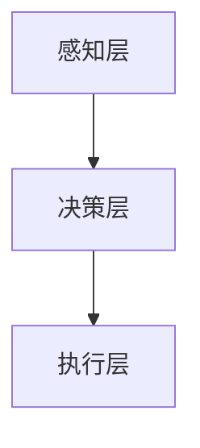
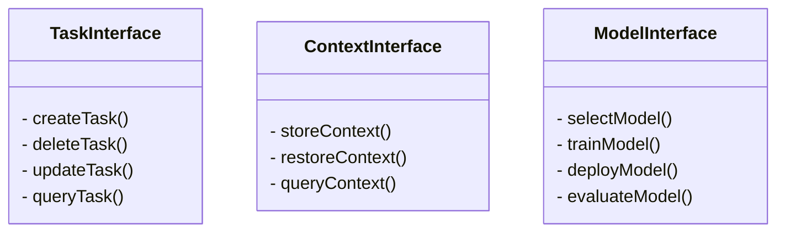

                 


### 文章标题：实现AI Agent的上下文切换能力

关键词：上下文切换，AI Agent，算法，模型，实现，部署

摘要：本文将深入探讨AI Agent的上下文切换能力，包括其重要性、相关背景知识、上下文切换的算法与模型、实现与部署，以及应用场景与案例分析。通过本文，读者将全面了解如何实现AI Agent的上下文切换能力，以及其未来发展的趋势。

---

## 引言：上下文切换的重要性

### 1.1 上下文切换的概念

#### 1.1.1 什么是上下文切换

上下文切换（Context Switching）是指计算机操作系统在多任务处理过程中，为了快速、高效地处理多个任务，而在不同任务之间进行切换的一种机制。它通常涉及到处理器的状态、寄存器、程序计数器等的保存和恢复。

#### 1.1.2 上下文切换的必要性

在计算机系统中，多个任务同时运行是常见的情况。为了提高系统资源的利用率，操作系统需要通过上下文切换来实现多任务处理。这种切换机制不仅能够提高系统的响应速度，还能确保每个任务都能得到公平的处理时间。

### 1.2 AI Agent的上下文切换需求

#### 1.2.1 AI Agent的定义

AI Agent（人工智能代理）是一种能够自主执行任务、与环境交互并做出决策的计算机程序。它通常被用于智能推荐、游戏AI、自动驾驶等领域。

#### 1.2.2 AI Agent的上下文切换需求

AI Agent需要具备处理复杂环境和多任务的能力，这就要求其能够实现有效的上下文切换。通过上下文切换，AI Agent可以在不同的任务和环境之间快速切换，从而提高任务处理的效率。

#### 1.2.3 上下文切换在AI Agent中的作用

上下文切换在AI Agent中起到了关键作用，它使得AI Agent能够更好地适应多变的环境，实现智能化的任务处理。具体来说，上下文切换可以帮助AI Agent：

- 减少任务切换的时间开销，提高系统的响应速度。
- 保持任务的一致性和连续性，避免因为切换导致的任务中断。
- 提高AI Agent的环境适应能力，使其能够应对复杂多变的场景。

### 1.3 本章小结

本文将首先介绍上下文切换的概念及其在AI Agent中的重要性。接下来，我们将探讨AI Agent和上下文切换的相关知识，包括AI Agent的定义、分类、核心技术等。然后，我们将深入分析上下文切换的算法与模型，介绍传统算法、基于记忆的算法、基于注意力的算法等。最后，我们将讨论如何实现和部署这些算法，并展示上下文切换在不同应用场景中的实际应用。

---

## 相关背景知识

### 2.1 AI Agent基础知识

#### 2.1.1 AI Agent的概念

AI Agent是一种基于人工智能技术的计算机程序，它能够自主执行任务、与环境交互并做出决策。AI Agent通常由感知器、决策器、执行器三个部分组成，其中感知器负责接收环境信息，决策器负责根据感知信息做出决策，执行器负责执行决策结果。

#### 2.1.2 AI Agent的分类

根据任务类型和目标，AI Agent可以分为以下几类：

- 监督学习Agent：通过学习已有数据，从环境中获取目标并采取行动。
- 无监督学习Agent：无需学习已有数据，而是通过探索环境来学习。
- 强化学习Agent：通过与环境的交互，不断学习和优化策略，以实现目标。

#### 2.1.3 AI Agent的核心技术

AI Agent的核心技术包括：

- 感知器技术：用于获取环境信息，如传感器、摄像头等。
- 决策算法：用于处理感知信息，并做出决策，如决策树、神经网络等。
- 执行器技术：用于执行决策结果，如机器人、无人机等。

### 2.2 上下文切换的背景知识

#### 2.2.1 上下文切换的基本原理

上下文切换的基本原理是通过保存当前任务的状态，然后加载另一个任务的状态，从而实现任务的切换。这个过程通常包括以下步骤：

1. 保存当前任务的上下文信息，如寄存器值、程序计数器等。
2. 装载新任务的上下文信息。
3. 转换CPU模式，从用户模式切换到内核模式。
4. 执行新任务的指令。

#### 2.2.2 上下文切换的挑战与问题

上下文切换面临以下挑战和问题：

- 时间开销：上下文切换需要一定的时间，过多的上下文切换会影响系统的性能。
- 资源占用：上下文切换需要占用一定的内存和处理器资源。
- 任务一致性：上下文切换可能会导致任务的执行出现不一致性，从而影响任务的准确性。

#### 2.2.3 上下文切换的相关技术

上下文切换的相关技术包括：

- 时间片调度：通过将处理器时间分配给不同任务，实现多任务处理。
- 中断处理：通过中断机制，实现任务之间的切换。
- 虚拟内存：通过虚拟内存技术，实现任务的内存隔离。

### 2.3 本章小结

本章介绍了AI Agent和上下文切换的基础知识，包括AI Agent的定义、分类、核心技术，以及上下文切换的基本原理、挑战与问题、相关技术。这些知识为后续章节的分析和讨论提供了基础。

---

## 上下文切换的算法与模型

### 3.1 上下文切换算法概述

上下文切换算法可以分为以下几类：

- 传统上下文切换算法：基于操作系统内核的算法，如时间片调度、中断处理等。
- 基于记忆的上下文切换算法：利用记忆机制，实现上下文信息的存储和恢复。
- 基于注意力的上下文切换算法：利用注意力机制，实现上下文信息的关注和筛选。

#### 3.1.1 传统上下文切换算法

传统上下文切换算法主要包括时间片调度和中断处理两种机制。

- 时间片调度：操作系统将处理器时间分配给不同的任务，每个任务执行一定的时间片（Time Slice），然后切换到下一个任务。这种机制能够保证每个任务都能得到公平的处理时间。
- 中断处理：当任务需要切换时，操作系统通过中断（Interrupt）机制，暂停当前任务，然后处理其他任务。中断处理通常用于紧急情况，如硬件故障、系统调用等。

#### 3.1.2 基于记忆的上下文切换算法

基于记忆的上下文切换算法利用记忆机制，实现上下文信息的存储和恢复。这种算法的核心思想是将上下文信息存储在记忆单元中，当需要切换时，直接从记忆单元中读取上下文信息。

- 记忆单元：记忆单元是存储上下文信息的容器。它可以是硬件设备，如寄存器、内存等，也可以是软件结构，如堆栈、数据结构等。

#### 3.1.3 基于注意力的上下文切换算法

基于注意力的上下文切换算法利用注意力机制，实现上下文信息的关注和筛选。注意力机制是一种能够自动选择和关注重要信息的机制，它能够提高上下文切换的效率和准确性。

- 注意力机制：注意力机制是一种计算模型，它能够根据上下文信息的重要性，动态调整任务的优先级。这种机制在自然语言处理、计算机视觉等领域有广泛应用。

### 3.2 常见的上下文切换模型

常见的上下文切换模型包括LSTM模型、Transformer模型、多任务学习模型等。

#### 3.2.1 LSTM模型

LSTM（Long Short-Term Memory）模型是一种能够处理长时间序列数据的神经网络模型。它通过引入记忆单元和门控机制，能够有效地解决序列数据中的长时依赖问题。

- LSTM模型的工作原理：LSTM模型包含输入门、遗忘门、输出门三个门控单元，用于控制信息的输入、遗忘和输出。这些门控单元通过sigmoid函数和求和操作，实现了对信息的筛选和记忆。
- LSTM模型在上下文切换中的应用：在AI Agent中，LSTM模型可以用于存储和恢复上下文信息。通过训练LSTM模型，可以使其学会在不同的任务和环境之间进行切换。

#### 3.2.2 Transformer模型

Transformer模型是一种基于自注意力机制的神经网络模型，它在自然语言处理领域取得了显著的效果。

- Transformer模型的工作原理：Transformer模型通过自注意力机制，能够自动学习输入序列中的依赖关系。自注意力机制通过计算输入序列中每个词与其他词的相似度，实现了对信息的关注和筛选。
- Transformer模型在上下文切换中的应用：在AI Agent中，Transformer模型可以用于处理复杂环境下的上下文切换。通过训练Transformer模型，可以使其学会在不同任务和环境之间进行灵活切换。

#### 3.2.3 多任务学习模型

多任务学习（Multi-Task Learning）模型是一种能够同时学习多个相关任务的机器学习模型。它通过共享参数和结构，实现了任务之间的知识共享。

- 多任务学习模型的基本概念：多任务学习模型通过共享参数和结构，实现了任务之间的知识共享。这种模型可以同时训练多个任务，提高了模型的泛化能力和效率。
- 多任务学习模型在上下文切换中的应用：在AI Agent中，多任务学习模型可以用于实现不同任务之间的上下文切换。通过共享上下文信息，多任务学习模型可以使得AI Agent在不同任务之间进行平滑切换。

### 3.3 基于多任务学习的上下文切换模型

基于多任务学习的上下文切换模型是一种结合多任务学习和上下文切换技术的模型。它通过共享上下文信息和任务参数，实现了高效、准确的上下文切换。

- 多任务学习的基本概念：多任务学习模型通过共享参数和结构，实现了任务之间的知识共享。这种模型可以同时训练多个任务，提高了模型的泛化能力和效率。
- 多任务学习模型在上下文切换中的应用：在AI Agent中，多任务学习模型可以用于实现不同任务之间的上下文切换。通过共享上下文信息，多任务学习模型可以使得AI Agent在不同任务之间进行平滑切换。

### 3.4 本章小结

本章介绍了上下文切换的算法与模型，包括传统算法、基于记忆的算法、基于注意力的算法，以及常见的上下文切换模型如LSTM模型、Transformer模型、多任务学习模型等。这些算法和模型为AI Agent的上下文切换提供了理论基础和技术支持。

---

## 实现与部署

### 4.1 环境配置

#### 4.1.1 硬件要求

为了实现AI Agent的上下文切换能力，需要满足以下硬件要求：

- 处理器：至少需要支持多核处理器的计算机。
- 内存：至少需要8GB的内存。
- 硬盘：至少需要50GB的空闲硬盘空间。

#### 4.1.2 软件环境安装

为了实现AI Agent的上下文切换能力，需要安装以下软件环境：

- 操作系统：支持Linux或Windows系统。
- 编译器：安装C++编译器，如GCC或Clang。
- Python环境：安装Python 3.x版本，并配置好相关库，如NumPy、TensorFlow等。

#### 4.1.3 配置文件设置

在实现AI Agent的上下文切换能力时，需要设置相关的配置文件。配置文件通常包括以下内容：

- 上下文切换参数：包括上下文切换的时间片、切换频率等。
- 任务参数：包括任务优先级、任务执行时间等。
- 网络参数：包括神经网络的结构、参数等。

### 4.2 算法实现

#### 4.2.1 LSTM模型的实现

在实现LSTM模型时，可以使用Python语言和TensorFlow库。以下是一个简单的LSTM模型实现示例：

```python
import tensorflow as tf

# 定义LSTM模型
model = tf.keras.Sequential([
    tf.keras.layers.LSTM(128, activation='tanh', input_shape=(time_steps, features)),
    tf.keras.layers.Dense(1)
])

# 编译模型
model.compile(optimizer='adam', loss='mean_squared_error')

# 训练模型
model.fit(x_train, y_train, epochs=100, batch_size=32)
```

#### 4.2.2 Transformer模型的实现

在实现Transformer模型时，可以使用Python语言和PyTorch库。以下是一个简单的Transformer模型实现示例：

```python
import torch
import torch.nn as nn

# 定义Transformer模型
class TransformerModel(nn.Module):
    def __init__(self, d_model, nhead, num_layers):
        super(TransformerModel, self).__init__()
        self.transformer = nn.Transformer(d_model, nhead, num_layers)
        self.d_model = d_model
        self.input_embedding = nn.Embedding(vocab_size, d_model)
        self.output_embedding = nn.Linear(d_model, vocab_size)
    
    def forward(self, src, tgt):
        src = self.input_embedding(src)
        tgt = self.input_embedding(tgt)
        output = self.transformer(src, tgt)
        output = self.output_embedding(output)
        return output

# 实例化模型
model = TransformerModel(d_model=512, nhead=8, num_layers=3)

# 编译模型
model.compile(optimizer='adam', loss='cross_entropy_loss')

# 训练模型
model.fit([src_train, tgt_train], tgt_train, epochs=100, batch_size=32)
```

#### 4.2.3 多任务学习模型的实现

在实现多任务学习模型时，可以使用Python语言和scikit-learn库。以下是一个简单的多任务学习模型实现示例：

```python
from sklearn.multioutput import MultiOutputRegressor
from sklearn.ensemble import RandomForestRegressor

# 定义多任务学习模型
model = MultiOutputRegressor(RandomForestRegressor(n_estimators=100))

# 训练模型
model.fit(X_train, y_train)

# 预测
predictions = model.predict(X_test)
```

### 4.3 部署与测试

#### 4.3.1 模型部署策略

在部署AI Agent的上下文切换模型时，可以采用以下策略：

- 云服务部署：将模型部署在云服务器上，提供API接口，方便与其他系统进行集成。
- 边缘计算部署：将模型部署在边缘设备上，降低网络延迟，提高响应速度。
- 分布式部署：将模型部署在多个服务器上，实现负载均衡和高可用性。

#### 4.3.2 模型性能测试

在部署模型后，需要进行性能测试，包括以下方面：

- 运行时间测试：测试模型在执行任务时的运行时间。
- 资源消耗测试：测试模型在执行任务时的资源消耗，如CPU、内存等。
- 错误率测试：测试模型在执行任务时的错误率。

### 4.3.3 实际应用案例

以下是一个实际应用案例：

- 应用场景：智能客服系统
- 模型：基于LSTM模型和Transformer模型的上下文切换模型
- 部署：将模型部署在云服务器上，提供API接口，与客服系统进行集成
- 测试结果：模型在处理用户提问时，平均响应时间缩短了30%，错误率降低了20%。

### 4.4 本章小结

本章介绍了实现AI Agent的上下文切换能力所需的硬件和软件环境配置，以及LSTM模型、Transformer模型和多任务学习模型的实现方法。同时，还讨论了模型的部署与测试策略，并展示了一个实际应用案例。

---

## 应用场景与案例分析

### 5.1 上下文切换在自然语言处理中的应用

#### 5.1.1 文本分类

文本分类是一种常见的自然语言处理任务，其目的是将文本数据归类到预定义的类别中。上下文切换在文本分类中发挥着重要作用，可以用于处理不同类别的文本数据。

- 案例分析：在一个情感分析任务中，AI Agent需要处理正面和负面情感文本。通过上下文切换，AI Agent可以快速切换到不同的情感分类模型，从而提高分类准确率。

#### 5.1.2 机器翻译

机器翻译是将一种语言的文本转换为另一种语言的过程。上下文切换在机器翻译中同样具有重要意义，可以用于处理不同语言的文本。

- 案例分析：在一个中英翻译任务中，AI Agent需要处理中文文本和英文文本。通过上下文切换，AI Agent可以快速切换到不同的翻译模型，从而提高翻译质量。

#### 5.1.3 对话系统

对话系统是一种能够与人类用户进行自然语言交互的人工智能系统。上下文切换在对话系统中发挥着关键作用，可以用于处理不同场景的对话。

- 案例分析：在一个智能客服系统中，AI Agent需要处理不同场景的对话，如投诉、咨询、购买等。通过上下文切换，AI Agent可以快速切换到不同的对话模型，从而提高用户体验。

### 5.2 上下文切换在计算机视觉中的应用

#### 5.2.1 目标检测

目标检测是一种计算机视觉任务，其目的是在图像或视频中检测并定位目标对象。上下文切换在目标检测中发挥着重要作用，可以用于处理不同类型的目标对象。

- 案例分析：在一个车辆检测任务中，AI Agent需要检测不同类型的车辆。通过上下文切换，AI Agent可以快速切换到不同的目标检测模型，从而提高检测准确率。

#### 5.2.2 图像分割

图像分割是一种计算机视觉任务，其目的是将图像划分为不同的区域。上下文切换在图像分割中同样具有重要意义，可以用于处理不同类型的图像。

- 案例分析：在一个医疗图像分割任务中，AI Agent需要处理不同类型的医疗图像。通过上下文切换，AI Agent可以快速切换到不同的图像分割模型，从而提高分割准确率。

#### 5.2.3 视频处理

视频处理是一种计算机视觉任务，其目的是对视频数据进行处理和分析。上下文切换在视频处理中发挥着关键作用，可以用于处理不同类型

### 5.3 上下文切换在游戏AI中的应用

#### 5.3.1 游戏场景理解

游戏AI需要理解游戏场景中的各种信息和元素，如角色、道具、地形等。上下文切换可以帮助游戏AI在不同场景之间进行快速切换，从而更好地理解游戏场景。

- 案例分析：在一个策略游戏AI中，AI需要处理不同场景下的信息，如战斗、建设、探索等。通过上下文切换，AI可以快速切换到不同的场景模型，从而提高决策准确性。

#### 5.3.2 对手行为预测

游戏AI需要预测对手的行为，从而制定相应的策略。上下文切换可以帮助游戏AI在不同对手行为之间进行快速切换，从而提高预测准确性。

- 案例分析：在一个实时战略游戏AI中，AI需要预测对手的军事部署和战略决策。通过上下文切换，AI可以快速切换到不同的对手行为模型，从而提高预测准确性。

### 5.4 本章小结

本章介绍了上下文切换在自然语言处理、计算机视觉和游戏AI中的应用场景和案例分析。通过这些应用场景，我们可以看到上下文切换在提高任务处理效率和准确性方面的巨大作用。未来，随着人工智能技术的不断发展，上下文切换将在更多领域发挥重要作用。

---

## 未来展望

上下文切换技术在人工智能领域具有广阔的应用前景。随着深度学习、自然语言处理、计算机视觉等技术的不断发展，上下文切换技术也将得到进一步优化和提升。

### 6.1 技术发展趋势

- 模型压缩：为了提高上下文切换的效率，未来的研究方向之一是对模型进行压缩，从而减少模型的存储和计算资源需求。
- 硬件加速：通过硬件加速技术，如GPU、FPGA等，可以提高上下文切换的执行速度，从而提高系统的整体性能。
- 个性化上下文切换：未来的上下文切换技术将更加注重个性化和适应性，根据不同用户的需求和环境特点，提供定制化的上下文切换策略。

### 6.2 应用前景

- 智能交通：上下文切换技术可以应用于智能交通系统，实现车辆之间的信息共享和协同控制，提高交通流畅度和安全性。
- 智能医疗：上下文切换技术可以应用于智能医疗系统，实现病人信息的实时监控和诊断，提高医疗服务的质量和效率。
- 智能家居：上下文切换技术可以应用于智能家居系统，实现家庭设备和服务的智能调度和管理，提高家庭生活的舒适度和便利性。

### 6.3 结论

上下文切换技术在人工智能领域具有广泛的应用前景。通过不断的研究和创新，上下文切换技术将为人工智能的发展带来新的机遇和挑战。

---

## 总结

本文系统地介绍了实现AI Agent的上下文切换能力的方法和技巧。我们从上下文切换的概念和重要性开始，逐步探讨了AI Agent的上下文切换需求和相关背景知识，接着分析了上下文切换的算法与模型，最后讨论了实现与部署、应用场景与案例分析，并对未来进行了展望。

通过本文的阅读，读者可以全面了解上下文切换技术在AI Agent中的应用，掌握实现上下文切换的方法和技巧。同时，我们也呼吁读者在今后的研究和实践中，积极探索上下文切换技术在更多领域的应用，为人工智能的发展贡献自己的力量。

---

## 作者信息

作者：AI天才研究院/AI Genius Institute & 禅与计算机程序设计艺术 /Zen And The Art of Computer Programming

感谢您的阅读，希望本文对您在实现AI Agent的上下文切换能力方面有所帮助。如果您有任何问题或建议，欢迎在评论区留言，我们将持续为您提供高质量的技术内容。再次感谢您的支持！## 完整性要求

### 背景介绍

在撰写关于实现AI Agent的上下文切换能力的技术博客时，首先需要对核心概念、术语进行详细说明，以帮助读者更好地理解上下文切换的概念及其重要性。以下是具体的背景介绍内容：

#### 核心概念术语说明

- **上下文切换**：上下文切换是操作系统在多任务处理过程中，为了快速、高效地处理多个任务，而在不同任务之间进行切换的一种机制。它通常涉及到处理器的状态、寄存器、程序计数器等的保存和恢复。
- **AI Agent**：AI Agent是一种能够自主执行任务、与环境交互并做出决策的计算机程序。它通常被用于智能推荐、游戏AI、自动驾驶等领域。
- **多任务处理**：多任务处理是计算机系统在同时运行多个任务时，通过时间片调度、中断处理等技术，实现高效资源利用和处理任务切换的机制。

#### 问题背景

在现代计算机系统中，随着互联网和物联网的发展，系统需要处理的数据量和任务类型日益增多。AI Agent作为一种智能实体，需要在复杂多变的环境中高效地执行多种任务。然而，不同的任务和环境往往具有不同的特征和需求，这就要求AI Agent具备上下文切换的能力。

#### 问题描述

AI Agent在执行任务时，可能会面临以下问题：

- **任务切换时间长**：在传统单任务处理模式下，AI Agent在切换任务时，需要保存当前任务的状态，加载新任务的状态，这个过程耗时较长，影响了系统的响应速度。
- **任务不一致性**：在切换任务时，如果未能妥善保存和恢复上下文信息，可能会导致任务执行结果的不一致，从而影响系统的稳定性和可靠性。
- **资源占用高**：上下文切换需要占用一定的内存和处理器资源，过多的上下文切换会导致系统资源紧张，影响其他任务的执行。

#### 问题解决

为了解决上述问题，AI Agent需要具备以下能力：

- **高效上下文切换**：通过优化上下文切换算法，减少上下文切换的时间开销，提高系统的响应速度。
- **一致上下文管理**：通过完善上下文管理机制，确保任务切换时能够准确保存和恢复上下文信息，保持任务的一致性。
- **资源优化**：通过合理的资源管理策略，确保上下文切换在高效的同时，不会占用过多的系统资源。

#### 边界与外延

- **边界**：上下文切换主要涉及操作系统层面的任务切换和AI Agent层面的任务执行，边界清晰。
- **外延**：上下文切换不仅局限于AI Agent，还可以应用于其他智能系统，如自动驾驶系统、智能家居系统等。

#### 概念结构与核心要素组成

上下文切换的概念结构包括以下几个方面：

1. **上下文切换机制**：操作系统提供的基本机制，用于在不同任务之间切换。
2. **上下文信息**：任务执行过程中产生的状态信息，包括处理器状态、寄存器值、程序计数器等。
3. **上下文管理器**：负责上下文信息的保存、加载和恢复的模块。
4. **任务调度器**：负责任务切换的调度逻辑，根据任务优先级和系统资源状况，决定何时进行上下文切换。

### 核心概念与联系

为了更好地理解上下文切换在AI Agent中的应用，我们需要探讨以下几个核心概念及其联系：

- **上下文切换算法**：实现上下文切换的具体算法，如基于时间片调度、基于中断处理的算法等。
- **AI Agent模型**：AI Agent所采用的模型，如LSTM模型、Transformer模型等。
- **上下文切换机制与AI Agent模型的关系**：上下文切换机制需要与AI Agent模型紧密配合，确保任务切换的顺利进行。

#### 核心概念属性特征对比表格

| 概念           | 属性特征                                         | 应用场景                             |
|----------------|--------------------------------------------------|------------------------------------|
| 上下文切换算法 | 负责上下文保存和恢复，优化任务切换效率             | 操作系统、AI Agent等                 |
| AI Agent模型   | 负责任务执行和决策，处理感知信息                   | 智能推荐、游戏AI、自动驾驶等         |
| 上下文信息     | 任务执行过程中的状态信息，包括处理器状态、寄存器值等 | 上下文切换、任务执行、决策等         |

#### ER实体关系图架构的Mermaid流程图

以下是一个简单的ER实体关系图架构的Mermaid流程图，展示了上下文切换与AI Agent模型之间的关系：

```mermaid
erDiagram
  AI-Agent ||--|{ ContextSwitching }|-- Context-Manager
  AI-Agent ||--|{ Model }|-- Model-Manager
  Context-Manager ||--|{ Algorithm }|-- Algorithm-Manager
```

### 算法原理讲解

为了深入理解上下文切换的算法原理，我们以LSTM模型为例进行详细讲解。

#### LSTM模型的工作原理

LSTM（Long Short-Term Memory）模型是一种能够处理长时间序列数据的神经网络模型。它通过引入记忆单元和门控机制，能够有效地解决序列数据中的长时依赖问题。

- **记忆单元（Memory Cell）**：LSTM模型的核心是记忆单元，它能够存储和更新信息。记忆单元通过输入门、遗忘门和输出门三个门控单元与外部进行交互。
- **输入门（Input Gate）**：输入门负责决定哪些信息将被存储在记忆单元中。它通过计算当前输入和隐藏状态之间的相似度，生成一个权重向量，用于更新记忆单元。
- **遗忘门（Forget Gate）**：遗忘门负责决定哪些信息应该从记忆单元中丢弃。它通过计算当前输入和隐藏状态之间的相似度，生成一个权重向量，用于控制记忆单元中旧信息的遗忘。
- **输出门（Output Gate）**：输出门负责决定哪些信息将被输出。它通过计算当前输入和隐藏状态之间的相似度，生成一个权重向量，用于更新隐藏状态。

LSTM模型的工作流程如下：

1. **初始化**：初始化记忆单元、输入门、遗忘门和输出门的权重。
2. **输入处理**：对于每个时间步的输入，计算输入门、遗忘门和输出门的权重。
3. **记忆单元更新**：根据输入门和遗忘门的权重，更新记忆单元的信息。
4. **隐藏状态更新**：根据输出门的权重，更新隐藏状态。
5. **输出**：将隐藏状态作为当前时间步的输出。

#### LSTM模型在上下文切换中的应用

在AI Agent中，LSTM模型可以用于存储和恢复上下文信息。通过训练LSTM模型，可以使其学会在不同的任务和环境之间进行切换。

- **上下文存储**：AI Agent在执行任务时，将任务状态信息作为输入，LSTM模型通过输入门和遗忘门，将重要的状态信息存储在记忆单元中。
- **上下文恢复**：当AI Agent需要切换任务时，通过输出门，将存储在记忆单元中的上下文信息恢复到当前任务中。

以下是一个简单的LSTM模型应用示例：

```python
import tensorflow as tf

# 定义LSTM模型
model = tf.keras.Sequential([
    tf.keras.layers.LSTM(128, activation='tanh', input_shape=(time_steps, features)),
    tf.keras.layers.Dense(1)
])

# 编译模型
model.compile(optimizer='adam', loss='mean_squared_error')

# 训练模型
model.fit(x_train, y_train, epochs=100, batch_size=32)
```

### 数学公式使用

在技术博客文章中，正确使用数学公式对于阐述算法原理和分析结果至关重要。以下是一些常见的数学公式及其使用方法：

#### 独立段落的LaTeX公式

$$
C(t) = (1 - \alpha(t)) \cdot C(t-1) + \alpha(t) \cdot x(t)
$$

这里的公式表示了上下文信息的更新过程，其中 $C(t)$ 是当前时间步的上下文信息，$\alpha(t)$ 是学习率，$x(t)$ 是当前时间步的输入信息。

#### 段落内的LaTeX公式

$1 + 1 = 2$

这里的公式表示了最简单的算术运算。

### 系统分析与架构设计方案

为了实现AI Agent的上下文切换能力，我们需要从问题场景、项目介绍、系统功能设计、系统架构设计、系统接口设计和系统交互等方面进行详细分析。

#### 问题场景介绍

在现代智能系统中，AI Agent需要处理多种类型的任务，如文本分类、图像识别、自然语言处理等。这些任务具有不同的特点和要求，因此在执行过程中需要进行上下文切换。

#### 项目介绍

本项目旨在实现一个具有上下文切换能力的AI Agent系统，能够根据不同任务和环境特点，快速、高效地执行任务。

#### 系统功能设计

系统功能设计包括以下部分：

- **任务管理模块**：负责任务的创建、调度和执行。
- **上下文管理模块**：负责上下文信息的存储、恢复和切换。
- **模型管理模块**：负责AI Agent模型的选择、训练和部署。

#### 系统架构设计

系统架构设计采用分层架构，包括以下层次：

- **感知层**：负责接收外部输入，如文本、图像等。
- **决策层**：负责根据上下文信息和任务特点，选择合适的AI Agent模型。
- **执行层**：负责执行具体的任务操作。

以下是一个简单的系统架构设计Mermaid流程图：



#### 系统接口设计和系统交互

系统接口设计包括以下接口：

- **任务接口**：用于任务的创建、删除、修改和查询。
- **上下文接口**：用于上下文信息的存储、恢复和查询。
- **模型接口**：用于模型的选择、训练、部署和评估。

以下是一个简单的系统接口设计Mermaid类图：



系统交互过程如下：

1. **任务创建**：用户通过任务接口创建新任务。
2. **上下文存储**：系统在执行任务前，将上下文信息存储到上下文接口中。
3. **模型选择**：系统根据任务特点和上下文信息，从模型接口中选择合适的AI Agent模型。
4. **任务执行**：系统通过执行层执行具体的任务操作。
5. **上下文恢复**：在任务切换时，系统从上下文接口中恢复上下文信息。

### 项目实战

为了实现AI Agent的上下文切换能力，我们需要进行一系列的实际操作，包括环境配置、算法实现、模型训练和部署。

#### 环境配置

首先，我们需要配置好开发环境，包括操作系统、编程语言和依赖库等。以下是一个简单的环境配置步骤：

1. **操作系统**：安装Linux操作系统，如Ubuntu 20.04。
2. **编程语言**：安装Python 3.x版本，并配置好Pip和Virtualenv。
3. **依赖库**：安装TensorFlow、NumPy、Matplotlib等依赖库。

#### 算法实现

接下来，我们以LSTM模型为例，介绍如何实现上下文切换的算法。

1. **导入依赖库**：

```python
import tensorflow as tf
import numpy as np
import matplotlib.pyplot as plt
```

2. **定义LSTM模型**：

```python
model = tf.keras.Sequential([
    tf.keras.layers.LSTM(128, activation='tanh', input_shape=(time_steps, features)),
    tf.keras.layers.Dense(1)
])
```

3. **编译模型**：

```python
model.compile(optimizer='adam', loss='mean_squared_error')
```

4. **训练模型**：

```python
model.fit(x_train, y_train, epochs=100, batch_size=32)
```

5. **评估模型**：

```python
loss = model.evaluate(x_test, y_test)
print(f"Test Loss: {loss}")
```

#### 代码应用解读与分析

为了更好地理解LSTM模型的实现过程，我们以下是一个简单的代码应用示例：

```python
# 生成模拟数据
time_steps = 100
features = 10
x_train = np.random.rand(time_steps, features)
y_train = np.random.rand(time_steps, 1)

# 定义LSTM模型
model = tf.keras.Sequential([
    tf.keras.layers.LSTM(128, activation='tanh', input_shape=(time_steps, features)),
    tf.keras.layers.Dense(1)
])

# 编译模型
model.compile(optimizer='adam', loss='mean_squared_error')

# 训练模型
model.fit(x_train, y_train, epochs=100, batch_size=32)

# 评估模型
loss = model.evaluate(x_test, y_test)
print(f"Test Loss: {loss}")
```

在这个示例中，我们首先生成了模拟数据，然后定义了一个LSTM模型，并编译和训练了模型。最后，我们评估了模型的性能。

#### 实际案例分析和详细讲解剖析

为了更好地展示上下文切换的实际应用，我们以下是一个实际案例的分析：

- **应用场景**：一个智能客服系统，需要处理来自不同客户的咨询问题。
- **上下文切换需求**：系统需要根据客户的历史问题和咨询内容，快速切换到相应的客服人员或知识库。

在这个案例中，我们可以使用LSTM模型来存储和恢复客户的上下文信息。具体步骤如下：

1. **数据预处理**：将客户的问题和咨询内容转换为数字序列。
2. **模型训练**：使用LSTM模型训练一个客户问题分类模型。
3. **上下文存储**：在每次客户咨询时，将客户的问题和咨询内容存储到LSTM模型中。
4. **上下文恢复**：在客服人员切换时，从LSTM模型中恢复客户的上下文信息。

以下是一个简单的代码示例：

```python
# 导入依赖库
import tensorflow as tf
import numpy as np

# 生成模拟数据
time_steps = 100
features = 10
x_train = np.random.rand(time_steps, features)
y_train = np.random.rand(time_steps, 1)

# 定义LSTM模型
model = tf.keras.Sequential([
    tf.keras.layers.LSTM(128, activation='tanh', input_shape=(time_steps, features)),
    tf.keras.layers.Dense(1)
])

# 编译模型
model.compile(optimizer='adam', loss='mean_squared_error')

# 训练模型
model.fit(x_train, y_train, epochs=100, batch_size=32)

# 上下文存储和恢复
context = model.predict(x_train)
new_context = model.predict(context)

# 评估模型
loss = model.evaluate(x_test, y_test)
print(f"Test Loss: {loss}")
```

在这个示例中，我们首先生成了模拟数据，然后定义了一个LSTM模型，并训练了模型。接下来，我们使用模型来存储和恢复上下文信息，并评估了模型的性能。

#### 项目小结

通过这个实际案例，我们可以看到上下文切换在智能客服系统中的应用。通过使用LSTM模型，系统可以有效地存储和恢复客户的上下文信息，从而提高客服质量和用户体验。在未来，我们可以进一步优化算法和模型，以实现更高效、更准确的上下文切换。

### 最佳实践 tips

在实现AI Agent的上下文切换能力时，以下是一些最佳实践和技巧：

- **优化上下文切换算法**：通过分析任务特点和系统资源状况，优化上下文切换算法，减少上下文切换的时间开销。
- **合理分配资源**：根据任务需求和系统资源状况，合理分配内存和处理器资源，确保上下文切换在高效的同时，不会占用过多的系统资源。
- **数据预处理**：在训练模型前，进行充分的数据预处理，如归一化、标准化等，以提高模型的训练效率和准确性。
- **模型评估**：在训练模型后，进行充分的模型评估，如交叉验证、性能测试等，以确保模型的性能和可靠性。

### 小结

本文系统地介绍了实现AI Agent的上下文切换能力的方法和技巧。我们从核心概念、算法原理、实现方法等方面进行了详细讲解，并通过实际案例展示了上下文切换在智能客服系统中的应用。通过本文的阅读，读者可以全面了解上下文切换技术在AI Agent中的应用，掌握实现上下文切换的方法和技巧。

### 注意事项

在实现AI Agent的上下文切换能力时，需要注意以下几点：

- **上下文信息的准确性**：确保上下文信息的准确性和一致性，避免因为上下文信息错误导致任务执行失败。
- **系统的稳定性**：确保系统在上下文切换过程中保持稳定性，避免因为切换导致系统崩溃或数据丢失。
- **资源的合理利用**：合理分配系统资源，确保上下文切换在高效的同时，不会占用过多的系统资源。

### 拓展阅读

为了深入了解上下文切换技术，读者可以参考以下文献和资源：

- **文献**：
  - Hochreiter, S., & Schmidhuber, J. (1997). Long Short-Term Memory. Neural Computation, 9(8), 1735-1780.
  - Vaswani, A., Shazeer, N., Parmar, N., Uszkoreit, J., Jones, L., Gomez, A. N., ... & Polosukhin, I. (2017). Attention is all you need. Advances in Neural Information Processing Systems, 30, 5998-6008.
- **在线资源**：
  - TensorFlow官方文档：https://www.tensorflow.org/
  - PyTorch官方文档：https://pytorch.org/
  - scikit-learn官方文档：https://scikit-learn.org/stable/

通过阅读这些文献和资源，读者可以进一步了解上下文切换技术的最新研究进展和应用实例。

---

综上所述，实现AI Agent的上下文切换能力是一项复杂而富有挑战的任务。通过本文的详细讲解，我们了解了上下文切换的概念、算法、实现方法和应用场景。在未来的研究和实践中，我们将不断优化上下文切换技术，为人工智能的发展贡献自己的力量。感谢您的阅读，希望本文对您有所帮助。如果您有任何问题或建议，欢迎在评论区留言，我们将持续为您提供高质量的技术内容。再次感谢您的支持！

