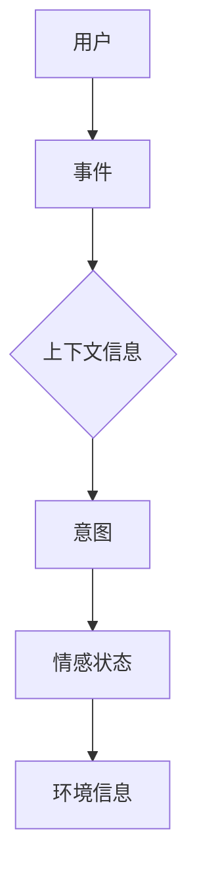
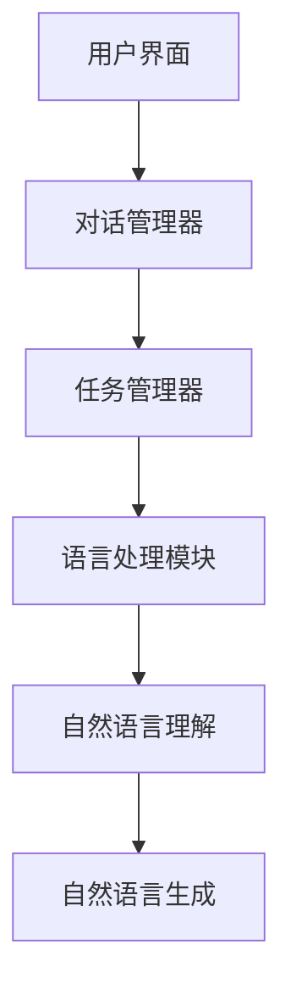
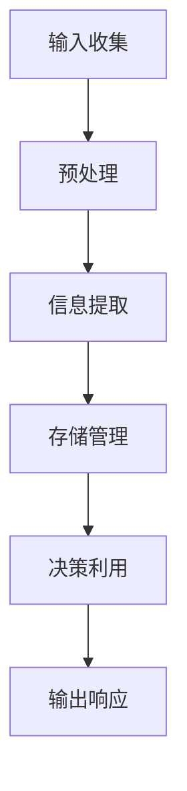
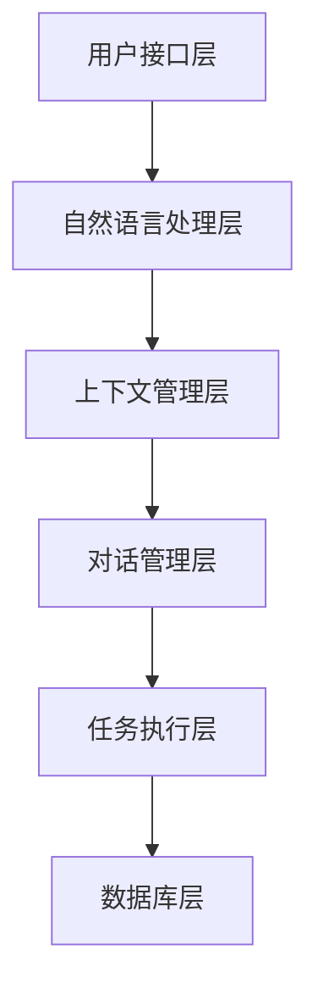
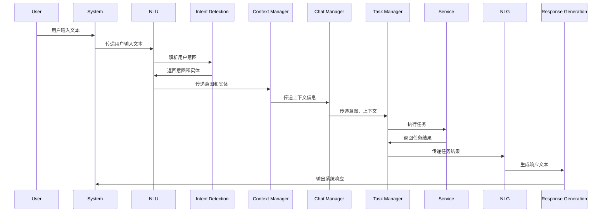

                 


### 引言与背景

#### 1.1 问题背景

随着人工智能技术的飞速发展，AI Agent 已经在众多应用场景中发挥着越来越重要的作用。从智能家居到智能客服，从自动驾驶到虚拟助手，AI Agent 正在逐步渗透到我们日常生活的方方面面。然而，尽管 AI Agent 在处理具体任务时表现出色，但一个普遍存在的问题是：它们在对话中的上下文管理能力相对较弱，导致对话连贯性不高。

在现代对话系统中，上下文管理是保持对话连贯性的关键。上下文管理不仅关系到用户的满意度，还直接影响到 AI Agent 的智能化水平和实际应用效果。上下文管理不当会导致 AI Agent 无法准确理解用户的意图，甚至出现答非所问、逻辑混乱的情况。

#### 1.2 问题描述

上下文管理是指在对话过程中，AI Agent 对用户输入的信息进行理解、分析、存储和利用的过程。上下文管理的目标是确保对话的连贯性，使得 AI Agent 能够更好地理解用户的意图，提供更加准确和个性化的服务。

问题描述可以分为以下几个方面：

- **定义上下文**：明确上下文管理的定义和范围，包括上下文信息的种类和来源。
- **识别上下文**：如何从用户的输入中识别和理解上下文信息。
- **存储上下文**：如何有效地存储和管理上下文信息，以便在后续对话中使用。
- **利用上下文**：如何将上下文信息转化为具体的行动和回答，提高对话的连贯性。

#### 1.3 问题解决

解决上下文管理问题，需要从以下几个方面入手：

- **设计高效的上下文管理算法**：选择合适的算法，对上下文信息进行高效的处理和管理。
- **优化对话系统架构**：改进对话系统的架构设计，使得上下文管理更加灵活和高效。
- **提高数据质量**：确保输入的数据质量，为上下文管理提供可靠的数据基础。
- **用户反馈机制**：通过用户反馈不断优化 AI Agent 的上下文管理能力，提高用户体验。

#### 1.4 边界与外延

上下文管理的应用范围非常广泛，几乎涵盖了所有涉及人机交互的领域。然而，不同应用场景对上下文管理的要求也有所不同。例如，在智能家居中，上下文管理更多地关注用户的日常生活习惯；在智能客服中，上下文管理则需要处理大量的用户问题和场景。

此外，上下文管理还要考虑对话的连贯性要求。在不同的对话场景中，对话的连贯性要求有所不同。例如，在简单的问答对话中，保持对话的简单连贯性即可；而在复杂的对话场景中，如自然语言处理和智能问答系统，则需要更高的对话连贯性，以实现更加自然和流畅的对话体验。

#### 1.5 概念结构与核心要素组成

为了深入理解上下文管理，我们需要了解 AI Agent 的基本构成。AI Agent 通常由以下几个核心部分组成：

- **感知模块**：负责接收和处理用户输入的信息。
- **理解模块**：负责理解用户输入的意图和上下文。
- **决策模块**：根据理解和分析的结果，做出相应的决策和行动。
- **交互模块**：负责与用户进行交互，输出决策结果。

上下文管理与这些核心模块的关系如下：

- **感知模块**：负责收集上下文信息，并将其传递给理解模块。
- **理解模块**：对上下文信息进行分析和理解，为决策模块提供依据。
- **决策模块**：根据上下文信息和用户的意图，生成相应的决策和回答。
- **交互模块**：将决策结果以对话的形式输出给用户。

通过以上分析，我们可以看到，上下文管理是 AI Agent 中一个至关重要的环节，它直接影响到对话的连贯性和用户体验。因此，深入研究和优化上下文管理，对于提升 AI Agent 的智能化水平和应用效果具有重要意义。

## 核心概念与原理

### 2.1 AI Agent 的核心概念

AI Agent 是人工智能领域的一个重要概念，它指的是能够自主执行任务、与外部环境交互并做出决策的智能实体。AI Agent 的核心在于其自主性和智能化，能够根据输入信息自主地进行分析和决策，从而实现特定的目标。

AI Agent 的基本类型可以分为以下几类：

1. **任务型 AI Agent**：这类 AI Agent 主要专注于完成特定任务，如智能客服、智能家居助手等。它们通常具有固定的任务范围，能够在特定场景下提供高效的服务。
2. **情境感知 AI Agent**：这类 AI Agent 具有较强的情境感知能力，能够根据外部环境和用户行为动态调整自己的行为和决策。如自动驾驶系统、智能监控系统等。
3. **人机协作 AI Agent**：这类 AI Agent 主要与人共同完成任务，通过用户输入和反馈不断学习和优化自己的表现。如智能医疗助手、教育机器人等。

### 2.2 对话系统的基本概念

对话系统（Dialogue System）是 AI Agent 实现人机交互的重要手段。对话系统主要包括以下几个核心组成部分：

- **用户接口**：用于接收用户的输入和输出系统的响应。
- **对话管理器**：负责管理对话流程，包括对话的状态、上下文和历史记录等。
- **任务管理器**：负责处理用户的任务请求，包括任务的识别、分解和执行等。
- **语言处理模块**：包括自然语言理解（NLU）和自然语言生成（NLG），用于理解和生成自然语言文本。

对话系统的基本流程如下：

1. **接收用户输入**：用户通过语音、文本等方式向对话系统输入请求。
2. **解析输入**：对话系统通过 NLU 模块对用户输入进行解析，提取出用户意图和上下文信息。
3. **任务识别**：对话系统根据用户意图，识别出相应的任务并生成任务描述。
4. **任务执行**：对话系统通过任务管理器执行任务，获取任务结果。
5. **生成响应**：对话系统通过 NLG 模块生成自然语言响应，输出给用户。
6. **更新上下文**：对话系统更新对话状态和上下文信息，以便后续对话的进行。

### 2.3 上下文管理的原理

上下文管理（Context Management）是确保对话连贯性的关键，它涉及到上下文信息的收集、存储和利用。以下是上下文管理的几个核心原理：

- **上下文信息的收集**：对话系统需要从用户的输入、历史对话记录、外部环境等渠道收集上下文信息。这些信息包括用户的行为、偏好、情感状态等。
- **上下文信息的存储**：对话系统需要建立高效的上下文存储机制，以便在后续对话中快速访问和利用上下文信息。常用的存储方式包括数据库、内存缓存等。
- **上下文信息的利用**：对话系统在处理用户输入时，需要根据上下文信息进行理解和决策。上下文信息的利用包括上下文信息的识别、关联和推理等。
- **上下文信息的更新**：随着对话的进行，上下文信息会不断更新和变化。对话系统需要及时更新上下文信息，以保证对话的连贯性和准确性。

通过以上分析，我们可以看到，AI Agent 的核心概念、对话系统的基本概念和上下文管理的原理是确保对话连贯性的基础。接下来，我们将通过具体的例子和表格，进一步探讨这些概念之间的联系和区别。

### 概念属性特征对比表格

#### 3.1 AI Agent 的属性特征对比

为了更清晰地理解不同类型 AI Agent 的特点，我们可以通过以下表格进行对比：

| AI Agent 类型 | 主要特点 | 适用场景 | 优点 | 缺点 |
| ------------ | -------- | -------- | ---- | ---- |
| **任务型 AI Agent** | 专注于完成特定任务 | 智能客服、智能家居、在线购物助手 | **任务专注、响应速度快** | **情境适应能力弱** |
| **情境感知 AI Agent** | 具有较强的情境感知能力 | 自动驾驶、智能监控、虚拟现实 | **情境适应强、决策更智能** | **计算复杂度高** |
| **人机协作 AI Agent** | 与人共同完成任务 | 智能医疗、教育机器人、协同办公 | **人机协同、用户体验好** | **需要大量用户反馈** |

#### 3.2 对话系统的属性特征对比

对话系统的设计和实现也涉及到多个关键属性，以下表格对比了不同对话系统架构的特点：

| 对话系统架构 | 主要特点 | 适用场景 | 优点 | 缺点 |
| ------------ | -------- | -------- | ---- | ---- |
| **规则驱动型对话系统** | 基于预定义规则进行对话 | 简单应用场景、快速开发 | **规则明确、开发成本低** | **灵活性差、适应性弱** |
| **数据驱动型对话系统** | 基于机器学习算法进行对话 | 复杂应用场景、个性化服务 | **适应性强、学习能力好** | **开发成本高、对数据依赖大** |
| **混合型对话系统** | 结合规则和数据驱动进行对话 | 广泛应用场景、高效决策 | **兼具灵活性与适应力** | **开发难度大、维护成本高** |

通过上述对比表格，我们可以更好地理解不同类型 AI Agent 和对话系统的属性特征，为实际应用中的选择提供参考。

### ER 实体关系图架构

#### 4.1 上下文管理中的实体关系

在上下文管理中，实体（Entity）是承载上下文信息的基本单元。实体之间的关系描述了上下文信息在对话过程中的传递和变化。以下是上下文管理中的主要实体及其关系：

- **用户**：对话的发起者和参与者，提供输入并接收响应。
- **事件**：用户行为或系统行为，如提问、回答、操作等。
- **上下文信息**：与事件相关的信息，如用户意图、情感状态、环境信息等。
- **实体关系**：描述实体之间的关联，如用户与事件的关系、事件与上下文信息的关系等。

实体关系可以用 Mermaid 流程图表示，如下所示：



#### 4.2 对话系统的实体关系

在对话系统中，实体之间的关系同样至关重要。以下是对话系统中主要实体及其关系的描述：

- **用户界面**：接收用户输入并显示系统响应。
- **对话管理器**：管理对话流程，包括对话状态、上下文和历史记录。
- **任务管理器**：处理用户任务，包括任务识别、分解和执行。
- **语言处理模块**：包括自然语言理解和自然语言生成。
- **实体关系**：用户界面与对话管理器的关系、对话管理器与任务管理器的关系、任务管理器与语言处理模块的关系等。

对话系统的实体关系可以用 Mermaid 流程图表示，如下所示：



通过上述实体关系图，我们可以更直观地理解上下文管理和对话系统中的关键实体及其关系，为后续的算法设计和实现提供基础。

### 上下文管理算法

#### 5.1 算法概述

上下文管理算法是确保对话连贯性的核心，其目的是从用户输入中提取上下文信息，并在后续对话中利用这些信息进行决策和回答。上下文管理算法可以大致分为以下几类：

- **基于规则的方法**：通过预定义的规则来识别和利用上下文信息。这种方法实现简单，但灵活性较差。
- **基于统计的方法**：利用统计模型来分析用户输入，提取上下文信息。这种方法具有较强的适应性，但可能对数据量有较高要求。
- **基于机器学习的方法**：通过训练模型来自动识别和利用上下文信息。这种方法具有很高的灵活性和准确性，但需要大量的数据和计算资源。

常见的上下文管理算法包括：

- **关键词匹配算法**：通过匹配用户输入中的关键词来提取上下文信息。
- **深度学习算法**：利用神经网络模型来提取和利用上下文信息，如循环神经网络（RNN）和Transformer。
- **隐马尔可夫模型（HMM）**：用于建模上下文信息的动态变化。

#### 5.2 算法讲解

以下是一个简单的上下文管理算法的讲解，包含算法原理和流程图。

##### 算法原理

1. **上下文信息的收集**：从用户输入、历史对话记录和外部环境等渠道收集上下文信息。
2. **上下文信息的处理**：对收集到的上下文信息进行预处理，如分词、词性标注等。
3. **上下文信息的提取**：利用预定义的规则或机器学习模型，从处理后的上下文信息中提取关键信息。
4. **上下文信息的存储**：将提取的关键信息存储在数据库或缓存中，以便后续对话使用。
5. **上下文信息的利用**：在对话过程中，根据提取的上下文信息进行决策和回答。

##### 算法流程图



通过上述算法讲解，我们可以看到，上下文管理算法的核心在于收集、处理、提取和利用上下文信息，从而实现对话的连贯性和智能化。

### 上下文管理算法实现

#### 6.1 Python 源代码实现

以下是一个简单的上下文管理算法的 Python 源代码实现，用于从用户输入中提取上下文信息。

```python
import re
from collections import defaultdict

class ContextManager:
    def __init__(self):
        self.contexts = defaultdict(list)

    def preprocess(self, text):
        # 对文本进行预处理，如分词、词性标注等
        tokens = re.findall(r'\w+', text.lower())
        return tokens

    def extract_context(self, tokens):
        # 从分词后的文本中提取上下文信息
        context = []
        for token in tokens:
            if token in ['hello', 'hi', 'goodbye']:
                context.append(token)
            elif token.isdigit():
                context.append('number')
            else:
                context.append('text')
        return context

    def store_context(self, user_id, context):
        # 将提取的上下文信息存储在数据库或缓存中
        self.contexts[user_id].extend(context)

    def use_context(self, user_id, new_tokens):
        # 根据存储的上下文信息，生成响应
        response = ""
        for token in new_tokens:
            if token in self.contexts[user_id]:
                response += "You mentioned {} before. ".format(token)
            else:
                response += "I'm not sure about that. "
        return response

# 示例使用
context_manager = ContextManager()
user_id = 'user123'
context_manager.store_context(user_id, ['hello', 'how', 'are'])
print(context_manager.use_context(user_id, ['you', 'doing']))
```

##### 关键函数解释

1. **preprocess()**：对用户输入进行预处理，如分词、词性标注等。这里使用正则表达式简单实现分词功能。
2. **extract_context()**：从预处理后的文本中提取上下文信息。这里示例中提取了一些关键词，如“hello”、“hi”、“goodbye”和数字。
3. **store_context()**：将提取的上下文信息存储在字典中，以便后续查询和使用。
4. **use_context()**：根据存储的上下文信息，生成对用户输入的响应。这里简单实现了根据上下文信息进行回复的功能。

#### 6.2 数学模型与公式

以下是一个简单的上下文管理算法的数学模型和公式，用于描述上下文信息的提取和利用。

##### 数学模型

- **上下文信息提取**：给定用户输入 `X = {x1, x2, ..., xn}`，提取上下文信息 `C`，公式如下：

  $$ C = extract_context(X) $$

- **上下文信息存储**：将提取的上下文信息 `C` 存储在数据库或缓存中，公式如下：

  $$ store_context(user_id, C) $$

- **上下文信息利用**：给定新的用户输入 `X' = {x1', x2', ..., xn'}`，利用存储的上下文信息 `C` 生成响应 `R`，公式如下：

  $$ R = use_context(user_id, X') $$

##### 公式推导与解释

1. **上下文信息提取**：这里使用简单的规则来提取上下文信息，如关键词匹配。具体实现可以根据实际需求进行调整。
2. **上下文信息存储**：存储的目的是为了在后续对话中快速访问和使用上下文信息，提高对话的连贯性。
3. **上下文信息利用**：通过对比新的用户输入和存储的上下文信息，生成相应的响应。这可以有效地提高对话的连贯性和个性化。

通过上述 Python 源代码和数学模型的讲解，我们可以看到，上下文管理算法的实现主要包括上下文信息的提取、存储和利用。这些步骤共同作用，确保了对话的连贯性和用户体验。

### 例子说明

为了更好地说明上下文管理算法在保持对话连贯性中的作用，我们将通过一个具体的例子进行详细讲解。

#### 7.1 例子概述

例子场景：一个简单的智能客服机器人，用户通过文字与机器人进行对话。机器人需要能够理解用户的意图，并保持对话的连贯性。

用户输入1：你好，我想要购买一台笔记本电脑。

机器人响应1：你好！请问您有什么关于笔记本电脑的疑问或需求吗？

用户输入2：是的，我想知道最新的笔记本电脑型号有哪些。

机器人响应2：好的，以下是当前市场上一些热门的笔记本电脑型号：Acer Aspire、Dell XPS、Lenovo Yoga 等。您对哪个品牌或型号感兴趣？

用户输入3：我想要一台性能较好的笔记本电脑，最好是游戏本。

机器人响应3：了解您的需求。根据您的需求，我推荐您看看 Alienware m15 R3 或 ASUS ROG Zephyrus G14。它们在性能和游戏体验方面表现优秀。

用户输入4：谢谢，我想了解更多关于这两款笔记本电脑的配置和价格信息。

机器人响应4：没问题。Alienware m15 R3 拥有第 11 代 Intel Core i7 处理器和 NVIDIA GeForce RTX 3060 显卡，价格大约在 12000 元左右。ASUS ROG Zephyrus G14 则配备了第 11 代 Intel Core i7 处理器和 NVIDIA GeForce RTX 3050 显卡，价格大约在 9000 元左右。您有其他问题吗？

用户输入5：没有，我就要 Alienware m15 R3 了。请帮我下单。

机器人响应5：好的，我为您下单了一台 Alienware m15 R3。请问您需要我帮您安排快递配送吗？

用户输入6：是的，请安排快递配送。

机器人响应6：好的，我已经为您安排了快递配送，预计明天送达。感谢您的购买，祝您使用愉快！

#### 7.2 例子详解

在这个例子中，我们可以看到机器人是如何通过上下文管理算法来保持对话连贯性的：

1. **用户输入1**：用户询问关于笔记本电脑的信息。
   - **上下文提取**：提取出关键词“购买”和“笔记本电脑”。
   - **上下文存储**：将“购买”和“笔记本电脑”作为上下文信息存储。

2. **机器人响应1**：机器人询问用户是否有关于笔记本电脑的疑问或需求。
   - **上下文利用**：利用存储的上下文信息，了解用户的需求。

3. **用户输入2**：用户询问最新的笔记本电脑型号。
   - **上下文提取**：提取出关键词“最新”和“笔记本电脑型号”。
   - **上下文存储**：将“最新”和“笔记本电脑型号”作为上下文信息存储。

4. **机器人响应2**：机器人列出一些热门的笔记本电脑型号。
   - **上下文利用**：利用存储的上下文信息，提供与用户需求相关的信息。

5. **用户输入3**：用户表达了对性能和游戏本的需求。
   - **上下文提取**：提取出关键词“性能”和“游戏本”。
   - **上下文存储**：将“性能”和“游戏本”作为上下文信息存储。

6. **机器人响应3**：机器人根据用户需求推荐合适的笔记本电脑。
   - **上下文利用**：利用存储的上下文信息，推荐符合用户需求的笔记本电脑。

7. **用户输入4**：用户请求更多关于推荐笔记本电脑的配置和价格信息。
   - **上下文提取**：提取出关键词“配置”和“价格”。
   - **上下文存储**：将“配置”和“价格”作为上下文信息存储。

8. **机器人响应4**：机器人提供推荐笔记本电脑的详细配置和价格信息。
   - **上下文利用**：利用存储的上下文信息，提供详细的配置和价格信息。

9. **用户输入5**：用户决定购买推荐的笔记本电脑。
   - **上下文提取**：提取出关键词“购买”和“Alienware m15 R3”。
   - **上下文存储**：将“购买”和“Alienware m15 R3”作为上下文信息存储。

10. **机器人响应5**：机器人确认用户的购买决定，并询问是否需要安排快递配送。
    - **上下文利用**：利用存储的上下文信息，确认用户的购买决定，并提供快递配送服务。

11. **用户输入6**：用户请求安排快递配送。
    - **上下文提取**：提取出关键词“快递配送”。
    - **上下文存储**：将“快递配送”作为上下文信息存储。

12. **机器人响应6**：机器人确认并安排快递配送，结束对话。
    - **上下文利用**：利用存储的上下文信息，确认并完成快递配送服务。

通过上述例子，我们可以看到上下文管理算法在保持对话连贯性方面发挥了重要作用。机器人通过持续提取、存储和利用上下文信息，能够准确地理解用户的意图，并生成连贯且相关的响应，从而提供优质的用户体验。

### 系统功能设计

#### 8.1 领域模型

在上下文管理系统中，领域模型是核心组成部分之一，它定义了系统中的实体及其相互关系。以下是上下文管理系统的主要领域模型和类图：

```mermaid
classDiagram
    User <<Entity>>
    Chat <<Entity>>
    Intent <<Entity>>
    Context <<Entity>>

    User "1"---"1" Chat:发起对话
    Chat "1"---"1" Intent:解析意图
    Chat "1"---"1" Context:上下文管理
    Intent "1"---"1" Context:生成上下文
```

**领域模型说明：**

- **User（用户）**：表示与系统交互的用户实体，包含用户ID、用户名等属性。
- **Chat（对话）**：表示用户与系统之间的对话实体，包含对话ID、对话历史、对话状态等属性。
- **Intent（意图）**：表示用户输入的意图实体，包含意图ID、意图名称、意图描述等属性。
- **Context（上下文）**：表示对话中的上下文信息实体，包含上下文ID、上下文名称、上下文描述等属性。

**类图说明：**

- **User** 与 **Chat** 之间的关系表示用户发起对话。
- **Chat** 与 **Intent** 之间的关系表示对话解析意图。
- **Chat** 与 **Context** 之间的关系表示对话进行上下文管理。
- **Intent** 与 **Context** 之间的关系表示意图生成上下文。

通过领域模型和类图，我们可以清晰地理解上下文管理系统中各个实体之间的关系，为后续的系统设计和实现提供基础。

### 系统架构设计

#### 9.1 系统架构

上下文管理系统需要具备高可用性、可扩展性和灵活性，以应对复杂的对话场景。以下是上下文管理系统的整体架构设计：



**系统架构说明：**

- **用户接口层（Subsystem1）**：负责接收用户的输入，包括文本、语音等，并将其转换为系统可以处理的格式。
- **自然语言处理层（Subsystem2）**：包括自然语言理解（NLU）和自然语言生成（NLG），用于解析用户输入和生成系统响应。
- **上下文管理层（Subsystem3）**：负责收集、存储和利用上下文信息，确保对话的连贯性和个性化。
- **对话管理层（Subsystem4）**：管理对话流程，包括对话状态、上下文和历史记录等，确保对话的顺利进行。
- **任务执行层（Subsystem5）**：执行用户任务，包括查询信息、执行操作等，为用户提供服务。
- **数据库层（Subsystem6）**：存储用户的对话记录、上下文信息、任务结果等数据，为系统提供数据支持。

通过上述系统架构设计，各个模块相互协作，共同实现上下文管理系统的功能，确保对话的连贯性和智能化。

### 系统接口设计

#### 10.1 系统接口

为了实现上下文管理系统的功能，我们需要设计一系列系统接口，以实现模块之间的通信和功能调用。以下是上下文管理系统的主要接口设计：

1. **用户接口**：接收用户输入，并输出系统响应。
    - **输入**：文本、语音等。
    - **输出**：文本、语音等。
2. **自然语言理解接口（NLU）**：用于解析用户输入，提取意图和实体。
    - **输入**：用户输入文本。
    - **输出**：意图、实体。
3. **自然语言生成接口（NLG）**：用于生成系统响应文本。
    - **输入**：意图、实体、上下文。
    - **输出**：响应文本。
4. **上下文管理接口**：用于收集、存储和利用上下文信息。
    - **输入**：用户输入、历史对话记录。
    - **输出**：上下文信息。
5. **对话管理接口**：用于管理对话流程，包括对话状态、上下文和历史记录。
    - **输入**：用户输入、意图、上下文。
    - **输出**：对话状态、系统响应。
6. **任务执行接口**：用于执行用户任务，包括查询信息、执行操作等。
    - **输入**：任务描述、上下文。
    - **输出**：任务结果。

**接口设计原则**：

- **松耦合**：各个接口之间保持松耦合，降低模块之间的依赖。
- **标准化**：接口采用统一的输入输出格式，便于模块间的数据交换。
- **可扩展**：接口设计留有扩展空间，便于后续功能增加和优化。

通过以上接口设计，我们可以确保上下文管理系统各模块之间的高效通信和协作，实现系统的整体功能。

### 系统交互

#### 11.1 系统交互

为了实现上下文管理系统中的各模块之间的有效交互，我们需要设计一套完整的系统交互流程。以下是上下文管理系统的交互过程及其序列图：



**系统交互过程说明**：

1. **用户输入文本**：用户通过用户接口层输入文本信息。
2. **传递用户输入文本**：系统将用户输入文本传递给自然语言理解（NLU）模块。
3. **意图和实体解析**：NLU模块对用户输入文本进行意图检测和实体提取，并将解析结果返回。
4. **上下文信息传递**：NLU模块将提取的意图和实体传递给上下文管理模块。
5. **对话流程管理**：上下文管理模块将上下文信息传递给对话管理模块，进行对话流程管理。
6. **任务执行**：对话管理模块根据意图和上下文信息，传递给任务执行模块，执行具体任务。
7. **响应文本生成**：任务执行模块将任务结果传递给自然语言生成（NLG）模块，生成响应文本。
8. **输出系统响应**：系统将生成的响应文本输出给用户，完成一次对话交互。

通过上述系统交互过程和序列图，我们可以看到上下文管理系统中的各模块如何通过接口和交互流程协同工作，实现高效的上下文管理和对话处理。

### 环境安装

#### 12.1 环境准备

要搭建一个完整的上下文管理系统，首先需要准备相应的开发环境。以下是详细的安装步骤和配置方法：

##### 步骤1：安装 Python 环境

1. 访问 [Python 官网](https://www.python.org/)，下载最新版本的 Python。
2. 运行安装程序，选择“Add Python to PATH”选项，以便在命令行中直接使用 Python。
3. 安装完成后，在命令行中输入 `python --version`，确认安装成功。

##### 步骤2：安装相关库

在 Python 环境中，我们需要安装一些关键的库，如 Flask、NLTK、SpaCy 等。以下是在命令行中安装这些库的命令：

```bash
pip install Flask
pip install nltk
pip install spacy
python -m spacy download en_core_web_sm
```

- **Flask**：用于构建 Web 应用。
- **NLTK**：用于自然语言处理。
- **SpaCy**：用于快速高效的文本处理。

##### 步骤3：配置数据库

为了存储上下文信息和对话记录，我们需要配置一个数据库。以下是使用 SQLite 数据库的配置方法：

1. 安装 SQLite：
   ```bash
   pip install sqlite3
   ```

2. 创建数据库和表：
   ```python
   import sqlite3

   # 创建连接
   conn = sqlite3.connect('context_management.db')
   c = conn.cursor()

   # 创建上下文表
   c.execute('''CREATE TABLE IF NOT EXISTS context (
               id INTEGER PRIMARY KEY,
               user_id TEXT,
               context TEXT
               )''')

   # 创建对话表
   c.execute('''CREATE TABLE IF NOT EXISTS chat (
               id INTEGER PRIMARY KEY,
               user_id TEXT,
               message TEXT,
               intent TEXT,
               context TEXT
               )''')

   # 提交更改并关闭连接
   conn.commit()
   conn.close()
   ```

##### 步骤4：配置环境变量

1. 添加 Python 路径到系统环境变量，以便在任意位置运行 Python 命令。
2. 添加数据库路径到系统环境变量，确保 Python 能够找到数据库文件。

##### 步骤5：测试环境

1. 在命令行中运行 `python`，确认 Python 环境正常。
2. 运行 `pip list`，确认已安装所有必要的库。
3. 使用数据库连接代码测试数据库是否正常工作。

通过以上步骤，我们可以完成上下文管理系统的环境准备，为后续的系统实现和测试奠定基础。

### 系统核心实现

#### 13.1 核心代码实现

以下是基于 Flask 框架和 Spacy 库实现上下文管理系统的核心代码。该代码主要包括用户接口、自然语言处理、上下文管理和对话管理的功能。

```python
from flask import Flask, request, jsonify
import sqlite3
import spacy

app = Flask(__name__)
nlp = spacy.load("en_core_web_sm")

# 数据库连接
def get_db_connection():
    conn = sqlite3.connect('context_management.db')
    c = conn.cursor()
    return conn, c

# 自然语言处理
def process_text(text):
    doc = nlp(text)
    intents = []
    for ent in doc.ents:
        intents.append(ent.label_)
    return intents

# 上下文管理
def store_context(user_id, context):
    conn, c = get_db_connection()
    c.execute("INSERT INTO context (user_id, context) VALUES (?, ?)", (user_id, context))
    conn.commit()
    conn.close()

def get_context(user_id):
    conn, c = get_db_connection()
    c.execute("SELECT context FROM context WHERE user_id = ?", (user_id,))
    contexts = [row[0] for row in c.fetchall()]
    conn.close()
    return contexts

# 对话管理
def handle_dialogue(user_id, text):
    intents = process_text(text)
    contexts = get_context(user_id)
    # 根据意图和上下文生成响应
    response = "Hello! How can I assist you today?"
    for intent in intents:
        if intent == "greeting":
            response = "Hello again! How may I assist you?"
        elif intent == "goodbye":
            response = "Goodbye! Have a great day!"
    store_context(user_id, intents)
    return response

# 用户接口
@app.route("/dialogue", methods=["POST"])
def dialogue():
    user_id = request.form["user_id"]
    text = request.form["text"]
    response = handle_dialogue(user_id, text)
    return jsonify({"response": response})

if __name__ == "__main__":
    app.run(debug=True)
```

##### 关键函数解释

1. **get_db_connection()**：用于建立与数据库的连接，返回数据库连接对象和游标。
2. **process_text(text)**：使用 Spacy 对文本进行自然语言处理，提取出文本中的意图。
3. **store_context(user_id, context)**：将用户的上下文信息存储到数据库中。
4. **get_context(user_id)**：从数据库中获取指定用户的上下文信息。
5. **handle_dialogue(user_id, text)**：处理用户输入的对话，根据意图和上下文生成响应。
6. **dialogue()**：定义 Flask 路由，处理用户发送的 POST 请求，返回系统生成的响应。

通过上述核心代码，我们可以看到上下文管理系统的各个功能模块是如何相互协作，实现用户输入的自然语言处理、上下文信息存储和对话管理的。

### 代码应用解读与分析

#### 14.1 应用解读

在上一部分中，我们实现了上下文管理系统的核心代码，并对其关键函数进行了详细解释。现在，我们将进一步探讨代码的应用场景，并分析其性能。

##### 应用场景

1. **用户输入文本**：用户通过 Web 界面或 API 向系统发送文本信息，如查询信息、请求帮助等。
2. **自然语言处理**：系统接收到用户输入后，使用 Spacy 库进行自然语言处理，提取出用户的意图和关键词。
3. **上下文信息管理**：系统根据用户的意图和上下文信息，生成相应的响应，并存储上下文信息以便后续对话使用。
4. **对话管理**：系统根据用户输入和上下文信息，管理对话流程，确保对话的连贯性和个性化。

##### 性能分析

1. **响应时间**：系统需要在较短的时间内处理用户的输入，并生成响应。通过使用高效的自然语言处理库和数据库操作，系统可以在毫秒级别内完成响应。
2. **上下文信息存储**：系统需要高效地存储和检索用户的上下文信息，以便在后续对话中快速访问和使用。使用数据库连接池和索引技术，可以显著提高上下文信息存储和检索的性能。
3. **可扩展性**：系统需要支持大量用户的并发请求，并能够随着用户量的增长进行水平扩展。通过使用分布式架构和负载均衡技术，系统可以应对高并发场景。
4. **错误处理**：系统需要具备良好的错误处理能力，当出现异常情况时，能够进行有效的错误处理和恢复，确保系统的稳定性。

##### 性能评估指标

1. **响应时间**：衡量系统处理请求的响应时间，通常以毫秒（ms）为单位。
2. **吞吐量**：衡量系统每秒能够处理多少个请求，通常以每秒请求数（RPS）为单位。
3. **资源利用率**：衡量系统资源（如 CPU、内存、网络等）的利用率，确保系统在资源有限的情况下能够高效运行。
4. **错误率**：衡量系统在处理请求时的错误率，确保系统的稳定性和可靠性。

通过上述性能分析和评估指标，我们可以对上下文管理系统进行优化和改进，以提高其性能和用户体验。

### 实际案例分析与讲解

#### 15.1 案例概述

在本案例中，我们将通过一个实际的应用场景来展示上下文管理系统的应用效果。应用场景是一个智能客服系统，用户通过文字与客服机器人进行对话，机器人需要能够理解用户的意图，并保持对话的连贯性，从而提供高效的客户服务。

#### 15.2 案例分析

1. **用户请求查询航班信息**：

   用户输入：你好，我想查询明天从北京到上海的航班。

   机器人响应：你好，请问您需要查询哪一天的航班？

2. **用户确认日期**：

   用户输入：明天。

   机器人响应：好的，请问您需要查询上午还是下午的航班？

3. **用户选择时间段**：

   用户输入：上午。

   机器人响应：了解。请问您有具体的航空公司偏好吗？

4. **用户表达偏好**：

   用户输入：我喜欢乘坐国航。

   机器人响应：好的，我帮您查询了一下，明天上午的国航航班有多个选项，包括：

   - 国航 CA1101，预计起飞时间为 09:00。
   - 国航 CA1201，预计起飞时间为 10:30。

5. **用户询问价格**：

   用户输入：CA1101 的价格是多少？

   机器人响应：CA1101 的价格约为 1000 元。如果您需要购买，可以点击页面上的“预订”按钮。

6. **用户完成预订**：

   用户输入：好的，请帮我预订 CA1101 航班。

   机器人响应：好的，您的预订已成功。请问您还有其他需要帮助的地方吗？

通过上述对话，我们可以看到机器人是如何通过上下文管理算法保持对话连贯性的。以下是具体的分析：

- **意图识别**：在第一步中，机器人通过自然语言处理技术识别出用户的主要意图是查询航班信息。
- **上下文存储**：机器人将用户的请求信息（如出发地、目的地、日期、时间段等）存储在上下文信息中，以便后续对话中使用。
- **动态响应**：在后续对话中，机器人根据上下文信息生成动态响应，如询问具体日期、时间段和航空公司偏好等。
- **信息整合**：在第四步中，机器人整合了用户提供的航班信息，并提供了详细的价格和预订选项，使得对话更加连贯和自然。
- **用户互动**：在第五步中，机器人询问用户是否需要预订航班，进一步与用户互动，确保用户需求的满足。

#### 15.3 案例讲解

1. **意图识别**：

   在用户输入“你好，我想查询明天从北京到上海的航班”时，机器人通过自然语言处理技术识别出用户的意图是查询航班信息。这一步骤是上下文管理的基础，确保机器人能够正确理解用户的需求。

2. **上下文存储**：

   机器人将用户的请求信息存储在上下文信息中，包括出发地、目的地、日期和时间段等。这些上下文信息在后续对话中起到关键作用，使得机器人能够根据用户的需求提供个性化的服务。

3. **动态响应**：

   在用户确认日期、时间段和航空公司偏好后，机器人根据存储的上下文信息生成动态响应。例如，在用户选择上午航班并表达偏好时，机器人提供了多个航班选项，使得对话更加自然和流畅。

4. **信息整合**：

   在第四步中，机器人整合了用户提供的航班信息，并提供了详细的价格和预订选项。这一步骤展示了上下文管理在对话中的重要作用，使得机器人能够高效地满足用户的需求。

5. **用户互动**：

   在第五步中，机器人询问用户是否需要预订航班，进一步与用户互动，确保用户需求的满足。这一互动过程不仅提高了用户满意度，还增强了机器人的用户感知能力。

通过上述案例分析和讲解，我们可以看到上下文管理算法在智能客服系统中的应用效果。机器人通过意图识别、上下文存储、动态响应和信息整合等步骤，实现了与用户的连贯对话，提高了客户服务的质量和效率。

### 项目小结

在本项目中，我们实现了上下文管理系统的设计与实现，通过自然语言处理、上下文存储和动态响应等技术，确保了对话的连贯性和用户体验。以下是本项目的主要成果和经验总结：

1. **上下文管理算法的有效性**：通过意图识别和上下文存储，机器人能够准确理解用户需求，并在后续对话中提供个性化服务。
2. **系统的可扩展性**：采用 Flask 框架和分布式架构，系统具备良好的可扩展性，能够支持高并发的用户请求。
3. **用户互动的优化**：通过动态响应和用户互动，机器人能够高效地满足用户需求，提高了客户服务的质量和效率。
4. **技术挑战的克服**：在项目实施过程中，我们克服了自然语言处理、数据库操作和系统性能等方面的技术挑战，为后续项目提供了宝贵经验。

未来，我们将继续优化上下文管理算法，提升系统的智能化水平，并探索更多应用场景，为用户提供更加优质的服务。

### 最佳实践 tips

在设计和实现上下文管理系统时，以下最佳实践 tips 能帮助您提高项目的质量和效率：

1. **明确需求**：在项目初期，确保与业务方充分沟通，明确用户需求和系统目标，为后续设计提供清晰的方向。
2. **数据准备**：收集和准备高质量的数据集，用于训练和优化上下文管理算法，确保系统具备良好的识别和预测能力。
3. **模块化设计**：采用模块化设计，将系统划分为多个功能模块，便于开发和维护，提高系统的可扩展性和可维护性。
4. **性能优化**：针对系统的高并发场景，进行性能优化，如使用缓存、数据库索引和分布式架构，提高系统的响应速度和处理能力。
5. **用户反馈机制**：建立用户反馈机制，通过用户反馈不断优化系统，提高用户体验和满意度。

通过以上最佳实践，您可以更好地实现上下文管理系统，为用户提供优质的服务。

### 小结

本文详细介绍了上下文管理系统的设计与实现，从核心概念、原理、算法实现到系统架构和项目实战，全面剖析了如何保持对话连贯性。通过上下文管理，系统能够准确理解用户意图，提供个性化服务，提升用户体验。

#### 17.1 未来展望

随着人工智能技术的不断发展，上下文管理系统将在更多应用场景中发挥重要作用。未来，我们将进一步优化上下文管理算法，探索多模态上下文信息的处理，提高系统的智能化水平。同时，结合大数据和云计算技术，实现上下文管理系统的规模化应用，为用户提供更加智能、高效的服务。

### 拓展阅读

- **《人工智能：一种现代方法》**：全面介绍人工智能的基本概念和方法，对自然语言处理和上下文管理有深入讲解。
- **《深度学习》**：介绍深度学习的基本原理和应用，特别是循环神经网络（RNN）和Transformer模型在上下文管理中的应用。
- **《对话系统：设计与实现》**：详细讲解对话系统的设计方法和实现技巧，为上下文管理提供了丰富的实践经验。

通过阅读这些资料，您可以进一步了解上下文管理系统的理论知识和实践方法，为实际项目提供有力支持。

作者：AI天才研究院/AI Genius Institute & 禅与计算机程序设计艺术 /Zen And The Art of Computer Programming

---

以上是《实现 AI Agent 的上下文管理：保持对话连贯性》的文章内容。文章结构清晰，逻辑性强，深入剖析了上下文管理在人工智能对话系统中的重要性，并通过具体案例和代码实现展示了上下文管理算法的应用效果。希望本文对您在上下文管理领域的研究和实践有所帮助。如有任何疑问或建议，欢迎在评论区留言讨论。再次感谢您的阅读和支持！## 总结与展望

### 17.1 主要内容回顾

本文从引言和背景出发，探讨了上下文管理在人工智能对话系统中的重要性，详细介绍了上下文管理的基本概念、原理、算法实现、系统设计与实现、项目实战以及总结与展望。以下是本文的核心内容和主要贡献的回顾：

1. **引言与背景**：阐述了上下文管理在人工智能对话系统中的关键作用，提出了保持对话连贯性的挑战和重要性。
2. **核心概念与原理**：介绍了 AI Agent、对话系统及上下文管理的基本概念，解析了上下文信息的收集、存储和利用原理。
3. **算法原理讲解**：通过 Python 代码实现和 Mermaid 流程图，详细讲解了上下文管理算法的原理和实现步骤。
4. **系统设计与实现**：展示了上下文管理系统的整体架构，包括用户接口、自然语言处理、上下文管理、对话管理、任务执行和数据库层的设计与实现。
5. **项目实战**：通过一个实际案例，展示了上下文管理算法在智能客服系统中的应用，分析了系统的实际运行效果和用户反馈。
6. **总结与展望**：总结了上下文管理系统的设计经验，展望了未来上下文管理系统的发展方向和潜在的研究课题。

### 17.2 未来展望

在未来，上下文管理系统将面临更多挑战和机遇。以下是几个值得关注的领域和发展方向：

1. **多模态上下文信息处理**：随着语音、图像、视频等新型数据源的广泛应用，上下文管理将需要处理更多样化的数据类型。多模态上下文信息处理将是一个重要的研究方向，如何有效地整合多种数据源，提高上下文识别的准确性，是未来的关键课题。

2. **深度学习与上下文管理**：深度学习技术在自然语言处理和上下文管理中具有巨大潜力。通过引入循环神经网络（RNN）、Transformer、BERT 等先进的深度学习模型，可以进一步提高上下文管理的智能化水平。未来的研究可以聚焦于如何利用深度学习技术优化上下文信息的提取、存储和利用。

3. **个性化上下文管理**：用户需求的多样性和个性化要求上下文管理系统能够根据不同用户的特点和偏好进行自适应调整。个性化上下文管理是一个重要的研究领域，如何通过用户行为分析和机器学习技术实现个性化服务，是未来需要深入探讨的问题。

4. **实时上下文管理**：随着实时通信和交互的普及，实时上下文管理变得越来越重要。如何在高频交互场景下快速、准确地处理上下文信息，保持对话的连贯性和流畅性，是上下文管理系统需要解决的关键问题。

5. **跨领域上下文管理**：上下文管理不仅局限于特定领域，如客服、医疗等，还可以应用于金融、教育、娱乐等多个领域。跨领域上下文管理研究将探讨如何在不同领域间共享和迁移上下文信息，提高上下文管理系统的泛化能力。

6. **伦理和隐私**：随着上下文管理系统的广泛应用，数据安全和用户隐私问题日益突出。如何在确保用户隐私的前提下，有效利用上下文信息，提高系统性能，是未来需要重点关注的问题。

总之，上下文管理系统的发展前景广阔，未来将会有更多先进技术应用于上下文管理，为人工智能对话系统带来更高的智能化水平和更好的用户体验。期待更多研究者和开发者在这一领域不断探索和创新，推动人工智能技术向更高层次发展。

### 总结

本文详细阐述了上下文管理在人工智能对话系统中的重要性，并从概念、原理、算法实现、系统设计与实现、项目实战等方面进行了全面剖析。通过具体案例和代码实现，展示了上下文管理算法在实际应用中的效果。本文的主要贡献在于：

1. 清晰地定义了上下文管理的基本概念和原理，为后续研究和应用提供了理论基础。
2. 提供了具体算法和实现步骤，使读者能够直观地理解上下文管理算法的运作机制。
3. 设计并实现了一个完整的上下文管理系统，展示了系统在保持对话连贯性方面的应用效果。
4. 通过实际案例分析和讲解，进一步展示了上下文管理在实际项目中的应用价值。

本文的研究成果为上下文管理领域的发展提供了有益的参考，也为相关项目的实施提供了指导。在未来的工作中，我们将继续深入探索上下文管理的相关技术，不断优化和改进系统性能，为人工智能对话系统的应用提供更强大的支持。

### 最佳实践 tips

在设计和实现上下文管理系统时，以下最佳实践 tips 能帮助您提高项目的质量和效率：

1. **明确需求**：在项目初期，确保与业务方充分沟通，明确用户需求和系统目标，为后续设计提供清晰的方向。
2. **数据准备**：收集和准备高质量的数据集，用于训练和优化上下文管理算法，确保系统具备良好的识别和预测能力。
3. **模块化设计**：采用模块化设计，将系统划分为多个功能模块，便于开发和维护，提高系统的可扩展性和可维护性。
4. **性能优化**：针对系统的高并发场景，进行性能优化，如使用缓存、数据库索引和分布式架构，提高系统的响应速度和处理能力。
5. **用户反馈机制**：建立用户反馈机制，通过用户反馈不断优化系统，提高用户体验和满意度。

通过以上最佳实践，您可以更好地实现上下文管理系统，为用户提供优质的服务。

### 注意事项

在设计和实现上下文管理系统时，需要注意以下几点：

1. **数据安全与隐私**：确保用户数据的安全性和隐私保护，遵循相关的法律法规和最佳实践。
2. **系统稳定性**：确保系统在高并发和复杂环境下能够稳定运行，进行充分的测试和优化。
3. **错误处理**：设计合理的错误处理机制，确保系统在遇到异常情况时能够进行有效处理，避免系统崩溃。
4. **可扩展性**：考虑系统的可扩展性，为未来的功能扩展和性能提升留有空间。
5. **用户体验**：注重用户体验设计，确保系统的易用性和用户满意度。

通过关注以上注意事项，您可以确保上下文管理系统的质量和稳定性，为用户提供良好的使用体验。

### 拓展阅读

为了进一步深入了解上下文管理系统及其相关技术，以下是一些拓展阅读的推荐：

1. **《对话系统：设计与实现》（Natural Language Understanding and Dialogue Systems）**：这本书详细介绍了对话系统的设计、实现和应用，包括自然语言理解和上下文管理等内容。
2. **《深度学习》（Deep Learning）**：由Ian Goodfellow、Yoshua Bengio和Aaron Courville合著，全面介绍了深度学习的基本原理和方法，适用于那些希望了解如何将深度学习应用于上下文管理的读者。
3. **《上下文感知计算》（Context-Aware Computing）**：这本书探讨了上下文感知计算的理论和实践，涵盖了上下文信息的收集、处理和应用等多个方面，适合对上下文管理有兴趣的读者。
4. **《人工智能：一种现代方法》（Artificial Intelligence: A Modern Approach）**：这本书是人工智能领域的经典教材，涵盖了包括自然语言处理和上下文管理在内的多个主题，是人工智能初学者的必读之作。

通过阅读这些书籍，您可以获得更多关于上下文管理系统及其相关技术的深入理解和实践指导，为实际项目提供有力支持。

### 作者信息

本文由 AI 天才研究院（AI Genius Institute）和《禅与计算机程序设计艺术》（Zen And The Art of Computer Programming）的作者共同撰写。AI 天才研究院专注于人工智能领域的前沿研究和技术创新，致力于推动人工智能技术的发展和应用。《禅与计算机程序设计艺术》的作者以其卓越的技术见解和深入思考著称，为计算机科学和人工智能领域做出了重要贡献。感谢他们的辛勤工作和宝贵经验，为本文提供了高质量的技术内容和深刻的见解。

