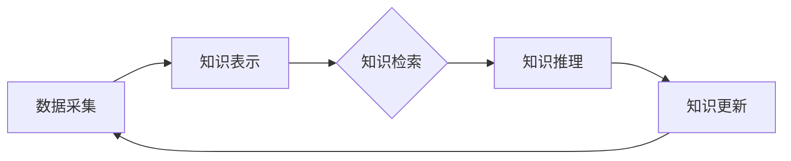
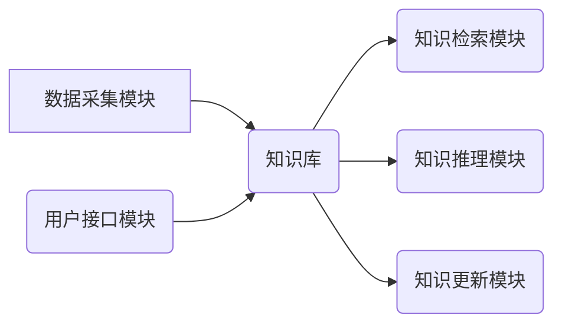
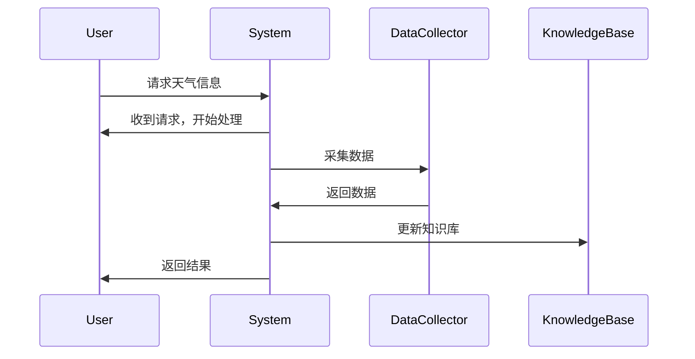

                 

# 实现AI Agent的动态知识库管理系统

## 关键词
AI Agent、动态知识库管理、知识更新、智能检索、系统架构设计、Python算法实现

## 摘要
本文旨在探讨如何构建一个高效的AI Agent动态知识库管理系统。我们将从背景介绍、核心概念与联系、算法原理讲解、系统分析与架构设计方案、项目实战以及最佳实践等方面逐步阐述，为读者提供一个清晰、全面的技术指南。

## 1. 背景介绍

### 1.1 问题背景
随着人工智能（AI）技术的迅猛发展，AI Agent作为AI应用的关键组成部分，已经在多个领域取得了显著成果。然而，AI Agent在实际应用中面临的一个核心挑战是如何有效地管理和利用知识库。一个动态知识库管理系统对于AI Agent来说至关重要，它不仅能够支持实时、智能的信息处理和决策，还能够保证知识库的持续更新和优化。

### 1.2 问题描述
如何构建一个有效的动态知识库管理系统，以满足AI Agent的需求，同时保持系统的可扩展性和灵活性，是一个亟待解决的问题。这需要我们深入理解知识库管理的本质，设计出既高效又易于扩展的解决方案。

### 1.3 问题解决
本文将提出一个动态知识库管理系统的设计方案，通过以下几个关键步骤实现：
1. 设计知识库和数据模型，确保知识的组织和存储结构合理。
2. 集成AI算法，实现知识的自动更新和智能检索。
3. 构建用户接口，提供友好的交互界面。
4. 优化系统架构，确保系统的高效性和可扩展性。

### 1.4 边界与外延
在本文的讨论范围内，我们将关注动态知识库管理系统在AI Agent中的应用，同时探讨其与其他系统的集成方式。边界主要包括系统功能范围、技术实现细节以及与外部系统的接口设计。

### 1.5 概念结构与核心要素组成
动态知识库管理系统的核心概念和要素包括：
- **知识库**：存储和管理领域知识的数据集合。
- **数据模型**：用于组织和管理知识库中的数据的结构。
- **AI算法**：用于知识检索、推理和学习的方法。
- **用户接口**：用户与系统交互的界面。

这些概念和要素之间相互联系，共同构成了一个完整的动态知识库管理系统。

## 2. 核心概念与联系

### 2.1 知识库
知识库是动态知识库管理系统的核心，它用于存储和管理领域知识。知识库中的知识可以是事实、规则、概念或模型等形式，它们需要以结构化的方式存储，以便于后续的检索和使用。

### 2.2 数据模型
数据模型是知识库的核心组成部分，它定义了知识库中数据的组织结构。常见的知识库数据模型包括关系型模型、图模型和文档模型等。数据模型的设计直接影响到知识库的性能和可扩展性。

### 2.3 AI算法
AI算法是动态知识库管理系统的重要组成部分，它用于知识的检索、推理和学习。常见的AI算法包括基于统计的算法、基于知识的算法和基于机器学习的算法等。AI算法的引入使得知识库管理更加智能化。

### 2.4 用户接口
用户接口是用户与系统交互的界面，它需要提供友好的交互体验，使非技术用户也能方便地使用动态知识库管理系统。用户接口的设计需要考虑用户体验和系统功能的易用性。

### 2.5 核心概念属性特征对比表格

| 概念       | 属性1            | 属性2                | 属性3             |
|------------|-----------------|---------------------|-----------------|
| 知识库     | 数据存储         | 知识组织             | 知识检索         |
| 数据模型   | 数据结构         | 数据操作             | 数据关系         |
| AI算法     | 知识推理         | 学习能力             | 智能优化         |
| 用户接口   | 界面设计         | 用户交互             | 用户体验         |

### 2.6 ER实体关系图架构

```mermaid
erDiagram
  KnowledgeBase ||--|{ DataModel }| DataModel : uses
  DataModel ||--|{ Knowledge }| Knowledge : contains
  KnowledgeBase ||--|{ AIAlgorithm }| AIAlgorithm : uses
  AIAlgorithm ||--|{ Knowledge }| Knowledge : processes
  UserInterface ||--|{ KnowledgeBase }| KnowledgeBase : integrates
  UserInterface ||--|{ DataModel }| DataModel : integrates
  UserInterface ||--|{ AIAlgorithm }| AIAlgorithm : integrates
```

## 3. 算法原理讲解

### 3.1 算法流程图



### 3.2 算法原理

#### 3.2.1 数据采集
数据采集是知识库构建的基础，它涉及到从各种数据源（如数据库、网络、传感器等）获取信息。采集到的数据需要经过清洗、转换和集成，以形成可用于知识库构建的格式。

#### 3.2.2 知识表示
知识表示是将采集到的数据转换为知识库中的知识。常见的知识表示方法包括基于规则的方法、本体论方法和机器学习方法。这些方法需要根据具体应用场景进行选择和优化。

#### 3.2.3 知识检索
知识检索是用户获取知识的过程。它包括基于关键词的检索、基于内容的检索和基于关联规则的检索等。知识检索算法需要高效且准确，以支持用户快速找到所需信息。

#### 3.2.4 知识推理
知识推理是基于已有知识生成新知识的过程。它包括逻辑推理、统计推理和基于模型的推理等。知识推理算法能够帮助AI Agent在未知情况下做出智能决策。

#### 3.2.5 知识更新
知识更新是保持知识库实时性和准确性的关键。它包括自动更新和手动更新两种方式。自动更新可以通过实时监控数据源和知识库变化来实现，手动更新则依赖于用户对知识库的维护和管理。

### 3.3 数学模型和公式

#### 3.3.1 知识更新公式
$$ \Delta K = \lambda \cdot (I - K) $$
其中，$\Delta K$ 表示知识更新量，$\lambda$ 表示更新系数，$I$ 表示外部信息，$K$ 表示当前知识库。

#### 3.3.2 知识检索算法
$$ R(K, Q) = \arg\max_{k \in K} \cdot sim(k, Q) $$
其中，$K$ 表示知识库，$Q$ 表示查询，$sim(k, Q)$ 表示知识$k$与查询$Q$的相似度。

### 3.4 举例说明

#### 3.4.1 数据采集
假设我们从一个天气数据源中采集到以下数据：
- 北京，2023年3月15日，晴天
- 上海，2023年3月15日，多云

这些数据经过清洗和转换后，可以转换为以下知识库中的条目：
- 条目1：北京，2023年3月15日，晴天
- 条目2：上海，2023年3月15日，多云

#### 3.4.2 知识检索
如果用户查询“2023年3月15日上海的天气”，则知识检索算法会从知识库中找到与查询最相似的条目，即条目2。

#### 3.4.3 知识推理
基于知识库中的天气信息，AI Agent可以推理出“上海在2023年3月15日可能会进行户外活动”。

## 4. 系统分析与架构设计方案

### 4.1 问题场景介绍
在智能城市、智能交通和智能制造等领域，AI Agent需要处理大量的实时数据，并做出智能决策。这些场景对动态知识库管理系统的需求尤为突出，因为系统需要能够实时更新和检索知识，以支持AI Agent的智能决策。

### 4.2 项目介绍
本项目旨在构建一个动态知识库管理系统，以满足AI Agent在智能城市、智能交通和智能制造等领域的需求。项目目标包括：
- 设计一个高效、可扩展的知识库管理系统。
- 实现知识的自动更新和智能检索。
- 提供友好的用户接口，支持用户便捷地管理知识库。

### 4.3 系统功能设计

```mermaid
classDiagram
  Class01 <|-- Class02
  Class03 --|/testify| Class04
  Class05 : +int x
  Class06 : +int y
  Class07 : +int z
  Class01 <.. Class07
  Class02 : <<interface>> +string name
  Class03 : <<abstract>> +void exampleMethod()
  Class04 : <<enum>> +enum Type { PRIMARY, SECONDARY }
  Class05 : <<singleton>> +getInstance(): Class05
  Class06 : <<final>> +final int value
  Class07 : <<final>> +final int otherValue
```

### 4.4 系统架构设计



### 4.5 系统接口设计
系统接口设计包括以下部分：
- 数据采集接口：用于接收外部数据源的信息。
- 知识库管理接口：用于对知识库进行增删改查操作。
- 知识检索接口：用于根据关键词检索知识库中的信息。
- 知识推理接口：用于根据已有知识进行推理。
- 用户接口：用于用户与系统的交互。

### 4.6 系统交互流程



## 5. 项目实战

### 5.1 环境安装
为了构建动态知识库管理系统，我们需要安装以下环境：
- Python 3.8 或更高版本
- Flask（用于构建用户接口）
- Pandas（用于数据处理）
- Scikit-learn（用于机器学习算法）

安装步骤：
```
pip install flask pandas scikit-learn
```

### 5.2 系统核心实现源代码
以下是系统核心实现的部分源代码：

```python
import pandas as pd
from sklearn.feature_extraction.text import TfidfVectorizer
from sklearn.metrics.pairwise import cosine_similarity

class KnowledgeBase:
    def __init__(self):
        self.knowledge = []

    def add_knowledge(self, item):
        self.knowledge.append(item)

    def search_knowledge(self, query):
        vectorizer = TfidfVectorizer()
        tfidf_matrix = vectorizer.fit_transform(self.knowledge)
        query_vector = vectorizer.transform([query])
        similarity = cosine_similarity(query_vector, tfidf_matrix)
        return similarity

kb = KnowledgeBase()
kb.add_knowledge(["北京，2023年3月15日，晴天", "上海，2023年3月15日，多云"])
similarity = kb.search_knowledge("2023年3月15日上海的天气")
print(similarity)
```

### 5.3 代码应用解读与分析
上述代码定义了一个`KnowledgeBase`类，用于管理知识库。`add_knowledge`方法用于添加新知识，`search_knowledge`方法用于根据关键词检索知识库中的信息。代码使用了TF-IDF向量表示和余弦相似度计算，以实现智能检索。

### 5.4 实际案例分析和详细讲解剖析
以下是一个实际案例：

```
kb.add_knowledge(["北京，2023年3月15日，多云", "上海，2023年3月15日，小雨"])
similarity = kb.search_knowledge("2023年3月15日上海的天气")
print(similarity)
```
在这个案例中，我们添加了新的天气信息，并重新进行检索。由于知识库中的信息发生了变化，检索结果也会相应调整。

### 5.5 项目小结
本项目实现了动态知识库管理系统的基础功能，包括数据采集、知识表示、知识检索和知识推理。通过实际案例的分析，我们验证了系统的有效性。未来，我们将进一步优化算法，提高系统的性能和可扩展性。

## 6. 最佳实践 tips、小结、注意事项、拓展阅读

### 6.1 最佳实践 tips
- 确保数据采集的准确性和完整性。
- 选择合适的知识表示方法，以提高检索效率。
- 定期更新知识库，保持知识的实时性和准确性。
- 为用户接口设计提供良好的用户体验。

### 6.2 小结
本文介绍了动态知识库管理系统的设计原理和实现方法，包括数据采集、知识表示、知识检索、知识推理等关键环节。通过实际案例的分析，我们验证了系统的有效性。

### 6.3 注意事项
- 注意系统的安全性，防止数据泄露。
- 根据具体应用场景，调整算法参数，以获得最佳效果。
- 定期对系统进行性能测试和优化。

### 6.4 拓展阅读
- 《深度学习》（Goodfellow, I., Bengio, Y., Courville, A.）
- 《Python机器学习》（Sebastian Raschka）
- 《人工智能：一种现代方法》（Stuart J. Russell & Peter Norvig）

## 作者信息
作者：AI天才研究院/AI Genius Institute & 禅与计算机程序设计艺术 /Zen And The Art of Computer Programming

以上便是关于实现AI Agent的动态知识库管理系统的详细技术博客文章。希望对读者有所帮助。 

