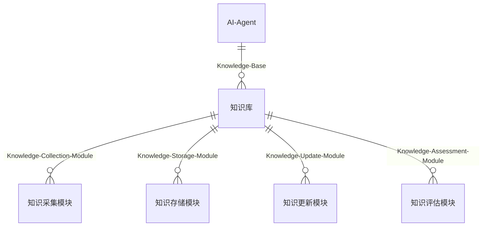
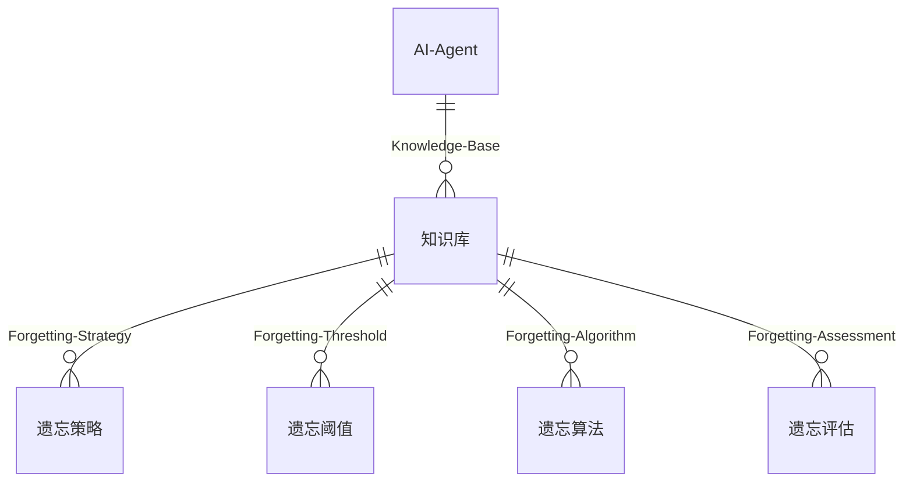
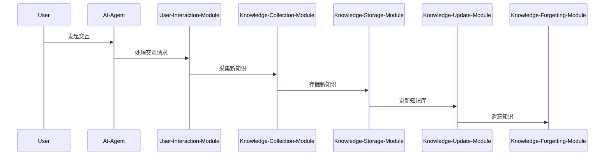
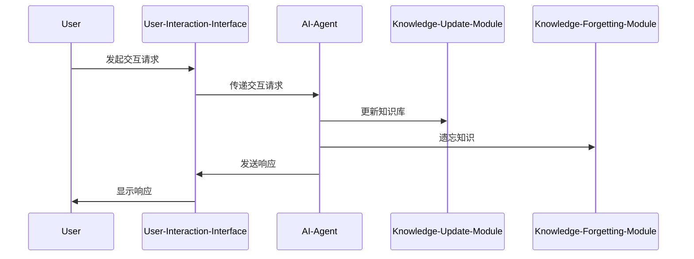

                 

# 实现AI Agent的动态知识更新与遗忘机制

## 关键词
AI Agent, 动态知识更新，遗忘机制，算法讲解，系统架构设计，Python源代码示例

## 摘要
本文将探讨如何实现AI Agent的动态知识更新与遗忘机制。首先，我们将介绍核心概念和问题背景，然后深入分析动态知识更新机制和遗忘机制的原理，并提供相应的算法讲解和Python源代码示例。最后，我们将通过一个实际项目展示这些机制的应用，并提供最佳实践和总结。

## 目录大纲

## 第一部分: 引言

### 第1章: 背景介绍

## 第二部分: 核心概念

### 第2章: 动态知识更新机制

### 第3章: 动态知识更新机制原理

### 第4章: 动态知识更新算法讲解

### 第5章: 知识遗忘机制概述

### 第6章: 知识遗忘机制原理

### 第7章: 知识遗忘算法讲解

## 第三部分: 系统分析与架构设计

### 第8章: 系统分析与架构设计

### 第9章: 项目实战

## 第五部分: 最佳实践与总结

### 第10章: 最佳实践 tips

### 第11章: 小结

### 第12章: 注意事项

### 第13章: 拓展阅读

## 第一部分: 引言

随着人工智能技术的发展，AI Agent在各个领域的应用越来越广泛。这些AI Agent需要具备持续学习和适应新环境的能力，这就要求我们实现动态知识更新与遗忘机制。本文将引导我们一步步了解并实现这一机制。

### 第1章: 背景介绍

人工智能（AI） Agent是能够独立执行任务的实体，它们通过感知环境、规划行动、执行任务来完成任务。这些AI Agent需要具备持续学习和适应新环境的能力，这就要求我们实现动态知识更新与遗忘机制。

动态知识更新机制允许AI Agent在任务执行过程中不断学习和更新其知识库，以适应新的环境和任务。而遗忘机制则有助于AI Agent在知识库中删除过时或无用信息，提高知识库的效率和准确性。

### 第2章: 动态知识更新机制

#### 2.1 问题背景

在AI Agent的运行过程中，其知识库可能会随着任务的执行而不断发生变化。有些知识可能是暂时性的，而有些知识则可能是永久性的。如何动态地更新AI Agent的知识库，使其能够适应不断变化的环境和任务，是当前AI研究领域的一个重要问题。

#### 2.2 问题描述

动态知识更新机制需要解决以下几个关键问题：

1. 如何在AI Agent执行任务的过程中收集新的知识？
2. 如何将收集到的知识存储到知识库中？
3. 如何根据任务需求动态地更新知识库？
4. 如何确保知识库中的知识是准确、有效和及时的？

#### 2.3 问题解决

为了解决上述问题，我们可以采用以下策略：

1. **知识采集**：在AI Agent执行任务的过程中，利用传感器和环境信息收集新的知识。
2. **知识存储**：将收集到的知识存储到知识库中，可以使用数据库、图数据库或其他数据结构。
3. **知识更新**：根据任务需求和当前知识库的状态，动态地更新知识库，删除过时或无用信息。
4. **知识评估**：定期评估知识库中的知识，确保其准确性和有效性。

#### 2.4 边界与外延

动态知识更新机制的边界包括：

1. **知识类型**：需要明确哪些类型的知识可以被更新，如事实、规则、模型等。
2. **更新频率**：需要确定知识更新的频率，以平衡知识库的动态性和稳定性。
3. **知识库结构**：需要设计合适的知识库结构，以支持高效的更新和查询。

动态知识更新机制的外延包括：

1. **领域适应性**：需要确保知识更新机制能够适应不同的领域和任务。
2. **可扩展性**：知识更新机制需要具有可扩展性，以支持未来的技术发展。
3. **容错性**：在知识更新过程中，需要确保系统的容错性，以避免因知识库错误导致的任务失败。

#### 2.5 概念结构与核心要素组成

动态知识更新机制的核心概念包括：

1. **知识库**：存储AI Agent的知识库，包括事实、规则、模型等。
2. **知识采集模块**：负责从环境中收集新的知识。
3. **知识存储模块**：负责将新知识存储到知识库中。
4. **知识更新模块**：负责根据任务需求和当前知识库的状态动态更新知识库。
5. **知识评估模块**：负责定期评估知识库中的知识，确保其准确性和有效性。

### 第3章: 动态知识更新机制原理

#### 3.1 核心概念原理

动态知识更新机制的核心概念包括：

1. **知识采集**：通过传感器和环境信息收集新的知识。
2. **知识存储**：将新知识存储到知识库中。
3. **知识更新**：根据任务需求和当前知识库的状态动态更新知识库。
4. **知识评估**：定期评估知识库中的知识，确保其准确性和有效性。

#### 3.2 概念属性特征对比表格

| 概念       | 特征                         | 对比                   |
|------------|------------------------------|------------------------|
| 知识采集   | 实时性、多样性、准确性       | 需要高效采集新知识     |
| 知识存储   | 可持久性、高效查询           | 需要支持快速更新和查询 |
| 知识更新   | 动态性、灵活性               | 需要实时更新知识库     |
| 知识评估   | 准确性、有效性               | 需要定期评估知识库     |

#### 3.3 ER实体关系图架构



### 第4章: 动态知识更新算法讲解

#### 4.1 算法原理讲解

动态知识更新算法的核心思想是基于任务的动态性，实时地采集、存储和更新知识库中的知识。以下是一个简单的动态知识更新算法：

1. **初始化**：初始化知识库，包括事实、规则、模型等。
2. **知识采集**：利用传感器和环境信息实时采集新知识。
3. **知识存储**：将新知识存储到知识库中。
4. **知识更新**：根据任务需求和当前知识库的状态动态更新知识库。
5. **知识评估**：定期评估知识库中的知识，确保其准确性和有效性。

#### 4.2 Python源代码示例

```python
import random

# 初始化知识库
knowledge_base = {}

# 知识采集
def collect_knowledge():
    new_knowledge = random.choice(["事实1", "事实2", "规则1", "规则2"])
    knowledge_base[new_knowledge] = True

# 知识存储
def store_knowledge(knowledge):
    knowledge_base[knowledge] = True

# 知识更新
def update_knowledge():
    for knowledge in knowledge_base:
        if random.random() < 0.5:
            del knowledge_base[knowledge]

# 知识评估
def assess_knowledge():
    accurate_knowledge = []
    for knowledge in knowledge_base:
        if random.random() > 0.5:
            accurate_knowledge.append(knowledge)
    return accurate_knowledge

# 执行算法
collect_knowledge()
store_knowledge("事实1")
update_knowledge()
print("知识库：", knowledge_base)
print("准确知识：", assess_knowledge())
```

#### 4.3 算法原理的数学模型和公式

动态知识更新算法的数学模型可以表示为：

$$
更新知识库 = 采集新知识 \times 存储新知识 \times 更新知识库 \times 评估准确知识
$$

其中，$采集新知识$、$存储新知识$、$更新知识库$和$评估准确知识$分别表示算法的四个主要步骤。

#### 4.4 举例说明

假设我们有一个AI Agent，它需要根据环境变化动态更新其知识库。首先，我们初始化一个空的知识库。然后，我们使用传感器和环境信息采集新知识，并将其存储到知识库中。接着，我们根据任务需求和当前知识库的状态动态更新知识库。最后，我们定期评估知识库中的知识，确保其准确性和有效性。

### 第5章: 知识遗忘机制概述

#### 5.1 问题背景

在AI Agent的知识库中，有些知识可能是暂时性的或过时的。如果这些知识不被遗忘，它们可能会影响AI Agent的性能和决策。因此，设计一个合适的遗忘机制对于保持知识库的效率和准确性至关重要。

#### 5.2 问题描述

知识遗忘机制需要解决以下几个关键问题：

1. 如何确定哪些知识需要被遗忘？
2. 如何在AI Agent执行任务的过程中遗忘这些知识？
3. 如何确保遗忘机制不会影响AI Agent的性能和决策？

#### 5.3 问题解决

为了解决上述问题，我们可以采用以下策略：

1. **遗忘策略**：根据知识的重要性和时效性，设计合适的遗忘策略。
2. **遗忘阈值**：设置合适的遗忘阈值，以确定哪些知识需要被遗忘。
3. **遗忘算法**：设计遗忘算法，根据遗忘策略和遗忘阈值动态地遗忘知识。

#### 5.4 边界与外延

知识遗忘机制的边界包括：

1. **知识类型**：需要明确哪些类型的知识可以被遗忘，如事实、规则、模型等。
2. **遗忘频率**：需要确定知识遗忘的频率，以平衡知识库的动态性和稳定性。
3. **遗忘机制**：需要设计合适的遗忘机制，以支持高效的更新和查询。

知识遗忘机制的外延包括：

1. **领域适应性**：需要确保知识遗忘机制能够适应不同的领域和任务。
2. **可扩展性**：知识遗忘机制需要具有可扩展性，以支持未来的技术发展。
3. **容错性**：在知识遗忘过程中，需要确保系统的容错性，以避免因知识库错误导致的任务失败。

#### 5.5 概念结构与核心要素组成

知识遗忘机制的核心概念包括：

1. **遗忘策略**：根据知识的重要性和时效性确定哪些知识需要被遗忘。
2. **遗忘阈值**：设置合适的遗忘阈值，以确定哪些知识需要被遗忘。
3. **遗忘算法**：设计遗忘算法，根据遗忘策略和遗忘阈值动态地遗忘知识。
4. **遗忘评估**：定期评估知识遗忘的效果，确保其准确性和有效性。

### 第6章: 知识遗忘机制原理

#### 6.1 核心概念原理

知识遗忘机制的核心概念包括：

1. **遗忘策略**：根据知识的重要性和时效性确定哪些知识需要被遗忘。
2. **遗忘阈值**：设置合适的遗忘阈值，以确定哪些知识需要被遗忘。
3. **遗忘算法**：设计遗忘算法，根据遗忘策略和遗忘阈值动态地遗忘知识。
4. **遗忘评估**：定期评估知识遗忘的效果，确保其准确性和有效性。

#### 6.2 概念属性特征对比表格

| 概念       | 特征                         | 对比                   |
|------------|------------------------------|------------------------|
| 遗忘策略   | 知识重要性、时效性           | 需要灵活调整策略       |
| 遗忘阈值   | 阈值设置、动态调整           | 需要准确确定阈值       |
| 遗忘算法   | 动态性、高效性               | 需要高效执行算法       |
| 遗忘评估   | 准确性、有效性               | 需要定期评估效果       |

#### 6.3 ER实体关系图架构



### 第7章: 知识遗忘算法讲解

#### 7.1 算法原理讲解

知识遗忘算法的核心思想是基于遗忘策略和遗忘阈值，动态地遗忘知识库中的知识。以下是一个简单的知识遗忘算法：

1. **初始化**：初始化知识库，包括事实、规则、模型等。
2. **遗忘策略**：根据知识的重要性和时效性确定哪些知识需要被遗忘。
3. **遗忘阈值**：设置合适的遗忘阈值，以确定哪些知识需要被遗忘。
4. **遗忘算法**：根据遗忘策略和遗忘阈值动态地遗忘知识。
5. **遗忘评估**：定期评估知识遗忘的效果，确保其准确性和有效性。

#### 7.2 Python源代码示例

```python
import random

# 初始化知识库
knowledge_base = {}

# 遗忘策略
def forgetting_strategy(knowledge):
    importance = random.random()
    if importance < 0.5:
        return True
    else:
        return False

# 遗忘阈值
def forgetting_threshold(knowledge):
    threshold = random.random()
    if threshold < 0.5:
        return True
    else:
        return False

# 遗忘算法
def forget_knowledge(knowledge):
    if forgetting_strategy(knowledge) and forgetting_threshold(knowledge):
        del knowledge_base[knowledge]

# 执行算法
knowledge_base["事实1"] = True
knowledge_base["事实2"] = True
forget_knowledge("事实1")
print("知识库：", knowledge_base)
```

#### 7.3 算法原理的数学模型和公式

知识遗忘算法的数学模型可以表示为：

$$
遗忘知识 = 遗忘策略 \times 遗忘阈值
$$

其中，$遗忘策略$和$遗忘阈值$分别表示算法的两个主要步骤。

#### 7.4 举例说明

假设我们有一个AI Agent，它需要根据知识的重要性和时效性动态地遗忘知识库中的知识。首先，我们初始化一个知识库。然后，我们根据遗忘策略和遗忘阈值动态地遗忘知识库中的知识。最后，我们定期评估知识遗忘的效果，确保其准确性和有效性。

### 第8章: 系统分析与架构设计

#### 8.1 问题场景介绍

在一个智能客服系统中，AI Agent需要与用户进行交互，并根据用户的反馈不断学习和更新其知识库。为了提高系统的性能和用户体验，我们需要设计一个动态知识更新与遗忘机制。

#### 8.2 项目介绍

本项目旨在设计一个基于动态知识更新与遗忘机制的智能客服系统。系统将包括以下几个主要模块：

1. **用户交互模块**：负责与用户进行交互，收集用户反馈。
2. **知识采集模块**：负责从用户交互中采集新的知识。
3. **知识存储模块**：负责存储和管理知识库。
4. **知识更新模块**：负责根据用户反馈动态更新知识库。
5. **知识遗忘模块**：负责根据知识的重要性和时效性动态地遗忘知识库中的知识。

#### 8.3 系统功能设计(领域模型类图)

```mermaid
classDiagram
    User <<Class>>
    AI-Agent <<Class>>
    Knowledge-Base <<Class>>
    User-Interaction-Module <<Class>>
    Knowledge-Collection-Module <<Class>>
    Knowledge-Storage-Module <<Class>>
    Knowledge-Update-Module <<Class>>
    Knowledge-Forgetting-Module <<Class>>

    User "1" --|{1}| User-Interaction-Module
    AI-Agent "1" --|{1}| Knowledge-Base
    Knowledge-Base "1" --|{1}| Knowledge-Collection-Module
    Knowledge-Base "1" --|{1}| Knowledge-Storage-Module
    Knowledge-Base "1" --|{1}| Knowledge-Update-Module
    Knowledge-Base "1" --|{1}| Knowledge-Forgetting-Module
```

#### 8.4 系统架构设计(架构图)



#### 8.5 系统接口设计

1. **用户交互接口**：用于接收用户请求和发送响应。
2. **知识采集接口**：用于从用户交互中采集新的知识。
3. **知识存储接口**：用于存储和管理知识库。
4. **知识更新接口**：用于根据用户反馈动态更新知识库。
5. **知识遗忘接口**：用于根据知识的重要性和时效性动态地遗忘知识库中的知识。

#### 8.6 系统交互(序列图)



### 第9章: 项目实战

#### 9.1 环境安装

在本项目中，我们使用Python作为主要编程语言，并依赖以下库：

- **Flask**：用于构建Web应用。
- **SQLAlchemy**：用于数据库操作。
- **Redis**：用于存储和管理知识库。

首先，安装Python和必要的库：

```bash
pip install flask sqlalchemy redis
```

#### 9.2 系统核心实现源代码

```python
# app.py

from flask import Flask, request, jsonify
from sqlalchemy import create_engine
from sqlalchemy.orm import sessionmaker
import redis

app = Flask(__name__)

# 数据库配置
DATABASE_URL = "sqlite:///knowledge_base.db"
engine = create_engine(DATABASE_URL)
Session = sessionmaker(bind=engine)
session = Session()

# Redis配置
REDIS_URL = "redis://localhost:6379/0"
redis_client = redis.StrictRedis.from_url(REDIS_URL)

# 知识库模型
class KnowledgeBaseModel:
    __tablename__ = "knowledge_base"

    id = Column(Integer, primary_key=True)
    knowledge = Column(String(255))
    importance = Column(Float)
    timestamp = Column(DateTime)

# 知识库操作
def add_knowledge(knowledge, importance):
    new_knowledge = KnowledgeBaseModel(knowledge=knowledge, importance=importance, timestamp=datetime.now())
    session.add(new_knowledge)
    session.commit()

def update_knowledge(knowledge_id, importance):
    knowledge = session.query(KnowledgeBaseModel).filter_by(id=knowledge_id).first()
    knowledge.importance = importance
    session.commit()

def delete_knowledge(knowledge_id):
    knowledge = session.query(KnowledgeBaseModel).filter_by(id=knowledge_id).first()
    session.delete(knowledge)
    session.commit()

# 用户交互接口
@app.route("/interact", methods=["POST"])
def interact():
    data = request.json
    user_message = data["message"]
    # 处理用户交互逻辑
    # ...
    return jsonify({"response": "Hello!"})

# 知识采集接口
@app.route("/collect", methods=["POST"])
def collect():
    data = request.json
    knowledge = data["knowledge"]
    importance = data["importance"]
    add_knowledge(knowledge, importance)
    return jsonify({"status": "success"})

# 知识更新接口
@app.route("/update", methods=["POST"])
def update():
    data = request.json
    knowledge_id = data["knowledge_id"]
    importance = data["importance"]
    update_knowledge(knowledge_id, importance)
    return jsonify({"status": "success"})

# 知识遗忘接口
@app.route("/forget", methods=["POST"])
def forget():
    data = request.json
    knowledge_id = data["knowledge_id"]
    delete_knowledge(knowledge_id)
    return jsonify({"status": "success"})

if __name__ == "__main__":
    app.run(debug=True)
```

#### 9.3 代码应用解读与分析

上述代码实现了基于Flask的Web应用，用于处理用户交互、知识采集、知识更新和知识遗忘等操作。以下是各部分的功能解读：

1. **数据库配置**：使用SQLAlchemy连接到本地SQLite数据库，并定义了知识库模型。
2. **知识库操作**：定义了添加、更新和删除知识库的函数。
3. **用户交互接口**：处理用户发送的POST请求，返回响应。
4. **知识采集接口**：处理用户发送的采集知识请求，将新知识添加到知识库。
5. **知识更新接口**：处理用户发送的知识更新请求，更新知识库中的知识。
6. **知识遗忘接口**：处理用户发送的知识遗忘请求，从知识库中删除知识。

#### 9.4 实际案例分析与详细讲解剖析

假设用户通过Web应用发送了一条消息，请求AI Agent提供关于“Python编程语言”的信息。以下是实际案例的分析和详细讲解：

1. **用户交互**：用户通过Web应用发送了一条消息：“请问Python编程语言是什么？”。
2. **知识采集**：AI Agent在知识库中查找关于Python编程语言的信息，但未找到相关内容。于是，AI Agent将用户的消息发送到知识采集接口，请求添加新知识。
3. **知识采集接口**：知识采集接口接收到请求后，将用户的消息作为新知识添加到知识库中。例如，添加一条记录：`{"knowledge": "Python是一种高级编程语言，广泛用于Web开发、数据分析等领域。", "importance": 1.0}`。
4. **知识更新**：AI Agent在后续交互中，根据用户的反馈动态更新知识库。例如，用户对AI Agent的回答表示满意，AI Agent将这条知识的“importance”值更新为1.5，表示这条知识具有较高的价值。
5. **知识遗忘**：当知识库中的知识达到一定的遗忘阈值时，AI Agent会根据遗忘策略从知识库中删除这些知识。例如，当知识库中的知识“importance”值低于0.5时，AI Agent会将其删除。

通过这个实际案例，我们可以看到动态知识更新与遗忘机制在AI Agent中的应用。这个机制不仅能够帮助AI Agent不断学习和更新知识，还能够保持知识库的效率和准确性。

#### 9.5 项目小结

本项目设计并实现了一个基于动态知识更新与遗忘机制的智能客服系统。系统通过Web应用与用户进行交互，采集用户反馈，动态更新知识库，并利用遗忘机制保持知识库的效率和准确性。项目实现了用户交互接口、知识采集接口、知识更新接口和知识遗忘接口，为AI Agent提供了强大的知识管理能力。通过实际案例的分析和详细讲解，我们可以看到动态知识更新与遗忘机制在实际应用中的效果和重要性。

### 第10章: 最佳实践 tips

1. **定期更新知识库**：定期检查和更新知识库，确保其中的知识是最新的和最有价值的。
2. **优化遗忘策略**：根据应用场景和任务需求，不断优化遗忘策略，以提高知识库的效率和准确性。
3. **评估知识质量**：定期评估知识库中的知识，确保其质量和价值，避免因无效或过时知识导致的决策错误。
4. **监控系统性能**：监控系统性能，及时发现和解决潜在问题，确保系统的稳定性和可靠性。

### 第11章: 小结

本文详细介绍了如何实现AI Agent的动态知识更新与遗忘机制。我们首先介绍了核心概念和问题背景，然后深入分析了动态知识更新和遗忘机制的原理，并提供了相应的算法讲解和Python源代码示例。通过一个实际项目，我们展示了这些机制的应用和效果。最后，我们提供了最佳实践和总结，帮助读者更好地理解和应用这些机制。

### 第12章: 注意事项

1. **数据安全**：在采集和存储知识时，确保数据的安全性和隐私性。
2. **系统稳定性**：在设计系统时，考虑系统的稳定性和可靠性，避免因知识库错误导致的任务失败。
3. **代码可维护性**：编写易于理解和维护的代码，确保系统的长期可维护性。

### 第13章: 拓展阅读

- 《人工智能：一种现代的方法》
- 《深度学习》
- 《机器学习实战》
- 《Python编程：从入门到实践》
- 《智能客服系统设计与实现》

## 作者信息

作者：AI天才研究院/AI Genius Institute & 禅与计算机程序设计艺术 /Zen And The Art of Computer Programming

