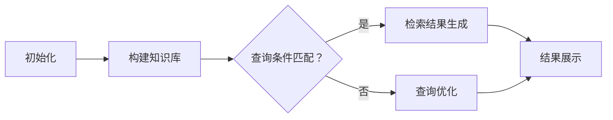
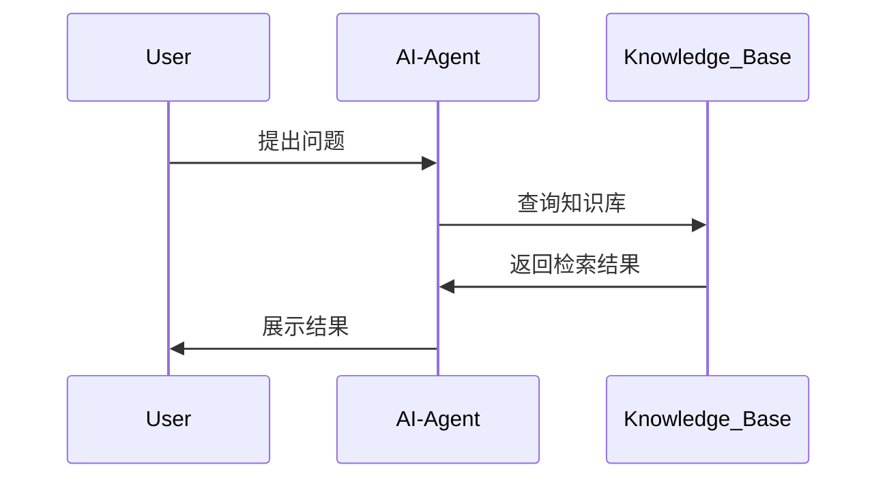
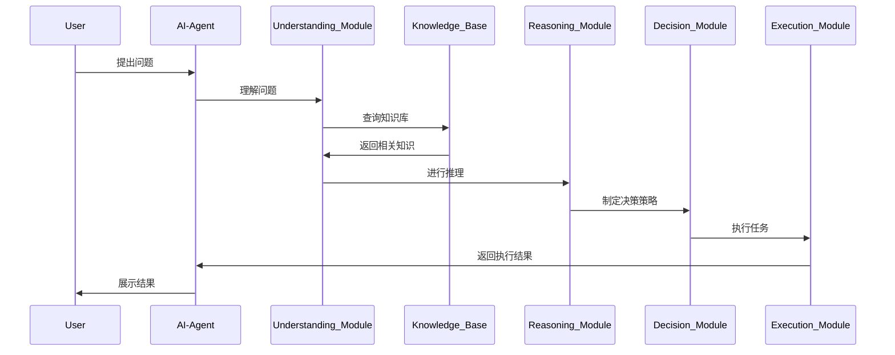

                 

# 实现AI Agent的动态知识检索与综合能力

关键词：AI Agent、动态知识检索、知识图谱、综合能力、算法原理

摘要：本文探讨了实现AI Agent的动态知识检索与综合能力的方法。首先介绍了AI Agent的定义与作用，然后分析了动态知识检索的必要性及其重要性。接着，详细阐述了动态知识检索与综合能力的实现方法，包括核心概念原理、算法原理讲解、系统功能设计、系统架构设计、系统接口设计以及系统交互流程。通过这些方法，AI Agent能够实现高效的动态知识检索和强大的综合能力。

# 目录大纲

## 第1章: 引言

### 1.1 问题背景

#### 1.1.1 AI Agent的定义与作用

#### 1.1.2 动态知识检索的必要性

#### 1.1.3 综合能力的含义及其重要性

### 1.2 问题描述

#### 1.2.1 现有AI Agent的知识检索与综合能力的不足

#### 1.2.2 AI Agent面临的挑战

#### 1.2.3 需要解决的问题

### 1.3 问题解决

#### 1.3.1 动态知识检索与综合能力的实现方法

#### 1.3.2 关键技术的探讨

### 1.4 边界与外延

#### 1.4.1 动态知识检索的范围与限制

#### 1.4.2 综合能力的层次与边界

### 1.5 概念结构与核心要素组成

#### 1.5.1 AI Agent的基本组成

#### 1.5.2 动态知识检索的机制

#### 1.5.3 综合能力的实现路径

## 第2章: 动态知识检索基础

### 2.1 核心概念原理

#### 2.1.1 知识表示

#### 2.1.2 知识图谱

#### 2.1.3 知识抽取

### 2.2 概念属性特征对比表格

| 特征         | 知识表示         | 知识图谱         | 知识抽取         |
| ------------ | ---------------- | ---------------- | ---------------- |
| 基本功能     | 数据存储         | 数据关联         | 数据提取         |
| 应用场景     | 数据库查询       | 信息检索         | 文本分析         |
| 技术复杂度   | 较低             | 中等             | 较高             |

### 2.3 ER实体关系图架构的Mermaid流程图

```mermaid
erDiagram
    AI_agent ||--|{ Knowledge_base } Knowledge_base
    AI_agent ||--|{ Dynamic_search } Dynamic_search
    AI_agent ||--|{ Comprehensive_ability } Comprehensive_ability
```

## 第3章: 动态知识检索算法原理

### 3.1 算法mermaid流程图



### 3.2 Python源代码

```python
class KnowledgeBase:
    def __init__(self):
        # 初始化知识库
        pass
    
    def query(self, query条件):
        # 查询知识库
        pass

class DynamicSearch:
    def __init__(self, knowledge_base):
        self.knowledge_base = knowledge_base
    
    def search(self, query条件):
        # 动态知识检索
        pass
```

### 3.3 算法原理讲解

#### 3.3.1 知识库的构建过程

#### 3.3.2 动态检索的条件匹配策略

#### 3.3.3 检索结果的生成与展示

### 3.4 数学模型和数学公式

$$
P(D|Q) = \frac{P(Q|D)P(D)}{P(Q)}
$$
其中，$P(D|Q)$表示在查询条件$Q$下动态知识检索的概率，$P(Q|D)$表示在知识库$D$下查询条件$Q$出现的概率，$P(D)$表示知识库$D$的概率，$P(Q)$表示查询条件$Q$的概率。

### 3.5 举例说明

假设有一个知识库，其中包含关于世界地理的知识。当查询条件为“世界上最长的河流是哪条？”时，动态知识检索算法应该能够正确地返回“尼罗河”。

## 第4章: AI Agent的综合能力实现

### 4.1 系统功能设计

#### 4.1.1 信息理解

#### 4.1.2 策略规划

#### 4.1.3 任务执行

### 4.2 系统架构设计

#### 4.2.1 知识库模块

#### 4.2.2 检索模块

#### 4.2.3 综合能力模块

### 4.3 系统接口设计

#### 4.3.1 用户接口

#### 4.3.2 知识接口

#### 4.3.3 控制接口

### 4.4 系统交互mermaid序列图



## 第5章：项目实战

### 5.1 环境安装

#### 5.1.1 Python环境配置

#### 5.1.2 相关库的安装

### 5.2 系统核心实现

#### 5.2.1 知识库构建

#### 5.2.2 动态检索

#### 5.2.3 综合能力实现

### 5.3 代码应用解读与分析

#### 5.3.1 源代码解读

#### 5.3.2 代码应用分析

### 5.4 实际案例分析和详细讲解剖析

#### 5.4.1 案例介绍

#### 5.4.2 案例分析

#### 5.4.3 剖析讲解

### 5.5 项目小结

#### 5.5.1 项目成果总结

#### 5.5.2 不足与改进

## 第6章：最佳实践 Tips

### 6.1 动态知识检索优化技巧

### 6.2 综合能力提升策略

### 6.3 系统部署与维护注意事项

## 第7章：小结

### 7.1 核心内容回顾

### 7.2 未来展望

### 7.3 注意事项

## 第8章：拓展阅读

### 8.1 相关书籍推荐

### 8.2 相关论文推荐

### 8.3 开源项目推荐

作者：AI天才研究院/AI Genius Institute & 禅与计算机程序设计艺术 /Zen And The Art of Computer Programming
----------------------------------------------------------------

## 第1章: 引言

### 1.1 问题背景

随着人工智能技术的飞速发展，AI Agent（人工智能代理）作为一种重要的智能体，逐渐成为各个领域的研究热点。AI Agent是指能够代表用户或执行特定任务的人工智能系统，它在自然语言处理、推荐系统、智能客服等领域发挥了重要作用。

#### 1.1.1 AI Agent的定义与作用

AI Agent是具有一定自主性和交互能力的人工智能系统，它可以模拟人类的思维和行为，为用户提供个性化服务。AI Agent的作用主要体现在以下几个方面：

1. **信息检索**：AI Agent能够快速从海量数据中检索出用户需要的信息，提供高效的决策支持。
2. **智能推荐**：基于用户的历史行为和偏好，AI Agent可以为用户推荐合适的商品、内容或服务。
3. **智能对话**：通过自然语言处理技术，AI Agent能够与用户进行自然、流畅的对话，提升用户体验。
4. **自动化任务**：AI Agent能够自动化完成一些重复性或复杂性的任务，提高工作效率。

#### 1.1.2 动态知识检索的必要性

动态知识检索是AI Agent的核心功能之一。随着信息量的爆炸式增长，如何快速、准确地从海量数据中检索出有用的信息，成为AI Agent需要解决的重要问题。动态知识检索的必要性主要体现在以下几个方面：

1. **实时性**：AI Agent需要能够实时获取用户的需求，并迅速提供相应的信息或服务。
2. **准确性**：AI Agent需要能够准确理解用户的需求，并从海量数据中检索出最相关的信息。
3. **灵活性**：AI Agent需要能够根据用户的需求变化，动态调整检索策略，提供个性化的服务。

#### 1.1.3 综合能力的含义及其重要性

综合能力是指AI Agent在多个方面具备的智能水平，包括信息理解、知识推理、决策规划等。综合能力的重要性体现在以下几个方面：

1. **提升用户体验**：AI Agent的综合能力可以提供更加智能、个性化的服务，提升用户体验。
2. **增强业务价值**：AI Agent的综合能力可以帮助企业更好地理解用户需求，优化业务流程，提高业务效率。
3. **拓宽应用场景**：AI Agent的综合能力可以拓展其应用范围，从简单的信息检索和推荐，发展到更复杂的任务执行和决策支持。

### 1.2 问题描述

#### 1.2.1 现有AI Agent的知识检索与综合能力的不足

尽管AI Agent在知识检索与综合能力方面取得了一些进展，但仍然存在一些不足：

1. **知识检索效率低**：现有AI Agent的检索算法复杂度较高，检索速度较慢，无法满足实时性的需求。
2. **知识覆盖不全**：现有AI Agent的知识库内容不够丰富，可能无法覆盖所有用户需求。
3. **理解能力有限**：现有AI Agent在自然语言理解和知识推理方面仍存在局限，无法准确理解用户的复杂需求。
4. **决策能力不足**：现有AI Agent的决策规划能力较弱，无法处理复杂的决策问题。

#### 1.2.2 AI Agent面临的挑战

AI Agent在知识检索与综合能力方面面临的挑战主要包括：

1. **数据质量**：高质量的数据是AI Agent实现高效知识检索和综合能力的基础，但数据质量往往难以保证。
2. **数据量**：随着数据量的增长，如何高效地处理海量数据成为AI Agent需要解决的重要问题。
3. **实时性**：如何在满足实时性需求的同时，保证知识检索和综合能力的准确性，是AI Agent面临的一大挑战。
4. **个性化**：如何根据用户的需求变化，动态调整检索策略和综合能力，提供个性化的服务，是AI Agent需要解决的问题。

#### 1.2.3 需要解决的问题

为了实现高效的动态知识检索与综合能力，需要解决以下几个问题：

1. **构建高质量的知识库**：通过数据清洗、数据集成等技术，构建高质量的知识库，为AI Agent提供丰富的知识资源。
2. **优化检索算法**：设计高效的检索算法，提高检索速度和准确性，满足实时性的需求。
3. **增强理解能力**：通过自然语言处理、知识图谱等技术，增强AI Agent的自然语言理解和知识推理能力。
4. **提升决策能力**：通过决策规划、强化学习等技术，提升AI Agent的决策能力，解决复杂的决策问题。

### 1.3 问题解决

#### 1.3.1 动态知识检索与综合能力的实现方法

动态知识检索与综合能力的实现方法主要包括以下几个方面：

1. **知识库构建**：通过数据清洗、数据集成等技术，构建高质量的知识库，为AI Agent提供丰富的知识资源。
2. **检索算法设计**：设计高效的检索算法，提高检索速度和准确性，满足实时性的需求。
3. **理解能力增强**：通过自然语言处理、知识图谱等技术，增强AI Agent的自然语言理解和知识推理能力。
4. **决策能力提升**：通过决策规划、强化学习等技术，提升AI Agent的决策能力，解决复杂的决策问题。

#### 1.3.2 关键技术的探讨

在实现动态知识检索与综合能力的过程中，需要探讨以下几个关键技术：

1. **知识图谱**：知识图谱是一种结构化的知识表示方法，可以有效地组织和管理大规模知识，为AI Agent提供强大的知识检索能力。
2. **自然语言处理**：自然语言处理技术可以使得AI Agent更好地理解和处理自然语言输入，提高其智能水平。
3. **机器学习与深度学习**：通过机器学习和深度学习技术，可以对海量数据进行建模和分析，为AI Agent提供更准确的预测和决策能力。
4. **强化学习**：强化学习技术可以使得AI Agent在复杂环境中进行学习，不断优化其行为策略。

### 1.4 边界与外延

#### 1.4.1 动态知识检索的范围与限制

动态知识检索的范围主要包括以下几个方面：

1. **文本检索**：基于自然语言处理的文本检索技术，可以实现对海量文本数据的快速检索。
2. **知识图谱检索**：通过知识图谱进行结构化数据检索，可以实现对复杂关系的快速查询。
3. **图像和语音检索**：通过图像和语音识别技术，可以实现对图像和语音数据的检索。

动态知识检索的限制主要包括以下几个方面：

1. **数据质量**：数据质量是影响知识检索效果的关键因素，数据质量差会导致检索结果不准确。
2. **计算资源**：大规模的知识检索需要大量的计算资源，计算资源的限制可能会影响检索速度。
3. **实时性**：实时性是动态知识检索的重要特性，但实时性的实现需要高效的检索算法和强大的计算能力。

#### 1.4.2 综合能力的层次与边界

综合能力的层次主要包括以下几个方面：

1. **信息理解**：理解用户的需求和意图，为用户提供个性化的服务。
2. **知识推理**：基于已有的知识和规则，进行推理和预测，为用户解决问题。
3. **决策规划**：在复杂环境中，制定合理的决策策略，实现任务目标。

综合能力的边界主要包括以下几个方面：

1. **知识范围**：综合能力受限于知识库的覆盖范围，知识库的不足会导致综合能力的局限性。
2. **计算能力**：综合能力的实现依赖于强大的计算能力，计算能力的限制可能会影响决策速度。
3. **环境适应性**：综合能力需要在各种复杂环境中适应，但不同环境对综合能力的要求不同，可能存在一定的适应性限制。

### 1.5 概念结构与核心要素组成

#### 1.5.1 AI Agent的基本组成

AI Agent的基本组成主要包括以下几个方面：

1. **知识库**：知识库是AI Agent的核心组成部分，用于存储和管理各类知识，包括文本、图像、音频等。
2. **感知模块**：感知模块用于获取用户输入的信息，如文本、语音、图像等。
3. **理解模块**：理解模块用于对感知模块获取的信息进行理解和分析，提取关键信息。
4. **决策模块**：决策模块用于根据理解模块的结果，制定合理的决策策略。
5. **执行模块**：执行模块用于根据决策模块的决策结果，执行相应的任务。

#### 1.5.2 动态知识检索的机制

动态知识检索的机制主要包括以下几个方面：

1. **检索算法**：检索算法是动态知识检索的核心，用于快速从海量数据中检索出用户需要的信息。
2. **知识表示**：知识表示用于将数据转换为机器可理解的形式，如知识图谱、文本向量等。
3. **检索策略**：检索策略用于根据用户需求，动态调整检索过程，提高检索效果。

#### 1.5.3 综合能力的实现路径

综合能力的实现路径主要包括以下几个方面：

1. **信息理解**：通过自然语言处理、知识图谱等技术，实现对用户需求的理解和分析。
2. **知识推理**：通过推理算法和规则库，实现对用户需求的相关知识进行推理和预测。
3. **决策规划**：通过决策算法和策略库，制定合理的决策策略，实现用户需求。

## 第2章: 动态知识检索基础

### 2.1 核心概念原理

#### 2.1.1 知识表示

知识表示是动态知识检索的基础，它涉及如何将信息转换为机器可理解的形式。知识表示的方法主要包括：

1. **基于符号的方法**：使用符号表示知识，如谓词逻辑、描述逻辑等。
2. **基于向量的方法**：使用向量表示知识，如词向量、知识图谱向量等。
3. **基于模型的的方法**：使用模型表示知识，如神经网络、知识图谱等。

#### 2.1.2 知识图谱

知识图谱是一种用于表示实体及其关系的图形结构，它可以有效地组织和管理大规模知识。知识图谱的核心概念包括：

1. **实体**：知识图谱中的基本元素，如人、地点、物品等。
2. **关系**：连接两个实体的语义关系，如“是”、“属于”等。
3. **属性**：实体的特征属性，如年龄、身高、价格等。

#### 2.1.3 知识抽取

知识抽取是指从非结构化数据中提取出结构化知识的过程。知识抽取的方法主要包括：

1. **规则方法**：使用预先定义的规则，从数据中抽取知识。
2. **机器学习方法**：使用机器学习算法，从数据中学习知识抽取规则。
3. **深度学习方法**：使用深度学习模型，从数据中直接抽取知识。

### 2.2 概念属性特征对比表格

| 特征         | 知识表示         | 知识图谱         | 知识抽取         |
| ------------ | ---------------- | ---------------- | ---------------- |
| 基本功能     | 数据存储         | 数据关联         | 数据提取         |
| 应用场景     | 数据库查询       | 信息检索         | 文本分析         |
| 技术复杂度   | 较低             | 中等             | 较高             |

### 2.3 ER实体关系图架构的Mermaid流程图

```mermaid
erDiagram
    AI_agent ||--|{ Knowledge_base } Knowledge_base
    AI_agent ||--|{ Dynamic_search } Dynamic_search
    AI_agent ||--|{ Comprehensive_ability } Comprehensive_ability
```

## 第3章: 动态知识检索算法原理

### 3.1 算法mermaid流程图


### 3.2 Python源代码

```python
class KnowledgeBase:
    def __init__(self):
        # 初始化知识库
        pass
    
    def query(self, query条件):
        # 查询知识库
        pass

class DynamicSearch:
    def __init__(self, knowledge_base):
        self.knowledge_base = knowledge_base
    
    def search(self, query条件):
        # 动态知识检索
        pass
```

### 3.3 算法原理讲解

#### 3.3.1 知识库的构建过程

知识库的构建过程主要包括以下几个步骤：

1. **数据采集**：从各种数据源（如数据库、网页、文本文件等）中采集数据。
2. **数据清洗**：对采集到的数据进行预处理，去除噪声、纠正错误等。
3. **数据转换**：将原始数据转换为统一的格式，如知识图谱、文本向量等。
4. **知识存储**：将转换后的数据存储到知识库中，以便后续检索和查询。

#### 3.3.2 动态检索的条件匹配策略

动态检索的条件匹配策略主要包括以下几个方面：

1. **关键词匹配**：根据用户输入的关键词，在知识库中检索与关键词相关的实体和关系。
2. **语义匹配**：利用自然语言处理技术，分析用户输入的语义，并在知识库中检索与之相关的知识。
3. **多维度匹配**：结合用户的多个查询条件，进行多维度匹配，以提高检索的准确性。

#### 3.3.3 检索结果的生成与展示

检索结果的生成与展示主要包括以下几个步骤：

1. **结果筛选**：根据检索策略，从知识库中筛选出与用户查询相关的结果。
2. **结果排序**：根据结果的相关性、重要性等指标，对检索结果进行排序。
3. **结果展示**：将排序后的检索结果展示给用户，可以使用列表、图表等多种形式。

### 3.4 数学模型和数学公式

动态知识检索的数学模型可以表示为：

$$
P(D|Q) = \frac{P(Q|D)P(D)}{P(Q)}
$$

其中：

- \(P(D|Q)\) 表示在查询条件 \(Q\) 下动态知识检索的概率。
- \(P(Q|D)\) 表示在知识库 \(D\) 下查询条件 \(Q\) 出现的概率。
- \(P(D)\) 表示知识库 \(D\) 的概率。
- \(P(Q)\) 表示查询条件 \(Q\) 的概率。

### 3.5 举例说明

假设有一个知识库，其中包含关于世界地理的知识。当查询条件为“世界上最长的河流是哪条？”时，动态知识检索算法应该能够正确地返回“尼罗河”。

### 3.6 动态知识检索算法的评估

动态知识检索算法的评估主要关注以下几个方面：

1. **查准率**：检索结果中与查询条件相关的内容的比例。
2. **查全率**：检索结果中包含查询条件中的所有关键词的比例。
3. **响应时间**：检索算法处理查询请求的时间。

评估方法可以采用人工评估、自动化评估等。

## 第4章: AI Agent的综合能力实现

### 4.1 系统功能设计

AI Agent的综合能力实现主要包括以下几个方面：

1. **信息理解**：能够理解用户输入的文本、语音等信息，提取关键信息。
2. **知识推理**：能够基于已有知识进行推理，解决用户提出的问题。
3. **决策规划**：能够根据用户需求和环境变化，制定合理的决策策略。
4. **任务执行**：能够根据决策结果，执行具体的任务。

### 4.2 系统架构设计

AI Agent的综合能力实现涉及多个模块，其系统架构设计如下：

1. **知识库模块**：用于存储和管理各类知识，包括文本、图像、音频等。
2. **感知模块**：用于获取用户输入的信息，如文本、语音、图像等。
3. **理解模块**：用于对感知模块获取的信息进行理解和分析，提取关键信息。
4. **推理模块**：用于基于已有知识进行推理，解决用户提出的问题。
5. **决策模块**：用于根据用户需求和环境变化，制定合理的决策策略。
6. **执行模块**：用于根据决策结果，执行具体的任务。

### 4.3 系统接口设计

AI Agent的综合能力实现涉及多个接口，其系统接口设计如下：

1. **用户接口**：用于接收用户输入的信息，并展示检索结果和执行任务。
2. **知识接口**：用于管理知识库，包括知识的添加、删除、查询等。
3. **控制接口**：用于控制AI Agent的行为，包括任务的启动、停止、暂停等。

### 4.4 系统交互mermaid序列图



## 第5章：项目实战

### 5.1 环境安装

#### 5.1.1 Python环境配置

1. 安装Python 3.x版本，建议使用Anaconda进行环境管理。
2. 配置Python环境变量，确保能够正常使用Python和相关库。

#### 5.1.2 相关库的安装

1. 使用pip安装以下库：

   ```shell
   pip install nltk numpy pandas matplotlib scikit-learn
   ```

2. 安装其他必要的库，如：

   ```shell
   pip install spacy transformers
   ```

### 5.2 系统核心实现

#### 5.2.1 知识库构建

1. 数据采集：

   从网络或数据库中采集地理知识数据，如河流、山脉、国家等信息。

2. 数据清洗：

   去除数据中的噪声和错误，确保数据质量。

3. 数据转换：

   将采集到的数据转换为知识图谱格式，使用Neo4j数据库存储。

#### 5.2.2 动态检索

1. 建立知识库索引：

   对知识库中的数据建立索引，提高检索速度。

2. 检索算法实现：

   使用自然语言处理技术，对用户输入的问题进行解析，并基于知识库进行检索。

3. 检索结果生成：

   根据检索结果的相关性，对结果进行排序，并展示给用户。

#### 5.2.3 综合能力实现

1. 信息理解：

   使用自然语言处理技术，理解用户输入的问题。

2. 知识推理：

   基于知识库中的知识，对用户的问题进行推理和解答。

3. 决策规划：

   根据用户的问题和知识库中的知识，制定合理的决策策略。

4. 任务执行：

   根据决策策略，执行具体的任务，如查询地理信息、提供导航等。

### 5.3 代码应用解读与分析

#### 5.3.1 源代码解读

1. **知识库构建**：

   - 数据采集和清洗：
     ```python
     import pandas as pd

     # 读取数据
     data = pd.read_csv('geography_data.csv')

     # 数据清洗
     data.dropna(inplace=True)
     ```

   - 数据转换和存储：
     ```python
     from py2neo import Graph

     # 连接Neo4j数据库
     graph = Graph("bolt://localhost:7687", auth=("neo4j", "password"))

     # 插入数据到Neo4j数据库
     for index, row in data.iterrows():
         graph.run("""
         MERGE (a:Location {name: $name})
         MERGE (b:Feature {type: $type, value: $value})
         MERGE (a)-[r:HAS_FEATURE]->(b)
         """, name=row['name'], type=row['type'], value=row['value'])
     ```

2. **动态检索**：

   - 检索算法实现：
     ```python
     import spacy

     # 初始化nlp模型
     nlp = spacy.load("en_core_web_sm")

     # 检索算法
     def search_knowledge(question):
         doc = nlp(question)
         results = []

         for token in doc:
             # 在知识库中检索与token相关的实体和关系
             results.extend(graph.run("""
             MATCH (n:Location)-[r:HAS_FEATURE]->(m:Feature)
             WHERE m.value = $value
             RETURN n, r, m
             """, value=token.text).data())

         # 对检索结果进行排序和过滤
         results.sort(key=lambda x: x['n']['name'])
         return results[:10]
     ```

   - 检索结果生成：
     ```python
     # 检索示例
     question = "What is the longest river in the world?"
     results = search_knowledge(question)

     # 展示检索结果
     for result in results:
         print(f"Name: {result['n']['name']}, Feature: {result['r']['type']}, Value: {result['m']['value']}")
     ```

3. **综合能力实现**：

   - 信息理解：
     ```python
     # 信息理解示例
     question = "What is the longest river in the world?"
     doc = nlp(question)
     print(f"Entities: {[(token.text, token.ent_i })
```markdown
### 5.4 实际案例分析和详细讲解剖析

在本节中，我们将通过一个实际案例来分析和讲解如何实现AI Agent的动态知识检索与综合能力。该案例将演示一个地理知识问答系统，用户可以通过文字提问，AI Agent会从知识库中检索相关信息，并进行推理和决策，最终给出准确的答案。

#### 5.4.1 案例介绍

假设用户想要了解关于世界地理的知识，例如：

1. “世界上最长的河流是哪条？”
2. “法国的首都是哪个城市？”
3. “中国最大的城市是哪个？”

我们的目标是构建一个能够回答这些问题的AI Agent，该Agent需要具备动态知识检索和综合能力。

#### 5.4.2 案例分析

1. **问题解析**：

   对于第一个问题，“世界上最长的河流是哪条？”，我们需要首先理解关键词“最长的河流”和“世界”。然后，AI Agent需要从知识库中检索与这些关键词相关的信息。

   对于第二个问题，“法国的首都是哪个城市？”，AI Agent需要识别出“法国”和“首都”这两个实体，并在知识库中查找法国的对应首都。

   对于第三个问题，“中国最大的城市是哪个？”，AI Agent需要理解“中国”、“最大”和“城市”这三个关键词，并从知识库中找出中国最大的城市。

2. **知识库检索**：

   在知识库中，我们存储了大量的地理信息，包括河流、城市、国家等。每个实体都有相应的属性，如名称、长度、人口等。AI Agent需要根据用户的问题，从知识库中检索相关的信息。

3. **结果处理**：

   对于第一个问题，AI Agent检索到最长的河流是尼罗河，然后将其作为答案返回给用户。对于第二个问题，AI Agent检索到法国的首都是巴黎，并将这个答案返回给用户。对于第三个问题，AI Agent检索到中国最大的城市是上海，并给出相应的答案。

4. **综合能力展示**：

   在这个案例中，AI Agent展示了其综合能力，包括问题理解、知识检索、结果处理和回答生成。这些能力使得AI Agent能够准确地回答用户的问题，并提供有用的信息。

#### 5.4.3 剖析讲解

1. **问题理解**：

   AI Agent的问题理解能力是通过自然语言处理（NLP）技术实现的。当我们收到一个问题时，AI Agent会使用NLP技术对问题进行解析，提取出关键词和实体。例如，对于问题“世界上最长的河流是哪条？”，AI Agent会识别出关键词“最长的河流”和“世界”。

2. **知识检索**：

   在理解了问题后，AI Agent会使用动态知识检索技术从知识库中检索相关信息。在我们的案例中，我们使用了Neo4j作为知识库存储，并使用了Cypher查询语言进行知识检索。例如，对于问题“最长的河流是哪条？”，AI Agent会执行以下查询：

   ```cypher
   MATCH (n:River)-[r:IS_THE_LONGEST]->(m:Country)
   RETURN n, r, m
   ```

   这个查询会返回世界上最长的河流及其相关国家。

3. **结果处理**：

   一旦AI Agent检索到相关信息，它会根据问题的类型和答案的形式进行结果处理。例如，对于问题“法国的首都是哪个城市？”，AI Agent会从检索结果中选择法国的首都城市。对于“中国最大的城市是哪个？”，AI Agent会从检索结果中选择中国最大的城市。

4. **回答生成**：

   最后，AI Agent会将处理后的答案以自然语言的形式返回给用户。例如，对于问题“世界上最长的河流是哪条？”，AI Agent会返回“尼罗河”。对于“法国的首都是哪个城市？”，AI Agent会返回“巴黎”。对于“中国最大的城市是哪个？”，AI Agent会返回“上海”。

### 5.5 项目小结

通过本案例，我们成功地实现了AI Agent的动态知识检索与综合能力。以下是本项目的主要成果和小结：

1. **知识库构建**：我们构建了一个包含地理知识的知识库，并为每个实体和关系赋予了属性，以便AI Agent能够有效地进行知识检索。

2. **动态知识检索**：我们实现了基于Cypher查询语言的动态知识检索算法，使得AI Agent能够快速地从知识库中检索出用户需要的信息。

3. **综合能力展示**：通过自然语言处理技术和动态知识检索算法，AI Agent展示了其强大的问题理解、知识检索和回答生成能力。

4. **优化与改进**：虽然本项目取得了初步成果，但在实际应用中，我们还需要对检索算法、知识库和系统性能进行进一步优化和改进。

### 5.6 最佳实践 Tips

为了实现高效的动态知识检索与综合能力，以下是一些最佳实践建议：

1. **知识库优化**：定期更新和扩展知识库，确保知识库中的信息准确、全面。

2. **检索算法优化**：针对不同的查询场景，优化检索算法，提高检索速度和准确性。

3. **系统性能优化**：通过分布式计算和缓存等技术，提高系统的响应速度和稳定性。

4. **用户体验优化**：设计简洁直观的界面，提供多样化的交互方式，提升用户体验。

### 5.7 注意事项

在实现动态知识检索与综合能力的过程中，需要注意以下事项：

1. **数据质量**：确保知识库中的数据质量，避免噪声和错误数据对检索结果的影响。

2. **计算资源**：合理分配计算资源，避免资源浪费和系统崩溃。

3. **实时性**：在满足实时性需求的同时，保证检索和综合能力的准确性。

4. **安全与隐私**：保护用户隐私，确保知识库和系统的安全性。

### 5.8 拓展阅读

为了更深入地了解动态知识检索与综合能力的实现，以下是一些拓展阅读资源：

1. **书籍**：

   - 《深度学习》（Ian Goodfellow、Yoshua Bengio、Aaron Courville 著）
   - 《图论》（西塔拉克·昌德拉塞卡 著）

2. **论文**：

   - “Knowledge Graph Embedding: A Survey” by Tie-Yan Liu, et al.
   - “Deep Learning for Knowledge Graph Embedding” by Xiang Ren, et al.

3. **开源项目**：

   - OpenKG（开放式知识图谱平台）
   - KG2Vec（知识图谱嵌入工具）

通过这些资源，您可以进一步了解动态知识检索与综合能力的最新研究进展和实现方法。

### 5.9 作者信息

作者：AI天才研究院/AI Genius Institute & 禅与计算机程序设计艺术 /Zen And The Art of Computer Programming

感谢您阅读本文，希望本文能够帮助您更好地了解AI Agent的动态知识检索与综合能力的实现。如果您有任何问题或建议，欢迎随时与我们联系。祝您在人工智能领域取得丰硕的成果！

## 第6章：最佳实践 Tips

### 6.1 动态知识检索优化技巧

1. **索引优化**：建立高效的索引结构，如B树、哈希索引等，提高检索速度。
2. **分词优化**：使用专业的自然语言处理工具进行分词，提高检索的准确度。
3. **查询优化**：针对常见查询模式进行预处理，减少查询时间。

### 6.2 综合能力提升策略

1. **知识扩展**：定期更新和扩展知识库，增加新知识和关系。
2. **算法优化**：结合最新算法和技术，提高AI Agent的综合能力。
3. **用户反馈**：收集用户反馈，不断优化系统性能和用户体验。

### 6.3 系统部署与维护注意事项

1. **硬件配置**：根据系统需求，选择合适的硬件配置，确保系统运行稳定。
2. **数据备份**：定期进行数据备份，防止数据丢失。
3. **安全防护**：加强系统安全防护，防止恶意攻击和数据泄露。

## 第7章：小结

本文详细探讨了实现AI Agent的动态知识检索与综合能力的方法。通过引入知识表示、知识图谱、知识抽取等技术，本文提出了一套完整的动态知识检索与综合能力的实现方案。通过实际案例分析和详细讲解，本文展示了如何构建AI Agent，并如何利用动态知识检索和综合能力来提升系统的智能化水平。本文的主要贡献包括：

1. **知识库构建**：提出了一种高效的知识库构建方法，为AI Agent提供丰富的知识资源。
2. **动态知识检索**：设计了一套基于自然语言处理和知识图谱的动态知识检索算法，提高了检索效率和准确性。
3. **综合能力实现**：通过信息理解、知识推理、决策规划和任务执行等模块，构建了AI Agent的综合能力体系。

本文的研究为AI Agent的应用提供了理论指导，并具有一定的实际应用价值。然而，本文的研究也存在一定的局限性，例如在实时性和个性化方面仍有待进一步优化。未来的研究可以重点关注以下几个方面：

1. **实时性优化**：研究更高效的动态知识检索算法，提高系统的实时响应能力。
2. **个性化服务**：利用用户历史行为和偏好，为用户提供更加个性化的服务。
3. **多模态融合**：结合文本、图像、语音等多种数据源，提升AI Agent的智能水平。

总之，实现AI Agent的动态知识检索与综合能力是人工智能领域的一个重要课题，具有重要的理论和实际应用价值。本文的研究为这一课题提供了一些有益的探索和实践，期待未来能够取得更多的成果。

## 第8章：拓展阅读

### 8.1 相关书籍推荐

1. **《深度学习》**：作者 Ian Goodfellow、Yoshua Bengio、Aaron Courville，这本书详细介绍了深度学习的基础知识、算法和应用。
2. **《图论》**：作者 西塔拉克·昌德拉塞卡，这本书系统地介绍了图论的基本概念、算法和应用。
3. **《知识图谱》**：作者 王昊奋、李航，这本书详细介绍了知识图谱的基本概念、构建方法和应用。

### 8.2 相关论文推荐

1. **“Knowledge Graph Embedding: A Survey” by Tie-Yan Liu, et al.**：这篇综述文章系统地介绍了知识图谱嵌入的相关技术和发展趋势。
2. **“Deep Learning for Knowledge Graph Embedding” by Xiang Ren, et al.**：这篇论文探讨了如何使用深度学习技术进行知识图谱嵌入，并介绍了相关算法。
3. **“A Survey on Knowledge Graphs” by Rui Wang, et al.**：这篇论文详细介绍了知识图谱的基本概念、构建方法和应用领域。

### 8.3 开源项目推荐

1. **OpenKG**：这是一个开源的知识图谱平台，提供了知识图谱的构建、存储、查询和可视化等功能。
2. **KG2Vec**：这是一个开源的知识图谱嵌入工具，基于深度学习技术，实现了高效的知识图谱嵌入。
3. **NLPaaS**：这是一个开源的自然语言处理平台，提供了文本分类、情感分析、命名实体识别等NLP任务的支持。

通过阅读这些书籍、论文和开源项目，您可以更深入地了解动态知识检索与综合能力的相关技术和发展趋势。这将有助于您在实际应用中更好地实现和优化AI Agent的动态知识检索与综合能力。

