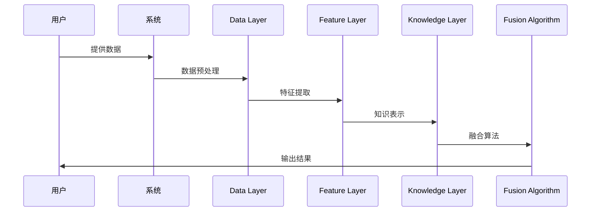

                 

### 第一部分：背景介绍

#### 第1章：问题背景

##### 1.1.1 问题背景

随着人工智能技术的不断进步，AI Agent在各种领域中的应用越来越广泛。从智能家居的语音助手到自动驾驶汽车的决策系统，AI Agent正在逐步接管许多复杂的任务。然而，现有的AI Agent在处理多模态知识融合方面仍存在诸多局限。多模态知识融合指的是将来自不同模态的数据（如文本、图像、语音等）进行有效整合，以提高AI Agent的智能水平。

##### 1.1.2 问题描述

多模态知识融合的目标是实现多种数据源的整合，以提供更全面和准确的信息。然而，这一目标面临着数据复杂性、处理效率和知识表示等方面的挑战：

1. **数据复杂性**：不同模态的数据具有不同的结构和属性，这使得数据的整合变得复杂。
2. **处理效率**：多模态数据的处理需要大量的计算资源和时间，特别是在实时应用中。
3. **知识表示**：如何有效地表示和存储融合后的知识，以便于后续的查询和使用，是一个重要问题。

##### 1.1.3 问题解决

为了解决多模态知识融合的挑战，我们需要从以下几个方面进行深入研究和实践：

1. **核心概念原理**：首先，我们需要了解多模态知识融合的核心概念，如数据源、数据预处理、特征提取和知识表示等。
2. **概念属性特征对比表格**：通过对比分析不同模态数据的属性特征，我们可以为后续的融合处理提供更科学的依据。
3. **ER实体关系图架构**：构建多模态知识融合的ER实体关系图，有助于我们明确各实体之间的关系和作用，从而优化融合算法的设计。

### 第2章：背景知识与相关技术

#### 2.1.1 数据源介绍

多模态知识融合涉及多种数据源，以下是几种常见的数据源及其特点：

1. **文本数据**：文本数据包括文档、博客、社交媒体帖子等。文本数据的特点是信息丰富，但处理复杂。
2. **图像数据**：图像数据包括图片、视频等。图像数据的特点是直观，但处理难度大，需要强大的计算能力。
3. **语音数据**：语音数据包括语音信号、语音转录文本等。语音数据的特点是实时性强，但理解难度大。

#### 2.1.2 数据预处理技术

数据预处理是多模态知识融合的重要环节，主要包括以下方法：

1. **数据清洗**：去除数据中的噪声和不相关部分，以提高后续处理的准确性。
2. **数据归一化**：将数据转换到同一尺度，以消除数据之间的差异。
3. **数据增强**：通过生成新的数据样本，提高模型的泛化能力。

#### 2.1.3 特征提取方法

特征提取是将原始数据转换成适用于机器学习模型的特征表示。以下是几种常见的特征提取方法：

1. **深度学习**：通过神经网络模型自动学习数据的高层特征。
2. **传统机器学习**：如支持向量机（SVM）、决策树等，它们可以直接对数据进行特征提取。
3. **基于注意力的方法**：如自注意力机制，可以有效地捕捉数据中的关键特征。

#### 2.1.4 知识表示方法

知识表示是将提取出的特征转换成可操作的知识表示。以下是几种常见的知识表示方法：

1. **图谱表示**：通过图结构来表示数据之间的关系。
2. **本体表示**：使用本体论来描述知识的结构和语义。
3. **向量空间模型**：将知识表示为向量，以便于在向量空间中进行处理。

### 第3章：多模态知识融合算法原理

#### 3.1.1 算法概述

多模态知识融合算法主要包括数据集成、特征融合和知识表示三个阶段：

1. **数据集成**：将不同模态的数据进行整合，形成一个统一的数据视图。
2. **特征融合**：将整合后的数据进行特征提取，形成高维特征向量。
3. **知识表示**：将特征向量转换成易于处理和查询的知识表示形式。

#### 3.1.2 数据集成方法

数据集成是多模态知识融合的基础。以下是几种常见的数据集成方法：

1. **投票法**：简单地将不同模态的数据进行投票，选择投票结果作为最终输出。
2. **加权平均法**：根据不同模态的数据重要性进行加权，计算加权平均作为最终输出。
3. **聚类法**：将不同模态的数据进行聚类，选择聚类中心作为最终输出。

#### 3.1.3 特征融合方法

特征融合是将整合后的数据转换成高维特征向量。以下是几种常见的特征融合方法：

1. **基于特征的加权融合**：根据不同特征的重要性进行加权，计算加权融合向量。
2. **基于模型的融合**：使用模型（如神经网络）将不同模态的数据转换成统一的特征向量。

#### 3.1.4 知识表示方法

知识表示是将特征向量转换成易于处理和查询的知识表示形式。以下是几种常见的知识表示方法：

1. **图谱表示**：通过图结构来表示数据之间的关系。
2. **本体表示**：使用本体论来描述知识的结构和语义。
3. **向量空间模型**：将知识表示为向量，以便于在向量空间中进行处理。

### 第4章：数学模型和数学公式

#### 4.1.1 数学模型

多模态知识融合的数学模型主要涉及以下几个方面：

1. **概率模型**：使用概率论的方法来描述多模态数据的分布。
2. **优化模型**：通过优化方法来求解多模态数据融合的最优解。

#### 4.1.2 公式推导

以下是一个简单的概率模型推导示例：

$$
P(\text{多模态数据}) = P(\text{文本数据}) \times P(\text{图像数据}) \times P(\text{语音数据})
$$

#### 4.1.3 举例说明

假设我们有一个文本数据集，其中每个文本包含多个关键词。我们可以使用词频（TF）和逆文档频率（IDF）来计算关键词的权重：

$$
w(\text{关键词}) = \text{TF}(\text{关键词}) \times \text{IDF}(\text{关键词})
$$

其中，TF表示关键词在文本中的出现次数，IDF表示关键词在整个数据集中的重要性。

### 第二部分：多模态知识融合系统设计与实现

#### 第5章：系统设计与架构

##### 5.1.1 系统功能设计

多模态知识融合系统的主要功能包括：

1. **数据预处理**：对多模态数据进行清洗、归一化和增强。
2. **特征提取**：从预处理后的数据中提取高维特征向量。
3. **知识表示**：将特征向量转换成易于处理和查询的知识表示形式。
4. **融合算法**：将不同模态的数据进行融合，形成统一的知识表示。

##### 5.1.2 系统架构设计

多模态知识融合系统的整体架构包括以下几个层次：

1. **数据层**：包括数据源和数据存储。
2. **算法层**：包括数据预处理、特征提取、知识表示和融合算法。
3. **应用层**：包括系统的前端界面和后端服务。

##### 5.1.3 系统接口设计

系统的接口设计包括数据接口和功能接口：

1. **数据接口**：用于数据的输入和输出，如文本、图像和语音数据的输入接口，以及知识表示的输出接口。
2. **功能接口**：用于系统的功能调用，如数据预处理、特征提取和融合算法的接口。

##### 5.1.4 系统交互流程

使用mermaid序列图展示系统各部分之间的交互流程：



#### 第6章：数据预处理与特征提取

##### 6.1.1 数据预处理

数据预处理是多模态知识融合系统的关键步骤，主要包括以下内容：

1. **数据清洗**：去除数据中的噪声和不相关部分，如去除文本中的标点符号、HTML标签等。
2. **数据归一化**：将不同模态的数据转换到同一尺度，如将图像像素值归一化到[0, 1]。
3. **数据增强**：通过生成新的数据样本，提高模型的泛化能力，如图像的旋转、缩放和裁剪。

##### 6.1.2 特征提取

特征提取是将预处理后的数据转换成高维特征向量，以下是几种常见的特征提取方法：

1. **深度学习**：使用神经网络模型自动学习数据的高层特征。
2. **传统机器学习**：如支持向量机（SVM）、决策树等，可以直接对数据进行特征提取。
3. **基于注意力的方法**：如自注意力机制，可以有效地捕捉数据中的关键特征。

##### 6.1.3 特征融合

特征融合是将不同模态的数据特征进行整合，形成统一的高维特征向量。以下是几种常见的特征融合方法：

1. **基于特征的加权融合**：根据不同特征的重要性进行加权，计算加权融合向量。
2. **基于模型的融合**：使用模型（如神经网络）将不同模态的数据特征进行融合。

#### 第7章：知识表示与融合算法实现

##### 7.1.1 知识表示

知识表示是将特征向量转换成易于处理和查询的知识表示形式。以下是几种常见的知识表示方法：

1. **图谱表示**：通过图结构来表示数据之间的关系。
2. **本体表示**：使用本体论来描述知识的结构和语义。
3. **向量空间模型**：将知识表示为向量，以便于在向量空间中进行处理。

##### 7.1.2 融合算法实现

融合算法实现包括数据集成、特征融合和知识表示等步骤。以下是几种常见的融合算法：

1. **投票法**：简单地将不同模态的数据进行投票，选择投票结果作为最终输出。
2. **加权平均法**：根据不同模态的数据重要性进行加权，计算加权平均作为最终输出。
3. **聚类法**：将不同模态的数据进行聚类，选择聚类中心作为最终输出。

##### 7.1.3 算法优化与调参

算法优化和调参是提高系统性能的重要手段。以下是几种常见的优化方法和调参技巧：

1. **梯度下降法**：通过不断调整模型的参数，使其在损失函数上达到最小值。
2. **随机搜索**：在参数空间中随机搜索最优参数。
3. **贝叶斯优化**：使用贝叶斯统计模型来优化参数搜索。

#### 第8章：项目实战

##### 8.1.1 环境安装

在进行多模态知识融合项目实战之前，我们需要安装以下软件和工具：

1. **Python**：Python是一种广泛使用的编程语言，用于编写和运行项目代码。
2. **TensorFlow**：TensorFlow是一种流行的深度学习框架，用于构建和训练深度学习模型。
3. **OpenCV**：OpenCV是一个开源的计算机视觉库，用于图像处理和特征提取。

##### 8.1.2 系统核心实现源代码

以下是多模态知识融合系统核心实现的一部分代码：

```python
import tensorflow as tf
import numpy as np
import cv2

# 数据预处理
def preprocess_data(data):
    # 数据清洗、归一化等处理
    return processed_data

# 特征提取
def extract_features(data):
    # 使用深度学习模型提取特征
    return features

# 知识表示
def represent_knowledge(features):
    # 使用图谱表示、本体表示等
    return knowledge_representation

# 融合算法
def fusion_algorithm(knowledge_representation):
    # 使用投票法、加权平均法等
    return fused_knowledge

# 主程序
if __name__ == "__main__":
    # 加载数据
    data = load_data()

    # 数据预处理
    processed_data = preprocess_data(data)

    # 特征提取
    features = extract_features(processed_data)

    # 知识表示
    knowledge_representation = represent_knowledge(features)

    # 融合算法
    fused_knowledge = fusion_algorithm(knowledge_representation)

    # 输出结果
    print(fused_knowledge)
```

##### 8.1.3 代码应用解读与分析

以上代码是多模态知识融合系统核心实现的一部分，下面进行解读和分析：

1. **数据预处理**：`preprocess_data` 函数负责对输入数据进行清洗、归一化等预处理操作。
2. **特征提取**：`extract_features` 函数使用深度学习模型对预处理后的数据进行特征提取。
3. **知识表示**：`represent_knowledge` 函数将提取出的特征转换成图谱表示、本体表示等知识表示形式。
4. **融合算法**：`fusion_algorithm` 函数根据不同的融合算法，如投票法、加权平均法等，对知识表示进行融合。

##### 8.1.4 实际案例分析和详细讲解剖析

为了更好地理解多模态知识融合系统的应用，我们来看一个实际案例：

假设我们有一个多模态数据集，包含文本、图像和语音三种模态。我们的目标是利用这些数据来识别图像中的物体。

1. **数据预处理**：对文本、图像和语音数据进行清洗、归一化和增强。
2. **特征提取**：使用深度学习模型对文本数据进行词嵌入，对图像数据进行卷积神经网络（CNN）特征提取，对语音数据进行循环神经网络（RNN）特征提取。
3. **知识表示**：将提取出的特征融合成统一的高维特征向量，然后使用图谱表示、本体表示等方法进行知识表示。
4. **融合算法**：使用投票法将不同模态的数据进行融合，形成最终的物体识别结果。

##### 8.1.5 项目小结

通过以上实战案例，我们可以看到多模态知识融合系统在物体识别任务中的应用效果。在实际项目中，我们需要根据具体任务的需求和特点，选择合适的数据预处理、特征提取、知识表示和融合算法，以提高系统的性能和效果。

#### 最佳实践 Tips

1. **数据质量**：确保输入数据的质量和一致性，这是多模态知识融合系统的关键。
2. **算法优化**：不断优化算法参数，以提高系统的性能。
3. **硬件支持**：使用高性能计算硬件，如GPU，以加速模型的训练和推理过程。

#### 小结

多模态知识融合是人工智能领域的一个重要研究方向，它在提升AI Agent智能水平方面具有巨大的潜力。通过本文的介绍，我们了解了多模态知识融合的基本概念、背景知识、算法原理以及系统设计与实现方法。希望本文能为您在多模态知识融合领域的探索提供一些有益的参考和启示。

#### 注意事项

1. **数据隐私**：在实际应用中，我们需要注意保护用户的隐私，避免数据泄露。
2. **系统性能**：在系统设计和实现过程中，我们需要关注系统的性能，确保其能够高效地处理大量数据。

#### 拓展阅读

1. **《深度学习》**：Goodfellow、Bengio和Courville合著的《深度学习》是一本经典的深度学习教材，涵盖了深度学习的基础知识和最新进展。
2. **《计算机视觉：算法与应用》**：Richard S.zelinsky和Peter K. Kneser合著的《计算机视觉：算法与应用》是一本全面的计算机视觉教材，适合对计算机视觉感兴趣的读者。
3. **《机器学习：概率视角》**：Kevin P. Murphy的《机器学习：概率视角》是一本深入讲解机器学习概率模型的教材，适合希望深入了解概率模型在多模态知识融合中应用的读者。

