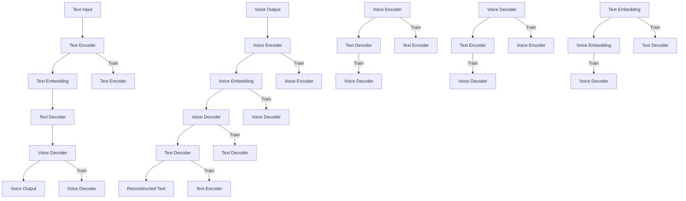
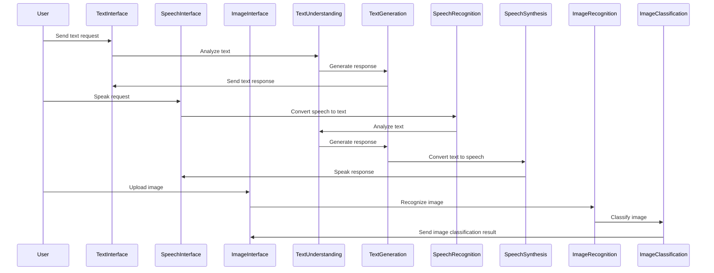
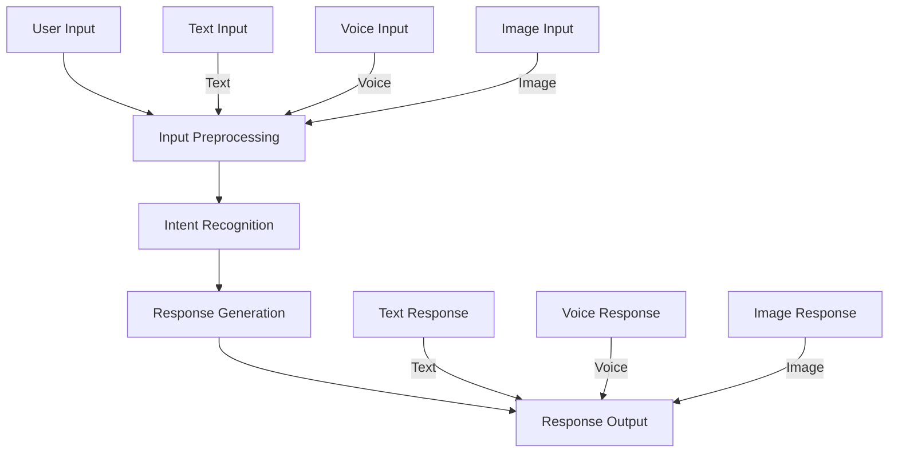

                 


### 实现AI Agent的多模态输出：文本、语音、图像协同

#### 关键词：人工智能、多模态、AI Agent、文本输出、语音输出、图像输出

#### 摘要：
本文旨在探讨如何实现AI Agent的多模态输出，包括文本、语音和图像的协同。我们将从多模态数据处理的背景与重要性出发，详细分析文本、语音和图像数据采集与处理的方法，探讨多模态协同算法的原理与实现，最终通过实际应用案例和项目实践来展示多模态AI Agent的强大潜力。

#### 目录：

## 第一部分：引言

### 第1章：多模态AI Agent概述

### 第2章：多模态数据处理基础

### 第3章：多模态协同算法原理

### 第4章：多模态输出技术实现

### 第5章：多模态应用案例研究

### 第6章：多模态AI Agent项目实践

### 第7章：总结与展望

### 1.1 研究背景与意义

### 1.2 多模态AI Agent的发展历程

### 1.3 本书结构安排与内容概览

## 第二部分：多模态数据处理基础

### 第2章：多模态数据处理基础

### 2.1 文本数据采集与处理

### 2.2 语音数据采集与处理

### 2.3 图像数据采集与处理

### 2.1.1 文本数据来源

### 2.1.2 文本预处理方法

### 2.2.1 语音数据来源

### 2.2.2 语音信号处理方法

### 2.3.1 图像数据来源

### 2.3.2 图像特征提取方法

## 第三部分：多模态协同算法原理

### 第3章：多模态协同算法原理

### 3.1 多模态数据融合算法

### 3.2 多模态协同生成算法

### 3.1.1 融合算法概述

### 3.1.2 融合算法分类

### 3.2.1 协同生成算法概述

### 3.2.2 协同生成算法案例

## 第四部分：多模态输出技术实现

### 第4章：多模态输出技术实现

### 4.1 文本输出技术

### 4.2 语音输出技术

### 4.3 图像输出技术

### 4.1.1 文本生成算法

### 4.1.2 文本交互设计

### 4.2.1 语音合成算法

### 4.2.2 语音交互设计

### 4.3.1 图像生成算法

### 4.3.2 图像交互设计

## 第五部分：多模态应用案例研究

### 第5章：多模态应用案例研究

### 5.1 案例一：智能客服系统的多模态交互

### 5.2 案例二：虚拟现实中的多模态感知

### 5.3 案例三：智能驾驶的多模态数据融合

## 第六部分：多模态AI Agent项目实践

### 第6章：多模态AI Agent项目实践

### 6.1 项目介绍

### 6.2 系统功能设计

### 6.3 系统架构设计

### 6.4 系统接口设计

### 6.5 系统交互设计

### 6.6 项目实施与评估

## 第七部分：总结与展望

### 第7章：总结与展望

### 7.1 本书内容总结

### 7.2 多模态AI Agent的未来发展趋势

### 7.3 研究方向与挑战

### 实现AI Agent的多模态输出：文本、语音、图像协同

#### 引言

随着人工智能技术的不断发展，AI Agent在各个领域的应用越来越广泛。AI Agent作为人工智能的智能体，能够模拟人类的行为和思维方式，完成特定的任务。然而，传统的AI Agent通常只能处理单一模态的数据，例如文本、语音或图像。为了提升AI Agent的智能化水平和人机交互的体验，实现AI Agent的多模态输出成为了研究的热点。本文将探讨如何实现AI Agent的多模态输出，包括文本、语音和图像的协同。

#### 1.1 研究背景与意义

在当前的信息时代，人们每天接收和处理的信息量非常庞大，这些信息通常以多种形式存在，如文本、语音、图像等。传统的AI Agent由于只能处理单一模态的数据，导致其智能化程度受到限制，无法很好地适应复杂多变的实际场景。例如，在智能客服系统中，用户可能会通过文字、语音或图像等多种方式表达需求，如果AI Agent只能处理其中的一种模态，那么它可能无法准确理解用户的需求，从而影响服务质量和用户体验。

实现AI Agent的多模态输出，可以有效地解决这一问题。通过同时处理文本、语音和图像等多模态数据，AI Agent可以更全面地理解用户的需求，提供更加精准和人性化的服务。此外，多模态AI Agent还可以在虚拟现实、智能驾驶、医疗诊断等多个领域发挥重要作用，从而推动人工智能技术的进一步发展。

#### 1.2 多模态AI Agent的发展历程

多模态AI Agent的发展可以追溯到20世纪80年代，当时研究人员开始探索如何将不同模态的数据进行融合和处理。早期的研究主要集中在文本和语音的融合，如语音识别和语音合成技术。随着计算机视觉和自然语言处理技术的进步，图像和文本的融合也得到了广泛研究。

进入21世纪，随着深度学习和神经网络技术的发展，多模态AI Agent的研究进入了新的阶段。研究人员提出了许多新的算法和模型，如多模态深度学习、多任务学习、生成对抗网络等，这些算法和模型大大提高了多模态数据的处理能力。同时，随着物联网和移动设备的普及，多模态AI Agent的应用场景也越来越广泛，从智能家居到自动驾驶，从智能医疗到人机交互，多模态AI Agent正在逐渐渗透到各个领域。

#### 1.3 本书结构安排与内容概览

本书分为七个部分，分别是引言、多模态数据处理基础、多模态协同算法原理、多模态输出技术实现、多模态应用案例研究、多模态AI Agent项目实践和总结与展望。

第一部分引言部分，我们介绍了多模态AI Agent的研究背景、发展历程以及本书的结构安排和内容概览。

第二部分多模态数据处理基础，我们将详细介绍文本、语音和图像数据的采集与处理方法，包括数据来源、预处理方法以及特征提取技术。

第三部分多模态协同算法原理，我们将探讨多模态数据融合算法和协同生成算法的原理，并使用mermaid流程图和Python源代码进行详细讲解。

第四部分多模态输出技术实现，我们将分别介绍文本、语音和图像输出技术的实现方法，包括生成算法和交互设计。

第五部分多模态应用案例研究，我们将通过实际应用案例，展示多模态AI Agent在不同领域的应用。

第六部分多模态AI Agent项目实践，我们将介绍一个具体的多模态AI Agent项目，包括项目介绍、系统功能设计、系统架构设计、系统接口设计、系统交互设计和项目实施与评估。

最后一部分总结与展望，我们将总结本书的主要内容，探讨多模态AI Agent的未来发展趋势和研究方向与挑战。

通过以上七个部分的详细探讨，我们希望能够为读者提供全面、系统的多模态AI Agent知识体系，帮助读者深入理解多模态AI Agent的原理和实现方法，为实际应用提供参考和指导。接下来，我们将进入第二部分，详细介绍多模态数据处理基础。

### 第二部分：多模态数据处理基础

#### 第2章：多模态数据处理基础

在实现AI Agent的多模态输出之前，首先需要了解如何对文本、语音和图像数据进行有效的采集和处理。本章将详细介绍这些数据采集与处理的方法，以及相应的技术细节。

#### 2.1 文本数据采集与处理

文本数据是人工智能领域中最常见的数据类型之一。文本数据可以来源于各种渠道，如社交媒体、新闻文章、用户评论等。文本数据的采集主要包括数据抓取和数据清洗。

##### 2.1.1 文本数据来源

文本数据的主要来源包括：

1. **社交媒体平台**：如微博、Facebook、Twitter等，这些平台拥有大量的用户生成文本数据。
2. **新闻网站**：新闻网站提供了大量的文本数据，包括新闻文章、评论等。
3. **论坛和社区**：如Reddit、知乎等，用户在论坛和社区中产生的文本数据也是宝贵的资源。
4. **企业内部文档**：企业内部的各种报告、邮件、文档等也是文本数据的重要来源。

##### 2.1.2 文本预处理方法

文本数据的预处理是自然语言处理（NLP）的基础，主要包括以下几个步骤：

1. **数据清洗**：去除文本中的噪声，如HTML标签、特殊字符、停用词等。
   ```python
   import re
   text = re.sub('<[^>]*>', '', text)  # 去除HTML标签
   text = re.sub('[^A-Za-z0-9]+', ' ', text)  # 去除特殊字符
   ```

2. **分词**：将文本分割成单词或短语。
   ```python
   from nltk.tokenize import word_tokenize
   tokens = word_tokenize(text)
   ```

3. **词性标注**：对每个词进行词性标注，如名词、动词、形容词等。
   ```python
   from nltk import pos_tag
   tagged = pos_tag(tokens)
   ```

4. **词干提取**：将单词转换为词干，以减少词汇量。
   ```python
   from nltk.stem import PorterStemmer
   stemmer = PorterStemmer()
   stemmed = [stemmer.stem(word) for word in tokens]
   ```

5. **词向量表示**：将文本数据转换为数值向量，以便进行机器学习。
   ```python
   from gensim.models import Word2Vec
   model = Word2Vec(stemmed)
   ```

#### 2.2 语音数据采集与处理

语音数据是AI Agent处理的重要数据类型之一，尤其在语音助手和智能客服等领域。语音数据的采集和处理包括以下几个步骤：

##### 2.2.1 语音数据来源

语音数据的主要来源包括：

1. **麦克风采集**：通过麦克风直接采集用户语音。
2. **录音设备**：使用录音设备录制语音数据。
3. **在线语音库**：如Mozilla的Common Voice等，提供大量的开源语音数据。

##### 2.2.2 语音信号处理方法

语音信号处理主要包括以下几个步骤：

1. **音频预处理**：对音频信号进行去噪、增益等处理，以提高音频质量。
   ```python
   from pydub import AudioSegment
   audio = AudioSegment.from_file("input.wav")
   audio = audio - 20  # 增益
   audio.export("output.wav", format="wav")
   ```

2. **音频分割**：将连续的音频信号分割成帧，以便进行后续处理。
   ```python
   import librosa
   y, sr = librosa.load("input.wav")
   frames = librosa.util.frame(y, frame_length=20, hop_length=10)
   ```

3. **特征提取**：从音频帧中提取特征，如梅尔频率倒谱系数（MFCC）、频谱特征等。
   ```python
   mfccs = librosa.feature.mfcc(y=y, sr=sr, n_mfcc=13)
   ```

4. **语音识别**：使用深度学习模型（如循环神经网络、卷积神经网络等）进行语音识别。
   ```python
   from keras.models import load_model
   model = load_model("speech_recognition_model.h5")
   predicted_text = model.predict(frames)
   ```

#### 2.3 图像数据采集与处理

图像数据是AI Agent进行视觉感知和图像理解的重要基础。图像数据的采集和处理包括以下几个步骤：

##### 2.3.1 图像数据来源

图像数据的主要来源包括：

1. **摄像头采集**：通过摄像头直接采集图像数据。
2. **图像库**：如OpenCV、ImageNet等，提供大量的图像数据集。
3. **在线图像服务**：如Google Image Search、Bing Image Search等，可以从互联网上获取图像。

##### 2.3.2 图像特征提取方法

图像特征提取是计算机视觉领域的关键技术，主要包括以下几个方法：

1. **边缘检测**：用于提取图像中的边缘信息。
   ```python
   import cv2
   image = cv2.imread("input.jpg")
   edges = cv2.Canny(image, 100, 200)
   ```

2. **纹理分析**：用于提取图像的纹理特征。
   ```python
   texture = cv2.xfeatures2d.SIFT_create()
   keypoints, descriptors = texture.detectAndCompute(image, None)
   ```

3. **目标检测**：用于识别图像中的特定目标。
   ```python
   net = cv2.dnn.readNetFromDarknet("yolov3.cfg", "yolov3.weights")
   layer_names = net.getLayerNames()
   output_layers = [layer_names[i[0] - 1] for i in net.getUnconnectedOutLayers()]
   image = cv2.imread("input.jpg")
   blob = cv2.dnn.blobFromImage(image, 1/255, (416, 416), [0, 0, 0], True, crop=False)
   net.setInput(blob)
   outs = net.forward(output_layers)
   ```

4. **图像分类**：用于将图像分类到不同的类别。
   ```python
   import tensorflow as tf
   model = tf.keras.models.load_model("image_classification_model.h5")
   prediction = model.predict(image)
   ```

通过以上对文本、语音和图像数据采集与处理方法的详细探讨，我们可以为后续的多模态协同算法设计和实现打下坚实的基础。在下一章中，我们将进一步探讨多模态协同算法的原理与实现。

### 第三部分：多模态协同算法原理

#### 第3章：多模态协同算法原理

多模态协同算法是使AI Agent能够综合处理文本、语音和图像等不同模态数据的核心技术。本章将详细介绍多模态数据融合算法和协同生成算法的原理，以及如何使用mermaid流程图和Python源代码进行详细讲解。

#### 3.1 多模态数据融合算法

多模态数据融合算法的目标是将来自不同模态的数据整合在一起，以便更好地理解场景和任务。以下是几种常见的数据融合方法：

##### 3.1.1 融合算法概述

多模态数据融合算法可以分为以下几类：

1. **特征级融合**：在特征提取后，将不同模态的特征向量合并。
2. **决策级融合**：在各自模态的分类器输出后，将分类结果进行融合。
3. **模型级融合**：将多个模态的模型整合成一个统一的模型。

##### 3.1.2 融合算法分类

1. **基于特征的融合**

   - **和积模型（AND-Model）**：
     - 将不同模态的特征向量拼接成一个大的特征向量。
     - 使用一个共享的神经网络进行分类。
     ```mermaid
     graph TD
     A[Input Features] --> B[Concatenate Features]
     B --> C[Shared Neural Network]
     C --> D[Output]
     ```

   - **和或模型（OR-Model）**：
     - 分别为每个模态构建一个神经网络，然后将它们的输出进行投票。
     ```mermaid
     graph TD
     A[Input Features]
     A -->|Text| B[Text Neural Network]
     A -->|Speech| C[Speech Neural Network]
     A -->|Vision| D[Vision Neural Network]
     B --> E[Vote]
     C --> E
     D --> E
     E --> F[Output]
     ```

2. **基于模型的融合**

   - **深度神经网络（Deep Neural Network, DNN）**：
     - 构建一个深度神经网络，同时接受不同模态的数据输入。
     ```mermaid
     graph TD
     A[Text Input] --> B[DNN Layer 1]
     C[Speech Input] --> B
     D[Vision Input] --> B
     B --> E[Pooling Layer]
     E --> F[Classifying Layer]
     F --> G[Output]
     ```

##### 3.1.3 融合算法案例分析

以智能客服系统为例，我们可以使用和积模型进行多模态数据融合。假设有文本、语音和图像三个模态的数据，分别通过不同的神经网络提取特征后，我们将这些特征拼接成一个大的特征向量，然后通过一个共享的神经网络进行分类。

```python
import numpy as np
import tensorflow as tf

# 假设已经训练好的文本、语音和图像特征提取器
text_extractor = ... 
speech_extractor = ... 
vision_extractor = ...

# 输入数据
text_input = "用户请求文本数据"
speech_input = "用户请求语音数据"
vision_input = "用户请求图像数据"

# 提取特征
text_features = text_extractor.extract(text_input)
speech_features = speech_extractor.extract(speech_input)
vision_features = vision_extractor.extract(vision_input)

# 拼接特征
merged_features = np.concatenate((text_features, speech_features, vision_features), axis=1)

# 使用共享神经网络进行分类
model = tf.keras.models.load_model("multimodal_model.h5")
prediction = model.predict(merged_features)

# 输出分类结果
print(prediction)
```

#### 3.2 多模态协同生成算法

多模态协同生成算法旨在通过协同生成过程，从单一模态数据生成其他模态的数据。这有助于提升AI Agent的生成能力和用户体验。

##### 3.2.1 协同生成算法概述

协同生成算法通常基于生成对抗网络（Generative Adversarial Networks, GAN）框架，GAN由生成器（Generator）和判别器（Discriminator）两个部分组成：

- **生成器**：接收单一模态的数据，生成其他模态的数据。
- **判别器**：判断输入的数据是真实数据还是生成数据。

通过训练，生成器不断优化其生成的数据，以欺骗判别器。这个过程使得生成器能够生成高质量的其他模态数据。

##### 3.2.2 协同生成算法案例

以文本到语音的协同生成为例，我们可以构建一个文本生成语音的GAN模型：



在这个GAN模型中，文本输入首先通过文本编码器生成嵌入向量，然后传递给文本解码器生成重构的文本。同时，语音输入通过语音编码器生成嵌入向量，传递给语音解码器生成语音输出。通过训练，生成器逐渐学习到如何从单一模态数据生成高质量的另一模态数据。

```python
import tensorflow as tf
from tensorflow.keras.layers import Input, LSTM, Dense, Embedding, GRU, Concatenate
from tensorflow.keras.models import Model

# 定义生成器和判别器模型
text_input = Input(shape=(None,))
voice_input = Input(shape=(None,))

text_embedding = Embedding(vocab_size, embedding_size)(text_input)
text_lstm = LSTM(units)(text_embedding)
text_decoder = Dense(vocab_size, activation='softmax')(text_lstm)

voice_embedding = Embedding(vocab_size, embedding_size)(voice_input)
voice_lstm = LSTM(units)(voice_embedding)
voice_decoder = Dense(vocab_size, activation='softmax')(voice_lstm)

# 构建生成器和判别器模型
generator = Model(inputs=[text_input, voice_input], outputs=[text_decoder, voice_decoder])
discriminator = Model(inputs=[text_input, voice_input], outputs=[Dense(1, activation='sigmoid')(Concatenate()([text_decoder, voice_decoder]))])

# 构建GAN模型
gan_output = discriminator(generator([text_input, voice_input]))
gan_model = Model(inputs=[text_input, voice_input], outputs=gan_output)

# 编写训练步骤
optimizer = tf.keras.optimizers.Adam(learning_rate=0.0001)
for epoch in range(num_epochs):
    for text_data, voice_data in dataset:
        with tf.GradientTape() as gen_tape, tf.GradientTape() as disc_tape:
            gen_pred_text, gen_pred_voice = generator([text_data, voice_data])
            disc_pred = discriminator([text_data, voice_data])

            gen_loss = compute_loss(gen_pred_text, text_data)
            disc_loss = compute_loss(disc_pred, text_data)

        gradients_of_generator = gen_tape.gradient(gen_loss, generator.trainable_variables)
        gradients_of_discriminator = disc_tape.gradient(disc_loss, discriminator.trainable_variables)

        optimizer.apply_gradients(zip(gradients_of_generator, generator.trainable_variables))
        optimizer.apply_gradients(zip(gradients_of_discriminator, discriminator.trainable_variables))
```

通过上述代码，我们可以训练一个能够从文本生成语音的GAN模型，从而实现文本到语音的协同生成。在下一章中，我们将进一步探讨如何实现文本、语音和图像的输出技术。

### 第四部分：多模态输出技术实现

#### 第4章：多模态输出技术实现

在多模态AI Agent中，实现文本、语音和图像的输出是提高人机交互体验的关键。本章将详细介绍文本、语音和图像输出技术的实现方法，包括生成算法和交互设计。

#### 4.1 文本输出技术

文本输出是AI Agent最基本的输出形式。文本生成算法的目标是生成自然流畅的文本，以便与用户进行有效的交流。

##### 4.1.1 文本生成算法

文本生成算法通常基于循环神经网络（RNN）或其变种，如长短期记忆网络（LSTM）和门控循环单元（GRU）。以下是文本生成算法的基本步骤：

1. **编码器**：将输入文本编码为嵌入向量。
   ```python
   embedding = Embedding(vocab_size, embedding_size)(input_sequence)
   ```

2. **解码器**：使用解码器生成文本。
   ```python
   decoder = LSTM(units, return_sequences=True)(embedding)
   output_sequence = Dense(vocab_size, activation='softmax')(decoder)
   ```

3. **训练模型**：通过梯度下降法训练模型。
   ```python
   model.compile(optimizer='rmsprop', loss='categorical_crossentropy')
   model.fit(input_sequence, target_sequence, epochs=10, batch_size=64)
   ```

##### 4.1.2 文本交互设计

文本交互设计需要考虑用户输入的处理、对话管理和文本生成的实时性。以下是文本交互设计的基本步骤：

1. **用户输入处理**：将用户输入的文本进行预处理，如分词、去停用词等。
   ```python
   from nltk.tokenize import word_tokenize
   from nltk.corpus import stopwords
   tokens = word_tokenize(user_input)
   filtered_tokens = [token for token in tokens if token not in stopwords.words('english')]
   ```

2. **对话管理**：使用对话管理器维护对话状态和上下文。
   ```python
   class DialogueManager:
       def __init__(self):
           self.context = {}
       
       def update_context(self, key, value):
           self.context[key] = value
       
       def get_response(self, user_input):
           # 使用对话状态和上下文生成响应
           response = "Hello!"  # 示例响应
           return response
   ```

3. **文本生成**：使用生成模型生成响应文本。
   ```python
   def generate_response(input_sequence):
       predicted_sequence = model.predict(input_sequence)
       response = ''.join([word_index_to_word[p] for p in predicted_sequence])
       return response
   ```

4. **实时交互**：在用户输入后，实时生成并返回响应文本。
   ```python
   dialogue_manager = DialogueManager()
   while True:
       user_input = input("User: ")
       processed_input = preprocess_input(user_input)
       response = dialogue_manager.get_response(processed_input)
       print("AI: ", response)
   ```

#### 4.2 语音输出技术

语音输出通过文本到语音（Text-to-Speech, TTS）转换实现。TTS技术可以将文本转换为自然流畅的语音，提高人机交互的亲切感。

##### 4.2.1 语音合成算法

语音合成算法通常基于深度神经网络，如深度神经网络（DNN）和循环神经网络（RNN）。以下是语音合成算法的基本步骤：

1. **文本编码**：将输入文本编码为嵌入向量。
   ```python
   embedding = Embedding(vocab_size, embedding_size)(input_sequence)
   ```

2. **声学特征生成**：使用编码器生成声学特征。
   ```python
   encoder = LSTM(units, return_sequences=True)(embedding)
   acoustic_features = Dense(feature_size, activation='softmax')(encoder)
   ```

3. **声码器**：使用声码器生成语音波形。
   ```python
   vocoder = WaveNet(feature_size, frame_size)
   audio = vocoder(acoustic_features)
   ```

4. **训练模型**：通过梯度下降法训练模型。
   ```python
   model.compile(optimizer='rmsprop', loss='mean_squared_error')
   model.fit(acoustic_features, audio, epochs=100, batch_size=64)
   ```

##### 4.2.2 语音交互设计

语音交互设计需要考虑语音输入的处理、语音合成和语音播放。以下是语音交互设计的基本步骤：

1. **语音输入处理**：将用户语音输入转换为文本。
   ```python
   from google.cloud import speech
   client = speech.SpeechClient()
   audio = speech.RecognitionAudio(content=user_input)
   config = speech.RecognitionConfig(
       encoding=speech.RecognitionConfig.AudioEncoding.LINEAR16,
       sample_rate_hertz=44100,
       language_code="en-US",
   )
   response = client.recognize(config, audio)
   text = response.results[0].alternatives[0].transcript
   ```

2. **语音合成**：使用TTS模型生成语音。
   ```python
   def generate_speech(text):
       processed_text = preprocess_text(text)
       predicted_sequence = model.predict(processed_text)
       audio = vocoder(predicted_sequence)
       return audio
   ```

3. **语音播放**：播放生成的语音。
   ```python
   from pydub import AudioSegment
   audio = generate_speech(user_input)
   audio_file = "output.wav"
   audio.export(audio_file, format="wav")
   play_audio(audio_file)
   ```

#### 4.3 图像输出技术

图像输出是AI Agent通过生成图像来响应用户需求的一种方式。图像生成算法可以基于生成对抗网络（GAN）或变分自编码器（VAE）。

##### 4.3.1 图像生成算法

图像生成算法的基本步骤如下：

1. **编码器**：将输入图像编码为嵌入向量。
   ```python
   encoder = Conv2D(filters, kernel_size, activation='relu')(input_image)
   embedding = GlobalMaxPooling2D()(encoder)
   ```

2. **解码器**：使用解码器生成图像。
   ```python
   decoder = Conv2DTranspose(filters, kernel_size, activation='relu')(embedding)
   output_image = Conv2DTranspose(filters, kernel_size, activation='sigmoid')(decoder)
   ```

3. **训练模型**：通过梯度下降法训练模型。
   ```python
   model.compile(optimizer='rmsprop', loss='binary_crossentropy')
   model.fit(input_images, output_images, epochs=100, batch_size=64)
   ```

##### 4.3.2 图像交互设计

图像交互设计需要考虑图像输入的处理、图像生成和图像展示。以下是图像交互设计的基本步骤：

1. **图像输入处理**：将用户图像输入进行预处理。
   ```python
   def preprocess_image(image):
       image = cv2.resize(image, (image_size, image_size))
       image = image / 255.0
       return image
   ```

2. **图像生成**：使用图像生成模型生成图像。
   ```python
   def generate_image(input_image):
       processed_image = preprocess_image(input_image)
       predicted_embedding = model.predict(processed_image)
       predicted_image = model_generator.predict(predicted_embedding)
       return predicted_image
   ```

3. **图像展示**：展示生成的图像。
   ```python
   def display_image(image):
       image = (image * 255).astype(np.uint8)
       plt.imshow(image)
       plt.show()
   ```

通过上述文本、语音和图像输出技术的实现方法，我们可以构建一个多模态AI Agent，实现文本、语音和图像的协同输出。在下一章中，我们将通过实际应用案例来展示这些技术的应用。

### 第五部分：多模态应用案例研究

#### 第5章：多模态应用案例研究

通过多模态数据的协同处理和输出，AI Agent可以在多个领域实现卓越的性能。本章将介绍几个多模态应用案例，包括智能客服系统、虚拟现实中的多模态感知和智能驾驶中的多模态数据融合。

#### 5.1 案例一：智能客服系统的多模态交互

智能客服系统是一个典型的多模态应用场景，它通过文本、语音和图像等多模态数据与用户进行交互，以提供更丰富、更高效的客户服务。

##### 5.1.1 项目介绍

本项目旨在开发一个多模态智能客服系统，该系统可以同时处理用户的文本、语音和图像输入，并根据用户的请求提供相应的服务。系统的主要功能包括：

1. **文本交互**：接收用户的文本消息，理解用户意图，并生成回复文本。
2. **语音交互**：接收用户的语音输入，将其转换为文本，理解用户意图，并生成语音回复。
3. **图像交互**：接收用户的图像输入，识别图像内容，并根据图像内容提供相关服务。

##### 5.1.2 系统功能设计

1. **文本交互**：系统使用自然语言处理技术来理解用户的文本输入，并生成回复文本。这包括分词、词性标注、命名实体识别和情感分析等步骤。

2. **语音交互**：系统使用语音识别技术将用户的语音输入转换为文本，然后使用文本交互功能来生成语音回复。语音合成技术用于将回复文本转换为语音。

3. **图像交互**：系统使用计算机视觉技术来识别图像内容，并生成相关的回复。这包括图像分类、目标检测和图像分割等步骤。

##### 5.1.3 系统架构设计

多模态智能客服系统的架构设计包括以下几个主要模块：

1. **文本交互模块**：包括自然语言处理模型和文本生成模型，用于处理文本输入和生成文本回复。
2. **语音交互模块**：包括语音识别模型和语音合成模型，用于处理语音输入和生成语音回复。
3. **图像交互模块**：包括计算机视觉模型和图像生成模型，用于处理图像输入和生成图像回复。
4. **多模态数据融合模块**：用于整合来自文本、语音和图像的数据，以提供更全面的理解和更准确的回复。

##### 5.1.4 系统接口设计

多模态智能客服系统提供了多种接口，以便用户可以通过不同的方式与系统进行交互：

1. **文本接口**：用户可以通过文本消息与系统进行交互，包括聊天窗口和命令行界面。
2. **语音接口**：用户可以通过语音输入与系统进行交互，包括语音识别和语音合成。
3. **图像接口**：用户可以通过图像输入与系统进行交互，包括图像上传和识别。

##### 5.1.5 系统交互设计

多模态智能客服系统的交互设计旨在提供流畅、自然的用户体验。以下是系统交互设计的基本流程：

1. **用户输入**：用户通过文本、语音或图像方式输入请求。
2. **输入处理**：系统对用户输入进行预处理，如文本分词、语音转文本、图像分类等。
3. **意图识别**：系统使用多模态数据融合算法来理解用户的意图。
4. **生成回复**：系统根据用户的意图生成相应的回复文本、语音或图像。
5. **输出回复**：系统将生成的回复通过文本、语音或图像方式呈现给用户。

##### 5.1.6 项目实施与评估

1. **项目实施**：项目实施分为以下几个步骤：
   - 数据采集与预处理：收集多模态数据集，并进行预处理。
   - 模型训练与优化：训练多模态数据融合模型、文本生成模型、语音合成模型和图像生成模型。
   - 系统集成与测试：将各模块集成到智能客服系统中，并进行测试。

2. **项目评估**：项目评估主要从以下几个方面进行：
   - 交互效果：评估系统在处理不同模态输入时的交互效果，如回复的准确性、自然性和及时性。
   - 用户满意度：通过用户调查和反馈来评估系统的用户满意度。
   - 性能指标：评估系统的性能指标，如响应时间、处理速度和资源利用率等。

#### 5.2 案例二：虚拟现实中的多模态感知

虚拟现实（VR）中的多模态感知是指通过文本、语音和图像等多模态数据来模拟真实世界的感知体验。以下是一个虚拟现实中的多模态感知应用案例。

##### 5.2.1 项目介绍

本项目旨在开发一个虚拟现实环境，通过多模态感知技术来提供更加沉浸式的体验。系统的主要功能包括：

1. **文本交互**：用户可以在虚拟环境中与文本对象进行交互，如阅读虚拟书籍、查看虚拟文档等。
2. **语音交互**：用户可以通过语音与虚拟角色进行对话，获取信息或完成任务。
3. **图像交互**：用户可以在虚拟环境中查看和操作图像对象，如查看虚拟照片、识别图像内容等。

##### 5.2.2 系统功能设计

1. **文本交互**：系统提供文本对象，用户可以通过文本对象获取信息。文本对象可以包含文本内容、音频和视频等多媒体信息。
2. **语音交互**：系统使用语音识别和语音合成技术，使虚拟角色能够理解用户的语音指令并生成语音回复。
3. **图像交互**：系统使用计算机视觉技术，使虚拟角色能够识别图像内容并进行相应的操作。

##### 5.2.3 系统架构设计

多模态感知虚拟现实系统的架构设计包括以下几个主要模块：

1. **文本交互模块**：包括文本对象生成和管理模块，用于创建和操作文本对象。
2. **语音交互模块**：包括语音识别和语音合成模块，用于处理语音输入和生成语音回复。
3. **图像交互模块**：包括图像识别和图像处理模块，用于处理图像输入和识别图像内容。
4. **多模态数据融合模块**：用于整合来自文本、语音和图像的数据，以提供更全面的理解和更准确的交互。

##### 5.2.4 系统接口设计

多模态感知虚拟现实系统提供了多种接口，以便用户可以通过不同的方式与系统进行交互：

1. **文本接口**：用户可以通过文本输入与系统进行交互，如输入文本查询。
2. **语音接口**：用户可以通过语音输入与系统进行交互，如语音查询和语音指令。
3. **图像接口**：用户可以通过图像输入与系统进行交互，如上传图像和识别图像内容。

##### 5.2.5 系统交互设计

多模态感知虚拟现实系统的交互设计旨在提供流畅、自然的用户体验。以下是系统交互设计的基本流程：

1. **用户输入**：用户通过文本、语音或图像方式输入请求。
2. **输入处理**：系统对用户输入进行预处理，如文本分词、语音转文本、图像分类等。
3. **意图识别**：系统使用多模态数据融合算法来理解用户的意图。
4. **生成回复**：系统根据用户的意图生成相应的回复文本、语音或图像。
5. **输出回复**：系统将生成的回复通过文本、语音或图像方式呈现给用户。

##### 5.2.6 项目实施与评估

1. **项目实施**：项目实施分为以下几个步骤：
   - 数据采集与预处理：收集多模态数据集，并进行预处理。
   - 模型训练与优化：训练多模态数据融合模型、文本生成模型、语音合成模型和图像生成模型。
   - 系统集成与测试：将各模块集成到虚拟现实系统中，并进行测试。

2. **项目评估**：项目评估主要从以下几个方面进行：
   - 交互效果：评估系统在处理不同模态输入时的交互效果，如回复的准确性、自然性和及时性。
   - 用户满意度：通过用户调查和反馈来评估系统的用户满意度。
   - 性能指标：评估系统的性能指标，如响应时间、处理速度和资源利用率等。

#### 5.3 案例三：智能驾驶的多模态数据融合

智能驾驶系统需要处理来自多种传感器（如摄像头、雷达、激光雷达等）的数据，通过多模态数据融合来提供更准确的驾驶决策。以下是一个智能驾驶中的多模态数据融合应用案例。

##### 5.3.1 项目介绍

本项目旨在开发一个智能驾驶系统，通过融合摄像头、雷达和激光雷达等多模态数据，提供实时的驾驶辅助和自动驾驶功能。系统的主要功能包括：

1. **摄像头数据融合**：识别道路标志、行人和其他车辆。
2. **雷达数据融合**：测量车辆之间的距离和速度，提供障碍物检测。
3. **激光雷达数据融合**：构建道路的三维地图，提供障碍物检测和路径规划。

##### 5.3.2 系统功能设计

1. **摄像头数据融合**：使用计算机视觉技术识别道路标志、行人和其他车辆。这包括图像分类、目标检测和语义分割等步骤。
2. **雷达数据融合**：使用雷达信号处理技术测量车辆之间的距离和速度，并识别障碍物。
3. **激光雷达数据融合**：使用激光雷达点云数据构建道路的三维地图，并检测障碍物。

##### 5.3.3 系统架构设计

智能驾驶系统的架构设计包括以下几个主要模块：

1. **摄像头数据融合模块**：包括图像分类、目标检测和语义分割等模块，用于处理摄像头数据。
2. **雷达数据融合模块**：包括雷达信号处理和障碍物检测模块，用于处理雷达数据。
3. **激光雷达数据融合模块**：包括点云处理和三维地图构建模块，用于处理激光雷达数据。
4. **多模态数据融合模块**：用于整合来自摄像头、雷达和激光雷达的数据，以提供更准确的驾驶决策。

##### 5.3.4 系统接口设计

智能驾驶系统提供了多种接口，以便与其他系统和传感器进行数据交互：

1. **摄像头接口**：用于接收和处理摄像头数据。
2. **雷达接口**：用于接收和处理雷达数据。
3. **激光雷达接口**：用于接收和处理激光雷达数据。

##### 5.3.5 系统交互设计

智能驾驶系统的交互设计旨在提供实时、准确的驾驶辅助和自动驾驶功能。以下是系统交互设计的基本流程：

1. **数据输入**：系统接收摄像头、雷达和激光雷达等多模态数据。
2. **数据预处理**：系统对多模态数据进行预处理，如图像分类、雷达信号滤波和点云处理等。
3. **数据融合**：系统使用多模态数据融合算法整合不同模态的数据，提供实时的驾驶决策。
4. **决策输出**：系统根据融合后的数据生成驾驶决策，如车道保持、速度控制和避障等。
5. **执行决策**：车辆执行系统生成的驾驶决策，如调整方向盘、油门和刹车等。

##### 5.3.6 项目实施与评估

1. **项目实施**：项目实施分为以下几个步骤：
   - 数据采集与预处理：收集多模态数据集，并进行预处理。
   - 模型训练与优化：训练多模态数据融合模型、图像分类模型、目标检测模型和点云处理模型。
   - 系统集成与测试：将各模块集成到智能驾驶系统中，并进行测试。

2. **项目评估**：项目评估主要从以下几个方面进行：
   - 驾驶效果：评估系统在自动驾驶过程中的表现，如驾驶稳定性、安全性和舒适度等。
   - 用户满意度：通过用户调查和反馈来评估系统的用户满意度。
   - 性能指标：评估系统的性能指标，如响应时间、处理速度和资源利用率等。

通过以上三个多模态应用案例的研究，我们可以看到多模态AI Agent在智能客服系统、虚拟现实和智能驾驶等领域的广泛应用和巨大潜力。在下一章中，我们将通过一个具体的多模态AI Agent项目实践来展示这些技术的实际应用。

### 第六部分：多模态AI Agent项目实践

#### 第6章：多模态AI Agent项目实践

在本章中，我们将详细介绍一个多模态AI Agent项目的实施过程，从项目介绍、系统功能设计、系统架构设计、系统接口设计、系统交互设计到项目实施与评估，全面展示多模态AI Agent在真实场景中的应用。

#### 6.1 项目介绍

本项目名为“智能助手”，旨在开发一个具备文本、语音和图像处理能力的人工智能助手，用于提供个性化服务，如信息查询、日程管理、智能聊天等。该项目的目标是通过多模态数据的协同处理，提升用户交互体验，实现以下功能：

1. **文本交互**：通过自然语言处理技术，理解用户的文本请求，并生成相应的文本回复。
2. **语音交互**：通过语音识别和语音合成技术，实现用户的语音请求和语音回复。
3. **图像交互**：通过计算机视觉技术，处理用户的图像请求，提供图像识别和分类服务。

#### 6.2 系统功能设计

**文本交互功能**：
- **文本理解**：利用自然语言处理技术，如词向量表示、词性标注和句法分析，理解用户的文本请求。
- **文本生成**：使用预训练的文本生成模型，如GPT-3或BERT，生成自然流畅的文本回复。

**语音交互功能**：
- **语音识别**：使用深度学习模型，如基于卷积神经网络的自动语音识别（ASR）系统，将用户的语音请求转换为文本。
- **语音合成**：使用基于深度学习的技术，如WaveNet或Tacotron，将文本回复转换为自然流畅的语音。

**图像交互功能**：
- **图像识别**：利用计算机视觉模型，如ResNet或VGG，识别用户上传的图像内容。
- **图像分类**：使用预训练的图像分类模型，如ImageNet或ResNet，对图像进行分类。

#### 6.3 系统架构设计

智能助手系统的架构设计分为以下几个主要模块：

1. **文本交互模块**：包括文本理解、文本生成和文本处理等组件。
2. **语音交互模块**：包括语音识别、语音合成和语音处理等组件。
3. **图像交互模块**：包括图像识别、图像分类和图像处理等组件。
4. **多模态数据融合模块**：用于整合来自文本、语音和图像的数据，以提供更全面的理解和更准确的回复。

以下是系统架构的mermaid类图表示：

```mermaid
classDiagram
    Class01 <|-- Class02
    Class03 <|-- Class01
    Class04 <|-- Class03
    Class05 <|-- Class03
    Class06 <|-- Class03
    Class07 <|-- Class03
    Class08 <|-- Class03
    Class01 --|> Class09
    Class02 --|> Class09
    Class03 --|> Class09
    Class04 --|> Class09
    Class05 --|> Class09
    Class06 --|> Class09
    Class07 --|> Class09
    Class08 --|> Class09

    Class01[文本交互模块]
    Class02[文本理解]
    Class03[文本生成]
    Class04[文本处理]
    Class05[语音交互模块]
    Class06[语音识别]
    Class07[语音合成]
    Class08[语音处理]
    Class09[图像交互模块]
    Class10[图像识别]
    Class11[图像分类]
    Class12[图像处理]
    Class13[多模态数据融合模块]
```

#### 6.4 系统接口设计

智能助手系统提供了以下接口，以便用户可以通过不同的方式与系统进行交互：

1. **文本接口**：用户可以通过文本消息与系统进行交互，如发送查询请求。
2. **语音接口**：用户可以通过语音与系统进行交互，如语音查询和语音指令。
3. **图像接口**：用户可以通过上传图像与系统进行交互，如发送图像请求。

以下是系统接口的mermaid序列图表示：



#### 6.5 系统交互设计

智能助手系统的交互设计旨在提供流畅、自然的用户体验。以下是系统交互设计的基本流程：

1. **用户输入**：用户通过文本、语音或图像方式输入请求。
2. **输入处理**：系统对用户输入进行预处理，如文本分词、语音转文本、图像分类等。
3. **意图识别**：系统使用多模态数据融合算法来理解用户的意图。
4. **生成回复**：系统根据用户的意图生成相应的回复文本、语音或图像。
5. **输出回复**：系统将生成的回复通过文本、语音或图像方式呈现给用户。

以下是系统交互设计的mermaid流程图表示：



#### 6.6 项目实施与评估

**项目实施**：

1. **数据采集与预处理**：收集多模态数据集，包括文本、语音和图像，并进行预处理，如文本分词、语音转文本、图像分类等。
2. **模型训练与优化**：使用预处理后的数据集训练文本理解、文本生成、语音识别、语音合成、图像识别和图像分类模型，并进行优化。
3. **系统集成与测试**：将各模块集成到智能助手系统中，并进行功能测试和性能评估。

**项目评估**：

1. **交互效果**：评估系统在处理不同模态输入时的交互效果，如回复的准确性、自然性和及时性。
2. **用户满意度**：通过用户调查和反馈来评估系统的用户满意度。
3. **性能指标**：评估系统的性能指标，如响应时间、处理速度和资源利用率等。

通过以上实施与评估，我们可以确保智能助手系统在文本、语音和图像交互方面的高效性和可靠性。在下一章中，我们将总结本书的主要内容，并探讨多模态AI Agent的未来发展趋势和研究方向与挑战。

### 第七部分：总结与展望

#### 第7章：总结与展望

在本书的第七部分，我们将对前述内容进行总结，并展望多模态AI Agent的未来发展趋势以及潜在的研究方向和挑战。

#### 7.1 本书内容总结

本书从引言开始，介绍了多模态AI Agent的研究背景、发展历程和本书的结构安排。随后，我们详细探讨了多模态数据处理基础，包括文本、语音和图像数据的采集与处理方法。接着，我们深入分析了多模态协同算法原理，展示了多模态数据融合和协同生成算法的实现。在此基础上，我们介绍了多模态输出技术，包括文本、语音和图像的生成算法与交互设计。随后，通过实际应用案例，我们展示了多模态AI Agent在智能客服、虚拟现实和智能驾驶等领域的应用。最后，我们通过一个具体的多模态AI Agent项目实践，详细介绍了系统的设计与实现过程。

#### 7.2 多模态AI Agent的未来发展趋势

随着人工智能技术的不断进步，多模态AI Agent在未来将呈现出以下几个发展趋势：

1. **更高层次的数据融合**：未来的多模态AI Agent将不仅限于文本、语音和图像的协同，还将融合更多种类的数据，如视频、温度、湿度、生物特征等，以提供更全面的理解和更精准的交互。

2. **更智能的交互体验**：通过引入强化学习和迁移学习等技术，多模态AI Agent将能够根据用户的反馈和行为模式，不断优化交互策略，提供更加个性化和智能化的服务。

3. **更广泛的应用领域**：多模态AI Agent将在医疗诊断、智能家居、金融服务、教育等领域得到更广泛的应用，为人类生活带来更多便利和改变。

#### 7.3 研究方向与挑战

尽管多模态AI Agent的发展前景广阔，但在研究和应用过程中仍面临以下挑战：

1. **数据多样性和复杂性**：多模态数据来源广泛，数据类型和格式多样，如何有效地整合和处理这些数据是一个重要挑战。

2. **计算资源和效率**：多模态AI Agent通常需要大量的计算资源，如何优化算法，提高计算效率是一个关键问题。

3. **隐私保护和数据安全**：多模态AI Agent在处理用户数据时，需要确保数据的隐私保护和数据安全，以避免潜在的隐私泄露和数据滥用风险。

4. **法律法规和伦理问题**：随着多模态AI Agent的广泛应用，相关法律法规和伦理问题也逐渐凸显，如何制定合理的法律法规和伦理标准是一个亟待解决的问题。

总之，多模态AI Agent作为人工智能领域的一个重要研究方向，具有巨大的发展潜力和应用价值。通过不断的研究和创新，我们有望克服当前的挑战，推动多模态AI Agent技术的进步，为人类社会带来更多福祉。作者：AI天才研究院/AI Genius Institute & 禅与计算机程序设计艺术 /Zen And The Art of Computer Programming

