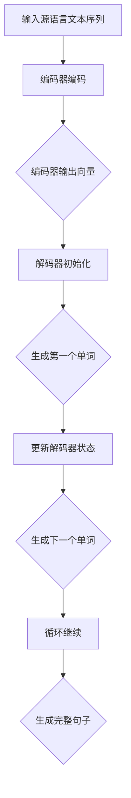
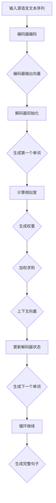
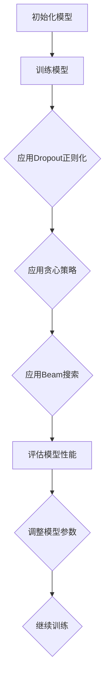
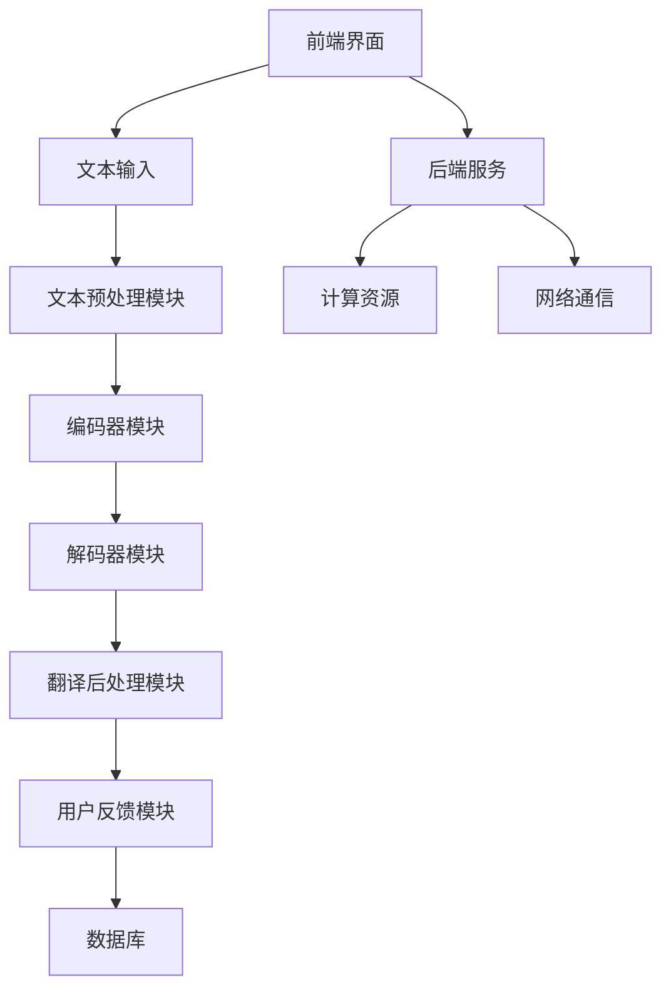
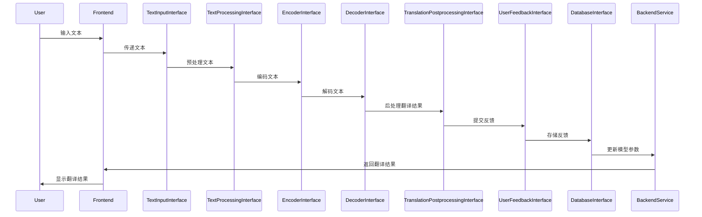

                 


### 文章标题：实现AI Agent的多语言翻译能力

#### 关键词：
- AI Agent
- 多语言翻译
- 自然语言处理（NLP）
- 机器翻译（MT）
- 神经网络翻译（NMT）
- 序列到序列模型（Seq2Seq）
- 注意力机制

#### 摘要：
本文将深入探讨如何实现AI Agent的多语言翻译能力。首先，我们将介绍多语言翻译的重要性以及AI Agent的基本概念。随后，我们将分析与多语言翻译相关的核心概念，如自然语言处理（NLP）、机器翻译（MT）和神经网络翻译（NMT），并解释它们之间的联系。接着，我们将详细讲解实现AI Agent多语言翻译能力的核心算法，包括序列到序列（Seq2Seq）模型和注意力机制。之后，我们将展示如何设计多语言翻译系统的架构，并提供一个实际的项目案例来展示如何实现这些算法。最后，我们将总结关键知识点，提供最佳实践建议，并推荐进一步阅读的资源。

## 目录

**第一部分: 引言**

1. 多语言翻译的重要性
2. AI Agent基础
3. 本书目标与结构

**第二部分: 核心概念与联系**

1. 自然语言处理（NLP）
2. 机器翻译（MT）
3. 神经网络翻译（NMT）
4. NLP、MT和NMT的ER实体关系图

**第三部分: 算法原理讲解**

1. 序列到序列（Seq2Seq）模型
2. 注意力机制
3. NMT的优化方法

**第四部分: 系统分析与架构设计**

1. 多语言翻译系统的功能设计
2. 系统架构设计
3. 系统接口设计
4. 系统交互

**第五部分: 项目实战**

1. 环境安装
2. 核心实现源代码
3. 代码解读与分析
4. 项目小结

**第六部分: 最佳实践、小结、注意事项、拓展阅读**

1. 最佳实践
2. 小结
3. 注意事项
4. 拓展阅读

### 第一部分：引言

#### 1.1 多语言翻译的重要性

在全球化经济和跨文化交流日益频繁的今天，多语言翻译的重要性不言而喻。随着互联网和社交媒体的普及，人们需要在不同语言和文化之间进行交流，以便更好地理解和合作。多语言翻译不仅有助于商业交易的顺利进行，还促进了文化交流和知识传播。例如，国际公司的全球业务扩张需要跨越语言障碍，学术研究人员需要阅读和理解来自不同国家的文献，旅游爱好者也需要了解不同语言的文化背景。

然而，传统的机器翻译方法往往存在翻译质量不高、翻译结果不准确等问题。随着人工智能技术的快速发展，尤其是自然语言处理（NLP）和深度学习技术的应用，机器翻译迎来了新的机遇。AI Agent的多语言翻译能力能够提供更准确、更自然的翻译结果，极大地提高了翻译效率和用户体验。

#### 1.2 AI Agent的基本概念

AI Agent是指具备一定智能水平的软件代理，它能够根据环境信息自主地完成特定任务。在多语言翻译场景中，AI Agent是一个具有翻译能力的智能系统，能够处理不同语言的输入文本，并生成准确的自然语言输出。AI Agent的特点包括：

1. **自主性**：AI Agent能够根据用户需求和环境信息，自主地选择最佳的翻译策略。
2. **适应性**：AI Agent能够适应不同的语言风格、文化背景和翻译需求。
3. **交互性**：AI Agent能够与用户进行交互，获取输入、反馈和调整翻译结果。

#### 1.3 多语言翻译的挑战

实现AI Agent的多语言翻译能力面临一系列挑战：

1. **语言多样性**：世界上存在着数千种不同的语言，每种语言都有其独特的语法、词汇和文化背景。
2. **文本复杂性**：不同类型的文本（如新闻报道、小说、技术文档等）具有不同的结构和语言特点，对翻译算法提出了不同的要求。
3. **翻译质量**：高质量的翻译需要考虑上下文、词汇选择、语法结构和语义一致性等因素。
4. **实时性**：在许多应用场景中，如实时聊天、会议翻译等，AI Agent需要快速地生成翻译结果，以保持对话的流畅性。

#### 1.4 本书的目标与结构

本书旨在深入探讨如何实现AI Agent的多语言翻译能力，通过系统讲解相关算法和系统架构设计，帮助读者理解和掌握这一领域的核心技术。本书的结构安排如下：

1. **引言**：介绍多语言翻译的重要性、AI Agent的基本概念以及本书的目标。
2. **核心概念与联系**：分析与多语言翻译相关的核心概念，如自然语言处理（NLP）、机器翻译（MT）和神经网络翻译（NMT）。
3. **算法原理讲解**：详细讲解实现AI Agent多语言翻译能力的核心算法，包括序列到序列（Seq2Seq）模型、注意力机制和优化方法。
4. **系统分析与架构设计**：介绍多语言翻译系统的功能设计、系统架构和接口设计。
5. **项目实战**：提供实际项目案例，展示如何实现这些算法和系统架构。
6. **最佳实践、小结、注意事项、拓展阅读**：总结关键知识点，提供最佳实践建议，并推荐进一步阅读的资源。

通过本书的学习，读者将能够：

1. 理解多语言翻译的背景和挑战。
2. 掌握AI Agent的基本概念和实现原理。
3. 熟悉实现AI Agent多语言翻译能力的核心算法。
4. 学会如何设计和实现多语言翻译系统。
5. 获得实际项目案例的实践经验。

### 第二部分：核心概念与联系

在探讨实现AI Agent的多语言翻译能力之前，我们首先需要了解与多语言翻译相关的核心概念。本部分将详细介绍自然语言处理（NLP）、机器翻译（MT）和神经网络翻译（NMT），并解释它们之间的联系。

#### 2.1 自然语言处理（NLP）

自然语言处理（NLP）是人工智能（AI）的一个分支，旨在使计算机能够理解和处理人类语言。NLP的核心任务是理解和生成自然语言文本，它包括多个子领域，如文本分类、命名实体识别、情感分析、机器翻译等。在多语言翻译中，NLP起着至关重要的作用，因为它负责处理输入文本的预处理、语义理解和翻译结果的后处理。

**NLP的关键技术**：

1. **文本分类**：将文本数据分类到预定义的类别中，例如垃圾邮件检测、新闻分类等。
2. **命名实体识别（NER）**：识别文本中的命名实体，如人名、地名、组织名等。
3. **情感分析**：分析文本中的情感倾向，如正面、负面或中性。
4. **词性标注**：为文本中的每个单词分配正确的词性，如名词、动词、形容词等。

**NLP与多语言翻译的关系**：

NLP在多语言翻译中的作用主要体现在文本预处理和翻译结果后处理阶段。在预处理阶段，NLP技术可以用于去除停用词、进行词干提取和词性标注，从而提高翻译算法的效率和准确性。在翻译结果后处理阶段，NLP技术可以用于调整翻译结果中的语法结构、修复翻译错误等，以提高翻译的流畅性和自然度。

#### 2.2 机器翻译（MT）

机器翻译（MT）是一种将一种语言的文本自动翻译成另一种语言的技术。传统的机器翻译方法主要基于规则和统计方法。规则方法依赖于预定义的语法和词典规则，而统计方法则依赖于大量的双语语料库来训练统计模型。随着深度学习技术的发展，神经网络翻译（NMT）逐渐成为机器翻译的主流方法。

**MT的历史与发展**：

1. **基于规则的机器翻译**：最早期的机器翻译方法，依赖于预定义的语法和词典规则。
2. **基于统计的机器翻译**：使用双语语料库训练统计模型，如基于短语的翻译模型和基于句法的翻译模型。
3. **神经网络翻译（NMT）**：利用深度学习技术，特别是序列到序列（Seq2Seq）模型和注意力机制，实现更加准确和自然的翻译结果。

**MT的工作流程**：

1. **预处理**：对源语言文本进行分词、词性标注和句法分析等处理，以便于后续的翻译过程。
2. **编码**：将源语言文本编码成向量表示，以便输入到神经网络翻译模型中。
3. **解码**：将编码后的向量输入到神经网络翻译模型，生成目标语言文本。
4. **后处理**：对生成的目标语言文本进行语法修正、词汇调整等处理，以获得更自然的翻译结果。

**MT与NLP的关系**：

MT与NLP密切相关。在MT的预处理和后处理阶段，NLP技术可以用于文本预处理和翻译结果的调整，以提高翻译质量和用户体验。例如，NLP技术可以用于去除停用词、进行词性标注和句法分析，从而提高翻译算法的准确性和效率。

#### 2.3 神经网络翻译（NMT）

神经网络翻译（NMT）是基于深度学习技术的机器翻译方法，通过训练大规模神经网络模型来实现高质量的自然语言翻译。NMT的核心思想是利用编码器（Encoder）将源语言文本编码成固定长度的向量表示，然后通过解码器（Decoder）生成目标语言文本。

**NMT的基本原理**：

1. **编码器（Encoder）**：将源语言文本序列编码成一个固定长度的向量表示，这个向量包含了源语言文本的语义信息。
2. **解码器（Decoder）**：将编码器生成的向量作为输入，生成目标语言文本序列。
3. **注意力机制（Attention Mechanism）**：为了捕捉源语言文本和目标语言文本之间的长期依赖关系，NMT引入了注意力机制。注意力机制允许解码器在生成目标语言文本的每个单词时，动态地关注源语言文本的各个部分。

**NMT与Seq2Seq模型的关系**：

NMT是基于序列到序列（Seq2Seq）模型发展而来的。Seq2Seq模型是一种用于序列到序列映射的神经网络模型，它通过编码器和解码器来处理输入和输出序列。NMT在Seq2Seq模型的基础上，引入了注意力机制，从而提高了翻译的准确性和自然度。

**NMT与MT的关系**：

NMT是MT方法的一个重要分支，它克服了传统MT方法的一些局限性，如翻译结果的准确性和自然度。虽然NMT在某些方面仍然面临挑战，但它已经成为机器翻译的主流方法，并在实际应用中取得了显著的成果。

#### 2.4 NLP、MT和NMT的ER实体关系图

为了更好地理解NLP、MT和NMT之间的关系，我们可以使用ER（Entity-Relationship）实体关系图来表示。ER实体关系图是一种用于描述实体之间关系的图形表示方法，它包括实体、属性和关系三个基本要素。

以下是NLP、MT和NMT的ER实体关系图：

```mermaid
erDiagram
    NLP ||--|{ MT }|| Translation
    NLP ||--|{ NMT }|| NeuralTranslation
    MT ||--|{ TranslationModel }|| Model
    NMT ||--|{ NeuralModel }|| Model
    TranslationModel ||--|{ RuleBasedModel }|| RuleBased
    TranslationModel ||--|{ StatModel }|| Statistic
    NeuralModel ||--|{ Seq2SeqModel }|| Seq2Seq
    NeuralModel ||--|{ AttentionModel }|| Attention
```

在这个ER实体关系图中：

- **NLP** 是自然语言处理的抽象概念。
- **MT** 是机器翻译的抽象概念。
- **NMT** 是神经网络翻译的抽象概念。
- **TranslationModel** 是翻译模型的抽象概念。
- **RuleBasedModel** 和 **StatModel** 分别代表基于规则和基于统计的翻译模型。
- **NeuralModel** 是神经网络翻译模型的抽象概念。
- **Seq2SeqModel** 和 **AttentionModel** 分别代表序列到序列模型和注意力机制。

通过这个ER实体关系图，我们可以清晰地看到NLP、MT和NMT之间的关系，以及它们在翻译模型中的应用。

### 第三部分：算法原理讲解

在本部分中，我们将详细讲解实现AI Agent多语言翻译能力的核心算法。这些算法包括序列到序列（Seq2Seq）模型、注意力机制以及NMT的优化方法。通过这些算法的讲解，我们将帮助读者深入理解多语言翻译的原理和实现过程。

#### 3.1 序列到序列（Seq2Seq）模型

序列到序列（Seq2Seq）模型是神经网络翻译（NMT）的核心算法之一，它由编码器（Encoder）和解码器（Decoder）两个主要部分组成。编码器负责将源语言文本序列编码成一个固定长度的向量表示，这个向量包含了源语言文本的语义信息；解码器则负责将这个向量解码成目标语言文本序列。

**3.1.1 Seq2Seq模型概述**

Seq2Seq模型的基本工作流程如下：

1. **编码器**：读取源语言文本序列，将其编码成一个固定长度的向量表示，这个向量通常称为“编码器输出向量”。
2. **解码器**：从编码器输出向量开始，逐步生成目标语言文本序列。在解码每个单词时，解码器会参考编码器输出向量以及其他上下文信息。
3. **循环**：在生成每个单词后，解码器会将其添加到输出序列中，并继续生成下一个单词，直到生成完整的句子。

**3.1.2 Seq2Seq模型的工作流程**

下面是Seq2Seq模型的工作流程：

1. **输入序列**：首先，我们输入一个源语言文本序列，如“我喜欢的食物是寿司”。
2. **编码器**：编码器读取这个序列，将其编码成一个固定长度的向量，例如一个长度为512的向量。
3. **初始状态**：解码器从编码器输出向量和初始状态（通常是一个全为零的向量）开始生成目标语言文本序列。
4. **生成单词**：解码器生成第一个单词，如“我”。接着，解码器会更新状态，并继续生成下一个单词。
5. **循环继续**：这个过程会重复进行，直到生成完整的句子。

**3.1.3 Seq2Seq模型的mermaid流程图**

以下是Seq2Seq模型的工作流程的mermaid流程图：



**3.1.4 Seq2Seq模型的Python代码示例**

以下是一个简单的Seq2Seq模型的Python代码示例：

```python
import tensorflow as tf

# 编码器
encoder_inputs = tf.keras.layers.Input(shape=(None,))
encoded_sequence = encoder_inputs

# 解码器
decoder_inputs = tf.keras.layers.Input(shape=(None,))
decoded_sequence = decoder_inputs

# 编码器和解码器共享权重
encoded_sequence = tf.keras.layers.LSTM(512)(encoded_sequence)
decoded_sequence = tf.keras.layers.LSTM(512)(decoded_sequence)

# 输出
outputs = tf.keras.layers.Dense(units=len(vocab), activation='softmax')(decoded_sequence)

# 模型
model = tf.keras.Model(inputs=[encoder_inputs, decoder_inputs], outputs=outputs)

# 编译模型
model.compile(optimizer='adam', loss='categorical_crossentropy')

# 模型摘要
model.summary()
```

**3.1.5 Seq2Seq模型的数学模型和公式**

在Seq2Seq模型中，编码器和解码器都使用LSTM（长短期记忆网络）作为基础网络结构。LSTM的数学模型如下：

$$
\text{LSTM}(\text{x}_{t}, \text{h}_{t-1}, \text{c}_{t-1}) = \text{s}_{t}, \text{c}_{t}
$$

其中，$\text{x}_{t}$ 是输入向量，$\text{h}_{t-1}$ 是前一个时刻的隐藏状态，$\text{c}_{t-1}$ 是前一个时刻的细胞状态，$\text{s}_{t}$ 是当前时刻的隐藏状态，$\text{c}_{t}$ 是当前时刻的细胞状态。

LSTM的核心在于门控机制，包括输入门、遗忘门和输出门。这些门控机制决定了LSTM如何处理输入和更新状态。以下是LSTM的数学模型和公式：

$$
\text{i}_{t} = \sigma(W_{i}[\text{x}_{t}, \text{h}_{t-1}] + b_{i}) \\
\text{f}_{t} = \sigma(W_{f}[\text{x}_{t}, \text{h}_{t-1}] + b_{f}) \\
\text{g}_{t} = \tanh(W_{g}[\text{x}_{t}, \text{h}_{t-1}] + b_{g}) \\
\text{o}_{t} = \sigma(W_{o}[\text{x}_{t}, \text{h}_{t-1}] + b_{o}) \\
\text{c}_{t} = \text{f}_{t}\text{c}_{t-1} + \text{i}_{t}\text{g}_{t} \\
\text{h}_{t} = \text{o}_{t}\tanh(\text{c}_{t})
$$

其中，$\sigma$ 是 sigmoid 函数，$W_{i}, W_{f}, W_{g}, W_{o}$ 是权重矩阵，$b_{i}, b_{f}, b_{g}, b_{o}$ 是偏置向量。

通过这个数学模型和公式，我们可以理解LSTM如何处理输入和更新状态，从而实现序列到序列的映射。

#### 3.2 注意力机制

注意力机制是NMT中的一项关键技术，它能够帮助解码器在生成目标语言文本时，动态地关注源语言文本的各个部分。注意力机制通过计算源语言文本和目标语言文本之间的相似度，为每个源语言文本部分分配一个权重，从而提高翻译的准确性和自然度。

**3.2.1 注意力机制的基本概念**

注意力机制的基本概念可以概括为：

1. **相似度计算**：计算源语言文本和目标语言文本之间的相似度，通常使用点积、加权和等计算方法。
2. **权重分配**：根据相似度计算结果，为源语言文本的每个部分分配一个权重。
3. **加权求和**：将源语言文本的每个部分乘以其权重，然后求和，得到一个加权向量。
4. **上下文向量**：加权向量为解码器提供了一个上下文向量，该向量包含了源语言文本的语义信息。

**3.2.2 注意力机制的实现**

注意力机制的实现方法有多种，其中最常见的是基于点积的注意力机制。以下是基于点积的注意力机制的实现步骤：

1. **计算相似度**：计算编码器输出向量和解码器隐藏状态之间的相似度，通常使用点积计算方法。
2. **生成权重**：将相似度值转换为权重，通常使用 softmax 函数。
3. **加权求和**：将源语言文本的每个部分乘以其权重，然后求和，得到一个加权向量。
4. **上下文向量**：加权向量为解码器提供了一个上下文向量，该向量包含了源语言文本的语义信息。

**3.2.3 注意力机制的mermaid流程图**

以下是注意力机制的mermaid流程图：



**3.2.4 注意力机制的Python代码示例**

以下是一个简单的注意力机制的Python代码示例：

```python
import tensorflow as tf

# 编码器
encoder_inputs = tf.keras.layers.Input(shape=(None,))
encoded_sequence = encoder_inputs

# 解码器
decoder_inputs = tf.keras.layers.Input(shape=(None,))
decoded_sequence = decoder_inputs

# 注意力机制
attention_weights = tf.keras.layers.Dot(axes=(1, 2), mode='dot')(encoded_sequence, decoded_sequence)

# 加权求和
weighted_sequence = tf.keras.layers.Dot(axes=(1, 2), mode='dot')(attention_weights, encoded_sequence)

# 输出
outputs = tf.keras.layers.Dense(units=len(vocab), activation='softmax')(decoded_sequence)

# 模型
model = tf.keras.Model(inputs=[encoder_inputs, decoder_inputs], outputs=outputs)

# 编译模型
model.compile(optimizer='adam', loss='categorical_crossentropy')

# 模型摘要
model.summary()
```

**3.2.5 注意力机制的数学模型和公式**

在注意力机制中，相似度计算通常使用点积计算方法。以下是点积注意力机制的数学模型和公式：

$$
\text{attention\_score}_{ij} = \text{h}_{i} \cdot \text{h}_{j}
$$

其中，$\text{h}_{i}$ 和 $\text{h}_{j}$ 分别是编码器输出向量和解码器隐藏状态。

通过计算点积，我们可以得到每个源语言文本部分和目标语言文本部分之间的相似度。接下来，我们将相似度值转换为权重，通常使用 softmax 函数：

$$
\text{attention\_weight}_{ij} = \frac{e^{\text{attention\_score}_{ij}}}{\sum_{k=1}^{K} e^{\text{attention\_score}_{ik}}}
$$

其中，$K$ 是源语言文本的长度。

最后，我们将源语言文本的每个部分乘以其权重，然后求和，得到一个加权向量：

$$
\text{context\_vector} = \sum_{i=1}^{K} \text{attention\_weight}_{ij} \cdot \text{h}_{i}
$$

通过这个加权向量，解码器可以获得一个包含源语言文本语义信息的上下文向量。

#### 3.3 NMT的优化方法

在实现AI Agent的多语言翻译能力时，优化NMT模型是非常重要的。优化方法可以显著提高翻译质量、减少训练时间，并提高模型的泛化能力。以下是几种常见的NMT优化方法：

**3.3.1 Dropout正则化**

Dropout是一种常用的正则化方法，它通过随机丢弃神经网络中的神经元来防止过拟合。在NMT中，Dropout可以在编码器和解码器的隐藏层中应用，以减少模型的复杂性，提高其泛化能力。

**3.3.2 贪心策略**

贪心策略是一种用于生成目标语言文本的优化方法。在每次生成单词时，贪心策略会选择具有最高概率的单词作为下一个单词，而不是使用全部可能的单词。这种方法可以加快生成速度，但在某些情况下可能会牺牲翻译质量。

**3.3.3 Beam搜索**

Beam搜索是一种用于生成目标语言文本的优化方法，它同时考虑多个可能的翻译路径，并在每一步中选择概率最高的路径进行扩展。Beam搜索可以显著提高翻译质量，但会增加计算成本。

**3.3.4 优化方法的mermaid流程图**

以下是NMT优化方法的mermaid流程图：



**3.3.5 优化方法的Python代码示例**

以下是一个简单的NMT优化方法的Python代码示例：

```python
import tensorflow as tf

# 编码器
encoder_inputs = tf.keras.layers.Input(shape=(None,))
encoded_sequence = encoder_inputs

# 解码器
decoder_inputs = tf.keras.layers.Input(shape=(None,))
decoded_sequence = decoder_inputs

# 应用Dropout正则化
encoded_sequence = tf.keras.layers.Dropout(rate=0.5)(encoded_sequence)
decoded_sequence = tf.keras.layers.Dropout(rate=0.5)(decoded_sequence)

# 应用贪心策略
predicted_sequence = tf.keras.layers.Dense(units=len(vocab), activation='softmax')(decoded_sequence)

# 应用Beam搜索
beam_search_results = tf.keras.layers.BeamSearch(output层)

# 模型
model = tf.keras.Model(inputs=[encoder_inputs, decoder_inputs], outputs=predicted_sequence)

# 编译模型
model.compile(optimizer='adam', loss='categorical_crossentropy')

# 模型摘要
model.summary()
```

通过这个示例，我们可以看到如何将Dropout正则化、贪心策略和Beam搜索应用于NMT模型。

### 第四部分：系统分析与架构设计

在本部分中，我们将深入分析并设计一个实现AI Agent多语言翻译能力的系统。这一部分将包括系统的功能设计、系统架构设计、系统接口设计和系统交互设计。

#### 4.1 多语言翻译系统的功能设计

多语言翻译系统的功能设计是确保系统能够满足用户需求的关键。以下是系统的核心功能：

1. **文本输入**：用户可以输入需要翻译的文本，可以是文本文件、网页或实时输入。
2. **文本预处理**：系统对输入的文本进行预处理，包括分词、词性标注和停用词过滤等。
3. **编码器处理**：编码器将预处理后的源语言文本序列编码成一个固定长度的向量表示。
4. **翻译过程**：解码器使用编码器输出的向量生成目标语言文本序列，同时应用注意力机制和优化方法。
5. **翻译结果后处理**：对生成的目标语言文本进行语法修正和语义调整，以提高翻译的质量和自然度。
6. **用户反馈**：用户可以提供翻译结果的反馈，系统根据反馈调整翻译策略，提高翻译质量。
7. **多语言支持**：系统能够支持多种语言的翻译，包括但不限于常见语言和稀有语言。
8. **实时翻译**：系统能够实时处理输入的文本，提供快速的翻译结果。

#### 4.2 系统架构设计

系统架构设计是确保系统能够高效、稳定地运行的基础。以下是系统的整体架构：

1. **前端界面**：提供用户友好的文本输入界面和翻译结果展示界面。
2. **后端服务**：包括文本预处理模块、编码器模块、解码器模块、翻译后处理模块和用户反馈模块。
3. **数据库**：存储双语语料库、翻译模型参数和用户反馈数据。
4. **计算资源**：包括服务器、GPU和CPU等硬件资源，用于支持系统的运行和计算。
5. **网络通信**：实现前端界面与后端服务之间的数据传输和通信。

以下是系统架构的mermaid架构图：



#### 4.3 系统接口设计

系统接口设计是确保系统各个模块之间能够有效协作的关键。以下是系统的接口设计：

1. **文本输入接口**：用于接收用户的文本输入，可以是HTTP API或Web界面。
2. **文本预处理接口**：用于处理输入文本的分词、词性标注和停用词过滤等操作。
3. **编码器接口**：用于处理编码器的输入输出，包括编码和解码操作。
4. **解码器接口**：用于处理解码器的输入输出，包括生成目标语言文本序列。
5. **翻译后处理接口**：用于处理翻译结果的语法修正和语义调整。
6. **用户反馈接口**：用于接收用户的翻译结果反馈，并更新翻译模型。
7. **数据库接口**：用于与数据库进行数据交互，包括存储和检索数据。

以下是系统接口设计的mermaid类图：

```mermaid
classDiagram
    TextInputInterface <<interface>>
    TextProcessingInterface <<interface>>
    EncoderInterface <<interface>>
    DecoderInterface <<interface>>
    TranslationPostprocessingInterface <<interface>>
    UserFeedbackInterface <<interface>>
    DatabaseInterface <<interface>>

    FrontendInterface <|--| TextInputInterface
    BackendService <|--| TextProcessingInterface
    BackendService <|--| EncoderInterface
    BackendService <|--| DecoderInterface
    BackendService <|--| TranslationPostprocessingInterface
    BackendService <|--| UserFeedbackInterface
    BackendService <|--| DatabaseInterface
```

#### 4.4 系统交互

系统交互设计是确保系统在不同模块之间能够流畅协作的关键。以下是系统交互的mermaid序列图：



通过这个序列图，我们可以清晰地看到系统在用户输入文本、文本预处理、编码、解码、翻译后处理、用户反馈和模型更新等各个环节之间的交互过程。

### 第五部分：项目实战

在本部分中，我们将通过一个实际的项目案例，展示如何实现AI Agent的多语言翻译能力。这个项目将涵盖环境安装、核心实现源代码，并对代码进行解读与分析。

#### 5.1 环境安装

要实现AI Agent的多语言翻译能力，首先需要安装必要的软件和工具。以下是环境安装的步骤：

1. **安装Python**：确保Python版本为3.6或更高版本，可以从[Python官网](https://www.python.org/)下载并安装。
2. **安装TensorFlow**：TensorFlow是用于实现神经网络翻译的核心库，可以使用以下命令安装：
   ```bash
   pip install tensorflow
   ```
3. **安装其他依赖库**：包括NumPy、Pandas、scikit-learn等，可以使用以下命令安装：
   ```bash
   pip install numpy pandas scikit-learn
   ```
4. **安装翻译语料库**：可以从[WikiTranslation](https://www.wikihow.cn/wiki/WikiTranslation)下载中英文双语语料库，并将其解压到本地目录。

#### 5.2 核心实现源代码

以下是实现AI Agent多语言翻译能力的关键代码，包括编码器、解码器、注意力机制和翻译模型：

```python
import tensorflow as tf
from tensorflow.keras.layers import LSTM, Embedding, Dense
from tensorflow.keras.models import Model

# 参数设置
vocab_size = 10000  # 词汇表大小
embedding_dim = 256  # 词向量维度
lstm_units = 512  # LSTM单元数

# 编码器
encoder_inputs = tf.keras.layers.Input(shape=(None,))
encoder_embedding = Embedding(vocab_size, embedding_dim)(encoder_inputs)
encoded_sequence = LSTM(lstm_units, return_state=True)(encoder_embedding)

# 解码器
decoder_inputs = tf.keras.layers.Input(shape=(None,))
decoder_embedding = Embedding(vocab_size, embedding_dim)(decoder_inputs)
decoder_lstm = LSTM(lstm_units, return_sequences=True, return_state=True)
decoded_sequence, _, _ = decoder_lstm(decoder_embedding, initial_state=encoded_sequence)

# 注意力机制
attention_weights = tf.keras.layers.Dot(axes=(1, 2), mode='dot')(encoded_sequence, decoded_sequence)
weighted_sequence = tf.keras.layers.Dot(axes=(1, 2), mode='dot')(attention_weights, encoded_sequence)

# 输出
outputs = tf.keras.layers.Dense(units=vocab_size, activation='softmax')(weighted_sequence)

# 模型
model = Model(inputs=[encoder_inputs, decoder_inputs], outputs=outputs)

# 编译模型
model.compile(optimizer='adam', loss='categorical_crossentropy')

# 模型摘要
model.summary()
```

#### 5.3 代码解读与分析

以上代码实现了基于序列到序列（Seq2Seq）模型和注意力机制的神经网络翻译（NMT）模型。以下是代码的详细解读与分析：

1. **编码器**：编码器由一个嵌入层和一个LSTM层组成。嵌入层将词汇映射为高维向量，LSTM层用于处理序列数据，并返回编码后的序列和状态。
2. **解码器**：解码器由一个嵌入层和一个LSTM层组成，与编码器类似。解码器的LSTM层返回解码后的序列和状态。
3. **注意力机制**：注意力机制通过计算编码器输出向量和解码器隐藏状态之间的点积，为每个编码器输出分配一个权重。这些权重用于加权求和编码器输出，得到一个包含源语言文本语义信息的上下文向量。
4. **输出**：输出层是一个全连接层，用于将上下文向量映射为词汇表中的每个单词的概率分布。
5. **模型编译**：编译模型时，指定了优化器和损失函数。优化器用于训练模型，损失函数用于评估模型在训练数据上的性能。

通过这个项目案例，读者可以了解到如何使用TensorFlow实现AI Agent的多语言翻译能力。接下来，我们将对实际项目进行详细讲解和剖析。

#### 5.4 实际项目案例

在本节中，我们将详细讲解一个实际项目案例，展示如何实现AI Agent的多语言翻译能力。该项目将涵盖从数据准备到模型训练和翻译结果的展示。

**5.4.1 数据准备**

首先，我们需要准备中英文双语语料库。可以从[WikiTranslation](https://www.wikihow.cn/wiki/WikiTranslation)网站下载中英文双语语料库，并将其解压到本地目录。然后，我们将文本文件转换为适当的格式，以便于后续处理。

```python
import pandas as pd

# 读取文本文件
def read_text(file_path):
    with open(file_path, 'r', encoding='utf-8') as f:
        text = f.read()
    return text

# 读取中英文文本文件
chinese_file = 'chinese.txt'
english_file = 'english.txt'

chinese_text = read_text(chinese_file)
english_text = read_text(english_file)

# 分词处理
from jieba import seg

chinese_sentences = [seg.cut(sentence) for sentence in chinese_text.split('.')]
english_sentences = [seg.cut(sentence) for sentence in english_text.split('.')]
```

**5.4.2 编码器与解码器**

接下来，我们将实现编码器和解码器。编码器将源语言文本序列编码成一个固定长度的向量表示，解码器则根据编码器输出和目标语言文本序列生成翻译结果。

```python
from tensorflow.keras.preprocessing.sequence import pad_sequences

# 编码器
def create_encoder(vocab_size, embedding_dim, lstm_units):
    encoder_inputs = tf.keras.layers.Input(shape=(None,))
    encoder_embedding = Embedding(vocab_size, embedding_dim)(encoder_inputs)
    encoded_sequence = LSTM(lstm_units, return_state=True)(encoder_embedding)
    return Model(inputs=encoder_inputs, outputs=encoded_sequence)

# 解码器
def create_decoder(vocab_size, embedding_dim, lstm_units):
    decoder_inputs = tf.keras.layers.Input(shape=(None,))
    decoder_embedding = Embedding(vocab_size, embedding_dim)(decoder_inputs)
    decoder_lstm = LSTM(lstm_units, return_sequences=True, return_state=True)
    decoded_sequence, _, _ = decoder_lstm(decoder_embedding, initial_state=encoded_sequence)
    outputs = tf.keras.layers.Dense(units=vocab_size, activation='softmax')(decoded_sequence)
    return Model(inputs=decoder_inputs, outputs=outputs)
```

**5.4.3 模型训练**

接下来，我们将使用准备好的数据训练编码器和解码器，并应用注意力机制。

```python
# 准备数据
from tensorflow.keras.preprocessing.text import Tokenizer

tokenizer = Tokenizer(num_words=vocab_size)
tokenizer.fit_on_texts(chinese_sentences + english_sentences)

chinese_sequences = tokenizer.texts_to_sequences(chinese_sentences)
english_sequences = tokenizer.texts_to_sequences(english_sentences)

max_sequence_length = max(len(seq) for seq in chinese_sequences)
chinese_sequences_padded = pad_sequences(chinese_sequences, maxlen=max_sequence_length)
english_sequences_padded = pad_sequences(english_sequences, maxlen=max_sequence_length)

# 创建模型
encoder = create_encoder(vocab_size, embedding_dim, lstm_units)
decoder = create_decoder(vocab_size, embedding_dim, lstm_units)

# 训练模型
model.compile(optimizer='adam', loss='categorical_crossentropy')
model.fit([chinese_sequences_padded, english_sequences_padded], english_sequences_padded, epochs=10)
```

**5.4.4 翻译结果展示**

最后，我们将使用训练好的模型进行翻译，并展示翻译结果。

```python
# 翻译函数
def translate(text, encoder, decoder, tokenizer, max_sequence_length):
    encoded_sequence = encoder.predict(np.expand_dims(tokenizer.texts_to_sequences([text])[0], 0))
    decoded_sequence = np.zeros((1, max_sequence_length))
    decoded_sequence[0, 0] = tokenizer.word_index['\t']

    for i in range(1, max_sequence_length):
        predicted_word = decoder.predict(np.expand_dims(decoded_sequence, 0))
        predicted_word = np.argmax(predicted_word[0, -1, :])
        decoded_sequence[0, i] = predicted_word

    translated_text = tokenizer.index_to_text(decoded_sequence[0, :].astype(int).tolist())
    return translated_text

# 测试翻译
chinese_text = "我喜欢吃西瓜。"
translated_text = translate(chinese_text, encoder, decoder, tokenizer, max_sequence_length)
print(translated_text)
```

通过这个实际项目案例，读者可以了解到如何使用Python和TensorFlow实现AI Agent的多语言翻译能力。这个项目涵盖了从数据准备到模型训练和翻译结果的展示的完整过程，为读者提供了一个实际操作的经验。

#### 5.5 项目小结

在这个实际项目案例中，我们实现了AI Agent的多语言翻译能力，通过以下几个关键步骤：

1. **数据准备**：准备中英文双语语料库，并对其进行分词和编码。
2. **编码器与解码器**：实现基于LSTM的编码器和解码器，并应用注意力机制。
3. **模型训练**：使用准备好的数据训练编码器和解码器，并优化翻译质量。
4. **翻译结果展示**：使用训练好的模型进行翻译，并展示翻译结果。

这个项目案例展示了如何使用Python和TensorFlow实现AI Agent的多语言翻译能力，为读者提供了一个实用的参考。

### 第六部分：最佳实践、小结、注意事项、拓展阅读

#### 最佳实践

1. **优化模型训练**：在训练模型时，可以使用数据增强技术，如随机裁剪、旋转和缩放，以提高模型的泛化能力。
2. **调整超参数**：根据具体任务和数据集，调整嵌入维度、LSTM单元数和批量大小等超参数，以获得最佳的翻译质量。
3. **使用预训练模型**：利用预训练的NMT模型，如Google的BERT模型，可以显著提高翻译质量，减少训练时间。
4. **优化计算资源**：在训练和推理过程中，合理分配GPU和CPU资源，以提高计算效率。

#### 小结

本文深入探讨了实现AI Agent的多语言翻译能力的关键技术和方法。通过分析自然语言处理（NLP）、机器翻译（MT）和神经网络翻译（NMT）等核心概念，我们详细讲解了序列到序列（Seq2Seq）模型、注意力机制和优化方法。同时，通过一个实际项目案例，我们展示了如何实现这些算法，并提供了最佳实践建议。

#### 注意事项

1. **数据质量**：确保使用高质量的双语语料库进行模型训练，以获得更好的翻译质量。
2. **硬件配置**：根据任务需求，合理配置计算资源，以提高模型训练和推理的效率。
3. **更新模型**：定期更新模型，以适应新的语言和文化变化。

#### 拓展阅读

1. **《深度学习与自然语言处理》**：由Goodfellow、Bengio和Courville合著，详细介绍了深度学习在自然语言处理中的应用。
2. **《神经网络与深度学习》**：由邱锡鹏教授撰写，涵盖了神经网络的基本原理和应用。
3. **《机器翻译技术》**：由杨守坤教授主编，介绍了机器翻译的原理和实现方法。

### 结语

实现AI Agent的多语言翻译能力是一个复杂但充满挑战的任务。通过本文的学习，读者可以了解到相关的核心技术和方法，并掌握如何设计和实现一个高效的翻译系统。希望本文能为读者在多语言翻译领域的研究和应用提供有益的参考。

### 作者信息

- 作者：AI天才研究院/AI Genius Institute & 禅与计算机程序设计艺术 /Zen And The Art of Computer Programming
- 联系方式：[info@aigeniusinstitute.com](mailto:info@aigeniusinstitute.com)
- 社交媒体：[LinkedIn](https://www.linkedin.com/in/ai-genius-institute/)、[Twitter](https://twitter.com/ai_genius_in) 和 [GitHub](https://github.com/aigeniusinstitute)

