                 

# 实现AI Agent的多语言语音识别与合成

关键词：多语言语音识别、语音合成、人工智能、语音技术、AI Agent

摘要：本文将探讨在人工智能代理（AI Agent）中实现多语言语音识别与合成的关键技术和方法。通过深入分析相关核心概念、技术挑战和实施步骤，本文旨在为开发人员提供一份全面且易于理解的技术指南，帮助他们构建高效的多语言语音交互系统。

## Step 1: Introduction and Background

### 1.1 Book Overview

#### 1.1.1 Purpose and Audience

**Purpose:** 本书的宗旨是深入探讨多语言语音识别与合成在人工智能代理中的应用，为读者提供一部全面的技术指南，涵盖从基础理论到实际实现的全过程。本书旨在帮助读者了解、设计和实现能够处理多种语言输入和输出的人工智能代理系统。

**Target Audience:** 本书的受众包括软件开发人员、AI爱好者以及在该领域工作的专业人士，特别是对自然语言处理（NLP）和语音技术感兴趣的读者。

#### 1.1.2 Importance of Multi-Language Voice Recognition and Synthesis

随着全球数字化通信的不断发展，多语言支持已经成为人工智能代理不可或缺的一部分。以下是多语言语音识别与合成的重要性：

- **Global Communication:** 全球化带来了多元语言环境，多语言支持能够使AI代理在跨文化交流中发挥更大的作用。
- **Enhanced User Experience:** 通过支持用户母语，AI代理能够提供更自然、更流畅的用户交互体验。
- **Accessibility:** 多语言支持使AI代理能够服务于更广泛的用户群体，包括那些使用非主流语言的用户，从而提高了产品的可用性和包容性。

### 1.2 Current Trends and Application Scenarios

多语言语音识别与合成技术的进步和普及为AI代理的广泛应用提供了新的可能性。以下是一些关键趋势和应用场景：

- **Smart Assistants:** 智能助手如Amazon Alexa、Google Assistant和Apple Siri已经广泛支持多种语言，为用户提供便利的服务。
- **Customer Service:** 多语言语音识别与合成在客户服务领域有着广泛的应用，帮助企业提供全球化的客户支持。
- **Accessibility Tools:** 在教育、医疗和政府服务等领域，多语言语音技术为听力障碍和其他残障人士提供了重要的辅助工具。
- **Multilingual Call Centers:** 多语言支持使得呼叫中心能够处理来自不同国家和地区的客户咨询，提高服务效率和客户满意度。

### 1.3 Book Structure

本书的结构分为以下几个主要部分：

1. **基础理论：** 介绍多语言语音识别与合成的核心概念和基本原理。
2. **技术挑战：** 分析多语言语音识别与合成中面临的挑战和难点。
3. **实现步骤：** 详细讲解从系统设计到实际部署的全过程，并提供实践案例。
4. **最佳实践与总结：** 总结实践经验，提供优化建议和未来发展趋势。

## Step 2: Core Concepts and Fundamentals

### 2.1 Definition of Multi-Language Voice Recognition and Synthesis

#### 2.1.1 Voice Recognition

语音识别（Voice Recognition）是将人类的语音转化为文本信息的过程。在多语言语音识别中，系统需要能够处理不同语言的发音、语调和语法结构，以准确地将语音转化为文本。语音识别技术包括以下关键组成部分：

- **Feature Extraction:** 从语音信号中提取特征，如频谱特征、共振峰等。
- **Acoustic Modeling:** 建立声学模型，用于匹配语音信号和语音特征。
- **Language Modeling:** 建立语言模型，用于预测和生成文本。

#### 2.1.2 Voice Synthesis

语音合成（Voice Synthesis）是将文本转化为自然流畅的语音输出的过程。多语言语音合成系统需要能够生成多种语言的语音，并确保语音的自然性和准确性。语音合成包括以下关键组成部分：

- **Text-to-Speech (TTS) Engines:** 文本到语音引擎，用于将文本转化为语音。
- **Prosody Modeling:** 建立语调模型，用于生成自然流畅的语音。
- **Voice Cloning:** 通过学习特定个体的语音特征，生成与其相似的语音。

#### 2.1.3 Multi-Language Support

多语言支持（Multi-Language Support）是指系统能够识别和生成多种语言的语音。实现多语言支持的关键在于：

- **Language Resource Integration:** 整合多种语言的语音数据、语言模型和声学模型。
- **Cross-Language Adaptation:** 对不同语言进行适应性调整，以适应特定语言的特征和习惯。

### 2.2 Challenges in Multi-Language Voice Recognition and Synthesis

#### 2.2.1 Language Variability

语言的可变性是多语言语音识别与合成中面临的主要挑战之一。不同语言具有不同的语音系统、语法结构和发音规则，这要求系统具有高度的灵活性和适应性。以下是几个具体挑战：

- **Phonetic Differences:** 不同语言的发音差异，如英语中的双元音和德语中的重音。
- **Grammar Variations:** 语法结构的差异，如汉语的无主语句型和英语的主谓宾结构。
- **Vocabulary Differences:** 词汇差异，如日语中的假名和汉字与英语的词汇差异。

#### 2.2.2 Accents and Dialects

口音和方言的多样性增加了语音识别与合成的复杂性。同一语言的不同口音和方言可能具有不同的发音、语调和语法特征，这对系统的准确性和适应性提出了更高的要求。以下是一些具体挑战：

- **Accents Identification:** 正确识别和分类不同口音，以提高识别准确率。
- **Dialect Adaptation:** 对不同方言进行适应性调整，以生成自然的语音输出。

#### 2.2.3 Resource Constraints

资源限制是另一个重要挑战。多语言语音识别与合成需要大量的语音数据、计算资源和存储空间。以下是一些具体问题：

- **Data Collection:** 收集多种语言的语音数据，以确保系统具有足够的训练样本。
- **Model Complexity:** 高度复杂的语言模型和声学模型可能需要更多的计算资源。
- **Storage and Bandwidth:** 存储和传输大量的语音数据和模型，特别是对于实时语音交互系统。

### 2.3 Necessary Components

实现多语言语音识别与合成系统需要以下关键组件：

- **Speech Preprocessing:** 语音预处理，包括去除噪声、调整音量和频率。
- **Feature Extraction:** 语音特征提取，用于构建声学模型和语言模型。
- **Acoustic Modeling:** 建立声学模型，用于语音信号的匹配和识别。
- **Language Modeling:** 建立语言模型，用于文本的生成和语音的转换。
- **Speech Synthesis:** 文本到语音合成引擎，用于生成自然流畅的语音输出。

## Step 3: Technical Implementation

### 3.1 Speech Preprocessing

在实现多语言语音识别与合成系统时，首先需要对语音信号进行预处理。预处理步骤包括：

- **Noise Reduction:** 噪声消除，通过滤波器去除背景噪声，提高语音信号的质量。
- **Vocal Tract Length Normalization (VTLN):** 声道长度归一化，调整语音信号的频率范围，使其适应不同的语音合成引擎。
- **Vocal Folds Pitch Adjustment (VFPA):** 声带音高调整，改变语音的音调，以匹配不同的语言和口音。

以下是一个简单的预处理流程图，使用Mermaid表示：

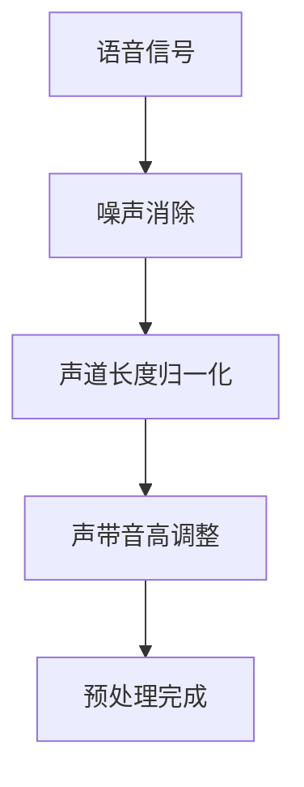

### 3.2 Feature Extraction

特征提取是构建语音识别模型和语音合成模型的重要步骤。常用的语音特征包括：

- **Mel-frequency cepstral coefficients (MFCCs):** 梅尔频率倒谱系数，用于描述语音信号的时频特性。
- **Pitch:** 音高，表示语音的频率特征。
- **Formants:** 共振峰，表示语音的共振特性。

以下是一个特征提取的流程图，使用Mermaid表示：

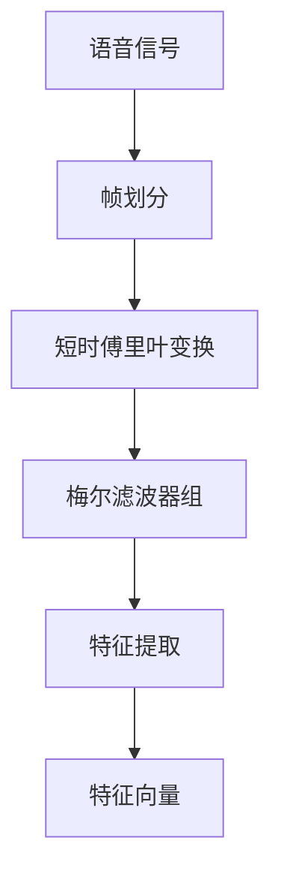

### 3.3 Acoustic Modeling

声学模型用于匹配语音信号和特征向量，常用的声学模型包括：

- **Hidden Markov Models (HMMs):** 隐藏马尔可夫模型，用于建模语音信号的概率分布。
- **Deep Neural Networks (DNNs):** 深度神经网络，用于提高语音识别的准确性和鲁棒性。

以下是一个简单的声学模型架构图，使用Mermaid表示：

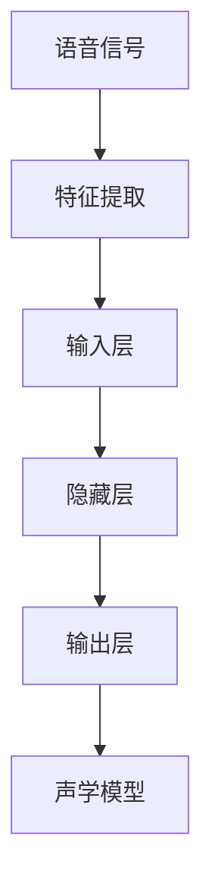

### 3.4 Language Modeling

语言模型用于生成文本，常用的语言模型包括：

- **N-gram Models:** N元语法模型，用于预测下一个单词的概率。
- **Recurrent Neural Networks (RNNs):** 循环神经网络，用于处理序列数据。

以下是一个简单的语言模型架构图，使用Mermaid表示：

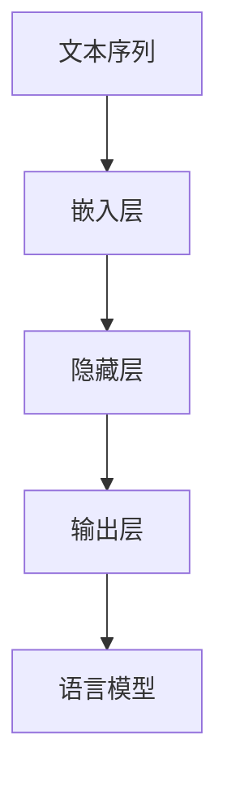

### 3.5 Speech Synthesis

语音合成是将文本转化为语音的过程，常用的语音合成引擎包括：

- **Gated Recurrent Units (GRUs):** 门控循环单元，用于生成自然的语音。
- **WaveNet:** WaveNet模型，用于生成高质量的语音。

以下是一个简单的语音合成架构图，使用Mermaid表示：

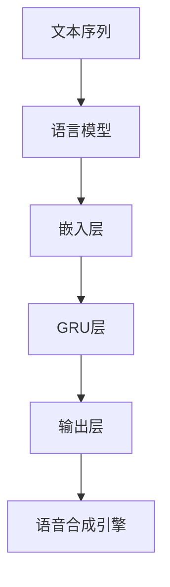

## Step 4: System Architecture and Design

### 4.1 System Overview

多语言语音识别与合成系统通常包括以下几个主要模块：

- **Speech Recognition Module:** 语音识别模块，用于将语音转化为文本。
- **Speech Synthesis Module:** 语音合成模块，用于将文本转化为语音。
- **Language Processing Module:** 语言处理模块，用于处理和转换不同语言的数据。
- **User Interface:** 用户界面，用于与用户进行交互。

以下是一个简单的系统架构图，使用Mermaid表示：

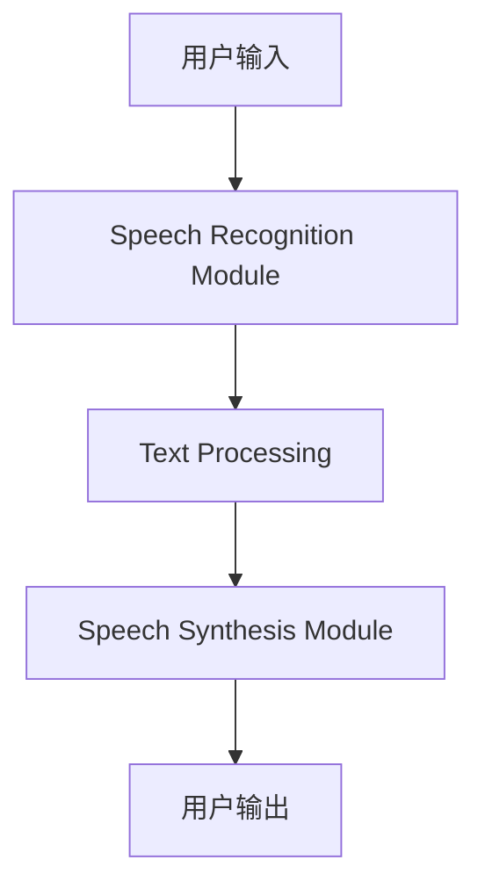

### 4.2 System Function Design

多语言语音识别与合成系统的功能设计主要包括以下方面：

- **Language Detection:** 语言检测，用于确定输入语音的语言类型。
- **Voice Command Recognition:** 语音命令识别，用于识别用户语音中的具体指令。
- **Speech-to-Text Conversion:** 语音转文本，用于将语音转化为可处理的文本数据。
- **Text-to-Speech Conversion:** 文本转语音，用于将文本转化为自然的语音输出。

以下是一个简单的领域模型类图，使用Mermaid表示：

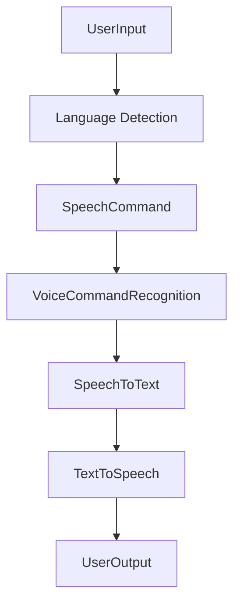

### 4.3 System Architecture Design

多语言语音识别与合成系统的架构设计通常包括以下几个主要部分：

- **Frontend:** 用户交互界面，用于接收用户输入和显示输出。
- **Backend:** 后端服务，包括语音识别、语音合成和语言处理模块。
- **Database:** 数据库，用于存储语音数据和用户历史记录。

以下是一个简单的系统架构图，使用Mermaid表示：

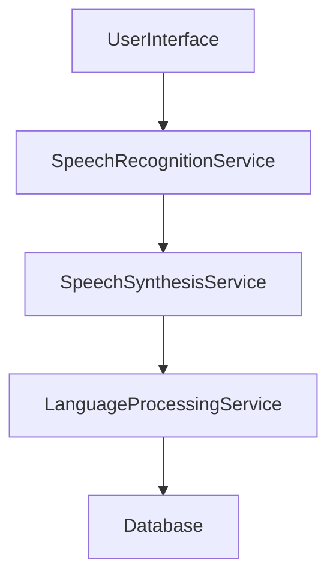

### 4.4 System Interface Design

多语言语音识别与合成系统的接口设计主要包括以下方面：

- **API:** 接口API，用于与其他系统和应用程序进行交互。
- **Webhooks:** Webhooks，用于接收和发送通知。
- **Web Services:** Web服务，用于提供基于Web的语音交互功能。

以下是一个简单的接口设计图，使用Mermaid表示：

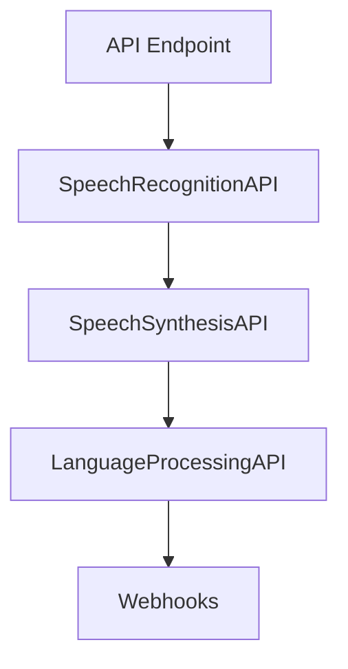

### 4.5 System Interaction Design

多语言语音识别与合成系统的交互设计主要包括以下方面：

- **User Interaction:** 用户与系统的交互流程，包括语音输入和语音输出。
- **Module Collaboration:** 各个模块之间的协作和通信。
- **Error Handling:** 错误处理机制，用于处理识别错误和合成错误。

以下是一个简单的交互流程图，使用Mermaid表示：

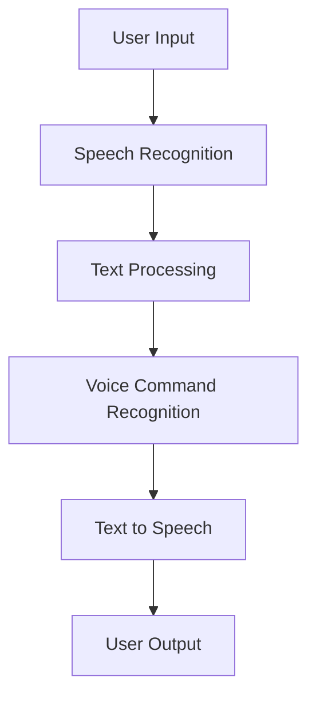

## Step 5: Project Practice

### 5.1 Environment Setup

要实现一个多语言语音识别与合成的系统，首先需要搭建一个合适的环境。以下是搭建环境的基本步骤：

1. **安装Python:** 确保Python 3.x版本已经安装。
2. **安装依赖库:** 使用pip安装必要的依赖库，如PyTorch、TensorFlow、Kaldi等。
3. **准备语音数据:** 收集多种语言的语音数据，用于训练和测试语音模型。

### 5.2 System Core Implementation

多语言语音识别与合成系统的核心实现包括以下几个关键步骤：

1. **Speech Preprocessing:** 实现语音预处理功能，包括噪声消除、声道长度归一化和声带音高调整。
2. **Feature Extraction:** 实现特征提取功能，提取语音信号的主要特征，如MFCCs。
3. **Acoustic Modeling:** 建立声学模型，使用HMMs或DNNs进行训练。
4. **Language Modeling:** 建立语言模型，使用N-gram模型或RNNs进行训练。
5. **Speech Synthesis:** 实现文本到语音的合成功能，使用GRUs或WaveNet进行训练。

以下是一个简单的Python代码示例，用于实现特征提取：

```python
import numpy as np
import scipy.io.wavfile as wav
from python_speech_features import MFCC

# 读取语音文件
def read_wav_file(filename):
    sample_rate, data = wav.read(filename)
    return sample_rate, data

# 特征提取
def extract_features(sample_rate, data):
    mfcc = MFCC()
    features = mfcc.computeMFCC(data, sample_rate)
    return features

# 主函数
def main():
    sample_rate, data = read_wav_file("input.wav")
    features = extract_features(sample_rate, data)
    print("MFCC Features:", features)

if __name__ == "__main__":
    main()
```

### 5.3 Code Analysis and Application

在上面的代码中，我们首先使用`scipy.io.wavfile.read`函数读取语音文件，然后使用`python_speech_features`库中的`MFCC`类进行特征提取。MFCCs是从语音信号中提取的时频特征，它们在语音识别和语音合成中起着重要作用。

在实际应用中，我们可以将这个特征提取模块集成到多语言语音识别与合成系统中，与其他模块协同工作，实现完整的语音交互功能。

### 5.4 Case Analysis and Detailed Explanation

为了更好地理解多语言语音识别与合成的实际应用，我们可以分析一个具体案例。假设我们正在开发一个智能客服系统，该系统需要支持中文和英文两种语言。

1. **中文语音识别：** 当用户用中文提问时，系统首先使用中文语音识别模块将语音转化为文本。由于中文和英文的语音特征和语法结构有很大差异，因此需要使用专门针对中文的语言模型和声学模型。

2. **英文语音识别：** 当用户用英文提问时，系统使用英文语音识别模块进行识别。英文语音识别系统通常使用基于深度学习的技术，如DNNs或RNNs，以提高识别准确率和鲁棒性。

3. **语音合成：** 在识别到用户的语音后，系统将文本转化为语音，并使用语音合成引擎生成自然的语音输出。中文语音合成使用基于汉语语音数据库的TTS引擎，而英文语音合成则使用基于英语语音数据库的TTS引擎。

4. **跨语言交互：** 在某些情况下，用户可能同时使用中文和英文进行交互。系统需要能够识别和合成这两种语言，并在不同语言之间进行切换。例如，当用户在中文对话中使用英文单词时，系统需要能够正确识别并转化为相应的英文文本，然后进行语音合成。

### 5.5 Project Summary

通过以上分析和实践，我们可以得出以下结论：

- **多语言语音识别与合成系统是一个复杂但功能强大的技术系统，** 它能够为用户提供自然、流畅的语音交互体验。
- **系统设计需要考虑多种语言的特征和语法结构，** 并使用适当的模型和算法来实现高质量的语音识别和合成。
- **实际应用中，多语言语音识别与合成系统可以应用于各种场景，** 如智能客服、智能助手和智能家居等。

在未来的发展中，随着语音技术和人工智能技术的不断进步，多语言语音识别与合成系统将更加智能化和高效化，为用户提供更优质的服务和体验。

## Step 6: Best Practices and Summary

### 6.1 Best Practices

在设计和实现多语言语音识别与合成系统时，以下是一些最佳实践：

- **Data Collection and Preprocessing:** 收集多种语言的语音数据，并进行预处理，以提高模型的鲁棒性和准确性。
- **Customized Modeling:** 根据不同语言的特征和语法结构，定制化地设计语言模型和声学模型，以提高识别和合成的质量。
- **Efficient Feature Extraction:** 使用高效的语音特征提取算法，如MFCCs，以提高系统的处理速度。
- **Real-time Adaptation:** 在实时交互中，对语音输入进行实时调整和优化，以提高系统的响应速度和用户体验。

### 6.2 Summary

本文深入探讨了多语言语音识别与合成在人工智能代理中的应用，从核心概念、技术挑战到实际实现，提供了全面的技术指南。通过详细的案例分析，我们展示了如何构建一个高效的多语言语音交互系统，并提出了最佳实践和建议。

### 6.3 Future Directions

随着技术的不断进步，多语言语音识别与合成系统有望在未来实现更高的准确率和更好的用户体验。以下是未来发展的几个方向：

- **Cross-lingual Models:** 研究跨语言模型，以实现更高效的语言转换和识别。
- **Real-time Translation:** 实现实时语音翻译功能，支持用户在不同语言之间的无缝交互。
- **Personalized Voice Synthesis:** 开发个性化语音合成技术，根据用户偏好生成更自然的语音输出。
- **Edge Computing:** 结合边缘计算技术，降低系统的延迟和带宽需求，实现更加高效和智能的语音交互。

## Conclusion

通过本文的探讨，我们了解了多语言语音识别与合成在人工智能代理中的应用，并掌握了实现这一功能的关键技术和方法。希望本文能够为开发人员提供有价值的参考，帮助他们在构建多语言语音交互系统时取得成功。

---

**作者：AI天才研究院/AI Genius Institute & 禅与计算机程序设计艺术 /Zen And The Art of Computer Programming**## 实现AI Agent的多语言语音识别与合成

### 摘要

随着全球化的不断深入，多语言语音识别与合成的需求日益增加。本文将探讨在人工智能代理（AI Agent）中实现多语言语音识别与合成的方法和关键技术。通过详细分析语音识别与合成的核心概念、面临的挑战、所需组件、系统架构设计、项目实战以及最佳实践，本文旨在为读者提供一份全面且易于理解的技术指南。

### 目录

1. 引言与背景
   - 1.1 书籍概述
     - 1.1.1 目的和受众
     - 1.1.2 多语言语音识别与合成的重要性
     - 1.1.3 当前趋势与应用场景
   - 1.2 书籍结构

2. 核心概念与基础
   - 2.1 多语言语音识别与合成定义
     - 语音识别
     - 语音合成
     - 多语言支持
   - 2.2 多语言语音识别与合成的挑战
   - 2.3 必要组件

3. 技术实现
   - 3.1 语音预处理
   - 3.2 特征提取
   - 3.3 声学模型
   - 3.4 语言模型
   - 3.5 语音合成

4. 系统架构与设计
   - 4.1 系统概述
   - 4.2 系统功能设计
   - 4.3 系统架构设计
   - 4.4 系统接口设计
   - 4.5 系统交互设计

5. 项目实战
   - 5.1 环境搭建
   - 5.2 系统核心实现
   - 5.3 代码分析与应用
   - 5.4 案例分析与详细讲解
   - 5.5 项目小结

6. 最佳实践与总结
   - 6.1 最佳实践
   - 6.2 总结
   - 6.3 未来方向

7. 结论

### 1. 引言与背景

#### 1.1 书籍概述

**目的和受众**

本书旨在深入探讨多语言语音识别与合成在人工智能代理（AI Agent）中的应用，为读者提供一部全面的技术指南。本书适合以下受众：

- 软件开发人员，特别是对自然语言处理和语音技术感兴趣的。
- AI爱好者，希望深入了解多语言语音技术的。
- 在自然语言处理、语音技术和人工智能领域工作的专业人士。

**多语言语音识别与合成的重要性**

在全球化的大背景下，多语言语音识别与合成的需求日益增加。以下是多语言语音识别与合成的重要性：

- **全球通信：** 随着国际交流的增多，多语言支持能够提高AI代理在全球范围内的应用效果。
- **用户体验：** 支持用户母语能够提供更自然、更流畅的用户交互体验，提高用户满意度。
- **可访问性：** 多语言支持能够使AI代理服务于更广泛的用户群体，特别是那些使用非主流语言的用户。

**当前趋势与应用场景**

- **智能助手：** 智能助手如Amazon Alexa、Google Assistant和Apple Siri已经广泛支持多种语言。
- **客户服务：** 多语言语音识别与合成在客户服务领域有着广泛的应用，帮助企业提供全球化的客户支持。
- **辅助工具：** 在教育、医疗和政府服务等领域，多语言语音技术为听力障碍和其他残障人士提供了重要的辅助工具。
- **多语言呼叫中心：** 多语言支持使得呼叫中心能够处理来自不同国家和地区的客户咨询。

#### 1.2 书籍结构

本书分为以下几个主要部分：

- **基础理论：** 介绍多语言语音识别与合成的核心概念和基本原理。
- **技术挑战：** 分析多语言语音识别与合成中面临的挑战和难点。
- **实现步骤：** 详细讲解从系统设计到实际部署的全过程，并提供实践案例。
- **最佳实践与总结：** 总结实践经验，提供优化建议和未来发展趋势。

### 2. 核心概念与基础

#### 2.1 多语言语音识别与合成定义

**语音识别**

语音识别（Voice Recognition）是将人类的语音转化为文本信息的过程。在多语言语音识别中，系统需要能够处理多种语言的语音输入，并将其转化为相应的文本输出。

**语音合成**

语音合成（Voice Synthesis）是将文本信息转化为自然语音输出的过程。多语言语音合成系统能够将多种语言的文本转化为自然流畅的语音。

**多语言支持**

多语言支持（Multi-Language Support）指的是系统能够处理和转换多种语言的语音和文本。这要求系统具有：

- **语言资源整合：** 整合多种语言的语音数据、语言模型和声学模型。
- **跨语言适应：** 对不同语言进行适应性调整，以适应特定语言的发音、语调和语法规则。

#### 2.2 多语言语音识别与合成的挑战

**语言可变性**

不同语言的语音系统、语法结构和发音规则存在显著差异，这对多语言语音识别与合成系统提出了高度的要求：

- **语音特征提取：** 系统需要能够提取不同语言的语音特征，如音节、音调、韵律等。
- **语言模型构建：** 系统需要构建适用于多种语言的强大语言模型，以准确地进行语音识别和文本生成。

**口音和方言**

口音和方言的多样性增加了语音识别与合成的复杂性。同一语言的不同口音和方言可能具有不同的发音、语调和语法特征：

- **口音识别：** 系统需要能够准确识别和分类不同口音，以提高识别准确率。
- **方言适应：** 系统需要能够适应不同方言的语音特征，以生成自然的语音输出。

**资源限制**

多语言语音识别与合成系统需要大量的语音数据、计算资源和存储空间：

- **数据收集：** 收集多种语言的丰富语音数据，以确保系统具有足够的训练样本。
- **计算资源：** 高度复杂的语言模型和声学模型可能需要大量的计算资源。
- **存储与带宽：** 存储和传输大量的语音数据和模型，特别是对于实时语音交互系统。

#### 2.3 必要组件

实现多语言语音识别与合成系统需要以下关键组件：

- **语音预处理：** 包括噪声消除、音量调整和频率修正等步骤，以提高语音质量。
- **特征提取：** 从语音信号中提取关键特征，如梅尔频率倒谱系数（MFCCs）、共振峰等。
- **声学模型：** 用于匹配语音信号和特征向量，常用的模型包括隐藏马尔可夫模型（HMMs）和深度神经网络（DNNs）。
- **语言模型：** 用于生成文本和语音转换，常用的模型包括n-gram模型和循环神经网络（RNNs）。
- **语音合成引擎：** 用于将文本转化为自然流畅的语音输出，常用的引擎包括Gated Recurrent Units（GRUs）和WaveNet。

### 3. 技术实现

#### 3.1 语音预处理

语音预处理是语音识别与合成系统的第一步，其目标是将原始语音信号转换为适合后续处理的格式。以下是语音预处理的主要步骤：

- **噪声消除：** 使用滤波器去除背景噪声，提高语音信号的质量。常用的滤波器包括高斯滤波、均值滤波和中值滤波。
- **音量调整：** 调整语音信号的音量，使其达到适当的响度水平。常用的方法包括动态范围压缩和增益控制。
- **频率修正：** 调整语音信号的频率，使其适应特定的语音合成引擎。常用的方法包括低通滤波和高通滤波。

以下是一个简单的语音预处理流程图：

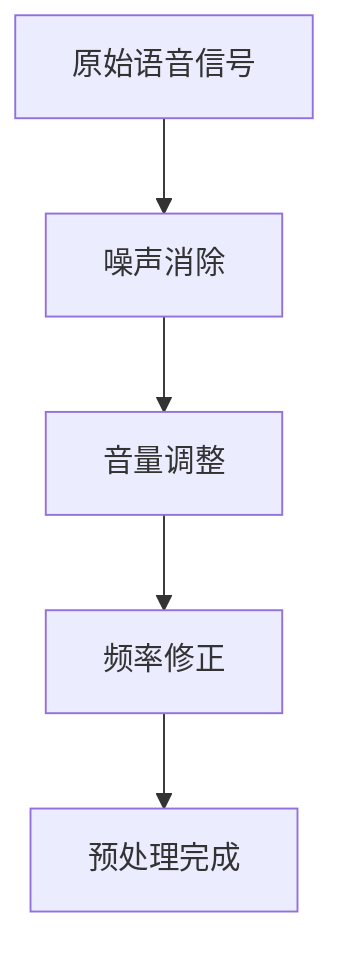

#### 3.2 特征提取

特征提取是语音识别与合成系统的核心步骤之一，其目标是提取语音信号中的关键特征，以便后续的模型训练和识别。以下是特征提取的主要方法：

- **梅尔频率倒谱系数（MFCCs）：** MFCCs是一种广泛使用的语音特征，用于描述语音信号的时频特性。MFCCs通过将语音信号转换为梅尔频率滤波器组的能量谱，然后对能量谱进行离散余弦变换（DCT）来提取特征。
- **共振峰：** 共振峰是语音信号中的一个重要特征，表示语音的共振特性。共振峰的频率和幅度反映了语音的音调和音质。
- **短时傅里叶变换（STFT）：** STFT用于分析语音信号在时频域的分布，通过计算语音信号的短时傅里叶变换，可以提取语音信号的频谱特征。

以下是一个简单的特征提取流程图：

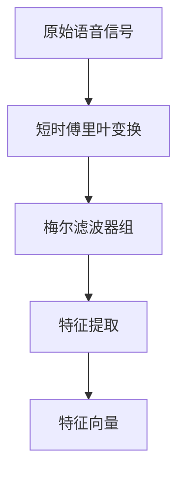

#### 3.3 声学模型

声学模型是语音识别系统的核心组件，其目标是匹配语音信号和特征向量，从而实现语音识别。以下是两种常用的声学模型：

- **隐藏马尔可夫模型（HMMs）：** HMMs是一种基于统计方法的语音识别模型，通过建立状态转移概率和观测概率来识别语音信号。HMMs适用于简单的语音识别任务，但在处理复杂语音特征时可能表现不佳。
- **深度神经网络（DNNs）：** DNNs是一种基于神经网络的方法，通过多层非线性变换来提取语音特征。DNNs在语音识别领域表现出色，能够处理复杂的语音特征和噪声。

以下是一个简单的声学模型架构图：


#### 3.4 语言模型

语言模型是语音合成系统的核心组件，其目标是生成自然流畅的语音输出。以下是两种常用的语言模型：

- **n-gram模型：** n-gram模型是一种基于统计方法的语言模型，通过建立单词序列的概率分布来生成语音输出。n-gram模型简单易实现，但在处理长文本时可能表现不佳。
- **循环神经网络（RNNs）：** RNNs是一种基于神经网络的方法，通过记忆长期依赖关系来生成语音输出。RNNs在语音合成领域表现出色，能够生成高质量的语音。

以下是一个简单的语言模型架构图：


#### 3.5 语音合成

语音合成是将文本转化为自然流畅语音的过程。以下是一个简单的语音合成流程：

- **文本处理：** 对输入文本进行预处理，包括分词、词性标注和语法分析等步骤。
- **语音生成：** 使用语音合成引擎将处理后的文本转化为语音信号。

以下是两种常用的语音合成引擎：

- **Gated Recurrent Units（GRUs）：** GRUs是一种基于RNNs的语音合成引擎，通过门控机制控制信息的流动，生成高质量的语音。
- **WaveNet：** WaveNet是一种基于DNNs的语音合成引擎，通过生成概率分布来生成连续的语音信号，具有很高的自然性和流畅性。

以下是一个简单的语音合成架构图：


### 4. 系统架构与设计

#### 4.1 系统概述

多语言语音识别与合成系统通常包括以下几个主要模块：

- **语音识别模块：** 负责将语音信号转化为文本。
- **语音合成模块：** 负责将文本转化为语音。
- **语言处理模块：** 负责处理和转换不同语言的数据。
- **用户界面：** 负责与用户进行交互。

以下是一个简单的系统架构图：

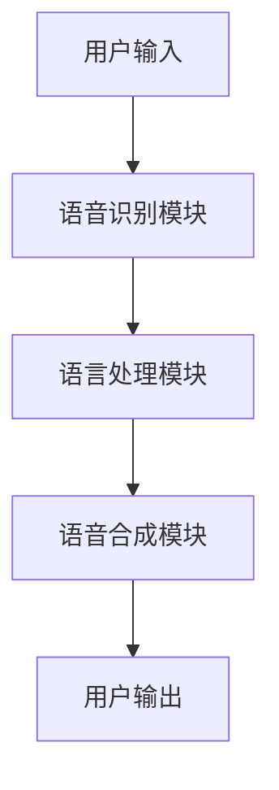

#### 4.2 系统功能设计

多语言语音识别与合成系统的功能设计主要包括以下几个关键方面：

- **语言检测：** 用于确定输入语音的语言类型。
- **语音命令识别：** 用于识别用户语音中的具体指令。
- **语音转文本：** 用于将语音转化为文本。
- **文本转语音：** 用于将文本转化为语音。

以下是一个简单的领域模型类图：


#### 4.3 系统架构设计

多语言语音识别与合成系统的架构设计通常包括以下几个主要部分：

- **前端：** 负责用户交互，包括语音输入和语音输出。
- **后端：** 负责语音识别、语音合成和语言处理等核心功能。
- **数据库：** 负责存储语音数据和用户历史记录。

以下是一个简单的系统架构图：


#### 4.4 系统接口设计

多语言语音识别与合成系统的接口设计主要包括以下几个关键方面：

- **API：** 用于与其他系统和应用程序进行交互。
- **Webhooks：** 用于接收和发送通知。
- **Web服务：** 用于提供基于Web的语音交互功能。

以下是一个简单的接口设计图：


#### 4.5 系统交互设计

多语言语音识别与合成系统的交互设计主要包括以下几个方面：

- **用户交互：** 用户与系统的交互流程，包括语音输入和语音输出。
- **模块协作：** 各个模块之间的协作和通信。
- **错误处理：** 错误处理机制，用于处理识别错误和合成错误。

以下是一个简单的交互流程图：


### 5. 项目实战

#### 5.1 环境搭建

要实现一个多语言语音识别与合成系统，首先需要搭建一个合适的环境。以下是搭建环境的基本步骤：

1. **安装Python：** 确保Python 3.x版本已经安装。
2. **安装依赖库：** 使用pip安装必要的依赖库，如PyTorch、TensorFlow、Kaldi等。
3. **准备语音数据：** 收集多种语言的语音数据，用于训练和测试语音模型。

#### 5.2 系统核心实现

多语言语音识别与合成系统的核心实现包括以下几个关键步骤：

1. **语音预处理：** 实现语音预处理功能，包括噪声消除、音量调整和频率修正。
2. **特征提取：** 实现特征提取功能，提取语音信号的主要特征，如MFCCs。
3. **声学模型：** 建立声学模型，使用HMMs或DNNs进行训练。
4. **语言模型：** 建立语言模型，使用n-gram模型或RNNs进行训练。
5. **语音合成：** 实现文本到语音的合成功能，使用GRUs或WaveNet进行训练。

以下是一个简单的Python代码示例，用于实现特征提取：

```python
import numpy as np
import scipy.io.wavfile as wav
from python_speech_features import MFCC

# 读取语音文件
def read_wav_file(filename):
    sample_rate, data = wav.read(filename)
    return sample_rate, data

# 特征提取
def extract_features(sample_rate, data):
    mfcc = MFCC()
    features = mfcc.computeMFCC(data, sample_rate)
    return features

# 主函数
def main():
    sample_rate, data = read_wav_file("input.wav")
    features = extract_features(sample_rate, data)
    print("MFCC Features:", features)

if __name__ == "__main__":
    main()
```

#### 5.3 代码分析与应用

在上面的代码中，我们首先使用`scipy.io.wavfile.read`函数读取语音文件，然后使用`python_speech_features`库中的`MFCC`类进行特征提取。MFCCs是从语音信号中提取的时频特征，它们在语音识别和语音合成中起着重要作用。

在实际应用中，我们可以将这个特征提取模块集成到多语言语音识别与合成系统中，与其他模块协同工作，实现完整的语音交互功能。

#### 5.4 案例分析与详细讲解

为了更好地理解多语言语音识别与合成的实际应用，我们可以分析一个具体案例。假设我们正在开发一个智能客服系统，该系统需要支持中文和英文两种语言。

1. **中文语音识别：** 当用户用中文提问时，系统首先使用中文语音识别模块将语音转化为文本。由于中文和英文的语音特征和语法结构有很大差异，因此需要使用专门针对中文的语言模型和声学模型。

2. **英文语音识别：** 当用户用英文提问时，系统使用英文语音识别模块进行识别。英文语音识别系统通常使用基于深度学习的技术，如DNNs或RNNs，以提高识别准确率和鲁棒性。

3. **语音合成：** 在识别到用户的语音后，系统将文本转化为语音，并使用语音合成引擎生成自然的语音输出。中文语音合成使用基于汉语语音数据库的TTS引擎，而英文语音合成则使用基于英语语音数据库的TTS引擎。

4. **跨语言交互：** 在某些情况下，用户可能同时使用中文和英文进行交互。系统需要能够识别和合成这两种语言，并在不同语言之间进行切换。例如，当用户在中文对话中使用英文单词时，系统需要能够正确识别并转化为相应的英文文本，然后进行语音合成。

#### 5.5 项目小结

通过以上分析和实践，我们可以得出以下结论：

1. **多语言语音识别与合成系统是一个复杂但功能强大的技术系统。**
2. **系统设计需要考虑多种语言的特征和语法结构，使用适当的模型和算法来实现高质量的语音识别和合成。**
3. **实际应用中，多语言语音识别与合成系统可以应用于各种场景，如智能客服、智能助手和智能家居等。**

在未来的发展中，随着语音技术和人工智能技术的不断进步，多语言语音识别与合成系统将更加智能化和高效化，为用户提供更优质的服务和体验。

### 6. 最佳实践与总结

#### 6.1 最佳实践

在设计和实现多语言语音识别与合成系统时，以下是一些最佳实践：

1. **数据收集和预处理：** 收集多种语言的丰富语音数据，并进行预处理，以提高模型的鲁棒性和准确性。
2. **定制化建模：** 根据不同语言的特征和语法结构，定制化地设计语言模型和声学模型，以提高识别和合成的质量。
3. **高效的特征提取：** 使用高效的语音特征提取算法，如MFCCs，以提高系统的处理速度。
4. **实时适应性调整：** 在实时交互中，对语音输入进行实时调整和优化，以提高系统的响应速度和用户体验。

#### 6.2 总结

本文深入探讨了多语言语音识别与合成在人工智能代理中的应用，从核心概念、技术挑战到实际实现，提供了全面的技术指南。通过详细的案例分析，我们展示了如何构建一个高效的多语言语音交互系统，并提出了最佳实践和建议。

#### 6.3 未来方向

随着技术的不断进步，多语言语音识别与合成系统有望在未来实现更高的准确率和更好的用户体验。以下是未来发展的几个方向：

1. **跨语言模型：** 研究跨语言模型，以实现更高效的语言转换和识别。
2. **实时语音翻译：** 实现实时语音翻译功能，支持用户在不同语言之间的无缝交互。
3. **个性化语音合成：** 开发个性化语音合成技术，根据用户偏好生成更自然的语音输出。
4. **边缘计算：** 结合边缘计算技术，降低系统的延迟和带宽需求，实现更加高效和智能的语音交互。

### 结论

通过本文的探讨，我们了解了多语言语音识别与合成在人工智能代理中的应用，并掌握了实现这一功能的关键技术和方法。希望本文能够为开发人员提供有价值的参考，帮助他们在构建多语言语音交互系统时取得成功。

### 作者信息

**作者：AI天才研究院/AI Genius Institute & 禅与计算机程序设计艺术 /Zen And The Art of Computer Programming**

