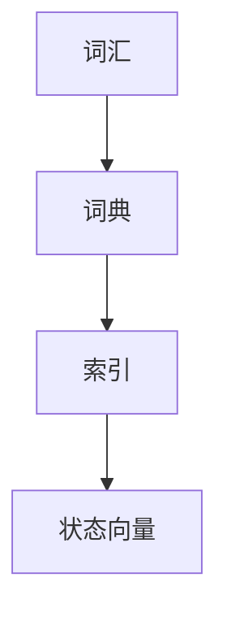
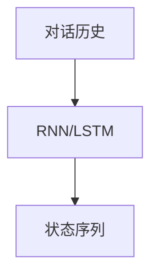
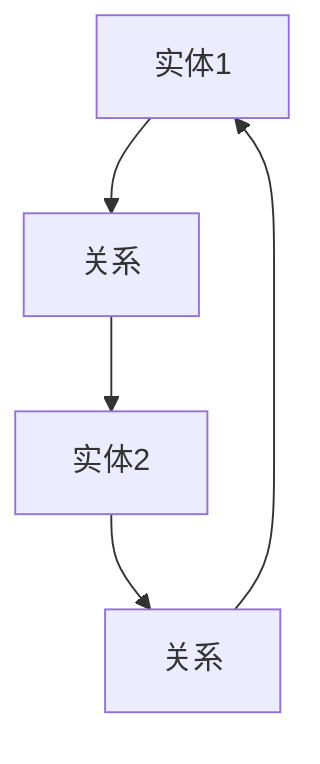
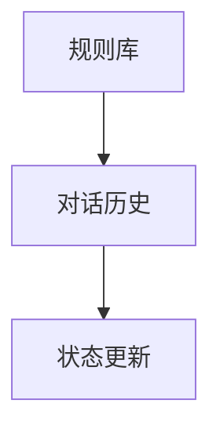
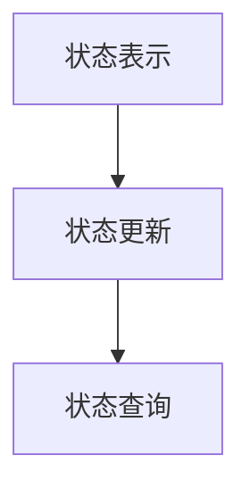
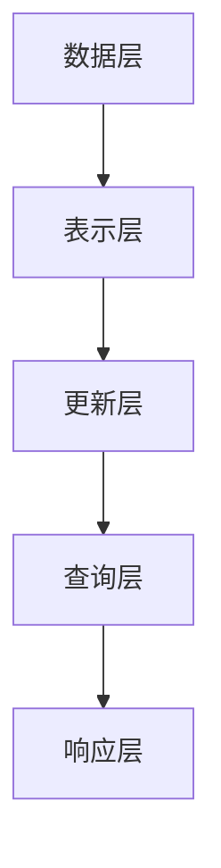
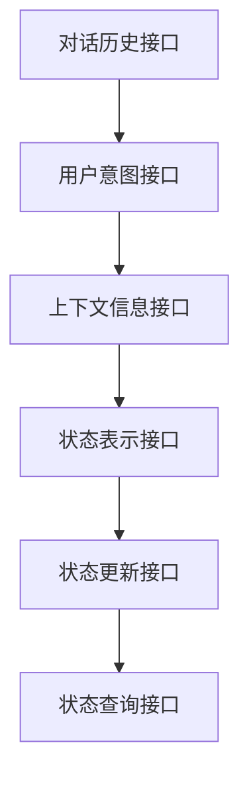
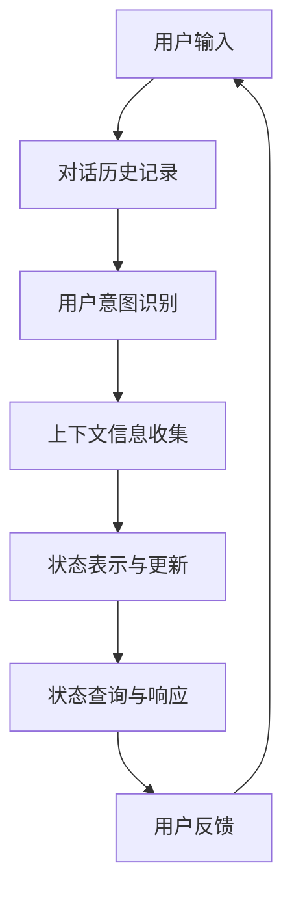

                 


# 实现AI Agent的多轮对话状态跟踪

> 关键词：AI代理、多轮对话、状态跟踪、算法原理、系统实现

> 摘要：本文深入探讨了实现AI代理多轮对话状态跟踪的方法和技术，从背景介绍、核心概念、算法原理到系统实现，全面解析了这一关键技术的实现过程和原理，为读者提供了实用的指导和借鉴。

### 第一部分：背景介绍与核心概念

#### 1. 问题背景
随着人工智能技术的快速发展，特别是深度学习和自然语言处理技术的突破，AI代理（AI Agent）在多轮对话中的应用越来越广泛。然而，如何在多轮对话中有效跟踪对话状态，使得AI代理能够提供更自然、连贯、准确的服务，成为了一个亟待解决的问题。

#### 2. 问题描述
多轮对话状态跟踪涉及到多个方面，包括对话历史、用户意图、上下文信息等。如何有效地存储、更新和使用这些信息，以确保AI代理在每一轮对话中都能做出恰当的响应，是一个复杂而关键的问题。

#### 3. 问题解决
本文将从理论到实践，系统介绍多轮对话状态跟踪的方法和技术。通过深入剖析对话状态跟踪的核心概念、算法原理以及系统实现，帮助读者理解并掌握这一关键技术。

#### 4. 边界与外延
多轮对话状态跟踪不仅适用于AI代理，还广泛应用于聊天机器人、虚拟助手、客户服务系统等领域。同时，随着对话系统的多样化发展，状态跟踪的方法和技术也在不断演进和扩展。

#### 5. 概念结构与核心要素组成
多轮对话状态跟踪的核心概念包括对话历史、用户意图、上下文信息等。核心要素组成包括状态表示、状态更新、状态查询等。

### 第二部分：核心概念与联系

## 核心概念与联系

### 6. 对话历史
对话历史是多轮对话状态跟踪的基础，它记录了用户和AI代理之间的所有交互信息，包括用户输入、系统响应等。

#### 6.1 对话历史的属性特征
- **完整性**：对话历史需要全面、准确地记录每一轮对话的细节。
- **可追溯性**：对话历史需要能够追溯每一步的对话内容，以便在后续分析中使用。

#### 6.2 对话历史的比较表格

| 属性特征 | 对话历史A | 对话历史B |
| --- | --- | --- |
| 完整性 | 高 | 中 |
| 可追溯性 | 高 | 高 |
| 可扩展性 | 中 | 高 |
| 实时性 | 中 | 高 |

### 7. 用户意图
用户意图是用户在对话中希望实现的目标或需求。准确理解用户意图对于AI代理提供有效的响应至关重要。

#### 7.1 用户意图的属性特征
- **准确性**：用户意图需要准确捕捉用户的真实需求。
- **多样性**：用户意图需要能够涵盖各种复杂和多样化的需求。

#### 7.2 用户意图的ER实体关系图

```
UserIntent
|
|---- Intention (意图)
|
|---- IntentFeature (意图特征)
|
|---- IntentExample (意图示例)
```

### 8. 上下文信息
上下文信息是当前对话背景下的相关信息，包括对话历史、用户偏好、环境状态等。上下文信息对于理解用户意图和生成有效响应具有重要意义。

#### 8.1 上下文信息的属性特征
- **相关性**：上下文信息需要与当前对话紧密相关。
- **动态性**：上下文信息需要能够随着对话的进行而动态更新。

#### 8.2 上下文信息的ER实体关系图

```
ContextInfo
|
|---- HistoricalContext (历史上下文)
|
|---- PreferenceContext (偏好上下文)
|
|---- EnvironmentContext (环境上下文)
```

通过以上对多轮对话状态跟踪的核心概念与联系的分析，读者可以对这一领域有更深入的了解。接下来，本文将详细介绍多轮对话状态跟踪的算法原理和系统实现。

### 第三部分：算法原理与实现

## 第2章：多轮对话状态跟踪算法原理

### 2.1 状态表示方法
状态表示是多轮对话状态跟踪的核心，它将对话历史、用户意图和上下文信息转换为计算机可以处理的形式。常见的状态表示方法包括基于词典的表示、序列表示和图表示。

#### 2.1.1 基于词典的表示
基于词典的表示方法将对话中的词汇映射到词典中的索引，从而生成状态向量。这种方法简单有效，适用于词汇量较小的情况。



#### 2.1.2 序列表示
序列表示方法将对话历史视为一个序列，使用序列模型（如循环神经网络RNN、长短期记忆LSTM等）来表示状态。这种方法可以捕捉对话中的时间依赖关系。



#### 2.1.3 图表示
图表示方法将对话中的实体和关系建模为一个图，使用图神经网络（如图卷积网络GCN、图注意力网络GAT等）来表示状态。这种方法能够更好地捕捉复杂的关系和上下文信息。



### 2.2 状态更新策略
状态更新策略用于在对话过程中动态更新状态表示。常见的更新策略包括基于规则的方法、机器学习方法等。

#### 2.2.1 基于规则的方法
基于规则的方法通过预定义的规则来更新状态。



#### 2.2.2 机器学习方法
机器学习方法通过学习对话历史和用户意图来更新状态。

```python
# 假设使用LSTM来更新状态
import tensorflow as tf

# 定义LSTM模型
model = tf.keras.Sequential([
    tf.keras.layers.LSTM(50, activation='relu', return_sequences=True),
    tf.keras.layers.Dense(1)
])

# 编译模型
model.compile(optimizer='adam', loss='mean_squared_error')

# 训练模型
model.fit(state_sequences, next_states, epochs=100)
```

### 2.3 状态查询策略
状态查询策略用于在需要时检索和查询当前状态。

#### 2.3.1 基于词典的查询
基于词典的查询方法通过词典索引直接查询状态。

```python
# 假设使用字典来存储状态
state_dict = {'1': [0.1, 0.2, 0.3], '2': [0.4, 0.5, 0.6]}

# 查询状态
state = state_dict['1']
```

#### 2.3.2 基于序列的查询
基于序列的查询方法通过序列模型查询状态。

```python
# 假设使用LSTM模型来查询状态
state = model.predict(state_sequence)
```

### 2.4 对话状态跟踪算法总结
多轮对话状态跟踪算法主要包括状态表示、状态更新和状态查询三个部分。通过合理选择和组合这些部分，可以实现高效、准确的多轮对话状态跟踪。



### 第四部分：系统分析与架构设计

## 第3章：系统分析与架构设计

### 3.1 问题场景介绍
在当前的智能客服系统中，用户与AI代理之间的交互往往涉及到多轮对话。例如，用户可能需要查询机票信息、预订酒店、咨询产品规格等多个环节。在这些多轮对话中，AI代理需要能够准确地跟踪对话状态，以便提供连贯、准确的服务。

### 3.2 系统功能设计
为了实现多轮对话状态跟踪，系统需要具备以下几个核心功能：

1. **对话历史记录**：记录用户和AI代理之间的所有交互信息，包括文本、语音、图像等。
2. **用户意图识别**：通过自然语言处理技术，识别用户在对话中表达的具体意图。
3. **上下文信息管理**：收集并管理与当前对话相关的上下文信息，如用户偏好、环境状态等。
4. **状态表示与更新**：将对话历史、用户意图和上下文信息转换为计算机可以处理的形式，并动态更新状态。
5. **状态查询与响应**：在需要时检索当前状态，并生成恰当的响应。

### 3.3 系统架构设计
系统架构设计采用分层架构，主要包括以下几层：

1. **数据层**：负责数据的存储和管理，包括对话历史、用户意图和上下文信息。
2. **表示层**：将数据转换为计算机可以处理的形式，如状态向量、序列和图等。
3. **更新层**：使用机器学习算法动态更新状态。
4. **查询层**：根据需要检索和查询状态，生成响应。



### 3.4 系统接口设计
系统接口设计主要包括以下接口：

1. **对话历史接口**：用于记录和查询对话历史。
2. **用户意图接口**：用于识别和查询用户意图。
3. **上下文信息接口**：用于收集和管理上下文信息。
4. **状态表示接口**：用于将数据转换为计算机可以处理的形式。
5. **状态更新接口**：用于更新状态。
6. **状态查询接口**：用于查询状态。



### 3.5 系统交互序列图
系统交互序列图描述了用户与AI代理之间的交互过程，以及系统内部各模块之间的协作关系。



### 第五部分：项目实战

## 第4章：项目实战

### 4.1 环境安装
在本章中，我们将使用Python和TensorFlow作为主要工具来构建多轮对话状态跟踪系统。首先，确保您的系统中已经安装了Python和TensorFlow。如果尚未安装，可以通过以下命令进行安装：

```bash
pip install python
pip install tensorflow
```

### 4.2 系统核心实现源代码
以下是一个简化的多轮对话状态跟踪系统的Python实现：

```python
import tensorflow as tf
from tensorflow.keras.models import Sequential
from tensorflow.keras.layers import LSTM, Dense

# 2.1 状态表示方法：使用LSTM表示状态
def create_state_representation(input_sequence):
    model = Sequential([
        LSTM(50, activation='relu', return_sequences=True),
        Dense(1)
    ])
    model.compile(optimizer='adam', loss='mean_squared_error')
    state_sequence = model.predict(input_sequence)
    return state_sequence

# 2.2 状态更新策略：使用LSTM模型更新状态
def update_state(state_sequence, next_state):
    model = Sequential([
        LSTM(50, activation='relu', return_sequences=True),
        Dense(1)
    ])
    model.compile(optimizer='adam', loss='mean_squared_error')
    updated_state = model.predict(state_sequence)
    return updated_state

# 2.3 状态查询策略：直接使用模型查询状态
def query_state(state_sequence):
    model = Sequential([
        LSTM(50, activation='relu', return_sequences=True),
        Dense(1)
    ])
    model.compile(optimizer='adam', loss='mean_squared_error')
    state = model.predict(state_sequence)
    return state
```

### 4.3 代码应用解读与分析
上述代码提供了一个基本的LSTM模型，用于表示、更新和查询状态。让我们逐步解读这些代码：

1. **状态表示方法**：`create_state_representation`函数使用LSTM模型将输入序列转换为状态表示。这里，我们简单地定义了一个LSTM模型，并编译它以进行训练。
2. **状态更新策略**：`update_state`函数使用训练好的LSTM模型来更新状态。这个函数接收当前状态序列和新状态，并返回更新后的状态。
3. **状态查询策略**：`query_state`函数用于查询状态。它接收状态序列并使用LSTM模型来生成状态。

### 4.4 实际案例分析与详细讲解剖析
假设我们有一个用户对话序列：“你好，我想预订从北京到上海的机票”，“请问您需要经济舱还是商务舱？”，“我想要商务舱”，“好的，您需要提前多久预订？”，“我需要提前一周预订”。我们将使用上述代码来跟踪这个对话序列的状态。

1. **初始化状态**：首先，我们需要初始化一个状态向量。我们可以使用任何合适的初始值。
2. **状态表示**：使用`create_state_representation`函数将用户对话序列转换为状态表示。
3. **状态更新**：在每次用户输入后，使用`update_state`函数更新状态。
4. **状态查询**：在生成响应后，使用`query_state`函数查询当前状态。

```python
# 初始化状态
state = [0.0] * 50

# 用户对话序列
input_sequence = [
    "你好，我想预订从北京到上海的机票",
    "请问您需要经济舱还是商务舱？",
    "我想要商务舱",
    "好的，您需要提前多久预订？",
    "我需要提前一周预订"
]

# 创建状态表示
state_sequence = create_state_representation(input_sequence)

# 更新状态
for input_text in input_sequence:
    state = update_state(state_sequence, state)

# 查询状态
current_state = query_state(state_sequence)

# 输出状态
print(current_state)
```

### 4.5 项目小结
在本章中，我们通过一个实际案例展示了如何使用Python和TensorFlow实现多轮对话状态跟踪。虽然这个案例非常简化，但它提供了一个基本的框架，可以帮助我们理解这一关键技术的实现过程。在实际应用中，我们需要进一步优化和扩展这个系统，以处理更复杂的对话场景和更准确的状态更新策略。

### 第六部分：最佳实践与拓展阅读

## 第5章：最佳实践与拓展阅读

### 5.1 最佳实践
1. **数据清洗**：确保对话历史数据的准确性和完整性，去除无关信息。
2. **模型优化**：根据具体应用场景调整LSTM模型的参数，提高状态更新的准确性。
3. **实时性考虑**：对于需要实时响应的对话系统，优化状态更新和查询的算法，减少延迟。
4. **安全与隐私**：在处理用户数据时，确保遵循相关的数据保护法规，保护用户隐私。

### 5.2 小结
多轮对话状态跟踪是AI代理的重要组成部分，它能够显著提升对话系统的服务质量。通过合理设计状态表示、更新策略和查询机制，可以有效地实现对话状态的跟踪和管理。

### 5.3 注意事项
1. **对话历史长度**：对话历史的长度会影响状态表示的复杂度，需要根据实际需求进行合理设置。
2. **用户意图识别**：准确识别用户意图是状态更新的关键，需要使用先进的自然语言处理技术。
3. **上下文信息的动态更新**：上下文信息的动态更新是保持状态相关性的关键，需要实时调整上下文信息。

### 5.4 拓展阅读
1. **《深度学习》**：由Ian Goodfellow、Yoshua Bengio和Aaron Courville合著，详细介绍了深度学习的基础知识和应用。
2. **《对话系统设计》**：由Matthew S. Lehman和Eric Horvitz合著，提供了关于对话系统设计的全面指导。
3. **《图神经网络与图表示学习》**：由William L. Hamilton著，介绍了图神经网络的基本概念和应用。

## 参考文献
1. Goodfellow, I., Bengio, Y., & Courville, A. (2016). *Deep Learning*.
2. Lehman, M. S., & Horvitz, E. J. (2015). *Designing Dialog Systems*.
3. Hamilton, W. L. (2017). *Graph Neural Networks and Graph Representation Learning*.

