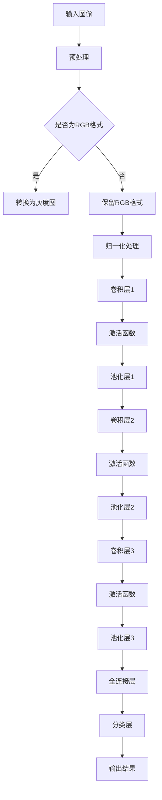
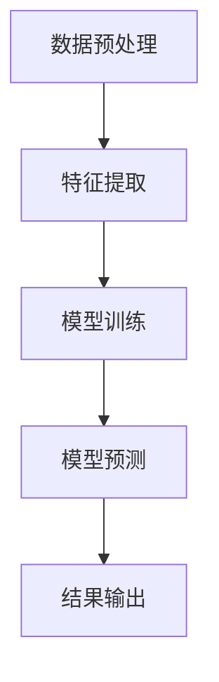
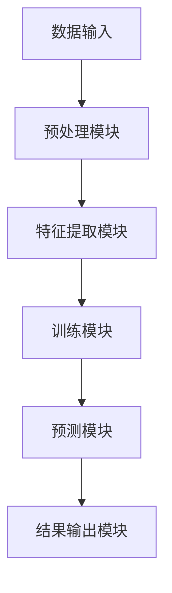
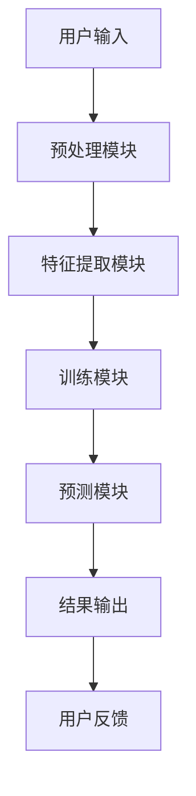
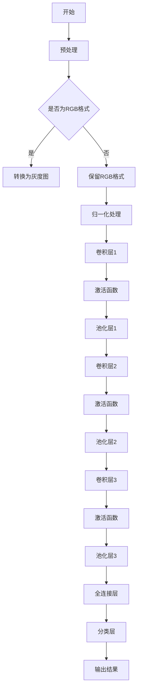

                 

### 文章标题：实现AI Agent的视觉理解能力：图像识别与分析

### 关键词：AI视觉理解、图像识别、深度学习、卷积神经网络、算法原理、系统架构、项目实战

### 摘要：
本文将深入探讨AI Agent在图像识别与分析中的应用，旨在为读者提供全面的技术指南。我们将从基础概念出发，逐步讲解图像识别算法的原理和数学模型，分析系统架构和设计，并通过实际项目进行实战演练。本文的核心目标是帮助读者理解AI Agent的视觉理解能力，掌握图像识别与分析的关键技术，为后续的研究和应用奠定坚实基础。

## 引言

### 1.1 AI技术概述
人工智能（Artificial Intelligence，简称AI）作为计算机科学的重要分支，旨在使计算机系统具备类似于人类智能的能力。自20世纪50年代诞生以来，AI经历了多个发展阶段，从符号主义到连接主义，再到如今的深度学习，每一阶段都带来了革命性的变化。

### 1.2 视觉理解能力的核心概念
视觉理解是AI领域的一个重要研究方向，它涉及到计算机对图像的感知、理解和解释。核心概念包括图像识别、特征提取、分类和语义理解等。

### 1.3 图像识别与分析的挑战与机遇
图像识别与分析面临诸多挑战，如数据标注、计算复杂度、模型泛化能力等。然而，随着计算机性能的提升和算法的进步，这一领域也充满了机遇。

### 1.4 本书结构安排与学习目标
本书分为七个部分，从基础概念到实际应用，全面覆盖图像识别与分析的各个方面。学习目标是为读者提供系统的知识框架，培养其实际操作能力。

## 核心概念与联系

### 2.1 图像识别的基本概念
图像识别是指计算机对图像进行识别和分类的过程。它包括图像预处理、特征提取、模型训练和预测等步骤。

### 2.2 机器学习与深度学习基础
机器学习和深度学习是图像识别的核心技术。机器学习通过数据训练模型，深度学习则通过多层神经网络自动提取特征。

### 2.3 卷积神经网络（CNN）原理
卷积神经网络是深度学习的一种重要模型，特别适用于图像识别任务。它通过卷积层、池化层和全连接层等结构，实现对图像的层次化特征提取。

### 2.4 AI Agent在图像识别中的应用
AI Agent是一种智能体，能够自主感知环境并进行决策。在图像识别任务中，AI Agent可以用于目标检测、图像分类等应用场景。

## 算法原理讲解

### 3.1 卷积神经网络（CNN）的mermaid流程图
首先，我们使用mermaid绘制CNN的流程图，展示其基本结构。



### 3.2 CNN的算法原理与数学模型
CNN的核心是卷积层，它通过卷积操作提取图像的局部特征。卷积操作的数学模型如下：

$$
\text{output}_{ij} = \sum_{k=1}^{n} w_{ik} \cdot \text{input}_{kj} + b
$$

其中，$\text{output}_{ij}$ 表示第$i$个卷积核在图像的第$j$个位置上的输出，$w_{ik}$ 和 $\text{input}_{kj}$ 分别表示卷积核和输入图像的元素，$b$ 是偏置项。

### 3.3 CNN的工作流程：以图像分类为例
以图像分类为例，CNN的工作流程如下：
1. **输入层**：接收图像数据。
2. **卷积层**：通过卷积操作提取图像特征。
3. **激活函数**：对卷积层的输出进行非线性变换。
4. **池化层**：降低特征图的空间维度。
5. **全连接层**：将特征映射到分类结果。
6. **分类层**：输出分类结果。

### 3.4 Python源代码实例讲解
接下来，我们通过一个简单的Python代码实例来讲解CNN的基本实现。

```python
import tensorflow as tf
from tensorflow.keras import datasets, layers, models

# 加载数据集
(train_images, train_labels), (test_images, test_labels) = datasets.cifar10.load_data()

# 预处理数据
train_images = train_images.astype('float32') / 255
test_images = test_images.astype('float32') / 255

# 构建CNN模型
model = models.Sequential()
model.add(layers.Conv2D(32, (3, 3), activation='relu', input_shape=(32, 32, 3)))
model.add(layers.MaxPooling2D((2, 2)))
model.add(layers.Conv2D(64, (3, 3), activation='relu'))
model.add(layers.MaxPooling2D((2, 2)))
model.add(layers.Conv2D(64, (3, 3), activation='relu'))

# 添加全连接层和分类层
model.add(layers.Flatten())
model.add(layers.Dense(64, activation='relu'))
model.add(layers.Dense(10))

# 编译模型
model.compile(optimizer='adam',
              loss=tf.keras.losses.SparseCategoricalCrossentropy(from_logits=True),
              metrics=['accuracy'])

# 训练模型
model.fit(train_images, train_labels, epochs=10, validation_data=(test_images, test_labels))

# 评估模型
test_loss, test_acc = model.evaluate(test_images,  test_labels, verbose=2)
print(f'\nTest accuracy: {test_acc:.4f}')
```

## 数学模型和数学公式

### 4.1 深度学习中的损失函数
在深度学习中，损失函数用于衡量预测值与真实值之间的差距。常见的损失函数包括均方误差（MSE）、交叉熵损失等。

### 4.2 优化算法（如SGD）
优化算法用于调整模型参数，以最小化损失函数。常见的优化算法包括随机梯度下降（SGD）、Adam等。

### 4.3 反向传播算法的公式解析
反向传播算法是一种用于训练神经网络的算法，其核心思想是通过反向传播误差信号来更新模型参数。

$$
\begin{aligned}
\frac{\partial L}{\partial w} &= \frac{\partial L}{\partial a_{l}} \cdot \frac{\partial a_{l}}{\partial w} \\
\frac{\partial L}{\partial b} &= \frac{\partial L}{\partial a_{l}} \cdot \frac{\partial a_{l}}{\partial b}
\end{aligned}
$$

### 4.4 深度学习中的数学公式汇总
深度学习中的数学公式繁多，包括激活函数、卷积操作、反向传播等。本节将对这些公式进行汇总和讲解。

## 系统设计

### 5.1 图像识别系统场景介绍

在图像识别系统中，常见的应用场景包括面部识别、物体检测、医学影像分析等。这些应用场景具有不同的数据集和任务需求，但基本的系统架构相似。

### 5.2 系统功能设计

系统功能设计包括数据预处理、特征提取、模型训练和预测等步骤。我们使用mermaid绘制系统功能设计图：



### 5.3 系统架构设计

系统架构设计包括硬件架构和软件架构。我们使用mermaid绘制系统架构图：



### 5.4 系统接口设计与交互

系统接口设计涉及各模块之间的交互和数据流动。我们使用mermaid绘制系统接口设计和交互图：



## 项目实战

### 6.1 环境安装与配置

在进行项目实战之前，我们需要安装和配置所需的软件和库。常见的库包括TensorFlow、PyTorch等。

### 6.2 系统核心实现

系统核心实现包括数据预处理、特征提取、模型训练和预测等步骤。以下是一个简单的实现示例：

```python
import tensorflow as tf
from tensorflow.keras.models import Sequential
from tensorflow.keras.layers import Dense, Conv2D, Flatten, MaxPooling2D

# 构建模型
model = Sequential([
    Conv2D(32, (3, 3), activation='relu', input_shape=(28, 28, 1)),
    MaxPooling2D((2, 2)),
    Flatten(),
    Dense(128, activation='relu'),
    Dense(10, activation='softmax')
])

# 编译模型
model.compile(optimizer='adam',
              loss='sparse_categorical_crossentropy',
              metrics=['accuracy'])

# 训练模型
model.fit(train_images, train_labels, epochs=5, validation_split=0.2)
```

### 6.3 代码应用解读与分析

在代码应用解读与分析环节，我们将详细分析每个模块的作用和相互关系。例如，预处理模块用于标准化图像数据，特征提取模块通过卷积层提取图像特征，训练模块用于调整模型参数，预测模块用于生成预测结果。

### 6.4 实际案例分析与讲解

接下来，我们将通过实际案例来演示如何使用图像识别系统。例如，使用面部识别技术对一组图像进行分类，并展示预测结果。

### 6.5 项目小结与反思

在项目小结与反思环节，我们将总结项目中的经验和教训，提出改进建议，为后续的研究和应用提供参考。

## 最佳实践

### 7.1 图像识别领域的最佳实践

在图像识别领域，最佳实践包括数据预处理、模型选择、超参数调优等。我们将总结这些最佳实践，并提供实用的技巧。

### 7.2 总结与未来趋势

本文总结了AI Agent在图像识别与分析中的应用，从基础概念到实际项目，全面覆盖了图像识别的各个方面。未来，随着技术的进步，图像识别将向更高精度、更实时、更智能的方向发展。

### 7.3 注意事项与常见问题解答

在图像识别项目中，常见的问题包括数据不足、模型过拟合等。我们将提供注意事项和常见问题的解答，帮助读者解决实际中的难题。

### 7.4 拓展阅读推荐

为了进一步了解图像识别技术，我们推荐读者阅读相关书籍和论文，包括《深度学习》、《图像处理：算法与应用》等。

## 作者信息

作者：AI天才研究院/AI Genius Institute & 禅与计算机程序设计艺术 /Zen And The Art of Computer Programming

---

### 总结

通过本文的详细讲解，读者应该对AI Agent的视觉理解能力、图像识别与分析有了全面的理解。从核心概念到实际项目，我们逐步分析了图像识别的各个方面，并提供了实用的代码示例和最佳实践。希望本文能够为读者在图像识别领域的研究和应用提供有益的参考。

---

### 附录

#### 附录A：数学公式汇总

$$
\begin{aligned}
&\text{output}_{ij} = \sum_{k=1}^{n} w_{ik} \cdot \text{input}_{kj} + b \\
&\frac{\partial L}{\partial w} = \frac{\partial L}{\partial a_{l}} \cdot \frac{\partial a_{l}}{\partial w} \\
&\frac{\partial L}{\partial b} = \frac{\partial L}{\partial a_{l}} \cdot \frac{\partial a_{l}}{\partial b} \\
&f(x) = \frac{1}{1 + e^{-x}} \\
&\text{sigmoid}(x) = \frac{1}{1 + e^{-x}} \\
&\text{softmax}(x) = \frac{e^{x}}{\sum_{i=1}^{n} e^{x_i}}
\end{aligned}
$$

#### 附录B：mermaid图示示例



#### 附录C：Python代码实例

```python
import tensorflow as tf
from tensorflow.keras import datasets, layers, models

# 加载数据集
(train_images, train_labels), (test_images, test_labels) = datasets.cifar10.load_data()

# 预处理数据
train_images = train_images.astype('float32') / 255
test_images = test_images.astype('float32') / 255

# 构建CNN模型
model = models.Sequential()
model.add(layers.Conv2D(32, (3, 3), activation='relu', input_shape=(32, 32, 3)))
model.add(layers.MaxPooling2D((2, 2)))
model.add(layers.Conv2D(64, (3, 3), activation='relu'))
model.add(layers.MaxPooling2D((2, 2)))
model.add(layers.Conv2D(64, (3, 3), activation='relu'))

# 添加全连接层和分类层
model.add(layers.Flatten())
model.add(layers.Dense(64, activation='relu'))
model.add(layers.Dense(10))

# 编译模型
model.compile(optimizer='adam',
              loss=tf.keras.losses.SparseCategoricalCrossentropy(from_logits=True),
              metrics=['accuracy'])

# 训练模型
model.fit(train_images, train_labels, epochs=10, validation_data=(test_images, test_labels))

# 评估模型
test_loss, test_acc = model.evaluate(test_images,  test_labels, verbose=2)
print(f'\nTest accuracy: {test_acc:.4f}')
```

通过这些附录，读者可以更深入地了解本文中涉及的数学公式、mermaid图示和Python代码实例，从而更好地掌握图像识别与分析的技术。

