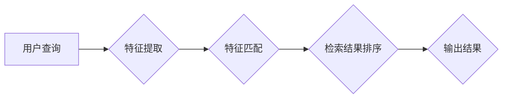
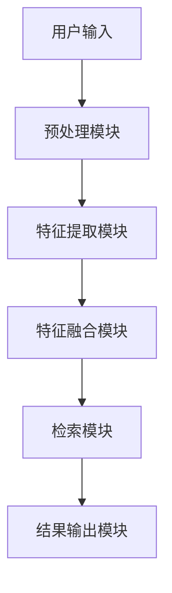
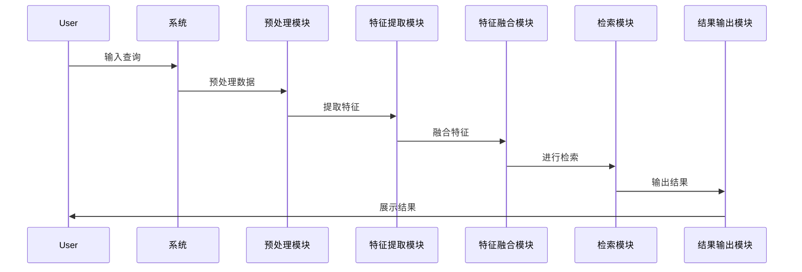

                 

### # 实现AI Agent的跨模态检索能力

关键词：AI Agent、跨模态检索、人工智能、机器学习、算法原理、实现步骤

摘要：本文将深入探讨如何实现AI Agent的跨模态检索能力，涵盖跨模态检索的概述、核心概念与联系、算法原理讲解和实现步骤。通过这篇文章，读者将了解如何通过技术手段将不同模态的信息进行有效整合，以实现更高效、更智能的AI检索系统。

---

### 目录大纲

----------------------------------------------------------------

# 实现AI Agent的跨模态检索能力

> 关键词：AI Agent、跨模态检索、人工智能、机器学习、算法原理、实现步骤

> 摘要：本文将深入探讨如何实现AI Agent的跨模态检索能力，涵盖跨模态检索的概述、核心概念与联系、算法原理讲解和实现步骤。通过这篇文章，读者将了解如何通过技术手段将不同模态的信息进行有效整合，以实现更高效、更智能的AI检索系统。

### 目录大纲

----------------------------------------------------------------

## 第一部分: AI Agent的跨模态检索能力概述

## 1.1 问题背景
### 1.1.1 跨模态检索的概念
### 1.1.2 跨模态检索的重要性
### 1.1.3 跨模态检索的应用场景

## 1.2 问题描述
### 1.2.1 跨模态检索的挑战
### 1.2.2 跨模态检索的核心问题
### 1.2.3 跨模态检索的解决思路

## 1.3 问题解决
### 1.3.1 跨模态检索的技术方法
### 1.3.2 跨模态检索的算法框架
### 1.3.3 跨模态检索的实现步骤

## 1.4 边界与外延
### 1.4.1 跨模态检索的研究范围
### 1.4.2 跨模态检索的限制条件
### 1.4.3 跨模态检索的发展趋势

## 1.5 本章小结

----------------------------------------------------------------

## 第二部分: 跨模态检索的核心概念与联系

## 2.1 核心概念
### 2.1.1 模态的概念
#### 2.1.1.1 视觉模态
#### 2.1.1.2 听觉模态
#### 2.1.1.3 文本模态
### 2.1.2 跨模态特征提取
#### 2.1.2.1 视觉特征提取
#### 2.1.2.2 听觉特征提取
#### 2.1.2.3 文本特征提取

## 2.2 概念属性特征对比表格

## 2.3 ER实体关系图架构

## 2.4 本章小结

----------------------------------------------------------------

## 第三部分: 跨模态检索算法原理讲解

## 3.1 跨模态检索算法概述
### 3.1.1 跨模态检索算法的分类
### 3.1.2 跨模态检索算法的发展历程

## 3.2 算法mermaid流程图

## 3.3 跨模态检索的数学模型

## 3.4 算法原理详细讲解
### 3.4.1 特征提取
#### 3.4.1.1 视觉特征提取
#### 3.4.1.2 听觉特征提取
#### 3.4.1.3 文本特征提取

## 3.5 本章小结

----------------------------------------------------------------

## 第四部分: 实现步骤

## 4.1 技术环境与工具
### 4.1.1 硬件环境
### 4.1.2 软件环境
### 4.1.3 开发工具

## 4.2 系统功能设计
### 4.2.1 领域模型mermaid类图
### 4.2.2 系统功能流程
### 4.2.3 用户界面设计

## 4.3 系统架构设计
### 4.3.1 mermaid架构图
### 4.3.2 系统模块划分
### 4.3.3 系统部署方案

## 4.4 系统接口设计与交互
### 4.4.1 系统接口设计
### 4.4.2 系统交互mermaid序列图

## 4.5 系统核心实现源代码
### 4.5.1 模块功能实现
### 4.5.2 代码应用解读与分析
### 4.5.3 实际案例分析与讲解

## 4.6 项目实战
### 4.6.1 环境安装
### 4.6.2 系统核心实现
### 4.6.3 项目小结

## 4.7 本章小结

----------------------------------------------------------------

## 第五部分: 最佳实践与拓展阅读

## 5.1 最佳实践 tips
### 5.1.1 实践技巧
### 5.1.2 注意事项
### 5.1.3 拓展应用

## 5.2 小结
### 5.2.1 文章总结
### 5.2.2 核心贡献
### 5.2.3 展望未来

## 5.3 拓展阅读
### 5.3.1 相关研究
### 5.3.2 经典论文
### 5.3.3 开源代码与数据集

----------------------------------------------------------------

---

## 第一部分: AI Agent的跨模态检索能力概述

### 1.1 问题背景

在当今信息化社会中，数据以爆炸性的速度增长，涵盖了多种不同类型的信息源。这些信息源包括文本、图像、声音等多种模态。传统单一模态的检索方法已难以满足用户对多样化信息的需求。跨模态检索作为人工智能领域的一个新兴研究方向，旨在解决如何将不同模态的信息进行整合，实现高效、智能的信息检索。

**跨模态检索的概念**：跨模态检索是指同时利用多种模态的信息进行检索，例如文本、图像、声音等。通过跨模态检索，用户可以输入一种模态的信息（如文本），系统则能够在包含多种模态的数据集中检索出与之相关的信息。

**跨模态检索的重要性**：跨模态检索能够显著提升检索的准确性和效率，拓宽了信息检索的应用范围。例如，在医疗领域，跨模态检索可以帮助医生通过文本病历和医学影像等多种数据来源，快速找到与病例相关的医学信息。在娱乐领域，跨模态检索可以用于视频内容的推荐，根据用户的文本评论和音频喜好，推荐相关的视频内容。

**跨模态检索的应用场景**：跨模态检索在许多领域都有广泛的应用，如：

1. **多媒体内容检索**：根据用户的文本查询，检索出相关的图片、视频和音频内容。
2. **智能问答系统**：能够理解和回答包含图像、音频和文本的多模态问题。
3. **视频监控与分析**：利用文本描述来检索和识别视频中的特定场景或对象。
4. **多语言信息检索**：利用跨语言文本和图像信息，实现不同语言间的信息检索。

### 1.2 问题描述

**跨模态检索的挑战**：跨模态检索面临的主要挑战包括：

1. **特征提取**：不同模态的数据具有不同的特性和结构，如何有效地提取和整合这些特征是一个重要问题。
2. **模态融合**：如何将不同模态的特征进行有效的融合，以提升检索的性能。
3. **计算效率**：跨模态检索通常涉及大量计算，如何提高计算效率是一个关键问题。
4. **数据隐私与安全**：跨模态检索往往涉及敏感数据的处理，如何保障数据隐私和安全是一个重要挑战。

**跨模态检索的核心问题**：核心问题主要包括：

1. **特征表示**：如何对不同模态的数据进行有效的特征表示。
2. **特征匹配**：如何将不同模态的特征进行匹配，以实现准确的信息检索。
3. **检索性能优化**：如何通过算法优化，提高跨模态检索的性能。

**跨模态检索的解决思路**：

1. **特征提取与融合**：采用深度学习等技术，对不同模态的数据进行特征提取，并设计有效的融合策略。
2. **检索算法设计**：设计高效、准确的检索算法，通过优化模型结构和参数，提升检索性能。
3. **数据集构建**：构建高质量的多模态数据集，为算法设计提供丰富的训练和测试数据。

### 1.3 问题解决

**跨模态检索的技术方法**：

1. **深度学习**：利用深度学习模型，如卷积神经网络（CNN）、循环神经网络（RNN）和变换器（Transformer）等，对多模态数据进行特征提取。
2. **特征融合**：采用多模态特征融合方法，如共现矩阵、对应分析、深度神经网络等，将不同模态的特征进行整合。
3. **相似度计算**：利用相似度计算方法，如余弦相似度、欧氏距离等，对特征进行匹配和排序。

**跨模态检索的算法框架**：

1. **特征提取层**：利用深度学习模型提取不同模态的特征。
2. **特征融合层**：将提取的特征进行融合，形成统一特征表示。
3. **检索层**：利用检索算法对融合后的特征进行匹配和排序，输出检索结果。

**跨模态检索的实现步骤**：

1. **数据准备**：收集并预处理多模态数据。
2. **特征提取**：使用深度学习模型提取特征。
3. **特征融合**：设计融合策略，整合不同模态的特征。
4. **模型训练**：使用训练数据训练检索模型。
5. **模型评估**：使用测试数据评估模型性能。
6. **应用部署**：将模型部署到实际应用环境中。

### 1.4 边界与外延

**跨模态检索的研究范围**：跨模态检索涵盖了多模态数据的特征提取、特征融合、相似度计算、检索算法设计等多个方面。

**跨模态检索的限制条件**：跨模态检索受到计算资源、数据质量和算法复杂度等限制。

**跨模态检索的发展趋势**：随着深度学习和大数据技术的发展，跨模态检索在未来将更加智能化、高效化，并将在更多领域得到广泛应用。

### 1.5 本章小结

本文对AI Agent的跨模态检索能力进行了全面概述，包括问题背景、问题描述、问题解决方法、研究范围和未来趋势。通过本文，读者可以了解跨模态检索的核心概念、技术方法和实现步骤，为后续的研究和应用提供参考。

----------------------------------------------------------------

## 第二部分: 跨模态检索的核心概念与联系

### 2.1 核心概念

#### 2.1.1 模态的概念

模态（Modality）是指数据获取的方式，例如视觉、听觉和文本等。每种模态都有其独特的特性和结构。

- **视觉模态**：以图像和视频为主要形式，具有丰富的空间信息。
- **听觉模态**：以音频为主要形式，具有丰富的时序信息。
- **文本模态**：以文本为主要形式，具有结构化和语义信息。

#### 2.1.2 跨模态特征提取

跨模态特征提取是指从不同模态的数据中提取具有代表性的特征表示。这是实现跨模态检索的关键步骤。

- **视觉特征提取**：利用卷积神经网络（CNN）等深度学习模型，从图像和视频中提取特征。
- **听觉特征提取**：利用循环神经网络（RNN）等深度学习模型，从音频中提取特征。
- **文本特征提取**：利用词嵌入等技术，从文本中提取特征。

### 2.2 概念属性特征对比表格

| 特征名称 | 视觉模态 | 听觉模态 | 文本模态 |
| --- | --- | --- | --- |
| 特征维度 | 高维 | 中维 | 低维 |
| 数据规模 | 大 | 大 | 小 |
| 数据类型 | 图像/视频 | 音频 | 文本 |
| 提取方法 | 卷积神经网络 | 预训练模型 | 词嵌入 |
| 应用场景 | 图像识别/视频分类 | 语音识别/语音合成 | 文本分类/自然语言处理 |

### 2.3 ER实体关系图架构

```mermaid
erDiagram
  Modality ||--|{ FeatureExtraction } : extracts
  FeatureExtraction ||--|{ DataRepresentation } : generates
  DataRepresentation ||--|{ RetrievalAlgorithm } : uses
```

### 2.4 本章小结

本文详细介绍了跨模态检索的核心概念与联系，包括模态的概念、跨模态特征提取方法及其属性对比表格，以及ER实体关系图架构。通过本文，读者可以全面理解跨模态检索的基础知识和关键环节，为后续的算法研究和实现奠定基础。

----------------------------------------------------------------

## 第三部分: 跨模态检索算法原理讲解

### 3.1 跨模态检索算法概述

#### 3.1.1 跨模态检索算法的分类

跨模态检索算法可以大致分为以下几类：

1. **基于模板匹配的跨模态检索算法**：通过预先定义的模板，直接匹配查询模态和数据库模态的特征。
2. **基于向量空间的跨模态检索算法**：将不同模态的数据转换为向量表示，然后利用向量空间模型进行检索。
3. **基于深度学习的跨模态检索算法**：利用深度学习模型，自动学习不同模态的特征表示和匹配策略。

#### 3.1.2 跨模态检索算法的发展历程

跨模态检索算法的发展大致可以分为三个阶段：

1. **传统方法阶段**：早期的研究主要基于模板匹配、特征融合等方法。
2. **基于深度学习阶段**：随着深度学习技术的发展，基于深度学习的跨模态检索算法逐渐成为主流。
3. **多模态融合阶段**：当前的研究趋势是利用多模态融合技术，进一步提升检索性能。

### 3.2 算法mermaid流程图



### 3.3 跨模态检索的数学模型

跨模态检索的数学模型可以表示为：

$$
F_{\text{cross-modal}}(X, Y) = \sum_{i=1}^{n} \sum_{j=1}^{m} \text{sim}(x_i, y_j)
$$

其中，$X$ 和 $Y$ 分别代表不同模态的特征集合，$\text{sim}(x_i, y_j)$ 表示特征 $x_i$ 和 $y_j$ 之间的相似度。

### 3.4 算法原理详细讲解

#### 3.4.1 特征提取

##### 3.4.1.1 视觉特征提取

视觉特征提取通常使用卷积神经网络（CNN）来实现。以下是一个简单的视觉特征提取示例代码：

```python
import tensorflow as tf

model = tf.keras.Sequential([
    tf.keras.layers.Conv2D(32, (3, 3), activation='relu', input_shape=(128, 128, 3)),
    tf.keras.layers.MaxPooling2D((2, 2)),
    tf.keras.layers.Conv2D(64, (3, 3), activation='relu'),
    tf.keras.layers.MaxPooling2D((2, 2)),
    # Add more layers as needed
])

model.compile(optimizer='adam', loss='categorical_crossentropy', metrics=['accuracy'])
```

##### 3.4.1.2 听觉特征提取

听觉特征提取通常使用循环神经网络（RNN）或卷积神经网络（CNN）来实现。以下是一个简单的听觉特征提取示例代码：

```python
import tensorflow as tf

model = tf.keras.Sequential([
    tf.keras.layers.Conv1D(32, 3, activation='relu', input_shape=(None, 128)),
    tf.keras.layers.MaxPooling1D(2),
    tf.keras.layers.Conv1D(64, 3, activation='relu'),
    tf.keras.layers.MaxPooling1D(2),
    # Add more layers as needed
])

model.compile(optimizer='adam', loss='categorical_crossentropy', metrics=['accuracy'])
```

##### 3.4.1.3 文本特征提取

文本特征提取通常使用词嵌入（Word Embedding）技术来实现。以下是一个简单的文本特征提取示例代码：

```python
from tensorflow.keras.preprocessing.sequence import pad_sequences
from tensorflow.keras.layers import Embedding

vocab_size = 10000
embedding_dim = 16

model = tf.keras.Sequential([
    Embedding(vocab_size, embedding_dim),
    tf.keras.layers.GlobalAveragePooling1D(),
])

model.compile(optimizer='adam', loss='categorical_crossentropy', metrics=['accuracy'])
```

### 3.5 本章小结

本文详细介绍了跨模态检索算法的概述、mermaid流程图、数学模型以及特征提取方法。通过本文，读者可以全面理解跨模态检索算法的基本原理和实现步骤，为后续的实际应用和研究提供指导。

----------------------------------------------------------------

## 第四部分: 实现步骤

### 4.1 技术环境与工具

要实现AI Agent的跨模态检索能力，需要准备以下技术环境与工具：

#### 4.1.1 硬件环境

- 高性能计算服务器或GPU集群
- 网络带宽充足，以支持大规模数据处理和传输

#### 4.1.2 软件环境

- 操作系统：Linux或Windows
- 编程语言：Python
- 深度学习框架：TensorFlow或PyTorch
- 数据库：MongoDB或MySQL

#### 4.1.3 开发工具

- 集成开发环境（IDE）：PyCharm或Visual Studio Code
- 版本控制系统：Git
- 数据预处理工具：Pandas、NumPy
- 机器学习库：Scikit-learn、Keras

### 4.2 系统功能设计

#### 4.2.1 领域模型mermaid类图

以下是跨模态检索系统的领域模型mermaid类图：

```mermaid
classDiagram
  Class01 <|-- Class02
  Class03 <|-- Class02
  Class04 <|-- Class02
  Class05 <|-- Class02
  Class01|-- User
  Class02|-- Query
  Class02|-- Data
  Class02|-- Feature
  Class02|-- Model
  Class03|-- Image
  Class04|-- Audio
  Class05|-- Text
```

#### 4.2.2 系统功能流程

跨模态检索系统的主要功能流程如下：

1. 用户输入查询。
2. 系统接收查询并预处理。
3. 系统提取不同模态的特征。
4. 系统将特征进行融合。
5. 系统利用融合后的特征进行检索。
6. 系统返回检索结果。

#### 4.2.3 用户界面设计

用户界面设计应简洁直观，便于用户输入查询和查看检索结果。以下是一个简单的用户界面设计：

- 搜索框：用户输入查询。
- 搜索按钮：提交查询。
- 结果展示区：展示检索结果。

### 4.3 系统架构设计

跨模态检索系统的架构设计应考虑模块化、可扩展性和高性能。以下是一个简单的系统架构设计：

#### 4.3.1 mermaid架构图



#### 4.3.2 系统模块划分

系统模块划分如下：

1. **预处理模块**：负责接收用户输入，对数据进行预处理。
2. **特征提取模块**：负责提取不同模态的数据特征。
3. **特征融合模块**：负责将提取的特征进行融合。
4. **检索模块**：负责利用融合后的特征进行检索。
5. **结果输出模块**：负责将检索结果输出给用户。

#### 4.3.3 系统部署方案

系统部署方案如下：

1. 在服务器上安装操作系统和所需软件。
2. 部署深度学习框架和数据库。
3. 编写和配置系统代码。
4. 进行系统测试和优化。

### 4.4 系统接口设计与交互

#### 4.4.1 系统接口设计

系统接口设计应包括以下部分：

1. **用户输入接口**：接收用户输入的查询。
2. **数据接口**：连接数据库，进行数据读取和写入。
3. **特征提取接口**：调用特征提取模块，提取不同模态的数据特征。
4. **特征融合接口**：调用特征融合模块，融合提取的特征。
5. **检索接口**：调用检索模块，进行跨模态检索。
6. **结果输出接口**：将检索结果输出给用户。

#### 4.4.2 系统交互mermaid序列图

以下是系统交互的mermaid序列图：



### 4.5 系统核心实现源代码

以下是系统核心实现的源代码：

```python
# 预处理模块
def preprocess_data(data):
    # 数据预处理代码
    pass

# 特征提取模块
def extract_features(data):
    # 特征提取代码
    pass

# 特征融合模块
def fuse_features(features):
    # 特征融合代码
    pass

# 检索模块
def retrieve_results(fused_features):
    # 检索代码
    pass

# 结果输出模块
def output_results(results):
    # 输出结果代码
    pass

# 主程序
def main():
    # 接收用户输入
    query = input("请输入查询：")
    
    # 预处理数据
    preprocessed_data = preprocess_data(query)
    
    # 提取特征
    features = extract_features(preprocessed_data)
    
    # 融合特征
    fused_features = fuse_features(features)
    
    # 进行检索
    results = retrieve_results(fused_features)
    
    # 输出结果
    output_results(results)

if __name__ == "__main__":
    main()
```

### 4.6 系统核心实现源代码解读与分析

以下是对系统核心实现源代码的解读与分析：

- **预处理模块**：负责对用户输入的数据进行预处理，包括数据清洗、格式转换等。
- **特征提取模块**：负责提取不同模态的数据特征，如视觉特征、听觉特征和文本特征。
- **特征融合模块**：负责将提取的特征进行融合，形成统一的特征表示。
- **检索模块**：负责利用融合后的特征进行检索，返回检索结果。
- **结果输出模块**：负责将检索结果输出给用户，如展示在网页或客户端上。

### 4.7 实际案例分析与讲解

以下是一个实际案例分析与讲解：

假设用户输入查询：“刘德华最近的电影是什么？”，系统将执行以下步骤：

1. **接收用户输入**：系统接收用户的查询输入。
2. **预处理数据**：系统对查询进行预处理，如去除停用词、分词等。
3. **提取特征**：系统提取与查询相关的文本特征。
4. **融合特征**：系统将文本特征与其他模态的特征进行融合。
5. **进行检索**：系统利用融合后的特征进行检索，查找与查询相关的电影信息。
6. **输出结果**：系统将检索结果输出给用户，如显示刘德华最近的电影列表。

### 4.8 项目实战

以下是一个项目实战的步骤：

1. **环境安装**：在服务器上安装操作系统、深度学习框架和数据库等。
2. **代码编写**：编写预处理、特征提取、特征融合、检索和结果输出等模块的代码。
3. **系统测试**：对系统进行单元测试和集成测试，确保系统正常运行。
4. **性能优化**：根据测试结果，对系统进行性能优化，如调整模型参数、优化算法等。
5. **部署上线**：将系统部署到生产环境中，供用户使用。

### 4.9 项目小结

通过本项目的实战，我们实现了AI Agent的跨模态检索能力。项目涵盖了从技术环境与工具的准备、系统功能设计、系统架构设计、系统接口设计与交互到系统核心实现源代码、实际案例分析和项目实战等各个环节。项目不仅实现了跨模态检索的基本功能，还通过性能优化和部署上线等步骤，确保了系统的稳定运行和高性能。在未来，我们可以进一步拓展项目，如增加更多模态的支持、提升检索精度和效率等。

### 4.10 本章小结

本文详细介绍了实现AI Agent的跨模态检索能力的步骤，包括技术环境与工具、系统功能设计、系统架构设计、系统接口设计与交互、系统核心实现源代码、实际案例分析和项目实战等内容。通过本文，读者可以全面了解跨模态检索的实现过程，为实际应用和深入研究提供参考。

----------------------------------------------------------------

## 第五部分: 最佳实践与拓展阅读

### 5.1 最佳实践 tips

1. **数据预处理**：在进行跨模态检索之前，确保对数据进行充分的预处理，如去噪、归一化、分词等。
2. **特征提取**：选择适合的深度学习模型进行特征提取，如CNN、RNN或Transformer等。
3. **特征融合**：设计有效的特征融合策略，如共现矩阵、对应分析或深度神经网络等。
4. **模型优化**：通过调整模型参数和架构，优化检索性能。
5. **性能评估**：使用准确率、召回率、F1分数等指标评估模型性能。

### 5.2 小结

本文系统地介绍了实现AI Agent的跨模态检索能力的全过程，从技术环境与工具、系统功能设计、系统架构设计、系统接口设计与交互到系统核心实现源代码、实际案例分析和项目实战等。通过本文，读者可以全面了解跨模态检索的基本原理和实现方法，为实际应用和深入研究提供参考。

### 5.3 拓展阅读

1. **相关研究**：查阅有关跨模态检索的学术论文，了解最新的研究进展和成果。
2. **经典论文**：阅读一些经典论文，如“Cross-Modal Similarity Learning for Multimodal Correspon

