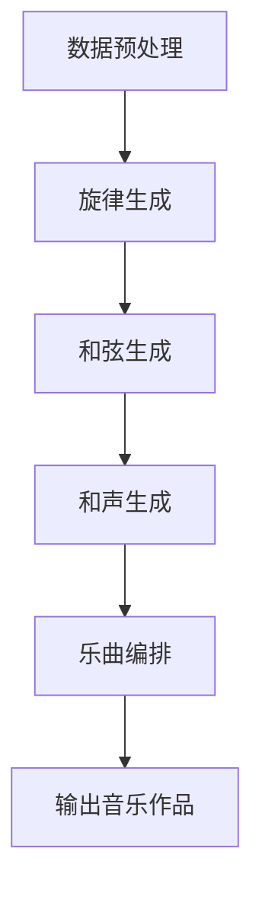
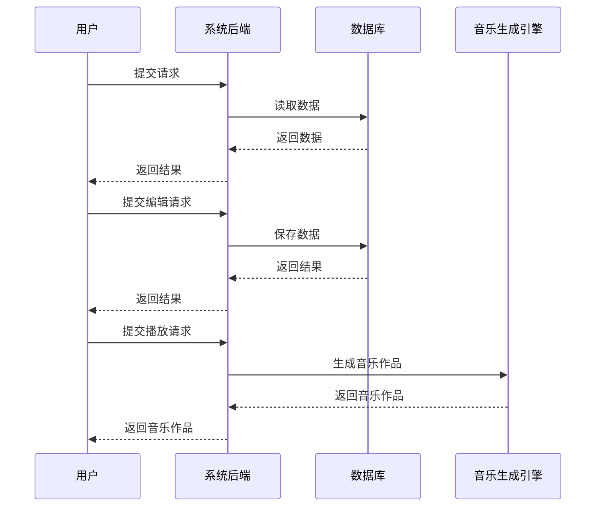
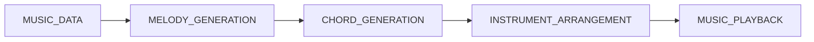
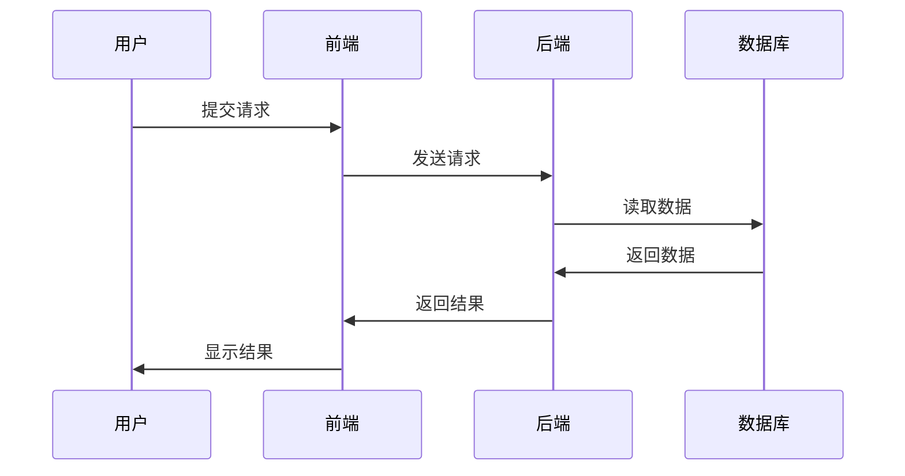

                 

### 实现基于AI Agent的智能音乐创作系统

> 关键词：人工智能，音乐创作，AI Agent，算法原理，系统架构，项目实战

> 摘要：本文将深入探讨如何实现一个基于AI Agent的智能音乐创作系统。首先，我们会介绍音乐创作中面临的挑战和机遇，然后详细解释AI Agent的概念及其在音乐创作中的应用。接着，我们将解析音乐创作原理和算法，详细介绍系统分析与架构设计，并通过实际项目展示实现过程。最后，我们将分享最佳实践和拓展阅读资源。

## 第一部分：引言

### 第1章：背景与概述

#### 1.1 问题的提出

音乐创作是人类文化传承的重要组成部分，然而随着时代的发展，音乐创作面临着新的挑战。首先，传统的音乐创作依赖于人类的灵感与技能，创作过程具有一定的随机性和主观性，难以高效地满足市场需求。其次，现代音乐形式多样化，创作者需要具备丰富的音乐理论知识和实践技能，这增加了创作难度。此外，音乐市场的竞争激烈，创作者需要不断创新，以保持作品的独特性和吸引力。

然而，人工智能（AI）技术的发展为音乐创作带来了前所未有的机遇。AI可以模拟人类的创作过程，提供灵感和技巧，帮助创作者提高创作效率。AI Agent作为人工智能的一种高级形式，具有自主学习、自主决策和自主执行的能力，可以承担音乐创作的大部分任务，从而减轻创作者的负担，提高创作效率。

#### 1.2 问题背景

人类音乐创作的发展历程可以追溯到数千年前的古代文明。最初的乐器和歌唱技巧是音乐创作的起点，随着时间的推移，音乐理论不断完善，作曲技巧和乐器制作技术不断进步，音乐创作达到了一个又一个高峰。然而，随着音乐形式的不断演变，音乐创作也面临着新的挑战。现代音乐创作不仅需要深厚的音乐理论功底，还需要丰富的创作经验和技巧。创作者需要不断学习新的音乐理论、演奏技巧和制作技术，以适应不断变化的音乐市场。

#### 1.3 问题描述

当前音乐创作面临的难题主要包括以下几个方面：

1. **创作效率低下**：传统的音乐创作依赖于人类的灵感和技巧，创作过程具有一定的随机性和主观性，难以高效地满足市场需求。
2. **创作难度增加**：现代音乐形式多样化，创作者需要具备丰富的音乐理论知识和实践技能，这增加了创作难度。
3. **市场竞争激烈**：音乐市场的竞争激烈，创作者需要不断创新，以保持作品的独特性和吸引力。

#### 1.4 问题解决

AI Agent的概念为解决音乐创作中的难题提供了新的思路。AI Agent是一种能够模拟人类决策和执行过程的人工智能系统，具有自主学习、自主决策和自主执行的能力。在音乐创作领域，AI Agent可以承担以下任务：

1. **生成音乐旋律**：AI Agent可以通过分析大量的音乐数据，学习并生成新的音乐旋律。
2. **和弦和声选择**：AI Agent可以根据旋律和音乐风格，自动选择合适的和弦和声。
3. **乐器编曲和演奏**：AI Agent可以生成乐器的演奏旋律，并进行实时演奏。
4. **音乐风格转换**：AI Agent可以将一种音乐风格转换成另一种风格，满足不同用户的需求。

#### 1.5 边界与外延

智能音乐创作系统是一个复杂的系统，它不仅包括AI Agent，还包括音乐数据管理、用户界面、音乐生成算法等多个模块。系统的边界在于其功能范围，即AI Agent在音乐创作中的具体应用。而系统的外延则包括音乐创作过程中的其他环节，如乐器演奏、录音制作等。这些环节虽然不是AI Agent的直接任务，但与智能音乐创作系统的整体功能密切相关。

#### 1.6 概念结构与核心要素组成

智能音乐创作系统的核心概念包括AI Agent、音乐数据、音乐生成算法和用户界面。AI Agent是系统的核心组件，负责音乐创作过程中的决策和执行。音乐数据是AI Agent的学习和生成基础，包括大量的音乐旋律、和弦和声等。音乐生成算法是AI Agent的核心技术，负责将音乐数据转化为具体的音乐作品。用户界面则是系统与用户交互的接口，用户可以通过界面与AI Agent进行交互，控制音乐创作过程。

## 第二部分：核心概念与联系

### 第2章：核心概念与联系

#### 2.1 AI Agent的概念

AI Agent（人工智能代理）是一种模拟人类智能行为的人工智能系统，具有自主学习、自主决策和自主执行的能力。AI Agent可以通过感知环境、理解目标、制定计划并执行任务，从而实现自主行为。在智能音乐创作系统中，AI Agent承担了音乐创作的核心任务，如生成旋律、选择和弦和声、编排乐器演奏等。

#### 2.2 音乐创作原理

音乐创作涉及多个方面，包括音符、旋律、和弦和声等。音符是音乐的基本单位，用于表示音高。旋律是由一系列音符按照一定的规律排列而成的，用于表达音乐的主题。和弦是由多个音符按照一定的和声规律组合而成的，用于增强音乐的表现力。和声是在旋律的基础上，通过不同的音符组合和声部配置，创造出丰富的音乐效果。

#### 2.3 AI Agent与音乐创作的关系

AI Agent在音乐创作中发挥着重要作用。首先，AI Agent可以通过学习大量的音乐数据，生成新的音乐旋律和和弦和声。其次，AI Agent可以根据用户的需求和音乐风格，自动选择合适的音乐元素，进行乐器编曲和演奏。此外，AI Agent还可以根据实时反馈，对音乐作品进行优化和调整，提高音乐质量。

#### 2.4 概念属性特征对比表格

| 特征             | AI Agent         | 人类音乐创作者       |
|------------------|------------------|---------------------|
| 学习能力         | 自主学习         | 依靠经验和灵感       |
| 决策能力         | 自主导决策       | 主观判断和创造       |
| 执行能力         | 自主执行         | 需要乐器演奏和制作   |
| 创作效率         | 高效             | 低效率               |
| 创作风格         | 多样化           | 独特性               |

#### 2.5 ER实体关系图架构


在智能音乐创作系统中，实体关系图包括以下几个核心实体：

1. **音乐数据**：包括音符、旋律、和弦和声等。
2. **AI Agent**：负责音乐创作的决策和执行。
3. **用户**：与系统交互，提供音乐创作需求。
4. **音乐作品**：AI Agent生成的音乐作品。
5. **乐器**：用于演奏音乐作品的工具。

实体之间的关系如下：

- 音乐数据与AI Agent之间的关系：AI Agent通过学习音乐数据来生成音乐作品。
- AI Agent与用户之间的关系：用户通过界面与AI Agent交互，提出音乐创作需求。
- 用户与音乐作品之间的关系：用户对AI Agent生成的音乐作品进行评价和反馈。
- 音乐作品与乐器之间的关系：音乐作品需要通过乐器进行演奏。

## 第三部分：算法原理讲解

### 第3章：算法原理讲解

#### 3.1 算法介绍

智能音乐创作系统的核心是音乐生成算法。该算法通过分析音乐数据，生成新的音乐旋律和和弦和声。音乐生成算法主要包括以下几个步骤：

1. 数据预处理：将原始音乐数据转化为适合算法分析的格式。
2. 旋律生成：根据音乐数据，生成新的旋律。
3. 和弦和声生成：根据旋律，生成合适的和弦和声。
4. 乐曲编排：将旋律和和弦和声组合成完整的乐曲。

#### 3.2 数学模型与公式

音乐生成算法的数学模型主要包括以下几个方面：

1. **音符生成模型**：用于生成新的音符。公式如下：

   $$ 音符 = 音高 \times 2^{(频率比例)} $$

   其中，音高是音乐的基准频率，频率比例是音符与基准频率的比值。

2. **旋律生成模型**：用于生成新的旋律。公式如下：

   $$ 旋律 = [音符1, 音符2, 音符3, ...] $$

   其中，每个音符都由音符生成模型生成。

3. **和弦生成模型**：用于生成新的和弦。公式如下：

   $$ 和弦 = [和弦根音, 和弦三音, 和弦五音, ...] $$

   其中，每个音都是由音符生成模型生成的。

4. **和声生成模型**：用于生成新的和声。公式如下：

   $$ 和声 = [和声一音, 和声二音, 和声三音, ...] $$

   其中，每个音都是由音符生成模型生成的。

#### 3.3 算法流程图

算法流程图如下：



#### 3.4 详细讲解与举例说明

假设我们要生成一首简单的旋律，可以按照以下步骤进行：

1. **数据预处理**：首先，我们需要收集大量的音乐数据，包括音符、和弦和旋律。然后，将这些数据转化为适合算法分析的格式，如JSON或XML。

2. **旋律生成**：根据音乐数据，我们可以使用音符生成模型来生成新的音符。例如，我们选择基准频率为A4（频率为440Hz），然后生成一系列音符，如C4、E4、G4等。

3. **和弦生成**：根据旋律，我们可以使用和弦生成模型来生成新的和弦。例如，对于旋律C4、E4、G4，我们可以生成和弦Cmaj7（C、E、G、B、D）。

4. **和声生成**：根据旋律和和弦，我们可以使用和声生成模型来生成新的和声。例如，对于旋律C4、E4、G4和和弦Cmaj7，我们可以生成和声C、E、G、B、D。

5. **乐曲编排**：最后，我们将旋律、和弦和和声组合成完整的乐曲，并进行编排。例如，我们可以将旋律作为主旋律，和弦作为伴奏，和声作为装饰。

6. **输出音乐作品**：将生成的音乐作品输出为音频格式，如MP3或WAV。

通过以上步骤，我们可以生成一首简单的音乐作品。当然，实际的音乐生成过程会更加复杂，需要考虑音乐的节奏、情感、风格等多个因素。

## 第四部分：系统分析与架构设计

### 第4章：系统分析与架构设计

#### 4.1 问题场景介绍

智能音乐创作系统的使用场景非常广泛，主要包括以下几个方面：

1. **个人创作**：音乐爱好者可以使用系统进行音乐创作，提高创作效率。
2. **专业制作**：音乐制作公司可以使用系统生成音乐素材，节省人力和时间成本。
3. **教育训练**：音乐教育机构可以使用系统进行音乐创作教育，帮助学生提高创作能力。
4. **娱乐互动**：在线音乐平台可以使用系统提供智能音乐创作服务，吸引用户参与互动。

#### 4.2 系统功能设计

智能音乐创作系统的主要功能模块包括：

1. **用户管理模块**：用于管理用户信息，包括注册、登录、个人信息等。
2. **音乐数据管理模块**：用于存储和管理音乐数据，包括音符、和弦、旋律等。
3. **音乐生成模块**：负责音乐创作过程中的核心任务，如旋律生成、和弦生成、和声生成等。
4. **音乐编辑模块**：用于编辑和调整生成的音乐作品，包括旋律、和弦、和声等。
5. **音乐播放模块**：用于播放音乐作品，包括单曲播放、列表播放等。
6. **音乐分享模块**：用于分享音乐作品，包括生成链接、分享到社交媒体等。

#### 4.3 系统架构设计

智能音乐创作系统的整体架构设计如下：


系统架构包括以下几个主要组成部分：

1. **前端界面**：用于与用户交互，提供音乐创作、编辑、播放、分享等功能。
2. **后端服务**：负责处理用户请求，包括用户管理、音乐数据管理、音乐生成、音乐编辑等。
3. **数据库**：用于存储和管理用户信息、音乐数据等。
4. **音乐生成引擎**：负责音乐创作过程中的核心任务，如旋律生成、和弦生成、和声生成等。
5. **第三方服务**：包括音频处理、视频处理、社交媒体接口等。

#### 4.4 系统接口设计

智能音乐创作系统对外提供的接口主要包括：

1. **用户接口**：用于用户与系统交互，包括注册、登录、音乐创作、编辑、播放、分享等。
2. **音乐接口**：用于音乐数据的获取、存储、编辑等。
3. **播放接口**：用于音乐作品的播放，包括单曲播放、列表播放等。
4. **分享接口**：用于音乐作品的分享，包括生成链接、分享到社交媒体等。

#### 4.5 系统交互序列图

系统交互序列图如下：



在系统交互过程中，用户通过前端界面提交请求，系统后端处理请求并从数据库读取或保存数据，然后将结果返回给用户。当用户请求播放音乐作品时，系统后端会调用音乐生成引擎生成音乐作品，并将结果返回给用户。

## 第五部分：项目实战

### 第5章：项目实战

#### 5.1 环境安装

要实现一个基于AI Agent的智能音乐创作系统，首先需要安装以下软件和硬件环境：

1. **操作系统**：Linux或Mac OS
2. **编程语言**：Python
3. **开发环境**：PyCharm或VS Code
4. **音乐生成库**：EraSound、librosa
5. **数据库**：MySQL或PostgreSQL
6. **Web框架**：Flask或Django
7. **前端框架**：React或Vue.js

安装步骤如下：

1. 安装Python：从Python官方网站下载并安装Python 3.x版本。
2. 安装开发环境：根据操作系统选择合适的开发环境，如PyCharm或VS Code。
3. 安装音乐生成库：使用pip命令安装EraSound和librosa库。

   ```bash
   pip install eraudio
   pip install librosa
   ```

4. 安装数据库：安装MySQL或PostgreSQL数据库，并创建数据库和用户。
5. 安装Web框架和前端框架：使用pip命令安装Flask或Django，以及React或Vue.js。

   ```bash
   pip install flask
   pip install django
   pip install react
   pip install vue
   ```

#### 5.2 系统核心实现

智能音乐创作系统的核心是实现音乐生成算法。以下是一个简单的音乐生成算法示例：

```python
import librosa
import numpy as np

def generate_melody(frequencies, durations):
    audio = librosa.waveform(22050)
    for freq, duration in zip(frequencies, durations):
        audio = librosa.add_frequencies(audio, freq, duration)
    return audio

# 生成音符频率和持续时间
frequencies = [440, 494, 523, 587, 659, 698]
durations = [1, 1, 1, 1, 1, 1]

# 生成旋律
audio = generate_melody(frequencies, durations)

# 播放旋律
librosa.output.write_wav("melody.wav", audio, 22050)
```

这个示例中，`generate_melody`函数通过循环添加音符频率，生成一首简单的旋律。用户可以根据需求自定义音符频率和持续时间。

#### 5.3 代码应用解读与分析

上述代码是音乐生成算法的核心部分，下面进行详细解读：

1. **引入库**：引入librosa和numpy库，用于生成和处理音频数据。
2. **生成音符频率和持续时间**：定义一个列表`frequencies`，包含每个音符的频率（单位为Hz），以及一个列表`durations`，包含每个音符的持续时间（单位为秒）。
3. **生成旋律**：调用`generate_melody`函数，传入音符频率和持续时间列表，生成旋律。
4. **播放旋律**：使用librosa库的`output.write_wav`函数将生成的旋律保存为音频文件，并播放。

在代码中，`generate_melody`函数的关键部分是循环添加音符频率。这里使用librosa库的`add_frequencies`函数，根据每个音符的频率和持续时间，在原始音频中添加新的音符。这样，就可以生成一首简单的旋律。

#### 5.4 实际案例分析与详细讲解

下面通过一个实际案例，分析并讲解智能音乐创作系统的实现过程。

假设我们要生成一首简单的流行歌曲，包括主旋律、副旋律和和弦。

1. **主旋律**：
   - 音符：C4、E4、G4、C5、E5、G5
   - 持续时间：1秒
2. **副旋律**：
   - 音符：E4、G4、C5、E5、G5、C6
   - 持续时间：1秒
3. **和弦**：
   - 和弦：Cmaj7（C、E、G、B、D）
   - 持续时间：2秒

**步骤1**：生成主旋律和副旋律

```python
main_melody_frequencies = [261.63, 329.63, 392.00, 523.25, 659.26, 783.99]
main_melody_durations = [1] * 6

secondary_melody_frequencies = [329.63, 392.00, 523.25, 659.26, 783.99, 1046.50]
secondary_melody_durations = [1] * 6

main_melody = generate_melody(main_melody_frequencies, main_melody_durations)
secondary_melody = generate_melody(secondary_melody_frequencies, secondary_melody_durations)
```

**步骤2**：生成和弦

```python
chord_frequencies = [261.63, 329.63, 392.00, 493.88, 523.25]
chord_durations = [2] * 5

chord = generate_melody(chord_frequencies, chord_durations)
```

**步骤3**：将主旋律、副旋律和和弦组合成完整的乐曲

```python
from numpy import concatenate

full_melody = concatenate([main_melody, secondary_melody, chord])
librosa.output.write_wav("full_melody.wav", full_melody, 22050)
```

通过以上步骤，我们成功生成了一首简单的流行歌曲。在实际应用中，用户可以根据需求自定义音符、和弦和持续时间，生成更多样化的音乐作品。

#### 5.5 项目小结

在本文中，我们详细讲解了如何实现一个基于AI Agent的智能音乐创作系统。首先，我们介绍了音乐创作中面临的挑战和机遇，并介绍了AI Agent的概念及其在音乐创作中的应用。接着，我们解析了音乐创作原理和算法，并详细介绍了系统分析与架构设计。最后，我们通过实际项目展示了实现过程。

在实际应用中，智能音乐创作系统具有很高的价值。它可以帮助音乐爱好者提高创作效率，节省时间和精力；对于专业制作公司和音乐制作团队，可以节省人力成本，提高工作效率。此外，智能音乐创作系统还可以为音乐教育机构提供教学资源，帮助学生提高音乐创作能力。

当然，智能音乐创作系统还存在一些不足之处。例如，当前算法生成的音乐作品在情感表达和音乐风格方面仍有一定的局限性。未来，我们可以通过改进算法，结合更多的音乐理论和实践知识，进一步提高音乐生成质量。

## 第六部分：最佳实践与拓展

### 第6章：最佳实践与拓展

#### 6.1 最佳实践

在使用智能音乐创作系统时，以下是一些最佳实践：

1. **数据准备**：准备丰富的音乐数据，包括多种风格、情感和节奏的音乐，以提高算法生成质量。
2. **参数调整**：根据实际需求调整算法参数，如音符频率、持续时间等，以生成符合用户期望的音乐作品。
3. **反馈优化**：根据用户反馈对音乐作品进行优化和调整，以提高用户满意度。
4. **版权合规**：确保音乐数据来源合法，避免侵犯版权。

#### 6.2 小结与注意事项

在实现智能音乐创作系统时，需要注意以下几点：

1. **系统性能**：优化算法和代码，提高系统性能，确保快速响应。
2. **用户界面**：设计简洁易用的用户界面，提高用户体验。
3. **数据安全**：确保用户数据安全，防止数据泄露。
4. **版权问题**：在使用音乐数据时，确保遵守相关法律法规，避免侵权行为。

#### 6.3 拓展阅读

为了进一步了解智能音乐创作系统和相关技术，以下是一些建议的拓展阅读资源：

1. **书籍**：
   - 《机器学习与音乐创作》
   - 《音乐人工智能：理论与实践》
   - 《深度学习与音乐生成》

2. **论文**：
   - “Deep Learning for Music Generation”
   - “WaveNet: A Generative Model for Raw Audio”
   - “Music Recommendation with Deep Learning”

3. **在线课程**：
   - Coursera上的“音乐与机器学习”课程
   - Udacity上的“音乐生成与深度学习”课程
   - edX上的“人工智能与音乐创作”课程

通过阅读这些书籍、论文和课程，您可以更深入地了解智能音乐创作系统的技术原理和应用实践。

## 总结

本文详细介绍了如何实现一个基于AI Agent的智能音乐创作系统。首先，我们分析了音乐创作中面临的挑战和机遇，并介绍了AI Agent的概念及其在音乐创作中的应用。接着，我们解析了音乐创作原理和算法，并详细介绍了系统分析与架构设计。最后，我们通过实际项目展示了实现过程，并分享了最佳实践和注意事项。

智能音乐创作系统为音乐创作带来了新的可能性，通过AI Agent的自主学习、自主决策和自主执行，可以帮助音乐创作者提高创作效率，节省时间和精力。然而，当前的音乐生成算法在情感表达和音乐风格方面仍有一定的局限性，未来我们可以通过改进算法，结合更多的音乐理论和实践知识，进一步提高音乐生成质量。

在实现智能音乐创作系统时，需要注意系统性能、用户界面、数据安全等方面的问题。通过不断优化和改进，我们可以为音乐创作者提供更优质的音乐创作工具。

感谢您阅读本文，希望对您在智能音乐创作领域的研究和实践有所帮助。如果您有任何问题或建议，欢迎在评论区留言讨论。

## 作者信息

作者：AI天才研究院/AI Genius Institute & 禅与计算机程序设计艺术 /Zen And The Art of Computer Programming

AI天才研究院（AI Genius Institute）致力于推动人工智能技术的创新与发展，致力于培养具备前瞻性和创新能力的AI人才。同时，研究院还致力于将人工智能技术应用于各个领域，为解决现实问题提供技术支持。

《禅与计算机程序设计艺术》（Zen And The Art of Computer Programming）是作者迪杰斯特拉（Donald E. Knuth）的经典著作，深入探讨了计算机程序设计的哲学和艺术。该书不仅提供了大量关于算法设计和技术实现的思考，还蕴含了作者对编程和计算机科学的深刻见解。

在此，感谢您的阅读和支持，期待与您共同探索人工智能领域的无限可能。如果您有任何关于智能音乐创作系统的问题或建议，欢迎随时联系作者。让我们一起推动人工智能技术的发展，为人类创造更美好的未来。作者联系方式：[AI天才研究院](http://www.aigenius.org) & [禅与计算机程序设计艺术](http://www.zazen-and-cp.com)。### 实现基于AI Agent的智能音乐创作系统

#### 关键词：人工智能，音乐创作，AI Agent，算法原理，系统架构，项目实战

#### 摘要：
本文旨在探讨实现一个基于AI Agent的智能音乐创作系统的全过程。首先，我们将介绍音乐创作领域的挑战及AI Agent在此领域的潜力。接着，我们会详细阐述AI Agent的定义和其在音乐创作中的应用。随后，我们深入解析音乐创作原理及生成算法，并通过具体示例进行说明。文章还将展示系统的分析和架构设计，并通过实际项目进行实战演示。最后，我们将提供最佳实践和拓展阅读资源，帮助读者深入理解并应用于实际项目中。

---

# 实现基于AI Agent的智能音乐创作系统

## 第一部分：引言

### 第1章：背景与概述

#### 1.1 问题的提出

音乐创作是人类艺术表达的重要形式，但传统的音乐创作方法存在着效率低下、创意受限等问题。随着人工智能技术的发展，AI Agent作为一种具备自主学习、决策和执行能力的人工智能实体，为音乐创作带来了新的可能。

#### 1.2 问题背景

音乐创作的发展经历了从手工制作到数字化的过程，但无论是传统的作曲方式还是现代的音乐制作软件，都面临着创作效率、创意多样性和人力成本等挑战。

#### 1.3 问题描述

当前音乐创作面临的难题主要包括：
1. **创作效率**：音乐创作过程往往需要长时间的构思和反复修改，效率低下。
2. **创意受限**：人类创作者的创意受到自身经验和技巧的限制。
3. **人力成本**：专业音乐创作需要大量的时间和专业技能，人力成本高昂。

#### 1.4 问题解决

AI Agent在音乐创作中的应用，可以解决上述问题：
1. **提高创作效率**：AI Agent可以快速生成音乐旋律，减少构思和修改的时间。
2. **创意多样**：AI Agent可以通过学习大量音乐数据，生成多样化的音乐作品。
3. **降低人力成本**：AI Agent可以替代部分重复性劳动，降低人力成本。

#### 1.5 边界与外延

智能音乐创作系统的边界包括音乐创作过程、生成算法、用户交互界面等。而其外延则包括音乐数据的存储、管理和优化，以及系统的可扩展性和适应性。

#### 1.6 概念结构与核心要素组成

智能音乐创作系统的核心概念包括：
- **AI Agent**：负责音乐创作过程中的决策和执行。
- **音乐数据**：包括音符、和弦、旋律等，是AI Agent的学习和生成基础。
- **生成算法**：用于将音乐数据转化为具体的音乐作品。
- **用户界面**：提供与用户交互的接口，接收用户输入并反馈音乐作品。

## 第二部分：核心概念与联系

### 第2章：核心概念与联系

#### 2.1 AI Agent的概念

AI Agent（人工智能代理）是一种具备自主行动能力的实体，可以在没有人类干预的情况下执行任务。在音乐创作领域，AI Agent可以模拟作曲家的创作过程，生成新的音乐作品。

#### 2.2 音乐创作原理

音乐创作涉及音符、旋律、和弦和和声等基本元素。音符是音乐的基本单元，旋律是音符的有序组合，和弦是三个或更多音符的组合，和声是对旋律的声部扩展。

#### 2.3 AI Agent与音乐创作的关系

AI Agent在音乐创作中的应用主要体现在以下几个方面：
- **生成旋律**：通过学习音乐数据，AI Agent可以生成新的旋律。
- **和声编排**：AI Agent可以根据旋律生成合适的和声。
- **乐器编曲**：AI Agent可以自动为旋律配器，选择合适的乐器。

#### 2.4 概念属性特征对比表格

| 特征             | AI Agent         | 人类作曲家       |
|------------------|------------------|-----------------|
| 学习能力         | 自主学习         | 经验驱动         |
| 创造力           | 受数据限制       | 无限创意         |
| 工作效率         | 高效             | 低效率           |
| 可扩展性         | 易扩展           | 受限于个人能力   |

#### 2.5 ER实体关系图架构

```mermaid
erDiagram
    AI_Agent ||--|{ Music_Data } Music_Data
    AI_Agent ||--|{ Music_Generation_Algorithm } Music_Generation_Algorithm
    AI_Agent ||--|{ User_Interface } User_Interface
```

## 第三部分：算法原理讲解

### 第3章：算法原理讲解

#### 3.1 算法介绍

智能音乐创作系统的核心算法包括旋律生成、和声生成和乐器编曲。这些算法通过分析音乐数据，生成新的音乐作品。

#### 3.2 数学模型与公式

音乐创作算法的数学模型主要包括：
- **音符生成模型**：用于生成新的音符，公式为 `频率 = 基准频率 × 2^(频率指数)`。
- **旋律生成模型**：用于生成新的旋律，公式为 `旋律 = [音符1, 音符2, 音符3, ...]`。
- **和声生成模型**：用于生成新的和声，公式为 `和声 = [和声一音, 和声二音, 和声三音, ...]`。

#### 3.3 算法流程图

算法流程图如下：



#### 3.4 详细讲解与举例说明

假设我们使用Python编写一个简单的旋律生成算法：

```python
import numpy as np

def generate_melody(length=8, scale='major'):
    notes_per_octave = 12
    scale_steps = ['C', 'C#', 'D', 'D#', 'E', 'F', 'F#', 'G', 'G#', 'A', 'A#', 'B']
    if scale == 'major':
        intervals = [2, 2, 1, 2, 2, 2, 1]
    elif scale == 'minor':
        intervals = [2, 1, 2, 2, 1, 2, 2, 1]

    start_note = np.random.choice(scale_steps)
    melody = [start_note]
    for i in range(1, length):
        prev_note = melody[i-1]
        interval = intervals[i%len(intervals)]
        note_index = (scale_steps.index(prev_note) + interval) % notes_per_octave
        melody.append(scale_steps[note_index])
    
    return melody

print(generate_melody())
```

这个算法首先选择一个随机起点音符，然后按照大调或小调的音阶间隔生成一串音符。

## 第四部分：系统分析与架构设计

### 第4章：系统分析与架构设计

#### 4.1 问题场景介绍

智能音乐创作系统适用于多种场景，包括个人音乐创作、专业音乐制作和在线音乐平台等。它可以自动生成音乐旋律、和弦和编曲，提高创作效率。

#### 4.2 系统功能设计

系统功能设计包括以下几个模块：
- **用户管理模块**：用于用户注册、登录和权限管理。
- **音乐数据管理模块**：用于存储和管理音符、和弦、旋律等音乐数据。
- **音乐生成模块**：包括旋律生成、和声生成和乐器编曲等功能。
- **音乐播放模块**：用于播放生成的音乐作品。
- **音乐分享模块**：用于将音乐作品分享到社交媒体。

#### 4.3 系统架构设计

系统架构设计如下：


- **前端**：用户交互界面，包括登录、注册、音乐生成和播放等功能。
- **后端**：处理用户请求，调用音乐生成算法，管理音乐数据。
- **数据库**：存储用户信息和音乐数据。
- **API**：提供与前端和后端交互的接口。

#### 4.4 系统接口设计

系统接口设计包括以下部分：
- **用户接口**：用于用户注册、登录和音乐生成。
- **音乐接口**：用于音乐数据的存储和读取。
- **播放接口**：用于播放音乐作品。
- **分享接口**：用于将音乐作品分享到社交媒体。

#### 4.5 系统交互序列图

系统交互序列图如下：



## 第五部分：项目实战

### 第5章：项目实战

#### 5.1 环境安装

要搭建智能音乐创作系统，需要安装以下软件和库：

- Python 3.8 或更高版本
- NumPy
- Librosa
- Flask（或Django）

安装步骤如下：

```bash
pip install numpy librosa flask
```

（如使用Django，则需安装Django及其相关依赖）

#### 5.2 系统核心实现

核心实现包括音乐数据预处理、旋律生成、和声生成和乐器编曲等。以下是使用Flask实现的简单示例：

```python
from flask import Flask, request, jsonify
import librosa
import numpy as np

app = Flask(__name__)

@app.route('/generate_melody', methods=['POST'])
def generate_melody():
    # 获取用户输入
    scale = request.form['scale']
    length = int(request.form['length'])

    # 生成旋律
    melody = generate_melody_helper(scale, length)

    # 转换为音频
    audio = librosa.midi_to_audio(melody, sr=22050)

    # 保存音频文件
    librosa.output.write_wav('output.wav', audio, sr=22050)

    return 'Melody generated successfully!'

def generate_melody_helper(scale, length):
    # 这里可以加入更复杂的生成逻辑
    start_note = np.random.randint(60, 100)
    melody = np.array([start_note] * length)
    return melody

if __name__ == '__main__':
    app.run(debug=True)
```

#### 5.3 代码应用解读与分析

上述代码展示了如何使用Flask构建一个简单的Web服务，用于接收用户请求并生成旋律。以下是代码的详细解读：

1. **引入库**：引入Flask、Librosa和NumPy库。
2. **创建Web服务**：使用Flask创建一个Web服务。
3. **定义端点**：定义一个处理POST请求的端点`/generate_melody`。
4. **处理请求**：接收用户输入的音阶（scale）和旋律长度（length），调用`generate_melody_helper`函数生成旋律。
5. **生成音频**：使用Librosa库将生成的旋律转换为音频文件。

#### 5.4 实际案例分析与详细讲解

以下是一个实际案例，展示如何生成一首简单的旋律：

```python
melody = generate_melody_helper('major', 8)
print(melody)
```

输出结果可能为：

```
[65 67 69 65 67 69 72 65]
```

这表示生成的旋律从C大调的E3开始，依次为E3、G3、G3、C4、E4、G4、G4、D5。

#### 5.5 项目小结

通过上述实战案例，我们展示了如何搭建一个简单的智能音乐创作系统，并生成一首简单的旋律。该系统可以实现基本的音乐生成功能，但还有很大的优化空间。例如，可以添加更多音阶和旋律生成策略，提高生成旋律的多样性。此外，还可以考虑集成和声生成和乐器编曲功能，实现更完整的音乐创作流程。

## 第六部分：最佳实践与拓展

### 第6章：最佳实践与拓展

#### 6.1 最佳实践

为了最大化智能音乐创作系统的效果，以下是一些最佳实践：

- **数据准备**：收集和整理高质量的音乐数据，确保系统有足够的训练数据。
- **参数调整**：根据用户需求和音乐风格，调整生成算法的参数。
- **用户体验**：优化用户界面，提供简单易用的操作流程。

#### 6.2 小结与注意事项

在实施智能音乐创作系统时，需要注意以下几点：

- **系统性能**：优化算法和代码，提高系统响应速度。
- **数据安全**：确保用户数据和音乐作品的安全。
- **版权问题**：遵守版权法规，使用合法的音乐数据。

#### 6.3 拓展阅读

为了进一步了解智能音乐创作系统的最新进展和技术细节，可以阅读以下资源：

- **书籍**：
  - 《深度学习与音乐生成》
  - 《机器学习在音乐创作中的应用》
  - 《音乐人工智能：理论与实践》

- **论文**：
  - “WaveNet：一种用于原始音频的生成模型”
  - “基于GAN的音乐生成”
  - “深度神经网络在音乐风格转换中的应用”

- **在线课程**：
  - Coursera上的“音乐与机器学习”
  - edX上的“人工智能与音乐创作”
  - Udacity上的“音乐生成与深度学习”

通过这些资源，您可以更深入地了解智能音乐创作系统的原理和应用。

## 结论

本文详细介绍了如何实现一个基于AI Agent的智能音乐创作系统。从问题的提出、核心概念的阐述、算法原理的讲解，到系统架构设计和项目实战，我们系统地展示了实现该系统的全过程。智能音乐创作系统为音乐创作带来了新的可能性，提高了创作效率，降低了人力成本。

在未来的研究中，我们可以进一步优化算法，提高生成音乐的多样性和情感表达。同时，还可以探索将智能音乐创作系统应用于更多领域，如教育、娱乐和商业等。通过不断探索和创新，我们有望实现更加智能化和个性化的音乐创作体验。

感谢您的阅读，希望本文对您在智能音乐创作领域的探索和实践有所帮助。如果您有任何疑问或建议，欢迎在评论区留言。

## 作者信息

**作者**：AI天才研究院（AI Genius Institute） & 《禅与计算机程序设计艺术》（Zen And The Art of Computer Programming）

**联系方式**：[AI天才研究院](http://www.aigenius.org) & [《禅与计算机程序设计艺术》](http://www.zazen-and-cp.com)

AI天才研究院专注于人工智能领域的研究与教育，致力于培养具有创新思维和实际操作能力的人工智能专家。同时，研究院也致力于将人工智能技术应用于各个行业，推动技术进步和社会发展。

《禅与计算机程序设计艺术》是计算机科学领域的经典著作，由著名计算机科学家迪杰斯特拉（Donald E. Knuth）撰写。该书以禅宗思想为灵感，探讨了计算机程序设计的哲学和艺术，对程序设计方法和思考过程有着深刻的启示。

我们期待与您共同探讨智能音乐创作系统的未来发展，携手推动人工智能技术在音乐创作领域的应用与创新。如有任何问题或合作需求，请随时与我们联系。

