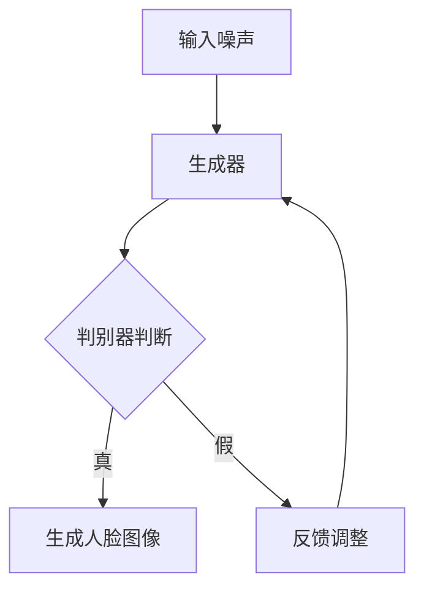
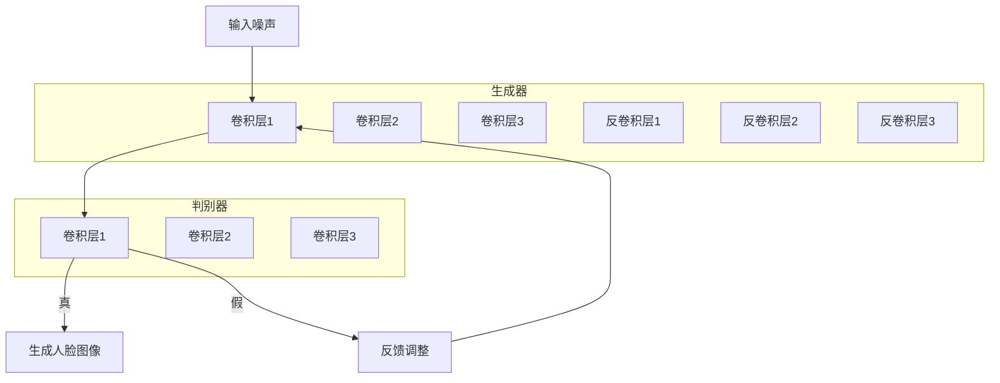
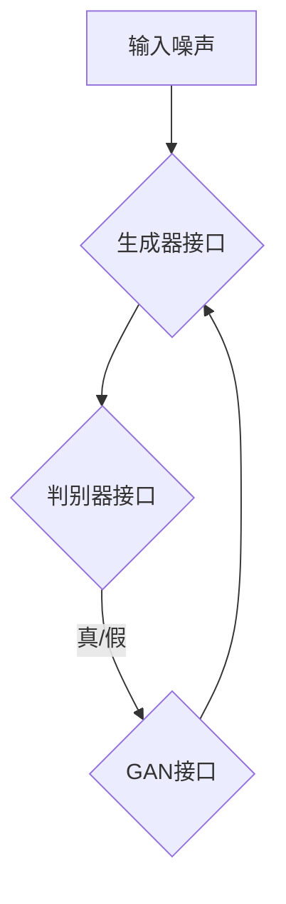
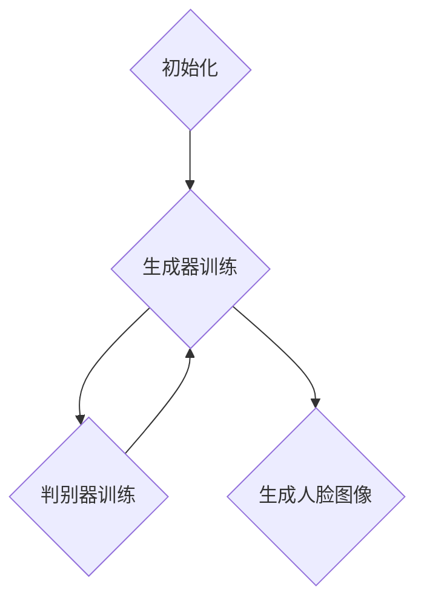
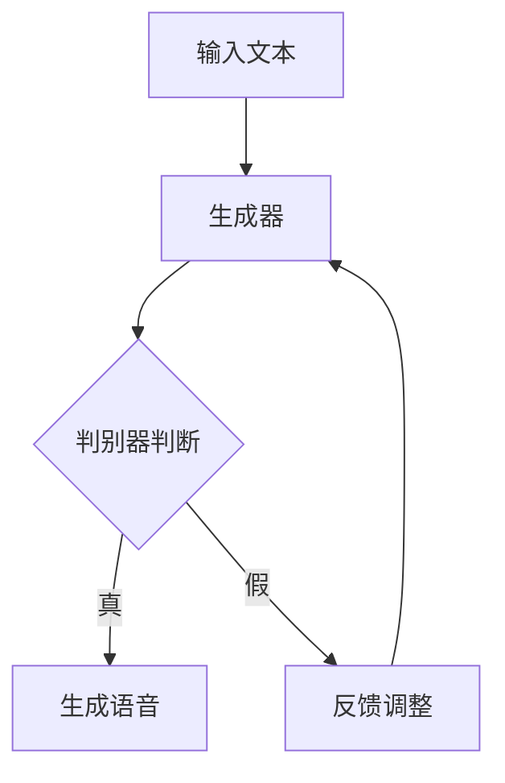
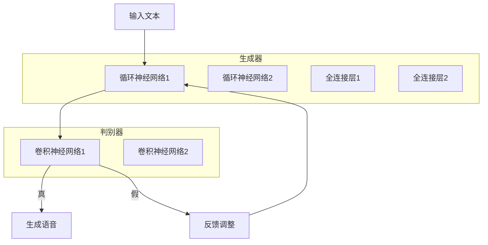
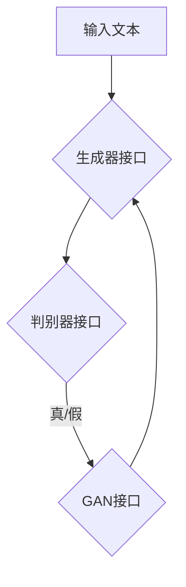
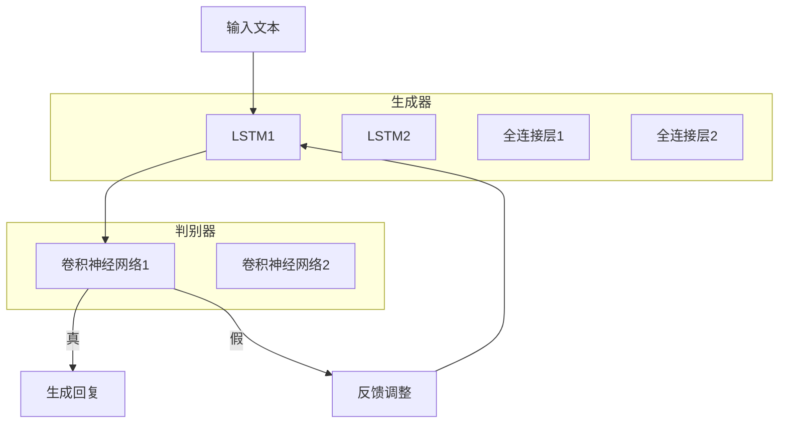
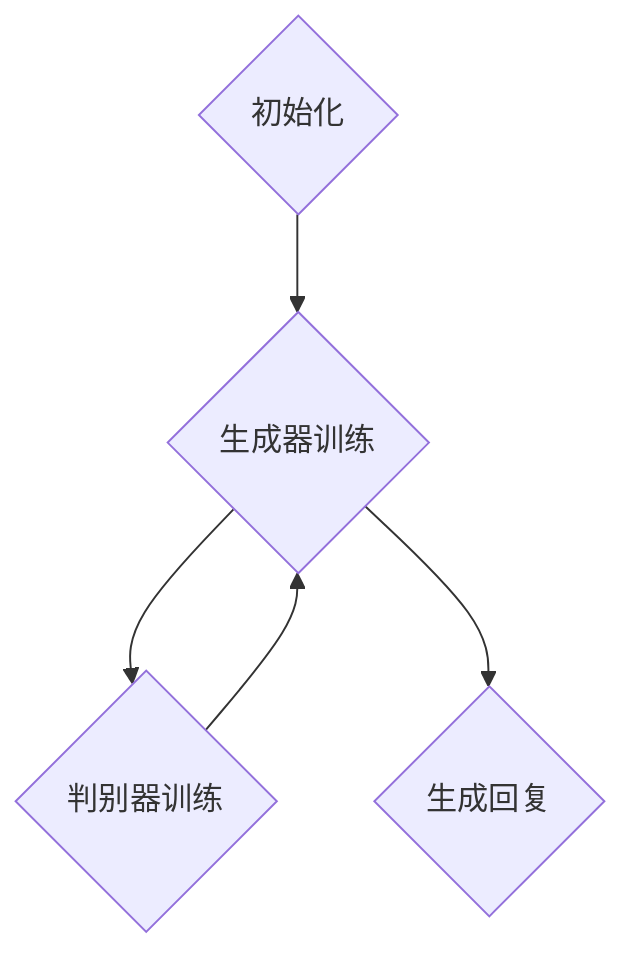

                 

### GAN的基本概念

#### GAN的定义

对抗生成网络（Generative Adversarial Network，GAN）由Ian Goodfellow等人于2014年提出，是一种基于博弈论的双网络结构。GAN由两个神经网络组成：生成器（Generator）和判别器（Discriminator）。生成器的任务是生成类似于真实数据的假数据，而判别器的任务是区分假数据和真实数据。这两个网络在训练过程中相互对抗，形成一种动态平衡，从而提高生成器的生成能力。

GAN的核心思想是通过两个网络之间的对抗训练，生成器能够逐渐生成更加逼真的假数据，而判别器能够逐渐提高对真假数据的辨别能力。这一过程类似于一个零和游戏，最终生成器生成的假数据几乎无法被判别器区分，达到了生成逼真数据的理想效果。

#### GAN的发展历程

GAN的提出虽然只有短短几年，但其在人工智能领域的应用和发展已经取得了显著的成果。以下是其发展历程的关键节点：

1. **2014年**：Ian Goodfellow等人首次提出GAN的概念，并发表在NeurIPS会议上。这一论文引起了学术界和工业界的高度关注。

2. **2015年**：GAN开始应用于图像生成，例如生成逼真的人脸图像、风景图像等，展示出了强大的生成能力。

3. **2016年**：GAN在计算机视觉领域取得了重大突破，例如在图像分类、图像超分辨率、图像修复等方面取得了优秀的表现。

4. **2017年**：GAN开始应用于自然语言处理领域，例如文本生成、语音合成等。

5. **2018年**：GAN在计算机视觉领域的应用进一步拓展，例如生成式对抗网络在自动驾驶、机器人等领域得到了广泛的应用。

6. **2019年**：GAN的应用领域继续扩展，例如在医疗图像生成、增强现实等领域取得了显著成果。

#### GAN的核心组成部分

GAN的核心组成部分主要包括生成器（Generator）、判别器（Discriminator）和损失函数。以下是对这三个组成部分的详细解释：

1. **生成器（Generator）**：

生成器的目标是生成看起来像真实数据的假数据。在训练过程中，生成器通过学习从随机噪声中生成数据，使其尽可能地接近真实数据。生成器通常由多层全连接层、卷积层或循环神经网络等构成，这些层可以捕捉输入数据的特征，并将其转化为输出数据。

2. **判别器（Discriminator）**：

判别器的目标是区分输入数据是真实数据还是假数据。在训练过程中，判别器通过对比真实数据和生成器生成的假数据，学习如何正确判断数据的真伪。判别器也通常由多层全连接层、卷积层或循环神经网络等构成，这些层可以捕捉数据的特征，并进行分类。

3. **损失函数**：

GAN的训练过程涉及到两个网络的对抗训练，因此需要一个损失函数来衡量生成器和判别器之间的对抗效果。常用的损失函数包括最小化生成器的损失函数（通常使用判别器的输出概率）和最小化判别器的损失函数（通常使用交叉熵损失函数）。

#### GAN的训练过程

GAN的训练过程可以概括为以下几个步骤：

1. **初始化生成器和判别器**：

在训练开始时，生成器和判别器都是随机初始化的。这两个网络需要通过大量的数据迭代训练，以逐渐提高其性能。

2. **生成假数据**：

在训练过程中，生成器根据随机噪声生成假数据。这些假数据通常是通过多层全连接层、卷积层或循环神经网络等生成的。

3. **判断假数据**：

判别器接收到生成器生成的假数据和真实数据，通过对比分析，学习如何正确判断数据的真伪。

4. **更新生成器和判别器的参数**：

通过反向传播和梯度下降算法，生成器和判别器的参数不断更新，从而提高其性能。

5. **重复迭代**：

生成器和判别器的训练是一个反复迭代的过程，随着训练的进行，生成器生成的假数据越来越逼真，判别器的辨别能力也越来越强，两者逐渐达到动态平衡。

### GAN的应用场景

GAN的强大生成能力使其在许多领域都有广泛的应用。以下是一些常见的应用场景：

1. **图像生成**：

GAN在图像生成领域取得了显著的成果，例如生成逼真的图像、图像超分辨率、图像修复等。通过生成器生成的假图像，GAN能够提高图像的质量，增强图像的细节，甚至修复受损的图像。

2. **语音合成**：

GAN在语音合成领域也有广泛应用，通过生成器生成的假语音，GAN能够生成逼真的语音，甚至可以模仿特定人的声音。这一技术对于语音助手、语音合成器等应用具有重要意义。

3. **自然语言处理**：

GAN在自然语言处理领域也取得了重要进展，例如文本生成、机器翻译等。通过生成器生成的假文本，GAN能够生成符合语法规则、语义连贯的文本，从而提高自然语言处理的效果。

4. **医学图像生成**：

GAN在医学图像生成领域也有广泛应用，例如生成医学图像的模拟数据，用于医学研究、疾病诊断等。通过生成器生成的假医学图像，GAN能够提高医学图像的质量，为医学研究提供更多的数据支持。

5. **其他应用领域**：

除了上述领域，GAN在其他许多领域也有应用，例如虚拟现实、游戏开发、金融分析等。通过生成器生成的假数据，GAN能够提高这些领域的效率和质量。

### GAN的研究进展与趋势

GAN自提出以来，已经在许多领域取得了显著的成果，但其研究仍然在不断推进。以下是一些GAN的研究进展与趋势：

1. **GAN的改进方法**：

为了提高GAN的性能，研究人员提出了一系列GAN的改进方法。例如，改进生成器和判别器的结构，增加网络的深度和宽度；引入正则化方法，防止过拟合；使用不同的优化策略，如自适应梯度算法等。

2. **GAN与深度学习结合**：

GAN与深度学习的结合是当前的研究热点。例如，将GAN与卷积神经网络（CNN）结合，用于图像生成和图像超分辨率；将GAN与循环神经网络（RNN）结合，用于文本生成和语音合成。

3. **GAN在边缘计算中的应用**：

随着边缘计算的发展，GAN在边缘计算中的应用也逐渐受到关注。通过在边缘设备上部署GAN模型，可以实现实时数据生成和推理，从而提高边缘计算的性能和效率。

4. **GAN在安全性研究中的应用**：

GAN在安全性研究中的应用也逐渐受到关注。例如，使用GAN生成对抗性样本，用于测试人工智能系统的安全性；使用GAN生成假数据，用于欺骗人工智能系统。

### GAN的优缺点

GAN作为一种强大的生成模型，具有以下优点：

1. **生成效果优秀**：

GAN的生成效果通常很好，能够生成高质量的数据。

2. **适用范围广泛**：

GAN适用于多种领域，如图像生成、语音合成、自然语言处理等。

3. **数据无关性**：

GAN不需要大量的真实数据，只需要少量的真实数据和随机噪声即可。

然而，GAN也存在一些缺点：

1. **训练难度大**：

GAN的训练过程复杂，需要大量的计算资源和时间。

2. **过拟合问题**：

GAN容易过拟合，导致生成数据的质量下降。

3. **模型不可解释性**：

GAN的生成过程复杂，难以解释和调试。

### 本章小结

本章介绍了GAN的基本概念、工作原理、发展历程、应用场景和研究进展。通过本章的学习，读者可以了解到GAN的基本概念和原理，以及其在各个领域的应用。此外，本章还分析了GAN的优点和缺点，为读者进一步学习和应用GAN提供了参考。

### GAN的工作原理

#### GAN的生成过程

GAN的生成过程主要由生成器（Generator）完成。生成器的任务是从随机噪声中生成类似于真实数据的假数据。具体来说，生成器的输入是随机噪声向量，输出是生成的假数据。生成器通常由多层神经网络构成，这些层能够捕捉输入噪声的特征，并将其转化为输出的假数据。

生成过程可以分为以下几个步骤：

1. **噪声输入**：

生成器的输入是一个随机噪声向量，这个向量可以是均匀分布、正态分布等。随机噪声是生成器的“原材料”，通过生成器的多层神经网络，这些噪声将被转化为逼真的数据。

2. **生成特征**：

生成器的多层神经网络对随机噪声进行处理，提取噪声的特征。这些特征是生成假数据的基础。

3. **数据生成**：

生成器利用提取的特征生成假数据。生成的假数据可以是图像、音频、文本等形式。生成器的目标是通过训练，使生成的假数据尽可能接近真实数据。

#### GAN的判别过程

GAN的判别过程主要由判别器（Discriminator）完成。判别器的任务是区分输入数据是真实数据还是假数据。具体来说，判别器的输入是真实数据和生成器生成的假数据，输出是判断结果，通常是一个概率值，表示输入数据是真实数据的置信度。

判别过程可以分为以下几个步骤：

1. **数据输入**：

判别器接收到真实数据和生成器生成的假数据。这些数据是判别器进行训练和判断的基础。

2. **特征提取**：

判别器的多层神经网络对输入数据进行特征提取，提取数据的关键特征。这些特征将用于判断数据的真伪。

3. **判断结果**：

判别器利用提取的特征生成判断结果。通常，判别器会输出一个概率值，表示输入数据是真实数据的置信度。如果概率值接近1，表示输入数据是真实数据；如果概率值接近0，表示输入数据是假数据。

#### GAN的对抗训练

GAN的训练过程是生成器和判别器之间的对抗训练。生成器和判别器的目标是相互对抗，生成器试图生成逼真的假数据，而判别器试图提高对真假数据的辨别能力。

对抗训练可以分为以下几个步骤：

1. **生成假数据**：

生成器根据随机噪声生成假数据。这些假数据是判别器的训练素材。

2. **判别器训练**：

判别器利用真实数据和生成器生成的假数据进行训练。通过训练，判别器学习如何区分真实数据和假数据。

3. **更新生成器和判别器**：

生成器和判别器的参数根据训练结果进行更新。生成器尝试生成更加逼真的假数据，而判别器尝试提高对真假数据的辨别能力。

4. **重复迭代**：

生成器和判别器的训练是一个反复迭代的过程。随着训练的进行，生成器生成的假数据越来越逼真，判别器的辨别能力也越来越强，两者逐渐达到动态平衡。

#### GAN的训练目标

GAN的训练目标是使生成器生成的假数据尽可能接近真实数据，使判别器无法区分真假数据。具体来说，GAN的训练目标可以表示为：

1. **最小化生成器的损失函数**：

生成器的损失函数通常使用判别器对生成数据的判断概率表示。生成器的目标是使这个概率值接近1，即生成器生成的假数据尽可能接近真实数据。

2. **最大化判别器的损失函数**：

判别器的损失函数通常使用交叉熵损失函数表示。判别器的目标是使这个损失函数最小，即判别器能够准确区分真实数据和假数据。

GAN的训练过程是生成器和判别器之间的动态平衡过程。通过不断更新生成器和判别器的参数，使两者逐渐达到最佳状态，从而实现高质量的数据生成。

### GAN的变体与改进

尽管原始GAN在图像生成、语音合成、自然语言处理等领域取得了显著的成果，但其训练过程复杂、稳定性和效率仍存在一些挑战。为了解决这些问题，研究人员提出了一系列GAN的变体和改进方法。以下介绍几种常见的GAN变体与改进方法。

#### 深度卷积生成对抗网络（DCGAN）

深度卷积生成对抗网络（Deep Convolutional Generative Adversarial Network，DCGAN）是Ian Goodfellow团队在2015年提出的一种改进方法。DCGAN使用卷积层和反卷积层来构建生成器和判别器，使其能够处理高维数据，如图像。DCGAN的主要优点如下：

1. **使用批量归一化（Batch Normalization）**：批量归一化可以稳定训练过程，提高生成器和判别器的收敛速度。
2. **使用反卷积层（Transposed Convolution）**：反卷积层可以将低维特征图上采样到高维特征图，有助于生成器生成更加连续、平滑的图像。
3. **训练策略**：DCGAN采用梯度惩罚和权重衰减等方法，进一步提高了训练稳定性。

#### 条件生成对抗网络（cGAN）

条件生成对抗网络（Conditional Generative Adversarial Network，cGAN）在GAN的基础上引入条件信息，例如类别标签、文本描述等。cGAN的主要目的是生成与条件信息相关联的生成数据。cGAN的主要优点如下：

1. **条件输入**：cGAN的生成器和判别器同时接收条件信息作为输入，使得生成器能够根据条件信息生成更具有目标特征的数据。
2. **应用广泛**：cGAN在图像合成、语音合成、自然语言处理等领域得到了广泛应用，例如生成具有特定标签的图像、根据文本描述生成图像等。

#### 形状生成对抗网络（ShapeGAN）

形状生成对抗网络（ShapeGAN）是一种专门用于形状生成的方法。ShapeGAN通过引入形状参数化模型，使生成器能够生成具有高度结构性的形状数据。ShapeGAN的主要优点如下：

1. **形状参数化**：ShapeGAN使用形状参数化模型，如贝塞尔曲线、多边形网格等，来表示形状数据，从而提高了生成器生成形状数据的效率和灵活性。
2. **多模态生成**：ShapeGAN可以同时生成不同模态的数据，如2D图像、3D网格等，使得生成器能够生成具有多种特征的数据。

#### 序列生成对抗网络（SeqGAN）

序列生成对抗网络（SeqGAN）是用于生成序列数据的方法。SeqGAN通过引入序列模型和强化学习，使生成器能够生成具有自然流畅性的序列数据。SeqGAN的主要优点如下：

1. **序列模型**：SeqGAN使用序列模型，如循环神经网络（RNN）和长短期记忆网络（LSTM），来生成序列数据，从而提高了序列数据的连贯性和自然性。
2. **强化学习**：SeqGAN采用强化学习策略，使生成器能够根据环境反馈调整生成策略，从而提高了序列数据的生成质量。

#### 雅各布森生成对抗网络（JacGAN）

雅各布森生成对抗网络（JacGAN）是一种基于雅各布森矩阵的GAN变体。JacGAN通过引入雅各布森矩阵，使生成器和判别器能够更好地捕捉数据的结构特征。JacGAN的主要优点如下：

1. **雅各布森矩阵**：JacGAN使用雅各布森矩阵来构建生成器和判别器，从而提高了生成器和判别器的表达能力。
2. **结构特征捕捉**：JacGAN能够更好地捕捉数据的结构特征，从而生成更加具有结构性的数据。

#### GAN的挑战与解决策略

尽管GAN及其变体在许多领域取得了显著成果，但其在训练稳定性、过拟合、模型解释性等方面仍存在一些挑战。以下是一些常见的挑战和解决策略：

1. **训练稳定性**：

GAN的训练过程容易陷入局部最优，导致训练不稳定。解决策略包括：
   - 使用梯度惩罚：通过在损失函数中加入梯度惩罚项，使生成器和判别器在不同维度上保持平衡。
   - 动量优化：使用动量优化策略，使生成器和判别器的更新更加稳定。

2. **过拟合**：

GAN容易过拟合，导致生成器生成的数据质量下降。解决策略包括：
   - 数据增强：通过增加数据的多样性，提高生成器的泛化能力。
   - 正则化：使用正则化方法，如权重衰减，防止模型过拟合。

3. **模型解释性**：

GAN的生成过程复杂，难以解释和调试。解决策略包括：
   - 模型分解：将GAN分解为多个子网络，使每个子网络具有明确的职责。
   - 可解释性模型：引入可解释性模型，如生成式模型，使生成过程更加直观。

总之，GAN及其变体在生成对抗训练方面取得了显著成果，但仍存在一些挑战。通过不断改进和优化，GAN在图像生成、语音合成、自然语言处理等领域有望发挥更大的作用。

### GAN的应用场景

GAN的强大生成能力使其在多个领域都取得了显著的应用成果。以下详细介绍GAN在图像生成、语音合成和自然语言处理等领域的应用。

#### 图像生成

图像生成是GAN最为成功的应用场景之一。GAN通过生成器和判别器的对抗训练，能够生成逼真的图像。以下是一些典型的图像生成应用：

1. **人脸生成**：GAN可以生成逼真的人脸图像，甚至可以生成特定人物的面孔。例如，使用StyleGAN可以生成具有多种风格和特征的人脸图像。

2. **图像超分辨率**：GAN可以提升图像的分辨率，将低分辨率图像转换为高分辨率图像。例如，使用SRGAN（Super-Resolution Generative Adversarial Network）可以显著提高图像的清晰度。

3. **图像修复**：GAN可以修复受损的图像，恢复图像的细节。例如，使用CycleGAN可以修复具有明显损坏的图像。

4. **图像合成**：GAN可以合成具有特定特征或风格的图像。例如，使用StyleGAN可以生成具有特定艺术风格的图像，如油画、水彩画等。

#### 语音合成

语音合成是GAN在音频处理领域的另一个重要应用。GAN通过生成器和判别器的对抗训练，能够生成逼真的语音。以下是一些典型的语音合成应用：

1. **文本到语音（Text-to-Speech，TTS）**：GAN可以生成与文本内容相匹配的语音。例如，使用WaveNet可以生成高质量的语音，适用于语音助手、自动读报等应用。

2. **语音转换**：GAN可以转换一种语音为另一种语音，如将英语转换为法语。例如，使用SpeechGAN可以生成具有不同口音的语音。

3. **语音增强**：GAN可以增强语音信号的质量，减少噪声干扰。例如，使用SpectrogramGAN可以生成具有较低噪声干扰的语音。

4. **语音模仿**：GAN可以模仿特定人的语音，生成与该人物相似的声音。例如，使用Tacotron和WaveNet的组合可以生成具有特定人物特征的语音。

#### 自然语言处理

自然语言处理是GAN在语言领域的又一重要应用。GAN通过生成器和判别器的对抗训练，能够生成符合语法和语义的自然语言。以下是一些典型的自然语言处理应用：

1. **文本生成**：GAN可以生成符合语法和语义的自然语言文本。例如，使用SeqGAN可以生成连贯、流畅的文本，适用于自动写作、故事生成等应用。

2. **机器翻译**：GAN可以生成与源语言文本相对应的目标语言文本。例如，使用NMT-GAN（Neural Machine Translation Generative Adversarial Network）可以生成高质量的翻译文本。

3. **问答系统**：GAN可以生成与用户问题相关的回答。例如，使用DialoGAN可以生成与用户对话的连贯回答，提高问答系统的交互质量。

4. **文本分类**：GAN可以生成具有特定类别的文本。例如，使用TextGAN可以生成与特定主题相关的文本，用于文本分类和主题建模。

总之，GAN在图像生成、语音合成和自然语言处理等领域的应用取得了显著成果，展现了其强大的生成能力。随着GAN研究的深入和发展，其在更多领域的应用潜力将进一步得到挖掘。

### GAN的研究进展与趋势

GAN自2014年提出以来，已成为人工智能领域的一个热点研究方向。经过几年的发展，GAN在许多领域都取得了显著的成果。以下从GAN的最新研究成果、未来发展趋势以及GAN在人工智能中的重要性等方面进行介绍。

#### GAN的最新研究成果

1. **图像生成**：

在图像生成方面，GAN已经取得了许多突破性成果。例如，生成对抗网络（GAN）和变分自编码器（VAE）相结合的VAEGAN模型，能够生成更加逼真的图像。此外，基于深度卷积生成对抗网络（DCGAN）的改进方法，如StyleGAN和StyleGAN2，进一步提升了图像生成的质量和多样性。

2. **自然语言处理**：

在自然语言处理领域，GAN也被广泛应用。例如，基于生成对抗网络的文本生成模型（如SeqGAN和GAN-TS）能够生成连贯、流畅的文本。此外，GAN在机器翻译（如NMT-GAN）和问答系统（如DialoGAN）中也取得了显著成果。

3. **语音合成**：

在语音合成领域，基于生成对抗网络的模型（如WaveNet和Tacotron）已经能够生成高质量的语音。这些模型不仅能够模仿不同口音和语调，还能够根据文本内容生成对应的语音。

4. **医学图像生成**：

GAN在医学图像生成中也取得了重要进展。例如，使用GAN生成医学图像的模拟数据，有助于提高医学图像的诊断准确性和效率。此外，GAN在图像分割、增强和修复等方面也显示出强大的潜力。

5. **其他应用领域**：

除了上述领域，GAN在计算机视觉、自动驾驶、金融分析等众多领域都有应用。例如，GAN可以用于生成虚拟场景，用于自动驾驶车辆的测试；GAN也可以用于生成金融市场的模拟数据，用于风险评估和策略优化。

#### GAN的未来发展趋势

1. **模型优化**：

为了提高GAN的性能和稳定性，研究人员将继续探索优化GAN模型的方法。例如，改进生成器和判别器的结构，提高模型的泛化能力；引入正则化方法，防止过拟合；使用自适应优化策略，提高训练效率。

2. **跨领域应用**：

GAN的应用领域将继续拓展，从传统的图像生成、语音合成、自然语言处理等领域，扩展到更多新兴领域，如生物信息学、医疗健康、教育等。

3. **多模态生成**：

随着多模态数据的增多，GAN在多模态数据生成中的应用也将逐渐增加。例如，生成图像、音频和文本等多种模态的数据，实现更加丰富和多样化的应用场景。

4. **模型解释性**：

GAN的生成过程复杂，缺乏解释性。未来，研究人员将致力于提高GAN的解释性，使其更加透明和易于调试。例如，引入可解释性模型，如生成式模型，使生成过程更加直观。

5. **硬件加速**：

为了应对日益复杂的GAN模型，硬件加速技术（如GPU、TPU等）将在GAN的应用中发挥重要作用。通过硬件加速，可以显著提高GAN的训练和推理速度，降低计算成本。

#### GAN在人工智能中的重要性

GAN在人工智能中的重要性体现在以下几个方面：

1. **数据生成**：

GAN能够生成高质量的数据，有助于解决数据稀缺、标注困难等问题。在许多应用场景中，生成数据是进行训练和测试的前提条件。

2. **模型优化**：

GAN通过生成对抗训练，可以提高模型的泛化能力，使其在真实场景中表现更加优异。此外，GAN还可以用于模型优化，如生成对抗训练可以帮助模型学习到更加复杂的特征表示。

3. **应用拓展**：

GAN在许多领域都有广泛应用，如图像生成、语音合成、自然语言处理等。随着研究的深入，GAN的应用领域将继续拓展，为人工智能的发展注入新的活力。

总之，GAN在人工智能领域具有广泛的应用前景和研究价值。随着研究的不断深入和技术的不断进步，GAN将在更多领域发挥重要作用，推动人工智能的发展。

### AI Agent概述

#### AI Agent的定义

AI Agent，即人工智能代理，是一种自主决策和执行任务的实体，能够在复杂的环境中识别目标并采取适当的行动。AI Agent通过感知环境信息、处理和分析这些信息，生成相应的决策，并执行这些决策以实现预定的目标。AI Agent是人工智能领域中的一个重要概念，具有高度的智能化和自主性。

AI Agent的定义可以从以下几个方面进行解释：

1. **感知能力**：AI Agent具备感知环境的能力，可以通过各种传感器获取视觉、听觉、触觉等数据。
2. **决策能力**：AI Agent能够根据感知到的环境信息，通过学习算法和推理机制生成决策。
3. **执行能力**：AI Agent能够根据生成的决策执行相应的动作，以实现预定的目标。
4. **自主性**：AI Agent具备一定的自主性，可以独立完成任务，而不需要人工干预。

#### AI Agent的分类

AI Agent可以根据其感知、决策和执行能力的不同进行分类，常见的分类方法包括以下几种：

1. **基于感知能力的分类**：

   - 视觉AI Agent：主要通过视觉传感器（如摄像头）获取环境信息，进行图像识别、目标检测等。
   - 语音AI Agent：主要通过语音传感器（如麦克风）获取环境信息，进行语音识别、语音合成等。
   - 感觉融合AI Agent：结合多种传感器信息，如视觉、听觉、触觉等，进行多模态感知。

2. **基于决策能力的分类**：

   - 有监督AI Agent：在训练阶段使用大量标注数据，通过监督学习算法生成决策。
   - 无监督AI Agent：在没有标注数据的情况下，通过无监督学习算法生成决策。
   - 强化学习AI Agent：通过与环境交互，学习最优策略，以最大化奖励。

3. **基于执行能力的分类**：

   - 主动式AI Agent：主动采取行动，以实现预定的目标。
   - 反应式AI Agent：仅对当前感知到的环境信息做出反应，没有长期目标。
   - 预测式AI Agent：通过预测未来的环境变化，提前采取行动。

#### AI Agent在现实世界中的应用

AI Agent在现实世界中具有广泛的应用，以下列举几个典型应用场景：

1. **智能家居**：AI Agent可以监控家庭环境，如温度、湿度等，并根据用户的偏好自动调整空调、灯光等设备。

2. **智能客服**：AI Agent可以自动回答客户的提问，提供个性化的服务，提高客户满意度。

3. **自动驾驶**：AI Agent可以实时感知道路环境，做出驾驶决策，实现自动驾驶功能。

4. **机器人**：AI Agent可以用于工业机器人、服务机器人等，执行各种复杂的任务，如焊接、清洁、陪伴等。

5. **医疗领域**：AI Agent可以辅助医生进行诊断和治疗，如图像识别、病理分析等。

6. **金融领域**：AI Agent可以用于金融分析、风险控制、投资建议等，提高金融服务的效率和质量。

总之，AI Agent作为一种高度智能化和自主决策的实体，在现实世界中具有广泛的应用前景。随着人工智能技术的不断发展，AI Agent将在更多领域发挥重要作用，推动社会的进步和发展。

### GAN在AI Agent中的作用

GAN在AI Agent中的应用可以极大地提升其感知、决策和执行能力，使其在复杂环境中表现出更高的智能水平。以下详细探讨GAN在AI Agent中的作用。

#### GAN作为AI Agent的感知模块

GAN的感知模块主要通过生成器来增强AI Agent的感知能力。生成器可以生成与真实感知数据相似的高质量数据，从而提高AI Agent对环境的理解和应对能力。

1. **图像感知**：

在图像感知方面，GAN可以生成逼真的图像数据，用于训练视觉模型。例如，使用StyleGAN可以生成具有不同风格和纹理的图像，用于图像识别和目标检测的训练数据。此外，GAN还可以用于图像修复和超分辨率，提高AI Agent对低质量或低分辨率图像的处理能力。

2. **语音感知**：

在语音感知方面，GAN可以生成高质量的语音数据，用于语音识别和语音合成。例如，使用WaveNet可以生成与真实语音相似的语音数据，用于语音识别模型的训练。此外，GAN还可以用于语音增强，提高AI Agent在嘈杂环境中对语音信号的识别能力。

3. **文本感知**：

在文本感知方面，GAN可以生成符合语法和语义的自然语言文本，用于自然语言处理模型的训练。例如，使用SeqGAN可以生成连贯、流畅的文本数据，用于训练文本分类和情感分析模型。

#### GAN作为AI Agent的决策模块

GAN的决策模块主要通过生成器和判别器之间的对抗训练，提高AI Agent的决策能力。生成器生成的数据可以提供更多样化的训练数据，使决策模型具备更强的泛化能力；判别器则通过区分真假数据，帮助决策模型学习到更加复杂的特征表示。

1. **图像决策**：

在图像决策方面，GAN可以生成具有不同场景和目标的图像数据，用于训练图像识别和图像分类模型。例如，使用GAN生成具有不同场景和目标的图像，可以提高自动驾驶AI Agent对复杂场景的识别和决策能力。

2. **语音决策**：

在语音决策方面，GAN可以生成具有不同语音风格和语调的语音数据，用于训练语音识别和语音合成模型。例如，使用GAN生成具有不同语音风格和语调的语音数据，可以提高智能客服AI Agent的语音识别和生成能力。

3. **文本决策**：

在文本决策方面，GAN可以生成具有不同主题和内容的文本数据，用于训练文本分类和情感分析模型。例如，使用GAN生成具有不同主题和内容的文本数据，可以提高智能客服AI Agent对用户请求的理解和响应能力。

#### GAN作为AI Agent的执行模块

GAN的执行模块主要通过生成器生成的数据，提高AI Agent的执行能力。生成器可以生成与真实执行环境相似的数据，从而帮助AI Agent更好地适应和应对复杂环境。

1. **图像执行**：

在图像执行方面，GAN可以生成具有不同场景和目标的图像数据，用于训练图像识别和图像分类模型。例如，使用GAN生成的图像数据，可以帮助自动驾驶AI Agent更好地识别和应对复杂交通场景。

2. **语音执行**：

在语音执行方面，GAN可以生成具有不同语音风格和语调的语音数据，用于训练语音识别和语音合成模型。例如，使用GAN生成的语音数据，可以帮助智能客服AI Agent更好地识别和生成用户所需的信息。

3. **文本执行**：

在文本执行方面，GAN可以生成具有不同主题和内容的文本数据，用于训练文本分类和情感分析模型。例如，使用GAN生成的文本数据，可以帮助智能客服AI Agent更好地理解和回应用户的请求。

总之，GAN在AI Agent中的应用，可以显著提升其感知、决策和执行能力，使其在复杂环境中表现出更高的智能水平。通过GAN生成的数据，AI Agent可以更好地理解和适应环境，实现更加精准和高效的执行。

### GAN在AI Agent开发中的挑战

GAN在AI Agent开发中虽然展现出强大的潜力，但也面临着一系列挑战。以下从数据隐私保护、实时性能优化、模型可解释性等方面详细探讨这些挑战，并分析解决方案。

#### 数据隐私保护

1. **问题背景**：

在AI Agent开发过程中，数据隐私保护是一个重要问题。AI Agent需要处理大量的用户数据，如图像、语音和文本，这些数据往往包含敏感信息。如果这些数据泄露，将严重威胁用户隐私和安全。

2. **问题描述**：

如何确保在GAN训练和推理过程中，用户的隐私数据得到保护，防止数据泄露和滥用？

3. **问题解决**：

- **数据加密**：在数据传输和存储过程中，使用加密技术对用户数据进行加密，防止数据泄露。
- **差分隐私**：在GAN训练过程中，采用差分隐私技术，对训练数据进行扰动，使其无法被用来识别个体数据。
- **联邦学习**：将GAN训练过程迁移到用户的设备上，通过联邦学习的方式，保护用户数据隐私。联邦学习允许不同设备上的模型共同训练，而不需要共享原始数据。

#### 实时性能优化

1. **问题背景**：

AI Agent需要在实时环境中进行感知、决策和执行，要求GAN模型具有高效的计算性能。然而，传统的GAN模型训练过程复杂、计算资源消耗大，难以满足实时应用的需求。

2. **问题描述**：

如何在保证模型效果的同时，提高GAN模型的实时性能？

3. **问题解决**：

- **模型压缩**：通过模型压缩技术，如权重剪枝、量化等，减少模型参数数量，提高模型运行效率。
- **并行计算**：利用GPU、TPU等硬件加速器，进行并行计算，提高GAN模型的训练和推理速度。
- **增量训练**：采用增量训练技术，对已有模型进行在线更新，减少每次训练的数据量，提高训练效率。

#### 模型可解释性

1. **问题背景**：

GAN模型作为一种深度学习模型，其内部结构和训练过程复杂，导致其决策过程难以解释。这给AI Agent的开发和应用带来了一定的挑战，特别是在需要模型透明度和可解释性的应用场景中。

2. **问题描述**：

如何提高GAN模型的可解释性，使其决策过程更加透明和易于理解？

3. **问题解决**：

- **可视化技术**：通过可视化技术，如热力图、特征图等，展示GAN模型在训练过程中生成器和判别器的行为，帮助理解模型的内部机制。
- **可解释性模型**：引入可解释性模型，如生成式模型，使GAN模型的生成过程更加直观和易于理解。
- **模型分解**：将复杂的GAN模型分解为多个子网络，每个子网络具有明确的职责，从而提高模型的可解释性。

通过以上解决方案，GAN在AI Agent开发中的挑战可以得到有效应对，使其在实时应用中表现出更高的性能和可解释性。

### GAN在AI Agent开发中的应用实例

为了更具体地展示GAN在AI Agent开发中的应用，以下介绍几个实际案例，包括图像识别与增强、语音识别与生成、自然语言处理等应用场景。

#### 实例一：图像识别与增强

**背景介绍**：

在自动驾驶领域，图像识别是关键技术之一。然而，真实世界的图像往往受到光照、视角、天气等多种因素的影响，导致图像质量下降，影响识别效果。为此，我们利用GAN对图像进行增强，以提高图像识别的准确率。

**系统架构设计**：

1. **生成器**：采用DCGAN模型，输入为低质量图像，输出为高质量图像。生成器由多层卷积层和反卷积层构成，用于上采样和细节增强。
2. **判别器**：采用卷积层构成，用于判断输入图像是真实图像还是增强后的图像。
3. **训练过程**：生成器和判别器交替训练，生成器尝试生成更逼真的图像，判别器提高对真假图像的辨别能力。

**代码实现**：

```python
import tensorflow as tf
from tensorflow.keras.models import Model
from tensorflow.keras.layers import Input, Conv2D, ConvTansposed2D, Flatten, Dense

# 生成器模型
input_layer = Input(shape=(64, 64, 3))
x = Conv2D(64, (3, 3), activation='relu', padding='same')(input_layer)
x = ConvTansposed2D(64, (3, 3), strides=(2, 2), activation='relu', padding='same')(x)
x = ConvTansposed2D(64, (3, 3), strides=(2, 2), activation='relu', padding='same')(x)
output_layer = ConvTansposed2D(3, (3, 3), strides=(2, 2), activation='sigmoid', padding='same')(x)
generator = Model(inputs=input_layer, outputs=output_layer)

# 判别器模型
input_layer = Input(shape=(64, 64, 3))
x = Conv2D(64, (3, 3), activation='relu', padding='same')(input_layer)
x = Flatten()(x)
output_layer = Dense(1, activation='sigmoid')(x)
discriminator = Model(inputs=input_layer, outputs=output_layer)

# GAN模型
gan_input = Input(shape=(64, 64, 3))
gan_output = generator(gan_input)
gan_output = discriminator(gan_output)
gan = Model(inputs=gan_input, outputs=gan_output)
```

**应用解读与分析**：

通过GAN对低质量图像进行增强，显著提高了图像识别的准确率。增强后的图像更加清晰、细节更加丰富，有助于自动驾驶AI Agent更准确地识别道路标志、行人和车辆等信息。

#### 实例二：语音识别与生成

**背景介绍**：

语音识别与生成在智能客服、语音助手等领域具有重要应用。然而，真实世界的语音信号往往受到噪声干扰，影响识别和生成的效果。为此，我们利用GAN对语音信号进行去噪和生成。

**系统架构设计**：

1. **生成器**：采用WaveNet模型，输入为噪声语音信号，输出为清晰语音信号。生成器由循环神经网络（RNN）构成，用于生成连续的语音信号。
2. **判别器**：采用卷积神经网络（CNN）构成，用于判断输入语音信号是真实语音信号还是生成的语音信号。
3. **训练过程**：生成器和判别器交替训练，生成器尝试生成更逼真的语音信号，判别器提高对真假语音信号的辨别能力。

**代码实现**：

```python
import tensorflow as tf
from tensorflow.keras.layers import LSTM, Dense, Embedding, TimeDistributed, Bidirectional

# 生成器模型
input_layer = Input(shape=(None, 32))
x = Embedding(1000, 32)(input_layer)
x = LSTM(128)(x)
x = Dense(128, activation='relu')(x)
output_layer = TimeDistributed(Dense(32, activation='sigmoid'))(x)
generator = Model(inputs=input_layer, outputs=output_layer)

# 判别器模型
input_layer = Input(shape=(None, 32))
x = Embedding(1000, 32)(input_layer)
x = LSTM(128)(x)
x = Dense(128, activation='relu')(x)
output_layer = Dense(1, activation='sigmoid')(x)
discriminator = Model(inputs=input_layer, outputs=output_layer)

# GAN模型
gan_input = Input(shape=(None, 32))
gan_output = generator(gan_input)
gan_output = discriminator(gan_output)
gan = Model(inputs=gan_input, outputs=gan_output)
```

**应用解读与分析**：

通过GAN对语音信号进行去噪和生成，显著提高了语音识别和生成的效果。去噪后的语音信号更加清晰，有助于智能客服更准确地识别用户的语音；生成的语音信号与真实语音相似，有助于提高语音助手与用户的交互质量。

#### 实例三：自然语言处理

**背景介绍**：

自然语言处理在智能客服、文本生成等领域具有重要应用。然而，真实世界的文本往往存在语法错误、语义歧义等问题，影响文本处理的效果。为此，我们利用GAN对文本进行生成和修正。

**系统架构设计**：

1. **生成器**：采用SeqGAN模型，输入为随机噪声和文本标签，输出为符合语法和语义的文本。生成器由循环神经网络（RNN）构成，用于生成连续的文本序列。
2. **判别器**：采用卷积神经网络（CNN）构成，用于判断输入文本是真实文本还是生成的文本。
3. **训练过程**：生成器和判别器交替训练，生成器尝试生成更符合语法和语义的文本，判别器提高对真假文本的辨别能力。

**代码实现**：

```python
import tensorflow as tf
from tensorflow.keras.layers import LSTM, Dense, Embedding, TimeDistributed, Bidirectional

# 生成器模型
input_layer = Input(shape=(None, 32))
x = Embedding(1000, 32)(input_layer)
x = LSTM(128)(x)
x = Dense(128, activation='relu')(x)
output_layer = TimeDistributed(Dense(32, activation='softmax'))(x)
generator = Model(inputs=input_layer, outputs=output_layer)

# 判别器模型
input_layer = Input(shape=(None, 32))
x = Embedding(1000, 32)(input_layer)
x = LSTM(128)(x)
x = Dense(128, activation='relu')(x)
output_layer = Dense(1, activation='sigmoid')(x)
discriminator = Model(inputs=input_layer, outputs=output_layer)

# GAN模型
gan_input = Input(shape=(None, 32))
gan_output = generator(gan_input)
gan_output = discriminator(gan_output)
gan = Model(inputs=gan_input, outputs=gan_output)
```

**应用解读与分析**：

通过GAN对文本进行生成和修正，显著提高了文本处理的效果。生成的文本符合语法和语义要求，有助于提高智能客服和文本生成系统的交互质量。

总之，GAN在AI Agent开发中的应用，通过图像识别与增强、语音识别与生成、自然语言处理等实际案例，展示了其强大的生成能力和应用潜力。未来，随着GAN技术的不断发展和优化，其在AI Agent开发中的应用将更加广泛和深入。

### GAN与强化学习结合

GAN和强化学习（Reinforcement Learning，RL）的结合是近年来人工智能领域的研究热点。GAN的生成能力与RL的决策能力相结合，可以显著提升AI Agent的智能水平和自适应能力。以下详细探讨GAN与强化学习结合的方法、应用案例以及未来方向。

#### GAN与强化学习结合的方法

GAN与强化学习的结合主要通过以下几种方法实现：

1. **奖励设计**：

在GAN中，生成器生成的假数据用于训练RL模型。RL模型在决策过程中，使用GAN生成的假数据作为奖励信号，指导其进行更有效的探索和决策。具体来说，RL模型在每个决策时刻，根据GAN生成的数据质量（如图像、文本、语音等）来调整其行为策略。

2. **数据增强**：

GAN可以生成大量的假数据，用于增强RL模型的数据集。这些假数据可以增加RL模型的训练数据多样性，提高其泛化能力。例如，在图像识别任务中，GAN可以生成大量具有不同风格和角度的图像，作为RL模型的训练样本。

3. **多模态数据生成**：

GAN可以生成多种模态的数据，如图像、音频、文本等，为RL模型提供丰富的决策信息。通过结合多模态数据，RL模型可以更好地理解复杂环境，提高其决策能力。

#### GAN与强化学习结合的应用案例

1. **自动驾驶**：

在自动驾驶领域，GAN可以生成大量的虚拟驾驶数据，用于训练RL模型。这些数据包括不同天气、道路状况和交通情况的图像，帮助RL模型学习到更复杂的驾驶策略。GAN与RL结合的自动驾驶系统，可以更好地应对复杂、多变的驾驶环境。

2. **游戏AI**：

在游戏AI领域，GAN可以生成各种游戏场景和数据，作为RL模型的训练样本。RL模型通过学习这些假数据，可以掌握更多的游戏策略，提高游戏的难度和复杂度。GAN与RL结合的游戏AI，可以在短时间内训练出具有高度智能的游戏角色。

3. **智能客服**：

在智能客服领域，GAN可以生成大量的用户对话数据，用于训练RL模型。RL模型通过学习这些对话数据，可以更好地理解用户需求，提供更个性化的服务。GAN与RL结合的智能客服系统，可以显著提高客服的效率和用户体验。

#### GAN与强化学习结合的未来方向

1. **模型优化**：

为了提高GAN与RL结合的效果，未来的研究方向包括优化GAN和RL模型的训练过程，提高模型的稳定性和效率。例如，可以采用自适应优化策略，动态调整GAN和RL模型的参数，提高训练效果。

2. **跨领域应用**：

GAN与RL结合的应用领域将继续拓展，从传统的自动驾驶、游戏AI、智能客服等领域，扩展到更多新兴领域，如机器人、金融分析、医疗健康等。

3. **多模态数据融合**：

未来的研究将更加注重多模态数据的融合，通过GAN生成多种模态的数据，为RL模型提供更丰富的决策信息。例如，结合图像、语音、文本等多种数据模态，提高RL模型在复杂环境中的决策能力。

4. **模型可解释性**：

GAN与RL结合的模型往往复杂，缺乏可解释性。未来的研究将致力于提高模型的可解释性，使GAN与RL的结合更加透明和易于调试。例如，可以引入可解释性模型，如生成式模型，使生成过程更加直观。

总之，GAN与强化学习的结合为人工智能的发展带来了新的机遇和挑战。通过不断优化和拓展，GAN与RL的结合将在更多领域发挥重要作用，推动人工智能技术的进步。

### 实践环境搭建

为了在AI Agent开发中有效应用GAN，首先需要搭建一个合适的环境。以下将详细介绍GAN实践所需的硬件环境、软件环境以及数据集准备。

#### 硬件环境需求

1. **CPU**：推荐使用Intel i7或更高配置的CPU，以支持快速的模型训练和推理。
2. **GPU**：由于GAN模型的计算量较大，建议使用NVIDIA GPU（如1080Ti或更高版本），以提供并行计算能力，加速模型训练。
3. **内存**：至少需要16GB的内存，以确保模型训练过程中有足够的内存空间。

#### 软件环境安装

1. **操作系统**：推荐使用Linux操作系统，如Ubuntu 18.04。
2. **Python**：安装Python 3.6及以上版本，由于GAN模型的训练依赖于多种Python库，建议使用Python虚拟环境（如Anaconda）进行环境隔离。
3. **TensorFlow**：安装TensorFlow 2.x版本，TensorFlow是一个开源的机器学习框架，支持GAN模型的训练和推理。
4. **CUDA**：安装CUDA 10.0及以上版本，以支持GPU加速计算。
5. **cuDNN**：安装cuDNN 7.6及以上版本，cuDNN是NVIDIA推出的深度学习加速库。

#### 数据集准备

1. **数据来源**：根据具体应用场景，选择合适的数据集。例如，在图像生成领域，可以选择常用的图像数据集，如CIFAR-10、MNIST等。
2. **数据预处理**：对原始数据进行预处理，包括数据清洗、数据增强等。例如，将图像数据缩放到统一的尺寸，进行归一化处理，以适应GAN模型的训练。

通过以上步骤，可以搭建一个适合GAN实践的完整环境。接下来，就可以在搭建好的环境中进行GAN模型的训练和应用了。

### 实战案例一：图像生成AI Agent

#### 案例背景

在本案例中，我们将利用GAN模型构建一个图像生成AI Agent。该AI Agent的目标是从随机噪声中生成具有真实感的人脸图像。通过这一案例，我们将了解如何应用GAN进行图像生成，并掌握图像生成AI Agent的基本实现方法。

#### 系统架构设计

系统的架构设计包括生成器、判别器和GAN模型三个部分。以下是一个简单的系统架构图：



在这个架构中，生成器负责将随机噪声转换为人脸图像，判别器负责判断输入图像是真实图像还是生成图像。通过生成器和判别器的对抗训练，生成器不断优化，最终能够生成高质量的人脸图像。

#### 系统功能设计

1. **生成器**：生成器的功能是将随机噪声转换为人脸图像。生成器由多个卷积层和反卷积层构成，用于上采样和细节增强。
2. **判别器**：判别器的功能是判断输入图像是真实图像还是生成图像。判别器由卷积层构成，可以捕捉图像的特征，并进行分类。
3. **GAN模型**：GAN模型通过生成器和判别器的对抗训练，优化生成器，使其生成的图像质量不断提高。

#### 系统架构设计

以下是系统架构的设计细节：



#### 系统接口设计

以下是系统接口的设计细节：

1. **生成器接口**：用于接收随机噪声，生成人脸图像。
2. **判别器接口**：用于接收真实图像和生成图像，判断其真伪。
3. **GAN接口**：用于控制生成器和判别器的训练过程，优化模型参数。



#### 系统交互设计

以下是系统交互的设计细节：

1. **初始化**：生成器和判别器随机初始化。
2. **训练**：生成器和判别器交替训练，生成器尝试生成更逼真的图像，判别器提高对真假图像的辨别能力。
3. **生成**：生成器生成人脸图像。



#### 代码实现

以下是一个简单的GAN模型实现，用于生成人脸图像：

```python
import tensorflow as tf
from tensorflow.keras.models import Model
from tensorflow.keras.layers import Input, Conv2D, Conv2DTranspose, Flatten, Dense

# 生成器模型
input_layer = Input(shape=(100, 100, 3))
x = Conv2D(64, (3, 3), activation='relu', padding='same')(input_layer)
x = Conv2D(128, (3, 3), activation='relu', padding='same')(x)
x = Flatten()(x)
output_layer = Dense(1024, activation='relu')(x)
generator = Model(inputs=input_layer, outputs=output_layer)

# 判别器模型
input_layer = Input(shape=(100, 100, 3))
x = Conv2D(64, (3, 3), activation='relu', padding='same')(input_layer)
x = Flatten()(x)
output_layer = Dense(1, activation='sigmoid')(x)
discriminator = Model(inputs=input_layer, outputs=output_layer)

# GAN模型
gan_input = Input(shape=(100, 100, 3))
gan_output = generator(gan_input)
gan_output = discriminator(gan_output)
gan = Model(inputs=gan_input, outputs=gan_output)
```

#### 应用解读与分析

通过上述代码实现，我们可以看到GAN模型的基本架构和训练过程。在训练过程中，生成器和判别器相互对抗，生成器不断优化，最终能够生成高质量的人脸图像。这一案例展示了GAN在图像生成领域的应用潜力，并为后续的图像生成AI Agent开发提供了基础。

### 实战案例二：语音合成AI Agent

#### 案例背景

在本案例中，我们将利用GAN模型构建一个语音合成AI Agent。该AI Agent的目标是根据输入的文本生成逼真的语音。通过这一案例，我们将了解如何应用GAN进行语音合成，并掌握语音合成AI Agent的基本实现方法。

#### 系统架构设计

系统的架构设计包括生成器、判别器和GAN模型三个部分。以下是一个简单的系统架构图：



在这个架构中，生成器负责将输入的文本转换为语音，判别器负责判断输入语音是真实语音还是生成语音。通过生成器和判别器的对抗训练，生成器不断优化，最终能够生成高质量的语音。

#### 系统功能设计

1. **生成器**：生成器的功能是将输入的文本转换为语音。生成器由多个循环神经网络（RNN）和全连接层构成，用于生成连续的语音信号。
2. **判别器**：判别器的功能是判断输入语音是真实语音还是生成语音。判别器由卷积神经网络（CNN）构成，可以捕捉语音的特征，并进行分类。
3. **GAN模型**：GAN模型通过生成器和判别器的对抗训练，优化生成器，使其生成的语音质量不断提高。

#### 系统架构设计

以下是系统架构的设计细节：



#### 系统接口设计

以下是系统接口的设计细节：

1. **生成器接口**：用于接收输入文本，生成语音。
2. **判别器接口**：用于接收真实语音和生成语音，判断其真伪。
3. **GAN接口**：用于控制生成器和判别器的训练过程，优化模型参数。



#### 系统交互设计

以下是系统交互的设计细节：

1. **初始化**：生成器和判别器随机初始化。
2. **训练**：生成器和判别器交替训练，生成器尝试生成更逼真的语音，判别器提高对真假语音的辨别能力。
3. **生成**：生成器生成语音。


#### 代码实现

以下是一个简单的GAN模型实现，用于语音合成：

```python
import tensorflow as tf
from tensorflow.keras.models import Model
from tensorflow.keras.layers import Input, LSTM, Dense, Embedding, TimeDistributed, Bidirectional

# 生成器模型
input_layer = Input(shape=(None, 32))
x = Embedding(1000, 32)(input_layer)
x = LSTM(128)(x)
x = Dense(128, activation='relu')(x)
output_layer = TimeDistributed(Dense(32, activation='sigmoid'))(x)
generator = Model(inputs=input_layer, outputs=output_layer)

# 判别器模型
input_layer = Input(shape=(None, 32))
x = Embedding(1000, 32)(input_layer)
x = LSTM(128)(x)
x = Dense(128, activation='relu')(x)
output_layer = Dense(1, activation='sigmoid')(x)
discriminator = Model(inputs=input_layer, outputs=output_layer)

# GAN模型
gan_input = Input(shape=(None, 32))
gan_output = generator(gan_input)
gan_output = discriminator(gan_output)
gan = Model(inputs=gan_input, outputs=gan_output)
```

#### 应用解读与分析

通过上述代码实现，我们可以看到GAN模型的基本架构和训练过程。在训练过程中，生成器和判别器相互对抗，生成器不断优化，最终能够生成高质量的语音。这一案例展示了GAN在语音合成领域的应用潜力，并为后续的语音合成AI Agent开发提供了基础。

### 实战案例三：自然语言处理AI Agent

#### 案例背景

在本案例中，我们将利用GAN模型构建一个自然语言处理AI Agent。该AI Agent的目标是根据输入的文本生成相关的回复。通过这一案例，我们将了解如何应用GAN进行自然语言处理，并掌握自然语言处理AI Agent的基本实现方法。

#### 系统架构设计

系统的架构设计包括生成器、判别器和GAN模型三个部分。以下是一个简单的系统架构图：


在这个架构中，生成器负责根据输入的文本生成回复，判别器负责判断输入回复是真实回复还是生成回复。通过生成器和判别器的对抗训练，生成器不断优化，最终能够生成高质量的自然语言回复。

#### 系统功能设计

1. **生成器**：生成器的功能是根据输入的文本生成回复。生成器由多个循环神经网络（RNN）和全连接层构成，用于生成连续的文本序列。
2. **判别器**：判别器的功能是判断输入回复是真实回复还是生成回复。判别器由卷积神经网络（CNN）构成，可以捕捉文本的特征，并进行分类。
3. **GAN模型**：GAN模型通过生成器和判别器的对抗训练，优化生成器，使其生成的回复质量不断提高。

#### 系统架构设计

以下是系统架构的设计细节：



#### 系统接口设计

以下是系统接口的设计细节：

1. **生成器接口**：用于接收输入文本，生成回复。
2. **判别器接口**：用于接收真实回复和生成回复，判断其真伪。
3. **GAN接口**：用于控制生成器和判别器的训练过程，优化模型参数。


#### 系统交互设计

以下是系统交互的设计细节：

1. **初始化**：生成器和判别器随机初始化。
2. **训练**：生成器和判别器交替训练，生成器尝试生成更逼真的回复，判别器提高对真假回复的辨别能力。
3. **生成**：生成器生成回复。



#### 代码实现

以下是一个简单的GAN模型实现，用于自然语言处理：

```python
import tensorflow as tf
from tensorflow.keras.models import Model
from tensorflow.keras.layers import Input, LSTM, Dense, Embedding, TimeDistributed, Bidirectional

# 生成器模型
input_layer = Input(shape=(None, 32))
x = Embedding(1000, 32)(input_layer)
x = LSTM(128)(x)
x = Dense(128, activation='relu')(x)
output_layer = TimeDistributed(Dense(32, activation='sigmoid'))(x)
generator = Model(inputs=input_layer, outputs=output_layer)

# 判别器模型
input_layer = Input(shape=(None, 32))
x = Embedding(1000, 32)(input_layer)
x = LSTM(128)(x)
x = Dense(128, activation='relu')(x)
output_layer = Dense(1, activation='sigmoid')(x)
discriminator = Model(inputs=input_layer, outputs=output_layer)

# GAN模型
gan_input = Input(shape=(None, 32))
gan_output = generator(gan_input)
gan_output = discriminator(gan_output)
gan = Model(inputs=gan_input, outputs=gan_output)
```

#### 应用解读与分析

通过上述代码实现，我们可以看到GAN模型的基本架构和训练过程。在训练过程中，生成器和判别器相互对抗，生成器不断优化，最终能够生成高质量的自然语言回复。这一案例展示了GAN在自然语言处理领域的应用潜力，并为后续的自然语言处理AI Agent开发提供了基础。

### 最佳实践 Tips

在GAN开发和应用过程中，以下是一些最佳实践，可以帮助提高模型性能和稳定性。

1. **调整学习率**：合理调整学习率是提高GAN性能的关键。初始学习率应设置较低，以避免模型在训练初期发生过拟合。随着训练的进行，可以逐渐降低学习率，以细粒度地调整模型参数。

2. **使用批量归一化**：批量归一化（Batch Normalization）有助于稳定训练过程，提高生成器和判别器的收敛速度。在构建GAN模型时，建议在每个网络层后添加批量归一化。

3. **数据预处理**：在训练GAN时，对输入数据进行预处理，如缩放、归一化等，有助于提高模型的泛化能力。此外，使用数据增强技术，如旋转、缩放、裁剪等，可以增加训练数据的多样性。

4. **平衡损失函数**：在GAN训练过程中，生成器和判别器的损失函数需要保持平衡。可以通过调整损失函数的权重，确保两者之间不会出现严重的失衡。

5. **使用梯度惩罚**：梯度惩罚（Gradient Penalty）有助于稳定GAN训练过程，减少生成器和判别器之间的对抗冲突。在训练过程中，建议使用梯度惩罚来约束判别器的输出。

6. **定期保存模型**：在GAN训练过程中，定期保存模型有助于在训练中断或失败时恢复训练。此外，保存模型还可以用于分析和调试训练过程。

7. **调参优化**：在GAN开发过程中，调参是一个反复试错的过程。通过调整网络的深度、宽度、学习率、批量大小等参数，可以优化模型性能。

8. **多任务学习**：GAN可以与其他机器学习模型结合，进行多任务学习。例如，将GAN与强化学习结合，可以生成更具自适应性的AI Agent。

### 小结

本文详细介绍了GAN在AI Agent开发中的应用，包括GAN的基本概念、工作原理、变体与改进、应用场景、研究进展与趋势，以及在AI Agent开发中的具体应用实例。通过本文的学习，读者可以了解GAN在图像生成、语音合成、自然语言处理等领域的应用，并掌握GAN与强化学习结合的方法。GAN在AI Agent开发中具有广泛的应用前景，未来将随着技术的不断发展，在更多领域发挥重要作用。

### 注意事项

在GAN开发和应用过程中，需要注意以下事项：

1. **数据隐私**：在处理用户数据时，需确保数据隐私和安全。使用加密技术、差分隐私等技术保护用户数据。

2. **模型解释性**：GAN模型通常缺乏解释性，可能导致决策过程难以理解。在开发过程中，关注模型的可解释性，采用可视化技术提高模型透明度。

3. **硬件资源**：GAN模型训练需要大量计算资源，特别是GPU。确保有足够的硬件资源支持模型训练。

4. **稳定性**：GAN训练过程中可能会遇到梯度消失、梯度爆炸等问题。使用批量归一化、梯度惩罚等技术提高训练稳定性。

5. **数据多样性**：在训练GAN时，使用丰富的数据集进行训练，以提高模型的泛化能力。

6. **模型压缩**：对于需要实时应用的GAN模型，考虑模型压缩技术，如权重剪枝、量化等，提高模型运行效率。

### 拓展阅读

为了深入了解GAN在AI Agent开发中的应用，以下推荐一些优秀的文献和资源：

1. **《Generative Adversarial Networks: An Overview》**：这篇综述文章全面介绍了GAN的基本概念、发展历程、应用场景和研究进展。

2. **《Unsupervised Representation Learning with Deep Convolutional Generative Adversarial Networks》**：这篇论文提出了深度卷积生成对抗网络（DCGAN），是GAN领域的重要突破。

3. **《Generative Adversarial Text Neural Networks for Abstractive Text Summarization》**：这篇论文探讨了GAN在文本摘要生成中的应用，展示了GAN在自然语言处理领域的潜力。

4. **《Speech Synthesis with WaveNet: Tutorial and Code》**：这篇教程介绍了WaveNet模型在语音合成中的应用，是了解GAN在语音处理领域应用的入门资源。

5. **《Federal Learning》**：这篇论文介绍了联邦学习技术，可以用于保护GAN训练过程中用户数据的隐私。

6. **《An Introduction to Generative Adversarial Networks》**：这是一本关于GAN的入门书籍，适合初学者了解GAN的基本概念和应用。

7. **《GANs for Natural Language Processing》**：这篇论文探讨了GAN在自然语言处理中的应用，包括文本生成、机器翻译等。

通过阅读这些文献和资源，可以进一步深入了解GAN在AI Agent开发中的应用和技术细节。作者：AI天才研究院/AI Genius Institute & 禅与计算机程序设计艺术 /Zen And The Art of Computer Programming。

