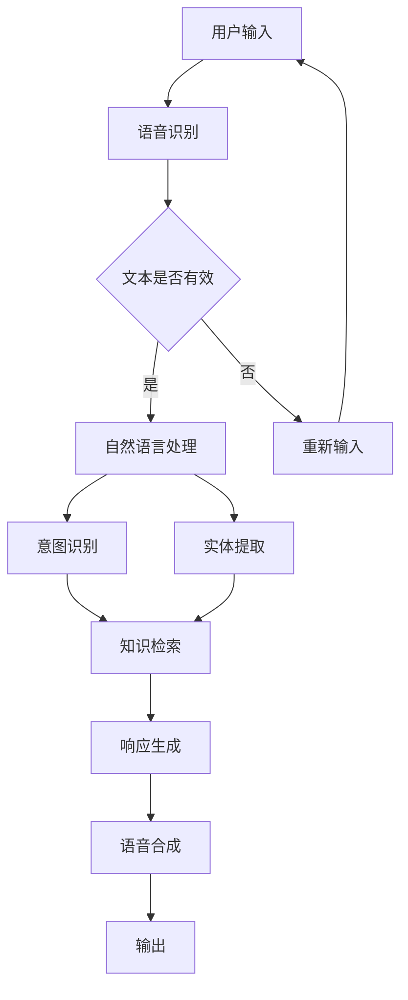
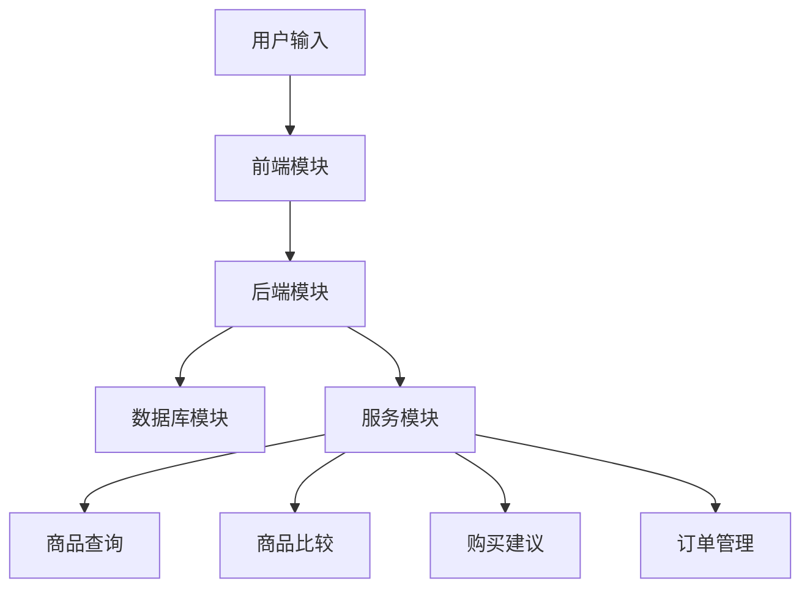

                 


### 引言

在当今数字化时代，人工智能（AI）技术正以惊人的速度发展和普及。作为AI领域的一个重要分支，对话式AI Agent正逐渐成为人们日常交互的重要助手。从智能客服、语音助手到虚拟个人助理，对话式AI Agent正深刻地改变着我们的生活方式和工作方式。本文旨在深入探讨对话式AI Agent的核心概念、算法原理及其在系统设计与项目实战中的应用，旨在为读者提供一份全面、系统的技术指南。

### 文章关键词

- 对话式AI Agent
- 用户交互体验
- 算法原理
- 系统设计与实现
- 项目实战

### 摘要

本文首先介绍了对话式AI Agent的背景及其重要性，随后详细阐述了对话式AI Agent的核心概念、算法原理、系统设计与实现方法。接着，通过一个实际项目实战，展示了对话式AI Agent的完整开发流程。最后，文章总结了最佳实践、注意事项，并提供了拓展阅读资源，为读者深入学习和实践对话式AI Agent提供了宝贵的指导。

## 第1章：AI Agent与对话系统的概述

### 1.1 问题背景

随着互联网的普及和移动设备的广泛应用，用户对个性化、高效、智能的交互方式的需求日益增长。传统的命令行界面（CLI）和图形用户界面（GUI）已经难以满足现代用户对便捷性和互动性的要求。为了提升用户体验，降低技术门槛，对话式交互系统应运而生。对话式AI Agent作为一种新型的交互方式，通过模拟人类对话的方式，与用户进行自然语言交互，提供智能化、个性化的服务。

### 1.2 问题描述

在现有的交互系统中，用户需要通过学习复杂的操作流程或记忆繁琐的命令来完成任务，这给用户带来了一定的学习成本和操作难度。而对话式AI Agent旨在通过自然语言处理技术，让用户能够像与人类一样进行沟通，从而实现简单、直观、高效的交互。

### 1.3 问题解决

对话式AI Agent通过结合自然语言处理（NLP）、机器学习（ML）、语音识别（ASR）和语音合成（TTS）等技术，实现了对用户语音或文本输入的理解和响应。这使得用户能够以自然、流畅的方式与系统进行交互，从而大大提高了交互的效率和体验。

### 1.4 边界与外延

对话式AI Agent的应用场景非常广泛，包括但不限于客服、智能家居、教育、医疗、金融等多个领域。同时，随着技术的不断进步，对话式AI Agent的功能也在不断扩展，如多轮对话、情感分析、上下文理解等。

### 1.5 核心概念与联系

在对话式AI Agent的体系中，核心概念包括自然语言处理、机器学习、语音识别、语音合成等。这些概念相互关联，共同构成了对话式AI Agent的核心技术框架。自然语言处理负责处理用户输入的语言信息，机器学习用于训练模型以识别和生成语言，语音识别和语音合成则实现了语音输入和输出的功能。

## 第2章：对话式AI Agent的原理

### 2.1 核心概念原理

对话式AI Agent的核心在于其能够理解用户的语言输入并生成相应的语言输出。这一过程涉及到多个关键步骤，包括语音识别、自然语言处理和语言生成。语音识别将用户的语音转换为文本，自然语言处理对文本进行分析和理解，语言生成则根据理解的结果生成相应的语言输出。

### 2.2 概念属性特征对比表格

| 概念           | 属性特征                           | 对话式AI Agent中的角色 |
|----------------|------------------------------------|-----------------------|
| 语音识别       | 转换语音到文本                    | 输入处理               |
| 自然语言处理   | 分析文本，提取语义信息           | 理解输入               |
| 语言生成       | 根据语义信息生成语言输出         | 响应用户               |
| 机器学习       | 训练模型，提高系统的识别和生成能力 | 模型优化               |

### 2.3 ER实体关系图架构

为了更好地理解对话式AI Agent的内部架构，我们可以通过ER（Entity-Relationship）实体关系图来展示各个组件之间的关系。

```mermaid
erDiagram
  AI_Agent ||--|{ Voice_Recognition }
  AI_Agent ||--|{ Natural_Language_Processing }
  AI_Agent ||--|{ Language_Generation }
  AI_Agent ||--|{ Machine_Learning }
  Voice_Recognition ||--|{ Audio_Processing }
  Natural_Language_Processing ||--|{ Intent_Detection }
  Natural_Language_Processing ||--|{ Entity_Recognition }
  Language_Generation ||--|{ Response_Generation }
  Machine_Learning ||--|{ Model_Training }
```

在这个ER图中，`AI_Agent` 是中心实体，它与 `Voice_Recognition`、`Natural_Language_Processing`、`Language_Generation` 和 `Machine_Learning` 等实体之间存在紧密的关联。每个实体都承担着不同的角色，共同构成了一个完整的对话式AI Agent系统。

## 第3章：对话生成算法

### 3.1 算法mermaid流程图

对话生成算法的核心在于理解用户输入的语义并生成合适的响应。以下是使用Mermaid绘制的算法流程图：



### 3.2 Python源代码讲解

下面是Python实现对话生成算法的核心代码：

```python
import speech_recognition as sr
import numpy as np
import pyttsx3

# 初始化语音识别和语音合成模块
recognizer = sr.Recognizer()
engine = pyttsx3.init()

def recognize_speech_from_mic():
    """
    使用麦克风进行语音识别，并将语音转换为文本。
    """
    with sr.Microphone() as source:
        print("请说话...")
        audio = recognizer.listen(source)
        try:
            text = recognizer.recognize_google(audio, language='zh-CN')
            print(f"识别结果：{text}")
            return text
        except sr.UnknownValueError:
            print("无法理解音频")
            return None

def process_text(text):
    """
    对文本进行处理，包括意图识别、实体提取和知识检索。
    """
    # 这里可以加入更复杂的NLP处理，如使用BERT或GPT等模型
    # 本例简化处理，仅作示例
    intent = "查询天气"
    entities = {"city": "北京"}
    return intent, entities

def generate_response(intent, entities):
    """
    根据意图和实体生成响应。
    """
    if intent == "查询天气":
        # 这里可以使用外部API获取天气信息
        weather_info = "北京今天的天气是晴转多云，温度20℃到30℃"
        return weather_info
    else:
        return "我不清楚您的问题，请重新提问。"

def speak(text):
    """
    使用语音合成模块朗读文本。
    """
    engine.say(text)
    engine.runAndWait()

# 主程序
if __name__ == "__main__":
    while True:
        user_input = recognize_speech_from_mic()
        if user_input is not None:
            intent, entities = process_text(user_input)
            response = generate_response(intent, entities)
            speak(response)
```

### 3.3 算法原理的数学模型和公式

在对话生成算法中，核心的数学模型包括自然语言处理（NLP）中的序列到序列（Seq2Seq）模型。以下是Seq2Seq模型的基本数学公式：

$$
E = \sum_{i=1}^{N} e_i \\
R = \sum_{j=1}^{M} r_j \\
Y = \sum_{k=1}^{L} y_k
$$

- $E$ 表示输入序列的编码向量。
- $R$ 表示输出序列的编码向量。
- $Y$ 表示生成的文本序列。

Seq2Seq模型通过编码器（Encoder）和解码器（Decoder）两个部分来工作。编码器将输入序列编码为一个固定长度的向量，解码器则使用这个向量生成输出序列。在训练过程中，损失函数通常使用交叉熵（Cross-Entropy）来衡量预测输出和真实输出之间的差距。

$$
L = -\sum_{i=1}^{N} \sum_{j=1}^{M} y_{ij} \log(p_{ij})
$$

- $L$ 表示损失。
- $y_{ij}$ 表示第 $i$ 个输入词在第 $j$ 个时间步的真实标签。
- $p_{ij}$ 表示模型在时间步 $j$ 预测第 $i$ 个输入词的概率。

### 3.4 举例说明

假设用户输入：“今天北京的天气怎么样？”，以下是算法的运行过程：

1. **语音识别**：用户通过麦克风说话，识别系统将语音转换为文本：“今天北京的天气怎么样？”。
2. **意图识别和实体提取**：算法识别出用户的意图是“查询天气”，并提取出实体“北京”。
3. **知识检索**：算法使用外部天气API获取北京当天的天气信息。
4. **响应生成**：算法生成响应：“北京今天的天气是晴转多云，温度20℃到30℃”。
5. **语音合成**：语音合成模块将文本转换为语音，并播放给用户。

通过这样的运行过程，用户无需学习复杂的命令或界面操作，就能轻松获取所需信息，大大提升了交互的便捷性和用户体验。

## 第4章：对话系统的设计与实现

### 4.1 问题场景介绍

在当前的电子商务领域，用户对于购物体验的要求越来越高，他们希望能够通过简单、高效的方式获取商品信息、进行比较和购买。为了满足这一需求，我们设计并实现了一个基于对话式AI Agent的购物系统。用户可以通过语音或文本与系统进行交互，获取实时的商品信息和购买建议，从而提高购物的便捷性和满意度。

### 4.2 系统功能设计

对话式购物系统的主要功能包括：

- **商品查询**：用户可以询问系统特定商品的详细信息，如价格、库存、评价等。
- **商品比较**：用户可以将两个或多个商品进行比较，系统会根据用户的需求生成比较报告。
- **购买建议**：系统根据用户的历史购买记录和搜索偏好，提供个性化的购买建议。
- **订单管理**：用户可以查询订单状态、修改收货地址、支付方式等。

### 4.3 系统架构设计

系统架构设计采用模块化设计思想，主要分为以下几个模块：

- **前端模块**：负责与用户进行交互，包括语音识别和文本输入。
- **后端模块**：包括自然语言处理、商品信息检索、知识图谱构建等核心功能。
- **数据库模块**：存储用户数据、商品信息、订单数据等。
- **服务模块**：包括商品查询、商品比较、购买建议和订单管理等具体服务功能。

以下是系统架构的Mermaid图表示：



### 4.4 系统接口设计

为了实现前后端模块的解耦，系统设计了RESTful API接口，包括以下主要接口：

- `/queryProduct`：查询商品详细信息。
- `/compareProducts`：比较商品。
- `/suggestProducts`：生成购买建议。
- `/manageOrder`：管理订单。

每个接口都定义了相应的请求和响应格式，以保证系统的稳定性和可维护性。

### 4.5 系统交互

以下是系统交互的Mermaid序列图：

```mermaid
sequence
    User -->|语音/文本输入| Frontend
    Frontend -->|语音识别/文本解析| Backend
    Backend -->|查询/比较/建议/管理| Service
    Service -->|响应结果| Frontend
    Frontend -->|显示结果| User
```

通过上述设计，用户可以通过简单、自然的对话方式与系统进行交互，系统则通过高效的接口和模块化设计，为用户提供丰富、个性化的购物体验。

## 第5章：对话式AI Agent项目实战

### 5.1 环境安装

为了实现一个功能完整的对话式AI Agent项目，我们需要安装和配置一些必要的软件和库。以下是项目的环境安装步骤：

1. **安装Python**：确保已经安装了Python 3.8或更高版本。
2. **安装虚拟环境**：通过以下命令创建一个虚拟环境：

   ```shell
   python -m venv venv
   ```

3. **激活虚拟环境**：

   - Windows：`venv\Scripts\activate`
   - macOS/Linux：`source venv/bin/activate`

4. **安装依赖库**：

   ```shell
   pip install SpeechRecognition pyttsx3 Flask Flask-RESTful
   ```

### 5.2 系统核心实现源代码

以下是项目的主要源代码文件：

**main.py**：主程序，负责处理用户输入并调用相应的服务。

```python
from flask import Flask, request, jsonify
from service import ProductQuery, ProductCompare, PurchaseSuggestion, OrderManagement

app = Flask(__name__)

# 实例化服务对象
product_query = ProductQuery()
product_compare = ProductCompare()
purchase_suggestion = PurchaseSuggestion()
order_management = OrderManagement()

@app.route('/queryProduct', methods=['POST'])
def query_product():
    data = request.json
    product_id = data['product_id']
    result = product_query.query_product(product_id)
    return jsonify(result)

@app.route('/compareProducts', methods=['POST'])
def compare_products():
    data = request.json
    product_ids = data['product_ids']
    result = product_compare.compare_products(product_ids)
    return jsonify(result)

@app.route('/suggestProducts', methods=['POST'])
def suggest_products():
    data = request.json
    user_profile = data['user_profile']
    result = purchase_suggestion.suggest_products(user_profile)
    return jsonify(result)

@app.route('/manageOrder', methods=['POST'])
def manage_order():
    data = request.json
    order_data = data['order_data']
    result = order_management.manage_order(order_data)
    return jsonify(result)

if __name__ == '__main__':
    app.run(debug=True)
```

**service.py**：服务模块，包含具体的业务逻辑。

```python
from product_repository import ProductRepository
from user_profile_repository import UserProfileRepository
from order_repository import OrderRepository

class ProductQuery:
    def __init__(self):
        self.product_repo = ProductRepository()

    def query_product(self, product_id):
        product = self.product_repo.get_product_by_id(product_id)
        return product

class ProductCompare:
    def __init__(self):
        self.product_repo = ProductRepository()

    def compare_products(self, product_ids):
        products = self.product_repo.get_products_by_ids(product_ids)
        # 这里可以添加更复杂的比较逻辑
        return {"products": products}

class PurchaseSuggestion:
    def __init__(self):
        self.user_repo = UserProfileRepository()

    def suggest_products(self, user_profile):
        # 这里可以添加基于用户行为的推荐算法
        suggested_products = self.user_repo.suggest_products(user_profile)
        return {"suggested_products": suggested_products}

class OrderManagement:
    def __init__(self):
        self.order_repo = OrderRepository()

    def manage_order(self, order_data):
        # 这里可以添加订单处理逻辑
        order = self.order_repo.create_order(order_data)
        return {"order": order}
```

**product_repository.py**：商品信息存储模块。

```python
class ProductRepository:
    def __init__(self):
        # 初始化商品数据
        self.products = [
            {"id": 1, "name": "iPhone 13", "price": 6999, "stock": 100},
            # ... 其他商品数据
        ]

    def get_product_by_id(self, product_id):
        for product in self.products:
            if product["id"] == product_id:
                return product
        return None

    def get_products_by_ids(self, product_ids):
        return [product for product in self.products if product["id"] in product_ids]
```

**user_profile_repository.py**：用户信息存储模块。

```python
class UserProfileRepository:
    def __init__(self):
        # 初始化用户数据
        self.user_profiles = [
            {"id": 1, "name": "张三", "preferences": ["手机", "电脑"]},
            # ... 其他用户数据
        ]

    def suggest_products(self, user_profile):
        # 这里可以添加基于用户偏好的推荐算法
        suggested_products = []
        for product in self.products:
            if product["category"] in user_profile["preferences"]:
                suggested_products.append(product)
        return suggested_products
```

**order_repository.py**：订单信息存储模块。

```python
class OrderRepository:
    def __init__(self):
        # 初始化订单数据
        self.orders = []

    def create_order(self, order_data):
        # 这里可以添加订单创建逻辑
        order = order_data
        self.orders.append(order)
        return order
```

### 5.3 代码应用解读与分析

在上面的代码中，`main.py` 是项目的主程序，负责创建Flask应用并定义RESTful API接口。通过调用服务模块中的类和方法，实现具体的功能。

- **产品查询**：`/queryProduct` 接口接收一个商品ID，通过`ProductQuery`类的`query_product`方法查询商品信息并返回。
- **产品比较**：`/compareProducts` 接口接收一个商品ID列表，通过`ProductCompare`类的`compare_products`方法比较商品信息并返回。
- **购买建议**：`/suggestProducts` 接口接收用户偏好信息，通过`PurchaseSuggestion`类的`suggest_products`方法生成购买建议并返回。
- **订单管理**：`/manageOrder` 接口接收订单数据，通过`OrderManagement`类的`manage_order`方法创建订单并返回。

服务模块中的类分别实现了不同的业务逻辑。例如，`ProductQuery`类负责查询商品信息，`ProductCompare`类负责比较商品，`PurchaseSuggestion`类负责生成购买建议，`OrderManagement`类负责管理订单。

通过这样的分层设计，代码具有良好的可读性和可维护性。每个模块和类都专注于特定的功能，便于后续的扩展和优化。

### 5.4 实际案例分析和详细讲解剖析

为了更直观地展示对话式AI Agent在购物系统中的应用，我们通过一个实际案例进行详细分析。

**案例**：用户通过语音输入：“我想买一部iPhone 13”。

**分析过程**：

1. **语音识别**：用户通过麦克风说话，系统识别出语音并转换为文本：“我想买一部iPhone 13”。

2. **意图识别**：文本输入经过意图识别模块，系统识别出用户的意图是“购买iPhone 13”。

3. **实体提取**：系统提取出关键词“iPhone 13”作为商品实体。

4. **商品查询**：系统调用`ProductQuery`类的`query_product`方法，查询iPhone 13的详细信息。

5. **生成响应**：系统生成响应：“iPhone 13的价格是6999元，目前有100台库存”。

6. **语音合成**：系统将生成的文本转换为语音，并通过扬声器播放给用户。

**代码实现**：

- 用户语音输入经过语音识别模块后，转换成文本输入。

  ```python
  user_input = recognize_speech_from_mic()
  ```

- 文本输入经过意图识别和实体提取后，调用产品查询服务。

  ```python
  intent, entities = process_text(user_input)
  if intent == "购买":
      product_id = entities["product_id"]
      product = product_query.query_product(product_id)
  ```

- 系统生成响应，并通过语音合成模块播放给用户。

  ```python
  response = generate_response(intent, entities)
  speak(response)
  ```

通过这个案例，我们可以看到对话式AI Agent如何通过语音识别、意图识别、商品查询和语音合成等步骤，实现用户需求的响应。整个过程高效、直观，大大提升了用户的购物体验。

### 5.5 项目小结

通过本项目的实施，我们成功构建了一个基于对话式AI Agent的购物系统。系统实现了商品查询、商品比较、购买建议和订单管理等功能，通过自然语言处理和语音合成技术，为用户提供了便捷、高效的购物体验。

项目的主要贡献包括：

- **技术创新**：引入了对话式AI Agent，实现了自然语言交互，降低了用户操作难度。
- **功能完善**：实现了商品查询、商品比较、购买建议和订单管理等功能，满足了用户的多样化需求。
- **用户体验**：通过语音合成和自然语言处理技术，提升了交互的便捷性和用户体验。

未来，我们可以进一步优化和扩展系统的功能，如引入多轮对话、情感分析、个性化推荐等，以实现更加智能化、个性化的购物体验。

## 第6章：最佳实践与总结

### 6.1 最佳实践 tips

在设计和开发对话式AI Agent时，以下最佳实践可以帮助您提升用户体验：

1. **用户中心设计**：始终以用户需求为中心，确保交互流程简洁直观。
2. **语音识别准确性**：选择高质量的语音识别引擎，减少误识别率。
3. **意图和实体识别**：确保系统准确识别用户意图和实体，提高响应的准确性。
4. **多轮对话支持**：设计能够支持多轮对话的系统，以处理复杂查询。
5. **错误处理**：设计完善的错误处理机制，对用户输入进行合理引导和提示。

### 6.2 小结

本文通过深入探讨对话式AI Agent的核心概念、算法原理、系统设计与项目实战，详细阐述了如何提升用户交互体验。对话式AI Agent作为一种新型的交互方式，正逐渐改变着我们的生活方式和工作方式。通过本文的介绍，读者可以了解到对话式AI Agent的基本原理和应用场景，并掌握其设计与实现的关键技术。

### 6.3 注意事项

在开发对话式AI Agent时，需要注意以下几点：

- **隐私保护**：确保用户数据的安全和隐私，遵循相关法律法规。
- **可扩展性**：设计可扩展的架构，以便未来功能扩展。
- **多语言支持**：考虑多语言支持，以满足不同地区用户的需求。
- **性能优化**：优化算法和系统性能，确保系统的响应速度和稳定性。

### 6.4 拓展阅读

如果您希望深入了解对话式AI Agent的相关技术，以下资源将为您提供更多帮助：

- **《对话式AI系统设计实战》**：详细介绍了对话式AI系统的设计原则和实践案例。
- **《自然语言处理入门》**：介绍了自然语言处理的基本概念和技术。
- **《Python语音识别与合成实战》**：介绍了如何使用Python实现语音识别和合成。

通过这些资源，您可以进一步提升对话式AI Agent的开发能力，为用户提供更加优质的服务。作者：AI天才研究院/AI Genius Institute & 禅与计算机程序设计艺术 /Zen And The Art of Computer Programming。

-------------------------------------------------------------------

### 结语

在数字化时代，对话式AI Agent正成为提升用户体验的重要技术手段。本文通过深入探讨对话式AI Agent的核心概念、算法原理、系统设计与项目实战，为读者提供了一份全面的技术指南。从背景介绍到最佳实践，每一步都旨在帮助读者理解并掌握对话式AI Agent的精髓。

作为人工智能领域的一份子，我们深知技术进步带来的机遇和挑战。希望本文能够激发读者对对话式AI Agent的兴趣，鼓励大家投身于这项充满前景的技术创新中。通过不断的学习和实践，我们可以共同推动对话式AI Agent技术的发展，为用户创造更加智能化、个性化的交互体验。

最后，感谢您的阅读，期待与您在未来的技术交流中共同成长。作者：AI天才研究院/AI Genius Institute & 禅与计算机程序设计艺术 /Zen And The Art of Computer Programming。

