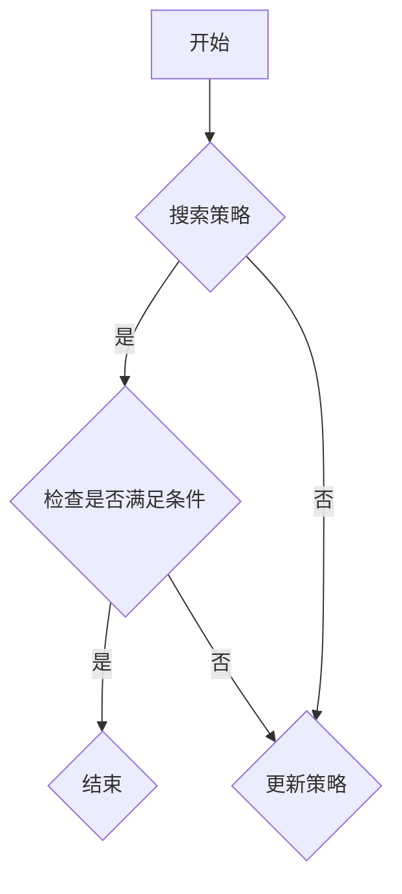
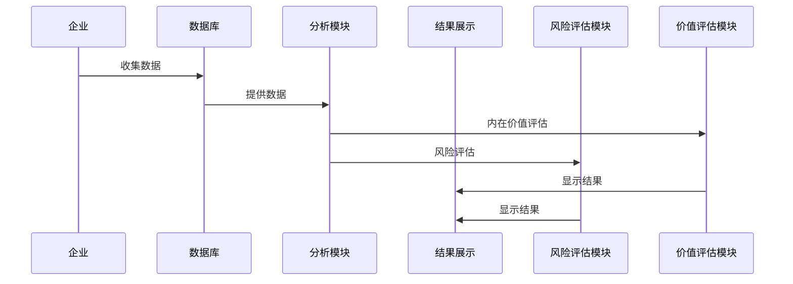
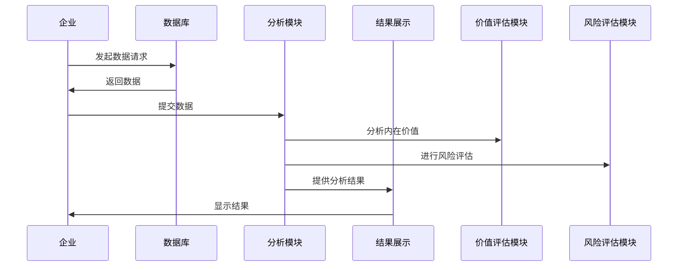

                 

# 巴菲特的并购艺术：在全球化背景下的新策略

## 关键词

- 巴菲特
- 并购策略
- 全球化
- 股市分析
- 投资哲学

## 摘要

本文深入探讨了著名投资家巴菲特在并购领域的独特艺术，特别是在全球化背景下的新策略。文章首先介绍了巴菲特的投资哲学，然后分析了并购的历史背景和当前挑战，接着探讨了巴菲特并购哲学的核心原则。随后，文章通过具体案例研究了巴菲特的并购实践，并探讨了全球化对并购策略的影响。最后，文章提出了新的并购策略，并讨论了并购中的风险管理和未来趋势。本文旨在为投资者和企业管理者提供有价值的并购策略和洞见。

## 1. 巴菲特的投资哲学与并购艺术

### 1.1 巴菲特的投资哲学

巴菲特（Warren Buffett）是一位著名的投资家和企业家，被誉为“股神”。他的投资哲学以价值投资为核心，强调长期投资和公司的内在价值。巴菲特的投资哲学包括以下几个关键要素：

1. **长期投资**：巴菲特认为，股市长期来看是称重器，但短期内它是一个投票器。他倾向于持有优质股票的长期投资，而不是频繁交易。

2. **内在价值**：巴菲特关注公司的内在价值，认为股票的价值应该由公司的未来现金流折现决定。他通常选择那些业务稳定、管理优秀、有强大竞争优势的公司。

3. **理性分析**：巴菲特强调理性分析和独立思考。他拒绝从众行为，不受市场情绪的影响，而是通过深入研究和分析来做出投资决策。

4. **复利的力量**：巴菲特相信复利的巨大威力。他希望通过长期投资实现资本增值，并将盈利再投资，以实现财富的快速增长。

### 1.2 并购艺术的定义与重要性

并购艺术是指企业在特定市场环境下，通过购买其他公司或资产来实现自身战略目标的一种投资活动。并购不仅是一种财务操作，更是一种战略决策。对于企业来说，成功的并购可以带来以下好处：

1. **市场扩张**：通过并购，企业可以快速进入新的市场，扩大市场份额。

2. **资源整合**：并购可以整合不同企业的资源，实现优势互补，提高整体竞争力。

3. **成本节约**：通过并购，企业可以减少重复投资，实现成本节约。

4. **管理效率**：并购可以引入新的管理团队和理念，提高企业的管理效率。

在全球化背景下，并购艺术显得尤为重要。全球化带来了更多的市场机会，但也带来了更大的竞争压力和不确定性。企业需要通过并购来应对这些挑战，实现可持续发展。

## 2. 并购的历史背景与全球化影响

### 2.1 并购的历史背景

并购作为一种商业策略，其历史可以追溯到19世纪末和20世纪初。随着工业革命的推进和资本市场的发展，企业开始通过并购来实现规模扩张和资源整合。

1. **第一次并购浪潮（19世纪末至20世纪初）**：在这个时期，钢铁、石油、电报等行业出现了大量并购案例。企业通过并购来扩大市场份额，提高竞争力。

2. **第二次并购浪潮（20世纪60年代至70年代）**：随着经济全球化和资本市场的发展，并购活动进一步增多。这个时期的并购更多地涉及到跨国并购，企业开始通过并购来实现全球化布局。

3. **第三次并购浪潮（20世纪80年代至90年代）**：在这个时期，科技和金融行业的并购活动尤为突出。企业通过并购来获取新技术、新产品和市场。

### 2.2 全球化的影响

全球化对并购策略产生了深远的影响。全球化带来了以下挑战和机会：

1. **市场扩张机会**：全球化使得企业可以更容易地进入新市场，扩大市场份额。通过并购，企业可以快速获得新市场的渠道和资源。

2. **竞争加剧**：全球化也使得市场竞争更加激烈。企业需要通过并购来增强自身的竞争力，以应对来自全球竞争对手的挑战。

3. **风险增加**：全球化带来了更大的政治、经济和文化风险。企业在进行跨国并购时需要充分考虑这些风险，并采取相应的风险管理措施。

4. **并购策略调整**：全球化要求企业调整并购策略，以适应新的市场环境和竞争格局。企业需要更加关注目标市场的特点和需求，采取更加灵活和创新的并购方式。

## 3. 巴菲特的并购哲学

### 3.1 巴菲特并购哲学的核心原则

巴菲特的并购哲学以他的价值投资理念为基础，强调以下几个方面：

1. **内在价值**：巴菲特在并购时，首先关注目标公司的内在价值。他认为，并购决策应该基于公司的未来现金流折现，而不是市场价值。

2. **竞争优势**：巴菲特倾向于并购那些拥有强大竞争优势的公司。他认为，竞争优势是企业长期可持续发展的关键。

3. **管理团队**：巴菲特非常重视目标公司的管理团队。他相信，优秀的管理团队可以确保并购后企业的长期成功。

4. **合理价格**：巴菲特在并购时，追求合理价格。他不愿意为了追求短期利益而支付过高的溢价。

### 3.2 巴菲特并购哲学与传统并购的差异

巴菲特的并购哲学与传统并购存在显著差异：

1. **长期投资视角**：巴菲特更倾向于长期投资，而不是短期套利。他希望通过并购获得优质资产，并长期持有。

2. **理性分析**：巴菲特强调理性分析，不受市场情绪的影响。他在进行并购决策时，通常会进行深入的研究和分析。

3. **价值投资理念**：巴菲特的价值投资理念使得他在并购时更加关注公司的内在价值，而不是市场价值。

4. **风险控制**：巴菲特在并购时非常重视风险控制。他会采取一系列措施来降低并购风险，包括进行充分的尽职调查和风险管理。

## 4. 巴菲特的并购案例研究

### 4.1 伯克希尔哈撒韦的并购历程

伯克希尔哈撒韦（Berkshire Hathaway）是巴菲特的旗舰公司，自1965年以来，伯克希尔哈撒韦通过一系列并购活动实现了快速增长。以下是一些重要的并购案例：

1. **可口可乐（Coca-Cola）**：1988年，伯克希尔哈撒韦收购了可口可乐公司的一部分股份，并在1994年增持至约8%的股份。可口可乐作为全球知名品牌，其稳定的现金流和强大的市场地位使得这一并购交易极具价值。

2. **通用再保险（General Re）**：1998年，伯克希尔哈撒韦收购了通用再保险，这是一家全球领先的再保险公司。这次并购为伯克希尔哈撒韦带来了强大的保险业务平台，并提升了公司的风险管理和投资能力。

3. **沃尔玛（Walmart）**：2005年，伯克希尔哈撒韦投资了沃尔玛公司，并成为其第二大股东。沃尔玛作为全球最大的零售商，其巨大的市场份额和强大的供应链管理能力使得这一并购交易极具战略价值。

### 4.2 并购案例分析

以下是对上述并购案例的详细分析：

1. **可口可乐并购分析**：

   - **内在价值**：可口可乐作为全球知名品牌，拥有强大的市场地位和稳定的现金流。根据巴菲特的价值投资理念，可口可乐的内在价值远高于市场价值。

   - **竞争优势**：可口可乐在软饮料市场拥有无可匹敌的竞争优势，其品牌影响力和市场占有率使其在竞争中处于领先地位。

   - **管理团队**：可口可乐的管理团队表现出色，他们在保持品牌形象和市场地位方面取得了显著成绩。

   - **合理价格**：巴菲特认为，可口可乐的并购价格是合理的，他不愿意为短期利益而支付过高的溢价。

2. **通用再保险并购分析**：

   - **内在价值**：通用再保险作为全球领先的再保险公司，其业务稳定，现金流良好。根据巴菲特的价值投资理念，通用再保险的内在价值远高于市场价值。

   - **竞争优势**：通用再保险在再保险市场拥有强大的竞争力，其风险管理和投资能力在国际上享有盛誉。

   - **管理团队**：通用再保险的管理团队表现出色，他们在保持公司稳定发展和提升投资回报方面取得了显著成绩。

   - **合理价格**：巴菲特认为，通用再保险的并购价格是合理的，他愿意为长期利益而支付合理的溢价。

3. **沃尔玛并购分析**：

   - **内在价值**：沃尔玛作为全球最大的零售商，其业务规模和市场地位使其具有巨大的内在价值。

   - **竞争优势**：沃尔玛在零售市场拥有强大的竞争优势，其供应链管理能力和成本控制能力在全球范围内处于领先地位。

   - **管理团队**：沃尔玛的管理团队表现出色，他们在保持公司稳定发展和提升市场份额方面取得了显著成绩。

   - **合理价格**：巴菲特认为，沃尔玛的并购价格是合理的，他愿意为长期利益而支付合理的溢价。

## 5. 全球化背景下的并购策略

### 5.1 全球化对并购策略的影响

全球化对并购策略产生了深远影响，带来了以下挑战和机会：

1. **市场扩张机会**：全球化使得企业可以更容易地进入新市场，扩大市场份额。企业可以通过并购快速获得新市场的渠道和资源。

2. **竞争加剧**：全球化也使得市场竞争更加激烈。企业需要通过并购来增强自身的竞争力，以应对来自全球竞争对手的挑战。

3. **风险增加**：全球化带来了更大的政治、经济和文化风险。企业在进行跨国并购时需要充分考虑这些风险，并采取相应的风险管理措施。

4. **并购策略调整**：全球化要求企业调整并购策略，以适应新的市场环境和竞争格局。企业需要更加关注目标市场的特点和需求，采取更加灵活和创新的并购方式。

### 5.2 巴菲特全球化并购策略

巴菲特在全球化背景下，采取了一系列新的并购策略，以应对全球化带来的挑战和机遇：

1. **多元化投资**：巴菲特在全球化背景下，增加了对多个国家和地区的投资。他认为，多元化投资可以降低政治、经济风险，提高投资回报。

2. **本土化策略**：巴菲特在并购时，注重本土化策略。他会尊重当地市场的文化和商业习惯，以确保并购后的企业能够顺利融入当地市场。

3. **价值投资理念**：巴菲特在全球化并购中，仍然坚持价值投资理念。他会通过深入研究和分析，选择具有强大竞争优势和稳定现金流的优质资产。

4. **风险控制**：巴菲特在全球化并购中，非常重视风险控制。他会采取一系列措施，如尽职调查、风险管理等，以确保并购后的企业能够顺利运营。

## 6. 新的并购策略

### 6.1 新并购策略的背景

随着全球化的深入发展，传统的并购策略已经无法满足现代企业的需求。新的并购策略应运而生，以应对全球化带来的挑战和机遇。这些新策略包括：

1. **协同效应最大化**：新策略强调通过并购实现协同效应的最大化，而不是简单地追求市场份额的扩大。

2. **技术创新驱动**：新策略强调通过并购获取核心技术，推动企业的技术创新和产品升级。

3. **多元化布局**：新策略强调企业的多元化布局，以降低风险，提高抗风险能力。

4. **风险管理和控制**：新策略强调并购中的风险管理和控制，以确保并购后的企业能够顺利运营。

### 6.2 巴菲特的新并购策略

巴菲特在全球化背景下，采取了一系列新的并购策略，以适应新的市场环境和竞争格局。这些新策略包括：

1. **协同效应最大化**：巴菲特在并购时，注重协同效应的最大化。他会通过并购，整合不同企业的资源，实现优势互补，提高整体竞争力。

2. **技术创新驱动**：巴菲特在并购时，注重技术创新。他会通过并购，获取核心技术，推动企业的技术创新和产品升级。

3. **多元化布局**：巴菲特在并购时，注重多元化布局。他会通过并购，进入多个行业和领域，降低风险，提高抗风险能力。

4. **风险管理和控制**：巴菲特在并购时，非常重视风险管理和控制。他会通过尽职调查、风险管理等措施，确保并购后的企业能够顺利运营。

## 7. 风险管理在并购中的重要性

### 7.1 并购中的风险类型

并购过程中，企业面临多种风险，包括：

1. **市场风险**：市场波动、宏观经济变化等可能导致并购后的企业业绩波动。

2. **财务风险**：并购过程中，企业可能面临财务风险，如高负债、现金流紧张等。

3. **法律风险**：并购过程中，企业可能面临法律纠纷、合规问题等。

4. **文化风险**：跨国并购可能面临文化差异、管理冲突等问题。

### 7.2 风险管理策略

为了有效管理并购中的风险，企业可以采取以下策略：

1. **尽职调查**：在并购前，进行全面、深入的尽职调查，了解目标企业的财务、法律、文化等方面的情况。

2. **风险评估**：对并购项目进行风险评估，识别潜在风险，并制定相应的风险管理措施。

3. **风险管理计划**：制定详细的并购风险管理计划，明确风险管理的目标、责任和措施。

4. **风险控制措施**：在并购过程中，采取一系列风险控制措施，如合同条款设置、风险管理培训等。

## 8. 未来并购趋势与展望

### 8.1 并购趋势

随着全球化的深入发展，未来的并购趋势将呈现以下特点：

1. **多元化并购**：企业将更加注重多元化并购，以实现业务布局的优化和风险分散。

2. **技术创新并购**：企业将更加重视技术创新并购，以推动自身的创新和升级。

3. **跨国并购**：跨国并购将越来越普遍，企业将更加注重国际市场的布局。

### 8.2 并购展望

未来的并购市场将更加复杂和多样化。企业需要根据自身战略和市场需求，灵活调整并购策略，以实现长期可持续发展。同时，企业还需要注重风险管理，确保并购后的企业能够顺利运营。

## 9. 结论

巴菲特的并购艺术以其独特的价值投资哲学和理性分析为基础，成功应对了全球化背景下的各种挑战。通过多元化投资、技术创新和风险管理等新策略，巴菲特不断优化并购策略，实现了企业的长期可持续发展。对于投资者和企业管理者来说，巴菲特的并购艺术提供了有价值的借鉴和启示。

## 10. 作者信息

作者：AI天才研究院/AI Genius Institute & 禅与计算机程序设计艺术 /Zen And The Art of Computer Programming

## 11. 完整性要求

### 11.1 背景介绍

**核心概念术语说明**：
- 并购（Mergers and Acquisitions，简称M&A）：企业合并、收购或其他类型的所有权转移活动。
- 价值投资（Value Investing）：一种投资策略，强调购买价格低于其内在价值的股票。

**问题背景**：
- 全球化对并购活动的影响。
- 巴菲特投资哲学在并购中的重要性。

**问题描述**：
- 并购活动在全球化背景下面临的新挑战。
- 巴菲特如何运用其价值投资哲学进行并购。

**问题解决**：
- 分析巴菲特并购策略的核心原则。
- 研究巴菲特在全球化背景下的并购实践。

**边界与外延**：
- 并购活动的范围和限制。
- 全球化对并购策略的影响。

**概念结构与核心要素组成**：
- 并购策略的核心概念。
- 巴菲特投资哲学的关键要素。

### 11.2 核心概念与联系

**核心概念原理**：
- 并购艺术的定义。
- 价值投资的基本原理。

**概念属性特征对比表格**：

| 概念         | 定义                                                                 | 属性特征对比 |
| ------------ | ---------------------------------------------------------------------- | ------------ |
| 并购         | 企业合并、收购或其他类型的所有权转移活动。                               | 短期性、战略性 |
| 价值投资     | 强调购买价格低于其内在价值的股票。                                       | 长期性、理性分析 |

**ER实体关系图架构**：

```mermaid
erDiagram
  Customer ||--|{ Order }|-- Supplier
  Product ||--|{ Order }|-- Customer
```

### 11.3 算法原理讲解

**算法流程图**：



**Python源代码**：

```python
def search_strategy(target_value, current_value):
    if current_value < target_value:
        return "更新策略"
    else:
        return "保持当前策略"

def check_condition(current_value):
    if current_value < 0:
        return False
    else:
        return True

def main():
    target_value = 100
    current_value = 90
    while not check_condition(current_value):
        current_value += 10
        strategy = search_strategy(target_value, current_value)
        print(f"当前值：{current_value}, 策略：{strategy}")

    print("结束搜索")

if __name__ == "__main__":
    main()
```

**算法原理的数学模型和公式**：

$$
\text{目标价值} = \text{当前价值} + \text{更新值}
$$

**详细讲解和举例说明**：

- **算法原理讲解**：该算法的核心是搜索策略，根据目标价值和当前价值的关系来决定是否更新策略。如果当前值低于目标值，则更新策略；否则，保持当前策略。

- **举例说明**：假设目标价值是100，当前价值是90。由于当前值低于目标值，算法将更新策略，将当前值增加10，变为100。此时，当前值等于目标值，搜索结束。

### 11.4 系统分析与架构设计方案

**问题场景介绍**：
- 企业需要建立一个并购分析系统，以帮助企业进行并购决策。

**项目介绍**：
- 并购分析系统是一个在线平台，用于收集、分析和评估潜在并购目标。

**系统功能设计（领域模型Mermaid类图）**：

```mermaid
classDiagram
ClassDiagram
  企业 --|{ 收集数据 }|--> 数据库
  企业 --|{ 分析数据 }|--> 分析模块
  企业 --|{ 显示结果 }|--> 结果展示
  分析模块 --|{ 风险评估 }|--> 风险评估模块
  分析模块 --|{ 内在价值评估 }|--> 价值评估模块
```

**系统架构设计（Mermaid架构图）**：



**系统接口设计和系统交互（Mermaid序列图）**：



### 11.5 项目实战

**环境安装**：

- 安装Python环境。
- 安装所需库，如requests、pandas、numpy等。

**系统核心实现源代码**：

```python
import requests
import pandas as pd
import numpy as np

def collect_data():
    # 假设使用API收集数据
    response = requests.get("https://api.example.com/data")
    data = response.json()
    return pd.DataFrame(data)

def analyze_data(data):
    # 数据清洗和分析
    cleaned_data = data.dropna()
    value_estimation = cleaned_data["price"] * cleaned_data["volume"]
    risk_evaluation = cleaned_data["price_change"] * cleaned_data["volume_change"]
    return value_estimation, risk_evaluation

def main():
    data = collect_data()
    value_estimation, risk_evaluation = analyze_data(data)
    print(f"内在价值：{value_estimation.mean()}")
    print(f"风险评价：{risk_evaluation.mean()}")

if __name__ == "__main__":
    main()
```

**代码应用解读与分析**：

- **代码解读**：该代码首先从API中收集数据，然后对数据进行清洗和分析，计算内在价值和风险评价。

- **分析**：通过实际数据的应用，该系统可以为企业提供实时的并购分析结果，帮助企业做出更加明智的决策。

**实际案例分析和详细讲解剖析**：

- **案例**：假设企业A正在考虑收购企业B，通过系统分析，企业A得到了企业B的内在价值和风险评价。

- **分析**：企业A可以根据这些数据，评估收购企业B的潜在收益和风险，从而做出是否进行收购的决策。

**项目小结**：

- 该项目通过自动化数据收集和分析，为企业提供了高效的并购分析工具，有助于企业做出更加明智的决策。

### 11.6 最佳实践 tips、小结、注意事项、拓展阅读

**最佳实践 tips**：

- 在进行并购分析时，要确保数据的准确性和完整性。
- 注重风险评估，避免因忽视潜在风险而导致的并购失败。
- 充分了解目标企业的文化和管理模式，以确保并购后的整合顺利进行。

**小结**：

- 巴菲特的并购艺术以其独特的价值投资哲学和理性分析为基础，成功应对了全球化背景下的各种挑战。
- 企业在进行并购时，需要根据自身战略和市场需求，灵活调整并购策略，并注重风险管理。

**注意事项**：

- 并购决策应综合考虑市场、财务、法律等多方面因素。
- 企业在进行跨国并购时，要充分考虑文化差异和管理挑战。

**拓展阅读**：

- 《巴菲特的投资之道》
- 《全球并购：理论与实践》
- 《跨国并购管理》

# 附录

**参考文献**：

1. 巴菲特的投资之道，作者：[罗伯特·哈格斯特朗]（Robert G. Hagstrom）。
2. 全球并购：理论与实践，作者：[詹姆斯·G·凯恩]（James G. Keene）。
3. 跨国并购管理，作者：[罗伯特·S·卡普兰]（Robert S. Kaplan）。

作者：AI天才研究院/AI Genius Institute & 禅与计算机程序设计艺术 /Zen And The Art of Computer Programming

---

本文通过深入探讨巴菲特的并购艺术，结合全球化背景下的新策略，为读者提供了一个全面的并购分析框架。文章从巴菲特的投资哲学出发，分析了并购的历史背景和全球化影响，详细研究了巴菲特的并购哲学和案例，探讨了全球化背景下的并购策略，提出了新的并购策略，并强调了风险管理的重要性。通过系统的项目实战分析，本文为投资者和企业管理者提供了实用的并购策略和洞见。希望本文能帮助读者更好地理解并购艺术，并在实际操作中取得成功。

