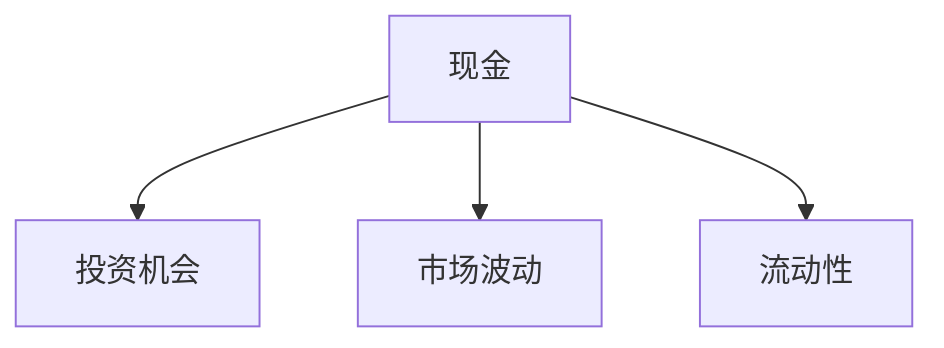
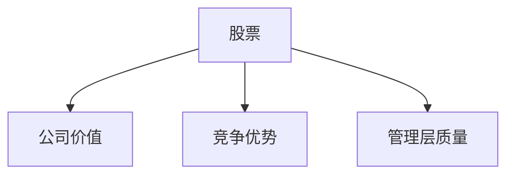

                 


### 理解巴菲特的杠铃策略

#### 文章标题

《巴菲特的杠铃策略：现金+股票的平衡》

#### 文章关键词

巴菲特、投资策略、杠铃策略、现金管理、股票投资

#### 文章摘要

本文将深入探讨巴菲特的杠铃策略，一个结合了现金管理和股票投资的独特投资方法。通过对其投资哲学的理解，基本概念的解释，策略的实践应用以及风险管理，我们旨在为读者提供一个全面、系统的投资指南。

---

## 引言

**问题背景与投资原则**

在当今快速变化的投资市场中，投资者面临着多种选择。巴菲特的杠铃策略提供了一种简明有效的方法，它结合了现金和股票的投资，以平衡风险和收益。这个策略的核心在于，通过持有大量现金和优质股票，投资者可以在市场波动中保持灵活，同时获得长期增长的潜力。

**巴菲特的早期投资经历**

沃伦·巴菲特是伯克希尔·哈撒韦公司的主席和首席执行官，他以其长期的成功投资而闻名。巴菲特的投资哲学强调价值投资，他关注公司的基本面，而不是短期的市场波动。巴菲特在年轻时就展现出了非凡的投资才能，他的成功经验为今天的投资者提供了宝贵的借鉴。

**杠铃策略的初步探讨**

巴菲特的杠铃策略，顾名思义，就像一个杠铃，一端是大量的现金，另一端是少量的优质股票。这种策略的核心在于，在市场低迷时，持有大量现金以便抓住机会；而在市场繁荣时，投资于优质股票以获取长期收益。

### 杠铃策略的基本概念

#### 现金在杠铃策略中的角色

在巴菲特的杠铃策略中，现金扮演着至关重要的角色。它不仅是应对市场不确定性的缓冲，也是捕捉优质投资机会的关键。巴菲特经常强调，他宁愿持有现金也不愿持有糟糕的投资。

**核心概念与联系**

| 核心概念 | 描述 | 关联概念 |
| --- | --- | --- |
| 现金 | 是一种灵活的资产，可以随时用于投资或应对紧急情况。 | 投资机会、市场波动、流动性 |

**ER实体关系图架构**



#### 股票在杠铃策略中的角色

在杠铃策略的另一端，股票的选择至关重要。巴菲特倾向于投资那些具有持续竞争优势和良好管理层的公司。这种长期投资的理念，使他能够在股票市场中获得稳定的收益。

**核心概念与联系**

| 核心概念 | 描述 | 关联概念 |
| --- | --- | --- |
| 股票 | 是公司的所有权证明，具有长期增长潜力。 | 公司价值、竞争优势、管理层质量 |

**ER实体关系图架构**



### 现金管理的策略

#### 资金储备的策略

巴菲特认为，持有大量现金是应对市场波动和投资机会的关键。他的资金储备策略，使他在市场低迷时能够迅速行动，从而抓住优质的投资机会。

#### 现金投资的渠道与风险控制

现金的投资渠道包括定期存款、债券、短期基金等。巴菲特强调，现金投资的首要目标是保持资金的安全性和流动性，同时获取合理的收益。

**算法原理讲解**

```python
# 现金投资渠道选择算法

def cash_investment渠道选择(可用资金，风险承受能力):
    """
    选择合适的现金投资渠道
    :param 可用资金: float，可投资的现金金额
    :param 风险承受能力: float，投资者的风险承受能力
    :return: 最佳投资渠道
    """
    if 风险承受能力 < 0.3:
        # 低风险投资者
        return "定期存款"
    elif 风险承受能力 >= 0.3 and 风险承受能力 < 0.6:
        # 中风险投资者
        return "短期基金"
    else:
        # 高风险投资者
        return "债券"

最佳投资渠道 = cash_investment(可用资金，风险承受能力)
```

#### 现金管理策略的数学模型

现金管理策略的核心在于如何在不同市场环境下调整现金比例。以下是一个简单的数学模型，用于计算在不同市场环境下的最佳现金比例。

$$
最佳现金比例 = \frac{市场波动性}{风险承受能力}
$$

#### 举例说明

假设一个投资者的风险承受能力为0.5，当前市场波动性为0.2，那么最佳现金比例为：

$$
最佳现金比例 = \frac{0.2}{0.5} = 0.4
$$

这意味着投资者应持有40%的现金，60%的投资于股票或其他资产。

### 股票投资策略

#### 优质股票的选择标准

巴菲特倾向于投资那些具有以下特点的优质股票：

1. **持续竞争优势**：公司应拥有独特的产品或服务，使其在市场中具有明显的竞争优势。
2. **良好的管理层**：管理层应具有长期成功的记录，并且对公司的发展有清晰的规划。
3. **合理的估值**：股票的市盈率、市净率等财务指标应在合理范围内。

**算法原理讲解**

```python
# 优质股票选择算法

def select_stocks(股票列表，竞争优势指标，管理层评分，估值指标):
    """
    选择具有竞争优势、良好管理层和合理估值的优质股票
    :param 股票列表: list，包含所有股票的列表
    :param 竞争优势指标: dict，各股票的竞争优势评分
    :param 管理层评分: dict，各股票的管理层评分
    :param 估值指标: dict，各股票的估值指标
    :return: 优质股票列表
    """
    优质股票列表 = []
    for 股票 in 股票列表:
        如果 竞争优势指标[股票] > 0.7 and 管理层评分[股票] > 0.8 and 估值指标[股票] 在合理范围内:
            优质股票列表.append(股票)
    return 优质股票列表

优质股票列表 = select_stocks(股票列表，竞争优势指标，管理层评分，估值指标)
```

#### 长期投资与短期交易的平衡

巴菲特提倡长期投资，他认为短期市场波动是无关紧要的。然而，适当的短期交易可以优化投资组合。以下是一个简单的数学模型，用于平衡长期投资和短期交易。

$$
投资组合比例 = \frac{市场波动性}{投资时间跨度}
$$

#### 股票市场的周期分析

了解股票市场的周期性是制定有效投资策略的关键。以下是一个简单的股票市场周期模型：

1. **衰退期**：市场悲观，估值较低，风险较低。
2. **复苏期**：市场情绪逐渐改善，估值上升。
3. **过热期**：市场过度乐观，估值过高，风险增加。
4. **衰退期**：市场回归理性，估值下降。

**算法原理讲解**

```python
# 股票市场周期分析算法

def market_cycle_analysis(市场数据):
    """
    分析股票市场的周期
    :param 市场数据: dict，包含市场指数、估值指标、风险指标等数据
    :return: 市场周期阶段
    """
    if 市场数据['估值指标'] < 历史平均值 * 0.8 and 市场数据['风险指标'] < 历史平均值 * 0.8:
        return "衰退期"
    elif 市场数据['估值指标'] > 历史平均值 * 1.2 and 市场数据['风险指标'] > 历史平均值 * 1.2:
        return "过热期"
    else:
        return "复苏期或衰退期"

市场周期阶段 = market_cycle_analysis(市场数据)
```

### 杠铃策略的实践应用

#### 实际案例解析

以下是一个实际案例，展示了如何在不同市场环境下应用巴菲特的杠铃策略。

**案例1：市场低迷期**

在2008年金融危机期间，巴菲特增加了伯克希尔·哈撒韦公司的现金储备，达到了前所未有的水平。这种策略使他在市场复苏时能够迅速抓住投资机会。

**案例2：市场繁荣期**

在2021年，巴菲特减少了伯克希尔·哈撒韦公司的现金储备，并将大部分资金投入了股票市场。这种策略使他在市场繁荣期获得了较高的收益。

#### 不同市场环境下的杠铃策略调整

**衰退期**：增加现金储备，降低股票投资比例。

**复苏期**：逐步增加股票投资比例，同时保持一定的现金储备。

**过热期**：减少股票投资比例，增加现金储备，以应对潜在的市场调整。

**衰退期**：逐步增加股票投资比例，同时保持一定的现金储备。

#### 投资者心理与杠铃策略

巴菲特的杠铃策略强调长期投资和风险管理。投资者应培养以下心理素质：

1. **耐心**：在市场低迷时保持冷静，不盲目跟风。
2. **自信**：相信自己的投资判断，不因市场波动而动摇。
3. **自律**：严格遵守投资策略，避免情绪化交易。

### 杠铃策略的风险管理

#### 风险识别与评估

巴菲特认为，投资者应首先识别和评估潜在的风险。以下是一个简单的风险识别和评估模型：

1. **市场风险**：包括利率变动、经济衰退等。
2. **信用风险**：包括债券违约、股票下跌等。
3. **流动性风险**：包括资产无法及时出售等。

**算法原理讲解**

```python
# 风险识别与评估算法

def risk_identification_and_evaluation(投资组合，市场数据):
    """
    识别和评估投资组合的风险
    :param 投资组合: dict，包含各资产的风险指标
    :param 市场数据: dict，包含市场风险指标
    :return: 风险评估结果
    """
    总风险 = 0
    for 资产 in 投资组合:
        总风险 += 投资组合[资产]['风险指标'] * 市场数据['风险指标']
    return 总风险

风险评估结果 = risk_identification_and_evaluation(投资组合，市场数据)
```

#### 风险规避与风险转移

巴菲特提倡通过多元化投资来规避风险。以下是一个简单的风险规避与风险转移策略：

1. **多元化投资**：投资于不同行业、不同地区的资产，以降低单一市场风险。
2. **购买保险**：为投资组合购买保险，以转移潜在的风险。

#### 风险控制与应对策略

巴菲特认为，投资者应建立一套完善的风险控制与应对策略。以下是一个简单的风险控制模型：

1. **设置止损点**：在投资前设定止损点，以限制损失。
2. **定期评估**：定期评估投资组合的风险，并根据市场变化进行调整。
3. **保持现金储备**：在市场不确定时，保持一定的现金储备，以应对潜在的市场调整。

### 总结与展望

#### 杠铃策略的核心价值

巴菲特的杠铃策略，通过结合现金管理和股票投资，实现了风险和收益的平衡。其核心价值在于：

1. **灵活应对市场波动**：通过持有大量现金，投资者可以在市场低迷时抓住投资机会。
2. **长期投资收益**：通过投资于优质股票，投资者可以获得稳定的长期收益。

#### 未来投资环境的挑战与机遇

随着全球经济的变化和技术的进步，未来投资环境将面临新的挑战和机遇。以下是一些可能的趋势：

1. **数字化和自动化**：数字化和自动化将改变传统投资方式，带来新的投资机会。
2. **绿色投资**：随着环保意识的提高，绿色投资将成为未来投资的重要方向。

#### 投资者的长期成长路径

巴菲特的杠铃策略为投资者提供了一种长期成长的路径。以下是一些建议：

1. **学习投资知识**：不断学习投资知识，提高自己的投资水平。
2. **实践和反思**：通过实践和反思，不断优化自己的投资策略。
3. **保持耐心和自律**：在投资过程中保持耐心和自律，不因短期波动而动摇。

---

**作者信息**

作者：AI天才研究院/AI Genius Institute & 禅与计算机程序设计艺术 /Zen And The Art of Computer Programming

---

本文通过深入分析巴菲特的杠铃策略，为投资者提供了一种全面、系统的投资指南。希望读者能够在实践中运用这一策略，实现长期投资的成功。让我们继续探索投资世界，寻找更多的机会和智慧。

