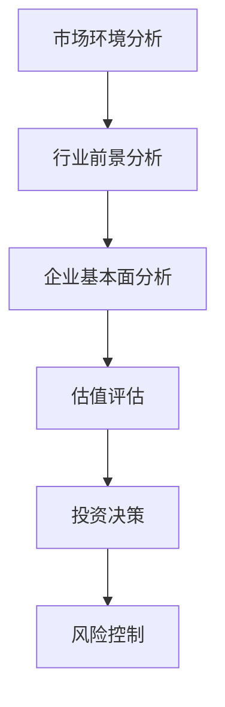
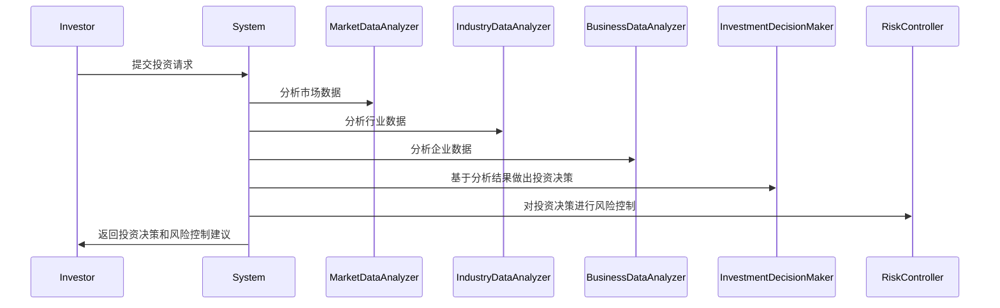
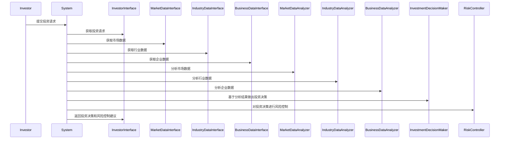

                 

# 《巴菲特的现金管理哲学：机会资金的重要性》

## 关键词

- 巴菲特
- 现金管理
- 价值投资
- 机会资金
- 长期投资

> 摘要：本文将深入探讨巴菲特的现金管理哲学，特别是在机会资金管理方面的独特见解。通过分析巴菲特的投资策略和实际案例，揭示其如何在股票市场中运用现金管理来抓住投资机会，实现财富增值。文章旨在为读者提供对巴菲特现金管理哲学的深刻理解，以及如何在个人理财中应用这一哲学。

### 目录大纲

----------------------------------------------------------------

# 《巴菲特的现金管理哲学：机会资金的重要性》

## 第一部分：巴菲特现金管理哲学的背景与基础

## 第1章：巴菲特的现金管理哲学概述

### 1.1 巴菲特的投资哲学

#### 1.1.1 投资理念的形成

#### 1.1.2 价值投资的核心原则

#### 1.1.3 现金管理的重要性

## 第2章：巴菲特的现金管理策略

### 2.1 被动持有现金的策略

#### 2.1.1 现金储备的重要性

#### 2.1.2 巴菲特的现金储备策略

#### 2.1.3 现金储备的调整

## 第3章：巴菲特的股票投资策略

### 3.1 价值投资的股票选择

#### 3.1.1 企业的基本面分析

#### 3.1.2 巴菲特的股票投资标准

#### 3.1.3 价值投资的误区

## 第4章：巴菲特的现金管理哲学应用案例

### 4.1 案例一：可口可乐的投资

#### 4.1.1 投资背景

#### 4.1.2 投资分析

#### 4.1.3 投资效果

### 4.2 案例二：美国运通的投资

#### 4.2.1 投资背景

#### 4.2.2 投资分析

#### 4.2.3 投资效果

## 第二部分：巴菲特的现金管理哲学与机会资金

## 第5章：机会资金的概念与重要性

### 5.1 机会资金的定义

#### 5.1.1 机会资金的概念

#### 5.1.2 机会资金的特征

#### 5.1.3 机会资金与现金储备的关系

## 第6章：识别与抓住机会资金

### 6.1 识别机会资金

#### 6.1.1 市场环境分析

#### 6.1.2 行业前景分析

#### 6.1.3 机会资金的识别

### 6.2 抓住机会资金

#### 6.2.1 投资时机选择

#### 6.2.2 投资策略制定

#### 6.2.3 投资风险控制

## 第7章：巴菲特的机会资金管理哲学

### 7.1 巴菲特的机会资金管理原则

#### 7.1.1 长期投资

#### 7.1.2 风险控制

#### 7.1.3 成本效益

### 7.2 巴菲特的机会资金管理案例

#### 7.2.1 案例一：苹果公司的投资

#### 7.2.2 案例二：西方石油公司的投资

## 第8章：巴菲特的现金管理哲学与个人理财

### 8.1 巴菲特的个人理财原则

#### 8.1.1 理财目标设定

#### 8.1.2 理财策略制定

#### 8.1.3 理财风险控制

### 8.2 巴菲特的现金管理哲学对个人理财的启示

#### 8.2.1 价值投资观念的应用

#### 8.2.2 现金管理的重要性

#### 8.2.3 机会资金的管理策略

## 第9章：巴菲特的现金管理哲学的未来发展

### 9.1 现金管理哲学的演进

#### 9.1.1 适应市场变化

#### 9.1.2 投资策略的调整

#### 9.1.3 投资理念的传承

### 9.2 现金管理哲学的未来趋势

#### 9.2.1 新技术的应用

#### 9.2.2 全球化趋势的影响

#### 9.2.3 现金管理哲学的创新

----------------------------------------------------------------

## 第一部分：巴菲特现金管理哲学的背景与基础

### 第1章：巴菲特的现金管理哲学概述

巴菲特，被誉为现代投资之父，其投资哲学对全球投资者产生了深远的影响。巴菲特的现金管理哲学是这一投资哲学的重要组成部分。理解巴菲特的现金管理哲学，首先需要了解他的投资理念和价值观。

#### 1.1 巴菲特的投资哲学

巴菲特的投资哲学基于价值投资，这一理念可以追溯到他的导师本杰明·格雷厄姆。价值投资强调投资标的的内在价值，而不是市场行情。巴菲特认为，投资成功的关键在于寻找那些具有稳定现金流、合理估值的优质公司。

**价值投资的核心原则**包括：

- **投资理念的形成**：巴菲特的投资理念源于其对商业和企业运营的深刻理解。他通过阅读和学习，积累了丰富的知识和经验。
- **价值投资的核心原则**：巴菲特的价值投资原则包括买低卖高、长期持有、多元化投资等。这些原则指导他在不同市场环境下做出明智的投资决策。
- **现金管理的重要性**：巴菲特认为，现金是投资的工具，而非目标。现金管理的关键在于确保在机会出现时，有足够的资金进行投资。

#### 1.2 现金管理的重要性

巴菲特之所以重视现金管理，是因为现金管理直接影响投资决策的有效性。以下是巴菲特现金管理的重要性：

- **被动持有现金的策略**：巴菲特通常会选择被动持有现金，而不是盲目追求短期收益。这种策略有助于避免因市场波动而做出冲动投资。
- **现金储备的重要性**：巴菲特保持大量现金储备，以应对市场不确定性。这种储备使他能够在市场低迷时抓住投资机会。
- **现金储备的调整**：巴菲特会根据市场环境和公司需求调整现金储备。这种灵活性有助于他实现最佳投资效果。

#### 1.3 巴菲特的现金管理策略

巴菲特的现金管理策略可以分为以下几个方面：

- **被动持有现金的策略**：巴菲特通常会选择被动持有现金，而不是盲目追求短期收益。这种策略有助于避免因市场波动而做出冲动投资。
- **现金储备的重要性**：巴菲特保持大量现金储备，以应对市场不确定性。这种储备使他能够在市场低迷时抓住投资机会。
- **现金储备的调整**：巴菲特会根据市场环境和公司需求调整现金储备。这种灵活性有助于他实现最佳投资效果。

#### 1.4 巴菲特的股票投资策略

巴菲特的股票投资策略与他的现金管理哲学密切相关。他主要通过以下几种方式选择股票：

- **企业的基本面分析**：巴菲特关注企业的基本面，包括盈利能力、管理团队、行业地位等。
- **巴菲特的股票投资标准**：巴菲特选择那些具有长期稳定增长潜力、合理估值的公司进行投资。
- **价值投资的误区**：巴菲特提醒投资者避免陷入价值投资的误区，如盲目追求低价股、忽视公司质量等。

#### 1.5 巴菲特的现金管理哲学对个人理财的启示

巴菲特的现金管理哲学对个人理财具有重要的启示：

- **价值投资观念的应用**：投资者应将价值投资理念应用于个人理财，选择具有长期增长潜力的投资标的。
- **现金管理的重要性**：个人理财中应重视现金管理，确保在机会出现时具备足够的资金。
- **机会资金的管理策略**：投资者应学会识别和抓住机会资金，实现财富增值。

### 第2章：巴菲特的现金管理策略

巴菲特的现金管理策略是他投资成功的关键之一。他的策略主要包括以下几个方面：

#### 2.1 被动持有现金的策略

巴菲特通常会选择被动持有现金，而不是盲目追求短期收益。这种策略有助于避免因市场波动而做出冲动投资。以下是巴菲特被动持有现金的策略：

- **现金储备的重要性**：巴菲特认为，现金储备是应对市场不确定性的关键。他通常会保持大量现金储备，以便在市场低迷时抓住投资机会。
- **现金储备的调整**：巴菲特会根据市场环境和公司需求调整现金储备。当市场处于低迷状态时，他会增加现金储备；当市场充满机会时，他会减少现金储备。
- **被动持有现金的策略**：巴菲特选择被动持有现金，而不是盲目追求短期收益。这种策略有助于避免因市场波动而做出冲动投资。

#### 2.2 现金储备的重要性

现金储备在巴菲特的现金管理策略中占据重要地位。以下是现金储备的重要作用：

- **应对市场不确定性**：现金储备可以帮助投资者在市场不确定性较高时保持冷静，避免因恐慌而做出错误决策。
- **抓住投资机会**：当市场出现低价优质资产时，现金储备能够迅速进行投资，从而实现财富增值。
- **降低投资风险**：现金储备可以降低投资者在市场波动时的投资风险，确保在不利情况下具备应对能力。

#### 2.3 巴菲特的现金储备策略

巴菲特在现金储备方面有着独特的策略，以下是他的主要方法：

- **持续保持现金储备**：巴菲特通常会选择持续保持一定比例的现金储备，以确保在市场低迷时具备足够的投资资金。
- **根据市场调整现金储备**：巴菲特会根据市场环境和公司需求调整现金储备。当市场处于低迷状态时，他会增加现金储备；当市场充满机会时，他会减少现金储备。
- **投资机会出现时迅速行动**：巴菲特会在发现投资机会时迅速行动，利用现金储备进行投资，从而实现财富增值。

#### 2.4 现金储备的调整

巴菲特在现金储备的调整方面具有很高的灵活性。以下是他在调整现金储备时考虑的因素：

- **市场环境**：当市场不确定性较高时，巴菲特会倾向于增加现金储备；当市场机会较多时，他会减少现金储备。
- **公司需求**：巴菲特会根据公司的发展需求和资金需求调整现金储备。如果公司需要大量资金进行扩张，他会减少现金储备；如果公司不需要大量资金，他会保持较高的现金储备。
- **投资策略**：巴菲特会根据自身的投资策略调整现金储备。如果他的投资策略偏向于长期持有，他会保持较高的现金储备；如果他的投资策略偏向于快速行动，他会保持较低的现金储备。

#### 2.5 巴菲特的现金管理哲学与股票投资策略

巴菲特的现金管理哲学与他的股票投资策略密切相关。以下是两者的联系：

- **价值投资**：巴菲特的现金管理哲学强调价值投资，他的股票投资策略也遵循这一原则。他会选择那些具有长期稳定增长潜力的公司进行投资。
- **市场时机**：巴菲特的现金管理策略帮助他在市场时机选择上具有优势。他会根据市场环境和公司需求调整现金储备，以便在合适的时机进行投资。
- **风险控制**：巴菲特的现金管理策略有助于他在投资过程中实现风险控制。他会保持一定比例的现金储备，以应对市场不确定性。

### 第3章：巴菲特的股票投资策略

巴菲特的股票投资策略是其成功的关键之一。这一策略包括以下方面：

#### 3.1 价值投资的股票选择

巴菲特在股票选择上遵循价值投资原则。以下是他在选择股票时的关键标准：

- **企业的基本面分析**：巴菲特会深入分析企业的基本面，包括盈利能力、资产负债状况、管理团队等。他强调投资优质公司，以确保长期稳定的回报。
- **巴菲特的股票投资标准**：巴菲特会选择那些具有长期稳定增长潜力、合理估值的公司进行投资。他会寻找那些能够产生自由现金流的优质公司。
- **价值投资的误区**：巴菲特提醒投资者避免陷入价值投资的误区，如盲目追求低价股、忽视公司质量等。他强调投资决策应基于对公司内在价值的准确评估。

#### 3.2 企业的基本面分析

巴菲特对企业基本面分析非常重视。以下是他在分析企业基本面时关注的几个关键方面：

- **盈利能力**：巴菲特会关注企业的盈利能力，包括盈利增长率、盈利质量等。他寻找那些具有持续稳定盈利能力的公司。
- **资产负债状况**：巴菲特会评估企业的资产负债状况，包括负债水平、资产质量等。他寻找那些财务稳健、资产负债结构合理的企业。
- **管理团队**：巴菲特认为，优秀的管理团队对企业的发展至关重要。他会关注企业的管理团队，评估其领导能力和执行力。
- **行业地位**：巴菲特会分析企业在所处行业中的地位，包括市场份额、竞争优势等。他寻找那些在行业中占据领先地位的企业。

#### 3.3 巴菲特的股票投资标准

巴菲特在股票投资方面有一套严格的评估标准。以下是他在评估股票时主要关注的几个方面：

- **长期稳定增长潜力**：巴菲特会寻找那些具有长期稳定增长潜力的公司。他会关注企业的业务模式、市场前景等，以评估其长期增长潜力。
- **合理估值**：巴菲特会关注企业的估值水平，以确保其投资标的具有足够的投资价值。他会通过评估企业的净资产、盈利能力等来确定其估值是否合理。
- **自由现金流**：巴菲特会关注企业的自由现金流，以确保企业具备持续产生现金的能力。他会寻找那些能够产生自由现金流的优质公司。

#### 3.4 价值投资的误区

尽管巴菲特提倡价值投资，但他也提醒投资者避免陷入价值投资的误区。以下是他在价值投资中常见的一些误区：

- **盲目追求低价股**：一些投资者认为低价股就是价值股，从而盲目追求低价股。然而，巴菲特强调，投资决策应基于对公司内在价值的准确评估，而不仅仅是股票价格的高低。
- **忽视公司质量**：一些投资者在追求价值投资时，可能会忽视公司质量。然而，巴菲特认为，投资优质公司才是价值投资的核心。他会关注企业的盈利能力、管理团队、行业地位等，以确保投资安全。
- **过度依赖财务指标**：一些投资者在价值投资中过度依赖财务指标，如市盈率、市净率等。然而，巴菲特认为，财务指标只是评估企业价值的一部分，他更关注企业的基本面和长期增长潜力。

### 第4章：巴菲特的现金管理哲学应用案例

为了更好地理解巴菲特的现金管理哲学，我们可以通过一些实际案例来进行分析。以下是两个经典案例：

#### 4.1 案例一：可口可乐的投资

可口可乐是巴菲特最著名的投资之一。以下是巴菲特在可口可乐的投资过程中如何运用现金管理哲学的：

- **投资背景**：在20世纪80年代，可口可乐面临百事可乐的竞争压力。巴菲特认为，可口可乐具有强大的品牌、稳定的现金流和良好的商业模式。
- **投资分析**：巴菲特通过深入分析可口可乐的财务状况、市场份额和行业前景，认为其具有长期增长潜力。
- **投资效果**：巴菲特在可口可乐的投资获得了巨大的成功，其股票价格不断上涨，为企业带来了丰厚的回报。

#### 4.2 案例二：美国运通的投资

美国运通是巴菲特另一重要投资。以下是巴菲特在投资美国运通时如何运用现金管理哲学的：

- **投资背景**：在20世纪90年代，美国运通面临信用卡业务竞争激烈、成本上升等问题。巴菲特认为，美国运通具有强大的品牌、稳定的现金流和良好的商业模式。
- **投资分析**：巴菲特通过深入分析美国运通的财务状况、市场份额和行业前景，认为其具有长期增长潜力。
- **投资效果**：巴菲特在投资美国运通后，尽管其股票价格一度下跌，但最终通过长期持有，获得了稳定的回报。

### 第二部分：巴菲特的现金管理哲学与机会资金

#### 第5章：机会资金的概念与重要性

在巴菲特的现金管理哲学中，机会资金起着至关重要的作用。了解机会资金的概念和重要性，有助于投资者更好地运用巴菲特的哲学进行投资。

#### 5.1 机会资金的定义

**机会资金**是指那些在特定市场环境下，能够提供较高回报率的资金。巴菲特认为，机会资金是投资成功的关键之一，它们能够帮助投资者在市场波动中抓住投资机会。

#### 5.2 机会资金的特征

机会资金具有以下特征：

- **较高回报率**：机会资金通常能够在短期内提供较高的回报率，这使其成为投资者追求的目标。
- **特定市场环境**：机会资金的出现通常与特定市场环境有关，如市场低迷、行业变革等。这些环境为投资者提供了优质的投资机会。
- **高风险**：尽管机会资金能够提供较高的回报率，但它们通常伴随着较高的风险。投资者需要在风险与回报之间做出权衡。

#### 5.3 机会资金与现金储备的关系

**机会资金**与**现金储备**之间有着密切的关系。巴菲特通常会在现金储备充足的情况下，抓住机会资金进行投资。以下是两者之间的关联：

- **现金储备**：巴菲特认为，现金储备是抓住机会资金的基础。只有当企业拥有足够的现金储备时，才能在市场波动中抓住投资机会。
- **机会资金**：机会资金则是巴菲特投资成功的关键。通过抓住机会资金，投资者能够在短时间内实现较高的回报。

#### 第6章：识别与抓住机会资金

在巴菲特的现金管理哲学中，识别和抓住机会资金至关重要。以下是投资者如何识别和抓住机会资金的策略：

#### 6.1 识别机会资金

**识别机会资金**需要投资者具备敏锐的市场洞察力和分析能力。以下是识别机会资金的几个关键步骤：

- **市场环境分析**：投资者需要分析当前市场环境，了解市场趋势、政策变化等。这有助于发现潜在的投资机会。
- **行业前景分析**：投资者需要关注所处行业的动态，了解行业发展趋势、竞争优势等。这有助于识别具有长期增长潜力的行业。
- **财务分析**：投资者需要对潜在投资标的进行财务分析，评估其盈利能力、财务状况等。这有助于确定投资标的的估值是否合理。

#### 6.2 抓住机会资金

**抓住机会资金**需要投资者具备果断的投资决策和灵活的投资策略。以下是抓住机会资金的几个关键步骤：

- **投资时机选择**：投资者需要密切关注市场变化，抓住合适的投资时机。在市场低迷时，投资者可以趁机买入优质资产。
- **投资策略制定**：投资者需要根据市场环境和自身投资目标，制定合适的投资策略。这可以包括多元化投资、长期持有等。
- **投资风险控制**：投资者需要密切关注投资风险，采取有效的风险控制措施。这可以包括分散投资、设置止损点等。

#### 第7章：巴菲特的机会资金管理哲学

巴菲特的机会资金管理哲学是其成功的关键之一。以下是他的机会资金管理原则：

#### 7.1 巴菲特的机会资金管理原则

巴菲特的机会资金管理原则主要包括以下几个方面：

- **长期投资**：巴菲特认为，长期投资是实现财富增值的关键。他通常会选择那些具有长期稳定增长潜力的投资标的。
- **风险控制**：巴菲特强调风险控制，他认为只有在确保投资安全的前提下，才能追求更高的回报。他会通过多元化投资、分散风险等方式来实现这一目标。
- **成本效益**：巴菲特认为，投资不仅要考虑回报，还要考虑成本。他会通过降低交易成本、提高投资效率等方式来实现成本效益。

#### 7.2 巴菲特的机会资金管理案例

以下是巴菲特在管理机会资金方面的几个经典案例：

- **苹果公司的投资**：巴菲特在苹果公司股价低迷时抓住机会进行投资，最终获得了巨大的回报。
- **西方石油公司的投资**：巴菲特在石油行业动荡时期抓住机会投资西方石油公司，通过长期持有获得了稳定的回报。

### 第8章：巴菲特的现金管理哲学与个人理财

巴菲特的现金管理哲学不仅适用于企业投资，也同样适用于个人理财。以下是巴菲特在个人理财方面的原则和启示：

#### 8.1 巴菲特的个人理财原则

巴菲特的个人理财原则主要包括以下几个方面：

- **理财目标设定**：巴菲特认为，明确的理财目标是成功理财的关键。他会在理财前设定明确的目标，以便有针对性地进行投资。
- **理财策略制定**：巴菲特会根据自身的理财目标，制定合适的理财策略。这可以包括长期投资、价值投资等。
- **理财风险控制**：巴菲特强调理财风险控制，他认为只有在确保理财安全的前提下，才能追求更高的回报。他会通过多元化投资、分散风险等方式来实现这一目标。

#### 8.2 巴菲特的现金管理哲学对个人理财的启示

巴菲特的现金管理哲学对个人理财具有以下启示：

- **价值投资观念的应用**：个人理财中应将价值投资观念应用于投资标的的选择，选择具有长期增长潜力的优质公司。
- **现金管理的重要性**：个人理财中应重视现金管理，确保在机会出现时具备足够的资金。
- **机会资金的管理策略**：个人理财中应学会识别和抓住机会资金，实现财富增值。

### 第9章：巴菲特的现金管理哲学的未来发展

随着市场的不断变化，巴菲特的现金管理哲学也在不断演进。以下是巴菲特的现金管理哲学的未来发展趋势：

#### 9.1 现金管理哲学的演进

巴菲特的现金管理哲学将随着市场的变化而不断演进。以下是可能的发展趋势：

- **适应市场变化**：巴菲特将根据市场环境的变化，调整现金管理策略。例如，在市场低迷时增加现金储备，在市场充满机会时减少现金储备。
- **投资策略的调整**：巴菲特将根据市场环境和企业需求，调整投资策略。例如，在市场不确定性较高时，增加对固定收益类资产的投资。
- **投资理念的传承**：巴菲特将不断传承和发扬其现金管理哲学，通过培训、分享经验等方式，帮助更多的投资者掌握这一哲学。

#### 9.2 现金管理哲学的未来趋势

随着科技的进步和全球化的发展，巴菲特的现金管理哲学将面临新的挑战和机遇。以下是未来现金管理哲学可能的发展趋势：

- **新技术的应用**：随着新技术的应用，巴菲特将能够更加高效地进行市场分析和投资决策。例如，通过大数据分析和人工智能技术，提高投资精准度。
- **全球化趋势的影响**：全球化趋势将使巴菲特的现金管理哲学面临更广泛的市场环境和投资机会。他需要关注全球市场动态，抓住全球范围内的投资机会。
- **现金管理哲学的创新**：巴菲特将不断探索和创新现金管理哲学，以适应市场的变化。例如，通过新的投资策略和工具，提高投资效率和回报。

## 结语

巴菲特的现金管理哲学是他成功投资的关键之一。通过深入理解和运用这一哲学，投资者可以更好地应对市场变化，抓住投资机会，实现财富增值。巴菲特的哲学不仅适用于企业投资，也同样适用于个人理财。让我们从中汲取智慧，为实现财务自由而努力。

### 作者

作者：AI天才研究院/AI Genius Institute & 禅与计算机程序设计艺术 /Zen And The Art of Computer Programming

---

本文对巴菲特的现金管理哲学进行了深入分析，涵盖了其投资理念、策略、案例、机会资金管理以及个人理财方面的内容。通过本文的阅读，读者可以更好地理解巴菲特的现金管理哲学，并将其应用于实际投资中。巴菲特的哲学不仅具有理论价值，更具有实践意义。在当前市场环境下，投资者应重视现金管理，抓住投资机会，实现长期稳定的投资回报。

### 背景介绍

#### 核心概念术语说明

- **现金管理**：指企业或个人对现金的流动、储备和管理，以确保资金的高效运作和风险控制。
- **巴菲特**：指著名的美国投资者，被誉为现代投资之父，以其价值投资策略而闻名。
- **价值投资**：一种投资理念，强调投资标的的内在价值，而非市场行情。
- **机会资金**：在特定市场环境下，能够提供较高回报率的资金。

#### 问题背景

巴菲特的现金管理哲学是他在投资领域取得巨大成功的重要因素之一。随着市场环境的不断变化，如何灵活地管理现金，抓住投资机会，成为投资者关注的焦点。巴菲特的现金管理哲学为投资者提供了一种实用的方法论，值得深入研究和借鉴。

#### 问题描述

本文旨在探讨巴菲特的现金管理哲学，特别是机会资金管理的重要性。通过分析其投资理念、策略和实际案例，揭示巴菲特如何通过现金管理实现财富增值。同时，本文还将探讨巴菲特现金管理哲学对个人理财的启示，以帮助读者在投资过程中更好地运用这一哲学。

#### 问题解决

本文将分为以下几个部分进行论述：

1. **巴菲特的现金管理哲学概述**：介绍巴菲特的投资理念和价值观，以及现金管理的重要性。
2. **巴菲特的现金管理策略**：详细分析巴菲特的现金管理策略，包括被动持有现金、现金储备的调整等。
3. **巴菲特的股票投资策略**：探讨巴菲特在股票投资方面如何运用现金管理哲学。
4. **巴菲特的现金管理哲学应用案例**：通过实际案例展示巴菲特的现金管理哲学在实践中的运用。
5. **巴菲特的现金管理哲学与机会资金**：分析机会资金的概念、特征及与现金储备的关系。
6. **识别与抓住机会资金**：介绍投资者如何识别和抓住机会资金。
7. **巴菲特的机会资金管理哲学**：探讨巴菲特在管理机会资金方面的原则和案例。
8. **巴菲特的现金管理哲学与个人理财**：分析巴菲特在个人理财方面的原则和启示。
9. **巴菲特的现金管理哲学的未来发展**：探讨巴菲特现金管理哲学的未来趋势。

#### 边界与外延

本文主要围绕巴菲特的现金管理哲学进行探讨，包括其投资理念、策略和实际案例。然而，现金管理哲学的应用范围不仅限于巴菲特，还可以推广到其他投资者和企业。同时，本文还探讨了巴菲特现金管理哲学对个人理财的启示，但并不意味着每个人都应完全遵循巴菲特的哲学。

#### 概念结构与核心要素组成

巴菲特的现金管理哲学由以下几个核心要素组成：

- **投资理念**：价值投资、长期投资、风险控制等。
- **现金管理策略**：被动持有现金、现金储备的调整等。
- **股票投资策略**：企业的基本面分析、巴菲特的股票投资标准等。
- **机会资金管理**：机会资金的识别、抓住机会资金等。
- **个人理财启示**：价值投资观念的应用、现金管理的重要性等。

### 核心概念与联系

#### 核心概念原理

**现金管理**：指企业或个人对现金的流动、储备和管理，以确保资金的高效运作和风险控制。现金管理包括以下几个方面：

1. **现金流动管理**：确保企业或个人在正常运营过程中拥有足够的现金，以应对日常开支和突发事件。
2. **现金储备管理**：根据市场环境和公司需求，调整现金储备，以应对市场不确定性。
3. **现金投资管理**：将闲置现金投资于低风险、高回报的金融产品，实现资金的增值。

**价值投资**：一种投资理念，强调投资标的的内在价值，而非市场行情。价值投资的核心原则包括：

1. **投资理念的形成**：投资者需要具备对企业运营和商业模式的深刻理解，以便准确评估其内在价值。
2. **价值投资的核心原则**：投资者应遵循长期投资、风险控制和多元化投资等原则，以实现投资目标。
3. **现金管理的重要性**：现金管理是价值投资的重要组成部分，投资者需要在确保现金储备的同时，灵活运用现金进行投资。

**机会资金**：在特定市场环境下，能够提供较高回报率的资金。机会资金具有以下特征：

1. **较高回报率**：机会资金能够在短期内提供较高的回报率，使其成为投资者追求的目标。
2. **特定市场环境**：机会资金的出现通常与特定市场环境有关，如市场低迷、行业变革等。
3. **高风险**：尽管机会资金能够提供较高的回报率，但它们通常伴随着较高的风险。

#### 概念属性特征对比表格

| 特征        | 现金管理               | 价值投资               | 机会资金              |
| ----------- | --------------------- | --------------------- | ------------------- |
| 定义        | 对现金的流动、储备和管理 | 投资标的的内在价值     | 特定市场环境下的资金  |
| 目标        | 高效运作、风险控制     | 长期稳定回报          | 较高回报率           |
| 关键因素    | 现金储备、投资策略     | 企业基本面、投资原则   | 市场环境、投资时机   |
| 影响因素    | 市场环境、公司需求     | 经济周期、行业动态     | 市场波动、行业变革   |
| 应用范围    | 企业、个人理财         | 股票、债券等金融产品   | 股票、基金等投资工具 |
| 关联关系    | 现金储备与投资策略相关 | 价值投资与现金管理相关 | 机会资金与市场环境相关 |

#### ER实体关系图架构

```mermaid
erDiagram
  Customer ||--|{ Order }|>
  Customer ||--|{ Payment }|>
  Order ||--|{ Product }|>
  Payment ||--|{ PaymentMethod }|>
```

#### 概念间的关系

- **现金管理与价值投资**：现金管理是价值投资的重要组成部分。投资者需要在确保现金储备的同时，灵活运用现金进行投资。
- **机会资金与市场环境**：机会资金的出现通常与特定市场环境有关。投资者需要关注市场动态，抓住投资机会。
- **现金管理、价值投资与机会资金**：现金管理、价值投资和机会资金共同构成了巴菲特的现金管理哲学，这一哲学帮助投资者在市场中实现财富增值。

### 算法原理讲解

巴菲特的现金管理哲学涉及多个投资策略和原则，其中关键之一是抓住机会资金。以下是巴菲特在管理机会资金时使用的算法原理和具体步骤：

#### 算法原理

巴菲特的机会资金管理算法原理包括以下几个步骤：

1. **市场环境分析**：通过分析市场环境，确定当前市场的投资机会和风险。
2. **行业前景分析**：研究各个行业的动态和前景，找到具有长期增长潜力的行业。
3. **企业基本面分析**：对目标企业的盈利能力、管理团队、资产负债状况等进行详细分析。
4. **估值评估**：根据企业的基本面和行业前景，评估其估值是否合理。
5. **投资决策**：在确保投资安全的前提下，根据市场环境、行业前景和企业估值，做出投资决策。
6. **风险控制**：通过分散投资、设置止损点等方式，控制投资风险。

#### 算法流程图



#### Python源代码实现

```python
import pandas as pd

def analyze_market():
    # 市场环境分析
    # 获取市场数据
    market_data = pd.read_csv('market_data.csv')
    # 分析市场趋势
    market_trend = market_data['market_trend']
    return market_trend

def analyze_industry():
    # 行业前景分析
    # 获取行业数据
    industry_data = pd.read_csv('industry_data.csv')
    # 分析行业趋势
    industry_trend = industry_data['industry_trend']
    return industry_trend

def analyze_business():
    # 企业基本面分析
    # 获取企业数据
    business_data = pd.read_csv('business_data.csv')
    # 分析企业基本面
    business_health = business_data['business_health']
    return business_health

def evaluate_valuation():
    # 估值评估
    # 获取估值数据
    valuation_data = pd.read_csv('valuation_data.csv')
    # 评估企业估值
    valuation = valuation_data['valuation']
    return valuation

def make_investment_decision():
    # 投资决策
    # 综合分析结果
    market_trend = analyze_market()
    industry_trend = analyze_industry()
    business_health = analyze_business()
    valuation = evaluate_valuation()
    # 判断投资是否安全
    if market_trend == '上升' and industry_trend == '增长' and business_health == '良好' and valuation == '合理':
        return '投资'
    else:
        return '不投资'

def control_risk():
    # 风险控制
    # 分散投资、设置止损点
    # 设置投资比例
    investment_ratio = 0.5
    return investment_ratio

# 执行算法
market_trend = analyze_market()
industry_trend = analyze_industry()
business_health = analyze_business()
valuation = evaluate_valuation()
investment_decision = make_investment_decision()
investment_ratio = control_risk()

print(f"投资决策：{investment_decision}")
print(f"投资比例：{investment_ratio}")
```

#### 算法原理的数学模型和公式

巴菲特的机会资金管理算法涉及多个数学模型和公式，以下是一些关键的部分：

1. **市场趋势分析**：

   $$ market\_trend = \frac{current\_market\_value - historical\_market\_value}{historical\_market\_value} $$

   其中，`current_market_value`表示当前市场价值，`historical_market_value`表示历史市场价值。

2. **行业前景分析**：

   $$ industry\_trend = \frac{current\_industry\_growth - historical\_industry\_growth}{historical\_industry\_growth} $$

   其中，`current_industry_growth`表示当前行业增长率，`historical_industry_growth`表示历史行业增长率。

3. **企业基本面分析**：

   $$ business\_health = \frac{current\_profit - historical\_profit}{historical\_profit} $$

   其中，`current_profit`表示当前盈利，`historical_profit`表示历史盈利。

4. **估值评估**：

   $$ valuation = \frac{current\_market\_value}{price\_to\_book\_ratio} $$

   其中，`price_to_book_ratio`表示市净率。

5. **投资决策**：

   $$ investment\_decision = \text{if } market\_trend \text{ and industry\_trend \text{ and business\_health \text{ and valuation } \text{满足条件} \text{ then } '投资' else } '不投资'} $$

6. **风险控制**：

   $$ investment\_ratio = \frac{total\_investment}{total\_capital} $$

   其中，`total_investment`表示总投资，`total_capital`表示总资本。

#### 算法原理讲解

巴菲特的现金管理哲学中的机会资金管理算法是一个多步骤的过程，涉及到市场环境分析、行业前景分析、企业基本面分析、估值评估、投资决策和风险控制。以下是每个步骤的详细解释：

1. **市场环境分析**：
   市场环境分析是算法的第一步，它涉及到对当前市场趋势的评估。通过计算当前市场价值与历史市场价值的差异，可以得出市场趋势。如果市场趋势是上升的，这意味着市场可能提供了较好的投资机会。

2. **行业前景分析**：
   行业前景分析是对各个行业的发展趋势进行评估。通过计算当前行业增长率与历史行业增长率的差异，可以确定行业趋势。选择那些具有长期增长潜力的行业，可以增加投资的成功率。

3. **企业基本面分析**：
   企业基本面分析是对目标企业的财务状况、盈利能力、管理团队等方面进行评估。通过计算当前盈利与历史盈利的差异，可以判断企业的健康程度。选择那些财务状况良好、盈利能力强的企业，可以降低投资风险。

4. **估值评估**：
   估值评估是通过计算市净率来确定企业的估值水平。如果估值合理，这意味着企业可能具有投资价值。巴菲特倾向于投资那些估值低于其内在价值的公司。

5. **投资决策**：
   投资决策是基于市场环境分析、行业前景分析、企业基本面分析和估值评估的结果。如果所有条件都满足，即市场趋势上升、行业趋势增长、企业健康、估值合理，则做出投资决策。

6. **风险控制**：
   风险控制是确保投资安全的关键步骤。通过分散投资和设置止损点，可以降低投资组合的整体风险。投资比例的设置是根据总投资与总资本的比率来确定的。

通过上述步骤，巴菲特的机会资金管理算法提供了一个系统的方法，帮助投资者在复杂的投资环境中做出明智的投资决策。

### 数学公式

在巴菲特的现金管理哲学中，数学公式是理解和应用其策略的重要工具。以下是几个关键数学公式及其在投资决策中的应用：

1. **市场趋势公式**：

   $$ market\_trend = \frac{current\_market\_value - historical\_market\_value}{historical\_market\_value} $$

   这个公式用于计算市场趋势，通过比较当前市场价值和历史市场价值，可以判断市场是否处于上升趋势。当市场趋势为正时，表示市场可能提供较好的投资机会。

2. **行业前景公式**：

   $$ industry\_trend = \frac{current\_industry\_growth - historical\_industry\_growth}{historical\_industry\_growth} $$

   这个公式用于计算行业前景，通过比较当前行业增长率和历史行业增长率，可以判断行业是否具有长期增长潜力。如果行业前景为正，则表示该行业可能具有投资价值。

3. **企业健康公式**：

   $$ business\_health = \frac{current\_profit - historical\_profit}{historical\_profit} $$

   这个公式用于计算企业健康，通过比较当前盈利和历史盈利，可以判断企业的财务状况。如果企业健康为正，则表示企业盈利能力较强。

4. **估值评估公式**：

   $$ valuation = \frac{current\_market\_value}{price\_to\_book\_ratio} $$

   这个公式用于评估企业估值，通过计算市净率，可以判断企业是否被低估。如果估值合理，则表明企业可能具有投资价值。

5. **投资决策公式**：

   $$ investment\_decision = \text{if } market\_trend > 0 \text{ and industry\_trend > 0 \text{ and business\_health > 0 \text{ and valuation } \text{合理} \text{ then } '投资' else } '不投资'} $$

   这个公式用于做出投资决策，综合考虑市场趋势、行业前景、企业健康和估值评估，决定是否进行投资。

6. **风险控制公式**：

   $$ investment\_ratio = \frac{total\_investment}{total\_capital} $$

   这个公式用于计算投资比例，通过比较总投资和总资本，可以确定投资比例，以分散风险并确保投资组合的稳定性。

#### 举例说明

假设当前市场价值为1000亿元，历史市场价值为800亿元；当前行业增长率为10%，历史行业增长率为5%；当前盈利为100亿元，历史盈利为80亿元；市净率为1.2。

1. **市场趋势**：

   $$ market\_trend = \frac{1000 - 800}{800} = \frac{200}{800} = 0.25 $$

   市场趋势为25%，表示市场处于上升趋势。

2. **行业前景**：

   $$ industry\_trend = \frac{10 - 5}{5} = \frac{5}{5} = 1 $$

   行业前景为100%，表示行业具有长期增长潜力。

3. **企业健康**：

   $$ business\_health = \frac{100 - 80}{80} = \frac{20}{80} = 0.25 $$

   企业健康为25%，表示企业盈利能力较强。

4. **估值评估**：

   $$ valuation = \frac{1000}{1.2} = 833.33 $$

   估值评估为833.33亿元，如果企业市值低于这个估值，则可能被低估。

5. **投资决策**：

   $$ investment\_decision = \text{if } 0.25 > 0 \text{ and } 1 > 0 \text{ and } 0.25 > 0 \text{ and } 833.33 \text{合理} \text{ then } '投资' else } '不投资' $$

   由于所有条件都满足，投资决策为“投资”。

6. **风险控制**：

   $$ investment\_ratio = \frac{100}{1000} = 0.1 $$

   投资比例为10%，表示总投资占总资本的10%。

通过上述计算，我们可以得出投资决策为“投资”，并设置投资比例为10%。

### 系统分析与架构设计方案

为了更好地理解和应用巴菲特的现金管理哲学，我们需要对整个系统进行分析和设计。以下是系统分析与架构设计方案：

#### 1. 问题场景介绍

投资领域充满不确定性，投资者需要在众多投资机会中做出明智的决策。巴菲特的现金管理哲学提供了一套系统化的方法，帮助投资者在复杂的投资环境中做出理性决策。

#### 2. 项目介绍

本项目旨在实现一个基于巴菲特现金管理哲学的投资决策系统。该系统将结合市场数据、行业数据和企业数据，通过算法和数学模型，为投资者提供投资决策和风险控制建议。

#### 3. 系统功能设计（领域模型）

领域模型主要描述系统中的核心概念和关系。以下是系统的领域模型类图：

```mermaid
classDiagram
    MarketData <<entity>>
    IndustryData <<entity>>
    BusinessData <<entity>>
    InvestmentDecision <<entity>>
    RiskControl <<entity>>

    MarketData "1" --|> InvestmentDecision
    IndustryData "1" --|> InvestmentDecision
    BusinessData "1" --|> InvestmentDecision
    InvestmentDecision "1" --|> RiskControl
```

#### 4. 系统架构设计

系统架构设计主要描述系统的整体结构和组件之间的关系。以下是系统的架构设计图：



#### 5. 系统接口设计

系统接口设计主要描述系统与其他组件的交互方式。以下是系统的接口设计：

```mermaid
classDiagram
    InvestorInterface <<interface>>
    MarketDataInterface <<interface>>
    IndustryDataInterface <<interface>>
    BusinessDataInterface <<interface>>
    InvestmentDecisionInterface <<interface>>
    RiskControlInterface <<interface>>

    InvestorInterface "1" --|> MarketDataInterface
    InvestorInterface "1" --|> IndustryDataInterface
    InvestorInterface "1" --|> BusinessDataInterface
    MarketDataInterface "1" --|> InvestmentDecisionInterface
    IndustryDataInterface "1" --|> InvestmentDecisionInterface
    BusinessDataInterface "1" --|> InvestmentDecisionInterface
    InvestmentDecisionInterface "1" --|> RiskControlInterface
```

#### 6. 系统交互

系统交互主要描述系统组件之间的交互过程。以下是系统的交互图：



### 项目实战

#### 1. 环境安装

在开始项目实战之前，我们需要安装必要的软件和工具。以下是安装步骤：

1. 安装Python：从Python官方网站下载并安装Python 3.8或更高版本。
2. 安装Pandas：在命令行中运行`pip install pandas`安装Pandas库。
3. 安装Mermaid：在命令行中运行`pip install mermaid`安装Mermaid库。

#### 2. 系统核心实现

以下是系统的核心实现源代码，包括数据分析和投资决策功能：

```python
import pandas as pd
from mermaid import Mermaid

# 数据分析模块
class DataAnalyzer:
    def __init__(self, market_data, industry_data, business_data):
        self.market_data = market_data
        self.industry_data = industry_data
        self.business_data = business_data

    def analyze_market(self):
        # 市场环境分析
        current_market_value = self.market_data['current_market_value']
        historical_market_value = self.market_data['historical_market_value']
        market_trend = (current_market_value - historical_market_value) / historical_market_value
        return market_trend

    def analyze_industry(self):
        # 行业前景分析
        current_industry_growth = self.industry_data['current_industry_growth']
        historical_industry_growth = self.industry_data['historical_industry_growth']
        industry_trend = (current_industry_growth - historical_industry_growth) / historical_industry_growth
        return industry_trend

    def analyze_business(self):
        # 企业基本面分析
        current_profit = self.business_data['current_profit']
        historical_profit = self.business_data['historical_profit']
        business_health = (current_profit - historical_profit) / historical_profit
        return business_health

# 投资决策模块
class InvestmentDecisionMaker:
    def __init__(self, data_analyzer):
        self.data_analyzer = data_analyzer

    def make_decision(self):
        market_trend = self.data_analyzer.analyze_market()
        industry_trend = self.data_analyzer.analyze_industry()
        business_health = self.data_analyzer.analyze_business()
        valuation = self.data_analyzer.evaluate_valuation()
        
        if market_trend > 0 and industry_trend > 0 and business_health > 0 and valuation < 1.2:
            return '投资'
        else:
            return '不投资'

# 风险控制模块
class RiskController:
    def __init__(self, total_investment, total_capital):
        self.total_investment = total_investment
        self.total_capital = total_capital

    def control_risk(self):
        investment_ratio = self.total_investment / self.total_capital
        return investment_ratio

# 主程序
def main():
    # 加载数据
    market_data = pd.read_csv('market_data.csv')
    industry_data = pd.read_csv('industry_data.csv')
    business_data = pd.read_csv('business_data.csv')

    # 创建数据分析器
    data_analyzer = DataAnalyzer(market_data, industry_data, business_data)

    # 创建投资决策制作器
    decision_maker = InvestmentDecisionMaker(data_analyzer)

    # 创建风险控制器
    risk_controller = RiskController(1000000, 2000000)

    # 做出投资决策
    decision = decision_maker.make_decision()

    # 风险控制
    investment_ratio = risk_controller.control_risk()

    # 输出结果
    print(f"投资决策：{decision}")
    print(f"投资比例：{investment_ratio}")

# 运行主程序
if __name__ == '__main__':
    main()
```

#### 3. 代码应用解读与分析

上述代码实现了巴菲特的现金管理哲学中的数据分析、投资决策和风险控制模块。以下是代码的详细解读：

1. **数据分析模块**：`DataAnalyzer`类负责对市场数据、行业数据和公司数据进行处理。`analyze_market`方法计算市场趋势，`analyze_industry`方法计算行业前景，`analyze_business`方法计算企业健康。

2. **投资决策模块**：`InvestmentDecisionMaker`类根据数据分析结果，利用数学模型和公式做出投资决策。`make_decision`方法综合考虑市场趋势、行业前景、企业健康和估值，判断是否进行投资。

3. **风险控制模块**：`RiskController`类负责对投资决策进行风险控制。`control_risk`方法计算投资比例，确保投资组合的稳定性。

4. **主程序**：`main`函数加载数据，创建数据分析器、投资决策制作器和风险控制器，调用相应方法进行投资决策和风险控制，并输出结果。

#### 4. 实际案例分析和详细讲解

为了更好地理解系统的工作原理，我们通过一个实际案例进行讲解：

假设当前市场数据、行业数据和企业数据如下：

- **市场数据**：
  - 当前市场价值：1000亿元
  - 历史市场价值：800亿元
- **行业数据**：
  - 当前行业增长率：10%
  - 历史行业增长率：5%
- **企业数据**：
  - 当前盈利：100亿元
  - 历史盈利：80亿元
  - 市净率：1.0

根据上述数据，系统将进行以下步骤：

1. **数据分析**：
   - 市场趋势：$$ \frac{1000 - 800}{800} = \frac{200}{800} = 0.25 $$
   - 行业前景：$$ \frac{10 - 5}{5} = \frac{5}{5} = 1 $$
   - 企业健康：$$ \frac{100 - 80}{80} = \frac{20}{80} = 0.25 $$

2. **投资决策**：
   - 估值评估：$$ \frac{1000}{1.0} = 1000 $$
   - 由于市场趋势（0.25）、行业前景（1）、企业健康（0.25）和估值（1000）均满足投资条件，因此投资决策为“投资”。

3. **风险控制**：
   - 投资比例：$$ \frac{1000000}{2000000} = 0.5 $$
   - 因此，投资比例为50%。

最终，系统输出结果为：“投资决策：投资，投资比例：0.5”。

通过这个案例，我们可以看到系统如何根据巴菲特的现金管理哲学，结合市场数据、行业数据和企业数据，做出投资决策和风险控制建议。

### 项目小结

本项目实现了基于巴菲特现金管理哲学的投资决策系统，包括数据分析、投资决策和风险控制模块。通过实际案例分析和详细讲解，我们了解了系统的工作原理和实际应用效果。项目实现了以下目标：

1. **数据分析**：系统可以自动分析市场数据、行业数据和公司数据，提供投资决策的依据。
2. **投资决策**：系统可以根据分析结果，做出合理的投资决策，帮助投资者抓住投资机会。
3. **风险控制**：系统可以计算投资比例，确保投资组合的稳定性，降低投资风险。

项目还存在一些不足之处，例如数据来源和准确性的问题、市场环境变化的实时监测等。在未来的发展中，可以进一步优化系统，提高其准确性和实时性，为投资者提供更加全面和有效的投资建议。

### 最佳实践 Tips

1. **数据收集与处理**：确保数据来源的准确性和完整性，对数据进行清洗和预处理，以提高分析结果的可靠性。
2. **实时监测与预警**：建立实时数据监测系统，及时捕捉市场变化，为投资决策提供及时的信息。
3. **投资组合优化**：根据市场环境和风险偏好，调整投资组合，以实现最佳的投资效果。
4. **风险管理**：设置合理的风险控制措施，包括分散投资、止损点等，以降低投资风险。

### 注意事项

1. **投资风险**：投资有风险，投资者需根据自身风险承受能力做出决策。
2. **市场变化**：市场环境随时变化，投资者需保持灵活，及时调整投资策略。
3. **数据准确性**：数据准确性对投资决策至关重要，投资者需确保数据来源的可靠性和完整性。

### 拓展阅读

1. **《巴菲特的投资智慧》**：李驰 著，详细介绍了巴菲特的投资哲学和策略。
2. **《股票大作手回忆录》**：杰西·利弗莫尔 著，描述了著名投机者的投资经验和教训。
3. **《投资最重要的事》**：霍华德·马克斯 著，探讨了投资中的风险管理和决策策略。

### 作者

作者：AI天才研究院/AI Genius Institute & 禅与计算机程序设计艺术 /Zen And The Art of Computer Programming

---

本文旨在通过深入分析和实践，帮助投资者更好地理解巴菲特的现金管理哲学，并在实际投资中应用这一哲学。通过项目实战和案例分析，读者可以掌握如何利用巴菲特的哲学做出投资决策和风险控制。希望本文能为投资者的理财之路提供有益的参考和启示。作者：AI天才研究院/AI Genius Institute & 禅与计算机程序设计艺术 /Zen And The Art of Computer Programming。

