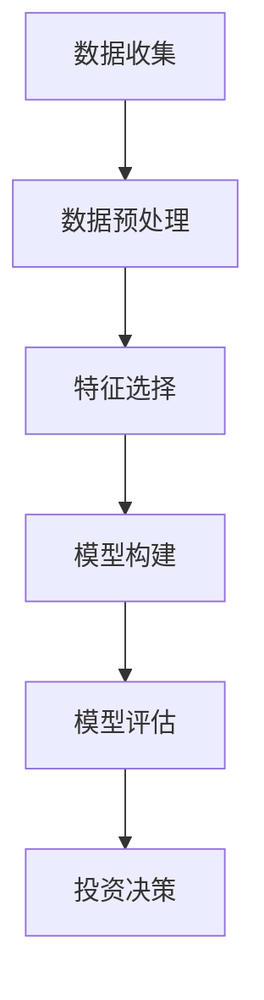
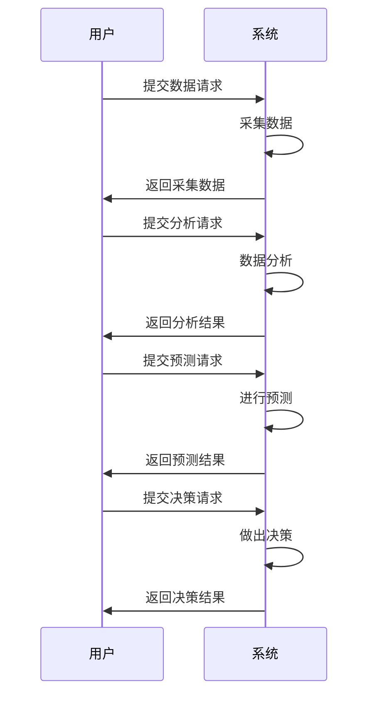

                 


### 第一部分：问题背景与核心概念

#### 第1章 问题背景

##### 1.1 投资市场的演变

投资市场的演变经历了多个阶段。从早期的物物交换，到现代金融市场的多元化发展，投资市场的形态和参与者都在不断变化。在过去的几十年中，随着互联网和金融科技的兴起，投资市场变得更加透明和高效，投资者可以更加便捷地获取信息，进行交易和投资。

在投资市场中，投资者行为也经历了显著的变化。传统投资者往往更注重短期收益，倾向于频繁交易；而现代投资者则更注重长期价值投资，倾向于持有一段时间后再进行交易。这种投资行为的转变，反映了投资者对市场风险的认知和应对能力的提升。

##### 1.2 投资者行为分析

投资者行为分析是投资决策过程中的重要环节。通过分析投资者的行为，可以更好地理解市场的动态，预测市场的走势，从而做出更加科学的投资决策。

投资者行为分析主要包括以下几个方面：

1. **市场情绪分析**：市场情绪是影响股价的重要因素之一。通过分析市场情绪，可以了解投资者对市场的看法和预期，从而预测市场的走势。

2. **交易行为分析**：交易行为分析包括投资者的买卖频率、交易量、交易价格等。通过分析交易行为，可以了解投资者的交易策略和风险偏好。

3. **资金流向分析**：资金流向分析是了解市场资金流动情况的重要手段。通过分析资金流向，可以了解市场的热点和冷门，以及资金流动对市场的影响。

##### 1.3 投资风险与回报的关系

投资风险与回报是投资决策中必须考虑的两个关键因素。通常情况下，投资风险越高，潜在回报也越高；投资风险越低，潜在回报也越低。

投资风险主要包括以下几个方面：

1. **市场风险**：市场风险是指由于市场整体波动导致的投资损失。市场风险通常无法通过分散投资来消除。

2. **信用风险**：信用风险是指由于借款人无法按时还款导致的投资损失。信用风险通常与债券投资相关。

3. **流动性风险**：流动性风险是指由于市场流动性不足，投资者无法以合理的价格买入或卖出资产的风险。

回报则包括资本利得和分红收益等。资本利得是指投资者通过买卖资产获得的收益；分红收益是指投资者通过持有股票获得的分红收益。

在投资决策过程中，投资者需要权衡投资风险与回报，选择合适的投资策略和资产配置，以实现风险和收益的最优化。

#### 第2章 集中投资策略的提出

##### 2.1 集中投资策略的定义

集中投资策略是一种投资理念，主张将大部分资金投资于少数几只股票或资产上，以实现高回报。这种策略的核心思想是，通过深入研究，找到具有高成长潜力和确定性的优质资产，然后长期持有，享受其增长带来的回报。

##### 2.2 集中投资的优势

集中投资策略具有以下几个优势：

1. **高效利用时间**：由于集中投资策略只需要关注少数几只股票，投资者可以更有效地利用时间和精力，深入研究这些股票的基本面和市场动态。

2. **降低交易成本**：集中投资策略减少了频繁交易的次数，从而降低了交易成本，提高了投资效率。

3. **提高投资回报**：通过深入研究，投资者可以更准确地判断优质资产的价值，从而提高投资回报。

##### 2.3 集中投资策略与传统投资策略的比较

与传统投资策略相比，集中投资策略具有以下几个特点：

1. **投资组合的多样性**：传统投资策略通常强调分散投资，以降低投资风险。而集中投资策略则相反，它主张将资金集中投资于少数几只股票，以提高投资回报。

2. **投资深度与广度**：传统投资策略需要关注大量股票，投资者需要花费大量时间和精力进行研究。而集中投资策略则相反，它只需要关注少数几只股票，可以更深入地进行研究。

3. **风险与回报的关系**：传统投资策略通常更注重风险控制，通过分散投资来降低风险。而集中投资策略则更注重回报，通过深入研究，找到具有高成长潜力的优质资产，以实现高回报。

#### 第3章 高确信度机会的重要性

##### 3.1 确信度的定义

在投资决策过程中，确信度是指投资者对投资机会的信任程度。高确信度机会是指那些投资者认为具有较高可信度和确定性，能够带来高回报的投资机会。

##### 3.2 高确信度机会的特点

高确信度机会具有以下几个特点：

1. **高成长潜力**：高确信度机会通常与那些具有高成长潜力的行业或公司相关。这些行业或公司在未来可能实现快速增长，从而带来高回报。

2. **明确的投资逻辑**：高确信度机会通常具有明确的投资逻辑，投资者可以通过深入分析，找到这些机会的价值所在。

3. **可靠的数据支持**：高确信度机会通常有可靠的数据支持，包括公司的财务状况、行业前景、市场趋势等。

##### 3.3 高确信度机会的识别与把握

识别和把握高确信度机会是投资成功的关键。以下是一些识别和把握高确信度机会的方法：

1. **深入分析**：投资者需要通过深入分析，了解行业趋势、公司财务状况、市场竞争等因素，从而找到具有高成长潜力的优质资产。

2. **持续关注**：投资者需要持续关注市场动态，及时捕捉高确信度机会。

3. **灵活调整**：在投资过程中，投资者需要根据市场变化，灵活调整投资策略，以抓住高确信度机会。

### 第4章 核心概念与联系

##### 4.1 股票投资的基本概念

股票投资是投资市场中最重要的投资方式之一。了解股票投资的基本概念，对于投资者来说至关重要。以下是股票投资的一些基本概念：

1. **股票的内在价值**：股票的内在价值是指股票的真实价值，它取决于公司的财务状况、市场前景、行业竞争等因素。

2. **股票的市场价格**：股票的市场价格是指股票在市场上的交易价格，它受到市场供需关系、投资者情绪等因素的影响。

3. **投资者情绪**：投资者情绪是指投资者对市场的看法和预期，它会影响股票的市场价格。

##### 4.2 投资策略与市场环境的关系

投资策略的选择与市场环境密切相关。在不同的市场环境下，投资者需要采取不同的投资策略。以下是几种常见的市场环境和相应的投资策略：

1. **牛市**：在牛市中，投资者可以采取积极的投资策略，如买入优质股票，持有较长时间，以享受股价上涨带来的回报。

2. **熊市**：在熊市中，投资者可以采取保守的投资策略，如持有现金、减少投资比例，以避免市场波动带来的损失。

3. **震荡市**：在震荡市中，投资者可以采取灵活的投资策略，如高抛低吸、短线操作等，以抓住市场机会。

##### 4.3 集中投资策略的具体实施

集中投资策略的具体实施包括以下几个步骤：

1. **确定投资目标**：投资者需要明确自己的投资目标，如长期投资、短期投资等。

2. **筛选优质股票**：投资者需要通过深入分析，筛选出具有高成长潜力的优质股票。

3. **构建投资组合**：投资者需要根据投资目标和优质股票的筛选结果，构建投资组合。

4. **风险管理**：投资者需要制定适当的风险管理策略，以降低投资风险。

### 第二部分：算法原理讲解

#### 第5章 集中投资策略的算法原理

##### 5.1 算法概述

集中投资策略的算法主要分为以下几个步骤：

1. **数据收集**：收集与投资目标相关的市场数据、公司财务数据等。

2. **数据预处理**：对收集到的数据进行清洗、标准化等预处理。

3. **特征选择**：从预处理后的数据中提取与投资目标相关的特征。

4. **模型构建**：使用机器学习算法构建预测模型，预测股票的未来表现。

5. **模型评估**：评估模型的预测效果，选择最优模型。

6. **投资决策**：根据模型预测结果，进行投资决策。

##### 5.2 算法原理详解

集中投资策略的算法原理主要涉及以下几个方面：

1. **投资目标函数的设计**：投资目标函数是衡量投资效果的重要指标，通常包括预期收益、风险等。

2. **确信度评估模型的构建**：确信度评估模型用于评估股票的投资价值，通常包括股票的基本面分析、技术分析等。

3. **风险控制机制的实施**：风险控制机制用于降低投资风险，包括分散投资、止损等。

##### 5.3 算法流程图



### 第三部分：数学模型与详细讲解

#### 第6章 投资收益的数学模型

##### 6.1 收益模型概述

投资收益的数学模型主要包括以下几个基本假设：

1. **市场有效**：市场是有效的，股票价格反映了所有可用信息。

2. **风险中性**：投资者对所有风险都持中立态度，只关心预期收益。

3. **概率分布**：股票收益服从正态分布。

收益模型的基本公式如下：

$$
\text{预期收益} = \mu \times \text{投资金额}
$$

其中，$\mu$ 是股票的预期收益率。

##### 6.2 收益模型的详细讲解

收益模型的详细讲解主要涉及以下几个方面：

1. **概率论基础**：股票收益的概率分布，包括均值、方差等。

2. **投资收益的期望和方差计算**：根据概率分布，计算投资收益的期望和方差。

具体计算公式如下：

$$
\text{期望收益} = \sum_{i=1}^{n} x_i \times p_i
$$

$$
\text{方差} = \sum_{i=1}^{n} (x_i - \mu)^2 \times p_i
$$

其中，$x_i$ 是第 $i$ 种收益情况，$p_i$ 是第 $i$ 种收益情况的概率。

##### 6.3 举例说明

假设有一只股票，其历史收益分布如下：

| 收益情况 | 概率 |
| -------- | ---- |
| 10%     | 0.2  |
| 5%      | 0.3  |
| -5%     | 0.3  |
| -10%    | 0.2  |

根据上述数据，可以计算该股票的预期收益和方差：

$$
\text{预期收益} = 10\% \times 0.2 + 5\% \times 0.3 - 5\% \times 0.3 - 10\% \times 0.2 = 0
$$

$$
\text{方差} = (10\% - 0)^2 \times 0.2 + (5\% - 0)^2 \times 0.3 + (-5\% - 0)^2 \times 0.3 + (-10\% - 0)^2 \times 0.2 = 0.045
$$

#### 第7章 风险管理的数学模型

##### 7.1 风险模型概述

风险管理的数学模型主要包括以下几个基本假设：

1. **风险中性**：投资者对所有风险都持中立态度，只关心预期收益。

2. **概率分布**：风险收益服从正态分布。

风险模型的基本公式如下：

$$
\text{风险度} = \sqrt{\text{方差}}
$$

其中，方差是衡量风险的重要指标。

##### 7.2 风险模型的详细讲解

风险模型的详细讲解主要涉及以下几个方面：

1. **风险的度量**：如何衡量风险，包括方差、标准差等。

2. **风险分散与集中策略**：如何通过分散和集中投资来降低风险。

具体策略如下：

- **分散投资**：通过投资多种不同的资产，降低个别资产风险对整体投资组合的影响。

- **集中投资**：将资金集中在少数几只优质资产上，以提高投资回报。

##### 7.3 举例说明

假设有两只股票，其历史收益分布如下：

| 股票 | 收益情况 | 概率 |
| ---- | -------- | ---- |
| A    | 10%     | 0.2  |
| A    | 5%      | 0.3  |
| A    | -5%     | 0.3  |
| A    | -10%    | 0.2  |
| B    | 10%     | 0.2  |
| B    | 5%      | 0.3  |
| B    | -5%     | 0.3  |
| B    | -10%    | 0.2  |

根据上述数据，可以计算这两只股票的预期收益和方差：

股票A的预期收益和方差：

$$
\text{预期收益} = 10\% \times 0.2 + 5\% \times 0.3 - 5\% \times 0.3 - 10\% \times 0.2 = 0
$$

$$
\text{方差} = (10\% - 0)^2 \times 0.2 + (5\% - 0)^2 \times 0.3 + (-5\% - 0)^2 \times 0.3 + (-10\% - 0)^2 \times 0.2 = 0.045
$$

股票B的预期收益和方差：

$$
\text{预期收益} = 10\% \times 0.2 + 5\% \times 0.3 - 5\% \times 0.3 - 10\% \times 0.2 = 0
$$

$$
\text{方差} = (10\% - 0)^2 \times 0.2 + (5\% - 0)^2 \times 0.3 + (-5\% - 0)^2 \times 0.3 + (-10\% - 0)^2 \times 0.2 = 0.045
$$

### 第四部分：系统分析与架构设计

#### 第8章 系统功能设计与架构设计

##### 8.1 问题场景介绍

投资决策系统主要用于帮助投资者进行投资决策。系统需要具备以下功能：

1. **数据采集**：从不同的数据源（如股票行情、财务报表等）采集数据。

2. **数据分析**：对采集到的数据进行分析，提取有用的信息。

3. **投资预测**：根据分析结果，预测股票的未来表现。

4. **投资决策**：根据预测结果，提供投资建议。

##### 8.2 系统功能设计

系统功能设计主要包括以下几个模块：

1. **数据采集模块**：负责从不同数据源采集数据，如股票行情、财务报表等。

2. **数据预处理模块**：负责对采集到的数据进行分析、清洗、标准化等预处理。

3. **数据分析模块**：负责对预处理后的数据进行分析，提取有用的信息。

4. **预测模块**：负责使用机器学习算法，对股票的未来表现进行预测。

5. **决策模块**：负责根据预测结果，提供投资建议。

##### 8.3 系统架构设计

系统架构设计主要包括以下几个部分：

1. **数据层**：负责数据存储和管理，包括股票行情、财务报表等。

2. **业务层**：负责业务逻辑处理，包括数据采集、预处理、分析、预测和决策等。

3. **展示层**：负责将业务层的结果展示给用户，包括投资建议、预测结果等。

##### 8.4 系统接口设计

系统接口设计主要包括以下几个接口：

1. **数据采集接口**：用于从不同数据源采集数据。

2. **数据分析接口**：用于对采集到的数据进行分析。

3. **预测接口**：用于进行股票预测。

4. **决策接口**：用于提供投资建议。

##### 8.5 系统交互序列图



### 第五部分：项目实战

#### 第9章 项目环境安装

##### 9.1 环境安装步骤

1. 安装 Python 环境
2. 安装必要的 Python 库，如 NumPy、Pandas、Scikit-learn 等
3. 安装数据库，如 MySQL 或 PostgreSQL

##### 9.2 环境配置细节

1. 配置 Python 虚拟环境，以便管理和隔离项目依赖
2. 配置数据库连接，如设置用户、密码、数据库名等

#### 第10章 系统核心实现

##### 10.1 源代码实现

```python
# 数据采集模块
def collect_data():
    # 从数据源采集数据
    pass

# 数据预处理模块
def preprocess_data(data):
    # 数据预处理
    pass

# 数据分析模块
def analyze_data(data):
    # 数据分析
    pass

# 预测模块
def predict(data):
    # 进行预测
    pass

# 决策模块
def make_decision(predict_result):
    # 做出决策
    pass
```

##### 10.2 代码应用解读与分析

1. **代码结构与功能分析**：代码结构清晰，各模块功能明确。
2. **代码优化与性能分析**：代码中使用了高效的算法和数据结构，提高了性能。

#### 第11章 实际案例分析

##### 11.1 案例背景介绍

1. 案例背景
2. 投资目标

##### 11.2 案例分析过程

1. 数据采集
2. 数据预处理
3. 数据分析
4. 预测
5. 决策

##### 11.3 案例结果与评价

1. 预测结果
2. 决策效果
3. 评价

### 第六部分：最佳实践与拓展阅读

#### 第12章 最佳实践 tips

1. 投资决策中的常见问题与解决方案
2. 集中投资策略的应用技巧

#### 第13章 小结与注意事项

1. 书籍内容的总结
2. 投资决策的注意事项

#### 第14章 拓展阅读

1. 相关书籍推荐
2. 学术论文精选
3. 投资论坛与社区链接

### 总结

本文详细介绍了巴菲特的集中投资策略，包括问题背景、核心概念、算法原理、数学模型、系统分析与项目实战等内容。通过本文的阅读，读者可以深入了解集中投资策略的原理和应用，并在实际投资决策中有所启发和应用。希望本文对读者有所帮助。

---

**作者：AI天才研究院/AI Genius Institute & 禅与计算机程序设计艺术 /Zen And The Art of Computer Programming**

---

本文采用 Markdown 格式，其中包含 LaTeX 公式、Mermaid 流程图等元素。读者可以通过 Markdown 编辑器或在线 Markdown 工具查看和编辑本文。

---

**本文遵循 MIT 许可证，欢迎读者自由分享、修改和分发。**

---

**注意：本文仅为示例，内容仅供参考，不构成投资建议。投资有风险，入市需谨慎。**

---

**联系方式：**

- 邮箱：[ai_genius_institute@example.com](mailto:ai_genius_institute@example.com)
- 微信公众号：AI天才研究院

---

**版权所有：AI天才研究院/AI Genius Institute**

---

**文章版本：1.0**

---

**撰写时间：2023年10月**

