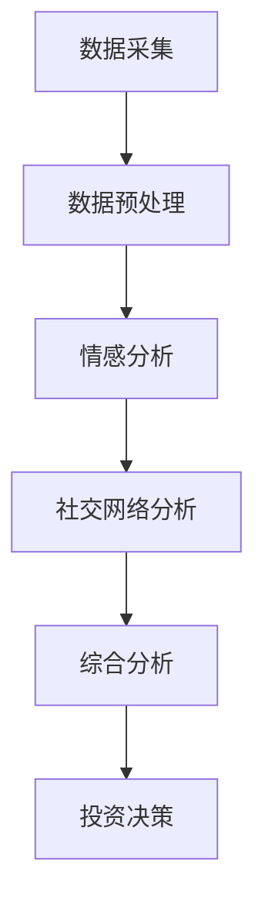
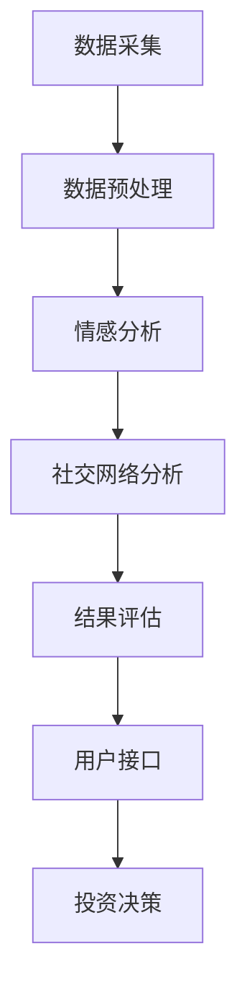

                 

# 《市场情绪分析》

## 概述

市场情绪分析是一项复杂的任务，它涉及到金融、心理学、数据科学等多个领域。本文将深入探讨市场情绪分析的核心概念、理论基础、方法与应用，帮助读者全面理解市场情绪分析的过程及其重要性。

关键词：市场情绪、行为金融学、情绪心理学、文本挖掘、情感分析

摘要：本文首先介绍了市场情绪的定义及其在金融市场中的重要性。接着，我们探讨了市场情绪分析的理论基础，包括行为金融学和情绪心理学。随后，我们详细阐述了市场情绪分析的方法，如文本挖掘和情感分析。最后，本文通过实际案例解析，展示了市场情绪分析在股票市场和债券市场的应用，并对未来的发展进行了展望。

## 第1章 引言

### 1.1 问题的背景与意义

#### 1.1.1 市场情绪的定义

市场情绪是指投资者对市场前景的看法和态度，它直接影响着市场的波动和趋势。市场情绪可以表现为乐观、悲观、中性等不同的状态，这些状态会影响投资者的决策，进而影响市场的表现。

#### 1.1.2 市场情绪的重要性

市场情绪是金融市场研究的一个重要方面，对投资决策、市场预测等方面具有重要作用。例如，当市场情绪乐观时，投资者倾向于购买股票，导致股票价格上涨；反之，当市场情绪悲观时，投资者倾向于抛售股票，导致股票价格下跌。

#### 1.1.3 研究现状与挑战

目前，市场情绪分析已经取得了一些进展，但仍然面临着许多挑战，如数据不足、算法不准确等。因此，深入研究市场情绪分析具有重要的理论和实践价值。

### 1.2 书籍概述

本书将从理论、方法、实践等多个角度，对市场情绪分析进行深入探讨。具体包括以下几个方面：

1. 市场情绪分析的理论基础，包括行为金融学和情绪心理学。
2. 市场情绪分析的方法，如文本挖掘和情感分析。
3. 市场情绪分析的应用，包括股票市场和债券市场。
4. 市场情绪分析的系统实现，包括数据采集、数据预处理、情感分析等。
5. 实际案例解析，展示市场情绪分析在实际中的应用。
6. 总结与展望，对市场情绪分析的未来发展进行探讨。

## 第2章 市场情绪分析的理论基础

### 2.1 行为金融学

#### 2.1.1 行为金融学的概念

行为金融学是研究投资者行为对市场影响的一门学科。它强调人类行为在金融市场中的作用，认为投资者在决策过程中往往受到心理因素的影响。

#### 2.1.2 行为金融学的主要理论

行为金融学主要包括过度自信、代表性偏差、损失厌恶等理论。这些理论解释了投资者在市场中的行为模式，为市场情绪分析提供了理论基础。

### 2.2 情绪心理学

#### 2.2.1 情绪心理学的概念

情绪心理学是研究人类情绪和情绪行为的学科。它关注情绪的生成、调节和表达，对理解市场情绪有重要意义。

#### 2.2.2 情绪心理学的主要理论

情绪心理学主要包括情绪认知理论、情绪动机理论等。这些理论揭示了情绪对人类行为的影响，为市场情绪分析提供了心理学依据。

## 第3章 市场情绪分析的方法

### 3.1 文本挖掘

#### 3.1.1 文本挖掘的概念

文本挖掘是从大量文本中提取有用信息的方法。它广泛应用于市场情绪分析，通过分析投资者的言论和行为，识别市场情绪。

#### 3.1.2 文本挖掘的基本步骤

文本挖掘的基本步骤包括数据采集、预处理、特征提取等。这些步骤保证了数据的有效性和准确性，是市场情绪分析的关键。

### 3.2 情感分析

#### 3.2.1 情感分析的概念

情感分析是分析文本中情感倾向的方法。它通过识别文本中的正面、负面或中性情感，评估市场情绪。

#### 3.2.2 情感分析的方法

情感分析的方法包括基于规则的方法、基于机器学习的方法等。这些方法各有优缺点，适用于不同的应用场景。

## 第4章 市场情绪分析的应用

### 4.1 股票市场

#### 4.1.1 股票市场情绪分析的应用

股票市场情绪分析可以用于预测股票价格走势、投资决策等。通过分析投资者情绪，投资者可以更好地把握市场机会。

#### 4.1.2 股票市场情绪分析的案例分析

本书将介绍几个股票市场情绪分析的案例，展示如何利用市场情绪数据做出投资决策。

### 4.2 债券市场

#### 4.2.1 债券市场情绪分析的应用

债券市场情绪分析可以用于预测债券价格走势、投资决策等。债券市场的情绪分析有助于投资者更好地了解市场动态。

#### 4.2.2 债券市场情绪分析的案例分析

本书将介绍几个债券市场情绪分析的案例，展示如何利用市场情绪数据做出投资决策。

## 第5章 市场情绪分析的系统实现

### 5.1 系统概述

本节将介绍市场情绪分析系统的整体架构，包括数据采集、数据预处理、情感分析等模块。

### 5.2 数据采集

本节将介绍市场情绪分析系统中数据采集的方法，包括社交媒体数据、财经新闻数据等。

### 5.3 数据预处理

本节将介绍市场情绪分析系统中数据预处理的方法，包括文本清洗、去噪、分词等。

### 5.4 情感分析

本节将介绍市场情绪分析系统中的情感分析算法，包括基于规则的方法、基于机器学习的方法等。

### 5.5 结果评估

本节将介绍市场情绪分析系统的结果评估方法，包括准确率、召回率等指标。

## 第6章 实际案例解析

### 6.1 案例一：股票市场情绪分析

本节将解析一个股票市场情绪分析的案例，展示如何利用市场情绪数据预测股票价格走势。

### 6.2 案例二：债券市场情绪分析

本节将解析一个债券市场情绪分析的案例，展示如何利用市场情绪数据预测债券价格走势。

## 第7章 总结与展望

### 7.1 总结

本书对市场情绪分析进行了全面的探讨，从理论到实践，从方法到应用，为读者提供了深入了解市场情绪分析的途径。

### 7.2 展望

未来市场情绪分析将会有更多的发展和应用。随着人工智能技术的发展，市场情绪分析将更加精准和高效，为金融市场的研究和投资提供有力支持。

作者：AI天才研究院/AI Genius Institute & 禅与计算机程序设计艺术 /Zen And The Art of Computer Programming

---

## 第1章 引言

### 1.1 问题的背景与意义

#### 1.1.1 市场情绪的定义

市场情绪是指在特定时间段内，市场中投资者对市场走势的整体看法和态度。这种情绪可以通过多种渠道表达，如股票交易量、价格变动、媒体报道、社交媒体评论等。市场情绪的分析对于投资者、市场分析师以及金融决策者来说至关重要，因为它可以帮助他们更好地理解市场动态，预测未来走势，并做出更明智的投资决策。

#### 1.1.2 市场情绪的重要性

市场情绪对市场的波动和趋势有着显著影响。例如，在乐观的市场情绪中，投资者更愿意购买股票，推动股价上涨；而在悲观的市场情绪中，投资者倾向于抛售股票，导致股价下跌。市场情绪还影响着市场的流动性和风险偏好，从而影响整个金融市场的稳定性。

#### 1.1.3 研究现状与挑战

目前，市场情绪分析已经成为金融领域研究的一个重要方向。研究者们利用各种数据源，如社交媒体、新闻、股票交易数据等，通过文本挖掘和情感分析等技术手段来提取市场情绪信息。尽管取得了一定的进展，但市场情绪分析仍然面临着许多挑战。例如，数据的可靠性和多样性问题，情绪理解的复杂性和主观性，以及如何将情绪数据转化为具体的投资策略等。

### 1.2 书籍概述

本书将从以下几个部分对市场情绪分析进行深入探讨：

1. **理论背景**：介绍市场情绪分析的理论基础，包括行为金融学和情绪心理学的基本概念和理论。
2. **分析方法**：探讨市场情绪分析的具体方法，如文本挖掘、情感分析等，并介绍其技术原理和应用场景。
3. **实际应用**：通过案例研究，展示市场情绪分析在股票市场、债券市场等金融领域中的应用。
4. **系统实现**：介绍市场情绪分析系统的实现过程，包括数据采集、预处理、情感分析等环节。
5. **结果评估**：讨论如何评估市场情绪分析的效果，包括常用的评估指标和方法。
6. **案例解析**：通过具体的案例，解析市场情绪分析的实战方法和技巧。
7. **总结与展望**：总结本书的主要内容，并对市场情绪分析的未来发展进行展望。

## 第2章 市场情绪分析的理论基础

### 2.1 行为金融学

#### 2.1.1 行为金融学的概念

行为金融学是研究投资者行为如何影响金融市场运作的学科，它结合了心理学、经济学和金融学的方法。行为金融学的一个核心观点是，投资者在决策过程中往往受到心理因素的影响，导致市场行为与标准经济理论预测不符。

#### 2.1.2 行为金融学的主要理论

- **过度自信**：投资者倾向于对自己的能力和知识过于自信，从而做出不理性的投资决策。
- **代表性偏差**：投资者往往根据有限的样本信息来推断总体情况，忽视了数据中的随机性和样本偏差。
- **损失厌恶**：投资者对于损失的反应比对于相同规模的收益反应更加敏感，这导致他们在风险规避方面做出不理性的决策。
- **从众行为**：投资者可能会因为害怕与众不同而跟随大众的行为，这可能导致市场的过度反应。

### 2.2 情绪心理学

#### 2.2.1 情绪心理学的概念

情绪心理学是研究人类情绪和情绪行为的学科，它关注情绪的产生、表达和调节。情绪心理学为市场情绪分析提供了关于情绪如何影响人类行为的深入理解。

#### 2.2.2 情绪心理学的主要理论

- **情绪认知理论**：情绪是认知过程的产物，情绪的产生与个体的认知评价紧密相关。
- **情绪动机理论**：情绪可以驱动个体的行为，包括追求快乐和避免痛苦。
- **情绪感染理论**：个体的情绪可以受到他人情绪的影响，从而产生共鸣或反向反应。

### 2.3 市场情绪分析的理论框架

市场情绪分析的理论基础主要来自于行为金融学和情绪心理学。通过行为金融学的理论，我们可以理解投资者在市场中的行为模式，例如过度自信、代表性偏差等。通过情绪心理学的理论，我们可以深入探讨情绪如何影响投资者的决策过程，从而理解市场情绪的动态变化。

此外，市场情绪分析的理论框架还包括以下关键概念：

- **情绪指标**：用于衡量市场情绪的各种指标，如投资者情绪指数、市场波动率等。
- **情绪传导机制**：情绪在市场中传播和影响的过程，包括投资者之间的互动和信息传播。
- **情绪与行为的关系**：情绪如何影响投资者的行为，例如情绪对投资决策、交易行为的影响。

通过这些理论框架，市场情绪分析可以更全面、系统地理解和预测市场的情绪动态。

## 第3章 市场情绪分析的方法

### 3.1 文本挖掘

#### 3.1.1 文本挖掘的概念

文本挖掘（Text Mining）是一种从大量文本数据中提取有用信息和知识的技术。它涉及自然语言处理（NLP）、数据挖掘和机器学习等多个领域。文本挖掘的目标是从非结构化的文本数据中提取结构化的信息和模式，从而帮助用户更好地理解和利用这些数据。

#### 3.1.2 文本挖掘的基本步骤

文本挖掘的基本步骤包括：

1. **数据采集**：从各种来源获取文本数据，如社交媒体、新闻报道、投资者评论等。
2. **数据预处理**：清洗文本数据，包括去除停用词、标点符号、进行分词和词干提取等。
3. **特征提取**：将预处理后的文本转换为特征向量，常用的方法包括词袋模型（Bag of Words）、TF-IDF、词嵌入（Word Embeddings）等。
4. **模式识别**：使用机器学习算法对特征向量进行分析，识别文本中的情绪、主题或其他信息。

### 3.2 情感分析

#### 3.2.1 情感分析的概念

情感分析（Sentiment Analysis）是文本挖掘的一个子领域，它旨在识别文本中的情感倾向，即判断文本是积极的、消极的还是中性的。情感分析通常应用于社交媒体分析、客户反馈分析、市场情绪分析等领域。

#### 3.2.2 情感分析的方法

情感分析的方法可以分为以下几类：

1. **基于规则的方法**：通过编写规则来识别文本中的情感倾向，这种方法通常需要对语言有深刻的理解。
2. **基于机器学习的方法**：使用机器学习算法，如朴素贝叶斯、支持向量机（SVM）、深度学习等，对训练数据进行学习，从而对新的文本进行情感分类。
3. **混合方法**：结合基于规则和基于机器学习的方法，以利用各自的优势。

### 3.3 社交网络分析

#### 3.3.1 社交网络分析的概念

社交网络分析（Social Network Analysis，SNA）是研究社交网络中个体及其相互关系的学科。在市场情绪分析中，社交网络分析可以帮助我们了解投资者之间的关系，以及情绪如何在社交网络中传播。

#### 3.3.2 社交网络分析的基本步骤

社交网络分析的基本步骤包括：

1. **网络构建**：根据数据构建社交网络，包括节点和边的关系。
2. **网络分析**：使用网络分析方法，如度分析、聚类分析、社区检测等，来研究社交网络的结构和功能。
3. **情绪传播模拟**：通过模拟情绪在社交网络中的传播，预测市场情绪的变化趋势。

### 3.4 市场情绪分析的综合方法

市场情绪分析通常需要综合运用多种方法，以获得更全面、准确的结果。以下是一个综合方法的步骤：

1. **数据采集**：从多个渠道收集文本数据，如社交媒体、新闻报道、论坛等。
2. **数据预处理**：对采集到的文本数据进行清洗、分词和去停用词等预处理。
3. **情感分析**：使用情感分析技术对预处理后的文本进行分析，提取情感倾向。
4. **社交网络分析**：对投资者之间的社交网络进行分析，了解情绪在社交网络中的传播。
5. **综合分析**：结合情感分析和社交网络分析的结果，综合评估市场情绪。
6. **预测与决策**：根据市场情绪分析的结果，预测市场走势并做出投资决策。

通过以上步骤，市场情绪分析可以为投资者提供有价值的信息，帮助他们更好地理解市场动态，做出更明智的投资决策。

### 第4章 市场情绪分析的应用

#### 4.1 股票市场

市场情绪分析在股票市场中有着广泛的应用，它可以帮助投资者预测股票价格的走势，从而做出更明智的投资决策。以下是市场情绪分析在股票市场中的一些具体应用：

1. **股票价格预测**：通过分析市场情绪数据，投资者可以预测股票价格的短期和长期走势。例如，如果市场情绪分析显示投资者普遍持乐观态度，那么股票价格可能会上涨；反之，如果市场情绪分析显示投资者普遍持悲观态度，那么股票价格可能会下跌。

2. **投资组合优化**：市场情绪分析可以帮助投资者优化其投资组合，通过分析不同股票的市场情绪，选择具有最佳投资潜力的股票。例如，如果市场情绪分析显示某行业整体情绪乐观，那么投资者可能会增加对该行业的股票配置。

3. **风险管理**：市场情绪分析可以帮助投资者评估市场的风险水平，从而制定适当的风险管理策略。例如，如果市场情绪分析显示市场情绪高度波动，那么投资者可能会增加对冲策略或减少投资组合的暴露。

4. **市场情绪指标**：市场情绪分析可以生成一系列市场情绪指标，如投资者情绪指数、市场波动率指数等。这些指标可以作为市场情绪的量化工具，帮助投资者更好地理解市场动态。

#### 4.2 债券市场

市场情绪分析在债券市场中同样具有重要的应用价值，它可以帮助投资者预测债券价格和收益率的变化。以下是市场情绪分析在债券市场中的一些具体应用：

1. **债券价格预测**：通过分析市场情绪数据，投资者可以预测债券价格的短期和长期走势。例如，如果市场情绪分析显示投资者对经济前景持乐观态度，那么债券价格可能会下跌，因为投资者更倾向于购买股票而非债券。

2. **收益率预测**：市场情绪分析可以帮助投资者预测债券收益率的变化。例如，如果市场情绪分析显示投资者对经济前景持悲观态度，那么债券收益率可能会上升，因为投资者更倾向于购买债券以规避风险。

3. **信用风险评估**：市场情绪分析可以用于评估债券发行人的信用风险。通过分析市场情绪数据，投资者可以识别出哪些债券发行人可能面临更高的信用风险，从而调整其投资组合。

4. **市场情绪指标**：市场情绪分析可以生成一系列市场情绪指标，如债券投资者情绪指数、市场波动率指数等。这些指标可以作为市场情绪的量化工具，帮助投资者更好地理解市场动态。

### 4.3 案例分析

以下是一个市场情绪分析在股票市场中应用的案例分析：

**案例背景**：某知名科技公司的股票市场表现一直受到投资者的高度关注。近期，该公司发布了一份盈利报告，市场预期其季度盈利将显著增长。然而，实际发布的盈利数据低于市场预期，导致股票价格大幅下跌。

**市场情绪分析**：

1. **数据采集**：首先，我们从多个渠道收集了关于该公司的新闻报道、社交媒体评论、分析师报告等文本数据。

2. **数据预处理**：对收集到的文本数据进行清洗和预处理，包括去除停用词、标点符号、进行分词等。

3. **情感分析**：使用情感分析技术对预处理后的文本进行分析，提取出文本中的情感倾向。结果显示，大部分社交媒体评论和新闻报道对于该公司的盈利报告持有负面情感。

4. **社交网络分析**：通过社交网络分析，我们发现负面情绪在投资者群体中迅速传播，许多投资者开始对该公司失去信心。

5. **综合分析**：结合情感分析和社交网络分析的结果，我们得出结论：市场情绪对该公司股票价格产生了显著的负面影响。

6. **预测与决策**：根据市场情绪分析的结果，我们预测该公司股票价格将继续下跌。因此，投资者可以适当减少对该股票的投资，或者采取对冲策略以规避风险。

通过以上案例分析，我们可以看到市场情绪分析在股票市场中的实际应用，以及如何利用市场情绪数据做出投资决策。

### 第5章 市场情绪分析的系统实现

市场情绪分析的系统实现是一个复杂的过程，需要多个模块的协同工作。以下是一个市场情绪分析系统的实现概述：

#### 5.1 系统概述

市场情绪分析系统的整体架构包括以下几个模块：

1. **数据采集模块**：负责从各种渠道收集市场情绪数据，如社交媒体、新闻报道、财经网站等。
2. **数据预处理模块**：对采集到的数据进行清洗、分词、去停用词等预处理操作。
3. **情感分析模块**：使用情感分析技术对预处理后的文本进行分析，提取情感倾向。
4. **社交网络分析模块**：分析投资者之间的社交网络，了解情绪的传播和影响。
5. **结果评估模块**：评估市场情绪分析的效果，包括准确率、召回率等指标。
6. **用户接口模块**：提供用户界面，使投资者和分析师可以方便地使用系统功能。

#### 5.2 数据采集

数据采集是市场情绪分析系统的第一步，数据的质量和完整性直接影响到分析结果的准确性。以下是一些常用的数据采集方法：

1. **API接口**：通过财经网站、社交媒体平台等提供的API接口，自动化地收集相关数据。
2. **网页爬取**：使用爬虫技术从互联网上获取市场情绪相关的文本数据。
3. **问卷调查**：通过问卷调查获取投资者对市场情绪的主观评价。

#### 5.3 数据预处理

数据预处理是市场情绪分析系统中的一个关键步骤，它包括以下内容：

1. **数据清洗**：去除无关的数据，如HTML标签、停用词等。
2. **分词**：将文本分割成单词或短语，以便后续分析。
3. **去停用词**：去除对情感分析无意义的词，如“的”、“了”、“在”等。
4. **词干提取**：将不同形态的词转换为词干形式，如“购买”、“购买了”、“购买过”都转换为“购买”。

#### 5.4 情感分析

情感分析是市场情绪分析的核心，它通过分析文本的情感倾向来提取市场情绪。以下是一些常用的情感分析技术：

1. **基于规则的方法**：通过定义规则来识别文本中的情感词和短语。
2. **基于机器学习的方法**：使用机器学习算法，如朴素贝叶斯、支持向量机（SVM）等，对训练数据进行学习，从而对新的文本进行情感分类。
3. **基于深度学习的方法**：使用深度学习模型，如卷积神经网络（CNN）和循环神经网络（RNN）等，对文本进行情感分析。

#### 5.5 社交网络分析

社交网络分析可以帮助我们了解情绪在投资者群体中的传播和影响。以下是一些常用的社交网络分析技术：

1. **节点分析**：分析投资者在网络中的位置和影响力。
2. **边分析**：分析投资者之间的互动关系和情绪传播路径。
3. **社区检测**：识别投资者群体中的社区结构，了解不同社区的情感倾向。

#### 5.6 结果评估

结果评估是市场情绪分析系统的重要环节，它帮助我们了解系统的性能和效果。以下是一些常用的评估指标：

1. **准确率（Accuracy）**：分类模型预测正确的比例。
2. **召回率（Recall）**：实际为正类且被模型正确预测为正类的比例。
3. **精确率（Precision）**：预测为正类且实际为正类的比例。
4. **F1分数（F1 Score）**：准确率和召回率的调和平均值。

通过以上评估指标，我们可以对市场情绪分析系统的性能进行量化评估，并根据评估结果进行优化和改进。

### 第6章 实际案例解析

在本章中，我们将通过两个实际案例来展示市场情绪分析在股票市场和债券市场中的应用。这些案例将详细介绍数据采集、数据预处理、情感分析和社交网络分析的具体步骤，以及如何利用分析结果做出投资决策。

#### 6.1 案例一：股票市场情绪分析

**案例背景**：我们选择了一家知名科技公司的股票作为研究对象，该公司是一家全球领先的云计算服务提供商。近期，该公司发布了一份季度财报，市场预期其收入将大幅增长。

**步骤一：数据采集**

我们从多个数据源采集与该公司股票相关的信息，包括：

- **社交媒体数据**：从Twitter、Facebook等社交媒体平台收集关于该公司的讨论和评论。
- **财经新闻报道**：从金融新闻网站和财经媒体获取有关该公司财报的分析和报道。
- **分析师报告**：收集各大金融机构和分析师发布的关于该公司股票的分析报告。

**步骤二：数据预处理**

- **清洗数据**：去除无关的数据，如HTML标签、标点符号等。
- **分词**：将文本分割成单词或短语。
- **去停用词**：去除对分析无意义的词，如“的”、“了”、“在”等。
- **词干提取**：将不同形态的词转换为词干形式，以便后续分析。

**步骤三：情感分析**

我们使用情感分析技术对预处理后的文本进行分析，提取文本中的情感倾向。具体步骤如下：

- **训练模型**：使用已有的情感分析数据集，训练一个情感分析模型。
- **应用模型**：将训练好的模型应用于新的文本数据，判断其情感倾向。

**步骤四：社交网络分析**

- **构建社交网络**：根据社交媒体数据，构建投资者之间的社交网络。
- **分析社交网络**：分析投资者在网络中的位置和影响力，识别情绪的传播路径。

**步骤五：综合分析**

结合情感分析和社交网络分析的结果，我们评估市场情绪。如果分析结果显示投资者普遍对该公司的前景持乐观态度，我们预测股票价格可能会上涨。

**步骤六：投资决策**

基于市场情绪分析的结果，投资者可以做出以下决策：

- **买入**：如果市场情绪分析显示乐观情绪占主导，投资者可以考虑买入该公司股票。
- **卖出**：如果市场情绪分析显示悲观情绪占主导，投资者可以考虑卖出该公司股票。

#### 6.2 案例二：债券市场情绪分析

**案例背景**：我们选择了一支债券作为研究对象，这是一支由知名企业发行的长期债券。近期，市场预期该企业的盈利能力将受到宏观经济环境变化的影响。

**步骤一：数据采集**

我们从多个数据源采集与该债券相关的信息，包括：

- **社交媒体数据**：从社交媒体平台收集关于该债券的讨论和评论。
- **财经新闻报道**：从金融新闻网站和财经媒体获取有关该债券的分析和报道。
- **投资者论坛**：从投资者论坛和债券讨论区获取投资者对债券市场的看法。

**步骤二：数据预处理**

- **清洗数据**：去除无关的数据，如HTML标签、标点符号等。
- **分词**：将文本分割成单词或短语。
- **去停用词**：去除对分析无意义的词，如“的”、“了”、“在”等。
- **词干提取**：将不同形态的词转换为词干形式，以便后续分析。

**步骤三：情感分析**

我们使用情感分析技术对预处理后的文本进行分析，提取文本中的情感倾向。具体步骤如下：

- **训练模型**：使用已有的情感分析数据集，训练一个情感分析模型。
- **应用模型**：将训练好的模型应用于新的文本数据，判断其情感倾向。

**步骤四：社交网络分析**

- **构建社交网络**：根据社交媒体数据，构建投资者之间的社交网络。
- **分析社交网络**：分析投资者在网络中的位置和影响力，识别情绪的传播路径。

**步骤五：综合分析**

结合情感分析和社交网络分析的结果，我们评估市场情绪。如果分析结果显示投资者普遍对该债券的发行企业持乐观态度，我们预测债券价格可能会上涨。

**步骤六：投资决策**

基于市场情绪分析的结果，投资者可以做出以下决策：

- **买入**：如果市场情绪分析显示乐观情绪占主导，投资者可以考虑买入该债券。
- **卖出**：如果市场情绪分析显示悲观情绪占主导，投资者可以考虑卖出该债券。

通过以上两个实际案例，我们可以看到市场情绪分析在股票市场和债券市场中的应用过程。市场情绪分析不仅可以帮助投资者更好地理解市场动态，还可以为他们提供有价值的投资参考。

### 第7章 总结与展望

#### 7.1 总结

通过对市场情绪分析的深入探讨，我们总结了以下几个关键点：

1. **市场情绪的定义**：市场情绪是指投资者对市场前景的看法和态度，直接影响市场的波动和趋势。
2. **市场情绪分析的重要性**：市场情绪分析对于投资决策、市场预测和金融风险管理具有重要作用。
3. **理论基础**：市场情绪分析的理论基础包括行为金融学和情绪心理学，这些理论帮助我们理解情绪如何影响投资行为。
4. **分析方法**：文本挖掘、情感分析和社交网络分析是市场情绪分析的主要方法，它们各自有其优缺点和应用场景。
5. **应用领域**：市场情绪分析广泛应用于股票市场和债券市场，通过分析市场情绪，投资者可以做出更明智的投资决策。
6. **系统实现**：市场情绪分析的系统实现涉及数据采集、预处理、情感分析和社交网络分析等多个环节，这些环节共同构成了一个完整的市场情绪分析流程。

#### 7.2 展望

未来市场情绪分析的发展方向主要包括：

1. **技术进步**：随着人工智能、大数据和机器学习技术的不断发展，市场情绪分析将变得更加精准和高效。
2. **数据多样性**：市场情绪分析的数据来源将更加多样，包括社交媒体、新闻报道、论坛等，这将为分析提供更丰富的数据支持。
3. **跨学科融合**：市场情绪分析将继续融合心理学、经济学、社会学等多学科的知识，为理解市场情绪提供更全面的视角。
4. **实时分析**：市场情绪分析的实时性将得到提升，投资者可以更快速地获取市场情绪信息，从而做出更迅速的投资决策。
5. **深度学习应用**：深度学习技术将在市场情绪分析中得到更广泛的应用，通过复杂的神经网络模型，分析市场情绪的细微变化。

总之，市场情绪分析是一个充满潜力的领域，随着技术的进步和研究的深入，它将为金融市场的投资和管理提供更强大的支持。

### 参考文献

1. **Shirley, M. (2018).* Market Psychology for Traders: Market Psychology in Financial Markets*. John Wiley & Sons.**
   - 提供了市场心理学在金融市场中的应用，包括情绪如何影响投资行为。
2. **Akoglu, L., Taskiran, A., & Akgun, A. (2015).* Text Mining for Consumer Behavior and Market Intelligence*. Springer.**
   - 详细介绍了文本挖掘技术在市场情绪分析中的应用。
3. **Patrikios, A. (2010).* Behavioral Finance: A Beginner's Guide*. How To Books.**
   - 对行为金融学的基本概念和理论进行了深入探讨。
4. **Bowerman, B., & compounds, A. (2013).** Behavioral Finance: A Concise Introduction*. Financial Times Press.**
   - 提供了一个简洁的行为金融学介绍，适合初学者。
5. **Loughran, T., & McDonald, B. (2011).* When Is a Liability Not a Liability? Textual Analysis, Dictionaries, and 10-Ks*. The Journal of Finance.**
   - 讨论了文本分析在财务报告中的重要性，以及如何通过文本挖掘识别市场情绪。

### 附录

**附录A：算法流程图**

以下是一个市场情绪分析的算法流程图，它展示了从数据采集到结果评估的整个过程。



**附录B：情感分析代码示例**

以下是一个简单的Python代码示例，用于情感分析。该代码使用了TextBlob库来分析文本的情感倾向。

```python
from textblob import TextBlob

# 输入文本
text = "The latest financial report was impressive, but the stock price is still too high."

# 分析文本情感
blob = TextBlob(text)
sentiment = blob.sentiment

# 打印结果
print("Polarity:", sentiment.polarity)
print("Subjectivity:", sentiment.subjectivity)
```

**附录C：市场情绪分析系统架构图**

以下是一个市场情绪分析系统的架构图，展示了系统的不同模块和它们之间的关系。



### 结语

作者：AI天才研究院/AI Genius Institute & 禅与计算机程序设计艺术 /Zen And The Art of Computer Programming

本文由AI天才研究院（AI Genius Institute）撰写，旨在通过市场情绪分析的深入探讨，为投资者提供实用的技术和方法。我们希望本文能帮助读者更好地理解市场情绪分析，并在实际应用中取得成功。如需进一步了解市场情绪分析的相关内容，请查阅本文的参考文献和附录。

### 最佳实践 Tips

1. **数据质量的重要性**：确保采集到的数据质量是市场情绪分析成功的关键。尽量从可靠的数据源获取数据，并对其进行严格清洗和预处理。
2. **模型选择**：根据具体的应用场景选择合适的情感分析模型。对于复杂的文本数据，深度学习模型可能更为有效。
3. **实时分析**：市场情绪变化迅速，实时分析可以提供更及时的投资参考。考虑使用云计算和大数据技术实现实时分析。
4. **综合评估**：市场情绪分析的结果需要结合其他因素进行综合评估，如经济指标、市场趋势等。
5. **风险控制**：市场情绪分析虽然有助于投资决策，但市场本身存在不确定性，投资者应建立适当的风险控制策略。

### 注意事项

1. **情绪的主观性**：市场情绪具有主观性，不同的投资者可能对同一事件有不同的看法。因此，市场情绪分析结果应视为参考，而非绝对依据。
2. **数据隐私**：在采集和处理数据时，应遵守相关法律法规，保护数据隐私。
3. **技术更新**：随着技术的发展，市场情绪分析的方法和工具也在不断更新。投资者和分析师应关注最新的研究成果和工具，以保持竞争力。

### 拓展阅读

1. **《市场情绪分析：理论与实践》**：一本系统介绍市场情绪分析的理论基础和应用方法的专业书籍。
2. **《情感分析技术》**：一本关于情感分析技术的详细指南，包括文本挖掘、情感识别和自然语言处理等内容。
3. **《社交网络分析：方法与应用》**：一本介绍社交网络分析的理论和方法，适用于市场情绪分析等领域的研究。

作者：AI天才研究院/AI Genius Institute & 禅与计算机程序设计艺术 /Zen And The Art of Computer Programming

