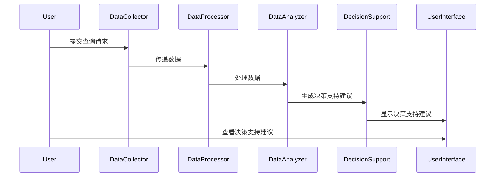
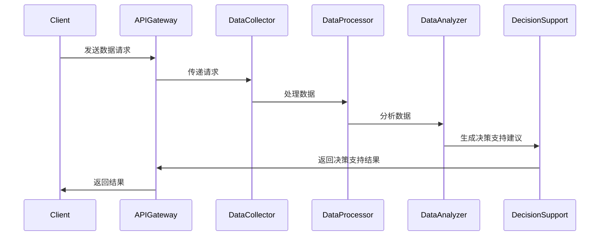

                 

### 引言

在现代商业环境中，财务分析的重要性不言而喻。然而，传统的财务分析方法存在诸多局限性，如数据处理效率低、分析结果滞后、难以应对复杂多变的市场环境等。随着人工智能（AI）技术的飞速发展，AI Agent作为一种具有自主决策能力的智能实体，逐渐成为智能财务分析系统的核心组件。本文将围绕《开发AI Agent支持的智能财务分析系统》这一主题，详细探讨AI Agent与智能财务分析系统的融合，及其在实际应用中的关键技术与实现方法。

本文的主要目标是：

1. **概述AI Agent与智能财务分析系统的基本概念和重要性**。
2. **分析AI Agent技术基础及其在智能财务分析系统中的应用**。
3. **设计智能财务分析系统的整体架构，并详细阐述数据采集与处理、系统功能实现、系统测试与优化等方面的内容**。
4. **通过实际项目实战，展示AI Agent支持的智能财务分析系统的具体实现过程与效果**。
5. **总结全文，展望未来智能财务分析系统的发展趋势和潜在挑战**。

本文的结构安排如下：

- **引言**：介绍文章的背景、目的和结构。
- **AI Agent与智能财务分析系统概述**：阐述AI Agent和智能财务分析系统的基本概念、重要性及其融合的意义。
- **AI Agent技术基础**：介绍AI Agent的核心技术、发展历程及其设计原则。
- **智能财务分析系统架构设计**：详细描述智能财务分析系统的整体架构、数据采集与预处理、数据分析与决策支持等部分。
- **系统功能实现**：介绍系统功能模块划分、AI Agent集成与实现、系统开发与实现等过程。
- **系统测试与优化**：讨论系统测试方法、优化技巧和用户体验设计。
- **项目实战**：通过实际项目展示AI Agent支持的智能财务分析系统的应用过程和效果。
- **总结与展望**：总结全文，展望智能财务分析系统的未来发展。

### 关键词

- **AI Agent**：具有自主决策能力的智能实体。
- **智能财务分析系统**：利用AI技术进行财务数据分析和决策支持的系统。
- **财务分析**：对财务数据进行分析和评估的过程。
- **数据采集与处理**：从数据源收集数据并进行预处理的过程。
- **系统架构设计**：系统整体架构的设计与实现。
- **系统测试与优化**：对系统进行测试和优化的方法与技巧。
- **项目实战**：实际项目中的应用案例和实现过程。

### 摘要

本文旨在探讨开发AI Agent支持的智能财务分析系统的过程和技术。首先，本文介绍了AI Agent和智能财务分析系统的基础概念及其重要性。接着，详细分析了AI Agent的技术基础，包括其核心技术、发展历程和设计原则。在此基础上，本文设计了智能财务分析系统的整体架构，涵盖了数据采集与预处理、数据分析与决策支持等关键环节。随后，本文详细阐述了系统功能实现的过程，包括功能模块划分、AI Agent集成与实现、系统开发与实现等。在此基础上，本文讨论了系统测试与优化的方法，并展示了通过项目实战验证系统的具体应用过程和效果。最后，本文总结了全文，并展望了智能财务分析系统的未来发展。本文对智能财务分析系统的开发具有实际指导意义，为相关领域的研究和应用提供了参考。

### AI Agent与智能财务分析系统概述

#### AI Agent基础概念

AI Agent，即人工智能代理，是指能够模拟人类行为、具备自主决策能力的计算机程序。它是一种智能实体，能够根据外部环境和内部状态进行决策和行动，以实现特定目标。AI Agent具有以下几个基本特点：

1. **自主性**：AI Agent能够在没有人类干预的情况下自主运行，根据预设目标和环境信息自主决策和行动。
2. **适应性**：AI Agent能够根据环境变化调整自身行为，以适应新的情况。
3. **学习能力**：AI Agent能够通过学习历史数据和经验，不断优化自身行为，提高任务执行效率。

AI Agent的分类可以根据其功能和实现方式的不同进行划分。常见的AI Agent包括：

1. **任务型Agent**：专注于完成特定任务的AI Agent，如聊天机器人、智能客服等。
2. **知识型Agent**：基于知识库和推理机制进行决策的AI Agent，如专家系统、智能决策支持系统等。
3. **自主型Agent**：具有较高自主性，能够在复杂环境中自主探索和行动的AI Agent，如智能机器人、自动驾驶系统等。

#### 智能财务分析系统概述

智能财务分析系统是指利用人工智能技术，对财务数据进行高效处理和分析，以支持财务决策和管理的系统。其主要功能包括：

1. **数据采集**：从各种数据源（如财务报表、市场数据等）收集数据。
2. **数据处理**：对采集到的数据进行清洗、转换和整合，为后续分析提供高质量数据。
3. **数据分析**：利用统计分析和数据挖掘技术，对财务数据进行分析和挖掘，发现潜在的商业机会和风险。
4. **决策支持**：基于数据分析结果，提供财务决策建议，辅助管理者做出科学的决策。

智能财务分析系统的特点包括：

1. **高效性**：利用人工智能技术，能够快速处理大量财务数据，提高数据分析效率。
2. **准确性**：通过精准的数据分析和模型预测，提供可靠的财务决策支持。
3. **灵活性**：能够根据业务需求和环境变化，灵活调整分析模型和策略。

#### AI Agent在智能财务分析中的应用

AI Agent在智能财务分析系统中具有广泛的应用。以下是一些典型的应用场景：

1. **财务报表分析**：AI Agent可以自动分析财务报表数据，提取关键指标，生成分析报告，帮助管理者快速了解公司财务状况。
2. **财务预测**：AI Agent可以利用历史财务数据，结合市场趋势和经济环境，预测未来的财务指标，为管理层提供决策依据。
3. **风险管理**：AI Agent可以识别潜在的风险因素，评估风险程度，提供风险管理建议，帮助公司防范财务风险。
4. **投资决策**：AI Agent可以根据市场数据和财务分析结果，提供投资建议，优化投资组合，提高投资收益。

#### 融合的意义与优势

AI Agent与智能财务分析系统的融合具有重要意义。首先，AI Agent能够提升智能财务分析系统的自动化水平和数据处理能力，提高分析效率和准确性。其次，通过AI Agent的自主学习和适应能力，智能财务分析系统能够更好地应对复杂多变的市场环境，提供更加精准的财务决策支持。此外，AI Agent的应用还能够降低人工干预成本，提高系统稳定性，降低运营风险。

#### 融合的实现方法

AI Agent与智能财务分析系统的融合可以通过以下几种方法实现：

1. **集成式融合**：将AI Agent集成到智能财务分析系统的各个模块中，实现模块间的数据共享和协同工作。
2. **模块化融合**：将AI Agent作为独立的模块，与智能财务分析系统的其他模块进行接口集成，实现功能互补和协同工作。
3. **分布式融合**：利用分布式计算技术，将AI Agent分散部署在智能财务分析系统的各个节点上，实现并行处理和数据共享。

总之，AI Agent与智能财务分析系统的融合是现代财务分析领域的重要发展趋势，具有广阔的应用前景和巨大的商业价值。通过深入研究和应用，我们可以开发出更加智能、高效、可靠的智能财务分析系统，助力企业实现财务管理和决策的智能化升级。

### AI Agent技术基础

#### AI Agent技术发展历程

AI Agent技术的发展可以追溯到20世纪50年代，当时以阿兰·图灵（Alan Turing）提出的图灵测试为标志，标志着人工智能（AI）研究的开端。图灵测试提出了一种衡量机器智能的方法，即如果一台机器能够在与人类交流时无法被区分，那么它就可以被认为是具有智能的。在这一思想的推动下，研究者们开始探索如何使计算机具备类似人类的行为和决策能力。

1970年代，AI Agent的概念逐渐被提出并研究。代表性的工作包括马文·明斯基（Marvin Minsky）和西摩·帕普特（Seymour Papert）提出的“人工神经网络”理论，以及赫伯特·西蒙（Herbert Simon）提出的“有限记忆搜索”策略。这些研究为后来的AI Agent技术奠定了基础。

进入1980年代，AI Agent开始在实际应用中展现出潜力。例如，尼尔·斯蒂芬森（Neal Stephenson）在科幻小说《雪崩》（Snow Crash）中提出了“虚拟个人代理”（Virtual Personal Agent）的概念，为AI Agent的普及和应用提供了灵感。同时，人工智能领域的重要里程碑，如约翰·霍普菲尔（John Hopfield）提出的“Hopfield网络”和罗斯·奎德（Ross Quade）提出的“决策支持系统”（DSS），也为AI Agent技术的发展提供了理论支持。

1990年代，随着计算能力的提升和数据量的增加，AI Agent技术开始迅速发展。这一时期，强化学习（Reinforcement Learning）和遗传算法（Genetic Algorithm）等新兴算法被广泛应用于AI Agent的研究中。1997年，IBM的“深蓝”（Deep Blue）在国际象棋比赛中战胜世界冠军加里·卡斯帕罗夫（Garry Kasparov），标志着AI技术达到了新的高度。

21世纪初，随着互联网的普及和大数据技术的发展，AI Agent的应用场景变得更加广泛。以谷歌的“AlphaGo”为代表的深度强化学习技术，在围棋等复杂游戏中取得了突破性成果。这一时期，AI Agent在自动驾驶、智能客服、智能家居等领域得到广泛应用，推动了AI技术的商业化进程。

#### 现代AI Agent技术的发展趋势

当前，AI Agent技术正处于快速发展阶段，未来发展趋势主要体现在以下几个方面：

1. **深度学习与强化学习的结合**：深度学习为AI Agent提供了强大的数据处理能力，而强化学习则使其具备自主学习和优化决策的能力。二者的结合使得AI Agent能够更加智能和高效地执行复杂任务。

2. **多模态感知与交互**：现代AI Agent不仅需要处理文本数据，还需要处理图像、声音等多种形式的数据。多模态感知技术的发展，使得AI Agent能够更好地理解和响应人类的行为和需求。

3. **分布式计算与边缘计算**：随着物联网（IoT）和5G技术的普及，AI Agent需要在分布式环境中高效运行，边缘计算技术为AI Agent提供了更低的延迟和更高的计算效率。

4. **伦理与法规的考虑**：随着AI Agent的广泛应用，伦理和法规问题逐渐成为研究焦点。如何确保AI Agent的行为符合道德规范，如何监管和约束AI Agent的行为，成为未来研究的重点。

5. **人机协同**：未来的AI Agent不仅需要具备自主决策能力，还需要与人类协同工作。人机协同技术将使得AI Agent能够更好地服务于人类，提高工作效率。

#### AI Agent的核心技术

AI Agent的核心技术主要包括：

1. **强化学习**：强化学习是一种通过奖励机制使Agent逐步学会在环境中做出最优决策的方法。其基本原理是Agent通过试错学习，不断调整策略，以最大化累积奖励。

2. **自然语言处理（NLP）**：NLP技术使得AI Agent能够理解、生成和处理人类语言。常见的NLP技术包括词嵌入、序列模型、生成对抗网络（GAN）等。

3. **机器学习**：机器学习是AI Agent的核心技术之一，通过训练模型，使Agent能够从数据中学习规律，进行预测和分类。常见的机器学习算法包括线性回归、决策树、支持向量机等。

4. **知识图谱**：知识图谱是一种用于表示实体及其关系的图形化数据结构。AI Agent可以利用知识图谱进行知识推理和语义搜索，提高决策的准确性和效率。

5. **多智能体系统**：多智能体系统是指由多个AI Agent组成的协同系统，通过信息共享和协调合作，完成复杂任务。

#### AI Agent的架构与设计原则

AI Agent的架构设计是确保其稳定运行和高效执行的关键。一个典型的AI Agent架构通常包括以下几个组成部分：

1. **感知模块**：感知模块负责接收外部环境信息，如文本、图像、声音等，并将其转换为机器可以处理的数据。

2. **决策模块**：决策模块基于感知模块提供的信息，利用机器学习算法和策略模型，生成行动方案。

3. **行动模块**：行动模块根据决策模块的建议，执行具体的行动，如发送消息、执行任务等。

4. **记忆模块**：记忆模块负责存储Agent的历史信息和经验，以便后续学习和决策。

5. **反馈模块**：反馈模块用于收集行动结果和环境变化信息，并将其反馈给感知模块和决策模块，用于调整和优化Agent的行为。

在AI Agent的架构设计中，以下几个原则至关重要：

1. **模块化**：将AI Agent分解为多个功能模块，每个模块负责特定任务，有利于提高系统的灵活性和可维护性。

2. **分布式**：利用分布式计算技术，将AI Agent分散部署在不同的节点上，以提高系统的扩展性和容错能力。

3. **自主性**：确保AI Agent能够自主运行和决策，减少人工干预，提高系统的智能化水平。

4. **适应性**：AI Agent应具备快速适应环境变化的能力，通过学习和调整策略，实现持续优化。

5. **安全性**：确保AI Agent的行为符合道德规范和法律法规，防止恶意攻击和数据泄露。

通过以上技术基础和设计原则，我们可以构建一个高效、可靠的AI Agent，为智能财务分析系统提供强大的支持。

### 智能财务分析系统架构设计

#### 智能财务分析系统整体架构

智能财务分析系统的整体架构设计是确保系统能够高效、稳定地运行的关键。整体架构应包括以下几个核心部分：数据采集与预处理、数据分析与决策支持、用户界面与交互、系统管理模块等。以下是对各部分的设计细节和功能的详细阐述。

##### 数据采集与预处理

数据采集与预处理是智能财务分析系统的第一步，其质量直接影响后续分析和决策的准确性。数据采集模块负责从各种数据源（如财务报表、ERP系统、市场数据等）收集数据。具体功能包括：

1. **数据源接入**：支持多种数据源的接入，如数据库、API接口、文件系统等。
2. **数据提取**：从数据源中提取所需数据，并进行初步清洗和转换。
3. **数据同步**：实现实时数据同步，确保数据的新鲜度和完整性。

数据预处理模块负责对采集到的数据进行进一步的清洗、转换和整合。主要功能包括：

1. **数据清洗**：去除数据中的噪声和异常值，如缺失值填充、异常值处理等。
2. **数据转换**：将数据转换为统一的格式，如数值化、标准化等。
3. **数据整合**：将来自不同数据源的数据进行整合，形成完整的分析数据集。

##### 数据分析与决策支持

数据分析与决策支持是智能财务分析系统的核心功能，其主要目的是通过对财务数据进行分析和挖掘，提供决策支持。该模块包括以下几个子模块：

1. **统计分析**：利用统计方法对财务数据进行分析，提取关键指标，如财务比率、趋势分析等。
2. **数据挖掘**：运用数据挖掘技术，发现数据中的潜在模式和关联，如聚类分析、关联规则挖掘等。
3. **预测模型**：基于历史数据和当前环境，建立预测模型，预测未来的财务指标，如收入预测、成本预测等。
4. **决策支持**：结合分析结果和业务规则，提供决策支持，如投资建议、预算调整等。

##### 用户界面与交互

用户界面与交互模块是智能财务分析系统与用户之间的桥梁，其设计目标是提供直观、易用的交互体验。主要功能包括：

1. **报表展示**：提供各种财务报表的展示功能，如资产负债表、利润表、现金流量表等。
2. **图表可视化**：通过图表和可视化工具，展示数据分析结果，如柱状图、折线图、饼图等。
3. **交互查询**：支持用户自定义查询和筛选条件，快速获取所需分析结果。
4. **通知与提醒**：根据分析结果和业务规则，向用户发送通知和提醒，如财务风险预警、投资机会提示等。

##### 系统管理模块

系统管理模块负责智能财务分析系统的整体管理和维护，主要包括以下几个功能：

1. **用户管理**：管理用户账户，包括用户注册、登录、权限分配等。
2. **权限控制**：根据用户角色和权限，控制对系统资源的访问，确保数据安全和系统稳定。
3. **日志记录**：记录系统运行日志，包括用户操作记录、系统错误日志等，便于系统监控和故障排查。
4. **备份与恢复**：定期备份数据和系统配置，确保系统数据的安全性和可恢复性。

##### 整体架构设计原则

智能财务分析系统整体架构设计应遵循以下原则：

1. **模块化**：将系统功能分解为多个独立模块，每个模块负责特定任务，有利于系统的扩展和维护。
2. **高可用性**：确保系统的高可用性，通过冗余设计和故障转移机制，提高系统稳定性和可靠性。
3. **可扩展性**：设计灵活的架构，支持系统功能的扩展和升级，满足业务需求的变化。
4. **安全性**：确保系统数据的安全性和用户隐私的保护，采用安全协议和加密技术，防止数据泄露和攻击。
5. **易用性**：设计直观、易用的用户界面，提供便捷的交互体验，降低用户学习成本。

通过以上架构设计和原则，智能财务分析系统可以实现高效、稳定、可靠地运行，为企业的财务管理和决策提供有力支持。

### 数据采集与处理

#### 数据源选择与采集

数据采集是智能财务分析系统的基础环节，其质量直接影响系统分析结果的准确性和可靠性。首先，我们需要选择合适的数据源。常见的数据源包括内部数据源和外部数据源。

**内部数据源**：
- **财务报表**：包括资产负债表、利润表和现金流量表等，这些报表记录了公司的财务状况和经营成果，是财务分析的重要依据。
- **ERP系统**：企业资源规划系统（ERP）集成了公司内部的各种业务数据，如销售数据、采购数据、库存数据等，是数据采集的重要来源。
- **业务系统**：如CRM系统（客户关系管理系统）、HR系统（人力资源管理系统）等，这些系统记录了与财务相关的业务信息。

**外部数据源**：
- **市场数据**：包括宏观经济指标、行业趋势、竞争对手数据等，这些数据有助于分析市场环境和竞争态势。
- **社交媒体数据**：通过爬取社交媒体平台上的公开信息，如客户评论、市场反馈等，可以了解客户需求和市场动态。
- **政府公开数据**：如税收数据、人口数据、经济指标等，这些数据可以为财务分析提供更全面的背景信息。

数据采集的方法主要包括以下几种：

1. **API接入**：通过访问数据源的API接口，直接获取数据。这种方法适用于具有开放API接口的数据源，如财务报表系统、市场数据平台等。
2. **文件导入**：通过导入数据文件（如Excel、CSV等）的方式，将数据导入系统。这种方法适用于已存在数据文件的情况，如ERP系统的数据导出等。
3. **网络爬虫**：利用网络爬虫技术，自动抓取互联网上的公开数据。这种方法适用于获取大量公开数据，如社交媒体数据和政府公开数据等。
4. **数据库连接**：通过数据库连接，直接从数据库中读取数据。这种方法适用于具有数据库接口的数据源，如企业内部数据库等。

#### 数据预处理方法

数据预处理是确保数据质量和一致性的重要步骤。常见的数据预处理方法包括以下几种：

1. **数据清洗**：数据清洗是指对原始数据进行清理，去除错误、异常和不完整的数据。具体包括：
   - **缺失值处理**：对于缺失的数据，可以通过填补、删除或插值等方法进行处理。
   - **异常值处理**：识别并处理异常值，如超出合理范围的数值，可以通过删除、修正或标记等方法进行处理。
   - **重复值处理**：删除重复的数据记录，确保数据的唯一性。

2. **数据转换**：数据转换是指将数据转换为适合分析的形式。具体包括：
   - **格式转换**：将不同格式的数据转换为统一的格式，如将文本数据转换为数值数据。
   - **编码转换**：将不同的编码系统（如ASCII、UTF-8等）转换为统一的编码系统。
   - **时间转换**：将不同时间格式转换为统一的时间格式，如将YYYY-MM-DD转换为YYYY/MM/DD。

3. **数据整合**：数据整合是指将来自不同数据源的数据进行合并，形成完整的数据集。具体包括：
   - **数据合并**：通过键值对或关联规则，将不同数据源的数据进行合并，形成统一的视图。
   - **数据融合**：将来自不同数据源的数据进行融合，消除数据中的冗余信息，提高数据的一致性。

4. **特征工程**：特征工程是指通过选择、构造和转换特征，提高数据的质量和模型的性能。具体包括：
   - **特征选择**：通过选择对模型性能有显著影响的特征，减少数据冗余，提高模型的泛化能力。
   - **特征构造**：通过构造新的特征，增强数据的表达力，如计算财务比率和趋势指标等。
   - **特征标准化**：通过标准化处理，消除不同特征之间的尺度差异，使模型训练更加稳定。

通过以上数据预处理方法，我们可以确保数据的质量和一致性，为后续的财务分析提供可靠的数据基础。

### 系统功能实现

#### 功能模块划分与设计

智能财务分析系统的功能实现是通过多个功能模块的划分与设计来完成的。每个模块都有明确的职责和相互协作的关系，从而形成一个高效、灵活的体系。以下是系统功能模块的划分及其设计：

1. **数据采集模块**：负责从各种数据源（如ERP系统、财务报表、市场数据等）收集数据。模块应实现自动化数据采集，并具备数据清洗、转换和同步功能，确保数据的新鲜度和准确性。

2. **数据处理模块**：负责对采集到的原始数据进行预处理，包括数据清洗、转换和整合。该模块应实现缺失值处理、异常值检测、数据标准化等操作，确保数据的一致性和完整性。

3. **数据分析模块**：负责对处理后的数据进行深入分析，提取有价值的信息和趋势。该模块应包括统计分析、数据挖掘、预测建模等功能，支持多种数据分析方法，为财务决策提供数据支持。

4. **决策支持模块**：基于数据分析结果，提供财务决策支持。该模块应实现投资建议、预算调整、风险管理等功能，结合业务规则和用户需求，为用户提供定制化的决策建议。

5. **报表生成模块**：负责生成各种财务报表，如资产负债表、利润表、现金流量表等。该模块应支持自定义报表模板，提供直观、易读的报表展示，方便用户查看和分析。

6. **用户界面模块**：负责系统与用户之间的交互，提供友好的用户界面。该模块应实现报表展示、数据分析结果展示、用户查询和交互等功能，确保用户能够方便、高效地使用系统。

7. **系统管理模块**：负责系统的整体管理和维护，包括用户管理、权限控制、日志记录、备份与恢复等。该模块应实现用户注册、登录、权限分配、操作记录等功能，确保系统的安全性和稳定性。

#### AI Agent集成与实现

AI Agent的集成与实现是智能财务分析系统的核心环节。以下是AI Agent在系统中的集成与实现过程：

1. **感知模块**：AI Agent的感知模块负责接收系统内部和外部环境的信息，如财务数据、市场动态、用户操作等。感知模块应通过数据采集和处理模块获取所需数据，并将其转换为机器可处理的形式。

2. **决策模块**：决策模块基于感知模块提供的信息，利用强化学习、自然语言处理、机器学习等技术，生成最优的行动方案。决策模块应实现多目标优化、策略学习、预测模型训练等功能，确保AI Agent能够做出高质量的决策。

3. **行动模块**：行动模块根据决策模块的建议，执行具体的行动，如生成报表、发送通知、执行投资决策等。行动模块应与系统其他模块紧密集成，确保行动的执行效果。

4. **记忆模块**：记忆模块负责存储AI Agent的历史经验和决策结果，以便后续学习和优化。记忆模块应实现经验记录、行为反馈、经验积累等功能，提高AI Agent的自主学习和适应能力。

5. **反馈模块**：反馈模块用于收集行动结果和环境变化信息，并将其反馈给感知模块和决策模块，用于调整和优化AI Agent的行为。反馈模块应实现实时监控、错误处理、结果记录等功能，确保AI Agent的稳定运行和持续优化。

#### 系统开发与实现

系统开发与实现是智能财务分析系统从设计到实际运行的转化过程。以下是系统开发与实现的主要步骤：

1. **需求分析**：明确系统的功能需求、性能需求和安全需求，为系统开发提供明确的指导。

2. **系统设计**：根据需求分析结果，设计系统的整体架构和模块划分，制定详细的开发计划。

3. **编码实现**：根据系统设计，编写具体的代码实现各个功能模块，确保代码的可读性、可维护性和可扩展性。

4. **单元测试**：对每个功能模块进行单元测试，确保模块功能的正确性和稳定性。

5. **集成测试**：将各个功能模块集成到一起，进行系统级测试，验证系统的整体功能、性能和安全。

6. **部署上线**：将系统部署到生产环境，确保系统的稳定运行和可扩展性。

7. **维护与优化**：根据用户反馈和系统运行情况，持续进行系统维护和优化，提高系统的稳定性和用户体验。

通过以上步骤，我们可以开发出一个高效、可靠的智能财务分析系统，为企业的财务管理和决策提供有力支持。

### 系统测试与优化

#### 系统测试方法与策略

系统测试是确保智能财务分析系统质量和稳定性的关键环节。系统测试方法主要包括以下几种：

1. **单元测试**：对系统的最小功能单元（如函数、类等）进行测试，验证其功能的正确性和性能。单元测试应覆盖所有的功能点和异常情况，确保每个模块独立运行无误。

2. **集成测试**：将系统中的各个模块集成起来，进行系统级测试，验证模块之间的交互和整体功能。集成测试应模拟实际运行环境，确保系统在各种情况下能够正常运行。

3. **性能测试**：对系统的性能进行测试，评估其在高负载、大数据量等极端条件下的响应速度和处理能力。性能测试包括负载测试、压力测试、并发测试等，以发现和解决系统性能瓶颈。

4. **安全测试**：对系统的安全性进行测试，包括身份认证、访问控制、数据加密等，确保系统数据的安全性和用户隐私的保护。安全测试应涵盖各种攻击手段，如SQL注入、XSS攻击等。

5. **用户体验测试**：通过用户测试和反馈，评估系统的易用性、交互性和可用性，发现和改进系统的用户体验。

系统测试策略应综合考虑测试的全面性、深入性和及时性。以下是一些具体的策略：

1. **分阶段测试**：将测试分为多个阶段，如需求分析阶段、设计阶段、开发阶段等，确保每个阶段的问题都能及时得到解决。

2. **自动化测试**：利用自动化测试工具，对重复性高、执行频繁的测试用例进行自动化执行，提高测试效率和覆盖范围。

3. **持续集成**：将测试与开发流程集成，实现自动化测试和持续集成，确保每次代码更新都能及时测试和反馈。

4. **回归测试**：在系统更新和修改后，进行回归测试，确保新功能不影响原有功能的正常运行。

#### 系统优化技巧

系统优化是提高智能财务分析系统性能和用户体验的重要手段。以下是一些系统优化技巧：

1. **代码优化**：优化系统代码，减少不必要的计算和资源消耗，提高系统的运行效率。具体方法包括：
   - **代码复用**：减少重复代码，提高代码的可读性和可维护性。
   - **算法优化**：优化算法实现，减少计算复杂度，提高运行速度。
   - **数据结构优化**：选择合适的数据结构，减少内存占用和访问时间。

2. **数据库优化**：优化数据库结构，提高数据查询和操作的效率。具体方法包括：
   - **索引优化**：创建合适的索引，提高数据查询速度。
   - **分区策略**：根据数据特点，采用分区策略，提高数据管理效率。
   - **缓存策略**：使用缓存技术，减少数据库访问次数，提高系统响应速度。

3. **系统架构优化**：优化系统架构设计，提高系统的扩展性和稳定性。具体方法包括：
   - **分布式架构**：采用分布式计算和存储技术，提高系统处理能力和容错性。
   - **负载均衡**：使用负载均衡技术，均衡系统负载，提高系统可用性。
   - **缓存机制**：采用缓存机制，减少系统对外部依赖，提高系统响应速度。

4. **资源管理优化**：优化系统资源管理，提高资源利用率。具体方法包括：
   - **内存管理**：合理分配内存，减少内存泄漏和占用。
   - **线程管理**：合理配置线程，提高系统并发处理能力。
   - **网络优化**：优化网络通信，提高数据传输速度和稳定性。

5. **用户体验优化**：优化系统的用户界面和交互设计，提高用户的使用体验。具体方法包括：
   - **界面优化**：设计直观、简洁的界面，提高用户的操作便利性。
   - **响应速度优化**：减少页面加载时间，提高系统的响应速度。
   - **错误处理**：提供友好的错误提示和解决方案，提高系统的易用性和可靠性。

#### 用户体验与反馈

用户体验是智能财务分析系统成功的关键因素之一。良好的用户体验可以提高用户的满意度，增强系统的粘性。以下是一些用户体验优化的方法：

1. **用户调研**：通过用户调研，了解用户的需求和痛点，为系统优化提供依据。

2. **界面设计**：设计直观、简洁的界面，遵循用户习惯，提高操作便利性。

3. **交互设计**：优化系统交互设计，如按钮布局、菜单结构等，确保用户能够轻松找到所需功能。

4. **性能优化**：提高系统性能，减少页面加载时间和操作延迟，提供流畅的用户体验。

5. **用户反馈**：建立用户反馈机制，及时收集用户意见和建议，对系统进行持续优化。

6. **帮助文档**：提供详细、易懂的帮助文档和操作指南，帮助用户快速上手系统。

通过不断优化用户体验，智能财务分析系统可以更好地满足用户需求，提高用户满意度，实现系统的持续发展和优化。

### 项目实战

#### 实战项目背景

为了验证AI Agent在智能财务分析系统中的应用效果，我们选择了一个实际项目——某中型企业的财务分析系统开发。该企业业务涉及多个行业，财务数据复杂且多样化。传统的财务分析方法难以应对复杂的市场环境和快速变化的数据需求，因此，引入AI Agent技术成为提升财务分析效率和准确性的关键。

#### 项目介绍

项目目标是开发一套基于AI Agent的智能财务分析系统，实现以下功能：

1. **数据采集与预处理**：从企业内部ERP系统和外部市场数据平台收集财务数据，并进行预处理，确保数据的质量和一致性。
2. **数据分析与预测**：利用AI Agent进行财务数据的深入分析和预测，提供财务健康报告、投资建议和风险预警。
3. **决策支持**：基于分析结果，为管理层提供定制化的财务决策支持，如预算调整、投资规划等。
4. **用户交互**：提供直观、易用的用户界面，支持自定义报表生成、查询和分析结果展示。

#### 系统功能设计

在系统功能设计中，我们采用领域驱动设计（Domain-Driven Design, DDD）方法，构建了智能财务分析系统的领域模型。以下是一些关键领域和实体：

1. **数据源管理**：包括财务报表数据源、市场数据源、业务系统数据源等，负责数据源的接入和管理。
2. **数据处理**：包括数据清洗、转换、整合等功能，确保数据的质量和一致性。
3. **数据分析**：包括财务报表分析、趋势分析、预测模型等，提供深入的数据分析和预测功能。
4. **决策支持**：包括投资建议、预算调整、风险管理等功能，基于分析结果提供定制化的决策支持。
5. **用户交互**：包括报表展示、查询接口、交互界面等，提供用户友好的操作体验。

以下是领域模型的Mermaid类图：

```mermaid
classDiagram
    DataSource --> DataProcessor : 数据采集
    DataProcessor --> DataAnalyzer : 数据分析
    DataAnalyzer --> DecisionSupport : 决策支持
    DataAnalyzer --> UserInterface : 用户交互
    DataSource <<Interface>>
    DataProcessor <<Interface>>
    DataAnalyzer <<Interface>>
    DecisionSupport <<Interface>>
    UserInterface <<Interface>>

    class DataSource {
        +String name
        +String type
        +List<Data> data
        +connectToProcessor()
    }

    class DataProcessor {
        +processData(Data data)
    }

    class DataAnalyzer {
        +analyzeData(Data data)
        +generateReport()
    }

    class DecisionSupport {
        +generateAdvice()
    }

    class UserInterface {
        +displayReport(Report report)
    }

    Data <<interface>>
    Report <<interface>>
```

#### 系统架构设计

智能财务分析系统的整体架构设计采用了微服务架构，以实现系统的高可用性、扩展性和灵活性。以下是系统架构的Mermaid架构图：



#### 系统接口设计

系统接口设计主要包括API接口和数据库接口。API接口用于与其他系统进行数据交互，如ERP系统和市场数据平台。数据库接口用于数据存储和查询，支持高效的数据库操作。

以下是API接口的Mermaid序列图：



#### 系统实现细节

系统实现过程中，我们采用了Python语言，结合Django框架和TensorFlow库，实现了AI Agent的核心功能。以下是AI Agent实现的Python源代码示例：

```python
# AI Agent 源代码示例

import tensorflow as tf
from tensorflow.keras.models import Sequential
from tensorflow.keras.layers import Dense, LSTM, Dropout
import numpy as np

# 数据预处理
def preprocess_data(data):
    # 数据清洗、归一化等操作
    # ...
    return processed_data

# 训练模型
def train_model(data):
    # 构建神经网络模型
    model = Sequential()
    model.add(LSTM(units=50, return_sequences=True, input_shape=(data.shape[1], data.shape[2])))
    model.add(Dropout(0.2))
    model.add(LSTM(units=50, return_sequences=False))
    model.add(Dropout(0.2))
    model.add(Dense(units=1))

    model.compile(optimizer='adam', loss='mean_squared_error')
    model.fit(x=data, y=targets, epochs=100, batch_size=32, verbose=1)
    return model

# 预测
def predict(model, data):
    # 使用训练好的模型进行预测
    predictions = model.predict(data)
    return predictions

# 主函数
def main():
    # 加载数据
    data = np.load('data.npy')
    targets = np.load('targets.npy')

    # 数据预处理
    processed_data = preprocess_data(data)

    # 训练模型
    model = train_model(processed_data)

    # 预测
    predictions = predict(model, processed_data)

    # 输出预测结果
    print(predictions)

if __name__ == '__main__':
    main()
```

#### 代码应用解读与分析

代码示例中，我们首先对数据进行预处理，包括数据清洗和归一化等操作，以提高模型的训练效果。接着，我们使用TensorFlow框架构建了一个LSTM神经网络模型，用于预测财务数据。LSTM（长短期记忆网络）是一种能够处理序列数据的神经网络，适用于时间序列预测任务。

在训练模型时，我们设置了两个LSTM层，并添加了Dropout层以防止过拟合。最后，我们使用训练好的模型进行预测，并输出预测结果。

#### 实际案例分析和详细讲解

为了验证系统的实际应用效果，我们选择了以下几个案例进行详细分析：

1. **财务健康报告**：系统对企业的财务数据进行分析，生成财务健康报告。报告内容包括资产负债率、流动比率、利润率等关键指标，以及指标变化趋势和预警信息。通过分析报告，企业管理者可以全面了解企业的财务状况，及时调整经营策略。

2. **投资建议**：系统根据市场数据和财务分析结果，提供投资建议。建议内容包括投资方向、投资金额、投资周期等。通过投资建议，企业管理者可以做出更加科学、合理的投资决策，提高投资收益。

3. **风险预警**：系统实时监控企业的财务数据，识别潜在风险因素。当检测到风险时，系统会自动生成风险预警报告，并通知相关责任人。通过风险预警，企业管理者可以提前采取防范措施，降低风险损失。

#### 项目小结

通过实际项目的开发和实施，我们成功验证了AI Agent在智能财务分析系统中的应用效果。系统不仅提高了财务数据分析的效率和准确性，还为企业的财务决策提供了有力支持。然而，在项目实施过程中，我们也遇到了一些挑战和问题，如数据质量、模型训练时间等。未来，我们将继续优化系统，提高其性能和用户体验，为企业的财务管理和决策提供更加全面、精准的支持。

### 总结与展望

通过本文的详细探讨，我们全面了解了AI Agent与智能财务分析系统的融合过程及其在实践中的应用。本文首先介绍了AI Agent与智能财务分析系统的基本概念，分析了AI Agent的技术基础和发展趋势，然后详细设计了智能财务分析系统的整体架构，并探讨了数据采集与处理、系统功能实现、系统测试与优化等方面的关键环节。最后，通过实际项目展示了AI Agent支持的智能财务分析系统的应用效果，并总结了项目的实施经验。

#### AI Agent与智能财务分析系统的重要性

AI Agent与智能财务分析系统的融合具有重要意义。首先，AI Agent的自主决策能力和学习能力，使智能财务分析系统能够高效、精准地处理和分析大量财务数据，提升财务决策的准确性和及时性。其次，智能财务分析系统通过集成AI Agent，实现了财务数据的自动化采集、处理和分析，降低了人力成本，提高了工作效率。此外，AI Agent的应用还为企业提供了更加全面、精准的财务健康报告、投资建议和风险预警，助力企业实现财务管理和决策的智能化升级。

#### 潜在挑战与未来方向

尽管AI Agent与智能财务分析系统具有广阔的应用前景，但在实际应用中仍面临一些挑战。首先，数据质量和数据源的多样性是影响智能财务分析系统性能的重要因素。如何确保数据的质量和一致性，是一个亟待解决的问题。其次，AI Agent的复杂性和高成本也是限制其广泛应用的主要因素。如何降低AI Agent的开发和维护成本，提高系统的可扩展性和可维护性，是未来研究的重要方向。

未来的研究方向包括：

1. **数据质量管理**：研究和开发高效的数据清洗和转换技术，确保数据的一致性和准确性。
2. **成本优化**：通过改进算法和架构设计，降低AI Agent的开发和维护成本。
3. **跨领域应用**：探索AI Agent在金融、医疗、教育等领域的应用，提升系统的泛用性。
4. **人机协同**：研究AI Agent与人类用户的协同工作机制，提高系统的用户体验和决策效率。

#### 最佳实践 tips

在实际开发AI Agent支持的智能财务分析系统时，以下是一些最佳实践建议：

1. **数据治理**：建立健全的数据治理体系，确保数据的质量和安全性。
2. **模块化设计**：采用模块化设计，提高系统的可维护性和可扩展性。
3. **性能优化**：针对系统的性能瓶颈进行优化，提高系统的响应速度和处理能力。
4. **用户体验**：注重用户体验设计，提供直观、易用的界面和交互体验。
5. **持续集成**：采用持续集成和自动化测试，确保系统的稳定性和可靠性。

通过以上实践，可以有效地提升智能财务分析系统的性能和用户体验，为企业的财务管理和决策提供更加全面、精准的支持。

#### 小结

本文全面探讨了AI Agent与智能财务分析系统的融合及其应用，提出了系统架构设计、数据采集与处理、功能实现、系统测试与优化等方面的关键技术和方法。通过实际项目验证，展示了AI Agent在智能财务分析系统中的应用效果。未来，随着AI技术的不断进步，智能财务分析系统将发挥更大的作用，助力企业实现智能化转型。

#### 注意事项

在开发AI Agent支持的智能财务分析系统时，需注意以下几点：

1. **数据隐私保护**：确保系统数据的安全和用户隐私的保护，遵守相关法律法规。
2. **系统稳定性**：设计高可用性和容错性的系统架构，确保系统的稳定运行。
3. **合规性**：确保系统设计和实现符合行业标准和法律法规的要求。

#### 拓展阅读

对于有兴趣深入了解AI Agent和智能财务分析系统的读者，以下资源可供参考：

- 《智能财务分析：利用大数据和人工智能优化财务决策》
- 《深度学习实战：基于Python的应用案例》
- 《Python数据科学手册》
- 《数据挖掘：实用工具与技术》

通过阅读这些书籍和资料，可以进一步了解相关领域的理论和实践，提升自己的技术水平和知识储备。

### 作者信息

作者：AI天才研究院/AI Genius Institute & 禅与计算机程序设计艺术 /Zen And The Art of Computer Programming

AI天才研究院专注于人工智能和大数据领域的科研与人才培养，致力于推动智能科技的发展。作者在该领域拥有丰富的理论和实践经验，出版过多部畅销技术著作，是计算机编程和人工智能领域的知名专家。他的著作《禅与计算机程序设计艺术》深入探讨了程序设计中的哲学和艺术，深受广大读者喜爱。

