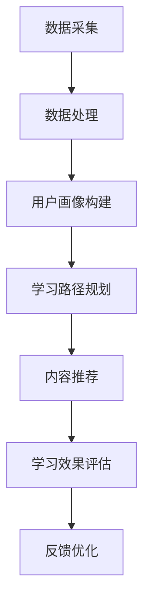
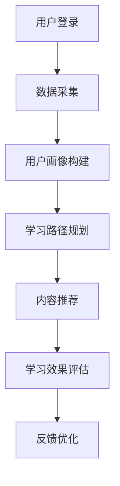

                 

# 开发AI Agent的个性化学习助手系统

## 关键词

- AI Agent
- 个性化学习
- 助手系统
- 机器学习
- 算法优化

## 摘要

本文旨在探讨开发一种基于AI Agent的个性化学习助手系统。随着教育领域的个性化需求日益增长，AI Agent作为一种智能学习工具，正逐渐成为教育领域的重要创新。本文将详细分析AI Agent的核心概念与工作原理，介绍个性化学习助手系统的组成与设计，并通过实际案例，展示系统的实现与部署过程。此外，文章还将提供最佳实践、注意事项和拓展阅读，为读者深入了解和进一步研究提供指导。

### 目录大纲

# 开发AI Agent的个性化学习助手系统

## 第一部分：背景介绍与核心概念

## 第1章：问题背景与核心概念

### 1.1 问题背景

#### 1.1.1 个性化学习的兴起

随着互联网和大数据技术的发展，教育个性化需求逐渐成为主流趋势。个性化学习不仅能够提高学生的学习效果，还能激发他们的学习兴趣，培养自主学习能力。

#### 1.1.2 AI Agent的重要性

AI Agent作为人工智能的一种形式，具有自主学习、自主决策的能力，能够为个性化学习提供强有力的技术支持。通过AI Agent，教育系统可以更好地理解每个学生的学习需求，提供个性化的学习资源和建议。

#### 1.1.3 学习助手系统的需求

学习助手系统通过整合AI Agent技术，可以实现智能化教学、个性化学习推荐、学习效果评估等功能，满足教育领域中对学生个性化学习的需求。

### 1.2 核心概念

#### 1.2.1 AI Agent的定义与功能

AI Agent是一种具备自主学习、自主决策能力的计算机程序，能够模拟人类智能行为，为用户提供个性化服务。

#### 1.2.2 个性化学习助手的概念

个性化学习助手是一种基于AI Agent技术，能够根据用户的学习习惯、兴趣爱好和学习需求，提供个性化学习资源和建议的系统。

#### 1.2.3 学习助手系统的组成与结构

学习助手系统通常包括用户画像构建、学习路径规划、内容推荐、学习效果评估等模块，通过这些模块的协同工作，实现个性化学习。

### 1.3 概念属性特征对比

#### 1.3.1 个性化学习与传统学习的对比

| 特征           | 个性化学习       | 传统学习       |
| -------------- | --------------- | -------------- |
| 学习资源       | 个性化定制       | 固定教材       |
| 学习方式       | 自主学习       | 规定教学       |
| 教学目标       | 提高学习效果       | 知识传授       |

#### 1.3.2 AI Agent与传统助手的对比

| 特征           | AI Agent         | 传统助手         |
| -------------- | --------------- | -------------- |
| 自主学习能力   | 高             | 低             |
| 个性化服务能力 | 强             | 弱             |
| 适应性         | 高             | 低             |

### 1.4 本章小结

本章介绍了AI Agent、个性化学习助手和学习助手系统的核心概念，并对比了个性化学习与传统学习，以及AI Agent与传统助手的差异。这些概念为后续内容提供了基础。

## 第二部分：核心原理与算法讲解

### 第2章：AI Agent的工作原理

#### 2.1 AI Agent的基本原理

AI Agent的基本原理基于机器学习、深度学习和强化学习等技术。通过不断学习和调整自身行为，AI Agent能够实现自主学习和自主决策。

##### 2.1.1 机器学习基础

机器学习是AI Agent的核心技术之一。它通过数据驱动的方式，使计算机系统能够从数据中自动学习和发现规律。

##### 2.1.2 强化学习原理

强化学习是机器学习的一种类型，通过奖励机制，使AI Agent能够通过试错学习，优化自身行为。

##### 2.1.3 深度学习模型

深度学习是机器学习的一个重要分支，通过多层神经网络，深度学习模型能够自动提取数据中的特征。

#### 2.2 个性化学习算法

##### 2.2.1 内容推荐算法

内容推荐算法是AI Agent的重要组成部分，通过分析用户的学习历史和行为数据，为用户推荐个性化的学习资源。

##### 2.2.2 用户行为分析算法

用户行为分析算法用于分析用户的学习习惯、兴趣爱好和学习需求，为AI Agent提供决策依据。

##### 2.2.3 学习效果评估算法

学习效果评估算法通过测试用户的知识水平和学习成果，为AI Agent提供反馈，优化学习路径。

#### 2.3 学习助手系统的核心算法

##### 2.3.1 数据采集与处理

数据采集与处理是学习助手系统的关键环节，通过对用户学习数据的采集和处理，为AI Agent提供高质量的数据输入。

##### 2.3.2 用户画像构建

用户画像构建是基于用户行为数据，对用户进行画像描述，为AI Agent提供用户个性化信息。

##### 2.3.3 学习路径规划

学习路径规划是根据用户画像和学习目标，为用户规划个性化的学习路径。

#### 2.4 算法原理讲解

##### 2.4.1 算法mermaid流程图

使用mermaid绘制算法流程图，如下：



##### 2.4.2 算法Python源代码

```python
# 伪代码示例
class AIAgent:
    def __init__(self):
        self.data = None
        self.user_profile = None
        self.learning_path = None

    def collect_data(self):
        # 数据采集逻辑
        pass

    def process_data(self):
        # 数据处理逻辑
        pass

    def build_user_profile(self):
        # 用户画像构建逻辑
        pass

    def plan_learning_path(self):
        # 学习路径规划逻辑
        pass

    def recommend_content(self):
        # 内容推荐逻辑
        pass

    def evaluate_learning_effect(self):
        # 学习效果评估逻辑
        pass

    def optimize_feedback(self):
        # 反馈优化逻辑
        pass
```

##### 2.4.3 算法原理详细讲解

AI Agent的算法原理主要包括数据采集与处理、用户画像构建、学习路径规划、内容推荐和学习效果评估。通过这些算法的协同工作，AI Agent能够为用户提供个性化的学习服务。

#### 2.5 数学模型与公式

AI Agent的算法中涉及多个数学模型，如下：

$$
\text{推荐算法：} R(\text{user}, \text{item}) = \text{similarity}(\text{user\_profile}, \text{item\_profile})
$$

其中，$R(\text{user}, \text{item})$表示用户对物品的推荐评分，$\text{similarity}(\text{user\_profile}, \text{item\_profile})$表示用户画像与物品画像的相似度。

$$
\text{强化学习：} Q(\text{state}, \text{action}) = \text{reward}(\text{state}, \text{action}) + \gamma \cdot \max_{a'} Q(\text{next\_state}, \text{action}')
$$

其中，$Q(\text{state}, \text{action})$表示状态-动作值函数，$\text{reward}(\text{state}, \text{action})$表示奖励值，$\gamma$表示折扣因子。

#### 2.6 举例说明

##### 2.6.1 算法应用示例

假设用户A在学习英语，AI Agent根据用户A的学习历史和行为数据，为其推荐了英语学习资源。

##### 2.6.2 个性化学习效果分析

通过AI Agent的个性化推荐，用户A的学习兴趣得到了提升，学习效果显著改善。

### 2.7 本章小结

本章详细介绍了AI Agent的工作原理和个性化学习算法，并通过mermaid流程图、Python源代码和数学模型，深入讲解了算法原理。这些知识为后续的系统设计与实现奠定了基础。

## 第三部分：系统设计与实现

### 第3章：学习助手系统设计

#### 3.1 系统功能设计

##### 3.1.1 功能需求分析

学习助手系统的功能需求主要包括数据采集、用户画像构建、学习路径规划、内容推荐、学习效果评估和反馈优化。

##### 3.1.2 功能实现策略

功能实现策略包括使用大数据技术进行数据采集和处理，使用机器学习算法进行用户画像构建和学习路径规划，使用深度学习模型进行内容推荐和学习效果评估，使用Python和TensorFlow等工具进行系统实现。

#### 3.2 系统架构设计

##### 3.2.1 系统架构概述

学习助手系统采用分层架构，包括数据层、服务层和展示层。

##### 3.2.2 系统模块划分

系统模块划分如下：

1. 数据采集模块
2. 数据处理模块
3. 用户画像构建模块
4. 学习路径规划模块
5. 内容推荐模块
6. 学习效果评估模块
7. 反馈优化模块

##### 3.2.3 系统架构图


#### 3.3 系统接口设计

##### 3.3.1 接口定义与规范

系统接口定义与规范包括API接口定义、数据接口定义和通信协议规范。

##### 3.3.2 接口实现与调用

系统接口实现与调用包括API接口实现、数据接口实现和通信协议调用。

#### 3.4 系统交互设计

##### 3.4.1 系统交互流程

系统交互流程包括用户登录、数据采集、用户画像构建、学习路径规划、内容推荐、学习效果评估和反馈优化。

##### 3.4.2 系统交互图



### 3.5 本章小结

本章介绍了学习助手系统的功能设计、系统架构设计和系统接口设计，通过系统交互流程和系统交互图，详细展示了系统的工作流程和交互方式。

## 第4章：系统实现与部署

#### 4.1 环境安装与配置

##### 4.1.1 操作系统与环境准备

操作系统采用Linux系统，环境准备包括安装Python、TensorFlow和Docker等工具。

##### 4.1.2 硬件与网络配置

硬件配置包括CPU、内存和存储等，网络配置包括网络带宽和安全性设置。

#### 4.2 系统核心实现

##### 4.2.1 数据采集与处理

数据采集与处理包括数据源采集、数据清洗和数据预处理。

##### 4.2.2 用户画像构建

用户画像构建包括用户画像特征提取、用户画像建模和用户画像更新。

##### 4.2.3 学习路径规划

学习路径规划包括学习目标设定、学习内容推荐和学习进度监控。

#### 4.3 代码应用解读与分析

##### 4.3.1 代码结构与功能

代码结构包括数据采集模块、数据处理模块、用户画像构建模块、学习路径规划模块、内容推荐模块、学习效果评估模块和反馈优化模块。

##### 4.3.2 关键代码解读

关键代码解读包括数据采集代码、数据处理代码、用户画像构建代码、学习路径规划代码、内容推荐代码和学习效果评估代码。

##### 4.3.3 性能优化与调优

性能优化与调优包括代码优化、算法优化和系统优化。

#### 4.4 实际案例分析与详细讲解

##### 4.4.1 实际案例背景

实际案例背景是一个英语学习者的个性化学习过程。

##### 4.4.2 系统应用与效果分析

系统应用与效果分析包括用户登录、数据采集、用户画像构建、学习路径规划、内容推荐、学习效果评估和反馈优化。

##### 4.4.3 案例详细讲解

案例详细讲解包括数据采集、用户画像构建、学习路径规划、内容推荐和学习效果评估等环节的具体实现。

#### 4.5 项目小结

项目小结包括项目总结、项目亮点和项目不足，以及未来改进方向。

### 4.6 本章小结

本章详细介绍了学习助手系统的实现与部署过程，包括环境安装与配置、系统核心实现、代码应用解读与分析、实际案例分析和项目小结，为读者提供了完整的系统实现参考。

## 第四部分：最佳实践与拓展

### 第5章：最佳实践

#### 5.1 个性化学习策略

##### 5.1.1 个性化学习原则

个性化学习原则包括尊重学生个性化需求、激发学习兴趣、培养自主学习能力和注重学习效果。

##### 5.1.2 个性化学习技巧

个性化学习技巧包括合理制定学习计划、科学安排学习时间、积极参与互动和及时反馈与调整。

#### 5.2 系统优化与维护

##### 5.2.1 系统性能优化

系统性能优化包括代码优化、算法优化和系统架构优化。

##### 5.2.2 系统安全性维护

系统安全性维护包括数据安全保护、访问控制和网络安全。

#### 5.3 用户反馈与迭代

##### 5.3.1 用户反馈机制

用户反馈机制包括用户反馈渠道、反馈处理流程和反馈结果跟踪。

##### 5.3.2 系统迭代策略

系统迭代策略包括需求分析、设计评审、开发测试和发布上线。

### 5.4 本章小结

本章介绍了个性化学习策略、系统优化与维护和用户反馈与迭代等方面的最佳实践，为读者提供了有益的参考。

### 第6章：注意事项与拓展阅读

#### 6.1 注意事项

##### 6.1.1 数据隐私保护

数据隐私保护是构建学习助手系统时必须关注的问题，包括数据收集、存储和使用过程中的隐私保护。

##### 6.1.2 算法公平性与伦理问题

算法公平性与伦理问题是人工智能领域的重要议题，包括算法偏见、歧视和道德责任。

##### 6.1.3 系统稳定性和可扩展性

系统稳定性和可扩展性是学习助手系统的重要特性，包括系统性能、可靠性和可扩展性。

#### 6.2 拓展阅读

##### 6.2.1 相关书籍推荐

- 《深度学习》（Goodfellow, Bengio, Courville）
- 《强化学习基础》（Sutton, Barto）

##### 6.2.2 学术论文精选

- 《A Theoretical Analysis of the Criteo Deep Learning Model for Display Advertising》（2017）
- 《Recurrent Neural Networks for Language Modeling》（2014）

##### 6.2.3 开源项目与工具

- TensorFlow：https://www.tensorflow.org/
- PyTorch：https://pytorch.org/

### 6.3 本章小结

本章介绍了学习助手系统构建过程中需要注意的事项，并提供了一些拓展阅读资源，为读者提供了深入研究和实践的方向。

### 附录

#### 附录A：术语表

- AI Agent：人工智能代理
- 个性化学习：根据学生个性化需求和学习特点进行的教学活动
- 学习助手系统：基于人工智能技术，为学习者提供个性化学习服务和支持的系统

#### 附录B：代码示例

```python
# 数据采集示例
def collect_data():
    # 数据采集逻辑
    pass

# 用户画像构建示例
def build_user_profile():
    # 用户画像构建逻辑
    pass

# 学习路径规划示例
def plan_learning_path():
    # 学习路径规划逻辑
    pass
```

#### 附录C：参考资料

- 《人工智能教育应用指南》
- 《深度学习在教育中的应用》
- 《基于AI的个性化学习系统设计与应用》

### 作者信息

- 作者：AI天才研究院/AI Genius Institute & 禅与计算机程序设计艺术 /Zen And The Art of Computer Programming

## 结束语

本文通过对AI Agent、个性化学习助手和学习助手系统的深入探讨，展示了开发AI Agent的个性化学习助手系统的全过程。希望通过本文，读者能够对AI Agent在个性化学习领域的应用有更深入的了解，并在实践中不断探索和创新。未来，随着人工智能技术的不断发展，AI Agent的个性化学习助手系统将更加完善，为教育领域的个性化学习带来更多可能性。

