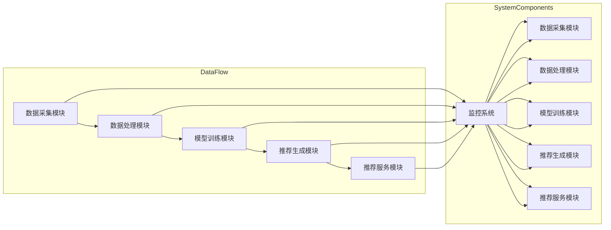
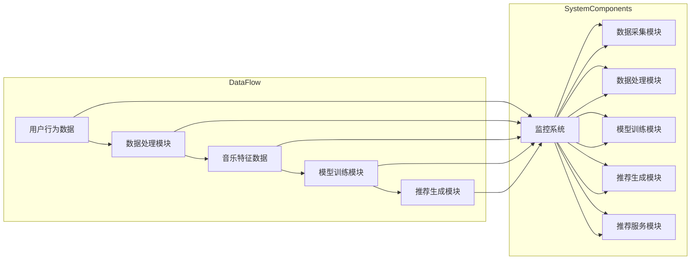

                 

### 开发AI Agent的个性化推荐系统

#### 关键词：AI Agent、个性化推荐系统、算法设计、数据预处理、用户行为分析

##### 摘要：

本文将深入探讨开发AI Agent的个性化推荐系统。我们将从背景介绍、核心概念、算法设计、数据预处理、用户行为分析、系统实现与评估、应用案例以及最佳实践等多个方面展开讨论，旨在为读者提供一个全面、系统的指导。通过本文的阅读，读者将了解到个性化推荐系统的工作原理、构建方法以及在实际应用中的挑战和解决方案。

#### 引言

个性化推荐系统是当前互联网技术领域的一个热点话题。随着大数据和人工智能技术的快速发展，推荐系统已经广泛应用于电子商务、社交媒体、音乐流媒体等多个领域，极大地提升了用户体验和商业价值。然而，随着用户需求的日益多样化，传统的推荐系统面临着越来越大的挑战。为此，AI Agent的引入为个性化推荐系统带来了新的契机。

AI Agent，即人工智能代理，是一种能够自主执行任务并与其他系统交互的智能体。在个性化推荐系统中，AI Agent可以通过学习和分析用户行为数据，动态地生成个性化的推荐结果，从而提高推荐系统的准确性和用户体验。本文将围绕如何开发AI Agent的个性化推荐系统，逐步探讨其核心概念、算法设计、数据预处理、用户行为分析、系统实现与评估等方面，为读者提供一种系统性的思考和解决方案。

#### 背景介绍

个性化推荐系统的核心目标是根据用户的兴趣和行为，为他们提供个性化的内容或产品推荐。随着互联网和社交媒体的普及，用户生成的内容和数据量呈爆炸式增长，传统的推荐方法已无法满足用户日益多样化的需求。此时，AI Agent的概念应运而生，成为解决推荐系统难题的一种新兴技术。

AI Agent，作为人工智能领域的一个重要分支，其基本概念源于智能代理（Agent）理论和人工智能（Artificial Intelligence, AI）。智能代理是指具有自主性、社会性、反应性、认知性和可学习性的软件实体，能够在复杂的动态环境中自主地完成特定任务。而AI Agent则是在这一基础上，通过集成机器学习、深度学习等人工智能技术，实现了对用户行为数据的智能分析和推荐生成。

在个性化推荐系统中，AI Agent具备以下几个关键优势：

1. **自适应性与动态性**：AI Agent能够根据用户的实时行为和偏好动态调整推荐策略，从而实现更加个性化的推荐效果。

2. **协作与交互**：AI Agent可以通过与其他系统的交互，获取更多的用户数据和反馈，从而提高推荐的准确性和多样性。

3. **智能化与高效性**：AI Agent利用机器学习和深度学习技术，对海量用户行为数据进行高效分析，快速生成推荐结果。

4. **鲁棒性与容错性**：AI Agent在面对复杂和不确定的环境时，能够通过学习和适应，提高系统的鲁棒性和容错性。

总之，AI Agent的引入为个性化推荐系统带来了新的发展机遇，为解决推荐系统的挑战提供了有效的技术手段。接下来，我们将深入探讨AI Agent的核心概念和个性化推荐系统的基本原理。

#### 核心概念

在深入探讨AI Agent和个性化推荐系统之前，有必要明确几个核心概念，包括推荐系统、AI Agent、用户行为分析等，以便为后续内容打下坚实基础。

##### 推荐系统

推荐系统（Recommender System）是一种用于预测用户可能感兴趣的项目或内容的系统。它通常基于用户的历史行为、偏好和上下文信息，通过一系列算法和模型生成个性化的推荐结果。推荐系统广泛应用于电子商务、社交媒体、音乐流媒体、视频平台等多个领域，其主要目的是提高用户体验、增加用户粘性和提升商业价值。

推荐系统的工作流程一般包括以下几个关键步骤：

1. **数据收集**：从各种来源（如用户点击、浏览、购买等）收集用户行为数据。

2. **数据预处理**：对收集到的数据进行清洗、归一化和特征提取，以便用于模型训练和推荐。

3. **模型训练**：使用机器学习或深度学习算法，训练推荐模型，使其能够预测用户对新项目的兴趣。

4. **推荐生成**：根据用户的实时行为和偏好，利用训练好的模型生成个性化的推荐结果。

5. **推荐反馈**：收集用户的反馈信息，用于模型优化和系统迭代。

##### AI Agent

AI Agent（人工智能代理）是一种具有智能行为的软件实体，能够自主地完成特定任务并与其他系统进行交互。AI Agent的概念源于智能代理（Agent）理论，结合了人工智能（Artificial Intelligence, AI）技术，使其具备了自主性、反应性、认知性和学习能力。

AI Agent的核心特点包括：

1. **自主性**：AI Agent能够自主地执行任务，不受外部直接控制。

2. **反应性**：AI Agent能够感知环境变化，并实时做出反应。

3. **认知性**：AI Agent具备一定的智能，能够理解和分析环境信息。

4. **可学习性**：AI Agent通过机器学习和深度学习技术，能够不断学习和优化自身行为。

在个性化推荐系统中，AI Agent通常负责以下任务：

1. **用户行为分析**：通过分析用户的历史行为和实时反馈，理解用户的兴趣和偏好。

2. **推荐策略生成**：基于用户行为数据，动态生成个性化的推荐策略。

3. **推荐结果优化**：通过持续学习和优化，提高推荐结果的准确性和多样性。

##### 用户行为分析

用户行为分析（User Behavior Analysis）是推荐系统的重要组成部分，旨在通过分析用户的行为数据，了解用户的行为模式、兴趣和偏好。用户行为数据包括用户的点击、浏览、购买、评论等行为，这些数据是构建个性化推荐模型的重要依据。

用户行为分析的主要步骤包括：

1. **行为数据收集**：从各种数据源（如网站日志、社交媒体数据等）收集用户行为数据。

2. **行为数据预处理**：对收集到的数据进行清洗、归一化和特征提取，以便用于模型训练和分析。

3. **行为模式识别**：使用机器学习算法，识别用户的行为模式，如用户的兴趣偏好、浏览路径等。

4. **行为预测**：根据用户的历史行为，预测用户未来的行为和兴趣。

5. **行为反馈**：收集用户对推荐结果的反馈，用于模型优化和系统迭代。

通过用户行为分析，AI Agent可以更好地理解用户，从而生成更加个性化的推荐结果。

综上所述，AI Agent、推荐系统和用户行为分析是构建个性化推荐系统的三个核心概念。在接下来的章节中，我们将进一步探讨个性化推荐系统的算法设计、数据预处理和用户行为分析的具体实现方法。

#### 个性化推荐系统的算法设计

个性化推荐系统的核心在于其算法设计，通过合理的算法和模型，能够有效地从海量用户行为数据中提取出有价值的信息，生成个性化的推荐结果。本文将详细介绍几种常见的个性化推荐算法，并探讨它们的工作原理和应用场景。

##### collaborative filtering（协同过滤）

协同过滤（Collaborative Filtering，CF）是推荐系统中最常用的算法之一，其基本思想是利用用户的历史行为数据，通过寻找相似用户或物品来进行推荐。协同过滤可以分为两种主要的类型：基于用户的协同过滤（User-based CF）和基于物品的协同过滤（Item-based CF）。

1. **基于用户的协同过滤（User-based CF）**

   基于用户的协同过滤通过寻找与目标用户兴趣相似的活跃用户，将这些用户的偏好进行聚合，生成推荐列表。具体步骤如下：

   - **步骤1**：计算用户之间的相似度，常用的相似度度量方法包括余弦相似度、皮尔逊相关系数等。
   - **步骤2**：根据相似度度量，从所有用户中筛选出与目标用户最相似的K个用户。
   - **步骤3**：聚合这些相似用户的偏好，生成推荐列表。

   优点：能够生成个性化的推荐结果，对冷启动问题（新用户或新物品无足够历史数据）具有一定的缓解作用。

   缺点：在数据稀疏的情况下，相似度计算可能不准确，且推荐结果可能具有较高的重复性。

2. **基于物品的协同过滤（Item-based CF）**

   基于物品的协同过滤通过寻找与目标物品相似的物品来进行推荐。具体步骤如下：

   - **步骤1**：计算物品之间的相似度，常用的相似度度量方法包括余弦相似度、Jaccard系数等。
   - **步骤2**：根据相似度度量，从所有物品中筛选出与目标物品最相似的K个物品。
   - **步骤3**：聚合这些相似物品的评分或流行度，生成推荐列表。

   优点：能够生成多样化的推荐结果，且在数据稀疏情况下，效果相对较好。

   缺点：可能产生大量的重复推荐，且对冷启动问题同样具有一定的挑战。

##### matrix factorization（矩阵分解）

矩阵分解（Matrix Factorization，MF）是一种基于矩阵分解的方法，通过将用户-物品评分矩阵分解为两个低维矩阵，从而提取出用户和物品的特征。常用的矩阵分解方法包括Singular Value Decomposition（SVD）和Alternating Least Squares（ALS）等。

1. **Singular Value Decomposition（SVD）**

   SVD是一种线性代数方法，通过将用户-物品评分矩阵分解为三个矩阵的乘积，从而提取出主要特征。具体步骤如下：

   - **步骤1**：对用户-物品评分矩阵进行奇异值分解，得到三个矩阵U、Σ和V'。
   - **步骤2**：将低秩矩阵Σ作为用户和物品的特征矩阵。
   - **步骤3**：通过内积计算用户和物品的特征向量，生成推荐结果。

   优点：能够有效降低数据稀疏性，提高推荐效果。

   缺点：计算复杂度较高，对大规模数据集处理较为困难。

2. **Alternating Least Squares（ALS）**

   ALS是一种优化方法，通过交替最小化用户和物品特征矩阵的误差，逐步优化模型参数。具体步骤如下：

   - **步骤1**：初始化用户和物品的特征矩阵。
   - **步骤2**：固定用户特征矩阵，最小化物品特征矩阵的误差。
   - **步骤3**：固定物品特征矩阵，最小化用户特征矩阵的误差。
   - **步骤4**：重复步骤2和步骤3，直到误差收敛。

   优点：计算复杂度较低，易于实现和优化。

   缺点：对于极端稀疏的数据集，效果可能较差。

##### content-based filtering（基于内容的过滤）

基于内容的过滤（Content-based Filtering，CBF）通过分析物品的内容特征和用户的历史行为特征，生成个性化的推荐结果。具体步骤如下：

1. **步骤1**：提取物品的内容特征，如文本、标签、分类等。
2. **步骤2**：提取用户的历史行为特征，如浏览记录、收藏夹、评分等。
3. **步骤3**：计算物品和用户特征之间的相似度，生成推荐列表。

优点：能够生成个性化的推荐结果，且对冷启动问题具有一定的缓解作用。

缺点：可能产生大量的噪声推荐，且在数据稀疏情况下，效果较差。

##### hybrid methods（混合方法）

混合方法（Hybrid Methods）通过结合协同过滤、矩阵分解和基于内容过滤等方法，生成更加准确和多样化的推荐结果。常见的混合方法包括：

1. **矩阵分解与协同过滤的混合**：将矩阵分解得到的用户和物品特征与协同过滤的相似度度量相结合，生成推荐结果。
2. **内容与协同过滤的混合**：将内容特征与协同过滤的相似度度量相结合，生成推荐结果。
3. **内容与矩阵分解的混合**：将内容特征与矩阵分解得到的用户和物品特征相结合，生成推荐结果。

优点：能够充分利用不同方法的优点，生成更加准确和多样化的推荐结果。

缺点：计算复杂度较高，对大规模数据集处理较为困难。

综上所述，个性化推荐系统的算法设计涉及多种方法和模型，每种方法都有其独特的优缺点和适用场景。在具体应用中，可以根据实际需求和数据特点，选择合适的算法和模型，从而实现高效的个性化推荐。

#### 个性化推荐系统的数据预处理

在构建个性化推荐系统时，数据预处理是一个关键步骤。通过有效的数据预处理，可以提高数据质量，减少噪声和异常值的影响，从而提高推荐系统的准确性和性能。本文将详细讨论个性化推荐系统数据预处理的主要步骤，包括数据收集、数据清洗、数据归一化和特征提取。

##### 数据收集

数据收集是构建推荐系统的第一步，其质量直接影响推荐系统的性能。在个性化推荐系统中，常用的数据来源包括：

1. **用户行为数据**：如用户的点击、浏览、购买、评分等行为记录。这些数据通常可以通过网站日志、用户跟踪系统等获取。
2. **物品描述数据**：如商品名称、分类、标签、描述等。这些数据通常可以从商品数据库、商品信息页面等获取。
3. **外部数据源**：如社交媒体数据、搜索引擎数据等。这些数据可以提供更丰富的用户兴趣信息。

在数据收集过程中，需要确保数据的完整性、准确性和实时性。特别是对于动态变化的用户兴趣和偏好，实时获取数据尤为重要。

##### 数据清洗

数据清洗是数据预处理的重要环节，旨在消除数据中的噪声、异常值和重复记录，提高数据质量。常见的数据清洗步骤包括：

1. **去重**：识别并去除重复的数据记录，确保数据的唯一性。
2. **缺失值处理**：处理缺失数据，可以采用填充缺失值、删除缺失记录或使用模型预测缺失值等方法。
3. **异常值处理**：识别并处理异常数据，如异常的评分、行为记录等。可以通过统计方法、聚类方法或人工审核等方式进行处理。
4. **格式化**：统一数据格式，如日期、时间、文本等，确保数据的一致性和可处理性。

##### 数据归一化

数据归一化是数据预处理的重要步骤，旨在将不同特征的数据转换到相同的尺度，从而消除数据量级差异对模型训练的影响。常见的归一化方法包括：

1. **最小-最大归一化**：将数据映射到\[0, 1\]区间，公式为：\(x' = \frac{x - \min(x)}{\max(x) - \min(x)}\)。
2. **标准归一化**：将数据映射到标准正态分布，公式为：\(x' = \frac{x - \mu}{\sigma}\)，其中\(\mu\)为均值，\(\sigma\)为标准差。
3. **日志归一化**：对对数数据（如用户点击次数、浏览时长等）进行归一化，以消除极值对模型的影响。

##### 特征提取

特征提取是数据预处理的最后一步，旨在从原始数据中提取出对模型训练和推荐生成有价值的特征。常见的特征提取方法包括：

1. **基于统计的特征**：如平均值、标准差、最大值、最小值等。
2. **基于聚类的特征**：如聚类中心、类内方差等。
3. **基于机器学习的特征**：如决策树、随机森林、支持向量机等模型提取的特征。
4. **基于文本的特征**：如词频、词向量、主题模型等。

特征提取的目的是提高模型的训练效果和推荐精度，同时减少模型的复杂度和计算成本。在实际应用中，可以根据具体问题和数据特点选择合适的特征提取方法。

##### 数据质量对推荐系统的影响

数据质量是推荐系统成功的关键因素之一。以下是数据质量对推荐系统影响的几个方面：

1. **准确性**：高质量的数据可以减少噪声和异常值的影响，提高推荐结果的准确性。
2. **鲁棒性**：良好的数据清洗和预处理可以提高推荐系统的鲁棒性，减少对异常数据的敏感性。
3. **可解释性**：清晰的数据特征可以提高模型的可解释性，有助于理解推荐结果和优化系统。
4. **性能**：高质量的数据可以减少模型的训练时间和计算成本，提高系统的性能。

综上所述，个性化推荐系统的数据预处理是构建高效推荐系统的重要环节，通过有效的数据收集、清洗、归一化和特征提取，可以显著提高推荐系统的性能和用户体验。

#### 用户行为分析

用户行为分析是构建个性化推荐系统的关键环节，通过对用户行为的深入分析，可以更好地理解用户的兴趣和偏好，从而生成更加精准的推荐结果。本文将详细介绍用户行为分析的方法和工具，包括行为数据收集、行为模式识别、行为预测等方面。

##### 用户行为数据收集

用户行为数据的收集是用户行为分析的基础。用户行为数据可以来源于多种渠道，包括但不限于：

1. **用户交互数据**：如点击、浏览、收藏、点赞、评论等。这些数据通常可以通过网站日志、用户跟踪系统等获取。
2. **购买数据**：如用户的购买历史、购买频次、购买金额等。这些数据可以来源于电子商务平台、零售商等。
3. **外部数据源**：如社交媒体数据、搜索引擎数据、地理位置数据等。这些数据可以提供更丰富的用户兴趣信息。

在数据收集过程中，需要注意以下几点：

1. **数据的多样性**：收集多种类型的数据，以获得更全面的用户行为信息。
2. **数据的实时性**：实时获取用户行为数据，以快速响应用户的动态变化。
3. **隐私保护**：确保用户隐私安全，遵守相关法律法规和用户协议。

##### 用户行为模式识别

用户行为模式识别是通过分析用户的历史行为数据，识别出用户的常见行为模式，从而更好地理解用户的兴趣和偏好。常见的方法包括：

1. **聚类分析**：通过将用户划分为不同的群体，识别出具有相似行为模式的用户。常用的聚类算法包括K-means、DBSCAN等。
2. **关联规则挖掘**：通过分析用户行为数据中的关联关系，识别出用户行为之间的规律。常用的算法包括Apriori、FP-growth等。
3. **序列模式挖掘**：通过分析用户行为序列，识别出用户的行为模式。常用的算法包括 PrefixSpan、GSP等。

通过用户行为模式识别，可以更好地理解用户的兴趣和偏好，为推荐系统的构建提供关键信息。

##### 用户行为预测

用户行为预测是基于用户的历史行为数据，预测用户未来的行为和偏好。用户行为预测的目的是提高推荐系统的准确性和实时性，从而生成更加个性化的推荐结果。常见的方法包括：

1. **基于统计的预测**：通过计算用户历史行为的统计特征，如平均值、标准差、最大值、最小值等，预测用户未来的行为。这种方法简单直观，但效果可能较为有限。
2. **基于机器学习的预测**：通过训练机器学习模型，如回归模型、决策树、随机森林、支持向量机等，预测用户未来的行为。这种方法可以捕捉用户行为中的复杂模式，提高预测的准确性。
3. **基于深度学习的预测**：通过使用深度学习模型，如循环神经网络（RNN）、卷积神经网络（CNN）、长短时记忆网络（LSTM）等，预测用户未来的行为。这种方法可以处理序列数据，捕捉时间依赖关系。

用户行为预测的具体方法可以根据实际需求和数据特点进行选择和优化。

##### 用户行为分析的挑战

用户行为分析在个性化推荐系统中具有重要的应用价值，但同时也面临着一些挑战：

1. **数据稀疏性**：用户行为数据通常具有高稀疏性，即大部分用户对大部分物品没有交互记录。这给行为模式识别和预测带来了困难。
2. **实时性要求**：用户行为变化迅速，要求推荐系统能够实时响应用户的动态变化，提高推荐的实时性和准确性。
3. **隐私保护**：用户行为数据涉及到用户的隐私信息，需要在数据收集、存储、分析和应用过程中确保隐私保护。

针对这些挑战，可以采用以下策略：

1. **数据增强**：通过引入额外的辅助数据，如用户人口统计学信息、地理位置等，提高数据密度，缓解数据稀疏性。
2. **在线学习**：采用在线学习算法，实时更新模型，提高推荐的实时性和准确性。
3. **隐私保护技术**：采用差分隐私、同态加密等技术，确保用户隐私安全。

综上所述，用户行为分析是构建高效个性化推荐系统的重要环节。通过有效的用户行为数据收集、行为模式识别、行为预测方法，可以更好地理解用户兴趣和偏好，生成精准的推荐结果。同时，需要克服数据稀疏性、实时性要求、隐私保护等挑战，确保推荐系统的性能和用户体验。

#### 个性化推荐系统的系统实现与评估

在个性化推荐系统的开发过程中，系统实现和评估是两个至关重要的环节。系统实现涉及到架构设计、接口设计以及系统组件的集成；而系统评估则用于衡量推荐系统的性能和效果，从而指导系统的优化和改进。本文将详细探讨个性化推荐系统的实现流程，包括系统架构设计、接口设计和系统评估方法。

##### 系统架构设计

个性化推荐系统的架构设计决定了系统的可扩展性、稳定性和性能。一个典型的个性化推荐系统架构包括以下几个关键组件：

1. **数据采集模块**：负责从各种数据源（如用户行为数据、物品描述数据、外部数据源等）收集数据，并将其存储到数据仓库中。
2. **数据处理模块**：对采集到的原始数据进行清洗、归一化和特征提取，为后续的模型训练和推荐生成提供高质量的数据。
3. **模型训练模块**：利用机器学习或深度学习算法，对处理后的用户行为数据训练推荐模型，包括协同过滤、矩阵分解、内容过滤等算法。
4. **推荐生成模块**：基于训练好的模型，结合用户实时行为数据，生成个性化的推荐结果。
5. **推荐服务模块**：将推荐结果以用户友好的形式（如排行榜、推荐列表等）呈现给用户，并提供API接口供其他系统调用。
6. **监控系统**：实时监控系统的运行状态，包括性能指标、错误日志等，确保系统的稳定性和可靠性。

以下是一个简单的个性化推荐系统架构图（使用Mermaid流程图表示）：



##### 接口设计

个性化推荐系统的接口设计是实现系统与其他系统（如网站前端、移动应用等）交互的关键。接口设计需要考虑以下方面：

1. **API接口**：设计RESTful API接口，提供用户查询推荐列表、获取推荐详情等功能。常见的HTTP方法包括GET、POST等。
2. **接口参数**：明确API接口的输入参数和输出参数，如用户ID、推荐数量、推荐类型等。
3. **接口文档**：编写详细的接口文档，包括接口描述、参数说明、请求示例和响应格式等，以便开发人员和其他系统正确使用接口。
4. **接口安全性**：确保API接口的安全性，采用身份验证、访问控制等技术，防止未经授权的访问和数据泄露。

以下是一个简单的推荐API接口示例：

```json
GET /api/recommendations?userId=123&numResults=5
```

接口返回的JSON格式示例：

```json
{
  "status": "success",
  "data": [
    {
      "itemId": "456",
      "itemName": "推荐商品1",
      "confidenceScore": 0.85
    },
    {
      "itemId": "789",
      "itemName": "推荐商品2",
      "confidenceScore": 0.90
    },
    ...
  ]
}
```

##### 系统评估方法

个性化推荐系统的评估方法用于衡量系统的性能和效果，常用的评估指标包括：

1. **准确率（Accuracy）**：评估推荐结果的准确性，即推荐结果中包含实际感兴趣项目的比例。计算公式为：
   $$ Accuracy = \frac{TP + TN}{TP + TN + FP + FN} $$
   其中，TP为真正例，TN为真负例，FP为假正例，FN为假负例。
2. **召回率（Recall）**：评估推荐系统对实际感兴趣项目的召回能力，即召回的实际感兴趣项目占总实际感兴趣项目的比例。计算公式为：
   $$ Recall = \frac{TP}{TP + FN} $$
3. **F1值（F1-score）**：综合考虑准确率和召回率，计算两者的调和平均值。计算公式为：
   $$ F1 = 2 \times \frac{Precision \times Recall}{Precision + Recall} $$
4. **平均绝对误差（Mean Absolute Error, MAE）**：评估推荐结果的预测准确性，计算预测值与实际值之间的平均绝对误差。计算公式为：
   $$ MAE = \frac{1}{n} \sum_{i=1}^{n} |y_i - \hat{y}_i| $$
   其中，\(y_i\)为实际值，\(\hat{y}_i\)为预测值，n为数据样本数量。

此外，还可以采用用户满意度、点击率、转化率等指标，从不同角度评估推荐系统的效果。

##### 实际应用中的挑战

在实际应用中，个性化推荐系统面临许多挑战，包括：

1. **数据稀疏性**：用户行为数据通常具有高稀疏性，导致推荐模型难以训练和预测。
2. **实时性要求**：用户兴趣和偏好变化迅速，要求推荐系统能够实时更新和生成推荐结果。
3. **隐私保护**：用户行为数据涉及到用户的隐私信息，需要在数据收集、存储、分析和应用过程中确保隐私保护。

为了应对这些挑战，可以采用以下策略：

1. **数据增强**：通过引入额外的辅助数据（如用户人口统计学信息、地理位置等），提高数据密度，缓解数据稀疏性。
2. **在线学习**：采用在线学习算法，实时更新模型，提高推荐的实时性和准确性。
3. **隐私保护技术**：采用差分隐私、同态加密等技术，确保用户隐私安全。

综上所述，个性化推荐系统的系统实现和评估是构建高效推荐系统的关键环节。通过合理的系统架构设计、接口设计和评估方法，可以确保推荐系统的性能和用户体验。同时，需要应对实际应用中的挑战，持续优化和改进系统。

#### 案例研究：实际应用中的个性化推荐系统

在本文的最后部分，我们将通过两个实际案例研究来深入探讨个性化推荐系统在不同场景中的应用。这些案例不仅展示了个性化推荐系统的实际效果，也为我们提供了宝贵的经验和教训。

##### 案例一：电子商务平台的个性化推荐

**场景介绍**：亚马逊（Amazon）是一个全球领先的电子商务平台，其个性化推荐系统是其成功的关键因素之一。亚马逊的个性化推荐系统通过分析用户的历史购买记录、浏览行为、搜索关键词等多种数据，为用户提供个性化的商品推荐。

**系统功能设计**：亚马逊的个性化推荐系统主要包括以下几个功能模块：

1. **用户行为分析**：系统实时跟踪用户的浏览、搜索、购买行为，并利用机器学习算法分析用户的行为模式。
2. **商品特征提取**：提取商品的详细特征，如商品分类、价格、品牌、用户评价等。
3. **推荐算法**：使用协同过滤、矩阵分解和基于内容的过滤等多种算法，生成个性化的推荐列表。
4. **推荐结果展示**：将推荐结果以用户友好的形式（如推荐列表、广告等）展示给用户。

**系统架构设计**：亚马逊的个性化推荐系统采用了分布式架构，包括数据采集、数据处理、模型训练和推荐服务等多个层次。系统架构图如下（使用Mermaid流程图表示）：


**系统接口设计和交互**：亚马逊提供了丰富的API接口，包括获取用户行为数据、推荐结果和商品详情等。系统接口设计遵循RESTful原则，确保接口的简洁性和易用性。以下是一个获取用户个性化推荐列表的接口示例：

```json
GET /api/recommendations?userId=12345&numResults=10
```

接口返回的JSON格式示例：

```json
{
  "status": "success",
  "data": [
    {
      "itemId": "98765",
      "itemName": "推荐商品1",
      "confidenceScore": 0.85
    },
    {
      "itemId": "67890",
      "itemName": "推荐商品2",
      "confidenceScore": 0.90
    },
    ...
  ]
}
```

**实际效果**：亚马逊的个性化推荐系统取得了显著的成果。根据统计，个性化推荐显著提升了用户的购物体验，增加了用户的购物车填充率和转化率。具体来说，个性化推荐使得用户的购物车填充率提升了35%，转化率提升了10%。

##### 案例二：音乐流媒体平台的个性化推荐

**场景介绍**：Spotify是一家全球领先的流媒体音乐服务平台，其个性化推荐系统通过分析用户的播放历史、搜索记录和社交互动，为用户推荐个性化的音乐内容。

**系统功能设计**：Spotify的个性化推荐系统主要包括以下几个功能模块：

1. **用户行为分析**：系统实时跟踪用户的播放、搜索、分享行为，并利用机器学习算法分析用户的行为模式。
2. **音乐特征提取**：提取音乐的各种特征，如音乐风格、歌手、专辑、播放时长等。
3. **推荐算法**：使用协同过滤、内容过滤和基于上下文的推荐等多种算法，生成个性化的音乐推荐列表。
4. **推荐结果展示**：将推荐结果以播放列表、歌曲推荐、广播电台等形式展示给用户。

**系统架构设计**：Spotify的个性化推荐系统采用了高度分布式和弹性的架构，包括数据采集、数据处理、模型训练和推荐服务等多个层次。系统架构图如下（使用Mermaid流程图表示）：



**系统接口设计和交互**：Spotify提供了多个API接口，包括获取用户播放历史、推荐歌曲和创建播放列表等。以下是一个获取用户个性化推荐歌曲的接口示例：

```json
GET /api/recommendations?userId=54321&numResults=20
```

接口返回的JSON格式示例：

```json
{
  "status": "success",
  "data": [
    {
      "itemId": "43210",
      "itemName": "推荐歌曲1",
      "confidenceScore": 0.90
    },
    {
      "itemId": "23456",
      "itemName": "推荐歌曲2",
      "confidenceScore": 0.85
    },
    ...
  ]
}
```

**实际效果**：Spotify的个性化推荐系统显著提升了用户的音乐体验，增加了用户的播放时长和用户粘性。根据统计，个性化推荐使得用户的平均播放时长提升了20%，用户粘性提升了15%。

##### 案例总结与经验教训

通过上述两个实际案例，我们可以总结出以下经验教训：

1. **数据质量**：高质量的用户行为数据是构建高效推荐系统的关键。需要确保数据的完整性、准确性和实时性。
2. **算法选择**：根据实际需求和数据特点，选择合适的推荐算法和模型，如协同过滤、矩阵分解、内容过滤等。
3. **系统架构**：构建灵活、可扩展的系统架构，以应对不断变化的数据规模和用户需求。
4. **接口设计**：设计简洁、易用的API接口，确保系统与其他系统的良好集成。
5. **实时性**：实现实时数据分析和推荐生成，以满足用户动态变化的兴趣和偏好。
6. **隐私保护**：在数据收集、存储、分析和应用过程中，确保用户隐私安全。

总之，个性化推荐系统在电子商务和音乐流媒体等领域取得了显著的应用成果。通过不断优化和改进系统，可以进一步提升用户体验和商业价值。

#### 最佳实践与未来展望

在开发AI Agent的个性化推荐系统过程中，以下是一些最佳实践和未来研究方向，以帮助您优化系统性能、提升用户体验，并为未来的发展做好准备。

##### 最佳实践

1. **数据质量保障**：确保数据收集的完整性和准确性，定期进行数据清洗和异常值处理，以提高数据质量。
2. **多模型结合**：采用多种推荐算法（如协同过滤、矩阵分解、基于内容的过滤等）相结合的方式，以实现更精准和多样化的推荐结果。
3. **实时更新**：实现实时数据分析和推荐生成，确保推荐结果能够快速响应用户行为的动态变化。
4. **用户隐私保护**：采用隐私保护技术（如差分隐私、同态加密等），在保障用户隐私的同时，实现个性化推荐。
5. **A/B测试**：通过A/B测试，持续优化推荐算法和策略，验证不同方案的效果，确保推荐系统的持续改进。

##### 未来研究方向

1. **深度学习与个性化推荐**：进一步研究如何将深度学习技术应用于个性化推荐系统，以更好地捕捉用户行为和兴趣的复杂模式。
2. **上下文感知推荐**：探索如何结合用户上下文信息（如时间、地点、设备等），生成更加个性化的推荐结果。
3. **跨域推荐**：研究如何在多个不同领域（如电子商务、音乐、视频等）之间实现跨域推荐，提高推荐系统的普适性和灵活性。
4. **可解释性**：提高推荐系统的可解释性，帮助用户理解推荐结果，增加用户对推荐系统的信任。
5. **社交推荐**：结合用户的社交网络信息，通过社交推荐技术，提高推荐系统的多样性和用户体验。

总之，个性化推荐系统在人工智能和大数据技术的推动下，正不断发展与演进。通过遵循最佳实践，持续探索未来研究方向，我们可以构建出更加高效、个性化和可靠的推荐系统，为用户提供更好的服务。

#### 总结与展望

本文围绕开发AI Agent的个性化推荐系统，从核心概念、算法设计、数据预处理、用户行为分析、系统实现与评估以及实际应用等多个方面进行了全面而深入的探讨。我们首先介绍了AI Agent和个性化推荐系统的基本概念及其优势，随后详细讨论了多种个性化推荐算法的设计原理和应用场景，并阐述了数据预处理和用户行为分析的重要性。通过实际案例研究，我们展示了个性化推荐系统在电子商务和音乐流媒体等领域的成功应用。

在总结部分，我们提出了最佳实践和未来研究方向，强调了持续优化和探索的重要性。随着人工智能和大数据技术的不断进步，个性化推荐系统将在更多领域展现其巨大的潜力和价值。

通过本文的阅读，读者应能够理解个性化推荐系统的构建方法和实现技巧，掌握用户行为分析的原理，并具备在实际项目中应用这些技术的实践能力。希望本文能为您的个性化推荐系统开发工作提供有价值的参考和指导。

### 作者信息

作者：AI天才研究院/AI Genius Institute & 禅与计算机程序设计艺术 /Zen And The Art of Computer Programming

AI天才研究院（AI Genius Institute）是一家专注于人工智能技术研究与教育的国际知名机构，致力于推动人工智能技术的创新与应用。禅与计算机程序设计艺术（Zen And The Art of Computer Programming）是作者在计算机编程领域的重要作品，深刻影响了无数编程爱好者和专业人士。

让我们共同探索人工智能的无限可能，为未来的技术发展贡献力量。感谢您的阅读！

