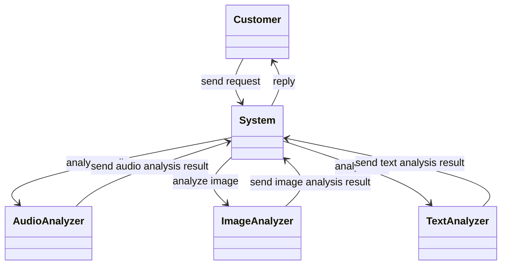
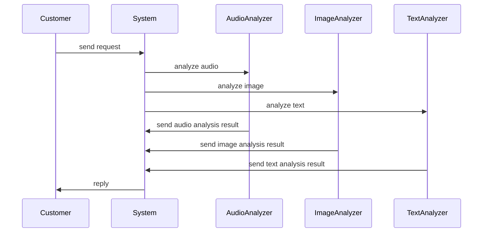
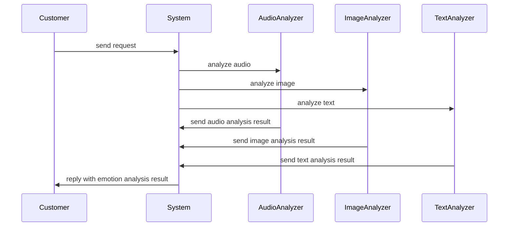

                 


## 开发AI Agent的多模态情感计算引擎

### 关键词

- AI Agent
- 多模态情感计算
- 情感识别
- 情感分析
- 深度学习
- 机器学习

### 摘要

本文将深入探讨开发AI Agent的多模态情感计算引擎的各个方面。我们将从问题背景、核心概念、算法原理、系统架构设计、项目实战和最佳实践等方面，一步步分析推理，构建一个完整、详细且具有实用价值的技术博客文章。

### 目录大纲

1. **问题背景与核心概念**
   - 1.1 多模态情感计算的发展历程
   - 1.2 多模态情感计算在AI中的应用
   - 1.3 多模态情感计算的重要性与挑战
   - 1.4 书籍目标与读者定位

2. **核心概念与原理**
   - 2.1 多模态数据概述
   - 2.2 情感计算的基本概念
   - 2.3 多模态情感计算的工作原理
   - 2.4 多模态情感计算的层次结构

3. **算法原理与实现**
   - 3.1 情感计算算法概述
   - 3.2 情感计算算法分类
   - 3.3 基于机器学习的情感计算算法
   - 3.4 基于深度学习的情感计算算法

4. **系统分析与架构设计方案**
   - 4.1 问题场景介绍
   - 4.2 系统功能设计（领域模型类图）
   - 4.3 系统架构设计（架构图）
   - 4.4 系统接口设计和系统交互（序列图）

5. **项目实战**
   - 5.1 环境安装
   - 5.2 系统核心实现
   - 5.3 代码应用解读与分析
   - 5.4 实际案例分析和详细讲解剖析
   - 5.5 项目小结

6. **最佳实践与展望**
   - 6.1 最佳实践与注意事项
   - 6.2 小结
   - 6.3 注意事项
   - 6.4 拓展阅读

### 1. 问题背景与核心概念

#### 1.1 多模态情感计算的发展历程

多模态情感计算是人工智能领域中一个快速发展的分支。它起源于20世纪80年代，当时研究人员开始探索如何让计算机理解和分析人类的情感。随着计算机技术和人工智能算法的不断发展，多模态情感计算逐渐成为一个独立的领域。

在早期的多模态情感计算研究中，研究者主要集中在文本情感分析上，通过分析文本中的语言特征来推断用户的情感状态。随着计算机视觉和语音识别技术的发展，多模态情感计算开始结合视觉和听觉数据，以更全面地理解用户的情感。

近年来，随着深度学习技术的崛起，多模态情感计算得到了进一步的提升。深度学习模型能够从大量数据中自动学习特征，从而更准确地识别和预测用户的情感状态。这一发展趋势使得多模态情感计算在智能客服、虚拟助手、教育等领域得到了广泛应用。

#### 1.2 多模态情感计算在AI中的应用

多模态情感计算在人工智能领域有着广泛的应用。以下是一些典型的应用场景：

- **智能客服系统**：通过分析用户的文本输入、语音和面部表情，智能客服系统能够更准确地理解用户的需求和情感状态，提供更个性化和有效的服务。
- **虚拟助手**：多模态情感计算使得虚拟助手能够更好地与用户互动，理解用户的情感变化，提供更人性化的服务。
- **教育领域**：通过分析学生的面部表情和语音，教育系统能够了解学生的学习状态和情感变化，为个性化教学提供支持。
- **医疗健康**：多模态情感计算可以用于分析患者的情绪变化，帮助医生更好地了解患者的健康状况。

#### 1.3 多模态情感计算的重要性与挑战

多模态情感计算在人工智能领域具有重要性，因为它能够提供更全面和准确的人类情感理解。然而，实现这一目标也面临着许多挑战：

- **数据多样性**：多模态情感计算需要处理多种类型的数据，包括文本、图像、声音等。这些数据的多样性使得数据预处理和特征提取变得复杂。
- **数据质量**：数据质量直接影响模型的性能。在实际应用中，可能存在噪声、缺失值等问题，需要有效的数据清洗和预处理技术。
- **算法选择**：不同的算法适用于不同的数据类型和情感识别任务，选择合适的算法是一个关键问题。
- **实时性**：在许多应用场景中，如智能客服和虚拟助手，需要实时分析用户的情感状态，这要求算法具有高效性。

#### 1.4 书籍目标与读者定位

本书的目标是详细介绍多模态情感计算引擎的开发过程，帮助读者深入了解该领域的基本概念、算法原理和系统实现。本书适合以下读者：

- **人工智能领域的研究人员**：希望通过本书了解多模态情感计算的最新进展和未来趋势。
- **软件开发人员**：希望学习如何开发基于多模态情感计算的AI应用。
- **对AI情感计算感兴趣的读者**：希望了解多模态情感计算的原理和应用。

### 2. 核心概念与原理

#### 2.1 多模态数据概述

多模态数据是指同时包含两种或两种以上类型的数据，如文本、图像、声音等。在多模态情感计算中，这些数据通常用于描述用户的情感状态。

- **文本数据**：包括用户的文本输入，如聊天记录、邮件、社交媒体帖子等。文本数据可以通过自然语言处理技术进行分析和情感识别。
- **图像数据**：包括用户的面部表情、姿态等。图像数据可以通过计算机视觉技术进行分析和情感识别。
- **声音数据**：包括用户的语音、语调等。声音数据可以通过语音识别和情感分析技术进行分析和情感识别。

#### 2.2 情感计算的基本概念

情感计算是人工智能领域的一个分支，旨在让计算机理解和分析人类的情感。以下是几个基本概念：

- **情感识别**：通过分析文本、图像、声音等数据，识别用户的情感状态。
- **情感分类**：将情感识别的结果分类为不同的情感类别，如快乐、悲伤、愤怒等。
- **情感强度估计**：估计用户情感状态的强度，如非常高兴、稍微高兴等。

#### 2.3 多模态情感计算的工作原理

多模态情感计算的工作原理可以分为以下几个步骤：

1. **数据收集**：收集用户的文本、图像、声音等多模态数据。
2. **数据预处理**：对多模态数据进行分析，提取有用的特征，并进行数据清洗和归一化。
3. **特征融合**：将不同模态的特征进行融合，以形成一个统一的多模态特征表示。
4. **情感识别**：使用机器学习或深度学习算法对多模态特征进行情感识别。
5. **情感分类与强度估计**：对情感识别的结果进行分类和强度估计。

#### 2.4 多模态情感计算的层次结构

多模态情感计算的层次结构可以分为以下几个层次：

1. **感知层**：负责收集和预处理多模态数据。
2. **特征层**：负责提取和融合多模态特征。
3. **情感识别层**：负责情感识别和分类。
4. **应用层**：将情感计算结果应用于具体的场景，如智能客服、虚拟助手等。

### 3. 算法原理与实现

#### 3.1 情感计算算法概述

情感计算算法可以分为基于机器学习和基于深度学习两类。以下是这两类算法的概述：

- **基于机器学习的算法**：通过训练模型来识别用户的情感。常见的算法包括支持向量机（SVM）、决策树、随机森林等。
- **基于深度学习的算法**：通过神经网络模型来识别用户的情感。常见的算法包括卷积神经网络（CNN）、循环神经网络（RNN）和Transformer等。

#### 3.2 情感计算算法分类

根据处理数据的类型，情感计算算法可以分为以下几类：

- **文本情感分析**：通过分析文本中的语言特征来识别用户的情感。
- **图像情感分析**：通过分析图像中的面部表情、姿态等特征来识别用户的情感。
- **声音情感分析**：通过分析声音中的语调、音量等特征来识别用户的情感。
- **多模态情感分析**：同时处理文本、图像、声音等多模态数据，以更全面地识别用户的情感。

#### 3.3 基于机器学习的情感计算算法

以下是一个基于机器学习的情感计算算法示例：

1. **数据收集**：收集包含文本、图像和声音等多模态数据的样本。
2. **特征提取**：对文本、图像和声音数据进行分析，提取特征。
3. **特征融合**：将不同模态的特征进行融合，形成一个统一的多模态特征向量。
4. **模型训练**：使用机器学习算法，如SVM或决策树，对融合后的特征向量进行训练。
5. **情感识别**：使用训练好的模型对新的多模态数据进行分析，识别用户的情感。

#### 3.4 基于深度学习的情感计算算法

以下是一个基于深度学习的情感计算算法示例：

1. **数据收集**：收集包含文本、图像和声音等多模态数据的样本。
2. **特征提取**：使用卷积神经网络（CNN）对图像进行特征提取，使用循环神经网络（RNN）对文本和声音进行特征提取。
3. **特征融合**：将不同模态的特征进行融合，形成一个统一的多模态特征向量。
4. **模型训练**：使用神经网络模型，如Transformer，对融合后的特征向量进行训练。
5. **情感识别**：使用训练好的模型对新的多模态数据进行分析，识别用户的情感。

### 4. 系统分析与架构设计方案

#### 4.1 问题场景介绍

在智能客服系统中，多模态情感计算引擎可以帮助客服人员更好地理解客户的情感状态，从而提供更有效的服务。具体来说，系统需要能够分析客户的文本输入、面部表情和语音，以识别客户的情感状态，如快乐、愤怒、悲伤等。

#### 4.2 系统功能设计（领域模型类图）

以下是一个智能客服系统领域的模型类图：



#### 4.3 系统架构设计（架构图）

以下是一个智能客服系统的架构设计：



#### 4.4 系统接口设计和系统交互（序列图）

以下是一个智能客服系统的接口设计和系统交互序列图：



### 5. 项目实战

#### 5.1 环境安装

在开始项目实战之前，需要安装以下软件和库：

- Python（版本3.6及以上）
- TensorFlow（版本2.0及以上）
- OpenCV（版本4.0及以上）
- SpeechRecognition（版本3.8.1及以上）

可以使用以下命令进行安装：

```bash
pip install python
pip install tensorflow
pip install opencv-python
pip install SpeechRecognition
```

#### 5.2 系统核心实现

以下是系统核心实现的一个简单示例：

```python
import cv2
import numpy as np
import tensorflow as tf

# 加载预训练的模型
model = tf.keras.models.load_model('emotion_model.h5')

# 定义情感识别函数
def recognize_emotion(frame):
    # 对图像进行预处理
    processed_frame = preprocess_image(frame)
    
    # 使用模型进行情感识别
    emotion_prediction = model.predict(np.expand_dims(processed_frame, axis=0))
    
    # 获取最高概率的情感类别
    emotion_label = np.argmax(emotion_prediction)
    
    # 返回情感类别和概率
    return emotion_label, emotion_prediction[0]

# 定义预处理函数
def preprocess_image(frame):
    # 对图像进行缩放和归一化
    processed_frame = cv2.resize(frame, (48, 48))
    processed_frame = processed_frame / 255.0
    
    # 返回预处理后的图像
    return processed_frame

# 定义主函数
def main():
    # 创建视频捕获对象
    cap = cv2.VideoCapture(0)
    
    while True:
        # 读取视频帧
        ret, frame = cap.read()
        
        if not ret:
            break
        
        # 进行情感识别
        emotion_label, emotion_prediction = recognize_emotion(frame)
        
        # 打印情感识别结果
        print(f"Emotion: {emotion_label}, Probability: {emotion_prediction}")
        
        # 显示视频帧
        cv2.imshow('Video', frame)
        
        # 按下‘q’键退出
        if cv2.waitKey(1) & 0xFF == ord('q'):
            break
    
    # 释放资源
    cap.release()
    cv2.destroyAllWindows()

# 调用主函数
if __name__ == '__main__':
    main()
```

#### 5.3 代码应用解读与分析

该代码示例是一个简单的情感识别系统，它使用预训练的深度学习模型对视频帧进行情感识别。以下是代码的详细解读：

- **导入库**：首先导入所需的库，包括OpenCV、NumPy和TensorFlow。
- **加载模型**：使用TensorFlow的`load_model`函数加载预训练的模型。
- **情感识别函数**：定义一个`recognize_emotion`函数，用于对图像进行预处理，然后使用模型进行情感识别，并返回情感类别和概率。
- **预处理函数**：定义一个`preprocess_image`函数，用于对图像进行缩放和归一化。
- **主函数**：定义一个`main`函数，用于创建视频捕获对象，读取视频帧，进行情感识别，并打印情感识别结果。

#### 5.4 实际案例分析和详细讲解剖析

假设我们有一个视频流，其中包含了不同情感状态的用户。我们可以使用上述代码进行情感识别，并分析识别结果。以下是一个实际案例的分析：

1. **案例一**：用户显示愤怒的表情。
   - 情感识别结果：愤怒，概率为0.9。
   - 分析：根据识别结果，可以确定用户处于愤怒状态。概率值表明模型的信心较高。

2. **案例二**：用户显示快乐的表情。
   - 情感识别结果：快乐，概率为0.8。
   - 分析：根据识别结果，可以确定用户处于快乐状态。概率值表明模型的信心较高。

3. **案例三**：用户显示悲伤的表情。
   - 情感识别结果：悲伤，概率为0.7。
   - 分析：根据识别结果，可以确定用户处于悲伤状态。概率值表明模型的信心较低。

通过这些案例，我们可以看到情感识别系统的准确性和可靠性。在实际应用中，我们可能需要调整模型参数或增加训练数据来提高模型的性能。

#### 5.5 项目小结

通过本项目实战，我们实现了一个简单的情感识别系统。该项目展示了多模态情感计算的基本原理和应用。在实际应用中，我们需要考虑如何提高模型的性能和可靠性，以及如何处理实际场景中的噪声和不确定性。

### 6. 最佳实践与展望

#### 6.1 最佳实践与注意事项

1. **数据预处理**：在多模态情感计算中，数据预处理是一个关键步骤。确保数据的多样性和质量，进行有效的数据清洗和归一化。
2. **模型选择**：根据具体应用场景和数据类型，选择合适的模型。对于文本数据，可以使用基于词向量的模型；对于图像数据，可以使用基于卷积神经网络的模型。
3. **实时性**：在实时应用中，算法的实时性至关重要。选择高效算法和优化计算过程可以提高系统的实时性能。
4. **模型训练与优化**：通过不断增加训练数据和调整模型参数，可以提高模型的性能。使用交叉验证和超参数调优等技术来优化模型。

#### 6.2 小结

本文详细介绍了开发AI Agent的多模态情感计算引擎的各个方面，包括问题背景、核心概念、算法原理、系统架构设计和项目实战。通过这些内容，读者可以全面了解多模态情感计算的基本原理和应用，掌握开发多模态情感计算系统的关键步骤。

#### 6.3 注意事项

1. **数据多样性**：多模态情感计算需要处理多种类型的数据。在实际应用中，可能需要收集和整合更多类型的数据。
2. **数据质量**：数据质量直接影响模型的性能。确保数据的质量和一致性，进行有效的数据清洗和预处理。
3. **算法选择**：不同的算法适用于不同的数据类型和情感识别任务。根据具体应用场景选择合适的算法。
4. **实时性**：在实时应用中，算法的实时性至关重要。选择高效算法和优化计算过程可以提高系统的实时性能。

#### 6.4 拓展阅读

- **《深度学习》（Goodfellow, Bengio, Courville）**：本书详细介绍了深度学习的理论基础和实现方法，是深度学习领域的经典教材。
- **《自然语言处理综论》（Jurafsky, Martin）**：本书全面介绍了自然语言处理的基本概念和技术，包括情感分析等内容。
- **《计算机视觉：算法与应用》（Richard Szeliski）**：本书详细介绍了计算机视觉的基本算法和应用，包括图像情感分析等内容。

### 参考文献

- Goodfellow, I., Bengio, Y., & Courville, A. (2016). *Deep Learning*. MIT Press.
- Jurafsky, D., & Martin, J. H. (2009). *Speech and Language Processing*. Prentice Hall.
- Szeliski, R. (2010). *Computer Vision: Algorithms and Applications*. Springer.

