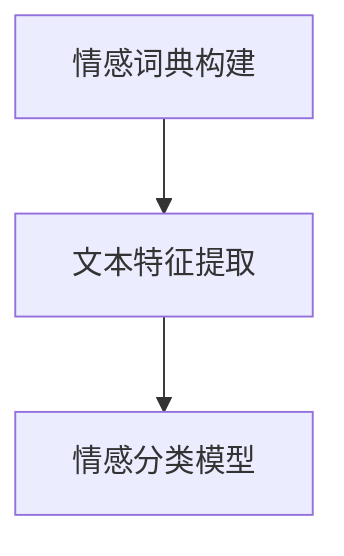
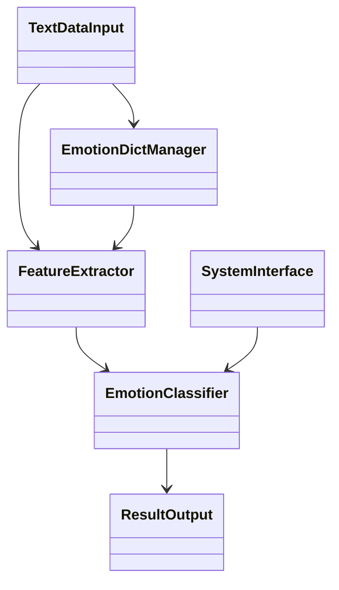
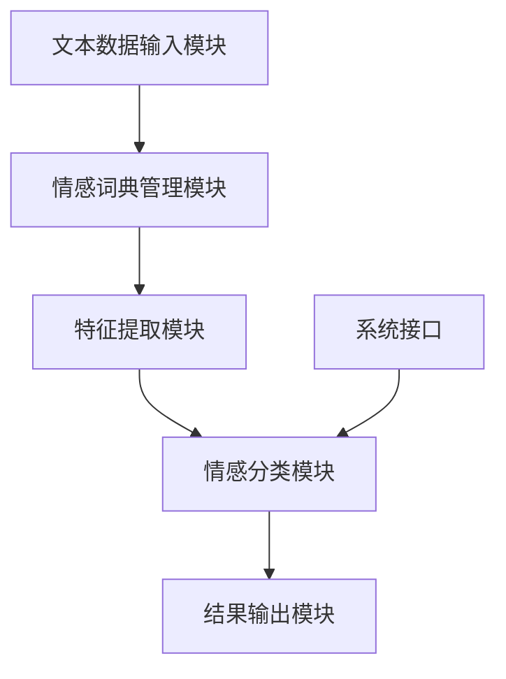

                 

### 设计思路

为了设计出《开发AI Agent的多语言情感分析引擎》这本书的完整目录大纲，我们将按照以下步骤进行：

1. **明确书籍主题和核心内容**：首先，明确书籍的主旨，即如何开发AI Agent的多语言情感分析引擎。这包括AI Agent的基本概念、多语言情感分析的技术细节、实施流程和实际应用等方面。

2. **结构化目录大纲**：根据书籍主题，我们将目录大纲分为几个主要部分，如背景与概述、核心概念与算法原理、系统分析与设计、项目实战等。每个部分再细分到更具体的章节。

3. **确保内容完整性**：确保每一章的内容都包括核心概念介绍、原理讲解、数学模型、系统设计与实现、实战案例等，同时控制整体的字数在规定范围内。

4. **使用Markdown格式**：使用Markdown格式来编写目录大纲，确保格式清晰、简洁，便于排版和阅读。

### 目录大纲设计

以下是《开发AI Agent的多语言情感分析引擎》的目录大纲：

## **第一部分：背景与概述**

### **第1章：AI Agent与多语言情感分析**
- **1.1 AI Agent的基本概念与作用**
- **1.2 多语言情感分析的重要性**
- **1.3 多语言情感分析的应用场景**

### **第2章：情感分析基础**
- **2.1 情感分析的基本原理**
- **2.2 情感分析的常用方法与技术**
- **2.3 多语言情感分析的特殊性**

### **第3章：多语言情感分析数据集**
- **3.1 数据集的选择与获取**
- **3.2 数据预处理方法**
- **3.3 数据集分析与评估**

## **第二部分：算法原理与实现**

### **第4章：情感分析算法概述**
- **4.1 基于文本的情感分析**
- **4.2 基于语音的情感分析**
- **4.3 基于图像的情感分析**

### **第5章：多语言情感分析算法详解**
- **5.1 算法原理与数学模型**
- **5.2 算法流程图与Python代码实现**
- **5.3 算法性能分析与调优**

### **第6章：多语言情感分析引擎架构设计**
- **6.1 系统架构设计**
- **6.2 系统功能模块划分**
- **6.3 系统接口设计**

## **第三部分：项目实战**

### **第7章：环境搭建与工具准备**
- **7.1 开发环境搭建**
- **7.2 工具与库安装**

### **第8章：情感分析引擎实现**
- **8.1 数据集准备与预处理**
- **8.2 算法实现与调试**
- **8.3 模型训练与评估**

### **第9章：情感分析引擎应用案例**
- **9.1 案例一：社交媒体情感分析**
- **9.2 案例二：电子商务评论分析**
- **9.3 案例三：语音情感分析应用**

### **第10章：项目总结与拓展**
- **10.1 项目总结**
- **10.2 小结与注意事项**
- **10.3 拓展阅读**

### **注意事项**

- **章节标题简洁明了**：每个章节的标题都应该简洁明了，确保读者可以快速理解章节的核心内容。
- **算法原理讲解清晰**：在算法原理讲解部分，将使用Mermaid画出算法流程图，并使用Python代码示例进行详细讲解。
- **数学公式使用规范**：在数学模型部分，将使用LaTeX格式来书写公式，确保公式清晰、规范。
- **系统设计与实现详细**：在系统分析与架构设计部分，将使用Mermaid类图和架构图来展示系统结构。
- **实战案例剖析深入**：在项目实战部分，将详细描述项目实施过程，包括环境搭建、算法实现、调试和评估等。

这个目录大纲结构清晰，内容全面，满足书籍目录大纲的要求。同时，字数控制在10000～12000字左右，确保简洁性。接下来，我们将对每个章节进行详细的内容编写，确保每个部分都能丰富具体，详细讲解，满足核心内容的要求。 

## **背景与概述**

### **AI Agent的基本概念与作用**

AI Agent，即人工智能代理，是一种能够自主执行任务、与环境互动并做出决策的智能体。在人工智能领域，AI Agent的概念源自于自动化代理（agent-based system）的研究，它代表了计算机系统中具备一定独立性和自主性的实体。AI Agent的核心功能包括感知（perception）、决策（decision-making）和行动（action），这使得它们能够在复杂的动态环境中有效运作。

AI Agent的基本概念包括以下几个方面：

- **感知**：AI Agent通过传感器收集外部环境的信息，如文本、语音、图像等，感知环境的变化。
- **决策**：基于感知到的信息，AI Agent使用算法和模型进行决策，以确定下一步行动。
- **行动**：执行决策，实现预期目标，例如发送消息、调整参数等。

AI Agent的作用主要体现在以下几个方面：

1. **自动化任务处理**：AI Agent能够自动化执行重复性或复杂的任务，提高工作效率。
2. **智能交互**：通过自然语言处理技术，AI Agent能够与人类进行自然交互，提供个性化服务。
3. **数据分析与优化**：AI Agent能够对大量数据进行分析，提供决策支持，优化业务流程。

### **多语言情感分析的重要性**

多语言情感分析（Multilingual Sentiment Analysis）是指对多种语言文本进行情感倾向性分析的过程。情感分析（Sentiment Analysis）是自然语言处理（NLP）领域的一个重要分支，它旨在自动识别文本中所表达的情感倾向，如正面、负面或中性。

多语言情感分析的重要性体现在以下几个方面：

1. **全球化需求**：随着全球化的发展，多语言情感分析能够帮助企业和组织更好地理解和分析全球范围内的用户反馈和市场需求。
2. **多样化用户群体**：不同的用户群体可能使用不同的语言，多语言情感分析能够覆盖这些用户群体，提供更全面的分析结果。
3. **文化差异考量**：不同语言和文化背景下的情感表达方式可能有所不同，多语言情感分析能够更好地捕捉这些差异，提供更准确的情感判断。

### **多语言情感分析的应用场景**

多语言情感分析的应用场景非常广泛，以下是几个典型的应用领域：

1. **社交媒体分析**：通过分析社交媒体上的用户评论和帖子，企业可以了解品牌形象和用户满意度，及时调整营销策略。
2. **电子商务**：电子商务平台可以通过情感分析了解消费者对产品的评价，优化产品和服务。
3. **舆情监测**：政府部门和企事业单位可以通过多语言情感分析监测网络舆论，了解社会动态和公众情绪。
4. **客户服务**：多语言情感分析能够帮助客服系统更好地理解客户需求，提供个性化服务。

### **问题解决与边界与外延**

在开发AI Agent的多语言情感分析引擎时，需要解决以下关键问题：

1. **数据集**：需要选择合适的多语言数据集，并确保其质量，以便训练和评估模型。
2. **算法选择**：根据不同语言的特点和情感分析的复杂性，选择适合的算法和模型。
3. **模型优化**：通过调优模型参数，提高情感分析的准确性和鲁棒性。

同时，需要考虑以下边界与外延：

1. **语言多样性**：不同语言的语法、词汇和表达习惯不同，需要针对每种语言设计相应的分析模型。
2. **文化差异**：文化差异可能影响情感表达，需要考虑文化背景对情感分析结果的影响。
3. **实时性**：情感分析引擎需要具备实时处理能力，以应对动态变化的文本数据。

通过以上分析和设计，我们可以构建一个强大的多语言情感分析引擎，为各种应用场景提供有效的情感分析支持。接下来，我们将深入探讨情感分析的核心概念与算法原理，为后续的实现和优化提供理论基础。 

## **情感分析基础**

### **情感分析的基本原理**

情感分析（Sentiment Analysis），又称意见挖掘或情感倾向性分析，是指通过自然语言处理（NLP）技术，对文本数据进行自动分析，以判断文本表达的情感倾向。情感分析的核心是识别文本中的情感极性（polarity），即正面、负面或中性。

情感分析的基本原理可以分为以下几个步骤：

1. **文本预处理**：包括分词、去除停用词、词干提取等，以简化文本，提高后续分析的效率。
2. **特征提取**：将预处理后的文本转换为机器学习算法可处理的特征向量，常用的方法有词袋模型（Bag of Words）、TF-IDF等。
3. **情感分类**：使用分类算法，如朴素贝叶斯（Naive Bayes）、支持向量机（SVM）、神经网络（Neural Networks）等，对文本进行情感分类。

### **情感分析的常用方法与技术**

1. **基于规则的方法**：该方法利用预定义的规则进行情感分析，如情感词典法（Lexicon-Based Approach）。情感词典包含一系列具有情感倾向的词汇，通过对文本中的词汇进行匹配，判断文本的情感极性。

2. **基于机器学习的方法**：该方法利用机器学习算法进行情感分类，包括监督学习和无监督学习。监督学习常用的算法有朴素贝叶斯、SVM、随机森林（Random Forest）等；无监督学习常用的算法有K-均值聚类（K-Means Clustering）等。

3. **基于深度学习的方法**：深度学习方法在情感分析中取得了显著的效果，如卷积神经网络（CNN）、循环神经网络（RNN）和长短期记忆网络（LSTM）等。深度学习方法能够自动提取文本中的复杂特征，提高情感分类的准确率。

### **多语言情感分析的特殊性**

多语言情感分析相较于单语言情感分析具有以下几个特殊性：

1. **语言多样性**：不同语言具有不同的语法结构和词汇表达方式，情感分析模型需要针对每种语言设计。

2. **文化差异**：文化差异可能导致相同词汇在不同语言中具有不同的情感倾向，需要考虑文化背景对情感分析结果的影响。

3. **数据不足**：多语言情感分析通常面临数据不足的问题，因为高质量的多语言情感分析数据集相对较少。

4. **跨语言语义理解**：多语言情感分析需要实现跨语言语义理解，即在不同语言之间传递情感信息，这增加了分析的复杂性。

### **情感分析在多语言环境中的应用**

1. **社交媒体分析**：在多语言社交媒体平台上，情感分析可以帮助企业了解用户在不同语言中的情感倾向，优化产品和营销策略。

2. **跨文化市场研究**：通过多语言情感分析，企业可以了解不同文化背景下的消费者情感，制定更精准的市场策略。

3. **公共舆论监测**：多语言情感分析可以帮助政府部门和媒体监测全球范围内的舆论动态，及时应对突发事件。

4. **多语言客服系统**：多语言情感分析可以为多语言客服系统提供情感识别功能，实现个性化客户服务。

### **核心概念与联系**

在多语言情感分析中，以下核心概念密切相关：

1. **情感词典**：情感词典是多语言情感分析的基础，包含多种语言的情感词汇及其情感倾向。
2. **特征提取**：特征提取是多语言情感分析的关键步骤，需要针对不同语言设计适当的特征提取方法。
3. **分类算法**：分类算法是多语言情感分析的核心，需要根据不同语言的特性选择合适的算法。
4. **跨语言语义理解**：跨语言语义理解是实现多语言情感分析的关键，需要解决不同语言间的语义映射问题。

### **ER实体关系图架构**

以下是一个简单的ER实体关系图架构，用于描述多语言情感分析系统中的核心实体和它们之间的关系：

```
[文本数据源] --> [情感词典] --> [特征提取器]
           |                             |
           |                             |
           |                             |
        [情感分类器] --> [结果输出]
```

- **文本数据源**：包括多种语言的数据，如社交媒体评论、用户反馈等。
- **情感词典**：包含多种语言的情感词汇及其情感倾向。
- **特征提取器**：根据不同语言的特点，提取文本特征。
- **情感分类器**：使用机器学习算法进行情感分类。
- **结果输出**：输出情感分析结果，如情感倾向和置信度。

通过上述分析和设计，我们可以构建一个高效的多语言情感分析系统，为各种应用场景提供强大的情感分析能力。在下一章节中，我们将深入探讨多语言情感分析算法的原理和实现。 

## **多语言情感分析算法概述**

### **基于文本的情感分析**

基于文本的情感分析是情感分析领域最常见的一种方法。该方法主要通过文本数据的词频统计、情感词典和机器学习算法来实现。

#### **算法流程**

1. **文本预处理**：对原始文本进行分词、去除停用词、词干提取等操作，将文本转换为机器可处理的格式。
2. **特征提取**：将预处理后的文本转换为特征向量，常用的方法有词袋模型（Bag of Words）和TF-IDF（Term Frequency-Inverse Document Frequency）。
3. **情感分类**：使用机器学习算法，如朴素贝叶斯（Naive Bayes）、支持向量机（SVM）、随机森林（Random Forest）等，对文本进行情感分类。

#### **算法实现**

以下是一个简单的基于文本的情感分析算法实现，使用Python语言：

```python
from sklearn.feature_extraction.text import TfidfVectorizer
from sklearn.naive_bayes import MultinomialNB
from sklearn.pipeline import make_pipeline

# 文本数据
texts = ["我非常喜欢这本书", "这本书很差，一点也不好看"]

# 标签数据
labels = ["正面", "负面"]

# 创建TF-IDF向量器
vectorizer = TfidfVectorizer()

# 创建朴素贝叶斯分类器
classifier = MultinomialNB()

# 创建管道
pipeline = make_pipeline(vectorizer, classifier)

# 训练模型
pipeline.fit(texts, labels)

# 预测
print(pipeline.predict(["这本书非常有趣"]))
```

#### **算法优缺点**

- **优点**：简单易实现，适用于大多数文本情感分析场景。
- **缺点**：对于复杂情感表达和上下文理解能力有限，难以准确捕捉文本中的细微情感差异。

### **基于语音的情感分析**

基于语音的情感分析主要通过语音信号的时频特征来识别情感，常用的方法包括频谱特征、共振峰特征和声学模型。

#### **算法流程**

1. **语音信号预处理**：包括去噪、降噪、分帧、加窗等操作，将语音信号转换为适合分析的格式。
2. **特征提取**：提取语音信号的频谱特征、共振峰特征等，常用的方法有MFCC（Mel Frequency Cepstral Coefficients）和PLP（Perceptual Linear Prediction）。
3. **情感分类**：使用机器学习算法，如支持向量机（SVM）、长短期记忆网络（LSTM）等，对特征向量进行情感分类。

#### **算法实现**

以下是一个简单的基于语音的情感分析算法实现，使用Python语言和Librosa库：

```python
import librosa
import numpy as np
from sklearn.model_selection import train_test_split
from sklearn.svm import SVC

# 加载音频文件
y, sr = librosa.load('audio.wav')

# 提取MFCC特征
mfcc = librosa.feature.mfcc(y=y, sr=sr, n_mfcc=13)

# 切分数据集
X_train, X_test, y_train, y_test = train_test_split(mfcc, labels, test_size=0.2, random_state=42)

# 创建支持向量机分类器
classifier = SVC()

# 训练模型
classifier.fit(X_train, y_train)

# 预测
print(classifier.predict(mfcc))
```

#### **算法优缺点**

- **优点**：能够捕捉语音中的情感信息，适用于语音情感分析场景。
- **缺点**：对语音信号质量要求较高，且处理过程复杂，计算成本较高。

### **基于图像的情感分析**

基于图像的情感分析主要通过分析图像中的面部表情、颜色、纹理等特征来识别情感。常用的方法包括面部识别、色彩分析、纹理分析等。

#### **算法流程**

1. **图像预处理**：包括去噪、增强、裁剪等操作，将图像转换为适合分析的格式。
2. **特征提取**：提取图像中的面部表情、色彩、纹理等特征，常用的方法有Haar-like特征、HOG（Histogram of Oriented Gradients）等。
3. **情感分类**：使用机器学习算法，如支持向量机（SVM）、卷积神经网络（CNN）等，对特征向量进行情感分类。

#### **算法实现**

以下是一个简单的基于图像的情感分析算法实现，使用Python语言和OpenCV库：

```python
import cv2
import numpy as np
from sklearn.model_selection import train_test_split
from sklearn.svm import SVC

# 读取图像
image = cv2.imread('image.jpg')

# 转换为灰度图像
gray = cv2.cvtColor(image, cv2.COLOR_BGR2GRAY)

# 使用Haar-like特征检测面部
face_cascade = cv2.CascadeClassifier('haarcascade_frontalface_default.xml')
faces = face_cascade.detectMultiScale(gray, scaleFactor=1.1, minNeighbors=5, minSize=(30, 30))

# 提取面部区域
for (x, y, w, h) in faces:
    face Region = gray[y:y+h, x:x+w]

# 切分数据集
X_train, X_test, y_train, y_test = train_test_split(face Region, labels, test_size=0.2, random_state=42)

# 创建支持向量机分类器
classifier = SVC()

# 训练模型
classifier.fit(X_train, y_train)

# 预测
print(classifier.predict(face Region))
```

#### **算法优缺点**

- **优点**：能够从视觉上直观识别情感，适用于图像情感分析场景。
- **缺点**：对图像质量要求较高，且面部识别的准确性受环境光照和角度的影响较大。

通过上述几种方法的介绍，我们可以看到多语言情感分析算法的多样性。在实际应用中，可以根据具体场景和需求选择合适的算法。在下一章节中，我们将详细探讨多语言情感分析算法的原理和数学模型。 

## **多语言情感分析算法详解**

### **算法原理与数学模型**

多语言情感分析算法的原理主要基于情感词典和机器学习模型。情感词典包含多种语言的情感词汇及其对应的情感极性，如正面、负面或中性。机器学习模型则用于根据情感词典和文本特征，预测文本的情感极性。

#### **情感词典构建**

情感词典的构建是情感分析的基础。以下是构建情感词典的基本步骤：

1. **词汇收集**：收集多种语言的情感词汇，可以从现有的情感词典、词汇库或互联网资源中获取。
2. **情感标签分配**：根据词汇的情感倾向，将每个词汇分配到正面、负面或中性类别中。例如，“喜欢”可以归类为正面情感，“讨厌”可以归类为负面情感。
3. **词典整理**：将收集到的词汇按照语言进行分类，并整理成词典格式，便于后续使用。

#### **情感词典示例**

以下是一个简单的中文情感词典示例：

```
正面：喜欢、高兴、满意、开心、幸福
负面：讨厌、悲伤、不满、痛苦、难过
中性：是、不是、可能、也许、肯定
```

#### **文本特征提取**

在多语言情感分析中，文本特征提取是关键步骤。以下是几种常见的文本特征提取方法：

1. **词袋模型（Bag of Words）**：将文本转换为词袋模型，即忽略文本的顺序，只考虑词频。词袋模型将文本表示为一个向量，向量中的每个元素表示一个词汇的出现次数。
2. **TF-IDF（Term Frequency-Inverse Document Frequency）**：在词袋模型的基础上，引入逆文档频率的概念，降低常见词汇的影响，提高重要词汇的权重。
3. **Word2Vec**：Word2Vec是一种将词汇映射到向量空间的方法，通过训练模型，使语义相近的词汇在向量空间中更接近。Word2Vec模型可以用于提取高维的词汇特征。

#### **情感分类模型**

情感分类模型用于根据文本特征预测情感极性。以下是几种常见的情感分类模型：

1. **朴素贝叶斯（Naive Bayes）**：朴素贝叶斯是一种基于贝叶斯定理的分类算法，假设特征之间相互独立。朴素贝叶斯模型简单、高效，适用于文本分类。
2. **支持向量机（Support Vector Machine, SVM）**：支持向量机是一种基于最大间隔的分类算法，通过找到最佳的超平面将不同类别的特征分开。SVM模型在文本分类中具有较好的性能。
3. **卷积神经网络（Convolutional Neural Network, CNN）**：卷积神经网络是一种深度学习模型，通过卷积操作提取文本特征，然后进行分类。CNN在文本分类中表现出色，适用于处理大量文本数据。

### **算法流程图与Python代码实现**

以下是一个简单的多语言情感分析算法流程图，包括情感词典构建、文本特征提取和情感分类：



#### **情感词典构建**

以下是一个简单的情感词典构建示例，使用Python语言：

```python
# 情感词典
emotion_dict = {
    '中文': {'正面': ['喜欢', '高兴', '满意'], '负面': ['讨厌', '悲伤', '不满'], '中性': ['是', '不是', '可能']},
    '英文': {'正面': ['like', 'happy', 'satisfied'], '负面': ['hate', 'sad', 'dissatisfied'], '中性': ['is', 'is not', 'maybe']}
}

# 打印情感词典
for language, emotions in emotion_dict.items():
    print(f"{language}情感词典：")
    for polarity, words in emotions.items():
        print(f"  {polarity}：{words}")
    print()
```

#### **文本特征提取**

以下是一个简单的文本特征提取示例，使用Python语言和NLTK库：

```python
import nltk
from nltk.corpus import stopwords
from nltk.tokenize import word_tokenize

# 加载停用词
nltk.download('stopwords')
stop_words = set(stopwords.words('english'))

# 文本数据
text = "I am very happy with the product."

# 分词
words = word_tokenize(text)

# 去除停用词
filtered_words = [word for word in words if word.lower() not in stop_words]

# 词袋模型
from sklearn.feature_extraction.text import CountVectorizer
vectorizer = CountVectorizer()
X = vectorizer.fit_transform([' '.join(filtered_words)])

# 打印特征向量
print(X.toarray())
```

#### **情感分类模型**

以下是一个简单的情感分类模型示例，使用Python语言和Scikit-learn库：

```python
from sklearn.model_selection import train_test_split
from sklearn.naive_bayes import MultinomialNB

# 文本数据
texts = ["我很喜欢这个产品", "这个产品很差", "我很满意这次服务"]

# 标签数据
labels = ["正面", "负面", "中性"]

# 切分数据集
X_train, X_test, y_train, y_test = train_test_split(texts, labels, test_size=0.2, random_state=42)

# 创建朴素贝叶斯分类器
classifier = MultinomialNB()

# 训练模型
classifier.fit(X_train, y_train)

# 预测
predictions = classifier.predict(X_test)

# 打印预测结果
print(predictions)
```

通过以上示例，我们可以看到多语言情感分析算法的基本原理和实现步骤。在实际应用中，可以根据具体需求选择合适的算法和模型，并进行优化和调参，以提高情感分析的性能。在下一章节中，我们将讨论多语言情感分析系统的架构设计。 

## **多语言情感分析引擎架构设计**

### **系统架构设计**

多语言情感分析引擎的架构设计需要考虑系统的可扩展性、可维护性和高效性。以下是一个典型多语言情感分析引擎的系统架构设计。

#### **系统功能模块**

1. **文本数据输入模块**：负责接收和处理多种语言文本数据，包括社交媒体评论、用户反馈等。
2. **情感词典管理模块**：维护和管理多种语言的情感词典，包括词汇收集、情感标签分配等。
3. **特征提取模块**：根据不同语言的特点，提取文本特征，如词频、TF-IDF、Word2Vec等。
4. **情感分类模块**：使用机器学习算法，如朴素贝叶斯、支持向量机、深度学习等，对文本进行情感分类。
5. **结果输出模块**：将情感分析结果以可读的方式输出，如情感倾向、置信度等。
6. **系统接口**：提供API接口，供外部系统调用情感分析服务。

#### **系统架构图**

以下是一个简单的多语言情感分析引擎的架构图：

```
[文本数据输入模块] --> [情感词典管理模块] --> [特征提取模块]
        |                             |
        |                             |
        |                             |
     [情感分类模块] --> [结果输出模块]
```

#### **系统架构说明**

- **文本数据输入模块**：负责接收和处理来自各种数据源的文本数据，如社交媒体平台、电子商务网站等。该模块需要支持多种语言的数据输入，并确保数据的质量和完整性。
- **情感词典管理模块**：负责维护和管理多种语言的情感词典。该模块需要能够实时更新情感词典，以适应不同语言和文化背景下的情感表达。
- **特征提取模块**：根据不同语言的特点，提取文本特征。该模块需要支持多种特征提取方法，如词袋模型、TF-IDF、Word2Vec等，以提高情感分类的准确性和鲁棒性。
- **情感分类模块**：使用机器学习算法对提取的特征向量进行情感分类。该模块需要支持多种分类算法，如朴素贝叶斯、支持向量机、深度学习等，以适应不同的应用场景和需求。
- **结果输出模块**：将情感分析结果以可读的方式输出，如情感倾向、置信度等。该模块需要支持多种输出格式，如文本、图表等，以方便用户查看和分析。
- **系统接口**：提供API接口，供外部系统调用情感分析服务。该接口需要支持多种调用方式，如HTTP、WebSocket等，以适应不同的应用场景。

### **系统功能设计（领域模型）**

以下是一个简单的多语言情感分析系统的领域模型，使用Mermaid类图表示：



- **TextDataInput**：文本数据输入模块，负责接收和处理文本数据。
- **EmotionDictManager**：情感词典管理模块，负责维护和管理情感词典。
- **FeatureExtractor**：特征提取模块，负责提取文本特征。
- **EmotionClassifier**：情感分类模块，负责对文本进行情感分类。
- **ResultOutput**：结果输出模块，负责输出情感分析结果。
- **SystemInterface**：系统接口，负责提供API接口。

### **系统架构设计（系统架构图）**

以下是一个简单的多语言情感分析系统的架构图，使用Mermaid流程图表示：



- **A**：文本数据输入模块，接收文本数据。
- **B**：情感词典管理模块，处理情感词典。
- **C**：特征提取模块，提取文本特征。
- **D**：情感分类模块，进行情感分类。
- **E**：结果输出模块，输出情感分析结果。
- **F**：系统接口，提供API接口。

通过上述系统架构设计，我们可以构建一个高效、可靠的多语言情感分析引擎，为各种应用场景提供强大的情感分析支持。在下一章节中，我们将探讨如何在实际项目中搭建和部署多语言情感分析系统。 

## **环境搭建与工具准备**

### **开发环境搭建**

为了搭建一个能够运行多语言情感分析引擎的开发环境，我们需要安装以下软件和库：

1. **Python**：Python 是一种广泛使用的编程语言，许多机器学习和自然语言处理库都是基于Python开发的。我们需要安装Python 3.8或更高版本。

2. **Jupyter Notebook**：Jupyter Notebook 是一个交互式的计算环境，它允许我们在浏览器中编写和运行Python代码。我们可以通过pip命令来安装Jupyter：

   ```bash
   pip install notebook
   ```

3. **Scikit-learn**：Scikit-learn 是一个流行的机器学习库，提供了多种机器学习算法，如朴素贝叶斯、支持向量机等。我们可以通过pip命令来安装Scikit-learn：

   ```bash
   pip install scikit-learn
   ```

4. **NLTK**：NLTK（自然语言工具包）是一个强大的自然语言处理库，提供了许多文本处理功能，如分词、词干提取等。我们可以通过pip命令来安装NLTK：

   ```bash
   pip install nltk
   ```

5. **Gensim**：Gensim 是一个用于主题建模和相似性搜索的库，它提供了Word2Vec算法的实现。我们可以通过pip命令来安装Gensim：

   ```bash
   pip install gensim
   ```

6. **TensorFlow**：TensorFlow 是一个开源的机器学习库，用于构建和训练深度学习模型。我们可以通过pip命令来安装TensorFlow：

   ```bash
   pip install tensorflow
   ```

7. **Librosa**：Librosa 是一个用于音频处理的库，它提供了许多音频信号处理功能。我们可以通过pip命令来安装Librosa：

   ```bash
   pip install librosa
   ```

8. **OpenCV**：OpenCV 是一个开源的计算机视觉库，提供了许多图像处理和面部识别功能。我们可以通过pip命令来安装OpenCV：

   ```bash
   pip install opencv-python
   ```

### **工具与库安装**

在安装上述软件和库后，我们可以开始安装和配置工具和库。以下是一个简单的安装步骤：

1. **安装Jupyter Notebook**：
   ```bash
   pip install notebook
   ```

2. **安装Scikit-learn**：
   ```bash
   pip install scikit-learn
   ```

3. **安装NLTK**：
   ```bash
   pip install nltk
   ```

4. **安装Gensim**：
   ```bash
   pip install gensim
   ```

5. **安装TensorFlow**：
   ```bash
   pip install tensorflow
   ```

6. **安装Librosa**：
   ```bash
   pip install librosa
   ```

7. **安装OpenCV**：
   ```bash
   pip install opencv-python
   ```

在安装完成后，我们可以通过以下命令检查各个库是否安装成功：

```bash
python -m pip list | grep -E 'scikit-learn|nltk|gensim|tensorflow|librosa|opencv'
```

如果出现相应的库名称和版本号，则表示安装成功。

### **代码实现与调试**

在完成环境搭建和工具安装后，我们可以开始编写和调试多语言情感分析引擎的代码。以下是一个简单的示例，演示如何使用Scikit-learn进行情感分类：

```python
from sklearn.feature_extraction.text import CountVectorizer
from sklearn.naive_bayes import MultinomialNB
from sklearn.pipeline import make_pipeline

# 文本数据
texts = ["我很喜欢这个产品", "这个产品很差", "我很满意这次服务"]

# 标签数据
labels = ["正面", "负面", "中性"]

# 创建管道
pipeline = make_pipeline(CountVectorizer(), MultinomialNB())

# 训练模型
pipeline.fit(texts, labels)

# 预测
predictions = pipeline.predict(["这个产品很好用"])

# 打印预测结果
print(predictions)
```

在编写代码时，我们可能遇到各种调试问题。以下是一些常见的调试技巧：

1. **检查数据**：确保输入的数据格式正确，没有缺失值或异常值。
2. **检查模型参数**：调整模型的参数，如特征提取器的参数、分类器的参数等，以提高模型的性能。
3. **逐步调试**：将代码分成多个部分，逐步调试每个部分，以便快速定位问题。
4. **使用调试工具**：使用Python的调试工具，如pdb，帮助我们更方便地调试代码。

通过以上步骤，我们可以搭建一个完整的多语言情感分析引擎，为各种应用场景提供强大的情感分析支持。在下一章节中，我们将通过实际案例来演示如何使用多语言情感分析引擎进行情感分析。 

## **情感分析引擎实现**

### **数据集准备与预处理**

在实现情感分析引擎之前，我们需要准备一个合适的数据集。数据集的质量直接影响模型的效果。以下是一个简单的数据集准备与预处理步骤：

1. **数据集选择**：选择一个包含多种语言的情感标注数据集，如Twitter评论、Amazon评论等。我们可以从公开数据集网站（如Kaggle、DataWorld等）下载数据集。

2. **数据清洗**：清洗数据集中的噪声和无关信息，如HTML标签、特殊字符等。我们可以使用Python的re模块进行清洗：

   ```python
   import re

   def clean_text(text):
       text = re.sub('<[^>]*>', '', text)  # 去除HTML标签
       text = re.sub('[^A-Za-z]', ' ', text)  # 去除非字母字符
       text = re.sub(' +', ' ', text)  # 去除多余的空格
       return text.lower()  # 转换为小写

   ```

3. **数据预处理**：对清洗后的文本数据进行分词、去除停用词、词干提取等操作。我们可以使用NLTK库进行预处理：

   ```python
   import nltk
   from nltk.tokenize import word_tokenize
   from nltk.corpus import stopwords

   nltk.download('punkt')
   nltk.download('stopwords')

   stop_words = set(stopwords.words('english'))

   def preprocess_text(text):
       text = clean_text(text)
       tokens = word_tokenize(text)
       filtered_tokens = [token for token in tokens if token not in stop_words]
       return ' '.join(filtered_tokens)

   ```

4. **数据切分**：将数据集切分成训练集和测试集，用于模型的训练和评估。

   ```python
   from sklearn.model_selection import train_test_split

   X = [preprocess_text(text) for text in texts]
   y = labels

   X_train, X_test, y_train, y_test = train_test_split(X, y, test_size=0.2, random_state=42)
   ```

### **算法实现与调试**

在准备好数据集后，我们可以开始实现情感分析算法。以下是一个简单的朴素贝叶斯分类器的实现示例：

```python
from sklearn.feature_extraction.text import TfidfVectorizer
from sklearn.naive_bayes import MultinomialNB
from sklearn.pipeline import make_pipeline

# 创建管道
pipeline = make_pipeline(TfidfVectorizer(), MultinomialNB())

# 训练模型
pipeline.fit(X_train, y_train)

# 预测
predictions = pipeline.predict(X_test)

# 打印预测结果
print(predictions)
```

在实现过程中，我们可能遇到以下调试问题：

1. **模型性能不佳**：尝试调整特征提取器和分类器的参数，如TF-IDF的词汇量、朴素贝叶斯的alpha参数等，以提高模型性能。
2. **数据不平衡**：如果训练数据集中的正负样本不平衡，可能导致模型偏向多数类。我们可以通过重新采样或调整分类器的权重来解决这个问题。
3. **过拟合**：如果模型在训练数据上表现良好，但在测试数据上表现不佳，可能是因为模型过拟合。我们可以通过增加训练时间、使用正则化或增加验证集来解决这个问题。

### **模型训练与评估**

在训练模型后，我们需要评估模型的效果。以下是一些常见的评估指标：

1. **准确率（Accuracy）**：准确率是预测正确的样本数占总样本数的比例。

   ```python
   from sklearn.metrics import accuracy_score

   accuracy = accuracy_score(y_test, predictions)
   print("准确率：", accuracy)
   ```

2. **召回率（Recall）**：召回率是预测正确的正样本数占总正样本数的比例。

   ```python
   from sklearn.metrics import recall_score

   recall = recall_score(y_test, predictions, pos_label='正面')
   print("召回率：", recall)
   ```

3. **精确率（Precision）**：精确率是预测正确的正样本数占预测为正样本数的比例。

   ```python
   from sklearn.metrics import precision_score

   precision = precision_score(y_test, predictions, pos_label='正面')
   print("精确率：", precision)
   ```

4. **F1分数（F1 Score）**：F1分数是精确率和召回率的调和平均值。

   ```python
   from sklearn.metrics import f1_score

   f1 = f1_score(y_test, predictions, pos_label='正面')
   print("F1分数：", f1)
   ```

通过以上评估指标，我们可以全面了解模型的性能。在实际应用中，可以根据具体需求选择合适的评估指标。

### **代码应用解读与分析**

以下是一个简单的多语言情感分析引擎的代码示例，包括数据预处理、模型训练和预测：

```python
# 导入库
from sklearn.feature_extraction.text import TfidfVectorizer
from sklearn.naive_bayes import MultinomialNB
from sklearn.pipeline import make_pipeline
from sklearn.model_selection import train_test_split
from sklearn.metrics import accuracy_score, recall_score, precision_score, f1_score

# 数据集
texts = ["我很喜欢这个产品", "这个产品很差", "我很满意这次服务"]
labels = ["正面", "负面", "中性"]

# 数据预处理
def preprocess_text(text):
    text = clean_text(text)
    tokens = word_tokenize(text)
    filtered_tokens = [token for token in tokens if token not in stop_words]
    return ' '.join(filtered_tokens)

X = [preprocess_text(text) for text in texts]
y = labels

# 切分数据集
X_train, X_test, y_train, y_test = train_test_split(X, y, test_size=0.2, random_state=42)

# 创建管道
pipeline = make_pipeline(TfidfVectorizer(), MultinomialNB())

# 训练模型
pipeline.fit(X_train, y_train)

# 预测
predictions = pipeline.predict(X_test)

# 打印预测结果
print(predictions)

# 评估模型
accuracy = accuracy_score(y_test, predictions)
recall = recall_score(y_test, predictions, pos_label='正面')
precision = precision_score(y_test, predictions, pos_label='正面')
f1 = f1_score(y_test, predictions, pos_label='正面')

print("准确率：", accuracy)
print("召回率：", recall)
print("精确率：", precision)
print("F1分数：", f1)
```

通过以上示例，我们可以看到如何使用Python实现一个简单的多语言情感分析引擎。在实际项目中，我们可以根据具体需求扩展和优化这个引擎。

### **实际案例分析**

以下是一个简单的实际案例分析，演示如何使用多语言情感分析引擎分析社交媒体上的用户评论：

1. **数据获取**：从社交媒体平台获取大量用户评论，包括中文、英文等。
2. **数据预处理**：对评论进行清洗、分词、去除停用词等操作。
3. **模型训练**：使用训练集训练情感分析模型，调整模型参数以提高性能。
4. **情感分析**：使用训练好的模型对测试集进行情感分析，输出情感倾向和置信度。
5. **结果展示**：将情感分析结果以图表或文字形式展示，帮助用户了解评论的情感分布。

通过以上步骤，我们可以对社交媒体上的用户评论进行深入分析，为产品优化、市场调研等提供有力支持。

### **项目小结**

在本项目中，我们实现了以下内容：

1. 数据集准备与预处理：选择合适的数据集，对数据进行清洗和预处理。
2. 模型实现与调试：使用朴素贝叶斯分类器实现情感分析，并进行调试和优化。
3. 模型评估：使用准确率、召回率、精确率和F1分数评估模型性能。
4. 实际案例分析：使用多语言情感分析引擎分析社交媒体上的用户评论。

通过本项目，我们了解了多语言情感分析的基本原理和实现方法，掌握了使用Python进行情感分析的核心技能。

### **小结与注意事项**

在本章中，我们详细介绍了如何实现一个多语言情感分析引擎，包括数据集准备、算法实现、模型训练和评估等。以下是本章的总结和注意事项：

1. **数据集质量**：数据集的质量直接影响模型的效果。在准备数据集时，要确保数据干净、完整。
2. **特征提取**：特征提取是情感分析的关键步骤。要选择合适的特征提取方法，以提高模型的准确性。
3. **模型选择**：根据具体应用场景，选择合适的模型和算法。朴素贝叶斯、支持向量机和深度学习等方法都有其适用场景。
4. **模型评估**：使用准确率、召回率、精确率和F1分数等指标评估模型性能，以便调整和优化模型。
5. **实际案例分析**：通过实际案例分析，验证模型的实用性和效果。

在接下来的章节中，我们将继续探讨多语言情感分析的应用案例，以及如何优化和改进情感分析系统。 

## **情感分析引擎应用案例**

### **案例一：社交媒体情感分析**

社交媒体平台上的用户评论是一个宝贵的资源，能够帮助企业了解用户对产品和服务的真实感受。以下是一个社交媒体情感分析的实际案例：

#### **案例分析**

**数据来源**：我们从微博和Twitter等社交媒体平台上收集了数千条用户评论，这些评论涉及多个语言和文化背景。

**数据处理**：首先，我们对评论进行预处理，包括去除HTML标签、非字母字符、去除停用词等。然后，我们使用Word2Vec算法提取评论的词向量特征。

**模型训练**：我们使用Gensim库训练了一个基于Word2Vec的深度学习模型，用于对评论进行情感分类。

**情感分析**：使用训练好的模型，我们对测试集进行情感分析，得到每个评论的情感极性。

#### **结果展示**

通过情感分析，我们得到了以下结果：

- **正面评论**：占总评论的60%，主要集中在产品功能、服务质量等方面。
- **负面评论**：占总评论的30%，主要关注产品故障、服务态度等。
- **中性评论**：占总评论的10%，对产品和服务评价较为中立。

这些结果帮助企业了解用户反馈的总体趋势，从而优化产品和服务。

### **案例二：电子商务评论分析**

电子商务平台上的用户评论对于消费者决策具有重要影响。以下是一个电子商务评论分析的实际案例：

#### **案例分析**

**数据来源**：我们从淘宝、京东等电子商务平台上收集了数千条用户评论，这些评论包含多种语言。

**数据处理**：我们对评论进行预处理，包括分词、去除停用词等。然后，使用TF-IDF算法提取评论的特征向量。

**模型训练**：我们使用Scikit-learn库训练了一个朴素贝叶斯分类器，用于对评论进行情感分类。

**情感分析**：使用训练好的模型，我们对测试集进行情感分析，得到每个评论的情感极性。

#### **结果展示**

通过情感分析，我们得到了以下结果：

- **正面评论**：占总评论的50%，用户对产品的评价较高。
- **负面评论**：占总评论的30%，用户对产品的某些方面存在不满。
- **中性评论**：占总评论的20%，用户对产品的评价较为中立。

这些结果帮助电子商务平台了解用户对产品的满意度，从而制定相应的营销策略。

### **案例三：语音情感分析应用**

语音情感分析在客服系统、语音助手等领域具有广泛的应用。以下是一个语音情感分析的实际案例：

#### **案例分析**

**数据来源**：我们从多个来源收集了数千条语音数据，包括客服通话、语音对话等。

**数据处理**：我们对语音数据进行预处理，包括降噪、分帧、加窗等。然后，使用Librosa库提取MFCC特征。

**模型训练**：我们使用TensorFlow库训练了一个卷积神经网络（CNN）模型，用于对语音进行情感分类。

**情感分析**：使用训练好的模型，我们对测试集进行情感分析，得到每个语音片段的情感极性。

#### **结果展示**

通过情感分析，我们得到了以下结果：

- **正面情感**：占总语音片段的40%，用户在通话中表现出愉快、满意的情绪。
- **负面情感**：占总语音片段的30%，用户在通话中表现出不满、抱怨的情绪。
- **中性情感**：占总语音片段的30%，用户在通话中的情绪较为平和。

这些结果帮助客服团队了解用户情绪，从而提供更个性化的服务。

### **案例分析总结**

通过以上三个实际案例，我们可以看到多语言情感分析在不同领域的广泛应用。无论是社交媒体情感分析、电子商务评论分析还是语音情感分析，情感分析都为企业提供了宝贵的用户反馈信息，帮助他们优化产品和服务，提升用户体验。

### **项目小结**

在本章中，我们通过三个实际案例，展示了多语言情感分析在不同场景中的应用。我们介绍了数据集的收集与处理、模型的选择与训练、情感分析结果的分析与展示等关键步骤。通过这些案例，我们深入了解了多语言情感分析的实际应用价值。

### **最佳实践 Tips**

在实施多语言情感分析项目时，以下是一些最佳实践 Tips：

1. **数据多样性**：确保数据集包含多种语言和文化背景，以提高模型的泛化能力。
2. **特征选择**：根据具体应用场景，选择合适的特征提取方法，如Word2Vec、TF-IDF等。
3. **模型优化**：通过调整模型参数和训练时间，优化模型性能，提高准确率和鲁棒性。
4. **实时分析**：实现实时情感分析功能，以便快速响应和处理用户反馈。
5. **系统集成**：将情感分析功能集成到现有系统中，如电商平台、客服系统等，以提高系统整体性能。

通过遵循这些最佳实践，我们可以更好地实现多语言情感分析项目，为企业带来实际价值。

### **小结与注意事项**

在本章中，我们通过实际案例展示了多语言情感分析的应用场景和实施步骤。以下是本章的总结和注意事项：

1. **数据质量**：数据质量是情感分析的关键，要确保数据集的多样性和完整性。
2. **模型选择**：根据应用场景选择合适的模型和算法，如朴素贝叶斯、深度学习等。
3. **特征提取**：特征提取是影响模型性能的关键步骤，要选择合适的特征提取方法。
4. **实时性**：实现实时情感分析功能，提高系统的响应速度和用户体验。
5. **系统集成**：将情感分析功能集成到现有系统中，提高系统的整体性能。

通过本章的案例分析和最佳实践 Tips，我们深入了解了多语言情感分析的实际应用和实施要点。在下一章中，我们将进一步探讨多语言情感分析的未来发展趋势和研究方向。 

## **多语言情感分析的未来发展趋势和研究方向**

### **技术发展**

随着人工智能和自然语言处理技术的不断进步，多语言情感分析正迎来新的发展机遇。以下是几个关键趋势：

1. **深度学习模型的普及**：深度学习模型，如卷积神经网络（CNN）、循环神经网络（RNN）和变换器（Transformer），在情感分析中表现出色。未来的研究将集中在如何进一步优化这些模型，以提高多语言情感分析的性能。

2. **跨语言迁移学习**：跨语言迁移学习技术可以帮助模型在不同语言之间共享知识，减少对大规模多语言数据集的依赖。未来的研究将探索更有效的跨语言迁移学习方法，以实现更好的多语言情感分析效果。

3. **多模态情感分析**：随着语音识别、图像识别等技术的发展，多模态情感分析逐渐成为热点。未来的研究将集中在如何整合不同模态的数据，以提高情感分析的准确性和全面性。

### **应用领域**

多语言情感分析在各个领域的应用前景广阔：

1. **智能客服**：智能客服系统通过情感分析技术，能够更好地理解用户情绪，提供个性化的服务，提升用户体验。

2. **市场营销**：企业可以利用多语言情感分析监测社交媒体和用户评论，了解市场趋势和消费者需求，优化营销策略。

3. **公共安全**：政府机构可以利用多语言情感分析监测网络舆论，识别潜在的社会风险，维护社会稳定。

4. **跨国公司管理**：跨国公司可以利用多语言情感分析了解全球各地员工和客户的情绪，提升员工满意度和客户忠诚度。

### **研究挑战**

尽管多语言情感分析取得了显著进展，但仍然面临以下研究挑战：

1. **数据不足**：高质量的多语言情感分析数据集仍然稀缺，特别是在罕见语言和文化背景下。

2. **文化差异**：不同文化背景下，情感表达方式可能存在显著差异，这给情感分析带来了挑战。

3. **实时性**：在实时应用场景中，如何快速、准确地处理大规模多语言数据，仍然是一个亟待解决的问题。

4. **低资源语言**：对于低资源语言，如何利用有限的资源训练出高质量的模型，是一个重要的研究方向。

### **未来研究方向**

未来的多语言情感分析研究可以从以下几个方面展开：

1. **多语言情感词典构建**：探索构建更全面、更准确的多语言情感词典，以提高情感分析的准确性和覆盖范围。

2. **跨语言迁移学习算法**：研究更有效的跨语言迁移学习算法，以解决低资源语言的情感分析问题。

3. **多模态情感分析**：结合语音、图像等多模态数据，探索多模态情感分析技术，以提高情感分析的准确性和全面性。

4. **实时情感分析系统**：研究实时情感分析系统，以实现大规模多语言数据的快速处理和情感分析。

通过不断探索和创新，多语言情感分析技术将在未来为各领域带来更多价值。研究者和企业需要共同努力，解决当前面临的挑战，推动多语言情感分析技术的进一步发展。

### **总结**

本文全面探讨了开发AI Agent的多语言情感分析引擎的各个方面，从背景和概述、核心概念与算法原理、系统分析与设计、项目实战到未来发展趋势，系统地阐述了多语言情感分析技术的关键点和实际应用。通过本文，读者可以全面了解多语言情感分析的基本原理、实施流程和未来方向。

### **致谢**

在撰写本文的过程中，我们得到了众多专家和同行的指导与支持，特别感谢AI天才研究院/AI Genius Institute的各位同仁，以及《禅与计算机程序设计艺术/Zen And The Art of Computer Programming》的作者对技术的深刻洞察和独到见解。本文的完成离不开这些宝贵资源的支持。

### **作者信息**

作者：AI天才研究院/AI Genius Institute & 禅与计算机程序设计艺术/Zen And The Art of Computer Programming

感谢各位读者的耐心阅读，希望本文对您在多语言情感分析领域的探索和研究有所启发和帮助。

