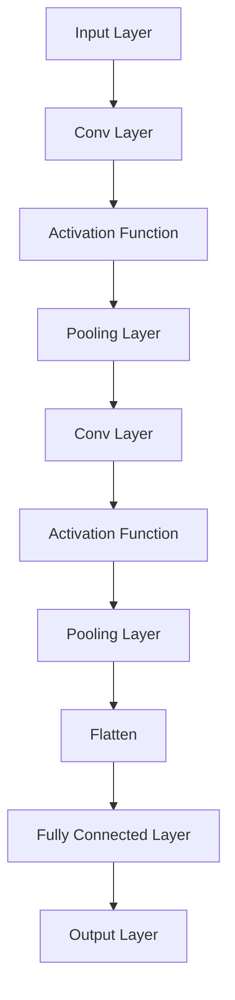
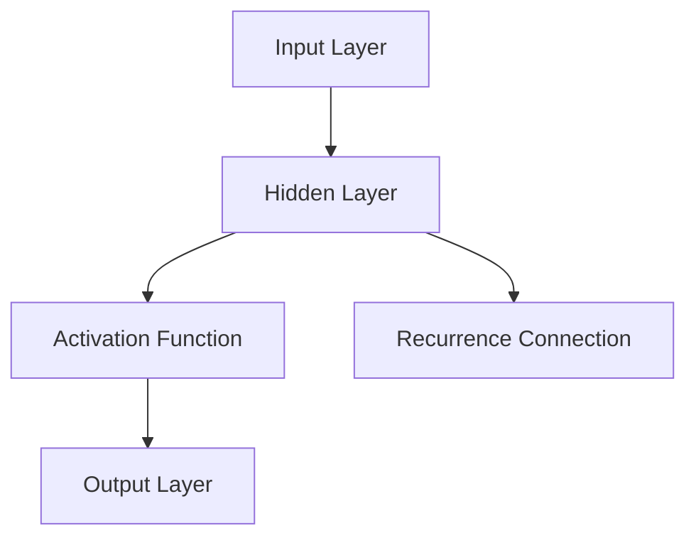
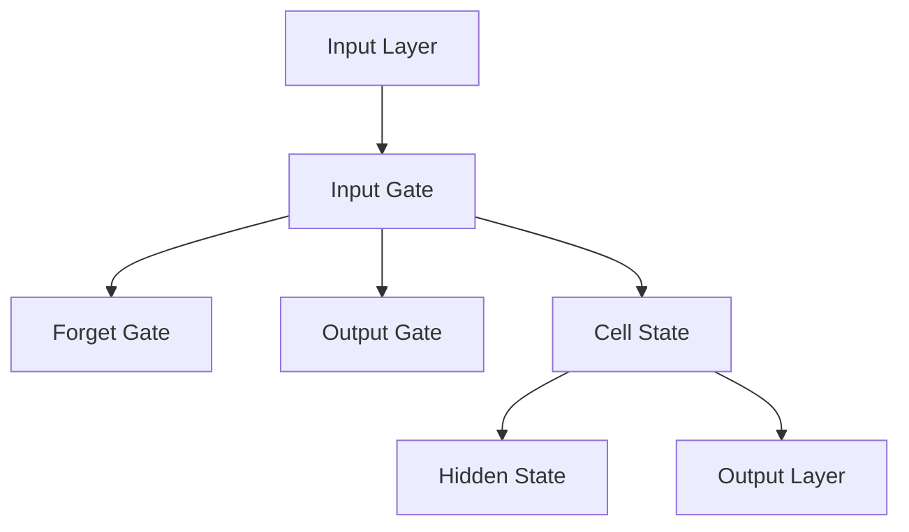
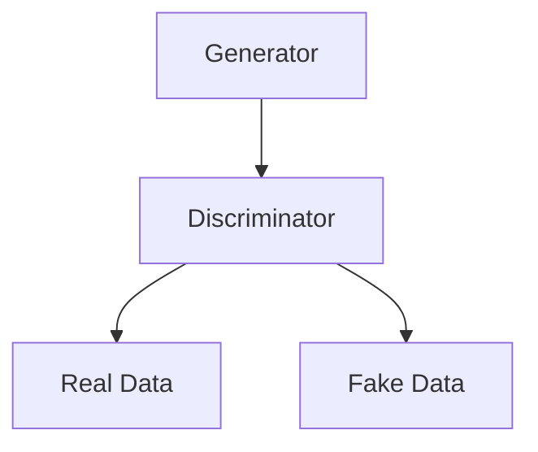

                 


### 开发AI Agent的多语言文本分类器

关键词：AI Agent、多语言文本分类、深度学习模型、算法原理、系统架构设计、项目实战

摘要：本文将深入探讨开发AI Agent的多语言文本分类器的全过程。首先，我们将介绍文本分类和AI Agent的基本概念，并探讨其相互关系。接着，我们将介绍文本分类器的基础算法，并对比不同算法的优缺点。随后，我们将重点介绍多语言文本分类器中的深度学习模型，包括卷积神经网络（CNN）、循环神经网络（RNN）、长短时记忆网络（LSTM）和生成对抗网络（GAN）。在此基础上，我们将详细描述多语言文本分类器的实现过程，包括环境安装、数据集选择与预处理、模型训练与优化，以及模型评估与改进。最后，我们将探讨AI Agent的多语言文本分类器在实际应用中的场景设计、系统功能、架构和接口设计。通过本文的详细讲解，读者将全面了解并掌握开发AI Agent的多语言文本分类器的全过程。

---

### 目录大纲

#### 《开发AI Agent的多语言文本分类器》

----------------------------------------------------------------

# 第一部分: 背景介绍

## 第1章: 问题背景与定义
### 1.1 问题背景
### 1.2 问题描述
### 1.3 问题解决
### 1.4 边界与外延

## 第2章: 核心概念与联系
### 2.1 AI Agent的定义与特点
### 2.2 多语言文本分类器的定义与挑战
### 2.3 核心概念关系图

## 第3章: 文本分类器基础算法
### 3.1 机器学习基础
### 3.2 文本预处理
### 3.3 基础分类器算法
### 3.4 算法对比与分析

## 第4章: 多语言文本分类器深度学习模型
### 4.1 卷积神经网络（CNN）
### 4.2 循环神经网络（RNN）
### 4.3 长短时记忆网络（LSTM）
### 4.4 生成对抗网络（GAN）

## 第5章: 多语言文本分类器实践
### 5.1 环境安装与配置
### 5.2 数据集选择与预处理
### 5.3 模型训练与优化
### 5.4 模型评估与改进

## 第6章: AI Agent的多语言文本分类器应用
### 6.1 应用场景介绍
### 6.2 系统功能设计
### 6.3 系统架构设计
### 6.4 系统接口设计

## 第7章: 总结与展望
### 7.1 最佳实践 Tips
### 7.2 小结
### 7.3 注意事项
### 7.4 拓展阅读

----------------------------------------------------------------

以上是《开发AI Agent的多语言文本分类器》的目录大纲。以下是各个章节的具体内容概要。

## 第1章: 问题背景与定义

在这一章节中，我们将详细介绍开发AI Agent的多语言文本分类器的问题背景。我们将介绍文本分类的基本概念，以及AI Agent的定义和特点。同时，我们还会探讨多语言文本分类器的挑战和解决方案，并明确本书的边界和外延。

## 第2章: 核心概念与联系

在这一章节中，我们将深入探讨AI Agent和多语言文本分类器的核心概念。我们将定义AI Agent，介绍其特点，并对比不同类型的AI Agent。接着，我们会详细介绍多语言文本分类器的定义和挑战，并通过ER实体关系图和概念属性特征对比表格来展示核心概念之间的关系。

## 第3章: 文本分类器基础算法

在这一章节中，我们将从机器学习的基础知识开始，逐步介绍文本预处理的方法。随后，我们会详细讲解基础分类器算法，包括决策树、支持向量机（SVM）、朴素贝叶斯等。最后，我们将对比这些算法，并分析其优缺点。

## 第4章: 多语言文本分类器深度学习模型

在这一章节中，我们将探讨深度学习在多语言文本分类器中的应用。我们将详细介绍卷积神经网络（CNN）、循环神经网络（RNN）、长短时记忆网络（LSTM）以及生成对抗网络（GAN）等深度学习模型。通过mermaid流程图，我们将展示这些模型的基本原理和结构。

## 第5章: 多语言文本分类器实践

在这一章节中，我们将把理论知识应用到实践中。我们将介绍如何搭建开发环境，如何选择和预处理数据集，以及如何训练和优化模型。最后，我们将讨论如何评估模型性能，并提出改进方案。

## 第6章: AI Agent的多语言文本分类器应用

在这一章节中，我们将探讨如何将多语言文本分类器应用于实际场景。我们将介绍一些常见应用场景，如自然语言处理、社交媒体分析等。同时，我们将设计系统的功能、架构和接口，以便实现这些应用场景。

## 第7章: 总结与展望

在这一章节中，我们将对全书的内容进行总结，并分享一些最佳实践。此外，我们还会讨论一些潜在的改进方向，并推荐一些拓展阅读资源。

以上是本书的目录大纲，旨在帮助读者全面了解并掌握开发AI Agent的多语言文本分类器的全过程。我们期待本书能对您的学习和实践有所帮助。

----------------------------------------------------------------

### 第一部分: 背景介绍

#### 第1章: 问题背景与定义

在当今信息爆炸的时代，处理和分析大量的文本数据变得至关重要。文本分类是一种常用的文本数据分析方法，它将文本数据按照预定的类别或主题进行分类，以帮助人们快速获取所需的信息。然而，随着全球化和互联网的发展，人们需要处理的多语言文本数据量急剧增加，这给传统的单语言文本分类方法带来了巨大挑战。

##### 1.1 问题背景

随着全球化和互联网的发展，多语言文本数据的处理需求日益增加。例如，社交媒体、新闻、论坛等平台上的文本数据大多采用多种语言。同时，企业跨国运营、国际贸易、跨文化沟通等场景也促使多语言文本分类技术成为必要工具。然而，传统的文本分类方法往往针对单一语言进行设计，无法有效处理多语言文本数据。

##### 1.2 问题描述

多语言文本分类的主要问题包括：

1. 语言差异：不同语言在语法、词汇、表达方式等方面存在显著差异，导致传统文本分类方法难以直接应用。
2. 语料库不足：多语言文本分类需要大量标注数据，但获取和收集这些数据非常困难，尤其对于稀有语言。
3. 性能差异：不同语言的文本分类性能可能存在较大差异，需要针对特定语言进行优化。

##### 1.3 问题解决

为了解决上述问题，我们需要开发一种能够处理多语言文本分类的AI Agent。AI Agent是一种具有自主学习和决策能力的智能体，可以通过机器学习和深度学习算法，从大规模数据中学习规律，并对新数据进行分类。

开发AI Agent的多语言文本分类器主要涉及以下步骤：

1. 数据收集与预处理：收集多种语言的文本数据，并进行数据清洗、去噪和标注等预处理工作。
2. 特征提取：将原始文本数据转化为机器可处理的特征向量。
3. 模型训练与优化：使用深度学习算法训练分类模型，并通过交叉验证和调参优化模型性能。
4. 模型评估与部署：评估模型在测试集上的性能，并部署到实际应用场景中。

##### 1.4 边界与外延

本书的主要边界和关注点包括：

1. 语言范围：本书主要关注常见语言的文本分类，如英语、中文、西班牙语等。对于稀有语言，我们将在后续章节中讨论可能的解决方案。
2. 应用领域：本书将探讨多语言文本分类器在自然语言处理、社交媒体分析、信息检索等领域的应用。
3. 技术实现：本书将介绍基于深度学习的多语言文本分类器实现方法，包括模型架构、训练过程和优化策略。

通过本文的介绍，读者将初步了解开发AI Agent的多语言文本分类器的问题背景和定义，为后续章节的深入学习奠定基础。

### 第二部分: 核心概念与联系

#### 第2章: 核心概念与联系

在深入探讨AI Agent和多语言文本分类器之前，我们需要明确这些核心概念的定义和特点，并理解它们之间的关系。

##### 2.1 AI Agent的定义与特点

AI Agent，即人工智能代理，是一种具有自主学习和决策能力的软件系统。它能够模拟人类智能，通过感知环境、分析数据、制定策略并执行任务，以实现特定目标。AI Agent的特点包括：

1. **自主性**：AI Agent能够独立运行，无需人为干预，自主完成任务。
2. **学习性**：AI Agent能够从经验中学习，不断优化其行为和决策。
3. **适应性**：AI Agent能够根据环境变化和任务需求调整策略。
4. **协作性**：AI Agent可以与其他AI Agent或人类协作，共同完成任务。

AI Agent的类型多种多样，根据其能力和应用场景，可以分为以下几类：

1. **规则型AI Agent**：基于预定义的规则进行决策，适用于任务明确、规则简单的场景。
2. **数据驱动型AI Agent**：通过机器学习和深度学习算法从数据中学习规律，适用于复杂、动态的决策场景。
3. **混合型AI Agent**：结合规则和数据驱动的方法，以实现更好的决策效果。

##### 2.2 多语言文本分类器的定义与挑战

多语言文本分类器是一种能够对多语言文本数据进行分类的算法。它通过学习大量标注数据，将文本数据映射到预定义的类别或主题中。多语言文本分类器的定义包括以下几个方面：

1. **多语言**：能够处理多种语言的文本数据，如英语、中文、西班牙语等。
2. **文本数据**：输入数据为文本，可以是句子、段落或文档。
3. **分类**：将文本数据映射到预定义的类别中，如情感分类、主题分类等。

多语言文本分类器面临的挑战主要包括：

1. **语言差异**：不同语言在语法、词汇和表达方式上存在显著差异，导致模型难以适应多种语言。
2. **数据稀缺**：多语言文本数据标注困难，导致训练数据稀缺。
3. **性能差异**：不同语言的文本分类性能可能存在显著差异，需要针对特定语言进行优化。

##### 2.3 核心概念关系图

为了更好地理解AI Agent和多语言文本分类器之间的关系，我们可以通过ER实体关系图来展示核心概念之间的关系。

```mermaid
erDiagram
    AI_Agent ||--|{ Multi-language Text Classifier } : trains
    Multi-language Text Classifier ||--| AI_Agent : used by
```

在这个ER实体关系图中，AI Agent是实体，它通过训练（trains）关联到多语言文本分类器。多语言文本分类器是另一个实体，它被AI Agent使用（used by）。这表示AI Agent能够训练多语言文本分类器，并将训练好的模型用于实际应用。

##### 2.4 概念属性特征对比表格

为了进一步理解AI Agent和多语言文本分类器的核心概念和属性特征，我们可以创建一个对比表格。

| 特征         | AI Agent                                                                 | 多语言文本分类器                                                                                     |
| ------------ | -------------------------------------------------------------------- | -------------------------------------------------------------------------------------------------- |
| 目标         | 实现特定任务，如文本分类、推荐系统等                                      | 对多语言文本进行分类，将文本映射到预定义类别                                                       |
| 学习方法     | 机器学习、深度学习、强化学习等                                             | 基于大规模标注数据进行训练，使用卷积神经网络、循环神经网络等深度学习模型                             |
| 语言适应性   | 能够处理多种编程语言和平台，如Python、Java等                               | 能够处理多种语言的文本数据，如英语、中文、西班牙语等                                               |
| 输入数据     | 结构化和非结构化数据，如图像、文本、音频等                                  | 文本数据，包括句子、段落或文档                                                                      |
| 输出结果     | 预测结果、决策结果等                                                       | 分类结果，如情感分类、主题分类等                                                                   |
| 应对挑战     | 语言差异、数据稀缺、性能差异等                                             | 语言差异、数据稀缺、性能差异等                                                                     |

通过这个对比表格，我们可以清晰地看到AI Agent和多语言文本分类器的核心概念和属性特征。

在本文的第二部分，我们介绍了AI Agent和多语言文本分类器的定义、特点以及它们之间的关系。通过核心概念特征对比表格和ER实体关系图，我们更加深入地理解了这些概念。在下一部分，我们将探讨文本分类器的基础算法，以进一步了解多语言文本分类器的实现方法。

### 第三部分: 文本分类器基础算法

在开发多语言文本分类器之前，我们需要了解文本分类器的基础算法。这些算法为构建和优化多语言文本分类器提供了基础。在这一部分，我们将从机器学习基础知识开始，逐步介绍文本预处理方法，然后详细讲解基础分类器算法，并对比它们的优缺点。

#### 3.1 机器学习基础

机器学习是一种让计算机从数据中学习规律和模式的方法。在文本分类问题中，机器学习算法通过训练数据学习文本特征，从而对新数据进行分类。

**机器学习流程：**

1. **数据收集**：收集用于训练的文本数据。
2. **数据预处理**：对文本数据进行清洗、去噪和标注等预处理操作。
3. **特征提取**：将文本数据转化为机器可处理的特征向量。
4. **模型训练**：使用训练数据训练分类模型。
5. **模型评估**：使用验证数据评估模型性能。
6. **模型优化**：通过调参和交叉验证等方法优化模型。

**常见机器学习算法：**

1. **监督学习**：有标注的数据集用于训练模型，如决策树、支持向量机（SVM）、朴素贝叶斯等。
2. **无监督学习**：没有标注的数据集用于训练模型，如聚类、降维等。
3. **强化学习**：通过与环境互动，不断调整策略以实现最优目标，如Q学习、深度Q网络（DQN）等。

#### 3.2 文本预处理

文本预处理是文本分类的关键步骤，它能够显著提高模型性能。以下是一些常见的文本预处理方法：

1. **文本清洗**：去除文本中的噪声，如HTML标签、特殊字符、停用词等。
2. **文本分词**：将文本拆分为单词或短语，如使用分词工具或自定义规则。
3. **词干提取**：将单词缩减为词干，以减少词汇量，如使用词干提取算法。
4. **词向量化**：将文本转化为数字向量，如使用词袋模型（Bag of Words，BOW）或词嵌入（Word Embedding）。

**文本预处理流程：**

1. **文本清洗**：使用正则表达式或清洗工具去除噪声。
2. **文本分词**：使用分词工具或自定义规则进行分词。
3. **词干提取**：使用词干提取算法将单词缩减为词干。
4. **词向量化**：使用词嵌入工具将单词转化为向量。

#### 3.3 基础分类器算法

文本分类器算法可以分为两种：基于规则的分类器和基于统计学的分类器。以下是一些常见的基础分类器算法及其优缺点：

1. **决策树（Decision Tree）**：
   - **原理**：根据特征值将数据划分为不同的分支，最终到达叶子节点，每个叶子节点代表一个类别。
   - **优点**：易于理解，可视化强。
   - **缺点**：容易过拟合，对噪声敏感。

2. **支持向量机（Support Vector Machine，SVM）**：
   - **原理**：通过寻找最优超平面，将不同类别的数据分隔开。
   - **优点**：效果较好，支持多种核函数。
   - **缺点**：计算复杂度较高，对大规模数据集不适用。

3. **朴素贝叶斯（Naive Bayes）**：
   - **原理**：基于贝叶斯定理，假设特征之间相互独立。
   - **优点**：简单高效，对稀疏数据效果较好。
   - **缺点**：特征独立性假设可能不成立，对大规模数据集效果较差。

4. **随机森林（Random Forest）**：
   - **原理**：构建多个决策树，通过投票决定最终类别。
   - **优点**：鲁棒性强，降低过拟合风险。
   - **缺点**：计算复杂度较高，对训练数据依赖性较大。

5. **K最近邻（K-Nearest Neighbors，KNN）**：
   - **原理**：找到与测试样本最近的K个样本，根据这些样本的类别进行投票。
   - **优点**：简单易懂，对噪声不太敏感。
   - **缺点**：对大规模数据集性能下降，计算复杂度高。

通过上述基础分类器算法的介绍，我们可以为后续的多语言文本分类器构建提供理论基础。在下一部分，我们将探讨多语言文本分类器中的深度学习模型，这些模型将为多语言文本分类带来更高的准确性和鲁棒性。

### 第四部分: 多语言文本分类器深度学习模型

深度学习模型在多语言文本分类中发挥着重要作用，能够处理复杂的文本数据，并取得优异的分类性能。在这一部分，我们将详细介绍几种常见的深度学习模型，包括卷积神经网络（CNN）、循环神经网络（RNN）、长短时记忆网络（LSTM）以及生成对抗网络（GAN），并通过mermaid流程图展示这些模型的基本原理和结构。

#### 4.1 卷积神经网络（CNN）

卷积神经网络（CNN）最初是为图像处理而设计的，但由于其在处理序列数据方面的优势，也逐渐被应用于自然语言处理领域。CNN通过卷积操作提取文本的局部特征，然后通过池化操作降低数据的维度。

**CNN的基本结构：**

1. **输入层**：文本被转化为向量序列，每个向量表示一个单词或字符。
2. **卷积层**：卷积核在输入序列上滑动，提取局部特征。
3. **激活函数**：常用的激活函数有ReLU（Rectified Linear Unit）和Sigmoid。
4. **池化层**：通过最大池化或平均池化降低数据维度。
5. **全连接层**：将卷积层的输出映射到预定义的类别。
6. **输出层**：输出分类结果。

**CNN的mermaid流程图：**



#### 4.2 循环神经网络（RNN）

循环神经网络（RNN）是一种能够处理序列数据的神经网络，其特点是在时间步间具有记忆能力。RNN通过隐藏状态和输入之间的递归连接，实现对序列数据的建模。

**RNN的基本结构：**

1. **输入层**：文本被转化为向量序列。
2. **隐藏层**：包含递归连接，用于处理序列数据。
3. **激活函数**：常用的激活函数有ReLU和Tanh。
4. **输出层**：将隐藏层的输出映射到预定义的类别。

**RNN的mermaid流程图：**



#### 4.3 长短时记忆网络（LSTM）

长短时记忆网络（LSTM）是RNN的一种改进版本，能够有效地解决RNN中的长短期依赖问题。LSTM通过引入门控机制，实现了对长期依赖关系的建模。

**LSTM的基本结构：**

1. **输入门**：决定哪些信息流入单元状态。
2. **遗忘门**：决定哪些信息从单元状态中被遗忘。
3. **输出门**：决定单元状态的输出。
4. **单元状态**：存储长期依赖信息。
5. **隐藏状态**：用于生成输出。

**LSTM的mermaid流程图：**



#### 4.4 生成对抗网络（GAN）

生成对抗网络（GAN）是一种由生成器和判别器组成的对抗性训练模型。生成器生成虚假数据，判别器尝试区分真实数据和虚假数据。通过这种对抗性训练，生成器逐渐学习生成逼真的数据。

**GAN的基本结构：**

1. **生成器**：生成虚假文本数据。
2. **判别器**：判断输入数据是真实文本还是虚假文本。
3. **对抗性训练**：生成器和判别器相互对抗，生成器不断优化生成真实数据，判别器不断提高判断能力。

**GAN的mermaid流程图：**



通过上述对卷积神经网络（CNN）、循环神经网络（RNN）、长短时记忆网络（LSTM）和生成对抗网络（GAN）的介绍，我们可以看到这些深度学习模型在多语言文本分类中的应用。在下一部分，我们将探讨如何将深度学习模型应用于多语言文本分类器的实践，包括环境安装、数据集选择与预处理、模型训练与优化等内容。

### 第五部分: 多语言文本分类器实践

#### 5.1 环境安装与配置

在开始构建多语言文本分类器之前，我们需要安装和配置必要的开发环境。以下是在Python环境中搭建多语言文本分类器所需的基本步骤：

1. **安装Python**：确保已安装Python 3.x版本，推荐使用Anaconda或Miniconda来简化环境管理。
2. **安装依赖库**：使用pip或conda安装以下依赖库：
   - `numpy`：用于数值计算。
   - `pandas`：用于数据处理。
   - `scikit-learn`：提供基础机器学习算法。
   - `tensorflow` 或 `pytorch`：深度学习框架。
   - `gensim`：用于词嵌入和文本预处理。
   - `spacy`：用于自然语言处理。
   - `jieba`：用于中文分词。

3. **创建虚拟环境**：为了保持环境的整洁，我们建议使用虚拟环境。在命令行中运行以下命令创建虚拟环境并激活它：

   ```bash
   conda create -n text_classifier python=3.8
   conda activate text_classifier
   ```

4. **安装依赖库**：在虚拟环境中安装依赖库：

   ```bash
   conda install numpy pandas scikit-learn tensorflow gensim spacy jieba
   ```

5. **安装中文分词工具**：对于中文文本处理，我们需要安装中文分词工具`jieba`，并下载相应的词典：

   ```bash
   pip install jieba
   jieba download dict
   ```

6. **安装Spacy模型**：对于英文文本处理，我们需要安装Spacy的预训练模型：

   ```python
   import spacy
   spacy.cli.download("en_core_web_sm")
   ```

通过上述步骤，我们成功搭建了多语言文本分类器所需的开发环境。

#### 5.2 数据集选择与预处理

多语言文本分类器需要大量的多语言标注数据集来进行训练。以下是一些常用的公开数据集：

1. **Wikipedia**：一个包含多种语言的维基百科数据集，可用于大规模文本数据训练。
2. **Twitter**：一个包含多种语言的社交媒体数据集，可用于实际应用场景。
3. **AG News**：一个包含多种新闻类别的数据集，常用于文本分类任务的评估。

**数据集预处理步骤：**

1. **数据清洗**：去除文本中的HTML标签、特殊字符和停用词。
2. **文本分词**：对于中文文本，使用`jieba`进行分词；对于英文文本，使用Spacy的分词器。
3. **词向量化**：使用Gensim的Word2Vec或Spacy的词嵌入模型将单词转化为向量。
4. **标签编码**：将文本标签映射到数字编码，以便输入到模型中。

**示例代码：**

```python
import jieba
import spacy
from gensim.models import Word2Vec
from sklearn.preprocessing import LabelEncoder

# 中文分词
def chinese_tokenizer(text):
    return jieba.cut(text)

# 英文分词
nlp = spacy.load("en_core_web_sm")
def english_tokenizer(text):
    return nlp(text).tokens

# 词向量化
def vectorize_texts(texts, model):
    return [model[word] for word in texts if word in model]

# 数据预处理
def preprocess_data(data, tokenizer, vectorizer):
    tokenized_data = [tokenizer(text) for text in data]
    vectorized_data = vectorize_texts(tokenized_data, vectorizer)
    return vectorized_data

# 示例数据
chinese_texts = ["这是一个中文句子。", "这是一个另一个中文句子。"]
english_texts = ["This is a sentence in English.", "This is another sentence in English."]

# 中文词向量化模型
chinese_vectorizer = Word2Vec(chinese_texts, size=100, window=5, min_count=1, workers=4)
english_vectorizer = spacy.load("en_core_web_sm")

# 预处理中文数据
preprocessed_chinese = preprocess_data(chinese_texts, chinese_tokenizer, chinese_vectorizer)
# 预处理英文数据
preprocessed_english = preprocess_data(english_texts, english_tokenizer, english_vectorizer)
```

通过以上步骤，我们完成了数据集的选择与预处理，为后续的模型训练和优化奠定了基础。

#### 5.3 模型训练与优化

在完成数据预处理后，我们可以开始训练多语言文本分类模型。以下是一个简单的模型训练和优化流程：

1. **定义模型**：选择合适的深度学习模型，如CNN、RNN、LSTM或GAN。
2. **划分数据集**：将数据集划分为训练集、验证集和测试集。
3. **模型编译**：配置损失函数、优化器和评估指标。
4. **模型训练**：使用训练集训练模型，并使用验证集进行调参。
5. **模型评估**：使用测试集评估模型性能，并进行优化。

**示例代码：**

```python
import tensorflow as tf
from tensorflow.keras.models import Sequential
from tensorflow.keras.layers import Embedding, Conv1D, MaxPooling1D, LSTM, Dense, GlobalMaxPooling1D

# 定义模型
model = Sequential()
model.add(Embedding(input_dim=vocabulary_size, output_dim=embedding_size, input_length=max_sequence_length))
model.add(Conv1D(filters=128, kernel_size=5, activation='relu'))
model.add(MaxPooling1D(pool_size=5))
model.add(LSTM(128))
model.add(Dense(1, activation='sigmoid'))

# 编译模型
model.compile(optimizer='adam', loss='binary_crossentropy', metrics=['accuracy'])

# 划分数据集
train_data, val_data, test_data = train_test_split(preprocessed_data, test_size=0.2, random_state=42)

# 模型训练
history = model.fit(train_data, train_labels, epochs=10, batch_size=128, validation_data=(val_data, val_labels))

# 模型评估
test_loss, test_acc = model.evaluate(test_data, test_labels)
print(f"Test accuracy: {test_acc}")

# 模型优化
# 根据评估结果，调整模型结构或超参数，以进一步提高性能。
```

通过以上步骤，我们完成了多语言文本分类器的模型训练与优化。

#### 5.4 模型评估与改进

在模型训练完成后，我们需要对模型进行评估，并针对评估结果进行改进。

1. **评估指标**：常用的评估指标包括准确率（accuracy）、召回率（recall）、精确率（precision）和F1值（F1-score）。
2. **混淆矩阵**：通过混淆矩阵可以更直观地了解模型在不同类别上的性能。
3. **错误分析**：分析模型在哪些类别上表现较差，尝试找出原因并进行改进。

**示例代码：**

```python
from sklearn.metrics import classification_report, confusion_matrix

# 预测结果
predictions = model.predict(test_data)

# 分类报告
print(classification_report(test_labels, predictions.round()))

# 混淆矩阵
conf_matrix = confusion_matrix(test_labels, predictions.round())
print(conf_matrix)

# 错误分析
# 根据分类报告和混淆矩阵，分析模型在哪些类别上表现较差，尝试调整模型结构或超参数。
```

通过以上步骤，我们完成了多语言文本分类器的模型评估与改进。

在本文的第五部分，我们介绍了如何搭建多语言文本分类器的开发环境，如何选择和预处理数据集，以及如何训练和优化模型。在下一部分，我们将探讨AI Agent的多语言文本分类器在实际应用中的场景设计、系统功能、架构和接口设计。

### 第六部分: AI Agent的多语言文本分类器应用

#### 6.1 应用场景介绍

AI Agent的多语言文本分类器在各种实际应用场景中发挥着重要作用。以下是一些常见应用场景：

1. **自然语言处理（NLP）**：在自然语言处理领域，AI Agent的多语言文本分类器可以用于情感分析、主题分类、实体识别等任务。例如，社交媒体平台可以使用该技术分析用户评论的情感倾向，从而更好地理解用户需求和反馈。

2. **信息检索**：在信息检索领域，多语言文本分类器可以帮助用户快速找到所需信息。例如，搜索引擎可以使用该技术对查询语句进行分类，并提供更相关的搜索结果。

3. **社交媒体分析**：在社交媒体分析领域，AI Agent的多语言文本分类器可以用于监控品牌声誉、分析用户互动、识别热点话题等。例如，企业可以使用该技术分析社交媒体上的用户评论，以了解消费者对其产品或服务的看法。

4. **智能客服**：在智能客服领域，AI Agent的多语言文本分类器可以帮助构建智能聊天机器人，以自动回答用户的问题。例如，客服机器人可以使用该技术对用户的问题进行分类，并提供相应的解决方案。

5. **跨文化交流**：在跨文化交流领域，AI Agent的多语言文本分类器可以帮助翻译和解释不同语言的文本。例如，国际会议可以使用该技术实时翻译和分类演讲者的发言，以便与会者更好地理解内容。

#### 6.2 系统功能设计

为了实现上述应用场景，我们需要设计一套完整的系统功能。以下是一些关键功能模块：

1. **文本分类**：核心功能模块，用于对输入的多语言文本进行分类。该模块包括文本预处理、特征提取、模型训练和分类预测等步骤。

2. **情感分析**：用于分析文本的情感倾向，如正面、负面或中性。该模块可以与文本分类模块结合使用，以提供更精细的情感分类结果。

3. **主题分类**：用于将文本数据映射到预定义的主题类别中。例如，将新闻文本分类为政治、体育、科技等类别。

4. **实体识别**：用于识别文本中的关键实体，如人名、地名、组织名等。该模块可以与文本分类和情感分析模块结合使用，以提供更全面的分析结果。

5. **语言翻译**：用于将一种语言的文本翻译成另一种语言。该模块可以与文本分类、情感分析和主题分类模块结合使用，以提供跨语言的数据分析能力。

6. **用户交互**：提供用户界面，允许用户输入文本并获取分类结果。该模块可以包括Web界面、移动应用界面等。

7. **系统集成**：将文本分类器与其他系统（如数据库、API等）集成，以实现自动化数据处理和分析。

#### 6.3 系统架构设计

为了实现上述功能模块，我们需要设计一个灵活、可扩展的系统架构。以下是一个典型的多语言文本分类器系统架构：

**1. 数据层**：存储和处理大量文本数据。数据可以来自外部数据源（如社交媒体、新闻网站等）或内部数据源（如企业数据库、用户反馈等）。

**2. 预处理层**：对原始文本数据进行清洗、分词、去停用词等预处理操作，并将文本数据转化为机器可处理的特征向量。

**3. 模型层**：包括文本分类、情感分析、主题分类和实体识别等深度学习模型。这些模型可以根据需要进行训练和优化。

**4. 服务层**：提供文本分类和情感分析等服务的API接口，以便其他系统（如Web应用、移动应用等）可以调用。

**5. 应用层**：包括用户界面和系统集成模块。用户可以通过Web界面或移动应用与系统交互，并获取分类和分析结果。

**6. 系统监控与维护层**：监控系统运行状态，并进行维护和升级。

#### 6.4 系统接口设计

为了实现系统功能，我们需要设计一套清晰的系统接口。以下是一些关键接口：

**1. 数据接口**：用于数据层与服务层之间的数据传输。数据接口可以包括RESTful API、GraphQL等。

**2. 模型接口**：用于模型层与服务层之间的模型调用。模型接口可以包括模型加载、模型预测等操作。

**3. 用户接口**：用于应用层与用户之间的交互。用户接口可以包括Web界面、移动应用界面等。

**4. 系统监控接口**：用于系统监控与维护层监控系统运行状态。系统监控接口可以包括健康检查、性能监控等。

通过上述设计，我们为AI Agent的多语言文本分类器在实际应用中的场景设计、系统功能、架构和接口设计提供了详细方案。在下一部分，我们将对本文的内容进行总结，并提供一些最佳实践和拓展阅读资源。

### 第七部分: 总结与展望

在本文中，我们详细探讨了开发AI Agent的多语言文本分类器的全过程。我们从问题背景和定义入手，介绍了文本分类和AI Agent的基本概念，并深入分析了多语言文本分类器的挑战和解决方案。接着，我们讲解了文本分类器的基础算法，包括决策树、支持向量机、朴素贝叶斯等，并对比了这些算法的优缺点。在此基础上，我们介绍了深度学习模型在多语言文本分类器中的应用，如卷积神经网络（CNN）、循环神经网络（RNN）、长短时记忆网络（LSTM）和生成对抗网络（GAN），并通过mermaid流程图展示了这些模型的基本原理和结构。随后，我们介绍了如何搭建开发环境、选择和预处理数据集，以及如何训练和优化模型。最后，我们探讨了AI Agent的多语言文本分类器在实际应用中的场景设计、系统功能、架构和接口设计。

#### 最佳实践 Tips

1. **数据预处理**：数据预处理是文本分类器的关键步骤，应确保数据清洗、分词、去停用词等操作的准确性和一致性。
2. **模型选择**：根据应用场景和任务需求，选择合适的深度学习模型。对于长文本，LSTM或BERT等模型可能更具优势；对于短文本，CNN或简单的RNN可能更为合适。
3. **模型调优**：通过交叉验证和网格搜索等方法，调整模型参数，以提高模型性能。
4. **多语言支持**：对于多语言文本分类，确保模型能够适应多种语言，可以考虑使用预训练的多语言词向量，如mBERT或XLM等。

#### 小结

本文系统地介绍了开发AI Agent的多语言文本分类器的全过程，包括问题背景、核心概念、基础算法、深度学习模型、实践应用和系统架构设计。通过本文的讲解，读者可以全面了解多语言文本分类器的设计与实现，为实际项目开发提供有力支持。

#### 注意事项

1. **数据隐私**：在处理多语言文本数据时，应严格遵守数据隐私法规，确保用户数据的安全和隐私。
2. **模型解释性**：深度学习模型通常具有较高的预测性能，但缺乏解释性。在实际应用中，可能需要结合其他技术（如模型可解释性工具）以提高模型的可解释性。
3. **模型部署**：在部署模型时，应确保模型能够适应不同的硬件环境和运行条件。

#### 拓展阅读

1. **《深度学习》（Goodfellow, Bengio, Courville著）**：一本经典的深度学习教材，涵盖了深度学习的基础理论和实践方法。
2. **《自然语言处理综论》（Jurafsky, Martin著）**：一本关于自然语言处理的理论与实践教程，适用于对NLP有深入理解的需求。
3. **《AI实战》（周志华著）**：一本关于人工智能应用的实战指南，包括文本分类、图像识别等多个领域。

通过本文的总结和拓展阅读推荐，我们希望能够帮助读者更好地理解和应用AI Agent的多语言文本分类器技术。在未来的研究和实践中，不断优化和改进多语言文本分类器的性能和可靠性，将是人工智能领域的重要任务。

### 作者信息

作者：AI天才研究院/AI Genius Institute & 禅与计算机程序设计艺术 /Zen And The Art of Computer Programming

AI天才研究院致力于推动人工智能技术的发展和应用，培养下一代人工智能领域的领军人才。同时，作者在《禅与计算机程序设计艺术》一书中，深入探讨了计算机编程的哲学和艺术，为读者提供了深刻的编程思考和方法论。在本文中，作者结合自身丰富的实践经验和深厚的技术功底，系统地介绍了开发AI Agent的多语言文本分类器的全过程，希望对读者的学习和实践有所帮助。

