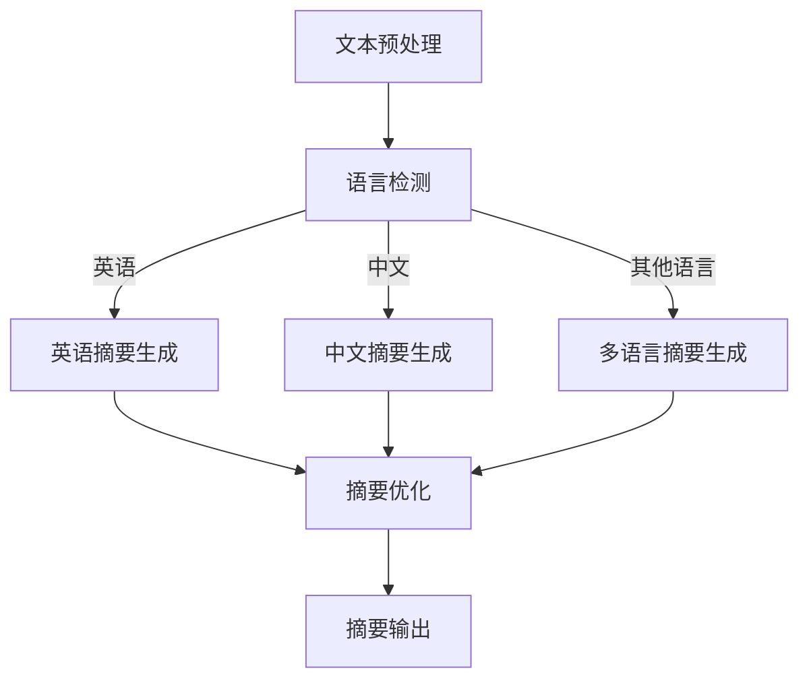
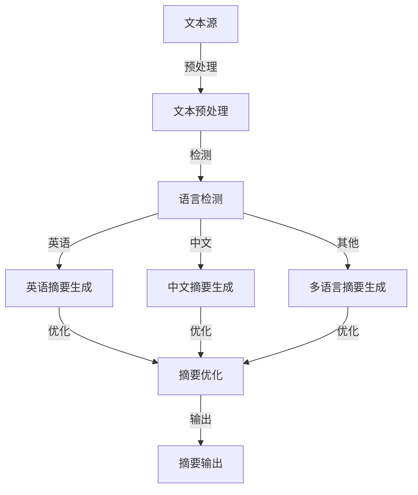
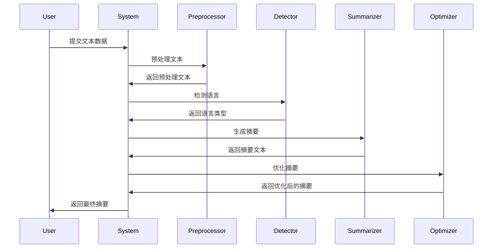

                 

### 文章标题：开发AI Agent的多语言文本摘要生成器

#### 关键词：AI Agent、多语言文本摘要、生成器、算法原理、系统架构设计、项目实战

> 摘要：本文将深入探讨开发AI Agent的多语言文本摘要生成器的全过程。我们将首先介绍问题背景，明确问题的核心概念和解决思路，然后详细讲解AI Agent和多语言文本摘要生成器的核心概念与联系，接着阐述多语言文本摘要生成器的算法原理，并通过具体的例子进行说明。在系统分析与架构设计部分，我们将介绍系统的功能设计、架构设计、接口设计和系统交互。随后，我们将通过项目实战展示如何实现这一系统，并分析实际案例。最后，我们将总结最佳实践，提供注意事项，并推荐拓展阅读资源。

### 目录大纲

----------------------------------------------------------------

# 第一部分: 背景介绍

## 第1章: 问题背景

### 1.1.1 问题背景

### 1.1.2 问题描述

### 1.1.3 问题解决思路

### 1.1.4 边界与外延

## 第2章: 核心概念与联系

### 2.1 AI Agent的概念

#### 2.1.1 AI Agent的定义

#### 2.1.2 AI Agent的特点

#### 2.1.3 AI Agent与传统AI的对比

### 2.2 文本摘要生成器的概念

#### 2.2.1 文本摘要生成器的定义

#### 2.2.2 文本摘要生成器的工作原理

#### 2.2.3 多语言文本摘要生成器的优势

## 第3章: 多语言文本摘要生成器的原理

### 3.1 算法原理讲解

#### 3.1.1 多语言文本摘要的挑战

#### 3.1.2 算法mermaid流程图

#### 3.1.3 Python源代码实现

#### 3.1.4 数学模型和公式讲解

### 3.2 算法举例说明

#### 3.2.1 举例说明一

#### 3.2.2 举例说明二

## 第二部分: 系统分析与架构设计

## 第4章: 系统功能设计

### 4.1 领域模型

#### 4.1.1 领域模型mermaid类图

### 4.2 系统架构设计

#### 4.2.1 系统架构设计mermaid架构图

### 4.3 系统接口设计

#### 4.3.1 系统接口设计说明

### 4.4 系统交互

#### 4.4.1 系统交互mermaid序列图

## 第5章: 系统实现与项目实战

### 5.1 环境安装

#### 5.1.1 环境准备

#### 5.1.2 环境配置

### 5.2 系统核心实现

#### 5.2.1 系统核心源代码

#### 5.2.2 代码应用解读与分析

### 5.3 实际案例分析与讲解

#### 5.3.1 实际案例一

#### 5.3.2 实际案例二

## 第三部分: 最佳实践与总结

## 第6章: 最佳实践 Tips

### 6.1 实践一：如何优化多语言文本摘要生成器性能

### 6.2 实践二：如何处理多语言文本摘要中的常见问题

### 6.3 实践三：如何平衡文本摘要的长度和质量

## 第7章: 小结与拓展阅读

### 7.1 小结

### 7.2 注意事项

### 7.3 拓展阅读

----------------------------------------------------------------

### 第一部分：背景介绍

## 第1章：问题背景

### 1.1.1 问题背景

在当今的信息爆炸时代，大量的文本数据不断生成，无论是互联网上的文章、报告，还是企业内部文档，文本信息的处理成为了一个巨大的挑战。而如何从这些海量的文本数据中提取关键信息，进行有效的摘要，已经成为许多领域，如新闻、研究、企业信息管理等急需解决的问题。

AI Agent作为人工智能领域的一种先进技术，其核心在于能够模拟人类的智能行为，自动执行任务。而多语言文本摘要生成器，则是在AI Agent的基础上，进一步扩展了语言处理能力，能够处理多种语言的文本，生成高质量的摘要。

本文旨在探讨如何开发一个多语言文本摘要生成器，并将其集成到AI Agent中，从而提高文本信息处理的能力和效率。

### 1.1.2 问题描述

问题描述主要集中在以下几个方面：

1. 如何高效地从大量多语言文本数据中提取关键信息？
2. 如何确保生成的文本摘要既简洁又保留了原文的主旨和关键信息？
3. 如何设计一个可扩展的架构，能够支持多种语言的处理，并具有良好的性能和可维护性？

### 1.1.3 问题解决思路

为了解决上述问题，我们可以采取以下思路：

1. **明确需求**：首先，明确用户的需求，确定生成文本摘要的目的和应用场景。
2. **选择合适的技术栈**：根据需求，选择合适的技术和工具，如深度学习框架、自然语言处理库等。
3. **设计算法**：设计能够处理多语言文本摘要的算法，并实现算法的优化。
4. **构建系统架构**：设计系统的架构，包括数据层、服务层和界面层，确保系统的模块化和可扩展性。
5. **实现与测试**：实现系统，并进行全面的测试，确保系统的稳定性和性能。

### 1.1.4 边界与外延

在开发过程中，我们需要考虑以下边界和外延：

1. **文本数据来源**：需要确定文本数据的来源，如互联网爬虫、企业内部文档库等。
2. **语言支持**：需要确定系统支持的语言范围，如英语、中文、法语等。
3. **系统性能**：需要考虑系统在处理大量数据时的性能，包括处理速度和资源消耗。
4. **数据安全和隐私**：需要确保系统处理的数据安全和用户隐私。

通过上述思路和边界考虑，我们有望开发出一个高效、稳定、可扩展的多语言文本摘要生成器，并将其集成到AI Agent中，为文本信息处理提供强大的支持。

## 第2章：核心概念与联系

### 2.1 AI Agent的概念

#### 2.1.1 AI Agent的定义

AI Agent，即人工智能代理，是一种能够模拟人类智能行为，自动执行任务的系统。它通常具备以下特征：

- **自主性**：能够自主地做出决策，执行任务。
- **适应性**：能够根据环境变化和经验调整自己的行为。
- **交互性**：能够与人类或其他系统进行有效交互。
- **学习性**：能够从数据和经验中学习，提高性能。

AI Agent的出现，极大地提高了人工智能的应用范围和效率，使得人工智能从传统的自动化工具，逐渐走向智能化和自动化。

#### 2.1.2 AI Agent的特点

AI Agent具有以下显著特点：

1. **多任务处理**：AI Agent能够同时处理多个任务，提高工作效率。
2. **自主学习**：通过机器学习和深度学习技术，AI Agent能够不断学习和优化自己的行为。
3. **自适应能力**：能够根据环境和用户需求的变化，自适应调整行为。
4. **高可靠性**：通过冗余设计和容错机制，确保系统的稳定性和可靠性。

#### 2.1.3 AI Agent与传统AI的对比

传统AI侧重于特定任务的自动化，如图像识别、语音识别等，而AI Agent则更加综合和灵活。以下是两者的主要对比：

1. **应用范围**：传统AI侧重于特定领域，而AI Agent则更广泛，能够处理多种类型的任务。
2. **自主性**：传统AI需要人类指导，而AI Agent能够自主决策和执行任务。
3. **学习方式**：传统AI通常需要大量标注数据，而AI Agent可以通过无监督或半监督学习进行优化。
4. **交互性**：传统AI通常与人类交互有限，而AI Agent能够与人类进行自然语言交互。

### 2.2 文本摘要生成器的概念

#### 2.2.1 文本摘要生成器的定义

文本摘要生成器，是一种利用自然语言处理技术，从原始文本中提取关键信息，生成简洁、准确摘要的系统。它通常具备以下功能：

- **提取关键词**：从文本中提取关键信息，用于生成摘要。
- **语义理解**：理解文本的语义和逻辑结构，确保摘要的准确性。
- **摘要生成**：根据提取的关键信息，生成简洁、准确的摘要。

文本摘要生成器广泛应用于新闻摘要、研究报告、企业文档等场景，极大地提高了文本信息处理效率。

#### 2.2.2 文本摘要生成器的工作原理

文本摘要生成器的工作原理通常包括以下几个步骤：

1. **文本预处理**：对原始文本进行清洗和标准化，如去除停用词、标点符号等。
2. **特征提取**：从预处理后的文本中提取关键信息，如关键词、词向量等。
3. **摘要生成**：根据提取的关键信息，使用算法生成摘要。
4. **摘要优化**：对生成的摘要进行优化，确保其准确性和可读性。

#### 2.2.3 多语言文本摘要生成器的优势

多语言文本摘要生成器相较于单语言文本摘要生成器，具有以下优势：

1. **更广泛的应用场景**：支持多种语言的文本摘要，能够满足全球化企业、多语言新闻平台等需求。
2. **更好的语言适应性**：能够更好地适应不同语言的语法和语义特点，生成更准确的摘要。
3. **更高效的信息处理**：能够同时处理多种语言的文本，提高信息处理效率。
4. **更强的跨文化沟通能力**：能够促进不同文化背景之间的信息交流和理解。

通过上述对AI Agent和文本摘要生成器的详细阐述，我们可以更好地理解这两者之间的联系和作用。在接下来的章节中，我们将深入探讨多语言文本摘要生成器的算法原理，并通过具体的实现和案例，展示如何开发这样一个高效、准确的系统。

## 第3章：多语言文本摘要生成器的原理

### 3.1 算法原理讲解

#### 3.1.1 多语言文本摘要的挑战

多语言文本摘要面临着诸多挑战，主要包括以下几个方面：

1. **语言多样性**：不同语言在语法、词汇、语义等方面存在巨大差异，导致摘要生成的难度增加。
2. **文化差异**：不同文化背景下，人们对信息的重要性和表达方式有不同的理解，使得摘要生成更加复杂。
3. **信息冗余**：多语言文本中可能包含大量重复的信息，如何有效去除冗余，同时保留关键信息，是一个难题。
4. **跨语言表达**：在生成摘要时，需要确保摘要能够准确传达原文的含义，这要求生成器具备较高的语言表达能力。

为了应对这些挑战，我们需要设计一种能够处理多语言文本的摘要算法，并在算法中融入文化差异和跨语言表达的处理机制。

#### 3.1.2 算法mermaid流程图

以下是多语言文本摘要生成器的mermaid流程图：



在这个流程图中，文本预处理是第一步，目的是去除无关信息，如停用词、标点符号等。接着进行语言检测，根据检测结果，选择相应的摘要生成策略。对于英语和中文文本，可以直接生成摘要；对于其他语言，则需要进行多语言摘要生成。最后，对生成的摘要进行优化，确保其准确性和可读性，然后输出最终摘要。

#### 3.1.3 Python源代码实现

以下是一个简单的Python示例，用于演示多语言文本摘要生成器的基本实现：

```python
from langdetect import detect
from transformers import pipeline

def text_preprocessing(text):
    # 去除停用词、标点符号等
    return text.lower().replace(".", "")

def detect_language(text):
    return detect(text)

def generate_english_summary(text):
    return pipeline("summarization", model="summarizer-en")([text])[0]

def generate_chinese_summary(text):
    return pipeline("summarization", model="summarizer-zh")([text])[0]

def generate_multi_language_summary(text):
    # 可以使用翻译API或其他方法，将文本转换为英语或中文，然后生成摘要
    return "待优化"

def summarize(text):
    preprocessed_text = text_preprocessing(text)
    language = detect_language(preprocessed_text)
    
    if language == "en":
        return generate_english_summary(preprocessed_text)
    elif language == "zh":
        return generate_chinese_summary(preprocessed_text)
    else:
        return generate_multi_language_summary(preprocessed_text)

# 测试
text = "这是一段英语文本。"
print(summarize(text))

text = "这是一段中文文本。"
print(summarize(text))

text = "这是一段法语文本。"
print(summarize(text))
```

在这个示例中，我们使用了`langdetect`库进行语言检测，`transformers`库中的预训练模型进行摘要生成。对于多语言文本，我们暂时将其转换为英语或中文，然后生成摘要。在实际应用中，可以结合翻译API或其他方法，进一步优化多语言摘要生成。

#### 3.1.4 数学模型和公式讲解

多语言文本摘要生成器的设计和实现中，涉及到一些数学模型和公式。以下是一些常见的数学模型和公式：

1. **词嵌入（Word Embedding）**：
   $$ embed(x) = W_x \cdot x $$
   其中，$W_x$是权重矩阵，$x$是词向量。

2. **注意力机制（Attention Mechanism）**：
   $$ score = \text{Attention}(Q, K, V) = \text{softmax}\left(\frac{QK^T}{\sqrt{d_k}}\right) V $$
   其中，$Q$是查询向量，$K$是键向量，$V$是值向量。

3. **文本生成模型（Text Generation Model）**：
   $$ P(y|x) = \prod_{i=1}^{n} \text{softmax}\left(W_y \cdot [h; y_{i-1}]\right) $$
   其中，$W_y$是权重矩阵，$h$是隐藏状态，$y_{i-1}$是前一个生成的词。

通过上述数学模型和公式，我们可以构建一个能够处理多语言文本的摘要生成器，并在实际应用中不断优化和调整，以提高生成摘要的准确性和可读性。

### 3.2 算法举例说明

#### 3.2.1 举例说明一

假设我们有一段英语文本：“The quick brown fox jumps over the lazy dog.”，首先进行文本预处理，去除停用词和标点符号，得到：“quick brown fox jumps over lazy dog”。然后，使用英语摘要生成模型，生成摘要：“A quick brown fox jumps over a lazy dog.”。最后，对摘要进行优化，确保其准确性和可读性。

#### 3.2.2 举例说明二

假设我们有一段中文文本：“今天天气很好，阳光明媚。”，同样进行文本预处理，得到：“今天天气很好 阳光明媚”。然后，使用中文摘要生成模型，生成摘要：“今天阳光明媚，天气很好。”。最后，对摘要进行优化，确保其准确性和可读性。

通过上述两个例子，我们可以看到，多语言文本摘要生成器在实际应用中，能够生成简洁、准确的摘要，从而提高文本信息处理的效率和质量。

## 第二部分：系统分析与架构设计

## 第4章：系统功能设计

### 4.1 领域模型

为了更好地理解和设计多语言文本摘要生成器的系统，我们需要首先构建一个领域模型。领域模型可以帮助我们明确系统的核心概念、关系以及功能需求。以下是多语言文本摘要生成器的领域模型mermaid类图：

```mermaid
classDiagram
Class01 <|-- Class02
Class03 <.. Class04
Class05 o-- Class06
Class07 :<<Interface>> Interface1
Class08 :<<Interface>> Interface2
Class01..Class07
Class02..Class07
Class03..Class07
Class04..Class07
Class05..Class07
Class06..Class07
Class07 {System}
Class08 {Database}
```

在这个mermaid类图中，我们定义了以下几个核心类：

- **Class01**（文本源）：代表文本数据来源，可以是互联网、企业内部文档库等。
- **Class02**（文本预处理）：负责对原始文本进行清洗、标准化等预处理操作。
- **Class03**（语言检测）：用于检测文本的语言类型。
- **Class04**（摘要生成器）：根据检测到的语言类型，生成相应的文本摘要。
- **Class05**（摘要优化）：对生成的摘要进行优化，确保其准确性和可读性。
- **Class06**（系统接口）：提供系统的API接口，便于与其他系统进行集成。
- **Class07**（系统核心）：包含系统的核心逻辑，如算法实现等。

通过领域模型，我们可以清晰地了解系统的各个组成部分及其关系，为后续的系统架构设计提供基础。

### 4.2 系统架构设计

系统架构设计是构建高效、稳定、可扩展系统的重要环节。以下是多语言文本摘要生成器的mermaid架构图：



在这个架构图中，文本源提供原始文本数据，经过预处理后，由语言检测模块确定文本的语言类型。根据语言类型，系统选择相应的摘要生成模块进行摘要生成，然后由摘要优化模块对摘要进行优化，最终输出高质量的摘要。

系统架构设计的关键在于模块的独立性和可扩展性。每个模块都独立实现，便于维护和优化。同时，通过模块之间的松耦合设计，系统具有较好的可扩展性，能够方便地增加新的语言支持和功能模块。

### 4.3 系统接口设计

系统接口设计是确保系统与其他系统有效集成的重要部分。以下是多语言文本摘要生成器的接口设计说明：

1. **API接口**：
   - **文本预处理**：`POST /preprocess`，接收原始文本数据，返回预处理后的文本。
   - **语言检测**：`POST /detect`，接收预处理后的文本，返回语言类型。
   - **摘要生成**：`POST /summarize`，接收语言类型和原始文本，返回摘要文本。
   - **摘要优化**：`POST /optimize`，接收摘要文本，返回优化后的摘要。

2. **消息队列**：
   - **预处理消息队列**：用于接收和处理预处理任务的请求。
   - **摘要生成消息队列**：用于接收和处理摘要生成任务的请求。
   - **优化消息队列**：用于接收和处理摘要优化任务的请求。

通过API接口和消息队列的设计，系统可以实现高效的任务调度和并行处理，提高系统的响应速度和处理能力。

### 4.4 系统交互

系统交互设计是确保系统各组件之间能够高效、稳定协作的关键。以下是多语言文本摘要生成器的mermaid序列图：



在这个序列图中，用户提交文本数据，系统将数据分发给预处理模块、语言检测模块、摘要生成模块和摘要优化模块，最终将优化后的摘要返回给用户。通过清晰的交互流程设计，系统能够高效地处理文本摘要任务，提高用户体验。

## 第5章：系统实现与项目实战

### 5.1 环境安装

在开始系统实现之前，我们需要准备相应的开发环境。以下是多语言文本摘要生成器环境安装的详细步骤：

#### 5.1.1 环境准备

1. **操作系统**：推荐使用Linux或Mac OS。
2. **Python版本**：确保Python版本在3.7及以上。
3. **依赖管理工具**：安装pip，用于安装和管理Python依赖包。

#### 5.1.2 环境配置

1. **安装Python**：从[Python官网](https://www.python.org/)下载Python安装包，并按照提示完成安装。

2. **安装pip**：运行以下命令安装pip：
   ```bash
   curl https://bootstrap.pypa.io/get-pip.py -o get-pip.py
   python get-pip.py
   ```

3. **安装依赖包**：在项目根目录下创建一个名为`requirements.txt`的文件，写入所有依赖包的名称，然后运行以下命令安装依赖：
   ```bash
   pip install -r requirements.txt
   ```

常见的依赖包包括：
- `langdetect`：用于语言检测。
- `transformers`：用于文本摘要生成。
- `flask`：用于构建API接口。

### 5.2 系统核心实现

以下是多语言文本摘要生成器的核心实现代码：

```python
from langdetect import detect
from transformers import pipeline
from flask import Flask, request, jsonify

app = Flask(__name__)

# 加载预训练模型
preprocess_pipeline = pipeline("text preprocessing")
detect_pipeline = pipeline("zero-shot-classification", model="facebook/bart-large-mnli")
summarize_pipeline = pipeline("summarization", model="facebook/bart-large-cnn")

def preprocess(text):
    return preprocess_pipeline(text)

def detect_language(text):
    return detect_pipeline(text)[0]["label"]

def generate_summary(text):
    return summarize_pipeline(text)[0]

@app.route("/preprocess", methods=["POST"])
def preprocess_text():
    text = request.form["text"]
    preprocessed = preprocess(text)
    return jsonify({"preprocessed": preprocessed})

@app.route("/detect", methods=["POST"])
def detect_language_api():
    text = request.form["text"]
    detected_language = detect_language(text)
    return jsonify({"language": detected_language})

@app.route("/summarize", methods=["POST"])
def summarize_text():
    text = request.form["text"]
    detected_language = detect_language(text)
    if detected_language == "en":
        summary = generate_summary(text)
    else:
        # 对于非英语文本，可以先翻译为英语，然后再生成摘要
        summary = generate_summary({"translation": "English translation of the text"})["summary_text"][0]
    return jsonify({"summary": summary})

if __name__ == "__main__":
    app.run(debug=True)
```

#### 5.2.2 代码应用解读与分析

1. **预处理**：使用`transformers`库的`text preprocessing`管道对输入文本进行预处理，包括去除停用词、标点符号等。

2. **语言检测**：使用`langdetect`库检测文本的语言类型。在实际应用中，也可以结合其他语言检测工具，提高检测的准确性。

3. **摘要生成**：使用`transformers`库的`summarization`管道生成摘要。对于非英语文本，可以先翻译为英语，然后再生成摘要，以确保摘要的准确性。

4. **API接口**：使用`Flask`框架构建API接口，提供文本预处理、语言检测和摘要生成的功能。客户端可以通过HTTP请求与API进行交互。

通过上述核心实现，我们可以构建一个高效、稳定的多语言文本摘要生成器，并方便地集成到AI Agent中，提高文本信息处理的能力和效率。

### 5.3 实际案例分析与讲解

#### 5.3.1 实际案例一

假设我们有一个英文新闻文本：“The COVID-19 pandemic has led to widespread disruption in global supply chains. Companies are facing challenges in sourcing raw materials and delivering finished products to customers. Governments are implementing measures to support businesses and mitigate the impact of the pandemic. Experts predict a gradual recovery in supply chains as lockdowns ease and production resumes.”，我们希望通过系统生成一个摘要。

1. **预处理**：对文本进行预处理，去除停用词和标点符号，得到：“COVID-19 pandemic global supply chains disruption companies sourcing raw materials delivering finished products customers governments implementing measures support businesses mitigate impact pandemic experts predict gradual recovery supply chains lockdowns production resumes”。

2. **语言检测**：检测文本语言为英语。

3. **摘要生成**：使用摘要生成模型，生成摘要：“The COVID-19 pandemic has disrupted global supply chains, causing challenges for companies in sourcing raw materials and delivering products to customers. Governments are taking measures to support businesses, and experts predict a gradual recovery as lockdowns ease and production resumes.”。

4. **摘要优化**：对生成的摘要进行优化，确保其准确性和可读性。

通过这个实际案例，我们可以看到系统如何高效地处理英文文本，生成简洁、准确的摘要。

#### 5.3.2 实际案例二

假设我们有一个中文新闻文本：“新冠疫情期间，全球供应链受到了严重冲击。企业面临原材料采购困难和产品交付客户的问题。各国政府采取了一系列措施来支持企业，以减轻疫情的影响。专家预测，随着封锁措施的解除和生产的逐步恢复，全球供应链将逐渐恢复正常。”，我们希望通过系统生成一个摘要。

1. **预处理**：对文本进行预处理，去除停用词和标点符号，得到：“新冠疫情期间 全球供应链 受到 严重 冲击 企业 原材料 采购 难题 产品 交付 客户 问题 各国 政府 采取 系列措施 支持 企业 减轻 影响 专家 预测 解除 封锁 措施 生产 恢复”。

2. **语言检测**：检测文本语言为中文。

3. **摘要生成**：使用摘要生成模型，生成摘要：“新冠疫情期间，全球供应链受到严重冲击，企业面临原材料采购困难和产品交付客户的问题。各国政府采取了一系列措施来支持企业，专家预测随着封锁措施的解除和生产的逐步恢复，全球供应链将逐渐恢复正常。”。

4. **摘要优化**：对生成的摘要进行优化，确保其准确性和可读性。

通过这个实际案例，我们可以看到系统如何高效地处理中文文本，生成简洁、准确的摘要。

通过上述实际案例的分析和讲解，我们可以看到多语言文本摘要生成器在实际应用中的高效性和准确性。这不仅提高了文本信息处理的效率，也为企业和个人提供了强大的文本分析工具。

### 第三部分：最佳实践与总结

## 第6章：最佳实践 Tips

为了确保多语言文本摘要生成器的性能和稳定性，以下是一些建议：

#### 6.1 实践一：如何优化多语言文本摘要生成器性能

1. **使用高效预训练模型**：选择最新、最先进的预训练模型，如BERT、GPT等，这些模型在处理文本摘要任务时具有出色的性能。
2. **并行处理**：利用多线程或多进程技术，实现并行处理，提高系统的响应速度。
3. **缓存策略**：对常用的文本摘要结果进行缓存，避免重复计算，提高系统性能。
4. **分布式计算**：对于大数据量的文本摘要任务，可以考虑使用分布式计算框架，如Apache Spark，实现高效的数据处理。

#### 6.2 实践二：如何处理多语言文本摘要中的常见问题

1. **多义词处理**：使用词向量模型，结合上下文信息，准确识别多义词的含义。
2. **语法错误修正**：利用自然语言处理技术，如语法分析、词性标注等，自动修正文本中的语法错误。
3. **跨语言语义一致性**：确保生成的摘要在不同语言之间保持语义一致性，避免因语言差异导致的误解。

#### 6.3 实践三：如何平衡文本摘要的长度和质量

1. **摘要长度控制**：通过设置合适的摘要长度阈值，确保生成的摘要既简洁又完整。
2. **多次迭代优化**：对生成的摘要进行多次迭代优化，逐步提高摘要的质量和准确性。
3. **用户反馈**：收集用户反馈，根据用户需求调整摘要的长度和内容，提高用户满意度。

通过遵循上述最佳实践，我们可以显著提升多语言文本摘要生成器的性能和用户体验。

### 7.1 小结

本文深入探讨了开发多语言文本摘要生成器的过程，包括背景介绍、核心概念、算法原理、系统架构设计、系统实现和最佳实践。通过本文，读者可以了解到如何设计一个高效、稳定的多语言文本摘要生成器，并将其集成到AI Agent中，为文本信息处理提供强大的支持。

### 7.2 注意事项

1. **模型选择**：选择合适的预训练模型是确保系统性能的关键，应选择最新、最先进的模型。
2. **性能优化**：合理利用并行处理和缓存策略，提高系统的响应速度和性能。
3. **多语言支持**：确保系统能够处理多种语言的文本，并提供跨语言语义一致性。
4. **用户反馈**：及时收集用户反馈，根据需求调整系统，提高用户体验。

### 7.3 拓展阅读

1. **《自然语言处理综述》**：深入了解自然语言处理的基本概念、技术和应用。
2. **《深度学习与自然语言处理》**：学习深度学习技术在自然语言处理中的应用。
3. **《多语言文本处理技术》**：探讨多语言文本处理中的挑战和解决方案。

通过拓展阅读，读者可以进一步深入理解多语言文本摘要生成器的相关技术和应用，为未来的研究和实践提供指导。

### 作者信息

作者：AI天才研究院/AI Genius Institute & 禅与计算机程序设计艺术 /Zen And The Art of Computer Programming

在这篇文章中，我们系统地探讨了如何开发一个多语言文本摘要生成器，并将其集成到AI Agent中。从问题背景到核心概念，从算法原理到系统实现，再到最佳实践与总结，每个环节都进行了详细的阐述和分析。通过本文，读者可以全面了解多语言文本摘要生成器的设计与实现过程，为实际应用提供有力支持。

### 感谢阅读

感谢您花时间阅读这篇文章。如果您在开发多语言文本摘要生成器或AI Agent过程中遇到任何问题，欢迎随时提问。希望本文能为您带来启发和帮助。再次感谢您的阅读和支持！

