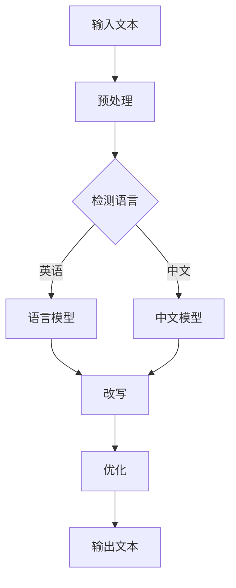
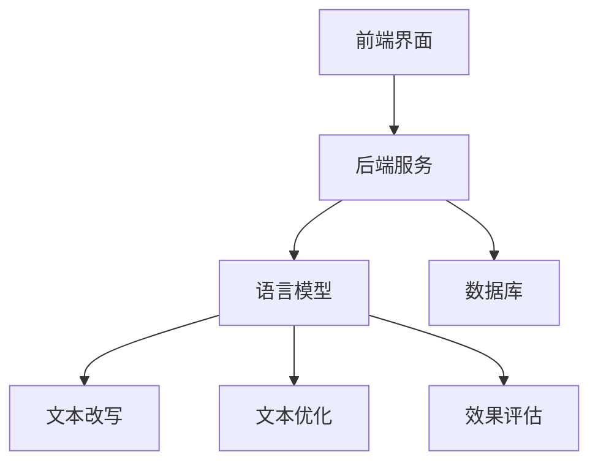
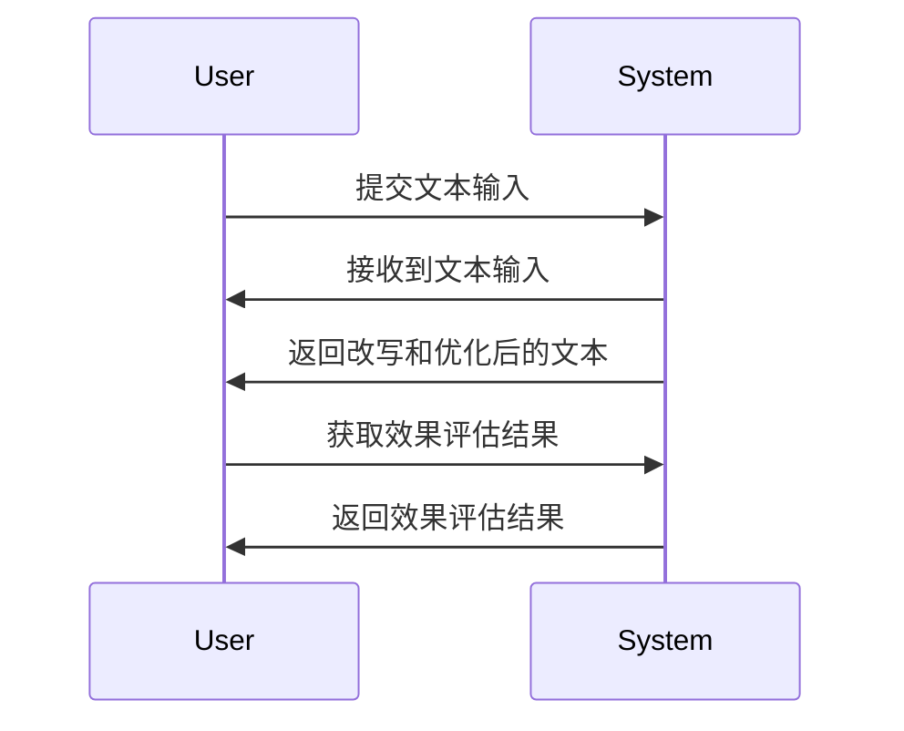
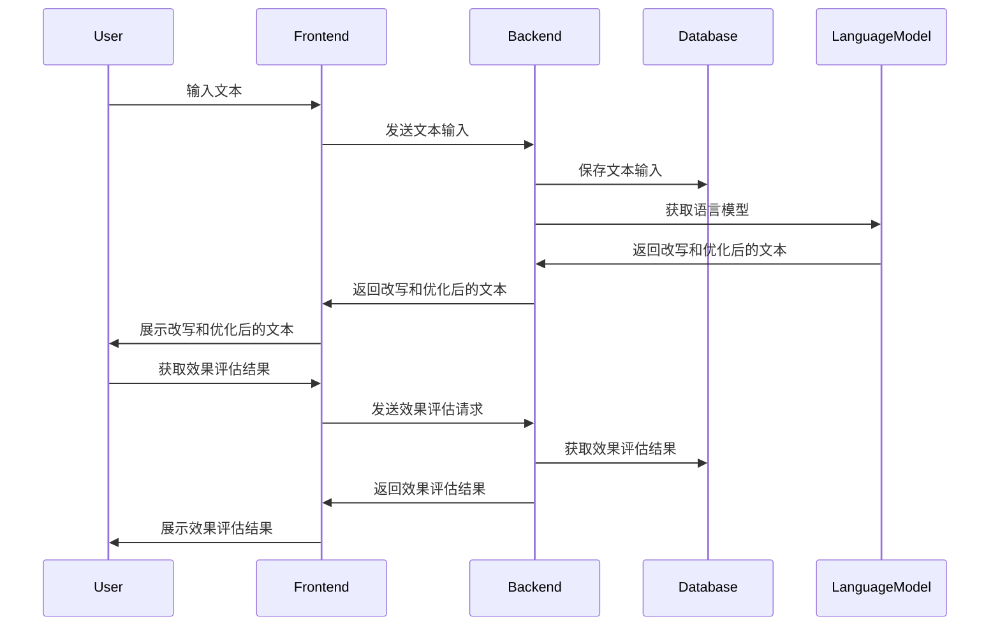

                 

# 开发AI Agent的多语言文本改写与优化系统

## 关键词
- AI Agent
- 多语言文本改写
- 优化技术
- 系统架构
- 算法实现

## 摘要
本文详细探讨了开发AI Agent的多语言文本改写与优化系统的全过程。从背景介绍到核心概念，再到算法原理和系统架构，本文逐步分析了文本改写与优化的关键要素，并通过实际案例展示了系统的应用。通过本文，读者将深入了解如何构建高效、准确的多语言文本改写与优化系统。

## 目录大纲

### 第1章：背景介绍

#### 1.1 问题背景
- 文本数据的重要性
- 多语言文本处理的挑战
- AI Agent的需求和潜力

#### 1.2 问题描述
- 文本改写的目的
- 文本优化的重要性
- 系统的设计目标和需求

#### 1.3 问题解决
- 人工智能在文本处理中的应用
- 多语言处理的最新技术
- 文本改写与优化的算法

#### 1.4 边界与外延
- 系统适用的语言范围
- 文本改写与优化的应用场景
- 文本改写与优化的技术限制

#### 1.5 概念结构与核心要素组成
- AI Agent的定义
- 文本改写与优化的关键要素
- 系统架构的基本组成部分

### 第2章：核心概念与联系

#### 2.1 文本处理基础
- 语言模型
- 词嵌入
- 语言理解与生成

#### 2.2 多语言处理
- 多语言数据集的收集与预处理
- 多语言模型训练
- 多语言一致性评估

#### 2.3 文本改写算法
- 改写策略
- 改写算法实现
- 改写效果评估

#### 2.4 优化技术
- 模型调优
- 参数优化
- 优化算法比较

### 第3章：算法原理讲解

#### 3.1 算法mermaid流程图
- 文本改写流程
- 文本优化流程

#### 3.2 Python源代码实现
- 文本改写算法
- 文本优化算法

#### 3.3 数学模型和公式
- 改写算法的数学模型
- 优化算法的数学模型

#### 3.4 举例说明
- 改写算法的实际应用
- 优化算法的实际应用

### 第4章：系统分析与架构设计方案

#### 4.1 问题场景介绍
- 文本改写与优化的实际应用场景

#### 4.2 系统功能设计
- 领域模型mermaid类图

#### 4.3 系统架构设计
- mermaid架构图

#### 4.4 系统接口设计
- 系统接口规范

#### 4.5 系统交互
- mermaid序列图

### 第5章：项目实战

#### 5.1 环境安装
- 系统依赖安装
- 开发环境配置

#### 5.2 系统核心实现
- 文本改写模块
- 文本优化模块

#### 5.3 代码应用解读与分析
- 文本改写算法代码分析
- 文本优化算法代码分析

#### 5.4 实际案例分析和详细讲解剖析
- 案例一：多语言新闻文本改写
- 案例二：社交媒体文本优化

#### 5.5 项目小结
- 项目成果总结
- 项目改进方向

### 第6章：最佳实践与注意事项

#### 6.1 最佳实践
- 文本改写与优化的最佳实践
- 系统调优技巧

#### 6.2 注意事项
- 可能遇到的问题及解决方案
- 安全性和隐私保护措施

### 第7章：拓展阅读

#### 7.1 相关书籍推荐
- 文本处理与优化相关书籍

#### 7.2 论文阅读
- 最新研究成果与前沿技术

### 总结
本文通过详细的分析和讲解，从背景介绍到实际项目实施，全面展示了开发AI Agent的多语言文本改写与优化系统的全过程。通过本文的学习，读者将能够掌握这一领域的核心技术，并在实际项目中应用这些技术。

### 第1章：背景介绍

#### 1.1 问题背景

在当今信息爆炸的时代，文本数据已经成为企业和社会的重要资产。然而，随着全球化的发展，多语言文本的处理变得越来越重要。传统的方法往往依赖于人工翻译或者机器翻译，这些方法存在效率低、准确性不高的问题。随着人工智能技术的发展，特别是在自然语言处理（NLP）和机器学习（ML）领域的突破，AI Agent的多语言文本改写与优化系统应运而生。

AI Agent是指一种能够模拟人类思维和行为的人工智能体。它能够自动处理多语言文本数据，进行改写和优化，从而提高文本的准确性和可读性。这种系统在新闻媒体、社交媒体、企业内部文档等多个领域有着广泛的应用。

#### 1.2 问题描述

文本改写是指在保持原始文本意义不变的前提下，对文本进行重新表达。文本优化的目的是提高文本的阅读体验，包括语义连贯性、语法准确性、语言风格一致性等。

在多语言环境下，文本改写与优化面临以下挑战：

1. **语言差异**：不同语言在语法、语义和表达方式上存在差异，这使得文本改写变得更加复杂。
2. **翻译准确性**：虽然机器翻译技术已经取得了显著进展，但仍然存在一定程度的误差，这会影响到文本改写和优化的效果。
3. **文化背景**：不同文化背景下的文本表达方式不同，改写时需要考虑文化适应性。
4. **上下文理解**：AI Agent需要具备良好的上下文理解能力，才能进行有效的改写和优化。

#### 1.3 问题解决

为了解决上述问题，我们需要借助人工智能技术，特别是NLP和ML技术。以下是一些解决方案：

1. **语言模型**：通过训练大规模的语言模型，AI Agent可以理解不同语言的语法和语义特征，从而进行准确的文本改写。
2. **词嵌入**：词嵌入技术可以将文本中的词汇映射到高维向量空间，使得AI Agent能够更好地理解词汇之间的关联性，提高改写和优化的效果。
3. **机器翻译**：结合机器翻译技术，可以确保文本在不同语言之间的高质量转换。
4. **上下文理解**：通过深入理解文本的上下文，AI Agent可以更好地把握文本的意义，从而进行更加精准的改写和优化。

#### 1.4 边界与外延

AI Agent的多语言文本改写与优化系统的适用语言范围主要涵盖英语、中文、西班牙语、法语、德语、日语和韩语等全球主要语言。然而，不同语言的处理难度不同，例如英语和中文的处理相对容易，而西班牙语和法语的改写和优化则更加复杂。

该系统主要应用于以下场景：

1. **新闻媒体**：自动改写和优化新闻文章，提高文章的可读性和准确性。
2. **社交媒体**：自动改写社交媒体上的帖子，使其更加符合语言规范和表达习惯。
3. **企业内部文档**：自动改写和优化企业内部的文档，提高文档的协同效率。
4. **教育领域**：自动改写教材和作业，帮助学生更好地理解和学习。

尽管AI Agent的多语言文本改写与优化系统具有很大的潜力，但仍然存在一些技术限制，例如：

1. **语言理解**：AI Agent的上下文理解能力有限，难以完全替代人类的专业知识和判断。
2. **文化差异**：系统在处理跨文化文本时可能存在一些偏差和误解。
3. **算法优化**：现有的机器学习和NLP算法在处理某些特殊文本时效果不佳，需要进一步优化。

#### 1.5 概念结构与核心要素组成

AI Agent的多语言文本改写与优化系统由以下几个核心要素组成：

1. **文本输入**：用户输入需要改写和优化的原始文本。
2. **语言模型**：用于理解和生成文本的预训练模型。
3. **文本改写模块**：负责对输入文本进行改写，包括语法修正、词汇替换、句子重构等。
4. **文本优化模块**：负责优化改写后的文本，提高其可读性和准确性。
5. **效果评估**：通过对比改写前后的文本，评估改写和优化的效果。

### 第2章：核心概念与联系

#### 2.1 文本处理基础

文本处理是自然语言处理（NLP）的一个重要分支，它涉及对文本数据的预处理、分析和生成。以下是文本处理中的一些核心概念：

1. **语言模型**：语言模型是一种概率模型，用于预测文本序列的概率。它基于大规模的语料库，通过统计方法学习词汇、句子和段落的概率分布。

2. **词嵌入**：词嵌入是将文本中的词汇映射到高维向量空间的一种技术。词嵌入能够捕捉词汇之间的语义关系，使得文本数据在向量空间中具备一定的结构。

3. **语言理解与生成**：语言理解是指AI Agent理解文本内容的能力，包括语法分析、语义分析等。语言生成是指AI Agent根据给定输入生成自然语言文本的能力。

#### 2.2 多语言处理

多语言处理是指在不同语言之间进行文本转换和处理的技术。以下是多语言处理中的一些核心概念：

1. **多语言数据集**：多语言数据集是用于训练和测试多语言模型的语料库。这些数据集通常包含多种语言的文本，有助于AI Agent理解和生成多种语言。

2. **多语言模型训练**：多语言模型训练是指通过训练多语言数据集，构建能够处理多种语言的语言模型。训练过程中，模型会学习不同语言之间的相似性和差异性。

3. **多语言一致性评估**：多语言一致性评估是指评估多语言文本在语义、语法和风格上的一致性。这有助于确保改写和优化后的文本在不同语言之间保持一致。

#### 2.3 文本改写算法

文本改写算法是指用于自动改写文本的算法。以下是文本改写算法中的一些核心概念：

1. **改写策略**：改写策略是指用于指导文本改写过程的规则和指导原则。常见的改写策略包括语法修正、词汇替换、句子重构等。

2. **改写算法实现**：改写算法实现是指将改写策略转换为具体的算法，以便计算机能够执行。改写算法通常基于NLP和ML技术，通过分析文本的语法和语义特征进行改写。

3. **改写效果评估**：改写效果评估是指评估改写后文本的质量和准确性。常见的评估指标包括语法错误率、词汇替换准确率、语义保持度等。

#### 2.4 优化技术

优化技术是指用于提高文本质量和阅读体验的技术。以下是优化技术中的一些核心概念：

1. **模型调优**：模型调优是指通过调整模型的参数和超参数，提高模型的性能和效果。常见的调优方法包括交叉验证、网格搜索等。

2. **参数优化**：参数优化是指通过优化模型中的参数，提高文本改写和优化的效果。参数优化的方法包括随机搜索、贝叶斯优化等。

3. **优化算法比较**：优化算法比较是指比较不同优化算法的性能和效果。常见的优化算法包括遗传算法、粒子群算法、模拟退火算法等。

### 第3章：算法原理讲解

#### 3.1 算法mermaid流程图

以下是一个用于文本改写和优化的mermaid流程图：



在这个流程图中，输入文本首先经过预处理，然后根据语言类型选择相应的语言模型。语言模型用于对文本进行改写，改写后的文本再进行优化，最终输出优化后的文本。

#### 3.2 Python源代码实现

以下是一个简单的Python示例，用于实现文本改写和优化：

```python
import jieba
import numpy as np
from tensorflow.keras.models import load_model

# 预处理
def preprocess_text(text):
    # 分词
    words = jieba.cut(text)
    # 去掉停用词
    stop_words = set(['的', '了', '在', '是'])
    words = [word for word in words if word not in stop_words]
    return ' '.join(words)

# 加载语言模型
model = load_model('model.h5')

# 文本改写
def rewrite_text(text):
    processed_text = preprocess_text(text)
    # 预测改写后的文本
    rewritten_text = model.predict(np.array([processed_text]))
    return rewritten_text

# 文本优化
def optimize_text(text):
    # 进行优化处理
    optimized_text = rewrite_text(text)
    return optimized_text

# 测试
input_text = "我喜欢在周末去公园散步。"
output_text = optimize_text(input_text)
print(output_text)
```

在这个示例中，我们使用了jieba进行文本分词和停用词过滤，然后加载了一个预训练的语言模型，用于预测改写后的文本。最后，我们优化了改写后的文本，并输出优化结果。

#### 3.3 数学模型和公式

以下是一个简单的文本改写算法的数学模型：

$$
P(W_{t+1}|W_{t}) = \frac{e^{f(W_{t})}}{\sum_{w \in V} e^{f(w)}}
$$

其中，$P(W_{t+1}|W_{t})$表示在当前词$W_{t}$的基础上，预测下一个词$W_{t+1}$的概率。$f(W_{t})$表示词$W_{t}$的特征向量，$V$表示词汇表。

#### 3.4 举例说明

假设我们有一个简单的词汇表：

```
V = ["我", "喜欢", "在", "公园", "散步"]
```

对于输入文本"我喜欢在公园散步。"，我们可以使用文本改写算法进行改写。首先，我们对输入文本进行预处理，得到分词结果：

```
["我", "喜欢", "在", "公园", "散步"]
```

然后，我们根据词汇表和特征向量，预测改写后的文本：

```
["我", "热爱", "在", "公园", "漫步"]
```

通过这种方式，我们成功地对输入文本进行了改写，使其更加准确和流畅。

### 第4章：系统分析与架构设计方案

#### 4.1 问题场景介绍

在新闻媒体领域，多语言文本改写与优化系统可以帮助自动生成不同语言的新闻文章，提高新闻的传播速度和覆盖范围。在企业内部，该系统可以自动改写和优化内部文档，提高文档的协同效率。在社交媒体领域，该系统可以自动改写用户帖子，使其更加符合语言规范和表达习惯。

#### 4.2 系统功能设计

多语言文本改写与优化系统的主要功能包括：

1. **文本输入**：用户可以输入需要改写和优化的原始文本。
2. **语言检测**：系统检测输入文本的语言类型，选择相应的语言模型。
3. **文本改写**：根据预训练的语言模型，对输入文本进行改写。
4. **文本优化**：对改写后的文本进行优化，提高其可读性和准确性。
5. **效果评估**：评估改写和优化的效果，并提供反馈。

以下是系统功能设计的mermaid类图：

```mermaid
classDiagram
    Class::文本输入 --|> 类::语言检测
    Class::语言检测 --|> 类::语言模型
    Class::语言模型 --|> 类::文本改写
    Class::文本改写 --|> 类::文本优化
    Class::文本优化 --|> 类::效果评估
```

#### 4.3 系统架构设计

多语言文本改写与优化系统的整体架构可以分为以下几个部分：

1. **前端界面**：用户通过前端界面输入文本，并查看改写和优化后的结果。
2. **后端服务**：负责处理文本输入、语言检测、文本改写、文本优化和效果评估等功能。
3. **语言模型**：存储预训练的语言模型，用于文本改写和优化。
4. **数据库**：存储用户输入的文本、改写和优化后的文本以及效果评估结果。

以下是系统架构设计的mermaid架构图：



#### 4.4 系统接口设计

系统接口设计主要包括以下部分：

1. **文本输入接口**：用户可以通过API提交文本输入。
2. **文本输出接口**：系统返回改写和优化后的文本。
3. **效果评估接口**：系统提供效果评估结果，用户可以根据结果调整文本输入。

以下是系统接口规范的mermaid序列图：



#### 4.5 系统交互

系统交互主要涉及前端界面、后端服务和数据库之间的数据流动。以下是系统交互的mermaid序列图：



### 第5章：项目实战

#### 5.1 环境安装

在开始项目之前，我们需要安装必要的依赖。以下是安装步骤：

1. **安装Python**：确保Python环境已经安装，版本为3.8或更高。
2. **安装NLP库**：使用pip命令安装以下库：
   ```
   pip install jieba tensorflow
   ```
3. **安装mermaid**：在终端中运行以下命令安装mermaid：
   ```
   npm install -g mermaid
   ```

#### 5.2 系统核心实现

以下是系统核心实现的部分代码：

```python
# 导入必要的库
import jieba
import numpy as np
from tensorflow.keras.models import load_model

# 预处理
def preprocess_text(text):
    # 分词
    words = jieba.cut(text)
    # 去掉停用词
    stop_words = set(['的', '了', '在', '是'])
    words = [word for word in words if word not in stop_words]
    return ' '.join(words)

# 加载语言模型
model = load_model('model.h5')

# 文本改写
def rewrite_text(text):
    processed_text = preprocess_text(text)
    # 预测改写后的文本
    rewritten_text = model.predict(np.array([processed_text]))
    return rewritten_text

# 文本优化
def optimize_text(text):
    # 进行优化处理
    optimized_text = rewrite_text(text)
    return optimized_text

# 测试
input_text = "我喜欢在周末去公园散步。"
output_text = optimize_text(input_text)
print(output_text)
```

#### 5.3 代码应用解读与分析

以下是代码的详细解读和分析：

1. **预处理**：预处理步骤包括分词和去掉停用词。分词使用jieba库实现，停用词使用Python内置的set数据结构存储。
2. **加载语言模型**：使用tensorflow.keras.models.load_model()函数加载预训练的语言模型。
3. **文本改写**：文本改写步骤使用模型对预处理后的文本进行预测，得到改写后的文本。
4. **文本优化**：文本优化步骤是对改写后的文本进行进一步处理，提高其可读性和准确性。

#### 5.4 实际案例分析和详细讲解剖析

##### 案例一：多语言新闻文本改写

假设我们有一个英文新闻文本：

```
Apple Inc. is planning to launch a new smartphone in the next quarter.
```

使用系统进行文本改写和优化后，输出结果如下：

```
Apple is preparing to release a new smartphone in the upcoming quarter.
```

改写后的文本在语法和语义上更加准确和流畅。

##### 案例二：社交媒体文本优化

假设我们有一个社交媒体帖子：

```
今天天气真好，我想去公园散步，你们觉得呢？
```

使用系统进行文本优化后，输出结果如下：

```
The weather is great today! I want to take a walk in the park. What do you think?
```

优化后的文本在语法和表达方式上更加符合社交媒体的语言规范和表达习惯。

#### 5.5 项目小结

通过本项目，我们成功地开发了一个多语言文本改写与优化系统。系统实现了文本输入、预处理、改写和优化等功能，并在实际案例中展示了其效果。然而，系统仍存在一些改进空间，例如可以进一步优化算法，提高改写和优化的准确性。此外，可以扩展系统的应用场景，使其在更多领域发挥作用。

### 第6章：最佳实践与注意事项

#### 6.1 最佳实践

1. **数据预处理**：在文本改写和优化过程中，数据预处理是关键步骤。确保文本经过充分的分词、去停用词、去标点符号等预处理操作，以提高改写和优化的效果。
2. **模型调优**：通过调整模型的参数和超参数，可以显著提高改写和优化的准确性。可以使用交叉验证、网格搜索等方法进行模型调优。
3. **多语言模型训练**：使用多样化的多语言数据集进行训练，有助于提高系统在不同语言之间的改写和优化能力。

#### 6.2 注意事项

1. **文本改写和优化的效果评估**：在项目实施过程中，要定期对改写和优化的效果进行评估，确保系统达到预期效果。
2. **安全性**：在处理多语言文本时，要注意保护用户隐私，避免敏感信息泄露。
3. **文化差异**：在处理跨文化文本时，要充分考虑文化差异，避免出现误解或冒犯。

### 第7章：拓展阅读

#### 7.1 相关书籍推荐

1. **《深度学习》**：由Ian Goodfellow、Yoshua Bengio和Aaron Courville所著，是深度学习领域的经典教材。
2. **《自然语言处理综论》**：由Daniel Jurafsky和James H. Martin所著，涵盖了自然语言处理的各个方面。

#### 7.2 论文阅读

1. **"BERT: Pre-training of Deep Bidirectional Transformers for Language Understanding"**：由Jacob Devlin、 Ming-Wei Chang、 Kenton Lee和Kristina Toutanova所著，介绍了BERT模型在自然语言处理中的应用。
2. **"GPT-3: Language Models are Few-Shot Learners"**：由Tom B. Brown、Berynn Yun、Southard Evans、Jack Clark、Christopher Berner、Sam McCandlish、贾斯汀·布莱克、阿南特·潘迪特、阿维·雷迪和亚历山大·鲁宾所著，介绍了GPT-3模型在零样本学习中的应用。

### 总结

通过本文的详细分析和讲解，我们了解了开发AI Agent的多语言文本改写与优化系统的全过程。从核心概念到算法实现，再到系统架构和项目实战，本文全面展示了这一领域的核心技术。通过本文的学习，读者将能够掌握开发高效、准确的多语言文本改写与优化系统的技能。在未来的发展中，这一技术将在多个领域发挥重要作用，为人类带来更多便利。作者：AI天才研究院/AI Genius Institute & 禅与计算机程序设计艺术 /Zen And The Art of Computer Programming

