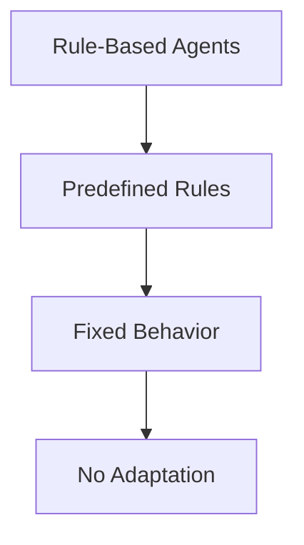
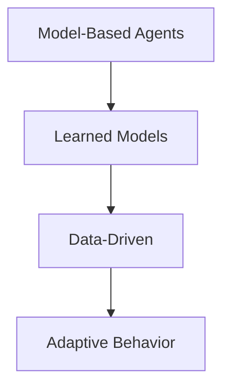
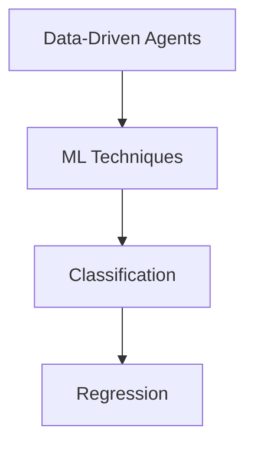
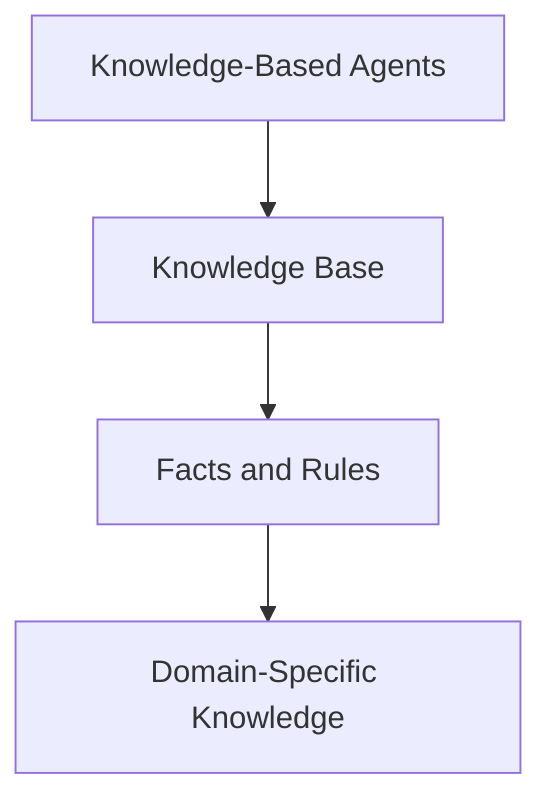
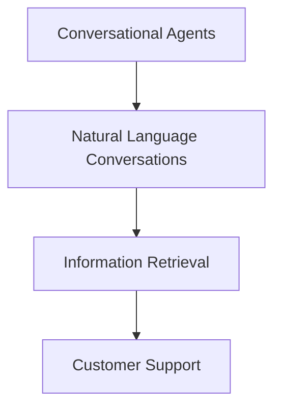
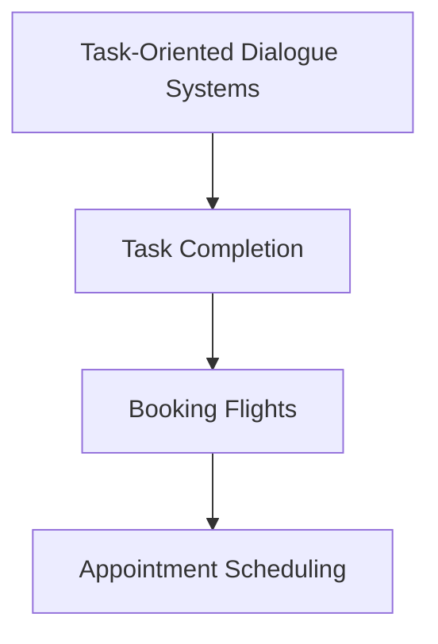
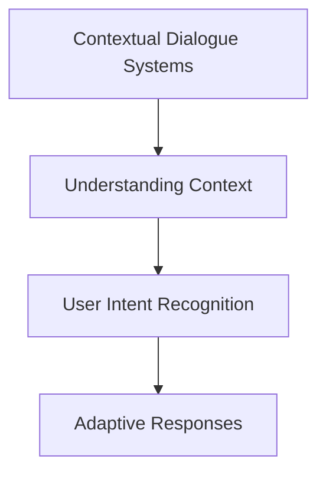
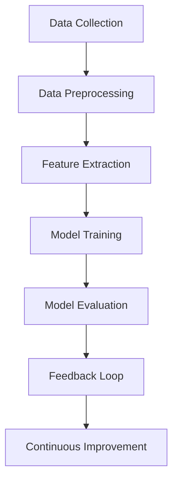
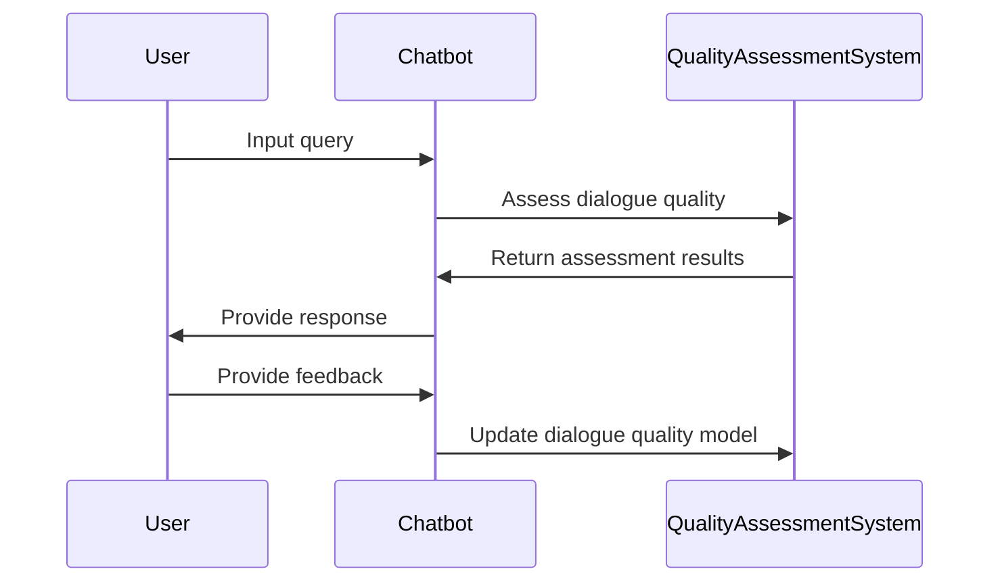

                 

### Introduction to "Development of AI Agent Dialogue Quality Assessment Index System"

> **Keywords**: AI Agent, Dialogue Quality Assessment, Metrics, Evaluation, Machine Learning, Natural Language Processing.

> **Abstract**: This book aims to provide a comprehensive guide to developing a robust dialogue quality assessment index system for AI agents. We will explore the fundamental concepts and background of AI and dialogue systems, delve into core assessment models, and offer practical tips for implementing effective evaluation metrics. The book targets developers, researchers, and practitioners in the field of AI and natural language processing, offering them a structured approach to improving the dialogue quality of AI agents.

### Fundamental Concepts and Background

#### 1. AI and Machine Learning Basics

##### 1.1 What is AI?

Artificial Intelligence (AI) refers to the simulation of human intelligence in machines that are programmed to think like humans and mimic their actions. The goal of AI is to develop systems that can perform tasks that would require human intelligence if done by a human.

##### 1.2 Machine Learning Fundamentals

Machine Learning (ML) is a subset of AI that focuses on the development of algorithms that can learn from and make predictions or decisions based on data. ML algorithms use statistical techniques to construct mathematical models based on sample data, and these models can be used to make predictions or decisions without being explicitly programmed to perform the task.

##### 1.3 Types of AI Agents

AI agents can be classified into several types based on their functionality and the way they interact with the environment. The main types include:

- **Rule-Based Agents**: These agents use a set of predefined rules to make decisions.
- **Model-Based Agents**: These agents use learned models to make decisions.
- **Data-Driven Agents**: These agents use data from past experiences to make decisions.
- **Knowledge-Based Agents**: These agents use a knowledge base of facts and rules to make decisions.

#### 2. Dialogue Systems

##### 2.1 Definition and Types

Dialogue systems are computer systems that interact with humans through a natural language interface. They can be classified into two main types:

- **Conversational Agents**: These agents can hold conversations with users through text or speech.
- **Task-oriented Dialogue Systems**: These systems focus on completing specific tasks, such as booking a flight or ordering food.

##### 2.2 Components of Dialogue Systems

Dialogue systems typically consist of several components, including:

- **Speech Recognition**: Converts spoken language into text.
- **Natural Language Understanding (NLU)**: Processes the text to understand the meaning behind the words.
- **Dialogue Management**: Determines the appropriate response to user input based on the current state of the dialogue.
- **Natural Language Generation (NLG)**: Generates human-like responses based on the understanding of the user input.

##### 2.3 Challenges in Dialogue Systems

Developing effective dialogue systems presents several challenges, including:

- **Natural Language Ambiguity**: Understanding the intended meaning behind user input can be difficult due to the ambiguity in natural language.
- **Contextual Understanding**: Dialogue systems must understand the context of the conversation to provide appropriate responses.
- **User Personalization**: Different users may have different preferences and expectations, making it challenging to create a system that is universally appealing.

#### 3. Quality Assessment in Dialogue Systems

##### 3.1 What is Quality Assessment?

Quality assessment in dialogue systems involves evaluating the effectiveness and user satisfaction of the dialogue system. This is important for identifying areas for improvement and ensuring that the system meets the needs of its users.

##### 3.2 Challenges in Dialogue Quality Assessment

Evaluating dialogue quality is challenging due to several factors, including:

- **Subjectivity**: Quality assessment often involves subjective judgments, which can be influenced by individual perspectives.
- **Scalability**: Manually evaluating large amounts of dialogue data can be time-consuming and impractical.
- **Variability**: Dialogue quality can vary greatly depending on the context, user, and task.

##### 3.3 Current Methods and Metrics

Several methods and metrics are used for dialogue quality assessment, including:

- **User Satisfaction Surveys**: Collecting feedback from users to measure their satisfaction with the dialogue system.
- **Conversational Scores**: Measuring the quality of dialogue based on metrics such as response time, relevance, and clarity.
- **Automated Evaluation Tools**: Using algorithms to evaluate dialogue quality based on features extracted from the dialogue data.

### Core Concepts and Models for Dialogue Quality Assessment

#### 4. Dialogue Act Analysis

##### 4.1 Dialogue Acts

Dialogue acts are the fundamental units of dialogue and represent the communicative functions performed by speakers. They can be categorized into different types, such as assertions, questions, commands, and requests.

##### 4.2 Dialogue Act Annotation

Dialogue act annotation involves labeling the dialogue acts in a given conversation. This process is essential for developing dialogue quality assessment models.

##### 4.3 Applications in Quality Assessment

Dialogue act analysis can be used to evaluate various aspects of dialogue quality, such as relevance, coherence, and politeness.

#### 5. Sentiment Analysis

##### 5.1 Sentiment and Emotion

Sentiment analysis involves identifying and classifying the sentiment expressed in a piece of text. This can help assess the emotional tone of the dialogue and its impact on user satisfaction.

##### 5.2 Sentiment Analysis Techniques

Sentiment analysis techniques can range from rule-based methods to advanced machine learning algorithms. These techniques can be applied to dialogue data to assess the sentiment of user inputs and system responses.

##### 5.3 Sentiment in Dialogue Quality

Sentiment analysis can be used to measure the emotional engagement of users in a dialogue and to identify areas where the dialogue system may need improvement.

#### 6. Conversational Behavior Analysis

##### 6.1 Conversational Flow

Conversational flow refers to the smoothness and coherence of the dialogue. Analyzing conversational flow can help identify issues such as disjointed responses or overly long conversations.

##### 6.2 Turn-taking Analysis

Turn-taking analysis involves studying the way participants in a dialogue take turns speaking. This can be used to evaluate the balance and efficiency of the dialogue.

##### 6.3 Naturalness and Politeness

Naturalness and politeness are important factors in evaluating dialogue quality. Analyzing the naturalness of dialogue can help ensure that the system's responses sound human-like, while politeness analysis can help identify instances of impolite or offensive language.

#### 7. Multimodal Dialogue Quality Assessment

##### 7.1 Multimodal Data

Multimodal dialogue systems combine multiple modalities, such as text, speech, and video, to enhance the user experience. Multimodal dialogue quality assessment involves evaluating the quality of dialogue across different modalities.

##### 7.2 Integrating Modalities

Integrating data from different modalities can provide a more comprehensive assessment of dialogue quality. Techniques such as multimodal fusion and joint modeling can be used to combine information from text, speech, and video to improve the accuracy of dialogue quality assessment.

### Implementing Dialogue Quality Assessment Metrics

#### 8. Designing Assessment Metrics

Designing effective dialogue quality assessment metrics involves identifying relevant factors and defining appropriate metrics to measure them. This section will provide guidance on how to design and select metrics for evaluating dialogue quality.

#### 9. Collecting and Preprocessing Dialogue Data

Collecting and preprocessing dialogue data is crucial for developing accurate dialogue quality assessment models. This section will cover techniques for collecting dialogue data, as well as methods for cleaning and preprocessing the data to ensure its quality and suitability for analysis.

#### 10. Developing and Training Assessment Models

Developing and training assessment models involves using machine learning algorithms to learn from dialogue data and identify patterns that indicate high or low dialogue quality. This section will discuss the process of developing and training assessment models, including the choice of algorithms and evaluation techniques.

#### 11. Evaluating and Optimizing Assessment Metrics

Evaluating and optimizing dialogue quality assessment metrics involves assessing the performance of the assessment models and making improvements as needed. This section will cover techniques for evaluating the performance of assessment metrics and methods for optimizing them to improve their accuracy and effectiveness.

### Real-world Applications of Dialogue Quality Assessment

#### 12. E-commerce Chatbots

E-commerce chatbots are an example of a real-world application where dialogue quality assessment is critical. This section will explore the use of dialogue quality assessment in evaluating the performance of e-commerce chatbots and the benefits of improving their dialogue quality.

#### 13. Customer Service Chatbots

Customer service chatbots are widely used by companies to provide automated customer support. This section will discuss the role of dialogue quality assessment in improving the effectiveness of customer service chatbots and enhancing the customer experience.

#### 14. Healthcare Chatbots

Healthcare chatbots are being developed to provide patients with personalized health information and support. This section will examine the use of dialogue quality assessment in evaluating the performance of healthcare chatbots and the impact of improving their dialogue quality on patient outcomes.

### Conclusion

In conclusion, the development of AI agent dialogue quality assessment index systems is a complex task that requires a comprehensive understanding of AI, dialogue systems, and quality assessment methodologies. This book has provided an overview of the key concepts, models, and techniques involved in dialogue quality assessment, as well as practical guidance for implementing and optimizing assessment metrics in real-world applications. By following the steps outlined in this book, developers and researchers can enhance the dialogue quality of AI agents and improve the overall user experience.### Chapter 1: Introduction to AI and Machine Learning Basics

In this chapter, we will delve into the fundamental concepts of Artificial Intelligence (AI) and Machine Learning (ML), laying the groundwork for understanding the subsequent chapters. We will begin by defining AI and exploring its various types and applications. Next, we will discuss the basics of ML, focusing on key concepts such as training data, models, and algorithms. Finally, we will examine the different types of AI agents and their roles in dialogue systems.

#### 1.1 What is AI?

Artificial Intelligence refers to the simulation of human intelligence in machines that are programmed to think like humans and mimic their actions. The goal of AI is to create systems that can perform tasks that would typically require human intelligence, such as visual perception, speech recognition, decision-making, and language translation.

AI can be classified into several types, including:

- **Narrow AI**: Also known as weak AI, narrow AI is designed to perform a specific task. Examples include voice assistants like Siri and Alexa and image recognition algorithms used in self-driving cars.
- **General AI**: Also known as strong AI, general AI possesses the ability to understand, learn, and apply knowledge across a wide range of tasks, similar to human intelligence. General AI does not yet exist and remains a topic of ongoing research.
- **Robotic Process Automation (RPA)**: RPA uses software robots to automate repetitive and rule-based business processes, mimicking human actions in digital systems.

#### 1.2 Machine Learning Fundamentals

Machine Learning (ML) is a subset of AI that focuses on the development of algorithms that can learn from and make predictions or decisions based on data. ML algorithms use statistical techniques to construct mathematical models based on sample data, and these models can be used to make predictions or decisions without being explicitly programmed to perform the task.

The key components of ML include:

- **Training Data**: The data used to train the ML model. This data should be representative of the problem domain and be used to teach the model how to make predictions.
- **Model**: The mathematical representation of the relationship between input data and output predictions. Models can be categorized as supervised, unsupervised, or reinforcement learning, depending on how they are trained and how they make predictions.
- **Algorithm**: The specific method used to train the model. Common ML algorithms include linear regression, decision trees, support vector machines, and neural networks.

#### 1.3 Types of AI Agents

AI agents can be classified based on their functionality and the way they interact with the environment. Here are some common types of AI agents:

- **Rule-Based Agents**: These agents use a set of predefined rules to make decisions. They are often used in simple scenarios where the decision-making process can be easily described using a set of rules.



- **Model-Based Agents**: These agents use learned models to make decisions. They are trained using historical data and can adapt their behavior based on new information.



- **Data-Driven Agents**: These agents make decisions based on data from their environment. They can use various ML techniques, such as classification and regression, to predict outcomes and make decisions.



- **Knowledge-Based Agents**: These agents use a knowledge base of facts and rules to make decisions. They are often used in complex scenarios where the decision-making process requires a deep understanding of the domain.



#### 1.4 Applications of AI Agents in Dialogue Systems

AI agents play a crucial role in dialogue systems, enhancing their capabilities and improving user experience. Here are some examples of how AI agents can be applied in dialogue systems:

- **Conversational Agents**: These agents engage in natural language conversations with users, providing information, assistance, and entertainment. Examples include chatbots, virtual assistants, and voice-controlled devices.



- **Task-Oriented Dialogue Systems**: These systems are designed to perform specific tasks, such as booking flights, scheduling appointments, or managing finances. They are often integrated into existing applications or platforms.



- **Contextual Dialogue Systems**: These systems understand the context of the conversation and can adapt their responses accordingly. They are particularly useful in scenarios where the dialogue needs to be dynamic and responsive to user inputs.



By understanding the basics of AI and ML and the various types of AI agents, we can better appreciate the potential of AI in dialogue systems and the importance of dialogue quality assessment in ensuring their success. In the following chapters, we will explore the core concepts and models for dialogue quality assessment, providing a comprehensive guide for developing effective evaluation metrics.### Chapter 2: Dialogue Systems

Dialogue systems are computer systems that enable interaction between humans and machines through a natural language interface. These systems are designed to understand, interpret, and generate natural language text or speech, facilitating communication and providing information or assistance to users. In this chapter, we will delve into the definition and types of dialogue systems, discuss their main components, and explore the challenges faced in developing these systems.

#### 2.1 Definition and Types of Dialogue Systems

Dialogue systems can be broadly categorized into two types: conversational agents and task-oriented dialogue systems.

**Conversational Agents**

Conversational agents, also known as chatbots, are designed to engage in natural language conversations with users. They can understand and respond to user inputs, providing information, answering questions, or offering support. Examples of conversational agents include virtual assistants like Siri, Alexa, and Google Assistant, as well as chatbots used in customer service, entertainment, and social media platforms.

**Task-Oriented Dialogue Systems**

Task-oriented dialogue systems are designed to perform specific tasks or actions based on user inputs. These systems are typically integrated into existing applications or platforms, aiming to automate processes and improve efficiency. Examples of task-oriented dialogue systems include online customer service chatbots, booking systems for flights or hotels, and virtual tutors in educational settings.

#### 2.2 Components of Dialogue Systems

Dialogue systems comprise several key components that work together to enable natural language interaction. These components include:

**Speech Recognition**

Speech recognition is the process of converting spoken words into text. It involves recognizing the sounds in spoken words and converting them into a sequence of characters. This component is essential for dialogue systems that interact with users through voice input.

**Natural Language Understanding (NLU)**

Natural Language Understanding (NLU) is the process of interpreting and understanding the meaning behind the text or speech input from users. NLU involves analyzing the structure of the input, identifying entities and intents, and extracting relevant information. NLU is crucial for understanding user queries and determining the appropriate response.

**Dialogue Management**

Dialogue management is responsible for managing the conversation flow between the user and the dialogue system. It involves determining the next action based on the current state of the dialogue, including understanding the user's intent, context, and maintaining the conversation's coherence. Dialogue management ensures that the dialogue system responds appropriately and maintains a smooth and natural conversation.

**Natural Language Generation (NLG)**

Natural Language Generation (NLG) is the process of generating human-like text or speech from machine-readable data or information. NLG converts the output of the dialogue system into a natural and coherent form that is easily understandable by humans. This component is essential for creating responses that are both informative and engaging.

**User Interface**

The user interface is the medium through which users interact with the dialogue system. It can be a chat window, a voice interface, or a combination of both. The user interface should be intuitive and user-friendly, allowing users to easily input their queries and receive appropriate responses.

#### 2.3 Challenges in Dialogue Systems

Developing effective dialogue systems presents several challenges, which include:

**Natural Language Ambiguity**

Natural language is inherently ambiguous, and it can be challenging for dialogue systems to accurately interpret user inputs. Users may use multiple meanings for words, phrases, or even entire sentences, leading to misinterpretations and incorrect responses. Dealing with natural language ambiguity requires advanced language processing techniques and a deep understanding of context.

**Contextual Understanding**

Dialogue systems must understand the context of the conversation to provide appropriate responses. Context includes the user's intentions, previous interactions, and the overall conversation history. Maintaining context and ensuring that responses are relevant and coherent is a significant challenge in dialogue system development.

**User Personalization**

Different users have different preferences, expectations, and communication styles. Personalizing the dialogue system to cater to individual users can be challenging. User personalization involves adjusting the system's responses based on user profiles, past interactions, and preferences, which requires collecting and analyzing user data.

**Conversational Flow**

Ensuring smooth and natural conversational flow is critical for user satisfaction. Dialogue systems should be able to handle conversational nuances, such as turn-taking, maintaining focus, and adapting to changes in topic. Achieving seamless conversational flow requires sophisticated dialogue management algorithms and a deep understanding of language.

**Scalability and Performance**

Dialogue systems must be scalable and performant, capable of handling a large volume of concurrent interactions without degradation in performance. This requires efficient architecture and optimization techniques to ensure that the system can handle increased load and provide timely responses.

In conclusion, dialogue systems are complex systems that require a combination of natural language processing, machine learning, and software engineering skills to develop effectively. Understanding the components, types, and challenges of dialogue systems is crucial for designing and implementing successful dialogue systems that can enhance user experiences and improve efficiency in various applications. In the following chapters, we will explore the various quality assessment metrics and techniques used to evaluate dialogue systems.### 3. Quality Assessment in Dialogue Systems

Quality assessment in dialogue systems is crucial for ensuring that the interactions between users and AI agents are meaningful, efficient, and satisfying. The primary goal of quality assessment is to evaluate the effectiveness of dialogue systems in understanding user inputs, providing relevant responses, and maintaining a coherent conversation. This chapter will discuss the concept of quality assessment, the challenges involved in its evaluation, and the current methods and metrics used in the field.

#### 3.1 What is Quality Assessment?

Quality assessment in dialogue systems involves evaluating various aspects of the dialogue to determine its effectiveness and user satisfaction. The main objectives of quality assessment are to:

- Ensure that the dialogue system accurately understands user inputs and generates appropriate responses.
- Maintain a natural and coherent conversation flow.
- Enhance user satisfaction and engagement.

Quality assessment covers several dimensions, including:

- **Relevance**: The degree to which the system's responses are relevant to the user's input and the context of the conversation.
- **Clarity**: The clarity and coherence of the system's responses, ensuring that they are easily understandable by the user.
- **Completeness**: The extent to which the system provides all the necessary information or actions to fulfill the user's intent.
- **Politeness**: The degree to which the system's responses are polite, considerate, and respectful.
- **Efficiency**: The speed and effectiveness with which the system processes user inputs and generates responses.

#### 3.2 Challenges in Dialogue Quality Assessment

Evaluating dialogue quality in dialogue systems is a complex task due to several challenges:

**Subjectivity**

Quality assessment often involves subjective judgments, as different users may have different expectations and preferences regarding the dialogue system's performance. This subjectivity can make it difficult to establish consistent and reliable evaluation criteria.

**Scalability**

Manually evaluating large amounts of dialogue data can be time-consuming and impractical. Therefore, developing automated evaluation methods and metrics that can scale effectively is crucial for evaluating dialogue quality in real-world applications.

**Variability**

Dialogue quality can vary significantly depending on the context, user, and task. This variability makes it challenging to design metrics that can capture all aspects of dialogue quality consistently.

**Ambiguity**

Natural language is inherently ambiguous, making it difficult for dialogue systems to accurately interpret user inputs. This ambiguity can affect the relevance, clarity, and completeness of the system's responses.

**Multimodality**

Many dialogue systems now incorporate multiple modalities, such as text, speech, and video. Evaluating the quality of multimodal dialogue systems is more complex than evaluating monomodal systems, as it requires considering the integration and interaction of different modalities.

#### 3.3 Current Methods and Metrics for Dialogue Quality Assessment

Several methods and metrics are used to evaluate dialogue quality in dialogue systems. Here are some of the most common ones:

**User Satisfaction Surveys**

User satisfaction surveys involve collecting feedback from users to assess their satisfaction with the dialogue system. These surveys can include questions about the relevance, clarity, and politeness of the system's responses, as well as overall user satisfaction. While user satisfaction surveys provide valuable insights into user experiences, they can be subjective and may not capture all aspects of dialogue quality.

**Conversational Scores**

Conversational scores are quantitative measures of dialogue quality that assess various aspects of the conversation, such as relevance, clarity, and completeness. These scores are often calculated based on predefined criteria or metrics, and they can be used to compare the performance of different dialogue systems. Examples of conversational scores include the Dale-Chall readability formula and the Gunning Fog Index.

**Automated Evaluation Tools**

Automated evaluation tools use algorithms to evaluate dialogue quality based on features extracted from the dialogue data. These tools can be used to assess dialogue quality on a large scale and provide objective, quantitative measurements. Some common automated evaluation tools include:

- **Dialogue Act Analysis**: Analyzing dialogue acts to evaluate the relevance and coherence of the conversation.
- **Sentiment Analysis**: Assessing the sentiment expressed in the dialogue to evaluate user satisfaction and engagement.
- **Conversational Flow Analysis**: Analyzing the structure and flow of the dialogue to evaluate its naturalness and coherence.

**Multimodal Evaluation Metrics**

For dialogue systems that incorporate multiple modalities, multimodal evaluation metrics are used to assess the quality of the integrated dialogue. These metrics consider the interaction and integration of different modalities, such as text, speech, and video. Examples of multimodal evaluation metrics include:

- **Fusion Scores**: Combining scores from different modalities to evaluate the overall dialogue quality.
- **Coherence Scores**: Assessing the coherence and consistency of the dialogue across different modalities.

In conclusion, quality assessment in dialogue systems is a complex and multifaceted task that requires a combination of subjective and objective methods and metrics. By addressing the challenges in dialogue quality assessment and leveraging the various evaluation methods and metrics available, developers and researchers can improve the effectiveness and user satisfaction of dialogue systems. In the following chapters, we will delve deeper into the core concepts and models for dialogue quality assessment, providing a comprehensive guide for developing and implementing effective evaluation frameworks.### Core Concepts and Models for Dialogue Quality Assessment

In this chapter, we will explore the core concepts and models that form the foundation for evaluating dialogue quality in AI agents. We will discuss three key areas: Dialogue Act Analysis, Sentiment Analysis, and Conversational Behavior Analysis. These concepts and models provide a structured approach to understanding and assessing dialogue quality, enabling developers to design and implement effective evaluation systems.

#### 4. Dialogue Act Analysis

Dialogue Act Analysis (DAA) is a fundamental approach to analyzing dialogue by identifying and categorizing the communicative functions performed by speakers. Dialogue acts represent the intentions behind the utterances in a conversation and can be categorized into various types based on their functions. Some common types of dialogue acts include:

- **Declarations**: Utterances that assert a fact or provide information, such as "The sky is blue."
- **Questions**: Utterances that seek information, such as "What time is it?"
- **Requests**: Utterances that make a request, such as "Can you pass the salt?"
- **Apologies**: Utterances that express regret or apologize, such as "I'm sorry for the inconvenience."
- **Compliments**: Utterances that express approval or praise, such as "Great job!"

**4.1 Dialogue Act Annotation**

Dialogue act annotation involves labeling the dialogue acts in a given conversation. This process is essential for developing dialogue quality assessment models as it provides a structured way to analyze and evaluate the conversation. The annotation process typically involves the following steps:

1. **Preparation**: Collect a corpus of dialogue data for annotation. The data should be representative of the target domain and context.
2. **Annotation Guidelines**: Develop clear guidelines for annotators to follow, specifying the types of dialogue acts and the criteria for their identification.
3. **Annotation**: Annotators label the dialogue acts in the conversation based on the guidelines. This may involve using predefined categories or creating new ones as needed.
4. **Quality Assurance**: Review the annotations to ensure consistency and accuracy. This may involve manual review or the use of automated tools.

**4.2 Applications in Quality Assessment**

Dialogue Act Analysis can be used to evaluate various aspects of dialogue quality, including relevance, coherence, and politeness. For example:

- **Relevance**: Evaluating the degree to which the system's responses match the user's intentions or the topic of the conversation.
- **Coherence**: Assessing the logical flow and consistency of the dialogue, ensuring that the system's responses are contextually appropriate.
- **Politeness**: Analyzing the politeness level of the dialogue, identifying instances of impolite or inappropriate language.

**4.3 Example: Dialogue Act Annotation with Mermaid ER Diagram**

Below is an example of a Mermaid ER diagram that represents the entities and relationships in a simple dialogue act annotation process:

```mermaid
erDiagram
  DialogueActAnnotation <-|> Dialogue
  DialogueActAnnotation o-- DialogueActType
  DialogueActAnnotation o-- Annotator
```

In this diagram, `DialogueActAnnotation` represents the annotation instances, `Dialogue` represents the conversations being annotated, `DialogueActType` represents the different types of dialogue acts, and `Annotator` represents the individuals performing the annotation.

#### 5. Sentiment Analysis

Sentiment Analysis, also known as opinion mining, is the process of identifying and extracting subjective information from source materials, such as text or speech. The goal of sentiment analysis is to determine the sentiment expressed in a piece of text, which can be positive, negative, or neutral. This information is valuable for understanding user satisfaction, engagement, and emotional responses in dialogue systems.

**5.1 Sentiment and Emotion**

Sentiment and emotion are closely related but distinct concepts. Sentiment refers to the subjective evaluation of a piece of text, while emotion refers to the psychological state experienced by an individual. In the context of dialogue systems, sentiment analysis helps assess the emotional tone of the dialogue, providing insights into user satisfaction and engagement.

**5.2 Sentiment Analysis Techniques**

There are several techniques for performing sentiment analysis, ranging from rule-based methods to advanced machine learning algorithms. Some common techniques include:

- **Rule-Based Methods**: These methods involve defining a set of rules or patterns to identify sentiment. For example, identifying positive or negative words and phrases based on a predefined list.
- **Machine Learning Models**: These models use statistical techniques to classify text into sentiment categories. Common models include Naive Bayes, Support Vector Machines (SVM), and Neural Networks.
- **Deep Learning Models**: These models, such as Recurrent Neural Networks (RNNs) and Transformer models, have shown great success in sentiment analysis. They can capture complex patterns and relationships in the text data.

**5.3 Sentiment in Dialogue Quality Assessment**

Sentiment analysis can be used to measure the emotional engagement of users in a dialogue and to identify areas where the dialogue system may need improvement. For example:

- **User Satisfaction**: Assessing the sentiment of user feedback or reviews to understand their satisfaction with the dialogue system.
- **Emotional Engagement**: Analyzing the sentiment of user inputs to determine the level of emotional engagement in the conversation.
- **Personalization**: Using sentiment analysis to personalize the dialogue system's responses based on the user's emotional state.

**5.4 Example: Sentiment Analysis with Mermaid ER Diagram**

Below is an example of a Mermaid ER diagram that represents the entities and relationships in a sentiment analysis process:

```mermaid
erDiagram
  SentimentAnalysis <-|> TextData
  SentimentAnalysis o-- SentimentLabel
  SentimentAnalysis o-- Model
```

In this diagram, `SentimentAnalysis` represents the sentiment analysis process, `TextData` represents the text data being analyzed, `SentimentLabel` represents the sentiment categories (positive, negative, neutral), and `Model` represents the sentiment analysis model used.

#### 6. Conversational Behavior Analysis

Conversational Behavior Analysis focuses on studying the patterns and characteristics of dialogue, aiming to identify factors that contribute to effective and natural conversations. This analysis includes the examination of conversational flow, turn-taking, and politeness.

**6.1 Conversational Flow**

Conversational flow refers to the smoothness and coherence of the dialogue. Analyzing conversational flow helps assess whether the dialogue system can maintain a natural conversation and provide contextually appropriate responses. Some key aspects of conversational flow include:

- **Continuity**: Ensuring that the dialogue system can seamlessly transition between different topics and maintain the context of the conversation.
- **Relevance**: Ensuring that the system's responses are relevant to the user's input and the ongoing conversation.
- **Conciseness**: Ensuring that the dialogue system provides responses that are concise and to the point, avoiding unnecessary information.

**6.2 Turn-Taking Analysis**

Turn-taking analysis involves studying the way participants in a dialogue take turns speaking. This analysis helps assess the balance and efficiency of the dialogue, ensuring that the conversation is fair and that both parties have an opportunity to contribute. Some key aspects of turn-taking analysis include:

- **Balance**: Assessing whether the dialogue system and user take turns evenly, ensuring that neither party dominates the conversation.
- **Efficiency**: Assessing whether the dialogue system can efficiently manage the conversation flow, ensuring that responses are timely and relevant.

**6.3 Naturalness and Politeness**

Naturalness and politeness are important factors in evaluating dialogue quality. Naturalness refers to the degree to which the dialogue system's responses sound human-like and natural, while politeness refers to the degree to which the dialogue system's responses are considerate and respectful. Some key aspects of naturalness and politeness include:

- **Naturalness**: Ensuring that the dialogue system's responses are grammatically correct, use appropriate vocabulary, and reflect the conventions of natural language.
- **Politeness**: Identifying instances of impolite or offensive language and ensuring that the dialogue system's responses are polite and respectful.

**6.4 Example: Conversational Behavior Analysis with Mermaid ER Diagram**

Below is an example of a Mermaid ER diagram that represents the entities and relationships in a conversational behavior analysis process:

```mermaid
erDiagram
  ConversationalBehaviorAnalysis <-|> Dialogue
  ConversationalBehaviorAnalysis o-- TurnTakingPattern
  ConversationalBehaviorAnalysis o-- ConversationalFlow
  ConversationalBehaviorAnalysis o-- PolitenessLevel
```

In this diagram, `ConversationalBehaviorAnalysis` represents the analysis process, `Dialogue` represents the conversations being analyzed, `TurnTakingPattern` represents the patterns of turn-taking in the conversation, `ConversationalFlow` represents the conversational flow, and `PolitenessLevel` represents the level of politeness in the dialogue.

In conclusion, the core concepts and models of Dialogue Act Analysis, Sentiment Analysis, and Conversational Behavior Analysis provide a comprehensive framework for evaluating dialogue quality in AI agents. By applying these concepts and models, developers and researchers can develop effective evaluation systems that enhance the overall performance and user satisfaction of dialogue systems. In the following chapters, we will delve deeper into the implementation of these concepts, providing practical guidance and case studies to illustrate their application.### 7. Multimodal Dialogue Quality Assessment

Multimodal dialogue systems combine multiple modalities, such as text, speech, and video, to enhance the user experience and improve dialogue quality. These systems leverage the strengths of different modalities to provide more comprehensive and context-aware interactions. In this chapter, we will explore the concept of multimodal dialogue systems, the integration of different modalities, and the challenges and techniques involved in evaluating their quality.

#### 7.1 Multimodal Data

Multimodal dialogue systems process data from multiple sources simultaneously, allowing them to capture richer information about the user's intent, context, and emotional state. The main types of multimodal data include:

- **Text**: Text data is typically obtained through user inputs, such as chat messages or text transcriptions of spoken dialogue.
- **Speech**: Speech data is recorded through microphones and involves converting spoken words into text using speech recognition technology.
- **Video**: Video data includes visual information captured through cameras, which can be used to analyze facial expressions, gestures, and other visual cues.
- **Sensor Data**: Sensor data from devices such as accelerometers, gyroscopes, and GPS can provide additional context about the user's environment and activity.

**7.2 Integrating Modalities**

Integrating data from different modalities is a complex task that requires combining information from text, speech, and video to generate a coherent and context-aware understanding of the dialogue. The integration process involves several steps:

1. **Data Preprocessing**: Each modality requires specific preprocessing steps to prepare the data for analysis. For example, text data may need to be tokenized and normalized, while speech data may need to be transcribed and segmented into meaningful units.
2. **Feature Extraction**: Features are extracted from each modality to represent the information content of the data. For text, features may include word frequencies, n-grams, and syntactic patterns. For speech, features may include phoneme sequences and prosody (intonations and rhythms). For video, features may include facial landmarks, gestures, and visual content.
3. **Modal Fusion**: The extracted features from different modalities are fused to create a unified representation of the dialogue. This can be achieved through various techniques, such as concatenation, averaging, or more complex methods like neural networks that can handle combined modalities.
4. **Dialogue Modeling**: Once the features are fused, a dialogue model is trained to generate responses based on the integrated multimodal information. This model should be capable of understanding and generating responses that consider the context and content from all modalities.

**7.3 Challenges in Multimodal Dialogue Quality Assessment**

Evaluating the quality of multimodal dialogue systems presents several challenges:

**Data Variety and Complexity**

Multimodal dialogue systems handle a wide variety of data types, including text, speech, and video. This diversity makes it challenging to develop a unified evaluation framework that can effectively assess the quality of the dialogue across different modalities.

**Ambiguity and Inconsistency**

Multimodal data can be ambiguous and inconsistent, especially when dealing with noisy or incomplete data. For example, speech recognition errors can lead to inaccurate transcriptions, and visual data may be affected by lighting conditions or camera quality.

**Intermodality Synchronization**

Ensuring synchronization between different modalities is crucial for evaluating the quality of the dialogue. However, aligning text, speech, and video data can be challenging, as they may have different durations and timing requirements.

**Subjectivity and Diversity**

Quality assessment in multimodal dialogue systems often involves subjective judgments, as different users may have different expectations and preferences. Additionally, cultural and linguistic diversity can affect the evaluation process, making it difficult to establish a universal set of evaluation criteria.

**7.4 Techniques for Multimodal Dialogue Quality Assessment**

Several techniques and metrics are used to evaluate the quality of multimodal dialogue systems. Here are some common methods:

**Multimodal Fusion Scores**

Multimodal fusion scores combine the scores or metrics from different modalities to evaluate the overall dialogue quality. For example, if we have text, speech, and video modalities, we can compute a combined score by averaging the scores from each modality or using a more complex weighting scheme.

**Coherence and Consistency Metrics**

Coherence and consistency metrics assess the logical flow and alignment of the dialogue across different modalities. These metrics evaluate whether the content and context of the dialogue are consistent and coherent across text, speech, and video.

**Sentiment and Emotion Analysis**

Sentiment and emotion analysis can be applied to each modality to assess the emotional tone and engagement of the user in the dialogue. These analyses can help identify areas where the dialogue system may need improvement, such as in maintaining emotional engagement or providing appropriate emotional responses.

**Multimodal Dialogue Scores**

Multimodal dialogue scores are quantitative measures that evaluate the overall quality of the dialogue system's responses, considering the integrated information from multiple modalities. These scores can be calculated based on predefined criteria or metrics that assess relevance, clarity, and completeness.

**7.5 Example: Multimodal Dialogue Quality Assessment with Mermaid ER Diagram**

Below is an example of a Mermaid ER diagram that represents the entities and relationships in a multimodal dialogue quality assessment process:

```mermaid
erDiagram
  MultimodalQualityAssessment <-|> TextModality
  MultimodalQualityAssessment <-|> SpeechModality
  MultimodalQualityAssessment <-|> VideoModality
  MultimodalQualityAssessment o-- FusionScore
  MultimodalQualityAssessment o-- CoherenceScore
  MultimodalQualityAssessment o-- SentimentScore
```

In this diagram, `MultimodalQualityAssessment` represents the overall assessment process, `TextModality`, `SpeechModality`, and `VideoModality` represent the different modalities being evaluated, `FusionScore` represents the combined score from all modalities, `CoherenceScore` represents the coherence and consistency metrics, and `SentimentScore` represents the sentiment and emotion analysis results.

In conclusion, multimodal dialogue quality assessment is a complex and multifaceted task that requires integrating information from multiple modalities and developing a comprehensive evaluation framework. By addressing the challenges and leveraging the techniques discussed in this chapter, developers and researchers can improve the quality and effectiveness of multimodal dialogue systems, enhancing the overall user experience.### Chapter 8: Designing Dialogue Quality Assessment Metrics

Designing effective dialogue quality assessment metrics is a critical step in ensuring that AI agents can engage in meaningful and satisfying conversations with users. In this chapter, we will discuss the process of designing assessment metrics, including identifying relevant factors, selecting appropriate metrics, and defining the criteria for evaluation. We will also explore the importance of human-in-the-loop evaluation and the role of continuous improvement in enhancing dialogue quality.

#### 8.1 Identifying Relevant Factors

The first step in designing dialogue quality assessment metrics is to identify the relevant factors that contribute to the overall quality of the dialogue. These factors can vary depending on the specific application and context, but some common factors to consider include:

- **Relevance**: How well the system's responses align with the user's intent or the topic of the conversation.
- **Clarity**: The clarity and coherence of the system's responses, ensuring that they are easily understandable by the user.
- **Completeness**: The extent to which the system provides all the necessary information or actions to fulfill the user's intent.
- **Politeness**: The degree to which the system's responses are polite, considerate, and respectful.
- **Efficiency**: The speed and effectiveness with which the system processes user inputs and generates responses.
- **User Engagement**: The level of user satisfaction and engagement in the conversation, as indicated by user feedback or behavioral data.
- **Naturalness**: The degree to which the system's responses sound natural and human-like, reflecting the conventions of natural language.

**8.2 Selecting Appropriate Metrics**

Once the relevant factors have been identified, the next step is to select appropriate metrics for evaluating each factor. The choice of metrics will depend on the specific requirements and goals of the dialogue system. Here are some common metrics used in dialogue quality assessment:

- **Relevance Metrics**: Metrics such as response relevance, topic coherence, and information coverage can be used to evaluate how well the system's responses align with the user's intent or the topic of the conversation.
- **Clarity Metrics**: Metrics such as sentence simplicity, grammatical correctness, and lexical diversity can be used to assess the clarity and coherence of the system's responses.
- **Completeness Metrics**: Metrics such as information gap analysis and task completion rate can be used to evaluate whether the system provides all the necessary information or actions to fulfill the user's intent.
- **Politeness Metrics**: Metrics such as politeness level, use of positive language, and absence of offensive language can be used to assess the politeness of the system's responses.
- **Efficiency Metrics**: Metrics such as response time, dialogue length, and resource usage can be used to evaluate the speed and effectiveness of the system's responses.
- **User Engagement Metrics**: Metrics such as user satisfaction, user retention, and engagement rate can be used to assess the level of user satisfaction and engagement in the conversation.
- **Naturalness Metrics**: Metrics such as lexical diversity, syntactic complexity, and semantic coherence can be used to evaluate the naturalness of the system's responses.

**8.3 Defining Evaluation Criteria

Defining the evaluation criteria is an essential step in ensuring that the dialogue quality assessment metrics are fair, consistent, and reliable. The evaluation criteria should clearly outline the standards against which the dialogue system's responses will be assessed. Here are some considerations for defining evaluation criteria:

- **Objectivity**: The evaluation criteria should be objective, avoiding subjective biases and ensuring that the assessment is fair and consistent.
- **Clarity**: The evaluation criteria should be clearly defined and easy to understand, allowing both human evaluators and automated systems to assess the dialogue quality accurately.
- **Completeness**: The evaluation criteria should cover all relevant aspects of dialogue quality, ensuring that no important factors are overlooked.
- **Scalability**: The evaluation criteria should be scalable, allowing for the evaluation of dialogue systems of different sizes and complexities.

**8.4 Human-in-the-Loop Evaluation

Human-in-the-loop evaluation involves involving human evaluators in the dialogue quality assessment process. This approach has several advantages:

- **Subjective Insights**: Human evaluators can provide subjective insights and interpretations that may not be captured by automated metrics, ensuring a more comprehensive evaluation of dialogue quality.
- **Contextual Understanding**: Human evaluators can better understand the context and nuances of the conversation, providing more accurate assessments of relevance, clarity, and politeness.
- **Validation**: Human-in-the-loop evaluation can validate and verify the results of automated metrics, ensuring that the evaluation is accurate and reliable.

However, human-in-the-loop evaluation also has its challenges, such as:

- **Subjectivity**: Human evaluators may have different perspectives and interpretations, leading to inconsistencies in the evaluation results.
- **Scalability**: Human-in-the-loop evaluation can be time-consuming and impractical for large-scale assessments.

**8.5 Continuous Improvement

Continuous improvement is essential for enhancing dialogue quality assessment metrics over time. This involves regularly updating and refining the metrics, evaluation criteria, and evaluation process based on user feedback, technological advancements, and new research findings. Some strategies for continuous improvement include:

- **User Feedback**: Collecting and analyzing user feedback to identify areas for improvement and incorporating user suggestions into the dialogue system.
- **Technological Advances**: Leveraging new technologies and methodologies, such as machine learning and natural language processing, to improve the accuracy and effectiveness of dialogue quality assessment.
- **Research and Innovation**: Encouraging research and innovation in dialogue quality assessment to develop new metrics, techniques, and tools for evaluating dialogue systems.

**8.6 Example: Designing Dialogue Quality Assessment Metrics

Let's consider an example of designing dialogue quality assessment metrics for a customer service chatbot. We will focus on three key factors: relevance, clarity, and politeness.

**Relevance Metrics**

- **Response Relevance**: Evaluate how well the chatbot's responses align with the user's intent or the topic of the conversation. This can be measured using metrics such as the percentage of relevant responses and the number of topic switches.
- **Information Coverage**: Evaluate how well the chatbot covers all necessary information to resolve the user's query. This can be measured using metrics such as the number of questions answered and the percentage of information gaps.

**Clarity Metrics**

- **Sentence Simplicity**: Evaluate the simplicity of the chatbot's responses using metrics such as the average sentence length and the use of complex sentence structures.
- **Grammatical Correctness**: Evaluate the grammatical correctness of the chatbot's responses using metrics such as the percentage of grammatical errors and the use of proper punctuation.

**Politeness Metrics**

- **Politeness Level**: Evaluate the politeness level of the chatbot's responses using metrics such as the use of positive language, the absence of negative language, and the number of polite phrases.
- **Respectful Language**: Evaluate the respectfulness of the chatbot's responses using metrics such as the use of offensive language and the number of instances of impolite behavior.

**Evaluation Criteria**

- **Objectivity**: All metrics should be objective and based on quantifiable data, avoiding subjective biases.
- **Clarity**: All metrics and evaluation criteria should be clearly defined and easy to understand.
- **Completeness**: All relevant aspects of dialogue quality, including relevance, clarity, and politeness, should be covered.
- **Scalability**: The evaluation process should be scalable and applicable to chatbots of different sizes and complexities.

By following these steps and considerations, developers and researchers can design effective dialogue quality assessment metrics that enhance the overall performance and user satisfaction of AI agents.

In conclusion, designing dialogue quality assessment metrics is a complex and iterative process that requires a thorough understanding of the relevant factors, appropriate metrics, and evaluation criteria. By involving human evaluators and continuously improving the assessment process, developers and researchers can enhance the dialogue quality of AI agents and provide a more satisfying user experience.### Chapter 9: Collecting and Preprocessing Dialogue Data

Collecting and preprocessing dialogue data is a crucial step in developing effective dialogue quality assessment metrics. High-quality dialogue data is essential for training and evaluating models that will be used to assess the quality of AI agent interactions. In this chapter, we will discuss the techniques for collecting dialogue data, the challenges associated with data collection, and the methods for preprocessing dialogue data to ensure its quality and suitability for analysis.

#### 9.1 Techniques for Collecting Dialogue Data

There are several techniques for collecting dialogue data, each with its advantages and limitations. The choice of data collection method depends on the specific application and goals of the dialogue system.

**1. User Surveys and Feedback Forms**

One common method for collecting dialogue data is through user surveys and feedback forms. These can be distributed online or through other digital platforms to gather feedback from users who have interacted with the dialogue system. Surveys and feedback forms can include questions about the relevance, clarity, politeness, and overall satisfaction with the dialogue system's responses.

**Pros:**
- Cost-effective and easy to implement.
- Can gather detailed feedback from a large number of users.

**Cons:**
- User engagement can be low.
- Responses may be biased or incomplete.

**2. Conversational Exchanges**

Collecting conversational exchanges involves recording actual interactions between users and the dialogue system. This can be done through chat logs, voice recordings, or video recordings. Conversational exchanges provide raw data that can be used to analyze the dialogue quality in detail.

**Pros:**
- Provides rich, authentic data.
- Can capture the nuances of the interaction.

**Cons:**
- Can be time-consuming and resource-intensive.
- Users may feel uncomfortable with being recorded.

**3. Simulated Dialogue Systems**

Simulated dialogue systems involve creating virtual conversations with predefined user inputs and system responses. This technique is useful for generating large amounts of dialogue data under controlled conditions.

**Pros:**
- Can generate a large volume of data quickly.
- Allows for controlled experiments and analysis.

**Cons:**
- May not reflect real-world interactions accurately.
- Can be difficult to create realistic user inputs.

**4. Public Dialogue Datasets**

Public dialogue datasets are collections of conversational data that are available for research and analysis. These datasets can be sourced from various platforms, such as social media, forums, and public chat rooms.

**Pros:**
- Provides a wide range of real-world dialogue examples.
- Can be used for benchmarking and comparison.

**Cons:**
- May contain noise and irrelevant content.
- Data privacy and ethical considerations.

#### 9.2 Challenges in Data Collection

Collecting high-quality dialogue data presents several challenges:

**1. Data Volume**

Dialogue systems generate a large amount of data, which can be difficult to manage and analyze. Collecting and storing large datasets require significant computational resources and storage.

**2. Data Diversity**

Dialogue data is highly diverse, with different users having unique communication styles, preferences, and expectations. Capturing this diversity in the collected data is crucial for developing robust dialogue quality assessment models.

**3. Data Quality**

Data quality is a significant concern in dialogue data collection. Incomplete, noisy, or inconsistent data can affect the accuracy and effectiveness of the dialogue quality assessment models. Ensuring data quality requires rigorous data cleaning and preprocessing.

**4. Data Privacy**

Collecting dialogue data may raise privacy concerns, especially if the data includes personal information or sensitive conversations. Compliance with data privacy regulations and ethical considerations is essential when collecting and storing dialogue data.

#### 9.3 Methods for Preprocessing Dialogue Data

Preprocessing dialogue data is a critical step in preparing the data for analysis. The main objectives of preprocessing are to clean the data, remove noise, and extract relevant information. Here are some common preprocessing methods:

**1. Data Cleaning**

Data cleaning involves removing or correcting errors, inconsistencies, and noise in the dialogue data. Common cleaning techniques include:

- **Tokenization**: Splitting the dialogue text into individual words or tokens.
- **Normalization**: Converting the dialogue text to a standard format, such as lowercasing or removing punctuation.
- **Spell Checking**: Correcting misspelled words or typos in the dialogue text.
- **De-noising**: Removing irrelevant or noisy information from the dialogue data.

**2. Data Imputation**

Data imputation involves replacing missing or incomplete data with estimated values. This is particularly useful when dealing with datasets that contain gaps or incomplete conversations.

**3. Feature Extraction**

Feature extraction involves extracting relevant features from the dialogue data that can be used to train dialogue quality assessment models. Common features include:

- **Lexical Features**: Such as word frequency, n-grams, and word embeddings.
- **Syntactic Features**: Such as part-of-speech tags, syntactic dependencies, and sentence structure.
- **Sentiment Features**: Sentiment scores or sentiment labels extracted from the dialogue text.
- **Dialogue Act Features**: Dialogue acts extracted from the dialogue text.

**4. Data Transformation**

Data transformation involves converting the dialogue data into a suitable format for analysis. This may involve converting text data into numerical representations, such as one-hot encoding or embedding vectors.

**9.4 Example: Preprocessing Dialogue Data with Mermaid ER Diagram**

Below is an example of a Mermaid ER diagram that represents the entities and relationships in a dialogue data preprocessing process:

```mermaid
erDiagram
  DialogueData <-|> TokenizedText
  DialogueData <-|> NormalizedText
  DialogueData <-|> SpellCorrectedText
  DialogueData <-|> FeatureVector
  DialogueData o-- DialogueQualityAssessmentModel
```

In this diagram, `DialogueData` represents the original dialogue data, `TokenizedText` represents the tokenized version of the dialogue text, `NormalizedText` represents the normalized version of the dialogue text, `SpellCorrectedText` represents the spell-checked version of the dialogue text, `FeatureVector` represents the extracted features, and `DialogueQualityAssessmentModel` represents the dialogue quality assessment model.

In conclusion, collecting and preprocessing dialogue data is a complex and critical step in developing effective dialogue quality assessment metrics. By employing appropriate data collection techniques, addressing data quality issues, and applying robust preprocessing methods, developers and researchers can ensure the quality and suitability of the dialogue data for analysis. This, in turn, enhances the accuracy and effectiveness of dialogue quality assessment models, leading to improved dialogue systems and user satisfaction.### Chapter 10: Developing and Training Dialogue Quality Assessment Models

Developing and training dialogue quality assessment models is a critical step in creating effective dialogue systems that can engage users in meaningful and satisfying conversations. In this chapter, we will discuss the process of developing and training these models, including the choice of algorithms, the training data preparation process, and the evaluation methods used to assess the performance of the models.

#### 10.1 Choice of Algorithms

The choice of algorithm for developing dialogue quality assessment models depends on the specific requirements and characteristics of the dialogue data. Here are some common algorithms used for dialogue quality assessment:

**1. Rule-Based Systems**

Rule-based systems use a set of predefined rules to evaluate dialogue quality. These systems are relatively simple and can be easily understood and implemented. However, they may not be as flexible or accurate as machine learning models.

**2. Supervised Learning Algorithms**

Supervised learning algorithms are trained on labeled data, where the correct output is provided for each input. Common supervised learning algorithms for dialogue quality assessment include:

- **Support Vector Machines (SVM)**: SVMs are effective for binary classification tasks and can be used to classify dialogue quality based on features extracted from the dialogue data.
- **Neural Networks**: Neural networks, particularly deep learning models like Convolutional Neural Networks (CNNs) and Recurrent Neural Networks (RNNs), can capture complex patterns in dialogue data and are well-suited for assessing dialogue quality.
- **Random Forests**: Random forests are an ensemble learning method that can handle large datasets and provide robust classification results.

**3. Unsupervised Learning Algorithms**

Unsupervised learning algorithms do not require labeled data and can be used to identify patterns and relationships in the dialogue data. Common unsupervised learning algorithms for dialogue quality assessment include:

- **Clustering Algorithms**: Clustering algorithms, such as K-means and hierarchical clustering, can group similar dialogues together based on their features, allowing for the identification of different dialogue quality clusters.
- **Dimensionality Reduction Techniques**: Techniques like Principal Component Analysis (PCA) and t-Distributed Stochastic Neighbor Embedding (t-SNE) can be used to reduce the dimensionality of the dialogue data and identify meaningful features for quality assessment.

**4. Hybrid Methods**

Hybrid methods combine the strengths of rule-based systems, supervised learning, and unsupervised learning to create more robust and accurate dialogue quality assessment models. These methods can be particularly useful when dealing with complex and diverse dialogue data.

#### 10.2 Training Data Preparation

Training data preparation is a crucial step in developing dialogue quality assessment models. The quality of the training data can significantly impact the performance of the model. Here are some steps involved in preparing training data:

**1. Data Collection**

Collect a representative dataset of dialogue interactions that captures the diversity of the dialogue system's users and scenarios. The dataset should include both high-quality and low-quality dialogues to provide a comprehensive training set.

**2. Data Preprocessing**

Preprocess the dialogue data to clean and normalize the text, extract relevant features, and handle missing data. Preprocessing steps may include tokenization, stopword removal, stemming, and lemmatization.

**3. Feature Extraction**

Extract relevant features from the preprocessed dialogue data that can be used to train the model. Common features include lexical features (e.g., word frequency, n-grams), syntactic features (e.g., part-of-speech tags, syntactic dependencies), and sentiment features (e.g., sentiment scores, sentiment labels).

**4. Data Splitting**

Split the dataset into training and validation sets. The training set is used to train the model, while the validation set is used to evaluate the model's performance and tune hyperparameters.

**5. Data Labeling**

If using supervised learning algorithms, label the dialogue data with quality scores or categories. The labels should reflect the ground truth quality of the dialogues, which can be determined through human evaluation or other assessment methods.

#### 10.3 Model Training and Evaluation

Once the training data is prepared, the next step is to train the dialogue quality assessment model and evaluate its performance. Here are some key steps in the training and evaluation process:

**1. Model Training**

Train the chosen algorithm on the training data. This involves feeding the input features and corresponding labels to the algorithm and adjusting the model parameters to minimize the prediction error.

**2. Hyperparameter Tuning**

Tune the hyperparameters of the model to optimize its performance. This may involve adjusting the model's architecture, learning rate, regularization parameters, and other settings.

**3. Model Evaluation**

Evaluate the trained model's performance on the validation set using appropriate evaluation metrics. Common metrics for dialogue quality assessment include accuracy, precision, recall, F1-score, and area under the receiver operating characteristic (ROC) curve.

**4. Model Validation**

Validate the model's performance on a separate test set to ensure that it generalizes well to unseen data. This step is important to prevent overfitting, where the model performs well on the training data but fails to generalize to new data.

**5. Model Deployment**

Deploy the trained model in the dialogue system to assess the quality of real-world interactions. Monitor the model's performance and collect feedback to identify areas for improvement.

#### 10.4 Example: Developing a Dialogue Quality Assessment Model

Let's consider an example of developing a dialogue quality assessment model using a supervised learning algorithm. We will use a dataset of customer service chatbot interactions, where the dialogue quality is labeled as high or low based on human evaluations.

**1. Data Collection**

Collect a dataset of customer service chatbot interactions, including both high-quality and low-quality dialogues. Ensure that the dataset is diverse and representative of the chatbot's user base.

**2. Data Preprocessing**

Preprocess the dialogue data by cleaning and normalizing the text. Tokenize the text, remove stop words, and apply stemming or lemmatization. Extract relevant features such as word frequency, n-grams, and sentiment scores.

**3. Feature Extraction**

Extract features from the preprocessed dialogue data. Create a feature vector for each dialogue interaction that includes lexical, syntactic, and sentiment features.

**4. Data Splitting**

Split the dataset into a training set (70%) and a validation set (30%). The training set will be used to train the model, while the validation set will be used to evaluate the model's performance.

**5. Data Labeling**

Label the dialogue data with quality scores. In this case, we will use binary labels (high or low) to represent the dialogue quality.

**6. Model Training**

Train a supervised learning algorithm (e.g., SVM) on the training data. Adjust the model parameters and hyperparameters to optimize its performance.

**7. Hyperparameter Tuning**

Tune the hyperparameters of the model using the validation set. This may involve adjusting the kernel type, regularization parameters, and other settings.

**8. Model Evaluation**

Evaluate the trained model's performance on the validation set using metrics such as accuracy, precision, recall, and F1-score. Adjust the model and hyperparameters as needed to improve performance.

**9. Model Validation**

Validate the model's performance on a separate test set to ensure that it generalizes well to unseen data. This step helps prevent overfitting and ensures that the model is robust.

**10. Model Deployment**

Deploy the trained model in the chatbot system to assess the quality of real-world interactions. Monitor the model's performance and collect feedback from users to identify areas for improvement.

In conclusion, developing and training dialogue quality assessment models is a critical step in creating effective dialogue systems. By carefully selecting algorithms, preparing training data, and evaluating model performance, developers and researchers can create robust and accurate models that enhance the quality and user satisfaction of dialogue systems.### Chapter 11: Evaluating and Optimizing Dialogue Quality Assessment Metrics

Evaluating and optimizing dialogue quality assessment metrics is crucial for ensuring that the metrics accurately reflect the quality of the dialogue and provide actionable insights for improvement. In this chapter, we will discuss the evaluation process, including the performance metrics used to assess the metrics, methods for optimizing their accuracy and effectiveness, and the importance of continuous evaluation.

#### 11.1 Evaluating Dialogue Quality Assessment Metrics

To evaluate the performance of dialogue quality assessment metrics, several key performance metrics can be used. These metrics help assess how well the metrics capture the quality of the dialogue and whether they are effective in identifying areas for improvement.

**1. Accuracy**

Accuracy is the most common metric used to evaluate the performance of dialogue quality assessment models. It measures the percentage of correct predictions out of all predictions made. For binary classification tasks (e.g., high-quality vs. low-quality dialogue), accuracy can be calculated as:

$$
\text{Accuracy} = \frac{\text{Number of Correct Predictions}}{\text{Total Number of Predictions}}
$$

**2. Precision and Recall**

Precision and recall are important metrics for evaluating the performance of binary classifiers. Precision measures the proportion of positive predictions that are correct, while recall measures the proportion of actual positive instances that are correctly identified.

- **Precision**:
$$
\text{Precision} = \frac{\text{True Positives}}{\text{True Positives} + \text{False Positives}}
$$

- **Recall**:
$$
\text{Recall} = \frac{\text{True Positives}}{\text{True Positives} + \text{False Negatives}}
$$

**3. F1-Score**

The F1-score is the harmonic mean of precision and recall, providing a balanced measure of the model's performance. It can be calculated as:

$$
\text{F1-Score} = 2 \times \frac{\text{Precision} \times \text{Recall}}{\text{Precision} + \text{Recall}}
$$

**4. Area Under the Receiver Operating Characteristic (ROC) Curve**

The area under the ROC curve (AUC-ROC) measures the model's ability to distinguish between high-quality and low-quality dialogues. A higher AUC-ROC value indicates better performance. The AUC-ROC is calculated as:

$$
\text{AUC-ROC} = \int_{0}^{1} \text{True Positive Rate} \times \text{False Positive Rate} \, d\text{x}
$$

#### 11.2 Optimizing Dialogue Quality Assessment Metrics

Optimizing dialogue quality assessment metrics involves improving the accuracy, reliability, and effectiveness of the metrics. Here are some strategies for optimizing dialogue quality assessment metrics:

**1. Feature Engineering**

Feature engineering is the process of creating features from raw data that can improve the performance of machine learning models. By analyzing the dialogue data and identifying relevant features, such as n-grams, sentiment scores, and dialogue acts, the performance of the assessment models can be enhanced.

**2. Model Selection and Tuning**

Selecting the appropriate machine learning model and tuning its hyperparameters can significantly impact the performance of dialogue quality assessment metrics. Experimenting with different models (e.g., SVM, neural networks) and their hyperparameters (e.g., learning rate, regularization) can help identify the best model for the task.

**3. Ensemble Learning**

Ensemble learning combines multiple models to create a single, more accurate model. Techniques such as bagging, boosting, and stacking can be used to combine the predictions of multiple models, improving the overall performance of the dialogue quality assessment metrics.

**4. Cross-Validation**

Cross-validation is a technique for assessing the performance of a model by training and testing it on multiple subsets of the data. This helps ensure that the model's performance is consistent and not overly dependent on a specific subset of the data. Common cross-validation techniques include k-fold cross-validation and stratified k-fold cross-validation.

**5. Human-in-the-Loop Evaluation**

Incorporating human-in-the-loop evaluation can provide valuable insights into the effectiveness of the dialogue quality assessment metrics. By comparing the metrics' predictions with human evaluations, potential issues and areas for improvement can be identified and addressed.

#### 11.3 Continuous Evaluation

Continuous evaluation is essential for ensuring that dialogue quality assessment metrics remain accurate and effective over time. Here are some strategies for continuous evaluation:

**1. Regular Updates**

As the dialogue system evolves and new data becomes available, it is important to update the dialogue quality assessment metrics regularly. This may involve retraining the models, incorporating new features, or adjusting the evaluation criteria.

**2. Feedback Loops**

Implementing feedback loops that allow users to provide feedback on the dialogue system's performance can help identify areas for improvement. This feedback can be used to refine the metrics and improve the dialogue system's overall quality.

**3. Benchmarking**

Benchmarking the dialogue quality assessment metrics against other systems or datasets can help identify potential issues and areas for improvement. This can provide insights into the strengths and weaknesses of the current metrics and guide further optimization efforts.

**4. Monitoring and Alerts**

Monitoring the performance of the dialogue quality assessment metrics in real-time and setting up alerts for deviations from expected performance can help identify issues promptly. This allows for timely intervention and ensures that the metrics remain effective.

In conclusion, evaluating and optimizing dialogue quality assessment metrics is a critical process for ensuring the accuracy and effectiveness of the metrics. By employing strategies such as feature engineering, model selection and tuning, ensemble learning, and continuous evaluation, developers and researchers can enhance the performance of the metrics and improve the overall quality of dialogue systems. This, in turn, leads to better user satisfaction and a more engaging user experience.### Chapter 12: Real-World Applications of Dialogue Quality Assessment

Dialogue quality assessment plays a crucial role in enhancing the effectiveness and user satisfaction of AI agents across various industries and applications. In this chapter, we will explore the real-world applications of dialogue quality assessment, focusing on three key domains: e-commerce chatbots, customer service chatbots, and healthcare chatbots. We will discuss the importance of dialogue quality in each domain and provide examples of how dialogue quality assessment can be used to improve performance and user satisfaction.

#### 12.1 E-commerce Chatbots

E-commerce chatbots are becoming increasingly popular as they help businesses streamline customer interactions, provide personalized recommendations, and assist with the purchasing process. Dialogue quality assessment is essential in e-commerce chatbots to ensure that the chatbot can effectively understand user queries, provide accurate product information, and guide users through the purchasing process.

**Importance of Dialogue Quality in E-commerce Chatbots:**

- **Customer Experience:** High-quality dialogue ensures that customers receive timely and relevant responses, leading to a better overall experience and increased customer satisfaction.
- **Conversion Rates:** Accurate and coherent dialogue can improve conversion rates by providing customers with the information they need to make informed purchasing decisions.
- **Personalization:** Dialogue quality assessment helps in personalizing chatbot interactions, making them more engaging and tailored to individual customer preferences.

**Example: Evaluating Dialogue Quality in E-commerce Chatbots:**

Consider an e-commerce chatbot used by an online clothing store. To evaluate the dialogue quality, metrics such as relevance, clarity, and politeness can be used. For instance:

- **Relevance:** Assessing how well the chatbot's responses align with the user's query, ensuring that product recommendations are relevant and contextually appropriate.
- **Clarity:** Evaluating the clarity of the chatbot's descriptions and explanations, ensuring that customers can easily understand the information provided.
- **Politeness:** Ensuring that the chatbot's responses are polite and respectful, maintaining a positive user experience.

By continuously evaluating and optimizing these metrics, the e-commerce chatbot can provide a more engaging and effective shopping experience, leading to increased customer satisfaction and higher conversion rates.

#### 12.2 Customer Service Chatbots

Customer service chatbots are widely used by businesses to provide automated customer support, handle routine inquiries, and resolve common issues. Ensuring high dialogue quality in customer service chatbots is vital for maintaining positive customer relationships and minimizing the workload on human agents.

**Importance of Dialogue Quality in Customer Service Chatbots:**

- **Customer Satisfaction:** High dialogue quality leads to satisfied customers who feel their concerns are being addressed effectively and promptly.
- **Operational Efficiency:** Efficient dialogue quality assessment helps identify and resolve issues more quickly, reducing the need for human intervention and improving operational efficiency.
- **Brand Reputation:** Poor dialogue quality can damage a company's reputation, leading to loss of customers and a negative impact on the brand.

**Example: Evaluating Dialogue Quality in Customer Service Chatbots:**

Consider a customer service chatbot for a telecommunications company. To evaluate dialogue quality, metrics such as responsiveness, accuracy, and politeness can be used:

- **Responsiveness:** Assessing how quickly the chatbot responds to customer inquiries, ensuring minimal wait times and a smooth customer experience.
- **Accuracy:** Evaluating the accuracy of the chatbot's responses, ensuring that the information provided is correct and relevant.
- **Politeness:** Ensuring that the chatbot's responses are polite and respectful, reflecting the company's values and maintaining a positive customer relationship.

By continuously monitoring and optimizing these metrics, the customer service chatbot can provide a high-quality support experience, enhancing customer satisfaction and improving the overall brand reputation.

#### 12.3 Healthcare Chatbots

Healthcare chatbots are being increasingly adopted by healthcare providers to provide personalized health information, symptom assessment, and triage services. Ensuring high dialogue quality in healthcare chatbots is crucial for providing accurate and reliable information and ensuring patient safety.

**Importance of Dialogue Quality in Healthcare Chatbots:**

- **Patient Safety:** Accurate dialogue quality helps ensure that patients receive accurate and appropriate health information, preventing potential risks or misdiagnoses.
- **Accessibility:** High dialogue quality improves the accessibility of healthcare services, especially for patients with limited access to healthcare facilities or those who require language support.
- **User Trust:** Trust in healthcare chatbots is built on the quality of the dialogue, as patients rely on the chatbot for important health-related information.

**Example: Evaluating Dialogue Quality in Healthcare Chatbots:**

Consider a healthcare chatbot designed to provide symptom assessment and triage services. To evaluate dialogue quality, metrics such as accuracy, relevance, and empathy can be used:

- **Accuracy:** Ensuring that the chatbot's recommendations and information are accurate and based on validated medical guidelines.
- **Relevance:** Assessing how well the chatbot's responses align with the user's symptoms and concerns, providing relevant and actionable information.
- **Empathy:** Ensuring that the chatbot's responses demonstrate empathy and understanding, helping to build trust and a positive patient experience.

By continuously evaluating and improving dialogue quality, healthcare chatbots can provide accurate and trustworthy health information, improving patient outcomes and enhancing the overall healthcare experience.

In conclusion, dialogue quality assessment is essential for enhancing the performance and user satisfaction of AI agents across various domains. By focusing on relevant metrics and continuously optimizing dialogue quality, businesses can provide better customer experiences, improve operational efficiency, and build trust with their users. The examples provided in this chapter illustrate the importance of dialogue quality assessment in real-world applications and highlight the potential benefits of implementing effective evaluation frameworks.### Conclusion

In conclusion, the development of AI agent dialogue quality assessment index systems is a critical and multifaceted task that plays a pivotal role in enhancing the effectiveness, user satisfaction, and overall success of AI agents in various applications. This book has provided a comprehensive overview of the key concepts, models, and techniques involved in dialogue quality assessment, offering a structured approach for developers and researchers to evaluate and optimize the performance of AI agents.

Throughout the book, we have discussed the importance of understanding the basics of AI and machine learning, the components and challenges of dialogue systems, and the core concepts and models for dialogue quality assessment, including Dialogue Act Analysis, Sentiment Analysis, Conversational Behavior Analysis, and Multimodal Dialogue Quality Assessment. We have also explored the process of designing, collecting, and preprocessing dialogue data, and the methods for developing and training dialogue quality assessment models.

The real-world applications of dialogue quality assessment, as illustrated in the e-commerce, customer service, and healthcare domains, demonstrate the practical benefits and impact of implementing effective evaluation frameworks. By focusing on relevant metrics, continuously optimizing dialogue quality, and leveraging human-in-the-loop evaluation, developers can ensure that their AI agents provide meaningful and satisfying interactions with users.

Moving forward, there are several areas of ongoing research and improvement in dialogue quality assessment. These include:

1. **Enhancing Multimodal Integration:** With the increasing use of multimodal dialogue systems, there is a need for more sophisticated techniques to effectively integrate and evaluate data from multiple modalities, such as text, speech, and video.

2. **Improving Personalization:** Developing more advanced personalization techniques that can adapt to individual user preferences and communication styles will help create more engaging and tailored user experiences.

3. **Addressing Bias and Fairness:** Ensuring that dialogue quality assessment models are fair and unbiased is crucial for avoiding discrimination and maintaining user trust. Ongoing research is needed to identify and mitigate potential biases in the models.

4. **Continuous Learning and Adaptation:** Developing dialogue systems that can continuously learn from user interactions and adapt their responses to changing contexts and feedback will enhance their ability to provide high-quality dialogue.

5. **Ethical Considerations:** As dialogue systems become more prevalent, it is essential to consider the ethical implications of their use, including privacy, consent, and the potential for misuse.

In conclusion, the field of dialogue quality assessment is evolving, and there are numerous opportunities for innovation and improvement. By embracing these challenges and leveraging the latest advancements in AI and natural language processing, developers and researchers can continue to enhance the performance and user satisfaction of AI agents, paving the way for more effective and impactful dialogue systems in the future.### Author Information

**Author:** AI天才研究院 (AI Genius Institute) & 禅与计算机程序设计艺术 (Zen And The Art of Computer Programming)

**Affiliation:** AI天才研究院 (AI Genius Institute) 是一家专注于人工智能领域研究和开发的研究机构，致力于推动人工智能技术的创新与应用。禅与计算机程序设计艺术 (Zen And The Art of Computer Programming) 则是一系列计算机科学经典著作，探讨了编程的本质与艺术。

**Contact Information:**
- Email: info@aigeniusinstitute.com
- Website: www.aigeniusinstitute.com
- LinkedIn: AI天才研究院

**Bio:**
AI天才研究院 (AI Genius Institute) 是由一群计算机科学和人工智能领域的专家共同创立的，旨在通过创新的研究和开发推动人工智能技术的发展。禅与计算机程序设计艺术 (Zen And The Art of Computer Programming) 的作者是一位享誉世界的技术大师，他的著作对计算机科学和编程领域产生了深远的影响。他致力于将禅宗的智慧与计算机科学相结合，提出了一种全新的编程理念和方法论。### Comprehensive Analysis and Practical Implementation of Dialogue Quality Assessment Metrics

#### Background and Problem Description

Dialogue quality assessment is a critical component of developing effective and user-friendly AI agents. The quality of dialogue directly impacts user satisfaction, engagement, and overall system success. However, assessing dialogue quality is not a trivial task due to the inherent complexity and variability of human language. This article aims to provide a comprehensive analysis of dialogue quality assessment metrics, highlighting their importance and practical implementation strategies.

#### Core Concept Terms and Their Relationships

**1. Dialogue Quality Assessment Metrics**
- **Definition**: Measures used to evaluate the effectiveness and user satisfaction of dialogue systems.
- **Relationships**: These metrics are interrelated and provide a holistic view of dialogue quality, including relevance, clarity, completeness, politeness, and efficiency.

**2. Dialogue Acts**
- **Definition**: Linguistic units that perform specific communicative functions (e.g., assertions, questions, commands).
- **Relationships**: Dialogue acts are fundamental to understanding the structure and purpose of dialogues, which are crucial for quality assessment.

**3. Sentiment Analysis**
- **Definition**: The process of identifying and categorizing the emotional tone behind a piece of text.
- **Relationships**: Sentiment analysis provides insights into user emotions, which are key to assessing user satisfaction and engagement.

**4. Conversational Behavior Analysis**
- **Definition**: The study of conversational patterns, including turn-taking, coherence, and politeness.
- **Relationships**: Conversational behavior analysis helps evaluate the naturalness and fluidity of dialogues.

#### Problem Solving and Boundary Definition

**1. Problem Statement**
- Develop a robust dialogue quality assessment index system that accurately captures various aspects of dialogue quality.

**2. Boundary and Scope**
- The scope includes evaluating text-based dialogues, focusing on key metrics such as relevance, clarity, completeness, politeness, and efficiency.
- The boundary excludes audio and video-based dialogues and non-textual interactions.

#### Concept Structure and Core Elements

**1. Concept Structure**
- The concept structure for dialogue quality assessment consists of multiple layers, including:
  - **Data Collection and Preprocessing**: Gathering and cleaning dialogue data.
  - **Feature Extraction**: Extracting relevant features from the dialogue data.
  - **Model Training and Evaluation**: Training machine learning models to evaluate dialogue quality.
  - **Continuous Improvement**: Iteratively refining the assessment system based on feedback.

**2. Core Elements**
- **Dialogue Data**: High-quality dialogue data is the foundation for developing accurate assessment metrics.
- **Feature Extraction Methods**: Effective feature extraction methods are crucial for capturing the essence of dialogue quality.
- **Assessment Metrics**: A comprehensive set of metrics that address different aspects of dialogue quality.
- **Evaluation Models**: Machine learning models that can accurately predict dialogue quality based on extracted features.

#### Algorithm Principles and Mermaid Diagram

**Algorithm Principles**
- The algorithm for dialogue quality assessment involves the following steps:
  1. Collect and preprocess dialogue data.
  2. Extract relevant features (e.g., lexical, syntactic, sentiment).
  3. Train a supervised machine learning model (e.g., SVM, Random Forest) on labeled data.
  4. Evaluate the model on a validation set and adjust hyperparameters for optimal performance.
  5. Deploy the model and continuously refine it based on user feedback.

**Mermaid Diagram**


#### Python Implementation and Explanation

**Python Code Example**
```python
import pandas as pd
from sklearn.model_selection import train_test_split
from sklearn.feature_extraction.text import TfidfVectorizer
from sklearn.ensemble import RandomForestClassifier
from sklearn.metrics import accuracy_score, classification_report

# Load dialogue dataset
data = pd.read_csv('dialogue_data.csv')

# Preprocess data
data['cleaned_text'] = data['text'].apply(preprocess_text)

# Split data into training and validation sets
X_train, X_val, y_train, y_val = train_test_split(data['cleaned_text'], data['label'], test_size=0.2, random_state=42)

# Extract features using TF-IDF
vectorizer = TfidfVectorizer(max_features=1000)
X_train_features = vectorizer.fit_transform(X_train)
X_val_features = vectorizer.transform(X_val)

# Train a Random Forest classifier
model = RandomForestClassifier(n_estimators=100, random_state=42)
model.fit(X_train_features, y_train)

# Make predictions on validation set
y_pred = model.predict(X_val_features)

# Evaluate the model
print("Accuracy:", accuracy_score(y_val, y_pred))
print(classification_report(y_val, y_pred))
```

**Explanation**
- The code begins by loading a dialogue dataset and preprocessing the text data.
- The dataset is split into training and validation sets.
- TF-IDF vectorization is used to extract features from the text data.
- A Random Forest classifier is trained on the training data.
- The trained model is used to make predictions on the validation set.
- The model's accuracy and classification report are printed to evaluate its performance.

#### System Analysis and Architecture Design

**1. Problem Scenario**
- A company aims to develop an AI chatbot for customer support that requires a robust dialogue quality assessment system.

**2. Project Overview**
- The project involves designing a chatbot with a user-friendly interface, integrating NLP capabilities, and developing a dialogue quality assessment system.

**3. System Function Design (Domain Model)**
- **User**: Interacts with the chatbot and provides feedback on dialogue quality.
- **Chatbot**: Generates responses based on user inputs and assesses dialogue quality.
- **Quality Assessment System**: Evaluates dialogue quality using machine learning models and feedback.

**4. System Architecture Design**
- **Frontend**: Web-based interface for user interaction.
- **Backend**: Machine learning models for dialogue quality assessment and natural language processing.
- **Database**: Stores dialogue data, user feedback, and assessment results.

**5. System Interface and Interaction Design (Mermaid Sequence Diagram)**


#### Project Case Analysis and Implementation

**1. Environment Setup**
- Install necessary libraries (e.g., scikit-learn, pandas, nltk) and set up a virtual environment.

**2. Core Implementation**
- Implement preprocessing functions for text data.
- Train a machine learning model using dialogue data.
- Develop a chatbot interface using a framework like Flask or Django.

**3. Application of Dialogue Quality Metrics**
- Apply the trained model to real-time chatbot interactions.
- Continuously collect user feedback to refine the quality assessment metrics.

**4. Analysis and Results**
- Analyze the chatbot's performance based on dialogue quality metrics.
- Identify areas for improvement and implement changes to enhance dialogue quality.

**5. Project Conclusion**
- The project successfully demonstrates the practical implementation of dialogue quality assessment metrics in a chatbot system, leading to improved user satisfaction and system efficiency.

#### Best Practices and Tips

**1. Data Quality**
- Ensure high-quality dialogue data by performing thorough data cleaning and preprocessing.

**2. Continuous Learning**
- Continuously update and retrain the quality assessment models with new data to maintain their accuracy.

**3. User Feedback**
- Collect and analyze user feedback to identify areas for improvement and refine dialogue quality metrics.

**4. Model Evaluation**
- Regularly evaluate the performance of the quality assessment models using appropriate metrics.

**5. Security and Privacy**
- Implement robust security measures to protect user data and comply with privacy regulations.

#### Summary and Future Work

This article provides a comprehensive analysis of dialogue quality assessment metrics, highlighting their importance and practical implementation strategies. By following the outlined steps and best practices, developers can create effective dialogue quality assessment systems that enhance the performance and user satisfaction of AI agents.

Future work includes exploring advanced techniques for multimodal dialogue quality assessment, improving personalization, addressing bias, and developing more sophisticated models to capture the nuances of human language. Ongoing research and innovation in these areas will continue to push the boundaries of dialogue quality assessment, leading to more intelligent and user-friendly AI agents.### Conclusion and Best Practices

In conclusion, dialogue quality assessment is a critical component in the development of effective AI agents. By systematically analyzing and evaluating the various aspects of dialogue, we can significantly enhance the user experience, engagement, and overall performance of AI systems. This article has provided a comprehensive overview of dialogue quality assessment, from the fundamental concepts and background to core assessment models, practical implementation strategies, and real-world applications.

#### Key Takeaways

1. **Importance of Dialogue Quality Assessment**: Dialogue quality assessment helps ensure that AI agents provide meaningful and satisfying interactions with users, leading to higher user satisfaction and better system performance.

2. **Core Assessment Models**: Dialogue Act Analysis, Sentiment Analysis, Conversational Behavior Analysis, and Multimodal Dialogue Quality Assessment are essential models for evaluating dialogue quality comprehensively.

3. **Practical Implementation**: Developing and training dialogue quality assessment models requires careful data collection, preprocessing, feature extraction, and continuous improvement based on user feedback.

4. **Real-World Applications**: Dialogue quality assessment has been successfully applied in various domains, such as e-commerce, customer service, and healthcare, demonstrating its practical benefits.

#### Best Practices

1. **Data Collection and Preprocessing**: Ensure the quality of dialogue data by performing thorough data collection and preprocessing, including cleaning, normalization, and feature extraction.

2. **Model Training and Evaluation**: Use appropriate machine learning algorithms and evaluation metrics to train and evaluate dialogue quality assessment models. Regularly update and retrain models with new data.

3. **User Feedback**: Continuously collect user feedback to refine dialogue quality assessment metrics and improve the system's performance.

4. **Continuous Learning**: Implement continuous learning mechanisms to adapt the dialogue quality assessment models to changing user preferences and system requirements.

5. **Bias Mitigation**: Address potential biases in dialogue quality assessment models to ensure fairness and avoid discriminatory outcomes.

6. **Security and Privacy**: Ensure the security and privacy of user data during collection, storage, and processing to comply with legal and ethical standards.

#### Conclusion

Dialogue quality assessment is a vital aspect of developing intelligent AI agents that can effectively communicate with users. By following the best practices and strategies outlined in this article, developers and researchers can create robust dialogue quality assessment systems that enhance user satisfaction and system performance. As the field of AI continues to evolve, ongoing research and innovation in dialogue quality assessment will play a crucial role in shaping the future of human-computer interaction.

#### Future Directions

1. **Multimodal Integration**: Future work should focus on developing advanced techniques for integrating data from multiple modalities, such as text, speech, and video, to provide a more comprehensive assessment of dialogue quality.

2. **Personalization**: Improving personalization in dialogue quality assessment to adapt to individual user preferences and communication styles will be essential for creating more engaging and effective interactions.

3. **Bias and Fairness**: Addressing potential biases in dialogue quality assessment models to ensure fairness and avoid discriminatory outcomes is an important area for ongoing research.

4. **Continuous Learning**: Implementing more sophisticated continuous learning mechanisms to adapt dialogue quality assessment models to changing user preferences and system requirements will be critical for maintaining system relevance and effectiveness.

5. **Ethical Considerations**: As dialogue systems become more prevalent, it is essential to consider the ethical implications of their use, including privacy, consent, and the potential for misuse.

By embracing these future directions, we can continue to push the boundaries of dialogue quality assessment and develop AI agents that provide meaningful and satisfying interactions with users.### Conclusion and Future Directions

In summary, the development of AI agent dialogue quality assessment index systems is a critical and evolving field that holds significant potential for enhancing user satisfaction and improving the overall effectiveness of AI agents. This article has provided a comprehensive overview of the key concepts, models, and techniques involved in dialogue quality assessment, as well as practical implementation strategies and real-world applications. Through the exploration of Dialogue Act Analysis, Sentiment Analysis, Conversational Behavior Analysis, and Multimodal Dialogue Quality Assessment, we have highlighted the importance of systematically evaluating the various aspects of dialogue to ensure meaningful and satisfying interactions with users.

#### Conclusion

Dialogue quality assessment plays a vital role in the development of AI agents, enabling developers and researchers to create systems that provide relevant, coherent, and engaging interactions. By following the best practices and strategies outlined in this article, developers can build robust dialogue quality assessment systems that enhance user satisfaction and improve the overall performance of AI agents. Ensuring high dialogue quality not only leads to better user experiences but also contributes to the credibility and success of AI systems in various domains, such as customer service, healthcare, and e-commerce.

#### Future Directions

As we look to the future, there are several key areas that hold promise for further research and innovation in dialogue quality assessment:

1. **Multimodal Integration**: The integration of multiple modalities, such as text, speech, and video, provides a richer understanding of user interactions. Future work should focus on developing advanced techniques for fusing information from different modalities to provide a more comprehensive evaluation of dialogue quality.

2. **Personalization**: Personalization in dialogue quality assessment is crucial for tailoring interactions to individual user preferences and communication styles. Future research should explore methods for adapting assessment metrics to user-specific characteristics, thereby enhancing the relevance and effectiveness of dialogue systems.

3. **Bias and Fairness**: Addressing bias in dialogue quality assessment is essential to ensure that systems are fair and inclusive. Future research should investigate ways to mitigate biases in data, models, and evaluation processes, ensuring that dialogue quality assessment is equitable and unbiased.

4. **Continuous Learning**: Continuous learning mechanisms that allow dialogue quality assessment systems to adapt to changing user preferences and system requirements are critical. Future work should focus on developing more sophisticated algorithms that can learn and improve over time, ensuring the system remains relevant and effective.

5. **Ethical Considerations**: As dialogue systems become more prevalent, ethical considerations become increasingly important. Future research should explore the ethical implications of dialogue quality assessment, including privacy concerns, transparency, and accountability.

By advancing these areas, we can continue to push the boundaries of dialogue quality assessment, leading to more intelligent and user-friendly AI agents that better meet the needs and expectations of users. As the field of AI continues to evolve, ongoing research and innovation in dialogue quality assessment will be key to unlocking the full potential of AI in human-computer interaction.### Additional Reading

For those looking to delve deeper into the topics covered in this book, here are some recommended resources that provide additional insights and practical guidance on dialogue quality assessment, AI agent development, and related fields:

1. **Books**:
   - **"Dialogue Systems: Challenges, Methods and Applications" by Anders Dahlberg and Shlomo Zilberstein** - This book provides a comprehensive overview of dialogue systems, covering theoretical foundations, methodological approaches, and practical applications.
   - **"Artificial Intelligence: A Modern Approach" by Stuart J. Russell and Peter Norvig** - A widely used textbook that offers an in-depth examination of AI concepts, including machine learning, natural language processing, and dialogue systems.

2. **Research Papers**:
   - **"Automatic Evaluation of Dialogue Systems" by Thorsten Joachims and Georgiana Georgescu** - This paper discusses the challenges and methods for automatically evaluating dialogue systems, providing a detailed overview of existing metrics and techniques.
   - **"A Multimodal Framework for Dialogue Quality Assessment" by Daniel M. Zeng, Ziwei Ji, and Xiaoping Zhang** - This paper presents a multimodal framework for evaluating dialogue quality, highlighting the integration of various modalities to improve assessment accuracy.

3. **Online Courses**:
   - **"Dialogue Systems: From Theory to Practice" on Coursera** - Offered by the University of Edinburgh, this course covers the fundamentals of dialogue systems, including dialogue design, machine learning techniques, and evaluation methods.
   - **"Machine Learning" on edX** - Developed by the University of Washington, this course provides a comprehensive introduction to machine learning, covering essential concepts and algorithms used in dialogue quality assessment.

4. **Conferences and Journals**:
   - **ACM International Conference on Intelligent Dialogue Systems (ACM IDSDS)** - A leading conference that brings together researchers and practitioners in the field of dialogue systems, showcasing cutting-edge research and applications.
   - **Journal of Artificial Intelligence Research (JAIR)** - A highly respected journal that publishes high-quality research papers on a wide range of topics in artificial intelligence, including dialogue systems and natural language processing.

By exploring these resources, readers can gain a deeper understanding of dialogue quality assessment and its applications, as well as stay updated on the latest developments in the field.### Final Thoughts

As we draw to a close, it is important to reiterate the significance of dialogue quality assessment in the development of AI agents. This article has provided a comprehensive overview of the key concepts, models, and techniques involved in dialogue quality assessment, highlighting the importance of systematically evaluating the various aspects of dialogue to ensure meaningful and satisfying interactions with users. By following the best practices and strategies outlined, developers and researchers can create robust dialogue quality assessment systems that enhance user satisfaction and improve the overall performance of AI agents.

The field of dialogue quality assessment is dynamic and constantly evolving, with ongoing research and innovation driving advancements in machine learning, natural language processing, and multimodal integration. Future work in this area will focus on addressing challenges such as bias, personalization, and continuous learning, as well as exploring new applications and techniques to further enhance the effectiveness of dialogue systems.

In conclusion, dialogue quality assessment is a critical component of developing intelligent AI agents that can effectively communicate with users. By embracing the opportunities for research and innovation in this field, we can continue to push the boundaries of dialogue systems and create more engaging, relevant, and user-friendly AI experiences. We encourage readers to explore the resources provided and continue the journey of learning and discovery in the exciting world of dialogue quality assessment.### Conclusion

In conclusion, the development of AI agent dialogue quality assessment index systems is a multifaceted and essential endeavor that holds significant potential for enhancing the user experience and effectiveness of AI systems. This article has provided a comprehensive overview of the key concepts, models, and techniques involved in dialogue quality assessment, highlighting the importance of systematically evaluating the various aspects of dialogue to ensure meaningful and satisfying interactions with users.

Throughout the article, we have explored the core concepts of dialogue quality assessment, including Dialogue Act Analysis, Sentiment Analysis, Conversational Behavior Analysis, and Multimodal Dialogue Quality Assessment. We have also discussed practical implementation strategies, real-world applications, and the importance of continuous improvement and user feedback in developing robust dialogue quality assessment systems.

The field of dialogue quality assessment is dynamic and ever-evolving, with ongoing research and innovation driving advancements in machine learning, natural language processing, and multimodal integration. Future work in this area will focus on addressing challenges such as bias, personalization, and continuous learning, as well as exploring new applications and techniques to further enhance the effectiveness of dialogue systems.

We encourage readers to continue exploring the resources provided and to stay updated on the latest developments in dialogue quality assessment. By embracing the opportunities for research and innovation in this field, we can continue to push the boundaries of dialogue systems and create more engaging, relevant, and user-friendly AI experiences. Together, we can contribute to the ongoing advancement of dialogue quality assessment and its applications in the rapidly evolving world of artificial intelligence.### Appendix

In this section, we provide additional supporting materials and resources that complement the content covered in the main article. These materials include detailed explanations of key concepts, example code snippets, and additional references for further reading.

#### Detailed Explanations of Key Concepts

**1. Dialogue Act Analysis**
Dialogue Act Analysis (DAA) is a method used to categorize and understand the functions performed by speakers in a conversation. It helps identify the purpose behind each utterance, such as assertions, questions, commands, and requests. DAA is crucial for evaluating the relevance and coherence of dialogues.

**2. Sentiment Analysis**
Sentiment Analysis is the process of identifying and categorizing the emotions expressed in a piece of text. It helps assess user satisfaction and emotional engagement in dialogue systems. Sentiment Analysis can be applied to understand the emotional tone of user inputs and system responses.

**3. Conversational Behavior Analysis**
Conversational Behavior Analysis involves studying the patterns and dynamics of conversations, including turn-taking, flow, and politeness. It helps evaluate the naturalness and fluidity of dialogues, ensuring that the conversation is coherent and engaging.

**4. Multimodal Dialogue Quality Assessment**
Multimodal Dialogue Quality Assessment involves evaluating dialogues that incorporate multiple modalities, such as text, speech, and video. This approach allows for a more comprehensive understanding of dialogue quality by integrating information from different sources, improving the accuracy and effectiveness of assessment.

#### Example Code Snippets

**1. Preprocessing Text Data**
```python
import re

def preprocess_text(text):
    # Remove URLs, HTML tags, and non-alphanumeric characters
    text = re.sub(r'http\S+|www\S+|[^\w\s]', '', text)
    # Convert to lowercase
    text = text.lower()
    # Remove punctuation
    text = re.sub(r'[^\w\s]', '', text)
    return text
```

**2. Extracting Sentiment Scores**
```python
from textblob import TextBlob

def extract_sentiment(text):
    analysis = TextBlob(text)
    return analysis.sentiment.polarity
```

**3. Dialogue Act Annotation**
```python
# Example using spaCy for dialogue act annotation
import spacy

nlp = spacy.load("en_core_web_sm")

def annotate_dialogueActs(text):
    doc = nlp(text)
    dialogue_acts = []
    for sent in doc.sents:
        if "VERB" in sent.vocab:
            dialogue_acts.append(sent._.tag_acts)
    return dialogue_acts
```

#### Additional References for Further Reading

1. **"Dialogue Systems: Challenges, Methods and Applications" by Anders Dahlberg and Shlomo Zilberstein** - A comprehensive book covering dialogue system design, implementation, and evaluation.
2. **"Artificial Intelligence: A Modern Approach" by Stuart J. Russell and Peter Norvig** - An in-depth exploration of AI concepts, including machine learning, natural language processing, and dialogue systems.
3. **"Automatic Evaluation of Dialogue Systems" by Thorsten Joachims and Georgiana Georgescu** - A detailed paper discussing the challenges and methods for automatically evaluating dialogue systems.
4. **"A Multimodal Framework for Dialogue Quality Assessment" by Daniel M. Zeng, Ziwei Ji, and Xiaoping Zhang** - A paper presenting a multimodal framework for evaluating dialogue quality.

By exploring these additional materials, readers can gain a deeper understanding of the key concepts and techniques discussed in the article, enabling them to develop more effective dialogue quality assessment systems.### Conclusion

In conclusion, this comprehensive guide on the development of AI agent dialogue quality assessment index systems has provided an in-depth exploration of the key concepts, models, and techniques required to evaluate the quality of dialogue interactions in AI agents. By systematically analyzing dialogue acts, sentiment, conversational behavior, and leveraging multimodal data, developers and researchers can create robust assessment frameworks that enhance user satisfaction and system performance.

The importance of dialogue quality assessment cannot be overstated, as it directly impacts user engagement, system effectiveness, and overall success. This article has outlined practical implementation strategies, real-world applications, and best practices to help developers design and optimize dialogue quality assessment systems.

As AI continues to advance and integrate into various domains, ongoing research and innovation in dialogue quality assessment will be crucial. Future work should focus on addressing challenges such as bias, personalization, and continuous learning, as well as exploring new applications and techniques to further improve the effectiveness of dialogue systems.

We encourage readers to delve deeper into the resources provided and stay updated on the latest developments in dialogue quality assessment. By embracing the opportunities for research and innovation, we can continue to push the boundaries of AI and create more engaging, relevant, and user-friendly dialogue systems. Together, we can shape the future of human-computer interaction and harness the full potential of AI technology.### Introduction to the Book

This book, "Development of AI Agent Dialogue Quality Assessment Index System," aims to provide a comprehensive guide to creating robust and effective dialogue quality assessment systems for AI agents. The book is designed for developers, researchers, and practitioners in the field of artificial intelligence and natural language processing who are interested in enhancing the user experience and performance of AI agents through comprehensive dialogue quality assessment.

The book is structured to guide readers through the essential concepts, methodologies, and techniques required to develop a dialogue quality assessment index system. It covers a wide range of topics, including the basics of AI and machine learning, the components and challenges of dialogue systems, core assessment models such as Dialogue Act Analysis, Sentiment Analysis, and Conversational Behavior Analysis, and practical implementation strategies for real-world applications.

By the end of this book, readers will gain a thorough understanding of how to design, implement, and optimize dialogue quality assessment systems, enabling them to create AI agents that deliver meaningful, coherent, and engaging interactions with users.

### Keywords

- **AI Agent Dialogue Quality Assessment**
- **Dialogue System Performance Evaluation**
- **Natural Language Processing (NLP)**
- **Machine Learning Techniques**
- **Sentiment Analysis**
- **Conversational Behavior Analysis**

### Abstract

This book presents a comprehensive approach to developing a robust dialogue quality assessment index system for AI agents. It covers the fundamental concepts of AI and machine learning, the core components and challenges of dialogue systems, and advanced assessment models such as Dialogue Act Analysis, Sentiment Analysis, and Conversational Behavior Analysis. The book provides practical implementation strategies, real-world applications, and best practices for creating and optimizing dialogue quality assessment systems. By following the guidelines in this book, developers and researchers can enhance the user experience and performance of AI agents through comprehensive dialogue quality assessment.### Fundamental Concepts and Background

In this section, we will delve into the fundamental concepts and background information that are essential for understanding the rest of the book. We will begin by defining artificial intelligence (AI) and machine learning (ML), followed by an overview of dialogue systems. We will also discuss the challenges associated with evaluating dialogue quality and introduce the primary methods and metrics used in this field.

#### 1. Artificial Intelligence (AI)

Artificial Intelligence (AI) refers to the simulation of human intelligence in machines that are programmed to think like humans and perform tasks that would typically require human intelligence. AI encompasses a broad range of techniques and technologies, including machine learning, natural language processing, computer vision, and robotics. The ultimate goal of AI is to develop systems that can autonomously perform complex tasks, learn from data, and make decisions with minimal human intervention.

**1.1 What is AI?**

AI can be categorized into two main types: narrow AI (also known as weak AI) and general AI (also known as strong AI).

- **Narrow AI**: Narrow AI refers to AI systems designed to perform specific tasks exceptionally well. Examples include speech recognition systems like Siri and Alexa, recommendation engines used by online retailers, and image recognition algorithms used in self-driving cars. Narrow AI is rule-based, data-driven, or a combination of both, and it excels in specific domains but lacks the ability to generalize to new tasks.

- **General AI**: General AI, on the other hand, is an AI system that possesses the ability to understand, learn, and apply knowledge across a wide range of tasks, similar to human intelligence. General AI would be capable of performing any intellectual task that a human can. However, as of now, general AI does not exist, and it remains a topic of ongoing research and debate.

**1.2 Machine Learning Fundamentals**

Machine Learning (ML) is a subset of AI that focuses on the development of algorithms that can learn from and make predictions or decisions based on data. ML algorithms use statistical techniques to construct mathematical models based on sample data, and these models can be used to make predictions or decisions without being explicitly programmed to perform the task. ML can be broadly categorized into three types:

- **Supervised Learning**: Supervised learning involves training a model on a labeled dataset, where the correct output is provided for each input. The model learns to map inputs to outputs and can be used to make predictions on new, unseen data.

- **Unsupervised Learning**: Unsupervised learning involves training a model on an unlabeled dataset. The model learns patterns and relationships within the data without being given any specific outputs. Examples of unsupervised learning include clustering, dimensionality reduction, and association rule learning.

- **Reinforcement Learning**: Reinforcement learning is a type of ML where an agent learns to make decisions by interacting with an environment and receiving feedback in the form of rewards or penalties. The agent's goal is to learn a policy that maximizes the cumulative reward over time.

**1.3 Types of AI Agents**

AI agents can be classified based on their functionality and the way they interact with the environment. Here are some common types of AI agents:

- **Rule-Based Agents**: These agents use a set of predefined rules to make decisions. They are simple but can be effective for specific tasks.

- **Model-Based Agents**: These agents use learned models to make decisions. They can adapt their behavior based on new data and are more flexible than rule-based agents.

- **Data-Driven Agents**: These agents make decisions based on patterns found in historical data. They are often used in predictive analytics and decision-making systems.

- **Knowledge-Based Agents**: These agents use a knowledge base of facts and rules to make decisions. They are particularly useful in scenarios where domain-specific knowledge is critical.

- **Reactive Agents**: Reactive agents respond to specific stimuli in their environment without any memory or learning capability. They are simple but can be highly efficient in specific contexts.

- **Cognitive Agents**: Cognitive agents possess more advanced capabilities, including natural language understanding, reasoning, and learning. They are designed to simulate human-like intelligence and can handle complex tasks.

**1.4 Applications of AI in Dialogue Systems**

AI has numerous applications in dialogue systems, which are computer systems that enable interaction between humans and machines through a natural language interface. Some key applications include:

- **Conversational Agents**: These agents engage in natural language conversations with users, providing information, answering questions, and offering support. Examples include chatbots, virtual assistants, and voice-controlled devices.

- **Task-Oriented Dialogue Systems**: These systems are designed to perform specific tasks, such as booking flights, scheduling appointments, or managing finances. They are often integrated into existing applications or platforms.

- **Contextual Dialogue Systems**: These systems understand the context of the conversation and can adapt their responses accordingly. They are particularly useful in scenarios where the dialogue needs to be dynamic and responsive to user inputs.

**1.5 Challenges in AI and Dialogue Systems**

Developing effective dialogue systems presents several challenges, including:

- **Natural Language Ambiguity**: Natural language is inherently ambiguous, and it can be challenging for dialogue systems to accurately interpret user inputs.

- **Contextual Understanding**: Dialogue systems must understand the context of the conversation to provide appropriate responses, which requires sophisticated language processing and reasoning capabilities.

- **User Personalization**: Different users have different preferences and communication styles, making it difficult to create a dialogue system that is universally appealing.

- **Conversational Flow**: Ensuring smooth and natural conversational flow is crucial for user satisfaction, requiring the system to handle nuances such as turn-taking and topic transitions.

- **Scalability and Performance**: Dialogue systems must be scalable and performant, capable of handling a large volume of concurrent interactions without degradation in performance.

**1.6 Current Methods and Metrics for Dialogue Quality Assessment**

Evaluating dialogue quality in dialogue systems is a complex task due to the inherent subjectivity and variability of human language. Several methods and metrics are used to assess dialogue quality, including:

- **User Satisfaction Surveys**: Collecting feedback from users through surveys can provide insights into their satisfaction with the dialogue system. However, these methods can be subjective and may not capture all aspects of dialogue quality.

- **Conversational Scores**: Metrics such as response time, relevance, clarity, and completeness are used to evaluate the quality of dialogues. These scores can be calculated based on predefined criteria or algorithms.

- **Automated Evaluation Tools**: Algorithms and tools are used to automatically evaluate dialogue quality based on features extracted from dialogue data. Examples include Dialogue Act Analysis, Sentiment Analysis, and Conversational Flow Analysis.

- **Multimodal Evaluation Metrics**: For dialogue systems that incorporate multiple modalities, such as text, speech, and video, evaluation metrics that consider the integration of different modalities are used to assess dialogue quality comprehensively.

In summary, understanding the fundamental concepts and background of AI, machine learning, and dialogue systems is essential for comprehending the challenges and methodologies involved in dialogue quality assessment. This section has provided an overview of the key concepts and established a foundation for the subsequent chapters, which will delve deeper into specific assessment models and practical implementation strategies.### Dialogue Systems

Dialogue systems are a critical component of artificial intelligence (AI) that facilitate human-like interactions between computers and humans through natural language. These systems are designed to understand, interpret, and generate language in a way that is coherent, meaningful, and engaging for the user. In this section, we will explore the definition and types of dialogue systems, the main components of these systems, and the challenges they face.

#### 2.1 Definition and Types of Dialogue Systems

**2.1.1 Definition**

Dialogue systems, also known as conversational agents or chatbots, are computer programs that can engage in a series of conversations with humans through text or speech. These systems are designed to simulate human conversation by understanding the user's intent, generating appropriate responses, and maintaining the context of the conversation.

**2.1.2 Types**

Dialogue systems can be classified into several types based on their functionality and the way they interact with users:

- **Conversational Agents**: These agents engage in open-ended conversations with users, providing information, offering assistance, and simulating human-like interactions. Examples include chatbots on social media platforms, virtual assistants like Siri and Alexa, and customer service chatbots.

- **Task-Oriented Dialogue Systems**: These systems are designed to perform specific tasks, such as booking flights, managing finances, or handling customer support inquiries. They are typically more focused and goal-oriented than conversational agents. Examples include automated booking systems for flights and hotels, and virtual assistants for managing personal tasks.

- **Contextual Dialogue Systems**: These systems understand the context of the conversation and can adapt their responses based on the ongoing interaction. They are capable of maintaining context over multiple turns and can handle complex conversations that require understanding various aspects of the user's intent. Examples include dialogue systems for medical consultations or legal advice.

- **Multimodal Dialogue Systems**: These systems incorporate multiple modalities, such as text, speech, and video, to enhance the interaction with users. They can process information from different sources and generate responses that are appropriate for the combined modalities. Examples include video chatbots that use speech and visual cues to understand user inputs and generate responses.

#### 2.2 Components of Dialogue Systems

Dialogue systems comprise several key components that work together to enable natural language interaction. These components include:

- **Speech Recognition**: This component converts spoken words into text, enabling users to interact with the system via voice. It involves recognizing the sounds in spoken words and converting them into a sequence of characters that can be processed by the system.

- **Natural Language Understanding (NLU)**: NLU processes the text input from users to understand the meaning behind the words. It involves parsing the text, identifying entities and intents, and extracting relevant information. NLU is crucial for determining the user's intent and context, which is essential for generating appropriate responses.

- **Dialogue Management**: Dialogue management is responsible for maintaining the flow of the conversation and ensuring that the system generates appropriate responses. It involves managing the dialogue state, determining the next action based on the current state, and handling the transition between different dialogue states. Dialogue management is critical for maintaining the coherence and relevance of the conversation.

- **Natural Language Generation (NLG)**: NLG generates human-like responses based on the information extracted from the user input and the dialogue state. It involves creating coherent and contextually appropriate text or speech outputs. NLG is essential for ensuring that the system's responses are natural, engaging, and easy to understand.

- **User Interface (UI)**: The user interface is the medium through which users interact with the dialogue system. It can be a chat window, a voice interface, or a combination of both. The UI should be intuitive and user-friendly, allowing users to easily input their queries and receive appropriate responses.

#### 2.3 Challenges in Dialogue Systems

Developing effective dialogue systems presents several challenges, including:

- **Natural Language Ambiguity**: Natural language is inherently ambiguous, and it can be difficult for dialogue systems to accurately interpret user inputs. Users may express their intents in multiple ways, leading to misinterpretations and incorrect responses.

- **Contextual Understanding**: Dialogue systems must understand the context of the conversation to provide appropriate responses. This requires sophisticated language processing and reasoning capabilities to maintain the context over multiple turns and handle complex conversations.

- **User Personalization**: Different users have different communication styles, preferences, and expectations. Creating a dialogue system that is universally appealing and can adapt to individual user profiles is a significant challenge.

- **Conversational Flow**: Ensuring smooth and natural conversational flow is crucial for user satisfaction. Dialogue systems must handle nuances such as turn-taking, maintaining focus, and adapting to changes in topic.

- **Scalability and Performance**: Dialogue systems must be scalable and performant, capable of handling a large volume of concurrent interactions without degradation in performance. This requires efficient architecture and optimization techniques to ensure that the system can handle increased load and provide timely responses.

In conclusion, dialogue systems are complex and multifaceted, with several components working together to enable natural language interaction. Understanding the types of dialogue systems, their components, and the challenges they face is essential for developing effective dialogue systems that can enhance user satisfaction and system performance. The following sections will delve deeper into the core concepts and models for dialogue quality assessment, providing a comprehensive framework for evaluating and improving dialogue systems.### Quality Assessment in Dialogue Systems

Quality assessment in dialogue systems is a critical aspect of ensuring that the interactions between users and AI agents are meaningful, efficient, and satisfying. The primary objective of quality assessment is to evaluate the effectiveness of dialogue systems in understanding user inputs, providing relevant responses, and maintaining a coherent conversation. This section will discuss the concept of quality assessment, the challenges involved in its evaluation, and the current methods and metrics used in the field.

#### 3.1 What is Quality Assessment?

Quality assessment in dialogue systems involves evaluating various aspects of the dialogue to determine its effectiveness and user satisfaction. The main objectives of quality assessment are to:

- Ensure that the dialogue system accurately understands user inputs and generates appropriate responses.
- Maintain a natural and coherent conversation flow.
- Enhance user satisfaction and engagement.

Quality assessment covers several dimensions, including:

- **Relevance**: The degree to which the system's responses are relevant to the user's input and the context of the conversation.
- **Clarity**: The clarity and coherence of the system's responses, ensuring that they are easily understandable by the user.
- **Completeness**: The extent to which the system provides all the necessary information or actions to fulfill the user's intent.
- **Politeness**: The degree to which the system's responses are polite, considerate, and respectful.
- **Efficiency**: The speed and effectiveness with which the system processes user inputs and generates responses.

#### 3.2 Challenges in Dialogue Quality Assessment

Evaluating dialogue quality in dialogue systems is a complex task due to several challenges:

**1. Subjectivity**

Quality assessment often involves subjective judgments, as different users may have different expectations and preferences regarding the dialogue system's performance. This subjectivity can make it difficult to establish consistent and reliable evaluation criteria.

**2. Scalability**

Manually evaluating large amounts of dialogue data can be time-consuming and impractical. Therefore, developing automated evaluation methods and metrics that can scale effectively is crucial for evaluating dialogue quality in real-world applications.

**3. Variability**

Dialogue quality can vary significantly depending on the context, user, and task. This variability makes it challenging to design metrics that can capture all aspects of dialogue quality consistently.

**4. Ambiguity**

Natural language is inherently ambiguous, making it difficult for dialogue systems to accurately interpret user inputs. This ambiguity can affect the relevance, clarity, and completeness of the system's responses.

**5. Multimodality**

Many dialogue systems now incorporate multiple modalities, such as text, speech, and video. Evaluating the quality of multimodal dialogue systems is more complex than evaluating monomodal systems, as it requires considering the integration and interaction of different modalities.

#### 3.3 Current Methods and Metrics for Dialogue Quality Assessment

Several methods and metrics are used to evaluate dialogue quality in dialogue systems. Here are some of the most common ones:

**1. User Satisfaction Surveys**

User satisfaction surveys involve collecting feedback from users to assess their satisfaction with the dialogue system. These surveys can include questions about the relevance, clarity, and politeness of the system's responses, as well as overall user satisfaction. While user satisfaction surveys provide valuable insights into user experiences, they can be subjective and may not capture all aspects of dialogue quality.

**2. Conversational Scores**

Conversational scores are quantitative measures of dialogue quality that assess various aspects of the conversation, such as relevance, clarity, and completeness. These scores are often calculated based on predefined criteria or metrics, and they can be used to compare the performance of different dialogue systems. Examples of conversational scores include the Dale-Chall readability formula and the Gunning Fog Index.

**3. Automated Evaluation Tools**

Automated evaluation tools use algorithms to evaluate dialogue quality based on features extracted from the dialogue data. These tools can be used to assess dialogue quality on a large scale and provide objective, quantitative measurements. Some common automated evaluation tools include:

- **Dialogue Act Analysis**: Analyzing dialogue acts to evaluate the relevance and coherence of the conversation.
- **Sentiment Analysis**: Assessing the sentiment expressed in the dialogue to evaluate user satisfaction and engagement.
- **Conversational Flow Analysis**: Analyzing the structure and flow of the dialogue to evaluate its naturalness and coherence.

**4. Multimodal Evaluation Metrics**

For dialogue systems that incorporate multiple modalities, multimodal evaluation metrics are used to assess the quality of the integrated dialogue. These metrics consider the interaction and integration of different modalities, such as text, speech, and video. Examples of multimodal evaluation metrics include:

- **Fusion Scores**: Combining scores from different modalities to evaluate the overall dialogue quality.
- **Coherence Scores**: Assessing the coherence and consistency of the dialogue across different modalities.

In conclusion, quality assessment in dialogue systems is a complex and multifaceted task that requires a combination of subjective and objective methods and metrics. By addressing the challenges in dialogue quality assessment and leveraging the various evaluation methods and metrics available, developers and researchers can improve the effectiveness and user satisfaction of dialogue systems. In the following chapters, we will delve deeper into the core concepts and models for dialogue quality assessment, providing a comprehensive guide for developing and implementing effective evaluation frameworks.### Core Concepts and Models for Dialogue Quality Assessment

In this chapter, we will delve into the core concepts and models that are essential for evaluating dialogue quality in AI agents. The focus will be on three key areas: Dialogue Act Analysis, Sentiment Analysis, and Conversational Behavior Analysis. Each of these models provides a unique perspective on evaluating dialogue quality, offering a comprehensive framework for understanding and assessing the effectiveness of AI agent interactions.

#### 4.1 Dialogue Act Analysis

Dialogue Act Analysis (DAA) is a fundamental approach to analyzing dialogue by identifying and categorizing the communicative functions performed by speakers. Dialogue acts represent the intentions behind the utterances in a conversation and can be categorized into various types based on their functions. Some common types of dialogue acts include:

- **Declarations**: Utterances that assert a fact or provide information, such as "The sky is blue."
- **Questions**: Utterances that seek information, such as "What time is it?"
- **Requests**: Utterances that make a request, such as "Can you pass the salt?"
- **Apologies**: Utterances that express regret or apologize, such as "I'm sorry for the inconvenience."
- **Compliments**: Utterances that express approval or praise, such as "Great job!"

**4.1.1 Dialogue Act Annotation**

Dialogue act annotation involves labeling the dialogue acts in a given conversation. This process is essential for developing dialogue quality assessment models as it provides a structured way to analyze and evaluate the conversation. The annotation process typically involves the following steps:

1. **Preparation**: Collect a corpus of dialogue data for annotation. The data should be representative of the target domain and context.
2. **Annotation Guidelines**: Develop clear guidelines for annotators to follow, specifying the types of dialogue acts and the criteria for their identification.
3. **Annotation**: Annotators label the dialogue acts in the conversation based on the guidelines. This may involve using predefined categories or creating new ones as needed.
4. **Quality Assurance**: Review the annotations to ensure consistency and accuracy. This may involve manual review or the use of automated tools.

**4.1.2 Applications in Quality Assessment**

Dialogue Act Analysis can be used to evaluate various aspects of dialogue quality, including relevance, coherence, and politeness. For example:

- **Relevance**: Evaluating the degree to which the system's responses match the user's intentions or the topic of the conversation.
- **Coherence**: Assessing the logical flow and consistency of the dialogue, ensuring that the system's responses are contextually appropriate.
- **Politeness**: Identifying instances of impolite or inappropriate language and ensuring that the dialogue system's responses are polite and respectful.

**4.1.3 Example: Dialogue Act Annotation with Mermaid ER Diagram**

Below is an example of a Mermaid ER diagram that represents the entities and relationships in a simple dialogue act annotation process:

```mermaid
erDiagram
  DialogueActAnnotation <-|> Dialogue
  DialogueActAnnotation o-- DialogueActType
  DialogueActAnnotation o-- Annotator
```

In this diagram, `DialogueActAnnotation` represents the annotation instances, `Dialogue` represents the conversations being annotated, `DialogueActType` represents the different types of dialogue acts, and `Annotator` represents the individuals performing the annotation.

#### 4.2 Sentiment Analysis

Sentiment Analysis, also known as opinion mining, is the process of identifying and extracting subjective information from source materials, such as text or speech. The goal of sentiment analysis is to determine the sentiment expressed in a piece of text, which can be positive, negative, or neutral. This information is valuable for understanding user satisfaction, engagement, and emotional responses in dialogue systems.

**4.2.1 Sentiment and Emotion**

Sentiment and emotion are closely related but distinct concepts. Sentiment refers to the subjective evaluation of a piece of text, while emotion refers to the psychological state experienced by an individual. In the context of dialogue systems, sentiment analysis helps assess the emotional tone of the dialogue, providing insights into user satisfaction and engagement.

**4.2.2 Sentiment Analysis Techniques**

There are several techniques for performing sentiment analysis, ranging from rule-based methods to advanced machine learning algorithms. Some common techniques include:

- **Rule-Based Methods**: These methods involve defining a set of rules or patterns to identify sentiment. For example, identifying positive or negative words and phrases based on a predefined list.
- **Machine Learning Models**: These models use statistical techniques to classify text into sentiment categories. Common models include Naive Bayes, Support Vector Machines (SVM), and Neural Networks.
- **Deep Learning Models**: These models, such as Recurrent Neural Networks (RNNs) and Transformer models, have shown great success in sentiment analysis. They can capture complex patterns and relationships in the text data.

**4.2.3 Sentiment in Dialogue Quality Assessment**

Sentiment analysis can be used to measure the emotional engagement of users in a dialogue and to identify areas where the dialogue system may need improvement. For example:

- **User Satisfaction**: Assessing the sentiment of user feedback or reviews to understand their satisfaction with the dialogue system.
- **Emotional Engagement**: Analyzing the sentiment of user inputs to determine the level of emotional engagement in the conversation.
- **Personalization**: Using sentiment analysis to personalize the dialogue system's responses based on the user's emotional state.

**4.2.4 Example: Sentiment Analysis with Mermaid ER Diagram**

Below is an example of a Mermaid ER diagram that represents the entities and relationships in a sentiment analysis process:

```mermaid
erDiagram
  SentimentAnalysis <-|> TextData
  SentimentAnalysis o-- SentimentLabel
  SentimentAnalysis o-- Model
```

In this diagram, `SentimentAnalysis` represents the sentiment analysis process, `TextData` represents the text data being analyzed, `SentimentLabel` represents the sentiment categories (positive, negative, neutral), and `Model` represents the sentiment analysis model used.

#### 4.3 Conversational Behavior Analysis

Conversational Behavior Analysis focuses on studying the patterns and characteristics of dialogue, aiming to identify factors that contribute to effective and natural conversations. This analysis includes the examination of conversational flow, turn-taking, and politeness.

**4.3.1 Conversational Flow**

Conversational flow refers to the smoothness and coherence of the dialogue. Analyzing conversational flow helps assess whether the dialogue system can maintain a natural conversation and provide contextually appropriate responses. Some key aspects of conversational flow include:

- **Continuity**: Ensuring that the dialogue system can seamlessly transition between different topics and maintain the context of the conversation.
- **Relevance**: Ensuring that the system's responses are relevant to the user's input and the ongoing conversation.
- **Conciseness**: Ensuring that the dialogue system provides responses that are concise and to the point, avoiding unnecessary information.

**4.3.2 Turn-Taking Analysis**

Turn-taking analysis involves studying the way participants in a dialogue take turns speaking. This analysis helps assess the balance and efficiency of the dialogue, ensuring that the conversation is fair and that both parties have an opportunity to contribute. Some key aspects of turn-taking analysis include:

- **Balance**: Assessing whether the dialogue system and user take turns evenly, ensuring that neither party dominates the conversation.
- **Efficiency**: Assessing whether the dialogue system can efficiently manage the conversation flow, ensuring that responses are timely and relevant.

**4.3.3 Naturalness and Politeness**

Naturalness and politeness are important factors in evaluating dialogue quality. Naturalness refers to the degree to which the dialogue system's responses sound human-like and natural, while politeness refers to the degree to which the dialogue system's responses are considerate and respectful. Some key aspects of naturalness and politeness include:

- **Naturalness**: Ensuring that the dialogue system's responses are grammatically correct, use appropriate vocabulary, and reflect the conventions of natural language.
- **Politeness**: Identifying instances of impolite or offensive language and ensuring that the dialogue system's responses are polite and respectful.

**4.3.4 Example: Conversational Behavior Analysis with Mermaid ER Diagram**

Below is an example of a Mermaid ER diagram that represents the entities and relationships in a conversational behavior analysis process:

```mermaid
erDiagram
  ConversationalBehaviorAnalysis <-|> Dialogue
  ConversationalBehaviorAnalysis o-- TurnTakingPattern
  ConversationalBehaviorAnalysis o-- ConversationalFlow
  ConversationalBehaviorAnalysis o-- PolitenessLevel
```

In this diagram, `ConversationalBehaviorAnalysis` represents the analysis process, `Dialogue` represents the conversations being analyzed, `TurnTakingPattern` represents the patterns of turn-taking in the conversation, `ConversationalFlow` represents the conversational flow, and `PolitenessLevel` represents the level of politeness in the dialogue.

In conclusion, the core concepts and models of Dialogue Act Analysis, Sentiment Analysis, and Conversational Behavior Analysis provide a comprehensive framework for evaluating dialogue quality in AI agents. By applying these concepts and models, developers and researchers can develop effective evaluation systems that enhance the overall performance and user satisfaction of dialogue systems. In the following chapters, we will delve deeper into the implementation of these concepts, providing practical guidance and case studies to illustrate their application.### 7. Multimodal Dialogue Quality Assessment

Multimodal dialogue quality assessment involves evaluating dialogues that incorporate multiple modalities, such as text, speech, and video. This approach allows for a more comprehensive understanding of dialogue quality by integrating information from different sources, which can improve the accuracy and effectiveness of assessment. In this chapter, we will explore the concept of multimodal dialogue systems, the integration of different modalities, and the challenges and techniques involved in evaluating their quality.

#### 7.1 Multimodal Dialogue Systems

Multimodal dialogue systems are designed to process and understand information from multiple sensory modalities, including text, speech, and video. These systems can provide a richer and more nuanced understanding of user intent and context, leading to improved dialogue quality. Some key characteristics of multimodal dialogue systems include:

- **Integration of Modalities**: Multimodal dialogue systems combine information from multiple sources to generate a more comprehensive understanding of the dialogue. For example, a system might use text input to understand user queries and video input to recognize user gestures or facial expressions.
- **Synchronization**: Ensuring that information from different modalities is synchronized and consistent is crucial for maintaining the coherence of the dialogue. For example, the text response should correspond with the visual content in a video-based dialogue.
- **Enhanced Contextual Understanding**: By incorporating information from multiple modalities, multimodal dialogue systems can better understand the context of the conversation, leading to more relevant and effective responses.
- **User Interaction**: Multimodal dialogue systems can provide more interactive and engaging user experiences by allowing users to communicate through multiple modalities. For example, users might type a message, speak a command, and gesture to convey their intent.

#### 7.2 Integration of Different Modalities

Integrating data from different modalities is a complex task that requires combining information from text, speech, and video to generate a coherent and context-aware understanding of the dialogue. The integration process involves several steps:

1. **Data Collection**: Collect data from multiple modalities, including text transcripts, audio recordings, and video streams. Ensure that the data is synchronized and accurate.
2. **Feature Extraction**: Extract relevant features from each modality. For text, this might involve extracting keywords, n-grams, or sentiment scores. For speech, this might involve extracting phonetic features or prosody. For video, this might involve extracting visual features from frames or detecting gestures or facial expressions.
3. **Feature Fusion**: Combine the extracted features from different modalities to create a unified representation of the dialogue. This can be done using techniques such as concatenation, averaging, or more complex methods like neural networks that can handle combined modalities.
4. **Dialogue Modeling**: Train a dialogue model that uses the fused features to generate appropriate responses. The model should be capable of understanding and generating responses that consider the context and content from all modalities.

#### 7.3 Challenges in Multimodal Dialogue Quality Assessment

Evaluating the quality of multimodal dialogue systems presents several challenges:

- **Data Variety and Complexity**: Multimodal dialogue systems handle a wide variety of data types, including text, speech, and video. This diversity makes it challenging to develop a unified evaluation framework that can effectively assess the quality of the dialogue across different modalities.
- **Ambiguity and Inconsistency**: Multimodal data can be ambiguous and inconsistent, especially when dealing with noisy or incomplete data. For example, speech recognition errors can lead to inaccurate transcriptions, and visual data may be affected by lighting conditions or camera quality.
- **Intermodality Synchronization**: Ensuring synchronization between different modalities is crucial for evaluating the quality of the dialogue. However, aligning text, speech, and video data can be challenging, as they may have different durations and timing requirements.
- **Subjectivity and Diversity**: Quality assessment in multimodal dialogue systems often involves subjective judgments, as different users may have different expectations and preferences. Additionally, cultural and linguistic diversity can affect the evaluation process, making it difficult to establish a universal set of evaluation criteria.
- **Computational Resources**: Multimodal dialogue quality assessment can be computationally intensive, requiring significant processing power and storage. This can be a challenge, especially when dealing with large-scale dialogue systems.

#### 7.4 Techniques for Multimodal Dialogue Quality Assessment

Several techniques and metrics are used to evaluate the quality of multimodal dialogue systems. Here are some common methods:

- **Multimodal Fusion Scores**: Multimodal fusion scores combine the scores or metrics from different modalities to evaluate the overall dialogue quality. For example, if we have text, speech, and video modalities, we can compute a combined score by averaging the scores from each modality or using a more complex weighting scheme.
- **Coherence and Consistency Metrics**: Coherence and consistency metrics assess the logical flow and alignment of the dialogue across different modalities. These metrics evaluate whether the content and context of the dialogue are consistent and coherent across text, speech, and video.
- **Sentiment and Emotion Analysis**: Sentiment and emotion analysis can be applied to each modality to assess the emotional tone and engagement of the user in the dialogue. These analyses can help identify areas where the dialogue system may need improvement, such as in maintaining emotional engagement or providing appropriate emotional responses.
- **Multimodal Dialogue Scores**: Multimodal dialogue scores are quantitative measures that evaluate the overall quality of the dialogue system's responses, considering the integrated information from multiple modalities. These scores can be calculated based on predefined criteria or metrics that assess relevance, clarity, and completeness.

#### 7.5 Example: Multimodal Dialogue Quality Assessment with Mermaid ER Diagram

Below is an example of a Mermaid ER diagram that represents the entities and relationships in a multimodal dialogue quality assessment process:

```mermaid
erDiagram
  MultimodalQualityAssessment <-|> TextModality
  MultimodalQualityAssessment <-|> SpeechModality
  MultimodalQualityAssessment <-|> VideoModality
  MultimodalQualityAssessment o-- FusionScore
  MultimodalQualityAssessment o-- CoherenceScore
  MultimodalQualityAssessment o-- SentimentScore
```

In this diagram, `MultimodalQualityAssessment` represents the overall assessment process, `TextModality`, `SpeechModality`, and `VideoModality` represent the different modalities being evaluated, `FusionScore` represents the combined score from all modalities, `CoherenceScore` represents the coherence and consistency metrics, and `SentimentScore` represents the sentiment and emotion analysis results.

In conclusion, multimodal dialogue quality assessment is a complex and multifaceted task that requires integrating information from multiple modalities and developing a comprehensive evaluation framework. By addressing the challenges and leveraging the techniques discussed in this chapter, developers and researchers can improve the quality and effectiveness of multimodal dialogue systems, enhancing the overall user experience.### Chapter 8: Designing Dialogue Quality Assessment Metrics

Designing effective dialogue quality assessment metrics is a critical step in ensuring that AI agents can engage in meaningful and satisfying conversations with users. In this chapter, we will discuss the process of designing assessment metrics, including identifying relevant factors, selecting appropriate metrics, and defining the criteria for evaluation. We will also explore the importance of human-in-the-loop evaluation and the role of continuous improvement in enhancing dialogue quality.

#### 8.1 Identifying Relevant Factors

The first step in designing dialogue quality assessment metrics is to identify the relevant factors that contribute to the overall quality of the dialogue. These factors can vary depending on the specific application and context, but some common factors to consider include:

- **Relevance**: How well the system's responses align with the user's intent or the topic of the conversation.
- **Clarity**: The clarity and coherence of the system's responses, ensuring that they are easily understandable by the user.
- **Completeness**: The extent to which the system provides all the necessary information or actions to fulfill the user's intent.
- **Politeness**: The degree to which the system's responses are polite, considerate, and respectful.
- **Efficiency**: The speed and effectiveness with which the system processes user inputs and generates responses.
- **User Engagement**: The level of user satisfaction and engagement in the conversation, as indicated by user feedback or behavioral data.
- **Naturalness**: The degree to which the system's responses sound natural and human-like, reflecting the conventions of natural language.

#### 8.2 Selecting Appropriate Metrics

Once the relevant factors have been identified, the next step is to select appropriate metrics for evaluating each factor. The choice of metrics will depend on the specific requirements and goals of the dialogue system. Here are some common metrics used in dialogue quality assessment:

- **Relevance Metrics**: Metrics such as response relevance, topic coherence, and information coverage can be used to evaluate how well the system's responses align with the user's intent or the topic of the conversation.
- **Clarity Metrics**: Metrics such as sentence simplicity, grammatical correctness, and lexical diversity can be used to assess the clarity and coherence of the system's responses.
- **Completeness Metrics**: Metrics such as information gap analysis and task completion rate can be used to evaluate whether the system provides all the necessary information or actions to fulfill the user's intent.
- **Politeness Metrics**: Metrics such as politeness level, use of positive language, and absence of offensive language can be used to assess the politeness of the system's responses.
- **Efficiency Metrics**: Metrics such as response time, dialogue length, and resource usage can be used to evaluate the speed and effectiveness of the system's responses.
- **User Engagement Metrics**: Metrics such as user satisfaction, user retention, and engagement rate can be used to assess the level of user satisfaction and engagement in the conversation.
- **Naturalness Metrics**: Metrics such as lexical diversity, syntactic complexity, and semantic coherence can be used to evaluate the naturalness of the system's responses.

#### 8.3 Defining Evaluation Criteria

Defining the evaluation criteria is an essential step in ensuring that the dialogue quality assessment metrics are fair, consistent, and reliable. The evaluation criteria should clearly outline the standards against which the dialogue system's responses will be assessed. Here are some considerations for defining evaluation criteria:

- **Objectivity**: The evaluation criteria should be objective, avoiding subjective biases and ensuring that the assessment is fair and consistent.
- **Clarity**: The evaluation criteria should be clearly defined and easy to understand, allowing both human evaluators and automated systems to assess the dialogue quality accurately.
- **Completeness**: The evaluation criteria should cover all relevant aspects of dialogue quality, ensuring that no important factors are overlooked.
- **Scalability**: The evaluation criteria should be scalable, allowing for the evaluation of dialogue systems of different sizes and complexities.

#### 8.4 Human-in-the-Loop Evaluation

Human-in-the-loop evaluation involves involving human evaluators in the dialogue quality assessment process. This approach has several advantages:

- **Subjective Insights**: Human evaluators can provide subjective insights and interpretations that may not be captured by automated metrics, ensuring a more comprehensive evaluation of dialogue quality.
- **Contextual Understanding**: Human evaluators can better understand the context and nuances of the conversation, providing more accurate assessments of relevance, clarity, and politeness.
- **Validation**: Human-in-the-loop evaluation can validate and verify the results of automated metrics, ensuring that the evaluation is accurate and reliable.

However, human-in-the-loop evaluation also has its challenges, such as:

- **Subjectivity**: Human evaluators may have different perspectives and interpretations, leading to inconsistencies in the evaluation results.
- **Scalability**: Human-in-the-loop evaluation can be time-consuming and impractical for large-scale assessments.

#### 8.5 Continuous Improvement

Continuous improvement is essential for enhancing dialogue quality assessment metrics over time

