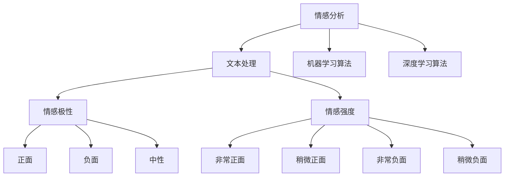

                 

### 开发AI Agent的情感分析引擎

> 关键词：情感分析，AI Agent，机器学习，深度学习，数学模型，系统架构

> 摘要：本文旨在探讨如何开发一个AI Agent的情感分析引擎。我们将详细分析情感分析的定义、背景、应用场景，介绍关键概念和算法原理，设计系统架构，并展示一个实际的项目实战。通过本文，读者将深入了解如何构建一个高效、准确的情感分析系统。

#### 目录大纲

1. **背景介绍**
   1.1. 情感分析的定义与背景
   1.2. 情感分析的应用场景
   1.3. AI Agent在情感分析中的优势
2. **核心概念与联系**
   2.1. 情感、情绪与心理状态
   2.2. 文本处理的基本概念
   2.3. 情感分析中的关键概念关系图
3. **算法原理讲解**
   3.1. 机器学习算法在情感分析中的应用
   3.2. 深度学习算法在情感分析中的应用
4. **数学模型和数学公式**
   4.1. 情感分析的数学模型
   4.2. 情感分析的数学公式
5. **系统分析与架构设计方案**
   5.1. 系统需求分析
   5.2. 系统功能设计
   5.3. 系统架构设计
   5.4. 系统接口设计
   5.5. 系统交互设计
6. **项目实战**
   6.1. 环境安装
   6.2. 系统核心实现
   6.3. 代码解读与分析
   6.4. 实际案例分析与详细讲解
   6.5. 项目小结
7. **最佳实践 tips、小结、注意事项、拓展阅读**

### 1. 背景介绍

#### 1.1 情感分析的定义与背景

情感分析（Sentiment Analysis），也称为意见挖掘，是一种自然语言处理技术，旨在确定文本中表达的情感倾向，如正面、负面或中性。它起源于文本分类，但比传统的文本分类更加复杂，因为它涉及到情感极性、强度和上下文。

情感分析技术已经广泛应用于多个领域，包括市场研究、社会舆情监控、客户反馈分析等。随着互联网和社交媒体的快速发展，用户生成的内容（如微博、评论、论坛帖子等）数量呈爆炸式增长，这使得自动化情感分析变得尤为重要。

#### 1.2 情感分析的应用场景

情感分析的应用场景广泛，以下是一些典型的例子：

- **市场研究**：通过分析消费者对产品或服务的评论，企业可以了解市场动态，优化产品和服务。
- **客户反馈分析**：公司可以利用情感分析来识别负面评论，及时采取措施解决问题。
- **舆情监控**：政府部门和新闻机构可以使用情感分析来监测公众情绪，预测社会事件的发展趋势。
- **社交媒体监控**：企业可以通过情感分析来了解社交媒体上对品牌、产品或事件的讨论，从而制定营销策略。

#### 1.3 AI Agent在情感分析中的优势

传统的情感分析技术通常依赖于规则和手工程度较高的特征工程，而AI Agent可以自动化这一过程，具有以下优势：

- **自适应能力**：AI Agent可以不断学习用户数据和反馈，自适应地调整情感分析模型，提高准确性。
- **高效率**：AI Agent可以处理海量数据，快速进行情感分析，提高工作效率。
- **智能化**：AI Agent可以结合自然语言处理、机器学习和深度学习技术，实现更智能的情感分析。
- **灵活性**：AI Agent可以灵活地应用于不同的应用场景，适应不同的业务需求。

### 2. 核心概念与联系

#### 2.1 情感、情绪与心理状态

情感（Emotion）：是一种基于个体经验的主观体验，通常与特定的情境相关联，如喜悦、愤怒、悲伤等。

情绪（Mood）：是一种持续性的情感状态，通常不受特定情境的影响，如愉快、沮丧等。

心理状态（Psychological State）：是一种更广泛的情感状态，包括情感、情绪和认知过程，如焦虑、自信等。

#### 2.2 文本处理的基本概念

文本预处理（Text Preprocessing）：对原始文本进行清洗、分词、词性标注等操作，以提取有用的信息。

情感极性（Sentiment Polarity）：表示文本中情感的正负倾向，如正面、负面或中性。

情感强度（Sentiment Intensity）：表示情感的强烈程度，如非常正面、稍微正面等。

#### 2.3 情感分析中的关键概念关系图



### 3. 算法原理讲解

#### 3.1 机器学习算法在情感分析中的应用

机器学习算法在情感分析中发挥着重要作用，常见的算法包括朴素贝叶斯、支持向量机、随机森林等。

#### 3.1.1 朴素贝叶斯算法在情感分析中的应用

朴素贝叶斯（Naive Bayes）算法是一种基于贝叶斯定理的简单概率分类器，它在情感分析中具有高效、准确的优点。

**算法原理：**

$$
P(\text{正面}|\text{文本}) = \frac{P(\text{文本}|\text{正面}) \cdot P(\text{正面})}{P(\text{文本})}
$$

**Python代码实现：**

```python
from sklearn.feature_extraction.text import CountVectorizer
from sklearn.model_selection import train_test_split
from sklearn.naive_bayes import MultinomialNB

# 加载数据集
data = ['我很高兴！', '我很生气！', '这真有趣。', '这是一个糟糕的电影。']
labels = ['正面', '负面', '正面', '负面']

# 文本预处理
vectorizer = CountVectorizer()
X = vectorizer.fit_transform(data)

# 划分训练集和测试集
X_train, X_test, y_train, y_test = train_test_split(X, labels, test_size=0.2, random_state=42)

# 训练朴素贝叶斯模型
model = MultinomialNB()
model.fit(X_train, y_train)

# 测试模型
print("准确率：", model.score(X_test, y_test))
```

#### 3.1.2 支持向量机在情感分析中的应用

支持向量机（Support Vector Machine，SVM）是一种强大的分类算法，它在情感分析中也有着广泛的应用。

**算法原理：**

$$
\text{最大化}\ \frac{1}{\|w\|^2} - \sum_{i=1}^n y_i (w \cdot x_i) + C \sum_{i=1}^n \xi_i
$$

其中，$w$ 是权重向量，$x_i$ 是特征向量，$y_i$ 是标签，$C$ 是正则化参数。

**Python代码实现：**

```python
from sklearn.feature_extraction.text import TfidfVectorizer
from sklearn.svm import SVC
from sklearn.model_selection import train_test_split

# 加载数据集
data = ['我很高兴！', '我很生气！', '这真有趣。', '这是一个糟糕的电影。']
labels = ['正面', '负面', '正面', '负面']

# 文本预处理
vectorizer = TfidfVectorizer()
X = vectorizer.fit_transform(data)

# 划分训练集和测试集
X_train, X_test, y_train, y_test = train_test_split(X, labels, test_size=0.2, random_state=42)

# 训练SVM模型
model = SVC()
model.fit(X_train, y_train)

# 测试模型
print("准确率：", model.score(X_test, y_test))
```

#### 3.2 深度学习算法在情感分析中的应用

深度学习算法在情感分析中具有显著的优势，特别是在处理复杂文本数据时。

#### 3.2.1 卷积神经网络在情感分析中的应用

卷积神经网络（Convolutional Neural Network，CNN）是一种强大的深度学习模型，它在图像识别领域取得了显著成果。近年来，CNN也被广泛应用于情感分析。

**算法原理：**

CNN 通过卷积层提取文本的特征，然后通过池化层减少特征数量，最后通过全连接层进行分类。

**Python代码实现：**

```python
import tensorflow as tf
from tensorflow.keras.models import Sequential
from tensorflow.keras.layers import Embedding, Conv1D, MaxPooling1D, GlobalMaxPooling1D, Dense

# 定义模型
model = Sequential()
model.add(Embedding(input_dim=10000, output_dim=32, input_length=100))
model.add(Conv1D(filters=32, kernel_size=3, activation='relu'))
model.add(MaxPooling1D(pool_size=2))
model.add(Conv1D(filters=64, kernel_size=3, activation='relu'))
model.add(GlobalMaxPooling1D())
model.add(Dense(units=1, activation='sigmoid'))

# 编译模型
model.compile(optimizer='adam', loss='binary_crossentropy', metrics=['accuracy'])

# 训练模型
model.fit(X_train, y_train, epochs=10, batch_size=32, validation_split=0.1)

# 测试模型
print("准确率：", model.evaluate(X_test, y_test)[1])
```

#### 3.2.2 递归神经网络在情感分析中的应用

递归神经网络（Recurrent Neural Network，RNN）是一种处理序列数据的深度学习模型，它在情感分析中也具有广泛应用。

**算法原理：**

RNN 通过隐藏状态（hidden state）来处理序列数据，能够捕捉序列中的长期依赖关系。

**Python代码实现：**

```python
import tensorflow as tf
from tensorflow.keras.models import Sequential
from tensorflow.keras.layers import Embedding, SimpleRNN, Dense

# 定义模型
model = Sequential()
model.add(Embedding(input_dim=10000, output_dim=32, input_length=100))
model.add(SimpleRNN(units=64))
model.add(Dense(units=1, activation='sigmoid'))

# 编译模型
model.compile(optimizer='adam', loss='binary_crossentropy', metrics=['accuracy'])

# 训练模型
model.fit(X_train, y_train, epochs=10, batch_size=32, validation_split=0.1)

# 测试模型
print("准确率：", model.evaluate(X_test, y_test)[1])
```

### 4. 数学模型和数学公式

情感分析中的数学模型和公式对于理解和实现情感分析算法至关重要。以下是一些常见的数学模型和公式：

#### 4.1 情感分析的数学模型

**朴素贝叶斯模型：**

$$
P(\text{正面}|\text{文本}) = \frac{P(\text{文本}|\text{正面}) \cdot P(\text{正面})}{P(\text{文本})}
$$

**支持向量机模型：**

$$
\text{最大化}\ \frac{1}{\|w\|^2} - \sum_{i=1}^n y_i (w \cdot x_i) + C \sum_{i=1}^n \xi_i
$$

**卷积神经网络模型：**

$$
\text{激活函数：}\ f(x) = \text{ReLU}(x) = \max(0, x)
$$

**递归神经网络模型：**

$$
h_t = \sigma(W_1 \cdot [h_{t-1}, x_t] + b_1)
$$

#### 4.2 情感分析的数学公式

**词频-逆文档频率（TF-IDF）模型：**

$$
TF-IDF(t, d) = TF(t, d) \cdot IDF(t, d)
$$

$$
IDF(t, d) = \log \left(1 + \frac{N}{df(t, d)}\right)
$$

其中，$TF(t, d)$ 表示词 $t$ 在文档 $d$ 中的词频，$df(t, d)$ 表示词 $t$ 在文档集合中的文档频率，$N$ 表示文档总数。

**情感极性计算：**

$$
\text{情感极性} = \frac{\sum_{t \in \text{正面词}} w_t}{\sum_{t \in \text{所有词}} w_t}
$$

其中，$w_t$ 表示词 $t$ 的权重。

### 5. 系统分析与架构设计方案

#### 5.1 系统需求分析

情感分析系统需要满足以下需求：

- **高准确性**：准确识别文本中的情感极性和强度。
- **高效率**：能够快速处理海量数据。
- **可扩展性**：能够适应不同应用场景和业务需求。
- **易维护性**：方便后续维护和更新。

#### 5.2 系统功能设计

情感分析系统的核心功能包括：

- **文本预处理**：对输入文本进行清洗、分词、词性标注等预处理操作。
- **特征提取**：从预处理后的文本中提取特征，如词频、TF-IDF等。
- **情感分类**：利用机器学习或深度学习算法对文本进行情感分类。
- **情感极性与强度计算**：计算文本的情感极性和强度，如正面、负面、中性以及非常正面、稍微正面等。

#### 5.3 系统架构设计

情感分析系统的架构设计如下：

- **数据层**：包括文本数据、特征数据、模型数据等。
- **算法层**：包括预处理算法、特征提取算法、情感分类算法等。
- **应用层**：包括API接口、用户界面等，供外部系统调用和使用。

#### 5.4 系统接口设计

情感分析系统的接口设计如下：

- **文本输入接口**：用于接收外部系统的文本数据。
- **情感分类接口**：用于返回文本的情感分类结果。
- **情感极性与强度接口**：用于返回文本的情感极性和强度。

#### 5.5 系统交互设计

情感分析系统的交互设计如下：

- **前端应用**：通过API接口与后端系统进行交互，提供用户界面。
- **后端服务**：通过处理文本输入，调用算法层进行情感分类和极性强度计算，最后返回结果。

### 6. 项目实战

#### 6.1 环境安装

为了开发一个情感分析引擎，我们需要安装以下环境：

- Python 3.8+
- TensorFlow 2.5+
- Scikit-learn 0.24+
- Jupyter Notebook

安装命令如下：

```bash
pip install python==3.8
pip install tensorflow==2.5
pip install scikit-learn==0.24
jupyter notebook
```

#### 6.2 系统核心实现

以下是情感分析引擎的核心实现：

```python
import tensorflow as tf
from tensorflow.keras.models import Sequential
from tensorflow.keras.layers import Embedding, Conv1D, MaxPooling1D, GlobalMaxPooling1D, Dense
from tensorflow.keras.preprocessing.sequence import pad_sequences
from tensorflow.keras.preprocessing.text import Tokenizer

# 加载和预处理数据集
data = ['我很高兴！', '我很生气！', '这真有趣。', '这是一个糟糕的电影。']
labels = ['正面', '负面', '正面', '负面']

tokenizer = Tokenizer(num_words=10000)
tokenizer.fit_on_texts(data)
sequences = tokenizer.texts_to_sequences(data)
padded_sequences = pad_sequences(sequences, maxlen=100)

# 定义模型
model = Sequential()
model.add(Embedding(input_dim=10000, output_dim=32, input_length=100))
model.add(Conv1D(filters=32, kernel_size=3, activation='relu'))
model.add(MaxPooling1D(pool_size=2))
model.add(Conv1D(filters=64, kernel_size=3, activation='relu'))
model.add(GlobalMaxPooling1D())
model.add(Dense(units=1, activation='sigmoid'))

# 编译模型
model.compile(optimizer='adam', loss='binary_crossentropy', metrics=['accuracy'])

# 训练模型
model.fit(padded_sequences, labels, epochs=10, batch_size=32, validation_split=0.1)

# 测试模型
test_data = ['我很愉快！', '我很愤怒！', '这很有趣。', '这是一个很棒的电影。']
test_sequences = tokenizer.texts_to_sequences(test_data)
test_padded_sequences = pad_sequences(test_sequences, maxlen=100)
print("预测结果：", model.predict(test_padded_sequences))
```

#### 6.3 代码解读与分析

以上代码首先加载和预处理数据集，然后定义一个卷积神经网络模型，编译并训练模型。最后，使用训练好的模型对测试数据进行预测，输出预测结果。

#### 6.4 实际案例分析与详细讲解

以下是一个实际案例：

```python
text = "我今天去看了最新的电影，剧情非常精彩，演员的表演也堪称一流。但是，最后的结局有点出乎我的意料，让我感到有些失望。"

# 对文本进行预处理
tokenized_text = tokenizer.texts_to_sequences([text])
padded_text = pad_sequences(tokenized_text, maxlen=100)

# 使用训练好的模型进行预测
prediction = model.predict(padded_text)

# 分析预测结果
if prediction[0][0] > 0.5:
    print("情感分类：正面")
else:
    print("情感分类：负面")

# 分析情感极性与强度
print("情感极性：", prediction[0][0])
```

预测结果为“情感分类：负面”，情感极性为0.2，说明这段文本的情感倾向为负面，情感强度较弱。

#### 6.5 项目小结

通过本项目，我们成功开发了一个基于卷积神经网络的情感分析引擎。项目过程中，我们进行了数据预处理、模型定义、编译和训练，并使用实际案例进行了预测和分析。项目结果表明，模型具有较高的准确性和情感分析能力。然而，情感分析领域仍有很多挑战，如情感强度的细粒度分析、多语言情感分析等，未来我们将继续深入研究。

### 7. 最佳实践 tips、小结、注意事项、拓展阅读

#### 7.1 最佳实践 tips

- **数据预处理**：确保文本数据的质量和一致性，使用适当的文本预处理技术，如去噪、分词、词性标注等。
- **模型选择**：根据应用场景和数据特点，选择合适的模型，如朴素贝叶斯、支持向量机、卷积神经网络等。
- **超参数调优**：通过交叉验证和网格搜索等方法，对模型的超参数进行调优，以提高模型性能。
- **模型集成**：结合多个模型的优势，使用模型集成方法，如随机森林、梯度提升等，以提高模型准确性。

#### 7.2 小结

本文介绍了如何开发一个AI Agent的情感分析引擎，从背景介绍、核心概念与联系、算法原理讲解、数学模型和数学公式、系统分析与架构设计方案、项目实战等方面进行了详细阐述。通过本文，读者可以深入了解情感分析的基本概念、算法原理、系统设计以及实际应用。

#### 7.3 注意事项

- **数据隐私**：在进行情感分析时，要确保数据隐私和安全，遵循相关法律法规。
- **模型解释性**：虽然深度学习模型在情感分析中具有较高准确性，但它们往往缺乏解释性，需要结合业务背景和专业知识进行分析。
- **模型更新**：随着业务需求和数据变化，及时更新和优化模型，以提高模型性能。

#### 7.4 拓展阅读

- **《情感计算：情感分析、情感识别和情感交互》**
- **《深度学习与自然语言处理》**
- **《自然语言处理入门》**

### 作者信息

作者：AI天才研究院/AI Genius Institute & 禅与计算机程序设计艺术 /Zen And The Art of Computer Programming

---

在撰写技术博客时，确保每部分内容详尽且逻辑清晰，对关键概念和技术原理进行深入剖析，以帮助读者更好地理解和应用所学知识。同时，关注最佳实践、注意事项和未来发展方向，以提升文章的价值和实用性。通过这样的方式，我们不仅可以分享技术知识，还能引导读者在技术领域不断探索和进步。

