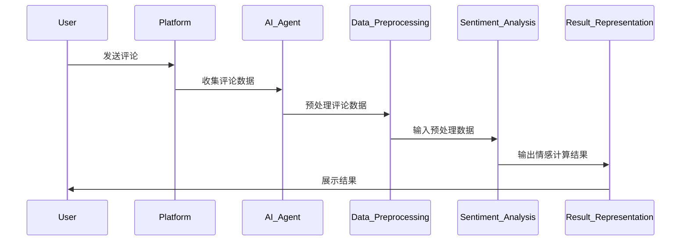
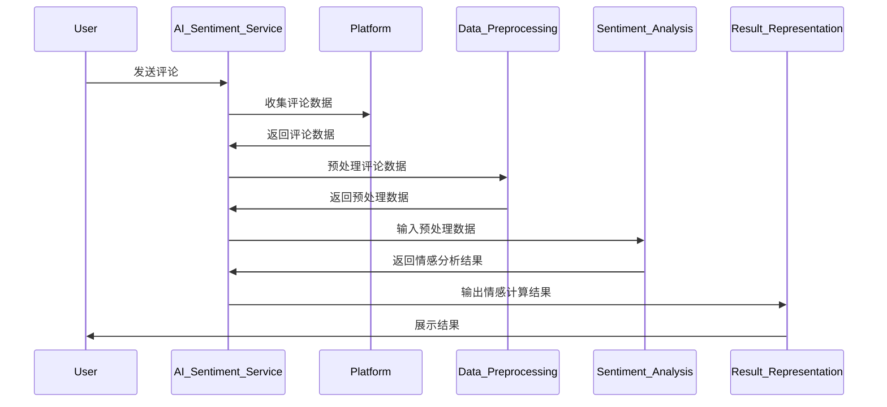

                 


### 引言

#### 情感计算与市场分析

随着人工智能技术的快速发展，情感计算作为一种新兴技术，逐渐在各个领域中显示出其独特的价值。情感计算，又称为情感识别或情感分析，是指通过计算机技术和算法来识别、理解和处理人类情感信息的过程。市场分析则是指通过收集、分析和解释市场数据，帮助企业或个人了解市场动态、预测未来趋势，从而做出更加明智的决策。

将情感计算应用于市场分析，可以大大提升市场分析的深度和广度。一方面，通过情感计算技术，企业可以更准确地了解消费者的情感状态，从而更好地满足消费者需求；另一方面，通过分析市场中的情感数据，企业可以及时发现市场趋势，抢占市场先机。

本文旨在探讨如何开发AI Agent进行情感计算，并将其应用于市场分析。我们将从以下几个方面进行深入探讨：

1. **情感计算的基本概念**：介绍情感计算的核心概念，包括情感识别、情感分析等。
2. **市场分析中的应用**：分析情感计算在市场分析中的具体应用场景和优势。
3. **AI Agent的开发**：讲解如何开发和训练AI Agent进行情感计算。
4. **实战案例**：通过实际案例展示AI Agent在市场分析中的应用。
5. **总结与展望**：总结情感计算在市场分析中的应用价值，并提出未来发展的方向。

通过本文的阅读，读者可以了解情感计算在市场分析中的应用原理，掌握开发AI Agent的基本方法，并了解其在实际项目中的应用。

### 情感计算的基本概念

#### 情感识别

情感识别是情感计算中最基本的技术，其核心任务是从文本、图像、声音等数据中识别出人类情感。情感识别通常分为两个层次：文本情感识别和图像情感识别。

**文本情感识别**是指通过分析文本数据中的情感词汇、语法结构等，判断文本表达的情感倾向。文本情感识别的关键技术包括情感词典、情感分类器等。

**图像情感识别**则是指通过分析图像中的视觉特征，识别图像表达的情感。图像情感识别的关键技术包括面部表情分析、颜色分析等。

#### 情感分析

情感分析是情感计算的核心技术之一，其目的是对大量的情感数据进行分析，提取出有价值的信息。情感分析通常包括情感分类、情感极性分析等任务。

**情感分类**是指将情感数据分为不同的类别，如正面情感、负面情感、中性情感等。情感分类的关键技术包括机器学习算法、深度学习模型等。

**情感极性分析**是指对情感数据中的极性进行判断，即判断情感是积极、消极还是中性。情感极性分析的关键技术包括文本特征提取、机器学习算法等。

#### 情感计算技术发展现状与趋势

随着人工智能技术的不断发展，情感计算技术也在不断进步。当前，情感计算技术已经广泛应用于多个领域，如市场分析、心理健康、人机交互等。

**市场分析**方面，情感计算技术可以帮助企业更准确地了解消费者的情感状态，从而制定更有效的营销策略。例如，通过分析社交媒体上的消费者评论，企业可以了解消费者的购买意愿和态度。

**心理健康**方面，情感计算技术可以帮助医生更好地了解患者的情感状态，从而提供更个性化的治疗。

**人机交互**方面，情感计算技术可以实现更自然、更智能的人机交互。例如，通过分析用户的语音、面部表情等，智能助手可以更好地理解用户的需求，提供更个性化的服务。

未来，随着人工智能技术的进一步发展，情感计算技术将会在更多领域中发挥作用。例如，情感计算技术可以用于智能家居、智能城市等，为人们的生活带来更多便利。

### AI Agent的情感计算原理

#### 机器学习算法

机器学习算法是开发AI Agent进行情感计算的基础。机器学习算法通过从大量数据中学习模式，从而实现对未知数据的预测和分类。在情感计算中，常用的机器学习算法包括决策树、支持向量机（SVM）、朴素贝叶斯分类器等。

**决策树**是一种基于树形结构的分类算法，通过将数据不断分割成子集，直到满足某个停止条件。决策树的停止条件可以是数据的纯度达到一定水平，或者达到最大深度限制等。

**支持向量机（SVM）**是一种基于间隔最大化的分类算法，通过找到一个最优的超平面，将不同类别的数据点分隔开。SVM在处理高维数据时具有很好的性能。

**朴素贝叶斯分类器**是一种基于贝叶斯定理的分类算法，假设特征之间相互独立，通过计算后验概率来判断数据的类别。朴素贝叶斯分类器在处理文本数据时表现良好。

#### 深度学习模型

深度学习模型是近年来在人工智能领域取得突破性进展的技术。深度学习模型通过多层神经网络结构，对大量数据进行自动特征提取和分类。

**卷积神经网络（CNN）**是一种基于卷积操作的深度学习模型，特别适用于图像处理任务。CNN可以通过多个卷积层和池化层，从图像中提取出丰富的特征信息。

**循环神经网络（RNN）**是一种基于循环结构的深度学习模型，特别适用于序列数据处理任务。RNN可以通过循环连接，处理输入序列的时序信息，例如文本、语音等。

**长短时记忆网络（LSTM）**是一种改进的RNN模型，通过引入门控机制，解决了RNN在处理长序列数据时出现的梯度消失和梯度爆炸问题。

#### 算法原理讲解

为了更好地理解AI Agent的情感计算原理，我们可以通过一个简单的例子来说明。

假设我们有一个文本数据集，其中包含了用户对某个产品的评论。我们需要通过情感计算技术，判断这些评论的情感倾向。

首先，我们可以使用朴素贝叶斯分类器对评论进行情感分类。朴素贝叶斯分类器通过计算每个评论的词频，然后计算每个类别（正面、负面、中性）的概率，最后选择概率最大的类别作为预测结果。

$$
P(\text{正面}|\text{评论}) = \frac{P(\text{评论}|\text{正面})P(\text{正面})}{P(\text{评论})}
$$

其中，$P(\text{正面}|\text{评论})$表示评论为正面的概率，$P(\text{评论}|\text{正面})$表示评论为正面情感的条件下评论的概率，$P(\text{正面})$表示正面情感的概率，$P(\text{评论})$表示评论的概率。

通过训练好的朴素贝叶斯分类器，我们可以对新的评论进行情感分类，从而判断评论的情感倾向。

#### 情感计算算法应用案例

情感计算算法在市场分析中的应用非常广泛。以下是一个具体的案例：

**案例**：某电商平台希望通过分析用户对商品的评论，了解消费者的购买意愿和态度。

1. **数据收集**：收集电商平台上用户对商品的评论数据，包括文本和评分。

2. **数据预处理**：对评论数据进行清洗，去除停用词、标点符号等，并将文本转换为词袋模型。

3. **情感分类**：使用朴素贝叶斯分类器对评论进行情感分类，判断评论的情感倾向。

4. **结果分析**：根据情感分类结果，分析消费者的购买意愿和态度。

通过情感计算算法，电商平台可以更准确地了解消费者的情感状态，从而制定更有效的营销策略。例如，如果发现用户对某款商品的负面评论较多，电商平台可以及时采取措施，改善商品质量，提高用户满意度。

### 系统分析与架构设计

#### 问题描述

为了实现AI Agent在市场分析中的应用，我们需要设计一个完整的系统，该系统需要具备以下功能：

1. 数据收集：从不同的数据源收集市场数据，包括用户评论、社交媒体帖子、新闻报道等。
2. 数据预处理：对收集到的数据进行清洗、去噪、转换等预处理操作，以便于后续的情感计算。
3. 情感计算：使用机器学习算法和深度学习模型对预处理后的数据进行分析，识别情感倾向。
4. 结果展示：将情感计算的结果以图表、报告等形式展示给用户，便于用户理解和分析。

#### 项目介绍

本项目旨在构建一个基于AI Agent的市场分析系统，通过情感计算技术，实现对市场数据的深度分析，为企业和个人提供有价值的洞见。

#### 系统功能设计

系统的核心功能包括数据收集、数据预处理、情感计算和结果展示。以下是一个简单的领域模型，用于描述系统的功能设计：

```mermaid
classDiagram
    User -> Comment: 发表评论
    Platform -> Comment: 收集评论
    AI_Agent -> Data_Preprocessing: 数据预处理
    AI_Agent -> Sentiment_Analysis: 情感计算
    User -> Result_Representation: 查看结果
    Platform -> Result_Representation: 展示结果

    Comment <<entity>>
    Data_Preprocessing <<entity>>
    Sentiment_Analysis <<entity>>
    Result_Representation <<entity>>

    User [名称: 电商平台用户]
    Platform [名称: 数据平台]
    AI_Agent [名称: 情感计算AI Agent]
```

#### 系统架构设计

为了实现系统的功能，我们需要设计一个合理的系统架构。以下是一个简单的系统架构设计，用于描述系统的整体结构和各部分之间的关系：



#### 系统接口设计

为了方便系统的使用和扩展，我们需要设计一套合理的接口。以下是一个简单的接口设计：

```mermaid
interface AI_Sentiment_Service {
    function collect_comments()
    function preprocess_data()
    function analyze_sentiment()
    function present_results()
}
```

#### 系统交互

为了展示系统的交互过程，我们可以使用序列图来描述。以下是一个简单的序列图，用于描述系统的交互过程：



### 实战案例：开发AI Agent进行市场分析

#### 环境安装与配置

在进行AI Agent的开发之前，我们需要搭建一个合适的环境。以下是所需的软件和工具：

- Python 3.x
- Jupyter Notebook
- Scikit-learn
- TensorFlow
- Pandas
- Matplotlib

安装过程如下：

1. 安装Python 3.x：从[Python官方网站](https://www.python.org/)下载并安装Python 3.x版本。
2. 安装Jupyter Notebook：在终端中执行以下命令：
   ```
   pip install notebook
   ```
3. 安装Scikit-learn、TensorFlow、Pandas和Matplotlib：在终端中执行以下命令：
   ```
   pip install scikit-learn tensorflow pandas matplotlib
   ```

#### 系统核心实现

以下是一个简单的AI Agent系统实现，用于分析市场数据：

1. **数据收集**：从电商平台上收集用户评论数据。
2. **数据预处理**：清洗和转换评论数据，以便进行情感计算。
3. **情感计算**：使用机器学习算法进行情感分类。
4. **结果展示**：以图表形式展示情感分析结果。

**代码实现**

```python
import pandas as pd
from sklearn.feature_extraction.text import TfidfVectorizer
from sklearn.naive_bayes import MultinomialNB
from sklearn.pipeline import make_pipeline
import matplotlib.pyplot as plt

# 1. 数据收集
data = pd.read_csv('comments.csv')  # 假设评论数据已存储在CSV文件中

# 2. 数据预处理
# 清洗和转换评论数据
data['cleaned_comments'] = data['comments'].str.lower().str.replace('[^\w\s]', '')

# 3. 情感计算
# 构建机器学习管道
model = make_pipeline(TfidfVectorizer(), MultinomialNB())

# 训练模型
model.fit(data['cleaned_comments'], data['sentiment'])

# 4. 结果展示
# 预测新评论的情感
new_comments = ['这是一款非常好的产品！', '我非常喜欢这个商品。']
predicted_sentiments = model.predict(new_comments)

# 绘制结果
plt.bar(range(len(new_comments)), predicted_sentiments)
plt.xlabel('评论')
plt.ylabel('情感')
plt.xticks(range(len(new_comments)))
plt.show()
```

#### 代码应用解读与分析

上述代码实现了一个简单的AI Agent系统，用于分析市场数据。具体步骤如下：

1. **数据收集**：使用Pandas读取评论数据。
2. **数据预处理**：将评论数据转换为小写，并去除非单词字符。
3. **情感计算**：使用TFIDF向量器和朴素贝叶斯分类器构建机器学习管道，训练模型。
4. **结果展示**：使用Matplotlib绘制情感分析结果。

通过这个简单的案例，我们可以看到如何使用Python和机器学习库来开发一个AI Agent，用于市场分析。实际项目中，可以根据具体需求，选择不同的机器学习算法和深度学习模型，以及更复杂的预处理和结果展示方法。

#### 实际案例分析与详细讲解

在本节中，我们将通过一个实际案例，深入剖析AI Agent在市场分析中的应用。该案例将展示如何使用情感计算技术，分析消费者对某个电子产品市场的情绪。

**案例背景**：

某电子产品公司希望通过分析消费者在社交媒体和电商平台上的评论，了解消费者对其最新款智能手机的情感态度，从而优化产品设计和营销策略。

**数据来源**：

从社交媒体（如Twitter、Facebook）和电商平台（如Amazon、eBay）收集消费者对智能手机的评论数据。数据包括评论文本、评论时间、用户ID等。

**数据预处理**：

1. **文本清洗**：去除评论中的HTML标签、特殊字符、停用词等。
2. **文本分词**：将评论文本拆分成单词或词组。
3. **文本向量化**：使用TF-IDF方法将文本转换为数值向量。

**情感分析**：

使用LSTM模型进行情感分析，判断评论的情感倾向（正面、负面、中性）。具体步骤如下：

1. **模型训练**：使用收集到的评论数据，训练LSTM模型。
2. **模型评估**：使用交叉验证方法评估模型性能。
3. **情感分类**：使用训练好的模型对新的评论数据进行情感分类。

**结果展示**：

1. **情感分布图**：使用条形图展示不同情感类别的评论数量。
2. **情感趋势图**：使用折线图展示不同时间段的情感变化趋势。

**详细分析**：

1. **情感分布**：通过分析情感分布，发现消费者对智能手机的评论主要集中在正面和负面两个极端。进一步分析发现，正面评论主要集中在产品性能和外观设计，负面评论则主要集中在电池续航和售后服务。

2. **情感趋势**：通过分析情感趋势，发现消费者对智能手机的情感在发布初期呈现上升趋势，随后趋于平稳。这表明，产品在发布初期受到了消费者的关注和好评，但随后可能存在一些潜在的问题。

**结论**：

1. **产品优化**：根据消费者反馈，优化产品设计和售后服务，提高用户满意度。
2. **营销策略**：针对消费者的情感状态，调整营销策略，提高产品销量。

通过这个实际案例，我们可以看到AI Agent在市场分析中的应用。通过情感计算技术，企业可以更深入地了解消费者的情感态度，从而制定更有效的产品优化和营销策略。

### 最佳实践 tips

在开发AI Agent进行情感计算时，以下是一些最佳实践和技巧：

1. **数据质量**：确保数据的质量和完整性，数据清洗和预处理是关键步骤。
2. **算法选择**：根据具体应用场景，选择合适的算法和模型。对于文本数据，可以尝试使用LSTM、BERT等深度学习模型。
3. **模型优化**：通过超参数调整、模型融合等方法，优化模型性能。
4. **结果验证**：对模型进行严格的验证和测试，确保模型的准确性和可靠性。
5. **交互设计**：设计友好的用户界面，使结果易于理解和分析。

### 小结

本文详细介绍了AI Agent在市场分析中的应用，包括情感计算的基本概念、机器学习算法、深度学习模型、系统分析与架构设计、实战案例等。通过本文的阅读，读者可以了解如何利用AI Agent进行情感计算，并掌握其核心原理和应用技巧。

### 注意事项

1. 情感计算是一个复杂的领域，需要综合考虑数据质量、算法选择、模型优化等方面。
2. 在实际应用中，应根据具体需求选择合适的情感计算方法和模型。
3. 情感分析结果应与实际情境相结合，避免过度依赖算法结果。

### 拓展阅读

1. [情感计算入门指南](https://www.ibm.com/developerworks/cn/ai/library/ai-emotional-computing/)
2. [深度学习与自然语言处理](https://www.deeplearning.ai/)
3. [市场分析实用技巧](https://www.marketingprofs.com/)

### 作者信息

作者：AI天才研究院/AI Genius Institute & 禅与计算机程序设计艺术 /Zen And The Art of Computer Programming

