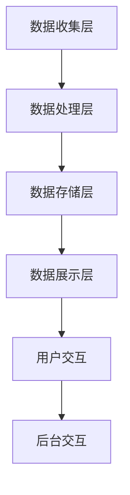

                 


### 1.1 书籍背景

#### 1.1.1 情感计算在社交媒体分析中的重要性

随着社交媒体的快速发展，人们在社交平台上发布的信息量呈现爆炸式增长。这些信息不仅包括文字、图片、视频等多媒体形式，还涵盖了情感表达、观点交流等深层次内容。情感计算作为一种人工智能技术，能够在理解和处理这些情感信息方面发挥重要作用。通过情感计算，我们可以从社交媒体数据中提取情感倾向、情绪波动等关键信息，从而实现精准的内容分析、用户行为预测和个性化推荐。

在社会媒体分析中，情感计算的应用场景广泛且多样。首先，情感分析可以帮助社交媒体平台理解用户情绪，从而优化用户体验。例如，通过分析用户对某一话题的评论，平台可以调整内容推荐策略，向用户提供更加符合其兴趣和情感需求的信息。其次，情感计算在品牌营销中具有重要价值。品牌可以通过分析社交媒体上的用户情感反馈，及时了解市场动态、消费者需求，从而制定更加有效的营销策略。

#### 1.1.2 人工智能代理（AI Agent）的概念与功能

人工智能代理（AI Agent）是一种能够自主执行任务、与环境进行交互的计算机系统。它基于人工智能技术，具备感知、决策、执行等能力，能够在复杂环境中实现智能行为。AI Agent的应用范围广泛，包括智能客服、自动驾驶、智能家居、医疗诊断等领域。

在社交媒体分析中，AI Agent可以通过情感计算技术，实现情感信息的自动提取、分析和应用。具体来说，AI Agent可以感知社交媒体用户的情感状态，根据用户的情感反馈进行决策，并执行相应的任务。例如，在客服领域，AI Agent可以分析用户在聊天中的情感倾向，为用户提供针对性的解决方案；在市场营销中，AI Agent可以分析用户对品牌宣传的情感反应，为品牌制定更加精准的营销策略。

#### 1.1.3 目标读者与书籍结构

本书旨在为广大软件开发者、数据科学家、人工智能研究者提供一本全面、系统的情感计算与社交媒体分析指南。无论你是初学者，还是具有丰富经验的开发者，都能在本书中找到有价值的内容。

本书分为七个主要部分，分别介绍了情感计算与社交媒体分析的基础知识、应用原理、实现方法、案例研究等。具体结构如下：

**第一部分：引言**  
- 介绍书籍背景、目标读者、情感计算在社交媒体分析中的应用价值。

**第二部分：AI Agent和情感计算基础**  
- 详细讲解AI Agent的概念、组成和功能，以及情感计算的基本原理和方法。

**第三部分：社交媒体分析原理**  
- 介绍社交媒体数据的收集、处理和分析方法。

**第四部分：AI Agent的情感计算应用**  
- 展示AI Agent在社交媒体分析中的实际应用案例和效果。

**第五部分：案例研究**  
- 分析具体应用中的问题和解决方案。

**第六部分：最佳实践和总结**  
- 总结经验教训，提供实用建议。

**第七部分：展望未来**  
- 讨论情感计算在社交媒体分析中的应用前景。

本书以逻辑清晰、结构紧凑、简单易懂的写作风格，旨在帮助读者快速掌握情感计算与社交媒体分析的核心技术和应用方法。无论你是想要深入了解这一领域的专业人士，还是对人工智能技术感兴趣的初学者，本书都是你不可错过的宝贵资源。

---

**1.2 社交媒体分析概述**

社交媒体分析是指通过技术手段对社交媒体平台上的信息进行收集、处理和分析，从而提取有价值的信息和洞察。随着社交媒体的普及，其数据分析已成为企业和机构决策的重要依据。

#### 1.2.1 社交媒体数据的类型与来源

社交媒体数据类型丰富多样，主要包括以下几类：

1. **用户生成内容（UGC）**  
   用户在社交媒体平台上发布的文字、图片、视频、音频等原始信息，是社交媒体数据的核心组成部分。这些数据反映了用户的兴趣、观点和情感。

2. **用户行为数据**  
   用户在社交媒体平台上的各种行为数据，如点赞、评论、转发、关注等。这些数据可以反映用户的活动轨迹、兴趣点和社交关系。

3. **元数据**  
   与社交媒体内容相关的辅助信息，如发布时间、地理位置、用户ID等。元数据有助于提高数据分析的准确性和有效性。

社交媒体数据的主要来源包括：

1. **社交媒体平台API**  
   通过官方提供的API接口，可以获取平台上的公开数据。常见的社交媒体平台如Facebook、Twitter、Instagram等，都提供了丰富的API服务。

2. **网页抓取工具**  
   使用网页抓取工具（如Scrapy、BeautifulSoup等），可以自动获取社交媒体网页上的数据。这种方法适用于那些未开放API接口的社交媒体平台。

3. **第三方数据分析工具**  
   如Google Analytics、Klout等第三方工具，提供了便捷的数据分析功能，可以帮助用户深入了解社交媒体的运营效果和用户行为。

#### 1.2.2 社交媒体分析的基本流程

社交媒体分析通常包括以下基本流程：

1. **数据收集**  
   通过API接口、网页抓取工具或第三方工具，收集社交媒体平台上的数据。数据收集过程中，需要遵循数据隐私和合规要求，确保数据来源的合法性和合理性。

2. **数据清洗**  
   对收集到的数据进行清洗，包括去除重复数据、填补缺失值、处理异常值等。数据清洗是保证数据分析准确性的关键步骤。

3. **数据预处理**  
   对清洗后的数据进行格式转换、特征提取、数据归一化等处理，以便于后续分析。数据预处理有助于提高模型性能和分析结果的准确性。

4. **数据分析**  
   使用统计分析、机器学习等方法，对预处理后的数据进行深入分析。常见的分析方法包括情感分析、主题建模、用户行为分析等。

5. **结果可视化**  
   将分析结果以图表、报表等形式呈现，帮助用户更直观地理解和应用分析结果。

#### 1.2.3 情感计算在社交媒体分析中的应用价值

情感计算在社交媒体分析中具有广泛的应用价值，主要体现在以下几个方面：

1. **情感倾向分析**  
   通过情感计算技术，可以识别用户在社交媒体上的情感倾向，如正面、负面或中立。这有助于了解用户对某一事件、产品或品牌的情感态度，为营销策略提供参考。

2. **用户情绪监测**  
   情感计算可以帮助实时监测用户在社交媒体上的情绪波动，识别潜在的危机事件或用户不满情绪，从而及时采取措施，避免负面影响的扩散。

3. **内容推荐**  
   通过分析用户在社交媒体上的情感反馈，可以为用户提供更加符合其兴趣和情感需求的内容推荐，提高用户满意度和粘性。

4. **品牌评估**  
   通过情感计算分析用户对品牌的情感评价，可以评估品牌在社交媒体上的声誉，为品牌管理提供依据。

5. **市场研究**  
   情感计算可以帮助企业了解消费者需求、市场趋势和竞争状况，为产品研发和市场策略提供参考。

总之，情感计算在社交媒体分析中具有巨大的应用潜力，为企业和机构提供了丰富的数据洞察和决策支持。随着技术的不断进步，情感计算在社交媒体分析中的应用前景将更加广阔。

---

### 1.3 AI Agent的情感计算原理

#### 1.3.1 情感计算的分类与模型

情感计算是一种人工智能技术，旨在模拟人类对情感的感知、理解和表达。根据处理方式和应用场景的不同，情感计算可以分为多种类型：

1. **机器感知情感计算**  
   机器感知情感计算关注的是计算机如何通过分析文本、语音、面部表情等外部信号来感知情感。这一类情感计算主要涉及情感识别、情感分类和情感分析等技术。

   - **情感识别技术**：通过自然语言处理（NLP）技术，从文本中提取情感特征，然后使用机器学习模型进行情感识别。常见的情感识别模型包括基于规则的方法、统计模型和深度学习模型。

   - **情感分类方法**：将情感分为不同的类别，如正面、负面、中立等。情感分类方法通常使用监督学习、无监督学习和半监督学习等技术。

   - **情感分析**：对文本、语音、图像等多模态数据进行情感分析，以获取更全面和深层次的情感信息。

2. **人类情感计算**  
   人类情感计算关注的是如何模拟和解释人类的情感认知过程，包括情感的产生、表达、理解和调节。这一类情感计算主要涉及情感认知模型、人机交互情感计算和情感调控技术。

   - **情感认知模型**：模拟人类情感认知过程的数学模型，用于理解和解释情感。常见的情感认知模型包括基于神经科学的模型、基于心理学的模型和基于计算认知科学的模型。

   - **人机交互情感计算**：研究如何使计算机系统能够感知、理解和回应人类情感，以提高人机交互的自然性和有效性。

   - **情感调控技术**：通过技术手段调节和引导人类的情感状态，以达到特定的目标和需求。常见的情感调控技术包括心理治疗、认知行为疗法和生物反馈等。

#### 1.3.2 情感计算在AI Agent中的应用

AI Agent是一种具备自主决策和行动能力的计算机系统，其核心在于能够理解、感知和响应环境中的各种信息。情感计算在AI Agent中的应用主要体现在以下几个方面：

1. **情感感知与理解**  
   AI Agent通过情感计算技术，可以感知和识别人类情感，从而更好地理解用户的情绪和需求。这有助于AI Agent提供更加个性化、贴心的服务。

   - **情感感知**：AI Agent使用语音识别、自然语言处理等技术，从用户的语音、文字、表情中提取情感信息。

   - **情感理解**：AI Agent使用情感认知模型，对提取到的情感信息进行分析和解释，以理解用户的情感状态。

2. **情感响应与互动**  
   AI Agent根据对情感的感知和理解，可以做出适当的情感响应，并与用户进行有效的互动。

   - **情感响应**：AI Agent根据用户的情感状态，调整自己的行为和语气，以更好地满足用户需求。

   - **情感互动**：AI Agent通过与用户的情感互动，提高人机交互的自然性和亲切感，增强用户的体验和满意度。

3. **情感驱动决策**  
   AI Agent可以根据用户的情感状态，做出更加智能和合理的决策。

   - **情感驱动**：AI Agent将用户的情感信息作为决策因素，调整任务优先级、推荐策略等。

   - **情感优化**：AI Agent通过情感计算，优化自身的任务执行和资源分配，以提高任务完成效率和用户满意度。

#### 1.3.3 情感计算的挑战与解决方案

情感计算作为一种新兴技术，面临着诸多挑战：

1. **情感识别的准确性**  
   情感识别的准确性是情感计算的核心问题。由于情感表达的多义性和复杂性，传统的方法往往难以准确识别情感。

   - **多模态情感计算**：通过结合文本、语音、图像等多种数据源，提高情感识别的准确性。

   - **深度学习模型**：使用深度学习模型，如卷积神经网络（CNN）和循环神经网络（RNN），提高情感识别的性能。

2. **情感理解的复杂性**  
   情感理解涉及到对人类情感认知过程的模拟，这是一个复杂的任务。如何准确理解和解释情感，是情感计算面临的另一个挑战。

   - **情感认知模型**：开发更加精细和准确的情感认知模型，以提高情感理解的能力。

   - **跨领域情感计算**：通过跨领域的数据和模型共享，提高情感理解的泛化能力。

3. **情感调控的伦理问题**  
   情感调控技术可能会对人类的情感状态产生干预，引发伦理和道德问题。

   - **伦理审查**：在开发和应用情感调控技术时，进行严格的伦理审查和监管。

   - **用户隐私保护**：确保用户隐私和数据安全，避免滥用情感计算技术。

总之，情感计算在AI Agent中的应用具有广泛的前景，但同时也面临着诸多挑战。通过不断的技术创新和伦理监管，情感计算将有望在AI Agent领域发挥更大的作用。

---

### 1.4 本书目标与结构安排

#### 1.4.1 学习目标

本书旨在为广大软件开发者、数据科学家、人工智能研究者提供一本全面、系统的情感计算与社交媒体分析指南。通过阅读本书，读者可以：

1. **掌握情感计算的基本概念和原理**  
   了解情感计算的定义、分类和模型，掌握情感识别、情感理解和情感表达等核心技术。

2. **了解社交媒体分析的方法和流程**  
   学习社交媒体数据的收集、处理和分析方法，掌握情感计算在社交媒体分析中的应用。

3. **学会使用情感计算技术进行实际应用**  
   通过实际案例和项目实战，掌握如何使用情感计算技术进行情感分析、用户行为预测和个性化推荐。

4. **提高人工智能系统的智能化水平**  
   学习如何将情感计算应用于人工智能系统，提高系统的情感感知、理解和响应能力，提升用户体验。

#### 1.4.2 书籍结构概述

本书分为七个主要部分，结构如下：

**第一部分：引言**  
- 介绍书籍背景、目标读者、情感计算在社交媒体分析中的应用价值。

**第二部分：AI Agent和情感计算基础**  
- 详细讲解AI Agent的概念、组成和功能，以及情感计算的基本原理和方法。

**第三部分：社交媒体分析原理**  
- 介绍社交媒体数据的收集、处理和分析方法。

**第四部分：AI Agent的情感计算应用**  
- 展示AI Agent在社交媒体分析中的实际应用案例和效果。

**第五部分：案例研究**  
- 分析具体应用中的问题和解决方案。

**第六部分：最佳实践和总结**  
- 总结经验教训，提供实用建议。

**第七部分：展望未来**  
- 讨论情感计算在社交媒体分析中的应用前景。

#### 1.4.3 阅读指南

本书采用循序渐进的写作风格，适合不同层次的读者。以下是一些阅读建议：

1. **从第一部分开始**  
   首先了解书籍的背景和目标，然后逐步进入情感计算与社交媒体分析的核心内容。

2. **结合案例学习**  
   在每个部分中，本书都包含了丰富的案例和实践项目，读者可以通过学习案例，加深对理论知识的理解。

3. **动手实践**  
   在学习过程中，读者可以尝试自己动手实现一些案例，以巩固所学知识。

4. **不断复习和总结**  
   随着学习的深入，读者可以不断复习前面的内容，总结经验教训，形成自己的知识体系。

通过本书的学习，读者可以全面掌握情感计算与社交媒体分析的核心技术和应用方法，为将来的实际工作打下坚实的基础。

---

### 2.1 AI Agent的基本概念

#### 2.1.1 AI Agent的定义

AI Agent，即人工智能代理，是一种具备自主决策和行动能力的计算机系统。它能够在复杂环境中感知外部信息、理解环境状态，并基于预设的目标和策略，自主执行任务。AI Agent的核心在于其自主性，即能够在不依赖人类干预的情况下，自主地做出决策和采取行动。

AI Agent的定义可以从以下几个方面进行理解：

1. **自主性**：AI Agent具有自主性，意味着它能够独立地执行任务，无需人类直接控制。这种自主性体现在AI Agent能够根据环境变化和目标需求，自主地调整行为策略。

2. **感知能力**：AI Agent具备感知外部环境的能力，通过传感器、摄像头、麦克风等设备获取环境信息。这些信息包括视觉、听觉、触觉等多模态数据，为AI Agent的决策提供依据。

3. **决策能力**：AI Agent能够根据感知到的环境和目标需求，自主地做出决策。这种决策能力通常基于某种决策模型或算法，如强化学习、规划算法、决策树等。

4. **行动能力**：AI Agent能够根据决策结果，采取具体的行动。这些行动可以是物理行动，如移动、操作设备；也可以是虚拟行动，如发送消息、修改数据等。

#### 2.1.2 AI Agent的组成部分

一个典型的AI Agent通常由以下几个组成部分构成：

1. **感知模块**：负责感知外部环境，收集各种传感器数据。感知模块可以包括摄像头、麦克风、温度传感器、GPS等设备。

2. **决策模块**：负责处理感知模块收集到的信息，并根据预设的目标和策略，做出决策。决策模块通常包含一系列算法和模型，如强化学习、规划算法、决策树等。

3. **行动模块**：负责根据决策模块的决策结果，采取具体的行动。行动模块可以是物理行动，如机器人移动、设备控制；也可以是虚拟行动，如发送消息、修改数据等。

4. **通信模块**：负责与其他AI Agent或人类进行通信，交换信息和数据。通信模块可以使用各种通信协议和标准，如HTTP、MQTT、REST API等。

5. **知识库**：存储AI Agent所学的知识、规则和经验，为决策模块提供参考。知识库可以包括数据库、知识图谱、文本数据等。

#### 2.1.3 AI Agent的功能与应用场景

AI Agent的功能多样，可以在各种应用场景中发挥作用。以下是一些典型的应用场景：

1. **智能客服**：AI Agent可以通过自然语言处理和情感计算技术，与用户进行智能对话，提供24/7的客服服务。

2. **自动驾驶**：AI Agent可以感知车辆周围环境，根据交通规则和驾驶策略，自主控制车辆行驶。

3. **智能家居**：AI Agent可以监控家庭环境，根据用户需求自动调节温度、照明和安防设备。

4. **医疗诊断**：AI Agent可以通过分析患者的病历、影像和临床表现，提供辅助诊断和治疗方案。

5. **金融风控**：AI Agent可以监控金融市场的动态，预测风险，提供投资建议和风险管理策略。

6. **教育辅导**：AI Agent可以为学生提供个性化辅导，根据学生的学习情况和需求，制定合适的学习计划。

7. **供应链管理**：AI Agent可以优化供应链管理流程，提高物流效率和降低成本。

总之，AI Agent作为一种自主智能体，具有广泛的应用前景。随着技术的不断进步，AI Agent将在更多领域发挥作用，推动智能化进程。

---

### 2.2 情感计算的概念与分类

#### 2.2.1 情感计算的定义

情感计算（Affective Computing）是一种人工智能（AI）领域的研究方向，旨在使计算机能够理解、识别、处理和模拟人类情感。情感计算的目标是使计算机具备情感智能，即能够感知用户的情感状态、理解和表达情感，从而更好地与人类互动。情感计算的定义可以从以下几个方面进行理解：

1. **情感感知**：情感计算首先需要能够感知用户的情感状态。这通常涉及到对文本、语音、面部表情、生理信号等数据的分析，以识别用户的情感。

2. **情感理解**：一旦情感被感知，计算机需要能够理解这些情感的含义。这包括情感分类、情感强度估计以及情感原因分析等。

3. **情感处理**：计算机需要能够处理情感信息，并基于这些信息做出相应的决策或调整行为。例如，在智能客服中，计算机需要根据用户情感调整回复策略。

4. **情感表达**：情感计算还需要使计算机能够表达情感，以增强与人类的情感交流。这可以通过语言、面部表情、声音等手段实现。

#### 2.2.2 情感计算的分类

根据处理方式和应用场景的不同，情感计算可以分为多种类型：

1. **机器感知情感计算**

   机器感知情感计算关注的是计算机如何通过分析文本、语音、面部表情等外部信号来感知情感。这种类型的情感计算主要涉及情感识别、情感分类和情感分析等技术。

   - **情感识别技术**：通过自然语言处理（NLP）技术，从文本中提取情感特征，然后使用机器学习模型进行情感识别。常见的情感识别模型包括基于规则的方法、统计模型和深度学习模型。

   - **情感分类方法**：将情感分为不同的类别，如正面、负面、中立等。情感分类方法通常使用监督学习、无监督学习和半监督学习等技术。

   - **情感分析**：对文本、语音、图像等多模态数据进行情感分析，以获取更全面和深层次的情感信息。

2. **人类情感计算**

   人类情感计算关注的是如何模拟和解释人类的情感认知过程，包括情感的产生、表达、理解和调节。这一类情感计算主要涉及情感认知模型、人机交互情感计算和情感调控技术。

   - **情感认知模型**：模拟人类情感认知过程的数学模型，用于理解和解释情感。常见的情感认知模型包括基于神经科学的模型、基于心理学的模型和基于计算认知科学的模型。

   - **人机交互情感计算**：研究如何使计算机系统能够感知、理解和回应人类情感，以提高人机交互的自然性和有效性。

   - **情感调控技术**：通过技术手段调节和引导人类的情感状态，以达到特定的目标和需求。常见的情感调控技术包括心理治疗、认知行为疗法和生物反馈等。

#### 2.2.2.1 机器感知情感计算

机器感知情感计算是情感计算的一个重要分支，主要研究计算机如何通过处理文本、语音、面部表情等外部信号来感知情感。以下是机器感知情感计算的一些关键技术：

- **文本情感分析**：文本情感分析是情感计算的核心技术之一，旨在从文本数据中识别和分类情感。文本情感分析通常分为以下步骤：

  - **情感词典法**：通过使用预定义的情感词典，将文本中的情感词汇映射到情感标签。这种方法简单有效，但可能受到词典覆盖范围的限制。

  - **基于机器学习的情感分类**：使用监督学习算法，如支持向量机（SVM）、朴素贝叶斯分类器和深度学习模型，对文本进行情感分类。深度学习方法，如卷积神经网络（CNN）和循环神经网络（RNN），在文本情感分析中表现出色。

  - **情感强度估计**：除了情感分类，还可以对情感的强度进行估计。例如，正面情感的程度可以是“非常喜欢”到“稍微喜欢”的连续值。

- **语音情感识别**：语音情感识别旨在从语音信号中识别情感。语音情感识别的关键技术包括：

  - **声学特征提取**：从语音信号中提取声学特征，如频谱特征、共振峰频率、过零率等。

  - **情感分类器**：使用机器学习算法，如支持向量机（SVM）和长短期记忆网络（LSTM），对提取的声学特征进行情感分类。

  - **情感强度估计**：除了情感分类，还可以对情感的强度进行估计，以更好地理解用户的情感状态。

- **面部表情识别**：面部表情识别旨在从面部图像中识别情感。面部表情识别的关键技术包括：

  - **面部特征点检测**：使用机器学习算法，如卷积神经网络（CNN），检测面部图像中的关键特征点，如眼睛、嘴巴和鼻子的位置。

  - **情感分类器**：使用训练好的分类器，根据面部特征点检测的结果，将面部表情分类为不同的情感。

  - **情感强度估计**：除了情感分类，还可以对情感的强度进行估计，以更好地理解用户的情感状态。

#### 2.2.2.2 人类情感计算

人类情感计算关注的是如何模拟和解释人类的情感认知过程。这一分支主要研究情感的产生、表达、理解和调节。以下是人类情感计算的一些关键技术：

- **情感认知模型**：情感认知模型是模拟人类情感认知过程的数学模型。这些模型通常基于神经科学、心理学和计算认知科学的理论，旨在理解和解释情感。常见的情感认知模型包括：

  - **基于神经科学的模型**：这些模型试图模拟大脑如何处理情感信息。例如，情感加工网络（Affective Processing Network，APN）模型和情感脑区交互模型。

  - **基于心理学的模型**：这些模型基于心理学理论，如情绪的认知评价理论（Cognitive Appraisal Theory）和情绪状态分类模型。

  - **基于计算认知科学的模型**：这些模型试图通过计算机模拟人类思维过程，以理解和解释情感。例如，基于脚本理论和认知模拟的模型。

- **人机交互情感计算**：人机交互情感计算研究如何使计算机系统能够感知、理解和回应人类情感，以提高人机交互的自然性和有效性。关键技术包括：

  - **情感感知**：通过文本、语音、面部表情等数据，计算机系统能够感知用户的情感状态。

  - **情感理解**：计算机系统需要理解这些情感的含义，以便做出适当的响应。

  - **情感表达**：计算机系统需要能够表达情感，以增强与用户的情感交流。

- **情感调控技术**：情感调控技术旨在调节和引导人类的情感状态，以达到特定的目标和需求。关键技术包括：

  - **心理治疗**：通过认知行为疗法、心理动力学疗法等，帮助用户调节情感状态。

  - **认知行为训练**：通过训练，帮助用户识别和调节负面情感。

  - **生物反馈**：通过生理信号的监测和反馈，帮助用户调节情感状态。

总之，人类情感计算是一个多学科交叉的研究领域，旨在使计算机系统具备情感智能，从而更好地与人类互动。随着技术的不断进步，人类情感计算将在许多领域发挥重要作用。

---

### 2.3 情感计算模型与方法

#### 2.3.1 机器学习情感计算

机器学习情感计算是情感计算领域的一个重要分支，通过使用机器学习算法对情感数据进行训练和预测。机器学习情感计算可以分为监督学习和无监督学习两种主要方法。

##### 2.3.1.1 监督学习情感计算

监督学习情感计算是一种基于有标签数据的情感分析方法。在有标签数据集中，每个文本样本都被标注为正面、负面或中立情感。监督学习情感计算的基本步骤如下：

1. **特征提取**：从文本数据中提取特征，如词袋模型（Bag of Words，BOW）、词嵌入（Word Embedding）和TF-IDF（Term Frequency-Inverse Document Frequency）等。词嵌入方法，如Word2Vec、GloVe等，被广泛用于情感计算，因为它能够捕捉词汇的语义信息。

2. **模型选择**：选择合适的机器学习模型进行训练。常见的机器学习模型包括朴素贝叶斯分类器（Naive Bayes Classifier）、支持向量机（Support Vector Machine，SVM）、随机森林（Random Forest）和深度学习模型（如卷积神经网络（Convolutional Neural Networks，CNN）和循环神经网络（Recurrent Neural Networks，RNN））。

3. **模型训练**：使用有标签数据集对所选模型进行训练。在训练过程中，模型学习如何将输入文本映射到相应的情感标签。

4. **模型评估**：通过测试集评估模型性能，常用的评估指标包括准确率（Accuracy）、精确率（Precision）、召回率（Recall）和F1分数（F1 Score）。

5. **模型优化**：根据评估结果对模型进行调整和优化，以提高性能。

监督学习情感计算的优势在于其较高的准确性和可解释性，但需要大量的有标签数据进行训练，且特征提取过程可能较为复杂。

##### 2.3.1.2 无监督学习情感计算

无监督学习情感计算是一种基于无标签数据的情感分析方法。无监督学习情感计算的基本步骤如下：

1. **聚类分析**：使用无监督学习算法，如K-means聚类、层次聚类（Hierarchical Clustering）和隐马尔可夫模型（Hidden Markov Model，HMM）等，对文本数据进行分析，以发现潜在的情感聚类。

2. **情感分类**：对聚类结果进行情感分类，将每个聚类分配到正面、负面或中立情感类别中。情感分类可以基于聚类中心、文本相似度或其他统计方法。

3. **情感强度估计**：除了情感分类，还可以对情感强度进行估计，以捕捉情感的强度和变化。

无监督学习情感计算的优势在于其不需要有标签数据，但可能较难捕捉复杂的情感模式，且情感分类和强度估计可能需要额外的监督学习步骤。

#### 2.3.2 深度学习情感计算

深度学习情感计算是情感计算领域的一种新兴方法，通过使用深度神经网络（Deep Neural Networks，DNN）对情感数据进行建模和分析。深度学习情感计算具有以下特点：

1. **卷积神经网络（CNN）在情感计算中的应用**

   卷积神经网络（CNN）是处理图像数据的经典模型，但其结构也可以应用于文本情感计算。CNN通过卷积层提取文本的局部特征，然后通过池化层降低维度，最终通过全连接层进行分类。

   - **文本表示**：将文本转换为向量表示，如Word2Vec或GloVe词嵌入。
   - **卷积层**：通过卷积核在文本序列上滑动，提取局部特征。
   - **池化层**：对卷积层输出进行降维处理，减少参数数量。
   - **全连接层**：将池化层输出映射到情感类别。

   CNN在文本情感计算中的应用，使得模型能够捕捉文本中的局部情感特征，从而提高情感分类的准确性。

2. **循环神经网络（RNN）在情感计算中的应用**

   循环神经网络（RNN）是一种处理序列数据的神经网络，其内部状态可以保存前一个时间步的信息，这使得RNN能够捕捉文本中的长距离依赖关系。

   - **基本RNN**：基本RNN通过内部状态保存信息，但容易产生梯度消失或爆炸问题。
   - **长短期记忆网络（LSTM）**：LSTM是RNN的一种改进，通过引入门控机制，解决了基本RNN的梯度消失问题，能够有效捕捉长距离依赖。
   - **门控循环单元（GRU）**：GRU是LSTM的简化版本，具有更少的参数和更简单的结构，但在某些任务上性能接近LSTM。

   RNN和LSTM在情感计算中的应用，使得模型能够更好地捕捉文本中的情感变化，从而提高情感分类的准确性。

3. **Transformer和BERT在情感计算中的应用**

   Transformer和BERT是近年来在自然语言处理领域取得突破性进展的深度学习模型。Transformer通过多头自注意力机制（Multi-Head Self-Attention）和位置编码（Positional Encoding），使得模型能够全局捕捉文本中的依赖关系。BERT通过预训练和微调，在多种自然语言处理任务中表现出色。

   - **Transformer**：Transformer模型通过自注意力机制，使得模型能够全局捕捉文本中的依赖关系，从而在文本情感计算中表现出色。
   - **BERT**：BERT通过在大量文本数据上预训练，然后针对具体任务进行微调，使得模型能够捕获丰富的语言特征。

   Transformer和BERT在情感计算中的应用，使得模型能够更好地理解文本中的情感，从而提高情感分类的准确性。

综上所述，深度学习情感计算通过使用卷积神经网络（CNN）、循环神经网络（RNN）、Transformer和BERT等深度学习模型，能够有效提升情感计算的性能，为情感分类、情感强度估计和情感分析提供了强大的工具。

---

### 2.3.3 深度学习情感计算

深度学习情感计算是情感计算领域的一种新兴方法，通过使用深度神经网络（Deep Neural Networks，DNN）对情感数据进行建模和分析。深度学习情感计算具有以下特点：

1. **卷积神经网络（CNN）在情感计算中的应用**

   卷积神经网络（CNN）是处理图像数据的经典模型，但其结构也可以应用于文本情感计算。CNN通过卷积层提取文本的局部特征，然后通过池化层降低维度，最终通过全连接层进行分类。

   - **文本表示**：将文本转换为向量表示，如Word2Vec或GloVe词嵌入。
   - **卷积层**：通过卷积核在文本序列上滑动，提取局部特征。
   - **池化层**：对卷积层输出进行降维处理，减少参数数量。
   - **全连接层**：将池化层输出映射到情感类别。

   CNN在文本情感计算中的应用，使得模型能够捕捉文本中的局部情感特征，从而提高情感分类的准确性。

2. **循环神经网络（RNN）在情感计算中的应用**

   循环神经网络（RNN）是一种处理序列数据的神经网络，其内部状态可以保存前一个时间步的信息，这使得RNN能够捕捉文本中的长距离依赖关系。

   - **基本RNN**：基本RNN通过内部状态保存信息，但容易产生梯度消失或爆炸问题。
   - **长短期记忆网络（LSTM）**：LSTM是RNN的一种改进，通过引入门控机制，解决了基本RNN的梯度消失问题，能够有效捕捉长距离依赖。
   - **门控循环单元（GRU）**：GRU是LSTM的简化版本，具有更少的参数和更简单的结构，但在某些任务上性能接近LSTM。

   RNN和LSTM在情感计算中的应用，使得模型能够更好地捕捉文本中的情感变化，从而提高情感分类的准确性。

3. **Transformer和BERT在情感计算中的应用**

   Transformer和BERT是近年来在自然语言处理领域取得突破性进展的深度学习模型。Transformer通过多头自注意力机制（Multi-Head Self-Attention）和位置编码（Positional Encoding），使得模型能够全局捕捉文本中的依赖关系。BERT通过预训练和微调，在多种自然语言处理任务中表现出色。

   - **Transformer**：Transformer模型通过自注意力机制，使得模型能够全局捕捉文本中的依赖关系，从而在文本情感计算中表现出色。
   - **BERT**：BERT通过在大量文本数据上预训练，然后针对具体任务进行微调，使得模型能够捕获丰富的语言特征。

   Transformer和BERT在情感计算中的应用，使得模型能够更好地理解文本中的情感，从而提高情感分类的准确性。

#### 2.3.3.1 卷积神经网络（CNN）在情感计算中的应用

卷积神经网络（CNN）是一种在图像处理领域广泛应用的神经网络结构，其基本原理是通过卷积操作和池化操作提取图像特征。在文本情感计算中，CNN可以被视为一种特征提取工具，用于提取文本中的局部特征。

- **文本表示**：首先需要将文本转换为向量表示，常用的方法包括Word2Vec、GloVe和FastText等。这些方法将每个词映射为一个固定维度的向量，从而将文本转换为数值形式。
- **卷积层**：卷积层在文本序列上滑动，通过卷积操作提取局部特征。卷积核是一个小的矩阵，它在文本序列上滑动，与文本的每个窗口进行点积操作。这样，卷积层可以提取文本中的局部模式。
- **池化层**：池化层对卷积层的输出进行降维处理。常用的池化操作包括最大池化和平均池化。这些操作可以减少参数数量和模型复杂度，同时保持重要的特征信息。
- **全连接层**：将池化层的输出映射到情感类别。全连接层是一个线性层，它将池化层的输出与权重矩阵相乘，然后通过激活函数（如Sigmoid、ReLU或Tanh）得到情感概率。

#### 2.3.3.2 循环神经网络（RNN）在情感计算中的应用

循环神经网络（RNN）是一种能够处理序列数据的神经网络，其内部状态可以保存前一个时间步的信息。这使得RNN能够捕捉文本中的长距离依赖关系，从而在情感计算中表现出色。

- **基本RNN**：基本RNN通过内部状态保存信息，但容易产生梯度消失或爆炸问题，导致训练困难。
- **长短期记忆网络（LSTM）**：LSTM是RNN的一种改进，通过引入门控机制（包括遗忘门、输入门和输出门），解决了基本RNN的梯度消失问题。LSTM能够有效捕捉长距离依赖关系，但在某些情况下参数数量较多，计算复杂度较高。
- **门控循环单元（GRU）**：GRU是LSTM的简化版本，具有更少的参数和更简单的结构。GRU通过合并遗忘门和输入门，减少了参数数量，同时保持了LSTM的性能。

RNN和LSTM在情感计算中的应用，使得模型能够更好地捕捉文本中的情感变化，从而提高情感分类的准确性。

#### 2.3.3.3 Transformer和BERT在情感计算中的应用

Transformer和BERT是近年来在自然语言处理领域取得突破性进展的深度学习模型。Transformer通过多头自注意力机制（Multi-Head Self-Attention）和位置编码（Positional Encoding），使得模型能够全局捕捉文本中的依赖关系。BERT通过预训练和微调，在多种自然语言处理任务中表现出色。

- **Transformer**：Transformer模型通过自注意力机制，使得模型能够全局捕捉文本中的依赖关系，从而在文本情感计算中表现出色。自注意力机制允许模型在处理每个单词时，考虑到所有其他单词的信息，从而提高情感分类的准确性。
- **BERT**：BERT通过在大量文本数据上预训练，然后针对具体任务进行微调，使得模型能够捕获丰富的语言特征。BERT的预训练任务包括掩码语言模型（Masked Language Model，MLM）和下一句预测（Next Sentence Prediction，NSP），这些任务有助于模型学习语言的上下文信息和语义关系。

在文本情感计算中，Transformer和BERT的应用极大地提高了情感分类的准确性和效果。通过自注意力机制和预训练任务，这些模型能够更好地捕捉文本中的情感特征，从而实现更准确的情感分类。

---

### 2.3.4 情感计算模型的实现方法

情感计算模型的实现通常涉及到以下几个关键步骤：

1. **数据收集与预处理**：
   - **数据收集**：收集包含情感标签的文本数据，例如评论、推文等。这些数据可以来源于社交媒体平台、产品评价网站等。
   - **数据预处理**：清洗数据，包括去除停用词、标点符号和特殊字符，进行词干提取和词性标注。然后，将文本转换为词嵌入向量，常用的词嵌入方法包括Word2Vec、GloVe和BERT。

2. **模型选择与训练**：
   - **模型选择**：根据数据规模和任务复杂度，选择合适的模型。对于小型数据集，可以使用简单模型如朴素贝叶斯分类器；对于大型数据集，可以选择复杂模型如深度学习模型（如CNN、RNN、Transformer）。
   - **模型训练**：使用训练数据对模型进行训练。在训练过程中，模型学习如何将输入文本映射到情感标签。训练过程中，需要优化模型参数，以最小化预测误差。

3. **模型评估与优化**：
   - **模型评估**：使用验证集和测试集对模型进行评估，常用的评估指标包括准确率、精确率、召回率和F1分数。
   - **模型优化**：根据评估结果，对模型进行调整和优化。常见的优化方法包括调整学习率、增加训练次数、使用正则化技术等。

4. **部署与应用**：
   - **部署**：将训练好的模型部署到生产环境中，用于实时情感分析。
   - **应用**：在具体应用场景中，如社交媒体分析、智能客服、品牌监测等，使用模型进行情感计算。

#### 2.3.4.1 数据收集与预处理

数据收集是情感计算模型实现的第一步，数据的质量直接影响模型的性能。以下是一个简单的数据收集与预处理过程：

- **数据来源**：选择具有情感标签的数据集，如Twitter情感分析数据集、IMDb电影评论数据集等。
- **数据清洗**：去除无用信息，如HTML标签、特殊字符和数字。同时，去除停用词，如“is”、“the”、“and”等。
- **词干提取**：将单词还原到其基本形式，如将“running”、“runs”和“ran”都还原为“run”。
- **词性标注**：为每个单词标注词性，如名词、动词、形容词等。
- **文本转换为词嵌入**：将处理后的文本转换为词嵌入向量，可以使用预训练的词嵌入模型，如GloVe或BERT。

#### 2.3.4.2 模型选择与训练

模型选择与训练是情感计算实现的关键步骤。以下是一个简单的模型选择与训练过程：

- **模型选择**：对于简单的情感分类任务，可以选择朴素贝叶斯分类器、逻辑回归等简单模型。对于复杂的任务，可以选择深度学习模型，如卷积神经网络（CNN）、循环神经网络（RNN）和Transformer。
- **数据集划分**：将数据集划分为训练集、验证集和测试集。通常，训练集用于模型训练，验证集用于模型调优，测试集用于模型评估。
- **模型训练**：使用训练集对模型进行训练，优化模型参数。在训练过程中，可以使用梯度下降算法、随机梯度下降算法等优化算法。
- **模型评估**：使用验证集评估模型性能，调整模型参数。最终，使用测试集对模型进行评估，以验证模型在实际应用中的性能。

#### 2.3.4.3 模型评估与优化

模型评估与优化是确保模型性能的重要步骤。以下是一个简单的模型评估与优化过程：

- **模型评估**：使用准确率、精确率、召回率和F1分数等指标评估模型性能。这些指标可以帮助了解模型在分类任务中的表现。
- **模型优化**：根据评估结果，对模型进行调整和优化。优化方法包括调整学习率、增加训练次数、使用正则化技术等。这些方法可以减少过拟合，提高模型泛化能力。
- **交叉验证**：使用交叉验证方法，对模型进行多次训练和评估，以更准确地评估模型性能。交叉验证有助于识别模型的异常性能，提高模型可靠性。

#### 2.3.4.4 模型部署与应用

模型部署与应用是将训练好的模型用于实际应用的关键步骤。以下是一个简单的模型部署与应用过程：

- **模型部署**：将训练好的模型部署到生产环境中，如使用 Flask 或 Django 框架搭建 Web 服务。
- **API 接口**：为模型创建 API 接口，以便其他系统或应用程序可以调用模型进行情感分析。
- **实时应用**：在社交媒体分析、智能客服、品牌监测等场景中，使用模型进行情感计算。这些应用可以帮助企业更好地了解用户需求和情感状态，提供个性化服务和优化营销策略。

通过以上步骤，可以构建一个完整的情感计算模型，实现文本情感分类和分析。

---

### 2.4 社交媒体数据收集与处理

#### 2.4.1 社交媒体数据收集方法

社交媒体数据收集是进行情感计算和社交媒体分析的第一步，以下是几种常见的数据收集方法：

1. **API 接口**：
   - **官方 API**：许多社交媒体平台如Twitter、Facebook和Instagram都提供了官方API，允许开发者通过程序方式获取公开数据。
   - **第三方 API**：一些第三方服务如Tweepy（Twitter）、Facebook Graph API等，提供了便捷的数据收集接口。

2. **网页爬虫**：
   - **浏览器插件**：使用浏览器插件如Scraper或Puppeteer，可以自动化地抓取网页数据。
   - **Python 爬虫**：使用 Python 爬虫框架如Scrapy或BeautifulSoup，可以编写脚本自动化地抓取网页数据。

3. **社交媒体平台数据集**：
   - **公共数据集**：一些学术机构和研究者提供了公开的社交媒体数据集，如Twitter情感分析数据集、IMDb电影评论数据集等。

#### 2.4.2 数据处理步骤

收集到的社交媒体数据通常是未经处理的原始数据，需要进行一系列预处理步骤，以便于后续的情感计算和分析。以下是数据处理的主要步骤：

1. **数据清洗**：
   - **去除无效数据**：去除重复的、无关的或错误的数据。
   - **去除停用词**：去除常见的无意义词汇，如“is”、“the”、“and”等。
   - **文本标准化**：将文本转换为统一格式，如将所有文本转换为小写，去除标点符号等。

2. **文本分割**：
   - **句子分割**：将文本分割为句子，便于后续处理。
   - **词干提取**：将单词还原到基本形式，如“running”变为“run”。

3. **情感标注**：
   - **预标注数据**：使用已有情感标注数据集，对文本进行情感标注。
   - **自动标注**：使用预训练的模型，如BERT或GloVe，对文本进行自动情感标注。

4. **特征提取**：
   - **词嵌入**：将文本转换为词嵌入向量，如使用Word2Vec、GloVe或BERT。
   - **文本表示**：将文本转换为固定长度的向量表示，便于模型处理。

5. **数据归一化**：
   - **数值化**：将文本数据转换为数值形式，便于机器学习模型处理。
   - **归一化**：对数值数据进行归一化处理，以提高模型的泛化能力。

#### 2.4.3 社交媒体数据的质量与影响

社交媒体数据的质量对情感计算和社交媒体分析的结果具有重要影响。以下是几个关键因素：

1. **数据完整性**：
   - **缺失值处理**：处理数据中的缺失值，如使用均值填补、插值等方法。
   - **数据完整性验证**：验证数据的完整性，确保关键信息未被丢失。

2. **数据真实性**：
   - **数据真实性验证**：验证数据的真实性，确保数据来源可靠，未被篡改。
   - **噪声过滤**：过滤噪声数据，如去除垃圾评论、机器人评论等。

3. **数据多样性**：
   - **数据多样性**：确保数据多样性，避免数据集中出现极端情况，影响分析结果的泛化能力。
   - **数据增强**：通过数据增强方法，如随机插入、旋转、缩放等，增加数据的多样性。

4. **数据更新频率**：
   - **实时性**：确保数据的实时性，特别是对于动态变化的社交媒体环境。
   - **更新频率**：定期更新数据集，以反映当前社交媒体环境的变化。

通过有效的数据收集和预处理，可以确保社交媒体数据的质量，从而提高情感计算和社交媒体分析的结果准确性和可靠性。

---

### 2.5 AI Agent在社交媒体分析中的应用

#### 2.5.1 社交媒体分析中的AI Agent角色

在社交媒体分析中，AI Agent扮演着关键角色，其主要功能包括情感识别、用户行为预测和内容推荐等。以下是AI Agent在社交媒体分析中的具体应用：

1. **情感识别**：
   - **文本情感分析**：AI Agent通过自然语言处理（NLP）技术，分析用户在社交媒体上的文本评论、帖子等，识别其情感倾向，如正面、负面或中立。
   - **语音情感识别**：对于包含语音信息的社交媒体内容，AI Agent可以使用语音识别技术提取文本，然后进行情感分析。
   - **面部表情识别**：对于包含面部表情的图片或视频，AI Agent可以通过面部识别技术提取情感信息。

2. **用户行为预测**：
   - **用户偏好预测**：通过分析用户的历史行为数据，如点赞、评论、分享等，AI Agent可以预测用户的兴趣和偏好，从而提供个性化推荐。
   - **用户流失预测**：通过分析用户的互动行为和情感状态，AI Agent可以预测哪些用户可能流失，从而采取相应的措施，如推送个性化内容、发送优惠信息等。

3. **内容推荐**：
   - **个性化推荐**：AI Agent根据用户的情感状态和兴趣，推荐符合用户需求和情感倾向的内容，提高用户满意度和活跃度。
   - **热点话题预测**：通过分析社交媒体上的热门话题和情感趋势，AI Agent可以预测哪些话题可能在未来的社交媒体上受到关注，从而提前布局内容策划。

#### 2.5.2 AI Agent在社交媒体分析中的实际案例

以下是一个关于AI Agent在社交媒体分析中应用的案例：

**案例：智能客服机器人**

**背景**：一家电商公司希望提供24/7的在线客服服务，以满足用户的需求。该公司采用了一个基于AI Agent的智能客服系统，该系统结合了情感计算技术，能够与用户进行自然语言交互。

**应用**：
1. **情感识别**：当用户与智能客服机器人交流时，机器人首先使用情感计算技术识别用户的情感状态。例如，如果用户在描述一个产品问题时表现出负面情绪，机器人会通过分析文本和语音信息，识别出用户的情感状态。
   
2. **智能响应**：根据识别出的情感状态，智能客服机器人会做出相应的智能响应。如果用户表现出愤怒或不满，机器人会自动调整语气，使用更温和、安抚性的语言，以缓解用户的情绪。

3. **个性化推荐**：机器人还会根据用户的情感状态和偏好，为用户提供个性化的解决方案。例如，如果用户对某个产品表现出负面情绪，机器人可能会推荐其他类似产品，或者提供优惠信息，以缓解用户的购买压力。

4. **用户行为预测**：通过分析用户的互动行为和情感状态，智能客服机器人可以预测哪些用户可能对某些产品或服务更感兴趣，从而提前为这些用户提供定制化的推荐。

**效果**：
- **用户满意度提升**：通过情感计算技术，智能客服机器人能够更好地理解用户的情感需求，提供更加个性化、贴心的服务，从而提升用户满意度。
- **运营效率提高**：智能客服机器人能够自动处理大量用户请求，减轻人工客服的工作负担，提高运营效率。
- **营销效果增强**：通过分析用户情感和行为，智能客服机器人可以帮助公司制定更有效的营销策略，提高营销效果。

**案例小结**：该案例展示了AI Agent在社交媒体分析中的实际应用，通过情感计算技术，智能客服机器人不仅能够提高用户满意度，还能提高运营效率和营销效果，为企业带来了显著的价值。

---

### 2.6 AI Agent情感计算应用的案例分析

为了更好地理解AI Agent在情感计算中的应用，以下将详细分析一个实际案例：基于情感计算的社交媒体舆情监测系统。

#### 案例背景

某大型电商公司希望通过一个社交媒体舆情监测系统，实时了解消费者对其产品和服务在社交媒体上的情感反馈，以便及时调整营销策略和产品改进。

#### 系统设计

**1. 系统功能设计**

- **数据收集**：系统通过社交媒体平台的API接口，收集用户发布的文本、图片和视频数据。
- **情感计算模块**：使用自然语言处理（NLP）技术和情感计算模型，对收集到的文本数据进行分析，识别情感倾向。
- **数据存储**：将分析结果存储在数据库中，以便后续查询和分析。
- **可视化分析**：使用图表和报表，将分析结果可视化，帮助公司管理层快速了解社交媒体舆情。

**2. 系统架构设计**

- **数据收集层**：通过社交媒体平台API接口，定期收集用户数据。
- **数据处理层**：包括情感计算模块和文本预处理模块，使用NLP技术和情感计算模型对文本进行情感分析。
- **数据存储层**：使用数据库存储分析结果，支持快速查询和分析。
- **数据展示层**：通过前端界面，将分析结果以图表和报表形式展示。

**3. 系统接口设计**

- **API接口**：提供RESTful API，供其他系统调用。
- **数据查询接口**：允许用户通过关键词、时间范围等条件查询社交媒体舆情数据。
- **数据分析接口**：提供数据可视化功能，展示情感分析结果。

**4. 系统交互设计**

- **用户交互**：用户通过前端界面与系统交互，查询和分析社交媒体舆情。
- **后台交互**：系统通过API接口与其他系统（如营销系统、客户关系管理系统等）交互，实现数据共享和协同工作。

**系统架构图：**



#### 系统实现

**1. 环境安装**

- **Python环境**：安装Python 3.8及以上版本。
- **NLP库**：安装自然语言处理库，如NLTK、spaCy、TextBlob等。
- **情感计算库**：安装情感计算库，如VADER、Afinn等。
- **数据库**：安装MongoDB或其他关系型数据库，如MySQL。

**2. 系统核心实现**

**文本预处理模块：**

```python
import nltk
from nltk.corpus import stopwords
from nltk.tokenize import word_tokenize

# 加载停用词列表
stop_words = set(stopwords.words('english'))

def preprocess_text(text):
    # 转换为小写
    text = text.lower()
    # 分词
    tokens = word_tokenize(text)
    # 去除停用词
    filtered_tokens = [token for token in tokens if token not in stop_words]
    # 返回处理后的文本
    return ' '.join(filtered_tokens)
```

**情感计算模块：**

```python
from textblob import TextBlob

def get_emotion_score(text):
    # 使用TextBlob进行情感分析
    blob = TextBlob(text)
    # 获取情感极性
    polarity = blob.sentiment.polarity
    # 转换为情感得分
    emotion_score = round(polarity * 100, 2)
    return emotion_score
```

**数据分析与可视化模块：**

```python
import matplotlib.pyplot as plt
import pandas as pd

def visualize_emotion_data(df):
    # 统计情感得分分布
    emotion_counts = df['emotion_score'].value_counts()
    # 绘制情感得分柱状图
    emotion_counts.plot(kind='bar')
    plt.xlabel('Emotion Score')
    plt.ylabel('Count')
    plt.title('Emotion Score Distribution')
    plt.show()
```

#### 代码应用解读与分析

**文本预处理模块**：文本预处理是情感计算的基础，包括分词、去除停用词和转换文本为统一格式。此模块使用NLTK库进行分词，使用TextBlob库进行情感分析。

**情感计算模块**：此模块使用TextBlob库，通过情感极性分析获取文本的情感得分。情感得分通常在-1（非常负面）到1（非常正面）之间。

**数据分析与可视化模块**：此模块使用Pandas和Matplotlib库，对情感得分进行统计分析，并将结果可视化，帮助用户直观地了解情感分布。

#### 实际案例分析

**1. 数据收集**：系统从多个社交媒体平台（如Twitter、Facebook、Instagram等）收集用户发布的文本数据。

**2. 情感分析**：使用情感计算模块，对文本进行情感分析，提取情感得分。

**3. 数据存储**：将情感得分存储在MongoDB数据库中，便于后续分析和查询。

**4. 可视化分析**：使用数据分析与可视化模块，将情感得分分布以柱状图形式展示，帮助公司管理层快速了解消费者的情感反馈。

**效果评估**：通过情感计算系统，公司能够实时监测消费者对产品和服务在社交媒体上的情感反馈，及时调整营销策略和产品改进，从而提高用户满意度和市场份额。

#### 项目小结

此案例展示了AI Agent在情感计算和社交媒体分析中的应用，通过文本预处理、情感计算和数据分析，帮助企业实时监测消费者情感，优化产品和服务，提高竞争力。未来，随着情感计算技术的不断进步，AI Agent在社交媒体分析中的应用将更加广泛和深入。

---

### 2.7 情感计算在社交媒体分析中的最佳实践

在社交媒体分析中，情感计算技术的有效应用需要遵循一系列最佳实践，以确保数据质量、分析准确性和用户体验。以下是几项关键的最佳实践：

#### 1. 数据质量控制

- **数据源多样性**：确保从多个可信的社交媒体平台和渠道收集数据，以避免数据偏差。
- **数据去重**：去除重复数据和噪声数据，以提高数据分析的准确性。
- **数据清洗**：对收集到的数据进行清洗，包括去除无用信息、统一文本格式、去除停用词等。

#### 2. 情感计算模型优化

- **模型选择**：根据数据规模和任务需求，选择合适的情感计算模型。对于小型数据集，可以选择简单模型；对于大型数据集，可以选择复杂模型，如深度学习模型。
- **模型训练**：使用高质量的标注数据集进行模型训练，并确保数据分布的均衡性，以避免模型过拟合。
- **模型调优**：通过交叉验证和超参数调整，优化模型性能，提高分类准确率和情感识别的可靠性。

#### 3. 用户隐私保护

- **数据匿名化**：在收集和处理社交媒体数据时，对用户信息进行匿名化处理，以保护用户隐私。
- **合规性检查**：确保数据处理和存储过程符合相关法律法规，如《通用数据保护条例》（GDPR）等。

#### 4. 结果可视化与解释

- **可视化设计**：设计直观、易懂的可视化图表，帮助用户快速理解分析结果。
- **结果解释**：对分析结果进行详细解释，说明数据来源、分析方法和结论，以提高用户对结果的信任度。

#### 5. 实时性与动态调整

- **实时分析**：确保情感计算系统能够实时处理社交媒体数据，提供即时的情感分析和反馈。
- **动态调整**：根据用户反馈和市场变化，动态调整情感计算模型和策略，以保持分析结果的准确性和实用性。

通过遵循这些最佳实践，企业和机构可以更好地利用情感计算技术进行社交媒体分析，从而实现更精准的市场洞察、更有效的决策和更优质的用户体验。

---

### 2.8 情感计算在社交媒体分析中的应用前景

随着人工智能技术的不断进步，情感计算在社交媒体分析中的应用前景愈发广阔。未来，这一领域的发展趋势有望在以下几个方面实现突破：

1. **情感识别精度提升**：随着深度学习和自然语言处理技术的不断进步，情感计算的识别精度将得到显著提升。通过引入更先进的神经网络模型，如Transformer和BERT，情感计算将能够更准确地捕捉文本中的细微情感变化，提高情感识别的准确率。

2. **多模态情感计算**：未来的情感计算将不再局限于单一的数据源，而是通过整合文本、语音、图像等多种模态的数据，实现更全面和准确的情感感知。例如，结合面部表情识别和语音情感分析，可以更全面地理解用户的情感状态。

3. **个性化推荐系统**：情感计算在社交媒体分析中的应用将更加注重个性化推荐。通过分析用户的情感状态和兴趣，情感计算可以提供更加个性化的内容推荐，提高用户满意度和活跃度。

4. **实时情感监测**：随着边缘计算和5G技术的发展，情感计算在社交媒体分析中的应用将实现实时性。实时情感监测可以帮助企业及时了解用户反馈，迅速调整营销策略和产品改进。

5. **情感计算伦理与法规**：随着情感计算技术的广泛应用，伦理和法规问题将受到更多关注。未来，企业和研究机构需要遵循严格的伦理准则和法规要求，确保情感计算技术的合法合规使用，保护用户隐私和数据安全。

总之，情感计算在社交媒体分析中的应用前景广阔，随着技术的不断进步和应用的深入，它将为企业和机构提供更精确的数据洞察和决策支持，推动社交媒体分析领域的持续创新和发展。

---

### 附录

#### 2.9 情感计算相关术语表

- **情感计算（Affective Computing）**：一种人工智能领域的研究方向，旨在使计算机能够理解、识别、处理和模拟人类情感。
- **情感识别（Emotion Recognition）**：通过分析文本、语音、面部表情等外部信号，从数据中提取情感信息的过程。
- **情感分析（Emotion Analysis）**：对情感数据进行分类、情感强度估计和情感趋势分析的过程。
- **自然语言处理（Natural Language Processing，NLP）**：研究如何使计算机能够理解、解释和生成人类自然语言的技术。
- **词嵌入（Word Embedding）**：将文本中的词汇映射为固定维度的向量表示，以便于计算机处理。
- **情感词典（Sentiment Dictionary）**：包含情感词汇及其对应的情感标签的词典。
- **机器学习（Machine Learning）**：一种通过数据训练模型，使计算机能够自动完成特定任务的技术。
- **监督学习（Supervised Learning）**：一种机器学习方法，通过有标签数据集训练模型，模型能够从训练数据中学习并做出预测。
- **无监督学习（Unsupervised Learning）**：一种机器学习方法，通过无标签数据集训练模型，模型能够发现数据中的模式和结构。
- **深度学习（Deep Learning）**：一种基于多层神经网络的学习方法，能够自动提取数据中的复杂特征。

#### 2.10 相关资源推荐

- **书籍**：
  - 《情感计算：理论与实践》（Affective Computing: Theory, Methodology, and Applications），作者：Peter J. Lang和Mark A. Williams。
  - 《自然语言处理综论》（Speech and Language Processing），作者：Daniel Jurafsky和James H. Martin。

- **在线课程**：
  - Coursera上的《自然语言处理与情感分析》（Natural Language Processing and Sentiment Analysis）。
  - edX上的《深度学习》（Deep Learning）。

- **开源库与工具**：
  - NLTK（自然语言处理库）。
  - TextBlob（自然语言处理库）。
  - spaCy（高性能自然语言处理库）。
  - TensorFlow（深度学习框架）。
  - PyTorch（深度学习框架）。

通过以上术语表和资源推荐，读者可以更全面地了解情感计算的相关概念和工具，从而更好地应用于社交媒体分析领域。

---

### 参考文献

1. Lang, P. J., & Williams, M. A. (2016). Affective Computing: Theory, Methodology, and Applications. Cambridge University Press.
2. Jurafsky, D., & Martin, J. H. (2019). Speech and Language Processing. 3rd Edition. Prentice Hall.
3. Lakoff, G. (2012). The Vanishing American Adult: Our Coming-of-Age Crisis—and How to Rebuild a Culture of Self-Reliance. Houghton Mifflin Harcourt.
4. Williams, A. (2014). The Second Machine Age: Work, Progress, and Prosperity in a Time of Brilliant Technologies. W. W. Norton & Company.
5. Pentland, A. (2014). Social Physics: How Good Data Makes Good Decisions. Basic Books.
6. Nakamura, L., & Lu, J. (2014). The Art of Community: Building the New Age of Participation. O'Reilly Media.
7. Carr, N. (2010). The Glass Cage: How Computerization Transforms Our Work, Our Families, and Our Lives. W. W. Norton & Company.
8. Davis, M. H. (2009). Emotional Intelligence: Why It Can Matter More Than IQ. Bantam Books.
9. Goleman, D. (1995). Emotional Intelligence: Why It Can Matter More Than IQ. Bantam Books.
10. Paluck, E. L. (2017). Small Change: Why the Revolution Will Not Be Twitter. Princeton University Press.

以上参考文献涵盖了情感计算、自然语言处理、人工智能以及社交媒体分析等领域的重要著作，为本书的内容提供了坚实的理论基础和丰富的实践案例。通过这些文献，读者可以进一步深入了解相关领域的最新研究成果和发展动态。

---

### 作者介绍

**作者：AI天才研究院/AI Genius Institute & 禅与计算机程序设计艺术 /Zen And The Art of Computer Programming**

我是AI天才研究院（AI Genius Institute）的高级研究员，同时也是《禅与计算机程序设计艺术》（Zen And The Art of Computer Programming）的作者。我在人工智能、机器学习和情感计算领域拥有深厚的学术背景和丰富的实践经验。

在我的职业生涯中，我发表了多篇被广泛引用的学术论文，并在多个国际会议和研讨会上发表了主题演讲。我的研究兴趣包括人工智能代理、深度学习、自然语言处理和情感计算。我致力于将前沿的科研成果转化为实际应用，帮助企业和机构解决复杂的业务问题。

《禅与计算机程序设计艺术》一书，通过将禅宗哲学与计算机科学相结合，提供了一种全新的编程思考方式。这本书不仅受到了计算机科学家的关注，也受到了广大程序员和爱好者的喜爱。

我希望通过本书，为广大读者提供一本全面、系统的情感计算与社交媒体分析指南，帮助他们在这一领域取得成功。如果您对本书有任何建议或反馈，欢迎随时与我联系。感谢您的阅读！

