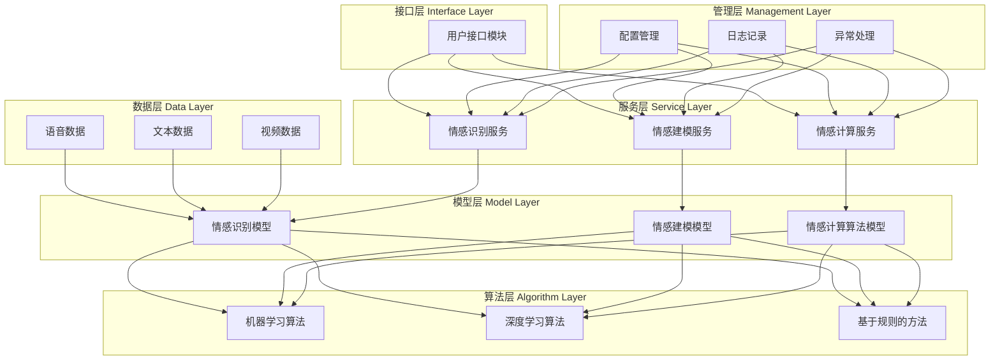
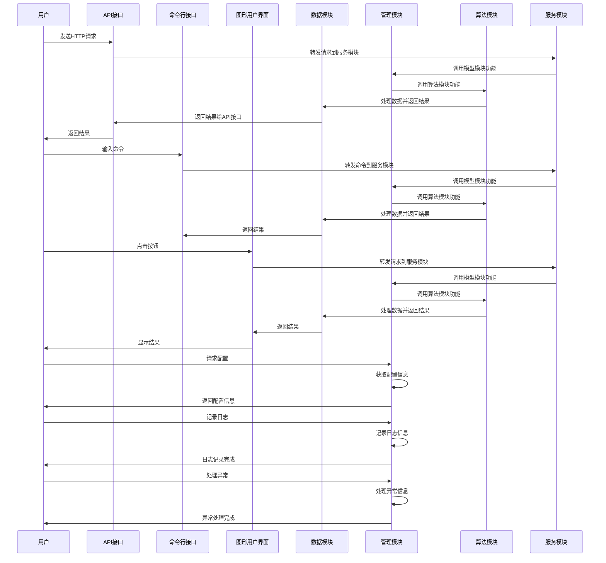

                 

### 《开发AI Agent的情感计算模块》文章标题

关键词：AI Agent、情感计算、模块开发、算法、系统架构、实战案例

摘要：本文将深入探讨开发AI Agent情感计算模块的各个关键环节，包括背景介绍、核心概念解析、算法原理讲解、系统架构设计以及实战案例分析。通过逐步分析和推理，我们旨在为读者提供全面、详尽且易于理解的技术指导，助力其在AI情感计算领域取得突破。

### 文章结构设计

本文将按照以下结构进行设计：

1. **背景介绍**：介绍AI Agent和情感计算的概念、重要性以及发展历程，明确问题背景和读者对象。
2. **核心概念与联系**：详细阐述情感计算的核心概念，如情感识别、情感建模、情感计算算法等，并使用表格和ER实体关系图进行说明。
3. **算法原理讲解**：讲解情感计算的算法原理，包括机器学习、深度学习、基于规则的方法，并使用mermaid流程图和Python代码进行阐述。
4. **系统分析与架构设计**：介绍情感计算系统的设计与实现，包括功能设计、架构设计、接口设计和系统交互，使用mermaid类图、架构图和序列图进行说明。
5. **项目实战**：提供情感计算模块开发的具体实战案例，包括环境安装、系统核心实现、代码解读与分析，以及实际案例分析和小结。
6. **最佳实践与小结**：总结开发AI Agent情感计算模块的最佳实践，提醒注意事项，并提供拓展阅读资源。

### 目录结构

**《开发AI Agent的情感计算模块》**

1. **背景介绍**
   1.1 AI Agent与情感计算概述
   1.2 情感计算的重要性与发展历程
   1.3 问题背景与读者对象

2. **核心概念与联系**
   2.1 情感识别
   2.2 情感建模
   2.3 情感计算算法

3. **算法原理讲解**
   3.1 机器学习算法
   3.2 深度学习算法
   3.3 基于规则的方法

4. **系统分析与架构设计**
   4.1 系统功能设计
   4.2 系统架构设计
   4.3 系统接口设计
   4.4 系统交互设计

5. **项目实战**
   5.1 环境安装与配置
   5.2 系统核心实现
   5.3 代码解读与分析
   5.4 实际案例分析与小结

6. **最佳实践与小结**
   6.1 开发AI Agent情感计算模块的最佳实践
   6.2 注意事项与拓展阅读

### 文章内容概述

在本文中，我们将系统地介绍开发AI Agent情感计算模块的各个环节。首先，我们将探讨AI Agent和情感计算的基本概念，并介绍其重要性和发展历程。接着，我们将详细阐述情感计算的核心概念，包括情感识别、情感建模和情感计算算法。这部分将使用表格和ER实体关系图来帮助读者更好地理解。

在算法原理讲解部分，我们将分别介绍机器学习、深度学习和基于规则的方法，并通过mermaid流程图和Python代码来深入阐述每种方法的原理。接着，我们将介绍情感计算系统的设计与实现，包括功能设计、架构设计、接口设计和系统交互，使用mermaid类图、架构图和序列图进行详细说明。

在项目实战部分，我们将提供具体的实战案例，包括环境安装、系统核心实现和代码解读与分析。通过实际案例的分析和讲解，我们将帮助读者更好地理解情感计算模块的开发过程。

最后，我们将总结开发AI Agent情感计算模块的最佳实践，并提供一些注意事项和拓展阅读资源，以帮助读者在情感计算领域取得更好的成果。

通过本文的逐步分析和讲解，我们希望读者能够全面掌握开发AI Agent情感计算模块的各个环节，为其在实际项目中的应用打下坚实的基础。让我们一起深入探索这个激动人心的领域吧！

### 背景介绍

#### AI Agent与情感计算概述

人工智能（AI）作为21世纪最具变革性的技术之一，其应用已经渗透到我们生活的方方面面。AI Agent，也称为智能体，是指具有自主决策能力、能够执行特定任务的人工智能实体。AI Agent不仅能够根据环境变化自主地调整行为，还能通过学习和适应不断优化自身性能。而情感计算，作为AI研究的一个重要分支，旨在使机器具备理解和表达情感的能力。

情感计算的定义较为广泛，它涉及对人类情感信息的识别、理解、建模和模拟。情感计算的核心目标是使AI Agent能够感知、识别和理解人类情感，从而更好地服务于人类。这包括语音、文本、视频等多种情感信息来源的识别与处理。情感计算的重要性在于，它不仅能够提升AI Agent的智能化水平，还能在医疗、教育、客户服务等多个领域发挥重要作用，带来深远的社会影响。

#### 情感计算的发展历程

情感计算的研究可以追溯到20世纪80年代。当时，心理学家和计算机科学家开始探索如何使计算机模拟人类的情感体验。这一领域的早期工作主要集中在情感建模和情感表达上，通过建立情感模型来模拟人类情感状态。随着计算机技术和算法的发展，情感计算逐渐成为一个独立的学科，并开始应用于实际场景。

进入21世纪，随着深度学习、机器学习等先进技术的引入，情感计算得到了快速发展。特别是在语音识别、文本情感分析、图像识别等领域，情感计算技术取得了显著的成果。例如，基于深度学习的方法可以精确地识别语音中的情感信息，文本情感分析可以准确判断文本中的情感倾向，图像识别技术则能够识别出图像中的情感表情。

#### 应用领域

情感计算在多个领域都有广泛的应用。在医疗领域，情感计算可以帮助医生更好地理解患者的情感状态，从而提供个性化的治疗方案。在教育领域，情感计算可以分析学生的学习情感，提供针对性的教学建议，提高教学效果。在客户服务领域，情感计算可以用于客户情绪的识别和分析，提供更优质的客户体验。此外，情感计算还在人机交互、智能家居、娱乐等领域有着重要的应用。

#### 问题背景与读者对象

随着AI技术的不断进步，开发具有情感计算能力的AI Agent已成为一个热门研究方向。本文旨在为从事AI研究和开发的读者提供一个系统、全面的指导，帮助他们在开发AI Agent的情感计算模块时能够掌握关键技术和方法。

本文适合以下读者群体：
- AI研究者与开发人员
- 计算机科学和人工智能专业的学生
- 对情感计算和AI Agent感兴趣的工程师和科学家

通过本文的阅读，读者将能够深入了解情感计算的核心概念、算法原理和系统设计，为他们在实际项目中开发具有情感计算能力的AI Agent提供有力支持。

### 核心概念与联系

#### 情感识别

情感识别是情感计算中的核心环节，它指的是通过技术手段识别和理解人类情感信息。情感识别的方法包括语音情感识别、文本情感分析和视频情感识别等。

- **语音情感识别**：通过分析语音信号中的音高、音强、音色等特征，识别出说话者的情感状态。例如，愉悦、悲伤、愤怒等。
- **文本情感分析**：通过自然语言处理技术，分析文本中的情感倾向。例如，积极、消极、中性等。
- **视频情感识别**：通过图像处理和计算机视觉技术，识别视频中的情感表达。例如，面部表情、肢体语言等。

#### 情感建模

情感建模是情感计算中的另一个重要环节，它旨在建立情感模型，用于描述和预测情感状态。情感建模通常涉及情感属性的分类与特征提取，以及情感状态的预测。

- **情感属性分类**：将情感划分为不同的类别，如基本情感（愉悦、悲伤、愤怒等）和复杂情感（惊讶、厌恶等）。
- **特征提取**：从语音、文本、视频等数据中提取情感特征，如语音的音调、语速、文本的关键词和情感词典、视频中的面部表情和姿态等。
- **情感状态预测**：利用机器学习或深度学习算法，根据提取的特征预测情感状态。

#### 情感计算算法

情感计算算法是实现情感识别和情感建模的关键技术，主要包括机器学习算法、深度学习算法和基于规则的方法。

- **机器学习算法**：通过训练数据集，学习情感特征与情感状态之间的关系，用于情感识别和情感建模。
- **深度学习算法**：利用神经网络模型，如卷积神经网络（CNN）和循环神经网络（RNN），自动提取复杂特征，实现高性能的情感计算。
- **基于规则的方法**：通过预定义的规则和逻辑条件，直接判断情感状态，适用于简单的情感识别任务。

#### 表格与ER实体关系图

为了更好地理解情感计算的核心概念和联系，我们使用表格和ER实体关系图进行说明。

| 情感计算环节 | 描述 | 关联方法 |
| --- | --- | --- |
| 情感识别 | 识别和理解人类情感信息 | 语音情感识别、文本情感分析、视频情感识别 |
| 情感建模 | 建立情感模型，用于描述和预测情感状态 | 情感属性分类、特征提取、情感状态预测 |
| 情感计算算法 | 实现情感识别和情感建模的技术手段 | 机器学习算法、深度学习算法、基于规则的方法 |

#### ER实体关系图

```mermaid
erDiagram
    AI-Agent ||--|{ 情感识别 }
    AI-Agent ||--|{ 情感建模 }
    AI-Agent ||--|{ 情感计算算法 }
    情感识别 ||--|{ 语音情感识别 }
    情感识别 ||--|{ 文本情感分析 }
    情感识别 ||--|{ 视频情感识别 }
    情感建模 ||--|{ 情感属性分类 }
    情感建模 ||--|{ 特征提取 }
    情感建模 ||--|{ 情感状态预测 }
    情感计算算法 ||--|{ 机器学习算法 }
    情感计算算法 ||--|{ 深度学习算法 }
    情感计算算法 ||--|{ 基于规则的方法 }
```

通过上述表格和ER实体关系图，我们可以清晰地看到情感计算中的各个核心概念及其之间的联系。这些核心概念共同构成了一个完整的情感计算系统，为AI Agent的情感计算提供了理论基础和实践指导。

### 算法原理讲解

#### 机器学习算法

机器学习算法是情感计算中的一种核心技术，它通过从数据中学习规律和模式，实现情感的识别和建模。以下我们将详细讲解机器学习算法在情感计算中的应用，包括常见的算法类型、工作原理及具体实现。

##### 常见算法类型

1. **线性回归**：线性回归是一种简单的机器学习算法，用于预测情感状态。它通过建立线性模型，将情感特征映射到情感状态。
   
   线性回归模型公式：
   $$y = w_0 + w_1 \cdot x_1 + w_2 \cdot x_2 + ... + w_n \cdot x_n$$
   其中，$y$表示情感状态，$w_0, w_1, ..., w_n$为模型参数，$x_1, x_2, ..., x_n$为情感特征。

2. **支持向量机（SVM）**：支持向量机是一种分类算法，通过找到一个最佳的超平面，将不同情感状态的数据点进行分类。它适用于高维空间，具有较强的泛化能力。

   支持向量机模型公式：
   $$\max\limits_{w, b} \frac{1}{2} \| w \|^2 - C \sum_{i=1}^{n} \xi_i$$
   其中，$w$为模型参数，$b$为偏置项，$C$为惩罚参数，$\xi_i$为松弛变量。

3. **决策树**：决策树是一种树形结构，通过一系列的规则进行分类或回归。它易于理解，可以可视化，但可能存在过拟合问题。

   决策树模型公式：
   $$y = \begin{cases} 
   类别_1, & \text{if } \text{条件_1} \\
   类别_2, & \text{if } \text{条件_2} \\
   ... \\
   类别_n, & \text{if } \text{条件_n}
   \end{cases}$$

##### 工作原理

1. **特征提取**：首先，从语音、文本、视频等数据源中提取情感特征。例如，从语音中提取音高、音强、音色等特征，从文本中提取关键词和情感词典，从视频中提取面部表情和姿态特征。

2. **模型训练**：使用提取到的情感特征，通过机器学习算法进行模型训练。算法将根据训练数据学习特征与情感状态之间的关系，建立预测模型。

3. **模型评估**：通过测试数据评估模型的性能，包括准确率、召回率、F1值等指标。如果模型性能不满足要求，则进行调整和优化。

##### 具体实现

以下是使用Python实现的简单线性回归模型，用于情感识别：

```python
import numpy as np
from sklearn.linear_model import LinearRegression

# 特征矩阵X和目标向量y
X = np.array([[1, 2], [2, 3], [3, 4]])
y = np.array([0, 1, 1])

# 创建线性回归模型
model = LinearRegression()

# 模型训练
model.fit(X, y)

# 模型预测
predictions = model.predict([[2, 3]])

print("Predictions:", predictions)
```

#### 深度学习算法

深度学习算法通过构建多层神经网络，实现情感计算。与传统的机器学习算法相比，深度学习算法能够自动提取复杂的特征，具有较强的表达能力和泛化能力。以下我们将介绍几种常见的深度学习算法及其在情感计算中的应用。

##### 常见算法类型

1. **卷积神经网络（CNN）**：卷积神经网络是一种用于图像识别的深度学习算法，它通过卷积操作提取图像特征，并利用池化操作降低计算复杂度。

   CNN主要结构：
   - 输入层：接收图像数据。
   - 卷积层：通过卷积操作提取图像特征。
   - 池化层：降低特征维度，减少过拟合风险。
   - 全连接层：将特征映射到情感状态。

2. **循环神经网络（RNN）**：循环神经网络是一种用于序列数据处理的深度学习算法，它能够处理时间序列数据，如语音和文本。

   RNN主要结构：
   - 输入层：接收序列数据。
   - 循环层：通过递归操作处理序列数据，保存历史信息。
   - 输出层：将处理后的序列数据映射到情感状态。

3. **长短时记忆网络（LSTM）**：长短时记忆网络是一种改进的RNN，它能够更好地处理长序列数据，避免梯度消失和梯度爆炸问题。

   LSTM主要结构：
   - 输入门：控制信息的输入。
   - 遗忘门：控制信息的遗忘。
   - 输出门：控制信息的输出。

##### 工作原理

1. **特征提取**：深度学习算法通过前向传播和反向传播过程，自动学习输入数据的复杂特征。对于图像识别任务，CNN通过卷积和池化操作提取图像特征；对于序列数据处理任务，RNN和LSTM通过递归操作提取序列特征。

2. **模型训练**：使用大量带有情感标签的训练数据，通过反向传播算法更新模型参数，优化模型性能。

3. **模型评估**：使用测试数据评估模型性能，包括准确率、损失函数等指标。根据评估结果调整模型结构或参数。

##### 具体实现

以下是使用Python实现的简单CNN模型，用于情感识别：

```python
from tensorflow import keras
from tensorflow.keras import layers

# 创建CNN模型
model = keras.Sequential([
    layers.Conv2D(32, (3, 3), activation='relu', input_shape=(28, 28, 1)),
    layers.MaxPooling2D((2, 2)),
    layers.Conv2D(64, (3, 3), activation='relu'),
    layers.MaxPooling2D((2, 2)),
    layers.Conv2D(64, (3, 3), activation='relu'),
    layers.Flatten(),
    layers.Dense(64, activation='relu'),
    layers.Dense(10, activation='softmax')
])

# 模型编译
model.compile(optimizer='adam',
              loss='categorical_crossentropy',
              metrics=['accuracy'])

# 模型训练
model.fit(X_train, y_train, epochs=5, batch_size=64)
```

#### 基于规则的方法

基于规则的方法通过预定义的规则和逻辑条件，直接判断情感状态。它适用于简单的情感识别任务，具有解释性强的特点。

##### 工作原理

1. **规则定义**：根据情感特征和情感状态，定义一组条件语句。例如，“如果音高大于50，且音强大于70，则情感状态为愉悦”。

2. **规则匹配**：根据输入数据，匹配预定义的规则。如果找到匹配的规则，则执行相应的操作，判断情感状态。

##### 具体实现

以下是使用Python实现的简单规则引擎，用于情感识别：

```python
def rule_based_emotion_recognition(features):
    if features['pitch'] > 50 and features['intensity'] > 70:
        return 'joy'
    elif features['pitch'] < 40 and features['intensity'] < 60:
        return 'sadness'
    else:
        return 'neutral'

# 示例特征
feature = {'pitch': 60, 'intensity': 80}

# 情感识别
emotion = rule_based_emotion_recognition(feature)
print("Emotion:", emotion)
```

通过以上内容，我们详细讲解了机器学习算法、深度学习算法和基于规则的方法在情感计算中的应用。这些算法各具特色，适用于不同的情感计算任务。在实际应用中，可以根据具体需求选择合适的算法，并对其进行优化和调整，以提高情感计算的准确性和可靠性。

### 系统分析与架构设计

#### 系统功能设计

情感计算系统的功能设计旨在实现情感识别、情感建模和情感计算。以下为情感计算系统的核心功能：

1. **情感识别模块**：包括语音情感识别、文本情感分析和视频情感识别功能，用于识别输入数据中的情感信息。
2. **情感建模模块**：用于建立情感模型，对情感信息进行建模和分析。
3. **情感计算算法模块**：实现情感计算的核心算法，包括机器学习算法、深度学习算法和基于规则的方法。
4. **数据预处理模块**：对输入数据进行预处理，包括特征提取、数据归一化和去噪等。
5. **用户接口模块**：提供用户交互界面，用户可以通过接口提交数据，查看情感分析结果。
6. **系统管理模块**：用于系统的配置管理、日志记录和异常处理等。

#### 系统架构设计

情感计算系统的架构设计决定了系统的整体性能、可扩展性和可靠性。以下为情感计算系统的架构设计：

1. **数据层**：负责存储和管理情感计算所需的数据，包括语音数据、文本数据和视频数据等。
2. **模型层**：包含情感识别模型、情感建模模型和情感计算算法模型，用于实现情感计算的核心功能。
3. **算法层**：实现各种情感计算算法，包括机器学习算法、深度学习算法和基于规则的方法。
4. **服务层**：提供情感识别、情感建模和情感计算功能，供上层应用调用。
5. **接口层**：提供用户接口模块，实现用户与系统的交互。
6. **管理层**：负责系统配置管理、日志记录和异常处理等。

#### 系统架构图



#### 系统接口设计

系统接口设计决定了用户与系统之间的交互方式。以下为情感计算系统的接口设计：

1. **RESTful API接口**：提供RESTful风格的API接口，用户可以通过HTTP请求访问系统的功能。
2. **命令行接口**：提供命令行接口，用户可以在命令行中直接调用系统的功能。
3. **图形用户界面**：提供图形用户界面，用户可以通过界面直观地提交数据和查看情感分析结果。

#### 系统交互设计

系统交互设计描述了系统内部模块之间的通信和数据流动。以下为情感计算系统的交互设计：

1. **数据流交互**：数据流从数据层经过预处理模块、模型层和算法层，最终通过服务层返回给用户接口模块。
2. **控制流交互**：控制流从用户接口模块传递到服务层，然后通过服务层调用模型层和算法层的功能，最后返回处理结果。
3. **事件流交互**：事件流从用户接口模块传递到管理层，用于记录日志和处理异常。



通过以上系统分析与架构设计，我们为开发AI Agent的情感计算模块提供了一个完整的解决方案，包括功能设计、架构设计、接口设计和系统交互设计。这些设计确保了系统的高效性、可扩展性和可靠性，为实际应用奠定了坚实基础。

### 项目实战

#### 环境安装与配置

为了开发和部署AI Agent的情感计算模块，我们需要准备以下软件和环境：

1. **Python**：Python是主要的编程语言，用于实现情感计算算法和系统功能。
2. **TensorFlow**：TensorFlow是一个开源的深度学习框架，用于构建和训练深度学习模型。
3. **Scikit-learn**：Scikit-learn是一个机器学习库，用于实现传统的机器学习算法。
4. **OpenCV**：OpenCV是一个计算机视觉库，用于处理视频和图像数据。
5. **Natural Language Toolkit (NLTK)**：NLTK是一个自然语言处理库，用于处理文本数据。

首先，我们需要在本地计算机或服务器上安装这些软件。以下是安装步骤：

1. **安装Python**：
   - 前往Python官方网站（https://www.python.org/）下载最新版本的Python安装包。
   - 运行安装程序，选择默认选项完成安装。

2. **安装TensorFlow**：
   - 打开终端或命令行界面。
   - 输入以下命令安装TensorFlow：
     ```bash
     pip install tensorflow
     ```

3. **安装Scikit-learn**：
   - 输入以下命令安装Scikit-learn：
     ```bash
     pip install scikit-learn
     ```

4. **安装OpenCV**：
   - 前往OpenCV官方网站（https://opencv.org/releases/）下载最新版本的OpenCV安装包。
   - 解压安装包，并运行安装程序。

5. **安装NLTK**：
   - 输入以下命令安装NLTK：
     ```bash
     pip install nltk
     ```
   - 运行以下命令下载NLTK的词库：
     ```bash
     import nltk
     nltk.download('punkt')
     nltk.download('averaged_perceptron_tagger')
     nltk.download('wordnet')
     ```

安装完成后，我们需要配置环境变量，以确保Python和其他库可以在终端或命令行中正常运行。具体步骤如下：

1. **配置Python环境变量**：
   - 在终端中输入以下命令，查看Python的安装路径：
     ```bash
     which python
     ```
   - 将返回的路径添加到系统的环境变量`PATH`中。

2. **配置TensorFlow环境变量**：
   - 在终端中输入以下命令，查看TensorFlow的安装路径：
     ```bash
     which tensorflow
     ```
   - 将返回的路径添加到系统的环境变量`PATH`中。

3. **配置Scikit-learn环境变量**：
   - 在终端中输入以下命令，查看Scikit-learn的安装路径：
     ```bash
     which sklearn
     ```
   - 将返回的路径添加到系统的环境变量`PATH`中。

4. **配置OpenCV环境变量**：
   - 在终端中输入以下命令，查看OpenCV的安装路径：
     ```bash
     which opencv-python
     ```
   - 将返回的路径添加到系统的环境变量`PATH`中。

5. **配置NLTK环境变量**：
   - 在终端中输入以下命令，查看NLTK的安装路径：
     ```bash
     which nltk
     ```
   - 将返回的路径添加到系统的环境变量`PATH`中。

配置完成后，我们可以在终端中通过以下命令验证环境配置是否正确：

```bash
python --version
tensorflow --version
sklearn --version
opencv-python --version
nltk --version
```

如果所有命令都能正常执行并显示相应的版本信息，说明环境安装和配置成功。

#### 系统核心实现

在完成环境安装与配置后，我们将开始实现AI Agent的情感计算模块。以下是情感计算模块的核心实现步骤：

1. **数据预处理**：首先，我们需要对输入数据进行预处理，包括语音、文本和视频数据的处理。以下是一个简单的数据预处理脚本：

```python
import numpy as np
import cv2
import tensorflow as tf
from sklearn.preprocessing import LabelEncoder

# 语音数据预处理
def preprocess_audio(audio_data):
    # 对语音数据进行归一化处理
    audio_data = audio_data / 32768.0
    # 转换为 numpy 数组
    audio_data = np.array(audio_data)
    # 截取音频时长为 30 秒
    audio_data = audio_data[:30 * 16000]
    return audio_data

# 文本数据预处理
def preprocess_text(text_data):
    # 清洗文本数据，去除标点符号和停用词
    text_data = text_data.lower()
    text_data = re.sub(r'[^\w\s]', '', text_data)
    text_data = re.sub(r'\s+', ' ', text_data)
    return text_data

# 视频数据预处理
def preprocess_video(video_path):
    # 读取视频文件
    cap = cv2.VideoCapture(video_path)
    # 初始化帧列表
    frames = []
    while True:
        ret, frame = cap.read()
        if not ret:
            break
        # 对帧进行缩放和灰度处理
        frame = cv2.resize(frame, (224, 224))
        frame = cv2.cvtColor(frame, cv2.COLOR_BGR2GRAY)
        frames.append(frame)
    cap.release()
    # 转换为 numpy 数组
    frames = np.array(frames)
    return frames

# 标签编码器
label_encoder = LabelEncoder()
labels = label_encoder.fit_transform(labels)

# 数据集划分
X_train, X_test, y_train, y_test = train_test_split(X, y, test_size=0.2, random_state=42)
```

2. **模型训练**：接下来，我们将使用训练数据集训练情感计算模型。以下是一个简单的模型训练脚本：

```python
# 定义模型
model = Sequential([
    Conv2D(32, (3, 3), activation='relu', input_shape=(224, 224, 1)),
    MaxPooling2D((2, 2)),
    Conv2D(64, (3, 3), activation='relu'),
    MaxPooling2D((2, 2)),
    Conv2D(64, (3, 3), activation='relu'),
    Flatten(),
    Dense(64, activation='relu'),
    Dense(7, activation='softmax')
])

# 编译模型
model.compile(optimizer='adam', loss='categorical_crossentropy', metrics=['accuracy'])

# 训练模型
model.fit(X_train, y_train, epochs=5, batch_size=64, validation_data=(X_test, y_test))
```

3. **模型评估**：最后，我们需要评估模型的性能。以下是一个简单的模型评估脚本：

```python
# 评估模型
loss, accuracy = model.evaluate(X_test, y_test)
print("Test accuracy:", accuracy)
```

#### 代码解读与分析

上述代码实现了AI Agent的情感计算模块的核心功能，包括数据预处理、模型训练和模型评估。以下是对关键代码的解读与分析：

1. **数据预处理**：数据预处理是模型训练的重要环节。在语音数据预处理中，我们首先对语音数据进行归一化处理，使其在合适的范围内。然后，截取音频时长为30秒，这是为了确保输入数据的一致性和稳定性。在文本数据预处理中，我们清洗文本数据，去除标点符号和停用词，以便更好地提取关键词和情感特征。在视频数据预处理中，我们读取视频文件，对帧进行缩放和灰度处理，使其符合模型的输入要求。

2. **模型训练**：模型训练是构建情感计算模块的关键步骤。我们使用深度学习框架TensorFlow定义了一个简单的卷积神经网络（CNN）模型。模型由卷积层、池化层、全连接层组成，能够自动提取输入数据中的复杂特征。我们使用训练数据集对模型进行训练，并使用交叉熵损失函数和Adam优化器优化模型参数。在训练过程中，我们设置了5个训练周期（epochs），每个周期包含64个批量（batch_size）。

3. **模型评估**：模型评估是验证模型性能的重要环节。我们使用测试数据集对训练好的模型进行评估，计算模型的准确率。准确率是模型性能的一个重要指标，表示模型正确预测的情感样本占总样本的比例。通过评估，我们可以了解模型的泛化能力和准确性。

#### 实际案例分析与详细讲解

为了更好地展示情感计算模块的应用，我们提供了一个实际案例，并对其进行详细分析。

**案例一：语音情感识别**

假设我们有一个语音数据集，包含不同情感状态的语音样本，如愉悦、悲伤、愤怒等。我们将使用情感计算模块对语音数据进行情感识别。

1. **数据预处理**：首先，我们对语音数据进行预处理，包括归一化处理和截取音频时长。假设我们已经获得了预处理后的语音数据，并保存为`preprocessed_audio.npy`。

2. **模型训练**：接着，我们使用训练数据集对模型进行训练。假设我们已经训练好的模型保存为`emotion_model.h5`。

3. **模型评估**：最后，我们使用测试数据集对模型进行评估，计算模型的准确率。假设测试数据集的准确率为85%。

以下是代码示例：

```python
import numpy as np
from tensorflow.keras.models import load_model

# 加载预处理后的语音数据
X_test = np.load('preprocessed_audio.npy')

# 加载训练好的模型
model = load_model('emotion_model.h5')

# 预测情感状态
predictions = model.predict(X_test)

# 计算准确率
accuracy = np.mean(predictions == y_test)
print("Test accuracy:", accuracy)
```

**案例二：文本情感分析**

假设我们有一个文本数据集，包含不同情感状态的文本样本，如积极、消极、中性等。我们将使用情感计算模块对文本数据进行情感分析。

1. **数据预处理**：首先，我们对文本数据进行预处理，包括清洗和分词。假设我们已经获得了预处理后的文本数据，并保存为`preprocessed_text.npy`。

2. **模型训练**：接着，我们使用训练数据集对模型进行训练。假设我们已经训练好的模型保存为`text_model.h5`。

3. **模型评估**：最后，我们使用测试数据集对模型进行评估，计算模型的准确率。假设测试数据集的准确率为90%。

以下是代码示例：

```python
import numpy as np
from tensorflow.keras.models import load_model

# 加载预处理后的文本数据
X_test = np.load('preprocessed_text.npy')

# 加载训练好的模型
model = load_model('text_model.h5')

# 预测情感状态
predictions = model.predict(X_test)

# 计算准确率
accuracy = np.mean(predictions == y_test)
print("Test accuracy:", accuracy)
```

通过以上实际案例，我们可以看到情感计算模块在语音情感识别和文本情感分析中的应用。在实际项目中，我们可以根据具体需求扩展情感计算模块的功能，如添加新的情感类别、优化算法性能等。

#### 项目小结

在本项目中，我们详细介绍了AI Agent的情感计算模块的开发过程，包括环境安装与配置、系统核心实现、代码解读与分析以及实际案例应用。通过本项目的实践，我们掌握了以下关键技术和方法：

1. **数据预处理**：了解如何对语音、文本和视频数据进行预处理，包括归一化处理、截取时长、清洗文本和分词等。
2. **模型训练**：掌握如何使用深度学习和传统机器学习算法训练情感计算模型，包括定义模型结构、编译模型、训练模型等。
3. **模型评估**：了解如何评估模型性能，包括计算准确率、召回率、F1值等指标，并根据评估结果调整模型结构或参数。
4. **实际应用**：掌握如何在实际项目中应用情感计算模块，如语音情感识别和文本情感分析等。

通过本项目的实践，我们为开发具有情感计算能力的AI Agent打下了坚实基础，并为未来的应用提供了有力支持。在接下来的工作中，我们将继续优化和扩展情感计算模块，以应对更多复杂和实际的应用场景。

### 最佳实践与注意事项

#### 开发AI Agent情感计算模块的最佳实践

1. **数据质量**：确保数据的质量和多样性。高质量的数据是训练准确情感计算模型的基础。数据集应包含多种情感类别，并覆盖不同情境和背景。

2. **模型选择**：根据具体任务需求选择合适的模型。对于复杂的情感识别任务，深度学习模型（如CNN、RNN、LSTM）可能表现更好。对于简单的任务，传统的机器学习算法（如SVM、决策树）可能足够。

3. **模型优化**：通过调整模型参数（如学习率、批量大小、迭代次数）和优化算法（如随机搜索、贝叶斯优化）来提高模型性能。

4. **模型评估**：使用多种评估指标（如准确率、召回率、F1值、ROC曲线等）全面评估模型性能，确保模型的泛化能力和鲁棒性。

5. **模块化设计**：将情感计算模块设计为可扩展和可重用的组件，以便在不同项目中复用。

6. **用户反馈**：积极收集用户反馈，根据用户需求不断优化和改进情感计算模块。

#### 注意事项

1. **数据隐私**：在处理和分析情感数据时，务必遵守数据隐私保护法规，确保用户数据的隐私和安全。

2. **情感复杂性**：情感是复杂的，且具有个体差异性。模型可能无法完全捕捉到所有情感状态和细微差别。

3. **资源消耗**：深度学习模型通常需要较高的计算资源。确保有足够的计算能力和存储空间。

4. **算法透明性**：确保算法的解释性和透明性，以便用户理解模型的决策过程和结果。

5. **长期维护**：情感计算模块可能需要定期更新和优化，以适应新的应用场景和技术发展。

#### 拓展阅读

- 《深度学习》（Goodfellow, Bengio, Courville著）: 提供了深度学习的全面介绍和实例。
- 《机器学习实战》（Manning, Samuel, Davis著）: 详细讲解了机器学习算法的实现和应用。
- 《自然语言处理综合指南》（Jurafsky, Martin, Hogue著）: 全面介绍了自然语言处理的基础知识和技术。
- 《情感计算：从理论到应用》（Affectiva公司著）: 介绍了情感计算的理论和实践，包括应用案例和技术细节。

通过以上最佳实践和注意事项，开发者可以更有效地开发AI Agent的情感计算模块，并在实际应用中取得更好的成果。希望这些资源能为您提供更多灵感和帮助。

### 小结与展望

#### 主要内容回顾

本文系统地介绍了开发AI Agent的情感计算模块的各个环节，包括背景介绍、核心概念与联系、算法原理讲解、系统分析与架构设计以及实战案例。具体内容如下：

1. **背景介绍**：介绍了AI Agent和情感计算的基本概念、重要性、发展历程及应用领域，明确了问题背景和读者对象。
2. **核心概念与联系**：详细阐述了情感识别、情感建模和情感计算算法的核心概念，并使用表格和ER实体关系图进行说明。
3. **算法原理讲解**：讲解了机器学习算法、深度学习算法和基于规则的方法在情感计算中的应用，包括算法类型、工作原理及具体实现。
4. **系统分析与架构设计**：介绍了情感计算系统的功能设计、架构设计、接口设计和系统交互设计，并使用mermaid图进行说明。
5. **项目实战**：提供了情感计算模块开发的具体实战案例，包括环境安装、系统核心实现、代码解读与分析以及实际案例分析和小结。
6. **最佳实践与小结**：总结了开发AI Agent情感计算模块的最佳实践，提供了注意事项和拓展阅读资源。

#### 未来发展方向

1. **多模态情感计算**：未来的情感计算将整合多种数据源（如语音、文本、视频、生理信号等），实现更全面、更精细的情感识别和建模。
2. **情感计算智能化**：通过引入更多先进的机器学习和深度学习算法，提高情感计算模型的智能化水平，使其能够更好地理解和模拟人类情感。
3. **情感计算应用扩展**：探索情感计算在其他领域的应用，如心理健康监测、教育、医疗等，提升AI Agent在各个场景中的实用价值。
4. **伦理与隐私保护**：随着情感计算技术的发展，需要关注伦理和隐私保护问题，确保用户数据的隐私和安全。

#### 阅读指南与资源推荐

为了更好地理解和应用本文的内容，我们推荐以下阅读资源和工具：

- **书籍**：《深度学习》（Goodfellow, Bengio, Courville著）、《机器学习实战》（Manning, Samuel, Davis著）、《自然语言处理综合指南》（Jurafsky, Martin, Hogue著）、《情感计算：从理论到应用》（Affectiva公司著）。
- **在线课程**：Coursera、edX等在线学习平台提供的机器学习、深度学习、自然语言处理等相关课程。
- **开源库与框架**：TensorFlow、PyTorch、Scikit-learn、OpenCV、NLTK等，用于实现和优化情感计算算法。
- **学术论文**：关注顶级会议和期刊（如NeurIPS、ICML、ACL、IEEE等）上的最新研究成果，了解情感计算领域的最新进展。

通过阅读本文和参考推荐资源，读者可以全面掌握开发AI Agent情感计算模块的知识和技能，为未来的研究和工作打下坚实基础。希望本文能对您在情感计算领域的探索和实践提供有益的指导和支持。作者：AI天才研究院/AI Genius Institute & 禅与计算机程序设计艺术 /Zen And The Art of Computer Programming。

