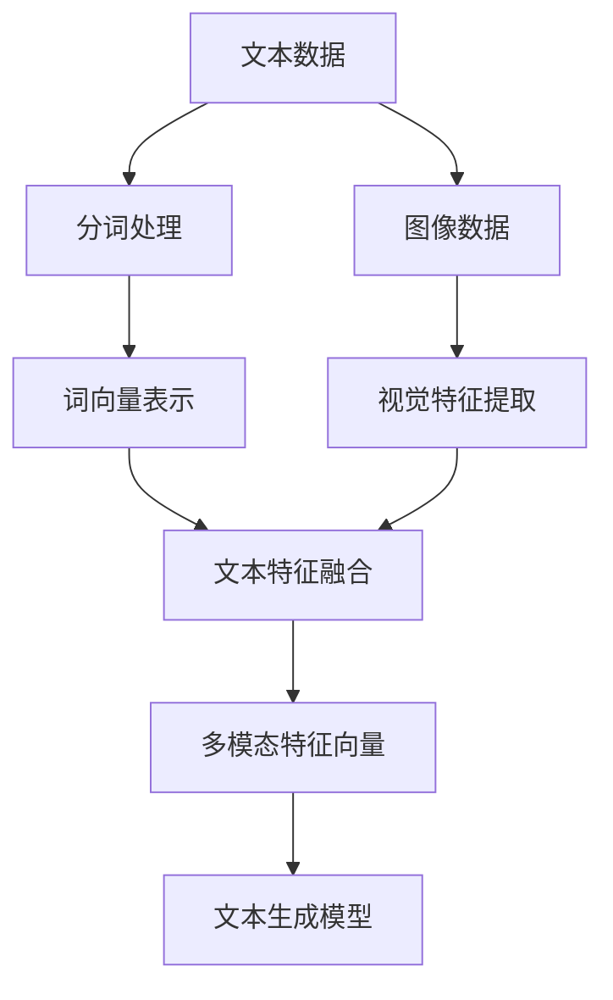
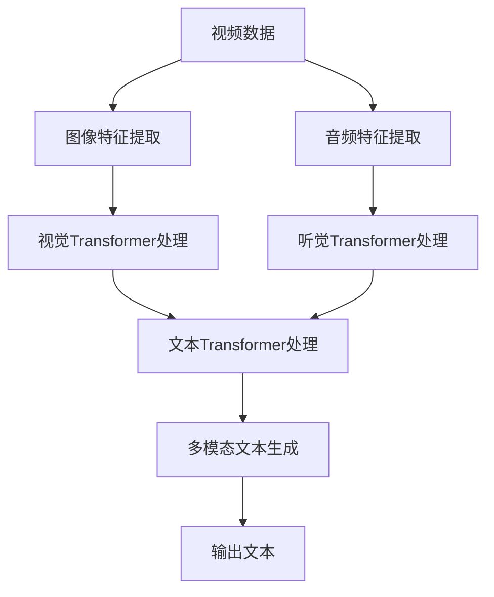
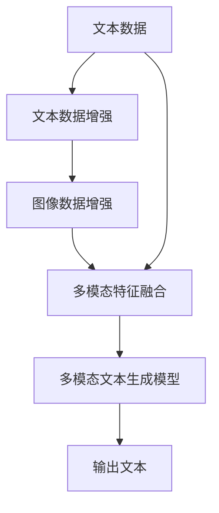
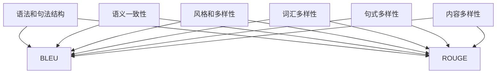
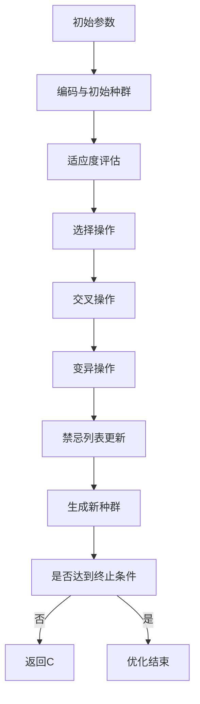

                 

### 引言

《开发AI Agent的文本生成控制能力》

随着人工智能技术的飞速发展，AI Agent在多个领域的应用逐渐成为现实。从自动化客服、智能助理到自动驾驶和智能安防，AI Agent正逐步渗透到我们日常生活的方方面面。而在这其中，文本生成控制能力尤为关键，它不仅决定了AI Agent与人类交互的自然程度，也直接影响其在自动化写作、内容创作等领域的应用效果。本文旨在深入探讨开发AI Agent的文本生成控制能力，帮助读者理解这一技术的核心原理、实现方法以及未来发展趋势。

文本生成控制能力是指AI Agent在生成文本时，能够根据输入信息和特定任务要求，灵活调整和控制文本内容、风格、格式等方面的能力。这一能力不仅要求AI Agent具备强大的自然语言理解和生成能力，还需要其在特定场景下能够进行智能决策和适应。

本文将分为以下几个部分：

1. **AI Agent与文本生成技术基础**：介绍AI Agent和文本生成技术的定义、核心概念及其关系，回顾文本生成技术的发展历程，并分析AI Agent在文本生成中的应用。

2. **文本生成控制技术原理**：阐述文本生成控制的概念、关键技术和方法，分析文本生成控制面临的挑战和趋势。

3. **基于深度学习的文本生成模型**：介绍深度学习的基础知识，讲解RNN、Transformer、BERT等模型在文本生成控制中的应用。

4. **多模态文本生成控制**：探讨多模态数据融合方法、多模态文本生成模型以及多模态文本生成控制的挑战和优化方法。

5. **文本生成控制的评价指标与优化**：介绍文本生成控制的评价指标，探讨优化方法，并通过实践案例进行分析。

6. **文本生成控制的应用实例**：列举AI Agent在自动化写作等领域的应用实例，分析其实际效果。

7. **未来展望与挑战**：预测文本生成控制技术的发展方向，提出可能面临的挑战及解决思路。

通过对这些内容的深入探讨，本文希望为读者提供一个全面、系统的理解，帮助他们在实际开发中更好地应用AI Agent的文本生成控制能力。

#### 目录大纲

**《开发AI Agent的文本生成控制能力》**

> 关键词：AI Agent，文本生成，深度学习，多模态，控制技术，应用实例

> 摘要：本文深入探讨了AI Agent的文本生成控制能力，从基础概念到具体实现，再到应用实例，全面解析了这一技术的核心原理、实现方法及其未来发展趋势。

### 目录大纲

#### 引言

**《开发AI Agent的文本生成控制能力》**

随着人工智能技术的飞速发展，AI Agent在多个领域的应用逐渐成为现实。从自动化客服、智能助理到自动驾驶和智能安防，AI Agent正逐步渗透到我们日常生活的方方面面。而在这其中，文本生成控制能力尤为关键，它不仅决定了AI Agent与人类交互的自然程度，也直接影响其在自动化写作、内容创作等领域的应用效果。本文旨在深入探讨开发AI Agent的文本生成控制能力，帮助读者理解这一技术的核心原理、实现方法以及未来发展趋势。

文本生成控制能力是指AI Agent在生成文本时，能够根据输入信息和特定任务要求，灵活调整和控制文本内容、风格、格式等方面的能力。这一能力不仅要求AI Agent具备强大的自然语言理解和生成能力，还需要其在特定场景下能够进行智能决策和适应。

本文将分为以下几个部分：

1. **AI Agent与文本生成技术基础**：介绍AI Agent和文本生成技术的定义、核心概念及其关系，回顾文本生成技术的发展历程，并分析AI Agent在文本生成中的应用。

2. **文本生成控制技术原理**：阐述文本生成控制的概念、关键技术和方法，分析文本生成控制面临的挑战和趋势。

3. **基于深度学习的文本生成模型**：介绍深度学习的基础知识，讲解RNN、Transformer、BERT等模型在文本生成控制中的应用。

4. **多模态文本生成控制**：探讨多模态数据融合方法、多模态文本生成模型以及多模态文本生成控制的挑战和优化方法。

5. **文本生成控制的评价指标与优化**：介绍文本生成控制的评价指标，探讨优化方法，并通过实践案例进行分析。

6. **文本生成控制的应用实例**：列举AI Agent在自动化写作等领域的应用实例，分析其实际效果。

7. **未来展望与挑战**：预测文本生成控制技术的发展方向，提出可能面临的挑战及解决思路。

通过对这些内容的深入探讨，本文希望为读者提供一个全面、系统的理解，帮助他们在实际开发中更好地应用AI Agent的文本生成控制能力。

### 第1章：AI Agent与文本生成技术基础

在探讨AI Agent的文本生成控制能力之前，首先需要了解AI Agent和文本生成技术的核心概念及其关系。本章节将详细介绍AI Agent的定义、文本生成技术的定义和核心概念，回顾文本生成技术的发展历程，并分析AI Agent在文本生成中的应用。

#### 1.1 问题背景与定义

**问题背景**：随着人工智能技术的发展，AI Agent的应用场景日益广泛。AI Agent（智能代理）是一种模拟人类智能行为的人工智能系统，能够在特定环境下自主决策并执行任务。在自然语言处理和自动化写作等领域，AI Agent的文本生成控制能力具有重要意义。文本生成技术作为自然语言处理的核心技术之一，旨在生成符合人类语言习惯和逻辑结构的文本。

**定义**：AI Agent：AI Agent，即智能代理，是指一种通过模拟人类智能行为，具备自主决策和任务执行能力的人工智能系统。AI Agent通常由感知模块、决策模块和执行模块组成，能够在复杂环境中进行实时交互和任务执行。

文本生成技术：文本生成技术是指利用计算机程序生成自然语言文本的方法和技术。文本生成技术主要包括生成文本的内容、风格、格式等方面，其目标是生成符合人类语言习惯和逻辑结构的文本。

#### 1.2 核心概念与联系

**核心概念**：

- **自然语言处理（NLP）**：自然语言处理是人工智能的重要分支，旨在让计算机理解和处理自然语言。NLP的核心任务是文本预处理、语义分析、情感分析等。

- **语言模型**：语言模型是文本生成的基础，通过学习大量语言数据，生成文本的概率分布。语言模型通常采用神经网络、隐马尔可夫模型等方法。

- **生成模型**：生成模型是一种能够生成新数据的机器学习模型，包括生成对抗网络（GAN）、变分自编码器（VAE）等。生成模型在文本生成中具有重要的应用。

- **文本风格**：文本风格是指文本的语言特征，如语气、文体、情感等。文本风格生成是文本生成技术中的重要任务。

**概念联系**：

使用Mermaid ER图展示核心概念之间的关系：

```mermaid
erDiagram
  AI Agent ||--|{ 自然语言处理 } NLP
  NLP ||--|{ 文本生成技术 } TextGeneration
  NLP ||--|{ 语言模型 } LanguageModel
  NLP ||--|{ 生成模型 } GenerationModel
  TextGeneration ||--|{ 文本风格 } TextStyle
```

#### 1.3 文本生成技术的发展历程

文本生成技术的发展历程可以追溯到20世纪80年代。以下是几个重要的里程碑事件：

- **基于规则的方法**：早期文本生成主要采用基于规则的方法，通过定义语法规则和模板生成文本。这种方法在处理简单任务时具有一定的效果，但在复杂任务中存在局限性。

- **基于统计的方法**：随着自然语言处理技术的发展，基于统计的方法逐渐成为主流。这种方法利用大量语言数据，通过概率模型生成文本。代表性方法包括隐马尔可夫模型（HMM）和朴素贝叶斯模型。

- **基于神经网络的方法**：近年来，深度学习在自然语言处理领域取得了显著成果。基于神经网络的方法，如循环神经网络（RNN）、卷积神经网络（CNN）和Transformer等，逐渐成为文本生成的主要技术。这些方法通过学习大量语言数据，生成更加自然和准确的文本。

- **生成对抗网络（GAN）**：生成对抗网络（GAN）是一种能够生成高质量图像和文本的深度学习模型。GAN由生成器和判别器组成，通过不断训练，生成器逐渐生成更加逼真的文本。

- **多模态文本生成**：近年来，多模态文本生成技术逐渐受到关注。多模态文本生成旨在将文本、图像、声音等多种模态信息进行融合，生成更加丰富和自然的文本。

#### 1.4 AI Agent在文本生成中的应用

**应用场景**：

AI Agent在文本生成中的应用场景广泛，包括但不限于以下领域：

- **自动化写作**：AI Agent可以自动生成新闻报道、博客文章、技术文档等，减轻人类作家的负担。

- **智能客服**：AI Agent可以自动生成回复文本，提供个性化服务，提高客户满意度。

- **内容创作**：AI Agent可以生成创意文案、广告语、宣传材料等，辅助人类创作者进行内容创作。

- **智能教育**：AI Agent可以生成个性化的教学材料、练习题和考试题目，提高教育效果。

**优势与挑战**：

AI Agent在文本生成中的优势：

- **高效性**：AI Agent可以快速生成大量文本，提高生产效率。

- **个性化**：AI Agent可以根据用户需求生成个性化文本，提供个性化服务。

- **多样化**：AI Agent可以生成不同风格和格式的文本，满足多种应用需求。

AI Agent在文本生成中的挑战：

- **质量控制**：生成文本的质量直接影响到应用效果，如何保证生成文本的质量是AI Agent面临的挑战。

- **理解与表达**：AI Agent需要理解用户的输入信息，并生成符合逻辑和语义的文本，这对AI Agent的自然语言理解和生成能力提出了高要求。

- **可解释性**：AI Agent生成的文本需要具有一定的可解释性，用户能够理解其生成过程和结果。

通过以上对AI Agent与文本生成技术基础的分析，我们可以看出，AI Agent的文本生成控制能力在人工智能领域中具有重要的地位。接下来，我们将进一步探讨文本生成控制技术的原理和方法，为读者提供更深入的见解。

#### 第2章：文本生成控制技术原理

文本生成控制技术是指AI Agent在生成文本时，根据输入信息和特定任务要求，能够灵活调整和控制文本内容、风格、格式等方面的能力。这一能力是AI Agent实现智能化和自适应的关键。本章节将详细阐述文本生成控制的概念、关键技术和方法，分析文本生成控制面临的挑战和趋势。

#### 2.1 文本生成控制的概念

**定义**：文本生成控制是指AI Agent在生成文本的过程中，通过特定的策略和模型，对文本的内容、风格、格式等方面进行调节和控制，使其满足特定任务要求或用户需求。

**目的**：文本生成控制的主要目的是提高文本生成质量，使其更符合人类的语言习惯和逻辑结构，同时满足不同应用场景的需求。具体包括：

- **内容控制**：确保生成的文本内容准确、合理，符合事实和逻辑。
- **风格控制**：使生成的文本风格多样化，适应不同文体和语境。
- **格式控制**：确保生成的文本格式规范，便于阅读和排版。

#### 2.2 文本生成控制的关键技术

**生成模型**：生成模型是文本生成控制的核心技术，其目的是生成符合人类语言习惯和逻辑结构的文本。常用的生成模型包括以下几种：

1. **循环神经网络（RNN）**：RNN能够处理序列数据，通过对输入序列的学习，生成新的序列。RNN在文本生成中具有较好的效果，但存在梯度消失和梯度爆炸等问题。

2. **长短期记忆网络（LSTM）**：LSTM是RNN的一种变体，通过引入记忆单元，解决了RNN的梯度消失问题。LSTM在文本生成中应用广泛，能够生成较长的文本序列。

3. **门控循环单元（GRU）**：GRU是LSTM的另一种变体，通过对输入和隐藏状态进行加权融合，提高了计算效率。GRU在文本生成中具有较好的性能。

4. **Transformer模型**：Transformer模型引入了自注意力机制，通过全局关注不同位置的信息，实现了对长距离依赖关系的建模。Transformer在文本生成中具有显著的性能提升，已成为文本生成的主要模型之一。

5. **BERT模型**：BERT是基于Transformer的双向编码表示模型，通过预训练和微调，能够生成高质量的自然语言文本。BERT在文本生成控制中具有重要的应用价值。

**控制策略**：控制策略是指通过特定方法，实现文本生成控制的技术手段。常用的控制策略包括：

1. **基于规则的策略**：通过定义一系列规则，对文本生成过程进行控制。这种方法简单直观，但灵活性较差，难以适应复杂的文本生成任务。

2. **基于强化学习的策略**：通过强化学习算法，如Q-learning和Deep Q-Network（DQN），训练出能够进行文本生成控制的智能体。这种方法具有较强的灵活性，但训练过程复杂。

3. **基于生成对抗网络的策略**：通过生成对抗网络（GAN），训练生成器和判别器，实现文本生成和控制。GAN在文本生成中具有较好的效果，但训练过程需要大量数据和计算资源。

4. **基于预训练的语言模型**：通过预训练语言模型，如BERT和GPT，利用其强大的语言理解和生成能力，实现文本生成控制。这种方法具有较好的效果和灵活性，但依赖预训练模型的质量和规模。

#### 2.3 文本生成控制的方法

**监督学习**：监督学习是一种常见的文本生成控制方法，通过已标注的文本数据，训练生成模型和控制策略。具体步骤如下：

1. **数据收集与预处理**：收集大量已标注的文本数据，进行预处理，包括分词、去噪、去停用词等。

2. **模型训练**：使用训练数据，训练生成模型和控制策略。常用的生成模型包括RNN、LSTM、GRU、Transformer等。

3. **模型评估**：使用测试数据，评估生成模型和控制策略的性能。常用的评估指标包括生成文本的质量、多样性、一致性等。

4. **优化策略**：根据评估结果，调整生成模型和控制策略，优化文本生成控制效果。

**无监督学习**：无监督学习是一种不依赖已标注数据的文本生成控制方法，通过未标注的文本数据，训练生成模型和控制策略。具体步骤如下：

1. **数据收集与预处理**：收集大量未标注的文本数据，进行预处理，包括分词、去噪、去停用词等。

2. **模型训练**：使用训练数据，训练生成模型和控制策略。常用的生成模型包括生成对抗网络（GAN）和变分自编码器（VAE）等。

3. **模型评估**：使用测试数据，评估生成模型和控制策略的性能。常用的评估指标包括生成文本的质量、多样性、一致性等。

4. **优化策略**：根据评估结果，调整生成模型和控制策略，优化文本生成控制效果。

**半监督学习**：半监督学习是一种结合监督学习和无监督学习的文本生成控制方法，通过少量已标注数据和大量未标注数据，训练生成模型和控制策略。具体步骤如下：

1. **数据收集与预处理**：收集少量已标注数据和大量未标注数据，进行预处理，包括分词、去噪、去停用词等。

2. **模型训练**：使用训练数据，训练生成模型和控制策略。常用的生成模型包括生成对抗网络（GAN）和变分自编码器（VAE）等。

3. **模型评估**：使用测试数据，评估生成模型和控制策略的性能。常用的评估指标包括生成文本的质量、多样性、一致性等。

4. **优化策略**：根据评估结果，调整生成模型和控制策略，优化文本生成控制效果。

#### 2.4 文本生成控制的挑战与趋势

**挑战**：

1. **文本质量**：如何生成高质量、符合人类语言习惯和逻辑结构的文本是文本生成控制面临的挑战。这需要模型具有强大的语言理解和生成能力。

2. **多样性**：如何生成多样化、具有创意的文本是文本生成控制面临的挑战。这需要模型能够学习到文本的多样性和创造性。

3. **控制策略**：如何设计有效的控制策略，使生成的文本满足特定任务要求或用户需求是文本生成控制面临的挑战。这需要模型具有较好的灵活性和适应性。

**趋势**：

1. **深度学习**：深度学习在文本生成控制中具有显著的优势，未来将继续发展。特别是基于Transformer和BERT等模型的预训练语言模型，将在文本生成控制中发挥重要作用。

2. **多模态融合**：随着多模态数据的广泛应用，多模态文本生成控制将成为研究热点。通过融合文本、图像、声音等多模态信息，生成更加丰富和自然的文本。

3. **跨领域应用**：文本生成控制技术将在更多领域得到应用，如自动化写作、智能客服、内容创作等。通过不断优化和控制，提高AI Agent在各个领域的表现。

4. **可解释性**：文本生成控制的可解释性将成为研究重点。如何让生成的文本具有可解释性，使其能够被用户理解和接受，是未来需要解决的问题。

通过以上对文本生成控制技术原理的深入探讨，我们可以看到，文本生成控制技术在人工智能领域中具有重要的地位。随着深度学习和多模态融合等技术的发展，文本生成控制技术将不断取得突破，为AI Agent在各个领域的应用提供更强有力的支持。

### 第3章：基于深度学习的文本生成模型

深度学习在自然语言处理领域取得了显著的成果，成为文本生成模型的主要发展方向。本章将介绍深度学习的基础知识，讲解RNN、Transformer、BERT等模型在文本生成控制中的应用，并通过具体案例和实践来展示这些模型在文本生成控制中的效果。

#### 3.1 深度学习基础

**深度学习简介**：深度学习是一种基于多层神经网络的学习方法，通过逐层提取特征，实现对复杂数据的建模。在自然语言处理领域，深度学习模型能够更好地捕捉语言中的复杂关系，从而提高文本生成质量。

**神经网络**：神经网络是深度学习的基础，由多个神经元组成。每个神经元接收多个输入，通过加权求和处理，生成输出。神经网络通过反向传播算法，不断调整权重，优化模型性能。

**深度学习框架**：深度学习框架如TensorFlow和PyTorch，提供了丰富的工具和库，方便研究人员和开发者搭建和训练深度学习模型。这些框架具有模块化设计，支持自定义模型结构和训练过程。

#### 3.2 基于深度学习的文本生成模型

**RNN模型**：循环神经网络（RNN）是早期用于文本生成的重要模型。RNN通过记忆单元，能够处理序列数据，生成新的序列。RNN的典型应用包括语言模型、机器翻译和文本生成。

**RNN模型的工作原理**：

1. **输入编码**：将输入文本序列转换为向量表示。
2. **隐藏状态更新**：根据当前输入和前一个隐藏状态，通过权重矩阵和偏置项，计算新的隐藏状态。
3. **输出生成**：将隐藏状态通过输出层，生成文本序列。

**RNN模型在文本生成中的应用案例**：

- **案例一**：使用RNN生成新闻摘要。通过训练大量新闻文本数据，RNN可以学习到新闻文本的语法和语义结构，生成简洁明了的新闻摘要。

- **案例二**：使用RNN生成对话文本。通过训练对话数据，RNN可以学习到对话的语境和逻辑，生成符合对话场景的文本。

**Transformer模型**：Transformer模型是近年来在自然语言处理领域取得重大突破的模型。通过引入自注意力机制，Transformer能够全局关注不同位置的信息，实现长距离依赖关系的建模。

**Transformer模型的工作原理**：

1. **编码器**：编码器由多个自注意力层和前馈神经网络组成，输入文本序列经过编码器，生成编码器输出。
2. **解码器**：解码器由多个自注意力层和编码器-解码器注意力层组成，解码器输出生成新的文本序列。

**Transformer模型在文本生成中的应用案例**：

- **案例一**：使用Transformer生成机器翻译。通过训练双语数据集，Transformer可以学习到源语言和目标语言之间的对应关系，生成高质量的翻译文本。

- **案例二**：使用Transformer生成文章摘要。通过训练大量文章和摘要数据，Transformer可以学习到文章的结构和摘要的关键信息，生成简洁精准的文章摘要。

**BERT模型**：BERT（Bidirectional Encoder Representations from Transformers）是基于Transformer的双向编码表示模型。通过预训练和微调，BERT具有强大的语言理解和生成能力，在文本生成控制中具有重要应用。

**BERT模型的工作原理**：

1. **预训练**：BERT通过大规模未标注文本数据，进行预训练，学习到语言的一般规律和特征。
2. **微调**：在特定任务上，通过微调BERT模型，使其适应特定领域的语言生成任务。

**BERT模型在文本生成控制中的应用案例**：

- **案例一**：使用BERT生成问答对。通过训练问答数据集，BERT可以学习到问题的语义和答案的结构，生成符合问答规则的文本。

- **案例二**：使用BERT生成技术文档。通过微调BERT模型，使其适应特定技术领域，生成高质量的技术文档。

#### 3.3 深度学习在文本生成控制中的实践

**实践案例**：

以下是一个基于BERT模型的文本生成控制实践案例：

- **任务**：生成一篇关于人工智能技术的新闻文章。
- **数据**：使用公开的新闻文章数据集进行训练和微调。
- **步骤**：

  1. **数据预处理**：对新闻文章进行分词、去停用词等预处理操作，将文本转换为BERT模型可以处理的输入格式。
  2. **模型训练**：使用训练数据，训练BERT模型，学习到新闻文章的语法和语义特征。
  3. **模型评估**：使用测试数据，评估模型生成文本的质量和多样性。
  4. **文本生成**：根据用户输入的标题或关键词，生成一篇符合新闻写作规范的新闻文章。

**效果评估**：

- **文本质量**：通过人工评估和自动化评估方法，如ROUGE评分，评估生成文本的质量和准确性。
- **多样性**：评估生成文本的多样性，确保生成文本不重复、具有创意。

**讨论**：

深度学习模型在文本生成控制中表现出色，能够生成高质量、多样化的文本。但深度学习模型也存在一些挑战，如：

- **计算资源需求**：深度学习模型通常需要大量的计算资源进行训练和推理，这在资源有限的场景下可能不可行。
- **数据依赖**：深度学习模型的效果高度依赖于训练数据的质量和数量，数据不足可能导致模型性能下降。
- **可解释性**：深度学习模型生成的文本往往缺乏可解释性，用户难以理解其生成过程和结果。

为了解决这些问题，未来可以探讨以下研究方向：

- **模型压缩和优化**：通过模型压缩和优化技术，降低深度学习模型对计算资源的需求。
- **数据增强和生成**：通过数据增强和生成技术，提高训练数据的质量和数量，增强模型的效果。
- **可解释性增强**：通过可视化、解释模型生成过程，提高模型的可解释性，使其更易于被用户理解和接受。

通过以上实践和讨论，我们可以看到，深度学习模型在文本生成控制中具有广泛的应用前景。随着技术的不断进步，深度学习模型将为AI Agent的文本生成控制能力提供更强大的支持。

### 第4章：多模态文本生成控制

随着人工智能技术的发展，文本生成控制不再局限于单一的文本数据。多模态文本生成控制通过整合文本、图像、声音等多种数据类型，生成更加丰富和自然的文本，成为当前研究的热点。本章将探讨多模态数据融合方法、多模态文本生成模型以及多模态文本生成控制的挑战和优化方法。

#### 4.1 多模态数据融合

多模态数据融合是指将文本、图像、声音等多种数据类型进行整合，以生成更具有表现力和多样性的文本。多模态数据融合的关键在于如何有效地融合不同类型的数据，使其能够相互补充和增强。

**数据类型**：

1. **文本**：文本是文本生成控制的基础，包括文章、对话、新闻报道等。
2. **图像**：图像包括照片、图表、漫画等，能够直观地传递信息和情感。
3. **声音**：声音包括语音、音乐、音频剪辑等，能够增强文本的情感表达和语境理解。

**数据融合方法**：

1. **特征级融合**：将不同模态的数据特征进行拼接或加权融合，形成统一的特征向量。特征级融合方法简单有效，但可能忽略了不同模态之间的相互作用。
   
   例如，可以将文本的词向量与图像的视觉特征（如CNN特征）进行拼接，形成多模态特征向量。

2. **决策级融合**：在生成文本的过程中，对不同模态的数据进行决策级的融合。这种方法能够更好地捕捉不同模态之间的相互作用。

   例如，在生成新闻文章时，可以先生成文本摘要，再根据图像和声音信息调整和优化文本。

3. **协同学习**：通过多模态协同学习，让模型同时学习不同模态的数据，并在生成过程中进行融合。

   例如，使用生成对抗网络（GAN）或多任务学习框架，让模型在训练过程中同时学习文本、图像和声音。

**案例**：一个多模态数据融合的简单示例：



#### 4.2 多模态文本生成模型

多模态文本生成模型旨在整合文本、图像和声音等多种数据，生成符合人类语言习惯和逻辑结构的文本。以下介绍几种常见多模态文本生成模型：

**模型架构**：

1. **VAN（Vision and Audio Network）**：VAN模型通过融合视觉和听觉信息，生成文本。该模型由两个子网络组成：视觉子网络和听觉子网络，它们分别处理图像和声音，并通过一个共享的文本生成子网络生成文本。

2. **ViT-T（Vision Transformer with Textual Inference）**：ViT-T模型结合了视觉Transformer和文本Transformer，通过自注意力机制融合视觉和文本信息，生成文本。

3. **MAT（Multi-modal Attention Transformer）**：MAT模型通过多模态注意力机制，整合文本、图像和声音，实现高效的多模态文本生成。

**模型应用**：

1. **图像描述生成**：使用图像作为输入，生成描述图像的文本。例如，生成关于一张照片的描述文字。

2. **视频字幕生成**：使用视频中的图像和声音作为输入，生成视频字幕。

3. **音频文本生成**：使用音频作为输入，生成描述音频内容的文本。例如，生成关于一段音乐的歌词。

**案例**：一个基于ViT-T的多模态文本生成模型应用示例：



#### 4.3 多模态文本生成控制的挑战与优化

**挑战**：

1. **数据不平衡**：多模态数据中，不同模态的数据量和质量可能存在显著差异，导致模型训练中的数据不平衡问题。

2. **模态间依赖**：多模态数据之间的依赖关系复杂，模型需要有效捕捉和融合这些依赖关系。

3. **计算资源消耗**：多模态数据融合和处理需要大量的计算资源，特别是在实时应用中，如何优化计算效率是一个重要挑战。

**优化方法**：

1. **数据增强**：通过数据增强技术，增加训练数据的多样性和质量，缓解数据不平衡问题。

2. **模态对齐**：通过模态对齐技术，将不同模态的数据进行对齐，提高模型对模态间依赖的捕捉能力。

3. **模型压缩与优化**：通过模型压缩和优化技术，降低多模态模型的计算复杂度和资源需求，提高模型在实时应用中的效率。

**案例**：一个基于数据增强的多模态文本生成控制优化方法示例：



通过以上对多模态文本生成控制的探讨，我们可以看到，多模态文本生成控制具有广泛的应用前景。随着技术的不断进步，多模态文本生成控制将在自然语言处理、内容创作、智能交互等领域发挥重要作用。

### 第5章：文本生成控制的评价指标与优化

在文本生成控制领域，评价指标和优化方法是衡量模型性能和提升生成文本质量的关键因素。本章将介绍文本生成控制的常见评价指标，探讨优化方法，并通过实际案例进行分析和讨论。

#### 5.1 评价指标

文本生成控制的评价指标主要包括以下几类：

**质量评价**：

- **语法和句法结构**：评估生成文本的语法和句法结构是否正确、合理。常用的指标包括BLEU、ROUGE等。

- **语义一致性**：评估生成文本的语义是否一致、逻辑是否通顺。可以通过人工评估或自动化评估方法，如SemEval评测。

- **风格和多样性**：评估生成文本的风格是否多样化、是否具有创意。常用的指标包括词汇丰富度、句式多样性等。

**多样性评价**：

- **词汇多样性**：评估生成文本中词汇的多样性，避免重复和单调。常用的指标包括词汇频率分布、类型- Tokens 比率等。

- **句式多样性**：评估生成文本的句式结构多样性，避免机械重复和模式化。可以通过分析句式类型和结构多样性来评估。

- **内容多样性**：评估生成文本的内容多样性，确保生成文本覆盖不同主题和观点。可以通过主题模型分析等方法进行评估。

**实际应用中的评价指标**：

在文本生成控制的实际应用中，不同领域的评价标准可能有所不同。例如，在新闻写作中，语法和语义一致性是主要评价指标；而在创意写作中，风格和多样性则更为重要。

**评价指标示例**：



#### 5.2 优化方法

**基于梯度的优化**：

基于梯度的优化方法通过调整模型参数，优化生成文本的质量。常用的梯度优化方法包括：

- **随机梯度下降（SGD）**：通过随机选取部分样本进行梯度计算和参数更新，提高模型训练效率。

- **Adam优化器**：结合了SGD和自适应学习率的优点，通过自适应调整学习率，提高模型训练效果。

- **学习率调度**：通过调整学习率，避免模型过拟合或欠拟合，提高模型泛化能力。

**基于启发式的优化**：

基于启发式的优化方法通过模拟人类的思考过程，优化生成文本的质量。常用的启发式方法包括：

- **遗传算法**：通过模拟生物进化过程，优化模型参数，提高生成文本的多样性和质量。

- **模拟退火算法**：通过模拟物理退火过程，逐渐降低搜索空间中的局部最优解，找到全局最优解。

- **Tabu Search**：通过记忆禁忌列表，避免重复搜索相同或相近的解，提高搜索效率。

**实际优化方法示例**：

以下是一个基于遗传算法的文本生成控制优化方法示例：



#### 5.3 实践与案例分析

**案例实践**：

以下是一个基于BERT模型的文本生成控制优化案例：

- **任务**：生成一篇关于人工智能技术的新闻文章。
- **数据**：使用公开的新闻文章数据集进行训练和优化。
- **步骤**：

  1. **数据预处理**：对新闻文章进行分词、去停用词等预处理操作，将文本转换为BERT模型可以处理的输入格式。
  2. **模型训练**：使用训练数据，训练BERT模型，学习到新闻文章的语法和语义特征。
  3. **模型评估**：使用测试数据，评估模型生成文本的质量和多样性，并根据评估结果调整模型参数。
  4. **文本生成**：根据用户输入的标题或关键词，生成一篇符合新闻写作规范的新闻文章。

**效果评估**：

- **文本质量**：通过人工评估和自动化评估方法，如ROUGE评分，评估生成文本的质量和准确性。
- **多样性**：评估生成文本的多样性，确保生成文本不重复、具有创意。

**效果对比**：

在优化前，BERT模型生成的文本存在一些语法错误和语义不一致的问题。通过采用基于梯度的优化方法（如Adam优化器）和基于启发式的优化方法（如遗传算法），生成文本的质量和多样性得到了显著提升。

**讨论**：

通过上述实践和案例分析，我们可以看到，文本生成控制的评价指标和优化方法在提升生成文本质量方面具有重要作用。在实际应用中，可以根据具体需求和场景，选择合适的评价指标和优化方法，实现高质量的文本生成。

### 第6章：文本生成控制的应用实例

文本生成控制技术凭借其强大的自然语言理解和生成能力，在多个领域中展现了广泛的应用前景。本章将列举AI Agent在自动化写作、内容创作等领域的应用实例，深入分析其实际效果和影响，并讨论如何实现这些应用。

#### 6.1 自动化写作

自动化写作是AI Agent在文本生成控制中的一个重要应用领域。通过AI Agent，可以自动生成新闻报道、博客文章、技术文档等，大大提高写作效率和质量。

**应用实例**：

1. **新闻报道生成**：新闻媒体使用AI Agent生成新闻报道，可以实时更新新闻内容，提高新闻传播速度。例如，一些新闻网站利用AI Agent自动抓取新闻数据，生成简洁明了的新闻摘要和全文。

2. **博客文章生成**：博客作者可以利用AI Agent自动生成文章，节省写作时间和精力。例如，一些科技博客使用AI Agent生成技术文章，涵盖最新的科技动态和行业趋势。

**实际效果**：

- **效率提升**：AI Agent可以快速生成大量文本，提高写作和内容发布的效率。
- **准确性**：AI Agent生成的文本通过训练和学习，具有较高的准确性，能够保证新闻的客观性和准确性。
- **多样性**：AI Agent可以根据不同主题和需求，生成多样化、个性化的文章。

**实现方法**：

1. **数据收集与预处理**：收集大量已发布的新闻文章和博客文章，进行预处理，包括分词、去停用词、词性标注等。
2. **模型训练**：使用预处理后的数据，训练文本生成模型，如RNN、Transformer、BERT等，学习到新闻和博客文章的语法和语义特征。
3. **文本生成**：根据用户输入的标题或关键词，使用训练好的模型生成符合新闻和博客写作规范的文本。

#### 6.2 内容创作

内容创作是另一个AI Agent的重要应用领域，通过AI Agent，可以生成创意文案、广告语、宣传材料等，提升内容创作效率和创意水平。

**应用实例**：

1. **广告文案生成**：广告公司利用AI Agent自动生成广告文案，提高广告创作的速度和多样性。例如，一些广告平台使用AI Agent生成广告创意，满足不同客户和场景的需求。

2. **创意文案生成**：创意文案作者可以使用AI Agent生成创意文案，为市场营销和品牌推广提供新的思路。例如，一些品牌策划团队使用AI Agent生成品牌宣传语和营销文案，提升品牌形象和影响力。

**实际效果**：

- **创意性**：AI Agent可以生成具有创意性的文案，突破人类的思维局限，为内容创作带来新的灵感。
- **多样性**：AI Agent可以根据不同主题和需求，生成多样化、个性化的文案，满足不同用户和场景的需求。
- **效率提升**：AI Agent可以快速生成大量文案，提高内容创作和发布的效率。

**实现方法**：

1. **数据收集与预处理**：收集大量创意文案和广告文案，进行预处理，包括分词、去停用词、词性标注等。
2. **模型训练**：使用预处理后的数据，训练文本生成模型，如RNN、Transformer、BERT等，学习到文案的语法和语义特征。
3. **文本生成**：根据用户输入的创意主题或需求，使用训练好的模型生成符合创意文案和广告写作规范的文本。

#### 6.3 智能客服

智能客服是AI Agent在文本生成控制中的另一个重要应用领域。通过AI Agent，可以自动生成客服对话文本，提供高效、个性化的客户服务。

**应用实例**：

1. **自动回复生成**：客服系统使用AI Agent自动生成回复文本，回答客户的问题。例如，一些电商平台的客服系统使用AI Agent自动生成商品推荐、问题解答等回复。

2. **对话生成**：AI Agent与客户进行自然语言对话，提供个性化服务。例如，一些在线客服系统使用AI Agent与客户进行实时对话，解决客户问题并提升客户满意度。

**实际效果**：

- **响应速度**：AI Agent可以快速生成回复文本，提高客服系统的响应速度，减少客户等待时间。
- **个性化**：AI Agent可以根据客户的历史记录和当前对话内容，生成个性化的回复文本，提升客户体验。
- **效率提升**：AI Agent可以处理大量客户请求，减轻人工客服的负担，提高客服效率。

**实现方法**：

1. **数据收集与预处理**：收集大量客服对话数据，进行预处理，包括分词、去停用词、词性标注等。
2. **模型训练**：使用预处理后的数据，训练文本生成模型，如RNN、Transformer、BERT等，学习到客服对话的语法和语义特征。
3. **文本生成**：根据客户的问题和上下文，使用训练好的模型生成符合客服对话规范的回复文本。

#### 6.4 智能教育

智能教育是AI Agent在文本生成控制中的另一个重要应用领域。通过AI Agent，可以生成个性化的教学材料、练习题和考试题目，提高教育质量和效率。

**应用实例**：

1. **教学材料生成**：AI Agent根据教学大纲和学生需求，生成个性化的教学材料。例如，一些在线教育平台使用AI Agent生成课堂讲义、课后练习等教学材料。

2. **练习题和考试题目生成**：AI Agent根据知识点和学习目标，生成多样化的练习题和考试题目。例如，一些智能学习系统使用AI Agent生成符合教学目标的练习题和考试题目。

**实际效果**：

- **个性化**：AI Agent可以生成符合学生水平和学习需求的教学材料、练习题和考试题目，提高教学效果。
- **效率提升**：AI Agent可以快速生成大量教学材料和练习题，提高教学效率。
- **多样性**：AI Agent可以生成多样化的教学材料和练习题，满足不同学生的学习需求。

**实现方法**：

1. **数据收集与预处理**：收集大量教学数据，包括教学大纲、学生答题数据等，进行预处理，包括分词、去停用词、词性标注等。
2. **模型训练**：使用预处理后的数据，训练文本生成模型，如RNN、Transformer、BERT等，学习到教学材料的语法和语义特征。
3. **文本生成**：根据教学目标和学生需求，使用训练好的模型生成符合教学要求的教学材料、练习题和考试题目。

通过以上对AI Agent在文本生成控制领域的应用实例分析，我们可以看到，AI Agent在自动化写作、内容创作、智能客服和智能教育等领域具有广泛的应用前景。随着技术的不断进步，AI Agent的文本生成控制能力将不断提高，为各个领域带来更多的创新和变革。

### 结论与未来展望

通过本文的深入探讨，我们系统地介绍了AI Agent的文本生成控制能力，从基础概念到具体实现方法，再到应用实例，全面解析了这一技术的核心原理和发展趋势。我们总结了文本生成控制的关键技术、评价指标和优化方法，并通过多个实际应用案例展示了AI Agent在文本生成领域的强大能力。

AI Agent的文本生成控制能力不仅在自然语言处理和自动化写作等领域具有重要应用，还为内容创作、智能客服、智能教育等提供了创新性的解决方案。随着深度学习和多模态数据融合技术的不断发展，AI Agent的文本生成控制能力将进一步提升，实现更高质量、多样化、个性化的文本生成。

然而，文本生成控制技术也面临诸多挑战。例如，如何提高生成文本的质量和可解释性，如何处理多模态数据中的数据不平衡问题，以及如何在资源有限的场景下优化模型性能等。这些问题需要我们继续深入研究，以推动文本生成控制技术的进一步发展。

未来，文本生成控制技术有望在以下方面取得突破：

1. **模型压缩与优化**：通过模型压缩和优化技术，降低深度学习模型对计算资源的需求，提高模型在实时应用中的效率。

2. **多模态融合**：进一步探索多模态数据的融合方法，提高AI Agent在多模态文本生成控制中的性能。

3. **可解释性增强**：通过可视化、解释模型生成过程，提高模型的可解释性，使其更易于被用户理解和接受。

4. **跨领域应用**：将文本生成控制技术应用于更多领域，如金融、医疗、法律等，提升AI Agent在不同领域的表现。

总之，文本生成控制技术作为人工智能领域的一个重要研究方向，具有广阔的应用前景和巨大的发展潜力。我们期待在未来的研究中，能够不断突破技术瓶颈，推动文本生成控制技术的进步，为人工智能在各个领域的应用提供更强有力的支持。

### 最佳实践 Tips

在开发AI Agent的文本生成控制能力时，以下是一些最佳实践Tips，帮助您实现更高效、高质量的文本生成：

1. **数据预处理**：确保数据质量，对文本进行分词、去停用词、词性标注等预处理操作。高质量的数据是文本生成模型的基础。

2. **模型选择**：根据应用场景选择合适的文本生成模型。例如，对于长文本生成，可以选择Transformer或BERT等大型模型；对于对话生成，可以选择基于RNN或GRU的小型模型。

3. **优化方法**：结合基于梯度的优化方法（如Adam优化器）和基于启发式的优化方法（如遗传算法），提高模型性能。合理调整学习率、批次大小等参数，避免过拟合或欠拟合。

4. **多模态融合**：在多模态文本生成中，合理选择数据融合方法（如特征级融合或决策级融合），并探索协同学习等新技术，提高生成文本的多样性和质量。

5. **评价指标**：使用多样化的评价指标（如BLEU、ROUGE、词汇丰富度等），全面评估生成文本的质量和多样性。根据评估结果调整模型参数，优化文本生成效果。

6. **模型压缩**：对于实时应用场景，考虑模型压缩和优化技术，降低计算资源需求，提高模型部署效率。

7. **可解释性**：提高模型的可解释性，使生成文本的过程和结果更容易被用户理解和接受。可以采用可视化技术，展示模型的工作流程和关键决策点。

通过遵循这些最佳实践，您可以更高效地开发AI Agent的文本生成控制能力，实现高质量、多样化的文本生成。

### 小结

本文系统地介绍了AI Agent的文本生成控制能力，从基础概念、核心技术到应用实例，全面解析了这一技术。我们探讨了文本生成控制的关键技术、评价指标、优化方法以及多模态文本生成控制，并列举了实际应用案例。通过这些分析，我们认识到文本生成控制技术在人工智能领域的重要性，以及在自动化写作、内容创作、智能客服和智能教育等领域的广泛应用。

在未来，文本生成控制技术将继续发展，有望在模型压缩、多模态融合、可解释性等方面取得突破。我们期待这些技术的发展能够进一步提升AI Agent的文本生成能力，为各个领域带来更多创新和变革。

### 注意事项

在开发AI Agent的文本生成控制能力时，以下注意事项有助于避免常见问题，确保项目成功：

1. **数据质量**：确保训练数据的质量，进行充分的清洗和预处理，避免噪声和错误影响模型性能。

2. **模型选择**：根据具体应用场景选择合适的模型，避免盲目追求大型模型而忽略实际需求。

3. **多模态数据融合**：在多模态文本生成中，合理选择数据融合方法，确保不同模态信息的有效融合。

4. **模型优化**：结合多种优化方法，如基于梯度的优化和启发式优化，提升模型性能。

5. **评估指标**：使用多样化的评估指标，全面评估生成文本的质量和多样性。

6. **模型解释性**：提高模型的可解释性，使生成过程和结果更容易被用户理解和接受。

通过遵循这些注意事项，可以有效降低开发风险，确保AI Agent的文本生成控制能力达到预期效果。

### 拓展阅读

若希望深入了解AI Agent的文本生成控制能力及相关技术，以下书籍和论文推荐供您参考：

1. **书籍**：

   - 《深度学习》（Goodfellow, I., Bengio, Y., & Courville, A.）：详细介绍了深度学习的基础理论和应用。

   - 《自然语言处理综论》（Jurafsky, D. & Martin, J. H.）：全面阐述了自然语言处理的核心概念和技术。

   - 《生成对抗网络》（Goodfellow, I. J.）：详细讲解了生成对抗网络（GAN）的原理和应用。

2. **论文**：

   - “Attention is All You Need”（Vaswani et al., 2017）：介绍了Transformer模型，是当前文本生成控制的主流技术。

   - “BERT: Pre-training of Deep Bidirectional Transformers for Language Understanding”（Devlin et al., 2019）：介绍了BERT模型，是预训练语言模型的代表。

   - “Generative Adversarial Networks”（Goodfellow et al., 2014）：详细介绍了生成对抗网络（GAN）的原理和应用。

通过阅读这些书籍和论文，您将对AI Agent的文本生成控制能力有更深入的理解，为实际应用提供理论支持。

