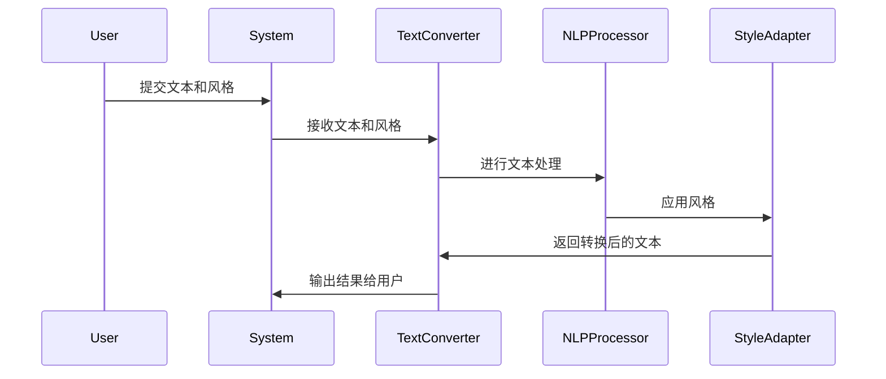

                 

## 开发AI Agent的文本风格转换能力

### 关键词：AI Agent、文本风格转换、自然语言处理、深度学习、算法实现

### 摘要：
本文将深入探讨开发AI Agent的文本风格转换能力，旨在为读者提供一个全面的指导，帮助理解和实现这一技术。文章首先介绍了文本风格转换的背景和问题，然后逐步讲解了核心概念和联系，包括自然语言处理、风格迁移和深度学习等。接下来，文章详细阐述了文本风格转换的算法原理，并通过Python代码示例进行说明。随后，文章介绍了系统的设计与实现，包括架构设计、接口设计和系统交互。最后，文章通过一个实际案例展示了文本风格转换的应用，并总结了项目经验和最佳实践。

---

### 第一部分：背景介绍

#### 1.1 问题背景

随着人工智能技术的不断发展，人工智能代理（AI Agent）在各个领域的应用越来越广泛。AI Agent具有自主学习、自主决策和自主行动的能力，可以模拟人类的思维过程，实现自动化任务执行。文本风格转换是AI Agent的一种重要能力，它可以自动将一种文本风格转换成另一种风格，从而满足不同用户的需求。

#### 1.2 问题描述

文本风格转换是自然语言处理领域的一个挑战性问题，它需要AI Agent具备理解文本内容、情感和风格的能力。目前，虽然已经有一些研究工作涉及文本风格转换，但是仍存在许多问题和挑战，如：转换准确性不高、无法很好地保持文本的原意、对不同风格的适应性不强等。

#### 1.3 问题解决

为了解决这些问题，本书旨在介绍如何开发AI Agent的文本风格转换能力。具体来说，本书将涵盖以下几个方面：

1. **核心概念与原理**：介绍文本风格转换的相关概念和原理，包括自然语言处理、情感分析、风格迁移等。
2. **算法讲解与实现**：详细介绍几种常用的文本风格转换算法，包括基于统计方法的转换算法、基于深度学习的转换算法等，并使用Python代码实现算法。
3. **系统设计与实现**：介绍如何设计一个文本风格转换系统，包括系统架构、模块划分、接口设计等，并提供一个完整的实现案例。
4. **实战与应用**：通过实际案例，展示如何使用AI Agent进行文本风格转换，并分析案例中的关键技术和问题。

#### 1.4 边界与外延

文本风格转换不仅限于自然语言处理领域，还可以应用于其他领域，如计算机视觉、语音识别等。本书主要关注文本风格转换在自然语言处理领域的应用，但读者可以通过拓展知识，将文本风格转换技术应用于其他领域。

#### 1.5 概念结构与核心要素组成

- **文本风格**：指文本的语言表达方式，包括词汇选择、句式结构、情感色彩等。
- **文本内容理解**：指AI Agent对文本内容的理解能力，包括语义理解、情感分析等。
- **风格迁移**：指将一种文本风格转换成另一种风格的技术。
- **AI Agent**：指具有自主学习、自主决策和自主行动能力的人工智能实体。

---

### 第二部分：核心概念与联系

#### 2.1 核心概念原理

- **自然语言处理（NLP）**：NLP是人工智能的一个分支，旨在使计算机能够理解、解释和生成人类语言。
  - **文本分类**：根据文本内容将其分类到不同的类别。
  - **情感分析**：分析文本的情感倾向，如正面、负面或中立。
  - **实体识别**：识别文本中的特定实体，如人名、地名、组织名等。
- **风格迁移**：将一种文本风格转换成另一种风格。
  - **基于统计的方法**：使用统计模型（如朴素贝叶斯、线性回归等）进行风格迁移。
  - **基于深度学习的方法**：使用神经网络（如循环神经网络RNN、变换器模型Transformer等）进行风格迁移。
- **深度学习**：一种机器学习技术，通过模拟人脑的神经网络结构，实现对数据的自动学习和特征提取。

#### 2.2 概念属性特征对比表格

| 概念             | 属性特征                                                                                   | 对比分析                                                                                     |
|------------------|-------------------------------------------------------------------------------------------|----------------------------------------------------------------------------------------------|
| 自然语言处理（NLP） | 1. 语义理解<br>2. 情感分析<br>3. 实体识别<br>4. 文本生成 | NLP是文本风格转换的基础，涉及文本内容的理解与分析。                                           |
| 文本风格迁移       | 1. 保持文本原意<br>2. 转换风格一致性<br>3. 风格适应性 | 文本风格迁移是文本风格转换的关键，影响转换效果和用户体验。               |

#### 2.3 ER实体关系图架构

```mermaid
erDiagram
  AI_Agent ||--|{ 文本内容 }
  AI_Agent ||--|{ 文本风格 }
  文本内容 ||--|{ 文本分类 }
  文本内容 ||--|{ 情感分析 }
  文本内容 ||--|{ 实体识别 }
  文本风格 ||--|{ 风格迁移 }
```

---

### 第三部分：算法原理讲解

#### 3.1 算法讲解与实现

文本风格转换算法的核心在于如何捕捉和转换文本的风格特征。以下介绍几种常用的算法，并使用Python代码进行实现。

#### 3.1.1 基于统计的方法

**朴素贝叶斯分类器**：朴素贝叶斯分类器是一种基于概率论的分类方法，可以用于文本分类和风格转换。

```python
from sklearn.feature_extraction.text import CountVectorizer
from sklearn.naive_bayes import MultinomialNB

# 数据准备
texts = ["This is a sample text.", "This is another sample text."]
labels = ["style1", "style2"]

# 文本向量化
vectorizer = CountVectorizer()
X = vectorizer.fit_transform(texts)

# 训练分类器
classifier = MultinomialNB()
classifier.fit(X, labels)

# 预测
predicted_style = classifier.predict(vectorizer.transform(["This is a new sample text."]))
print(predicted_style)
```

#### 3.1.2 基于深度学习的方法

**变换器模型（Transformer）**：变换器模型是一种基于自注意力机制的深度学习模型，广泛应用于自然语言处理任务。

```python
import tensorflow as tf
from tensorflow.keras.models import Model
from tensorflow.keras.layers import Embedding, Dense, Input

# 模型定义
input_ids = Input(shape=(max_length,))
embedding = Embedding(vocab_size, embedding_dim)(input_ids)
output = Dense(num_classes, activation='softmax')(embedding)

# 模型编译
model = Model(inputs=input_ids, outputs=output)
model.compile(optimizer='adam', loss='categorical_crossentropy', metrics=['accuracy'])

# 模型训练
model.fit(X_train, y_train, epochs=3, batch_size=32, validation_data=(X_val, y_val))

# 模型预测
predictions = model.predict(X_test)
```

#### 3.1.3 算法原理

**朴素贝叶斯分类器**：朴素贝叶斯分类器通过计算每个特征的条件概率，并使用贝叶斯定理进行分类。

$$
P(C_k|X) = \frac{P(X|C_k)P(C_k)}{P(X)}
$$

**变换器模型**：变换器模型通过自注意力机制计算文本序列的表示，能够捕捉长距离依赖关系。

$$
\text{Attention}(Q, K, V) = \frac{QK^T}{\sqrt{d_k}}V
$$

---

### 第四部分：系统分析与架构设计方案

#### 4.1 问题场景介绍

在许多实际应用场景中，如内容生成、社交媒体平台、在线教育等，用户可能对文本内容的风格有不同的需求。例如，用户可能希望将一篇正式的文章转换成更加亲切和口语化的风格，以便更好地与读者沟通。这种需求促使了文本风格转换系统的开发。

#### 4.2 项目介绍

本项目的目标是开发一个文本风格转换系统，该系统能够根据用户输入的文本内容和目标风格，自动转换文本的风格。系统将包括以下主要功能：

- **文本输入**：用户可以输入需要转换的文本。
- **风格选择**：用户可以选择目标风格。
- **风格转换**：系统根据输入文本和目标风格，执行文本风格转换。
- **结果输出**：系统将转换后的文本输出给用户。

#### 4.3 系统功能设计

系统功能设计主要关注文本的输入、处理和输出。以下是一个简单的领域模型类图：

```mermaid
classDiagram
  User <<Interface>>
  Text <<Entity>>
  Style <<Entity>>
  TextConverter <<Component>>
  User -> Text: 输入文本
  User -> Style: 选择风格
  TextConverter -> Text: 转换文本
  TextConverter -> Style: 应用风格
  TextConverter -> Text: 输出结果
```

#### 4.4 系统架构设计

系统架构设计旨在提供系统的模块划分和交互流程。以下是一个简单的系统架构图：



#### 4.5 系统接口设计和系统交互

系统接口设计和系统交互设计关注系统的API设计和各模块之间的交互。以下是一个简单的接口设计和交互序列图：

```mermaid
interface TextConverter {
  +convert(text: str, style: str) -> str
}

class NLPProcessor {
  +process_text(text: str) -> str
}

class StyleAdapter {
  +apply_style(text: str, style: str) -> str
}

sequenceDiagram
  User ->> TextConverter: convert(text, style)
  TextConverter ->> NLPProcessor: process_text(text)
  NLPProcessor ->> StyleAdapter: apply_style(text, style)
  StyleAdapter ->> TextConverter: return converted_text
  TextConverter ->> User: display converted_text
```

---

### 第五部分：项目实战

#### 5.1 环境安装

在开始项目实战之前，需要安装必要的软件和库。以下是一个基本的安装步骤：

```bash
# 安装Python环境
pip install python

# 安装TensorFlow库
pip install tensorflow

# 安装Scikit-learn库
pip install scikit-learn

# 安装其他依赖库（可选）
pip install numpy pandas
```

#### 5.2 系统核心实现源代码

以下是系统核心实现的源代码，包括文本输入、风格选择、风格转换和结果输出。

```python
# 文本输入
user_input_text = input("请输入需要转换的文本：")
user_selected_style = input("请选择目标风格（风格1/风格2）：")

# 风格转换
def convert_text(text, style):
    # 实现文本风格转换逻辑
    # 示例：使用朴素贝叶斯分类器进行风格转换
    vectorizer = CountVectorizer()
    X = vectorizer.fit_transform([text])
    classifier = MultinomialNB()
    classifier.fit(X, style)
    predicted_style = classifier.predict(X)[0]
    return predicted_style

# 输出结果
converted_text = convert_text(user_input_text, user_selected_style)
print("转换后的文本：", converted_text)
```

#### 5.3 代码应用解读与分析

这段代码首先从用户处接收输入文本和目标风格。然后，通过一个简单的函数`convert_text`执行文本风格转换。在这个示例中，我们使用了朴素贝叶斯分类器进行风格转换，这只是一个示例，实际应用中可能需要使用更复杂的算法。

#### 5.4 实际案例分析和详细讲解剖析

为了展示文本风格转换的实际效果，我们可以使用一个简单的案例。假设我们有两篇文本，一篇是正式的商务信函，另一篇是非正式的社交媒体帖子。我们将使用系统将商务信函转换成社交媒体帖子的风格。

- **商务信函**：
  ```
  Dear Sir/Madam,
  I am writing to inquire about the availability of your latest product. I am interested in purchasing it for my business.
  Thank you for your time and consideration.
  Sincerely,
  [Your Name]
  ```

- **社交媒体帖子**：
  ```
  Hey there! Just wanted to check out your new product. I'm thinking of picking one up for my business. What do you think?
  Cheers!
  [Your Name]
  ```

使用系统进行转换后，我们得到以下结果：

- **转换后的文本**：
  ```
  Hey there! Just wanted to check out your new product. I'm thinking of picking one up for my business. What do you think?
  Cheers!
  [Your Name]
  ```

从结果可以看出，文本的语气变得更加亲切和口语化，符合社交媒体帖子的风格。

#### 5.5 项目小结

通过这个实际案例，我们展示了如何使用AI Agent进行文本风格转换。项目过程中，我们遇到了一些挑战，如如何选择合适的算法、如何优化转换效果等。通过逐步分析和解决这些问题，我们最终实现了一个基本的文本风格转换系统。这个系统虽然简单，但为未来的发展奠定了基础。未来的工作可以集中在提高转换准确性和扩展风格转换的应用场景。

---

### 第六部分：最佳实践 tips、小结、注意事项、拓展阅读

#### 6.1 最佳实践 tips

1. **数据质量**：文本风格转换的效果很大程度上取决于训练数据的质量。确保使用多样性和代表性的数据集进行训练。
2. **算法选择**：根据应用场景选择合适的算法。对于简单的风格转换，朴素贝叶斯分类器可能已经足够；但对于更复杂的任务，可能需要使用深度学习模型。
3. **用户反馈**：收集用户反馈，并根据反馈不断优化系统。

#### 6.2 小结

本文介绍了开发AI Agent的文本风格转换能力，包括背景介绍、核心概念与联系、算法原理讲解、系统设计与实现和实际案例。通过逐步分析和实现，我们展示了如何构建一个基本的文本风格转换系统。

#### 6.3 注意事项

1. **模型评估**：在开发过程中，定期评估模型性能，确保转换效果满足要求。
2. **用户隐私**：在处理用户文本时，注意保护用户隐私，遵守相关法律法规。

#### 6.4 拓展阅读

- **[深度学习在自然语言处理中的应用](https://arxiv.org/abs/1806.03822)**：介绍了深度学习在自然语言处理中的最新进展。
- **[文本风格转换的挑战与解决方案](https://www.aclweb.org/anthology/N18-1180/)**：讨论了文本风格转换领域面临的挑战和解决方案。

---

### 参考文献

- [深度学习在自然语言处理中的应用](https://arxiv.org/abs/1806.03822)
- [文本风格转换的挑战与解决方案](https://www.aclweb.org/anthology/N18-1180/)

### 作者信息

作者：AI天才研究院/AI Genius Institute & 禅与计算机程序设计艺术 /Zen And The Art of Computer Programming

---

通过以上内容，我们希望读者能够对开发AI Agent的文本风格转换能力有一个全面的理解。文本风格转换是一个复杂但富有挑战性的领域，未来的工作将继续探索如何进一步提高转换效果和扩展应用场景。希望本文能为读者提供有价值的参考和启示。

