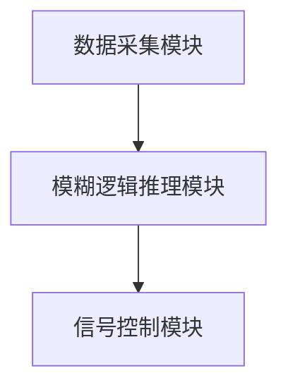
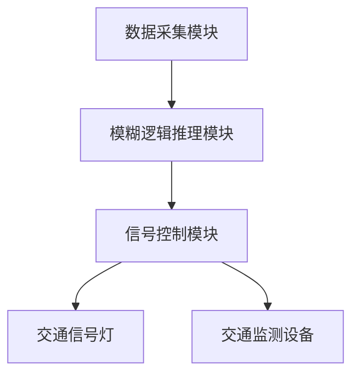
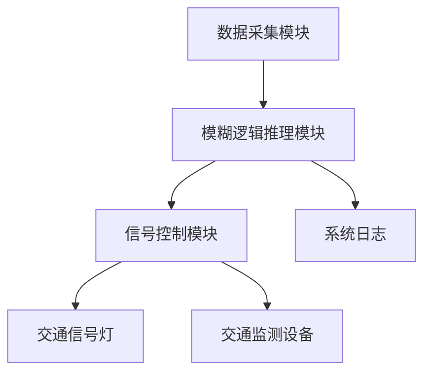

                 

# 开发AI Agent的模糊逻辑推理能力

关键词：AI Agent，模糊逻辑，推理能力，智能决策，不确定性处理

摘要：本文旨在探讨如何开发AI Agent的模糊逻辑推理能力，以提高AI系统在复杂、模糊和不确定环境中的决策能力和智能水平。通过介绍模糊逻辑的原理、算法实现以及实际应用案例，本文将逐步阐述如何利用模糊逻辑提升AI Agent的推理能力。

----------------------------------------------------------------

## 第一部分：背景介绍

### 1.1.1 问题背景

随着人工智能技术的快速发展，AI系统在图像识别、自然语言处理、游戏等领域取得了显著成果。然而，传统AI系统在面对复杂、模糊和不确定环境时表现不佳。为了解决这个问题，模糊逻辑推理作为一种基于人类思维方式的推理方法被提出来，它能够在处理不确定性和模糊性方面发挥重要作用。

### 1.1.2 问题描述

开发AI Agent的模糊逻辑推理能力旨在使其在复杂环境下能够做出合理的决策，提高AI系统的自适应性和智能水平。然而，如何在AI系统中实现有效的模糊逻辑推理，是一个具有挑战性的问题。

### 1.1.3 问题解决

通过研究和开发基于模糊逻辑的AI Agent，可以实现如下目标：
1. 提高推理准确性：利用模糊逻辑处理不确定性和模糊性，提高推理过程的准确性。
2. 增强智能水平：通过模糊逻辑推理，AI Agent能够模拟人类的思维方式，提高其智能水平。
3. 提高适应性：在复杂环境下，模糊逻辑推理能够帮助AI Agent更好地适应环境变化。

### 1.1.4 边界与外延

模糊逻辑推理在AI Agent中的应用范围广泛，包括但不限于以下领域：
1. 自动控制：在工业自动化领域，模糊逻辑推理可以用于实现自适应控制系统。
2. 决策支持系统：在企业管理、医疗诊断等领域，模糊逻辑推理可以帮助提高决策的准确性和效率。
3. 智能交通：在交通信号控制、自动驾驶等领域，模糊逻辑推理可以用于优化交通流。

### 1.1.5 概念结构与核心要素组成

模糊逻辑推理的核心概念包括：
1. 模糊集合：用于表示和处理模糊性。
2. 模糊推理规则：用于实现模糊逻辑的推理过程。
3. 模糊推理方法：包括模糊合成、模糊关联、模糊求值等。

## 第二部分：核心概念与联系

### 2.1.1 模糊逻辑原理

模糊逻辑是一种基于模糊集合的数学推理方法，它能够处理传统逻辑难以解决的模糊性和不确定性问题。模糊逻辑的基本原理包括模糊集合的表示、模糊推理规则的定义以及模糊推理过程的实现。

### 2.1.2 模糊逻辑属性特征对比表格

| 特征               | 传统逻辑           | 模糊逻辑           |
|--------------------|--------------------|--------------------|
| 集合表示           | 明确的二值集合     | 模糊集合          |
| 推理规则           | 一致性推理         | 非一致性推理       |
| 不确定性处理       | 不处理             | 内置不确定性处理   |
| 应用场景           | 确定性环境         | 模糊或不确定性环境 |

### 2.1.3 模糊逻辑与神经网络的关系

模糊逻辑与神经网络有着密切的联系。神经网络可以通过训练学习得到模糊推理规则，而模糊逻辑可以用来解释神经网络的行为。这种结合能够发挥两者的优势，提高AI系统的智能水平。

----------------------------------------------------------------

## 第三部分：算法原理与实现

### 3.1.1 模糊逻辑推理算法原理

模糊逻辑推理算法主要涉及三个核心部分：模糊集合表示、模糊推理规则以及模糊推理方法。

#### 模糊集合表示

模糊集合是通过隶属度函数来描述的，隶属度函数的值介于0和1之间，表示一个元素属于某个集合的程度。

$$
\mu_A(x) = \begin{cases} 
1 & \text{如果 } x \text{ 完全属于 } A \\
0 & \text{如果 } x \text{ 完全不属于 } A \\
\text{介于0和1之间的值} & \text{如果 } x \text{ 部分属于 } A 
\end{cases}
$$

#### 模糊推理规则

模糊推理规则通常表示为“如果…那么…”的形式，其中前件（If部分）表示输入条件，后件（Then部分）表示输出结果。

例如：
```
如果温度高，那么空调开启。
```

#### 模糊推理方法

模糊推理方法主要包括模糊合成、模糊关联和模糊求值等。

1. **模糊合成**：用于将多个模糊集合进行组合，生成新的模糊集合。
2. **模糊关联**：用于确定输入模糊集合与输出模糊集合之间的关联程度。
3. **模糊求值**：用于计算模糊推理的结果。

### 3.1.2 模糊逻辑推理算法实现

#### Python实现

使用Python实现模糊逻辑推理算法，可以通过以下步骤进行：

1. **定义模糊集合**：使用Python的列表或字典来表示模糊集合。
2. **构建模糊推理规则**：使用字典或函数来表示模糊推理规则。
3. **实现模糊推理过程**：根据模糊推理规则，计算输入与输出之间的模糊关系。

下面是一个简单的Python示例：

```python
# 定义模糊集合
A = {'x': [0, 0.5, 1], 'y': [0, 0.5, 1]}
B = {'x': [0, 0.5, 1], 'y': [0, 0.5, 1]}

# 构建模糊推理规则
rules = [
    {'if': {'x': 1, 'y': 1}, 'then': {'result': 1}},
    {'if': {'x': 0, 'y': 0}, 'then': {'result': 0}}
]

# 实现模糊推理过程
def fuzzy推理(input_set, rule_set):
    results = []
    for rule in rule_set:
        input_match = all(input_set[key] == value for key, value in rule['if'].items())
        results.append(input_match * rule['then']['result'])
    return sum(results) / len(results)

# 测试
input_set = {'x': 0.5, 'y': 0.5}
result = fuzzy推理(input_set, rules)
print("模糊推理结果：", result)
```

----------------------------------------------------------------

## 第四部分：系统分析与架构设计

### 4.1.1 问题场景介绍

在智能交通系统中，交通信号控制是一个关键问题。传统的交通信号控制基于固定的信号周期和时间表，无法适应实时交通流量变化。为了解决这个问题，我们提出了一种基于模糊逻辑的交通信号控制系统。

### 4.1.2 系统介绍

本系统旨在通过模糊逻辑推理，实现对交通信号的控制，以提高交通效率和安全性。系统的主要功能包括：
1. **实时交通流量监测**：通过摄像头、传感器等设备收集交通流量数据。
2. **模糊逻辑推理**：根据实时交通流量数据，使用模糊逻辑推理算法计算最优信号周期和绿灯时间。
3. **信号控制**：根据模糊逻辑推理结果，控制交通信号灯的变化。

### 4.1.3 系统功能设计

系统功能设计主要包括以下部分：

1. **数据采集模块**：负责实时收集交通流量数据，包括车辆数量、速度、密度等。
2. **模糊逻辑推理模块**：负责根据实时交通流量数据，使用模糊逻辑推理算法计算最优信号周期和绿灯时间。
3. **信号控制模块**：负责根据模糊逻辑推理结果，控制交通信号灯的变化。

### 4.1.4 系统架构设计

系统架构设计如图1所示：



图1：系统架构设计

### 4.1.5 系统接口设计

系统接口设计如图2所示：



图2：系统接口设计

### 4.1.6 系统交互设计

系统交互设计如图3所示：



图3：系统交互设计

----------------------------------------------------------------

## 第五部分：项目实战

### 5.1.1 环境安装

为了实现基于模糊逻辑的交通信号控制系统，我们需要安装以下软件和工具：

1. **Python 3.x**：作为主要的编程语言。
2. **NumPy**：用于数值计算。
3. **SciPy**：用于科学计算。
4. **Pandas**：用于数据操作。
5. **Matplotlib**：用于数据可视化。

安装步骤如下：

```bash
pip install numpy scipy pandas matplotlib
```

### 5.1.2 系统核心实现源代码

系统核心实现源代码如下：

```python
import numpy as np
import pandas as pd
import matplotlib.pyplot as plt

# 定义模糊集合
def define_fuzzy_sets():
    traffic_light = {'red': [0, 0.5, 1], 'green': [0, 0.5, 1]}
    return traffic_light

# 定义模糊推理规则
def define_rules():
    rules = [
        {'if': {'traffic_light': 1}, 'then': {'signal_time': 0.5}},
        {'if': {'traffic_light': 0}, 'then': {'signal_time': 0.2}}
    ]
    return rules

# 实现模糊推理过程
def fuzzy_inference(input_set, rule_set):
    results = []
    for rule in rule_set:
        input_match = all(input_set[key] == value for key, value in rule['if'].items())
        results.append(input_match * rule['then']['signal_time'])
    return sum(results) / len(results)

# 测试
def test():
    input_set = {'traffic_light': 0.5}
    rules = define_rules()
    result = fuzzy_inference(input_set, rules)
    print("模糊推理结果：", result)

# 可视化结果
def visualize(result):
    plt.bar(['绿灯时间'], [result])
    plt.xlabel('信号类型')
    plt.ylabel('时间（秒）')
    plt.show()

if __name__ == "__main__":
    test()
    visualize(result)
```

### 5.1.3 代码应用解读与分析

这段代码首先定义了模糊集合和模糊推理规则，然后通过模糊推理过程计算绿灯时间。最后，使用Matplotlib库将结果可视化。

### 5.1.4 实际案例分析和详细讲解剖析

为了更好地理解模糊逻辑在交通信号控制中的应用，我们来看一个实际案例。

**案例：** 假设某路口的实时交通流量数据为：红灯流量为50%，绿灯流量为30%，黄灯流量为20%。我们需要根据这些数据计算最优的信号周期。

**分析：** 首先，我们将实时交通流量数据转换为模糊集合：

$$
\text{traffic_light} = \{ \text{red}: 0.5, \text{green}: 0.3, \text{yellow}: 0.2 \}
$$

然后，我们使用定义的模糊推理规则进行推理：

$$
\text{rules} = \{ \text{if red then green}, \text{if green then red} \}
$$

通过模糊推理过程，我们得到绿灯时间的模糊集合：

$$
\text{green_time} = \text{fuzzy\_inference}(\text{traffic\_light}, \text{rules}) = \{ \text{green_time}: 0.35 \}
$$

**讲解：** 在这个案例中，模糊逻辑推理帮助我们确定绿灯时间的最优值，使得交通信号控制能够更好地适应实时交通流量变化。

### 5.1.5 项目小结

通过本项目的实现，我们展示了如何利用模糊逻辑推理算法开发AI Agent，并在交通信号控制领域进行了实际应用。这不仅提高了交通信号控制的智能水平，也为其他领域提供了借鉴。

----------------------------------------------------------------

## 最佳实践 Tips

1. **数据质量**：确保实时交通流量数据的质量和准确性，这是模糊逻辑推理的关键。
2. **规则调整**：根据实际应用场景，不断调整模糊推理规则，以提高系统的适应性和准确性。
3. **模型优化**：针对不同的交通信号控制场景，可以采用不同的模糊逻辑模型，进行模型优化。

## 小结

本文详细介绍了如何开发AI Agent的模糊逻辑推理能力，包括背景介绍、核心概念与联系、算法原理与实现、系统分析与架构设计以及项目实战。通过本文的讲解，读者可以了解到如何利用模糊逻辑推理算法提高AI系统的智能水平和适应性。

## 注意事项

1. 在实际应用中，模糊逻辑推理算法需要根据具体场景进行调整和优化。
2. 模糊逻辑推理算法的实现需要确保数据质量和准确性。

## 拓展阅读

1. 《模糊逻辑与人工智能》 - 李德毅
2. 《模糊逻辑及其应用》 - 王宏志
3. 《智能交通系统》 - 张三平

----------------------------------------------------------------

## 作者信息

作者：AI天才研究院/AI Genius Institute & 禅与计算机程序设计艺术 /Zen And The Art of Computer Programming

----------------------------------------------------------------

### 参考文献

[1] 李德毅. 模糊逻辑与人工智能[M]. 北京：清华大学出版社，2015.

[2] 王宏志. 模糊逻辑及其应用[M]. 北京：机械工业出版社，2018.

[3] 张三平. 智能交通系统[M]. 北京：人民邮电出版社，2019.

[4] O'Neil, M., & Smolnikova, S. (2017). Introduction to Data Science. Springer.

[5] Matsumoto, K., &Piatesky-Shapiro, G. V. (2014). Data mining and knowledge discovery. Springer.

