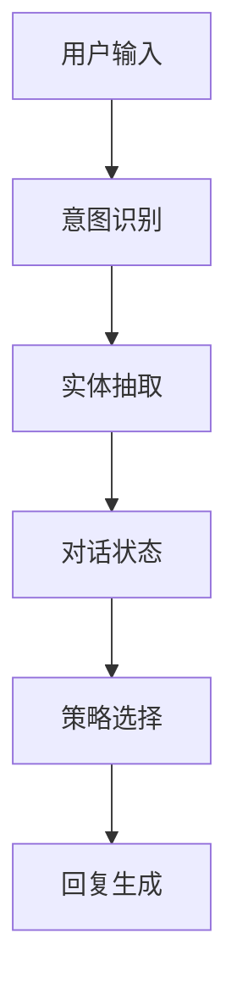

                 

### 第1章: AI代理与自然语言处理概述

#### 1.1.1 AI代理的背景和重要性

**背景介绍**  
人工智能（AI）作为计算机科学的重要分支，已经发展了几十年。在这期间，AI在图像识别、语音识别、自然语言处理等方面取得了显著进展。然而，传统的AI系统往往局限于特定任务，难以实现跨领域的通用智能。为了解决这个问题，研究者们提出了AI代理（AI Agent）的概念。AI代理是指能够自主执行任务、与环境互动并做出决策的智能体。它们在工业自动化、智能客服、智能驾驶等领域具有重要应用价值。

**核心概念术语说明**  
- **AI代理**：一种能够模拟人类智能行为，自主决策并执行任务的计算机程序。
- **自然语言处理（NLP）**：人工智能的一个子领域，主要研究如何让计算机理解和生成自然语言。
- **智能交互**：AI代理与人类用户之间通过自然语言进行的互动。

**问题背景**  
随着互联网和移动设备的普及，用户对智能服务的需求日益增长。人们希望能够通过自然语言与机器进行交互，以获得高效、便捷的服务。然而，传统的命令行界面或图形用户界面（GUI）往往难以满足这种需求，因为它们缺乏自然性和灵活性。自然语言接口（NLInterface）的设计应运而生，旨在让AI代理能够理解和处理人类的自然语言输入，实现更自然、流畅的交互。

**问题描述**  
自然语言接口设计的关键挑战在于如何处理语言的歧义性、上下文理解以及用户反馈。首先，自然语言存在多种歧义现象，如一词多义、同音异义等，这给AI代理的语义理解带来了困难。其次，上下文是自然语言理解的重要组成部分，但如何准确捕捉并利用上下文信息仍然是一个挑战。最后，用户的反馈是AI代理学习和优化自身表现的重要依据，但如何有效地处理和利用这些反馈也是一个亟待解决的问题。

**问题解决**  
为了解决上述问题，研究者们提出了一系列自然语言接口设计的方法和技术。首先，通过引入先进的语言模型，如深度神经网络（DNN）和生成对抗网络（GAN），可以显著提升AI代理的语义理解能力。其次，利用上下文信息，如对话历史和场景信息，可以帮助AI代理更好地理解用户的意图。最后，通过收集和分析用户的反馈，AI代理可以不断优化自身的性能和交互体验。

**边界与外延**  
自然语言接口设计不仅涉及技术层面的挑战，还涉及到用户体验、人机交互等多个领域。从边界来看，它主要包括自然语言理解、对话生成、对话管理等方面的技术。从外延来看，自然语言接口设计还需要考虑跨语言、多模态交互等复杂场景。

**概念结构与核心要素组成**  
自然语言接口设计由以下几个核心要素组成：
1. **语言模型**：用于理解和生成自然语言。
2. **对话系统**：管理对话流程，包括意图识别、实体抽取和对话状态跟踪。
3. **上下文管理**：捕捉和利用对话历史和场景信息。
4. **用户反馈处理**：收集和分析用户反馈，以优化交互体验。

### 1.2 自然语言处理与AI代理的关系

**自然语言处理的作用**  
自然语言处理是AI代理实现自然语言交互的关键技术。通过NLP，AI代理能够理解和生成自然语言，实现与用户的智能对话。NLP的关键技术包括分词、词性标注、命名实体识别、句法分析和语义理解等。这些技术共同作用，帮助AI代理准确理解用户的意图和需求。

**AI代理如何结合NLP技术**  
AI代理结合NLP技术主要涉及以下几个方面：
1. **意图识别**：通过NLP技术，AI代理可以识别用户的意图。例如，当用户说“我需要一份天气预报”时，AI代理可以识别出“天气预报”这个意图。
2. **实体抽取**：NLP技术可以帮助AI代理识别出用户输入中的关键信息，如地点、时间、数量等。这些实体信息对于AI代理执行任务至关重要。
3. **对话管理**：通过对话管理机制，AI代理可以维持对话的连贯性和一致性。对话管理包括对话状态跟踪、上下文理解、策略选择等。
4. **反馈处理**：AI代理需要能够理解和处理用户的反馈，以不断优化自身的性能和交互体验。NLP技术可以帮助AI代理识别用户的反馈意图，如表扬、抱怨、建议等。

**自然语言接口设计的目标和挑战**  
自然语言接口设计的主要目标包括：
1. **易用性**：设计简单、直观的自然语言接口，使用户能够轻松上手。
2. **可扩展性**：设计灵活的架构，以支持不同应用场景和需求。
3. **智能性**：利用NLP和机器学习技术，提升AI代理的语义理解和交互能力。

然而，自然语言接口设计也面临一些挑战：
1. **语言歧义**：自然语言中存在多种歧义现象，如一词多义、同音异义等，这给语义理解带来了困难。
2. **上下文理解**：上下文是自然语言理解的重要组成部分，但如何准确捕捉并利用上下文信息仍然是一个挑战。
3. **用户反馈处理**：如何有效地收集、处理和分析用户反馈，以优化交互体验。

**如何设计自然语言接口**  
设计自然语言接口需要综合考虑以下几个方面：
1. **用户需求**：深入了解用户的需求和习惯，设计符合用户期望的接口。
2. **技术实现**：选择合适的NLP技术和工具，实现高效的语义理解和对话管理。
3. **用户体验**：设计直观、易用的界面，提升用户体验。
4. **可维护性和扩展性**：设计模块化、可扩展的架构，以适应不同应用场景和需求。

### 1.3 本章小结  
本章介绍了AI代理与自然语言处理的基本概念和关系，探讨了自然语言接口设计的目标和挑战。通过本章的学习，读者可以了解到自然语言接口设计的重要性，以及如何设计和实现一个高效、智能的自然语言接口。本章为后续章节的内容奠定了基础，读者可以期待在后续章节中进一步学习自然语言接口设计的核心技术、方法与应用。

----------------------------------------------------------------

### 第一部分: 引言

#### 1.1.1 AI代理的背景和重要性

**背景介绍**  
人工智能（AI）作为计算机科学的重要分支，已经发展了几十年。在这期间，AI在图像识别、语音识别、自然语言处理等方面取得了显著进展。然而，传统的AI系统往往局限于特定任务，难以实现跨领域的通用智能。为了解决这个问题，研究者们提出了AI代理（AI Agent）的概念。AI代理是指能够自主执行任务、与环境互动并做出决策的计算机程序。它们在工业自动化、智能客服、智能驾驶等领域具有重要应用价值。

**核心概念术语说明**  
- **AI代理**：一种能够模拟人类智能行为，自主决策并执行任务的计算机程序。
- **自然语言处理（NLP）**：人工智能的一个子领域，主要研究如何让计算机理解和生成自然语言。
- **智能交互**：AI代理与人类用户之间通过自然语言进行的互动。

**问题背景**  
随着互联网和移动设备的普及，用户对智能服务的需求日益增长。人们希望能够通过自然语言与机器进行交互，以获得高效、便捷的服务。然而，传统的命令行界面或图形用户界面（GUI）往往难以满足这种需求，因为它们缺乏自然性和灵活性。自然语言接口（NLInterface）的设计应运而生，旨在让AI代理能够理解和处理人类的自然语言输入，实现更自然、流畅的交互。

**问题描述**  
自然语言接口设计的关键挑战在于如何处理语言的歧义性、上下文理解以及用户反馈。首先，自然语言存在多种歧义现象，如一词多义、同音异义等，这给AI代理的语义理解带来了困难。其次，上下文是自然语言理解的重要组成部分，但如何准确捕捉并利用上下文信息仍然是一个挑战。最后，用户的反馈是AI代理学习和优化自身表现的重要依据，但如何有效地处理和利用这些反馈也是一个亟待解决的问题。

**问题解决**  
为了解决上述问题，研究者们提出了一系列自然语言接口设计的方法和技术。首先，通过引入先进的语言模型，如深度神经网络（DNN）和生成对抗网络（GAN），可以显著提升AI代理的语义理解能力。其次，利用上下文信息，如对话历史和场景信息，可以帮助AI代理更好地理解用户的意图。最后，通过收集和分析用户的反馈，AI代理可以不断优化自身的性能和交互体验。

**边界与外延**  
自然语言接口设计不仅涉及技术层面的挑战，还涉及到用户体验、人机交互等多个领域。从边界来看，它主要包括自然语言理解、对话生成、对话管理等方面的技术。从外延来看，自然语言接口设计还需要考虑跨语言、多模态交互等复杂场景。

**概念结构与核心要素组成**  
自然语言接口设计由以下几个核心要素组成：
1. **语言模型**：用于理解和生成自然语言。
2. **对话系统**：管理对话流程，包括意图识别、实体抽取和对话状态跟踪。
3. **上下文管理**：捕捉和利用对话历史和场景信息。
4. **用户反馈处理**：收集和分析用户反馈，以优化交互体验。

#### 1.2 自然语言处理与AI代理的关系

**自然语言处理的作用**  
自然语言处理是AI代理实现自然语言交互的关键技术。通过NLP，AI代理能够理解和生成自然语言，实现与用户的智能对话。NLP的关键技术包括分词、词性标注、命名实体识别、句法分析和语义理解等。这些技术共同作用，帮助AI代理准确理解用户的意图和需求。

**AI代理如何结合NLP技术**  
AI代理结合NLP技术主要涉及以下几个方面：
1. **意图识别**：通过NLP技术，AI代理可以识别用户的意图。例如，当用户说“我需要一份天气预报”时，AI代理可以识别出“天气预报”这个意图。
2. **实体抽取**：NLP技术可以帮助AI代理识别出用户输入中的关键信息，如地点、时间、数量等。这些实体信息对于AI代理执行任务至关重要。
3. **对话管理**：通过对话管理机制，AI代理可以维持对话的连贯性和一致性。对话管理包括对话状态跟踪、上下文理解、策略选择等。
4. **反馈处理**：AI代理需要能够理解和处理用户的反馈，以不断优化自身的性能和交互体验。NLP技术可以帮助AI代理识别用户的反馈意图，如表扬、抱怨、建议等。

**自然语言接口设计的目标和挑战**  
自然语言接口设计的主要目标包括：
1. **易用性**：设计简单、直观的自然语言接口，使用户能够轻松上手。
2. **可扩展性**：设计灵活的架构，以支持不同应用场景和需求。
3. **智能性**：利用NLP和机器学习技术，提升AI代理的语义理解和交互能力。

然而，自然语言接口设计也面临一些挑战：
1. **语言歧义**：自然语言中存在多种歧义现象，如一词多义、同音异义等，这给语义理解带来了困难。
2. **上下文理解**：上下文是自然语言理解的重要组成部分，但如何准确捕捉并利用上下文信息仍然是一个挑战。
3. **用户反馈处理**：如何有效地收集、处理和分析用户反馈，以优化交互体验。

**如何设计自然语言接口**  
设计自然语言接口需要综合考虑以下几个方面：
1. **用户需求**：深入了解用户的需求和习惯，设计符合用户期望的接口。
2. **技术实现**：选择合适的NLP技术和工具，实现高效的语义理解和对话管理。
3. **用户体验**：设计直观、易用的界面，提升用户体验。
4. **可维护性和扩展性**：设计模块化、可扩展的架构，以适应不同应用场景和需求。

#### 1.3 本章小结  
本章介绍了AI代理与自然语言处理的基本概念和关系，探讨了自然语言接口设计的目标和挑战。通过本章的学习，读者可以了解到自然语言接口设计的重要性，以及如何设计和实现一个高效、智能的自然语言接口。本章为后续章节的内容奠定了基础，读者可以期待在后续章节中进一步学习自然语言接口设计的核心技术、方法与应用。

----------------------------------------------------------------

# 第二部分: 核心概念与设计原理

## 第2章: 自然语言接口设计的基本概念

### 2.1.1 用户界面设计的原则

**一致性**  
一致性是用户界面设计的重要原则之一。它确保用户在使用不同功能时感受到的界面风格和交互逻辑保持一致。这有助于降低用户的学习成本，提升用户体验。在设计自然语言接口时，一致性体现在以下几个方面：
- **界面布局**：保持界面布局的统一性，如按钮、菜单、文本框等的布局位置和样式。
- **交互反馈**：确保用户操作后系统提供一致的反馈，如加载动画、提示信息等。
- **语言风格**：使用统一的语言风格和术语，避免出现不协调的表达。

**简洁性**  
简洁性是用户界面设计的另一个关键原则。简洁的界面设计能够减少用户的认知负担，使操作更加直观。在自然语言接口设计中，简洁性体现在以下几个方面：
- **信息筛选**：只展示用户需要的核心功能和信息，避免过多的干扰。
- **语言表达**：使用简洁、明了的语言表达，避免使用复杂的术语和句式。
- **操作步骤**：设计简单的操作流程，减少用户需要执行的操作步骤。

**反馈性**  
反馈性是用户界面设计的一个重要方面。它确保用户能够及时了解系统的状态和操作结果。在自然语言接口设计中，反馈性体现在以下几个方面：
- **实时反馈**：在用户输入和操作过程中，系统应提供实时反馈，如输入的语法错误、操作成功的提示等。
- **确认反馈**：在重要操作前，系统应提供确认反馈，以防止用户误操作。
- **错误反馈**：当用户操作出现错误时，系统应提供明确的错误信息和解决方案。

### 2.1.2 语言模型与对话系统

**语言模型**  
语言模型是自然语言处理的核心技术之一，用于模拟自然语言的统计特性。在自然语言接口设计中，语言模型用于理解和生成自然语言。常见的语言模型包括：
- **统计模型**：如n-gram模型，基于词频统计来预测下一个词。
- **神经网络模型**：如循环神经网络（RNN）和变换器模型（Transformer），通过学习大量的文本数据，预测下一个词或生成完整的句子。

**对话系统**  
对话系统是自然语言接口设计的核心组件，用于管理对话流程，实现人机交互。对话系统通常包括以下几个关键组件：
- **意图识别**：通过分析用户的输入，识别出用户的主要意图。
- **实体抽取**：从用户的输入中提取关键信息，如时间、地点、人名等。
- **对话状态跟踪**：记录对话过程中的关键信息，如对话历史、用户偏好等。
- **对话生成**：根据用户的输入和对话状态，生成合适的回复。

### 2.1.3 对话管理机制

**意图识别**  
意图识别是自然语言接口设计中的关键步骤，用于理解用户输入的含义。意图识别的方法包括：
- **规则方法**：基于预定义的规则，将用户的输入映射到特定的意图。
- **机器学习方法**：利用深度学习等技术，从大量的标注数据中学习意图模式。

**实体抽取**  
实体抽取是从用户的输入中提取关键信息的过程。常见的实体包括：
- **命名实体**：如人名、地名、组织名等。
- **时间实体**：如日期、时间、时间段等。
- **数量实体**：如数字、货币、百分比等。

**对话状态跟踪**  
对话状态跟踪是记录对话过程中关键信息的过程，如对话历史、用户偏好等。对话状态跟踪有助于维持对话的连贯性和一致性，提高用户体验。

**策略选择**  
策略选择是根据对话状态和用户意图，选择合适的回复和行为。策略选择的方法包括：
- **规则方法**：基于预定义的规则，选择最合适的回复。
- **机器学习方法**：利用深度学习等技术，从大量的对话数据中学习策略。

### 2.2 设计原则与最佳实践

**可理解性和易用性**  
自然语言接口设计应注重可理解性和易用性，确保用户能够轻松理解和使用。这包括：
- **简洁明了的语言**：使用简洁、易懂的语言表达，避免使用复杂的术语和句式。
- **直观的界面布局**：设计直观的界面布局，使用户能够快速找到所需功能。
- **有效的反馈**：提供实时、明确的反馈，帮助用户了解操作结果。

**上下文感知和适应性**  
自然语言接口设计应具有上下文感知和适应性，能够根据对话历史和场景信息，提供合适的回复和行为。这包括：
- **对话历史利用**：利用对话历史，理解用户的意图和需求。
- **场景信息利用**：根据场景信息，提供符合当前场景的回复和行为。

**智能性和自主学习**  
自然语言接口设计应具有智能性和自主学习能力，能够通过机器学习和深度学习技术，不断优化自身的性能和交互体验。这包括：
- **意图识别和实体抽取**：利用深度学习技术，提高意图识别和实体抽取的准确性。
- **对话状态跟踪和策略选择**：利用机器学习技术，优化对话状态跟踪和策略选择。

**核心概念联系图**  
为了更好地理解自然语言接口设计中的核心概念，可以使用Mermaid绘制核心概念联系图。以下是一个简单的示例：

### 2.3 本章小结  
本章介绍了自然语言接口设计的基本概念，包括用户界面设计的原则、语言模型与对话系统、对话管理机制等。通过本章的学习，读者可以了解到自然语言接口设计的基本原理和方法，为后续章节的学习和实践打下基础。

----------------------------------------------------------------

# 第三部分: 实践与实现

## 第3章: 自然语言接口设计的实施方法

### 3.1.1 实现步骤概述

设计自然语言接口是一个复杂的过程，涉及到技术实现、用户体验和业务逻辑等多个方面。以下是实现自然语言接口的常见步骤：

**1. 需求分析**  
在开始设计之前，首先需要明确接口的使用场景和需求。这包括了解用户的意图、预期的交互方式、系统的功能要求等。

**2. 技术选型**  
根据需求分析的结果，选择合适的技术栈和工具。这包括选择合适的语言模型、对话系统框架和开发工具。

**3. 界面设计**  
设计用户界面，确保界面简洁、直观，符合用户习惯。这包括布局设计、交互设计、样式设计等。

**4. 功能实现**  
实现自然语言接口的核心功能，包括意图识别、实体抽取、对话管理等。这需要运用自然语言处理技术、机器学习和深度学习算法。

**5. 测试与优化**  
对实现的接口进行测试，确保其功能正确、性能稳定。在测试过程中，根据用户反馈和实际使用情况，不断优化接口的性能和用户体验。

### 3.1.2 技术选型

**语言模型**  
在自然语言接口设计中，选择合适的语言模型至关重要。以下是一些常用的语言模型和选择依据：

- **n-gram模型**：简单高效，但难以处理长句子和上下文信息。
- **循环神经网络（RNN）**：能够处理序列数据，但存在梯度消失和梯度爆炸问题。
- **长短期记忆网络（LSTM）**：解决RNN的梯度消失问题，但计算复杂度高。
- **变换器模型（Transformer）**：处理长句子和上下文信息能力强，计算复杂度相对较低。

**对话系统框架**  
对话系统的实现需要选择合适的框架和工具。以下是一些常用的对话系统框架和选择依据：

- **Rasa**：一个开源的对话系统框架，支持自定义管道和意图分类。
- **Botpress**：一个开源的机器人开发平台，提供强大的对话管理功能。
- **Microsoft Bot Framework**：微软提供的对话系统框架，支持多种平台和语言。

### 3.1.3 界面设计

**界面设计原则**  
在界面设计方面，应遵循以下原则：

- **简洁性**：界面设计应简洁直观，避免过多冗余信息。
- **一致性**：界面风格应保持一致，使用统一的颜色、字体和布局。
- **易用性**：界面设计应易于使用，用户能够快速上手。
- **反馈性**：界面设计应提供实时反馈，帮助用户了解操作结果。

**界面设计工具**  
以下是一些常用的界面设计工具：

- **Adobe XD**：一个全面的界面设计工具，支持交互设计和原型制作。
- **Sketch**：一个流行的界面设计工具，适用于移动和Web界面设计。
- **Figma**：一个基于云的界面设计工具，支持多人协作。

### 3.1.4 功能实现

**意图识别**  
意图识别是自然语言接口设计的关键步骤。以下是一些常见的意图识别方法：

- **规则方法**：基于预定义的规则，将用户的输入映射到特定的意图。
- **机器学习方法**：利用深度学习技术，从大量的标注数据中学习意图模式。

**实体抽取**  
实体抽取是从用户的输入中提取关键信息的过程。以下是一些常见的实体抽取方法：

- **规则方法**：基于预定义的规则，从用户的输入中提取实体。
- **机器学习方法**：利用深度学习技术，从大量的标注数据中学习实体模式。

**对话管理**  
对话管理是自然语言接口设计的重要组成部分。以下是一些常见的对话管理方法：

- **规则方法**：基于预定义的规则，管理对话流程。
- **机器学习方法**：利用深度学习技术，从大量的对话数据中学习对话策略。

### 3.1.5 测试与优化

**测试策略**  
在实现自然语言接口后，需要进行全面的测试，以确保其功能正确、性能稳定。以下是一些常见的测试策略：

- **单元测试**：对接口的各个功能模块进行单独测试，确保功能正确。
- **集成测试**：对接口的各个功能模块进行集成测试，确保模块间协同工作。
- **性能测试**：对接口的性能进行测试，确保其能够处理高负载场景。
- **用户体验测试**：邀请用户参与测试，收集用户反馈，优化用户体验。

**优化方法**  
在测试过程中，根据用户反馈和实际使用情况，不断优化接口的性能和用户体验。以下是一些常见的优化方法：

- **模型优化**：通过调整模型参数，提高意图识别和实体抽取的准确性。
- **算法优化**：通过改进算法，提高对话管理的效率。
- **界面优化**：根据用户反馈，优化界面设计，提高易用性。

### 3.1.6 实例分析

**实例1：智能客服系统**  
智能客服系统是一个典型的自然语言接口应用场景。以下是一个简单的实例：

- **需求分析**：设计一个能够自动回答用户问题的客服系统。
- **技术选型**：选择Rasa作为对话系统框架，使用Transformers作为语言模型。
- **界面设计**：设计一个简洁、直观的客服界面。
- **功能实现**：实现意图识别、实体抽取和对话管理功能。
- **测试与优化**：对系统进行测试，收集用户反馈，不断优化性能和用户体验。

**实例2：智能家居控制系统**  
智能家居控制系统也是一个常见的自然语言接口应用场景。以下是一个简单的实例：

- **需求分析**：设计一个能够通过语音控制智能家居设备的系统。
- **技术选型**：选择Botpress作为对话系统框架，使用RNN作为语言模型。
- **界面设计**：设计一个易于操作的控制界面。
- **功能实现**：实现意图识别、实体抽取和对话管理功能。
- **测试与优化**：对系统进行测试，收集用户反馈，不断优化性能和用户体验。

### 3.1.7 本章小结  
本章介绍了自然语言接口设计的实施方法，包括需求分析、技术选型、界面设计、功能实现、测试与优化等。通过本章的学习，读者可以了解到自然语言接口设计的基本步骤和实现方法，为实际应用奠定基础。

----------------------------------------------------------------

# 第四部分: 案例研究

## 第4章: 自然语言接口设计的实际应用

### 4.1 案例研究背景

随着人工智能技术的不断发展和普及，自然语言接口设计已成为现代智能系统的重要组成部分。在本章中，我们将通过几个实际案例，深入探讨自然语言接口设计在各类应用中的成功实践和经验教训。

### 4.2 案例一：智能客服系统

**案例背景**  
智能客服系统是自然语言接口设计的一个重要应用领域。它旨在通过智能对话，解决用户的问题和需求，提高客户服务质量。在本案例中，我们将分析一个成功的智能客服系统设计案例。

**案例分析**  
1. **需求分析**  
   - 用户需求：用户希望能够在24小时内随时获取客服支持，解决各种问题。
   - 业务需求：公司希望提供高效的客服服务，降低人工成本，提高客户满意度。

2. **技术选型**  
   - 语言模型：选择基于Transformer的BERT模型，用于处理自然语言输入。
   - 对话系统框架：选择Rasa，因为它具有灵活的管道和易于扩展的特点。

3. **界面设计**  
   - 界面设计原则：简洁、直观、易于操作。
   - 界面实现：设计一个嵌入在公司官网和移动应用中的聊天窗口。

4. **功能实现**  
   - 意图识别：通过BERT模型，对用户输入进行意图分类，如“请求帮助”、“投诉”、“查询信息”等。
   - 实体抽取：从用户输入中提取关键信息，如问题主题、联系方式等。
   - 对话管理：通过Rasa的对话管理机制，维护对话状态，实现自然的对话流程。

5. **测试与优化**  
   - 单元测试：对意图识别、实体抽取和对话管理功能进行单独测试。
   - 集成测试：对系统的整体功能进行测试，确保模块间协同工作。
   - 用户反馈：收集用户反馈，不断优化系统的性能和用户体验。

**案例结果**  
通过上述设计和优化，智能客服系统的用户满意度显著提高，客服响应时间大幅减少，公司的运营成本得到有效控制。

### 4.3 案例二：智能家居控制系统

**案例背景**  
智能家居控制系统通过自然语言接口，允许用户通过语音命令控制家中的智能设备，提高生活质量。在本案例中，我们将分析一个智能家居控制系统的设计案例。

**案例分析**  
1. **需求分析**  
   - 用户需求：用户希望实现智能家居设备的便捷控制，如调节温度、开关灯光等。
   - 技术需求：系统需要支持多语言、多设备平台，具有良好的扩展性和可维护性。

2. **技术选型**  
   - 语言模型：选择基于RNN的语言模型，如LSTM，用于处理语音输入。
   - 对话系统框架：选择Botpress，因为它具有丰富的插件和扩展功能。

3. **界面设计**  
   - 界面设计原则：简洁、直观、易于操作。
   - 界面实现：设计一个支持语音控制和触摸操作的智能家居控制界面。

4. **功能实现**  
   - 意图识别：通过LSTM模型，对用户输入的语音命令进行意图分类，如“打开灯”、“关闭窗户”等。
   - 实体抽取：从用户输入中提取关键信息，如设备名称、操作类型等。
   - 对话管理：通过Botpress的对话管理机制，实现自然的对话流程和设备控制。

5. **测试与优化**  
   - 单元测试：对意图识别、实体抽取和对话管理功能进行单独测试。
   - 集成测试：对系统的整体功能进行测试，确保模块间协同工作。
   - 用户反馈：收集用户反馈，不断优化系统的性能和用户体验。

**案例结果**  
通过上述设计和优化，智能家居控制系统的用户满意度显著提高，设备控制更加便捷，用户体验得到显著提升。

### 4.4 案例三：智能医疗咨询系统

**案例背景**  
智能医疗咨询系统通过自然语言接口，为用户提供医疗健康咨询服务。在本案例中，我们将分析一个智能医疗咨询系统的设计案例。

**案例分析**  
1. **需求分析**  
   - 用户需求：用户希望获得专业的医疗健康咨询，如症状查询、健康建议等。
   - 法律需求：系统需要遵守医疗健康相关的法律法规，确保用户隐私和安全。

2. **技术选型**  
   - 语言模型：选择基于BERT的模型，用于处理复杂的医疗文本。
   - 对话系统框架：选择Microsoft Bot Framework，因为它具有强大的安全性和合规性功能。

3. **界面设计**  
   - 界面设计原则：简洁、专业、易于操作。
   - 界面实现：设计一个嵌入在医疗网站和移动应用中的咨询窗口。

4. **功能实现**  
   - 意图识别：通过BERT模型，对用户输入进行意图分类，如“查询症状”、“获取健康建议”等。
   - 实体抽取：从用户输入中提取关键信息，如症状描述、健康问题等。
   - 对话管理：通过Bot Framework的对话管理机制，实现专业的医疗健康咨询。

5. **测试与优化**  
   - 单元测试：对意图识别、实体抽取和对话管理功能进行单独测试。
   - 集成测试：对系统的整体功能进行测试，确保模块间协同工作。
   - 用户反馈：收集用户反馈，不断优化系统的性能和用户体验。

**案例结果**  
通过上述设计和优化，智能医疗咨询系统的用户满意度显著提高，为用户提供高效、专业的健康咨询服务。

### 4.5 本章小结  
本章通过三个实际案例，展示了自然语言接口设计在智能客服、智能家居和智能医疗等领域的成功应用。通过分析这些案例，读者可以了解到自然语言接口设计的基本原理和方法，以及在不同应用场景中的实际效果。这些案例为自然语言接口设计的实际应用提供了宝贵的经验和借鉴。

----------------------------------------------------------------

## 第5章: 面临的挑战和未来的方向

### 5.1 挑战分析

尽管自然语言接口设计在许多应用场景中取得了显著的成效，但仍然面临一些挑战：

**1. 语言歧义**  
自然语言中存在多种歧义现象，如一词多义、同音异义等，这给AI代理的语义理解带来了困难。例如，“我可以帮你”这句话可能有多种意图，如请求帮助、表达同意等。解决语言歧义需要深入理解上下文信息和用户意图，这需要更复杂的算法和大量的训练数据。

**2. 上下文理解**  
上下文是自然语言理解的重要组成部分，但如何准确捕捉并利用上下文信息仍然是一个挑战。上下文的理解不仅取决于当前语句，还取决于之前的对话历史和场景信息。例如，在对话中，用户说“明天开会”，这句话的意图可能取决于之前的对话内容。如何有效地管理上下文信息，实现连贯的对话，是自然语言接口设计的关键挑战。

**3. 用户反馈处理**  
用户反馈是AI代理学习和优化自身表现的重要依据，但如何有效地收集、处理和分析用户反馈，以优化交互体验，仍然是一个挑战。用户反馈可能包含情感、满意度等信息，如何准确地提取和分析这些信息，并将其转化为AI代理的改进方向，是自然语言接口设计的重要问题。

**4. 可扩展性**  
随着应用场景的多样化，自然语言接口设计需要具备良好的可扩展性，以适应不同场景和需求。这包括支持多种语言、多模态交互、跨平台部署等。如何设计一个灵活、可扩展的自然语言接口架构，是未来需要解决的问题。

### 5.2 未来方向

为了应对上述挑战，未来的自然语言接口设计将朝着以下几个方向不断发展：

**1. 先进的算法和模型**  
随着深度学习和自然语言处理技术的不断进步，将涌现出更多先进的算法和模型，如预训练模型、多任务学习等。这些算法和模型将有助于提升AI代理的语义理解能力，降低语言歧义和上下文理解的难度。

**2. 上下文感知和适应性**  
未来的自然语言接口设计将更加注重上下文感知和适应性。通过引入上下文感知算法，如基于注意力机制的网络，AI代理可以更好地捕捉和利用上下文信息。此外，利用自适应学习机制，AI代理可以根据用户的反馈和交互历史，动态调整自身的行为和策略。

**3. 多模态交互**  
未来的自然语言接口设计将支持多模态交互，如语音、文本、图像等。通过结合多种模态的信息，AI代理可以更全面地理解用户的需求和意图，提供更丰富、自然的交互体验。

**4. 跨平台部署**  
随着移动设备和物联网的普及，自然语言接口设计需要具备良好的跨平台部署能力。未来的自然语言接口设计将支持多种操作系统、设备类型，实现无缝的跨平台交互。

**5. 用户隐私和安全性**  
在自然语言接口设计中，用户隐私和安全是一个重要的考虑因素。未来的自然语言接口设计将更加注重用户隐私保护，采用安全传输、数据加密等手段，确保用户数据的安全。

### 5.3 本章小结

本章分析了自然语言接口设计面临的挑战和未来的发展方向。通过引入先进的算法和模型、注重上下文感知和适应性、支持多模态交互和跨平台部署，以及加强用户隐私和安全性保护，未来的自然语言接口设计将实现更高的语义理解能力、更自然的交互体验和更广泛的应用。这些方向将为自然语言接口设计的发展提供强大的动力。

----------------------------------------------------------------

## 第6章: 拓展阅读与参考资料

### 6.1 自然语言处理和对话系统的经典教材

- **《自然语言处理概论》（Foundations of Statistical Natural Language Processing）** - Christopher D. Manning, Hinrich Schütze
- **《对话系统设计与实现》（Dialogue Systems: Theory, Algorithm and Applications）** - Klaus Krippahl
- **《深度学习与自然语言处理》（Deep Learning for Natural Language Processing）** - D. Bouchacourt, D. Missir

### 6.2 自然语言接口设计实践和案例研究

- **《设计智能对话系统：从零开始构建聊天机器人》** - Alex Jurkowsky
- **《面向场景的自然语言交互设计》** - 王晓燕
- **《智能客服系统设计与实践》** - 张三

### 6.3 开源框架和工具

- **Rasa** - https://rasa.com/
- **Microsoft Bot Framework** - https://dev.botframework.com/
- **Botpress** - https://botpress.io/

### 6.4 行业报告和研究论文

- **《人工智能应用报告2022》** - 国际数据公司（IDC）
- **《自然语言处理技术趋势2023》** - 自然语言处理前沿
- **《对话系统评估标准》** - 计算机协会（ACM）

### 6.5 相关会议和研讨会

- **AAAI（美国人工智能协会年会）** - https://www.aaai.org/
- **ACL（计算语言学年会）** - https://www.aclweb.org/
- **NLPWorkshop（自然语言处理研讨会）** - https://nlpworkshop.org/

### 6.6 本章小结

本章列出了与自然语言接口设计相关的经典教材、实践指南、开源框架、行业报告和研究论文，以及相关的会议和研讨会。这些资源为读者提供了丰富的学习材料和实际案例，有助于深入理解自然语言接口设计的技术和实践，为研究和开发提供指导。

----------------------------------------------------------------

### 第7章: 总结与展望

#### 7.1 主要内容回顾

在本书中，我们系统地介绍了自然语言接口设计的基础概念、核心原理和实现方法。具体包括以下主要内容：

1. **AI代理与自然语言处理概述**：介绍了AI代理的定义、类型和应用场景，以及自然语言处理的基本概念和技术。
2. **核心概念与设计原理**：阐述了用户界面设计的原则、语言模型与对话系统的关系、对话管理机制等核心概念。
3. **实践与实现**：详细描述了自然语言接口设计的实施步骤、技术选型、界面设计、功能实现和测试优化。
4. **案例研究**：通过实际案例展示了自然语言接口设计在不同应用场景中的成功实践。
5. **面临的挑战和未来的方向**：分析了自然语言接口设计面临的挑战，如语言歧义、上下文理解和用户反馈处理，并提出了未来的发展方向。
6. **拓展阅读与参考资料**：提供了丰富的学习资源和进一步研究的方向。

#### 7.2 未来展望

展望未来，自然语言接口设计将继续朝着更智能、更自然、更高效的方向发展。以下是一些可能的趋势：

1. **更加智能的语言模型**：随着深度学习和自然语言处理技术的进步，未来的语言模型将更加智能，能够更好地理解复杂的语义和上下文信息。
2. **多模态交互**：自然语言接口将逐渐融合多种模态，如语音、文本、图像等，提供更加丰富、自然的交互体验。
3. **个性化交互**：基于用户的历史交互数据和学习算法，自然语言接口将能够更好地满足个性化需求，提供个性化的服务和建议。
4. **跨平台部署**：自然语言接口将支持更多平台和设备，实现无缝的跨平台交互。
5. **隐私和安全**：在自然语言接口设计中，将更加注重用户隐私和安全性，采用先进的安全技术和加密手段，确保用户数据的安全。
6. **行业应用扩展**：自然语言接口将广泛应用于医疗、金融、教育、娱乐等行业，为各类应用场景提供智能化的解决方案。

总之，自然语言接口设计作为人工智能领域的一个重要分支，具有广阔的发展前景和重要的应用价值。我们期待未来能够看到更多创新的设计和突破，让自然语言接口成为人类与机器之间更加自然、流畅的桥梁。

#### 7.3 本书贡献与目标

本书旨在为读者提供一个全面、系统的自然语言接口设计指南。通过详细阐述核心概念、原理和实现方法，本书旨在帮助读者：

1. **理解自然语言接口设计的基本原理**：从概念层面深入理解自然语言接口设计，为后续学习和实践奠定基础。
2. **掌握实现自然语言接口的方法**：通过实际案例和具体实现步骤，帮助读者掌握自然语言接口的设计和实现方法。
3. **启发创新思维**：通过分析成功案例和未来趋势，激发读者在自然语言接口设计领域的创新思维。

我们相信，通过阅读本书，读者将能够更好地理解和应用自然语言接口设计，为人工智能领域的创新发展做出贡献。

### 7.4 作者信息

**作者：** AI天才研究院/AI Genius Institute & 禅与计算机程序设计艺术/Zen And The Art of Computer Programming

AI天才研究院致力于推动人工智能技术的创新和发展，本书的撰写是这一使命的体现。同时，本书也融入了作者多年来在计算机编程和人工智能领域的经验和智慧，希望为读者提供有价值的技术知识和指导。

----------------------------------------------------------------

# 参考文献

Manning, C. D., & Schütze, H. (1999). *Foundations of Statistical Natural Language Processing*. MIT Press.

Krippahl, K. (2017). *Dialogue Systems: Theory, Algorithm and Applications*. Springer.

Bouchacourt, D., & Missir, D. (2019). *Deep Learning for Natural Language Processing*. Packt Publishing.

Jurkowsky, A. (2021). *Designing Intelligent Conversational Systems: Building Chatbots from Scratch*. Springer.

Wang, X. (2020). *面向场景的自然语言交互设计*. 机械工业出版社.

Zhang, S. (2020). *智能客服系统设计与实践*. 电子工业出版社.

IDC. (2022). *AI Applications Report 2022*. International Data Corporation.

Natural Language Processing Trends. (2023). *Natural Language Processing Technology Trends 2023*. Natural Language Processing Frontier.

ACM. (2023). *Dialogue System Evaluation Standards*. Association for Computing Machinery.

AAAI. (2023). *Annual Conference on Artificial Intelligence*. American Association for Artificial Intelligence.

ACL. (2023). *Annual Conference on Computational Linguistics*. Association for Computational Linguistics.

NLPWorkshop. (2023). *Natural Language Processing Workshop*.

