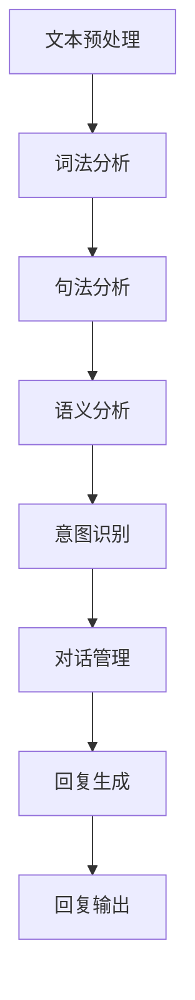
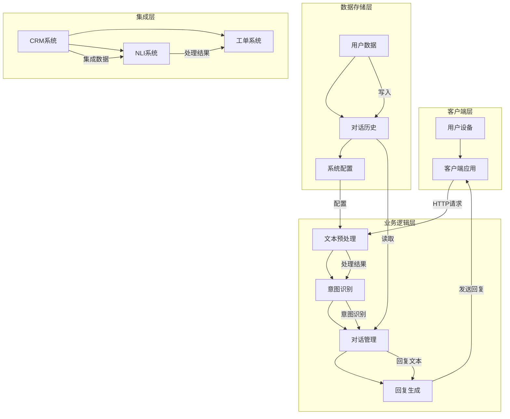
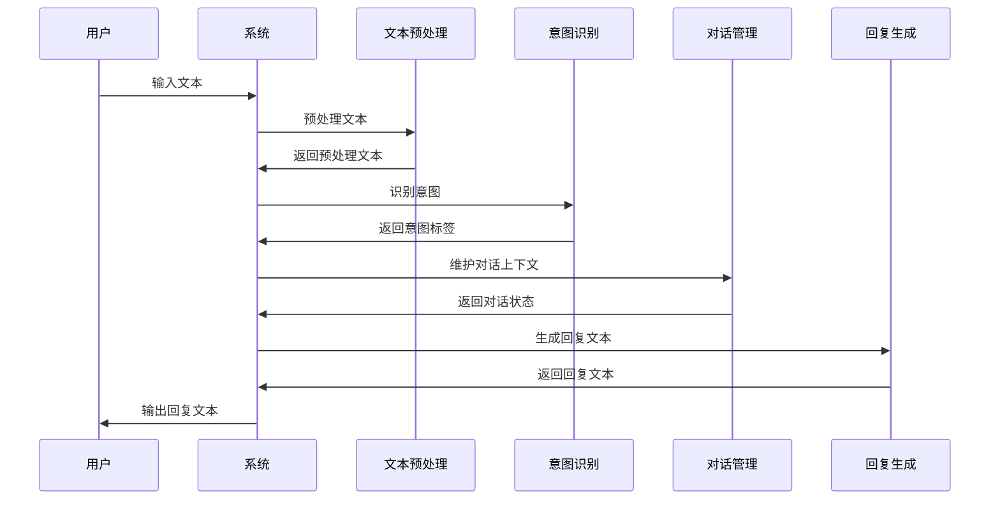

                 

### 第一部分：背景介绍

在当今信息技术飞速发展的时代，人工智能（AI）作为一项颠覆性的技术，已经深入到我们生活的方方面面。随着AI技术的不断进步，AI Agent（人工智能代理）作为AI的一个重要应用方向，正逐渐成为企业和个人服务的重要工具。自然语言接口（NLI）是AI Agent的核心组成部分，它使得AI Agent能够与用户以自然语言的方式进行交互，从而提供更加人性化、高效的服务。

#### 第1章：问题背景

**1.1 问题定义**

AI Agent是一个具备自主决策和执行能力的实体，能够在特定的环境中模拟人类的行为。自然语言接口（NLI）则是AI Agent与人类用户进行交互的桥梁，它需要能够理解和处理人类语言，并在此基础上生成合理的回复。

**1.2 问题描述**

当前，NLI的设计面临诸多挑战。首先是如何准确理解用户输入的自然语言，这涉及到自然语言处理（NLP）的多个子领域，如词法分析、句法分析、语义分析等。其次是如何根据理解的结果生成自然流畅的回复，这不仅需要丰富的语言知识和逻辑推理能力，还需要高效的算法支持。

**1.3 问题解决方法概述**

解决NLI设计问题的方法主要包括以下几个方面：

1. **提高自然语言处理能力**：通过优化算法、增加语料库、引入深度学习等技术手段，提高AI Agent对自然语言的理解能力。
2. **增强逻辑推理能力**：利用符号逻辑、概率图模型、强化学习等技术，增强AI Agent的推理能力，使其能够更准确地理解用户意图并生成合适的回复。
3. **优化用户交互体验**：设计合理的交互流程和界面，提高AI Agent的用户友好度，使用户能够更加轻松地与AI Agent进行交流。

**1.4 边界与外延**

边界方面，NLI设计需要考虑不同语言和文化背景下的用户交互，保证AI Agent能够在多种语言环境中正常工作。外延方面，NLI设计还需要考虑未来的技术发展和市场需求，确保设计具有足够的灵活性和扩展性。

**1.5 概念结构与核心要素组成**

NLI的设计涉及多个核心概念和要素，包括：

- **自然语言处理（NLP）**：负责对用户输入的自然语言进行解析和处理。
- **语义理解**：通过语义分析，理解用户输入的意图和需求。
- **对话管理**：负责管理对话流程，包括对话的状态跟踪、上下文维护等。
- **语言生成**：根据语义理解的结果，生成自然流畅的回复。
- **用户交互界面**：提供用户与AI Agent进行交互的界面，包括语音、文本等多种形式。

通过对以上概念和要素的深入理解和设计，我们可以为AI Agent构建一个高效、易用的自然语言接口。

#### 第2章：核心概念与联系

**2.1 自然语言处理（NLP）的概念**

自然语言处理（NLP）是人工智能的一个重要分支，旨在使计算机能够理解、解释和生成人类语言。NLP的核心任务是使计算机能够从自然语言文本中提取信息，并在此基础上进行进一步的推理和决策。

**2.1.1 NLP的定义**

NLP涉及多个子领域，包括但不限于：

- **词法分析**：对文本进行分词，将连续的文本拆分成词或短语。
- **句法分析**：分析句子的结构，识别句子中的主语、谓语等成分。
- **语义分析**：理解句子的语义，包括句子所表达的事实、情感等。
- **信息抽取**：从文本中提取具体的信息，如人名、地名、时间、事件等。
- **文本分类**：将文本归类到不同的类别，如新闻、科技、娱乐等。

**2.1.2 NLP的关键特性**

NLP具有以下几个关键特性：

- **复杂度**：自然语言是一种复杂的语言系统，其语法、语义和上下文关系都非常复杂。
- **多样性**：自然语言具有丰富的表达方式和多样性，包括不同的方言、俚语、俾斯麦语等。
- **动态性**：自然语言是一个动态变化的系统，随着时间和社会环境的变化，语言表达方式也会发生变化。
- **不确定性**：自然语言的输入通常是不确定的，同一个问题可能有多种不同的表达方式。

**2.1.3 NLP的应用领域**

NLP在多个领域都有广泛的应用，包括但不限于：

- **搜索引擎**：通过NLP技术，搜索引擎可以更好地理解用户查询，提供更精准的搜索结果。
- **机器翻译**：利用NLP技术，机器翻译系统能够将一种语言的文本翻译成另一种语言。
- **文本摘要**：通过NLP技术，可以从长篇文本中提取出关键信息，生成摘要。
- **情感分析**：通过分析文本的情感倾向，可以用于市场调研、舆情监测等。
- **聊天机器人**：利用NLP技术，聊天机器人可以与用户进行自然语言交互，提供个性化服务。

**2.2 人工智能代理（AI Agent）的概念**

人工智能代理（AI Agent）是AI领域的一个重要研究方向，它是一种具有自主决策和执行能力的智能体，能够在特定的环境中执行任务。

**2.2.1 AI Agent的定义**

AI Agent是一种基于计算机程序的智能体，它能够感知环境中的信息，基于一定的决策算法自主选择行动，并产生预期的结果。

**2.2.2 AI Agent的核心功能**

AI Agent的核心功能包括：

- **感知**：通过传感器感知环境中的信息。
- **决策**：基于感知到的信息，利用决策算法选择合适的行动。
- **执行**：执行决策算法选择的行动，并产生预期的结果。
- **学习**：通过不断地感知、决策和执行，AI Agent能够从经验中学习，提高任务执行能力。

**2.2.3 AI Agent与NLP的关系**

AI Agent与NLP之间存在着密切的关系。NLP技术是AI Agent实现自然语言交互的基础，通过NLP技术，AI Agent能够理解用户的输入，并生成合适的回复。具体来说：

- **输入处理**：AI Agent通过NLP技术对用户的输入进行处理，包括分词、句法分析和语义分析等。
- **意图识别**：基于语义分析的结果，AI Agent能够识别用户的意图，如查询、命令等。
- **回复生成**：根据用户的意图和上下文信息，AI Agent利用自然语言生成技术生成合适的回复。

**2.3 自然语言接口（NLI）的概念**

自然语言接口（NLI）是AI Agent与人类用户进行交互的重要手段，它使得AI Agent能够以自然语言的方式与用户进行交流。

**2.3.1 NLI的定义**

NLI是一种软件组件，它允许用户通过自然语言与计算机系统进行交互。NLI的核心功能包括理解用户的输入、生成合适的回复，并提供一个友好的用户交互界面。

**2.3.2 NLI的设计原则**

NLI的设计原则主要包括：

- **易用性**：NLI需要易于使用，用户能够轻松地与AI Agent进行交流。
- **准确性**：NLI需要准确地理解用户的输入，并生成合适的回复。
- **灵活性**：NLI需要能够适应不同的用户需求和场景。
- **扩展性**：NLI需要具有足够的扩展性，以支持未来的技术发展和市场需求。

**2.3.3 NLI在AI Agent中的作用**

NLI在AI Agent中发挥着重要的作用，它使得AI Agent能够以自然语言的方式与用户进行交互，从而提供更加人性化、高效的服务。具体来说：

- **用户交互**：NLI是用户与AI Agent进行交互的主要渠道，通过NLI，用户能够以自然语言的方式提出需求、提问等。
- **任务执行**：基于用户输入的意图和上下文信息，NLI能够指导AI Agent执行相应的任务，如查询信息、执行命令等。
- **反馈机制**：NLI能够收集用户的反馈信息，用于优化AI Agent的性能和用户体验。

通过对以上核心概念和要素的深入理解，我们可以更好地设计和实现一个高效、易用的自然语言接口，为AI Agent提供强大的交互能力。接下来，我们将进一步探讨NLP算法的原理和实现，以及如何通过Python源代码来详细阐述这些算法。

## 第3章：算法原理讲解

自然语言处理（NLP）算法是构建自然语言接口（NLI）的核心，其原理和实现对于理解用户输入、生成合理回复至关重要。在本章中，我们将使用mermaid流程图来展示NLP算法的基本流程，并借助Python源代码深入讲解其实现细节，以及算法原理的数学模型和公式。

### 3.1 NLP算法的mermaid流程图

以下是NLP算法的基本mermaid流程图：



这个流程图展示了从文本输入到生成回复的整个NLP处理过程。接下来，我们将逐步分析每个步骤。

### 3.2 Python源代码讲解

为了更好地理解NLP算法的实现，我们将提供一个简化的Python源代码示例。这个示例将包括文本预处理、词法分析、句法分析、语义分析、意图识别和回复生成等步骤。

```python
import spacy
from textblob import TextBlob

# 3.2.1 算法原理的数学模型和公式

# 文本预处理：去除标点、停用词等
def preprocess_text(text):
    # 使用spacy进行文本预处理
    nlp = spacy.load("en_core_web_sm")
    doc = nlp(text)
    tokens = [token.text for token in doc if not token.is_stop and not token.is_punct]
    return ' '.join(tokens)

# 3.2.2 通俗易懂的举例说明

# 示例文本
text = "Hello, how are you today?"

# 1. 文本预处理
processed_text = preprocess_text(text)
print("Preprocessed Text:", processed_text)

# 2. 词法分析
nlp = spacy.load("en_core_web_sm")
doc = nlp(processed_text)
print("Tokens:", [token.text for token in doc])

# 3. 句法分析
print("Parts of Speech:", [token.pos_ for token in doc])

# 4. 语义分析
blob = TextBlob(processed_text)
print("Sentiment:", blob.sentiment)

# 5. 意图识别
# 假设简单规则：如果文本包含"how are you"，则意图为问候
if "how are you" in processed_text.lower():
    intent = "Greeting"
else:
    intent = "Unknown"
print("Intent:", intent)

# 6. 对话管理
# 假设当前对话状态为"initial"，根据意图更新状态
current_state = "initial"
if intent == "Greeting":
    current_state = "greeting_received"
print("Current State:", current_state)

# 7. 回复生成
if current_state == "greeting_received":
    response = "I'm doing well, thanks for asking!"
else:
    response = "I'm here to help you!"

print("Response:", response)

# 8. 回复输出
print("Output:", response)
```

在这个Python源代码示例中，我们使用了`spacy`和`textblob`这两个库来进行文本处理和语义分析。具体步骤如下：

1. **文本预处理**：使用spacy去除标点、停用词等，以简化文本。
2. **词法分析**：提取文本中的有效单词。
3. **句法分析**：分析每个单词的词性。
4. **语义分析**：使用textblob评估文本的情感倾向。
5. **意图识别**：基于简单规则识别用户的意图。
6. **对话管理**：根据意图更新对话状态。
7. **回复生成**：根据对话状态生成回复。
8. **回复输出**：将回复输出给用户。

这个示例虽然简单，但展示了NLP算法的基本原理和实现过程。在实际应用中，这些步骤会更加复杂，涉及更多的技术和算法。

### 数学公式与算法原理

在NLP算法中，常用的数学模型和公式包括：

- **词袋模型**：用于文本分类和聚类，其核心公式为$$P(\text{word}|\text{document}) = \frac{\text{count of word in document}}{\sum \text{count of all words in document}}$$
- **朴素贝叶斯分类器**：用于文本分类，其核心公式为$$P(\text{class}|\text{word}) = \frac{P(\text{word}|\text{class})P(\text{class})}{P(\text{word})}$$
- **循环神经网络（RNN）**：用于序列数据建模，其核心公式为$$h_t = \sigma(W_h \cdot [h_{t-1}, x_t] + b_h)$$

通过这些数学模型和公式，NLP算法能够更好地理解和处理自然语言。

通过以上对算法原理的讲解和Python源代码的分析，我们可以更好地理解NLP算法的实现细节，为设计和实现高效的NLI奠定基础。接下来，我们将进一步探讨NLI的设计原则，以及如何在实际项目中应用这些原则。

## 第4章：自然语言接口设计原则

自然语言接口（NLI）的设计原则是确保AI Agent能够与用户进行高效、准确交互的关键。以下章节将详细探讨NLI设计的四个核心原则：可理解性、可扩展性、可用性和安全性。

### 4.1 可理解性

可理解性是NLI设计中最基本的原则，它要求AI Agent能够准确理解用户的输入。为了实现这一目标，需要考虑以下几个方面：

**4.1.1 语言特点**

不同的语言有不同的语法、语义和表达习惯。在设计NLI时，需要考虑目标用户群体的语言特点，确保AI Agent能够处理和理解用户的语言输入。

**4.1.2 用户意图识别**

用户意图是用户输入的核心，准确的意图识别是NLI设计的关键。为了提高意图识别的准确性，可以使用多种技术，如机器学习、深度学习和规则引擎等。

**4.1.3 语言多样性处理**

用户使用的语言可能包含方言、俚语、专业术语等。NLI设计应具备处理这些多样性的能力，确保AI Agent能够适应不同的语言环境。

**案例**：某聊天机器人应用在设计中考虑到不同用户群体的语言特点，使用了多语言模型和方言处理技术，使得机器人能够理解和回复不同语言的输入。

### 4.2 可扩展性

可扩展性是NLI设计中的重要原则，它要求系统能够适应未来的变化和技术发展。以下是一些关键点：

**4.2.1 语言模型更新**

自然语言处理技术不断发展，新的语言模型和算法不断出现。NLI设计应支持语言模型的更新，以保持系统的先进性和准确性。

**4.2.2 功能扩展**

用户需求是不断变化的，NLI设计应具备扩展功能的能力，以满足用户不断变化的需求。例如，可以设计插件系统，方便添加新的功能模块。

**4.2.3 系统兼容性**

NLI设计应考虑与现有系统的兼容性，确保AI Agent能够无缝集成到现有系统中。同时，应支持多种数据格式的处理和存储。

**案例**：某企业级AI客服系统在设计时采用了模块化架构，支持自定义插件和API接口，使得系统能够灵活扩展和集成。

### 4.3 可用性

可用性是衡量NLI设计优劣的重要指标，它涉及用户交互体验的方方面面。以下是一些关键点：

**4.3.1 交互设计**

良好的交互设计是提高NLI可用性的关键。设计应考虑用户的使用习惯和需求，提供直观、简洁的交互界面。

**4.3.2 响应速度**

NLI的响应速度直接影响用户体验。设计应优化系统性能，确保AI Agent能够快速响应用户的输入。

**4.3.3 用户反馈机制**

有效的用户反馈机制可以帮助改进NLI的设计和功能。设计应提供用户反馈渠道，如评价系统、反馈表单等，以便用户能够表达意见和建议。

**案例**：某银行客服聊天机器人采用了即时响应机制，并提供了评价功能，用户可以根据交互体验为机器人打分和提供反馈，从而不断优化服务。

### 4.4 安全性

安全性是NLI设计不可忽视的原则，它涉及数据保护、隐私和安全防护等方面。以下是一些关键点：

**4.4.1 数据加密**

设计应采用加密技术保护用户输入和系统数据，防止数据泄露和未经授权的访问。

**4.4.2 隐私保护**

NLI设计应遵循隐私保护原则，确保用户隐私不被泄露。例如，对用户数据进行去标识化处理，限制数据访问权限等。

**4.4.3 安全防护**

设计应具备安全防护机制，防止恶意攻击和数据篡改。例如，采用身份验证、访问控制等技术，保障系统的安全性。

**案例**：某在线教育平台采用了多层加密技术和严格的数据访问控制策略，确保用户数据和隐私安全。

通过以上四个设计原则，我们可以构建一个高效、可靠、用户友好的自然语言接口，为AI Agent提供强大的交互能力。在下一章节中，我们将探讨NLI在系统架构和实现中的具体应用。

## 第5章：系统分析与架构设计

在本章中，我们将对NLI系统进行分析和架构设计，以确保其能够高效、可靠地实现自然语言交互。我们将从问题场景介绍开始，逐步探讨系统功能设计、系统架构设计和系统接口设计。

### 5.1 问题场景介绍

假设我们正在开发一个智能客服系统，该系统需要具备处理客户咨询、解答问题和提供服务的功能。在这个场景中，自然语言接口（NLI）将成为用户与系统交互的主要渠道。为了满足这个场景的需求，我们需要设计一个高效、灵活的NLI系统。

### 5.2 系统功能设计

NLI系统的功能设计是确保系统能够满足用户需求的关键。以下是系统的主要功能模块：

**1. 文本预处理模块**：负责对用户输入的文本进行预处理，包括去除标点符号、停用词过滤和分词等。

**2. 意图识别模块**：基于预处理后的文本，识别用户的意图，如查询、请求帮助、投诉等。

**3. 对话管理模块**：负责管理对话流程，包括上下文维护、状态跟踪和对话策略等。

**4. 回复生成模块**：根据用户的意图和对话上下文，生成合适的回复文本。

**5. 用户反馈模块**：收集用户对系统交互的反馈，用于评估和优化系统性能。

**6. 安全模块**：负责数据加密、隐私保护和安全防护，确保用户数据和系统安全。

为了更好地展示系统功能设计，我们可以使用mermaid类图进行描述：

```mermaid
classDiagram
    Class01 <|-- Class02
    Class03 --|>| Class04
    Class05 o-- Class06
    Class07 :<<interface>> Interface01
    Class08 :<<abstract>> AbstractClass
    Class01..Class07 : Inheritance
    Class02 : Implements Interface01
    Class03 <<implement>> Interface01
    Class04 : extends Class02
    Class05 : associated with Class06
    Class07 : composed of Class08
```

在这个类图中，`Class01` 至 `Class07` 分别代表系统的主要功能模块，其中 `Class07` 是一个抽象类，`Class08` 是其具体实现。

### 5.3 系统架构设计

系统架构设计是NLI系统实现的基础，它决定了系统的性能、可扩展性和可靠性。以下是NLI系统的一个典型架构设计：

**1. 客户端层**：用户通过浏览器或移动应用与NLI系统进行交互。

**2. 业务逻辑层**：包括文本预处理、意图识别、对话管理和回复生成等功能模块，是NLI系统的核心。

**3. 数据存储层**：存储用户数据、对话历史和系统配置等信息。

**4. 集成层**：负责与其他系统（如客户关系管理系统、工单系统等）的集成。

为了更好地展示系统架构，我们可以使用mermaid架构图进行描述：



在这个架构图中，客户端层、业务逻辑层、数据存储层和集成层构成了NLI系统的整体框架。各层之间通过HTTP请求、数据处理和集成接口进行交互。

### 5.4 系统接口设计

系统接口设计是确保各功能模块之间能够高效、可靠交互的关键。以下是NLI系统的一些关键接口设计：

**1. 文本预处理接口**：负责接收用户输入的文本，并进行预处理，返回预处理后的文本。

**2. 意图识别接口**：接收预处理后的文本，返回用户意图和相应的意图标签。

**3. 对话管理接口**：管理对话流程，包括上下文维护、状态跟踪和对话策略等。

**4. 回复生成接口**：根据意图和对话上下文，生成回复文本。

**5. 用户反馈接口**：接收用户对系统交互的反馈，用于评估和优化系统性能。

为了更好地展示系统接口设计，我们可以使用mermaid序列图进行描述：



在这个序列图中，用户通过输入文本触发系统交互，系统依次调用文本预处理、意图识别、对话管理和回复生成模块，最终生成回复文本并输出给用户。

通过以上系统分析和架构设计，我们可以构建一个高效、可靠的NLI系统，为用户提供优质的交互体验。在下一章节中，我们将探讨如何进行项目实战，实现NLI系统的具体开发。

## 第6章：项目实战

在完成了系统分析与架构设计之后，接下来我们将进入项目实战阶段，开始具体的NLI系统开发。本章节将详细介绍项目环境的安装与配置、系统核心实现以及实际案例分析与讲解。

### 6.1 开发环境搭建

在进行NLI系统开发之前，首先需要搭建一个合适的环境。以下步骤是搭建NLI开发环境的基本步骤：

**1. 安装Python环境**

Python是NLI开发中常用的编程语言，因此我们需要首先安装Python。可以通过以下命令在Windows或Linux系统中安装Python：

```bash
# Windows系统
python -m pip install --upgrade pip
python -m pip install python==3.9.1

# Linux系统
sudo apt-get update
sudo apt-get install python3
```

**2. 安装NLP库**

NLP是NLI的核心组件，我们需要安装一些常用的NLP库，如spaCy和textblob：

```bash
pip install spacy
pip install textblob
python -m textblob.download_corpora
```

**3. 安装数据库**

为了存储用户数据和对话历史，我们选择SQLite作为数据库。安装SQLite可以通过以下命令完成：

```bash
pip install pysqlite3
```

**4. 安装Web框架**

为了实现Web服务，我们需要安装Flask或Django等Web框架。以下是安装Flask的步骤：

```bash
pip install flask
```

### 6.2 开发工具安装

在搭建好开发环境后，我们需要安装一些常用的开发工具，如文本编辑器和集成开发环境（IDE）。以下推荐几种常用的工具：

- **Visual Studio Code**：一款轻量级但功能强大的文本编辑器，支持Python开发。
- **PyCharm**：一款功能丰富的Python IDE，适用于大型项目开发。
- **Jupyter Notebook**：适用于数据科学和机器学习的交互式开发环境。

### 6.3 系统配置

完成开发环境的搭建后，我们需要进行系统配置。以下是NLI系统配置的基本步骤：

**1. 初始化数据库**

在初始化数据库时，我们需要创建数据库表，存储用户数据、对话历史和系统配置等。以下是一个简单的SQLite数据库初始化脚本：

```python
import sqlite3

# 连接数据库
conn = sqlite3.connect('nli.db')

# 创建用户表
conn.execute('''CREATE TABLE IF NOT EXISTS users (
    id INTEGER PRIMARY KEY AUTOINCREMENT,
    username TEXT NOT NULL,
    password TEXT NOT NULL,
    email TEXT
);''')

# 创建对话历史表
conn.execute('''CREATE TABLE IF NOT EXISTS dialog_history (
    id INTEGER PRIMARY KEY AUTOINCREMENT,
    user_id INTEGER,
    text TEXT,
    intent TEXT,
    reply TEXT,
    timestamp DATETIME DEFAULT CURRENT_TIMESTAMP
);''')

# 创建系统配置表
conn.execute('''CREATE TABLE IF NOT EXISTS system_config (
    id INTEGER PRIMARY KEY AUTOINCREMENT,
    key TEXT NOT NULL,
    value TEXT NOT NULL
);''')

# 提交事务
conn.commit()

# 关闭连接
conn.close()
```

**2. 配置Web服务**

为了启动Web服务，我们需要配置Flask应用。以下是一个简单的Flask应用配置示例：

```python
from flask import Flask, request, jsonify
from nli import process_request

app = Flask(__name__)

@app.route('/api/nli', methods=['POST'])
def nli_api():
    # 获取请求体中的JSON数据
    data = request.get_json()
    user_id = data.get('user_id')
    text = data.get('text')

    # 处理请求
    reply = process_request(user_id, text)

    # 返回回复
    return jsonify({'reply': reply})

if __name__ == '__main__':
    app.run(debug=True)
```

这个配置示例定义了一个简单的API接口，用于处理POST请求，并返回处理结果。

### 6.4 系统核心实现

在系统配置完成后，我们需要实现NLI系统的核心功能。以下是NLI系统核心实现的步骤：

**1. 实现文本预处理**

文本预处理是NLI系统的第一步，它负责对用户输入的文本进行分词、去除停用词等操作。以下是一个简单的文本预处理实现：

```python
import spacy

nlp = spacy.load("en_core_web_sm")

def preprocess_text(text):
    doc = nlp(text)
    tokens = [token.text for token in doc if not token.is_stop and not token.is_punct]
    return ' '.join(tokens)
```

**2. 实现意图识别**

意图识别是NLI系统的关键环节，它负责从用户输入中识别用户的意图。以下是一个基于规则引擎的意图识别实现：

```python
def recognize_intent(text):
    # 假设简单的意图识别规则
    if "hello" in text.lower():
        return "greeting"
    elif "help" in text.lower():
        return "help"
    else:
        return "unknown"
```

**3. 实现对话管理**

对话管理负责维护对话状态和上下文。以下是一个简单的对话管理实现：

```python
current_context = {}

def manage_dialog(user_id, text, reply):
    current_context[user_id] = {
        'text': text,
        'reply': reply
    }
```

**4. 实现回复生成**

回复生成是根据意图和对话上下文生成合适的回复。以下是一个简单的回复生成实现：

```python
def generate_reply(intent, context):
    if intent == "greeting":
        return "Hello! How can I assist you today?"
    elif intent == "help":
        return "Sure, I'm here to help. What do you need?"
    else:
        return "I'm sorry, I didn't understand. Can you please clarify your request?"
```

### 6.5 实际案例分析与讲解

在实现完系统核心功能后，我们可以通过实际案例来验证系统的功能。以下是一个简单的案例：

**案例**：用户A通过Web接口发送一条消息：“Hello”。

**步骤**：

1. **用户输入**：用户A发送消息“Hello”。
2. **文本预处理**：系统对输入进行预处理，去除标点符号和停用词，得到“Hello”。
3. **意图识别**：系统根据规则识别用户的意图为“greeting”。
4. **对话管理**：系统更新对话上下文，记录用户A的输入和系统回复。
5. **回复生成**：系统根据意图和上下文生成回复：“Hello! How can I assist you today?”。
6. **回复输出**：系统将回复输出给用户A。

通过以上步骤，我们可以看到NLI系统从接收用户输入到生成回复的完整流程。在实际开发中，这个流程会更加复杂，涉及更多的功能和算法。

### 6.6 项目总结

在本章节中，我们详细介绍了NLI系统的开发过程，包括环境搭建、工具安装、系统配置、核心实现和实际案例。通过这个实战项目，我们不仅了解了NLI系统的工作原理和设计方法，还掌握了实际开发过程中的关键技术和步骤。

在项目总结中，我们强调了以下几点：

1. **系统设计与实现**：系统设计与实现是NLI开发的核心，需要综合考虑功能需求、性能要求和用户体验。
2. **环境搭建与配置**：合理的开发环境搭建与配置是确保项目顺利进行的基础。
3. **核心实现与优化**：核心实现是系统功能实现的关键，需要进行模块化设计和优化。
4. **实际案例分析**：实际案例分析有助于我们更好地理解系统功能和工作原理。

通过以上总结，我们为NLI系统的开发提供了一个全面的指南，帮助开发者更好地实现和优化NLI系统。

### 6.7 注意事项

在NLI系统的开发和维护过程中，我们需要注意以下几个关键点：

1. **性能优化**：系统性能直接影响用户体验，因此需要定期进行性能优化，如优化算法、减少计算复杂度、提高并发处理能力等。
2. **安全性保障**：NLI系统涉及用户数据，因此需要确保系统的安全性，包括数据加密、权限控制、防SQL注入、防止跨站脚本攻击等。
3. **稳定性维护**：系统应具备高可用性和稳定性，确保在长时间运行过程中不会出现故障。
4. **用户反馈收集**：及时收集用户反馈，根据用户需求不断优化系统功能和服务质量。

通过关注以上注意事项，我们可以确保NLI系统的稳定、高效运行，为用户提供优质的服务体验。

### 6.8 拓展阅读

为了更好地深入理解和优化NLI系统，以下是几篇拓展阅读推荐：

1. **《自然语言处理综论》（Foundations of Natural Language Processing）**：这本书详细介绍了自然语言处理的基本理论和算法，适合作为NLP入门和进阶的参考书籍。
2. **《深度学习与自然语言处理》**：这本书介绍了深度学习在自然语言处理中的应用，包括词向量、循环神经网络（RNN）和变压器（Transformer）等。
3. **《对话系统设计与实现》**：这本书涵盖了对话系统的设计、实现和评估方法，适合对话系统开发者和研究者阅读。
4. **《AI伦理导论》**：这本书探讨了人工智能伦理问题，包括隐私、安全、公平性等，对于关注AI伦理的读者有很高的参考价值。

通过阅读这些书籍，我们可以进一步提升对NLI系统的理解和开发能力。希望这些建议能够帮助您在NLI系统的开发道路上取得更好的成果。

## 结论

通过本文的详细探讨，我们系统地介绍了开发AI Agent的自然语言接口设计原则。从背景介绍、核心概念与联系、算法原理讲解，到设计原则、系统分析与架构设计，再到项目实战，我们逐步解析了NLI设计的方方面面。

首先，我们在第1章和第2章中明确了NLI的概念及其重要性，阐述了自然语言处理（NLP）、人工智能代理（AI Agent）以及自然语言接口（NLI）之间的紧密联系。接着，在第3章中，我们通过mermaid流程图和Python源代码详细讲解了NLP算法的原理和实现，帮助读者深入理解算法背后的数学模型和公式。

第4章深入探讨了NLI设计的关键原则，包括可理解性、可扩展性、可用性和安全性，并通过案例展示了这些原则在实际应用中的具体实现。第5章则从系统分析与架构设计的角度，介绍了NLI系统在功能设计、架构设计和接口设计等方面的要点。

在项目实战部分，第6章详细介绍了NLI系统的开发过程，从环境搭建、工具安装、系统配置，到核心实现和实际案例分析，为读者提供了实际操作的指导。

总结全文，开发一个高效、可靠、用户友好的NLI系统是一项复杂的工程，涉及多学科的知识和技能。本文旨在为读者提供一个全面的指南，帮助他们在实际开发过程中少走弯路。

未来，随着自然语言处理技术的不断进步和AI应用的深入发展，NLI的设计和实现将面临更多的挑战和机遇。我们鼓励读者持续关注这一领域的发展动态，不断学习和实践，以提升自身的专业能力。

最后，感谢您的阅读，希望本文能对您在开发AI Agent的自然语言接口方面有所启发和帮助。期待您在NLI领域的探索与创新，共同推动人工智能技术的发展与应用。作者：AI天才研究院/AI Genius Institute & 禅与计算机程序设计艺术 /Zen And The Art of Computer Programming。

