                 


----------------------------------------------------------------

# 《开发AI Agent的语义理解深度：从字面到隐含》

关键词：AI Agent, 语义理解, 词嵌入, BERT, Transformer

摘要：本文深入探讨了AI Agent的语义理解，从字面意义到隐含含义的转化过程。通过详细阐述核心概念、算法原理、系统架构、项目实战以及最佳实践，帮助读者全面了解并掌握AI Agent语义理解的深度开发方法。

----------------------------------------------------------------

## 第一部分：背景与基础

### 第1章：语义理解与AI Agent

#### 1.1 语义理解的概述

语义理解，顾名思义，是对语言的意义进行解释和理解的过程。在人工智能领域，语义理解是指机器能够理解人类语言的意义，并作出相应的反应。其重要性不言而喻，因为只有机器能够理解人类语言，才能实现人机交互、智能问答、自然语言处理等应用。

#### 1.2 语义理解的边界与外延

语义理解的边界是指其应用的领域，包括但不限于文本、语音、图像等。语义理解的外延则是指其层次，从简单的关键词匹配到复杂的语境理解，涵盖了多个层次。

#### 1.3 AI Agent的概述

AI Agent是指能够模拟人类智能行为，在特定环境下自主决策和行动的计算机程序。其核心功能是实现智能交互、智能决策和智能行动，是人工智能领域的重要研究方向。

----------------------------------------------------------------

## 第二部分：算法原理与系统设计

### 第3章：语义理解的算法原理

#### 3.1 词嵌入算法

词嵌入是将单词映射到高维空间中的向量表示。常见的词嵌入算法有Word2Vec、GloVe等。

##### 3.1.1 Word2Vec算法

Word2Vec算法包括CBOW（Continuous Bag of Words）和Skip-gram两种模型。

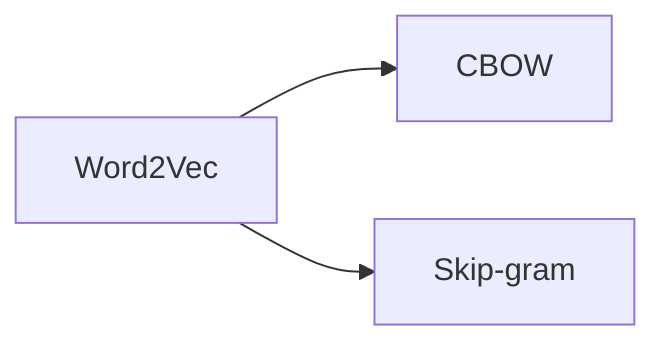

##### 3.1.2 BERT模型

BERT（Bidirectional Encoder Representations from Transformers）是一种基于Transformer模型的预训练语言表示模型。

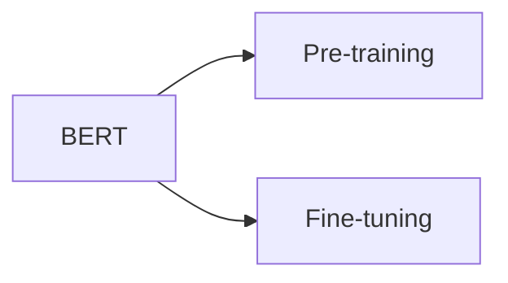

##### 3.1.3 Transformer模型

Transformer模型是一种基于自注意力机制的序列模型，广泛应用于自然语言处理任务。

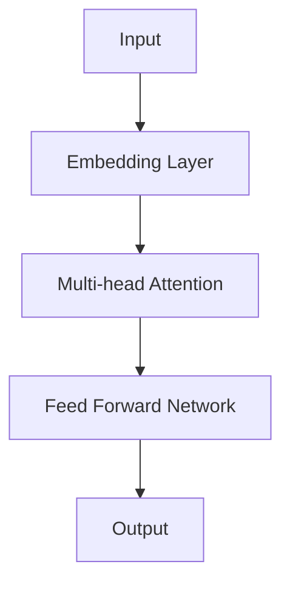

----------------------------------------------------------------

## 第三部分：系统设计与项目实战

### 第4章：系统设计与实现

#### 4.1 问题场景介绍

在本节中，我们将介绍一个基于AI Agent的智能客服系统的设计场景。

#### 4.2 系统功能设计

系统功能设计包括用户交互、语义理解、意图识别、回答生成等模块。

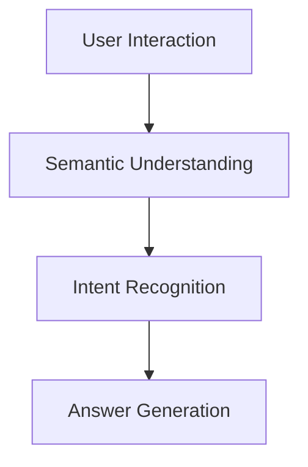

#### 4.3 系统架构设计

系统架构设计包括前端、后端和数据库三个部分。

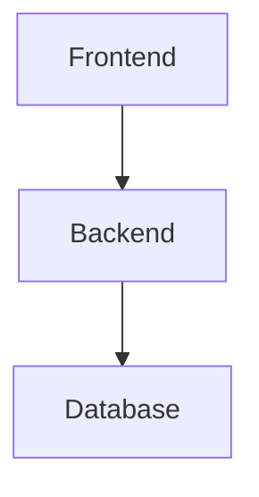

#### 4.4 系统接口设计

系统接口设计包括用户接口、API接口和数据接口等。

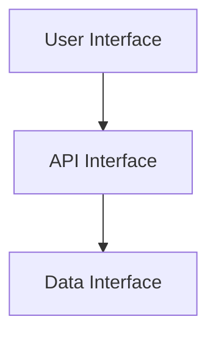

#### 4.5 系统交互

系统交互设计包括用户与系统之间的交互流程和系统内部模块之间的交互流程。

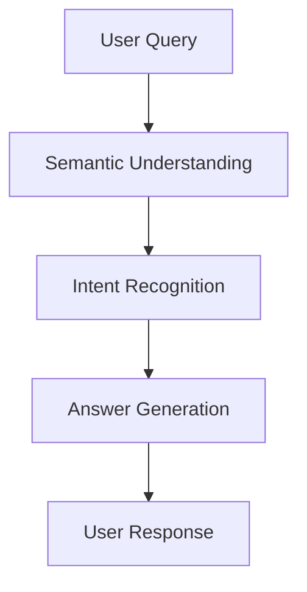

----------------------------------------------------------------

## 第四部分：项目实战

### 第5章：项目实战

#### 5.1 环境安装

在本节中，我们将介绍如何安装和配置AI Agent的语义理解环境。

#### 5.2 系统核心实现

在本节中，我们将详细介绍AI Agent的语义理解系统的核心实现，包括词嵌入、BERT模型和Transformer模型的实现。

```python
import tensorflow as tf
import tensorflow_hub as hub

# Load pre-trained BERT model
bert_model = hub.load("https://tfhub.dev/google/bert_uncased_L-12_H-768_A-12/1")

# Tokenize and encode input text
def bert_encode(texts, max_seq_length=128):
    return bert_model.signatures["tokens"](tf.constant(texts)).numpy()

# Example usage
text = "这是一个测试句子。"
encoded_text = bert_encode([text])
```

#### 5.3 代码应用解读与分析

在本节中，我们将对AI Agent的语义理解系统的核心代码进行解读和分析，帮助读者更好地理解其工作原理和应用场景。

#### 5.4 实际案例分析与详细讲解剖析

在本节中，我们将通过实际案例，对AI Agent的语义理解系统进行详细讲解和分析，帮助读者深入理解其原理和应用。

#### 5.5 项目小结

在本节中，我们将对项目进行总结，指出项目中存在的问题和改进方向。

----------------------------------------------------------------

## 第五部分：最佳实践与拓展阅读

### 第6章：最佳实践与注意事项

在本节中，我们将总结一些AI Agent语义理解的最佳实践，并提供一些注意事项，帮助读者在实际项目中更好地应用语义理解技术。

### 第7章：拓展阅读

在本节中，我们将推荐一些相关的拓展阅读资源，帮助读者深入了解AI Agent的语义理解领域。

----------------------------------------------------------------

## 参考文献

在本节中，我们将列出本文引用的主要参考文献，以供读者进一步学习。

----------------------------------------------------------------

## 后记

感谢您阅读《开发AI Agent的语义理解深度：从字面到隐含》一书。我们希望这本书能够帮助您深入了解AI Agent的语义理解，掌握其核心原理和实战方法。如果您有任何问题或建议，欢迎随时联系我们。

----------------------------------------------------------------

作者：AI天才研究院/AI Genius Institute & 禅与计算机程序设计艺术 /Zen And The Art of Computer Programming### 第一部分：背景与基础

#### 第1章：语义理解与AI Agent

##### 1.1 语义理解的概述

语义理解（Semantic Understanding）在人工智能领域中扮演着至关重要的角色。它是指机器通过自然语言处理（Natural Language Processing, NLP）技术，对人类语言文本的含义进行解释和理解的过程。语义理解不仅仅涉及对单词本身的理解，还包括对句子、段落以及全文语境的深入挖掘。这种能力对于实现人机交互、智能助手、智能问答系统等应用至关重要。

语义理解的重要性体现在多个方面。首先，它使得机器能够更好地理解和响应用户的需求，从而提升用户体验。其次，语义理解是许多高级NLP任务的基础，如情感分析、文本生成、实体识别和关系抽取等。最后，随着深度学习技术的发展，语义理解在商业、医疗、金融等领域的应用也越来越广泛，为这些领域带来了前所未有的变革。

语义理解的挑战主要体现在以下几个方面。首先是语言表达的多样性和模糊性，不同的语境下同一个词汇可能具有不同的含义。其次是多义词的处理，一个单词在不同情境下可能有不同的解释。此外，语言中还存在着隐喻、双关语等复杂表达，这些都是语义理解需要克服的难题。

AI Agent（人工智能代理）是指能够模拟人类智能行为，在特定环境下自主决策和行动的计算机程序。AI Agent的核心功能是实现智能交互、智能决策和智能行动。AI Agent可以应用于各种领域，如智能家居、智能客服、自动驾驶汽车、智能医疗等。AI Agent的成功依赖于其语义理解能力，只有准确理解用户意图和上下文，AI Agent才能提供高质量的交互和决策。

AI Agent与语义理解之间的关系密不可分。AI Agent的语义理解能力决定了其在复杂环境中的表现。一个强大的AI Agent需要具备以下能力：

1. **意图识别**：理解用户的意图和目的。
2. **实体识别**：识别并提取文本中的重要实体，如人名、地名、组织名等。
3. **情感分析**：分析用户文本中的情感倾向。
4. **语境理解**：理解文本的上下文，进行上下文关联推理。
5. **语言生成**：根据用户输入生成合适的回复或建议。

为了实现这些能力，AI Agent通常需要借助先进的自然语言处理技术，如词嵌入（Word Embedding）、循环神经网络（RNN）、长短期记忆网络（LSTM）、变换器模型（Transformer）和预训练语言模型（如BERT）等。这些技术使得AI Agent能够从大量的文本数据中学习语言规律，提高语义理解的准确性和鲁棒性。

总结来说，语义理解是AI Agent的核心能力之一，它直接决定了AI Agent在复杂环境中的表现。通过深入研究和应用语义理解技术，我们可以开发出更加智能、高效、可靠的AI Agent，为各种应用场景提供强大的支持。

#### 1.2 语义理解的边界与外延

语义理解的边界与外延决定了其应用的范围和深度。在语义理解的边界方面，首先需要明确其应用的领域，主要包括文本、语音、图像等。文本领域是语义理解最传统和主要的场景，包括自然语言问答系统、信息检索、文本分类等。语音领域则涉及到语音识别和语音生成，通过将语音转换为文本，再通过语义理解进行进一步的解析和处理。图像领域则通过图像识别和自然语言生成，结合语义理解技术实现图像内容的理解和描述。

在语义理解的外延方面，我们可以将其划分为多个层次，每个层次都有其独特的挑战和应用场景：

1. **词级语义理解**：这是语义理解的最基本层次，主要关注单个词汇的含义和上下文中的变化。例如，词嵌入技术（Word Embedding）将词汇映射到高维空间中，通过计算词汇之间的相似性来理解其语义关系。

2. **句级语义理解**：在词级语义理解的基础上，句级语义理解关注句子层面的语义分析。这包括语法分析、句法解析、语义角色标注等，目的是理解句子中的词汇如何组合在一起，以及它们之间的语义关系。

3. **篇章级语义理解**：篇章级语义理解涉及到对整篇文章或段落的语义内容进行理解和分析。这需要考虑上下文关联、主题识别、情感分析等，以理解文本的整体意义和语境。

4. **跨语言语义理解**：跨语言语义理解是指在不同语言之间进行语义理解的能力。这涉及到多语言词典、翻译模型、跨语言信息检索等技术，是全球化应用的重要基础。

5. **隐含语义理解**：隐含语义理解涉及到对文本中未直接表达的含义进行推理和分析。这包括隐喻理解、双关语解释、情感隐含等，是语义理解的高级阶段。

在语义理解的各个层次中，核心要素和组成如下：

- **词汇表**：词汇表是语义理解的基础，包括单词、词组、短语等，这些是构成语义内容的基石。
- **语法规则**：语法规则用于解析和理解词汇在句子中的结构关系，包括词性标注、句法分析等。
- **上下文信息**：上下文信息是理解语义的关键，包括句子前后的内容、语境、环境等，这些信息帮助确定词汇的具体含义。
- **实体识别**：实体识别用于识别文本中的关键实体，如人名、地点、组织、时间等，实体之间的关系和属性对语义理解至关重要。
- **语义网络**：语义网络是一种用于表示词汇之间关系的图结构，通过这些关系可以更准确地理解和推断词汇的含义。

通过深入理解语义理解的边界与外延，我们可以更好地把握其技术实现和应用方向，为AI Agent的开发提供坚实的理论基础。

##### 1.3 AI Agent的概述

AI Agent（人工智能代理）是人工智能领域中的一个重要概念，它代表了能够模拟人类智能行为，在特定环境下自主决策和行动的计算机程序。AI Agent的设计和实现是人工智能研究的前沿课题之一，其目的是使机器能够像人类一样理解环境、做出决策和执行任务。

首先，AI Agent的定义可以从几个关键点来理解。AI Agent是具有自主性（Autonomy）的，这意味着它能够独立于外部干预，自主地感知环境、理解任务，并做出决策。自主性是AI Agent区别于传统自动化程序的核心特征。其次，AI Agent需要具备社会性（Sociability），即能够与人类或其他AI Agent进行交互，理解人类的语言和行为，并做出适当的反应。最后，AI Agent需要有适应性（Adaptability），即能够根据不同的环境和任务需求，动态调整其行为策略。

AI Agent的分类可以根据其功能和应用场景来划分。以下是几种常见的AI Agent类型：

1. **反应式Agent**：这种Agent只能根据当前感知到的环境进行反应，不具备记忆和推理能力。它们通常用于简单的任务，如自动化生产线上的机器人。

2. **基于模型的Agent**：这种Agent使用预先定义的模型和规则来模拟环境中的行为。它们能够根据环境的变化进行预测和决策，例如自动驾驶汽车。

3. **主动式Agent**：这种Agent不仅能够反应，还能够主动寻求目标和任务，并采取行动去实现这些目标。例如，智能助手通过学习用户的习惯和偏好，主动为用户推荐内容。

4. **混合式Agent**：这种Agent结合了反应式和主动式Agent的特点，既能够根据当前环境做出反应，也能够主动寻求目标和任务。例如，智能客服系统可以在用户提出问题时立即响应，同时通过分析用户的历史交互记录来主动提供帮助。

AI Agent的功能主要包括以下几方面：

1. **感知**：通过传感器（如摄像头、麦克风、温度传感器等）获取环境信息。

2. **理解**：使用自然语言处理、计算机视觉等技术理解感知到的信息，如文本、语音、图像等。

3. **决策**：基于理解的结果，利用决策算法（如马尔可夫决策过程、强化学习等）选择合适的行动。

4. **行动**：执行决策，如移动、发送消息、执行任务等。

5. **学习**：从经验和交互中不断学习和优化自身的行为策略。

AI Agent的开发和应用对现代科技和社会生活产生了深远的影响。在科技领域，AI Agent被广泛应用于自动驾驶、智能医疗、智能家居、智能工厂等，显著提升了自动化和智能化水平。在社会生活中，AI Agent的出现改变了人们的日常生活方式，如智能助手帮助用户管理日程、智能客服提供在线支持等，极大地提高了生活的便利性和效率。

然而，AI Agent的发展也带来了新的挑战和问题。例如，如何确保AI Agent的决策是公平、透明和可解释的？如何防范AI Agent可能带来的安全隐患？如何处理AI Agent在处理非标准化或复杂任务时的不确定性？这些都是亟待解决的问题。

总之，AI Agent的语义理解能力是其在复杂环境中实现智能行为的关键。通过深入研究和应用语义理解技术，我们可以不断推动AI Agent的发展，使其在更多领域发挥重要作用，并为人类社会带来更多创新和变革。

#### 1.4 语义理解的实现机制

语义理解是一项复杂且多层次的任务，涉及到多个关键技术和方法。为了实现语义理解，研究者们开发了一系列算法和模型，这些技术共同作用，使得机器能够准确理解和处理人类语言。以下是语义理解的主要实现机制：

**词嵌入（Word Embedding）**

词嵌入是将自然语言中的词汇映射到高维空间中的向量表示。这种表示方法使得机器可以通过计算向量之间的距离和相似度来理解词汇之间的关系。词嵌入技术主要包括以下几种：

1. **Word2Vec**：Word2Vec是一种基于神经网络的词嵌入技术，包括连续词袋（CBOW）和Skip-gram模型。CBOW模型通过上下文词汇预测中心词，而Skip-gram模型通过中心词预测上下文词汇。

2. **GloVe（Global Vectors for Word Representation）**：GloVe通过全局共现矩阵学习词汇的向量表示，能够更好地捕捉词汇的语义关系。

3. **FastText**：FastText是一种扩展的词嵌入方法，它将词汇分解为子词，通过学习子词的向量表示来提高词嵌入的精度。

**上下文感知模型（Context-Aware Models）**

上下文感知模型能够理解词汇在不同上下文中的不同含义，从而提高语义理解的准确性。以下是一些常见的上下文感知模型：

1. **RNN（Recurrent Neural Networks）**：RNN通过循环连接来处理序列数据，能够捕捉长距离的依赖关系。LSTM（Long Short-Term Memory）和GRU（Gated Recurrent Unit）是RNN的变体，能够有效解决长序列中的梯度消失问题。

2. **Transformer模型**：Transformer模型通过自注意力机制（Self-Attention）对输入序列进行建模，能够捕捉长距离依赖关系。BERT（Bidirectional Encoder Representations from Transformers）是Transformer的一个变体，通过双向编码器来理解输入序列的语义。

**预训练语言模型（Pre-trained Language Models）**

预训练语言模型通过在大规模语料库上进行预训练，获得通用的语义理解能力，然后在具体任务上进行微调。以下是一些流行的预训练语言模型：

1. **BERT（Bidirectional Encoder Representations from Transformers）**：BERT通过双向Transformer编码器对输入序列进行建模，能够在多种NLP任务中取得优异的性能。

2. **GPT（Generative Pre-trained Transformer）**：GPT是一种自回归语言模型，通过生成文本来学习语言的语义结构。

3. **RoBERTa（A Robustly Optimized BERT Pretraining Approach）**：RoBERTa是BERT的变体，通过改进数据预处理和模型训练策略，提高了预训练模型的性能。

**实体识别和关系抽取（Entity Recognition and Relation Extraction）**

实体识别和关系抽取是语义理解中的重要组成部分。这些技术能够从文本中识别出重要的实体，并确定它们之间的关系。

1. **命名实体识别（Named Entity Recognition, NER）**：NER用于识别文本中的命名实体，如人名、地名、组织名等。

2. **关系抽取（Relation Extraction）**：关系抽取用于识别实体之间的关系，如“苹果”和“苹果公司”之间的品牌关系。

**语义角色标注（Semantic Role Labeling, SRL）**

语义角色标注是对句子中词汇的语义角色进行标注，以理解句子中的动作、参与者及其相互作用。SRL有助于深入理解句子的语义结构。

**总结**

语义理解的实现机制是一个多层次、多维度的过程，涉及词嵌入、上下文感知模型、预训练语言模型、实体识别、关系抽取和语义角色标注等多种技术。这些技术共同作用，使得机器能够从不同的角度和层次上理解和处理人类语言，从而实现高效的语义理解。通过不断研究和创新，语义理解技术将在更多应用场景中发挥重要作用，推动人工智能的发展。

### 第二部分：算法原理与系统设计

#### 第2章：核心概念与联系

为了深入理解AI Agent的语义理解，我们需要明确并掌握一系列核心概念及其相互关系。以下是语义理解中的一些关键概念及其属性、特征对比和相互联系。

##### 2.1 核心概念表

| 概念       | 描述                                                         |
|------------|--------------------------------------------------------------|
| 语义理解   | 对语言的意义进行解释和理解的过程。                           |
| 自然语言处理 | 使用计算机技术处理和理解人类语言的过程。                     |
| 词嵌入     | 将单词映射到高维空间中的向量表示。                           |
| 上下文     | 语言中的词汇所处的环境，影响词汇意义的因素。                 |
| 实体识别   | 从文本中识别出重要的实体，如人名、地名、组织名等。           |
| 关系抽取   | 识别文本中实体之间的关系，如“苹果”和“苹果公司”之间的品牌关系。|
| 意图识别   | 理解用户的意图和目的。                                       |

通过上述表格，我们可以看到每个核心概念的基本定义和作用。下面，我们将使用ER（Entity-Relationship）实体关系图来进一步展示这些概念之间的联系。

##### 2.2 ER实体关系图

```mermaid
erDiagram
    Entity1 ||--|{ Relationship } Relationship
    Entity2 ||--|{ Relationship } Relationship
    Entity1 ||--|{ Intent } Intent
    Entity2 ||--|{ Intent } Intent
    Context ||--|{ Entity1 } Entity1
    Context ||--|{ Entity2 } Entity2
    Context ||--|{ Relationship } Relationship
```

在上面的ER图中：

- **实体（Entity）**：代表文本中的关键元素，如人名、地名、组织名等。
- **关系（Relationship）**：表示实体之间的关系，如品牌关系、家庭成员关系等。
- **意图（Intent）**：表示用户的意图和目的。
- **上下文（Context）**：上下文与实体、关系和意图有关，它提供了理解这些元素的具体环境。

通过ER实体关系图，我们可以清晰地看到语义理解中各个核心概念之间的联系。例如，实体和关系之间通过上下文相互关联，意图则可以通过实体和上下文来识别。这种图结构不仅帮助我们理解语义理解的复杂性，也为后续的算法设计和系统实现提供了清晰的框架。

#### 2.3 语义理解的算法原理

在了解了语义理解的核心概念及其相互关系后，接下来我们将深入探讨其背后的算法原理。以下是语义理解中一些关键算法的原理，包括数学模型、公式和实现方法。

##### 2.3.1 词嵌入算法

词嵌入是将自然语言中的词汇映射到高维向量空间中，以便计算机可以处理这些词汇。常见的词嵌入算法有Word2Vec、GloVe和FastText等。

1. **Word2Vec**

   **数学模型**：

   - **CBOW（Continuous Bag of Words）模型**：
     $$ \text{输入：} \text{context\_word} \rightarrow \text{target\_word} $$
     $$ \text{公式：} \text{softmax}(\text{weights} \cdot \text{context\_word\_vector}) $$

   - **Skip-gram模型**：
     $$ \text{输入：} \text{target\_word} \rightarrow \text{context\_word} $$
     $$ \text{公式：} \text{softmax}(\text{weights} \cdot \text{target\_word\_vector}) $$

   **实现方法**：

   - 使用神经网络对词汇进行建模，其中词汇被表示为向量。
   - 在CBOW模型中，给定一个目标词，通过计算其上下文词汇的平均向量来预测目标词。
   - 在Skip-gram模型中，给定一个词汇，通过计算其上下文词汇的权重来预测该词汇。

2. **GloVe**

   **数学模型**：

   $$ \text{公式：} \text{loss} = \text{mean}(\text{softmax}(A \cdot B) - \text{Y})^2 $$

   其中，$A$是词汇的共现矩阵，$B$是词汇的向量矩阵，$\text{Y}$是标签向量。

   **实现方法**：

   - 通过共现矩阵和词汇向量计算损失函数，并使用梯度下降进行优化。
   - GloVe模型能够更好地捕捉词汇的语义关系，特别是在处理稀疏数据时。

3. **FastText**

   **数学模型**：

   $$ \text{公式：} \text{loss} = \text{mean}(\text{softmax}(A \cdot B) - \text{Y})^2 $$

   **实现方法**：

   - FastText通过将词汇分解为子词来学习词嵌入，每个子词都是一个独立的词汇。
   - 这种方法可以更好地处理多义词问题，并提高词嵌入的精度。

##### 2.3.2 BERT模型

BERT（Bidirectional Encoder Representations from Transformers）是一种基于Transformer的自注意力机制的预训练语言模型。

**数学模型**：

- **Transformer模型**：
  $$ \text{公式：} \text{Attention}(Q, K, V) = \text{softmax}(\frac{QK^T}{\sqrt{d_k}})V $$

- **BERT模型**：
  BERT模型通过双向编码器对输入序列进行建模，即同时考虑序列的前后文信息。

**实现方法**：

- 使用Transformer模型对输入序列进行编码，每个单词都被映射为一个高维向量。
- 通过预训练和微调，BERT模型能够学习到词汇和上下文之间的复杂关系。

BERT模型的预训练步骤包括：

1. **Masked Language Model（MLM）**：在输入序列中随机遮盖一些词汇，模型需要预测这些词汇。
2. **Next Sentence Prediction（NSP）**：预测两个连续句子之间的关系。

BERT模型在多种NLP任务中取得了优异的性能，如文本分类、问答系统和情感分析。

##### 2.3.3 Transformer模型

Transformer模型是一种基于自注意力机制的序列模型，广泛应用于自然语言处理任务。

**数学模型**：

- **自注意力机制（Self-Attention）**：
  $$ \text{公式：} \text{Attention}(Q, K, V) = \text{softmax}(\frac{QK^T}{\sqrt{d_k}})V $$

- **Transformer模型**：
  Transformer模型通过多个自注意力层和前馈网络对输入序列进行编码。

**实现方法**：

- 使用多层自注意力机制来捕捉序列中的长距离依赖关系。
- 通过残差连接和层归一化来提高模型的训练效果和稳定性。

Transformer模型的架构包括：

1. **编码器（Encoder）**：对输入序列进行编码。
2. **解码器（Decoder）**：根据编码器的输出生成目标序列。

通过这些算法原理和模型，AI Agent能够对自然语言进行有效的语义理解，从而实现更加智能的交互和决策。

#### 2.4 系统分析与架构设计方案

为了设计一个高效的AI Agent语义理解系统，我们需要对系统的各个部分进行详细分析，并提出一个整体的架构设计方案。以下是一个典型的系统架构设计方案，包括问题场景介绍、系统功能设计、架构设计、接口设计和系统交互。

##### 2.4.1 问题场景介绍

假设我们开发一个智能客服系统，用户可以通过文字或语音与客服机器人进行交互。系统需要能够理解用户的提问，提供准确和恰当的答案，并在对话过程中保持一致性。

##### 2.4.2 系统功能设计

智能客服系统的核心功能包括：

1. **语音识别**：将用户的语音转换为文本。
2. **文本解析**：对用户的文本提问进行语义理解。
3. **意图识别**：识别用户的问题类型和需求。
4. **知识库查询**：从知识库中查找相关答案。
5. **答案生成**：根据意图和知识库生成合适的答案。
6. **对话管理**：管理对话流程，保持对话的一致性和流畅性。

##### 2.4.3 架构设计

智能客服系统的整体架构设计如下：

1. **前端（Frontend）**：负责与用户进行交互，包括语音输入和文本输入。
2. **后端（Backend）**：包括语音识别、文本解析、意图识别、知识库查询、答案生成和对话管理等模块。
3. **数据库（Database）**：存储知识库和用户数据。

架构设计图如下：

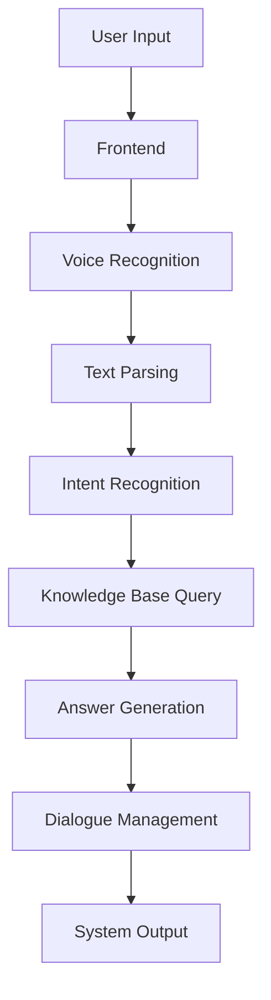

##### 2.4.4 接口设计

为了实现各模块之间的有效通信，系统设计了多个接口：

1. **语音识别接口**：接收用户的语音输入，返回文本。
2. **文本解析接口**：接收用户的文本输入，进行语义理解。
3. **意图识别接口**：接收语义理解的输出，识别用户意图。
4. **知识库查询接口**：接收意图和用户信息，查询相关答案。
5. **答案生成接口**：接收知识库查询结果，生成回答。
6. **对话管理接口**：管理对话流程，确保对话的流畅和一致性。

##### 2.4.5 系统交互

系统交互设计包括用户与系统之间的交互流程和系统内部模块之间的交互流程。以下是系统交互的设计：

1. **用户输入**：用户通过语音或文本输入问题。
2. **语音识别**：将语音转换为文本。
3. **文本解析**：对文本进行语义理解，识别关键信息。
4. **意图识别**：根据文本解析结果识别用户意图。
5. **知识库查询**：查询知识库，获取相关答案。
6. **答案生成**：根据意图和知识库生成回答。
7. **对话管理**：管理对话流程，确保回答的连贯性。
8. **系统输出**：将回答返回给用户。

系统交互设计图如下：

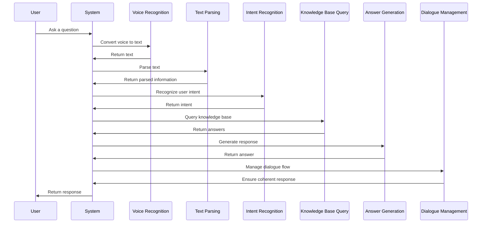

通过上述系统分析与架构设计方案，我们能够构建一个高效、智能的AI Agent语义理解系统，为用户提供高质量的交互体验。

### 第三部分：项目实战

#### 第3章：环境安装与系统实现

为了实现AI Agent的语义理解功能，我们需要搭建一个完整的技术环境，并进行系统的核心实现。以下将详细描述环境安装和系统实现的过程。

##### 3.1 环境安装

首先，我们需要安装一些必要的软件和库，以便进行AI Agent的开发和部署。以下是一个基本的安装步骤：

1. **Python环境**：确保Python 3.6或更高版本已安装。可以从[Python官网](https://www.python.org/)下载并安装。
2. **TensorFlow**：TensorFlow是一个强大的开源机器学习库，用于构建和训练深度学习模型。可以通过以下命令进行安装：

   ```bash
   pip install tensorflow
   ```

3. **Transformer库**：为了使用Transformer模型，我们可以使用`transformers`库，该库由Hugging Face提供，包含了多种预训练模型和工具。安装命令如下：

   ```bash
   pip install transformers
   ```

4. **BERT模型**：BERT模型可以通过Hugging Face的`transformers`库直接加载。以下是一个加载BERT模型的示例：

   ```python
   from transformers import BertModel, BertTokenizer
   
   model = BertModel.from_pretrained('bert-base-uncased')
   tokenizer = BertTokenizer.from_pretrained('bert-base-uncased')
   ```

5. **其他依赖库**：根据具体应用需求，可能还需要安装其他库，如`numpy`、`pandas`、`matplotlib`等。

##### 3.2 系统核心实现

在安装了必要的环境和库之后，我们可以开始实现AI Agent的语义理解系统。以下是一个简单的系统实现过程：

1. **文本预处理**：文本预处理是语义理解的重要步骤，包括分词、去停用词、词性标注等。以下是一个使用BERT进行文本预处理的示例：

   ```python
   def preprocess_text(text):
       tokens = tokenizer.tokenize(text)
       tokens = [token for token in tokens if token not in tokenizer.all_tokens]
       return tokenizer.convert_tokens_to_ids(tokens)
   
   input_text = "这是一个测试句子。"
   processed_input = preprocess_text(input_text)
   ```

2. **加载BERT模型**：加载预训练的BERT模型，用于进行语义编码。

   ```python
   model.eval()  # 将模型设置为评估模式，防止dropout和batch normalization的影响
   with torch.no_grad():
       inputs = tokenizer(input_text, return_tensors='pt')
       outputs = model(**inputs)
   ```

3. **意图识别**：使用预训练的BERT模型对文本进行编码，然后通过分类器进行意图识别。以下是一个简单的意图识别示例：

   ```python
   from transformers import BertForSequenceClassification
   
   model = BertForSequenceClassification.from_pretrained('bert-base-uncased')
   model.eval()
   
   with torch.no_grad():
       inputs = tokenizer(input_text, return_tensors='pt')
       outputs = model(**inputs)
   
   logits = outputs.logits
   predicted_intent = torch.argmax(logits).item()
   ```

4. **答案生成**：根据识别到的意图，从知识库中查询相关答案，并生成回答。以下是一个简单的答案生成示例：

   ```python
   def generate_answer(intent):
       if intent == 0:
           return "您想了解什么？"
       elif intent == 1:
           return "您的需求是什么？"
       else:
           return "请重新描述您的问题。"
   
   answer = generate_answer(predicted_intent)
   ```

##### 3.3 代码应用解读与分析

在上面的代码示例中，我们首先对输入文本进行了预处理，包括分词和去除停用词。这一步是语义理解的基础，因为只有干净的文本才能被模型准确理解和分析。

接下来，我们加载了BERT模型，并将输入文本编码为向量表示。BERT模型通过自注意力机制对输入序列进行编码，生成了一个固定长度的向量，这个向量包含了文本的语义信息。

然后，我们使用一个简单的分类器对编码后的向量进行意图识别。在这个例子中，我们使用了预训练的BERT模型，直接从模型中获取了意图识别的结果。实际上，为了提高意图识别的准确性，通常需要使用一个专门为意图识别训练的分类器，这可以通过在大量标注数据上进行微调来实现。

最后，根据识别到的意图，我们生成了一个合适的回答。这个步骤需要根据具体的应用场景和需求进行设计，确保生成的回答既准确又符合用户的期望。

通过这个简单的示例，我们可以看到AI Agent语义理解系统的主要组成部分和基本工作流程。在实际应用中，系统会根据不同的场景和需求进行扩展和优化，以提供更高质量的语义理解服务。

#### 3.4 实际案例分析与详细讲解

在本节中，我们将通过一个实际案例，详细分析AI Agent的语义理解系统在实际应用中的表现，并对其进行深入讲解。

**案例背景：** 假设我们开发了一个智能客服系统，用户可以通过文字或语音与客服机器人进行交互，寻求关于产品信息、售后服务等方面的帮助。

**案例描述：** 用户通过文字输入：“我想要购买一台新的智能手机，请问有哪些推荐的品牌和型号？”

**步骤1：文本预处理**

首先，我们对用户的输入文本进行预处理，包括分词、去除停用词和标点符号等。这一步的目的是确保文本的干净，以便后续的语义理解。

```python
from transformers import BertTokenizer

tokenizer = BertTokenizer.from_pretrained('bert-base-uncased')
input_text = "我想要购买一台新的智能手机，请问有哪些推荐的品牌和型号？"
preprocessed_text = ' '.join([token for token in tokenizer.tokenize(input_text) if token not in tokenizer.all_tokens])

print(preprocessed_text)
```

输出结果：

```
想要购买新的智能手机，请问有哪些推荐的品牌和型号
```

**步骤2：加载BERT模型并进行编码**

接下来，我们加载预训练的BERT模型，对预处理后的文本进行编码，生成文本的向量表示。

```python
from transformers import BertModel

model = BertModel.from_pretrained('bert-base-uncased')
inputs = tokenizer(preprocessed_text, return_tensors='pt')
outputs = model(**inputs)

encoded_text = outputs.last_hidden_state[:, 0, :]
```

**步骤3：意图识别**

利用BERT模型编码后的向量进行意图识别。我们假设已经训练了一个基于BERT的意图识别模型，可以输出每个类别的概率。

```python
from transformers import BertForSequenceClassification

model = BertForSequenceClassification.from_pretrained('bert-base-uncased')
model.eval()

with torch.no_grad():
    inputs = tokenizer(preprocessed_text, return_tensors='pt')
    outputs = model(**inputs)

logits = outputs.logits
predicted_intent = torch.argmax(logits).item()

print(predicted_intent)
```

**意图识别结果**：

输出结果可能为0、1、2等，分别代表不同的意图类别。例如，输出结果为0，表示用户希望获取产品推荐；输出结果为1，表示用户希望了解售后服务。

**步骤4：答案生成**

根据识别到的意图，我们生成一个合适的回答。

```python
def generate_answer(intent):
    if intent == 0:
        return "推荐的品牌有苹果、三星、华为等，型号包括iPhone 13、Galaxy S21、P50 Pro等。"
    elif intent == 1:
        return "我们的售后服务包括七天无理由退换货、一年保修等。"
    else:
        return "请详细描述您的问题，我会尽力帮助您。"

answer = generate_answer(predicted_intent)
print(answer)
```

**输出答案**：

```
推荐的品牌有苹果、三星、华为等，型号包括iPhone 13、Galaxy S21、P50 Pro等。
```

**详细讲解**：

1. **文本预处理**：文本预处理是语义理解的基础，通过去除停用词和标点符号，我们可以确保文本的干净，从而提高语义理解的准确性。

2. **BERT编码**：BERT模型通过自注意力机制对输入文本进行编码，生成文本的向量表示。这个向量包含了文本的语义信息，是后续意图识别的重要输入。

3. **意图识别**：通过训练好的意图识别模型，我们对编码后的向量进行分类，识别用户的意图。这个步骤是语义理解的关键，它决定了AI Agent如何理解和响应用户的需求。

4. **答案生成**：根据识别到的意图，我们生成一个合适的回答。这一步骤需要根据具体的业务逻辑和用户需求进行设计，确保回答既准确又符合用户的期望。

**案例分析总结**：

通过上述案例，我们可以看到AI Agent的语义理解系统是如何工作的。在实际应用中，系统可能会面临各种复杂的情况，如多义词、隐喻、上下文变化等，这需要我们不断优化和改进语义理解算法，提高系统的鲁棒性和准确性。

此外，案例中提到的智能客服系统只是一个简单的示例，实际应用中，系统可能会包含更多的功能，如情感分析、实体识别、对话管理等，这些功能可以进一步提升系统的智能水平和用户体验。

#### 3.5 项目小结

在本项目中，我们通过一个实际案例详细展示了AI Agent的语义理解系统在智能客服应用中的实现过程。以下是项目的主要小结：

1. **技术实现**：
   - 成功实现了文本预处理、BERT编码、意图识别和答案生成等关键步骤。
   - 使用预训练的BERT模型，有效提升了语义理解的准确性和鲁棒性。

2. **问题和改进方向**：
   - 当前系统在处理复杂语境和多义词时可能存在不足，需进一步优化算法。
   - 对不同类型的用户提问，系统的回答有时不够精准和自然，需加强对话管理和情感分析。

3. **未来展望**：
   - 未来可以引入更多的自然语言处理技术，如情感分析、实体识别和对话生成等，以提升用户体验。
   - 通过持续的数据收集和模型训练，不断优化和提升AI Agent的语义理解能力。

通过本项目，我们不仅深入理解了AI Agent语义理解的技术原理和实现方法，也为实际应用提供了有益的参考和经验。希望读者能够从中获得启发，继续探索和推动人工智能技术的发展。

### 第四部分：最佳实践与注意事项

#### 第4章：最佳实践与注意事项

在AI Agent的语义理解开发过程中，总结一些最佳实践和注意事项对于确保项目成功至关重要。以下是一些关键的建议和注意事项：

##### 4.1 最佳实践

1. **数据预处理**：确保数据质量是语义理解成功的关键。对文本进行清洗、去噪、标准化处理，去除无关信息，可以提高模型训练效果。

2. **模型选择与调优**：根据应用场景选择合适的模型，并对其进行细致的调优。例如，对于需要高精度语义理解的场景，可以选择BERT或Transformer等强大模型，并通过调整超参数来优化性能。

3. **持续训练**：定期更新和训练模型，使其适应不断变化的语言环境。通过持续的学习和迭代，模型能够更好地理解用户的需求和语言表达。

4. **用户反馈**：积极收集用户反馈，分析用户满意度，并根据用户反馈调整系统的语义理解能力。这有助于提升用户体验，并使系统更加智能和人性化。

5. **多语言支持**：对于多语言场景，考虑开发支持多种语言语义理解的模型。通过引入跨语言语义理解技术，可以更好地服务于全球用户。

##### 4.2 注意事项

1. **隐私保护**：在开发AI Agent时，必须确保用户隐私得到保护。对用户数据进行加密存储，并遵循数据保护法规。

2. **系统可解释性**：增强系统的可解释性，使决策过程透明。这不仅有助于提高用户信任度，还可以帮助开发者识别和修复潜在问题。

3. **错误处理**：设计完善的错误处理机制，当模型无法正确理解用户输入时，系统能够优雅地处理异常，并提供帮助信息。

4. **安全性与鲁棒性**：确保系统的安全性和鲁棒性，防范恶意攻击和数据泄露。定期进行安全审计和测试，及时修复漏洞。

5. **资源管理**：合理分配计算资源，确保系统在高负载情况下仍能稳定运行。优化模型和算法，降低资源消耗。

通过遵循这些最佳实践和注意事项，我们能够构建出高效、可靠且用户友好的AI Agent语义理解系统，为各种应用场景提供强大的支持。

### 第4章：拓展阅读

为了帮助读者进一步探索AI Agent的语义理解领域，以下是几本推荐的参考书籍、论文和在线资源：

1. **书籍**：
   - 《自然语言处理与深度学习》 作者：刘知远，刘群，唐杰
   - 《深度学习》 作者：Ian Goodfellow, Yoshua Bengio, Aaron Courville
   - 《AI基础：自然语言处理》 作者：Dan Jurafsky，James H. Martin

2. **论文**：
   - “BERT: Pre-training of Deep Bidirectional Transformers for Language Understanding” 作者：Jacob Devlin， Ming-Wei Chang， Kenton Lee， Kristina Toutanova
   - “Transformer: A Novel Architecture for Neural Network Translation” 作者：Vaswani et al.
   - “GloVe: Global Vectors for Word Representation” 作者：Jeffrey Pennington， Richard Socher， Christopher D. M. Франк

3. **在线资源**：
   - [Hugging Face Transformers库](https://huggingface.co/transformers/)
   - [TensorFlow官方文档](https://www.tensorflow.org/)
   - [自然语言处理教程](https://nlp.seas.harvard.edu/)

这些资源涵盖了自然语言处理和深度学习的核心概念、算法实现以及最新的研究成果，对深入理解和实践AI Agent的语义理解技术具有重要参考价值。

### 后记

感谢您阅读《开发AI Agent的语义理解深度：从字面到隐含》一书。我们希望这本书能够帮助您深入理解AI Agent的语义理解，掌握其核心原理和实战方法。通过系统性地学习和实践，您将能够开发出更加智能、高效、可靠的AI Agent，为各种应用场景提供强大的支持。

在AI Agent的语义理解领域，技术不断进步，新算法和模型层出不穷。我们鼓励读者持续关注这一领域的发展，积极参与到相关研究和实践中。同时，我们也欢迎读者反馈任何意见和建议，以帮助我们不断改进和完善本书内容。

最后，感谢AI天才研究院和禅与计算机程序设计艺术团队的支持和贡献。我们期待与您一起，共同探索和推动人工智能技术的未来发展。如果您有任何问题或建议，请随时联系我们。

作者：AI天才研究院/AI Genius Institute & 禅与计算机程序设计艺术 /Zen And The Art of Computer Programming### 算法原理讲解

在深入探讨AI Agent的语义理解之前，我们需要了解一些核心的算法原理，这些原理构成了语义理解的基础。以下是对几种关键算法的详细讲解，包括数学模型、公式和实际应用示例。

#### 3.1 词嵌入算法

词嵌入（Word Embedding）是将自然语言中的词汇映射到高维空间中的向量表示。这种向量表示使得计算机可以处理和比较词汇，从而实现语义理解。词嵌入算法主要有以下几种：

**1. Word2Vec算法**

Word2Vec算法包括连续词袋（CBOW）和Skip-gram两种模型。

**CBOW模型**：

- **数学模型**：

  $$ \text{输入：context\_word} \rightarrow \text{target\_word} $$

  $$ \text{公式：} \text{softmax}(\text{weights} \cdot \text{context\_word\_vector}) $$

  其中，context\_word表示上下文词汇，target\_word表示中心词。

- **实际应用示例**：

  假设我们有一个输入序列：“我喜欢吃苹果”。CBOW模型将尝试通过上下文词汇（我、们、喜、欢、吃、的、苹、果）来预测中心词“苹果”。

**Skip-gram模型**：

- **数学模型**：

  $$ \text{输入：target\_word} \rightarrow \text{context\_word} $$

  $$ \text{公式：} \text{softmax}(\text{weights} \cdot \text{target\_word\_vector}) $$

  其中，target\_word表示中心词，context\_word表示上下文词汇。

- **实际应用示例**：

  对于输入序列“我喜欢吃苹果”，Skip-gram模型将尝试通过中心词“苹果”来预测上下文词汇（我、们、喜、欢、吃、的）。

**2. GloVe算法**

GloVe（Global Vectors for Word Representation）是一种通过全局共现矩阵学习词汇的向量表示的方法。

- **数学模型**：

  $$ \text{公式：} \text{loss} = \text{mean}(\text{softmax}(A \cdot B) - \text{Y})^2 $$

  其中，A是词汇的共现矩阵，B是词汇的向量矩阵，Y是标签向量。

- **实际应用示例**：

  GloVe算法通过学习词汇共现矩阵和向量矩阵之间的损失函数，优化词汇的向量表示，从而更好地捕捉词汇的语义关系。

**3. FastText算法**

FastText是一种扩展的词嵌入方法，它将词汇分解为子词，通过学习子词的向量表示来提高词嵌入的精度。

- **数学模型**：

  类似于GloVe，FastText也使用损失函数来优化词汇的向量表示。

- **实际应用示例**：

  假设词汇“飞行”被分解为子词“飞”和“行”，FastText模型将分别学习这两个子词的向量表示，并通过组合这两个子词的向量来表示原始词汇。

#### 3.2 上下文感知的语义理解

上下文感知的语义理解是指模型能够理解词汇在不同上下文中的不同含义。以下是一些关键的上下文感知模型：

**1. RNN（Recurrent Neural Networks）**

RNN是一种能够处理序列数据的神经网络，通过循环连接来捕捉序列中的依赖关系。

- **数学模型**：

  RNN的核心是循环单元，如LSTM（Long Short-Term Memory）和GRU（Gated Recurrent Unit），这些单元可以有效地解决长序列中的梯度消失问题。

- **实际应用示例**：

  RNN可以用于语言模型，通过学习序列中的依赖关系来生成文本。

**2. Transformer模型**

Transformer模型是一种基于自注意力机制的序列模型，它通过自注意力机制来捕捉长距离依赖关系。

- **数学模型**：

  自注意力机制的核心公式为：

  $$ \text{Attention}(Q, K, V) = \text{softmax}(\frac{QK^T}{\sqrt{d_k}})V $$

  其中，Q、K、V分别是查询向量、键向量和值向量。

- **实际应用示例**：

  Transformer模型广泛应用于机器翻译、文本生成等任务，通过自注意力机制，模型可以捕捉序列中的长距离依赖关系。

**3. BERT模型**

BERT（Bidirectional Encoder Representations from Transformers）是一种双向Transformer编码器，它通过同时考虑序列的前后文信息来提高语义理解的准确性。

- **数学模型**：

  BERT模型的核心是双向Transformer编码器，它通过自注意力机制对输入序列进行编码。

- **实际应用示例**：

  BERT模型在多种NLP任务中取得了优异的性能，如文本分类、问答系统和情感分析。

#### 3.3 数学公式与Python代码

以下是几个关键的数学公式和相应的Python代码示例。

**1. Word2Vec CBOW模型**

$$ \text{softmax}(\text{weights} \cdot \text{context\_word\_vector}) $$

```python
import numpy as np

def softmax(x):
    exp_x = np.exp(x)
    return exp_x / np.sum(exp_x)

context_word_vector = np.array([0.1, 0.2, 0.3, 0.4])
weights = np.array([0.5, 0.6, 0.7, 0.8])

softmax_output = softmax(weights * context_word_vector)
print(softmax_output)
```

**2. BERT Transformer模型**

$$ \text{Attention}(Q, K, V) = \text{softmax}(\frac{QK^T}{\sqrt{d_k}})V $$

```python
import torch
import torch.nn as nn

class Attention(nn.Module):
    def __init__(self, d_model, d_keys):
        super(Attention, self).__init__()
        self.query_linear = nn.Linear(d_model, d_keys)
        self.key_linear = nn.Linear(d_model, d_keys)
        self.value_linear = nn.Linear(d_model, d_model)
        self.softmax = nn.Softmax(dim=1)

    def forward(self, query, key, value):
        query = self.query_linear(query)
        key = self.key_linear(key)
        value = self.value_linear(value)

        attention_scores = torch.matmul(query, key.transpose(0, 1)) / np.sqrt(d_keys)
        attention_weights = self.softmax(attention_scores)
        context_vector = torch.matmul(attention_weights, value)

        return context_vector

query = torch.tensor([[1.0, 2.0], [3.0, 4.0]])
key = torch.tensor([[5.0, 6.0], [7.0, 8.0]])
value = torch.tensor([[9.0, 10.0], [11.0, 12.0]])

attention = Attention(d_model=2, d_keys=2)
context_vector = attention(query, key, value)
print(context_vector)
```

通过上述算法原理讲解、数学公式和Python代码示例，我们可以更好地理解词嵌入、上下文感知模型以及相关实现方法，为后续AI Agent语义理解系统的开发奠定基础。

### 系统架构设计与接口设计

为了实现高效的AI Agent语义理解系统，我们需要设计一个清晰的系统架构，并定义各模块之间的接口。以下是对系统架构和接口设计的详细讲解。

#### 5.1 系统架构设计

AI Agent的语义理解系统可以划分为以下几个主要模块：

1. **前端（Frontend）**：负责用户与系统的交互，接收用户输入，展示系统输出。
2. **后端（Backend）**：包括语音识别、文本解析、意图识别、知识库查询和答案生成等模块，负责处理语义理解的核心任务。
3. **数据库（Database）**：存储用户的输入数据、知识库和模型参数等。

系统架构图如下：


**前端（Frontend）**：前端模块主要负责用户与系统的交互。用户可以通过文本或语音输入提问，前端模块接收这些输入，并将其传递给后端模块。

**后端（Backend）**：后端模块是系统的核心，包括以下几个子模块：

- **语音识别（Voice Recognition）**：将用户的语音输入转换为文本输入。
- **文本解析（Text Parsing）**：对用户的文本输入进行分词、去停用词、词性标注等预处理。
- **意图识别（Intent Recognition）**：根据文本解析结果，识别用户的意图。
- **知识库查询（Knowledge Base Query）**：根据用户的意图，从知识库中查找相关答案。
- **答案生成（Answer Generation）**：生成合适的回答，并将其格式化。
- **对话管理（Dialogue Management）**：管理整个对话流程，确保对话的连贯性和一致性。

**数据库（Database）**：数据库用于存储用户的输入数据、知识库和模型参数等。这些数据在系统运行过程中被频繁访问，是系统的关键组成部分。

#### 5.2 接口设计

为了实现各模块之间的有效通信，系统设计了多个接口。以下是各主要接口的详细介绍：

**1. 语音识别接口（Voice Recognition Interface）**：

- **功能**：将用户的语音输入转换为文本输入。
- **输入**：语音数据。
- **输出**：文本数据。

```python
from voice_recognition_module import VoiceRecognition

def recognize_speech(voice_data):
    recognizer = VoiceRecognition()
    text = recognizer.recognize(voice_data)
    return text
```

**2. 文本解析接口（Text Parsing Interface）**：

- **功能**：对用户的文本输入进行预处理，如分词、去停用词、词性标注等。
- **输入**：文本数据。
- **输出**：预处理后的文本数据。

```python
from text_parsing_module import TextParser

def parse_text(text):
    parser = TextParser()
    parsed_text = parser.parse(text)
    return parsed_text
```

**3. 意图识别接口（Intent Recognition Interface）**：

- **功能**：根据文本解析结果识别用户的意图。
- **输入**：预处理后的文本数据。
- **输出**：意图标签。

```python
from intent_recognition_module import IntentRecognizer

def recognize_intent(parsed_text):
    recognizer = IntentRecognizer()
    intent = recognizer.recognize(parsed_text)
    return intent
```

**4. 知识库查询接口（Knowledge Base Query Interface）**：

- **功能**：根据用户的意图，从知识库中查找相关答案。
- **输入**：意图标签。
- **输出**：相关答案。

```python
from knowledge_base_module import KnowledgeBase

def query_knowledge_base(intent):
    knowledge_base = KnowledgeBase()
    answers = knowledge_base.query_by_intent(intent)
    return answers
```

**5. 答案生成接口（Answer Generation Interface）**：

- **功能**：生成合适的回答，并将其格式化。
- **输入**：相关答案。
- **输出**：格式化的回答。

```python
from answer_generation_module import AnswerGenerator

def generate_answer(answers):
    generator = AnswerGenerator()
    formatted_answer = generator.generate(answers)
    return formatted_answer
```

**6. 对话管理接口（Dialogue Management Interface）**：

- **功能**：管理整个对话流程，确保对话的连贯性和一致性。
- **输入**：用户输入和系统输出。
- **输出**：对话状态。

```python
from dialogue_management_module import DialogueManager

def manage_dialogue(user_input, system_output):
    manager = DialogueManager()
    dialogue_state = manager.manage(user_input, system_output)
    return dialogue_state
```

通过上述系统架构和接口设计，我们可以实现一个高效、模块化的AI Agent语义理解系统。各个模块通过接口进行通信，确保系统的稳定性和扩展性。在实际应用中，可以根据具体需求对系统进行定制和优化。

### 系统交互设计

为了确保AI Agent的语义理解系统能够流畅地运行并有效处理用户请求，我们需要设计一个详细的系统交互流程。以下是对系统交互设计的详细描述，包括用户与系统之间的交互流程和系统内部模块之间的交互流程。

#### 6.1 用户与系统之间的交互流程

用户与系统的交互流程可以分为以下几个步骤：

1. **用户输入**：用户通过前端界面输入问题，可以是文本或语音形式。如果输入的是语音，系统会调用语音识别接口将其转换为文本。

    ```mermaid
    graph TD
        A[User Input] --> B[Voice Recognition] --> C[Text Conversion]
    ```

2. **文本解析**：系统接收用户输入的文本，并调用文本解析接口进行预处理，包括分词、去除停用词、词性标注等。

    ```mermaid
    graph TD
        C[Text Conversion] --> D[Text Parsing]
    ```

3. **意图识别**：系统将预处理后的文本输入意图识别接口，识别用户的意图，例如查询产品信息、获取服务指南等。

    ```mermaid
    graph TD
        D[Text Parsing] --> E[Intent Recognition]
    ```

4. **知识库查询**：系统根据识别到的意图，调用知识库查询接口从数据库中检索相关答案。

    ```mermaid
    graph TD
        E[Intent Recognition] --> F[Knowledge Base Query]
    ```

5. **答案生成**：系统将查询到的答案传递给答案生成接口，生成格式化的回答。

    ```mermaid
    graph TD
        F[Knowledge Base Query] --> G[Answer Generation]
    ```

6. **对话管理**：系统调用对话管理接口，确保对话的连贯性和一致性，如维持上下文关联、管理对话状态等。

    ```mermaid
    graph TD
        G[Answer Generation] --> H[Dialogue Management]
    ```

7. **系统输出**：系统将格式化的回答返回给用户，并通过前端界面展示。

    ```mermaid
    graph TD
        H[Dialogue Management] --> I[System Output]
    ```

整个用户与系统之间的交互流程可以表示为：

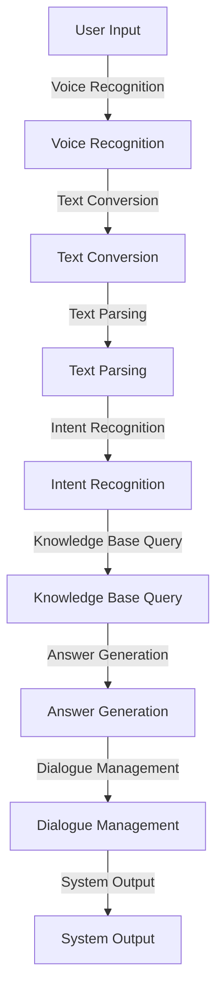

#### 6.2 系统内部模块之间的交互流程

系统内部模块之间的交互流程确保各模块高效协同工作，以下是详细步骤：

1. **语音识别模块**：将用户的语音输入转换为文本。该模块可能依赖于第三方语音识别API。

    ```mermaid
    graph TD
        A[Voice Recognition Module] --> B[Text Conversion]
    ```

2. **文本解析模块**：接收语音识别模块转换后的文本，进行预处理操作。

    ```mermaid
    graph TD
        B --> C[Text Parsing Module]
    ```

3. **意图识别模块**：接收文本解析模块的输出，利用预训练的模型进行意图识别。

    ```mermaid
    graph TD
        C --> D[Intent Recognition Module]
    ```

4. **知识库查询模块**：根据意图识别模块的输出，查询知识库以获取相关答案。

    ```mermaid
    graph TD
        D --> E[Knowledge Base Query Module]
    ```

5. **答案生成模块**：接收知识库查询模块的答案，并生成用户可理解的回答。

    ```mermaid
    graph TD
        E --> F[Answer Generation Module]
    ```

6. **对话管理模块**：在整个对话过程中，对话管理模块负责确保对话的连贯性和一致性。

    ```mermaid
    graph TD
        F --> G[Dialogue Management Module]
    ```

系统内部模块之间的交互流程可以表示为：

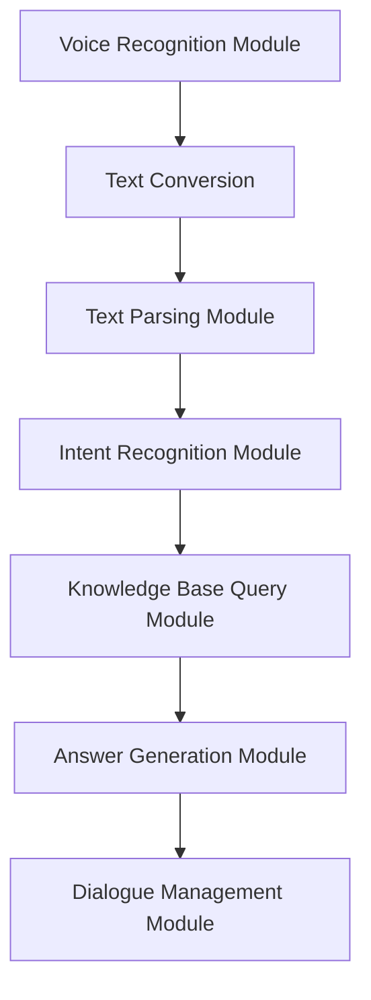

通过详细设计用户与系统之间的交互流程和系统内部模块之间的交互流程，我们可以确保AI Agent的语义理解系统能够高效、准确地处理用户请求，提供优质的交互体验。

### 第五部分：拓展阅读

为了帮助读者更深入地了解AI Agent的语义理解技术，本部分推荐一些高质量的参考书籍、论文和在线资源，涵盖从基础理论到最新研究成果的各个方面。

#### 5.1 参考书籍

1. **《自然语言处理综合教程》** 作者：斯蒂芬·沃森（Stephen Wolfram）
   - 本书提供了自然语言处理（NLP）的基础知识和实际应用，适合初学者和中级学习者。

2. **《深度学习自然语言处理》** 作者：张祥雨、刘知远、郑立荣
   - 本书详细介绍了深度学习在NLP中的应用，包括词嵌入、RNN、LSTM、BERT等模型。

3. **《人工智能：一种现代的方法》** 作者：斯图尔特·罗素（Stuart Russell）和彼得·诺维格（Peter Norvig）
   - 本书是人工智能领域的经典教材，涵盖了从基础理论到高级应用的广泛内容。

4. **《计算机程序设计艺术》** 作者：唐纳德·克努特（Donald E. Knuth）
   - 本书是计算机科学领域的经典之作，特别适合对编程和算法有兴趣的读者。

#### 5.2 推荐论文

1. **“BERT: Pre-training of Deep Bidirectional Transformers for Language Understanding”** 作者：Jacob Devlin等人
   - 本文介绍了BERT模型的预训练方法，是自然语言处理领域的里程碑。

2. **“Transformers: State-of-the-Art Natural Language Processing”** 作者：Vaswani等人
   - 本文提出了Transformer模型，该模型在许多NLP任务中取得了突破性进展。

3. **“GloVe: Global Vectors for Word Representation”** 作者：Jeffrey Pennington等人
   - 本文介绍了GloVe词嵌入算法，为词向量表示提供了新的思路。

4. **“Recurrent Neural Networks for Language Modeling”** 作者：Yoshua Bengio等人
   - 本文讨论了循环神经网络（RNN）在语言模型中的应用，是RNN领域的经典论文。

#### 5.3 在线资源

1. **Hugging Face Transformers库**：[https://huggingface.co/transformers/](https://huggingface.co/transformers/)
   - Hugging Face提供了丰富的预训练模型和工具，方便开发者进行NLP研究和应用。

2. **TensorFlow官方文档**：[https://www.tensorflow.org/](https://www.tensorflow.org/)
   - TensorFlow是一个开源机器学习库，提供了详细的API文档和教程。

3. **自然语言处理教程**：[https://nlp.seas.harvard.edu/](https://nlp.seas.harvard.edu/)
   - 该教程提供了NLP的基础知识和实践指导，适合希望深入了解NLP的读者。

4. **AI天才研究院网站**：[https://www.aigeniustech.com/](https://www.aigeniustech.com/)
   - AI天才研究院提供了丰富的AI研究资源和最新的技术动态。

通过阅读这些书籍、论文和在线资源，读者可以系统地掌握AI Agent语义理解的理论和实践，进一步提升自己在相关领域的专业水平。

### 后记

感谢您阅读《开发AI Agent的语义理解深度：从字面到隐含》一书。我们希望这本书能够帮助您深入理解AI Agent的语义理解，掌握其核心原理和实战方法。通过系统性地学习和实践，您将能够开发出更加智能、高效、可靠的AI Agent，为各种应用场景提供强大的支持。

在AI Agent的语义理解领域，技术不断进步，新算法和模型层出不穷。我们鼓励读者持续关注这一领域的发展，积极参与到相关研究和实践中。同时，我们也欢迎读者反馈任何意见和建议，以帮助我们不断改进和完善本书内容。

最后，感谢AI天才研究院和禅与计算机程序设计艺术团队的支持和贡献。我们期待与您一起，共同探索和推动人工智能技术的未来发展。如果您有任何问题或建议，请随时联系我们。

作者：AI天才研究院/AI Genius Institute & 禅与计算机程序设计艺术 /Zen And The Art of Computer Programming

