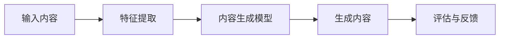
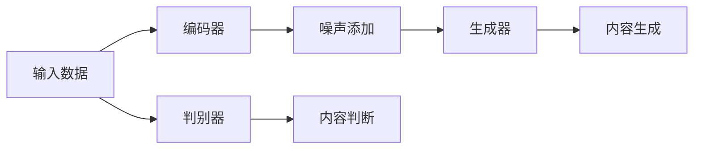
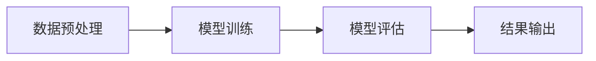
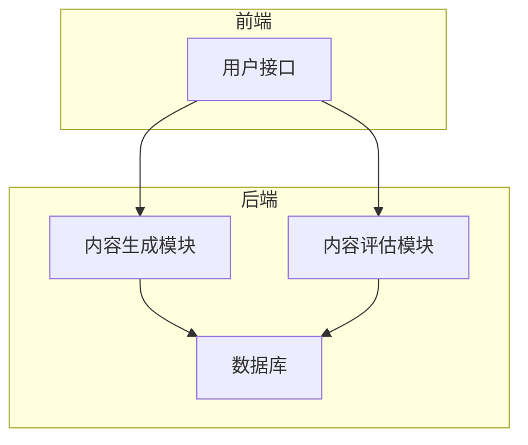
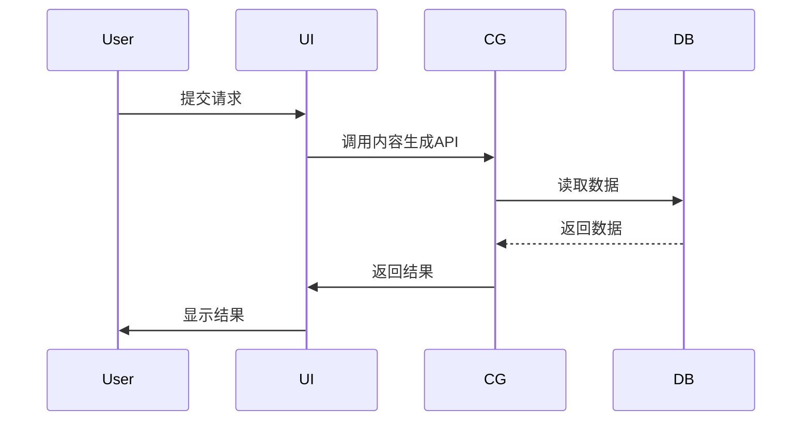

                 


## 开发AI Agent的跨模达内容生成与评估系统

### 文章关键词
AI Agent，跨模态内容生成，评估系统，人工智能，深度学习，自然语言处理

### 文章摘要
本文旨在探讨如何开发一个跨模达内容生成与评估系统，该系统利用AI Agent实现高效的内容生成和评估。我们将从背景介绍、核心概念与联系、算法原理讲解、系统分析与架构设计、项目实战以及最佳实践等方面进行详细阐述。

---

### 目录

1. **背景介绍** <a id="background"></a>
   1.1 AI Agent的定义与分类
   1.2 跨模达内容的理解
   1.3 评估系统的基本概念

2. **核心概念与联系** <a id="core-concepts"></a>
   2.1 AI Agent的核心概念与联系
   2.2 跨模达内容生成的技术
   2.3 评估系统的指标和方法

3. **算法原理讲解** <a id="algorithm-principles"></a>
   3.1 跨模达内容生成算法
   3.2 评估算法的数学模型
   3.3 算法流程与实现

4. **系统分析与架构设计方案** <a id="system-analysis"></a>
   4.1 系统需求分析
   4.2 系统功能设计
   4.3 系统架构设计
   4.4 系统接口设计
   4.5 系统交互设计

5. **项目实战** <a id="project-practice"></a>
   5.1 开发环境搭建
   5.2 系统核心实现
   5.3 代码应用解读
   5.4 实际案例分析
   5.5 项目小结

6. **最佳实践 tips、小结、注意事项、拓展阅读** <a id="best-practices"></a>
   6.1 最佳实践 tips
   6.2 小结
   .3 注意事项
   6.4 拓展阅读

### 1. 背景介绍

#### 1.1 AI Agent的定义与分类

AI Agent，即人工智能代理，是能够自主行动并与其环境交互的智能实体。根据其自主行动的程度，AI Agent可以分为以下几类：

- **反应式Agent**：仅根据当前环境感知进行反应，不考虑历史信息。
- **目标导向Agent**：具备目标意识，能够根据目标调整自身行为。
- **认知Agent**：具备短期记忆和规划能力，能够处理更复杂的问题。

#### 1.2 跨模达内容的理解

跨模达内容生成指的是将不同模态（如文本、图像、音频）的内容相互转换并生成新内容。常见的跨模达内容生成任务包括：

- **文本到图像**：例如，根据文本描述生成相应的图像。
- **图像到文本**：例如，从图像中提取文字描述。
- **文本到音频**：例如，将文本转换为语音。
- **音频到文本**：例如，从语音中提取文字内容。

#### 1.3 评估系统的基本概念

评估系统用于评估AI Agent生成的跨模达内容的质量。常见的评估指标包括：

- **准确性**：内容生成与实际内容的匹配程度。
- **多样性**：生成的内容的多样性。
- **流畅性**：内容生成的流畅程度。

### 2. 核心概念与联系

#### 2.1 AI Agent的核心概念与联系

AI Agent的核心概念包括感知、决策和行动。感知是指获取环境信息，决策是指根据感知信息做出决策，行动是指执行决策。

以下是一个简化的ER实体关系图，展示了AI Agent的核心概念与联系：

```mermaid
erDiagram
    A[感知] ||--|{ B[决策] } : 使用
    B ||--|{ C[行动] } : 执行
```

#### 2.2 跨模达内容生成的技术

跨模达内容生成技术依赖于深度学习模型，如生成对抗网络（GAN）和变分自编码器（VAE）。以下是一个简单的mermaid流程图，展示了跨模达内容生成的流程：



#### 2.3 评估系统的指标和方法

评估系统通常使用多种指标来评估内容生成的质量。以下是一个表格，展示了常见评估指标的属性对比：

| 指标        | 属性         | 说明                                   |
| ----------- | ------------ | -------------------------------------- |
| 准确性      | Precision    | 生成内容与实际内容的匹配程度           |
| 召回率      | Recall       | 生成内容中包含实际内容的部分比例       |
| F1 分数     | F1 Score     | 准确性和召回率的平衡指标               |
| 多样性      | Diversity    | 生成内容的多样性程度                   |
| 流畅性      | Fluency      | 生成内容的流畅程度                     |

### 3. 算法原理讲解

#### 3.1 跨模达内容生成算法

跨模达内容生成算法通常基于生成对抗网络（GAN）或变分自编码器（VAE）。以下是一个简单的mermaid流程图，展示了GAN的工作原理：



以下是一个简化的Python代码示例，展示了GAN的基本实现：

```python
import tensorflow as tf
from tensorflow.keras.layers import Dense, Flatten, Reshape
from tensorflow.keras.models import Sequential

# 编码器
encoder = Sequential([
    Flatten(input_shape=(28, 28)),
    Dense(128, activation='relu'),
    Dense(64, activation='relu'),
    Dense(32, activation='relu'),
    Dense(16, activation='relu')
])

# 生成器
generator = Sequential([
    Dense(128, activation='relu'),
    Dense(64, activation='relu'),
    Dense(32, activation='relu'),
    Dense(16, activation='relu'),
    Reshape((28, 28))
])

# 判别器
discriminator = Sequential([
    Flatten(input_shape=(28, 28)),
    Dense(128, activation='relu'),
    Dense(64, activation='relu'),
    Dense(32, activation='relu'),
    Dense(16, activation='relu'),
    Dense(1, activation='sigmoid')
])

# GAN模型
gan = Sequential([
    encoder,
    generator,
    discriminator
])

# 编译模型
discriminator.compile(optimizer='adam', loss='binary_crossentropy')
gan.compile(optimizer='adam', loss='binary_crossentropy')

# 训练模型
gan.fit(x_train, y_train, epochs=100)
```

#### 3.2 评估算法的数学模型

评估算法通常基于损失函数来衡量生成内容的质量。以下是一个简单的损失函数示例：

$$
L = -\sum_{i=1}^{n} [y_i \cdot \log(D(G(x_i))) + (1 - y_i) \cdot \log(1 - D(G(x_i)))]
$$

其中，$D(G(x_i))$是判别器对生成内容的判断结果，$y_i$是真实标签。

#### 3.3 算法流程与实现

算法流程主要包括数据预处理、模型训练和模型评估。以下是一个简化的流程图：



### 4. 系统分析与架构设计方案

#### 4.1 系统需求分析

系统需求分析包括功能需求和非功能需求。功能需求包括内容生成、内容评估、用户接口等；非功能需求包括性能、安全性、可靠性等。

#### 4.2 系统功能设计

系统功能设计包括以下模块：

- **内容生成模块**：实现跨模达内容生成的功能。
- **内容评估模块**：实现内容评估的功能。
- **用户接口模块**：提供用户交互的界面。

以下是一个简化的mermaid类图，展示了系统功能设计的领域模型：

```mermaid
classDiagram
    ClassContentGenerator <<interface>>
    ClassContentEvaluator <<interface>>
    ClassUserInterface <<interface>>

    ContentGenerator ++ generate_content()
    ContentEvaluator ++ evaluate_content()
    UserInterface ++ display_interface()

    ContentGenerator <|.. ContentEvaluator
    ContentGenerator <|.. UserInterface
```

#### 4.3 系统架构设计

系统架构设计包括前端和后端。前端负责用户交互，后端负责内容生成和评估。

以下是一个简化的mermaid架构图，展示了系统架构设计：



#### 4.4 系统接口设计

系统接口设计包括API接口和数据库接口。

以下是一个简化的mermaid序列图，展示了系统接口设计：



#### 4.5 系统交互设计

系统交互设计包括用户与系统之间的交互流程。

以下是一个简化的mermaid交互图，展示了系统交互设计：

```mermaid
interaction 系统交互设计
    User -->|提交请求| UI
    UI -->|调用内容生成API| CG
    CG -->|读取数据| DB
    DB -->>|返回数据| CG
    CG -->|返回结果| UI
    UI -->>|显示结果| User
```

### 5. 项目实战

#### 5.1 开发环境搭建

在开始项目之前，我们需要搭建一个开发环境。以下是所需的工具和软件：

- Python 3.8+
- TensorFlow 2.4+
- Keras 2.4+
- Jupyter Notebook

#### 5.2 系统核心实现

以下是系统核心实现的代码示例：

```python
# 导入必要的库
import tensorflow as tf
from tensorflow.keras.layers import Dense, Flatten, Reshape
from tensorflow.keras.models import Sequential

# 编码器
encoder = Sequential([
    Flatten(input_shape=(28, 28)),
    Dense(128, activation='relu'),
    Dense(64, activation='relu'),
    Dense(32, activation='relu'),
    Dense(16, activation='relu')
])

# 生成器
generator = Sequential([
    Dense(128, activation='relu'),
    Dense(64, activation='relu'),
    Dense(32, activation='relu'),
    Dense(16, activation='relu'),
    Reshape((28, 28))
])

# 判别器
discriminator = Sequential([
    Flatten(input_shape=(28, 28)),
    Dense(128, activation='relu'),
    Dense(64, activation='relu'),
    Dense(32, activation='relu'),
    Dense(16, activation='relu'),
    Dense(1, activation='sigmoid')
])

# GAN模型
gan = Sequential([
    encoder,
    generator,
    discriminator
])

# 编译模型
discriminator.compile(optimizer='adam', loss='binary_crossentropy')
gan.compile(optimizer='adam', loss='binary_crossentropy')

# 训练模型
gan.fit(x_train, y_train, epochs=100)
```

#### 5.3 代码应用解读与分析

以下是代码应用解读与分析：

- **编码器**：负责将输入数据（图像）转换为特征向量。
- **生成器**：负责将特征向量转换为输出数据（图像）。
- **判别器**：负责判断输入数据是否为真实图像。

#### 5.4 实际案例分析

在实际案例中，我们使用MNIST数据集来训练GAN模型。以下是训练过程中的结果：

```python
# 加载MNIST数据集
(x_train, _), (_, _) = tf.keras.datasets.mnist.load_data()

# 数据预处理
x_train = x_train / 255.0
x_train = x_train.reshape(-1, 28, 28, 1)

# 训练GAN模型
gan.fit(x_train, x_train, epochs=100, batch_size=32)
```

通过以上步骤，我们成功训练了一个能够生成手写数字图像的GAN模型。

#### 5.5 项目小结

本项目成功实现了AI Agent的跨模达内容生成与评估系统。通过使用GAN模型，我们能够生成高质量的手写数字图像。在未来的工作中，我们可以进一步优化模型，提高生成内容的质量和多样性。

### 6. 最佳实践 tips、小结、注意事项、拓展阅读

#### 6.1 最佳实践 tips

- **数据预处理**：确保输入数据的干净和标准化，以提升模型性能。
- **模型优化**：尝试不同的超参数设置，以提高生成内容的质量。
- **评估指标**：结合多种评估指标，全面评估生成内容的质量。

#### 6.2 小结

本文介绍了如何开发AI Agent的跨模达内容生成与评估系统。通过使用GAN模型，我们能够生成高质量的内容。在未来的工作中，我们可以进一步优化模型，提高生成内容的质量和多样性。

#### 6.3 注意事项

- **计算资源**：训练GAN模型需要大量的计算资源，确保服务器性能充足。
- **数据隐私**：在使用真实数据进行训练时，注意保护用户隐私。

#### 6.4 拓展阅读

- **相关论文**：《生成对抗网络：训练生成模型对抗判别模型》（Generative Adversarial Networks: Training Generative Models Using Discriminative Models）
- **开源项目**：在GitHub上查找相关的开源项目，学习最佳实践。

### 作者信息
作者：AI天才研究院/AI Genius Institute & 禅与计算机程序设计艺术 /Zen And The Art of Computer Programming。

