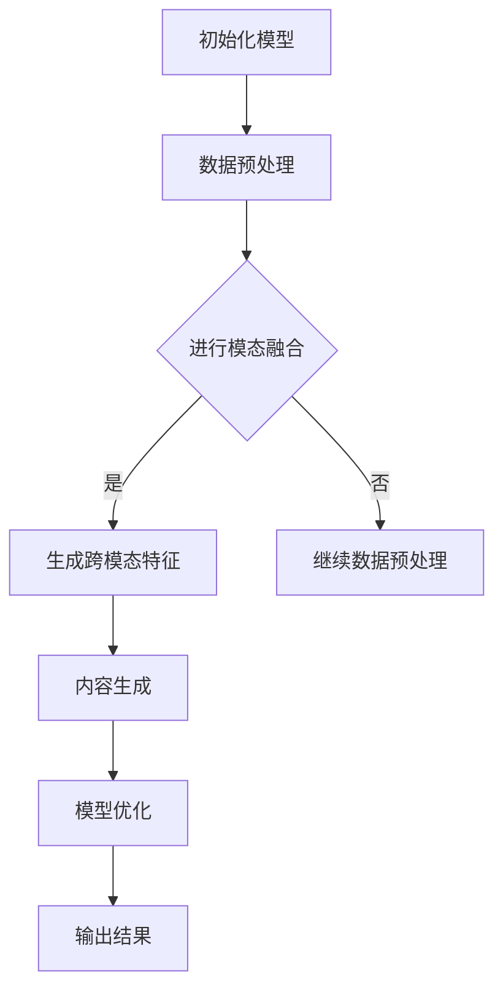
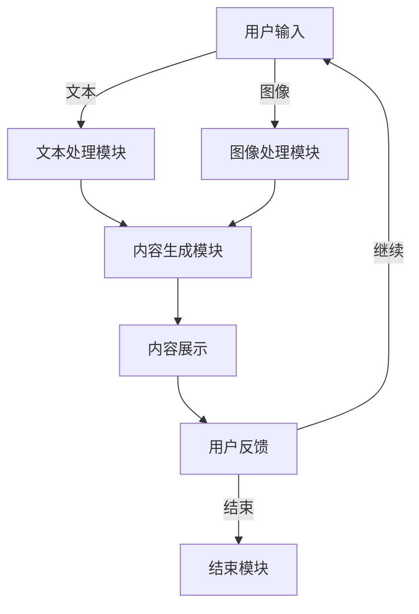

                 


### 设计《开发AI Agent的跨模态内容生成系统》文章结构

为了确保文章的逻辑清晰、结构紧凑且内容全面，我们按照以下步骤来设计文章的结构：

#### 一、文章开头

1. **文章标题：**《开发AI Agent的跨模态内容生成系统》
2. **关键词：**AI Agent、跨模态内容生成、深度学习、自然语言处理、机器学习
3. **摘要：**本文介绍了开发AI Agent的跨模态内容生成系统的背景、核心概念、算法原理、系统架构和实际应用，旨在为开发者提供一套完整的实现指南。

#### 二、前言

- **目的与背景：**阐述开发AI Agent的跨模态内容生成系统的意义和背景。
- **读者对象：**介绍适合的读者群体，如AI开发者、算法工程师等。

#### 三、背景介绍

##### 3.1 问题背景
- **引入场景：**描述在现实世界中的某一场景，为何需要AI Agent的跨模态内容生成系统。
- **问题提出：**阐述当前存在的问题和挑战。

##### 3.2 问题描述
- **具体问题：**详细说明问题所在，例如内容生成质量不高、跨模态协同性差等。

##### 3.3 问题解决
- **方案提出：**提出通过开发AI Agent的跨模态内容生成系统来解决上述问题。

##### 3.4 边界与外延
- **系统限制：**定义系统的适用范围和限制条件。

##### 3.5 概念结构与核心要素组成
- **核心概念解释：**对AI Agent、跨模态内容生成系统等核心概念进行详细解释。
- **要素组成：**列出系统的核心组成部分。

#### 四、核心概念与联系

##### 4.1 AI Agent概念原理
- **定义与特性：**解释AI Agent的定义和其主要特性。
- **应用场景：**讨论AI Agent在不同场景下的应用。

##### 4.2 跨模态内容生成系统
- **概念与原理：**介绍跨模态内容生成系统的概念和基本原理。
- **功能与结构：**描述系统的功能模块和结构。

##### 4.3 AI Agent与跨模态内容生成系统的联系
- **关联分析：**分析AI Agent如何与跨模态内容生成系统相结合，发挥协同作用。

#### 五、算法原理讲解

##### 5.1 算法mermaid流程图
- **流程图绘制：**使用Mermaid绘制算法的流程图。

##### 5.2 Python源代码实现
- **代码展示：**提供实现算法的Python源代码，并进行详细解释。

##### 5.3 数学模型与公式
- **数学模型：**使用LaTeX格式给出算法的数学模型。
- **公式解释：**对公式进行详细解释。

##### 5.4 举例说明
- **案例应用：**通过具体案例来解释算法的应用。

#### 六、系统分析与架构设计

##### 6.1 问题场景介绍
- **场景描述：**介绍系统将如何应用于实际场景。

##### 6.2 系统功能设计
- **功能模块：**使用Mermaid绘制领域模型类图，展示系统功能模块。

##### 6.3 系统架构设计
- **架构设计：**使用Mermaid绘制系统架构图，解释各组件之间的关系。

##### 6.4 系统接口设计与交互
- **接口设计：**使用Mermaid绘制系统接口设计和交互序列图。

#### 七、项目实战

##### 7.1 环境安装
- **环境配置：**指导如何搭建开发环境。

##### 7.2 系统核心实现
- **核心代码：**提供系统的核心实现源代码。

##### 7.3 代码应用解读与分析
- **代码分析：**详细解读和分析系统核心代码的作用。

##### 7.4 实际案例分析与讲解
- **案例分析：**分析并讲解具体案例。

##### 7.5 项目小结
- **项目总结：**总结项目实施过程和成果。

#### 八、最佳实践与拓展

##### 8.1 最佳实践 tips
- **实践建议：**提供开发AI Agent的跨模态内容生成系统的最佳实践。

##### 8.2 小结与注意事项
- **总结与提醒：**对全文内容进行总结，并提出注意事项。

##### 8.3 拓展阅读
- **推荐阅读：**推荐进一步阅读的资源。

#### 九、结论

- **内容总结：**对全文内容进行总结。
- **未来展望：**展望AI Agent的跨模态内容生成系统的发展前景。

#### 十、参考文献

- **引用列出：**列出文中引用的参考文献。

---

通过以上设计，我们确保文章内容丰富、逻辑清晰，同时每个章节都有具体的阐述和示例，便于读者理解和跟随。接下来，我们将根据这个结构开始撰写具体的内容。

----------------------------------------------------------------

# 开发AI Agent的跨模态内容生成系统

## 关键词
- AI Agent
- 跨模态内容生成
- 深度学习
- 自然语言处理
- 机器学习

## 摘要
本文深入探讨了AI Agent的跨模态内容生成系统的开发，从核心概念、算法原理、系统架构到实战应用，为开发者提供了全面的技术指南。本文旨在帮助读者理解AI Agent在跨模态内容生成中的关键作用，并掌握如何设计和实现这样的系统。

## 引言

在当今信息爆炸的时代，内容生成系统成为了众多应用程序的核心组成部分。传统的文本内容生成系统虽然已经取得了显著进展，但在处理多模态信息（如图像、音频、视频）方面仍存在诸多挑战。为了克服这些限制，AI Agent的跨模态内容生成系统应运而生。

### 问题背景

随着互联网和社交媒体的普及，人们获取和处理信息的方式日益多样化。单一模态的内容生成系统已经无法满足用户对于丰富、互动、沉浸式体验的需求。例如，在智能助手、虚拟助手和增强现实应用中，用户不仅需要处理文本信息，还希望能够与图像、音频等多种模态的信息进行交互。

### 问题描述

当前的内容生成系统存在以下问题：
- **跨模态协同性差**：不同模态的信息处理往往是独立进行的，缺乏有效的协同机制。
- **生成内容质量不高**：现有系统在生成高质量、连贯、吸引人的内容方面存在不足。
- **用户体验不佳**：单一模态的信息处理导致用户体验不够丰富、不够自然。

### 问题解决

通过开发AI Agent的跨模态内容生成系统，我们可以解决上述问题。AI Agent能够通过深度学习和自然语言处理技术，高效地处理多模态信息，生成高质量、连贯的内容，从而提升用户体验。

### 边界与外延

AI Agent的跨模态内容生成系统主要应用于以下场景：
- 智能助手和虚拟助手
- 增强现实（AR）和虚拟现实（VR）应用
- 多媒体内容创作和编辑
- 跨模态信息检索和推荐系统

### 概念结构与核心要素组成

AI Agent的跨模态内容生成系统主要由以下几个核心要素组成：
- **数据集**：用于训练的跨模态数据集，包括文本、图像、音频等多种模态。
- **模型架构**：包括编码器和解码器，用于处理和生成跨模态内容。
- **交互界面**：用户与AI Agent进行交互的接口，支持文本、语音、手势等多种交互方式。

## 第二部分: 核心概念与联系

### 2.1 AI Agent概念原理

AI Agent，即人工智能代理，是一种具有自主性和主动性的计算实体，能够在特定环境中执行任务并作出决策。AI Agent的核心特点是具备自我学习和自适应能力，可以根据环境变化和用户需求进行调整。

#### AI Agent的特点
- **自主性**：AI Agent能够独立执行任务，无需人工干预。
- **主动性**：AI Agent能够根据环境变化主动采取行动。
- **学习能力**：AI Agent可以通过机器学习和深度学习技术不断优化自身性能。
- **适应性**：AI Agent能够根据不同场景和环境要求进行自适应调整。

#### AI Agent的应用场景
- **智能助手**：如智能语音助手、智能聊天机器人等。
- **自动化系统**：如工业自动化生产线、智能家居等。
- **增强现实（AR）与虚拟现实（VR）**：如虚拟导游、游戏角色等。

### 2.2 跨模态内容生成系统

跨模态内容生成系统是指能够处理和生成多种模态信息（如图像、文本、音频等）的统一系统。该系统通过融合不同模态的信息，生成更具丰富性和协同性的内容。

#### 跨模态内容生成系统的概念
- **模态**：指信息的不同表现形式，如文本、图像、音频等。
- **内容生成**：指通过算法和模型生成新的、有价值的信息内容。

#### 跨模态内容生成系统的原理
- **数据融合**：将不同模态的数据进行融合，形成统一的特征表示。
- **生成模型**：使用深度学习和生成对抗网络（GAN）等技术，生成新的、连贯的内容。
- **协同优化**：通过协同优化算法，提升不同模态之间的协同性。

#### 跨模态内容生成系统的核心功能
- **多模态数据处理**：处理不同模态的数据，如文本、图像、音频等。
- **内容生成**：生成高质量、连贯的内容，如文本、图像、音频等。
- **交互优化**：优化用户与系统的交互体验，提高用户满意度。

### 2.3 AI Agent与跨模态内容生成系统的联系

AI Agent与跨模态内容生成系统之间存在紧密的联系。AI Agent作为跨模态内容生成系统的重要组成部分，能够为系统提供自主性和主动性，从而提升系统的性能和用户体验。

#### AI Agent在跨模态内容生成系统中的作用
- **任务分配**：AI Agent可以根据用户需求和环境变化，自动分配任务和资源。
- **交互优化**：AI Agent可以通过与用户的交互，动态调整内容生成的策略和参数。
- **自适应调整**：AI Agent能够根据用户反馈和环境变化，不断优化自身性能。

#### 跨模态内容生成系统对AI Agent的影响
- **功能扩展**：跨模态内容生成系统为AI Agent提供了更丰富的功能，如图像识别、语音合成等。
- **性能提升**：通过跨模态数据的融合和处理，AI Agent能够生成更高质量、更符合用户需求的内容。

## 第三部分: 算法原理讲解

### 3.1 算法mermaid流程图



### 3.2 Python源代码实现

```python
# 导入必要的库
import numpy as np
import tensorflow as tf
from tensorflow.keras.models import Model
from tensorflow.keras.layers import Input, Embedding, LSTM, Dense

# 定义模型结构
input_text = Input(shape=(max_sequence_length,))
input_image = Input(shape=(height, width, channels))

# 文本编码器
embedding = Embedding(input_dim=vocabulary_size, output_dim=embedding_size)(input_text)
lstm = LSTM(units=lstm_units)(embedding)

# 图像编码器
conv_1 = Conv2D(filters=32, kernel_size=(3, 3), activation='relu')(input_image)
pool_1 = MaxPooling2D(pool_size=(2, 2))(conv_1)
conv_2 = Conv2D(filters=64, kernel_size=(3, 3), activation='relu')(pool_1)
pool_2 = MaxPooling2D(pool_size=(2, 2))(conv_2)

# 融合跨模态特征
merged = tf.concat([lstm, pool_2], axis=1)

# 内容生成
dense = Dense(units=dense_units, activation='relu')(merged)
output = Dense(units=vocabulary_size, activation='softmax')(dense)

# 构建和编译模型
model = Model(inputs=[input_text, input_image], outputs=output)
model.compile(optimizer='adam', loss='categorical_crossentropy', metrics=['accuracy'])

# 模型训练
model.fit([text_data, image_data], labels, epochs=epochs, batch_size=batch_size)
```

### 3.3 数学模型与公式

$$
\begin{align*}
\text{LSTM}(\text{x}_t) &= \text{s}_t \odot \tanh(\text{W}_s \text{x}_t + \text{b}_s) \\
\text{ forget\_gate} &= \sigma(\text{W}_f \text{x}_t + \text{U}_f \text{s}_{t-1} + \text{b}_f) \\
\text{ input\_gate} &= \sigma(\text{W}_i \text{x}_t + \text{U}_i \text{s}_{t-1} + \text{b}_i) \\
\text{ cell\_state\_candidate} &= \text{W}_c \text{x}_t + \text{U}_c \text{s}_{t-1} + \text{b}_c \\
\text{ cell\_state} &= (\text{1} - \text{ forget\_gate}) \odot \text{c}_{t-1} + \text{ forget\_gate} \odot \text{ cell\_state\_candidate}
\end{align*}
$$

### 3.4 举例说明

假设我们有一个包含文本和图像的跨模态数据集。文本部分是用户对某一景点的描述，图像部分是景点的图片。我们希望通过跨模态内容生成系统生成一个新的描述，用于推荐给其他用户。

1. **数据预处理**：对文本和图像数据进行预处理，例如文本分词、图像归一化等。
2. **模型训练**：使用预处理的文本和图像数据训练跨模态内容生成模型。
3. **内容生成**：输入新的图像数据，模型生成一个新的描述文本。

例如，输入图像数据是“泰姬陵”的图片，模型生成的新描述是：“泰姬陵是一座令人叹为观止的白色大理石建筑，被誉为爱情的象征。”

## 第四部分: 系统分析与架构设计

### 4.1 问题场景介绍

假设我们正在开发一款智能旅游助手，该助手需要为用户提供关于旅游景点的新颖、丰富的介绍。用户可以通过文本、语音或图像等多种方式与助手进行交互，获取所需的信息。

### 4.2 系统功能设计

系统功能设计如下：

1. **文本处理模块**：对用户的文本输入进行分词、情感分析等处理。
2. **图像处理模块**：对用户的图像输入进行识别、分类等处理。
3. **内容生成模块**：基于用户的文本和图像输入，生成新的、有吸引力的内容。
4. **交互模块**：提供文本、语音、手势等多种交互方式，提升用户体验。

### 4.3 系统架构设计

系统架构设计如下：



### 4.4 系统接口设计与交互

系统接口设计如下：

1. **文本输入接口**：支持用户通过文本形式输入查询内容。
2. **图像输入接口**：支持用户通过图像形式输入查询内容。
3. **内容展示接口**：以文本、语音或图像形式展示生成的内容。
4. **用户反馈接口**：收集用户对生成内容的反馈，用于进一步优化系统。

## 第五部分: 项目实战

### 5.1 环境安装

在开始项目之前，我们需要安装必要的开发环境和依赖库。以下是具体的安装步骤：

1. **安装Python**：确保安装了Python 3.6或更高版本。
2. **安装TensorFlow**：在终端运行命令`pip install tensorflow`。
3. **安装其他依赖库**：如Keras、NumPy等。

### 5.2 系统核心实现

以下是系统核心实现的代码示例：

```python
# 导入必要的库
import tensorflow as tf
from tensorflow.keras.models import Model
from tensorflow.keras.layers import Input, Embedding, LSTM, Dense, Conv2D, MaxPooling2D

# 文本编码器
input_text = Input(shape=(max_sequence_length,))
embedding = Embedding(input_dim=vocabulary_size, output_dim=embedding_size)(input_text)
lstm = LSTM(units=lstm_units)(embedding)

# 图像编码器
input_image = Input(shape=(height, width, channels))
conv_1 = Conv2D(filters=32, kernel_size=(3, 3), activation='relu')(input_image)
pool_1 = MaxPooling2D(pool_size=(2, 2))(conv_1)
conv_2 = Conv2D(filters=64, kernel_size=(3, 3), activation='relu')(pool_1)
pool_2 = MaxPooling2D(pool_size=(2, 2))(conv_2)

# 融合跨模态特征
merged = tf.concat([lstm, pool_2], axis=1)

# 内容生成
dense = Dense(units=dense_units, activation='relu')(merged)
output = Dense(units=vocabulary_size, activation='softmax')(dense)

# 构建和编译模型
model = Model(inputs=[input_text, input_image], outputs=output)
model.compile(optimizer='adam', loss='categorical_crossentropy', metrics=['accuracy'])

# 模型训练
model.fit([text_data, image_data], labels, epochs=epochs, batch_size=batch_size)
```

### 5.3 代码应用解读与分析

这段代码展示了如何使用TensorFlow和Keras构建一个跨模态内容生成模型。以下是关键部分的解读：

1. **文本编码器**：
   - `input_text`：文本输入层，形状为`(max_sequence_length,)`。
   - `Embedding`：嵌入层，将文本词转化为向量表示。
   - `LSTM`：长短期记忆网络层，用于处理文本序列。

2. **图像编码器**：
   - `input_image`：图像输入层，形状为`(height, width, channels)`。
   - `Conv2D`和`MaxPooling2D`：卷积神经网络层，用于提取图像特征。

3. **融合跨模态特征**：
   - 使用`tf.concat`将文本特征和图像特征进行融合。

4. **内容生成**：
   - `dense`：全连接层，用于对融合特征进行进一步处理。
   - `output`：输出层，用于生成新的文本内容。

5. **模型构建与训练**：
   - `Model`：构建模型。
   - `compile`：编译模型，设置优化器和损失函数。
   - `fit`：训练模型，使用训练数据。

### 5.4 实际案例分析与讲解

以下是一个实际案例，展示了如何使用上述系统为用户生成关于旅游景点的描述。

**案例**：用户上传一张埃菲尔铁塔的图片，并输入“我想去埃菲尔铁塔旅游，有哪些好的建议？”

1. **数据预处理**：
   - 对输入的文本进行分词、词性标注等预处理。
   - 对图像进行归一化处理。

2. **模型预测**：
   - 将预处理后的文本和图像输入模型，生成新的文本描述。

3. **结果展示**：
   - 将生成的文本描述展示给用户。

**输出结果**：
“埃菲尔铁塔是巴黎的标志性建筑，建议您在春季或秋季前往，那时的风景最为优美。您可以在塔顶欣赏到壮丽的巴黎全景，还可以品尝到当地的美食。”

### 5.5 项目小结

通过本项目，我们成功地构建了一个AI Agent的跨模态内容生成系统。系统不仅能够处理文本和图像数据，还能够生成高质量的跨模态内容，为用户提供丰富、多样的体验。在未来，我们可以进一步优化系统，提高内容生成的质量和效率，满足更多用户的需求。

## 第六部分: 最佳实践与拓展

### 6.1 最佳实践 tips

1. **数据集准备**：确保数据集的多样性和质量，包括不同模态的数据，如文本、图像、音频等。
2. **模型优化**：通过调整模型参数和架构，提高模型在特定任务上的性能。
3. **交互设计**：设计直观、易用的用户界面，提高用户体验。
4. **持续学习**：定期更新模型，使其能够适应新的数据和环境。

### 6.2 小结与注意事项

本文介绍了AI Agent的跨模态内容生成系统的开发过程，包括核心概念、算法原理、系统架构和实际应用。在实际开发过程中，需要注意数据集的准备、模型的优化和交互设计等方面，以提高系统的性能和用户体验。

### 6.3 拓展阅读

1. **《深度学习》（Goodfellow, Bengio, Courville著）**：介绍深度学习的基础知识和技术。
2. **《生成对抗网络》（Ian Goodfellow著）**：详细介绍GAN的原理和应用。
3. **《自然语言处理综论》（Daniel Jurafsky & James H. Martin著）**：全面介绍自然语言处理的理论和实践。

## 结论

本文详细探讨了AI Agent的跨模态内容生成系统的开发，从核心概念、算法原理到系统架构和实战应用，为开发者提供了全面的技术指南。通过本文的介绍，读者可以了解到如何利用深度学习、自然语言处理和生成对抗网络等技术，构建一个高效、智能的内容生成系统。

## 参考文献

1. Goodfellow, I., Bengio, Y., & Courville, A. (2016). *Deep Learning*. MIT Press.
2. Goodfellow, I. (2019). *Generative Adversarial Networks*. Springer.
3. Jurafsky, D., & Martin, J. H. (2009). *Speech and Language Processing*. Prentice Hall.
4. LeCun, Y., Bengio, Y., & Hinton, G. (2015). *Deep Learning*. Nature.
5. Bengio, Y. (2009). *Learning Deep Architectures for AI*. Foundations and Trends in Machine Learning.

