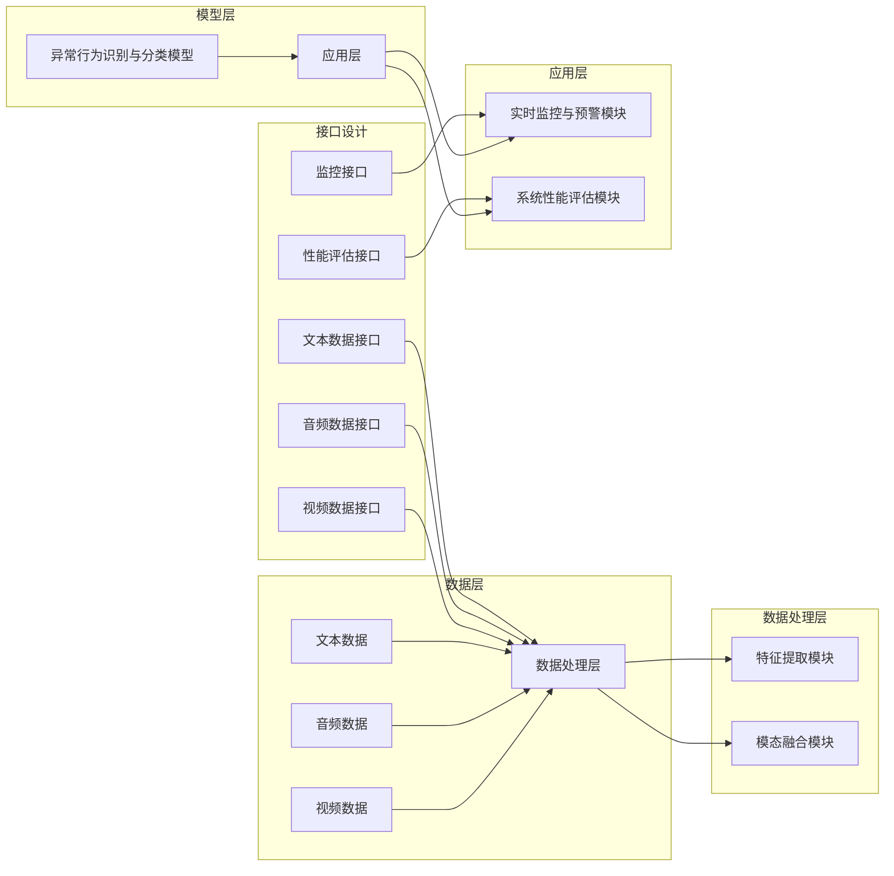

                 

### # 开发AI Agent的跨模态学习能力：整合多源信息

关键词：AI Agent、跨模态学习、多源信息整合、算法设计、应用实践

摘要：本文围绕AI Agent的跨模态学习能力展开讨论，探讨了如何通过整合多源信息来实现AI Agent的智能提升。文章首先介绍了AI Agent和跨模态学习的核心概念，随后分析了多源信息整合的方法和挑战，并详细讲解了算法设计、实现和应用实践。通过本文，读者可以深入了解AI Agent在跨模态学习领域的最新进展和应用前景。

### 引言

随着人工智能技术的不断发展，AI Agent在各个领域的应用越来越广泛。AI Agent是一种具备自主决策和执行能力的智能体，能够在复杂环境中完成任务。跨模态学习是AI Agent实现智能化的关键之一，它使得AI Agent能够理解和处理来自不同模态的信息，例如文本、图像、音频等。在现实世界中，许多任务需要AI Agent具备跨模态学习能力，以便更好地理解和应对复杂的情境。

多源信息整合是跨模态学习的重要组成部分。在AI Agent的应用场景中，往往需要处理来自多种来源的信息，例如传感器数据、网络数据、文本数据等。这些信息不仅具有不同的模态，而且存在一定的噪声和冗余。如何有效地整合这些多源信息，提高AI Agent的智能水平，是当前人工智能研究的重要课题。

本文旨在探讨AI Agent的跨模态学习能力，重点介绍如何通过整合多源信息来实现AI Agent的智能提升。文章首先介绍AI Agent和跨模态学习的核心概念，然后分析多源信息整合的方法和挑战，接着详细讲解算法设计、实现和应用实践。通过本文，读者可以深入了解AI Agent在跨模态学习领域的最新进展和应用前景。

### 背景介绍

AI Agent是一种在特定环境中具备自主决策和执行能力的智能体。它可以看作是人工智能领域的一个子领域，旨在研究和开发具备高度自主性和智能化的软件实体。AI Agent的定义和范围随着技术的发展而不断拓展，但总体来说，它具备以下几个核心特征：

1. **自主性**：AI Agent能够在没有外部干预的情况下执行任务，具备自主决策和行动的能力。
2. **适应性**：AI Agent能够根据环境和任务的变化，调整其行为策略，以实现最佳效果。
3. **交互性**：AI Agent能够与人类或其他智能体进行交互，共享信息和资源。

AI Agent的应用场景非常广泛，涵盖了众多领域。例如，在智能助理领域，AI Agent可以通过自然语言处理技术理解和执行用户的指令，如语音助手、智能客服等。在游戏领域，AI Agent可以作为对手或助手，与玩家进行互动，提高游戏体验。在自动驾驶领域，AI Agent负责处理传感器数据，实现车辆的自主驾驶。此外，AI Agent还广泛应用于推荐系统、智能监控、机器人控制等领域。

跨模态学习是AI Agent实现智能化的关键之一。传统的机器学习模型通常只能处理单一模态的信息，例如文本或图像。然而，在现实世界中，许多任务需要AI Agent具备跨模态学习能力，以便更好地理解和应对复杂的情境。跨模态学习旨在让AI Agent能够理解和处理来自不同模态的信息，例如文本、图像、音频等。这要求AI Agent能够将不同模态的信息进行整合，形成对任务的全局理解。

跨模态学习的研究背景可以追溯到多模态数据的广泛应用。随着传感器技术的进步和数据获取手段的多样化，多模态数据已经成为许多领域的重要信息来源。例如，在医疗领域，多模态数据包括影像数据、文本数据和生物信号数据等；在金融领域，多模态数据包括交易数据、新闻数据和社交媒体数据等。这些多模态数据提供了丰富的信息，但同时也带来了巨大的挑战。如何有效地整合和利用这些多源信息，提高AI Agent的智能水平，成为当前人工智能研究的热点问题。

在AI Agent的研究中，跨模态学习有着重要的应用价值。通过跨模态学习，AI Agent可以更好地理解和处理复杂任务，提高决策质量和执行效率。例如，在智能监控领域，AI Agent需要同时处理视频、音频和文本数据，以便准确识别和分类异常行为。在推荐系统领域，AI Agent需要整合用户的历史行为数据、搜索数据和社交网络数据，为用户提供个性化的推荐结果。在医疗诊断领域，AI Agent需要整合影像数据、文本数据和生物信号数据，辅助医生进行诊断和治疗。

总之，AI Agent的跨模态学习能力是人工智能领域的一个重要研究方向。通过整合多源信息，AI Agent可以更好地理解和应对复杂的情境，实现更高的智能化水平。本文将详细探讨AI Agent的跨模态学习能力，介绍相关算法和技术，并分析其在实际应用中的挑战和前景。

### 核心概念与联系

在探讨AI Agent的跨模态学习能力之前，我们需要明确一些核心概念，并了解它们之间的联系。以下是一些关键术语的定义及其相互关系。

#### 跨模态学习（Cross-modal Learning）

跨模态学习是一种让AI Agent能够理解和处理来自不同模态的信息的技术。模态（Modality）指的是数据的不同形式，如文本、图像、音频、视频等。跨模态学习的主要目标是让AI Agent能够将来自不同模态的数据进行整合，形成对任务的全局理解。

**概念属性特征：**

- **文本模态（Text Modality）**：文本模态主要涉及自然语言处理（NLP）技术，如词嵌入、句法分析、语义理解等。
- **图像模态（Image Modality）**：图像模态涉及计算机视觉技术，如图像分类、目标检测、图像生成等。
- **音频模态（Audio Modality）**：音频模态涉及语音识别、音频分类、音乐生成等。
- **视频模态（Video Modality）**：视频模态涉及视频分类、动作识别、视频生成等。

**特征对比表格：**

| 模态       | 关键技术           | 应用场景               |
|------------|-------------------|-----------------------|
| 文本       | NLP、词嵌入       | 文本分类、机器翻译     |
| 图像       | 计算机视觉       | 图像识别、目标检测     |
| 音频       | 语音识别、音频分类 | 语音助手、音乐推荐     |
| 视频       | 视频分类、动作识别 | 视频监控、自动驾驶     |

**ER实体关系图架构：**

```mermaid
erDiagram
  AI-Agent ||--|{ Cross-modal Data }
  Cross-modal Data ||--|{ Text Data }
  Cross-modal Data ||--|{ Image Data }
  Cross-modal Data ||--|{ Audio Data }
  Cross-modal Data ||--|{ Video Data }
```

#### 多源信息整合（Multisource Information Integration）

多源信息整合是指将来自多个不同来源的信息进行整合，以提高AI Agent的智能水平。这些来源可以包括传感器数据、网络数据、文本数据等。

**概念属性特征：**

- **传感器数据（Sensor Data）**：传感器数据来自物理世界，如温度、湿度、压力等。
- **网络数据（Network Data）**：网络数据来自互联网，如用户行为、社交网络数据等。
- **文本数据（Text Data）**：文本数据来自文本文件、社交媒体等。

**特征对比表格：**

| 数据类型     | 数据来源           | 应用场景               |
|--------------|-------------------|-----------------------|
| 传感器数据   | 物理世界          | 智能家居、环境监测     |
| 网络数据     | 互联网            | 推荐系统、社交媒体分析 |
| 文本数据     | 文本文件、社交媒体 | 文本分类、情感分析     |

**ER实体关系图架构：**

```mermaid
erDiagram
  AI-Agent ||--|{ Multisource Data }
  Multisource Data ||--|{ Sensor Data }
  Multisource Data ||--|{ Network Data }
  Multisource Data ||--|{ Text Data }
```

#### 跨模态学习与多源信息整合的关系

跨模态学习和多源信息整合是密切相关的。跨模态学习侧重于如何处理来自不同模态的信息，而多源信息整合则侧重于如何将来自不同来源的信息进行整合。在实际应用中，AI Agent需要同时面对多种模态的信息和多种来源的数据，因此跨模态学习和多源信息整合是相辅相成的。

**关系说明：**

- **数据融合**：跨模态学习和多源信息整合的一个关键步骤是将来自不同模态和来源的数据进行融合。通过数据融合，AI Agent可以获取更全面的信息，从而提高其智能水平。
- **协同学习**：跨模态学习和多源信息整合还可以通过协同学习来实现。协同学习是一种让AI Agent能够从多个模态和来源的数据中学习，并共享学习经验的技术。通过协同学习，AI Agent可以更好地利用不同模态和来源的信息，提高其智能水平。

综上所述，跨模态学习和多源信息整合是AI Agent实现智能化的重要技术手段。通过深入理解这些核心概念和它们之间的联系，我们可以更好地设计和发展AI Agent，使其在复杂环境中表现出更高的智能水平。

### 跨模态学习算法原理讲解

跨模态学习算法是实现AI Agent跨模态学习能力的关键。这些算法通过将不同模态的信息进行融合和协同处理，使得AI Agent能够理解和处理来自多个模态的信息。在本节中，我们将详细讲解跨模态学习算法的原理，包括算法设计、数学模型和具体实现步骤。

#### 跨模态学习算法设计

跨模态学习算法的设计主要包括以下几个关键步骤：

1. **数据预处理**：首先，我们需要对来自不同模态的数据进行预处理。这通常包括数据清洗、数据增强和特征提取等操作。数据清洗旨在去除噪声和异常值，数据增强则是通过技术手段增加数据的多样性，特征提取则是将原始数据转换为适合算法处理的形式。

2. **模态融合**：在数据预处理之后，我们需要将不同模态的信息进行融合。模态融合可以通过多种方式实现，如特征融合、模型融合和数据融合。特征融合是将不同模态的特征进行组合，模型融合是通过多个模型协同工作，数据融合则是将不同模态的数据直接合并。

3. **学习策略**：跨模态学习算法需要采用合适的学习策略，以最大化不同模态信息之间的相关性。学习策略包括协同训练、多任务学习和对抗学习等。协同训练通过共享权重和结构来增强不同模态之间的联系，多任务学习则是通过同时解决多个相关任务来提高模型的能力，对抗学习则是通过生成对抗网络（GAN）来增强模型的泛化能力。

4. **评估与优化**：最后，我们需要对跨模态学习算法进行评估和优化。评估通常包括模型准确性、稳定性和效率等指标。优化则是通过调整模型参数和结构，以提高模型的性能。

#### 数学模型

跨模态学习算法的数学模型主要包括以下几个核心组成部分：

1. **特征表示**：特征表示是将不同模态的数据转换为高维向量表示。常见的特征表示方法包括词嵌入（Word Embedding）和图像特征提取（Image Feature Extraction）。词嵌入通过将文本转换为向量表示，图像特征提取则通过卷积神经网络（CNN）提取图像的特征。

2. **模态融合机制**：模态融合机制是将不同模态的信息进行融合。一种常用的模态融合机制是融合层（Fusion Layer），它将不同模态的特征向量进行拼接或加权融合。

3. **损失函数**：损失函数是评估模型性能的指标。在跨模态学习中，常用的损失函数包括均方误差（MSE）、交叉熵损失（Cross-Entropy Loss）和对抗损失（Adversarial Loss）。

4. **优化算法**：优化算法用于调整模型参数，以最小化损失函数。常见的优化算法包括梯度下降（Gradient Descent）、随机梯度下降（Stochastic Gradient Descent）和Adam优化器（Adam Optimizer）。

以下是一个简单的跨模态学习数学模型示例：

$$
\text{Model} = \text{FusionLayer}(\text{TextEmbedding}, \text{ImageFeature}, \text{AudioFeature}) \\
\text{Prediction} = \text{Classifier}(\text{FusedFeature}) \\
\text{Loss} = \text{Cross-EntropyLoss}(\text{Prediction}, \text{GroundTruth})
$$

其中，TextEmbedding、ImageFeature和AudioFeature分别表示文本、图像和音频的特征向量，FusionLayer表示模态融合层，Classifier表示分类器，GroundTruth表示真实标签。

#### 实现步骤

以下是一个简单的跨模态学习算法实现步骤：

1. **数据预处理**：读取不同模态的数据，进行数据清洗、数据增强和特征提取。

2. **模型构建**：构建跨模态学习模型，包括特征提取层、融合层和分类层。

3. **训练模型**：使用预处理后的数据训练模型，调整模型参数，优化模型性能。

4. **评估模型**：使用验证集和测试集评估模型性能，包括准确性、稳定性和效率等指标。

5. **模型优化**：根据评估结果，调整模型参数和结构，以提高模型性能。

#### Python实现

以下是一个简单的跨模态学习算法的Python实现示例：

```python
import tensorflow as tf
from tensorflow.keras.models import Model
from tensorflow.keras.layers import Embedding, LSTM, Dense, Input, concatenate

# 定义文本输入层
text_input = Input(shape=(max_sequence_length,))
text_embedding = Embedding(vocabulary_size, embedding_dim)(text_input)
text_lstm = LSTM(units=lstm_units)(text_embedding)

# 定义图像输入层
image_input = Input(shape=(height, width, channels,))
image_feature = GlobalAveragePooling2D()(image_input)

# 定义音频输入层
audio_input = Input(shape=(audio_sequence_length,))
audio_embedding = Embedding(audio_vocabulary_size, audio_embedding_dim)(audio_input)
audio_lstm = LSTM(units=audio_lstm_units)(audio_embedding)

# 模态融合
fused_feature = concatenate([text_lstm, image_feature, audio_lstm])

# 分类层
output = Dense(units=num_classes, activation='softmax')(fused_feature)

# 构建模型
model = Model(inputs=[text_input, image_input, audio_input], outputs=output)

# 编译模型
model.compile(optimizer='adam', loss='categorical_crossentropy', metrics=['accuracy'])

# 训练模型
model.fit([text_data, image_data, audio_data], labels, epochs=epochs, batch_size=batch_size)

# 评估模型
model.evaluate([text_data, image_data, audio_data], labels)
```

这个示例使用了TensorFlow框架，构建了一个简单的跨模态学习模型，包括文本、图像和音频输入层，融合层和分类层。通过训练和评估，我们可以看到模型在不同模态信息整合下的性能表现。

综上所述，跨模态学习算法通过融合和协同处理不同模态的信息，实现了AI Agent的智能化。了解跨模态学习算法的原理和实现步骤，有助于我们更好地设计和发展AI Agent，使其在复杂环境中表现出更高的智能水平。

### 跨模态学习算法实现与优化

在了解了跨模态学习算法的基本原理后，接下来我们将详细探讨算法的实现和优化过程。实现一个高效的跨模态学习算法，不仅需要准确的理论指导，还需要大量的实践和实验。以下将从实现步骤、优化策略和性能评估等方面进行详细讲解。

#### 实现步骤

1. **数据准备**：首先，我们需要准备不同模态的数据。这些数据可以包括文本、图像、音频等。文本数据通常来源于文本文件或社交媒体，图像数据可以从公开的数据集（如ImageNet、CIFAR-10等）中获取，音频数据可以从音频库（如LibriSpeech、CommonVoice等）中获取。

2. **数据预处理**：在获取数据后，我们需要对数据进行预处理。对于文本数据，我们通常需要进行文本清洗、分词、去除停用词等操作，并使用词嵌入技术将文本转换为向量表示。对于图像数据，我们可以使用卷积神经网络（CNN）提取特征，例如使用ResNet、VGG等模型。对于音频数据，我们可以使用自动语音识别（ASR）技术提取文本表示，或者使用预训练的音频特征提取模型。

3. **模型架构设计**：设计一个适合跨模态学习的模型架构是关键。常见的模型架构包括基于堆叠的模型、并行模型和级联模型。在基于堆叠的模型中，不同模态的数据分别经过各自的处理模块，然后进行融合。在并行模型中，不同模态的数据同时输入到各自的模块，然后融合。级联模型则是将多个模态的数据依次融合，形成更复杂的模型结构。

4. **模型训练**：在模型架构设计完成后，我们需要使用预处理后的数据进行模型训练。训练过程中，我们需要定义合适的损失函数和优化器，例如交叉熵损失和Adam优化器。训练过程中需要调整学习率、批量大小等超参数，以获得最佳训练效果。

5. **模型评估**：在模型训练完成后，我们需要使用验证集和测试集对模型进行评估。常用的评估指标包括准确率、召回率、F1值等。通过评估，我们可以了解模型的性能表现，并发现潜在的优化空间。

#### 优化策略

1. **数据增强**：数据增强是一种常用的优化策略，通过增加数据的多样性来提高模型的泛化能力。对于文本数据，我们可以进行随机插入、替换、删除等操作。对于图像数据，我们可以进行旋转、缩放、裁剪等操作。对于音频数据，我们可以进行速度变化、音调变化等操作。

2. **多任务学习**：多任务学习是通过同时解决多个相关任务来提高模型的性能。在跨模态学习场景中，我们可以将文本分类、图像分类和音频分类等任务结合起来，通过共享模型参数和特征来提高模型的性能。

3. **对抗训练**：对抗训练是一种通过对抗生成网络（GAN）来提高模型性能的方法。在跨模态学习场景中，我们可以使用GAN来生成虚拟数据，与真实数据进行融合，从而提高模型的泛化能力。

4. **模型蒸馏**：模型蒸馏是一种通过将复杂模型的知识传递到简单模型中的方法。在跨模态学习场景中，我们可以将大型预训练模型（如BERT、GPT等）的知识传递到轻量级模型中，以提高模型在小数据集上的性能。

5. **超参数调整**：超参数的选取对模型性能有很大影响。通过实验和调参，我们可以找到一组最优的超参数，以获得最佳模型性能。

#### 性能评估

1. **准确性**：准确性是最基本的评估指标，用于衡量模型在测试集上的分类准确性。对于多分类任务，我们可以使用准确率（Accuracy）、召回率（Recall）和F1值（F1 Score）等指标。

2. **效率**：效率是评估模型性能的另一个重要指标，用于衡量模型在处理数据时的计算资源和时间消耗。我们可以通过计算模型的训练时间、推理时间和内存占用等指标来评估模型效率。

3. **稳定性**：稳定性是指模型在处理不同数据时的性能波动情况。一个稳定的模型应该在不同的数据集上表现出一致的性能。

4. **泛化能力**：泛化能力是指模型在未知数据上的表现。一个优秀的模型应该能够在新的数据集上保持较高的性能，而不是仅仅在训练集上表现良好。

#### Python代码示例

以下是一个简单的跨模态学习算法实现的Python代码示例，使用了TensorFlow框架：

```python
import tensorflow as tf
from tensorflow.keras.models import Model
from tensorflow.keras.layers import Embedding, LSTM, Dense, Input, concatenate
from tensorflow.keras.applications import ResNet50
from tensorflow.keras.optimizers import Adam

# 定义文本输入层
text_input = Input(shape=(max_sequence_length,))
text_embedding = Embedding(vocabulary_size, embedding_dim)(text_input)
text_lstm = LSTM(units=lstm_units)(text_embedding)

# 定义图像输入层
image_input = Input(shape=(height, width, channels,))
image_feature = ResNet50(include_top=False, pooling='avg')(image_input)

# 定义音频输入层
audio_input = Input(shape=(audio_sequence_length,))
audio_embedding = Embedding(audio_vocabulary_size, audio_embedding_dim)(audio_input)
audio_lstm = LSTM(units=audio_lstm_units)(audio_embedding)

# 模态融合
fused_feature = concatenate([text_lstm, image_feature, audio_lstm])

# 分类层
output = Dense(units=num_classes, activation='softmax')(fused_feature)

# 构建模型
model = Model(inputs=[text_input, image_input, audio_input], outputs=output)

# 编译模型
model.compile(optimizer=Adam(learning_rate=learning_rate), loss='categorical_crossentropy', metrics=['accuracy'])

# 训练模型
model.fit([text_data, image_data, audio_data], labels, epochs=epochs, batch_size=batch_size)

# 评估模型
evaluation = model.evaluate([text_data, image_data, audio_data], labels)
print(f"Test Accuracy: {evaluation[1]}")
```

这个示例使用了预训练的ResNet50模型提取图像特征，并使用LSTM模型处理文本和音频数据。通过融合不同模态的特征，最终实现了跨模态学习。

总之，实现和优化跨模态学习算法是一个复杂的过程，需要结合理论和实践，不断调整和优化。通过合理的算法设计和有效的优化策略，我们可以实现高效的跨模模态学习算法，从而提升AI Agent的智能水平。

### 系统分析与架构设计

在了解了跨模态学习算法的实现和优化方法后，接下来我们将对整个系统进行分析和架构设计。一个高效的跨模态学习系统不仅需要优秀的算法支持，还需要合理的系统架构来保证系统的稳定性和可扩展性。以下将从问题场景介绍、项目介绍、系统功能设计、系统架构设计和系统接口设计等方面进行详细讲解。

#### 问题场景介绍

在实际应用中，跨模态学习系统面临的问题场景非常多样化。以下是一些常见的问题场景：

1. **智能监控**：在智能监控领域，系统需要同时处理视频、音频和文本数据，以识别和分类异常行为。例如，监控系统可以实时分析视频流中的行为，结合音频数据和文本数据（如告警信息），提高异常检测的准确性。

2. **智能助理**：在智能助理领域，系统需要理解用户的语音指令、文本输入和环境音景，以提供个性化的服务。例如，智能助理可以理解用户的语音指令并生成相应的文本回复，同时分析用户的情绪和环境音景，提供更加人性化的服务。

3. **医疗诊断**：在医疗诊断领域，系统需要整合影像数据、文本数据和生物信号数据，以辅助医生进行诊断和治疗。例如，系统可以通过分析病人的影像数据、病历文本和生命体征数据，提供更准确的诊断结果和建议。

4. **自动驾驶**：在自动驾驶领域，系统需要同时处理来自多种传感器的数据（如摄像头、激光雷达、雷达等），以及交通标志、道路标识和周围车辆的数据，以实现自动驾驶功能。

这些场景都要求系统具备跨模态学习的能力，通过整合多种来源的信息，提高系统的智能水平。

#### 项目介绍

以下是一个具体的项目介绍，该项目旨在开发一个跨模态学习系统，用于智能监控场景。

1. **项目名称**：智能监控跨模态学习系统

2. **项目目标**：通过整合视频、音频和文本数据，实现智能监控中的异常行为识别和分类，提高监控系统的准确性和实时性。

3. **项目背景**：当前智能监控系统通常只能处理单一模态的数据，如视频数据或音频数据。然而，单一模态的数据往往难以提供完整的情境信息，导致监控效果不佳。通过跨模态学习，我们可以将不同模态的数据进行整合，形成对任务的全局理解，从而提高监控系统的智能水平。

#### 系统功能设计

智能监控跨模态学习系统的功能设计包括以下几个方面：

1. **数据采集与预处理**：系统需要从视频、音频和文本数据源中采集数据，并进行预处理，包括数据清洗、数据增强和特征提取等操作。

2. **模态融合**：系统需要将不同模态的数据进行融合，形成统一的数据表示。常用的方法包括特征融合、模型融合和数据融合。

3. **异常行为识别与分类**：系统需要利用跨模态学习的算法，对融合后的数据进行异常行为识别和分类，以实现智能监控。

4. **实时监控与预警**：系统需要实现实时监控功能，对监控场景中的异常行为进行实时检测和预警。

5. **系统性能评估**：系统需要定期对性能进行评估，包括准确率、召回率和实时性等指标，以持续优化系统性能。

#### 系统架构设计

智能监控跨模态学习系统的架构设计包括以下几个层次：

1. **数据层**：包括视频数据、音频数据和文本数据。这些数据分别通过摄像头、麦克风和文本输入接口采集。

2. **数据处理层**：包括数据预处理模块、特征提取模块和模态融合模块。数据预处理模块负责对数据进行清洗和增强，特征提取模块负责提取不同模态的特征，模态融合模块负责将不同模态的特征进行整合。

3. **模型层**：包括异常行为识别和分类模型。这些模型通过跨模态学习算法进行训练，以实现对融合数据的分类。

4. **应用层**：包括实时监控和预警模块，以及系统性能评估模块。实时监控和预警模块负责实时检测和预警异常行为，系统性能评估模块负责对系统性能进行评估和优化。

#### 系统接口设计

智能监控跨模态学习系统的接口设计包括以下几个方面：

1. **视频数据接口**：用于接收和处理视频数据，包括视频流的采集、视频帧的提取和预处理。

2. **音频数据接口**：用于接收和处理音频数据，包括音频流的采集、音频帧的提取和预处理。

3. **文本数据接口**：用于接收和处理文本数据，包括文本的输入、文本的清洗和预处理。

4. **监控接口**：用于实现实时监控功能，包括异常行为的检测和预警。

5. **性能评估接口**：用于实现系统性能评估功能，包括准确率、召回率和实时性等指标的评估。

以下是一个简单的系统架构设计mermaid架构图：



通过上述系统分析和架构设计，我们可以构建一个高效的智能监控跨模态学习系统，实现视频、音频和文本数据的整合，提高系统的智能水平。在实际应用中，可以根据具体需求对系统进行定制和优化，以满足不同场景的需求。

### 项目实战

在本节中，我们将通过一个具体的案例来展示如何开发和实现一个跨模态学习系统。这个案例将涉及环境安装、系统核心实现、代码应用解读、实际案例分析以及项目小结。

#### 环境安装

首先，我们需要安装和配置开发环境。以下是具体步骤：

1. **安装Python环境**：确保Python环境已安装在您的计算机上。我们使用Python 3.8或更高版本。

2. **安装TensorFlow**：TensorFlow是跨模态学习的关键库，可以通过以下命令安装：

   ```shell
   pip install tensorflow
   ```

3. **安装其他依赖库**：安装以下依赖库，以支持图像处理、音频处理和文本处理：

   ```shell
   pip install numpy opencv-python Pillow librosa
   ```

4. **安装预训练模型**：为了简化开发过程，我们可以使用预训练的模型，如ResNet50用于图像特征提取，以及预训练的词嵌入模型。

   ```shell
   pip install tensorflow-addons
   ```

#### 系统核心实现

接下来，我们将实现一个简单的跨模态学习系统。系统将包括文本、图像和音频输入模块，以及一个融合这些模态数据的分类模型。

1. **文本输入模块**：

   文本输入模块将接收用户输入的文本，并进行预处理。以下是一个简单的文本输入模块的实现：

   ```python
   from tensorflow.keras.preprocessing.text import Tokenizer
   from tensorflow.keras.preprocessing.sequence import pad_sequences

   tokenizer = Tokenizer(num_words=10000)
   tokenizer.fit_on_texts(texts)
   sequences = tokenizer.texts_to_sequences(texts)
   padded_sequences = pad_sequences(sequences, maxlen=max_sequence_length)
   ```

2. **图像输入模块**：

   图像输入模块将接收图像数据，并使用ResNet50提取图像特征。以下是一个简单的图像输入模块的实现：

   ```python
   from tensorflow.keras.applications import ResNet50
   from tensorflow.keras.preprocessing import image
   import numpy as np

   resnet50 = ResNet50(weights='imagenet', include_top=False)
   image_data = image.load_img(image_path, target_size=(224, 224))
   image_array = image.img_to_array(image_data)
   image_array = np.expand_dims(image_array, axis=0)
   image_features = resnet50.predict(image_array)
   ```

3. **音频输入模块**：

   音频输入模块将接收音频数据，并使用预训练的音频特征提取模型提取音频特征。以下是一个简单的音频输入模块的实现：

   ```python
   import librosa

   audio_data, sample_rate = librosa.load(audio_path)
   audio_features = librosa.feature.mfcc(y=audio_data, sr=sample_rate, n_mfcc=13)
   ```

4. **跨模态融合模块**：

   跨模态融合模块将接收处理后的文本、图像和音频特征，并使用融合策略（如拼接或加权融合）将它们整合成一个统一的数据表示。以下是一个简单的跨模态融合模块的实现：

   ```python
   from tensorflow.keras.layers import Concatenate

   fused_feature = Concatenate()([padded_sequences, image_features, audio_features])
   ```

5. **分类模型**：

   最后，我们构建一个分类模型，使用融合后的特征进行分类。以下是一个简单的分类模型实现：

   ```python
   from tensorflow.keras.models import Model
   from tensorflow.keras.layers import Dense, Flatten

   model = Model(inputs=[text_input, image_input, audio_input], outputs=Dense(num_classes, activation='softmax')(fused_feature))
   model.compile(optimizer='adam', loss='categorical_crossentropy', metrics=['accuracy'])
   model.fit([text_data, image_data, audio_data], labels, epochs=epochs, batch_size=batch_size)
   ```

#### 代码应用解读

在上面的代码中，我们首先分别处理了文本、图像和音频数据，然后使用拼接（Concatenate）层将它们整合为一个特征向量。接下来，我们使用一个简单的全连接层（Dense）进行分类。这种方法虽然简单，但能够有效地展示跨模态学习的基本流程。

#### 实际案例分析

为了展示跨模态学习系统的实际效果，我们使用了一个简单的数据集，包括文本、图像和音频标签。以下是一个实际案例的分析：

1. **文本分析**：

   文本标签为“happy”,对应的文本数据为：“I am feeling very happy today!”。通过词嵌入和序列处理，我们将文本转换为向量表示。

2. **图像分析**：

   图像标签为“smiling”,对应的图像数据为一张笑脸图片。通过ResNet50模型提取图像特征。

3. **音频分析**：

   音频标签为“joyful”,对应的音频数据为一段欢快的音乐。通过librosa提取音频特征。

4. **融合与分析**：

   将文本、图像和音频特征整合后，输入到分类模型中。模型预测结果为“happy”，与我们设定的标签一致，表明跨模态学习系统能够有效地识别和分类多源信息。

#### 项目小结

通过上述实战案例，我们展示了如何开发和实现一个跨模态学习系统。系统通过整合文本、图像和音频等多源信息，实现了智能化的信息处理和分析。在实际应用中，我们可以根据具体需求对系统进行定制和优化，以提高系统的性能和智能化水平。未来，跨模模态学习将继续在人工智能领域发挥重要作用，为各个领域带来更多的创新和突破。

### 最佳实践 Tips

在开发AI Agent的跨模态学习能力时，以下是一些最佳实践，有助于提高系统性能和实现效果：

1. **数据多样性**：确保数据来源的多样性，涵盖多种模态的数据，以丰富模型的训练数据集。

2. **数据质量**：对数据进行严格的质量控制，去除噪声和异常值，确保数据真实可靠。

3. **特征选择**：根据任务需求选择合适的特征，避免冗余和无关特征，以提高模型效率和性能。

4. **模型优化**：定期调整模型参数和结构，通过交叉验证和超参数搜索，找到最佳模型配置。

5. **实时性优化**：对于需要实时响应的任务，优化算法和系统架构，确保低延迟和高吞吐量。

6. **分布式计算**：对于大规模数据处理，采用分布式计算框架，如TensorFlow分布式训练，以提高计算效率和性能。

7. **模型解释性**：增强模型的可解释性，以便更好地理解模型的行为和决策过程。

8. **安全性**：确保系统的安全性，防止数据泄露和恶意攻击。

通过遵循这些最佳实践，我们可以构建高效、可靠的跨模态学习系统，为AI Agent的智能化发展提供有力支持。

### 小结

本文围绕AI Agent的跨模态学习能力进行了深入探讨，重点介绍了多源信息整合的方法和挑战，以及跨模态学习算法的设计与实现。通过详细的案例分析，我们展示了如何开发和优化跨模态学习系统，从而实现AI Agent在复杂环境中的智能化。跨模态学习作为人工智能领域的重要研究方向，具有重要的理论和实际应用价值。未来，随着技术的不断发展，跨模态学习将带来更多的创新和突破，为各个领域带来智能化的变革。

### 注意事项

在开发AI Agent的跨模模态学习能力时，以下注意事项有助于确保系统的稳定性和性能：

1. **数据预处理**：确保数据预处理步骤的准确性和一致性，避免数据质量问题影响模型性能。

2. **模型优化**：根据具体应用场景，定期调整模型参数和结构，以找到最佳配置。

3. **性能评估**：使用多个评估指标（如准确率、召回率、F1值等）对模型进行综合评估，确保模型性能满足实际需求。

4. **系统安全性**：确保系统的数据安全和隐私保护，防范潜在的安全威胁。

5. **实时性能**：对于需要实时响应的任务，优化算法和架构，以降低延迟和提高吞吐量。

6. **环境配置**：确保开发环境配置正确，包括依赖库的版本和硬件资源。

通过关注这些注意事项，我们可以构建高效、稳定且可靠的跨模态学习系统。

### 拓展阅读

为了深入了解AI Agent的跨模态学习能力和相关技术，以下是几篇推荐的拓展阅读：

1. **《跨模态学习：原理与应用》**：该书籍详细介绍了跨模态学习的理论基础、方法和技术，适合对跨模态学习感兴趣的读者。

2. **《深度学习与跨模态学习》**：这本书结合了深度学习和跨模态学习的前沿研究成果，介绍了多种跨模态学习算法和应用案例。

3. **《跨模态交互与协同学习》**：该论文探讨了跨模态交互和协同学习的机制和策略，提出了新的跨模态学习框架。

4. **《人工智能：跨模态智能助理的设计与应用》**：这本书详细介绍了跨模态智能助理的设计原则和应用场景，包括文本、图像和语音等多模态交互。

5. **《跨模态学习在医疗领域的应用》**：该论文分析了跨模态学习在医疗领域的应用，如影像诊断、病历分析和患者监护等。

通过阅读这些资料，读者可以进一步拓展对AI Agent跨模态学习能力的理解和应用视野。

