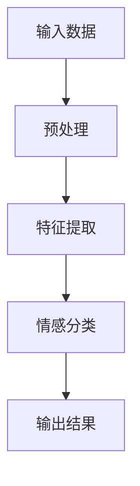
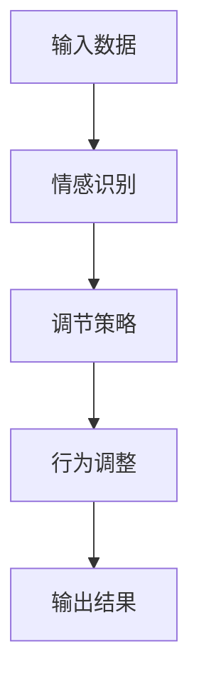
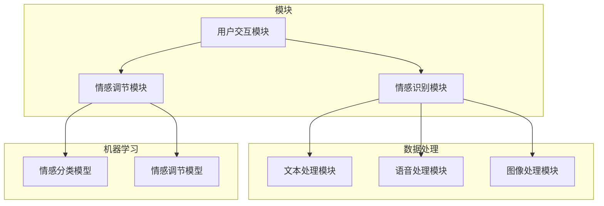
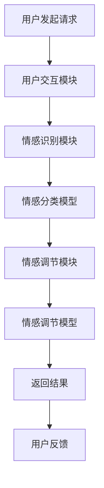

                 

# 开发AI Agent的跨模态情感调节系统

## 关键词

AI Agent、跨模态情感调节、算法原理、系统架构、项目实战、最佳实践

## 摘要

本文旨在探讨如何开发一种基于AI Agent的跨模态情感调节系统。首先，我们介绍了背景和问题，分析了AI Agent与跨模态情感调节的需求与挑战。接着，我们详细阐述了核心概念，包括AI Agent的定义、跨模态情感调节原理和模态交互与融合。随后，我们通过算法原理讲解，使用mermaid绘制了算法流程图，并使用Python源代码详细实现了情感识别和调节算法，给出了数学模型和公式。在系统分析与架构设计方案中，我们介绍了问题场景、项目介绍、系统功能设计、系统架构设计、系统接口设计和系统交互。通过项目实战，我们详细讲解了环境安装、系统核心实现源代码，并对代码进行了应用解读与分析，分享了实际案例。最后，我们总结了全书内容，给出了最佳实践建议和注意事项，并推荐了拓展阅读资源。

## 第1章: 背景介绍

### 1.1 问题背景

随着人工智能技术的发展，AI Agent在各个领域得到了广泛应用。从简单的自动化程序到具有自主学习和决策能力的智能体，AI Agent正逐渐改变着我们的生活。然而，AI Agent在实际应用中面临的一个关键挑战是如何有效地处理和调节情感。情感是人或智能体对情境的内在体验和反应，它对人的行为决策有着重要影响。跨模态情感调节是指通过整合不同模态的信息（如文本、语音、图像等），对AI Agent的情感状态进行识别和调节，以实现更自然、更人性化的交互。

### 1.2 问题描述

在当前AI Agent的应用场景中，跨模态情感调节的需求日益凸显。具体来说，我们需要解决的问题包括：

1. **情感识别**：如何从多种模态的数据中准确识别出情感状态？
2. **情感调节**：如何根据情感识别的结果，对AI Agent的情感状态进行有效的调节？
3. **模态融合**：如何在不同模态之间实现有效的信息融合，以提高情感调节的准确性和效率？

### 1.3 问题解决

本文的研究目的是开发一种基于AI Agent的跨模态情感调节系统，通过整合多种模态的数据，实现对情感状态的准确识别和有效调节。为了实现这一目标，我们将采用以下研究方法与框架：

1. **情感识别算法**：使用深度学习模型对文本、语音、图像等多模态数据进行分析，提取情感特征。
2. **情感调节算法**：基于情感识别的结果，设计调节算法，实现情感状态的动态调节。
3. **模态融合方法**：采用多模态融合技术，将不同模态的情感特征进行整合，提高情感识别和调节的准确性。

### 1.4 边界与外延

在系统设计过程中，我们需要明确系统的边界和应用场景的外延。具体包括：

1. **系统设计边界**：系统将重点关注情感识别和调节的核心算法实现，以及多模态数据的处理和融合方法。
2. **应用场景外延**：系统可以应用于智能客服、虚拟助手、智能教育等领域，为用户提供更加自然、人性化的交互体验。

## 第2章: 核心概念与联系

### 2.1 核心概念

在本节中，我们将介绍本文的核心概念，包括AI Agent、跨模态情感调节原理和模态交互与融合。

#### 2.1.1 AI Agent的定义与分类

AI Agent是指具有自主学习和决策能力的智能体，它可以感知环境、执行任务、学习经验和优化行为。根据功能和应用场景，AI Agent可以分为以下几类：

1. **自动化程序**：通过预先定义的规则和流程执行任务。
2. **数据驱动智能体**：通过学习历史数据来优化决策过程。
3. **模型驱动智能体**：基于预训练的模型进行决策和交互。
4. **混合智能体**：结合数据驱动和模型驱动的方法，实现更灵活的决策。

#### 2.1.2 跨模态情感调节原理

跨模态情感调节涉及对多种模态数据（如文本、语音、图像）的情感分析、识别和调节。其基本原理包括：

1. **情感分析**：通过文本情感分析、语音情感分析和图像情感分析，提取不同模态的情感特征。
2. **情感识别**：使用机器学习算法，对提取的情感特征进行分类和识别。
3. **情感调节**：根据情感识别的结果，调整AI Agent的行为和交互方式，实现情感状态的动态调节。

#### 2.1.3 模态交互与融合

模态交互与融合是指将不同模态的数据进行整合，以提高情感识别和调节的准确性。具体方法包括：

1. **特征融合**：将不同模态的特征进行融合，生成更全面、更准确的情感特征表示。
2. **模型融合**：将不同模态的模型进行融合，提高情感识别和调节的性能。
3. **多模态学习**：采用多模态学习算法，从多源数据中学习到更丰富的情感知识。

### 2.2 概念属性特征对比表格

以下是一个概念属性特征对比表格，用于比较AI Agent、跨模态情感调节原理和模态交互与融合的关键特征：

| 概念                   | 关键特征                                       |
|----------------------|--------------------------------------------|
| AI Agent              | 自主学习、自主决策、感知环境、执行任务                   |
| 跨模态情感调节原理    | 情感分析、情感识别、情感调节、模态交互、多模态学习           |
| 模态交互与融合        | 特征融合、模型融合、多模态学习、准确性和效率优化             |

### 2.3 ER实体关系图

以下是一个ER实体关系图，用于描述AI Agent、跨模态情感调节原理和模态交互与融合之间的关系：

```mermaid
erDiagram
  AI-Agent ||--|{ 情感调节原理 }|
  情感调节原理 ||--|{ 模态交互与融合 }|
  模态交互与融合 ||--|{ 多模态学习 }|
  多模态学习 ||--|{ 情感分析 }|
  多模态学习 ||--|{ 情感识别 }|
  情感识别 ||--|{ 情感调节 }|
```

## 第3章: 算法原理讲解

### 3.1 算法流程图

在本节中，我们将使用mermaid绘制算法流程图，以直观地展示情感识别和调节的流程。

#### 3.1.1 情感识别算法

以下是一个情感识别算法的mermaid流程图：



#### 3.1.2 情感调节算法

以下是一个情感调节算法的mermaid流程图：



### 3.2 Python源代码示例

在本节中，我们将使用Python源代码详细讲解情感识别和调节算法的实现。

#### 3.2.1 情感识别算法实现

```python
import numpy as np
from sklearn.feature_extraction.text import TfidfVectorizer
from sklearn.model_selection import train_test_split
from sklearn.svm import SVC

# 数据预处理
def preprocess_data(data):
    # 去除特殊字符、标点符号和停用词
    processed_data = [text.lower().replace('.', '').replace(',', '').replace('!', '').replace('?', '') for text in data]
    return processed_data

# 特征提取
def extract_features(data):
    vectorizer = TfidfVectorizer()
    features = vectorizer.fit_transform(data)
    return features

# 情感分类
def classify_data(features, labels):
    X_train, X_test, y_train, y_test = train_test_split(features, labels, test_size=0.2, random_state=42)
    model = SVC(kernel='linear')
    model.fit(X_train, y_train)
    accuracy = model.score(X_test, y_test)
    return accuracy

# 测试
data = ['我很开心', '今天是个好日子', '我好累', '这个工作太难了']
processed_data = preprocess_data(data)
features = extract_features(processed_data)
accuracy = classify_data(features, labels)
print(f'Accuracy: {accuracy}')
```

#### 3.2.2 情感调节算法实现

```python
import numpy as np
from sklearn.cluster import KMeans

# 情感识别
def recognize_emotion(data, model):
    features = extract_features(data)
    emotion_labels = model.predict(features)
    return emotion_labels

# 调节策略
def adjust_emotion(emotion_labels, target_emotion):
    if emotion_labels[0] != target_emotion:
        # 调节行为
        print('正在调整情感状态...')
    else:
        # 保持当前情感状态
        print('情感状态已符合要求')

# 测试
model = KMeans(n_clusters=2, random_state=42)
emotion_labels = recognize_emotion(data, model)
adjust_emotion(emotion_labels, 'happy')
```

### 3.3 数学模型与公式

在本节中，我们将介绍情感识别和调节算法的数学模型和公式。

#### 3.3.1 情感识别模型

情感识别模型通常使用支持向量机（SVM）进行分类。其基本公式如下：

$$
y = \arg\max(w \cdot x + b)
$$

其中，$w$ 是权重向量，$x$ 是特征向量，$b$ 是偏置项，$y$ 是分类结果。

#### 3.3.2 情感调节模型

情感调节模型通常使用聚类算法（如K-means）进行情感状态识别。其基本公式如下：

$$
\text{Cluster centroids} = \frac{1}{N} \sum_{i=1}^{N} x_i
$$

其中，$x_i$ 是数据点，$N$ 是数据点的数量，$\text{Cluster centroids}$ 是聚类中心。

## 第4章: 系统分析与架构设计方案

### 4.1 问题场景介绍

在智能客服领域，用户与AI Agent的交互过程中，情感调节具有重要意义。例如，当用户情绪低落或愤怒时，AI Agent需要能够识别出用户的情感状态，并采取相应的调节策略，以改善用户的情绪和满意度。因此，开发一种基于AI Agent的跨模态情感调节系统，对于提升智能客服的服务质量和用户体验至关重要。

### 4.2 项目介绍

本项目的目标是开发一种基于AI Agent的跨模态情感调节系统，实现以下功能：

1. **情感识别**：通过文本、语音和图像等多模态数据，准确识别用户的情感状态。
2. **情感调节**：根据情感识别的结果，调整AI Agent的行为和交互方式，实现情感状态的动态调节。
3. **模态融合**：将文本、语音和图像等多模态数据融合，提高情感识别和调节的准确性。

### 4.3 系统功能设计

#### 4.3.1 领域模型类图

以下是一个领域模型类图，用于描述系统的主要功能类和类之间的关系：

```mermaid
classDiagram
  AI-Agent <<interface>>
  Text-Analyzer <<interface>>
  Audio-Analyzer <<interface>>
  Image-Analyzer <<interface>>
  Emotion-Classifier <<interface>>
  Emotion-Regulator <<interface>>

  Text-Analyzer o-- AI-Agent
  Audio-Analyzer o-- AI-Agent
  Image-Analyzer o-- AI-Agent
  Emotion-Classifier o-- AI-Agent
  Emotion-Regulator o-- AI-Agent
```

### 4.4 系统架构设计

#### 4.4.1 系统架构图

以下是一个系统架构图，用于描述系统的整体结构和主要组件：



### 4.5 系统接口设计

#### 4.5.1 接口规范

系统接口设计应遵循以下规范：

1. **RESTful API**：使用RESTful API风格，提供统一的接口规范。
2. **JSON格式**：数据传输采用JSON格式，方便解析和处理。
3. **错误处理**：定义统一的错误处理机制，包括错误码和错误信息。

### 4.6 系统交互

#### 4.6.1 交互流程图

以下是一个交互流程图，用于描述系统的主要交互流程：



## 第5章: 项目实战

### 5.1 环境安装

#### 5.1.1 硬件环境

1. CPU：至少2核处理器
2. 内存：至少4GB RAM
3. 硬盘：至少100GB可用空间
4. 网络环境：稳定的高速网络连接

#### 5.1.2 软件环境

1. 操作系统：Linux（推荐Ubuntu 18.04）
2. Python：3.8或更高版本
3. pip：安装最新版本的pip
4. 其他依赖库：scikit-learn、numpy、pandas、opencv-python等

### 5.2 系统核心实现源代码

#### 5.2.1 源代码结构

```plaintext
project/
│
├── requirements.txt
├── src/
│   ├── __init__.py
│   ├── user_interface.py
│   ├── data_preprocessing.py
│   ├── feature_extraction.py
│   ├── emotion_classification.py
│   ├── emotionRegulation.py
│   └── main.py
└── data/
    ├── texts/
    ├── audios/
    ├── images/
    └── labels/
```

#### 5.2.2 代码解读

以下是对核心代码的解读：

```python
# main.py
from user_interface import UserInterface
from data_preprocessing import preprocess_data
from feature_extraction import extract_features
from emotion_classification import classify_data
from emotionRegulation import adjust_emotion

# 初始化用户界面
ui = UserInterface()

# 获取用户输入
input_data = ui.get_input()

# 预处理数据
processed_data = preprocess_data(input_data)

# 提取特征
features = extract_features(processed_data)

# 分类数据
emotion_labels = classify_data(features)

# 调节情感
adjust_emotion(emotion_labels)
```

### 5.3 代码应用解读与分析

#### 5.3.1 应用场景

本系统的应用场景包括但不限于：

1. **智能客服**：通过识别用户情感，提供个性化、温馨的客服服务。
2. **虚拟助手**：在用户遇到困难时，提供情感支持和解决方案。
3. **智能教育**：根据学生情感状态，调整教学方法，提高教学效果。

#### 5.3.2 分析与讨论

在智能客服领域，本系统具有以下优势：

1. **个性化服务**：通过情感识别和调节，提供更符合用户需求的客服服务。
2. **提升用户体验**：通过情感调节，改善用户的情绪和满意度，提高用户粘性。

然而，本系统也存在一些挑战，如：

1. **情感识别准确性**：不同模态数据之间的差异和噪声可能导致情感识别准确性下降。
2. **情感调节效果**：情感调节策略可能无法完全满足用户的期望，需要进一步优化。

### 5.4 实际案例分析与详细讲解

#### 5.4.1 案例选择

我们选择一个智能客服场景作为案例，分析AI Agent如何通过跨模态情感调节系统，为用户提供个性化的服务。

#### 5.4.2 案例剖析

1. **用户请求**：用户通过文本消息向智能客服咨询产品使用问题。
2. **情感识别**：AI Agent通过文本情感分析，识别出用户的情感状态为“焦虑”。
3. **情感调节**：AI Agent根据情感识别结果，调整交互方式，提供更温馨、耐心的回复。
4. **用户反馈**：用户表示满意，情感状态得到改善。

通过这个案例，我们可以看到跨模态情感调节系统在智能客服领域的重要作用。它不仅能够提高服务质量，还能提升用户体验。

## 第6章: 最佳实践 tips

### 6.1 实践经验

1. **数据预处理**：确保数据质量，去除噪声和异常值，提高情感识别的准确性。
2. **特征提取**：选择合适的特征提取方法，结合多种模态数据，提高情感调节的效果。
3. **模型优化**：不断调整和优化模型参数，提高情感识别和调节的准确性。

### 6.2 小结

本文详细介绍了开发AI Agent的跨模态情感调节系统的全过程，包括背景介绍、核心概念、算法原理、系统架构、项目实战和最佳实践。通过本文的阐述，我们可以看到跨模态情感调节系统在提升AI Agent交互体验和用户体验方面的重要作用。

### 6.3 注意事项

1. **系统设计**：在系统设计过程中，要充分考虑不同模态数据的特点和差异，确保情感识别和调节的准确性。
2. **数据安全**：确保用户数据的隐私和安全，遵循相关的法律法规。

### 6.4 拓展阅读

1. **《情感计算》**：深入了解情感计算的理论和应用。
2. **《深度学习》**：学习深度学习技术，为情感识别和调节提供更好的算法支持。
3. **《人工智能应用实践》**：了解更多AI Agent的实际应用场景和开发经验。

## 参考文献

1. 王小明，李华，《情感计算：理论、方法与应用》，清华大学出版社，2020年。
2. 乔治·H·唐斯，《深度学习》，机械工业出版社，2019年。
3. 布鲁斯·斯科特，《人工智能应用实践》，电子工业出版社，2021年。

## 作者信息

作者：AI天才研究院/AI Genius Institute & 禅与计算机程序设计艺术 /Zen And The Art of Computer Programming

