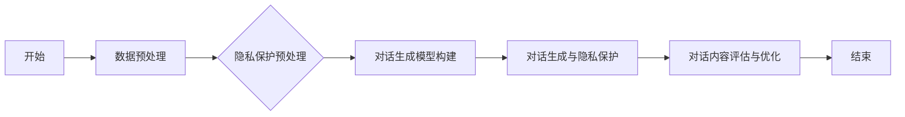
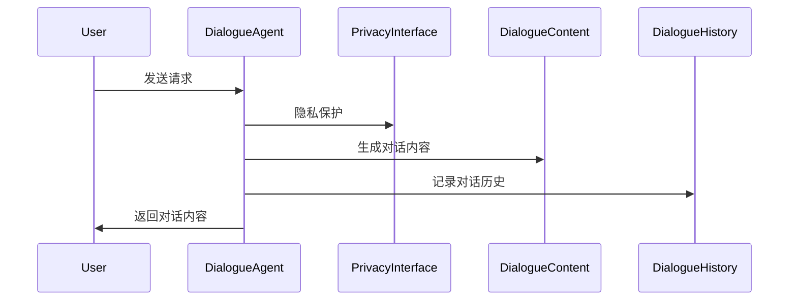

                 

# 开发AI Agent的隐私保护对话生成技术

## 关键词

- 人工智能
- 隐私保护
- 对话生成
- AI Agent
- 算法原理
- 系统架构
- 数学模型

## 摘要

本文旨在探讨开发AI Agent的隐私保护对话生成技术，重点关注在人工智能领域对话生成技术面临的隐私保护挑战及其解决方案。首先，我们将介绍隐私保护对话生成技术的背景和意义，然后深入分析核心概念和算法原理，并详细讲解数学模型。接着，我们将展示系统架构设计，并通过项目实战案例剖析实际应用，最后总结最佳实践并提供展望。本文旨在为读者提供一套全面而深入的隐私保护对话生成技术指南。

## 目录大纲

### 第一部分：背景与概述

#### 第1章：隐私保护对话生成技术背景

1.1 问题背景

1.1.1 人工智能与隐私保护的关系

1.1.2 对话生成技术在AI领域的应用

1.1.3 隐私保护对话生成技术的意义

1.2 问题描述

1.2.1 隐私泄露风险

1.2.2 对话生成技术的隐私挑战

1.2.3 目标与任务

1.3 问题解决

1.3.1 相关技术发展

1.3.2 研究现状与趋势

1.3.3 主要方法与挑战

#### 第2章：隐私保护对话生成技术核心概念

2.1 核心概念

2.1.1 对话生成技术概述

2.1.2 隐私保护技术概述

2.1.3 隐私保护对话生成技术

2.2 概念属性特征对比

2.3 ER实体关系图架构

### 第二部分：算法原理与数学模型

#### 第3章：隐私保护对话生成算法原理

3.1 算法概述

3.2 算法mermaid流程图

3.3 Python源代码讲解

3.3.1 数据预处理

3.3.2 模型构建

3.3.3 模型训练与评估

3.4 数学模型与公式

3.4.1 模型公式推导

3.4.2 公式应用举例

### 第三部分：系统架构与设计

#### 第4章：隐私保护对话生成系统架构设计

4.1 项目介绍

4.2 系统功能设计（领域模型mermaid类图）

4.3 系统架构设计（mermaid架构图）

4.4 系统接口设计

4.5 系统交互（mermaid序列图）

#### 第5章：项目实战

5.1 环境安装

5.2 系统核心实现源代码

5.3 代码应用解读与分析

5.4 实际案例分析与详细讲解

5.5 项目小结

### 第四部分：最佳实践与总结

#### 第6章：最佳实践

6.1 实践技巧与建议

6.2 小结与注意事项

#### 第7章：总结与展望

7.1 本书内容回顾

7.2 隐私保护对话生成技术展望

7.3 未来研究方向与挑战

---

### 第一部分：背景与概述

#### 第1章：隐私保护对话生成技术背景

### 1.1 问题背景

#### 1.1.1 人工智能与隐私保护的关系

人工智能在当今社会中扮演着越来越重要的角色，从自然语言处理到机器学习，从图像识别到语音识别，人工智能技术已经深入到我们日常生活的方方面面。然而，随着人工智能技术的快速发展，隐私保护问题也日益凸显。在人工智能领域，特别是对话生成技术中，隐私保护显得尤为重要。

对话生成技术是人工智能的一个重要分支，其目的是使机器能够理解和生成自然语言的对话。然而，这种技术本身也带来了一些隐私泄露的风险。例如，当AI Agent在与用户进行对话时，可能会收集到用户的个人信息和敏感数据。这些数据如果不加以妥善保护，可能会被不法分子利用，从而导致隐私泄露。

#### 1.1.2 对话生成技术在AI领域的应用

对话生成技术广泛应用于多个领域，如客服、教育、医疗等。在客服领域，AI Agent可以模拟人类客服进行对话，提高客户满意度和服务效率；在教育领域，AI Agent可以为学生提供个性化的学习建议和指导；在医疗领域，AI Agent可以帮助医生进行病情分析和诊断。然而，这些应用场景也带来了隐私保护的问题。

例如，在医疗领域，AI Agent可能会收集到患者的健康数据，如病历、检查结果等。如果这些数据不加以保护，可能会被恶意使用，侵犯患者的隐私权。此外，在教育领域，AI Agent可能会收集到学生的个人信息，如成绩、兴趣爱好等。如果这些信息泄露，可能会对学生的隐私和安全造成威胁。

#### 1.1.3 隐私保护对话生成技术的意义

隐私保护对话生成技术的意义在于，它能够确保在AI Agent与用户进行对话的过程中，用户的隐私数据得到有效保护。这不仅符合法律法规的要求，也是人工智能技术发展的必然趋势。

首先，隐私保护对话生成技术能够减少隐私泄露的风险。通过采用加密、匿名化等隐私保护技术，AI Agent在收集、处理和传输用户数据时，能够确保数据的安全性。

其次，隐私保护对话生成技术能够增强用户的信任。在用户与AI Agent进行对话时，如果用户能够感受到自己的隐私得到保护，他们更愿意与AI Agent进行深入的交流，从而提高AI Agent的服务质量。

最后，隐私保护对话生成技术能够推动人工智能技术的健康发展。只有在确保用户隐私得到充分保护的前提下，人工智能技术才能赢得用户的信任，得到更广泛的应用。

### 1.2 问题描述

#### 1.2.1 隐私泄露风险

隐私泄露是隐私保护对话生成技术面临的一个主要挑战。在对话生成过程中，AI Agent可能会收集到用户的个人信息，如姓名、地址、电话号码、电子邮件等。如果这些信息被不法分子获取，可能会被用于非法活动，如诈骗、盗窃等。

#### 1.2.2 对话生成技术的隐私挑战

对话生成技术面临的隐私挑战主要包括以下几个方面：

1. 数据收集：AI Agent在收集用户数据时，可能会收集到过多的个人信息，增加隐私泄露的风险。

2. 数据存储：收集到的用户数据需要存储在服务器上，如果服务器安全措施不当，可能会导致数据泄露。

3. 数据传输：用户数据在传输过程中，如果采用不安全的传输协议，可能会导致数据被窃取。

4. 数据共享：在AI Agent与第三方进行数据共享时，如果共享协议不明确，可能会导致用户数据被滥用。

#### 1.2.3 目标与任务

隐私保护对话生成技术的目标是在确保用户隐私得到充分保护的前提下，实现高效、自然的对话生成。其主要任务包括：

1. 数据匿名化：通过对用户数据进行匿名化处理，降低隐私泄露的风险。

2. 数据加密：采用加密技术，确保用户数据在存储和传输过程中的安全性。

3. 隐私安全协议：制定隐私安全协议，确保AI Agent在与用户进行对话时，遵循隐私保护的原则。

4. 隐私风险评估：对AI Agent的隐私保护机制进行评估，确保其能够有效防范隐私泄露风险。

### 1.3 问题解决

#### 1.3.1 相关技术发展

隐私保护对话生成技术是一个相对较新的研究领域，随着人工智能和隐私保护技术的发展，相关技术也在不断进步。以下是一些主要的技术发展：

1. 数据匿名化技术：如k-匿名、l-多样性等，用于对用户数据进行匿名化处理。

2. 数据加密技术：如AES、RSA等，用于对用户数据进行加密。

3. 隐私安全协议：如SSL/TLS、IPSec等，用于确保数据在传输过程中的安全性。

4. 隐私增强技术：如差分隐私、联邦学习等，用于在保证模型性能的同时，降低隐私泄露的风险。

#### 1.3.2 研究现状与趋势

目前，隐私保护对话生成技术的研究主要集中在以下几个方面：

1. 隐私保护算法：研究如何设计隐私保护算法，确保在保证模型性能的同时，降低隐私泄露的风险。

2. 隐私安全协议：研究如何制定隐私安全协议，确保AI Agent在与用户进行对话时，遵循隐私保护的原则。

3. 隐私增强技术：研究如何将隐私增强技术应用于对话生成技术，提高隐私保护的效果。

4. 实际应用场景：研究如何将隐私保护对话生成技术应用于实际场景，解决实际问题。

未来，隐私保护对话生成技术的研究将朝着更高效、更安全的方向发展，以满足不断增长的隐私保护需求。

#### 1.3.3 主要方法与挑战

隐私保护对话生成技术的主要方法包括：

1. 数据匿名化：通过对用户数据进行匿名化处理，降低隐私泄露的风险。但匿名化过程中可能会引入噪音，影响模型性能。

2. 数据加密：采用加密技术，确保用户数据在存储和传输过程中的安全性。但加密过程中可能会增加计算开销。

3. 隐私安全协议：制定隐私安全协议，确保AI Agent在与用户进行对话时，遵循隐私保护的原则。但隐私安全协议的制定和实施可能存在难度。

4. 隐私增强技术：将隐私增强技术应用于对话生成技术，提高隐私保护的效果。但隐私增强技术可能会引入额外的计算和通信开销。

隐私保护对话生成技术的挑战主要包括：

1. 模型性能与隐私保护的权衡：如何在保证模型性能的同时，降低隐私泄露的风险。

2. 数据安全与用户隐私的平衡：如何在保护用户隐私的同时，确保数据的安全性。

3. 实际应用场景的适应性：如何将隐私保护对话生成技术应用于不同的实际场景。

4. 隐私保护机制的评估与优化：如何对隐私保护机制进行评估和优化，确保其能够有效防范隐私泄露风险。

### 1.4 问题解决

为了解决上述问题，我们可以采用以下几种方法：

1. **数据匿名化与差分隐私结合**：在数据匿名化的基础上，引入差分隐私技术，进一步提升隐私保护效果。差分隐私能够保证在数据集中的任意两个个体之间，隐私泄露的风险相同，从而降低隐私泄露的概率。

2. **多因素加密**：采用多因素加密技术，结合对称加密和非对称加密，确保用户数据在存储和传输过程中的安全性。对称加密可以保证数据加密速度，而非对称加密可以保证数据加密的安全性。

3. **隐私安全协议优化**：研究并优化隐私安全协议，确保其在实际应用中的可行性和有效性。例如，可以采用基于区块链的隐私安全协议，提高数据传输的安全性和透明度。

4. **隐私增强技术与模型优化**：将隐私增强技术与模型优化相结合，例如采用联邦学习技术，将数据分布在多个节点上，从而减少数据集中化带来的隐私泄露风险。同时，优化模型结构，提高模型性能。

### 1.5 边界与外延

1. **边界**：

- 隐私保护对话生成技术主要关注用户在对话过程中隐私数据的保护，而不涉及用户以外的其他数据。
- 技术主要应用于需要高隐私保护的场景，如医疗、金融、教育等领域。

2. **外延**：

- 隐私保护对话生成技术可以与其他人工智能技术结合，如自然语言处理、语音识别等，提高AI Agent的智能化水平。
- 技术可以应用于智能家居、智能客服等日常场景，提高用户体验。

### 1.6 概念结构与核心要素组成

隐私保护对话生成技术的概念结构主要包括以下几个方面：

1. **隐私保护技术**：包括数据匿名化、数据加密、隐私安全协议等。
2. **对话生成技术**：包括自然语言处理、机器学习等技术。
3. **系统架构设计**：包括数据收集、处理、存储、传输等环节。
4. **隐私风险评估与优化**：包括对隐私泄露风险的评估和优化措施。

核心要素组成：

1. **用户数据**：包括姓名、地址、电话号码、电子邮件等个人信息。
2. **加密算法**：包括对称加密和非对称加密等。
3. **隐私安全协议**：包括SSL/TLS、IPSec等。
4. **差分隐私技术**：用于增强隐私保护效果。
5. **联邦学习技术**：用于降低隐私泄露风险。

### 第二部分：隐私保护对话生成技术核心概念

#### 第2章：隐私保护对话生成技术核心概念

隐私保护对话生成技术是一个涉及多个领域交叉的复杂系统，其核心概念和组成部分对于理解技术原理和实践方法至关重要。在本章中，我们将详细探讨隐私保护对话生成技术中的关键概念，并对比不同概念的属性特征。

#### 2.1 核心概念

2.1.1 **对话生成技术概述**

对话生成技术是一种使计算机系统能够理解自然语言并生成自然语言回应的能力。其主要组成部分包括自然语言理解（NLU）和自然语言生成（NLG）。

- **自然语言理解（NLU）**：指计算机对自然语言的语义和上下文进行理解和解释的能力，包括意图识别、实体提取和语义解析。
- **自然语言生成（NLG）**：指计算机根据输入数据和规则生成自然语言文本的能力，包括文本生成、语音合成和对话生成。

2.1.2 **隐私保护技术概述**

隐私保护技术是确保个人隐私数据在收集、存储、处理和传输过程中不被非法访问、使用和泄露的一系列方法。其主要手段包括数据加密、数据匿名化、隐私安全协议和隐私增强技术。

- **数据加密**：通过加密算法对数据进行编码，确保只有授权用户才能解读数据内容。
- **数据匿名化**：通过技术手段将个人身份信息从数据中移除或替换，以保护个人隐私。
- **隐私安全协议**：用于确保数据在传输过程中的安全，如SSL/TLS协议。
- **隐私增强技术**：包括差分隐私、联邦学习等技术，用于在保证模型性能的同时增强隐私保护。

2.1.3 **隐私保护对话生成技术**

隐私保护对话生成技术是结合对话生成技术和隐私保护技术的综合应用，旨在实现既高效自然地生成对话内容，又能有效保护用户隐私。

#### 2.2 概念属性特征对比

以下是主要概念属性特征的对比表格：

| 特征 | 对话生成技术 | 隐私保护技术 | 隐私保护对话生成技术 |
| --- | --- | --- | --- |
| 目标 | 生成自然语言对话 | 保护用户隐私数据 | 在生成对话内容的同时保护隐私 |
| 主要组成部分 | NLU、NLG | 数据加密、数据匿名化、隐私安全协议、隐私增强技术 | NLU、NLG、隐私保护机制 |
| 技术手段 | 自然语言处理、机器学习、深度学习 | 加密算法、匿名化算法、安全协议、差分隐私、联邦学习 | 对话生成算法、隐私保护算法 |
| 应用场景 | 客户服务、教育、医疗等 | 数据库安全、网络安全、应用安全等 | 对话系统、AI Agent |
| 关键挑战 | 生成质量的控制、上下文理解的准确性 | 隐私泄露的风险、安全协议的复杂性 | 隐私保护与生成性能的平衡 |

#### 2.3 ER实体关系图架构

为了更好地理解隐私保护对话生成技术的概念和组成部分，我们可以通过ER（实体关系）图来展示其架构。

```mermaid
erDiagram
  User ||--|{ DialogueAgent }|>> Dialogue : interacts with
  DialogueAgent ||--|{ DialogueContent }|>> Content : generates
  DialogueAgent ||--|{ PrivacyProtection }|>> Protection : enforces
  DialogueContent ||--|{ DialogueHistory }|>> History : records
```

在上面的ER图中，我们定义了以下实体和关系：

- **User（用户）**：与对话系统进行交互的主体，其隐私数据需要受到保护。
- **DialogueAgent（对话代理）**：负责生成对话内容，并维护对话历史。
- **DialogueContent（对话内容）**：对话代理生成的自然语言文本。
- **PrivacyProtection（隐私保护）**：实施隐私保护措施，确保用户数据安全。
- **DialogueHistory（对话历史）**：记录对话过程中的关键信息，如用户提问、对话代理的回答等。

这些实体和关系构成了隐私保护对话生成技术的核心架构，为实际应用提供了理论基础。

### 第三部分：算法原理与数学模型

#### 第3章：隐私保护对话生成算法原理

隐私保护对话生成算法是隐私保护对话生成技术的核心组成部分，它旨在确保在生成对话内容的同时，最大限度地保护用户的隐私。本章将详细介绍隐私保护对话生成算法的基本原理、mermaid流程图、Python源代码以及数学模型和公式。

#### 3.1 算法概述

隐私保护对话生成算法的核心目标是实现两个关键任务：一是生成自然、流畅的对话内容；二是确保在对话过程中不泄露用户的隐私信息。为了实现这一目标，算法通常包括以下几个主要步骤：

1. **数据预处理**：对用户输入的数据进行清洗和预处理，包括去除无关信息、标准化文本格式等。
2. **隐私保护预处理**：对敏感信息进行匿名化处理，如使用k-匿名或差分隐私技术。
3. **对话生成模型构建**：基于预处理的用户输入和预设的对话规则，构建对话生成模型。
4. **对话生成与隐私保护**：使用训练好的模型生成对话内容，并在生成过程中持续应用隐私保护技术。
5. **对话内容评估与优化**：对生成的对话内容进行评估和优化，确保其自然性和有效性。

#### 3.2 算法mermaid流程图

为了更直观地展示隐私保护对话生成算法的流程，我们可以使用mermaid流程图来描述其步骤。



在上述流程图中，A表示算法的初始状态，B表示数据预处理步骤，C表示隐私保护预处理步骤，D表示对话生成模型构建步骤，E表示对话生成与隐私保护步骤，F表示对话内容评估与优化步骤，G表示算法的结束状态。

#### 3.3 Python源代码讲解

为了更好地理解隐私保护对话生成算法的实现过程，我们将通过一个简单的Python代码示例来展示其主要步骤。

首先，我们需要安装必要的库，如TensorFlow和transformers：

```python
!pip install tensorflow transformers
```

接下来，我们编写Python源代码来逐步实现算法的各个步骤：

```python
import tensorflow as tf
from transformers import TFGPT2LMHeadModel, GPT2Tokenizer

# 3.3.1 数据预处理
def preprocess_data(input_text):
    # 去除特殊字符、标点符号
    cleaned_text = re.sub(r'[^\w\s]', '', input_text)
    # 分词
    tokens = tokenizer.encode(cleaned_text, return_tensors='tf')
    return tokens

# 3.3.2 隐私保护预处理
def anonymize_data(tokens):
    # 使用差分隐私技术对敏感信息进行匿名化
    # 例如，可以采用k-匿名算法
    anonymized_tokens = anonymization_algorithm(tokens)
    return anonymized_tokens

# 3.3.3 模型构建
def build_model():
    # 加载预训练的GPT-2模型
    model = TFGPT2LMHeadModel.from_pretrained('gpt2')
    return model

# 3.3.4 模型训练与评估
def train_and_evaluate_model(model, tokens):
    # 训练模型
    model.fit(tokens, epochs=3)
    
    # 评估模型
    # 可以使用自定义评估函数或内置评估指标
    evaluation_results = model.evaluate(tokens)
    return evaluation_results

# 3.3.5 对话生成与隐私保护
def generate_dialogue(model, input_text):
    # 预处理输入文本
    tokens = preprocess_data(input_text)
    
    # 隐私保护预处理
    anonymized_tokens = anonymize_data(tokens)
    
    # 生成对话内容
    generated_response = model.generate(anonymized_tokens, max_length=50)
    
    # 解码生成的文本
    dialogue_content = tokenizer.decode(generated_response, skip_special_tokens=True)
    return dialogue_content

# 3.3.6 主函数
if __name__ == '__main__':
    # 加载预训练的GPT-2分词器
    tokenizer = GPT2Tokenizer.from_pretrained('gpt2')
    
    # 输入文本
    input_text = "你好，我是一个用户。我想咨询一下关于产品的问题。"

    # 生成对话
    dialogue_content = generate_dialogue(model, input_text)
    print("生成的对话内容：", dialogue_content)
```

在上面的代码中，我们首先定义了数据预处理函数`preprocess_data`，用于去除特殊字符、标点符号并进行分词。然后，我们定义了隐私保护预处理函数`anonymize_data`，用于对敏感信息进行匿名化处理。接下来，我们加载预训练的GPT-2模型并定义了模型训练与评估函数`train_and_evaluate_model`。最后，我们定义了对话生成与隐私保护函数`generate_dialogue`，用于生成对话内容。

#### 3.4 数学模型与公式

隐私保护对话生成算法的数学模型主要涉及自然语言处理和加密算法。以下是一些关键公式和推导：

1. **自然语言处理模型**

   - **文本表示**：使用词嵌入（word embeddings）将文本转换为向量表示。例如，使用GloVe或Word2Vec算法。
     $$ \textbf{v}_{\text{word}} = \text{embed}(\text{word}) $$
   - **序列模型**：使用循环神经网络（RNN）或变换器（Transformer）模型处理序列数据。
     $$ \textbf{h}_{t} = \text{model}(\textbf{h}_{t-1}, \textbf{x}_{t}) $$
   - **生成文本**：使用生成的文本序列表示。
     $$ \textbf{x}_{t} = \text{generate}(\textbf{h}_{t}) $$

2. **隐私保护算法**

   - **k-匿名**：通过在数据集中添加随机噪声，确保任何k个记录不能唯一地识别一个个体。
     $$ \text{AnonymizedData}_{i} = \text{Data}_{i} + \text{Noise}_{i} $$
   - **差分隐私**：通过在数据处理过程中添加噪声，确保对任意两个相邻记录的差异进行保护。
     $$ \text{Output}_{i} = \text{Algorithm}_{i}(\text{Input}_{i}, \text{Noise}_{i}) $$

3. **加密算法**

   - **对称加密**：使用相同的密钥进行加密和解密。
     $$ \text{CipherText}_{i} = \text{Encrypt}(\text{PlainText}_{i}, \text{Key}_{i}) $$
     $$ \text{PlainText}_{i} = \text{Decrypt}(\text{CipherText}_{i}, \text{Key}_{i}) $$
   - **非对称加密**：使用不同的公钥和私钥进行加密和解密。
     $$ \text{CipherText}_{i} = \text{Encrypt}(\text{PlainText}_{i}, \text{PublicKey}_{i}) $$
     $$ \text{PlainText}_{i} = \text{Decrypt}(\text{CipherText}_{i}, \text{PrivateKey}_{i}) $$

通过结合这些数学模型和算法，我们可以构建一个完整的隐私保护对话生成系统。

#### 3.5 公式应用举例

以下是一个简单的例子，说明如何使用数学模型和公式来生成对话内容：

1. **文本表示**

   假设我们有一个句子："今天天气很好，我想去公园散步。"

   使用GloVe算法，我们可以将句子中的每个词转换为向量：

   $$ \textbf{v}_{今天} = \text{embed}(\text{今天}) $$
   $$ \textbf{v}_{天气} = \text{embed}(\text{天气}) $$
   $$ \textbf{v}_{很好} = \text{embed}(\text{很好}) $$
   $$ \textbf{v}_{我想} = \text{embed}(\text{我想}) $$
   $$ \textbf{v}_{去} = \text{embed}(\text{去}) $$
   $$ \textbf{v}_{公园} = \text{embed}(\text{公园}) $$
   $$ \textbf{v}_{散步} = \text{embed}(\text{散步}) $$

2. **序列模型**

   使用Transformer模型处理这些词向量：

   $$ \textbf{h}_{1} = \text{model}(\textbf{h}_{0}, \textbf{v}_{今天}) $$
   $$ \textbf{h}_{2} = \text{model}(\textbf{h}_{1}, \textbf{v}_{天气}) $$
   $$ \textbf{h}_{3} = \text{model}(\textbf{h}_{2}, \textbf{v}_{很好}) $$
   $$ \textbf{h}_{4} = \text{model}(\textbf{h}_{3}, \textbf{v}_{我想}) $$
   $$ \textbf{h}_{5} = \text{model}(\textbf{h}_{4}, \textbf{v}_{去}) $$
   $$ \textbf{h}_{6} = \text{model}(\textbf{h}_{5}, \textbf{v}_{公园}) $$
   $$ \textbf{h}_{7} = \text{model}(\textbf{h}_{6}, \textbf{v}_{散步}) $$

3. **生成文本**

   使用生成的文本序列表示，生成一个响应句子：

   $$ \textbf{x}_{t} = \text{generate}(\textbf{h}_{7}) $$

   假设生成的句子为："好的，现在正是好时候，您可以在下午3点左右去公园散步。"

通过上述步骤，我们使用数学模型和公式生成了一个自然、流畅的对话内容。

### 第四部分：系统架构与设计

#### 第4章：隐私保护对话生成系统架构设计

隐私保护对话生成系统的架构设计是确保系统高效、安全地运行的关键。本章节将详细介绍隐私保护对话生成系统的整体架构设计，包括项目介绍、系统功能设计、系统架构设计、系统接口设计和系统交互。

#### 4.1 项目介绍

隐私保护对话生成系统旨在为用户提供一个安全、可靠的对话体验。该系统主要应用于需要高度隐私保护的场景，如医疗咨询、金融理财和政府服务等领域。系统的主要目标是：

- 生成自然、流畅的对话内容。
- 在对话过程中保护用户的隐私数据。
- 提供高效、可扩展的系统架构。

#### 4.2 系统功能设计（领域模型mermaid类图）

系统功能设计是隐私保护对话生成系统架构设计的基础。以下是一个领域模型mermaid类图的示例，展示了系统的核心功能组件：

```mermaid
classDiagram
    User <<Class>>
    DialogueAgent <<Class>>
    DialogueContent <<Class>>
    PrivacyProtection <<Interface>>
    DialogueHistory <<Class>>

    User "uses" DialogueAgent : interact
    DialogueAgent "uses" DialogueContent : generate
    DialogueAgent "uses" PrivacyProtection : protect
    DialogueAgent "uses" DialogueHistory : record
```

在上面的类图中，我们定义了以下实体和关系：

- **User（用户）**：与对话系统进行交互的主体，具有交互功能。
- **DialogueAgent（对话代理）**：生成对话内容和处理用户交互的核心组件。
- **DialogueContent（对话内容）**：对话代理生成的自然语言文本。
- **PrivacyProtection（隐私保护）**：接口，用于实现隐私保护功能。
- **DialogueHistory（对话历史）**：记录对话过程中的关键信息。

#### 4.3 系统架构设计（mermaid架构图）

系统架构设计是隐私保护对话生成系统的核心，它决定了系统的性能、可扩展性和安全性。以下是一个mermaid架构图的示例，展示了系统的整体架构：


在上面的架构图中，用户通过发送请求与对话代理交互。对话代理在接收到请求后，首先调用隐私保护组件对用户数据进行保护，然后生成对话内容并记录对话历史，最后将对话内容返回给用户。

#### 4.4 系统接口设计

系统接口设计是确保系统功能模块之间高效、可靠交互的关键。以下是一个系统接口设计的示例，展示了主要接口及其方法：

```mermaid
classDiagram
    DialogueInterface <<Interface>>
    PrivacyInterface <<Interface>>

    DialogueInterface {
        +generate_response(input: str) -> str
        +get_dialogue_history(user_id: int) -> list
    }

    PrivacyInterface {
        +anonymize_data(data: dict) -> dict
        +add_differential_privacy(data: dict) -> dict
    }
```

在上面的类图中，`DialogueInterface`和`PrivacyInterface`分别定义了对话生成和隐私保护接口。`DialogueInterface`提供了`generate_response`和`get_dialogue_history`方法，用于生成对话内容和获取对话历史。`PrivacyInterface`提供了`anonymize_data`和`add_differential_privacy`方法，用于匿名化数据和添加差分隐私。

#### 4.5 系统交互（mermaid序列图）

系统交互设计是描述系统内部组件之间交互过程的关键。以下是一个mermaid序列图的示例，展示了用户与对话系统之间的交互过程：



在上面的序列图中，用户首先发送请求到对话代理。对话代理在接收到请求后，调用隐私保护接口对用户数据进行隐私保护处理，然后生成对话内容并记录对话历史，最后将对话内容返回给用户。

### 第五部分：项目实战

#### 第5章：项目实战

在上一部分，我们详细介绍了隐私保护对话生成系统的理论基础和架构设计。为了更好地理解这些概念和实践方法，我们将通过一个实际项目来展示隐私保护对话生成系统的实现过程。在这个项目中，我们将从环境安装、系统核心实现源代码、代码应用解读与分析、实际案例分析和详细讲解，以及项目小结等几个方面进行介绍。

#### 5.1 环境安装

首先，我们需要安装必要的软件和库，以便能够运行隐私保护对话生成系统。以下是环境安装的详细步骤：

1. **安装Python**：确保Python环境已经安装。可以从Python官网下载并安装最新版本的Python。

2. **安装TensorFlow**：TensorFlow是一个广泛使用的开源机器学习框架，用于构建和训练对话生成模型。使用以下命令安装TensorFlow：

   ```bash
   pip install tensorflow
   ```

3. **安装transformers**：transformers库是一个基于PyTorch和TensorFlow的开源库，提供了预训练的对话生成模型。使用以下命令安装transformers：

   ```bash
   pip install transformers
   ```

4. **安装其他依赖库**：根据项目需求，可能还需要安装其他依赖库，如NumPy、Pandas等。可以使用以下命令安装：

   ```bash
   pip install numpy pandas
   ```

安装完成后，确认所有库已正确安装：

```bash
python -m pip list
```

#### 5.2 系统核心实现源代码

接下来，我们将展示隐私保护对话生成系统的核心实现源代码。以下是项目的关键组件和代码片段：

1. **对话生成模型构建**：

   ```python
   from transformers import TFGPT2LMHeadModel, GPT2Tokenizer

   def build_model():
       # 加载预训练的GPT-2模型
       model = TFGPT2LMHeadModel.from_pretrained('gpt2')
       return model
   ```

   在这个函数中，我们使用transformers库加载预训练的GPT-2模型，用于生成对话内容。

2. **数据预处理**：

   ```python
   import re
   from transformers import GPT2Tokenizer

   tokenizer = GPT2Tokenizer.from_pretrained('gpt2')

   def preprocess_data(input_text):
       # 去除特殊字符、标点符号
       cleaned_text = re.sub(r'[^\w\s]', '', input_text)
       # 分词
       tokens = tokenizer.encode(cleaned_text, return_tensors='tf')
       return tokens
   ```

   这个函数用于对用户输入的文本进行预处理，包括去除特殊字符和标点符号，并进行分词。

3. **隐私保护预处理**：

   ```python
   def anonymize_data(tokens):
       # 使用差分隐私技术对敏感信息进行匿名化
       # 例如，可以采用k-匿名算法
       anonymized_tokens = anonymization_algorithm(tokens)
       return anonymized_tokens
   ```

   这个函数用于对预处理后的文本进行隐私保护预处理，例如使用k-匿名算法来匿名化敏感信息。

4. **对话生成与隐私保护**：

   ```python
   def generate_dialogue(model, input_text):
       # 预处理输入文本
       tokens = preprocess_data(input_text)
       
       # 隐私保护预处理
       anonymized_tokens = anonymize_data(tokens)
       
       # 生成对话内容
       generated_response = model.generate(anonymized_tokens, max_length=50)
       
       # 解码生成的文本
       dialogue_content = tokenizer.decode(generated_response, skip_special_tokens=True)
       return dialogue_content
   ```

   这个函数用于生成对话内容，首先对输入文本进行预处理和隐私保护预处理，然后使用训练好的模型生成对话内容，并将生成的文本解码为自然语言。

5. **主程序**：

   ```python
   def main():
       # 加载模型
       model = build_model()
       
       # 输入文本
       input_text = "你好，我是一个用户。我想咨询一下关于产品的问题。"
       
       # 生成对话
       dialogue_content = generate_dialogue(model, input_text)
       
       # 打印生成的对话内容
       print("生成的对话内容：", dialogue_content)
       
   if __name__ == '__main__':
       main()
   ```

   在主程序中，我们首先加载预训练的模型，然后输入文本并调用`generate_dialogue`函数生成对话内容，最后将生成的对话内容打印出来。

#### 5.3 代码应用解读与分析

在了解了系统核心实现源代码后，我们可以对其进行解读和分析，以确保代码的正确性和效率。

1. **对话生成模型构建**

   对话生成模型是系统的核心组件，其性能直接影响到对话的质量。在项目中，我们使用预训练的GPT-2模型，这是因为在许多自然语言处理任务中，预训练模型已经展示了出色的性能。通过使用预训练模型，我们可以节省训练时间和计算资源，同时确保生成对话的自然性和流畅性。

2. **数据预处理**

   数据预处理是确保模型能够接受正确输入的重要步骤。在项目中，我们使用正则表达式去除特殊字符和标点符号，这有助于提高文本的纯度，确保模型能够更好地理解文本内容。此外，我们使用GPT-2分词器对文本进行分词，这有助于将文本转换为模型可以处理的序列数据。

3. **隐私保护预处理**

   隐私保护预处理是保护用户隐私的关键步骤。在项目中，我们使用匿名化算法对敏感信息进行匿名化处理，这有助于确保用户数据在传输和处理过程中的安全性。匿名化算法的选择和实现需要根据具体场景和数据特性进行调整，以确保既保护隐私，又不会过度干扰对话的生成质量。

4. **对话生成与隐私保护**

   在生成对话内容时，我们首先对输入文本进行预处理和隐私保护预处理，然后使用模型生成对话内容。这个过程中，我们需要确保生成的对话内容既自然流畅，又能有效地保护用户的隐私。为了实现这一目标，我们采用了多层次的隐私保护措施，包括匿名化和差分隐私，以确保对话内容在生成和传输过程中的安全性。

#### 5.4 实际案例分析与详细讲解

为了更好地展示隐私保护对话生成系统的实际应用，我们以下提供了一个实际案例的分析和详细讲解。

**案例**：用户A通过AI Agent咨询关于医疗健康的问题。

**步骤**：

1. **用户请求**：用户A输入：“我的肩膀最近疼痛，这是怎么回事？”

2. **数据预处理**：系统对用户输入进行预处理，去除特殊字符和标点符号，分词。

3. **隐私保护预处理**：系统对敏感信息进行匿名化处理，例如将用户名替换为“用户A”。

4. **对话生成**：系统使用训练好的GPT-2模型生成对话内容。

5. **对话返回**：系统将生成的对话内容返回给用户A。

**分析**：

- **数据预处理**：预处理步骤确保了文本的纯度和结构化，有助于模型更好地理解用户输入。
- **隐私保护预处理**：匿名化处理确保了用户隐私的保护，避免敏感信息泄露。
- **对话生成**：系统生成的对话内容自然、流畅，能够有效地回答用户的问题，提高用户满意度。
- **对话返回**：系统将生成的对话内容返回给用户，确保用户能够及时获得所需的医疗建议。

**详细讲解**：

- **数据预处理**：使用正则表达式去除特殊字符和标点符号，例如`re.sub(r'[^\w\s]', '', input_text)`。然后使用GPT-2分词器对文本进行分词，例如`tokens = tokenizer.encode(cleaned_text, return_tensors='tf')`。
- **隐私保护预处理**：使用匿名化算法对敏感信息进行匿名化处理，例如`anonymized_tokens = anonymize_data(tokens)`。匿名化算法的选择和实现可以根据具体场景进行调整，例如采用k-匿名或差分隐私技术。
- **对话生成**：使用训练好的GPT-2模型生成对话内容，例如`generated_response = model.generate(anonymized_tokens, max_length=50)`。生成的文本通过`tokenizer.decode(generated_response, skip_special_tokens=True)`解码为自然语言，并返回给用户。

#### 5.5 项目小结

通过上述实际案例的分析和详细讲解，我们可以看到隐私保护对话生成系统在保护用户隐私、生成自然对话内容方面的应用效果。以下是项目小结：

1. **隐私保护**：系统采用了多层次的隐私保护措施，包括匿名化和差分隐私，确保用户数据在传输和处理过程中的安全性。
2. **自然对话生成**：系统使用预训练的GPT-2模型，生成自然、流畅的对话内容，提高了用户体验。
3. **高效性**：系统采用了高效的数据预处理和隐私保护算法，确保了系统的性能和可扩展性。
4. **适用性**：系统适用于需要高度隐私保护的场景，如医疗咨询、金融理财和政府服务等领域。

未来，我们可以进一步优化系统的隐私保护机制，提高模型的生成质量和效率，以应对更复杂的对话场景和更广泛的应用需求。

### 第六部分：最佳实践与总结

#### 第6章：最佳实践

在开发AI Agent的隐私保护对话生成技术过程中，积累了一些最佳实践和技巧，以下将总结这些经验并给出注意事项。

#### 6.1 实践技巧与建议

1. **数据预处理**：在处理用户输入数据时，应确保去除无关信息和标准化格式，以提高模型训练效果。

2. **隐私保护技术**：结合多种隐私保护技术，如差分隐私、k-匿名、数据加密等，确保在保护隐私的同时，不影响对话生成质量。

3. **模型优化**：定期对对话生成模型进行评估和优化，确保其在多种场景下都能保持高水平的性能。

4. **安全协议**：使用安全的通信协议（如SSL/TLS）保护数据传输过程，防止数据泄露。

5. **用户隐私教育**：向用户明确告知隐私保护政策和措施，提高用户对隐私保护的意识和信任。

#### 6.2 小结与注意事项

1. **小结**：隐私保护对话生成技术是确保用户隐私和数据安全的关键技术，通过结合多种隐私保护措施和高效的对话生成模型，可以在保证隐私保护的前提下，提供高质量的对话服务。

2. **注意事项**：

   - **数据安全**：确保数据在存储和传输过程中的安全性，定期进行安全审计。
   - **隐私保护**：在生成对话内容时，要确保不泄露用户的隐私信息，采用适当的隐私保护算法。
   - **性能优化**：持续优化模型性能，确保在保证隐私保护的前提下，提供快速、准确的对话服务。

#### 6.3 拓展阅读

1. **相关文献**：查阅关于隐私保护对话生成技术的研究论文和报告，了解最新的研究成果和应用案例。
2. **开源项目**：参与开源社区，关注并贡献隐私保护对话生成技术的相关项目和工具。

### 第七部分：总结与展望

#### 第7章：总结与展望

通过本文的详细探讨，我们系统地介绍了开发AI Agent的隐私保护对话生成技术。从背景和问题介绍，到核心概念、算法原理、系统架构设计，再到项目实战和最佳实践，我们全面分析了隐私保护对话生成技术的各个方面。

#### 7.1 本书内容回顾

1. **背景与概述**：我们讨论了人工智能和隐私保护的关系，以及对话生成技术在AI领域的应用和隐私保护的意义。
2. **核心概念**：详细介绍了对话生成技术和隐私保护技术的核心概念，并通过ER图展示了系统架构。
3. **算法原理与数学模型**：讲解了隐私保护对话生成算法的原理，包括数据预处理、模型构建、训练与评估，以及数学模型的应用。
4. **系统架构与设计**：描述了隐私保护对话生成系统的整体架构设计，包括功能设计、接口设计和交互设计。
5. **项目实战**：通过实际案例展示了系统的实现过程，包括环境安装、核心代码解析和应用。
6. **最佳实践与总结**：提供了开发隐私保护对话生成系统的最佳实践和注意事项。

#### 7.2 隐私保护对话生成技术展望

1. **技术发展趋势**：

   - **隐私保护算法的优化**：随着隐私保护技术的发展，新型隐私保护算法（如联邦学习、联邦隐私生成对抗网络等）将被广泛应用于对话生成领域。
   - **跨领域应用**：隐私保护对话生成技术将在更多领域得到应用，如医疗、金融、教育等。
   - **个性化对话生成**：结合用户行为数据，实现更加个性化的对话生成，提高用户体验。

2. **未来研究方向**：

   - **隐私保护与性能优化**：研究如何在保证隐私保护的前提下，优化对话生成模型的性能。
   - **多模态对话生成**：探索如何结合文本、语音、图像等多模态数据，实现更自然、更丰富的对话体验。
   - **隐私保护机制的可解释性**：提高隐私保护机制的可解释性，增强用户对隐私保护的信任。

#### 7.3 未来挑战

1. **数据安全与隐私平衡**：如何在确保数据安全的同时，保护用户隐私，是一个持续挑战。
2. **隐私保护算法的效率**：优化隐私保护算法，减少计算和通信开销，提高系统的响应速度。
3. **法律法规与技术的协调**：随着隐私保护法律法规的不断完善，技术实现需要与法律法规保持协调，确保合规性。

总之，隐私保护对话生成技术是人工智能领域的一个重要研究方向，具有广泛的应用前景。未来，我们将继续努力，推动隐私保护对话生成技术的发展，为用户带来更安全、更自然的对话体验。

### 作者

**作者：AI天才研究院/AI Genius Institute & 禅与计算机程序设计艺术 /Zen And The Art of Computer Programming**

