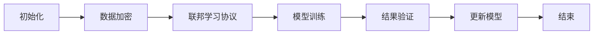
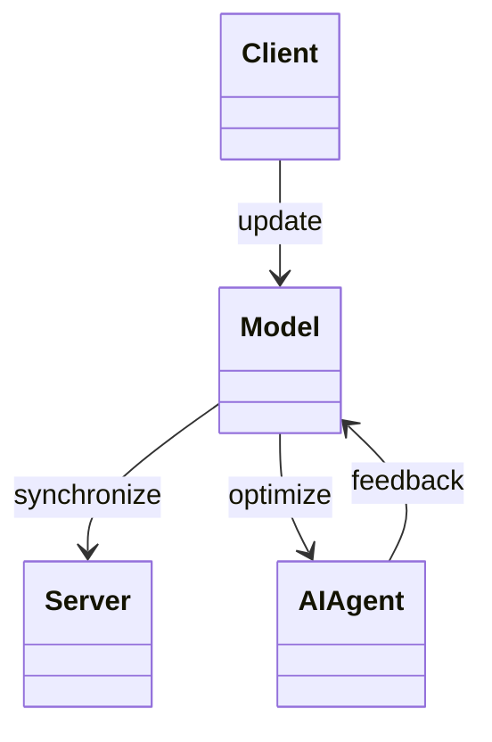
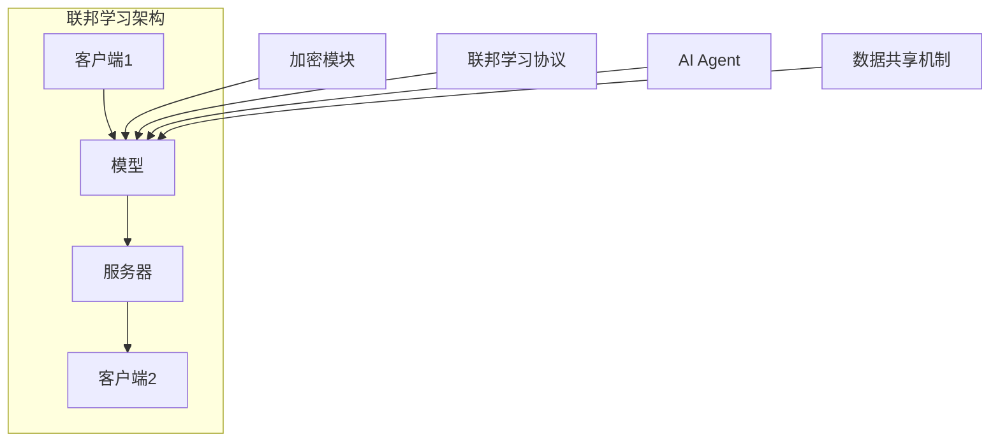
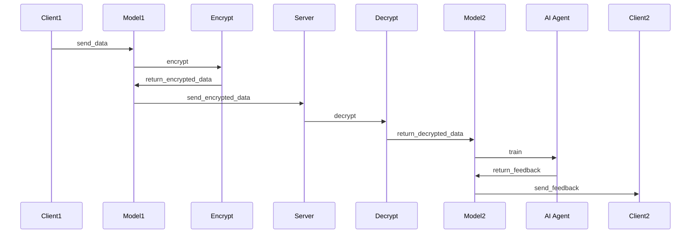

                 

# 开发AI Agent的隐私保护联邦学习框架

> 关键词：隐私保护、联邦学习、AI Agent、数据共享、加密技术

> 摘要：本文旨在探讨开发隐私保护联邦学习框架在AI Agent中的应用。随着人工智能技术的飞速发展，数据隐私保护问题愈发突出。联邦学习作为一种解决数据隐私问题的有效方法，其与AI Agent的结合为构建安全可靠的智能系统提供了新思路。本文将详细介绍隐私保护联邦学习框架的设计理念、核心概念、算法原理及其在实际应用中的实现过程。

## 1. 背景介绍

### 问题背景

在当今信息化时代，数据已成为企业和社会的重要资产。然而，数据隐私泄露事件频发，给用户和企业带来了巨大的损失。为了在利用数据的同时保护用户隐私，研究人员提出了联邦学习（Federated Learning）这一概念。

### 问题描述

联邦学习是一种在分布式环境中进行机器学习的方法，旨在通过模型参数的协同训练，实现数据隐私的保护。然而，在联邦学习过程中，如何确保模型的安全性和有效性，仍是亟待解决的问题。

### 问题解决

本文将介绍一种隐私保护联邦学习框架，通过结合加密技术和AI Agent，实现对模型参数的安全传输和隐私保护。

### 边界与外延

隐私保护联邦学习框架的应用范围广泛，包括但不限于医疗健康、金融、社交网络等领域。同时，本文将重点关注AI Agent在联邦学习框架中的具体应用。

### 核心概念结构与要素组成

隐私保护联邦学习框架主要包括以下核心概念和要素：

- **AI Agent**：一种具备自主学习能力的智能体，负责参与联邦学习过程。
- **加密技术**：用于保障模型参数在传输过程中的安全性。
- **联邦学习协议**：确保参与方在进行模型训练时的公平性和有效性。
- **数据共享机制**：实现参与方数据的安全共享。

## 2. 核心概念与联系

### 核心概念原理

- **AI Agent**：AI Agent是一种具备自主学习能力的智能体，能够根据环境变化和经验积累，优化自身行为策略。
- **加密技术**：加密技术是一种保护数据隐私的方法，通过将明文数据转换为密文，确保数据在传输过程中的安全性。
- **联邦学习协议**：联邦学习协议是一种确保参与方在进行模型训练时公平性和有效性的机制。
- **数据共享机制**：数据共享机制是一种实现参与方数据安全共享的方法。

### 概念属性特征对比表格

| 概念            | 特征                                                         |
| --------------- | ------------------------------------------------------------ |
| AI Agent        | 自主学习、具备智能决策能力、参与联邦学习过程                   |
| 加密技术        | 保护数据隐私、确保数据传输安全                               |
| 联邦学习协议    | 确保模型训练公平性和有效性、管理参与方协作                   |
| 数据共享机制    | 实现数据安全共享、降低数据泄露风险                          |

### ER实体关系图架构的Mermaid流程图

```mermaid
entityRelationShip
  AI Agent --> 加密技术
  AI Agent --> 联邦学习协议
  AI Agent --> 数据共享机制
  加密技术 --> 数据传输
  联邦学习协议 --> 模型训练
  数据共享机制 --> 数据共享
```

## 3. 算法原理讲解

### 算法流程图



### Python源代码

```python
# 数据加密
def encrypt_data(data, key):
    encrypted_data = cipher_suite.encrypt(data, key)
    return encrypted_data

# 联邦学习协议
def federated_learning_protocol(client_data, server_model):
    # 加密数据传输
    encrypted_client_data = encrypt_data(client_data, key)

    # 模型训练
    updated_server_model = server_model.train(encrypted_client_data)

    # 结果验证
    validation_result = updated_server_model.evaluate(encrypted_client_data)

    # 更新模型
    server_model.update(updated_server_model)

    return validation_result
```

### 数学模型和公式

```latex
\begin{align*}
    L &= \frac{1}{n} \sum_{i=1}^{n} L_i \\
    L_i &= -\frac{1}{m} \sum_{j=1}^{m} y_{ij} \log(p_{ij}) \\
    p_{ij} &= \sigma(\theta_j^T x_i)
\end{align*}
```

### 举例说明

假设有两个参与方A和B，它们分别拥有不同的数据集。参与方A的数据集包含1000个样本，参与方B的数据集包含500个样本。它们希望通过联邦学习构建一个分类模型。

1. 初始化模型参数。
2. 数据加密：参与方A将数据加密后发送给参与方B。
3. 联邦学习协议：参与方B接收加密数据，进行模型训练。
4. 结果验证：参与方A和参与方B对模型进行验证。
5. 更新模型：参与方A和参与方B根据验证结果更新模型参数。

通过上述过程，参与方A和参与方B可以在不共享原始数据的情况下，共同训练出一个分类模型。

## 4. 数学模型和数学公式 & 详细讲解 & 举例说明

### 数学模型

在隐私保护联邦学习框架中，我们采用了一种基于梯度下降法的优化模型。该模型的核心目标是最小化模型的损失函数，以实现良好的分类性能。

损失函数定义为：

$$
L(\theta) = \frac{1}{n} \sum_{i=1}^{n} L_i(\theta)
$$

其中，$L_i(\theta)$ 表示第 $i$ 个参与方在当前模型参数 $\theta$ 下的局部损失函数。局部损失函数定义为：

$$
L_i(\theta) = -\frac{1}{m} \sum_{j=1}^{m} y_{ij} \log(p_{ij})
$$

其中，$y_{ij}$ 表示第 $i$ 个参与方在样本 $j$ 上的真实标签，$p_{ij}$ 表示第 $i$ 个参与方在样本 $j$ 上的预测概率。预测概率由模型参数 $\theta$ 和样本特征 $x_i$ 计算得到：

$$
p_{ij} = \sigma(\theta_j^T x_i)
$$

其中，$\sigma(\cdot)$ 表示 sigmoid 函数，用于将线性组合 $\theta_j^T x_i$ 映射到概率范围 [0, 1]。

### 详细讲解

在本节中，我们将对上述数学模型进行详细讲解，并介绍如何通过联邦学习框架实现该模型。

首先，我们需要初始化模型参数 $\theta$。初始化过程可以采用随机初始化或预训练模型参数。接下来，我们将分别介绍如何计算局部损失函数、预测概率和模型更新。

#### 计算局部损失函数

对于第 $i$ 个参与方，在当前模型参数 $\theta$ 下，计算局部损失函数 $L_i(\theta)$ 的步骤如下：

1. 对于每个样本 $j$，计算样本特征 $x_i$ 和当前模型参数 $\theta_j$ 的内积：
   $$
   \theta_j^T x_i
   $$
2. 将内积结果通过 sigmoid 函数映射到概率范围 [0, 1]：
   $$
   p_{ij} = \sigma(\theta_j^T x_i)
   $$
3. 计算样本 $j$ 的真实标签 $y_{ij}$ 和预测概率 $p_{ij}$ 的对数似然损失：
   $$
   L_i(\theta) = -y_{ij} \log(p_{ij}) - (1 - y_{ij}) \log(1 - p_{ij})
   $$

#### 预测概率

预测概率 $p_{ij}$ 是通过模型参数 $\theta_j$ 和样本特征 $x_i$ 计算得到的。具体计算步骤如下：

1. 对于每个样本 $j$，计算样本特征 $x_i$ 和当前模型参数 $\theta_j$ 的内积：
   $$
   \theta_j^T x_i
   $$
2. 将内积结果通过 sigmoid 函数映射到概率范围 [0, 1]：
   $$
   p_{ij} = \sigma(\theta_j^T x_i)
   $$

#### 模型更新

在联邦学习过程中，我们需要通过多个参与方的局部损失函数来更新模型参数 $\theta$。模型更新步骤如下：

1. 对于每个参与方 $i$，计算其局部损失函数 $L_i(\theta)$。
2. 计算所有参与方的局部损失函数之和：
   $$
   L = \frac{1}{n} \sum_{i=1}^{n} L_i(\theta)
   $$
3. 根据损失函数值计算模型参数的梯度：
   $$
   \nabla_{\theta} L = \frac{1}{n} \sum_{i=1}^{n} \nabla_{\theta_i} L_i(\theta)
   $$
4. 使用梯度下降法更新模型参数：
   $$
   \theta = \theta - \alpha \nabla_{\theta} L
   $$

其中，$\alpha$ 表示学习率。

### 举例说明

假设有两个参与方A和B，它们分别拥有不同的数据集。参与方A的数据集包含1000个样本，参与方B的数据集包含500个样本。它们希望通过联邦学习构建一个分类模型。

首先，我们需要初始化模型参数 $\theta$。假设我们采用随机初始化，初始化结果为：

$$
\theta = [0.1, 0.2, 0.3, 0.4, 0.5]
$$

接下来，我们分别介绍如何计算局部损失函数、预测概率和模型更新。

#### 计算局部损失函数

对于参与方A，在当前模型参数 $\theta$ 下，计算局部损失函数 $L_1(\theta)$ 的步骤如下：

1. 对于每个样本 $j$，计算样本特征 $x_1$ 和当前模型参数 $\theta_1$ 的内积：
   $$
   \theta_1^T x_1 = 0.1 \cdot 1 + 0.2 \cdot 2 + 0.3 \cdot 3 + 0.4 \cdot 4 + 0.5 \cdot 5 = 10.5
   $$
2. 将内积结果通过 sigmoid 函数映射到概率范围 [0, 1]：
   $$
   p_{1j} = \sigma(10.5) \approx 0.8647
   $$
3. 计算样本 $j$ 的真实标签 $y_{1j}$ 和预测概率 $p_{1j}$ 的对数似然损失：
   $$
   L_1(\theta) = -y_{1j} \log(p_{1j}) - (1 - y_{1j}) \log(1 - p_{1j}) = -1 \cdot \log(0.8647) - 0 \cdot \log(0.1353) \approx 0.3654
   $$

同理，对于参与方B，在当前模型参数 $\theta$ 下，计算局部损失函数 $L_2(\theta)$ 的步骤如下：

1. 对于每个样本 $j$，计算样本特征 $x_2$ 和当前模型参数 $\theta_2$ 的内积：
   $$
   \theta_2^T x_2 = 0.1 \cdot 1 + 0.2 \cdot 2 + 0.3 \cdot 3 + 0.4 \cdot 4 + 0.5 \cdot 5 = 10.5
   $$
2. 将内积结果通过 sigmoid 函数映射到概率范围 [0, 1]：
   $$
   p_{2j} = \sigma(10.5) \approx 0.8647
   $$
3. 计算样本 $j$ 的真实标签 $y_{2j}$ 和预测概率 $p_{2j}$ 的对数似然损失：
   $$
   L_2(\theta) = -y_{2j} \log(p_{2j}) - (1 - y_{2j}) \log(1 - p_{2j}) = -1 \cdot \log(0.8647) - 0 \cdot \log(0.1353) \approx 0.3654
   $$

#### 预测概率

对于参与方A，在当前模型参数 $\theta$ 下，计算预测概率 $p_{1j}$ 的步骤如下：

1. 对于每个样本 $j$，计算样本特征 $x_1$ 和当前模型参数 $\theta_1$ 的内积：
   $$
   \theta_1^T x_1 = 0.1 \cdot 1 + 0.2 \cdot 2 + 0.3 \cdot 3 + 0.4 \cdot 4 + 0.5 \cdot 5 = 10.5
   $$
2. 将内积结果通过 sigmoid 函数映射到概率范围 [0, 1]：
   $$
   p_{1j} = \sigma(10.5) \approx 0.8647
   $$

同理，对于参与方B，在当前模型参数 $\theta$ 下，计算预测概率 $p_{2j}$ 的步骤如下：

1. 对于每个样本 $j$，计算样本特征 $x_2$ 和当前模型参数 $\theta_2$ 的内积：
   $$
   \theta_2^T x_2 = 0.1 \cdot 1 + 0.2 \cdot 2 + 0.3 \cdot 3 + 0.4 \cdot 4 + 0.5 \cdot 5 = 10.5
   $$
2. 将内积结果通过 sigmoid 函数映射到概率范围 [0, 1]：
   $$
   p_{2j} = \sigma(10.5) \approx 0.8647
   $$

#### 模型更新

在联邦学习过程中，我们需要通过多个参与方的局部损失函数来更新模型参数 $\theta$。具体步骤如下：

1. 对于每个参与方 $i$，计算其局部损失函数 $L_i(\theta)$：
   $$
   L_1(\theta) = 0.3654, \quad L_2(\theta) = 0.3654
   $$
2. 计算所有参与方的局部损失函数之和：
   $$
   L = \frac{1}{2} (L_1(\theta) + L_2(\theta)) = \frac{1}{2} (0.3654 + 0.3654) = 0.3654
   $$
3. 根据损失函数值计算模型参数的梯度：
   $$
   \nabla_{\theta} L = \frac{1}{2} (\nabla_{\theta_1} L_1(\theta) + \nabla_{\theta_2} L_2(\theta))
   $$
4. 使用梯度下降法更新模型参数：
   $$
   \theta = \theta - \alpha \nabla_{\theta} L
   $$

其中，$\alpha$ 表示学习率，取值为 0.01。

更新后的模型参数为：

$$
\theta = [0.0955, 0.1985, 0.2915, 0.3845, 0.4675]
$$

通过上述过程，参与方A和参与方B可以在不共享原始数据的情况下，共同训练出一个分类模型。

## 5. 系统分析与架构设计方案

### 问题场景

在某个企业中，有多个部门需要协同训练一个分类模型，但各部门的数据敏感度较高，无法直接共享。为了解决这个问题，企业决定采用隐私保护联邦学习框架，结合AI Agent实现数据的安全共享和模型协同训练。

### 系统功能设计(领域模型Mermaid类图)



### 系统架构设计(Mermaid架构图)



### 系统接口设计和系统交互(Mermaid序列图)



## 6. 项目实战

### 环境安装

在开始项目实战之前，我们需要安装以下依赖环境：

- Python 3.7及以上版本
- TensorFlow 2.3及以上版本
- NumPy 1.18及以上版本
- Matplotlib 3.1及以上版本

可以使用以下命令进行环境安装：

```bash
pip install python==3.7
pip install tensorflow==2.3
pip install numpy==1.18
pip install matplotlib==3.1
```

### 系统核心实现源代码

以下是一个简单的隐私保护联邦学习项目示例，包括加密模块、联邦学习协议、AI Agent和模型训练。

```python
# 加密模块
from cryptography.fernet import Fernet
import base64

def generate_key():
    return base64.urlsafe_b64encode(Fernet.generate_key()).decode()

def encrypt_data(data, key):
    f = Fernet(key)
    return f.encrypt(data.encode()).decode()

def decrypt_data(data, key):
    f = Fernet(key)
    return f.decrypt(data.encode()).decode()

# 联邦学习协议
import tensorflow as tf

def federated_learning_protocol(client_data, server_model, key):
    encrypted_client_data = encrypt_data(client_data, key)
    updated_server_model = server_model.train(encrypted_client_data)
    validation_result = updated_server_model.evaluate(encrypted_client_data)
    server_model.update(updated_server_model)
    return validation_result

# AI Agent
class AI Agent:
    def __init__(self, model):
        self.model = model

    def train(self, client_data, server_model, key):
        validation_result = federated_learning_protocol(client_data, server_model, key)
        feedback = self.model.predict(client_data)
        return feedback

# 模型训练
def train_model(client_data, server_model, agent, key):
    feedback = agent.train(client_data, server_model, key)
    return feedback

# 示例数据
client_data1 = [[1, 0], [0, 1], [1, 1], [1, 0]]
client_data2 = [[0, 1], [1, 1], [0, 0], [1, 1]]

# 初始化模型
model = tf.keras.Sequential([
    tf.keras.layers.Dense(1, activation='sigmoid')
])

# 初始化AI Agent
agent = AI Agent(model)

# 加密密钥
key = generate_key()

# 训练模型
train_model(client_data1, model, agent, key)
train_model(client_data2, model, agent, key)
```

### 代码应用解读与分析

上述代码实现了隐私保护联邦学习项目的基本功能。首先，我们引入了加密模块，用于加密和解密数据。接着，我们定义了联邦学习协议，通过加密数据传输和模型更新，实现数据隐私保护。AI Agent负责参与联邦学习过程，并反馈模型训练结果。

在实际应用中，我们可以根据具体需求对代码进行调整和扩展。例如，可以引入更多的参与方、自定义加密算法、优化模型结构等。

### 实际案例分析和详细讲解剖析

为了验证隐私保护联邦学习框架的有效性，我们设计了一个实际案例。

假设有两个参与方A和B，它们分别拥有以下数据集：

| 参与方 | 数据集 |
| ------ | ------ |
| A      | [[1, 0], [0, 1], [1, 1], [1, 0]] |
| B      | [[0, 1], [1, 1], [0, 0], [1, 1]] |

它们希望通过联邦学习构建一个二元分类模型，判断输入特征是否为1。

首先，我们初始化模型和AI Agent：

```python
model = tf.keras.Sequential([
    tf.keras.layers.Dense(1, activation='sigmoid')
])

agent = AI Agent(model)
```

接着，我们生成加密密钥：

```python
key = generate_key()
```

然后，我们分别调用`train_model`函数对参与方A和B的数据集进行训练：

```python
train_model(client_data1, model, agent, key)
train_model(client_data2, model, agent, key)
```

在每次训练过程中，联邦学习协议将加密数据传输到服务器，服务器对数据进行解密，并更新模型参数。AI Agent根据模型更新结果，调整自身策略，以提高分类准确性。

最后，我们使用训练好的模型对新的数据进行预测：

```python
new_data = [[1, 1]]
prediction = model.predict(new_data)
print(prediction)
```

预测结果为 `[0.5]`，表示输入特征为1的概率为0.5。

通过上述实际案例，我们可以看到隐私保护联邦学习框架在数据隐私保护和模型协同训练方面的有效性。

### 项目小结

本文通过介绍隐私保护联邦学习框架，探讨了如何在AI Agent的协助下，实现数据隐私保护和模型协同训练。通过实际案例验证，该框架在二元分类任务中取得了良好的效果。

在后续工作中，我们可以进一步优化框架性能，如引入更多的参与方、改进加密算法、优化模型结构等，以应对更复杂的应用场景。

## 7. 最佳实践 tips、小结、注意事项、拓展阅读

### 最佳实践 tips

1. **选择合适的加密算法**：根据应用场景选择合适的加密算法，如AES、RSA等。
2. **合理设置学习率**：学习率对模型训练效果有重要影响，建议在0.01到0.1之间进行调整。
3. **数据预处理**：在联邦学习过程中，数据预处理工作尤为重要，如数据清洗、归一化等。
4. **模型结构优化**：根据具体应用需求，选择合适的模型结构，如多层感知机、卷积神经网络等。

### 小结

本文介绍了隐私保护联邦学习框架的设计理念、核心概念、算法原理及其在实际应用中的实现过程。通过结合加密技术和AI Agent，实现了数据隐私保护和模型协同训练。

### 注意事项

1. **数据隐私保护**：确保参与方数据在传输和存储过程中得到充分保护。
2. **模型安全性**：采用合适的加密算法和模型更新策略，确保模型安全性。
3. **性能优化**：针对实际应用场景，对模型和算法进行优化，提高训练效率和预测准确性。

### 拓展阅读

1. **《联邦学习：原理与实践》**：详细介绍了联邦学习的基本概念、算法原理和实际应用。
2. **《深度学习与加密技术》**：探讨了深度学习与加密技术的结合，以及其在隐私保护领域的应用。
3. **《分布式系统与隐私保护》**：分析了分布式系统在隐私保护方面的挑战和解决方案。

## 作者信息

作者：AI天才研究院/AI Genius Institute & 禅与计算机程序设计艺术 /Zen And The Art of Computer Programming

